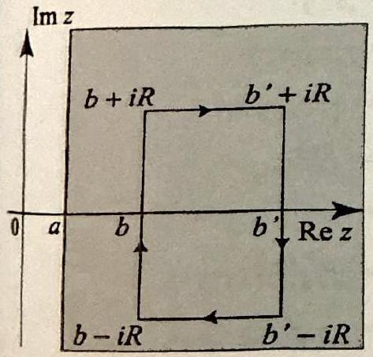
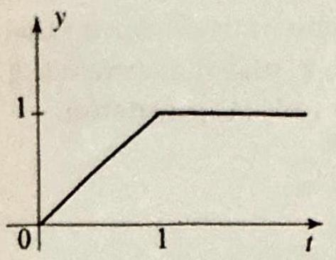
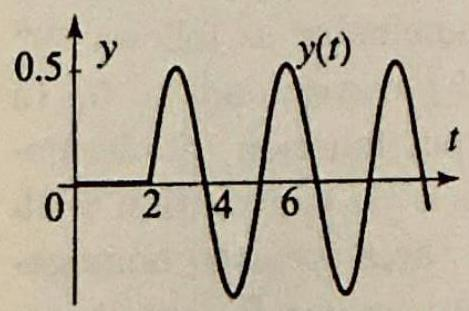
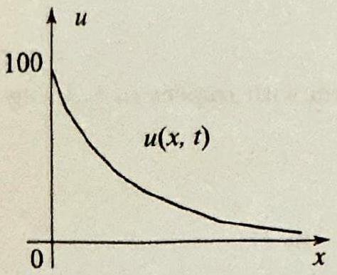
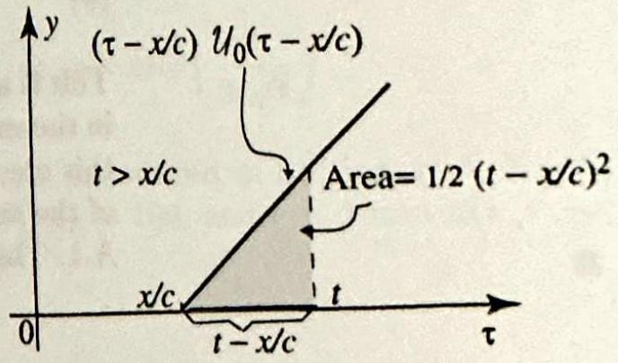
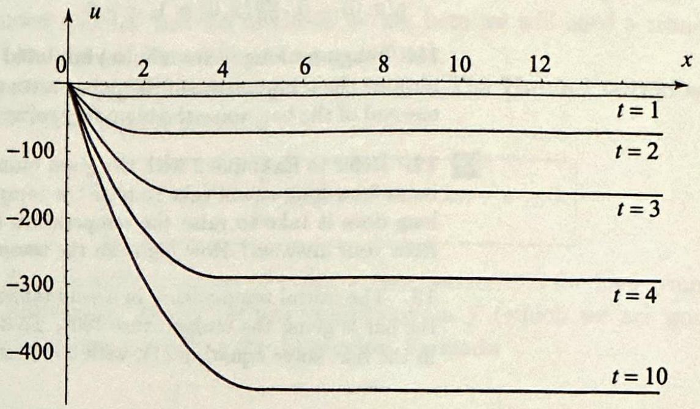
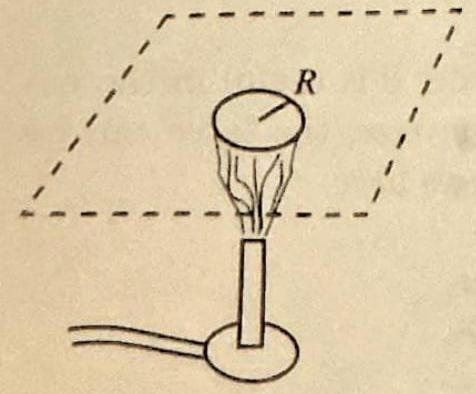

<!-- Page 1 -->

Left margin note (page 1)

Topics to Review Soctions 12.1 and 12.2 c hasic properties of the ransform and are selfThe applications of the transform to partial $d$ equations are presente tion 12.3 and assume a ity with related bound problems for the heat equations that have bee earlier in the book. Se develops the Hankel and requires some kno the basic properties functions from Sections 9.7. The applications in tion are also related t ary value problems treat ously.

Looking Ahead This chapter adds to t sity of problems and apt that we have treated With it we complete t ment of the standard walue problems that ari classical areas of heat co and wave motion. Th who has encountered the tansform in a course in differential equations w bere fulfilling, next to th transform, a major rol solution of boundary val lems for partial different lions. And those of lave enjoyed Bessel func see them again here at of the definition of yet ipportant transform, th transform.

++++

12

THE LAPLACE AND HANKEL TRANSFORMS WITH APPLICATIONS

Should I refuse a good dinner simply because I do not understand th process of digestion?
-Oliver Heavisio
[Criticized for using formal mathematical manipulations, without ur derstanding how they worked.]

In the previous chapter we introduced the Fourier transform and the Fourier sine and cosine transforms and showed their utility in solv ing various boundary value problems for partial differential equation on unbounded domains. The problems to which these transforms applied were typically treated in Cartesian coordinates. Another transform that can frequently be applied with success is the Laplace transform, our first topic in this chapter. If one of the variables occurring in a problem ranges over a half-line $[0, \infty)$, we can often make progress by performing a Laplace transform with respect to this variable, in much the same way that we did with the sine and cosine transforms. Because of the importance of this transform in other settings, we present a self-contained treatment, including the solution of initial value problems for ordinary differential equations. For problems with other than Cartesian geometry, there are yet other transforms that are more natural and therefore more useful. For example, in unbounded problems with radial symmetry in either the plane or the space, so that the appropriate coordinates are polar, cylindrical, or spherical, the natural transform for the radial variable ( $r$ or $\rho$ ) involves Bessel functions. This transform, which depends on the order $\nu$ of the Bessel function involved, is known as the Hankel transform of order $\nu$.

---

<!-- Page 2 -->

Left margin note (page 2)

760
Chapter 12
12.1
The L

As a convention, $f, g, \ldots$ are define and their transform are defined on the

THE
EXISTENCE
L
TRA

Right margin note (page 2)

$\stackrel{\circ}{\Omega}$
중 풀
§ or of
on हू है

++++

The Laplace and Hankel Transforms with Applications

aplace Transform
In this section we present the definition and basic properties of the Lapla transform. As a warm-up for the applications with partial differential equ tions, we will use it to solve some simple ordinary differential equations.

Suppose that $f(t)$ is defined for all $t \geq 0$. The Laplace transform $f$ is the function
functions

for $t \geq 0$
s $F, G, \ldots$
(1)
$$
\mathcal{L}(f)(s)=\int_{0}^{\infty} f(t) e^{-s t} d t
$$

Another commonly used notation for $\mathcal{L}(f)(s)$ is $F(s)$. For the integral exist $f$ cannot grow faster than an exponential. This motivates the followi definition. We say that $f$ is of exponential order if there exist positi numbers $a$ and $M$ such that
$$
|f(t)| \leq M e^{a t} \text { for all } t \geq 0
$$

For example, the functions $1,4 \cos 2 t, 5 t \sin 2 t, e^{3 t}$ are all of exponent order. We can now give a sufficient condition for the existence of the Lapla transform.

OREM 1
OF THE
APLACE
NSFORM

Suppose that $f$ is piecewise continuous on the interval $(0, \infty)$ and of ex nential order with $|f(t)| \leq M^{\text {at }}$ for all $t \geq 0$. Then $\mathcal{L}(f)(s)$ exists for $s>a$.

Proof We have to show that for $s>a$
$$
\mathcal{L}(f)(s)=\int_{0}^{\infty} f(t) e^{-s t} d t<\infty
$$

With $M$ and $a$ as before, we have
$$
\begin{aligned}
\left|\int_{0}^{\infty} f(t) e^{-s t} d t\right| & \leq \int_{0}^{\infty}|f(t)| e^{-s t} d t \leq M \int_{0}^{\infty} e^{a t} e^{-s t} d t \\
& =M \int_{0}^{\infty} e^{-(s-a) t} d t=\frac{M}{s-a}<\infty
\end{aligned}
$$

Note that the function $\frac{1}{\sqrt{t}}$ is not of exponential order, because of its behav at $t=0$. However, we will show in Example 2 that its Laplace transfo $\mathcal{L}\left(\frac{1}{\sqrt{t}}\right)(s)$ exists for all $s>0$. Thus Theorem 1 provides sufficient but necessary conditions for the existence of the Laplace transform.

---

<!-- Page 3 -->

Section 12.1 The Laplace Transform
761

EXAMPLE $1 \mathcal{L}(1), \mathcal{L}(t)$, and $\mathcal{L}\left(e^{\alpha t}\right)$
We compute these transforms using (1). We have
$$
\begin{array}{c}
\mathcal{L}(1)(s)=\int_{0}^{\infty} e^{-s t} d t=-\left.\frac{1}{s} e^{-s t}\right|_{0} ^{\infty}=\frac{1}{s}, \quad s>0 \\
\mathcal{L}(t)(s)=\int_{0}^{\infty} t e^{-s t} d t=\left.\left(-\frac{t}{s} e^{-s t}-\frac{1}{s^{2}} e^{-s t}\right)\right|_{0} ^{\infty}=\frac{1}{s^{2}}, \quad s>0 ;
\end{array}
$$
and finally, for $s>\alpha$,
$$
\mathcal{L}\left(e^{\alpha t}\right)(s)=\int_{0}^{\infty} e^{-(s-\alpha) t} d t=-\left.\frac{1}{s-\alpha} e^{-(s-\alpha) t}\right|_{0} ^{\infty}=\frac{1}{s-\alpha}
$$

Note that $\mathcal{L}\left(e^{\alpha t}\right)(s)$ is not defined for $s \leq \alpha$.
In computing $\mathcal{L}(t)$ we had to integrate by parts once. Similarly, we could compute $\mathcal{L}\left(t^{n}\right)$ ( $n$ a positive integer) by integrating by parts $n$ times. Rather than doing this, we shall take advantage of an interesting connection between the Laplace transform and the gamma function.

EXAMPLE $2 \mathcal{L}\left(t^{a}\right)$ via the gamma function
(a) Evaluate $\mathcal{L}\left(t^{a}\right)(s)$ when $a>-1$ and $s>0$.
(b) Derive from (a) the transforms $\mathcal{L}(t), \mathcal{L}\left(t^{2}\right)$, and, more generally $\mathcal{L}\left(t^{n}\right)$, where $n$ is a positive integer.
(c) What is $\mathcal{L}\left(\frac{1}{\sqrt{t}}\right)$ ?

Solution (a) From (1) we have
$$
\mathcal{L}\left(t^{a}\right)(s)=\int_{0}^{\infty} t^{a} e^{-s t} d t
$$

To compare with the definition of the gamma function (Exercise 24, Section 4.3), we make the change of variables $s t=T, d t=\frac{1}{s} d T$. Then
$$
\begin{aligned}
\mathcal{L}\left(t^{a}\right)(s) & =\int_{0}^{\infty}\left(\frac{T}{s}\right)^{a} e^{-T} \frac{d T}{s}=\frac{1}{s^{a+1}} \underbrace{\int_{0}^{\infty} T^{a} e^{-T} d T}_{=\Gamma(a+1)} \\
& =\frac{\Gamma(a+1)}{s^{a+1}}
\end{aligned}
$$
(b) Using (a),
$$
\begin{aligned}
\mathcal{L}(t) & =\frac{\Gamma(2)}{s^{2}}=\frac{1}{s^{2}} \\
\mathcal{L}\left(t^{2}\right) & =\frac{\Gamma(3)}{s^{3}}=\frac{2}{s^{3}}
\end{aligned}
$$
and, more generally,
$$
\mathcal{L}\left(t^{n}\right)=\frac{\Gamma(n+1)}{s^{n+1}}=\frac{n!}{s^{n+1}} .
$$

---

<!-- Page 4 -->

Left margin note (page 4)

762
Chapter 12
THEO
LINE.

Right margin note (page 4)

Teen

++++

he Laplace and Hankel Transforms with Applications
(c) Using (a), and Exercise 25(a), Section 4.3,
$$
\mathcal{L}\left(\frac{1}{\sqrt{t}}\right)=\mathcal{L}\left(t^{-1 / 2}\right)=\frac{\Gamma(1 / 2)}{s^{1 / 2}}=\sqrt{\frac{\pi}{s}}
$$

Operational Properties
We will derive in the rest of this section properties of the Laplace trans form that will assist us in solving differential equations. We are particu larly interested in those formulas involving a function, its transform, anc the transform of its derivatives. These formulas are similar to the opera tional properties of the Fourier transform. Because the Laplace transform is defined by an integral over the interval $[0, \infty)$, some of the formulas wil involve the values of the function and its derivatives at 0 .

REM 2
ARITY

If $f$ and $g$ are functions and $\alpha$ and $\beta$ are numbers, then
$$
\mathcal{L}(\alpha f+\beta g)=\alpha \mathcal{L}(f)+\beta \mathcal{L}(g)
$$

The proof is left as an exercise. You should also think about the domain o definition of $\mathcal{L}(\alpha f+\beta g)$ in terms of the domains of definition of $\mathcal{L}(f)$ an $\mathcal{L}(g)$.

EXAMPLE $3 \mathcal{L}(\cos k t)$ and $\mathcal{L}(\sin k t)$
These transforms can be evaluated directly by using (1). Our derivation will b based on Euler's identity $e^{i k t}=\cos k t+i \sin k t$ and the linearity of the Lapla transform. We have
$$
\begin{aligned}
\mathcal{L}(\cos k t)+i \mathcal{L}(\sin k t) & =\int_{0}^{\infty}(\cos k t+i \sin k t) e^{-s t} d t \\
& =\int_{0}^{\infty} e^{-t(s-i k)} d t=-\left.\frac{e^{-t(s-i k)}}{s-i k}\right|_{0} ^{\infty}=\frac{1}{s-i k} \\
& =\frac{s+i k}{s^{2}+k^{2}}=\frac{s}{s^{2}+k^{2}}+i \frac{k}{s^{2}+k^{2}}
\end{aligned}
$$

Equating real and imaginary parts, we get
$$
\mathcal{L}(\cos k t)=\frac{s}{s^{2}+k^{2}} \quad \text { and } \quad \mathcal{L}(\sin k t)=\frac{k}{s^{2}+k^{2}}
$$

The next result is very useful. It states that the Laplace transform ta derivatives into powers of $s$.

---

<!-- Page 5 -->

Left margin note (page 5)

THEOREM 3
LAPLACE TRANSFORMS OF DERIVATIVES

THEOREM 4
DERIVATIVES OF TRANSFORMS

++++

Section 12.1 The Laplace Transform
763
(i) Suppose that $f$ is continuous on $[0, \infty)$ and of exponential order as in (2). Suppose further that $f^{\prime}$ is piecewise continuous on $[0, \infty)$ and of exponential order. Then
(3)
$$
\mathcal{L}\left(f^{\prime}\right)=s \mathcal{L}(f)-f(0)
$$
(ii) More generally, if $f, f^{\prime}, \ldots, f^{(n-1)}$ are continuous on $[0, \infty)$ and of exponential order as in (2), and $f^{(n)}$ is piecewise continuous on $[0, \infty)$ and of exponential order, then
$$
\mathcal{L}\left(f^{(n)}\right)=s^{n} \mathcal{L}(f)-s^{n-1} f(0)-s^{n-2} f^{\prime}(0)-\cdots-f^{(n-1)}(0)
$$

Proof Since $f$ is of exponential order, then (2) holds for some positive constants $a$ and $M$. The transform $\mathcal{L}\left(f^{\prime}\right)(s)$ is to be computed for $s>a$. Before we start the computation, note that for $s>a$
$$
\lim _{t \rightarrow \infty}|f(t)| e^{-s t}=\lim _{t \rightarrow \infty} \underbrace{|f(t)|}_{\leq M e^{a t}} e^{-a t} e^{-(s-a) t} \leq M \lim _{t \rightarrow \infty} e^{-(s-a) t}=0,
$$
because $s-a>0$. We now compute, using (1) and integrating by parts,
$$
\begin{aligned}
\mathcal{L}\left(f^{\prime}\right)(s) & =\int_{0}^{\infty} f^{\prime}(t) e^{-s t} d t \quad(s>a) \\
& =\left.f(t) e^{-s t}\right|_{0} ^{\infty}-(-s) \underbrace{\int_{0}^{\infty} f(t) e^{-s t} d t}_{\mathcal{L}(f)(s)} \\
& =-f(0)+s \mathcal{L}(f),
\end{aligned}
$$
which proves (i). Part (ii) follows by repeated applications of (i).

When $n=2$, (4) gives
(5)
$$
\mathcal{L}\left(f^{\prime \prime}\right)=s^{2} \mathcal{L}(f)-s f(0)-f^{\prime}(0)
$$

The following is a counterpart of Theorem 3 showing that the Laplace transform takes powers of $t$ into derivatives.
(i) Suppose $f(t)$ is piecewise continuous and of exponential order. Then
(6)
$$
\mathcal{L}(t f(t))(s)=-\frac{d}{d s} \mathcal{L}(f)(s)
$$
(ii) In general, if $f(t)$ is piecewise continuous and of exponential order, then
$$
\mathcal{L}\left(t^{n} f(t)\right)=(-1)^{n} \frac{d^{n}}{d s^{n}} \mathcal{L}(f)(s)
$$

---

<!-- Page 6 -->

Left margin note (page 6)

764
Chapter 12

THE SHIFTING

Right margin note (page 6)

ed
$\alpha t$
ry
xis
as
ced
We

1,
$F$, by

++++

The Laplace and Hankel Transforms with Applications
Proof Differentiation under the integral sign gives
$$
\begin{aligned}
|\mathcal{L}(f)|^{\prime}(s) & =\frac{d}{d s} \int_{0}^{\infty} f(t) e^{-s t} d t=\int_{0}^{\infty} f(t) \frac{d}{d s} e^{-s t} d t \\
& =-\int_{0}^{\infty} t f(t) e^{-s t} d t=-\mathcal{L}(t f(t))(s)
\end{aligned}
$$
and (i) follows upon multiplying both sides by -1 . Part (ii) is obtained by repeat applications of (i).

EXAMPLE 4 Derivatives of transforms
(a) Evaluate $\mathcal{L}(t \sin 2 t)$.
(b) Evaluate $\mathcal{L}\left(t^{2} \sin t\right)$.

Solution (a) Using (6) and Example 3, we find
$$
\mathcal{L}(t \sin 2 t)=-\frac{d}{d s} \frac{2}{s^{2}+4}=\frac{4 s}{\left(s^{2}+4\right)^{2}}
$$
(b) Similarly, using (7) and Example 3, we find
$$
\mathcal{L}\left(t^{2} \sin t\right)=\frac{d^{2}}{d s^{2}} \frac{1}{s^{2}+1}=\frac{2\left(-1+3 s^{2}\right)}{\left(s^{2}+1\right)^{3}}
$$

The following theorem states that multiplication of a function by causes the transform to be shifted by $\alpha$ units on the $s$-axis. This ve important property has a counterpart which involves a shift on the $t$-as (see Theorem 1, Section 12.2).

OREM 5 ON THE $\boldsymbol{s}$-AXIS

Suppose that $f$ is of exponential order. Let $\alpha$ be a real number and $a$ be in (2). For $s>a+\alpha$, we have
$$
\mathcal{L}\left(e^{\alpha t} f(t)\right)(s)=F(s-\alpha)
$$
where $F(s)=\mathcal{L}(f(t))(s)$.
Proof Note that $e^{a t} f(t)$ is also of exponential order and (2) holds with $a$ repla by $a+\alpha$. Thus Theorem 1 guarantees the existence of $\mathcal{L}\left(e^{\alpha t} f(t)\right.$ for $s>a+\alpha$. have
$$
\mathcal{L}\left(e^{\alpha t} f(t)\right)(s)=\int_{0}^{\infty} f(t) e^{\alpha t} e^{-s t} d t=\int_{0}^{\infty} f(t) e^{-(s-\alpha) t} d t=F(s-\alpha)
$$

Taking $f=1$ in Theorem 5, we obtain the third transform in Example $\mathcal{L}\left(e^{\alpha t}\right)=\frac{1}{s-\alpha}$, since $\mathcal{L}(1)=\frac{1}{s}$.
The Inverse Laplace Transform
Given a function $F(s)$, if we can find a function $f(t)$ such that $\mathcal{L}(f)=$ we will call $f(t)$ the inverse Laplace transform of $F(s)$ and denote it
$$
f(t)=\mathcal{L}^{-1}(F(s)) \quad \text { or simply } \quad f=\mathcal{L}^{-1}(F)
$$

---

<!-- Page 7 -->

Section 12.1 The Laplace Transform
765

We will use the Laplace transform as a tool to solve differential equations, just like we used the Fourier transform. The method will consist of applying the Laplace transform to a problem, solving the transformed problem, and then taking the inverse of the Laplace transform to find the solution of the original problem. This process assumes that an inverse exists and that it is unique. Indeed, just like the Fourier transform has an inverse transform, the Laplace transform has an inverse. The formula involves integration in the complex plane and requires a certain amount of complex analysis. We will present it at the end of the section; for now we will take the uniqueness of the inverse transform for granted and compute the inverse transform by using known Laplace transforms, as illustrated by the following examples. We note that the inverse of any linear transform is itself linear. In particular, we have
$$
\mathcal{L}^{-1}(\alpha F+\beta G)=\alpha \mathcal{L}^{-1}(F)+\beta \mathcal{L}^{-1}(G)
$$

EXAMPLE 5 Inverse Laplace transforms
(a) Evaluate $\mathcal{L}^{-1}\left(\frac{2}{4+(s-1)^{2}}\right)$.
(b) Evaluate $\mathcal{L}^{-1}\left(\frac{1}{s^{2}+2 s+3}\right)$.

Solution (a) From the table of Laplace transforms, Appendix B. 4 (or by using Example 3 and Theorem 5), we find that
$$
\mathcal{L}\left(e^{a t} \sin k t\right)=\frac{k}{(s-a)^{2}+k^{2}}
$$

Taking $a=1$ and $k=2$, we get
$$
\mathcal{L}\left(e^{t} \sin 2 t\right)=\frac{2}{(s-1)^{2}+4}
$$

Hence
$$
\mathcal{L}^{-1}\left(\frac{2}{4+(s-1)^{2}}\right)=e^{t} \sin 2 t
$$
(b) Motivated by part (a), we first write
$$
\frac{1}{s^{2}+2 s+3}=\frac{1}{(s+1)^{2}+(\sqrt{2})^{2}}=\frac{1}{\sqrt{2}} \frac{\sqrt{2}}{(s+1)^{2}+(\sqrt{2})^{2}}
$$

Now using the transform in (a) with $a=-1$ and $k=\sqrt{2}$, we get
$$
\mathcal{L}^{-1}\left(\frac{1}{s^{2}+2 s+3}\right)=\frac{1}{\sqrt{2}} \mathcal{L}^{-1}\left(\frac{\sqrt{2}}{(s+1)^{2}+(\sqrt{2})^{2}}\right)=\frac{1}{\sqrt{2}} e^{-t} \sin \sqrt{2} t
$$

---

<!-- Page 8 -->

Left margin note (page 8)

766
Chapter 12

Right margin note (page 8)

ON O C TCO

++++

The Laplace and Hankel Transforms with Applications

EXAMPLE 6 Partial fractions
Evaluate $\mathcal{L}^{-1}\left(\frac{1}{s^{2}+2 s-3}\right)$.
Solution First Method We can compute as we did in Example 5(b). First write
$$
\frac{1}{s^{2}+2 s-3}=\frac{1}{(s+1)^{2}-2^{2}}=\frac{1}{2} \frac{2}{(s+1)^{2}-2^{2}}
$$

From the table of Laplace transforms, Appendix B.A, we have
$$
\mathcal{L}\left(e^{a t} \sinh k t\right)=\frac{k}{(s-a)^{2}-k^{2}}
$$

Taking $a=-1$ and $k=2$, it follows that
$$
\mathcal{L}^{-1}\left(\frac{1}{s^{2}+2 s-3}\right)=\frac{1}{2} \mathcal{L}^{-1}\left(\frac{2}{(s+1)^{2}-2^{2}}\right)=\frac{1}{2} e^{-t} \sinh 2 t .
$$

Second Method Partial fractions are useful in evaluating inverse Laplace trans forms of rational functions. To apply this method, we first factor the denominato as $s^{2}+2 s-3=(s+3)(s-1)$. Now write
$$
\frac{1}{(s+3)(s-1)}=\frac{A}{(s+3)}+\frac{B}{(s-1)}
$$
so that
$$
1=A(s-1)+B(s+3)
$$

Setting $s=1$ and then $s=-3$ yields $B=\frac{1}{4}$ and $A=-\frac{1}{4}$, respectively. Thus
$$
\mathcal{L}^{-1}\left(\frac{1}{s^{2}+2 s-3}\right)=-\frac{1}{4} \mathcal{L}^{-1}\left(\frac{1}{s+3}\right)+\frac{1}{4} \mathcal{L}^{-1}\left(\frac{1}{s-1}\right)=-\frac{1}{4} e^{-3 t}+\frac{1}{4} e^{t}
$$

It is easy to see that this transform is also equal to $\frac{1}{2} e^{-t} \sinh 2 t$, matching our earlie finding.
Laplace Transform and Differential Equations
The key to solving differential equations via the Laplace transform meth is to use the operational properties, particularly those related to different ation. We begin with a simple initial value problem. In what follows, will denote the Laplace transform of $y(t)$ by $Y(s)$.

EXAMPLE 7 Solving a differential equation with the Laplace tran form: Solve $y^{\prime \prime}+y=2, \quad y(0)=0, y^{\prime}(0)=1$.
Solution Taking the Laplace transform of both sides of the equation and usi Theorem 3, we find
$$
s^{2} Y-s y(0)-y^{\prime}(0)+Y=\mathcal{L}(2)=\frac{2}{s}
$$

Using the initial conditions, we obtain
$$
\begin{array}{l}
\left(s^{2}+1\right) Y-1=\frac{2}{s} \\
Y=\frac{1}{s^{2}+1}+\frac{2}{s\left(s^{2}+1\right)}
\end{array}
$$

---

<!-- Page 9 -->

Right margin note (page 9)

$8804$

++++

Section 12.1 The Laplace Transform
767

Using partial fractions on the second term, we find
$$
Y=\frac{1}{s^{2}+1}+\frac{2}{s}-\frac{2 s}{s^{2}+1}
$$

Finally, taking the inverse Laplace transform, we get
$$
y=\sin t+2-2 \cos t .
$$

This example is a typical illustration of the Laplace transform method. Starting from a linear ordinary differential equation with constant coefficients in $y$, the Laplace transform produces an algebraic equation that can be solved for $Y$. The solution $y$ is then found by taking the inverse Laplace transform of $Y$. The Laplace transform method is most compatible with initial value problems where the initial data is given at $t=0$, due to the way the transform acts on derivatives. If the initial data is given at some other value $t_{0}$, the Laplace transform still applies: We simply make the change of variables $\tau=t-t_{0}$. The next example illustrates this process.

EXAMPLE 8 Shifting the time variable
Solve $y^{\prime \prime}+2 y^{\prime}+y=t, \quad y(1)=0, y^{\prime}(1)=0$.
Solution Making the change of variables $\tau=t-1$, we arrive at the initial value problem
$$
y^{\prime \prime}+2 y^{\prime}+y=\tau+1, \quad y(0)=0, \quad y^{\prime}(0)=0,
$$
where now a prime denotes differentiation with respect to $\tau$. From this point, we proceed as in Example 7. Transforming yields
$$
\begin{array}{c}
s^{2} Y+2 s Y+Y=\frac{1}{s^{2}}+\frac{1}{s} \\
Y=\frac{1}{s^{2}(s+1)}
\end{array}
$$

Using partial fractions, we get
$$
Y=\frac{1}{s+1}-\frac{1}{s}+\frac{1}{s^{2}}
$$

Taking the inverse Laplace transform, we arrive at
$$
y=e^{-\tau}-1+\tau
$$

Hence the solution is $y(t)=e^{1-t}+t-2$.
Recall from Section 11.2 an interesting way to compute the Fourier tran form of $e^{-a x^{2}}$ was to take an indirect approach and consider a differenti equation that is satisfied by $e^{-a x^{2}}$. These ideas work also with the Lapla transform, as we now illustrate by giving a simple derivation of the Lapla transform of $\cos k x$.

---

<!-- Page 10 -->

Left margin note (page 10)

768
Chapter 12

Figure 1 Since $k$ and bounded an from the line $\operatorname{Re} z=$ tance to this line is all $z$ in $K, \operatorname{Re} z>$
$$
\left|f(z) e^{-z t}\right| \leq M
$$

++++

he Laplace and Hankel Transforms with Applications

EXAMPLE 9 Using differential equations to compute transforms
The function $y=\cos k x$ is the unique solution of the initial value problem
$$
y^{\prime \prime}+k^{2} y=0, y(0)=1, y^{\prime}(0)=0 .
$$

Transforming this problem with the Laplace transform, we find that
$$
s^{2} Y-s+k^{2} Y=0 \quad \Rightarrow \quad Y=\frac{s}{s^{2}+k^{2}},
$$
which gives the Laplace transform of $\cos k x$. Knowing the transform of $\cos k x$, w can get the transform of $\sin k x$ quite easily. Note that $y=\sin k x$ is the uniqu solution of the initial value problem $y^{\prime}=k \cos k x$ and $y(0)=0$. Transforming thi first order initial value problem with the Laplace transform, we find that
$$
s Y=\mathcal{L}(k \cos k x) \Rightarrow s Y=\frac{k s}{s^{2}+k^{2}} \Rightarrow Y=\frac{k}{s^{2}+k^{2}},
$$
which gives the Laplace transform of $\sin k x$.
We end this section by deriving a formula for the inverse Laplace trans form.
A Formula for the Inverse Laplace Transform
To describe the inverse of the Laplace transform, we will first extenc the transform to complex numbers as follows. Suppose that $f$ is piecewis smooth and of exponential order with $|f(t)| \leq M e^{a t}$ for all $t \geq 0(a>0)$

$>a+\delta$ For a complex number $z$ in the right half-plane, $\operatorname{Re} z>a$, define
$$
\mathcal{L}(f)(z)=\int_{0}^{\infty} f(t) e^{-z t} d t
$$

When $z$ is real, this definition reduces to (1). Also, for $\operatorname{Re} z>a$ (sa) $\operatorname{Re} z=a+\epsilon, \epsilon>0$ ) and all $t \geq 0$, we have
$$
\left|f(t) e^{-z t}\right| \leq M e^{a t}\left|e^{-\operatorname{Re}(z) t}\right| \leq M e^{a t} e^{-(a+\epsilon) t} \leq M e^{-\epsilon t},
$$
is closed d disjoint $=a$, its dis$\delta>0$. For $a+\delta$; so
$$
\left(e^{a t} e^{-t \operatorname{Re} z}\right.
$$
and so the integral in (8) exists. We next argue that $\mathcal{L}(f)(z)$ is analytic i the half-plane $\operatorname{Re} z>a$. To simplify the proof, we will further suppose tha $f$ is continuous on $[0, \infty)$. Write
$$
\mathcal{L}(f)(z)=\int_{0}^{\infty} f(t) e^{-z t} d t=\sum_{n=0}^{\infty} \int_{n}^{n+1} f(t) e^{-z t} d t
$$

Each term in the sum is analytic, by Theorem 4, Section 3.5 (differentiatio under the integral sign). Moreover, if $K$ is a closed and bounded subset the half-plane $\operatorname{Re} z>a$, then there is a $\delta>0$ such that $\left|f(t) e^{-z t}\right| \leq M e^{-t}$ for all $z$ in $K$ and all $t$ (see Figure 1). Hence, for all $z$ in $K$ and all $t$,
$$
\left|\int_{n}^{n+1} f(t) e^{-z t} d t\right| \leq M \int_{n}^{n+1} e^{-\delta t} d t=\frac{M}{\delta}\left(e^{-n \delta}-e^{-(n+1) \delta}\right)=M_{n}
$$

---

<!-- Page 11 -->

Left margin note (page 11)

Figure 2

++++

Section 12.1 The Laplace Transform
769

Since $\sum_{n=0}^{\infty} M_{n}<\infty$, it follows from the Weierstrass $M$-test that the series in (9) converges uniformly for all $z$ in $K$. From Corollary 2, Section 4.2, we conclude that $\mathcal{L}(f)(z)$ is analytic in the half-plane $\operatorname{Re} z>a$.

We now proceed to invert the Laplace transform by appealing to the inverse Fourier transform. Pick $b>a$, and define $g(t)=e^{-b t} f(t)$ if $t \geq 0$ and $g(t)=0$ if $t<0$. Then because $f$ is piecewise smooth and of exponential order with $a<b$, it follows that $g$ is integrable and piecewise smooth on the real line, and so we may apply the inverse Fourier transform (Theorem 1, Section 11.1). Using $g(t)=0$ for $t<0$, we have the Fourier transform
$$
\widehat{g}(\omega)=\frac{1}{\sqrt{2 \pi}} \int_{0}^{\infty} e^{-b t} f(t) e^{-i \omega t} d t=\frac{1}{\sqrt{2 \pi}} \mathcal{L}(f)(b+i \omega)
$$
and the inverse Fourier transform
$$
g(t)=\lim _{R \rightarrow \infty} \frac{1}{\sqrt{2 \pi}} \int_{-R}^{R} \widehat{g}(\omega) e^{i \omega t} d \omega=\lim _{R \rightarrow \infty} \frac{1}{2 \pi} \int_{-R}^{R} \mathcal{L}(f)(b+i \omega) e^{i \omega t} d \omega,
$$
where the left side in (11) should be interpreted as the average of $g$ at the points of discontinuity. Making the change of variables $z=b+i \omega, d z=i d \omega$, and recalling that $g(t)=e^{-b t} f(t)$, we get
$$
e^{-b t} f(t)=\lim _{R \rightarrow \infty} \frac{e^{-b t}}{2 \pi i} \int_{b-i R}^{b+i R} \mathcal{L}(f)(z) e^{-z t} d z
$$
where the integral is over the vertical line segment from $b-i R$ to $b+ i R$. Simplifying, and replacing $f$ by its average to account for the possible discontinuities, we obtain the inversion formula for the Laplace transform:
$$
\frac{f(t+)+f(t-)}{2}=\lim _{R \rightarrow \infty} \frac{1}{2 \pi i} \int_{b-i R}^{b+i R} \mathcal{L}(f)(z) e^{-z t} d z
$$

Note that the integral is independent of the choice of $b$ as long as $b>a$. To see this, given any two vertical line segments, we can close the contour as in Figure 2. The integral over the closed contour is 0 by Cauchy's theorem. A straightforward estimate on the integrand shows that the integrals over the horizontal sides tend to zero as $R \rightarrow \infty$. This implies that
$$
\lim _{R \rightarrow \infty} \frac{1}{2 \pi i} \int_{b-i R}^{b+i R} \mathcal{L}(f)(z) e^{-z t} d z=\lim _{R \rightarrow \infty} \frac{1}{2 \pi i} \int_{b^{\prime}-i R}^{b^{\prime}+i R} \mathcal{L}(f)(z) e^{-z t} d z
$$
as claimed. One important consequence of (13) is the uniqueness of the inverse Laplace transform. Since this inverse is given by an integral, any two inverses must be equal to the integral and thus must be the same.

---

<!-- Page 12 -->

Left margin note (page 12)

770 Chapter 12

Right margin note (page 12)

$$
\exists
$$

$\overline{7}$
s

++++

The Laplace and Hankel Transforms with Applications
Exercises 12.1
In Erencises 1-6, show that the given function is of exponential order by establish:
(2) with an appropriate choice of the numbers $a$ and $M$.
1. $f(t)=11 \cos 3 t$.
2. $f(t)=\sin 2 t+3 \cos t$.
3. $f(t)=5 e^{3 t}$.
4. $f(t)=t^{n}$.
5. $f(t)=\sinh 3 t$.
6. $f(t)=e^{5 t} \sinh t$

In Exercises $7-24$, evaluate the Laplace transform of the given function using a propriate theorems and examples from this section.
7. $f(t)=2 t+3$.
8. $f(t)=t^{2}+3 t^{4}$.
9. $f(t)=\sqrt{t}+\frac{1}{\sqrt{t}}$.
10. $f(t)=t^{2}+3 t+t^{3 / 2}$.
11. $f(t)=t^{2} e^{3 t}$.
12. $f(t)=t^{4} e^{-3 t}+e^{t}$.
13. $f(t)=t \sin 4 t$.
14. $f(t)=t^{2} \cos 2 t$.
15. $f(t)=\sin ^{2} t$.
16. $f(t)=\cos t \sin t$.
17. $f(t)=e^{2 t} \sin 3 t$.
18. $f(t)=t \sinh 3 t$.
19. $f(t)=t e^{-t} \sin t$.
20. $f(t)=e^{t+1} \cos t$.
21. $f(t)=(t+2)^{2} \cos t$.
22. $f(t)=e^{\alpha t} t^{3 / 2}$.
23. $f(t)=e^{\alpha t} \sin \beta t$.
24. $f(t)=e^{\alpha t} \cos \beta t$.

In Exercises 25-38, evaluate the inverse Laplace transform of the given function
25. $F(s)=\frac{1}{s^{2}}$.
26. $F(s)=\frac{1}{s^{2}-2}$.
27. $F(s)=\frac{4}{3 s^{2}+1}$.
28. $F(s)=\frac{1}{(s-1)^{2}-2}$.
29. $F(s)=\frac{1}{(s-3)^{5}}+\frac{s-3}{1+(s-3)^{2}}$.
30. $F(s)=\frac{1}{(s-1)(s+1)}$.
31. $F(s)=\frac{s}{s^{2}+2 s+1}$.
32. $F(s)=\frac{3 s+1}{s^{2}-2 s}$.
33. $F(s)=\frac{2 s-1}{s^{2}-s-2}$.
34. $F(s)=\frac{s-1}{(s+1)\left(s^{2}+1\right)}$.
35. $F(s)=\frac{5 s^{2}+2 s-4}{2 s\left(s^{2}+s-2\right)}$.
36. $F(s)=\frac{s^{2}+s+3}{(s+2)\left(s^{2}+1\right)}$.
37. $F(s)=\frac{1}{s^{2}+3 s+2}$.
38. $F(s)=\frac{s}{s^{2}+3 s+2}$.

In Exercises 39-46, solve the given initial value problem with the Laplace transfo
39. $y^{\prime}+y=\cos 2 t, \quad y(0)=-2$.
40. $y^{\prime}+2 y=6 e^{\alpha t}, \quad y(0)=1, \alpha$ is a constant.
41. $y^{\prime \prime}+y=\cos t, \quad y(\pi)=0, y^{\prime}(\pi)=0$.
42. $y^{\prime \prime}-y=1+t^{2}, \quad y(1)=0, y^{\prime}(1)=1$.
43. $y^{\prime \prime}+2 y^{\prime}+y=t e^{-2 t}, \quad y(0)=1, y^{\prime}(0)=1$.
44. $y^{\prime \prime}+y^{\prime}+4 y=0, \quad y(0)=1, y^{\prime}(0)=1$.
45. $y^{\prime \prime}-y^{\prime}-6 y=e^{t} \cos t, \quad y(0)=0, y^{\prime}(0)=1$.
46. $y^{\prime \prime}+4 y^{\prime}+5 y=t^{2}, \quad y(0)=0, y^{\prime}(0)=1$.

---

<!-- Page 13 -->

Left margin note (page 13)

12.2 Further Pro

Figure 1 Unit step functio

THEOREM
SHIFTING ON TH $\boldsymbol{t}$-AXI

Figure 2 The function in E atriple 1.

++++

Section 12.2 Further Properties of the Laplace Transform
771

pperties of the Laplace Transform
We continue our study of the Laplace transform and start by computing the transform of special functions that arise naturally in studying operational properties of the transform. Recall the Heaviside unit step function
$$
\mathcal{U}_{a}(t)=\mathcal{U}_{0}(t-a)=\left\{\begin{array}{ll}
0 & \text { if } t<a \\
1 & \text { if } t \geq a
\end{array}\right.
$$
(Figure 1). Given a function $f(t)$, consider the product $\mathcal{U}_{0}(t-a) f(t-a)$. Written explicitly, we have
$$
\mathcal{U}_{0}(t-a) f(t-a)=\left\{\begin{array}{ll}
0 & \text { if } t<a \\
f(t-a) & \text { if } t \geq a
\end{array}\right.
$$

Thus, if $f(t)$ represents, say a message, then $\mathcal{U}_{0}(t-a) f(t-a)$ represents the same message, but delayed by $a$ units of time.
1
E
S

If $a$ is a positive real number, then
$$
\mathcal{L}\left(\mathcal{U}_{0}(t-a) f(t-a)\right)(s)=e^{-a s} F(s)
$$
where $F(s)=\mathcal{L}(f(t))(s)$.
Proof We have
$$
\begin{aligned}
\mathcal{L}\left(\mathcal{U}_{0}(t-a) f(t-a)\right)(s) & =\int_{a}^{\infty} f(t-a) e^{-s t} d t \\
& =\int_{0}^{\infty} f(T) e^{-s(T+a)} d T \quad(\text { where } t-a=T, d t=d T) \\
& =e^{-a s} \int_{0}^{\infty} f(T) e^{-s T} d T=e^{-a s} F(s)
\end{aligned}
$$

EXAMPLE 1 Transforms involving unit step functions
(a) Evaluate $\mathcal{L}\left(\mathcal{U}_{0}(t-a)\right)$.
(b) Evaluate $\mathcal{L}(f(t))$, where
$$
f(t)=\left\{\begin{array}{ll}
2 & \text { if } 1 \leq t<4 \\
0 & \text { otherwise }
\end{array}\right.
$$
(see Figure 2).
Solution (a) Using Theorem 1 with $f(t)=1$, and Example 1 of the previous section, we find
$$
\mathcal{L}\left(\mathcal{U}_{0}(t-a)\right)=\frac{e^{-a s}}{s}, \quad s>0
$$
(b) Write $f(t)=2\left(\mathcal{U}_{0}(t-1)-\mathcal{U}_{0}(t-4)\right)$ (check it!). Then,
$$
\mathcal{L}(f(t))=2\left(\mathcal{L}\left(\mathcal{U}_{0}(t-1)\right)-\mathcal{L}\left(\mathcal{U}_{0}(t-4)\right)\right)=\frac{2}{s}\left(e^{-s}-e^{-4 s}\right), \quad s>0
$$

---

<!-- Page 14 -->

Left margin note (page 14)

772
Chapter 12

Figure 3 A ramp

Figure 4 Solutio ple 3.

++++

The Laplace and Hankel Transforms with Applications

EXAMPLE 2 A ramp function
Evaluate the Laplace transform of the ramp function shown in Figure 3.
Solution For $t>1$, we have $f(t)=U_{0}(t-1)$, and for $0 \leq t \leq 1$, we h $f(t)=t\left(U_{0}(t)-U_{0}(t-1)\right)$. We can combine these two formulas and simply wr
$$
f(t)=t\left(\mathcal{U}_{0}(t)-\mathcal{U}_{0}(t-1)\right)+\mathcal{U}_{0}(t-1) .
$$
(Check it!) We are not quite ready to apply Theorem 1. To be able to do so, rewrite $f(t)$ as follows
$$
f(t)=-(t-1) \mathcal{U}_{0}(t-1)+t \mathcal{U}_{0}(t)=-(t-1) \mathcal{U}_{0}(t-1)+t
$$

Now recall that $\mathcal{L}(t)=\frac{1}{s^{2}}$. Also, by Theorem $1, \mathcal{L}\left((t-1) \mathcal{U}_{0}(t-1)\right)=\frac{e^{-s}}{s^{2}}$. Her
$$
\mathcal{L}(f(t))=-\frac{e^{-s}}{s^{2}}+\frac{1}{s^{2}}
$$

In the next example we solve a nonhomogeneous differential equat involving a ramp function.

EXAMPLE 3 A nonhomogeneous differential equation
Solve $y^{\prime \prime}+y=f(t), y(0)=0, y^{\prime}(0)=0$, where $f(t)$ is as in Example 2.
Solution Taking the Laplace transform of both sides of the equation and us the result of Example 2, we find
$$
\begin{aligned}
s^{2} Y+Y & =\frac{1}{s^{2}}-\frac{e^{-s}}{s^{2}} \\
Y & =\frac{1-e^{-s}}{s^{2}\left(s^{2}+1\right)}
\end{aligned}
$$

Using partial fractions, or simply noticing that
$$
\frac{1}{s^{2}\left(s^{2}+1\right)}=\frac{1}{s^{2}}-\frac{1}{\left(s^{2}+1\right)}
$$
we obtain
$$
\begin{aligned}
Y & =\left(1-e^{-s}\right)\left(\frac{1}{s^{2}}-\frac{1}{s^{2}+1}\right) \\
& =\frac{1}{s^{2}}-\frac{1}{s^{2}+1}-e^{-s}\left(\frac{1}{s^{2}}-\frac{1}{s^{2}+1}\right)
\end{aligned}
$$

Taking the inverse Laplace transform, and using Theorem 1 for the term invol $e^{-s}$, we get
$$
y(t)=t-\sin t-\mathcal{U}_{0}(t-1)[(t-1)-\sin (t-1)] .
$$

Figure 4 shows that the solution is bounded for all $t$ and repeats periodicall $t>1$. The term $t-U_{0}(t-1)(t-1)$ that appears in the solution is precisely the 1 function (see Example 2). In particular, this term is equal to 1 for $t>1$. Thus $t>1$, the solution is a sum of two $2 \pi$-periodic sine waves and the function th identically 1. This explains the boundedness and the periodicity of the solutio $t>1$.

---

<!-- Page 15 -->

Left margin note (page 15)

Figure $5 f(t)$ in Example 4.

Figure 6 Solution in Exampie 4.

++++

Section 12.2 Further Properties of the Laplace Transform
773

Our next example involves a differential equation with a discontinuous term.

EXAMPLE 4 Discontinuous forcing term
Solve $y^{\prime \prime}+4 y=f(t), y(0)=1, y^{\prime}(0)=0$, where the forcing term $f(t)$ is as in Figure 5.
Solution The forcing term can be expressed as
$$
f(t)=1-\mathcal{U}_{0}(t-1) .
$$

Taking the Laplace transform of both sides of the equation, we get
$$
\begin{aligned}
s^{2} Y-s+4 Y & =\frac{1}{s}-\frac{e^{-s}}{s} \\
Y & =\frac{s}{s^{2}+4}+\frac{1-e^{-s}}{s\left(s^{2}+4\right)}
\end{aligned}
$$
and hence, using partial fractions,
$$
Y=\frac{s}{s^{2}+4}+\frac{1}{4}\left(1-e^{-s}\right)\left(\frac{1}{s}-\frac{s}{s^{2}+4}\right)
$$

Taking the inverse Laplace transform, and using Theorem 1 for the term involving $e^{-s}$, we get
$$
\begin{aligned}
y & =\cos 2 t+\frac{1}{4}(1-\cos 2 t)-\frac{1}{4} \mathcal{U}_{0}(t-1)[1-\cos 2(t-1)] \\
& =\frac{1}{4}+\frac{3}{4} \cos 2 t-\frac{1}{4} \mathcal{U}_{0}(t-1)[1-\cos 2(t-1)]
\end{aligned}
$$
(Figure 6). Note that even though the forcing term is discontinuous at $t=1$, the solution is continuous everywhere. A discontinuity at $t=1$ will appear in the graph of the second derivative of the solution, since $y^{\prime \prime}=f(t)-y$.

Convolutions and Laplace Transforms
Given two functions $f$ and $g$, defined for all $t \geq 0$, we define their convolution $f * g(t)$ by
$$
f * g(t)=\int_{0}^{t} f(t-\tau) g(\tau) d \tau \quad \text { for all } t \geq 0
$$

Clearly this definition is related to the definition of convolutions that we presented in Section 11.2. In fact, if we think of $f$ and $g$ as being defined for all $t$ with values 0 for $t<0$, then (2) becomes $\int_{-\infty}^{\infty} f(t-\tau) g(\tau) d \tau$, which differs by a constant multiple from the convolution that we introduced in Section 11.2. It should be clear from the context which convolution we are talking about, and so there is no risk of confusion in using the same

---

<!-- Page 16 -->

Left margin note (page 16)

774
Chapter 12

THEC
TRANSFOR CONVOLU

Right margin note (page 16)

in
ite are
ler;
in
ole
tion.)
□
cms

++++

The Laplace and Hankel Transforms with Applications

notation for the two different operations. In particular, all our discussion this section concerns the convolution (2) and not the one in Section 11.2

Note that since the convolution is defined by an integral over a fin interval, there is no problem in computing $f * g(t)$ if, say, $f$ and $g$ : piecewise continuous functions, no matter how fast they grow at infinity.

REM 2

Suppose that $f$ and $g$ are piecewise continuous and of exponential or then
$$
\mathcal{L}(f * g)=\mathcal{L}(f) \mathcal{L}(g) .
$$

Proof If we extend the functions $f$ and $g$ to be zero for $t<0$, then the integral
(2) is the same as
$$
\int_{0}^{\infty} f(t-\tau) g(\tau) d \tau
$$

Thus, throughout this proof, we assume that $f$ and $g$ are extended to the whe line with $f(t)=0$ and $g(t)=0$, for all $t<0$. We have
$$
\begin{aligned}
\mathcal{L}(f * g)(s) & =\int_{0}^{\infty} \int_{0}^{\infty} f(t-\tau) g(\tau) d \tau e^{-s t} d t \\
& =\int_{0}^{\infty} \int_{0}^{\infty} f(t-\tau) e^{-s t} d t g(\tau) d \tau \quad \text { (Interchange order of integra } \\
& =\int_{0}^{\infty} \int_{0}^{\infty} f(u) e^{-s(u+\tau)} d u g(\tau) d \tau \quad(u=t-\tau, d u=d t) \\
& =\int_{0}^{\infty} \int_{0}^{\infty} f(u) e^{-s u} d u g(\tau) e^{-s \tau} d \tau=\mathcal{L}(f)(s) \mathcal{L}(g)(s)
\end{aligned}
$$

EXAMPLE 5 Transforms involving convolutions
(a) Evaluate $\mathcal{L}\left(\int_{0}^{t}(t-\tau) \sin (\tau) d \tau\right)$.
(b) Evaluate $\mathcal{L}^{-1}\left(\frac{1}{s^{2}\left(s^{2}+4 s+5\right)}\right)$ using convolutions.

Solution (a) From Theorem 2, we have
$$
\mathcal{L}\left(\int_{0}^{t}(t-\tau) \sin \tau d \tau\right)=\mathcal{L}(t) \mathcal{L}(\sin t)=\frac{1}{s^{2}} \frac{1}{s^{2}+1}
$$
(b) Treat the expression $\frac{1}{s^{2}\left(s^{2}+4 s+5\right)}$ as a product of the two Laplace transfo $\frac{1}{s^{2}}$ and $\frac{1}{s^{2}+4 s+5}$. Since
$$
\mathcal{L}^{-1}\left(\frac{1}{s^{2}}\right)=t
$$
and
$$
\mathcal{L}^{-1}\left(\frac{1}{s^{2}+4 s+5}\right)=\mathcal{L}^{-1}\left(\frac{1}{\left.(s+2)^{2}+1\right)}\right)=e^{-2 t} \sin t
$$

---

<!-- Page 17 -->

Section 12.2 Further Properties of the Laplace Transform
775

it follows that
$$
\mathcal{L}^{-1}\left(\frac{1}{s^{2}\left(s^{2}+4 s+5\right)}\right)=t * e^{-2 t} \sin t=\int_{0}^{t}(t-\tau) e^{-2 \tau} \sin \tau d \tau
$$

The integral in $\tau$ can be computed explicitly, using integration by parts. As a result, we get
$$
\mathcal{L}^{-1}\left(\frac{1}{s^{2}\left(s^{2}+4 s+5\right)}\right)=\frac{1}{25}(5 t-4)+\frac{4}{25} e^{-2 t} \cos t+\frac{3}{25} e^{-2 t} \sin t
$$

EXAMPLE 6 Solving differential equations with convolutions Express the solution of the initial value problem
$$
y^{\prime \prime}-2 y^{\prime}+5 y=f(t), \quad y(0)=0, y^{\prime}(0)=0,
$$
as a convolution.
Solution Transforming the equation and then solving for $Y$, we find
$$
Y=\frac{F(s)}{s^{2}-2 s+5}
$$
where $F(s)$ is the Laplace transform of $f(t)$. We have
$$
\frac{1}{s^{2}-2 s+5}=\frac{1}{(s-1)^{2}+2^{2}}=\frac{1}{2} \frac{2}{(s-1)^{2}+2^{2}}
$$

Hence
$$
\mathcal{L}^{-1}\left(\frac{1}{2} \frac{2}{(s-1)^{2}+2^{2}}\right)=\frac{1}{2} e^{t} \sin 2 t
$$

Taking the inverse Laplace transform of $Y$, and using Theorem 2, we get
$$
y=\frac{1}{2} e^{t} \sin 2 t * f(t)=\frac{1}{2} \int_{0}^{t} e^{t-\tau} \sin 2(t-\tau) f(\tau) d \tau
$$

Example 6 shows that in solving the differential equation with zero initia data all nonhomogeneous terms are treated equally: we simply integrat $f(t)$ against $\frac{1}{2} e^{t-\tau} \sin 2(t-\tau)$ on the interval 0 to $t$. Note that the latte function is a translate of the inverse Laplace transform of $1 /\left(s^{2}-2 s+5\right.$ where the differential equation determines the denominator as follows: corresponds to $s^{2},-2 y^{\prime}$ corresponds to $-2 s$, and $5 y$ corresponds to 5 . other words, the response of the system to the input function (nonhom geneous term) $f(t)$ is always related to that function via convolution wi a "response function" that is determined solely by the associated homog neous differential equation. It is clear that this remark applies for any line nonhomogeneous differential equation, and it is therefore a general princip governing all such equations.

We close the section with examples that involve the Dirac delta functi and its translates. Recall from Section 11.2 the effect of integrating again

---

<!-- Page 18 -->

Left margin note (page 18)

776
Chapter 12

Figure 7 Solution ple 8.

Right margin note (page 18)

$2 \sim$

++++

The Laplace and Hankel Transforms with Applications

a Dirac delta is given by
$$
\int_{a}^{b} f(t) \delta_{0}\left(t-t_{0}\right) d t=\left\{\begin{array}{ll}
f\left(t_{0}\right) & \text { if } t_{0} \text { is in }[a, b] \\
0 & \text { if } t_{0} \text { is not in }[a, b]
\end{array}\right.
$$

With this formula in hand, we can compute Laplace transforms involvin the Dirac delta function. We illustrate with a basic example.

EXAMPLE 7 Laplace transform of the Dirac delta function Let $a \geq 0$. From the definition of the Laplace transform, we have
$$
\mathcal{L}\left(\delta_{0}(t-a)\right)(s)=\int_{0}^{\infty} e^{-s t} \delta_{0}(t-a) d t
$$

Since $a$ belongs to the interval $[0, \infty)$, it follows from (4) that the integral is equ to $e^{-a s}$. Thus
$$
\mathcal{L}\left(\delta_{0}(t-a)\right)=e^{-a s}
$$

The Dirac delta function is a unit for the operation of convolution in th sense that
$$
f * \delta_{0}(t)=\int_{0}^{t} f(t-\tau) \delta_{0}(\tau) d \tau=f(t)
$$

Indeed, since 0 is in the interval $[0, t]$, we use (4) to infer that the integr is equal to the value of $f(t-\tau)$ at $\tau=0$, or $f(t)$.

Our final example is a differential equation involving the delta functio

EXAMPLE 8 Effect of impulse functions
Solve $y^{\prime \prime}+4 y=\delta_{0}(t-2), y(0)=0, y^{\prime}(0)=0$. (This represents an oscillat initially at rest, which receives a unit impulse at time $t=2$.)
Solution Taking the Laplace transform of both sides of the equation, we get
$$
\begin{aligned}
s^{2} Y+4 Y & =e^{-2 s} \\
Y & =\frac{e^{-2 s}}{s^{2}+4}
\end{aligned}
$$

Taking the inverse transform and using Theorem 1, we obtain the solution
$$
y(t)=\frac{1}{2} \mathcal{U}_{0}(t-2) \sin 2(t-2)
$$

The graph in Figure 7 shows that the solution is identically 0 up to time $t=$ which corresponds to the fact that the oscillator started at rest and no forces act upon it until that time. For $t>2$, the solution oscillates periodically.

---

<!-- Page 19 -->

Section 12.2 Further Properties of the Laplace Transform
777

Exercises 12.2
In Exercises 1-6, evaluate the Laplace transform of the given function.
1. $f(t)=\mathcal{U}_{0}(t-1)-t+1$.
2. $f(t)=(t-1) \mathcal{U}_{0}(t-1)$.
3. $f(t)=e^{2 t} \mathcal{U}_{0}(t-2)$.
4. $f(t)=t \mathcal{U}_{0}(t-\pi)$.
5. $f(t)=\mathcal{U}_{0}(t-\pi) \sin t$.
6. $f(t)=\mathcal{U}_{0}(t-\pi) \cos t \sin t$.

In Exercises 7-14, (a) plot the given function. (b) Express it using unit step functions. (c) Evaluate its Laplace transform.
7. $f(x)=\left\{\begin{array}{ll}1 & \text { if } 0<t<2, \\ 0 & \text { if } t>2 .\end{array}\right.$
8. $f(x)=\left\{\begin{array}{ll}t & \text { if } 0 \leq t \leq 1, \\ 2-t & \text { if } 1 \leq t \leq 2, \\ 0 & \text { if } t>2 .\end{array}\right.$
9. $f(x)=\left\{\begin{array}{ll}2 & \text { if } 2 \leq t \leq 3, \\ 0 & \text { otherwise. }\end{array}\right.$
10. $f(x)=\left\{\begin{array}{ll}t & \text { if } 0 \leq t \leq 1, \\ 0 & \text { otherwise. }\end{array}\right.$
11. $f(x)=\left\{\begin{array}{ll}t-1 & \text { if } 1 \leq t \leq 2, \\ 0 & \text { otherwise. }\end{array}\right.$
12. $f(x)=\left\{\begin{array}{ll}-\sin t & \text { if } \pi \leq t \leq 2 \pi, \\ 0 & \text { otherwise. }\end{array}\right.$
13. $f(x)=\left\{\begin{array}{ll}1 & \text { if } 1 \leq t \leq 4, \\ t-5 & \text { if } 4 \leq t \leq 5, \\ 0 & \text { otherwise. }\end{array}\right.$
14. $f(x)=\left\{\begin{array}{ll}t & \text { if } 0 \leq t \leq 1, \\ 1 & \text { if } 1 \leq t \leq 3, \\ 4-t & \text { if } 3<t \leq 4, \\ 0 & \text { otherwise. }\end{array}\right.$

In Exercises 15-22, evaluate the inverse Laplace transform of the given function.
15. $F(s)=\frac{e^{-s}}{s^{2}}$.
16. $F(s)=\frac{e^{-\pi s}}{s^{2}-2}$.
17. $F(s)=\frac{e^{-s}}{s^{2}+1}$.
18. $F(s)=\frac{e^{-s}}{(s-1)^{2}-1}$.
19. $F(s)=\frac{s-3}{1+(s-3)^{2}}$.
20. $F(s)=\frac{e^{-3 s}}{(s-1)(s+1)}$.
21. $F(s)=\frac{e^{-s}}{s^{3 / 2}}$.
22. $F(s)=\frac{e^{-s}}{(s-2)^{3 / 2}}$.

In Exercises 23-28, evaluate the given convolution.
23. $1 * t$.
24. $e^{t} * e^{-t}$.
25. $t * t$.
26. $t * \sin t$.
27. $\sin t * \sin t$.
28. $e^{t} * \delta_{0}(t)$.

In Exercises 29-32, express the inverse Laplace transform of the given function a convolution. Evaluate the integral in your answer.
29. $F(s)=\frac{1}{s\left(s^{2}+1\right)}$.
30. $F(s)=\frac{1}{s^{2}\left(s^{2}+1\right)}$.
31. $F(s)=\frac{1}{\left(s^{2}+1\right)\left(s^{2}+1\right)}$.
32. $F(s)=\frac{s}{\left(s^{2}-1\right)\left(s^{2}-1\right)}$.

In Exercises 33-38, solve the given initial value problem.
33. $y^{\prime \prime}+y=\delta_{0}(t-1), \quad y(0)=0, y^{\prime}(0)=0$.

---

<!-- Page 20 -->

Left margin note (page 20)

778
Chapter 12

Right margin note (page 20)

as a
ırier
to
lace
rom
any
$g$ the

++++

The Laplace and Hankel Transforms with Applications
34. $y^{\prime \prime}-y=(t-2) \mathcal{U}_{0}(t-2), \quad y(0)=0, y^{\prime}(0)=0$.
35. $y^{\prime \prime}+2 y^{\prime}+y=3 \delta_{0}(t-2), \quad y(0)=1, y^{\prime}(0)=0$.
36. $y^{\prime \prime}-y=t * \cos t, \quad y(0)=-1, y^{\prime}(0)=0$.
37. $y^{\prime \prime}+4 y=\mathcal{U}_{0}(t-1) e^{t-1}, \quad y(0)=0, y^{\prime}(0)=0$.
38. $y^{\prime \prime}+y^{\prime}+y=\delta_{0}(t-\pi), \quad y(0)=0, y^{\prime}(0)=0$.

In Exercises 39-42, express the solution of the given initial value problem convolution.
39. $y^{\prime \prime}+y=f(t), \quad y(0)=0, y^{\prime}(0)=0$.
40. $y^{\prime \prime}+y^{\prime}+y=f(t), \quad y(0)=0, y^{\prime}(0)=0$.
41. $y^{\prime \prime}+4 y=\cos t, \quad y(0)=0, y^{\prime}(0)=0$.
42. $4 y^{\prime \prime}+4 y^{\prime}+17 y=t, \quad y(0)=0, y^{\prime}(0)=0$.

Project Problem: Periodic functions. As you know, in computing Fou series all we need is knowledge of the function on an interval of length equa one period. In Exercise 43 you are asked to derive a formula for the Lap transform of a periodic function, which enables you to compute the transform f just knowing the function over one period. As a project, do Exercise 43 and one of Exercises 44-47.
43. Suppose that $f(t+T)=f(t)$ for all $t>0$; that is, $f$ is $T$-periodic.
(a) Show that
$$
\mathcal{L}(f(t))=\sum_{k=0}^{\infty} \int_{k T}^{(k+1) T} e^{-s t} f(t) d t
$$
(b) Make a change of variables $\tau=t-k T$ and conclude that
$$
\mathcal{L}(f(t))=\int_{0}^{T} e^{-s t} f(t) d t \sum_{k=0}^{\infty} e^{-k s T}
$$
(c) Sum the (geometric) series and conclude that
$$
\mathcal{L}(f(t))=\frac{\int_{0}^{T} e^{-s t} f(t) d t}{1-e^{-s T}}
$$

In Exercises 44-47, compute the Laplace transform of the given function usin result of Exercise 43.
44.
45.

---

<!-- Page 21 -->

Section 12.2 Further Properties of the Laplace Transform
779
46.
47.
48. A function is given by its power series expansion, $f(t)=\sum_{k=0}^{\infty} a_{k} t^{k}$ for all $t$. Show that
$$
\mathcal{L}(f(t))=\sum_{k=0}^{\infty} a_{k} \frac{k!}{s^{k+1}}
$$
49. Use the result of Exercise 48 to show that $\mathcal{L}\left(\frac{\sin t}{t}\right)=\tan ^{-1}\left(\frac{1}{s}\right)$. (For an alternative derivation, see Exercise 56.)
50. Laplace transform of $J_{0}$. Recall from Section 4.3 that
$$
J_{0}(t)=\sum_{k=0}^{\infty} \frac{(-1)^{k} t^{2 k}}{2^{2 k}(k!)^{2}}
$$
(a) Use the binomial theorem to show that
$$
\frac{1}{\sqrt{1+s^{2}}}=\frac{1}{s}\left(1+\frac{1}{s^{2}}\right)^{-1 / 2}=\sum_{k=0}^{\infty} \frac{(-1)^{k}(2 k)!}{2^{2 k}(k!)^{2} s^{2 k+1}}, \quad s>1 .
$$
(b) Use the result of Exercise 48 and (a) to show that
$$
\mathcal{L}\left(J_{0}(t)\right)=\frac{1}{\sqrt{1+s^{2}}}
$$
(For an alternative derivation using residues, see Exercise 37, Section 5.1.)
51. Proceed as in Exercise 50 to show that $\mathcal{L}\left(J_{0}(\sqrt{t})\right)=\frac{e^{-1 / 4 s}}{s}$.
52. The error function. Use the Definition of the Laplace transform to show that
$$
\mathcal{L}(\operatorname{erf}(t))=\frac{2}{s \sqrt{\pi}} e^{\frac{s^{2}}{4}} \int_{s / 2}^{\infty} e^{-u^{2}} d u=\frac{1}{s} e^{\frac{s^{2}}{4}} \operatorname{erfc}\left(\frac{s}{2}\right)
$$

For the definition of the functions erf and erfc, see Section 11.4, (5) and Exercise 16. [Hint: After setting up the integrals, interchange the order of integration.]
53. A Gaussian function. Use the definitions of the Laplace transform and the complementary error function to show that
$$
\mathcal{L}\left(\frac{1}{a \sqrt{\pi}} e^{-t^{2} / 4 a^{2}}\right)=e^{a^{2} s^{2}} \operatorname{erfc}(a s)
$$
54. Derive entry 37 in the table of Laplace transforms, Appendix B.4.

---

<!-- Page 22 -->

Left margin note (page 22)

780
Chapter 12
12.3 The L

Right margin note (page 22)

or
on óq ó

++++

The Laplace and Hankel Transforms with Applications
55. Let $F(s)$ denote the Laplace transform of $f(t)$. Establish the identity
$$
\mathcal{L}\left(\frac{f(t)}{t}\right)=\int_{s}^{\infty} F(u) d u
$$
56. Derive the Laplace transform in Exercise 49 using the result of Exercise 55
aplace Transform Method
In this section we will use the Laplace transform to solve partial differenti equations in the same way we used the Fourier transform. Before turnir to examples, we set the notation for this section. The Laplace transform $u(x, t)$ with respect to the variable $t$ is
$$
\mathcal{L}(u(x, t))(s)=U(x, s)=\int_{0}^{\infty} u(x, t) e^{-s t} d t
$$

Using Theorem 3, Section 12.1, we find that
(1)
$$
\mathcal{L}\left(\frac{\partial u}{\partial t}\right)=s U(x, s)-u(x, 0)
$$
and
(2)
$$
\mathcal{L}\left(\frac{\partial^{2} u}{\partial t^{2}}\right)=s^{2} U(x, s)-s u(x, 0)-\frac{\partial u}{\partial t}(x, 0)
$$

Keeping in mind that we are taking the Laplace transform with respect $t$, we also have
(3)
$$
\mathcal{L}\left(\frac{\partial u}{\partial x}\right)=\frac{d U}{d x}(x, s),
$$
and
(4)
$$
\mathcal{L}\left(\frac{\partial^{2} u}{\partial x^{2}}\right)=\frac{d^{2} U}{d x^{2}}(x, s) .
$$

These formulas are obtained by differentiating under the integral sign as did in deriving the corresponding formulas with the Fourier transform Section 11.2. Also, to emphasize the fact that $s$ will be treated as a para eter in the transformed differential equations, we have used the notation ordinary derivatives in (3) and (4).

We are now ready for the applications. We treat typical examp dealing with the heat and wave equations. The first problem models $h$

---

<!-- Page 23 -->

Left margin note (page 23)

Figure 1

++++

Section 12.3 The Laplace Transform Method
781

transfer in an infinite insulated rod whose initial temperature is $0^{\circ}$, given that heat from a reservoir is introduced through one end of the rod.

EXAMPLE 1 Heat equation for a semi-infinite rod
Solve the heat problem
$$
\begin{aligned}
\frac{\partial u}{\partial t} & =c^{2} \frac{\partial^{2} u}{\partial x^{2}}, \quad 0<x<\infty, t>0, \\
u(0, t) & =f(t), \quad t>0, \\
u(x, 0) & =0, \quad 0<x<\infty .
\end{aligned}
$$

The problem is illustrated in Figure 1.
Solution We transform (5) with the Laplace transform with respect to $t$. Using (1) and (4), we get
$$
\begin{array}{c}
s U(x, s)-u(x, 0)=c^{2} \frac{d^{2} U}{d x^{2}}(x, s) \\
c^{2} \frac{d^{2} U}{d x^{2}}(x, s)-s U(x, s)=0
\end{array}
$$

The general solution of this differential equation is
$$
U(x, s)=A(s) e^{\sqrt{s} x / c}+B(s) e^{-\sqrt{s} x / c}
$$
where $A(s)$ and $B(s)$ are constants that depend on $s$ (see Appendix A.2). Expecting the transform to be bounded as $s \rightarrow \infty$, we set $A(s)=0$. To determine $B(s)$, we transform (6) and obtain $U(0, s)=B(s)=F(s)$, where $F(s)$ denotes the Laplace transform of $f$. Hence, $B(s)=F(s)$, and so
$$
U(x, s)=F(s) e^{-\sqrt{s} x / c}
$$

It is now clear from Theorem 2, Section 12.2, that $u(x, t)$ is the convolution of $f(t)$ with the function whose Laplace transform is $e^{-\sqrt{s} x / c}$. To find this transform, we use entry 41 of the table of Laplace transforms in Appendix B:
$$
\mathcal{L}\left(\frac{a}{2 \sqrt{\pi} t^{3 / 2}} e^{-\frac{a^{2}}{4 t}}\right)=e^{-a \sqrt{s}}
$$

Setting $a=\frac{x}{c}$, it follows that
$$
\mathcal{L}^{-1}\left(e^{-\sqrt{s} x / c}\right)=\frac{x}{2 c \sqrt{\pi} t^{3 / 2}} e^{-\frac{x^{2}}{4 c^{2} t}}
$$

Thus
$$
u(x, t)=f(t) * \frac{x e^{-x^{2} / 4 c^{2} t}}{2 c \sqrt{\pi} t^{3 / 2}}
$$

More explicitly,
(8)
$$
u(x, t)=\frac{x}{2 c \sqrt{\pi}} \int_{0}^{t} \frac{f(\tau)}{(t-\tau)^{3 / 2}} e^{-\frac{x^{2}}{4 c^{2}(t-\tau)}} d \tau
$$

---

<!-- Page 24 -->

Left margin note (page 24)

782
Chapter 12

Figure 2 Expected ture distribution.

Figure 3 Tempera
bution in Example

Right margin note (page 24)

BU. $|\mid$
$\stackrel{\rightharpoonup}{\text { b }}$
$\leadsto \bar{z}$

++++

The Laplace and Hankel Transforms with Applications
Note that the solution depends on the value of $f(\tau)$ only for $0<\tau<t$. We wou expect this, because the temperature $f(\tau)$ of the heat reservoir in the future $(\tau>$ cannot possibly affect the temperature of the rod now.

The convolution integral in (8) is hard to compute in general. In t following example we carry out the computations in the case of a consta heat source.

EXAMPLE 2 Heat problem with a constant heat source
Solve the problem of Example 1 in the special case when $f(t)=T_{0}$. Take $T_{0}$ 100, $c=1$, and illustrate the solution graphically by plotting $u(x, t)$ for vario values of $t$.
Solution Before we embark on the solution, let us examine intuitively the con quences of the initial and boundary conditions. Given that the initial temperat is $0^{\circ}$, and given that we are introducing heat at the origin at the constant tempe ture $T_{0}$, we expect the temperature to propagate throughout the bar and reach temperature $T_{0}$ at all points. However, at any given time $t$, if we go far enough fr the source of heat, the temperature is expected to be near the initial temperat $0^{\circ}$. Thus at any time, the temperature distribution in the bar should look like graph in Figure 2.

Now let us see if all this can be derived analytically, using the result Example 1. Substituting $f(t)=T_{0}$ in (8) and making the change of varial $z=x /(2 c \sqrt{t-\tau}), d z=\frac{x}{4 c(t-\tau)^{3 / 2}} d \tau$, we get
$$
u(x, t)=T_{0} \frac{2}{\sqrt{\pi}} \int_{x /(2 c \sqrt{t})}^{\infty} e^{-z^{2}} d z=T_{0} \operatorname{erfc}\left(\frac{x}{2 c \sqrt{t}}\right)
$$
where erfc is the complementary error function introduced in Section 11.4, E cise 16. Figure 3 illustrates the solution when $T_{0}=100$, and $c=1$ and $u(x$, $100 \operatorname{erfc}\left(\frac{x}{2 \sqrt{t}}\right)$.

ture distri-
2.

---

<!-- Page 25 -->

Left margin note (page 25)

Note that
$$
\begin{array}{l}
\mathcal{L}^{-1}\left(\frac{1}{s^{2}}\right)=t \\
\text { and } \\
\mathcal{L}^{-1}\left(\frac{e^{-\frac{f}{c} x}}{s^{2}}\right)=\left(t-\frac{x}{c}\right) 2
\end{array}
$$

++++

Section 12.3 The Laplace Transform Method
78:

The next example illustrates the use of the Laplace transform in solving wave equations.

EXAMPLE 3 Forced vibrations of a semi-infinite string
A semi-infinite string is initially at rest on the $x$-axis with one end fastened at the origin. The string is set in motion by releasing it from rest in the presence of an external force. The motion of the string is modeled by the wave equation
$$
\frac{\partial^{2} u}{\partial t^{2}}=c^{2} \frac{\partial^{2} u}{\partial x^{2}}+f(t), \quad x>0, t>0
$$
where $f(t)$ denotes the amount of force per unit length. Solve this differential equation subject to the boundary condition
$$
u(0, t)=0, \quad t>0,
$$
and the initial conditions
$$
u(x, 0)=0, \quad \frac{\partial u}{\partial t}(x, 0)=0, \quad x>0
$$

Solution Transforming both sides of the differential equation with respect to $t$ and taking into account the initial conditions, we get
$$
\begin{aligned}
s^{2} U(x, s)-s u(x, 0)-\frac{\partial u}{\partial t}(x, 0) & =c^{2} \frac{d^{2} U}{d x^{2}}(x, s)+F(s) \\
-c^{2} \frac{d^{2} U}{d x^{2}}(x, s)+s^{2} U(x, s) & =F(s)
\end{aligned}
$$

This is a second order linear ordinary differential equation with constant coefficients in the variable $x$. Unlike the differential equation that we encountered in Example 1 this one is nonhomogeneous. Its general solution is the sum of the general solution of the associated homogeneous equation and any particular solution (see Appendiv A.1, Theorem 5). The general solution of the associated homogeneous equation is
$$
A(s) e^{-\frac{2}{c} x}+B(s) e^{\frac{2}{c} x}
$$

Recalling that $F(s)$ is constant as a function of $x$, it is easy to see that a particula solution of (9) is $\frac{F(s)}{s^{2}}$. Thus the general solution of (9) is
$$
U(x, s)=A(s) e^{-\frac{a}{c} x}+B(s) e^{\frac{a}{c} x}+\frac{F(s)}{s^{2}}
$$

Expecting the transform to be bounded for $s>0$ and $x>0$, we take $B(s)=$ The boundary condition implies that $A(s)=-\frac{F(s)}{s^{2}}$. So
$$
U(x, s)=F(s) \frac{1-e^{-\frac{s}{c} x}}{s^{2}}
$$

To compute the inverse Laplace transform, we use Theorems 1 and 2 of the previo section, and we find
$$
\mathcal{U}_{0}\left(t-\frac{x}{c}\right) .
$$
$$
u(x, t)=f(t) * \mathcal{L}^{-1}\left(\frac{1-e^{-\frac{e}{c} x}}{s^{2}}\right)=f(t) *\left[t-\left(t-\frac{x}{c}\right) \mathcal{U}_{0}\left(t-\frac{x}{c}\right)\right]
$$

---

<!-- Page 26 -->

Left margin note (page 26)

784 Chapter 12

Figure 4

Right margin note (page 26)

tly
$g$,
he
$d c)^{2}$
tric
$\left.-\frac{x}{c}\right)$
ight
$<\frac{x}{c}$.
You
emi-
held
$t^{2} / 2$,
tions
ning

++++

The Laplace and Hankel Transforms with Applications

where $\mathcal{U}_{0}$ is the Heaviside step function. We can write the solution more explici as
$$
u(x, t)=\int_{0}^{t} f(t-\tau)\left[\tau-\left(\tau-\frac{x}{c}\right) u_{0}\left(\tau-\frac{x}{c}\right)\right] d \tau
$$

The next example is a particularly interesting case of Example 3.
EXAMPLE 4 Vibrations of a string with gravitational acceleration If the only external force in Example 3 is due to the gravitational acceleration then the differential equation becomes
$$
\frac{\partial^{2} u}{\partial t^{2}}=c^{2} \frac{\partial^{2} u}{\partial x^{2}}-g .
$$

Under the same initial and boundary conditions as in the previous example, solution (11) becomes
$$
\begin{aligned}
u(x, t) & =-g \int_{0}^{t}\left[\tau-\left(\tau-\frac{x}{c}\right) u_{0}\left(\tau-\frac{x}{c}\right)\right] d \tau \\
& =-g\left[\frac{1}{2} t^{2}-\int_{0}^{t}\left(\tau-\frac{x}{c}\right) u_{0}\left(\tau-\frac{x}{c}\right) d \tau\right]
\end{aligned}
$$

In evaluating the integral $\int_{0}^{t}\left(\tau-\frac{x}{c}\right) \mathcal{U}_{0}\left(\tau-\frac{x}{c}\right) d \tau$, we use some simple geome considerations. For a fixed value of $x>0$, the graph of the function $\left(\tau-\frac{x}{c}\right) \mathcal{U}_{0}(\tau$ (as a function of $\tau$ ) is the translate of the graph of $y=\tau$ by $\frac{x}{c}$ units to the $r$ (see Figure 4). Thus, the integral of $\left(\tau-\frac{x}{c}\right) \mathcal{U}_{0}\left(\tau-\frac{x}{c}\right)$ from 0 to $t$ is 0 if $0<t$ If $t>\frac{x}{c}>0$, this integral is equal to the triangular area shown in Figure 4. can check that this area is $\frac{1}{2}\left(t-\frac{x}{c}\right)^{2}$. We thus have
$$
u(x, t)=\left\{\begin{array}{ll}
-\frac{g}{2}\left(t^{2}-\left(t-\frac{x}{c}\right)^{2}\right) & \text { if } 0<x<c t, \\
-\frac{g t^{2}}{2} & \text { if } x>c t .
\end{array}\right.
$$

Figure 5 illustrates the solution at various values of $t$. This example models a s infinite string falling from rest under the influence of gravity with one end fixed. Recalling that the position of a body that falls from rest is given by $-g$ we see that for $x$ larger than $c t$ the string falls as if it were freely falling. Por of the string at smaller values of $x$, however, fall less rapidly due to the restrai

---

<!-- Page 27 -->

Left margin note (page 27)

Figure 5 String fe the influence of gre

++++

Section 12.3 The Laplace Transform Method

effect of the fixed end. Note that this effect propagates outward from the fixed exactly at velocity $c$.
alling under avity.

Exercises 12.3
In Exercises 1-10 use the Laplace transform to solve the given boundary value pr lem. Give your answer in the form of an integral and simplify as much as possi Whenever possible, use the examples from this section without repeating the deri tions.
1.
$$
\begin{array}{l}
\frac{\partial u}{\partial t}=\frac{\partial^{2} u}{\partial x^{2}}, 0<x<\infty, t>0 \\
u(0, t)=70, t>0 \\
u(x, 0)=0,0<x<\infty
\end{array}
$$
2.
$$
\begin{array}{l}
\frac{\partial u}{\partial t}=\frac{\partial^{2} u}{\partial x^{2}}, 0<x<\infty, t>0 \\
u(0, t)=100\left(1-\mathcal{U}_{0}(t-1)\right), t>0 \\
u(x, 0)=0,0<x<\infty
\end{array}
$$
3.
$$
\begin{array}{l}
\frac{\partial u}{\partial t}=\frac{\partial^{2} u}{\partial x^{2}}, 0<x<\infty, t>0 \\
\left.u(0, t)=100 \mathcal{U}_{0}(t-2)\right), t>0 \\
u(x, 0)=0,0<x<\infty
\end{array}
$$
4.
$$
\begin{array}{l}
\frac{\partial u}{\partial t}=\frac{\partial^{2} u}{\partial x^{2}}, 0<x<\infty, t>0 \\
u(0, t)=100\left(\mathcal{U}_{0}(t-1)-\mathcal{U}_{0}(t-3)\right. \\
u(x, 0)=0,0<x<\infty
\end{array}
$$
5.
$$
\begin{array}{l}
\frac{\partial^{2} u}{\partial t^{2}}=\frac{\partial^{2} u}{\partial x^{2}}+t, x>0, t>0 \\
u(0, t)=0, t>0 \\
u(x, 0)=0, \frac{\partial u}{\partial t}(x, 0)=0, x>0
\end{array}
$$
7.
$$
\begin{array}{l}
\frac{\partial^{2} u}{\partial t^{2}}=\frac{\partial^{2} u}{\partial x^{2}}-g, x>0, t>0 \\
u(0, t)=0, t>0 \\
u(x, 0)=0, \frac{\partial u}{\partial t}(x, 0)=1, x>0
\end{array}
$$
6.
$$
\begin{array}{l}
\frac{\partial^{2} u}{\partial t^{2}}=\frac{\partial^{2} u}{\partial x^{2}}+e^{-t}, x>0, t>0 \\
u(0, t)=0, t>0 \\
u(x, 0)=0, \frac{\partial u}{\partial t}(x, 0)=0, x>0
\end{array}
$$
8.
$$
\begin{array}{l}
\frac{\partial^{2} u}{\partial t^{2}}=\frac{\partial^{2} u}{\partial x^{2}}+t^{2}, x>0, t>0 \\
u(0, t)=0, t>0 \\
u(x, 0)=0, \frac{\partial u}{\partial t}(x, 0)=0, x>0
\end{array}
$$

---

<!-- Page 28 -->

Left margin note (page 28)

786
Chapter 12

Right margin note (page 28)

BL
है
20
विर्भ प्रहै

++++

The Laplace and Hankel Transforms with Applications
9.
$$
\begin{array}{l}
\frac{\partial^{2} u}{\partial t^{2}}=\frac{\partial^{2} u}{\partial x^{2}}, x>0, t>0 \\
u(0, t)=\sin t, t>0 \\
u(x, 0)=0, \frac{\partial u}{\partial t}(x, 0)=1, x>0
\end{array}
$$
10.
$$
\begin{array}{l}
\frac{\partial^{2} u}{\partial t^{2}}=\frac{\partial^{2} u}{\partial x^{2}}, x>0, t>0 \\
u(0, t)=0, t>0 \\
u(x, 0)=0, \frac{\partial u}{\partial t}(x, 0)=1, x>0
\end{array}
$$
11. Imagine a long (semi-infinite) insulated bar with initial temperature $0^{\circ}$. To $d$ termine the temperature of the points after a brief application of a welding torch one end of the bar, solve the boundary value problem in Example 1 with $f(t)=\delta($
12. Refer to Example 2 with the given numerical data: $c=1, T_{0}=100$. Appro imate how long it will take to raise the temperature of the point $x=5$ to 10 . Ho long does it take to raise the temperature to $20,40,80$ ? What do you conclu from your answers? How high can the temperature reach?
13. The initial temperature in a semi-infinite bar is $70^{\circ}$. At time $t=0$, one end the bar is given the temperature $100^{\circ}$. To determine the temperature at any poi in the bar, solve equation (1), with $c=1$, subject to the following conditions
$$
u(0, t)=100, t>0, \quad u(x, 0)=70, x>0
$$

What will eventually happen to the temperature throughout the bar?

Illustr: your answer graphically. [Hint: Proceed as in Examples 1 and 2.]
14. Use the Laplace transform to solve the boundary value problem
$$
\begin{aligned}
\frac{\partial^{2} u}{\partial t^{2}} & =\frac{\partial^{2} u}{\partial x^{2}}+\sin \pi x, \quad 0<x<1, t>0 \\
u(0, t) & =0, \quad u(1, t)=0, t>0 \\
u(x, 0) & =0, \quad \frac{\partial u}{\partial t}(x, 0)=0, x>0
\end{aligned}
$$
15. Show that the solution of the boundary value problem
$$
\begin{aligned}
\frac{\partial u}{\partial t} & =c^{2} \frac{\partial^{2} u}{\partial x^{2}}, \quad x>0, t>0, \\
u(0, t) & =T_{0}, \quad t>0, \\
u(x, 0) & =T_{1}, \quad x>0,
\end{aligned}
$$
is given by
$$
u(x, t)=\left(T_{0}-T_{1}\right) \operatorname{erfc}\left(\frac{x}{2 c \sqrt{t}}\right)+T_{1}=\left(T_{1}-T_{0}\right) \operatorname{erf}\left(\frac{x}{2 c \sqrt{t}}\right)+T_{0}
$$
16. Illustrate graphically the solution in Exercise 15 when $c=1, T_{0}=100$, $T_{1}=70$.

---

<!-- Page 29 -->

Left margin note (page 29)

12.4 The Ha

OPERATIO PROPER?

Right margin note (page 29)

$\vec{n}$ □ on 웅
형
on P\&F P
$\stackrel{-}{\sim}$

++++

Section 12.4 The Hankel Transform with Applications

nkel Transform with Applications
As we saw in Chapter 9, Bessel functions and Bessel series are instrument in solving problems in polar coordinates. It should not surprise you, the to see Bessel functions arising in the treatment of similar problems ov unbounded regions. Instead of Bessel series, here we will need a transfor defined in terms of Bessel functions as follows.

Suppose that $f(x)$ is defined for all $x \geq 0$. The Hankel transform order $\nu \geq 0$ of $f(x)$ is given by
$$
\mathcal{H}_{\nu}(f)(s)=\int_{0}^{\infty} f(x) J_{\nu}(s x) x d x, \quad s \geq 0
$$
where $J_{\nu}$ is Bessel's function of order $\nu$ (see Section 9.6 for background Bessel functions). Under certain conditions on $f$ (which we are going assume hold) one can prove the inversion formula
$$
\mathcal{H}_{\nu} \mathcal{H}_{\nu} f=f .
$$

Thus the Hankel transform is its own inverse. This property is also shared the cosine and sine transforms (see Exercise 21, Section 11.6). Indeed, the is a close connection between these transforms and the Hankel transform order $\nu=\frac{1}{2}$ (see Exercise 16).

The following operational properties are needed in the applications this section:

NAL
TIES
$$
\begin{aligned}
-s \mathcal{H}_{0}(f)(s) & =\mathcal{H}_{1}\left(f^{\prime}\right)(s) \\
\mathcal{H}_{0}\left(f^{\prime}+\frac{1}{x} f\right)(s) & =s \mathcal{H}_{1}(f)(s) \\
\mathcal{H}_{0}\left(f^{\prime \prime}+\frac{1}{x} f^{\prime}\right)(s) & =-s^{2} \mathcal{H}_{0}(f)(s)
\end{aligned}
$$

For the proofs, we will need the following properties of Bessel functions fro Section 9.7:
$$
\frac{d}{d x}\left(J_{0}(s x)\right)=-s J_{1}(s x) \quad \text { and } \quad \int J_{0}(s x) x d x=\frac{1}{s} x J_{1}(s x)+C .
$$

We also assume the following conditions on $f$ : For any $s$,
$$
\lim _{x \rightarrow 0} f(x) J_{0}(s x) x=0 \quad \text { and } \quad \lim _{x \rightarrow \infty} f(x) J_{0}(s x) x=0 .
$$

---

<!-- Page 30 -->

Left margin note (page 30)

788
Chapter 12

++++

he Laplace and Hankel Transforms with Applications
Since $J_{0}$ is bounded on the entire real line, these conditions are met for example, $f$ is bounded near zero and decays to zero faster than $1 / x x \rightarrow \infty$.

Now, to prove (3), we use (1) with $\nu=0$ and integrate by parts:
$$
\begin{aligned}
\mathcal{H}_{0}(f)(s)= & \int_{0}^{\infty} f(x) J_{0}(s x) x d x \\
& \left(u=f(x), d u=f^{\prime}(x) d x\right. \\
& \left.d v=J_{0}(s x) x d x, v=\frac{1}{s} x J_{1}(s x)\right) \\
= & \left.\frac{1}{s} f(x) J_{0}(s x) x\right|_{0} ^{\infty}-\frac{1}{s} \underbrace{\int_{0}^{\infty} f^{\prime}(x) J_{1}(s x) x d x}_{\mathcal{H}_{1}\left(f^{\prime}\right)}
\end{aligned}
$$

By our assumption on $f$ the first term is zero, and (3) follows. The proof (4) is similar. First let us note that
$$
f^{\prime}+\frac{1}{x} f=\frac{1}{x} \frac{d}{d x}[x f(x)]
$$

Hence
$$
\begin{aligned}
\mathcal{H}_{0}\left(\frac{1}{x} \frac{d}{d x}[x f(x)]\right)(s)= & \int_{0}^{\infty} \frac{1}{x} \frac{d}{d x}[x f(x)] J_{0}(s x) x d x \\
(u & =J_{0}(s x), d u=-s J_{1}(s x) d \\
d v & =\frac{d}{d x}[x f(x)] d x, v=x f(x) \\
= & \left.f(x) J_{0}(s x) x\right|_{0} ^{\infty}+s \int_{0}^{\infty} f(x) J_{1}(s x) x d x \\
= & s \mathcal{H}_{1}(f)(s)
\end{aligned}
$$

Finally, to prove (5), we apply (4), then (3), as follows:
$$
\mathcal{H}_{0}\left(f^{\prime \prime}+\frac{1}{x} f^{\prime}\right)(s)=s \mathcal{H}_{1}\left(f^{\prime}\right)(s)=-s^{2} \mathcal{H}_{0}(f)(s)
$$

One very useful property of the Hankel transform is its linearity:
$$
\mathcal{H}_{\nu}(a f+b g)=a \mathcal{H}_{\nu}(f)+b \mathcal{H}_{\nu}(g)
$$

The proof is simple and is left as an exercise. We are now in a position treat some applications. We start with a hanging chain problem.

EXAMPLE 1 Oscillations of an infinitely long hanging chain
The oscillations of a very long heavy chain can be modeled by assuming the ch is semi-infinite, with the fastened end sent to infinity. We will further assume tl the transverse vibrations take place in one vertical plane. We place the chain

---

<!-- Page 31 -->

Left margin note (page 31)

Figure 1 An infini chain, end fastened

Figure 2 A h body.

++++

Section 12.4 The Hankel Transform with Applications
789

the $x$-axis, which we assume directed vertically and pointing upward (Figure 1) The boundary value problem governing the free motion of the chain becomes
$$
\begin{aligned}
\frac{\partial^{2} u}{\partial t^{2}} & =g\left[x \frac{\partial^{2} u}{\partial x^{2}}+\frac{\partial u}{\partial x}\right], & & 0<x<\infty, \quad t>0 \\
u(x, 0) & =f(x), & & u_{t}(x, 0)=v(x), x>0
\end{aligned}
$$

Here $g$ is the gravitational acceleration, $f(x)$ is the initial displacement of the chain and $v(x)$ is its initial velocity. To proceed with the solution, we make the chang of variables $z^{2}=x, 2 z d z=d x$, and transform the equations into
$$
\begin{aligned}
\frac{\partial^{2} u}{\partial t^{2}} & =\frac{g}{4}\left[\frac{\partial^{2} u}{\partial z^{2}}+\frac{1}{z} \frac{\partial u}{\partial z}\right] \\
u\left(z^{2}, 0\right) & =f\left(z^{2}\right), \quad u_{t}\left(z^{2}, 0\right)=v\left(z^{2}\right)
\end{aligned}
$$
(See Exercise 1 for details.) Let $U(s, t)$ denote the Hankel transform of order 0 o $u\left(z^{2}, t\right)$ with respect to the variable $z$. Transforming the new set of equations and using (5), we get
$$
\begin{aligned}
U_{t t}(s, t) & =-s^{2} \frac{g}{4} U(s, t) \\
U(s, 0) & =\mathcal{H}_{0}\left(f\left(z^{2}\right)\right)(s), \quad U_{t}(s, 0)=\mathcal{H}_{0}\left(v\left(z^{2}\right)\right)(s)
\end{aligned}
$$

Solving the differential equation in $t$ and using the transformed initial condition to determine the arbitrary constants, we find
$$
U(s, t)=A(s) \cos \left(\frac{\sqrt{g}}{2} s t\right)+B(s) \sin \left(\frac{\sqrt{g}}{2} s t\right),
$$
with
$$
A(s)=\mathcal{H}_{0}\left(f\left(z^{2}\right)\right)(s), \quad \text { and } \quad B(s)=\frac{2}{\sqrt{g} s} \mathcal{H}_{0}\left(v\left(z^{2}\right)\right)(s) .
$$

The solution is now obtained by taking the (inverse) Hankel transform of $U$ :
$$
u\left(z^{2}, t\right)=\int_{0}^{\infty}\left[A(s) \cos \left(\frac{\sqrt{g}}{2} s t\right)+B(s) \sin \left(\frac{\sqrt{g}}{2} s t\right)\right] J_{0}(z s) s d s
$$

Hence, in terms of $x$, we have
$$
u(x, t)=\int_{0}^{\infty}\left[A(s) \cos \left(\frac{\sqrt{g}}{2} s t\right)+B(s) \sin \left(\frac{\sqrt{g}}{2} s t\right)\right] J_{0}(\sqrt{x} s) s d s
$$

Numerical illustrations for the hanging chain problem are presented in th exercises. Our next example is a Dirichlet problem in the upper half-spact

EXAMPLE 2 Steady-state temperature in a large body
Solve the boundary value problem in cylindrical coordinates
eated large
$$
\begin{aligned}
(\Delta u=) u_{r r}+\frac{1}{r} u_{r}+u_{z z} & =0, \quad r>0, z>0 ; \\
-c^{2} u_{z}(r, 0) & =\left\{\begin{array}{ll}
k & \text { if } 0<r<R, \\
0 & \text { if } r>R .
\end{array}\right.
\end{aligned}
$$

---

<!-- Page 32 -->

Left margin note (page 32)

790 Chapter 12

Right margin note (page 32)

on in plane area the aetry, of $r$
with ble 1 ential

To
he excan be trans-

++++

The Laplace and Hankel Transforms with Applications
This boundary value problem models the steady-state temperature distributi a very large body in the upper half-space, with one of its sides placed on the $z=0$ (Figure 2). Heat is introduced in the body at a constant rate $k$ per unit per unit time through a circular area of radius $R$, centered at the origin, it plane $z=0$, and the rest of this plane is unheated. Because of circular symm the steady-state temperature at a point in the upper half-space is a function and $z$ only.
Solution We write $U(s, z)$ for the Hankel transform of order 0 of $u(r, z)$ respect to $r$. Transforming the equations, using (5) and the first entry of Ta below, we get
$$
\begin{array}{c}
-s^{2} U+\frac{d^{2} U}{d z^{2}}=0 \\
-c^{2} U_{z}(s, 0)=\mathcal{H}_{0}\left(k \mathcal{U}_{0}(R-r)\right)(s)=k \frac{R}{s} J_{1}(R s),
\end{array}
$$
where $\mathcal{U}_{0}$ denotes the Heaviside step function. The solution of the first differe equation in $z$ is
$$
U(s, z)=A(s) e^{-s z}+B(s) e^{s z}
$$

Expecting the transform to remain bounded, we take $U(s, z)=A(s) e^{-s z}$ determine $A(s)$, we use the transformed boundary condition and get
$$
\begin{aligned}
-c^{2} U_{z}(s, 0) & =s c^{2} A(s)=k \frac{R}{s} J_{1}(R s) \\
A(s) & =k \frac{R}{c^{2} s^{2}} J_{1}(R s) \\
U(s, z) & =k \frac{R}{c^{2} s^{2}} J_{1}(R s) e^{-s z}
\end{aligned}
$$

The solution is the (inverse) Hankel transform of order 0,
$$
u(r, z)=\frac{k R}{c^{2}} \int_{0}^{\infty} \frac{e^{-s z}}{s} J_{1}(R s) J_{0}(r s) d s
$$

The following table of Hankel transforms of order 0 is useful in $t$ ercises. Because the Hankel transform is its own inverse, the table read both ways. For example, from the first entry we have
$$
\mathcal{H}_{0}\left(\frac{a}{x} J_{1}(a x)\right)=\mathcal{U}_{0}(a-s)
$$

Note the interesting fact that the function $e^{-x^{2} / 2}$ is its own Hankel form. (Compare with Example 5, Section 11.1.)

---

<!-- Page 33 -->

Section 12.4 The Hankel Transform with Applications
7

\begin{table}
|  | $f(x), \quad x \geq 0$ | $\mathcal{H}_{0}(f)(s)=\int_{0}^{\infty} f(x) J_{0}(s x) x d x, \quad s \geq 0$ |
| :--- | :--- | :--- |
| 1. | $\mathcal{U}_{0}(a-x), a>0$ | $\frac{a}{s} J_{1}(a s)$ |
| 2. | $x^{2 N} \mathcal{U}_{0}(a-x), a>0$ | $\sum_{n=0}^{N}(-1)^{n} 2^{n} a^{2 N-n+1} \frac{N!}{(N-n)!} \frac{J_{n+1}(a s)}{s^{n+1}}$ |
| 3. | $\frac{1}{x}$ | $\frac{1}{s}$ |
| 4. | $e^{-a x}, a>0$ | $\frac{a}{\sqrt{\left(s^{2}+a^{2}\right)^{3}}}$ |
| 5. | $\frac{1}{x} e^{-a x}, a>0$ | $\frac{1}{\sqrt{s^{2}+a^{2}}}$ |
| 6. | $e^{-a^{2} x^{2}}, a>0$ | $\frac{1}{2 a^{2}} e^{-s^{2} / 4 a^{2}}$ |
| 7. | $\frac{1}{x} \sin a x, a>0$ | $\frac{U_{0}(a-s)}{\sqrt{a^{2}-s^{2}}}$ |
\captionsetup{labelformat=empty}
\caption{Table 1 Hankel Transforms of order 0.}
\end{table}

Exercises 12.4
1. Let $z^{2}=x$, and let $\tilde{u}(z, t)=u\left(z^{2}, t\right)=u(x, t)$.
(a) Use the chain rule to obtain
$$
u_{x}=\frac{1}{2 z} \tilde{u}_{z} ; \quad u_{x x}=\frac{1}{4 z^{2}} \tilde{u}_{z z}-\frac{1}{4 z^{3}} \tilde{u}_{z}
$$
(b) Refer to Example 1 and justify the derivation of the new differential equatio from (6).
In Exercises 2-3, use (1) and various properties of Bessel functions found in Sec tions 9.6 and 9.7 to establish the following identities. Take $\nu \geq 0$ and $a>0$.
2. $\mathcal{H}_{\nu}(f(a x))(s)=\frac{1}{a^{2}} \mathcal{H}_{\nu}(f(x))\left(\frac{s}{a}\right)$.
3. $\mathcal{H}_{\nu}\left[\frac{1}{x} f\right](s)=\frac{s}{2 \nu}\left[\mathcal{H}_{\nu+1}(f)(s)+\mathcal{H}_{\nu-1}(f)(s)\right]$
4. (a) Use properties of Bessel functions to prove that, for $a>0$,
$$
\mathcal{H}_{\nu}\left[x^{\nu} \mathcal{U}_{0}(a-x)\right]=\frac{a^{\nu+1}}{s} J_{\nu+1}(a s) .
$$
(b) Deduce entry 1 of Table 1.
5. Use Exercise 9 of Section 9.3 to derive entry 2 of Table 1.
6. (a) Show that $\mathcal{H}_{0}\left(\frac{1}{x} e^{-a x}\right)=\mathcal{L}\left(J_{0}(a x)\right)(s)$.
(b) Obtain entry 5 of Table 1 from the table of Laplace transforms.
7. Justify entry 3 of Table 1 by letting $a \rightarrow 0$ in entry 5 .

---

<!-- Page 34 -->

Left margin note (page 34)

792
Chapter 12

Right margin note (page 34)

ansion
ling to
en the sheet at its bllows
density adially
lution,
nsform
$=0$.
$/_{2}(f)=$
act that

++++

The Laplace and Hankel Transforms with Applications
8. In this exercise we outline a proof of entry 6 of Table 1.
(a) Use the series expansion of $J_{0}$ and obtain that
$$
\mathcal{H}_{0}\left(e^{-a^{2} x^{2}}\right)(s)=\frac{1}{2 a^{2}} \sum_{n=0}^{\infty}\left[\frac{(-1)^{n}}{(n!)^{2}}\left(\frac{s^{2}}{4 a^{2}}\right)^{n} \int_{0}^{\infty} t^{n} e^{-t} d t\right]
$$
(b) Use the gamma function to show that the integral in the sum is $n$ !,
(c) Complete the proof by comparing the series with the Taylor series exp of $\frac{1}{2 a^{2}} e^{-s^{2} / 4 a^{2}}$.
9. (a) Refer to Example 1 and describe the physical phenomenon correspono the data $g=9.8, f(x)=0, v(x)=\frac{1}{\sqrt{x}}$.
(b) Write down the solution in the form of an integral.
(c) Take $x=1$ and approximate the solution when $t=.1, .2, .3$.
10. Repeat Exercise 9 for the data $g=9.8, f(x)=\frac{1}{x}, v(x)=0$.
11. Approximate the steady state temperature $u(1,1)$ in Example 2, giv numerical data: $R=2, k=.5, c=.8$.
12. Transverse vibrations of a large sheet of metal. A very larg of metal vibrates under the action of radially symmetric pressure exerted surface. The boundary value problem in polar coordinates is described as fo
$$
\begin{aligned}
u_{t t} & =c^{2}\left(u_{r r}+\frac{1}{r} u_{r}\right)+p(r, t), & r>0, t>0 \\
u(r, 0) & =f(r), \quad u_{t}(r, 0)=g(r), & r>0
\end{aligned}
$$
where $p(r, t)$ corresponds to the outside pressure divided by the surface mass of the sheet, $f$ is the radially symmetric initial shape of the sheet, and $g$ its r symmetric initial velocity.

Show that the Hankel transform of order 0 (with respect to $r$ ) of the so $U(s, t)$, satisfies
$$
\begin{aligned}
U_{t t} & =-c^{2} s^{2} U+P(s, t) \\
U(s, 0) & =F(s), \quad U_{t}(s, 0)=G(s)
\end{aligned}
$$
13. Refer to Exercise 12. Show that if the pressure is 0 , then the Hankel tra of the solution is
$$
U(s, t)=F(s) \cos (c s t)+\frac{1}{c s} G(s) \sin (c s t)
$$
14. Do Exercise 12 with $c=1, p \equiv 0, f(r)=\left(1-r^{2}\right) \mathcal{U}_{0}(1-r), g(r)=0$.
15. (a) Do Exercise 12 with $c=1, p \equiv 0, f(r)=\sqrt{1-r^{2}} U_{0}(1-r), g(r)=$
(b) Plot the initial shape of the membrane at various values of $t$.
(c) Discuss the motion of the point at the origin.
16. Recalling from Section 9.6 that $J_{1 / 2}(x)=\sqrt{\frac{2}{\pi x}} \sin x$, show that $\mathcal{H}_{1} \frac{1}{\sqrt{s}} \mathcal{F}_{s}\left(f(x) \sqrt{x}\right.$ ), where $\mathcal{F}_{s}$ is the Fourier sine transform. Argue from the $\mathcal{F}_{s}$ is its own inverse transform that $\mathcal{H}_{1 / 2}$ is its own inverse transform.
