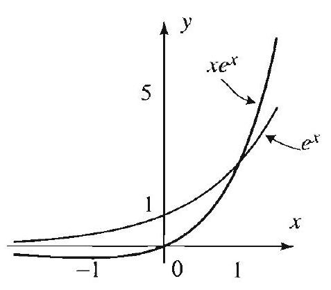

## 10.3 Linear Ordinary Differential Equations with Nonconstant Coefficients

In the previous two sections we saw that the general solution of the secondorder linear differential equation

$$
y^{\prime \prime}+p(x) y^{\prime}+q(x) y=g(x)
$$

is of the form $y=y_{h}+y_{p}$, where $y_{h}$ is the general solution of the associated homogeneous equation and $y_{p}$ is any particular solution of (1). We obtained a complete description of the solution when the coefficient functions are constants and $g$ is of a special form. In this section we present two general methods for handling the cases not covered by the previous section. The first one is usually applied when solving for $y_{h}$, and the second one can be used to find $y_{p}$. We end the section by applying these methods to solve the important class of Euler equations.

## Reduction of Order

For second-order linear differential equations, we know that

$$
y_{n}=c_{1} y_{1}+c_{2} y_{2},
$$

where $y_{1}$ and $y_{2}$ are linearly independent solutions of the homogeneous equation

Note that the equation is in standard form. That is, the leading coefficient is 1 .

$$
y^{\prime \prime}+p(x) y^{\prime}+q(r) y=0 .
$$

Suppose that we know one nontrivial solution to (2), say $y_{1}$. The method of reduction of order allows us to find a second solution $y_{2}$ such that $y_{1}$ and $y_{2}$ are independent.

## REDUCTION OF ORDER FORMULA

A second linearly independent solution of (2) given $y_{1}$ is

$$
y_{2}=y_{1} \int \frac{e^{-\int p(x) d x}}{y_{1}^{2}} d x .
$$

Before you apply this formula, be sure that your equation is in standard form.

Since we are seeking only one independent solution, we can assign my fixed values to the constants of integration appearing in this formula. We will often neglect these constants.

Proof We know that $c y_{1}$ is a solution of (2). But of course this solution is lincarly dependent with $y_{1}$. The idea is to find a nonconstant function $v(x)$ such that
$v(x) y_{1}$ is a solution. Substituting $y=v(x) y_{1}$ into (2), we get

$$
\begin{aligned}
y^{\prime \prime}+p(x) y^{\prime}+q(x) y & =\left(y_{1} v^{\prime \prime}+2 y_{1}^{\prime} v^{\prime}+y_{1}^{\prime \prime} v\right)+p(x)\left(y_{1} v^{\prime}+y_{1}^{\prime} v\right)+q(x) y_{1} v \\
& =y_{1} v^{\prime \prime}+\left(2 y_{1}^{\prime}+p(x) y_{1}\right) v^{\prime}+\left(y_{1}^{\prime \prime}+p(x) y_{1}^{\prime}+q(x) y_{1}\right) v \\
& =y_{1} v^{\prime \prime}+\left(2 y_{1}^{\prime}+p(x) y_{1}\right) v^{\prime}
\end{aligned}
$$

because $y_{1}^{\prime \prime}+p(x) y_{1}^{\prime}+q(x) y_{1}=0$. Hence for $y=w y_{1}$ to be a solution to (2), $v$ must satisfy $y_{1} v^{\prime \prime}+\left(2 y_{1}^{\prime}+p(x) y_{1}\right) v^{\prime}=0$. This is a first-order equation in $v^{\prime}$ (hence the name reduction of order). Equivalently,

$$
v^{\prime \prime}+\left(2 \frac{y_{1}^{\prime}}{y_{1}}+p(x)\right) v^{\prime} \cdots 0
$$

and thus by Theorem 1, Section 10.1, we find

$$
v^{\prime}(x)=\frac{e^{-\int p(x) d x}}{y_{1}^{2}}
$$

(We have taken the constant in this theorem to be 1, since we are only interested in one solution.) Hence (3) follows by integrating and multiplying by $y_{1}$. The linear independence of $y_{1}$ and $y_{2}$ can be checked by computing the Wronskian. See Exercise 41.

Figure 1 Solutions in Example 1.

$$
\begin{aligned}
& \int x e^{-x} d x \\
& \quad=-x e^{-x}-e^{-x}+C
\end{aligned}
$$

## EXAMPLE 1 Reduction of order in the presence of a double root

Given that $y_{1}=e^{x}$ is a solution to $y^{\prime \prime}-2 y^{\prime}+y=0$, a second linearly independent solution is obtained from (3), as follows (Figure 1):

$$
y_{2}=e^{x} \int \frac{e^{2 x}}{\left(e^{x}\right)^{2}} d x=x e^{x}
$$

The characteristic equation in Example 1 has 1 as a double root. We could have used the methods of the previous section to write down the second solution. However, the point of Example 1 is to show how reduction of order can be used to derive such solutions.

## EXAMPLE 2 Applying the reduction of order formula

Given that $c^{x}$ is a solution of $x y^{\prime \prime}-(1+x) y^{\prime}+y=0$, a second linearly independent solution is obtained by appealing to (3). We have

$$
y_{2}=e^{x} \int \frac{e^{\int\left(\frac{1}{1}+1\right) d x}}{\left(e^{x}\right)^{2}} d x=e^{x} \int \frac{x e^{x}}{\left(\epsilon^{x}\right)^{2}} d x=e^{x} \int x e^{x} d x
$$

Observe that before evaluating (3), we must put the equation in standard form. Integrating by parts, we find

$$
y_{2}=e^{x}\left(-x e^{-x}-e^{-x}\right)=-x-1
$$

At this point, we may use $y_{2}=x+1$.

VARIATION OF PARAMETERS FORMULA

## Variation of Parameters

In this part, we suppose that we know the solution of the associated homogeneous equation (2) and describe a general method for gonerating a particular solution of (1). This method is called variation of parameters.

A particular solution of (1) is given by

$$
y_{p}=y_{1} \int \frac{-y_{2} g(x)}{W\left(y_{1}, y_{2}\right)} d x+y_{2} \int \frac{y_{1} g(x)}{W\left(y_{1}, y_{2}\right)} d x
$$

where $y_{1}$ and $y_{2}$ are linearly independent solutions of (2), and $W\left(y_{1}, y_{2}\right)= y_{1} y_{2}^{\prime}-y_{1}^{\prime} y_{2}$ is the Wronskian of $y_{1}$ and $y_{2}$.

As in the reduction of order method, we can neglect the constants of integration.
Proof Since $c_{1} y_{1}+c_{2} y_{2}$ is a solution of the homogencous equation, our hope is that by allowing functions instead of constants we can generate a solution of the nonhomogeneous equation. We thus try

$$
y=u_{1}(x) y_{1}+u_{2}(x) y_{2}
$$

and solve for $u_{1}$ and $u_{2}$. Since we have two unknown functions and only one equation to satisfy, we are free to impose one additional relation between $u_{1}$ and $u_{2}$. As you will see, the following condition simplifies the computation:

$$
u_{1}^{\prime}(x) y_{1}+u_{2}^{\prime}(x) y_{2}=0
$$

We now compute using (5) and (6):

$$
y^{\prime}=u_{1}(x) y_{1}^{\prime}+u_{2}(x) y_{2}^{\prime} ; \quad y^{\prime \prime}=u_{1}(x) y_{1}^{\prime \prime}+u_{2}(x) y_{2}^{\prime \prime}+u_{1}^{\prime}(x) y_{1}^{\prime}+u_{2}^{\prime}(x) y_{2}^{\prime}
$$

Substituting these and (5) in the left side of (1) we get

$$
\begin{aligned}
y^{\prime \prime}+p(x) y^{\prime}+q(x) y= & \left(u_{1}(x) y_{1}^{\prime \prime}+u_{2}(x) y_{2}^{\prime \prime}+u_{1}^{\prime}(x) y_{1}^{\prime}+u_{2}^{\prime}(x) y_{2}^{\prime}\right) \\
& +p(x)\left(u_{1}(x) y_{1}^{\prime}+u_{2}(x) y_{2}^{\prime}\right)+q(x)\left(u_{1}(x) y_{1}+u_{2}(x) y_{2}\right) \\
= & u_{1}(x) \underbrace{\left(y_{1}^{\prime \prime}+p(x) y_{1}^{\prime}+q(x) y_{1}\right)}_{=0} \\
& +u_{2}(x) \underbrace{\left(y_{2}^{\prime \prime}+p(x) y_{2}^{\prime}+q(x) y_{2}\right)}_{=0}+u_{1}^{\prime}(x) y_{1}^{\prime}+u_{2}^{\prime}(x) y_{2}^{\prime} .
\end{aligned}
$$

Therefore, recalling (6), we will have solution if $u_{1}$ and $u_{2}$ satisfy

$$
\left\{\begin{array}{l}
y_{1} u_{1}^{\prime}(x)+y_{2} u_{2}^{\prime}(x)=0 \\
y_{1}^{\prime} u_{1}^{\prime}(x)+y_{2}^{\prime} u_{2}^{\prime}(x)=g(x)
\end{array}\right.
$$

The determinant of this system is precisely $W\left(y_{1}, y_{2}\right)$, which is nonzero since $y_{1}$ and $y_{2}$ are linearly independent. Solving this system, we get the unique solutions

$$
u_{1}^{\prime}=\frac{-y_{2} g(x)}{W\left(y_{1}, y_{2}\right)} \quad \text { and } \quad u_{2}^{\prime}=\frac{y_{1} g(x)}{W\left(y_{1}, y_{2}\right)}
$$

Integrating and substituting in (5) yields (4). $\square$

## EXAMPLE 3 Variation of parameters

Given that $y_{1}=x$ and $y_{2}=x^{4}$ are solutions of $x^{2} y^{\prime \prime}-4 x y^{\prime}+4 y=0$, find a particular solution of

$$
x^{2} y^{\prime \prime}-4 x y^{\prime}+4 y=3 x^{2} .
$$

Solution We have

$$
W\left(y_{1}, y_{2}\right)=W\left(x, x^{4}\right)=3 x^{4} .
$$

We put the equation in standard form, apply (4), and get

$$
y_{p}=x \int \frac{-3 x^{4}}{3 x^{4}} d x+x^{4} \int \frac{3 x}{3 x^{4}} d x=-x^{2}-\frac{1}{2} x^{2}=-\frac{3}{2} x^{2}
$$

We end this section with a discussion of a class of differential equations with important applications.

## Euler Equations

The differential equation

$$
x^{2} y^{\prime \prime}+\alpha x y^{\prime}+\beta y=0,
$$

where $\alpha$ and $\beta$ are constants, is known as Euler's equation. It is the simplest example of a second-order linear differential equation with nonconstant coefficients for which we have an explicit solution. Motivated by the firstorder version of this equation, $x y^{\prime}+\alpha y=0$, which has solution $y=x^{-\alpha}$, we try

$$
y=x^{r}
$$

as a solution of (7). Plugging $x^{r}$ into the equation, it follows that $r$ must be a root of

$$
r(r-1)+\alpha r+\beta=0
$$

This quadratic equation, known as the indicial equation, is the key to solving (7), in the same way that the characteristic equation is the key to solving an equation with constant coefficients. As expected, the solutions will depend on the nature of the roots, referred to as the indicial roots.

If we put the general Euler's equation in standard form, the coefficients of $y^{\prime}$ and $y$ are not defined at $x=0$. Because of this problem at 0 , the cases $x>0$ and $x<0$ are to be treated separately. In fact, in most applications we are only interested in the case $x>0$. For completeness, in the following box we present the solution of Euler's equation in both cases using the absolute value.

GENERAL SOLUTION OF EULER'S EQUATION

Consider Euler's equation (7) with indicial equation (9), which we write as

$$
r^{2}+(\alpha-1) r+\beta=0
$$

Let $r_{1}$ and $r_{2}$ denote the indicial roots. The general solution $y$ of this equation is given by the following cases.
Case I If $r_{1}$ and $r_{2}$ are distinct real roots, then

$$
y=c_{1}|x|^{r_{1}}+c_{2}|x|^{r_{2}}
$$

Case II If $r_{1}=r_{2}$, then

$$
y=\left(c_{1}+c_{2} \ln |x|\right)|x|^{r_{1}}
$$

Case III If $r_{1}$ and $r_{2}$ are complex conjugate roots with $r_{1}=a+i b$, then

$$
y=|x|^{a}\left[c_{1} \cos (b \ln |x|)+c_{2} \sin (b \ln |x|)\right]
$$

Clearly when $x>0$ we may drop the absolute values.
Proof For clarity's sake, we take $x>0$. Case I follows immediately from (8) and the fact that $W\left(x^{r_{1}}, x^{r_{2}}\right)=\left(r_{2}-r_{1}\right) x^{r_{1}+r_{2}-1} \neq 0$ for $x>0$. Case II is derived via reduction of order. Using $y_{1}=x^{r_{1}}$ in (3), we get

$$
y_{2}=x^{r_{1}} \int \frac{e^{-\int \frac{\alpha}{r} d x}}{x^{2 r_{1}}} d x=x^{r_{1}} \int x^{-\alpha-2 r_{1}} d x
$$

But because $r_{1}$ is a double root of the indicial equation (10), we have $2 r_{1}=r_{1}+ r_{2}=-(\alpha-1)$. So $x^{-\alpha-2 r_{1}}=x^{-1}$, and the integral evaluates to $\ln x$, implying $y=x^{r_{1}} \ln x$.

In Case III, two linearly independent complex-valued solutions are formally given by $x^{a+i b}$ and $x^{a-i b}$. We interpret these as $e^{\ln x(a+i b)}$ and $e^{\ln x(a-i b)}$ and proceed to derive real-valued solutions. From Euler's identity, we have

$$
e^{\ln x(a+i b)}=e^{a \ln x} e^{i b \ln x}=x^{a}[\cos (b \ln x)+i \sin (b \ln x)]
$$

and, similarly,

$$
e^{\ln x(a-i b)}=x^{a}[\cos (b \ln x)-i \sin (b \ln x)]
$$

Taking linear combinations, we arrive at the desired real solutions as we did previously when dealing with constant coefficient equations having complex characteristic roots. Linear independence follows by computing the Wronskian and is left as Exercise 42.

There is a close similarity between the solution to Euler's equation and the solution to the constant coefficient equation. Indeed, the change of variables $t=\ln x$ in Euler's equation transforms it to an equation with

Figure 2 Solutions in Example 4. Notice that $\frac{1}{x^{2}}$ is not defined at $x=0$ and $\sqrt{x}$ is not differentiable at $x=0$. These solutions are valid for $x>0$, where the differential equation is defined.

constant coefficients. This provides an alternative derivation of the general solution of Euler's equation. See Exercise 43.

## EXAMPLE 4 Euler's equation

Solve $2 x^{2} y^{\prime \prime}+5 x y^{\prime}-2 y=0$ for $x>0$.
Solution We rewrite the equation as $x^{2} y^{\prime \prime}+\frac{5}{2} x y^{\prime}-y=0$. From (10), the indicial equation is $r^{2}+\frac{3}{2} r-1=0$, which factors as $\left(r-\frac{1}{2}\right)(r+2)=0$. We get the indicial roots $r_{1}=\frac{1}{2}, r_{2}=-2$. Thus by Case I, the general solution is $y=c_{1} \sqrt{x}+\frac{c_{2}}{x^{2}}$. The general solution is illustrated in Figure 2.

Note that when $x<0$, the solution in Example 4 becomes

$$
y=c_{1} \sqrt{-x}+\frac{c_{2}}{x^{2}} .
$$

## Exercises A. 3

In Exercises 1-20, verify that the given function is a solution of the given equation. and then find the general solution using the reduction of order formula.

1. $y^{\prime \prime}+2 y^{\prime}-3 y=0, \quad y_{1}=e^{x}$.
2. $y^{\prime \prime}-5 y^{\prime}+6 y=0, \quad y_{1}=e^{3 x}$.
3. $x y^{\prime \prime}-(3+x) y^{\prime}+3 y=0, \quad y_{1}=e^{x}$.
4. $x y^{\prime \prime}-(2-x) y^{\prime}-2 y=0, \quad y_{1}=e^{-x}$.
5. $y^{\prime \prime}+4 y=0, \quad y_{1}=\cos 2 x$.
6. $y^{\prime \prime}+9 y=0, \quad y_{1}=\sin 3 x$.
7. $y^{\prime \prime}-y=0, \quad y_{1}=\cosh x$.
8. $y^{\prime \prime}+2 y^{\prime}+y=0, \quad y_{1}=e^{-x}$.
9. $\left(1-x^{2}\right) y^{\prime \prime}-2 x y^{\prime}+2 y=0, \quad y_{1}=x$.
10. $\left(1-x^{2}\right) y^{\prime \prime}-2 x y^{\prime}=0, \quad y_{1}=1$.
11. $x^{2} y^{\prime \prime}+x y^{\prime}-y=0, \quad y_{1}=x$.
12. $x^{2} y^{\prime \prime}-x y^{\prime}+y=0, \quad y_{1}=x$.
13. $x^{2} y^{\prime \prime}+x y^{\prime}+y=0, \quad y_{1}=\cos (\ln x)$.
14. $x^{2} y^{\prime \prime}+2 x y^{\prime}+\frac{1}{4} y=0, \quad y_{1}=1 / \sqrt{x}$.
15. $x y^{\prime \prime}+2 y^{\prime}+4 x y=0, \quad y_{1}=\frac{\sin 2 x}{x}$.
16. $x y^{\prime \prime}+2 y^{\prime}-x y=0, \quad y_{1}-\frac{e^{x}}{x}$.
17. $x y^{\prime \prime}+2(1-x) y^{\prime}+(x-2) y=0, \quad y_{1}=e^{x}$.
18. $(x-1)^{2} y^{\prime \prime}-3(x-1) y^{\prime}+4 y=0, \quad y_{1}=(x-1)^{2}$.
19. $x^{2} y^{\prime \prime}-2 x y^{\prime}+2 y=0, \quad y_{1}=x^{2}$.
20. $\left(x^{2}-2 x\right) y^{\prime \prime}-\left(x^{2}-2\right) y^{\prime}+2(x-1) y=0, \quad y_{1}=e^{x}$.

In Exercises 21-30, find the general solution of the given equation using the method of variation of parameters. Take $x>0$.
21. $y^{\prime \prime}-4 y^{\prime}+3 y=e^{-x}$.
23. $3 y^{\prime \prime}+13 y^{\prime}+10 y=\sin x$.
25. $y^{\prime \prime}+y=\sec x$.
27. $x y^{\prime \prime}-(1+x) y^{\prime}+y=x^{3}$.
[Hint: $y_{1}=1+x, y_{2}=e^{x}$.]
29. $x^{2} y^{\prime \prime}+3 x y^{\prime}+y=\sqrt{x}$.
22. $y^{\prime \prime}-15 y^{\prime}+56 y=\epsilon^{7 x}+12 x$.
24. $y^{\prime \prime}+3 y=x$.
26. $y^{\prime \prime}+y=\sin x+\cos x$.
28. $x y^{\prime \prime}-(1+x) y^{\prime}+y=x^{4} \epsilon^{\prime \prime}$.
[Hint: Exercise 27.]
30. $x^{2} y^{\prime \prime}+x y^{\prime}+y=x$.

In Exercises 31-40, solve the given Euler equation. Take $x>0$, unless otherwise stated.
31. $x^{2} y^{\prime \prime}+4 x y^{\prime}+2 y=0$.
32. $x^{2} y^{\prime \prime}+x y^{\prime}-4 y=0$.
33. $x^{2} y^{\prime \prime}+3 x y^{\prime}+y=0$.
34. $4 x^{2} y^{\prime \prime}+8 x y^{\prime}+y=0$.
35. $x^{2} y^{\prime \prime}+x y^{\prime}+4 y=0$.
36. $4 x^{2} y^{\prime \prime}+4 x y^{\prime}+y=0$.
37. $x^{2} y^{\prime \prime}+7 x y^{\prime}+13 y=0$.
38. $x^{2} y^{\prime \prime}-x y^{\prime}+5 y=0$.
39. $(x-2)^{2} y^{\prime \prime}+3(x-2) y^{\prime}+y=0$
40. $(x+1)^{2} y^{\prime \prime}+(x+1) y^{\prime}+y=0$
$(x>2)$.
$(x>-1)$.
[Hint: Let, $t=x-2$.]
[Hint: Let $t=x+1$.]
41. Compute $W\left(y_{1}, y_{2}\right)$ with $y_{2}$ given by (3) and conclude that the reduction of order formula yields a second linearly independent solution.
42. Let $y_{1}$ and $y_{2}$ be the solutions of Euler's equation in Case III. Show that $W\left(y_{1}, y_{2}\right)=x^{2 a-1}$ and conclude that $y_{1}$ and $y_{2}$ are linearly independent for $x>0$.
43 Show that the change of variables $t=\ln x(x>0)$ transforms Euler's equation (7) to the equation

$$
\frac{d^{2} y}{d t^{2}}+(\alpha-1) \frac{d y}{d t}+\beta y=0
$$

with constant coefficients.
44. An alternative solution of Euler's equation. Using Exercise 43 and the solution of (6), Section 10.2, derive the three cases of the general solution of Euler's equation.
45. Reduction of order formula from Abel's formula.
(a) Use Abel's formula (Theorem 2, Section 10.1) to conclude that

$$
y_{1} y_{2}^{\prime}-y_{1}^{\prime} y_{2}=C e^{-\int p(x) d x}
$$

where $y_{1}$ and $y_{2}$ are any two solution of (2).
(b) Given $y_{1}$, set $C=1$ in (a) and solve the resulting first-order differential equation in $y_{2}$, thereby deriving (3).
46. Reduction of order for nonhomogeneous equations. In this exercise we demonstrate that the method of reduction of order also applies to nonhomogeneous equations given a solution $y_{1}$ to the associated homogeneous equation. Thus, given $y_{1}$, we may solve (1) directly without recourse to the method of variation of parameters.
(a) Show that if we want to solve (1) and carry out the proof of (3) we arrive at the equation

$$
v^{\prime \prime}+\left(\frac{y_{1}^{\prime}}{y_{1}}+p(x)\right) v^{\prime}=\frac{g(x)}{y_{1}} .
$$

(b) Solve the equation using Theorem 1, Section 10.1, and conclude that the general solution of (1) is

$$
\begin{aligned}
y= & c_{1} y_{1}+c_{2} y_{1} \int \frac{e^{-\int p(x) d x}}{y_{1}^{2}} d x \\
& +y_{1} \int \frac{e^{-\int p(x) d x}}{y_{1}^{2}} d x\left(\int y_{1} e^{\int p(x) d x} g(x) d x\right) d x
\end{aligned}
$$

where the last two occurrences of $\int p(x) d x$ represent the same antiderivative of $p(x)$.

In Exercises 47-50, find the general solution of the given equation by using the method of Exercise 46. To get a good feel for Exercise 46, we suggest that you repeat its proof with at least one of the following exercises.
47. $y^{\prime \prime}-4 y^{\prime}+3 y=e^{x}, \quad y_{1}=e^{x}$.
48. $x^{2} y^{\prime \prime}+3 x y^{\prime}+y=\sqrt{x}, \quad y_{1}=\frac{1}{x}$.
49. $3 y^{\prime \prime}+13 y^{\prime}+10 y=\sin x, \quad y_{1}=e^{-x}$.
50. $x y^{\prime \prime}-(1+x) y^{\prime}+y=x^{3}, \quad y_{1}=e^{x}$.
