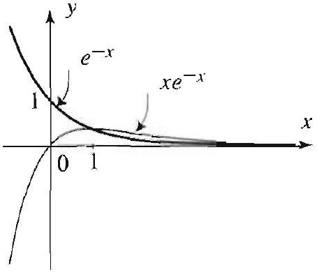
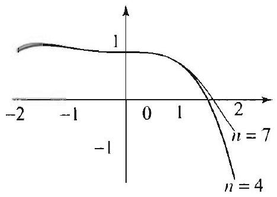

## APPENDIX A

## Topics to Review

This appendix is self-contained and requires basic knowledge of differential and integral calculus.

## Looking Ahead...

This appendix presents standard techniques for solving linear ordinary differential equations. They are needed throughout this book. Our primary use of the power series and Frobenius methods of Sections A.4, A.5, and A. 6 will be to establish the basic properties of Bessel functions (Chapter 4) and Legendre polynomials (Chapter 5).

## ORDINARY DIFFERENTIAL EQUATIONS: REVIEW OF CONCEPTS AND METHODS

#### Abstract

Among all the mathematical disciplines the theory of differential equations is the most important. It furnishes the explanation of all those elementary manifestations of nature which imolve time.

-SOPHUS LIE

A basic knowledge of ordinary differential equations is exsential for the development of the main topics of this book. For example solving a partial differential equation by standard methods leads naturally to ordinary differential equations. In this appendix we provide a review of the basic techniques that will be useful in this book. Our brief presentation covers the essentials of linear ordinary differential equations as taught in a first course on differential equations. In the first section we present the fundamental properties of existence uniqueness, and linear independence of solutions. The rest of the chapter is devoted to the treatment of the basic tools for solving linear ordinary differential equations, including series methods. This chapter is not intended as a comprehensive treatment, but rather as a convenient reference for topics that are needed in the book.

## 10.1 Linear Ordinary Differential Equations

## THEOREM 1 SOLUTION OF THE FIRST ORDER LINEAR DIFFERENTIAL EQUATION

The expression $\int p(x) d x$ represents an antiderivative of $p(a)$. and so it is defined up to a constant $C$. In applying (2). you should take the same value of $C$ in both occurences of $\int p(x) d x$ Usually, the most convenient choice is $C=$ 0. (See Example 1.)

An ordinary differential equation is an equation that involves an unknown function $y$ and its derivatives $y^{(j)}$ of order $j$. A linear ordinary differential equation in standard form is an equation

$$
y^{(n)}+p_{n-1}(x) y^{(n-1)}+\cdots+p_{1}(x) y^{\prime}+p_{0}(x) y=g(r)
$$

where $n$ is called the order of the equation and $p_{j}\left(x^{\prime}\right)$ and $g(r)$ are given functions of $x$. The expression standard form refers to the fact that the leading coefficient is 1 . A solution of (1) on an interval $I$ is any $n$ times differentiable function $y=y(x)$ satisfying (1) on 1 . The equation (1) is homogeneous if $g(x) \equiv 0$, otherwise it is nonhomogeneous.

The first- and second-order equations are of particular interest to us. We can describe completely the solution of the first one, while discussion of the second will occupy the rest of this appendix.

Suppose that $p(x)$ and $g(x)$ are continuous on the interval $I$. Then any solution of the first-order linear differential equation

$$
y^{\prime}+p(x) y=g(x), \quad x \text { in } l,
$$

is of the form

$$
y=e^{-\int p(x) d x}\left[C+\int g(x) e^{\int p(x) d x} d x\right]
$$

where $\int p(x) d x$ represents the same antiderivative of $p(x)$ in both occurcuces.

Proof Suppose $y$ is a solution. Multiply the equation throngh by the integrating factor $\mu(x)=e^{\int p(x) d x}$ and get

$$
\mu(x)\left[y^{\prime}+p(x) y\right]=g(x) \mu(x) .
$$

Since $\mu^{\prime}(x)=p(x) \mu(x)$, by the product rule, the equation can be rewritten as $[\mu(x) y]^{\prime}=g(x) \mu(x)$. Integrating both sides and dividing by $\mu(x)$ yields the desired solution. Note that, since $\mu(x)$ is an exponential function, it is nonzero for all $x$. and so we may divide by it.) $\square$

## EXAMPLE 1 A first-order differential equation

Using Theorem 1, we find all solutions of the differential equation

$$
y^{\prime}-y=2 .
$$

The integrating factor is $\mu(x)=e^{-\int d x}=e^{-x}$ and hence the general solution is $y=e^{x}\left[C-2 e^{-x}\right]=C e^{x}-2$, where $C$ is an arbitrary constant. $\square$

In treating higher-order equations we are not so fortunate, in that, in general, we do not have a closed form for the solutions. However, there are fundamental results concerning the general form of the solutions that we discuss in the remainder of this section. Important cases where solutions are given explicitly are presented in Sections 10.2 and 10.3. Our discussion focuses first on the homogeneous equation

$$
y^{(n)}+p_{n-1}(x) y^{(n-1)}+\cdots+p_{1}(x) y^{\prime}+p_{0}(x) y=0,
$$

where all the coefficient functions are continuous on some fixed interval $I$.
We begin with a definition that is central to our treatment.

THE WRONSKIAN
Let $y_{1}, y_{2}, \ldots, y_{n}$ be any $n$ solutions to the homogeneous linear differential equation (3). The Wronskian $W\left(y_{1}, y_{2}, \ldots, y_{n}\right)$ of these solutions is given by the following $n \times n$ determinant:

$$
W\left(y_{1}, y_{2}, \ldots, y_{n}\right)=\left|\begin{array}{cccc}
y_{1} & y_{2} & \ldots & y_{n} \\
y_{1}^{\prime} & y_{2}^{\prime} & \ldots & y_{n}^{\prime} \\
\vdots & \vdots & \vdots & \vdots \\
y_{1}^{(n-1)} & y_{2}^{(n-1)} & \ldots & y_{n}^{(n-1)}
\end{array}\right| .
$$

We will sometimes use the alternative notation $W\left(y_{1}, y_{2}, \ldots, y_{n}\right)(x)$, or simply $W(x)$, to emphasize that the Wronskian is a function of $x$.

## EXAMPLE 2 Computing Wronskians

(a) The equation $y^{\prime \prime}-y=0$ has solutions $y_{1}=e^{x}$ and $y_{2}=e^{-x}$. Their Wronskian is

$$
W\left(e^{x}, e^{-x}\right)=\left|\begin{array}{cc}
e^{x} & e^{-x} \\
e^{x} & -e^{-x}
\end{array}\right|=e^{x}\left(-e^{-x}\right)-e^{x}\left(e^{-x}\right)=-2 .
$$

(b) The equation $y^{\prime \prime}+y=0$ has solutions $y_{1}=\cos x$ and $y_{2}=\sin x$. Their Wronskian is

$$
W(\cos x, \sin x)=\left|\begin{array}{cc}
\cos x & \sin x \\
-\sin x & \cos x
\end{array}\right|=\cos ^{2} x+\sin ^{2} x=1
$$

The next theorem gives an explicit form of the Wronskian in terms of the coefficient functions in (3).

THEOREM 2 ABEL'S FORMULA FOR THE WRONSKIAN

Since the key issue is whether If vanishes or not, we cannot divide by $W$ to separate variables. An appeal to Theorem 1 is necossary.

Let $y_{1}, y_{2}, \ldots, y_{n}$ be any $n$ solutions to the homogeneous linear differential equation (3). Then the Wronskian $W(x)$ satisfies the first-order differential equation

$$
W^{\prime}(x)+p_{n-1}(x) W(x)=0 . \quad \text { for } x \text { in } l,
$$

and hence
(1)

$$
W(x)=C e^{-\int p_{n-1}(x) d x}
$$

Consequently, either $W(x) \neq 0$ for all $x$ in $I$, or $W(x) \equiv 0$ on $I$.
The point of this theorem is that determining that $W(x) \neq 0$ for some $x$ in $I$ allows us to conclude that $W(x) \neq 0$ for all $x$ in $I$.
Proof For clarity's sake, we give a proof only for $n=2$. (The case $n=3$ is treated in Exercise 31.) The same approach generalizes to higher dimensions but requires a greater knowledge of linear algebra. For $n=2$, the equation is $y^{\prime \prime}+p_{1}(x) y^{\prime}+p_{0}(x) y=0$, and $W(x)=y_{1} y_{2}^{\prime}-y_{1}^{\prime} y_{2}$. Since $y_{1}$ and $y_{2}$ are solutions, we have

$$
\begin{aligned}
W^{\prime}(x) & =y_{1} y_{2}^{\prime \prime}-y_{1}^{\prime \prime} y_{2} \\
& =y_{1}\left[-p_{1}(x) y_{2}^{\prime}-p_{0}(x) y_{2}\right]-\left[-p_{1}(x) y_{1}^{\prime}-p_{0}(x) y_{1}\right] y_{2} \\
& =-p_{1}(x) W(x)
\end{aligned}
$$

This is a first-order differential equation for $W(x)$ and (4) is an immediate consequence of (2) in Theorem 1.

It is crucial in applying Theorem 2 to put the equation in standard form and verify the continuity of the coefficients. See Exercise 23.

We can now state a fundamental result in the theory of ordinary differential equations.

THEOREM 3 EXISTENCE OF FUNDAMENTAL SETS OF SOLUTIONS

The homogeneous equation (3)

$$
y^{(n)}+p_{n-1}(x) y^{(n-1)}+\cdots+p_{1}(x) y^{\prime}+p_{0}(x) y=0 .
$$

where the coefficient functions $p_{j}(x)$ are all continuous on an interval $I$, has $n$ solutions $y_{1}, y_{2}, \ldots, y_{n}$ with nonvanishing Wronskian on $I$. Furthermore, given any such set $y_{1}, y_{2}, \ldots y_{n}$ and any solution $y$, then $y=c_{1} y_{1}+c_{2} y_{2}+ \cdots+c_{n} y_{n}$ for a unique choice of constants $c_{1}, c_{2}, \ldots \ldots c_{n}$. The set of solutions $y_{1}, y_{2}, \ldots, y_{n}$ with nonvanishing Wronskian is called a fundamental set of solutions.

Theorem 3 asserts that any linear homogeneous differential equation of order $n$ has $n$ solutions that span the set of all solutions of the equation. Note that the theorem does not assert the uniqueness of a fundamental set. If $y_{1}, y_{2}, \ldots, y_{n}$ is a fundamental set of solutions, then the linear combination $y=c_{1} y_{1}+c_{2} y_{2}+\cdots+c_{n} y_{n}$ is referred to as the general solution.

## THEOREM 4 SUPERPOSITION PRINCIPLE

THEOREM 5 GENERAL
SOLUTION OF NONHOMOGENEOUS EQUATIONS

We have been using without verification that a linear combination of solutions of a homogeneous linear equation is again a solution. This simple fact. called the superposition principle, can be checked directly by appealing to (3). We state it here for ease of reference.

Suppose that $u(x)$ and $v(x)$ are solutions of the linear homogeneous equation (3) and let $c$ and $d$ be any two numbers. Then the linear combination $c u(x)+d v(x)$ is also a solution of (3).

## Nonhomogeneous Differential Equations

Let us recall from (1) the general nonhomogeneous equation

$$
y^{(n)}+p_{n-1}(r) y^{(n 1)}+\cdots+p_{1}(x) y^{\prime}+p_{0}(x) y=g(x),
$$

where the coefficient functions and $g(x)$ are all assumed to be continuous on some interval $I$. If $g(x)$ is replaced by 0 , we call the resulting equation the associated homogeneous equation. We know from Theorem 3 that the associated homogeneous equation has a fundamental set of solutions $y_{1}$, $y_{2}, \ldots, y_{n}$. We will show in Section 10.2, using the method of variation of parameters, that (5) has at least one solution that we will denote by $y_{p}$ and call a particular solution. Now suppose that $y$ is any other solution of (5). It is a simple exercise to check that $y-y_{p}$ is a solution of the associated homogeneous equation. By Theorem 3 we must have $y-y_{p}= c_{1} y_{1}+c_{2} y_{2}+\cdots+c_{n} y_{n}$. Thus, if $y_{h}$ denotes the general solution of the associated homogeneous equation, it follows that $y=y_{h}+y_{p}$ (known as the general solution of the nonhomogeneous equation). We have proved the following important result.

Let $y_{h}$ and $y_{p}$ denote, respectively, the general solution of the homogeneous equation associated with (5) and a particular solution of (5). Then any solution $y$ of (5) has the form

$$
y=y_{h}+y_{p}
$$

Often in applications we have to solve differential equations subject to certain conditions; for example,

$$
y^{\prime \prime}+y=c^{x}, \quad y(0)=0, y^{\prime}(0)=1 .
$$

Such a problem is called an initial value problem, and the conditions are called initial conditions. Typically we impose enough conditions to specify a unique solution of the problem. Since the general solution of an $n$th order linear differential equation has $n$ arbitrary constants, we expect $n$ conditions to suffice.

THEOREM 6 EXISTENCE AND UNIQUENESS FOR INITIAL VALUE PROBLEMS

Figure 1 Various solutions from Example 3.

Figure 2 Solution of the initial value problem in Example 3 and its tangent line at $x=0$. It is the only curve among those in Figure 1 that goes through the point $(0,4)$ and that has slope at $x=0$ equal to $y^{\prime}(0)=2$.

Consider the initial value problem consisting of the linear differential equation (5) and the initial conditions

$$
y\left(x_{0}\right)=y_{0}, y^{\prime}\left(x_{0}\right)=y_{0}^{\prime}, \ldots, y^{(n-1)}\left(x_{0}\right)=y_{0}^{(n-1)},
$$

where $x_{0}$ is in $I$ and $y_{0}, y_{0}^{\prime}, \ldots, y_{0}^{(n-1)}$ are prescribed values. Then this problem has a unique solution $y$ on the interval $I$.

Proof Let $y_{p}$ be a particular solution to (5) and let $y_{1}, y_{2}, \ldots, y_{n}$ be a fundamental set of solutions to the associated homogeneous equation. For clarity's sake we take $n=2$, although the proof generalizes for arbitrary $n$. We need to solve the $2 \times 2$ system

$$
\left\{\begin{array} { l } 
{ c _ { 1 } y _ { 1 } ( x _ { 0 } ) + c _ { 2 } y _ { 2 } ( x _ { 0 } ) + y _ { p } ( x _ { 0 } ) = y _ { 0 } } \\
{ c _ { 1 } y _ { 1 } ^ { \prime } ( x _ { 0 } ) + c _ { 2 } y _ { 2 } ^ { \prime } ( x _ { 0 } ) + y _ { p } ^ { \prime } ( x _ { 0 } ) = y _ { 0 } ^ { \prime } }
\end{array} \Leftrightarrow \left\{\begin{array}{l}
c_{1} y_{1}\left(x_{0}\right)+c_{2} y_{2}\left(x_{0}\right)=y_{0}-y_{p}\left(x_{0}\right) \\
c_{1} y_{1}^{\prime}\left(x_{0}\right)+c_{2} y_{2}^{\prime}\left(x_{0}\right)=y_{0}^{\prime}-y_{p}^{\prime}\left(x_{0}\right)
\end{array}\right.\right.
$$

for the unknowns $c_{1}$ and $c_{2}$. Since the determinant of the matrix of this system is precisely the Wronskian and is nonzero by definition (see Theorem 3), it follows that the system has a unique solution pair $c_{1}, c_{2}$. This proves the existence of the solution of the initial value problem. To establish the uniqueness of the solution. suppose that $u(x)$ and $v(x)$ are two solutions to the initial value problem. Let $w=u-v$. Then $w$ satisfies the associated homogencons equation with 0 initial values. We know from Theorem 3 that $w=a y_{1}+b y_{2}$ for some choice of $a$ and $b$. Now using the initial values of $w$ and the fact that $W\left(y_{1}, y_{2}\right)\left(x_{0}\right) \neq 0$, we infer that $a=b=0$ and hence $w \equiv 0$ implying that $u \equiv v$.

## EXAMPLE 3 An initial value problem

You can (and should) check that the equation $y^{\prime \prime}-3 y^{\prime}+2 y=4 x$ has $y_{p}=2 x+3$ as a particular solution and that the associated homogeneous equation $y^{\prime \prime}-3 y^{\prime}+2 y=0$ has general solution $y_{h}=c_{1} e^{x}+c_{2} e^{2 x}$. (General techniques for deriving these solutions will be developed in the next two sections.) Hence the general solution of the nonhomogeneous equation is

$$
y=y_{n}+y_{p}=c_{1} e^{x}+c_{2} e^{2 x}+2 x+3
$$

(see Figure 1). Now suppose that we want to solve the initial value problem

$$
y^{\prime \prime}-3 y^{\prime}+2 y=4 x, \quad y(0)=4, y^{\prime}(0)=2
$$

Using the initial conditions, we get

$$
\begin{aligned}
& y(0)=4 \Rightarrow c_{1}+c_{2}=1 \\
& y^{\prime}(0)=2 \Rightarrow c_{1}+2 c_{2}=0
\end{aligned}
$$

This system has a unique solution $c_{1}=2$ and $c_{2}=-1$. Hence the (unique) solution of the initial value problem is $y=2 e^{x}-e^{2 x}+2 x+3$ (Figure 2).

## THEOREM 7 WRONSKIAN CRITERION FOR LINEAR INDEPENDENCE

We next present a brief discussion of linear independence of solutions and its connection to fundamental sets.

The functions $f_{1}, f_{2}, \ldots, f_{n}$ defined on an interval $[a, b]$ are said to be linearly independent on $[a, b]$ if the only choice of the constants $c_{1}, c_{2}, \ldots$, $c_{n}$ for which the linear combination $c_{1} f_{1}+c_{2} f_{2}+\cdots+c_{n} f_{n}$ vanishes identically on $[a, b]$ is $c_{1}=c_{2}=\cdots=c_{n}=0$. Otherwise, the functions are said to be linearly dependent. When $n=2$, we note that linear dependence is equivalent to one function being a constant multiple of the other. The following result shows a connection between the notion of linear independence and fundamental sets.

Let $y_{1}, y_{2}, \ldots y_{n}$ be any $n$ solutions to the homogeneons linear differential equation (3) with coefficients continuous on an interval $I$. The following are equivalent:
(i) $y_{1}, y_{2}, \ldots, y_{n}$ are linearly independent on $I$;
(ii) $y_{1}, y_{2}, \ldots y_{n}$ form a fundamental set of solutions of (3):
(iii) $W\left(y_{1}, y_{2}, \ldots, y_{n}\right)\left(x_{0}\right) \neq 0$ for some $x_{0}$ in $I$;
(iv) $W\left(y_{1}, y_{2}, \ldots, y_{n}\right)(x) \neq 0$ for all $x$ in $I$.

Proof Clearly (ii) ⇔ (iii) ⇔ (iv) follow from Theorems 2 and 3 and the definition of a fundamental set. We conclude by proving (i) ⇒ (iii) and (iii) ⇒ (i). We start with (iii) ⇒ (i). Suppose that $y_{1}, y_{2}, \ldots, y_{n}$ are any $n$ solutions such that $c_{1} y_{1}+c_{2} y_{2}+\cdots+c_{n} y_{n}=0$. By differentiating this equation $n-1$ times in succession and then setting $x=x_{0}$, we get a system of $n$ linear homogeneous equations in the $n$ unknowns $c_{1}, c_{2}, \ldots, c_{n}$. The determinant of the matrix of this system is precisely $W\left(x_{0}\right)$, which is nonzero by assumption. The nonvanishing of this determinant implies that $c_{1}=c_{2}=\cdots=c_{n}=0$, proving (iii) ⇒ (i). To complete the proof it is enough to show (i) ⇒ (iii). The proof is by contradiction. We assume that $y_{1}, y_{2}, \ldots, y_{n}$ are linearly independent on $I$ and that $W\left(y_{1}, y_{2}, \ldots, y_{n}\right)\left(x_{0}\right)=0$. The vanishing of the Wronskian implies that there are constants $c_{1}, c_{2}, \ldots, c_{n}$. not all zero, such that all the initial values of $y=c_{1} y_{1}+c_{2} y_{2}+\cdots+c_{n} y_{n}$ are 0 at $x_{0}$ (for $n=2$, this fact is clear). However, the solution $w \equiv 0$ has the same intital values, and so by the uniqueness part of Theorem 6, $w \equiv y \equiv 0$, implying that $c_{1}=c_{2}=\cdots =c_{n}=0$ by the definition of linear independence, which is a contradiction.

## EXAMPLE 4 Fundamental sets of solutions, linear independence

We saw in Example 2 that $e^{x}$ and $e^{-x}$ are solutions of $y^{\prime \prime}-y=0$ and that $W\left(e^{x}\right.$, $\left.e^{-x}\right)=-2 \neq 0$. Thus, by Theorem 7. the general solution of the differential equation is of the form $y=c_{1} e^{x}+c_{2} e^{-x}$; and so any solution is a linear combination of the functions $r^{r}$ and $e^{-x}$, which form a fundamental set of solutions.

It is worthwhile to note that the fundamental set of solutions is not unique. For the equation at hand, you can casily check that cosh $x$ and $\sinh x$ are also solutions. Their Wronskian is

$$
W(\cosh x, \sinh x)=\left|\begin{array}{ll}
\cosh x & \sinh x \\
\sinh x & \cosh x
\end{array}\right|=\cosh ^{2} x-\sinh ^{2} x=1
$$

Thus, by Theorem 7, the general solution of the differential equation is also of the form $y=c_{1} \cosh x+c_{2} \sinh x$.

Thus far we have developed an understanding of the general form of the solutions of linear differential equations. However, aside from the first order case, we have not developed techniques for finding explicit solutions. This will occupy us throughout the remainder of this appendix, where we will develop methods for solving certain important classes of higher order linear differential equations.

## Exercises A. 1

In Exercises 1-10, solve the given first order differential equation.

1. $y^{\prime}+y=1$.
2. $y^{\prime}+2 x y=x$.
3. $y^{\prime}=-.5 y$.
4. $y^{\prime}=2 y+x$.
5. $y^{\prime}-y=\sin x$.
6. $y^{\prime}-2 x y=x^{3}$.
7. $x y^{\prime}+y=\cos x$.
8. $y^{\prime}-\frac{2}{x} y=x^{2}$.
9. $y^{\prime}+\tan x y=\cos x$.
10. $y^{\prime}+\tan x y=\sec ^{2} x$.

In Exercises 11-20, solve the given initial value problem.
11. $y^{\prime}=y, y(0)=1$.
12. $y^{\prime}+2 y=1, y(0)=2$.
13. $y^{\prime}+x y=x, y(0)=0$.
14. $y^{\prime}+\frac{y}{x}=\frac{\sin x}{x}, \quad y(\pi)=1$.
15. $x y^{\prime}+2 y=1, \quad y(-1)=-2$.
16. $x y^{\prime}-2 y=\frac{1}{x}, y(1)=0$.
17. $y^{\prime}+y \tan x=\tan x, y(0)=1$.
18. $y^{\prime}+y \tan x=\tan x, y(0)=2$.
19. $y^{\prime}+e^{x} y=e^{x}, y(0)=2$.
20. $y^{\prime}+y=e^{x}, \quad y(3)=0$.
21. (a) Check that the functions

$$
e^{x}, e^{-x}, \cosh x, \sinh x
$$

are solutions of

$$
y^{\prime \prime}-y=0
$$

(b) We know from Example 4 that $\left\{e^{x}, e^{-x}\right\}$ and $\{\cosh x, \sinh x\}$ are fundamental sets of solutions. Express $e^{x}$ as a linear combination of the functions $\cosh x, \sinh x$.
(c) Can you think of other fundamental sets of solutions?
22. Check that the functions $e^{x}, e^{-x}, \cosh x$ are solutions of

$$
y^{\prime \prime \prime}-y^{\prime}=0
$$

(b) Show directly that $W\left(e^{x}, e^{-x}, \cosh x\right) \equiv 0$ and conclude that these functions do not form a fundamental set.
(c) Find a fundamental set of solutions by inspection. Justify your answer by computing the Wronskian.
23. (a) Check that the functions $x, x^{2}$ are solutions of

$$
x^{2} y^{\prime \prime}-2 x y^{\prime}+2 y=0
$$

(b) Compute the Wronskian of the solutions.
(c) Note that the Wronskian vanishes at $x=0$. Does this contradict Theorem 2?
24. (a) Check that the functions $r^{r}, 1+x$ are solutions of

$$
r y^{\prime \prime}-(1+x) y^{\prime}+y=0
$$

(b) Check that both of these functions satisfy $y(0)=1$ and $y^{\prime}(0)=1$. Does this contradict the uniqueness part in Theorem 6?
(c) Compute the Wronskian of the solutions and conclude that they are linearly independent on ( $0, \infty$ ).

In Exercises 25-30, solve the initial value problem consisting of the differential equation in Example 3.
25. $y(0)=0, y^{\prime}(0)=0$.
26. $y(0)=1, y^{\prime}(0)=-1$.
27. $y(1)=0, y^{\prime}(1)=2$.
28. $y(1)=1, y^{\prime}(1)=-1$.
[Hint: In Exercises 27 and 28, it is easier to work with $y_{h}=c_{1} e^{(x-1)}+c_{2} c^{2(r-1)}$. Why is this possible?]
29. $y(2)=0, y^{\prime}(2)=1$.
30. $y(3)=3, y^{\prime}(3)=3$.
[Hint: In Exercises 29-30, use a $y_{h}$ that simplifies the computations as in the previous exercises.]

## 31. Project Problem: Abel's formula for $n=3$.

(a) Let $y_{1}, y_{2}, y_{3}$ be any three solutions of the third order equation

$$
y^{\prime \prime \prime}+p_{2}(x) y^{\prime \prime}+p_{1}(x) y^{\prime}+p_{0}(x) y=0 .
$$

Derive the formulas for the Wronskian

$$
W\left(y_{1}, y_{2}, y_{3}\right)=\left(y_{2} y_{3}^{\prime}-y_{2}^{\prime} y_{3}\right) y_{1}^{\prime \prime}-\left(y_{1} y_{3}^{\prime}-y_{1}^{\prime} y_{3}\right) y_{2}^{\prime \prime}+\left(y_{1} y_{2}^{\prime}-y_{1}^{\prime} y_{2}\right) y_{3}^{\prime \prime}
$$

and

$$
W^{\prime}\left(y_{1} \cdot y_{2}, y_{3}\right)=\left(y_{2} y_{3}^{\prime}-y_{2}^{\prime} y_{3}\right) y_{1}^{\prime \prime \prime}-\left(y_{1} y_{3}^{\prime}-y_{1}^{\prime} y_{3}\right) y_{2}^{\prime \prime \prime}+\left(y_{1} y_{2}^{\prime}-y_{1}^{\prime} y_{2}\right) y_{3}^{\prime \prime \prime}
$$

(b) Follow the proof of Theorem 2 to show that

$$
W^{\prime}=-p_{2}(x) W .
$$

(c) Derive Abel's formula for $n-3$.
32. (a) Show that $W\left(x^{3} \cdot\left|x^{3}\right|\right)=0$ for all $x$. (The function $\left|x^{3}\right|$ is differentiable for all $x$. ('an you sed why?)
(b) Show however, that $x^{3} \cdot\left|x^{3}\right|$ are linearly independent on the real line.
(c) Does this contradict Theorem 7? Justify your answer.

## 10.2 Linear Ordinary Differential Equations with Constant Coefficients

The general form of the $\boldsymbol{n}$ th order homogeneous linear differential equation with constant coefficients is

$$
a_{n} y^{(n)}+a_{n-1} y^{(n-1)}+\cdots+a_{1} y^{\prime}+a_{0} y=0,
$$

where each $a_{j}$ is a constant and $a_{n} \neq 0$. The equation can be put in standard form by dividing through by the leading coefficient $a_{n}$. This important class of equations is needed throughout this book. Our presentation will emphasize the second-order case, which is by far the most useful.

The simple first-order case of (1) suggests that we try

$$
y=e^{\lambda x}
$$

in solving the general case. Since

$$
y^{\prime}=\lambda e^{\lambda x}, y^{\prime \prime}=\lambda^{2} e^{\lambda x}, \ldots, y^{(n-1)}=\lambda^{n-1} e^{\lambda x}, y^{(n)} \cdots \lambda^{n} e^{\lambda x},
$$

substituting these into (1), we get

$$
\left(a_{n} \lambda^{n}+a_{n-1} \lambda^{n-1}+\cdots+a_{1} \lambda+a_{0}\right) e^{\lambda x}=0 .
$$

Thus $y=e^{\lambda x}$ is a solution to (1) if $\lambda$ is any root of the characteristic equation

$$
a_{n} \lambda^{n}+a_{n-1} \lambda^{n-1}+\cdots+a_{1} \lambda+a_{0}=0
$$

The roots of this equation are called the characteristic roots. For future use, we define the characteristic polynomial

$$
p(\lambda)=a_{n} \lambda^{n}+a_{n-1} \lambda^{n-1}+\cdots+a_{1} \lambda+a_{0} .
$$

In the case when this polynomial has $n$ distinct characteristic roots $\lambda_{1}, \lambda_{2}$, $\ldots, \lambda_{n}$, the general solution of (1) is

$$
y=c_{1} e^{\lambda_{1} x}+c_{2} e^{\lambda_{2} x}+\cdots+c_{n} e^{\lambda_{n} x} .
$$

Equivalently, a fundamental set of solutions is given by

$$
e^{\lambda_{1} x}, e^{\lambda_{2} x}, \ldots, e^{\lambda_{\mu} x} .
$$

This follows from the nonvanishing of the Wronskian $W\left(e^{\lambda_{1} x}, e^{\lambda_{2} x}, \ldots\right.$, $\left.e^{\lambda_{n} x}\right)$. See Exercise 77.

Figure 1 The hyperbolic cosine and sine (with $\mu>0$ ): $\cosh \mu x$ is even and $\cosh \mu x \geq$ 1 for all $x$.
$\sinh \mu x$ is odd and $\sinh \mu x=0$ if and only if $x=0$.

Figure 2 The complex number $\mu=\alpha+i \beta$ and its conjugate $\bar{\mu}=\alpha-i \beta$.

## EXAMPLE 1 Hyperbolic functions

The equation $y^{\prime \prime}-\mu^{2} y=0(\mu>0)$ occurs frequently in this book. Its characteristic equation is

$$
\lambda^{2}-\mu^{2}=0 .
$$

with characteristic roots $\lambda_{1}=\mu$ and $\lambda_{2}=-\mu$. Thus a fundamental set of solutions is $\left\{e^{\mu x}, e^{-\mu x}\right\}$. As we observed following Example 4 of the previous section, the fundamental sel of solutions is not unique. In fact, we now describe another set that is more convenient in some applications. Recall the definition of the hyperbolic functions

$$
\cosh \mu x=\frac{e^{\mu x}+e^{-\mu x}}{2} \quad \text { and } \quad \sinh \mu x=\frac{e^{\mu x}-e^{-\mu x}}{2} .
$$

Since these are linear combinations of functions from the fundamental set of solutions, they are themselves solutions of the differential equation. You could also verify the last assertion directly by using the derivative formulas

$$
\frac{d}{d x} \cosh \mu x=\mu \sinh \mu x \quad \text { and } \quad \frac{d}{d x} \sinh \mu x=\mu \cosh \mu x .
$$

Computing the Wronskian of $\cosh \mu x$ and $\sinh \mu x$, we find

$$
W(\cosh \mu x, \sinh \mu x)=\left|\begin{array}{cc}
\cosh \mu x & \sinh \mu x \\
\mu \sinh \mu x & \mu \cosh \mu x
\end{array}\right|=\mu \overbrace{\left(\cosh ^{2} \mu x-\sinh ^{2} \mu x\right)}^{=1}=\mu \neq 0 .
$$

By Theorem 7 of Appendix A. 1 (with $n=2$ ), we conclude that $\cosh \mu x$ and sinh $\mu x$ form a fundamental set of solutions and so the general solution of the differential equation is of the form $y=c_{1} \cosh \mu x+c_{2} \sinh \mu x$. Basic propertics of cosli $\mu x$ and sinh $\mu x$ are illustrated by the graphs shown in Figure 1.

## EXAMPLE 2 Characteristic equation with distinct real roots

The third-order equation $y^{\prime \prime \prime}-y^{\prime \prime}-6 y^{\prime}=0$ has characteristic equation

$$
\lambda^{3}-\lambda^{2}-6 \lambda=0
$$

Since this equation factors as $\lambda(\lambda-3)(\lambda+2)=0$, we get the characteristic roots $\lambda_{1}=0, \lambda_{2}=3 . \lambda_{3}=-2$. Thus the general solution of the differential equation is $y=c_{1}+c_{2} \epsilon^{3 x}+c_{3} t^{2 x}$. Observe that $\left\{1, e^{3 x}, e^{-2 x}\right\}$ is a fundamental set of solutions. You should check that $W\left(1, e^{3 x}, e^{-2 x}\right) \neq 0$.

In the case of $n$ distinct roots, the functions in (2) can still be used as a fundamental set even when some or all of the characteristic roots are complex numbers. However, for practical purposes, it is preferable to have real-valued functions. This can be done by using the fact that for any nonreal root $\mu=\alpha+i \beta(\beta \neq 0)$ of a polynomial with real coefficients its complex conjugate $\bar{\mu}=\alpha-i \beta$ is also a root (Figure 2). We illustrate this technique with a simple but very important example.

## EXAMPLE 3 Trigonometric functions

The characteristic equation of $y^{\prime \prime}+k^{2} y \quad 0(k>0)$ is

$$
\lambda^{2}+k^{2}=0 .
$$

Its characteristic roots are $\lambda_{1}=i k$ and $\lambda_{2}=-i k$. Thus a fundamental set of solutions is $\left\{e^{i k x}, e^{-i k x}\right\}$. We now describe an alternative fundamental set of realvalued solutions. The construction is similar to the one we used in constructing the hyperbolic cosine and sine solutions in the previous example. Recall Euler's identity: $e^{i k x}=\cos k x+i \sin k x$. Consider the following solution, which is formed by taking a particular linear combination from the fundamental set of solutions:

$$
\begin{aligned}
y_{1} & =\frac{e^{i k x}+e^{-i k x}}{2}=\frac{1}{2}(\cos k x+i \sin k x+\cos k x-i \sin k x) \\
& =\cos k x .
\end{aligned}
$$

Thus $y_{1}=\cos k x$ is a solution of the differential equation, which is a fact that you can verify directly. Similarly, the linear combination $\left(e^{i k x}-e^{-i k x}\right) / 2 i$ yields the solution $y_{2}=\sin k x$. Clearly, $y_{1}$ and $y_{2}$ are real-valued and linearly independent (check their Wronskian). Thus the general solution of $y^{\prime \prime}+k^{2} y=0(k>0)$ is $y=c_{1} \cos k x+c_{2} \sin k x$.

In the previous example, the characteristic roots were purely imaginary (their real parts $=0$ ). The next example illustrates a case in which the characteristic roots have nonzero real parts. The solutions will involve real exponential functions, along with cosines and sines.

## EXAMPLE 4 Complex characteristic roots

The characteristic roots of the equation $y^{\prime \prime}-4 y^{\prime}+5 y=0$ are $\lambda_{1}=2+i$ and $\lambda_{2}=2-i$. From (2), the functions $e^{(2+i) x}$ and $e^{(2-i) x}$ form a fundamental set. of solutions. We next show how to obtain real-valued solutions. Using Euler's identity, $e^{i \theta}=\cos \theta+i \sin \theta$, we have

$$
e^{(2+i) x}=e^{2 x} e^{i x}=e^{2 x}(\cos x+i \sin x)
$$

Similarly, $e^{(2-i) x}=e^{2 x}(\cos x-i \sin x)$. By taking sums and differences of these solutions, we arrive at the solutions $2 e^{2 x} \cos x$ and $2 e^{2 x} \sin x$. Thus $e^{2 x} \cos x$ and $e^{2 x} \sin x$ are two real-valued solutions. We have

$$
\begin{aligned}
W\left(e^{2 x} \cos x, e^{2 x} \sin x\right) & =\left|\begin{array}{cc}
e^{2 x} \cos x & e^{2 x} \sin x \\
e^{2 x}(2 \cos x-\sin x) & e^{2 x}(2 \sin x+\cos x)
\end{array}\right| \\
& =e^{4 x}((2 \sin x+\cos x) \cos x-(2 \cos x-\sin x) \sin x) \\
& =e^{4 x}\left(\cos ^{2} x+\sin ^{2} x\right)=e^{4 x} \neq 0
\end{aligned}
$$

We conclude that $e^{2 x} \cos x$ and $\epsilon^{2 x} \sin x$ form a fundamental set of solutions. Note that in the case of two solutions, we could have verified that the set is fundamental by simply observing that one is not a constant multiple of the other.

Figure 3 Solutions from Example 6(a).

In general, when we have complex characteristic roots, these roots come in conjugate pairs. A fundamental set of real-valued solutions is obtained by replacing the pair of functions $e^{\mu x}, e^{\bar{\mu} x}$ in (2) by

$$
e^{\alpha x} \cos \beta x, e^{\alpha x} \sin \beta x
$$

for each nonreal pair of characteristic roots $\mu=\alpha \pm i \beta$. Let us illustrate the pairing of complex roots with one more example.

## EXAMPLE 5 Pairing complex characteristic roots

Find a fundamental set of solutions of $y^{\prime \prime \prime}-y=0$.
Solution Let us find the characteristic roots:

$$
\begin{aligned}
\lambda^{3}-1=0 & \Rightarrow(\lambda-1)\left(\lambda^{2}+\lambda+1\right)=0 \\
& \Rightarrow \lambda_{1}=1, \lambda_{2}=-\frac{1}{2}+i \frac{\sqrt{3}}{2}, \lambda_{3}=-\frac{1}{2}-i \frac{\sqrt{3}}{2}
\end{aligned}
$$

We have one real root and two complex conjugate roots. To the real root corresponds the solution $y_{1}=e^{x}$, and to the pair of complex conjugate roots correspond the two solutions $y_{2}=e^{-x / 2} \cos \left(\frac{\sqrt{3}}{2} x\right)$ and $y_{3}=e^{-x / 2} \sin \left(\frac{\sqrt{3}}{2} x\right)$. The functions $y_{1}, y_{2}$, and $y_{3}$ form a fundamental set of solutions.

Thus far we have not dealt with the case of a repeated root $\mu$ of the characteristic polynomial of multiplicity $m>1$. If we try to use (2), we get the function $e^{\mu x}$ repeated $m$ times, and hence we do not obtain a fundamental set. The following example illustrates how to resolve this problem.

## EXAMPLE 6 Repeated roots of the characteristic polynomial

(a) The second-order equation $y^{\prime \prime}+2 y^{\prime}+y=0$ has characteristic polynomial $(\lambda+1)^{2}$, which has -1 as a root of multiplicity two. One solution of the equation is $e^{-x}$. A simple verification shows that the function $x e^{-x}$ is also a solution of the differential equation, which is also independent of $e^{-x}$. We conclude that $e^{-x}$ and $x e^{-x}$ form a fundamental set of solutions (Figure 3). (We note that the method of reduction of order, presented in the next section, provides a straightforward way to obtain the second solution $x e^{-x}$.)
(b) The third-order equation $y^{\prime \prime \prime}-6 y^{\prime \prime}+12 y^{\prime}-8 y=0$ has characteristic polynomial $(\lambda-2)^{3}$, which has 2 as a root of multiplicity three. One solution of the equation is $e^{2 x}$. Taking a hint from the previous example, we try $y=x e^{2 x}$ for a sccond solution. We have

$$
y^{\prime}=e^{2 x}(1+2 x), \quad y^{\prime \prime}=4 e^{2 x}(1+x), \quad y^{\prime \prime \prime}=4 e^{2 x}(3+2 x)
$$

Plugging into the equation, we obtain

$$
4 e^{2 x}(3+2 x)-24 e^{2 x}(1+x)+12 e^{2 x}(1+2 x)-8 x e^{2 x}=0
$$

thus $y=x e^{2 x}$ is a solution. For a third solution of the differential equation, we modify the first solution by multiplying by $x^{2}$, and try $y=x^{2} e^{2 x}$. You can check that

$$
y^{\prime}=2 x e^{2 x}(1+x), \quad y^{\prime \prime}=2 e^{2 x}\left(1+4 x+2 x^{2}\right), \quad y^{\prime \prime \prime}=4 e^{2 x}\left(3+6 x+2 x^{2}\right)
$$

and that $x^{2} \epsilon^{2 x}$ is a solution. It is easy to check that the solutions $r^{2 x}, x e^{2 x}, x^{2} e^{2 x}$ are linearly independent, and hence they form a fundamental set of solutions of the differential equation.

This example motivates the following prescription for obtaining a fundamental set of solutions of (1) in the case when multiple roots occur. Let $\mu$ be a repeated root having multiplicity $m$. In (2), we replace the $m$ occurrences of $e^{\mu x}$ by the following $m$ functions:

Note that there are $m$ linearly independent solutions corresponding to repeated roots of order $m$.

$$
e^{\mu x}, x t^{\mu x}, \ldots, x^{m-1} e^{\mu x} .
$$

To obtain a fundamental set of solutions of (1), make this replacement for each repeated characteristic root. (Keep in mind that the multiplicity $m$ may vary from one root to another.)

Finally, if $\mu=\alpha+i \beta$ is a nonreal repeated characteristic root of multiplicity $m$, to get a fundamental set of real-valued solutions we combine the previous methods and find that the $2 m$ functions associated with the roots $\mu$ and $\bar{\mu}$ are

$$
\begin{aligned}
& e^{\alpha x} \cos \beta x, x e^{\alpha x} \cos \beta x, \ldots, x^{m-1} e^{\alpha x} \cos 3 x \\
& e^{\alpha x} \sin \beta x, x e^{\alpha x} \sin 3 x, \ldots, x^{m-1} e^{\alpha x} \sin 3 x
\end{aligned}
$$

For ease of reference, we restate in the following box the results of our discussion in terms of general solutions of (1). For convenience we view a nonrepeated characteristic root as a root of multiplicity $m=1$.

GENERAL SOLUTION OF THE $n$ th-ORDER LINEAR HOMOGENEOUS EQUATION WITH CONSTANT COEFFICIENTS

Figure 4 Various solutions from Example 7(b).

Consider the equation

$$
a_{n} y^{(n)}+a_{n-1} y^{(n-1)}+\cdots+a_{1} y^{\prime}+a_{0} y=0
$$

with characteristic equation

$$
a_{n} \lambda^{n}+a_{n-1} \lambda^{n-1}+\cdots+a_{1} \lambda+a_{0}=0
$$

The general solution of the differential equation is constructed according to the nature of the roots of the characteristic equation as follows.

Case I For each real root $\mu$ of multiplicity $m \geq 1$, we include a linear combination of the form

$$
c_{1} e^{\mu x}+c_{2} x e^{\mu x}+\cdots+c_{m} x^{m-1} c^{\mu x}
$$

Case II For each nonreal root $\mu=\alpha+i \beta$ and its complex conjugate $\bar{\mu}=\alpha-i \beta$ of multiplicity $m \geq 1$, we include a linear combination of the form

$$
\begin{aligned}
& c_{1} e^{\alpha x} \cos \beta x+c_{2} x e^{\alpha x} \cos \beta x+\cdots+c_{m} x^{m-1} e^{\alpha x} \cos \beta x \\
& \quad+d_{1} e^{\alpha x} \sin \beta x+d_{2} x e^{\alpha x} \sin \beta x+\cdots+d_{m} x^{m-1} e^{\alpha x} \sin \beta x
\end{aligned}
$$

## EXAMPLE 7 Fourth-order equations

Find the general solution of the following equations:
(a) $y^{(4)}-16 y=0$;
(b) $y^{(4)}+2 y^{\prime \prime}+y=0$.

Solution (a) The characteristic equation is $\lambda^{4}-16=0$, with characteristic roots $\pm 2$ and $\pm 2 i$. Thus, the general solution is

$$
y=c_{1} e^{2 x}+c_{2} e^{-2 x}+d_{1} \cos 2 x+d_{2} \sin 2 x
$$

(b) The characteristic equation is

$$
\left(\lambda^{2}+1\right)^{2}=0 \text { or }(\lambda-i)^{2}(\lambda+i)^{2}=0 .
$$

Thus the characteristic roots are $i$ and $-i$ with multiplicity 2 cach. Accordingly, the general solution is

$$
y=c_{1} \cos x+c_{2} x \cos x+d_{1} \sin x+d_{2} x \sin x
$$

Figure 4 shows some specific solutions that are obtained by assigning different values to the constants $c_{1}, c_{2}, d_{1}, d_{2}$.

In the second-order case, we have a simpler form of the general solution which we now describe. You will be asked to verify these solutions in the exercises.

GENERAL SOLUTION OF THE SECOND-ORDER LINEAR HOMOGENEOUS EQUATION WITH CONSTANT COEFFICIENTS

## Consider the equation

$$
a y^{\prime \prime}+b y^{\prime}+c y=0
$$

with characteristic equation

$$
a \lambda^{2}+b \lambda+c=0
$$

Let $\lambda_{1}$ and $\lambda_{2}$ denote the characteristic roots. The general solution y of this differential equation is given by one of the following cases.
Case I If $\lambda_{1}$ and $\lambda_{2}$ are distinct real roots, then

$$
y=c_{1} e^{\lambda_{1} x}+c_{2} e^{\lambda_{2} x}
$$

Equivalently, write $\lambda_{1}=\frac{-b}{2 a}+\frac{\sqrt{b^{2}-4 a c}}{2 a}=\alpha+\beta$ and $\lambda_{2}=\alpha-\beta$, then

$$
y=e^{\alpha x}\left(c_{1} \cosh \beta x+c_{2} \sinh \beta x\right) .
$$

Case II If $\lambda_{1}=\lambda_{2}$, then

$$
y=c_{1} e^{\lambda_{1} x}+c_{2} x e^{\lambda_{1} x}
$$

Case III If $\lambda_{1}$ and $\lambda_{2}$ are complex conjugate roots with $\lambda_{1}=\alpha+i \beta$, then

$$
y=c_{1} e^{\alpha x} \cos \beta x+c_{2} e^{\alpha x} \sin \beta x .
$$

We now turn our attention to nonhomogencous second-order equations with constant coefficients.

## The Method of Undetermined Coefficients

The study of various physical systems often leads to the equation

$$
a y^{\prime \prime}+b y^{\prime}+c y=g(x) .
$$

The general solution of the associated homogeneous equation $y_{h}$ has already been given explicitly. Thus, to find the general solution of (7), it is enough by Theorem 5 of the previous section to find a particular solution $y_{p}$. Finding $y_{p}$ depends on the nonhomogeneous term $g$. In many intercsting cases, the form of $g$ allows us to guess the form of $y_{p}$ up to a set of unknown coefficients. This method is called the method of undetermined coefficients. We illustrate it with examples. We also note that in other cases where the method of undetermined coefficients does not work, we can use variation of parameters, as described in the next section.

## EXAMPLE 8 A simple undetermined coefficients problem

Find the general solution of the given nonhomogeneous equation.
(a) $y^{\prime \prime}-4 y^{\prime}+5 y=e^{x}$.
(b) $y^{\prime \prime}+2 y^{\prime}+y=e^{-x}$.

Solution (a) The associated homogeneous equation is solved in Example 4. We have $y_{h}=c_{1} e^{2 x} \cos x+c_{2} e^{2 x} \sin x$. To determine the general solution, it remains to find $y_{p}$. Since the right side of the equation is $e^{x}$ it makes sense to try $y_{p}=A e^{x}$, where $A$ is an unknown constant yet to be determined. A computation shows that $y_{p}^{\prime \prime}-4 y_{p}^{\prime}+5 y_{p}=2 A e^{x}$. Jor $y_{p}$ to be a solution we must set $A=\frac{1}{2}$. Thus the general solution is $y=c_{1} e^{2 x} \cos x+c_{2} e^{2 x} \sin x+\frac{1}{2} e^{x}$.
(b) The associated homogeneous equation is solved in Example 6. We have $y_{h}= c_{1} e^{-x}+c_{2} x e^{-x}$. To find $y_{n}$ it is pointless to try $A e^{-x}$ or $A x e^{-x}$ since both of these solve the homogencous equation. We modify our guess to $y_{p}=A x^{2} e^{-x}$. Differentiating $y_{p}$, we find

$$
y_{p}^{\prime}=2 A x e^{-x}-A x^{2} e^{-x}, \quad y_{p}^{\prime \prime}=2 A e^{-x}-4 A x e^{-x}+A x^{2} e^{-x}
$$

Hence $y_{p}^{\prime \prime}+2 y_{p}^{\prime}+y_{p}=2 A e^{-x}$. For $y_{p}$ to be a solution we must choose $A=\frac{1}{2}$. Thus the general solution is $y=c_{1} e^{-x}+c_{2} x e^{-x}+\frac{1}{2} x^{2} e^{-x}$.

The procedure we have used above is covered by the following general rules.

## THE METHOD OF UNDETERMINED COEFFICIENTS

To find a particular solution of (7) when

$$
g(x)=\left(a_{n} x^{n}+a_{n-1} x^{n-1}+\cdots+a_{0}\right) e^{\alpha x}\left\{\begin{array}{l}
\cos \beta x \\
\sin \beta x
\end{array}\right.
$$

we use

$$
\begin{aligned}
y_{p}= & \left(A_{n} x^{n}+A_{n-1} x^{n-1}+\cdots+A_{0}\right) e^{\alpha x} \cos \beta x \\
& +\left(B_{n} x^{n}+B_{n-1} x^{n-1}+\cdots+B_{0}\right) e^{\alpha x} \sin \beta x
\end{aligned}
$$

provided that no term in the expression of $y_{p}$ is a solution of the associated homogeneous equation. If not, we modify this expression by multiplying by $x$ or $x^{2}$. We use $x$ if the characteristic polynomial of the associated homogeneous equation has distinct roots, and $x^{2}$ if it has a double root.
Superposition rule If the right side of (7) is a sum of several different functions of the form (8), we use a corresponding sum of terms of the form (9).

## EXAMPLE 9 The method of undetermined coefficients

Use the method of undetermined coefficients to find the general solution of

$$
y^{\prime \prime}-3 y^{\prime}+2 y=x^{3} .
$$

Solution It is straightforward to see that $y_{h}=c_{1} e^{x}+c_{2} e^{2 x}$. From (9), we see that $y_{p}=A x^{3}+B x^{2}+C x+D$. Note that none of these terms appears in the expression of $y_{h}$. We have

$$
\begin{aligned}
y_{p}^{\prime \prime}-3 y_{p}^{\prime}+2 y_{p} & =6 A x+2 B-3\left(3 A x^{2}+2 B x+C\right)+2\left(A x^{3}+B x^{2}+C x+D\right) \\
& =2 A x^{3}+(-9 A+2 B) x^{2}+(6 A-6 B+2 C) x+2 B-3 C+2 D .
\end{aligned}
$$

For $y_{p}$ to be a solution, $A, B, C$, and $D$ must satisfy

$$
\begin{aligned}
2 A & =1 \\
-9 A+2 B & =0 \\
6 A-6 B+2 C & =0 \\
2 B-3 C+2 D & =0
\end{aligned}
$$

The solution of this linear system is $A=\frac{1}{2}, B=\frac{9}{4}, C=\frac{21}{4}, D=\frac{45}{8}$. Thus

$$
y_{p}=\frac{1}{2} x^{3}+\frac{9}{4} x^{2}+\frac{21}{4} x+\frac{45}{8},
$$

and the general solution is obtained by adding on $y_{h}$. $\square$

## EXAMPLE 10 The method of undetermined coefficients

Use the method of undetermined coefficients to find the general solution of

$$
y^{\prime \prime}-3 y^{\prime}+2 y=e^{x} \cos x .
$$

Solution According to (9), we take $y_{p}=A e^{x} \cos x+B e^{x} \sin x$. Since neither of these terms appears in the expression of $y_{h}$ (see Example 9), there is no need for modification. Now $y_{p}^{\prime}=(A+B) e^{x} \cos x+(-A+B) e^{x} \sin x$ and $y_{p}^{\prime \prime}=2 B e^{x} \cos x- 2 A e^{x} \sin x$, and hence

$$
y_{p}^{\prime \prime}-3 y_{p}^{\prime}+2 y_{p}=-(A+B) c^{x} \cos x+(A-B) c^{x} \sin x .
$$

For $y_{p}$ to be a solution, we must solve $A+B=-1$ and $A-B=0$. From this we get $y_{p}=-\frac{1}{2} e^{x} \cos x-\frac{1}{2} e^{x} \sin x$ and hence the general solution is

$$
y=c_{1} e^{x}+c_{2} e^{2 x}-\frac{1}{2} c^{x}(\cos x+\sin x) .
$$ $\square$

## EXAMPLE 11 Using the superposition rule

Consider the equation $y^{\prime \prime}+4 y=e^{-2 x}+3 \sin 2 x$. It is easy to see that

$$
y_{h}=c_{1} \cos 2 x+c_{2} \sin 2 x .
$$

The term $e^{-2 x}$ requires a term $A e^{-2 x}$ in $y_{p}$. The term $3 \sin 2 x$ suggests the expression $B \cos 2 x+C \sin 2 x$. but because these terms appear in $y_{k}$ we must introduce
an extra factor of $x$ (the characteristic polynomial has distinct roots). Hence we take

$$
y_{p}=A, 2 x+B x \cos 2 x+C x \sin 2 x .
$$

Solving for $A, B$, and $C$ as before, we find $y_{p}=\frac{1}{8} e^{-2 x}-\frac{3}{4} x \cos 2 x$.
Note that even though the nonhomogeneous term $g(x)$ in the equation of Example 11 has no cosine term in it, the particular solution does have one. This emphasizes the necessity of including both cosine and sine terms in $y_{p}$ even when only one of these appears in $g(x)$.

## Exercises A. 2

In Excrises 1-24, find the general solution of the given equation.

1. $y^{\prime \prime}-4 y^{\prime}+3 y=0$.
2. $y^{\prime \prime}-y^{\prime}-6 y=0$.
3. $y^{\prime \prime}-5 y^{\prime}+6 y=0$.
4. $2 y^{\prime \prime}-3 y^{\prime}+y=0$.
$5 y^{\prime \prime}+2 y^{\prime}+y=0$.
5. $4 y^{\prime \prime}-13 y^{\prime}+9 y=0$.
6. $4 y^{\prime \prime}-4 y^{\prime}+y=0$.
7. $4 y^{\prime \prime}-12 y^{\prime}+9 y=0$.
8. $y^{\prime \prime}+y=0$.
9. $9 y^{\prime \prime}+4 y=0$.
10. $y^{\prime \prime}-4 y=0$.
11. $y^{\prime \prime}+3 y^{\prime}+3 y=0$.
12. $y^{\prime \prime}+4 y^{\prime}+5 y=0$.
13. $y^{\prime \prime}-2 y^{\prime}+5 y=0$.
14. $y^{\prime \prime}+6 y^{\prime}+13 y=0$.
15. $2 y^{\prime \prime}-6 y^{\prime}+5 y=0$.
16. $y^{\prime \prime \prime}-2 y^{\prime \prime}+y^{\prime}=0$.
17. $y^{\prime \prime \prime}-3 y^{\prime \prime}+2 y=0$.
18. $y^{(4)}-2 y^{\prime \prime}+y=0$.
19. $y^{(4)}-y=0$.
20. $y^{\prime \prime \prime}-3 y^{\prime \prime}+3 y^{\prime}-y=0$.
21. $y^{\prime \prime \prime}+y=0$.
22. $y^{(4)}-6 y^{\prime \prime}+8 y^{\prime}-3 y=0$.
23. $y^{(4)}+4 y^{\prime \prime \prime}+6 y^{\prime \prime}+4 y^{\prime}+y=0$.

In Exercises 25-44, find the general solution of the given equation using the method of undetermined coefficients.
25. $y^{\prime \prime}-4 y^{\prime}+3 y=e^{2 x}$.
26. $y^{\prime \prime}-y^{\prime}-6 y=e^{x}$.
27. $y^{\prime \prime}-5 y^{\prime}+6 y=e^{x}+x$.
28. $2 y^{\prime \prime}-3 y^{\prime}+y=e^{2 x}+\sin x$.
29. $y^{\prime \prime}-4 y^{\prime}+3 y=x e^{-x}$.
30. $y^{\prime \prime}-4 y=\cosh x$.
31. $y^{\prime \prime}+4 y=\sin ^{2} x$.
32. $y^{\prime \prime}+4 y=x \sin 2 x$.
33. $y^{\prime \prime}+y=\cos ^{2} x$.
34. $y^{\prime \prime}+2 y^{\prime}+2 y=e^{-x} \cos x$.
35. $y^{\prime \prime}+2 y^{\prime}+y=e^{-x}$.
36. $y^{\prime \prime}+2 y^{\prime}+y=x e^{-x}+6$.
37. $y^{\prime \prime}-y^{\prime}-2 y=x^{2}-4$.
38. $y^{\prime \prime}+y^{\prime}-2 y=2 x^{2}+x e^{x}$.
39. $y^{\prime}+2 y=2 x+\sin x$.
40. $y^{\prime}+2 y=\sin x$.
41. $2 y^{\prime}-y=e^{2 x}$.
42. $y^{\prime}-7 y=e^{x}+\cos x$.
43. $y^{\prime \prime}+9 y=\sum_{n=1}^{6} \frac{\sin n: r}{n}$.
44. $y^{\prime \prime}+y=\sum_{n=1}^{6} \frac{\sin 2 n r}{\prime \prime}$.

In Exercises 45-54, find the solution of the associated homogeneous equation and state the form of a particular solution. Do not solve for the coefficients. Be sure to modify by $x$ or $x^{2}$ as appropriate.
45. $y^{\prime \prime}-4 y^{\prime}+3 y=e^{2 x} \sinh x$.
46. $y^{\prime \prime}-4 y^{\prime}+3 y=e^{x} \sinh 2 x$.
47. $y^{\prime \prime}+2 y^{\prime}+2 y=\cos x+6 x^{2}-e^{-x} \sin x$.
48. $y^{(1)}-y=\cosh x+\cosh 2 x$.
49. $y^{\prime \prime}-3 y^{\prime}+2 y=3 x^{1} c^{r}+x e^{-2 x} \cos 3 x$.
50. $y^{\prime \prime}-3 y^{\prime}+2 y=x^{4},^{x}+7 x^{2},{ }^{2 x}$.
51. $y^{\prime \prime}+4 y=e^{2 x}(\sin 2 x+2 \cos 2 x)$.
52. $y^{\prime \prime}+4 y=x \sin 2 x+2 e^{2 x} \cos 2 x$.
53. $y^{\prime \prime}-2 y^{\prime \prime}+y=6 x-e^{x}$.
54. $y^{\prime \prime}-3 y^{\prime}+2 y=e^{x}+3 e^{-2 x}$.

In Exercises 55-60, find the gencral solution of the given equation. Since an arbitrary parumeter appears in the equation, you have to distinguish separate cases.
55. $y^{\prime \prime}-4 y^{\prime}+3 y=e^{\alpha x}$.
56. $y^{\prime \prime}-4 y^{\prime}+4 y=c^{\alpha x}$.
57. $y^{\prime \prime}+4 y=\cos \omega x$.
58. $y^{\prime \prime}+9 y=\sin \omega x$.
59. $y^{\prime \prime}+\omega^{2} y=\sin 2 x$.
60. $y^{\prime \prime}+b y^{\prime}+y=\sin x$.

In Exercises 61-70, solve the given initial value problem.
61. $y^{\prime \prime}-4 y=0, \quad y(0)=0, y^{\prime}(0)=3$.
62. $y^{\prime \prime}+2 y^{\prime}+y=0, \quad y(0)=2, y^{\prime}(0)=-1$.
63. $4 y^{\prime \prime}-4 y^{\prime}+y=0, \quad y(0)=-1, y^{\prime}(0)=1$.
64. $y^{\prime \prime}+y=0, \quad y(\pi)=1, y^{\prime}(\pi)=0$.
65. $y^{\prime \prime}-5 y^{\prime}+6 y=e^{x}, \quad y(0)=0, y^{\prime}(0)=0$.
66. $2 y^{\prime \prime}-3 y^{\prime}+y=\sin x, \quad y(0)=0, y^{\prime}(0)=0$.
67. $y^{\prime \prime}-4 y^{\prime}+3 y=x e^{-x}, \quad y(0)=0, y^{\prime}(0)=1$.
68. $y^{\prime \prime}-4 y=\cosh x, \quad y(0)=1, y^{\prime}(0)=0$.
69. $y^{\prime \prime}+4 y=\cos 2 x, \quad y(\pi / 2)=1, y^{\prime}(\pi / 2)=0$.
70. $y^{\prime \prime}+9 y=\sum_{n=1}^{6} \frac{\sin n x}{n}, \quad y(0)=0, y^{\prime}(0)=2$.

Integrals via undetermined coefficients. In Exercises 71-74, compute $\int g(x) d x$ by solving $y^{\prime}=g(x)$ using the method of undetermined coefficients.
71. $g(x)=e^{x} \sin x$.
72. $e^{x} \cos 2 x$.
73. $g(x)=e^{a x} \cos b x$.
74. $e^{a x} \sin b x$.

Given $n$ numbers $\lambda_{1}, \lambda_{2}, \ldots, \lambda_{n}$, we define the Vandermonde determinant $V\left(\lambda_{1}, \lambda_{2}, \ldots, \lambda_{n}\right)$ to be

$$
\left|\begin{array}{cccc}
1 & 1 & \ldots & 1 \\
\lambda_{1} & \lambda_{2} & \ldots & \lambda_{n} \\
\vdots & \vdots & \vdots & \vdots \\
\lambda_{1}^{n-1} & \lambda_{2}^{n-1} & \ldots & \lambda_{n}^{n-1}
\end{array}\right|
$$

75. Compute $V\left(\lambda_{1}, \lambda_{2}\right)$ and show that it is nonzero if and only if $\lambda_{1} \neq \lambda_{2}$.
76. Show that $V\left(\lambda_{1}, \lambda_{2}, \lambda_{3}\right)=\left(\lambda_{3}-\lambda_{2}\right)\left(\lambda_{3}-\lambda_{1}\right)\left(\lambda_{2}-\lambda_{1}\right)$ and conclude that $V\left(\lambda_{1}, \lambda_{2}, \lambda_{3}\right) \neq 0$ if and only if all the $\lambda$ 's are distinct.
77. It is a fact that $V\left(\lambda_{1}, \lambda_{2}, \ldots, \lambda_{n}\right) \neq 0$ if and only if all the $\lambda$ 's are distinct (see Exercise 78). Use this fact to prove that the Wronskian $W\left(e^{\lambda_{1} x}, e^{\lambda_{2} x}, \ldots, e^{\lambda_{n} x}\right) \neq$ 0 if all the $\lambda$ 's are distinct.
78. (a) Based on Exercise 76, guess the formula for $V\left(\lambda_{1}, \lambda_{2}, \ldots, \lambda_{n}\right)$. Verify your guess for $n=2,3,4$.
(b) Using (a), show that $V\left(\lambda_{1}, \lambda_{2}, \ldots, \lambda_{n}\right) \neq 0$ if and only if all the $\lambda$ 's are distinct.

## 10.3 Linear Ordinary Differential Equations with Nonconstant Coefficients

In the previous two sections we saw that the general solution of the secondorder linear differential equation

$$
y^{\prime \prime}+p(x) y^{\prime}+q(x) y=g(x)
$$

is of the form $y=y_{h}+y_{p}$, where $y_{h}$ is the general solution of the associated homogeneous equation and $y_{p}$ is any particular solution of (1). We obtained a complete description of the solution when the coefficient functions are constants and $g$ is of a special form. In this section we present two general methods for handling the cases not covered by the previous section. The first one is usually applied when solving for $y_{h}$, and the second one can be used to find $y_{p}$. We end the section by applying these methods to solve the important class of Euler equations.

## Reduction of Order

For second-order linear differential equations, we know that

$$
y_{n}=c_{1} y_{1}+c_{2} y_{2},
$$

where $y_{1}$ and $y_{2}$ are linearly independent solutions of the homogeneous equation

Note that the equation is in standard form. That is, the leading coefficient is 1 .

$$
y^{\prime \prime}+p(x) y^{\prime}+q(r) y=0 .
$$

Suppose that we know one nontrivial solution to (2), say $y_{1}$. The method of reduction of order allows us to find a second solution $y_{2}$ such that $y_{1}$ and $y_{2}$ are independent.

## REDUCTION OF ORDER FORMULA

A second linearly independent solution of (2) given $y_{1}$ is

$$
y_{2}=y_{1} \int \frac{e^{-\int p(x) d x}}{y_{1}^{2}} d x .
$$

Before you apply this formula, be sure that your equation is in standard form.

Since we are seeking only one independent solution, we can assign my fixed values to the constants of integration appearing in this formula. We will often neglect these constants.

Proof We know that $c y_{1}$ is a solution of (2). But of course this solution is lincarly dependent with $y_{1}$. The idea is to find a nonconstant function $v(x)$ such that
$v(x) y_{1}$ is a solution. Substituting $y=v(x) y_{1}$ into (2), we get

$$
\begin{aligned}
y^{\prime \prime}+p(x) y^{\prime}+q(x) y & =\left(y_{1} v^{\prime \prime}+2 y_{1}^{\prime} v^{\prime}+y_{1}^{\prime \prime} v\right)+p(x)\left(y_{1} v^{\prime}+y_{1}^{\prime} v\right)+q(x) y_{1} v \\
& =y_{1} v^{\prime \prime}+\left(2 y_{1}^{\prime}+p(x) y_{1}\right) v^{\prime}+\left(y_{1}^{\prime \prime}+p(x) y_{1}^{\prime}+q(x) y_{1}\right) v \\
& =y_{1} v^{\prime \prime}+\left(2 y_{1}^{\prime}+p(x) y_{1}\right) v^{\prime}
\end{aligned}
$$

because $y_{1}^{\prime \prime}+p(x) y_{1}^{\prime}+q(x) y_{1}=0$. Hence for $y=w y_{1}$ to be a solution to (2), $v$ must satisfy $y_{1} v^{\prime \prime}+\left(2 y_{1}^{\prime}+p(x) y_{1}\right) v^{\prime}=0$. This is a first-order equation in $v^{\prime}$ (hence the name reduction of order). Equivalently,

$$
v^{\prime \prime}+\left(2 \frac{y_{1}^{\prime}}{y_{1}}+p(x)\right) v^{\prime} \cdots 0
$$

and thus by Theorem 1, Section 10.1, we find

$$
v^{\prime}(x)=\frac{e^{-\int p(x) d x}}{y_{1}^{2}}
$$

(We have taken the constant in this theorem to be 1, since we are only interested in one solution.) Hence (3) follows by integrating and multiplying by $y_{1}$. The linear independence of $y_{1}$ and $y_{2}$ can be checked by computing the Wronskian. See Exercise 41.

Figure 1 Solutions in Example 1.

$$
\begin{aligned}
& \int x e^{-x} d x \\
& \quad=-x e^{-x}-e^{-x}+C
\end{aligned}
$$

## EXAMPLE 1 Reduction of order in the presence of a double root

Given that $y_{1}=e^{x}$ is a solution to $y^{\prime \prime}-2 y^{\prime}+y=0$, a second linearly independent solution is obtained from (3), as follows (Figure 1):

$$
y_{2}=e^{x} \int \frac{e^{2 x}}{\left(e^{x}\right)^{2}} d x=x e^{x}
$$

The characteristic equation in Example 1 has 1 as a double root. We could have used the methods of the previous section to write down the second solution. However, the point of Example 1 is to show how reduction of order can be used to derive such solutions.

## EXAMPLE 2 Applying the reduction of order formula

Given that $c^{x}$ is a solution of $x y^{\prime \prime}-(1+x) y^{\prime}+y=0$, a second linearly independent solution is obtained by appealing to (3). We have

$$
y_{2}=e^{x} \int \frac{e^{\int\left(\frac{1}{1}+1\right) d x}}{\left(e^{x}\right)^{2}} d x=e^{x} \int \frac{x e^{x}}{\left(\epsilon^{x}\right)^{2}} d x=e^{x} \int x e^{x} d x
$$

Observe that before evaluating (3), we must put the equation in standard form. Integrating by parts, we find

$$
y_{2}=e^{x}\left(-x e^{-x}-e^{-x}\right)=-x-1
$$

At this point, we may use $y_{2}=x+1$.

VARIATION OF PARAMETERS FORMULA

## Variation of Parameters

In this part, we suppose that we know the solution of the associated homogeneous equation (2) and describe a general method for gonerating a particular solution of (1). This method is called variation of parameters.

A particular solution of (1) is given by

$$
y_{p}=y_{1} \int \frac{-y_{2} g(x)}{W\left(y_{1}, y_{2}\right)} d x+y_{2} \int \frac{y_{1} g(x)}{W\left(y_{1}, y_{2}\right)} d x
$$

where $y_{1}$ and $y_{2}$ are linearly independent solutions of (2), and $W\left(y_{1}, y_{2}\right)= y_{1} y_{2}^{\prime}-y_{1}^{\prime} y_{2}$ is the Wronskian of $y_{1}$ and $y_{2}$.

As in the reduction of order method, we can neglect the constants of integration.
Proof Since $c_{1} y_{1}+c_{2} y_{2}$ is a solution of the homogencous equation, our hope is that by allowing functions instead of constants we can generate a solution of the nonhomogeneous equation. We thus try

$$
y=u_{1}(x) y_{1}+u_{2}(x) y_{2}
$$

and solve for $u_{1}$ and $u_{2}$. Since we have two unknown functions and only one equation to satisfy, we are free to impose one additional relation between $u_{1}$ and $u_{2}$. As you will see, the following condition simplifies the computation:

$$
u_{1}^{\prime}(x) y_{1}+u_{2}^{\prime}(x) y_{2}=0
$$

We now compute using (5) and (6):

$$
y^{\prime}=u_{1}(x) y_{1}^{\prime}+u_{2}(x) y_{2}^{\prime} ; \quad y^{\prime \prime}=u_{1}(x) y_{1}^{\prime \prime}+u_{2}(x) y_{2}^{\prime \prime}+u_{1}^{\prime}(x) y_{1}^{\prime}+u_{2}^{\prime}(x) y_{2}^{\prime}
$$

Substituting these and (5) in the left side of (1) we get

$$
\begin{aligned}
y^{\prime \prime}+p(x) y^{\prime}+q(x) y= & \left(u_{1}(x) y_{1}^{\prime \prime}+u_{2}(x) y_{2}^{\prime \prime}+u_{1}^{\prime}(x) y_{1}^{\prime}+u_{2}^{\prime}(x) y_{2}^{\prime}\right) \\
& +p(x)\left(u_{1}(x) y_{1}^{\prime}+u_{2}(x) y_{2}^{\prime}\right)+q(x)\left(u_{1}(x) y_{1}+u_{2}(x) y_{2}\right) \\
= & u_{1}(x) \underbrace{\left(y_{1}^{\prime \prime}+p(x) y_{1}^{\prime}+q(x) y_{1}\right)}_{=0} \\
& +u_{2}(x) \underbrace{\left(y_{2}^{\prime \prime}+p(x) y_{2}^{\prime}+q(x) y_{2}\right)}_{=0}+u_{1}^{\prime}(x) y_{1}^{\prime}+u_{2}^{\prime}(x) y_{2}^{\prime} .
\end{aligned}
$$

Therefore, recalling (6), we will have solution if $u_{1}$ and $u_{2}$ satisfy

$$
\left\{\begin{array}{l}
y_{1} u_{1}^{\prime}(x)+y_{2} u_{2}^{\prime}(x)=0 \\
y_{1}^{\prime} u_{1}^{\prime}(x)+y_{2}^{\prime} u_{2}^{\prime}(x)=g(x)
\end{array}\right.
$$

The determinant of this system is precisely $W\left(y_{1}, y_{2}\right)$, which is nonzero since $y_{1}$ and $y_{2}$ are linearly independent. Solving this system, we get the unique solutions

$$
u_{1}^{\prime}=\frac{-y_{2} g(x)}{W\left(y_{1}, y_{2}\right)} \quad \text { and } \quad u_{2}^{\prime}=\frac{y_{1} g(x)}{W\left(y_{1}, y_{2}\right)}
$$

Integrating and substituting in (5) yields (4). $\square$

## EXAMPLE 3 Variation of parameters

Given that $y_{1}=x$ and $y_{2}=x^{4}$ are solutions of $x^{2} y^{\prime \prime}-4 x y^{\prime}+4 y=0$, find a particular solution of

$$
x^{2} y^{\prime \prime}-4 x y^{\prime}+4 y=3 x^{2} .
$$

Solution We have

$$
W\left(y_{1}, y_{2}\right)=W\left(x, x^{4}\right)=3 x^{4} .
$$

We put the equation in standard form, apply (4), and get

$$
y_{p}=x \int \frac{-3 x^{4}}{3 x^{4}} d x+x^{4} \int \frac{3 x}{3 x^{4}} d x=-x^{2}-\frac{1}{2} x^{2}=-\frac{3}{2} x^{2}
$$

We end this section with a discussion of a class of differential equations with important applications.

## Euler Equations

The differential equation

$$
x^{2} y^{\prime \prime}+\alpha x y^{\prime}+\beta y=0,
$$

where $\alpha$ and $\beta$ are constants, is known as Euler's equation. It is the simplest example of a second-order linear differential equation with nonconstant coefficients for which we have an explicit solution. Motivated by the firstorder version of this equation, $x y^{\prime}+\alpha y=0$, which has solution $y=x^{-\alpha}$, we try

$$
y=x^{r}
$$

as a solution of (7). Plugging $x^{r}$ into the equation, it follows that $r$ must be a root of

$$
r(r-1)+\alpha r+\beta=0
$$

This quadratic equation, known as the indicial equation, is the key to solving (7), in the same way that the characteristic equation is the key to solving an equation with constant coefficients. As expected, the solutions will depend on the nature of the roots, referred to as the indicial roots.

If we put the general Euler's equation in standard form, the coefficients of $y^{\prime}$ and $y$ are not defined at $x=0$. Because of this problem at 0 , the cases $x>0$ and $x<0$ are to be treated separately. In fact, in most applications we are only interested in the case $x>0$. For completeness, in the following box we present the solution of Euler's equation in both cases using the absolute value.

GENERAL SOLUTION OF EULER'S EQUATION

Consider Euler's equation (7) with indicial equation (9), which we write as

$$
r^{2}+(\alpha-1) r+\beta=0
$$

Let $r_{1}$ and $r_{2}$ denote the indicial roots. The general solution $y$ of this equation is given by the following cases.
Case I If $r_{1}$ and $r_{2}$ are distinct real roots, then

$$
y=c_{1}|x|^{r_{1}}+c_{2}|x|^{r_{2}}
$$

Case II If $r_{1}=r_{2}$, then

$$
y=\left(c_{1}+c_{2} \ln |x|\right)|x|^{r_{1}}
$$

Case III If $r_{1}$ and $r_{2}$ are complex conjugate roots with $r_{1}=a+i b$, then

$$
y=|x|^{a}\left[c_{1} \cos (b \ln |x|)+c_{2} \sin (b \ln |x|)\right]
$$

Clearly when $x>0$ we may drop the absolute values.
Proof For clarity's sake, we take $x>0$. Case I follows immediately from (8) and the fact that $W\left(x^{r_{1}}, x^{r_{2}}\right)=\left(r_{2}-r_{1}\right) x^{r_{1}+r_{2}-1} \neq 0$ for $x>0$. Case II is derived via reduction of order. Using $y_{1}=x^{r_{1}}$ in (3), we get

$$
y_{2}=x^{r_{1}} \int \frac{e^{-\int \frac{\alpha}{r} d x}}{x^{2 r_{1}}} d x=x^{r_{1}} \int x^{-\alpha-2 r_{1}} d x
$$

But because $r_{1}$ is a double root of the indicial equation (10), we have $2 r_{1}=r_{1}+ r_{2}=-(\alpha-1)$. So $x^{-\alpha-2 r_{1}}=x^{-1}$, and the integral evaluates to $\ln x$, implying $y=x^{r_{1}} \ln x$.

In Case III, two linearly independent complex-valued solutions are formally given by $x^{a+i b}$ and $x^{a-i b}$. We interpret these as $e^{\ln x(a+i b)}$ and $e^{\ln x(a-i b)}$ and proceed to derive real-valued solutions. From Euler's identity, we have

$$
e^{\ln x(a+i b)}=e^{a \ln x} e^{i b \ln x}=x^{a}[\cos (b \ln x)+i \sin (b \ln x)]
$$

and, similarly,

$$
e^{\ln x(a-i b)}=x^{a}[\cos (b \ln x)-i \sin (b \ln x)]
$$

Taking linear combinations, we arrive at the desired real solutions as we did previously when dealing with constant coefficient equations having complex characteristic roots. Linear independence follows by computing the Wronskian and is left as Exercise 42.

There is a close similarity between the solution to Euler's equation and the solution to the constant coefficient equation. Indeed, the change of variables $t=\ln x$ in Euler's equation transforms it to an equation with

Figure 2 Solutions in Example 4. Notice that $\frac{1}{x^{2}}$ is not defined at $x=0$ and $\sqrt{x}$ is not differentiable at $x=0$. These solutions are valid for $x>0$, where the differential equation is defined.

constant coefficients. This provides an alternative derivation of the general solution of Euler's equation. See Exercise 43.

## EXAMPLE 4 Euler's equation

Solve $2 x^{2} y^{\prime \prime}+5 x y^{\prime}-2 y=0$ for $x>0$.
Solution We rewrite the equation as $x^{2} y^{\prime \prime}+\frac{5}{2} x y^{\prime}-y=0$. From (10), the indicial equation is $r^{2}+\frac{3}{2} r-1=0$, which factors as $\left(r-\frac{1}{2}\right)(r+2)=0$. We get the indicial roots $r_{1}=\frac{1}{2}, r_{2}=-2$. Thus by Case I, the general solution is $y=c_{1} \sqrt{x}+\frac{c_{2}}{x^{2}}$. The general solution is illustrated in Figure 2.

Note that when $x<0$, the solution in Example 4 becomes

$$
y=c_{1} \sqrt{-x}+\frac{c_{2}}{x^{2}} .
$$

## Exercises A. 3

In Exercises 1-20, verify that the given function is a solution of the given equation. and then find the general solution using the reduction of order formula.

1. $y^{\prime \prime}+2 y^{\prime}-3 y=0, \quad y_{1}=e^{x}$.
2. $y^{\prime \prime}-5 y^{\prime}+6 y=0, \quad y_{1}=e^{3 x}$.
3. $x y^{\prime \prime}-(3+x) y^{\prime}+3 y=0, \quad y_{1}=e^{x}$.
4. $x y^{\prime \prime}-(2-x) y^{\prime}-2 y=0, \quad y_{1}=e^{-x}$.
5. $y^{\prime \prime}+4 y=0, \quad y_{1}=\cos 2 x$.
6. $y^{\prime \prime}+9 y=0, \quad y_{1}=\sin 3 x$.
7. $y^{\prime \prime}-y=0, \quad y_{1}=\cosh x$.
8. $y^{\prime \prime}+2 y^{\prime}+y=0, \quad y_{1}=e^{-x}$.
9. $\left(1-x^{2}\right) y^{\prime \prime}-2 x y^{\prime}+2 y=0, \quad y_{1}=x$.
10. $\left(1-x^{2}\right) y^{\prime \prime}-2 x y^{\prime}=0, \quad y_{1}=1$.
11. $x^{2} y^{\prime \prime}+x y^{\prime}-y=0, \quad y_{1}=x$.
12. $x^{2} y^{\prime \prime}-x y^{\prime}+y=0, \quad y_{1}=x$.
13. $x^{2} y^{\prime \prime}+x y^{\prime}+y=0, \quad y_{1}=\cos (\ln x)$.
14. $x^{2} y^{\prime \prime}+2 x y^{\prime}+\frac{1}{4} y=0, \quad y_{1}=1 / \sqrt{x}$.
15. $x y^{\prime \prime}+2 y^{\prime}+4 x y=0, \quad y_{1}=\frac{\sin 2 x}{x}$.
16. $x y^{\prime \prime}+2 y^{\prime}-x y=0, \quad y_{1}-\frac{e^{x}}{x}$.
17. $x y^{\prime \prime}+2(1-x) y^{\prime}+(x-2) y=0, \quad y_{1}=e^{x}$.
18. $(x-1)^{2} y^{\prime \prime}-3(x-1) y^{\prime}+4 y=0, \quad y_{1}=(x-1)^{2}$.
19. $x^{2} y^{\prime \prime}-2 x y^{\prime}+2 y=0, \quad y_{1}=x^{2}$.
20. $\left(x^{2}-2 x\right) y^{\prime \prime}-\left(x^{2}-2\right) y^{\prime}+2(x-1) y=0, \quad y_{1}=e^{x}$.

In Exercises 21-30, find the general solution of the given equation using the method of variation of parameters. Take $x>0$.
21. $y^{\prime \prime}-4 y^{\prime}+3 y=e^{-x}$.
23. $3 y^{\prime \prime}+13 y^{\prime}+10 y=\sin x$.
25. $y^{\prime \prime}+y=\sec x$.
27. $x y^{\prime \prime}-(1+x) y^{\prime}+y=x^{3}$.
[Hint: $y_{1}=1+x, y_{2}=e^{x}$.]
29. $x^{2} y^{\prime \prime}+3 x y^{\prime}+y=\sqrt{x}$.
22. $y^{\prime \prime}-15 y^{\prime}+56 y=\epsilon^{7 x}+12 x$.
24. $y^{\prime \prime}+3 y=x$.
26. $y^{\prime \prime}+y=\sin x+\cos x$.
28. $x y^{\prime \prime}-(1+x) y^{\prime}+y=x^{4} \epsilon^{\prime \prime}$.
[Hint: Exercise 27.]
30. $x^{2} y^{\prime \prime}+x y^{\prime}+y=x$.

In Exercises 31-40, solve the given Euler equation. Take $x>0$, unless otherwise stated.
31. $x^{2} y^{\prime \prime}+4 x y^{\prime}+2 y=0$.
32. $x^{2} y^{\prime \prime}+x y^{\prime}-4 y=0$.
33. $x^{2} y^{\prime \prime}+3 x y^{\prime}+y=0$.
34. $4 x^{2} y^{\prime \prime}+8 x y^{\prime}+y=0$.
35. $x^{2} y^{\prime \prime}+x y^{\prime}+4 y=0$.
36. $4 x^{2} y^{\prime \prime}+4 x y^{\prime}+y=0$.
37. $x^{2} y^{\prime \prime}+7 x y^{\prime}+13 y=0$.
38. $x^{2} y^{\prime \prime}-x y^{\prime}+5 y=0$.
39. $(x-2)^{2} y^{\prime \prime}+3(x-2) y^{\prime}+y=0$
40. $(x+1)^{2} y^{\prime \prime}+(x+1) y^{\prime}+y=0$
$(x>2)$.
$(x>-1)$.
[Hint: Let, $t=x-2$.]
[Hint: Let $t=x+1$.]
41. Compute $W\left(y_{1}, y_{2}\right)$ with $y_{2}$ given by (3) and conclude that the reduction of order formula yields a second linearly independent solution.
42. Let $y_{1}$ and $y_{2}$ be the solutions of Euler's equation in Case III. Show that $W\left(y_{1}, y_{2}\right)=x^{2 a-1}$ and conclude that $y_{1}$ and $y_{2}$ are linearly independent for $x>0$.
43 Show that the change of variables $t=\ln x(x>0)$ transforms Euler's equation (7) to the equation

$$
\frac{d^{2} y}{d t^{2}}+(\alpha-1) \frac{d y}{d t}+\beta y=0
$$

with constant coefficients.
44. An alternative solution of Euler's equation. Using Exercise 43 and the solution of (6), Section 10.2, derive the three cases of the general solution of Euler's equation.
45. Reduction of order formula from Abel's formula.
(a) Use Abel's formula (Theorem 2, Section 10.1) to conclude that

$$
y_{1} y_{2}^{\prime}-y_{1}^{\prime} y_{2}=C e^{-\int p(x) d x}
$$

where $y_{1}$ and $y_{2}$ are any two solution of (2).
(b) Given $y_{1}$, set $C=1$ in (a) and solve the resulting first-order differential equation in $y_{2}$, thereby deriving (3).
46. Reduction of order for nonhomogeneous equations. In this exercise we demonstrate that the method of reduction of order also applies to nonhomogeneous equations given a solution $y_{1}$ to the associated homogeneous equation. Thus, given $y_{1}$, we may solve (1) directly without recourse to the method of variation of parameters.
(a) Show that if we want to solve (1) and carry out the proof of (3) we arrive at the equation

$$
v^{\prime \prime}+\left(\frac{y_{1}^{\prime}}{y_{1}}+p(x)\right) v^{\prime}=\frac{g(x)}{y_{1}} .
$$

(b) Solve the equation using Theorem 1, Section 10.1, and conclude that the general solution of (1) is

$$
\begin{aligned}
y= & c_{1} y_{1}+c_{2} y_{1} \int \frac{e^{-\int p(x) d x}}{y_{1}^{2}} d x \\
& +y_{1} \int \frac{e^{-\int p(x) d x}}{y_{1}^{2}} d x\left(\int y_{1} e^{\int p(x) d x} g(x) d x\right) d x
\end{aligned}
$$

where the last two occurrences of $\int p(x) d x$ represent the same antiderivative of $p(x)$.

In Exercises 47-50, find the general solution of the given equation by using the method of Exercise 46. To get a good feel for Exercise 46, we suggest that you repeat its proof with at least one of the following exercises.
47. $y^{\prime \prime}-4 y^{\prime}+3 y=e^{x}, \quad y_{1}=e^{x}$.
48. $x^{2} y^{\prime \prime}+3 x y^{\prime}+y=\sqrt{x}, \quad y_{1}=\frac{1}{x}$.
49. $3 y^{\prime \prime}+13 y^{\prime}+10 y=\sin x, \quad y_{1}=e^{-x}$.
50. $x y^{\prime \prime}-(1+x) y^{\prime}+y=x^{3}, \quad y_{1}=e^{x}$.

## 10.4 The Power Series Method, Part I

Power series will be used to solve ordinary differential equations, including many important differential equations with nonconstant coefficients. such as the Legendre and Bessel equations. In this section we review the basic properties of power series, and present some techniques that will be needed in the next sections.

A power series is a series of the form

$$
\sum_{m=0}^{\infty} a_{m}(x-a)^{m}=a_{0}+a_{1}(x-a)+a_{2}(x-a)^{2}+\cdots,
$$

where $a, a_{0}, a_{1}, a_{2}, \ldots$ are constants and $x$ is a variable. The series is said to be centered at $a$. If the series is centered at $a=0$, it takes on the simpler form

$$
\sum_{m=0}^{\infty} a_{m} x^{m}=a_{0}+a_{1} x+a_{2} x^{2}+\cdots
$$

Given the power series (1), we define a function $f(x)$ whose domain is the set of all $x$ for which the series converges, and whose value at every such $x$ is the sum of the series for that $x$. We say that the power series represents the function $f(x)$.

Series converges for $|x-a|<R$.

Series diverges for $|x-a|>R$.

Figure 1 The interval of convergence of a power series centered at the point $x=a$. The series may converge or diverge at the endpoints $x=a \pm R$.

Recall from calculus that certain functions have a Taylor series representation centered at $x=a$ of the form
(3) $f(x)=f(0)+\frac{f^{\prime}(a)}{1!}(x-a)+\frac{f^{\prime \prime}(a)}{2!}(x-a)^{2}+\cdots+\frac{f^{(k)}(a)}{k!}(x-a)+\cdots$.

Thus a Taylor series is an example of a power series where the coefficients are uniquely determined by $f(x)$ and its derivatives. In fact, we have $a_{0} \cdots f(a)$ and $a_{k}=f^{(k)}(a) / k!$. The following list gives Taylor series representations of some elementary functions, together with the domains for which the series expansions are valid. All the series are centered at 0 .

$$
\begin{aligned}
\frac{1}{1-x} & =\sum_{m=0}^{\infty} x^{m}=1+x+x^{2}+x^{3}+\cdots, & & |x|<1 ; \\
\epsilon^{r} & =\sum_{m=0}^{\infty} \frac{x^{m}}{m!}=1+x+\frac{x^{2}}{2!}+\frac{x^{3}}{3!}+\cdots, & & -\infty<x<\infty ; \\
\sin x & =\sum_{m=0}^{\infty} \frac{(-1)^{m} x^{2 m+1}}{(2 m+1)!}=x-\frac{x^{3}}{3!}+\frac{x^{5}}{5!}-\cdots, & & -\infty<x<\infty ; \\
\cos x & =\sum_{m=0}^{\infty} \frac{(-1)^{m} x^{2 m}}{(2 m)!}=1-\frac{x^{2}}{2!}+\frac{x^{4}}{4!}-\cdots, & & -\infty<x<\infty ; \\
\ln (1+x) & =\sum_{m=1}^{\infty} \frac{(-1)^{m+1} x^{m}}{m}=x-\frac{x^{2}}{2}+\frac{x^{3}}{3}-\cdots, & & |x|<1 ; \\
\tan ^{-1} x & =\sum_{m=0}^{\infty} \frac{(-1)^{m} x^{2 m+1}}{2 m+1}=x-\frac{x^{3}}{3}+\frac{x^{5}}{5}-\cdots, & & |x|<1 ; \\
\sinh x & =\sum_{m=0}^{\infty} \frac{x^{2 m+1}}{(2 m+1)!}=x+\frac{x^{3}}{3!}+\frac{x^{5}}{5!}+\cdots, & & -\infty<x<\infty ; \\
\cosh x & =\sum_{m=0}^{\infty} \frac{x^{2 m}}{(2 m)!}=1+\frac{x^{2}}{2!}+\frac{x^{4}}{4!}+\cdots, & & -\infty<x<\infty .
\end{aligned}
$$

As the preceding list indicates, a power series need not converge for all $x$. We recall the following facts about the convergence of power series.

- The power series (1) always converges at its center $x=a$.
- If the series converges for values of $x$ other than $a$, then these values form an interval centered at $a$, called the interval of convergence. If the interval is finite, then there is a number $R>0$, called the radius of convergence, such that the series converges at all $x$ for which $|x-a|<R$, and diverges at all $x$ for which $|x-a|>R$ (Figure 1). If the series converges only at $x=a$, we set $R=0$, and if the series converges for all $x$, we set $R=\infty$.

A function defined by a power series is said to be analytic on the interval of convergence. (In Section 12.5 we used the term analytic to describe a
complex function that is differentiable in an open subset of the plane. A basic result from complex analysis tells us that this property is equivalent to having a power series expansion. So the usage of the term analytic in this section is consistent with our previous usage in Section 12.5.)

A useful test for finding the radius of convergence of a power series is the ratio test, as illustrated by the following examples. (In some cases the root test may be more convenient.)

## EXAMPLE 1 Radius and interval of convergence

Consider the power series

$$
\sum_{m=1}^{\infty} \frac{(-1)^{m} m}{4^{m}} x^{2 m}=-\frac{1}{4} x^{2}+\frac{1}{8} x^{4}-\frac{3}{64} x^{6}+\cdots
$$

Using the ratio test, we have that the series converges whenever the limit

$$
\lim _{m \rightarrow \infty}\left|\frac{(m+1)}{4^{m+1}} x^{2(m+1)} / \frac{m}{4^{m}} x^{2 m}\right|=\lim _{m \rightarrow \infty}\left(\frac{m+1}{4 m}\right) x^{2}=\frac{x^{2}}{4}
$$

is less than 1. That is, $x^{2} / 4<1$ or $x^{2}<4$. Thus, the interval of convergence is $|x|<2$, or ( $-2,2$ ). Since the series is centered at 0 , the radius of convergence is 2 . The behavior of the series at the endpoints, $x= \pm 2$, is not determined by the ratio test. In this example, you can check that the series diverges at $x= \pm 2$. Thus we can define a function for all $x$ in ( $-2,2$ ) by the power series, as follows: $f(x)=\sum_{m=1}^{\infty} \frac{(-1)^{m} m}{4^{m}} x^{2 m}$. For each value of $x$ in $(-2,2)$, the series converges to a real number, which is $f(x)$.

## EXAMPLE 2 A power series that converges for all $x$

Find the radius of convergence of the series

$$
\sum_{m=1}^{\infty} \frac{(-1)^{m+1}}{2^{m}(m!)^{2}} x^{m}=\frac{x}{2}-\frac{x^{2}}{16}+\frac{x^{3}}{288}-\cdots
$$

Solution Evaluating the limit obtained from the ratio test, we find

$$
\lim _{m \rightarrow \infty}\left|\frac{x^{n+1}}{2^{m+1}[(m+1)!]^{2}} / \frac{x^{m}}{2^{m}(m!)^{2}}\right|=\lim _{m \rightarrow \infty}\left(\frac{|x|}{2(m+1)^{2}}\right)=0
$$

for all $x$. Thus the series converges for all $x$. The radius of convergence is $\infty$, and the interval of convergence is $(-\infty, \infty)$.

## EXAMPLE 3 A power series that converges only at its center

For the power series

$$
\sum_{m=1}^{\infty} m^{m}(x-1)^{m}=(x-1)+4(x-1)^{2}+27(x-1)^{3}+256(x-1)^{4}+\cdots,
$$

we use the root test and get

$$
\lim _{m \rightarrow \infty} \sqrt[m]{\left|m^{m}(x-1)^{m}\right|}=\lim _{m \rightarrow \infty} m|x-1|=\infty
$$

for all $x \neq 1$. Thus the series diverges for all $x \neq 1$. The series is clearly convergent when $x=1$. The radius of convergence is 0 .

## Operations on Power Series

Power series are like polynomials of "infinite degree," and like polynomials they can be added, multiplied, differentiated, and integrated term-by-term. We now recall how these operations apply.

Linear Combinations and Products. Consider the power series representations

$$
f(x)=\sum_{m=0}^{\infty} a_{m}(x-a)^{m} \quad \text { and } \quad g(x)=\sum_{m=0}^{\infty} b_{m}(x-a)^{m},
$$

with common center at $a$ and radii of convergence $R_{1}>0$ and $R_{2}>0$, respectively. Then it is not difficult to show that for any real numbers $\alpha$ and $\delta$, we have

$$
\alpha f(x)+\beta g(x)=\sum_{m=0}^{\infty}\left(\alpha a_{m}+\beta b_{m}\right)(x-a)^{m}
$$

The multiplication of power series is done in much the same way as for polynomials:

$$
\begin{aligned}
& f(x) \cdot g(x) \\
& \quad=\left(a_{0}+a_{1}(x-a)+a_{2}(x-a)^{2}+\cdots\right) \cdot\left(b_{0}+b_{1}(x-a)+b_{2}(x-a)^{2}+\cdots\right) \\
& \quad=a_{0}+b_{0}+\left(a_{0} b_{1}+a_{1} b_{0}\right)(x-a)+\left(a_{0} b_{2}+a_{1} b_{1}+a_{2} b_{0}\right)(x-a)^{2}+\cdots \\
& \quad=\sum_{m=0}^{\infty}\left(a_{0} b_{m}+a_{1} b_{m-1}+\cdots+a_{m} b_{0}\right)(x-a)^{m} .
\end{aligned}
$$

The power series of the linear combination $\alpha f+\beta g$ and the product $f \cdot g$ have radii of convergence at least as large as the smaller of $R_{1}$ and $R_{2}$. Differentiation and Integration of Power Series. A power series

$$
f(x)=\sum_{m=0}^{\infty} a_{m}(x-a)^{m} \quad(|x-a|<R, R>0)
$$

can be differentiated term-by-term to yield

$$
f^{\prime}(x)=\sum_{m=1}^{\infty} m a_{m}(x-a)^{m-1} \quad(|x-a|<R) .
$$

Moreover, the series (4) and (5) have the same interval of convergence. The proof is sketched in the exercises; it uses the notion of uniform convergence and results about series of functions from Section 2.9. Since the differentiated series (5) is itself a power series with interval of convergence equal to the interval of convergence of the series (4), we can differentiate it again, and again, and conclude that $f$ is infinitely differentiable.

If we differentiate the power series $k$ times, we find

$$
f^{(k)}(x)=\sum_{m=k}^{\infty} m(m-1) \cdots(m-k+1) a_{m}(x-a)^{m-k} \quad(|x-a|<R)
$$

Setting $x=a$, all the terms cancel, except for $m=k$, and we get

$$
f^{(k)}(a)=\overbrace{k(k-1) \cdots(k-k+1)}^{=k!} a_{k} \quad \Rightarrow \quad a_{k}=\frac{f^{(k)}(a)}{k!} .
$$

Substituting back into (4), we obtain the Taylor series expansion of $f(x)$ :

$$
f(x)=\sum_{m=1}^{\infty} \frac{f^{(k)}(a)}{m!}(x-a)^{m} \quad(|x-a|<R)
$$

This shows that every power series with a positive radius of convergence is the Taylor series of the function $f(x)$ that it represents. (In general, you may not be able to express $f(x)$ in terms of familiar elenentary functions, as shown in the list at the outset of the section.)

The power series (4) can be integrated term-by-tern on any closed and bounded subintervals of the interval of convergence, as follows. Let $[b, c]$ be a closed interval in the interval of convergence: then

$$
\begin{aligned}
\int_{b}^{c} f(t) d t & =\sum_{m=0}^{\infty} a_{m} \int_{b}^{c}(t-a)^{m} \\
& =\sum_{m=0}^{\infty} \frac{a_{m}}{m+1}\left[(c-a)^{m+1}-(b-a)^{m+1}\right]
\end{aligned}
$$

In particular, if $x$ is in the interval of convergence, then

$$
\int_{a}^{x} f(t) d t=\sum_{m=0}^{\infty} \frac{a_{m}}{m+1}(x-a)^{m+1}
$$

because

$$
\int_{a}^{x}(t-a)^{m} d t=\left.\frac{1}{m+1}(t-a)^{m+1}\right|_{a} ^{x}=\frac{1}{m+1}(x-a)^{m+1}
$$

The proof is also sketched in the exercises. Let us illustrate the usefulness of term-by-term differentiation and integration by deriving new power series from known ones, without performing excessive computations.

## EXAMPLE 4 Differentiation and integration term-by-term

(a) Start with the geometric series

$$
\frac{1}{1-x}=1+x+x^{2}+x^{3}+\cdots=\sum_{m=0}^{\infty} x^{m} \quad(-1<x<1) .
$$

Differentiate both sides of the the first equality:

$$
\frac{1}{(1-x)^{2}}=0+1+2 x+3 x^{2}+\cdots=\sum_{m=1}^{\infty} m x^{m-1} \quad(-1<x<1) .
$$

This gives the power series expansion of the function $1 /(1-x)^{2}$. Observe the following two facts:

- The differentiated series has the same radius of convergence as the original series.
- The index in the differentiated series starts at $m=1$, whereas in the original series it starts at $m=0$. This is clear since the term corresponding to $m=0$ in the differentiated series is 0 .
(b) Start with the geometric series in (a). For $x$ in ( $-1,1$ ), we have

$$
\begin{aligned}
\int_{0}^{x} \frac{1}{1-t} d t & =\int_{0}^{x}\left(1+t+t^{2}+t^{3}+\cdots\right) d t \\
-\left.\ln (1-t)\right|_{0} ^{x} & =\left.\left(t+\frac{t^{2}}{2}+\frac{t^{3}}{3}+\frac{t^{4}}{4}+\cdots\right)\right|_{0} ^{x} \\
-\ln (1 \cdots x) & =x+\frac{x^{2}}{2}+\frac{x^{3}}{3}+\frac{x^{4}}{4}+\cdots
\end{aligned}
$$

This gives the power series representation of $\ln (1-x)$, which is valid in the interval $-1<x<1$. Note that we could have obtained this representation by replacing $x$ by $-x$ in the expansion of $\ln (1+x)$ from the list given at the beginning of the section.

In the preceding examples, we used various operations on known series to derive new power series expansions. Thus we claimed to have found the power series expansions of $1 /(1-x)^{2}$ and $\ln (1-x)$. The question that comes to mind is whether there are other power series representations of these functions. The answer is provided by the following important result.

The Identity Principle. Suppose $f(x)=\sum_{m=0}^{\infty} a_{m}(x-a)^{m}$ and $g(x)= \sum_{m=0}^{\infty} b_{m}(x-a)^{m}$, where both series have positive radii of convergence. If $f(x)=g(x)$ for all $x$ in an interval containing $a$, then $a_{m}=b_{m}$ for all $m$. In other words, a power series representation is unique.

This is an immediate consequence of the fact that the coefficients in the power series are determined from the values of the function and its derivatives at $x=a$ (Taylor's formula). So if $f=g$ in an interval containing $a$, then $f^{(m)}(a)=g^{(m)}(a)$ for all $m$, which implies that the coefficients are the same in both power series.

We will often use the identity principle to determine the coefficients of a power series that appears in an equation, as the following examples illustrate.

## EXAMPLE 5 The identity principle

Determine $a_{m}$ if for all $x$ in the interval $(\cdots 1,1)$, we have

$$
\sum_{m=0}^{2}\left(u_{m}-2 m\right) r^{m}=0 .
$$

Solution By the identity principle, there is only one power series that vanishes identically on ( $-1,1$ ), and this is the power series whose coefficients are all equal to 0 . Thus $a_{m}-2 m=0$ for all $m$, and so $a_{m}=2 m$.

## EXAMPLE 6 Equation involving a power series

Determine $a_{m}$ if for all $x$ in the interval ( $-1,1$ ), we have

$$
\sum_{m=0}^{\infty} a_{m} x^{m}+\sum_{m=0}^{\infty} m a_{m} x^{m}=\frac{1}{1-x} .
$$

Solution Combining the two series on the left, the equation becomes

$$
\sum_{m=0}^{\infty}(1+m) a_{m}: x^{m}=\frac{1}{1-x}
$$

To be able to proceed from this point, we express $1 /(1-x)$ in a power series about 0 and use the identity principle to equate the corresponding coefficients of $x^{m}$. Thus

$$
\sum_{m=0}^{\infty}(1+m) a_{m} x^{m}=\sum_{m}^{\infty} x^{m} \quad \Rightarrow \quad(1+m) a_{m}=1 \text { for all } m
$$

because all the coefficients in the expansion of $1 /(1-x)$ are equal to 1 . Solving the last equation, we find $a_{m}=1 /(1+m)$. Thus $a_{0}=1, a_{1}=1 / 2, a_{2}=1 / 3$, and so on.

Composition of Power Series. We know from calculus that if $f(x)$ is differentiable at $x=a$ and $g(x)$ is differentiable at $f(a)$, then $g(f(x))$ is differentiable at $a$. This fact remains valid if we replace differentiable by analytic; that is, if $f(x)$ has a power series expansion centered at $a$ and $g(x)$ has a power series expansion centered at $f(a)$, then $g(f(x))$ has a power series expansion centered at $a$.

As an illustration, suppose that $f(x)=(x-a)^{m}$ and $g(x)$ is analytic at $0(=f(a))$. Then the power series of $g(f(x))$ about $a$ is obtained by substituting $(x-a)^{m}$ in the power series expansion of $g(x)$ about 0 . For example, substituting $x$ by $x^{2}$ in the Taylor series expansion of $e^{x}$, we obtain the Taylor series of $e^{x^{2}}$,

$$
e^{x^{2}}=\sum_{m=0}^{\infty} \frac{x^{2 m}}{m!}=1+x^{2}+\frac{x^{4}}{2!}+\frac{x^{6}}{3!}+\cdots \quad(-\infty<x<\infty) .
$$

Quotients of Analytic Functions. Suppose that $f$ and $g$ are analytic at $a$ and $g(a) \neq 0$. Then the quotient $f / g$ is also analytic at $a$.

To see this, we view the function $1 / g$ as the composition of $g$ with the function $1 / x$. The latter being analytic everywhere except at $x=0$ (Exercise 25 ), it follows that $1 / g$ is analytic at $a$ if $g(a) \neq 0$. Now $f / g=f \cdot(1 / g)$, and the desired conclusion follows since the product of two analytic functions is again analytic.

The following examples illustrate some useful techniques that can be used when computing a power series of a rational function.

## EXAMPLE 7 Power series of rational functions

Find the power series expansion at $a=0$ of the given function, and determine the radius of convergence.
(a) $\frac{1}{3+2 x}$.
(b) $\frac{4 x^{2}+8 x-4}{3+2 x}$.

Solution (a) To find the power expansion, we try to relate the function to the geometric series, which we recall in the following form:

$$
\sum_{m=0}^{\infty} u^{m}=\frac{1}{1-u} \quad(|u|<1)
$$

If we can write $1 /(3+2 x)$ in the form $A /(1-u)$ for some $u$, where $A$ is a constant, then we will be done. For this purpose, we proceed as follows:

$$
\frac{1}{3+2 x}=\frac{1}{3} \frac{1}{1-\left(-\frac{2 x}{3}\right)}=\frac{1}{3} \frac{1}{1-u}
$$

where $u=-2 x / 3$. Thus

$$
\frac{1}{3+2 x}=\frac{1}{3} \sum_{m=0}^{\infty}\left(-\frac{2 x}{3}\right)^{m}=\sum_{m=0}^{\infty}(-1)^{m} \frac{2^{m} x^{m}}{3^{m+1}}
$$

Furthermore the series converges if and only if $|u|<1$; equivalently, $|-2 x / 3|<1$ or $|x|<3 / 2$. Hence the series has radius of convergence equal to $3 / 2$.
(b) Dividing the numerator by the denominator, we obtain

$$
\frac{4 x^{2}+8 x-4}{3+2 x}=2 x+1-\frac{7}{3+2 x}
$$

Using the power series expansion from (a), we find

$$
\begin{aligned}
\frac{4 x^{2}+8 x-4}{3+2 x} & =1+2 x-7 \sum_{m=0}^{\infty}(-1)^{m} \frac{2^{m} x^{m}}{3^{m+1}} \\
& =1-\frac{7}{3}+x\left(2+\frac{14}{9}\right)-7\left(\frac{4}{27} x^{2}-\frac{8}{243} x^{3}+\cdots\right) \\
& =-\frac{4}{3}+\frac{32}{9} x-7 \sum_{m=2}^{\infty}(-1)^{m} \frac{2^{m} x^{m}}{3^{m+1}}
\end{aligned}
$$

The power serios has the same radius of convergence as the one in part (a).
Shifting the Index in a Power Series. When using power series to solve differential equations, we are often required to combine several power series into a single one, as we did in Example 6. Suppose you want to combine the expression

$$
\sum_{m=0}^{\infty} x^{m+1}+\sum_{m-0}^{\infty}(m+1) x^{m}
$$

into one power series. Unlike what we did in Example 6, here we cannot simply add terms with corresponding indices, because the variable $x$ has a different power in the general term of each series. To deal with this situation, we can rewrite the first series in terms of $x^{m}$, as follows. Let $m+1=n$. As $m$ varies from 0 to $\infty, n$ varies from 1 to $\infty$ and the first series becomes

$$
\sum_{m=0}^{\infty} x^{m+1}=\sum_{n=1}^{\infty} x^{n}
$$

Now rewrite the index $n$ as $m$, and you have

$$
\sum_{m=0}^{\infty} x^{m \cdot \mathrm{i}}=\sum_{m}^{\infty} x^{m}
$$

So we were able to shift the index of the terms without changing the power series. In general, the index $m$ in a power series can be shifted by $k$ units as follows:

$$
\sum_{m=s}^{\infty} a_{m}(x-a)^{m+k}=\sum_{m=s+k}^{\infty} a_{m-k}(x-a)^{m} .
$$

Thus, if we shift the index of summation by changing $m$ to $m-k$ in the general term of the series, then we must increase the starting point of the summation by $k$. We also have

$$
\sum_{m=s}^{\infty} a_{m}(x-a)^{m}=\sum_{m=s-k}^{\infty} a_{m+k}(x-a)^{m+k}
$$

Thus, if we shift the index of summation by changing $m$ to $m+k$ in the general term of the series, then we must decrease the starting point of the summation by $k$.

## EXAMPLE 8 Shifting indices

Write the following sum as a single power series

$$
\sum_{m=1}^{\infty} m x^{m-1}+\sum_{m=0}^{\infty} 2 x^{m+1}
$$

Solution Let us express both series in terms of $x^{m}$. That means we must change $m$ to $m+1$ in the first series, so that the exponent of $x$ becomes $(m+1)-1=m$. In the second series we must change $m$ to $m-1$. With this in mind, the series become

$$
\sum_{m=0}^{\infty}(m+1) x^{m}+\sum_{m=1}^{\infty} 2 x^{m}
$$

We can now combine the two series as

$$
(0+1) x^{0}+\sum_{m=1}^{\infty}(m+1) x^{m}+\sum_{m=1}^{\infty} 2 x^{m}=1+\sum_{m=1}^{\infty}(m+3) x^{m} .
$$

Note how we split off the $m=0$ term from the first series. since the second one starts at $m-1$.

The following two examples illustrate some of the basic steps in the power series method of the next section.

## EXAMPLE 9 Combining power series and their derivatives

Suppose that $y=\sum_{m=0}^{\infty} a_{m} x^{m}$ is a power series with radius of convergence $R>0$. Find a power series representation for the expression

$$
(1+x) y^{\prime}-2 y
$$

Solution A power series can be differentiated term-by-term within its radius of convergence. So for $|x|<R$, we have

$$
y^{\prime}=\sum_{m=1}^{\infty} a_{m} m x^{m-1}
$$

Using that $x \sum_{m=1}^{\infty} a_{m} m x^{m-1}=\sum_{m=1}^{\infty} a_{m} m x^{n}$, we obtain

$$
\begin{aligned}
(1+x) y^{\prime} & =(1+x) \sum_{m=1}^{\infty} a_{m} m x^{m-1}=\sum_{m=1}^{\infty} a_{m} m x^{m-1}+\sum_{m=1}^{\infty} a_{m} m x^{m} \\
& =\sum_{m=0}^{\infty} a_{m+1}(m+1) x^{m}+\sum_{m=1}^{\infty} a_{m} m x^{m} .
\end{aligned}
$$

The second series can be started at $m=0$, since the term corresponding to $m=0$ is 0 . So

$$
\begin{aligned}
(1+x) y^{\prime} & =\sum_{m=0}^{\infty}\left[(m+1) a_{m+1}+m a_{m}\right] x^{m} ; \\
(1+x) y^{\prime}-2 y & =\sum_{m=0}^{\infty}\left[(m+1) a_{m+1}+m a_{m}\right] x^{m}-2 \sum_{m=0}^{\infty} a_{m} x^{m} \\
& =\sum_{m=0}^{\infty}\left[(m+1) a_{m+1}+(m-2) a_{m}\right] x^{m} .
\end{aligned}
$$

EXAMPLE 10 Combining power series and their derivatives Continuing the previous example, find a power series representation of

$$
x^{2} y^{\prime \prime}+(1+x) y^{\prime}-2 y .
$$

Solution Differentiating the power series of $y$ twice, we obtain

$$
y^{\prime \prime}=\sum_{m=2}^{\infty} a_{m} m(m-1) x^{m-2} \Rightarrow x^{2} y^{\prime \prime}=\sum_{m-2}^{\infty} a_{m} m(m-1) x^{m} .
$$

We now appeal to the result of the previous exercise and get

$$
\begin{aligned}
& x^{2} y^{\prime \prime}+(1+x) y^{\prime}-2 y \\
& \quad=\sum_{m=2}^{\infty} a_{m} m(m-1) x^{2 n}+\sum_{m=0}^{\infty}\left[(m+1) a_{m 1}+(m-2) a_{m}\right] x^{m}
\end{aligned}
$$

To combine the two series, we split off the terms corresponding to $m$ - 0 and 1 from the second series and get

$$
\begin{aligned}
x^{2} & y^{\prime \prime}+(x+1) y^{\prime}-2 y \\
& =\left(a_{1}-2 a_{0}\right)+\left(2 a_{2}-a_{1}\right)+\sum_{m=2}^{\infty}\left[a_{m} m(m-1)+(m+1) a_{m+1}+(m-2) a_{m}\right] x^{m} \\
& =2\left(a_{2}-a_{0}\right)+\sum_{m=2}^{\infty}\left[(m+1) a_{m+1}+a_{m}\left(m^{2}-2\right)\right] x^{m}
\end{aligned}
$$

## Exercises A. 4

In Exercises 1-12, find the radius and interval of convergence of the given series.

1. $\sum_{m=0}^{\infty} \frac{x^{m}}{5 m+1}$.
2. $\sum_{m=0}^{\infty} \frac{3^{m} x^{m}}{m!}$.
3. $\sum_{m=0}^{\infty} \frac{(-1)^{m} x^{m+2}}{2^{m}}$.
4. $\sum_{m=0}^{\infty}(x-2)^{m}$.
5. $\sum_{m=1}^{\infty} \frac{m^{m} x^{m}}{m!}$.
6. $\sum_{m=1}^{\infty} \frac{(m-1)(m+3) x^{m}}{m}$.
7. $\sum_{m=2}^{\infty} \frac{x^{m}}{\ln m}$.
8. $\sum_{m=1}^{\infty} \frac{(x+1)^{m}}{m^{2}}$.
9. $\sum_{m=1}^{\infty} \frac{[10(x+1)]^{2 m}}{(m!)^{2}}$.
10. $\sum_{m=0}^{\infty} \frac{(9 x)^{2 m}}{(m!)^{2}}$.
11. $\sum_{m=0}^{\infty} \frac{2^{m}(x-2)^{m}}{10^{m}}$.
12. $\sum_{m-0}^{\infty} \frac{m!(x-2)^{m}}{10^{m}}$.

In Exercises 13-20, use a Taylor series found in this section to derive the Taylor series expansion of the given function at 0 . In each case, specify the radius and interval of convergence.
13. $\frac{3-x}{1+x}$.
14. $\frac{x}{(1+x)^{2}}$.
15. $\frac{x}{\left(1+r^{2}\right)^{2}}$.
16. $\frac{x+2}{1-x^{2}}$.
17. $e^{3 x^{2}+1}$.
18. $x \ln (1+x)$.
19. $x \sin x \cos x$.
20. $x \sin (x+1)$.

In Ererrises 21-24, use the geometric series to derive the Taylor series expansion of the gimn function at 0 . In each case, specify the radius and interval of convergence.
21. $\frac{1}{2-3 x}$.
22. $\frac{1+x}{2-3 x}$.
23. $3 \frac{x+x^{3}}{2+3 x^{2}}$.
24. $\frac{1}{x^{2}-2 x+2}$
25. Let $a$ be any real number $\neq 0$. Use ideas found in Example 7(a) to show that

$$
\frac{1}{x}=\frac{1}{a} \sum_{m-0}^{\infty}(-1)^{n} \frac{(x-a)^{n}}{a^{n}}
$$

with radius of convergence $R=|a|$. Thus $1 / x$ is analytic everywhere except at 0 .
26. Let

$$
f(x)=\sum_{k=0}^{\infty} \frac{(-1)^{k} x^{2 k}}{(k!)^{2} 2^{2 k}} \quad \text { and } \quad g(x)=\sum_{k=0}^{\infty} \frac{(-1)^{k} x^{2 k+1}}{k!(k+1)!2^{2 k \cdot 1}} .
$$

Prove the following assertions. (a) Both power series converge for all $x$.
(b) $f^{\prime}(x)=-g(x)$.
(c) $\int g(x) d x=f(x)+C$.
(d) $\int x f(x) d x=x g(x)+C$.
(The functions $f$ and $g$ are known as Bessel functions or order 0 and 1 , respectively. They are usually denoted by $J_{0}(x)$ (for $f(x)$ ) and $J_{1}(x)$ (for $g(x)$ ). Bessel functions are studied in detail in Chapter 4.)
27. Let $f(x)$ be as in Exercise 26. (a) Find $f(0), f^{\prime}(0), f^{\prime \prime}(0)$.
(b) More generally, find $f^{(k)}(0)$, for $k=0,1.2, \ldots$.
(c) Integrate term-by-term to find $\int_{0}^{1} f(x) d x$, then estimate the integral with a calculator.
28. Let $f(x)=\frac{1+x}{1-x}$. Find $f(0), f^{\prime}(0)$, and $f^{(100)}(0)$.

In Exercises 29-32, write the given expression as a single power series (and possibly some lower powet terms, as in Example 8).
29. $\sum_{m=1}^{\infty} \frac{x^{m}}{m}-2 \sum_{m=0}^{\infty} m x^{m+1}$.
30. $\sum_{m=1}^{\infty} \frac{x^{m+1}}{m!}+\sum_{m=3}^{\infty}(m-1) x^{m-1}$.
31. $2 x \sum_{m=2}^{\infty} 2 \sqrt{m+2} x^{m}+\sum_{m=2}^{\infty} \frac{x^{m-1}}{m+6}$.
32. $(x+1) \sum_{m=2}^{\infty} 2 x^{m-1}$.

In Exercises 33-40, suppose that $y=\sum_{m=0}^{\infty} a_{m} x^{m}$ is a power series with a positive radius of convergence, and find a power series representation for the given expression.
33. $y^{\prime}+y$.
34. $y^{\prime}+x^{2} y$.
35. $\left(1-x^{2}\right) y^{\prime \prime}+2 x y^{\prime}$.
36. $(2+x) y^{\prime}+x^{3} y$.
37. $x^{2} y^{\prime \prime}+y$.
38. $y^{\prime \prime}+y^{\prime}+x y$.
39. $x y^{\prime}+y-e^{x}$.
40. $(1 \cdots x) y^{\prime \prime}+\sin x$.
41. Geometric series. Fix a real (or complex) number $x$ such that $|x|<1$, and let $n$ be a positive integer. (a) Show that

$$
1+x+x^{2}+\cdots+x^{n}=\frac{1-x^{n+1}}{1-x}
$$

(b) Conclude that the geometric series $\sum_{m=0}^{\infty} x^{m}$ converges to $1 /(1-x)$ if $|x|<1$ and diverges otherwise. [Hint: What are the partial sums? Also, $x^{n+1} \rightarrow 0$ if and only if $|x|<1$.]
42. Uniform convergence of the geometric series. (a.) Let $\rho$ be any number such that $0<p<1$. Use the Weierstrass $M$-test to show that the goometric series $\sum_{m=0}^{\infty} x^{m}$ converges uniformly for all $x$ in $[-\rho, \rho]$.
(b) Show that the differentiated series $\sum_{m=1}^{\infty} m x^{m-1}$ converges uniformly on $[\rho, \rho]$.
(c) Justify term-by-term differentiation of the geometric series. (See Theorem 5, Section 2.9.)
43. Uniform convergence of power series. Suppose that $\sum_{m=0}^{\infty} a_{m} x^{m}$ has radius of convergence $R>0$. Let $r$ be any real number such that $0<r<R$.
(a) Show that $a_{m} r^{m} \rightarrow 0$. Conclude that $\left|a_{m} r^{m}\right| \leq M$ for some $M>0$ and all $m$.
[Hint: Apply the $n$th term test to a convergent series.]
(b) For $x$ such that $|x| \leq r$, we have

$$
\left|a_{m} x^{m}\right|=\left|a_{m}\right| r^{m}(|x| / r)^{m} \leq M(|x| / r)^{m} .
$$

Use these inequalities, the fact that $|x| / r<1$, and the Weierstrass $M$-test to conclude that $\sum_{m=0}^{\infty} a_{m} x^{m}$ converges uniformly on $[-r, r]$.
44. Term-by-term differentiation of power series. (a) Show that if $\sum_{m=0}^{\infty} a_{m} x^{m}$ has radius of convergence $R>0$, then $\sum_{m=1}^{\infty} m a_{m} x^{m-1}$ has the same radius of convergence. [Hint: Given $0 \leq|x|<R$, let $r$ be such that $|x|<r<R$. Then $\left|m a_{m} x^{m-1}\right| \leq m(|x| / r)^{m-1}\left|a_{m}\right| r^{m-1}$. Use the fact that the geometric series can be differentiated term-by-term (so $\sum m(|x| / r)^{m-1}$ is convergent); also prove and then use that $\left|a_{m}\right| r^{m-1} \leq M$ for some $M$.]
(b) Show that the derivative of $\sum_{m=0}^{\infty} a_{m} x^{m}$ is $\sum_{m=1}^{\infty} m a_{m} x^{m-1}$.
(c) Show that the derivative of $f(x)=\sum_{m=0}^{\infty} a_{m}(x-a)^{m}$ (for $|x-a|<R$ ) is $f^{\prime}(x)=\sum_{m=1}^{\infty} m a_{m}(x-a)^{m-1}$ (for $|x-a|<R$ ). [Hint: Define $g(x)=f(x+a)$.]

## 10.5 The Power Series Method, Part II

The solutions of many differential equations have power series expansions. For example, the solution of $y^{\prime}-y=0$ is $y=C e^{x}$ or $y=C \sum_{m=0}^{\infty} \frac{x^{n}}{n!}$. The power series method, that we present in this section, allows us to find the power series solution (when it exists) directly from the differential equation. This method is very useful in solving a wide class of important second-order linear differential equations with variable coefficients that cannot be solved by the methods that we discussed in previous sections. The power series method works as follows. First, assume that the solution is a power series. Second, write each term in the given differential equation as a power series. Third, equate coefficients of the resulting serics on both sides of the equation.

To combine the saries. we need to have the same powers of $x$ appearing in botll. For this purpose, we reindex the first. series by changing $m$ to $m+1$. The index of summation has to be lowered by 1 , and so the first series will have to start at 0 .

Finally, solve for the unknown coefficients in the series representation of the assumed solution.

Let us illustrate this by deriving the power series solution of $y^{\prime}-y=0$.

## EXAMPLE 1 A first-order equation

Assuming that you know that the solution of $y^{\prime}-y=0$ has a power series expansion about 0 , find this solution.
Solution Write $y=\sum_{m=0}^{\infty} a_{m} x^{m}$. Differentiating term-by-term we have $y^{\prime}= \sum_{m=1}^{\infty} m a_{m} x^{m-1}$. If we substitute the power series of $y$ and $y^{\prime}$ into the equation and combine the series, we obtain

$$
\begin{gathered}
\sum_{m=1}^{\infty} m a_{m} x^{m-1}-\sum_{m=0}^{\lambda} a_{m} x^{m}=0 \\
\sum_{m=0}^{\infty}(m+1) a_{m+1} x^{m}-\sum_{m-n}^{\infty} a_{m} x^{m}=0 \\
\sum_{m=0}^{\infty}\left[(m+1) a_{m+1}-a_{m}\right] x^{m}=0
\end{gathered}
$$

By the identity principle, $(m+1) a_{m+1}-a_{m}=0$ for all $m$, and so

$$
a_{m+1}=\frac{a_{m}}{m+1}
$$

Thus,

$$
a_{1}=a_{0} . \quad a_{2}=\frac{a_{1}}{2}=\frac{a_{0}}{1 \cdot 2}, \quad a_{3}=\frac{a_{2}}{3}=\frac{a_{0}}{1 \cdot 2 \cdot 3}, \quad a_{4}=\frac{a_{3}}{4}=\frac{a_{0}}{1 \cdot 2 \cdot 3 \cdot 4}, \ldots,
$$

and in general $a_{m}=a_{0} / m!$. Hence the solution is

$$
y=a_{0}\left(1+\frac{x}{1!}+\frac{x^{2}}{2!}+\frac{x^{3}}{3!}+\cdots\right)=a_{0} e^{x},
$$

where $a_{0}$ accounts for the arbitrary constant that we would expect in the general solution of a first-order linear differential equation.

Recall from the previous section that reindexing a series works like a change of variables in an integral. If $k$ is a positive integer and you change $m$ to $m+k$ inside the series, then the starting point of the series must be lowered by $k$. If you change $m$ to $m-k$, then the starting point of the series must be raised by $k$.

An expression like (1) that gives each coefficient in terms of preceding ones is called a recurrence relation. In Example 1 the recurrence relation determines the coefficients in steps of one. That is, from $a_{0}$ we get $a_{1}$, from $a_{1}$ we get $a_{2}$, and so on. In the nexl example, the recurrence relation determines the coefficients in steps of two.

## EXAMPLE 2 A familiar second-order equation

We know that two linearly independent solutions of the differential equation $y^{\prime \prime}+y=$ 0 are $y_{1}=\cos x$ and $y_{2}=\sin x$. We also know that both of these solutions have power series expansions about 0 . Derive the power series solutions using the power series method.
Solution If we assume that the differential equation has a power series solution

$$
y=\sum_{m=0}^{\infty} a_{m} x^{m}=a_{0}+a_{1} x+a_{2} x^{2}+a_{3} x^{3}+\cdots,
$$

then the derivatives of $y$ are obtained by term-by-term differentiation:

$$
\begin{gathered}
y^{\prime}=\sum_{m=1}^{\infty} m a_{m} x^{m-1}=a_{1}+2 a_{2} x+3 a_{3} x^{2}+\cdots \\
y^{\prime \prime}=\sum_{m=2}^{\infty} m(m-1) a_{m} x^{m-2}=2 a_{2}+2 \cdot 3 a_{3} x+3 \cdot 4 a_{4} x^{2}+\cdots
\end{gathered}
$$

Substituting $y$ and $y^{\prime \prime}$ into the equation, we obtain

Change $m$ to $m+2$ in the first series. and start the new series at 0 .

$$
\begin{gathered}
\sum_{m 2}^{\infty} m(m-1) a_{m} x^{m-2}+\sum_{m=0}^{\infty} a_{m} x^{m}=0 \\
\sum_{m=0}^{\infty}(m+2)(m+1) a_{m \cdot 2} x^{m}+\sum_{m 0}^{\infty} a_{m} x^{\prime \prime}=0 \\
\sum_{m=0}^{\infty}\left[(m+2)(m+1) a_{m \cdot 2}+a_{m}\right] x^{m}=0
\end{gathered}
$$

Thus

$$
a_{m+2}=-\frac{1}{(m+2)(m+1)} a_{m}
$$

It is clear from this relation that $a_{0}$ determines $a_{2}$, which in turn determines $a_{4}$ and so on. Similarly, $a_{1}$ determines $a_{3}$, which determines $a_{5}$. and so on. Thus the even coefficients are determined from $a_{0}$ and the odd coefficients from $a_{1}$ :

$$
\begin{array}{ll}
a_{2}=-\frac{1}{2!} a_{0}, & a_{3}=-\frac{1}{3!} a_{1} \\
a_{4}=-\frac{1}{4 \cdot 3} a_{2}=\frac{1}{4!} a_{0}, & a_{5}=-\frac{a_{3}}{5 \cdot 4}=\frac{1}{5!} a_{1} \\
a_{6}=-\frac{1}{6 \cdot 5} a_{4}=-\frac{1}{6!} a_{0}, & a_{7}=-\frac{a_{5}}{7 \cdot 6}=-\frac{1}{7!} a_{1}
\end{array}
$$

The pattern we see gives

$$
a_{2 k}=(-1)^{k} \frac{a_{0}}{(2 k)!}, \quad a_{2 k+1}=(-1)^{k} \frac{a_{1}}{(2 k+1)!}
$$

Writing the even-indexed and the odd-indexed terms separately, we get the solution

$$
y=a_{0} \sum_{k=0}^{\infty}(-1)^{k} \frac{x^{2 k}}{(2 k)!}+a_{1} \sum_{k=0}^{\infty}(-1)^{k} \frac{r^{2 k+1}}{(2 k+1)!} .
$$ already observed, $y=a_{0} \cos x-a_{1} \sin x$.

We recognize these series as the Taylor series for the sine and cosine; thus, as we already observed, $y=a_{0} \cos x-a_{1} \sin x$.

Note that $a_{0}$ and $a_{1}$ account for the two arbitrary constants that we expect in the general solution to a second-order differential equation.

In Examples 1 and 2 the solutions of the differential equations were familiar functions. The usefulness of the power series method, however, is more appreciated when we use it to find solutions that are not combinations of elementary functions. To apply the method, we need to know when does a solution have a power series expansion. Consider what happens if we assume that the solution of the differential equation $x y^{\prime}+y=0$ has a power series expansion at 0 . Setting $y=\sum_{m=0}^{\infty} a_{m} x^{m}$, then

$$
x y^{\prime}+y=x \sum_{m=0}^{\infty} m a_{m} x^{m-1}+\sum_{m=0}^{\infty} a_{m} x^{m}=\sum_{m=0}^{\infty}(1+m) a_{m} x^{m} .
$$

So $x y^{\prime}+y=0$ implies that $\sum_{m=0}^{\infty}(1+m) a_{m} x^{\prime \prime \prime}=0$, which in turn implies that $(1+m) a_{m}=0$ for all $m$. Since $1+m \neq 0$, it follows that $a_{m}=0$, which implies that the solution is $y=0$. But you can easily verify that $y=C / x$ is a solution (you can derive the solution by using Theorem 1, Appendix A.1, or by simply guessing it). Indeed, $y^{\prime}=-C / x^{2}$ and so $x y^{\prime}+y=(-C / x)+ (C / x)=0$. So the power series method did not work in this case. This is to be expected since the solution is not even defined at $x=0$ and so it cannot possibly have a power series centered at 0 .

Thus we cannot always assume that the solution has a power series expansion centered at a given point. The following theorem of Fuchs gives sufficient conditions that justify using the power series method.

THEOREM 1 POWER SERIES SOLUTIONS

Suppose that the functions $p(x), q(x)$, and $g(x)$ have power series expansions at $x=a$; then any solution of

$$
y^{\prime \prime}+p(x) y^{\prime}+q(x) y=g(x)
$$

has a power series expansion at $x=a$. Thus any solution $y$ can be expressed as a power series centered at $a$,

$$
y=\sum_{m=0}^{\infty} a_{m}(x-a)^{m}
$$

Moreover, the radius of convergence of this power series is at least as large as the minimum of the radii of convergence of $p, q$, and $g$.

When $p(x), q(x)$, and $g(x)$ have power series expansions with positive radius of convergence at $x=a$, the point $a$ is called an ordinary point for the equation (2).

Note how the index of summation in the first sum dropped by 2 .

Since the existence of the solutions of (2) is guaranteed by Theorem 3, Appendix A.1, the real purpose of Theorem 1 is to address the existence of power series expansions of the solutions. For a proof of Theorem 1, see Chapter 3 of Ordinary Differential Equations. by Garrett Birkhoff and GianCarlo Rota, 2nd ed., Wiley, 1969. To appreciate the power of Theorem 1, note that it asserts that a complicated equation such as $y^{\prime \prime}+e^{x} y^{\prime}+\cos x y= 1 /\left(1+x^{2}\right)$ has a power series solution about $x=0$ with radius of convergence at least 1 .

## EXAMPLE 3 A second-order initial value problem

Solve the initial value problem

$$
y^{\prime \prime}+r y^{\prime}+y=0, \quad y(0): \quad 0, \quad y^{\prime}(0)=1 .
$$

Solution Using the notation of Theorem 1, we let $p(x)=x$ and $q(x)=1$. Sincu both functions have power series expansions at 0 (given by the functions themselves), we can assume a solution of the form

$$
y=\sum_{m=0}^{\infty} a_{m} x^{m}=a_{0}+a_{1} x+a_{2} x^{2}+\cdots
$$

At the outset, we may use the initial conditions to find $a_{0}$ and $a_{1}$. We have

$$
\begin{gathered}
y(0)=a_{0}+a_{1} 0+a_{2} 0^{2}+\cdots=a_{0} \\
y^{\prime}(0)=a_{1}+2 a_{2} 0+3 a_{3} 0^{2}+\cdots=a_{1}
\end{gathered}
$$

and so the initial conditions imply that $a_{0}=0$ and $a_{1}=1$. Substituting the serios for $y$ and its derivatives into the differential equation yields

$$
\sum_{m=2}^{\infty} m(m-1) a_{m} x^{m-2}+\sum_{m=1}^{\infty} m a_{m} x^{m}+\sum_{m=0}^{\infty} a_{m} x^{m}=0 .
$$

Shifting the index of summation in the first series yields

$$
\begin{aligned}
& \sum_{m=0}^{\infty}(m+2)(m+1) a_{m+2} x^{m}+\sum_{m=1}^{\infty} m a_{m} x^{m}+\sum_{m=0}^{\infty} a_{m} x^{m}=0 ; \\
& \left(2 a_{2}+a_{0}\right)+\sum_{m=1}^{\infty}\left[(m+2)(m+1) a_{m+2}+m a_{m}+a_{m}\right] x^{m}=0 .
\end{aligned}
$$

Equating the constant term to zero gives $a_{2}=-a_{0} / 2$ and equating the coefficients of the series to zero yields the recurrence relation

$$
a_{m+2}=\frac{-1}{m+2} a_{m}
$$

As in the preceding example, $a_{0}$ determines the coefficients with even indices and $a_{1}$ those with odd indices. Since $a_{0}=0$, we get $a_{2}=0, a_{4}=0$, and so on. For

Figure 1 Polynomial (degree $2 n \quad 1$ ) approximation of the solution in Example 3.

the coefficients with odd indices. the recurrence relation gives

$$
\begin{aligned}
& a_{1}=1 \\
& a_{3}=-\frac{1}{3} a_{1}=-\frac{1}{3} \\
& a_{5}=-\frac{1}{5} a_{3}=\frac{1}{5 \cdot 3} \\
& a_{7}=-\frac{1}{7} a_{5}=-\frac{1}{7 \cdot 5 \cdot 3}
\end{aligned}
$$

The pattern that emerges is

$$
a_{2 k+1}=\frac{(-1)^{k}}{1 \cdot 3 \cdot 5 \cdots(2 k+1)} .
$$

Substituting these values for the coefficients into $y$, we get the solution to the given initial value problem

$$
y=x-\frac{1}{3} x^{3}+\frac{1}{15} x^{5}-\frac{1}{105} x^{7}+\cdots+\frac{(-1)^{k}}{1 \cdot 3 \cdot 5 \cdots(2 k+1)} x^{2 k+1}+\cdots .
$$

This solution can be expressed in a more compact form (sce Exercise 23).

Polynomial approximations of the solution of Example 3 are graphed in Figure 1. The more terms we include, the better the approximation is on a larger interval. Note that all the polynomials satisfy the initial conditions.

It is useful to remark that when solving initial value problems like Example 3, using the power series method, we always have

$$
y(0)=a_{0} \quad \text { and } \quad y^{\prime}(0)=a_{1} .
$$

As should be expected, it is not always possible to find simple patterns for the coefficients in the solution. In such cases we can determine as many terms of the series as we wish in order to obtain a Taylor polynomial approximation of the solution.

## EXAMPLE 4 Approximation by a Taylor polynomial

Find a fourth degree Taylor polynomial approximation of the solution of the initial value problem

$$
y^{\prime \prime}+e^{x} y=\cos x, \quad y(0)=1, \quad y^{\prime}(0)=0 .
$$

Solution In the notation of Theorem 1, we have $p(x)=0, q(x)=e^{x}$, and $g(x)= \cos x$, and each of these functions has a power series expansion at 0 , valid for all $x$. Hence we have a power series solution, centered at 0 with an infinite radius of convergence. Let us write this series as a Taylor series in the form

$$
y=\sum_{m=0}^{\infty} \frac{y^{(m)}(0)}{m!} x^{m} .
$$

Figure 2 Polynomial (degree $n$ ) approximation of the solution.

Our goal is to determine the first five coefficients, $a_{0}, a_{1}, \ldots, a_{5}$, in order to obtain a Taylor polynomial approximation

$$
P_{\downarrow}(x)=y(0)+y^{\prime}(0) x+\frac{y^{\prime \prime}(0)}{2!} x^{2}+\frac{y^{\prime \prime \prime}(0)}{3!} x^{3}+\frac{y^{(-4)}(0)}{4!} x^{4} .
$$

Instead of using the power series method, we will use the differential equation and the initial conditions directly. Indeed the initial conditions, $y(0)=1$ and $y^{\prime}(0)=0$, give us immediately the first two coefficients of the Taylor polynomial. From the differential equation, we have

$$
\begin{aligned}
y^{\prime \prime} & =-e^{x} y+\cos x \\
y^{\prime \prime}(0) & =-e^{0} y(0)+\cos (0)=(-1)(1)+1=0 \\
y^{\prime \prime \prime} & =\left[-e^{x} y+\cos x\right]^{\prime}=-e^{x} y-e^{x} y^{\prime}-\sin x, \\
y^{\prime \prime \prime}(0) & =-e^{0} y(0)-e^{0} y^{\prime}(0)-\sin (0)=-1 ; \\
y^{(4)} & =\left[-e^{x}\left(y+y^{\prime}\right)-\sin x\right]^{\prime}=-e^{x}\left(y+y^{\prime}\right)-e^{x}\left(y^{\prime}+y^{\prime \prime}\right)-\cos x, \\
y^{(4)}(0) & =-1-1=-2 .
\end{aligned}
$$

Thus $P_{4}(x)=1-(1 / 3!) x^{3}-(2 / 4!) x^{4}=1-x^{3} / 6-x^{4} / 12$ is the fourth-degree Taylor polynomial approximation of the solution.

We can continue this procedure and find as many terms as we please. Here is the seventh-degree Taylor polynomial approximation

$$
P_{7}(x)=1-\frac{1}{6} x^{3}-\frac{1}{12} x^{-4}+\frac{1}{120} x^{6}+\frac{19}{5,040} x^{7} .
$$

On the interval $[-1,1]$, the graph of the approximating polynomial of degree 4 is indistinguishable from the graph of the polynomial of degree 7 (Figure 2). This suggests that on this interval we have a good approximation with a polynomial of degree 4. However, as we move away from the center, more terms are noeded to get, a good approximation.

In second-order homogeneous problems, it is instructive to identify linearly independent solutions $y_{1}$ and $y_{2}$. As we saw in Examples 2 and 3. the recurrence relations allowed us to solve for the coefficients $a_{m}, m \geq 2$, in terms of $a_{0}$ and $a_{1}$. We can define $y_{1}$ by taking $a_{0}=1, a_{1}=0$ and $y_{2}$ by taking $a_{0}=0, a_{1}=1$. Then the general solution can be written as

$$
y=c_{1} y_{1}+c_{2} y_{2} .
$$

In terms of initial value problems, it is casily seen that $y_{1}$ satisfies the initial values $y_{1}(a)=1, y_{1}^{\prime}(a)=0$. Similarly, $y_{2}$ satisfies $y_{2}(a)=0, y_{2}^{\prime}(a)=1$.

The following example deals with a particular case of a Legendre's differential equation. A detailed treatment of these equations is presented in Sections 5.5 and 5.6. This treatment is one of the most important applications of the power series method in this book.

## EXAMPLE 5 A Legendre's differential equation

Solve the initial value problem

$$
\left(1-x^{2}\right) y^{\prime \prime}-2 x y^{\prime}+12 y=0, \quad y(0)=0, \quad y^{\prime}(0)=1 .
$$

Solution Put the equation in standard form:

$$
y^{\prime \prime}-\frac{2 x}{1-x^{2}} y^{\prime}+\frac{12}{1-x^{2}} y=0 .
$$

In the notation of Theorem 1, we have $p(x)=-2 x /\left(1-x^{2}\right)$ and $q(x)=12 /\left(1-x^{2}\right)$. From the geometric series, $\sum_{m=0}^{\infty} x^{m}=1 /(1-x)$, which is valid for $|x|<1$, we obtain

$$
\frac{1}{1-x^{2}}=\sum_{m=0}^{\infty} x^{2 m} \quad \text { and } \quad \frac{x}{1-x^{2}}=\sum_{m=0}^{\infty} x^{2 m+1}
$$

where both series converge for all $\left|x^{2}\right|<1$ or $|x|<1$. From this it follows that $p(x)$ and $q(x)$ have power series expansions about 0 with radius of convergence equal to 1 . Theorem 1 guarantees that the solution has a power series expansion at 0 with radius of convergence at least equal to 1 . To find this solution, plug $y=\sum_{m=0}^{\infty} a_{m} x^{m}$ and its first and second derivatives into the equation and get

$$
\begin{gathered}
\left(1-x^{2}\right) \sum_{m=2}^{\infty} m(m-1) a_{m} x^{m-2}-2 x \sum_{m=1}^{\infty} m a_{m} x^{m-1}+12 \sum_{m=0}^{\infty} a_{m} x^{m}=0 \\
\sum_{m=2}^{\infty} m(m-1) a_{m} x^{m-2}-\sum_{m=2}^{\infty} m(m-1) a_{m} x^{m} \\
-\sum_{m=1}^{\infty} 2 m a_{m} x^{m}+12 \sum_{m=0}^{\infty} a_{m} x^{m}=0
\end{gathered}
$$

Changing $m$ to $m+2$ in the first series in the second equation and simplifying,

$$
\begin{gathered}
\sum_{m=0}^{\infty}(m+2)(m+1) a_{m+2} x^{m}-\sum_{m=1}^{\infty} m(m-1) a_{m} x^{m} \\
-\sum_{m=1}^{\infty} 2 m a_{m} x^{m}+12 \sum_{m=0}^{\infty} a_{m} x^{m}=0 \\
2 a_{2}+12 a_{0}+\sum_{m=1}^{\infty}[(m+2)(m+1) a_{m+2}+a_{m}(\overbrace{-m(m-1)-2 m+12}^{(m-3)(m+4)})] x^{m}
\end{gathered}
$$

where we have split off the $m=0$ terms from the series in order to start all of them at $m=1$. Setting the coefficients in the series equal to 0 and simplifying, we obtain the relations

$$
2 a_{2}+12 a_{0}=0 ; \quad a_{m+2}=a_{m} \frac{(m-3)(m+4)}{(m+2)(m+1)} \quad(m \geq 1) .
$$

The initial conditions determine $a_{0}$ and $a_{1}$. Indeed, $a_{0}=y(0)=0$ and $a_{1}=y^{\prime}(0)=$ 1. The two step-recurrence relation determines the remaining coefficients. From
$a_{0}=0$, we get that $a_{2}=0, a_{4}=0$, and, more generally, $a_{2 k}=0$ for all $k \geq 0$. We now turn to the odd indices. Taking $m=1$ in the recurrence relation, we obtain: $a_{3}=a_{1}(-10) / 6=-5 / 3$. Next, we take $m=3$ and find $a_{5}=0$, and so $a_{7}=0, a_{9}=0$, and, more generally, $a_{2 k+1}=0$ for all $k \geq 1$. Thus the solution is a polynomial:

$$
y=a_{1} x+a_{3} x^{3}=x-\frac{5}{3} x^{3} .
$$

This can be verified directly from the equation: $y^{\prime}=1-5 x^{2}, y^{\prime \prime}=-10 x$, so

$$
\left(1-x^{2}\right) y^{\prime \prime}-2 x y^{\prime}+12 y=\left(1-x^{2}\right)(-10 x)-2 x\left(1-5 x^{2}\right)+12\left(x-\frac{5}{3} x^{3}\right)=0 .
$$

The initial conditions are obviously verified. $\square$

Recall that Theorem 1 guarantees that the power series solution will have a radius of convergence at least as large as the smallest of the radii of convergence of the power series expansions of the coefficient functions $p(x)$ and $q(x)$. Keep in mind, though, that the solution may have a larger radius of convergence. In Example 5 one solution is a polynomial of degree 3 ; in particular, its radius of convergence is infinite.

We next derive the general solution of the equation in Example 5.

## EXAMPLE 6 General solution of a Legendre's differential equation

Find two linearly independent solutions of Legendre's equation

$$
\left(1-x^{2}\right) y^{\prime \prime}-2 x y^{\prime}+12 y=0 .
$$

Solution In Example 5 we found one particular solution, $y_{1}=x-(5 / 3) x^{3}$. To find a second linearly independent solution, we return to the recurrence relation that we found in the previous solution and let $a_{0}$ be arbitrary. This gives $a_{2}=a_{0} \frac{(-3)(4)}{(2)(1)}= -6 a_{0} . a_{4}=a_{2} \frac{(-1)(6)}{(4)(3)}=3 a_{0}, a_{6}=a_{4} \frac{(1)(8)}{(6)(5)}=\frac{4}{5} a_{0}$, and so on. Thus,

$$
y_{2}=a_{0}\left(1-6 x^{2}+3 x^{4}+\frac{4}{5} x^{6}+\cdots\right) .
$$

The solution is an infinite power series in even powers of $x$. Unlike $y_{1}, y_{2}$ has infinitely many nonzero terms. $\square$

The fact that Legendre's equation in Example 5 has a polynomial solution and an infinite series solution is not a coincidence. Indeed this will happen every time the equation can be put in the form $\left(1 \quad x^{2}\right) y^{\prime \prime}-2 x y^{\prime}+n(n+1) y=0$ for some nonnegative integer $n$. (In Example 5, we have $n=3$.) Many interesting facts about Legendre's equation can be found in Sections 5.5 and 5.6.

## Exercises A. 5

In Exercises 1 12, show that 0 is an ordinary point, and then find the power series solutions centered at 0 . In each case, write down the recurrence relation for the coefficients, and compute at least three nonzero terms from each power series solution.

1. $y^{\prime}+2 x y=0$.
2. $y^{\prime}+y=0$.
3. $y^{\prime}+y=x$.
4. $y^{\prime}+(\cos x) y=0$.
5. $y^{\prime \prime}-y=0$.
6. $y^{\prime \prime}-y=x$.
7. $y^{\prime \prime}-x y^{\prime}+y=0$.
8. $y^{\prime \prime}+2 y^{\prime}+2 y=0$.
9. $y^{\prime \prime}+2 x y^{\prime}+y=0$.
10. $y^{\prime \prime}+x y^{\prime}+y=0$.
11. $y^{\prime \prime}-2 y^{\prime}+y=0, \quad y(0)=0, y^{\prime}(0)=1$.
12. $y^{\prime \prime}-2 y^{\prime}+y=x, \quad y(0)=2, y^{\prime}(0)=1$.

In Exercises 13-16, use the power series method to solve the given Legondre's differential equation.
13. $\left(1-x^{2}\right) y^{\prime \prime}-2 x y^{\prime}+2 y=0, y(0)=0, y^{\prime}(0)=3$.
14. $\left(1-x^{2}\right) y^{\prime \prime}-2 x y^{\prime}+6 y=0, \quad y(0)=1, \quad y^{\prime}(0)=1$.
15. $\left(1-x^{2}\right) y^{\prime \prime}-2 x y^{\prime}+12 y=0, y(0)=1, y^{\prime}(0)=0$.
16. $\left(1-x^{2}\right) y^{\prime \prime}-2 x y^{\prime}+2 y=0, y(0)=1, y^{\prime}(0)=0$.
17. Find two linearly independent solutions of $\left(1-x^{2}\right) y^{\prime \prime}-2 x y^{\prime}+2 y=0$ on the interval $-1<x<1$. [Hint: From the power series method, one solution is a first degree polynomial. You may use the reduction of order formula to find a second linearly independent solution.]
18. Find two linearly independent solutions of $\left(1-x^{2}\right) y^{\prime \prime}-2 x y^{\prime}+6 y=0$ on the interval $-1<x<1$.

In Exercises 19-22, (a) justify the existence of a power scries solution centered at 0, and then find a fifth-degree Taylor polynomial approximation of the solution. (b) With the help of a computer, find higher-degree Taylor polynomials that approximate the solution. Plot them on the interval $[-2,2]$, and then decide the lowest degree needed in order to obtain a good approximation of the solution on the interval $[-1,1]$.
19. $y^{\prime \prime}-y^{\prime}+2 y=e^{x}, y(0)=0, \quad y^{\prime}(0)=1$.
20. $y^{\prime \prime}+(\sin x) y=x, \quad y(0)=0, y^{\prime}(0)=1$.
21. $y^{\prime \prime}+e^{x} y=0, \quad y(0)=1, y^{\prime}(0)=0$.
22. $y^{\prime \prime}+x y=\cosh x, y(0)=0, y^{\prime}(0)=1$.
23. Show that the solution in Example 3 is

$$
y=\sum_{k=0}^{\infty} \frac{(-1)^{k} 2^{k} k!}{(2 k+1)!} x^{2 k+1}
$$

24. Airy's differential equation. In this exercise, we find a series solution of Airy's equation

$$
y^{\prime \prime}-x y=0
$$

(a) State why the solutions of the differential equation have power series solutions with infinite radius of convergence.
(b) Assume that $y=\sum_{m=0}^{\infty} a_{m} x^{m}$. Show that $a_{2}=0$ and derive the three-step recurrence relation

$$
(m+2)(m+1) a_{m+2}=a_{m-1}, \quad m=1,2,3, \ldots .
$$

(c) Show that the general solution is

$$
\begin{aligned}
y= & a_{0}\left[1+\sum_{n=1}^{\infty} \frac{x^{3 n}}{(3 n)(3 n-1)(3 n-3) \ldots 3 \cdot 2}\right] \\
& +a_{1}\left[x+\sum_{n=1}^{\infty} \frac{x^{3 n+1}}{(3 n+1)(3 n)(3 n-2) \ldots 4 \cdot 3}\right] .
\end{aligned}
$$

(d) Write $y=a_{0} y_{1}+a_{1} y_{2}$ and plot several polynomial approximations of $y_{1}$ and $y_{2}$. Note that for negative values of $x$ the graphs look like those of $\sin x$ and $\cos x$, and for positive values of $x$ the graphs look like those of $e^{x}$. Examine the differential equation and give a reason for these observations.
25. Solve the following initial value problem for Airy's equation:

$$
y^{\prime \prime}-x y=0, \quad y(0)=1, y^{\prime}(0)=0 .
$$

26. The sine and cosine functions. In this exercise, we show how a differential equation can be used to derive properties of its solutions. We refer to the differential equation of Example 2 with the two linearly independent solutions

$$
C(x)=\sum_{k=0}^{\infty}(-1)^{k} \frac{1}{(2 k)!} x^{2 k} \quad \text { and } \quad S(x)=\sum_{k=0}^{\infty}(-1)^{k} \frac{1}{(2 k+1)!} x^{2 k+1} .
$$

We pretend for now that we do not recognize these functions as the sine and cosine functions, and we derive their basic properties from the differential equation.
(a) Show that $C^{\prime}(x)=-S(x)$ and $S^{\prime}(x)=C(x)$.
(b) Using Abel's form of the Wronskian, show that $C^{2}(x)+S^{2}(x)=1$.
(c) Using the fact that any solution of the differential equation $y^{\prime \prime}+y=0$ is a linear combination of $C(x)$ and $S(x)$, show that $S(x+a)=S(x) C(a)+C(x) S(a)$. [Hint: Show that $S(x+a)$ is a solution and conclude that $S(x+a)=c_{1} S(x)+c_{2} C(x)$. Determine the constants by evaluating at $x=0$.]
(d) Establish the identity

$$
C(x+a)=C(x) C(a)-S(x) S(a) .
$$

(e) Which trigonometric identities are implied by (c) and (d)?

## 10.6 The Method of Frobenius

While the method of power series is useful in many situations, and perhaps the most widely applicable method that we have developed thus far, there are still important differential equations that cannot be fully understood by this method. For example, consider Bessel's equation

$$
x^{2} y^{\prime \prime}+x y^{\prime}+\left(x^{2}-p^{2}\right) y=0
$$

Putting it in standard form, we see that $x=0$ is not an ordinary point. Hence, Theorem 1 of Appendix A. 5 does not apply. For applications, it is of particular importance to understand the behavior of the solutions at $x=0$. To this end, we will develop a generalization of the power series method, known as the method of Frobenius.

Consider the homogeneous differential equation

$$
y^{\prime \prime}+p(x) y^{\prime}+q(x) y=0
$$

Recall that $a$ is an ordinary point of the differential equation if $p$ and $q$ have power series expansions at $a$. Otherwise, $a$ is called a singular point. If $a$ is an ordinary point, then we know from our work in the preceding section that the solutions of this equation have power series expansions at the point $x=a$. If $a$ is a singular point, then the method of power series fails, as our next example shows.

EXAMPLE 1 An equation for which the power series method fails Consider the differential equation $x y^{\prime \prime}+2 y^{\prime}+x y=0$.
(a) Determine whether $x=0$ is an ordinary or singular point.
(b) Apply the method of power series at $x=0$ to the differential equation.

Solution (a) We have $p(x)=2 / x$, and $q(x)=1$. Since $p(x)$ does not have a power series expansion at $x=0$, the point $x=0$ is a singular point of the equation. (b) We assume that $y$ has a power series representation centered at $x=0, y= \sum_{m=0}^{\infty} a_{m} x^{m}$. Substituting into the differential equation and reindexing as needed gives

$$
\begin{gathered}
\sum_{m=2}^{\infty} m(m-1) a_{m} x^{m-1}+\sum_{m=1}^{\infty} 2 m a_{m} x^{m-1}+\sum_{m=0}^{\infty} a_{m} x^{m+1}=0 \\
\sum_{m=1}^{\infty}(m+1) m a_{m+1} x^{m}+\sum_{m=0}^{\infty} 2(m+1) a_{m+1} x^{m}+\sum_{m=1}^{\infty} a_{m-1} x^{m}=0 \\
2 a_{1}+\sum_{m=1}^{\infty}\left[m(m+1) a_{m+1}+2(m+1) a_{m+1}+a_{m-1}\right] \cdot r^{m}=0
\end{gathered}
$$

Equating coefficients, we find that $a_{1}=0$ and

$$
m(m+1) a_{m+1}+2(m+1) a_{m+1}+a_{m-1}=0, \quad \text { for all } m
$$

Figure 1 Graph of $y=\frac{\sin x}{x}$.

from which we get the two-step recurrence relation

$$
a_{m+1}=-\frac{1}{(m+2)(m+1)} a_{m-1}
$$

Since $a_{1}=0$, it follows that $a_{3}=a_{5}=a_{7}=\cdots=0$. For the even indexed coefficients we have

$$
\begin{aligned}
& a_{2}=-\frac{1}{3 \cdot 2} a_{0}=-\frac{1}{3!} a_{0} \\
& a_{4}=-\frac{1}{5 \cdot 4} a_{2}=\frac{1}{5!} a_{0} \\
& a_{6}=-\frac{1}{7 \cdot 6} a_{4}=-\frac{1}{7!} a_{0}
\end{aligned}
$$

It is clear how this sequence continues. Thus one solution is

$$
y=a_{0}\left(1-\frac{x^{2}}{3!}+\frac{x^{4}}{5!}-\frac{x^{6}}{7!}+\cdots\right)=\frac{a_{0}}{x}\left(x-\frac{x^{3}}{3!}+\frac{x^{5}}{5!}-\frac{x^{7}}{7!}+\cdots\right)=a_{0} \frac{\sin x}{x}
$$

(Figure 1).
(Note that the function $\frac{\sin x}{x}$ has a power series expansion at $x=0$ that converges for all $x$.) Since the differential equation is of second order, we need two linearly independent solutions. The method of power series yielded only one solution and hence failed to give the general solution. To get a second linearly independent solution, we can use the method of reduction of order, which gives (you should check this)

$$
y=\frac{\cos x}{x}
$$

(See also Exercise 29.)
Put simply, the method of power series failed to generate both linearly independent solutions in Example 1 because one of those solutions is not a power series. To see why, we write

$$
\frac{\cos x}{x}=x^{-1}\left(1-\frac{x^{2}}{2!}+\frac{x^{4}}{4!}-\frac{x^{6}}{6!}+\cdots\right) .
$$

This is not a power series, since it contains a negative power of $x$. It turns out that if the singular point of a differential equation is not "very bad" then the solutions follow a pattern similar to that of Example 1. That is, at least one solution is a power series multiplied by $x^{r}$. We devote the rest of this section to making this idea precise. For simplicity, we consider only series expansions about $x=0$, although analogous methods apply for series expanded about an arbitrary $x=a$.

Suppose that $x=0$ is a singular point of the equation

$$
y^{\prime \prime}+p(x) y^{\prime}+q(x) y=0
$$

We say that $x=0$ is a regular singular point of the equation if both of the functions $x p(x)$ and $x^{2} q(x)$ have power series expansions at $x=0$. (This
is what we mean by a singularity that is not "very bad.") The Frobenius method that we now describe applies to equations for which $x=0$ is a regular singular point. For clarity's sake, we restrict our attention to the case $x>0$. The case $x<0$ is handled similarly (or can be reduced to the case $x>0$ by the change of variables $t=-x$ ). Motivated by Example 1, we try a series solution of the form

$$
y=x^{r}\left(a_{0}+a_{1} x+a_{2} x^{2}+\cdots\right)=\sum_{m=0}^{\infty} a_{m} x^{r+m}
$$

with $a_{0} \neq 0$. Such a series is called a Frobenius series. We have

$$
y^{\prime}=\sum_{m=0}^{\infty} a_{m}(r+m) x^{r \vdash m-1}
$$

and

$$
y^{\prime \prime}=\sum_{m=0}^{\infty} a_{m}(r+m)(r+m-1) x^{r+m-2}
$$

(Observe that the index of summation begins at 0 in both these scries. Why?) Thus (2) becomes

$$
\begin{aligned}
& \sum_{m=0}^{\infty} a_{m}(r+m)(r+m-1) x^{r+m-2} \\
& \quad+p(x) \sum_{m=0}^{\infty} a_{m}(r+m) x^{r+m-1}+q(x) \sum_{m=0}^{\infty} a_{m} x^{r+m}=0
\end{aligned}
$$

We factor $x$ from the second series and $x^{2}$ from the third to make all exponents the same and get

$$
\begin{aligned}
& \text { (4) } \sum_{m-0}^{\infty} a_{m}(r+m)(r+m-1) x^{r+m-2} \\
& \quad+x p(x) \sum_{m=0}^{\infty} a_{m}(r+m) x^{r+m-2}+x^{2} q(x) \sum_{m=0}^{\infty} a_{m} x^{r+m-2}=0
\end{aligned}
$$

Since by assumption $x=0$ is a regular singular point, the functions $x p(x)$ and $x^{2} q(x)$ have power series expansions about 0 , say

$$
x p(x)=p_{0}+p_{1} x+p_{2} x^{2}+\cdots
$$

and

$$
x^{2} q(x)=q_{0}+q_{1} x+q_{2} x^{2}+\cdots
$$

THEOREM 1 FROBENIUS METHOD FIRST SOLUTION

Substituting these into (4) gives

$$
\begin{aligned}
& \sum_{m=0}^{\infty} a_{m}(r+m)(r+m-1) x^{r+m-2} \\
& \quad+\left(p_{0}+p_{1} x+p_{2} x^{2}+\cdots\right) \sum_{m=0}^{\infty} a_{m}(r+m) x^{r+m-2} \\
& \quad+\left(q_{0}+q_{1} x+q_{2} x^{2}+\cdots\right) \sum_{m=0}^{\infty} a_{m} x^{r+m-2}=0
\end{aligned}
$$

The total coefficient of cach power of $x$ on the left side of this equation must be 0 , since the right side is 0 . The lowest power of $x$ that appears in the equation is $x^{r-2}$. Its coefficient is $a_{0} r(r-1)+p_{0} a_{0} r+q_{0} a_{0}= a_{0}\left[r(r-1)+p_{0} r+q_{0}\right]=0$. Since $a_{0} \neq 0, r$ must be a root of the indicial equation

$$
r(r-1)+p_{0} r+q_{0}=0 .
$$

The roots of this equation are called the indicial roots and are denoted by $r_{1}$ and $r_{2}$ with the convention that $r_{1} \geq r_{2}$ whenever they are real. Note that $p_{0}$ and $q_{0}$ are easily determined, since they are the values of $x p(x)$ and $x^{2} q(x)$ at $x=0$. Once we have determined $r_{1}$ and $r_{2}$, we substitute $r_{1}$ in (4) and solve for the unknown coefficients $a_{n}$ as we would do with the power series method. This will determine a first solution of (2). Summing up, we have the following important result.

If $x=0$ is a regular singular point of the equation

$$
y^{\prime \prime}+p(x) y^{\prime}+q(x) y=0 .
$$

then one solution is of the form

$$
y_{1}=|x|^{r_{1}}\left(a_{0}+a_{1} x+a_{2} x^{2}+\cdots\right) . \quad a_{0} \neq 0
$$

where $r_{1}$ is a root of the indicial equation (5). with the convention that $r_{1}$ is the larger of the two roots when both roots are real.

For a proof of this theorem, see Chapter 9 of Ordinary Differential Equations by Garrett Birkhoff and Gian-Carlo Rota, 2nd ed., Wiley, 1969. It can be shown that if $x p(x)$ and $x^{2} q(x)$ have power series expansions that converge for $|x|<R$, then the series solution will converge for $0<|x|<R$.

Note that Theorem 1 says nothing about a second solution of (2). This solution may have one of three forms, as described in the following box. The proofs are presented in an appendix at the end of this section.

THEOREM 2 THE FROBENIUS METHOD

Suppose that $x=0$ is a regular singular point of the differential equation

$$
y^{\prime \prime}+p(x) y^{\prime}+q(x) y=0 .
$$

and let $r_{1}$ and $r_{2}$ denote the indicial roots. The differential equation has two linearly independent solutions $y_{1}$ and $y_{2}$, as we now describe.
Case 1. If $r_{1}-r_{2}$ is not an integer. then

$$
y_{1}=|x|^{r_{1}} \sum_{m=0}^{\infty} a_{m} x^{m} . \quad y_{2}=|x|^{r_{2}} \sum_{m=0}^{\infty} b_{m} x^{m} . \quad a_{0} \neq 0 \text { and } b_{0} \neq 0 .
$$

Case 2. If $r=r_{1}=r_{2}$, then

$$
y_{1}=|x|^{r} \sum_{m=0}^{\infty} a_{m} x^{m}, \quad y_{2}=y_{1} \ln |x|+|x|^{r} \sum_{m=1}^{\infty} b_{m} x^{m} . \quad a_{0} \neq 0 .
$$

Case 3. If $r_{1}-r_{2}$ is a positive integer, with $r_{1} \geq r_{2}$, then

$$
y_{1}=|x|^{r_{1}} \sum_{m=0}^{\infty} a_{m} x^{m}, \quad y_{2}=k y_{1} \ln |x|+|x|^{r_{2}} \sum_{m=0}^{\infty} b_{m} x^{m} .
$$

where $a_{0} \neq 0, b_{0} \neq 0$ ( $k$ may or may not be 0 ).
Thus we find two linearly independent Frobenius series solutions in Case 1 and also in Case 3 when $k=0$. Otherwise we can find only one Frobenius series solution, and any linearly independent solution must involve a logarithmic term. In computing $y_{1}$ and $y_{2}$ it is convenient to take $a_{0}=1$ and $b_{0}=1$; then the two arbitrary constants will appear when writing the general solution in the form of an arbitrary linear combination of $y_{1}$ and $y_{2}$.

EXAMPLE 2 Frobenius method: $r_{1}-r_{2}$ is not an integer Solve the differential equation

$$
y^{\prime \prime}+\frac{1}{2 x} \cdot y^{\prime}-\frac{1}{4 x} y=0, \quad x>0 .
$$

Solution Theorem 1 applies, since both $x p(x)=\frac{1}{2}$ and $x^{2} q(x)=-\frac{1}{4} x$ have power series expansions at $x=0$. Morcover, $p_{0}=\frac{1}{2}$ and $q_{0}=0$, so the indicial equation and indicial roots are

$$
\begin{gathered}
r(r-1)+\frac{1}{2} r=0 \\
r^{2}-\frac{1}{2} r=0 \\
r_{1}=\frac{1}{2} \text { and } r_{2}=0
\end{gathered}
$$

(Following our convention, we choose $r_{1} \geq r_{2}$.) Since $r_{1}-r_{2}$ is not an integer, the solutions are given by Case I of the Frobenius method. The next step is to
determine the unknown coefficients in the series solutions. It is more convenient to work with the differential equation if we multiply both sides by $4 x$ :

$$
4 x y^{\prime \prime}+2 y^{\prime}-y=0 .
$$

Substituting $y=\sum_{m=0}^{\infty} a_{m} x^{m+r}$ into the equation gives

$$
\begin{aligned}
& \sum_{m=0}^{\infty} 4 a_{m}(m+r)(m+r-1) x^{m+r-1} \\
& \quad+\sum_{m=0}^{\infty} 2 a_{m}(m+r) x^{m+r-1}-\sum_{m=1}^{\infty} a_{m-1} x^{m+r-1}=0 .
\end{aligned}
$$

(We have shifted the index in the third series to match all the exponents of $x$.) Adding the terms corresponding to $m=0$ and setting the coefficient of $x^{0+r-1}$ equal to 0 gives us the indicial equation

$$
\begin{aligned}
& 4 a_{0} r(r-1)+2 a_{0} r=0 \\
& r^{2}-\frac{1}{2} r=0 \quad\left(\text { since } a_{0} \neq 0\right)
\end{aligned}
$$

Setting the sum of the coefficients of $x^{m+r-1}$ equal to 0 gives us

$$
4 a_{m}(m+r)(m+r-1)+2 a_{m}(m+r)-a_{m-1}=0 .
$$

At this point, we treat separately the case $r_{1}=\frac{1}{2}$ and $r_{2}=0$. When $r=\frac{1}{2}$, the recurrence relation (6) becomes

$$
\begin{aligned}
& 4 a_{m}\left(m+\frac{1}{2}\right)\left(m+\frac{1}{2}-1\right)+2 a_{m}\left(m+\frac{1}{2}\right)-a_{m-1}=0 \\
& a_{m}=\frac{1}{2 m(2 m+1)} a_{m-1} .
\end{aligned}
$$

From this recurrence relation we get the pattern

$$
\begin{array}{llrl}
a_{1} & =\frac{1}{2 \cdot 3} a_{0}=\frac{1}{3!} a_{0}, & a_{4}=\frac{1}{8 \cdot 9} a_{3}=\frac{1}{9!} a_{0} \\
a_{2}=\frac{1}{4 \cdot 5} a_{1}=\frac{1}{5!} a_{0}, & a_{5}=\frac{1}{10 \cdot 11} a_{4}=\frac{1}{11!} a_{0} \\
a_{3}=\frac{1}{6 \cdot 7} a_{2}=\frac{1}{7!} a_{0}, & \vdots
\end{array}
$$

Thus $a_{m}=\frac{1}{(2 m+1)!} a_{0}$, and hence the solution corresponding to $r=\frac{1}{2}$ and $a_{0}=1$ is

$$
y_{1}=\sum_{m=0}^{\infty} \frac{1}{(2 m+1)!} x^{m+\frac{1}{2}}
$$

For $r=0$ we get the recurrence relation (6):

$$
\begin{aligned}
& 4 a_{m} m(m-1)+2 a_{m} m-a_{m-1}=0 \\
& a_{m}=\frac{1}{2 m(2 m-1)} a_{m-1}
\end{aligned}
$$

Figure 2 Solutions and partial sum approximation from Example 2.

Figure 3 Approximation of $y_{1}$ near 0. Notice the blow-up due to the term $\frac{1}{r}$.

This gives the following pattern for the coefficients:

$$
\begin{array}{rlrl}
a_{1} & =\frac{1}{2 \cdot 1} a_{0}=\frac{1}{2!} a_{0}, & a_{4}=\frac{1}{8 \cdot 7} a_{3}=\frac{1}{8!} a_{0} \\
a_{2} & =\frac{1}{4 \cdot 3} a_{1}=\frac{1}{4!} a_{0}, & a_{5}=\frac{1}{10 \cdot 9} a_{4}=\frac{1}{10!} a_{0} \\
a_{3}=\frac{1}{6 \cdot 5} a_{2}=\frac{1}{6!} a_{0}, & \vdots
\end{array}
$$

It is clear that $a_{m}=\frac{1}{(2 m)!} a_{0}$, and hence the solution corresponding to $r=0$ and $a_{0}=1$ is

$$
y_{2}=\sum_{m=0}^{\infty} \frac{1}{(2 m)!} x^{m}
$$

Thus the general solution of the differential equation is $y=c_{1} y_{1}+c_{2} y_{2}$, where $c_{1}$ and $c_{2}$ are arbitrary constants.

The solutions in Example 2 can be simplified as

$$
y_{1}=\sinh \sqrt{x} \quad \text { and } \quad y_{2}=\cosh \sqrt{x}, \quad x>0 .
$$

Do you see why? [Hint: Write $x^{m}$ as $(\sqrt{x})^{2 m}$.] We can verify the validity of these solutions by plugging them into the differential equation. In Figure 2 we compare the graphs $\cosh \sqrt{x}$ and the partial sums of $y_{2}$. Notice how the partial sums of $y_{2}$ approximate the real solution. With the aid of a computer system, you can do the same for $y_{1}$.

## EXAMPLE 3 Case of a double root $r=r_{1}=r_{2}$

Solve the differential equation

$$
x^{2} y^{\prime \prime}+3 x y^{\prime}+(1-x) y=0, \quad x>0 .
$$

Solution We easily verify that $p_{0}=3, q_{0}=1$, and so the indicial equation is $r^{2}+2 r+1=0$. We have a double root $r=-1$, and so we are in Case 2. Let $y_{1}=\sum_{m=0}^{\infty} a_{m} x^{m-1}$ with $a_{0} \neq 0$. Substituting in (7), after some computations as in Example 2, we arrive at the recurrence relation

$$
a_{m+1}=\frac{a_{m}}{(m+1)^{2}}
$$

Taking $a_{0}=1$, we get the first solution

$$
y_{1}=\sum_{m=0}^{\infty} \frac{1}{(m!)^{2}} x^{m-1}=\frac{1}{x}\left(1+x+\frac{x^{2}}{4}+\frac{x^{3}}{36}+\frac{x^{4}}{576}+\cdots\right) .
$$

(An approximation of $y_{1}$ is shown in Figure 3, using a partial sum of the infinite series. The details of the derivation of $y_{1}$ are left to Exercise 30.) According to Case 2, we try for a second solution

$$
y=y_{1} \ln x+\sum_{m=1}^{\infty} b_{m} x^{m-1}
$$

Substituting in (7) and simplifying, we get

$$
\begin{aligned}
& {[\overbrace{x^{2} y_{1}^{\prime \prime}+3 x y_{1}^{\prime}+(1-x) y_{1}}^{=0}] \ln x+\left(2 x y_{1}^{\prime}+2 y_{1}\right)} \\
& \quad+\sum_{m=1}^{\infty} b_{m}(m-1)(m-2) x^{m-1}+\sum_{m=1}^{\infty} 3 b_{m}(m-1) x^{m-1} \\
& \quad+\sum_{m=1}^{\infty} b_{m} x^{m-1}-\sum_{m=2}^{\infty} b_{m-1} x^{m-1}=0
\end{aligned}
$$

The coefficient of $\ln x$ in (8) is 0 , since $y_{1}$ is a solution of (7). From the series representation of $y_{1}$ we see that

$$
\begin{aligned}
2 x y_{1}^{\prime}+2 y_{1} & =2\left[\sum_{m=0}^{\infty} \frac{m-1}{(m!)^{2}} x^{m-1}+\sum_{m=0}^{\infty} \frac{1}{(m!)^{2}} x^{m-1}\right] \\
& =\sum_{m=0}^{\infty} \frac{2 m}{(m!)^{2}} x^{m-1}=\sum_{m=1}^{\infty} \frac{2}{(m-1)!m!} x^{m-1}
\end{aligned}
$$

After substituting this into (8) and combining terms with like powers, we arrive at the equation

$$
\left(2+b_{1}\right)+\sum_{m=2}^{\infty}\left(\frac{2}{(m-1)!m!}+m^{2} b_{m}-b_{m-1}\right) x^{m-1}=0 .
$$

Thus $b_{1}=-2$, and the recurrence relation for the $b_{m}$ 's is

$$
b_{m}=\frac{1}{m^{2}}\left(b_{m-1}-\frac{2}{(m-1)!m!}\right) .
$$

From this relation we can calculate as many coefficients as we wish, although it would be difficult to find a closed formula for $b_{m}$ in terms of $m$. Using the first five coefficients, we have

$$
y_{2}=\ln x \sum_{m=0}^{\infty} \frac{1}{(m!)^{2}} x^{m-1}-\left(2+\frac{3}{4} x+\frac{11}{108} x^{2}+\frac{25}{3.456} x^{3}+\frac{137}{432,000} x^{4}+\cdots\right)
$$

Hence the general solution of (7) is

$$
\begin{aligned}
y= & c_{1} y_{1}+c_{2} y_{2} \\
= & \left(c_{1}+c_{2} \ln x\right) \sum_{m=0} \frac{1}{(m!)^{2}} x^{m-1} \\
& -c_{2}\left(2+\frac{3}{4} x+\frac{11}{108} x^{2}+\frac{25}{3,456} x^{3}+\frac{137}{432,000} x^{4}+\cdots\right),
\end{aligned}
$$

where $c_{1}$ and $c_{2}$ are arbitrary constants. $\square$

## EXAMPLE 4 Case $r_{1}-r_{2}$ is an integer

Solve the differential equation

$$
x^{2} y^{\prime \prime}-x y^{\prime}+(x-3) y=0, \quad x>0 .
$$

Solution We have $p_{0}=-1, q_{0}=-3$, and so the indicial equation is $r^{2}-2 r-3=0$. The indicial roots are $r_{1}=3$ and $r_{2}=-1$. We are in Case 3. For a first solution we try $y_{1}=\sum_{m=0}^{\infty} a_{m} x^{m+3}$. Substituting in (9) and solving for the coefficients $a_{m}$, we arrive at the recurrence relation

$$
a_{m}=\frac{-1}{m^{2}+4 m} a_{m-1}
$$

from which we get

$$
y_{1}=a_{0} x^{3}\left(1-\frac{1}{5} x+\frac{1}{60} x^{2}-\frac{1}{1,260} x^{3}+\frac{1}{40,320} x^{4}-\cdots\right) .
$$

The details are left as an exercise (Exercise 31). The second solution is of the form

$$
y=k y_{1} \ln x+\sum_{m=0}^{\infty} b_{m} x^{m-1}
$$

where $k$ may or may not be 0 . We substitute this in (9), simplify, use the fact that $y_{1}$ is a solution, and get

$$
\begin{aligned}
& {[\overbrace{x^{2} y_{1}^{\prime \prime}-x y_{1}^{\prime}+(x-3) y_{1}}^{=0}] \ln x+2 k\left(x y_{1}^{\prime}-y_{1}\right)} \\
& \quad+\sum_{m=0}^{\infty} b_{m}(m-1)(m-2) x^{m-1}-\sum_{m=0}^{\infty} b_{m}(m-1) x^{m-1} \\
& \quad-\sum_{m=0}^{\infty} 3 b_{m} x^{m-1}+\sum_{m=1}^{\infty} b_{m-1} x^{m-1}=0
\end{aligned}
$$

The lowest power of $x$ appearing in the term $2 k\left(x y_{1}^{\prime}-y_{1}\right)$ is $x^{3}$, so we obtain the following equation upon simplification:

$$
\begin{gathered}
\left(b_{0}-3 b_{1}\right)+\left(b_{1}-4 b_{2}\right) x+\left(b_{2}-3 b_{3}\right) x^{2}+2 k\left(x y_{1}^{\prime}-y_{1}\right) \\
+\sum_{m=4}^{\infty}\left[b_{m}\left(m^{2}-4 m\right)+b_{m-1}\right] x^{m-1}=0
\end{gathered}
$$

Taking $b_{0}=1$, setting the first three coefficients equal to 0 , and solving, we obtain

$$
b_{1}=\frac{1}{3}, \quad b_{2}=\frac{1}{12}, \quad b_{3}=\frac{1}{36}
$$

Now from (10) it follows that

$$
2 k\left(x y_{1}^{\prime}-y_{1}\right)=2 k\left(2 x^{3}-\frac{3}{5} x^{4}+\frac{1}{15} x^{5}-\frac{1}{252} x^{6}+\cdots\right),
$$

and so, setting the coefficient of $x^{3}$ in (11) equal to 0 , we get

$$
4 k+b_{3}=0
$$

Thus $k=-\frac{1}{4} b_{3}=-\frac{1}{144}$. We can now continue to use (11) to find as many of the coefficients $b_{4}, b_{5}, \ldots$ as we wish, by setting the coefficients of $x^{4}, x^{5}, \ldots$ in turn equal to zero. Omitting the details, we find that $b_{4}$ is arbitrary (so we choose $b_{4}=1$ ), and so $b_{5}=-\frac{121}{600}$. Hence

$$
y_{2}=-\frac{1}{144} y_{1} \ln x+x^{-1}\left(1+\frac{1}{3} x+\frac{1}{12} x^{2}+\frac{1}{36} x^{3}+x^{4}-\frac{121}{600} x^{5}+\cdots\right) .
$$

So the general solution of (9) is

$$
\begin{aligned}
y= & c_{1} y_{1}+c_{2} y_{2} \\
= & x^{3}\left(c_{1}-c_{2} \frac{\ln x}{144}\right)\left(1-\frac{1}{5} x+\frac{1}{60} x^{2}-\frac{1}{1,260} x^{3}+\frac{1}{4,032} x^{4}-\cdots\right) \\
& +c_{2} x^{-1}\left(1+\frac{1}{3} x+\frac{1}{12} x^{2}+\frac{1}{36} x^{3}+x^{1}-\frac{121}{600} x^{3}+\cdots\right)
\end{aligned}
$$

where $c_{1}$ and $c_{2}$ are arbitrary constants.
In the preceding example the second solution $y_{2}$ contained a logarithmic term, since the constant $k$ turned out to be nonzero. On the other hand, Example 1 deals with a Case 3 equation in which this does not happen. Indeed, the indicial equation is $r(r-1)+2 r=0$ with roots $r_{1}=0$ and $r_{2}=-1$ that differ by a positive integer, and the solutions of the equation, $y_{1}=\frac{\sin x}{x}$ and $y_{2}=\frac{\cos x}{x}$, do not contain a logarithmic term.

## Use of the Reduction of Order Formula

In all threc cases of the Frobenius method, once we have found $y_{1}$ (using Theorem 1), a second solution can be derived by using the reduction of order formula:

$$
y_{2}(x)=y_{1}(x) \int \frac{e^{-\int p(x) d x}}{y_{1}^{2}(x)} d x
$$

To get the series for $y_{2}$, we expand the integrand and integrate term by term. This process is illustrated by our next example and is justified in the appendix of this section. The task of expanding is greatly simplified with the help of a computer.

## EXAMPLE 5 The reduction of order formula

Find the general solution of the differential equation

$$
x^{2} y^{\prime \prime}+x y^{\prime}+\left(x^{2}-1\right) y=0, \quad x>0 .
$$

Solution The indicial equation is $r^{2}-1=0$ with indicial roots $r_{1}=1$ and $r_{2}=-1$. (Note that the indicial roots differ by an integer, so we cannot assume at the outset
that the solutions are both of the form (3).) By Theorem 1, one solution is of the form $y_{1}=x^{r_{1}} \sum_{m=0}^{\infty} a_{m} x^{m}$ with $r_{1}=1$. Plugging in the differential equation and solving for the coefficients as in the previous examples, we find

$$
y_{1}=x\left(1-\frac{x^{2}}{8}+\frac{x^{4}}{192}-\frac{x^{6}}{9,216}+\frac{x^{8}}{737,280}-\frac{r^{10}}{88,473,600}+\cdots\right)
$$

(Exercise 32). We find a second linearly independent solution with the help of the reduction of order formula. Putting $y_{1}$ in (12) we get

$$
\begin{aligned}
y_{2}(x)= & y_{1} \int \frac{e^{-\int 1 / x d x}}{y_{1}^{2}} d x \quad\left(e^{-\int 1 / x d x}=\frac{1}{x}\right) \\
= & y_{1} \int \frac{1}{x^{3}\left(1-\frac{x^{2}}{8}+\frac{x^{4}}{192}-\frac{x^{6}}{9.216}+\frac{x^{8}}{737.280}-\frac{x^{10}}{88.473 .600}+\cdots\right)^{2}} d x \\
= & y_{1} \int \frac{1}{x^{3}\left(1-\frac{x^{2}}{4}+\frac{5 x^{4}}{192}-\frac{7 x^{6}}{4,608}+\frac{7 x^{8}}{122.880}-\frac{11 x^{10}}{7,372,800}+\cdots\right)} d x \\
& \quad \text { (Squaring) } \\
= & y_{1} \int\left(\frac{1}{x^{3}}+\frac{1}{4 x}+\frac{7 x}{192}+\frac{19 x^{3}}{4,608}+\frac{149 x^{5}}{368,640}+\frac{803 x^{7}}{22,118,400}+\cdots\right) d x \\
& \quad \text { (Series expansion or long division) } \\
= & y_{1}\left(\frac{-1}{2 x^{2}}+\frac{1}{4} \ln x+\frac{7 x^{2}}{384}+\frac{19 x^{4}}{18,432}+\frac{149 x^{6}}{2,211,840}+\frac{803 x^{8}}{176,947,200}+\cdots\right) \\
& \quad \text { (Integrate term by term) } \\
= & y_{1} \frac{\ln x}{4}+y_{1}\left(\frac{-1}{2 x^{2}}+\frac{7 x^{2}}{384}+\frac{19 x^{4}}{18,432}+\frac{149 x^{6}}{2,211,840}+\frac{803 x^{8}}{176,947,200}+\cdots\right)
\end{aligned}
$$

This determines a second linearly independent solution.
Example 5 shows that the reduction of order formula is a handy tool for checking for the presence of a logarithmic term in the solution.

## Appendix: Further Proofs Related to the Frobenius Method

In this appendix we use the reduction of order formula to derive the second solution in the Frobenius problems. given the first one by Theorem 1. We restrict our attention to the case $x>0$.

Recall that $x p(x)$ has a power series at $x=0$. Thus we have

$$
\begin{aligned}
x p(x) & =p_{0}+p_{1} x+p_{2} x^{2}+\cdots \\
p(x) & =\frac{p_{0}}{x}+p_{1}+p_{2} x+\cdots
\end{aligned}
$$

We denote the function $p_{1}+p_{2} x+\cdots$ by $a(x)$ (note that $a(x)$ has a power series expansion at $x=0$ ), and so

$$
p(x)=\frac{p_{0}}{x}+a(x)
$$

Integrating and taking the exponential, we get

$$
e^{-\int p(x) d x}=x^{-p_{0}} G(x)
$$

where $G$ is the function $e^{-\int a(x) d x}$, and, in particular, $G(0) \neq 0$. (Note that $G$ has a power series expansion at $x=0$.) Now, using Theorem 1, we can write

$$
\frac{1}{y_{1}^{2}}=\frac{1}{x^{2 r_{1}}} H(x)
$$

where $H(x)=1 /\left(\sum_{m=0}^{\infty} a_{m} x^{m}\right)^{2}$. Since $a_{0} \neq 0$, the function $H(x)$ has a power series expansion at 0 and $H(0) \neq 0$. Combining (12), (13), and (14), we find that

$$
y_{2}=y_{1} \int x^{-p_{0}-2 r_{1}} K(x) d x
$$

where $K(x)$ has a power series expansion about 0 , and $K(0) \neq 0$. We write

$$
K(x)=k_{0}+k_{1} x+k_{2} x^{2}+\cdots, \quad k_{0} \neq 0
$$

At this point, we establish a connection between $r_{1}, r_{2}, p_{0}$. Since $r_{1}$ and $r_{2}$ are the roots of equation (5), we have $r_{1}+r_{2}=1-p_{0}$. Thus (15) becomes

$$
y_{2}=y_{1} \int x^{-\left(r_{1}-r_{2}+1\right)}\left(k_{0}+k_{1} x+k_{2} x^{2}+\cdots\right) d x, \quad k_{0} \neq 0
$$

Note that a logarithmic term in $y_{2}$ will appear if and only if a term in $x^{-1}$ occurs in the integrand (after multiplying through by $x^{-\left(r_{1}-r_{2}+1\right)}$ ). This is why $r_{1}=r_{2}$ determines the nature of the second solution.
Case 1: If $r_{1}-r_{2}$ is not an integer, clearly there can be no term in $x^{-1}$, and hence no logarithmic term in $y_{2}$.
Case 2: If $r_{1}=r_{2}$, then the very first term yields the logarithmic term in $y_{2}$, since $k_{0} \neq 0$.
Case 3: If $r_{1}-r_{2}$ is a positive integer, say $r_{1}-r_{2}=n$, we may or may not have a logarithmic term, depending on whether $k_{n}$ is 0 .

## Exercises A. 5

In Exercises 1-6, decide whether $x=0$ is an ordinary point or a singular point. In case it is a singular point, determine if it is a regular singular point.

1. $y^{\prime \prime}+\left(1-x^{2}\right) y^{\prime}+x y=0$.
2. $x y^{\prime \prime}+\sin x y^{\prime}+\frac{1}{x} y=0$.
3. $x^{3} y^{\prime \prime}+x^{2} y^{\prime}+y=0$.
4. $\sin x y^{\prime \prime}+y^{\prime}+\frac{1}{x} y=0$.
5. $x^{2} y^{\prime \prime}+\left(1-e^{x}\right) y^{\prime}+x y=0$.
6. $3 x y^{\prime \prime}+2 y^{\prime}-\frac{1}{3 x} y=0$.

In Exercises $7-22$, (a) check that $x=0$ is a regular singular point. (b) Determine which case of the Frobenius method applies. (c) Determine at least three nonzero terms in each of two linearly independent scries solutions. Take $x>0$.
7. $4 x y^{\prime \prime}+6 y^{\prime}+y=0$.
8. $4 x y^{\prime \prime}+6 y^{\prime}-y=0$.
9. $4 x^{2} y^{\prime \prime}-14 x y^{\prime}+(20-x) y=0$.
10. $4 x y^{\prime \prime}+2 y^{\prime}+y=0$.
11. $2 x y^{\prime \prime}+(1+x) y^{\prime}+y=0$.
12. $y^{\prime \prime}-\frac{1}{2 x} y^{\prime}+\frac{1}{x} y=0$.
13. $x y^{\prime \prime}+(1-x) y^{\prime}+y=0$.
14. $x y^{\prime \prime}+2 y^{\prime}-x y=0$.
15. $x y^{\prime \prime}+2(1+x) y^{\prime}+(x+2) y=0$.
16. $x^{2} y^{\prime \prime}+x y^{\prime}+\left(x^{2}-\frac{1}{4}\right) y=0$.
17. $x^{2} y^{\prime \prime}+4 x y^{\prime}+\left(2-x^{2}\right) y=0$.
18. $x y^{\prime \prime}+(x+2) y^{\prime}+(x+1) y=0$.
19. $x y^{\prime \prime}+3 y^{\prime}+\frac{1+x}{x} y=0$.
20. $x^{2} y^{\prime \prime}+4 x y^{\prime}+\left(2+x^{2}\right) y=0$.
21. $x y^{\prime \prime}+y^{\prime}-\frac{1+x}{x} y=0$.
22. $4 x y^{\prime \prime}+2 y^{\prime}+x y=0$.

In Exercises 23-28, determine which case of the Frobenius method applies. and then solve the equation using Theorem 1 and raduction of order as we did in Example 5. Does your second solution contain a logarithmic term?
23. $4 x^{2} y^{\prime \prime}-14 x y^{\prime}+(20+x) y=0, \quad x>0$.
24. $y^{\prime \prime}-\frac{1+x^{2}}{2 x} y^{\prime}+\frac{1}{2 x} y=0, \quad x>0$.
25. $y^{\prime \prime}+\frac{1}{x} y^{\prime}+\frac{x}{x^{2}} y=0, \quad x>0$.
26. $y^{\prime \prime}-\frac{1+x}{2 x} y^{\prime}+\frac{1+2 x}{2 x^{2}} y=0, x>0$.
27. $x(1-x) y^{\prime \prime}+(1-3 x) y^{\prime}-y=0, \quad 0<x<1$.
28. $x(1-x) y^{\prime \prime}-\frac{1}{4} y=0, \quad 0<x<1$.
29. (a) Make the change of variables $u=x y$ in the differential equation of Example 1 and show that it becomes $u^{\prime \prime}+u=0$.
(b) Use (a) to derive the solutions $y_{1}=\frac{\sin x}{x}$ and $y_{2}=\frac{\cos x}{x}$.
30. Derive the first solution in Example 3.
31. Supply the details leading to the first solution in Example 4.
32. Supply the details leading to the first solution in Example 5.

Euler's equation can be used to illustrate the solutions in all thre cases of the Frobenius method. In Exercises 33-36, (a) show that $x=0$ is a regular singular point, and determine which case of the Frobenius method applies. (b) Find two linearly independent solutions, using the methods of Section 10.3.
33. $y^{\prime \prime}+\frac{1}{x} y^{\prime}-\frac{2}{x^{2}} y=0$.
34. $y^{\prime \prime}+\frac{2}{x} y^{\prime}-\frac{3}{x^{2}} y=0$.
35. $y^{\prime \prime}+\frac{1}{x} y^{\prime}+\frac{1}{9 x^{2}} y=0$.
36. $y^{\prime \prime}+\frac{1}{2 x} y^{\prime}+\frac{1}{2 x^{2}} y=0$.
37. (a) Show that $x=0$ is a regular singular point of the differential equation

$$
(\sin x)^{2} y^{\prime \prime}+\tan x y^{\prime}+(\cos x)^{2} y=0 .
$$

(b) Find the indicial roots and determine which case of the Frobenius method applies.
(c) Verify that $\left.y_{1}=\sin (\ln (\sin x))\right)$ and $\left.y_{2}=\cos (\ln (\sin x))\right)$ are solutions of the differential equation for $0<x<R$, where $R$ is a positive number. How large can $R$ be?
(d) Make a change of variables $u=\sin x$ and transform the given equation to an Euler quation. Then derive the solutions given in (c).
(e) Plot the graphs of the solutions. Explain the behavior of the graphs near 0 and $\pi$.
38. Consider the equation

$$
x y^{\prime \prime}-(2+x) y^{\prime}+2 y=0, \quad x>0 .
$$

(a) Show that $x=0$ is a regular singular point. Find the indicial equation and the indicial roots. and conclude that we are in Case 3 of the Frobenius method.
(b) Use the method of Frobenius to find a Frobenius series solution corresponding to the larger root $r_{1}$.
(c) Identify the solution in (b) as $3!\left(e^{x}-1-x-\frac{x^{2}}{2}\right)$.
(d) Even though the roots differ by an integer, there exists a sccond Frobenius series solution. Using the method of Frobenius, show that $e^{x}$ or $1+x+x^{2} / 2$ can be taken as a second solution. [Hint: Argue that the coefficient $b_{3}$ is arbitrary.]
39. Consider the equation

$$
x y^{\prime \prime}-(n+x) y^{\prime}+n y=0, \quad x>0,
$$

where $n$ is a nomnegative integer.
(a) Show that $x=0$ is a regular singular point. Find the indicial equation and the indicial roots, and conclude that we are in Case 3 of the Frobenius method.
(b) Use the method of Frobenius to find a Frobenius series solution corresponding to the larger root $r_{1}$.
(c) Identify the solution in (b) as

$$
(n+1)!\left(c^{r}-1-x-\frac{x^{2}}{2}-\cdots-\frac{x^{n}}{n!}\right) .
$$

(d) Using the method of Frobenius, show that $e^{x}$ or $1+x+x^{2} / 2+\cdots+\frac{x^{n}}{n!}$ can be taken as a second solution. [Hint: Argue that the coefficient $b_{n+1}$ is arbitrary.]

