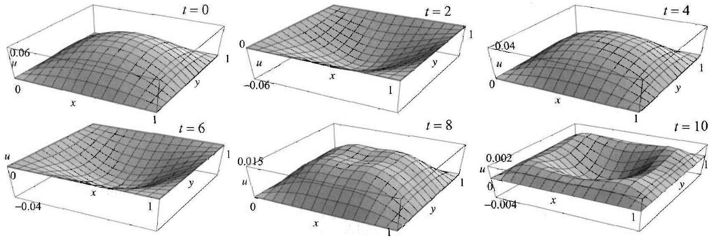

### 11.7 The Two Dimensional Wave and Heat Equations

Figure 1 Initial shape of a membrane with edges held fixed.

Suppose that a thin elastic membrane is stretched over a rectangular frame with dimensions $a$ and $b$, and that the edges are held fixed (Figure 1). The membrane is then set to vibrate by displacing it vertically and then releasing it. The vibrations of the membrane are governed by the two dimensional wave equation

$$
\frac{\partial^{2} u}{\partial t^{2}}=c^{2}\left(\frac{\partial^{2} u}{\partial x^{2}}+\frac{\partial^{2} u}{\partial y^{2}}\right), \quad 0<x<a, \quad 0<y<b, \quad t>0,
$$

where $u=u(x, y, t)$ denotes the deflection at the point $(x, y)$ at time $t$ (see Exercise 8, Section 11.2). The fact that the edges are held fixed is expressed by the condition $u(x, y, t)=0$ on the boundary for all $t \geq 0$. More explicitly, we have the boundary conditions

$$
\begin{array}{ll}
u(0, y, t)=0 \text { and } u(a, y, t)=0 & \text { for } 0 \leq y \leq b \text { and } t \geq 0, \\
u(x, 0, t)=0 \text { and } u(x, b, t)=0 & \text { for } 0 \leq x \leq a \text { and } t \geq 0 .
\end{array}
$$

## The initial conditions

$$
u(x, y, 0)=f(x, y) \quad \text { and } \quad \frac{\partial u}{\partial t}(x, y, 0)=g(x, y)
$$

represent, respectively, the shape and the velocity of the membrane at time $t=0$. To determine the vibrations of the membrane, we must find the function $u$ that satisfies (1)-(3). We solve the boundary value problem using the separation of variables method, following the steps outlined in Section 11.3.

## Separating Variables in (1) and (2)

In applying the method of separation of variables in higher dimensions, it helps to keep in mind the one dimensional cases treated earlier.

We first look for product solutions of the form

$$
u(x, y, t)=X(x) Y(y) T(t) .
$$

Differentiating and plugging into (1), we obtain

$$
X Y T^{\prime \prime}=c^{2}\left(X^{\prime \prime} Y T+X Y^{\prime \prime} T\right) .
$$

Dividing both sides by $c^{2} X Y T$, we get

$$
\frac{T^{\prime \prime}}{c^{2} T}=\frac{X^{\prime \prime}}{X}+\frac{Y^{\prime \prime}}{Y} .
$$

Since the left side is a function of $t$ alone, and the right side is a function of $x$ and $y$ only, the expressions on both sides must be equal to a constant. Expecting a periodic solution in $t$, we consider negative separation constants
only. (We could also rule out the nonnegative cases by arguing, as has been done in previous sections, that they only lead to trivial solutions.) Thus

$$
\frac{T^{\prime \prime}}{c^{2} T}=-k^{2} \quad \text { and } \quad \frac{X^{\prime \prime}}{X}+\frac{Y^{\prime \prime}}{Y}=-k^{2} \quad(k>0)
$$

The first equation yields

$$
T^{\prime \prime}+k^{2} c^{2} T=0
$$

(with periodic solutions) and the second one yields

$$
\frac{X^{\prime \prime}}{X}=-\frac{Y^{\prime \prime}}{Y}-k^{2}
$$

Because in this last equation the right side depends only on $y$ and the left side only on $x$, we infer that

$$
\frac{X^{\prime \prime}}{X}=-\mu^{2} \quad \text { and } \quad-\frac{Y^{\prime \prime}}{Y}-k^{2}=-\mu^{2}, \quad \mu>0
$$

or

$$
X^{\prime \prime}+\mu^{2} X=0 \quad \text { and } \quad Y^{\prime \prime}+\nu^{2} Y=0
$$

where $\nu^{2}=k^{2}-\mu^{2}$. (Here again we have ruled out all nonnegative values of the separation constant on the basis that they lead to trivial solutions.) Separating variables in the boundary conditions (2), we arrive at the equations

$$
\begin{gathered}
X^{\prime \prime}+\mu^{2} X=0, \quad X(0)=0, \quad X(a)=0 \\
Y^{\prime \prime}+\nu^{2} Y=0, \quad Y(0)=0, \quad Y(b)=0 \\
T^{\prime \prime}+c^{2} k^{2} T=0, \quad k^{2}=\mu^{2}+\nu^{2}
\end{gathered}
$$

## Solution of the Separated Equations

The general solutions of the last three differential equations are, respectively,

$$
\begin{gathered}
X(x)=c_{1} \cos \mu x+c_{2} \sin \mu x \\
Y(y)=d_{1} \cos \nu y+d_{2} \sin \nu y \\
T(t)=e_{1} \cos c k t+e_{2} \sin c k t \quad\left(k^{2}=\mu^{2}+\nu^{2}\right)
\end{gathered}
$$

From the boundary conditions for $X$ and $Y$ we get $c_{1}=0$ and $c_{2} \sin \mu a=0$, $d_{1}=0$ and $d_{2} \sin \nu a=0$. Thus

$$
\mu=\mu_{m}=\frac{m \pi}{a} \quad \text { and } \quad \nu=\nu_{n}=\frac{n \pi}{b} \quad m, n=1,2, \ldots,
$$

and so

$$
X_{m}(x)=\sin \frac{m \pi}{a} x \quad \text { and } \quad Y_{n}(y)=\sin \frac{n \pi}{b} y
$$

(Note that if $m=0$ or $n=0$, the solutions are identically zero, which are of no interest. Also, negative choices of $m$ and $n$ would only change the signs of the solutions and hence would not contribute new solutions.) For $m, n=1,2, \ldots$, we have

$$
k=k_{m n}=\sqrt{\mu_{m}^{2}+\nu_{n}^{2}}=\sqrt{\frac{m^{2} \pi^{2}}{a^{2}}+\frac{n^{2} \pi^{2}}{b^{2}}}
$$

and so

$$
T(t)=T_{m n}(t)=B_{m n} \cos \lambda_{m n} t+B_{m n}^{*} \sin \lambda_{m n} t
$$

where we put

$$
\lambda_{m n}=c \pi \sqrt{\frac{m^{2}}{a^{2}}+\frac{n^{2}}{b^{2}}}
$$

The $\lambda_{m n}$ 's are called the characteristic frequencies of the membrane. In contrast to the one dimensional case of a vibrating string, the characteristic frequencies are not integer multiples of any basic frequency.

We have thus derived the product solutions satisfying (1) and (2):

$$
u_{m n}(x, y, t)=\sin \frac{m \pi}{a} x \sin \frac{n \pi}{b} y\left(B_{m n} \cos \lambda_{m n} t+B_{m n}^{*} \sin \lambda_{m n} t\right)
$$

The functions $u_{m n}$ are called the normal modes of the two dimensional wave equation.

## Double Fourier Series Solution of the Entire Problem

In order to find a solution that also satisfies the initial conditions (3), motivated by the superposition principle, we sum all the product solutions and try

$$
u(x, y, t)=\sum_{n=1}^{\infty} \sum_{m=1}^{\infty}\left(B_{m n} \cos \lambda_{m n} t+B_{m n}^{*} \sin \lambda_{m n} t\right) \sin \frac{m \pi}{a} x \sin \frac{n \pi}{b} y
$$

From the initial condition $u(x, y, 0)=f(x, y)$, we get

$$
f(x, y)=\sum_{n=1}^{\infty} \sum_{m=1}^{\infty} B_{m n} \sin \frac{m \pi}{a} x \sin \frac{n \pi}{b} y
$$

The key to computing the coefficients $B_{m n}$ is to observe that the functions $\sin \frac{m \pi}{a} x \sin \frac{n \pi}{b} y$ are "orthogonal" over the rectangle $0 \leq x \leq a, 0 \leq y \leq b$. That is,

$$
\int_{0}^{b} \int_{0}^{a} \sin \frac{m \pi}{a} x \sin \frac{n \pi}{b} y \sin \frac{m^{\prime} \pi}{a} x \sin \frac{n^{\prime} \pi}{b} y d x d y=0
$$

if $(m, n) \neq\left(m^{\prime}, n^{\prime}\right)$. Also, if $(m, n)=\left(m^{\prime}, n^{\prime}\right)$, then we get

$$
\int_{0}^{b} \int_{0}^{a} \sin ^{2} \frac{m \pi}{a} x \sin ^{2} \frac{n \pi}{b} y d x d y=\frac{a b}{4}
$$

SOLUTION OF THE TWO DIMENSIONAL WAVE EQUATION

THEOREM 1 DOUBLE SINE SERIES REPRESENTATION

The proofs of (6) and (7) are straightforward and are left to the exercises. Multiplying (5) by $\sin \frac{m^{\prime} \pi}{a} x \sin \frac{n^{\prime} \pi}{b} y$, integrating over the $a \times b$ rectangle, and using the orthogonality properties, we find

$$
B_{m n}=\frac{4}{a b} \int_{0}^{b} \int_{0}^{a} f(x, y) \sin \frac{m \pi}{a} x \sin \frac{n \pi}{b} y d x d y
$$

The series in (5) with coefficients given by (8) is called the double Fourier sine series of $f$. Similarly, using the second initial condition, we get

$$
g(x, y)=\sum_{n=1}^{\infty} \sum_{m=1}^{\infty} B_{m n}^{*} \lambda_{m n} \sin \frac{m \pi}{a} x \sin \frac{n \pi}{b} y
$$

Arguing as before with the help of orthogonality, we obtain

$$
B_{m n}^{*}=\frac{4}{a b \lambda_{m n}} \int_{0}^{b} \int_{0}^{a} g(x, y) \sin \frac{m \pi}{a} x \sin \frac{n \pi}{b} y d x d y
$$

We have now completely determined the solution of the vibrating rectangular membrane and we summarize our results as follows.

The solution of the two dimensional wave equation (1) with boundary conditions (2) and initial conditions (3) is

$$
u(x, y, t)=\sum_{n=1}^{\infty} \sum_{m=1}^{\infty}\left(B_{m n} \cos \lambda_{m n} t+B_{m n}^{*} \sin \lambda_{m n} t\right) \sin \frac{m \pi}{a} x \sin \frac{n \pi}{b} y
$$

where

$$
\lambda_{m n}=c \pi \sqrt{\frac{m^{2}}{a^{2}}+\frac{n^{2}}{b^{2}}}
$$

and $B_{m n}$ and $B_{m n}^{*}$ are as in (8) and (9).
To justify the convergence of the series in (5), and for ease of reference, we state the double Fourier sine series representation theorem which holds for continuous functions with continuous first and second partial derivatives in $x$ and $y$. (See Fourier Series, by Georgi P. Tolstov, Dover Publications, 1976, p. 178.) This important result will also be needed for the solution of Poisson's equation (Section 11.9).

Suppose that $f(x, y)$ is defined for all $0<x<a, 0<y<b$. Then we have the double Fourier sine series expansion

$$
f(x, y)=\sum_{n=1}^{\infty} \sum_{m=1}^{\infty} B_{m n} \sin \frac{m \pi}{a} x \sin \frac{n \pi}{b} y
$$

where the double Fourier sine series coefficient $B_{m n}$ is given by (8).

EXAMPLE 1 Vibration of a stretched membrane with fixed edges A square membrane with $a=1, b=1$, and $c=1 / \pi$, is placed in the $x y$-plane as shown in the first picture in Figure 2. The edges of the membrane are held fixed, and the membrane is stretched into a shape modeled by the function $f(x, y)= x(x-1) y(y-1), 0<x<1,0<y<1$. Suppose that the membrane starts to vibrate from rest. Determine the position of each point on the membrane for $t>0$.

Solution We have $g(x, y)=0$, and so $B_{m n}^{*}=0$. For $m, n=1,2, \ldots$, we have

$$
\begin{aligned}
B_{m n} & =4 \int_{0}^{1} \int_{0}^{1} x(x-1) y(y-1) \sin m \pi x \sin n \pi y d x d y \\
& =4 \int_{0}^{1} y(y-1) \sin n \pi y d y \int_{0}^{1} x(x-1) \sin m \pi x d x
\end{aligned}
$$

Integrating by parts, we get

$$
\int_{0}^{1} x(x-1) \sin m \pi x d x=\frac{2\left((-1)^{m}-1\right)}{\pi^{3} m^{3}}
$$

A similar formula holds for the integral in the $y$ variable. So,

$$
B_{m n}=4 \frac{2\left((-1)^{n}-1\right)}{\pi^{3} n^{3}} \frac{2\left((-1)^{m}-1\right)}{\pi^{3} m^{3}} \quad \text { for all } m, n=1,2, \ldots
$$

If either $m$ or $n$ is even, $B_{m n}$ is zero. If both $m$ and $n$ are odd, then $B_{m n}=\frac{64}{\pi^{6} m^{3} n^{3}}$. Hence, the solution is

$$
\begin{aligned}
u(x, y, t)= & \sum_{n \text { odd } m \text { odd }} \frac{64}{\pi^{6} m^{3} n^{3}} \sin m \pi x \sin n \pi y \cos \sqrt{m^{2}+n^{2}} t \\
= & \sum_{l=0}^{\infty} \sum_{k=0}^{\infty}\left\{\frac{64}{\pi^{6}(2 k+1)^{3}(2 l+1)^{3}} \sin ((2 k+1) \pi x) \sin ((2 l+1) \pi y)\right. \\
& \left.\quad \times \cos \sqrt{(2 k+1)^{2}+(2 l+1)^{2}} t\right\} .
\end{aligned}
$$

Figure 2 Shape of the membrane in Example 1 at various values of $t$.

It is important to note in Example 1 that, in contrast to the case of a vibrating string, the motion of the membrane is not periodic in $t$. This is due to the fact that the characteristic frequencies are not harmonically relatedthey are not integer multiples of a fixed frequency. Thus the superposition of the normal modes is not periodic.

## Nodal Lines

As an experiment, we sprinkle sand on the surface of a vibrating membrane. It is observed that for certain frequencies the sand gathers on fixed curves on the surface. These curves, known as nodal lines, consist of the points that remain fixed as the membrane vibrates. We illustrate this phenomenon by analyzing the solution when it is given by

$$
u_{m n}(x, y, t)=\sin \frac{m \pi}{a} x \sin \frac{n \pi}{b} y\left(B_{m n} \cos \lambda_{m n} t+B_{m n}^{*} \sin \lambda_{m n} t\right)
$$

The points $(x, y)$ that remain fixed for all $t$ are solutions of the equation $u_{m n}(x, y, t)=0$ for all $t>0$. Thus to determine the nodal lines it is enough to solve the equation

$$
\sin \frac{m \pi}{a} x \sin \frac{n \pi}{b} y=0, \quad \text { for } 0<x<a, \quad 0<y<b .
$$

For example, when $a=b=1$, the nodal line for $u_{21}$ is the line $x=\frac{1}{2}$. The nodal lines for $u_{22}$ are $x=\frac{1}{2}$ and $y=\frac{1}{2}$. The nodal lines for $u_{32}$ are $x=\frac{1}{3}$, $x=\frac{2}{3}, y=\frac{1}{2}$ (Figure 3).

Figure 3 Nodal lines for $u_{21}, u_{22}, u_{32}$.

## Two Dimensional Heat Equation

We end this section by stating the solution of the two dimensional heat equation with homogeneous boundary conditions. This two dimensional heat problem models the distribution of temperature in a thin rectangular plate with insulated faces, edges kept at zero temperature, and with an initial temperature distribution $f(x, y)$. The solution of the problem is based on the separation of variables technique and follows step by step the solution of the two dimensional wave equation. The details are outlined in the exercises.

SOLUTION OF THE TWO DIMENSIONAL HEAT EQUATION FOR A RECTANGLE

The solution of the two dimensional heat equation

$$
\frac{\partial u}{\partial t}=c^{2}\left(\frac{\partial^{2} u}{\partial x^{2}}+\frac{\partial^{2} u}{\partial y^{2}}\right), \quad 0<x<a, \quad 0<y<b, \quad t>0
$$

with boundary conditions

$$
u(0, y, t)=u(a, y, t)=0, \quad 0<y<b, \quad t>0
$$

(12)

$$
u(x, 0, t)=u(x, b, t)=0, \quad 0<x<a, \quad t>0
$$

and initial condition

$$
u(x, y, 0)=f(x, y), \quad 0<x<a, \quad 0<y<b
$$

is

$$
u(x, y, t)=\sum_{n=1}^{\infty} \sum_{m=1}^{\infty} A_{m n} \sin \frac{m \pi}{a} x \sin \frac{n \pi}{b} y e^{-\lambda_{m n}^{2} t},
$$

where

$$
\lambda_{m n}=c \pi \sqrt{\frac{m^{2}}{a^{2}}+\frac{n^{2}}{b^{2}}}
$$

and

$$
\begin{gathered}
A_{m n}=\frac{4}{a b} \int_{0}^{b} \int_{0}^{a} f(x, y) \sin \frac{m \pi}{a} x \sin \frac{n \pi}{b} y d x d y \\
m, n=1,2, \ldots
\end{gathered}
$$

## EXAMPLE 2 A two dimensional heat problem

Solve the heat problem in a square plate with $a=b=1$, and $c=\frac{1}{\pi}$. Assume that the edges are kept at zero temperature and the initial temperature distribution is $u(x, y, 0)=100^{\circ}$.
Solution We have

$$
u(x, y, t)=\sum_{n=1}^{\infty} \sum_{m=1}^{\infty} A_{m n} \sin m \pi x \sin n \pi y e^{-\lambda_{m n}^{2} t}
$$

where $\lambda_{m n}=\sqrt{m^{2}+n^{2}}$ and

$$
\begin{aligned}
A_{m n} & =400 \int_{0}^{1} \int_{0}^{1} \sin m \pi x \sin n \pi y d x d y \\
& =\frac{400}{\pi^{2}} \frac{\left[1-(-1)^{m}\right]\left[1-(-1)^{n}\right]}{m n}
\end{aligned}
$$

Since $A_{m n}$ is zero if either $m$ or $n$ is even, we get

$$
u(x, y, t)=\frac{1600}{\pi^{2}} \sum_{k=0}^{\infty} \sum_{l=0}^{\infty} \frac{\sin (2 l+1) \pi x \sin (2 k+1) \pi y}{(2 l+1)(2 k+1)} e^{-\lambda_{(2 l+1)(2 k+1)}^{2} t} .
$$

Figure 4 shows the temperature distribution in the plate at various values of $t$. Note how the temperature smooths out across the membrane and tends to zero. This is precisely what we would expect in view of the boundary conditions (zero temperature).

Figure 4 Temperature distribution in Example 2 at various times (using a partial sum with $k$ and $l$ running from 0 to 4). The first picture approximates the initial temperature distribution. Note the zero temperature on the boundary for $t>0$.

## Exercises 3.7

In Exercises 1-8, (a) solve the boundary value problem (1)-(3) with $a=b=1$, $c=1 / \pi$, and the given functions $f$ and $g$.
(b) Plot a partial sum of the series solution at various values of to illustrate the vibrations of the membrane. Include the graph at $t=0$ and compare it to the graph of $f(x, y)$.

1. $f(x, y)=\sin 3 \pi x \sin \pi y, g(x, y)=0$.
2. $f(x, y)=\sin \pi x \sin \pi y, g(x, y)=\sin \pi x$.
3. $f(x, y)=x(1-x) y(1-y), g(x, y)=2 \sin \pi x \sin 2 \pi y$.
4. $f(x, y)=x \cos \frac{\pi x}{2} y(1-y), g(x, y)=1$.
5. $f(x, y)=0, g(x, y)=1$.
6. $f(x, y)=0, g(x, y)=x(1-y)$.
7. $f(x, y)=x\left(1-e^{x-1}\right) y\left(1-y^{2}\right), g(x, y)=0$.
8. $f(x, y)=\sin (x y) \cos \frac{\pi x}{2} \sin \pi y, g(x, y)=0$.

In Exercises 9-10, find and plot the nodal lines for the given function.
9. $u(x, y, t)=\sin 4 \pi x \sin \pi y \cos t, 0<x<1,0<y<1$.
10. $u(x, y, t)=\sin \frac{3 \pi}{2} x \sin \pi y \sin \sqrt{2} t, 0<x<2,0<y<1$.

In Exercises 11-14, solve the heat equation (11) in a unit square ( $a=b=1$ ) with the given initial temperature distribution $f$. Assume that the edges are kept at zero temperature and that $c=1$.
11. $f(x, y)=100$.
12. $f(x, y)=x(1-x) y(1-y)$.
13. $f(x, y)=\sin \pi x \sin \pi y$
14.

$$
f(x, y)= \begin{cases}1 & \text { if } y \leq x \\ 0 & \text { otherwise }\end{cases}
$$

15. (a) Take $c=1$ in Example 2 and plot the solutions for various values of $t$.

Approximate how long it will take for the maximum temperature in the plate to drop to $50^{\circ}$.
(b) What is the answer if $c=2$ ? What is your conclusion about the speed of heat transfer as a function of $c$ ?
16. Establish relations (6) and (7) (orthogonality and normalization of the functions $\sin \frac{m \pi}{a} x \sin \frac{n \pi}{b} y$ ).
17. Project Problem: In this exercise we derive (13), the solution of the heat problem.
(a) Show that if we assume $u=X(x) Y(y) T(t)$ then the separation of variables method yields

$$
\begin{gathered}
X^{\prime \prime}+\mu^{2} X=0, \quad X(0)=0, \quad X(a)=0 \\
Y^{\prime \prime}+\nu^{2} Y=0, \quad Y(0)=0, \quad Y(b)=0 \\
T^{\prime}+c^{2}\left(\mu^{2}+\nu^{2}\right) T=0
\end{gathered}
$$

(b) Obtain the product solutions

$$
u_{m n}(x, y, t)=A_{m n} e^{-c^{2}\left[\left(\frac{m \pi}{a}\right)^{2}+\left(\frac{n \pi}{b}\right)^{2}\right] t} \sin \frac{m \pi}{a} x \sin \frac{n \pi}{b} y .
$$

(c) Given the initial temperature distribution $f(x, y)$, derive (13)-(15) using Theorem 1.
