<!-- Page 1 -->

Left margin note (page 1)

Topics to Review
Sections 3.1 and 3.2 present introductory material. The main section of this chapter is 3.3 because it contains the general method of separation of variables. Sections 3.3, 3.5, and 3.8 use the basic theory of Fourier series as presented in Sections 2.1-2.4. Section 3.6 treats heat problems that lead to generalized Fourier series which occur for the first time in the book. Section 3.7 is an extension of Sections 3.3 and 3.5 to two dimensions. Sections 3.9-3.10 use double Fourier series (Section 3.7) and Laplace's equation (Section 3.8). Section 3.11 contains theoretical properties of the heat and Laplace's equations. This section is self-contained and builds on basic results from calculus of several variables.

Looking Ahead...
The topics of this chapter are central to the text. With the applications the abstract theories that we have presented thus far will come to life. You will see how the notion of expanding a function in a Fourier series (Sections 3.3 and 3.5), or a generalized Fourier series (Section 3.6), becomes a very natural thing to do when solving a partial differential equation with the method of separation of variables. The ideas of this chapter will be further extended and generalized in later chapters. Sections 3.7-3.11 can be omitted without affecting the continuity of a basic course on partial differential equations.

Right margin note (page 1)

L

rems. tions rmuts. ANN
tions ns of ter is nted probs. Its a seour esent riety paralems volve ing a sting printhe these eness

++++

3

PARTIAL DIFFERENTIA
EQUATIONS IN
RECTANGULAR
COORDINATES
. . . partial differential equations are the basis of all physical theor In the theory of sound in gases, liquids and solids, in the investiga of elasticity, in optics, everywhere partial differential equations fo late basic laws of nature which can be checked against experimen
-BERNHARD RIEM

In this chapter we solve some important partial differential equa that arise in the modeling of physical problems involving functio more than one variable. The approach on which most of this chap based is called the method of separation of variables and is prese in Section 3.3. This powerful method enables us to reduce new 1 lems in several variables to familiar ordinary differential equation success stems from the fact that a function can be expanded in ries in terms of certain special functions. It is at this point tha knowledge of Fourier series will be used. In Section 3.9 we pr the method of eigenfunction expansions and use it to solve a va of problems that cannot be solved directly by the method of se tion of variables. In Section 3.10 we present two dimensional prob with new boundary conditions, called Robin conditions, that in a function and its normal derivative. We solve these problems us combination of tools that we have developed in previous sections Solutions of the heat and Laplace's equations have many intere mathematical properties; one of them is given by the maximum ciple and is presented in Section 3.11. Its statement concerns maximum and minimum values of the solutions. In addition to qualitative properties, we will also discuss the question of uniqu of solutions of boundary value problems.

---

<!-- Page 2 -->

Left margin note (page 2)

104 Chapter 3 Par
3.1 Partial

Right margin note (page 2)

modIf a leling differarise der of memneory, these . In equaction This which with
oordiu will
tion) ation) tion) tion) tion) tion) tion)
t and d are
der of nown

++++

tial Differential Equations in Rectangular Coordinates

Differential Equations in Physics and Engineering
As you may recall, ordinary differential equations arise naturally when eling physical phenomena, such as mechanical and electrical oscillations phenomenon involves functions of more than one variable, then the mod will typically involve several partial derivatives and lead to a partial c ential equation. As we saw in Section 1.2, partial differential equations in the study of vibrating strings. Indeed, as will be seen in the remain the book, they are fundamental to the description of the mechanics of branes, rods, and plates, heat flow in a homogeneous body, potential th electromagnetism, and elasticity, to name just a few. The theory of equations is extensive and covers many areas of applied mathematics this chapter we study some of the most important partial differential tions and their classical applications. To solve these equations, in Se 3.3 we will introduce the so-called method of separation of variables. method leads naturally to solutions in terms of Fourier expansions, will play a crucial role in the implementation of the method. We start a sampling of equations that will be encountered in this text.

EXAMPLE 1 Classical partial differential equations
Let $u$ denote a function of two or more variables $t$ (time), $x$ and $y$ (spatial c nates). The following are examples of partial differential equations that yo study in this book.
(a) $\frac{\partial^{2} u}{\partial t^{2}}=c^{2} \frac{\partial^{2} u}{\partial x^{2}}$ (one dimensional wave equa
(b) $\frac{\partial^{2} u}{\partial t^{2}}=c^{2}\left(\frac{\partial^{2} u}{\partial x^{2}}+\frac{\partial^{2} u}{\partial y^{2}}\right)$ (two dimensional wave equ
(c) $\frac{\partial u}{\partial t}=c^{2} \frac{\partial^{2} u}{\partial x^{2}}$ (one dimensional heat equa
(d) $\frac{\partial u}{\partial t}=c^{2}\left(\frac{\partial^{2} u}{\partial x^{2}}+\frac{\partial^{2} u}{\partial y^{2}}\right)$ (two dimensional heat equa
(e) $\frac{\partial^{2} u}{\partial x^{2}}+\frac{\partial^{2} u}{\partial y^{2}}=0$ (two dimensional Laplace equa
(f) $\frac{\partial^{2} u}{\partial x^{2}}+\frac{\partial^{2} u}{\partial y^{2}}=f(x, y)$ (two dimensional Poisson equa
(g) $\frac{\partial^{2} u}{\partial t^{2}}-c^{2} \frac{\partial^{2} u}{\partial x^{2}}+2 B \frac{\partial u}{\partial t}+A u=0$ (telegraph equa
(h) $i \hbar \frac{\partial \psi}{\partial t}=-\frac{\hbar^{2}}{2 m} \frac{\partial^{2} \psi}{\partial x^{2}}+V(x) \psi$ (one dimensional Schrödinger equation

The expression $\frac{\partial^{2} u}{\partial x^{2}}+\frac{\partial^{2} u}{\partial y^{2}}$ shows up in most of the equations above. its higher dimensional analogs are known as the Laplacian of $u$ an denoted by $\Delta u$ or $\nabla^{2} u$.

The order of the partial differential equation is the highest orc derivative that appears. The equation is called linear if the unk

---

<!-- Page 3 -->

Right margin note (page 3)

105

ne of near. rder.
artial
on.
ntial
on is nice nple, than d not ential ction inear n , all
equaon on alled of a 0 or und$\mathbf{n}$, or tions condary is a 1 is
wing heo-

++++

Section 3.1 Partial Differential Equations in Physics and Engineering
function and the partial derivatives are of the first degree and at most o these appears in any given term, otherwise, the equation is called nonlir The differential equations of Example 1 are all linear of the second o But the second order equation
$$
\frac{\partial^{2} u}{\partial t \partial x}+u \frac{\partial u}{\partial x}=e^{x}
$$
is nonlinear because the term $u \frac{\partial u}{\partial x}$ has both $u$ and $\frac{\partial u}{\partial x}$ in it.
To simplify notation, it is common to use subscripts to denote pa derivatives. For example, $u_{x}=\frac{\partial u}{\partial x}, u_{y}=\frac{\partial u}{\partial y}, u_{x y}=\frac{\partial^{2} u}{\partial x \partial y}$, and s With this notation, we can write the general linear partial differe equation of order two in two variables as
$$
A u_{x x}+2 B u_{x y}+C u_{y y}+D u_{x}+E u_{y}+F u=G
$$
where $A, B, C, D, E, F, G$ are functions of $x$ and $y$. The equati called homogeneous if $G=0$. We shall always assume that $u$ is a enough function that its mixed partial derivatives are equal (for exar $u_{x y}=u_{y x}, u_{x x y}=u_{x y x}=u_{y x x}$, etc.) for partial derivatives of order less or equal to the order of the equation in which $u$ appears. Thus we nee write an explicit term in $u_{y x}$ in (1). In general, a linear partial differe equation in which each nonzero term contains either the unknown fun or one of its partial derivatives is called homogeneous; otherwise, the l equation is called nonhomogeneous. Except for the Poisson equatio the differential equations of Example 1 are homogeneous.

The modeling of a physical problem is often done with a differential tion and a set of other equations that describe the behavior of the solutic the boundary of the region under consideration. These equations are boundary conditions. Other equations may enter into the description physical phenomenon such as the initial values of the solution at time $t=$ initial conditions. The partial differential equation along with the bo ary and initial conditions is called an initial boundary value proble simply a boundary value problem. (We have already seen these no illustrated in the example of the vibrating string in Section 1.2.) The cepts of linearity and homogeneity extend also to the initial and boun conditions. For example, the initial condition $u(x, 0)+u_{x}(x, 0)=0$ linear homogeneous condition, while the condition $u(x, 0)+u_{x}(x, 0)=$ linear but not homogeneous.

As in the case of ordinary differential equations, we have the follo useful result whose verification is left as an exercise. (Compare with rem 4, Appendix A.1.)

---

<!-- Page 4 -->

Left margin note (page 4)

106
Chapter 3 Partial Differe

THEOREM 1
SUPERPOSITION
PRINCIPLE

Right margin note (page 4)

equa$c_{2}$ are homo-
with , you
in $y$
blace's nonic of the nation set of e parlution solu-
ation sition
haracin the
of this

ration

++++

ential Equations in Rectangular Coordinates

If $u_{1}$ and $u_{2}$ are solutions of a linear homogeneous partial differential tion, then any linear combination $u=c_{1} u_{1}+c_{2} u_{2}$, where $c_{1}$ and constants, is also a solution. If in addition $u_{1}$ and $u_{2}$ satisfy a linear geneous boundary condition, then so will $u=c_{1} u_{1}+c_{2} u_{2}$.

EXAMPLE 2 Superposition of solutions
Consider the two dimensional Laplace equation
$$
\frac{\partial^{2} u}{\partial x^{2}}+\frac{\partial^{2} u}{\partial y^{2}}=0 .
$$

It is linear of the second order and homogeneous. (It is of the form (1), $A=C=1$ and $B=D=E=F=G=0$.) By plugging into the equation can check that the functions
$$
u=x+y, u=x^{2}-y^{2}, u=\frac{x}{x^{2}+y^{2}}, u=\frac{y}{x^{2}+y^{2}}, u=\ln \left(x^{2}+y^{2}\right), u=e^{x} \mathrm{~s}
$$
are all solutions. In fact, there are many more functions that satisfy Lap equation, some of them being given in the exercises. These are called harr functions. Thus, unlike the case of a linear ordinary differential equation second order, where its general solution can be expressed as a linear combir of two functions, a linear partial differential equation may have an infinite unrelated (linearly independent) solutions. The superposition principle will b ticularly useful for generating further solutions. For example, we can get a so of Laplace's equation by taking any linear combination from the above list o tions. A specific illustration would be the function $(x+2 y) /\left(x^{2}+y^{2}\right)$.

Before superposing solutions, you should always check that the equ is linear and homogeneous. As our next example shows, the superpo principle fails badly if the equation is not linear.

EXAMPLE 3 Failure of the superposition principle
The first order equation
$$
u_{t}+u u_{x}=0
$$
is nonlinear because of the term $u u_{x}$. It can be solved using the method of c teristic curves, as we did in Section 1.1 (see the part on nonlinear equations exercises, below). You can check by plugging into (2) that
$$
u(x, t)=\frac{x}{t+1}
$$
is a solution. However, you can see immediately that a scalar multiple solution, say
$$
\frac{c x}{t+1},
$$
is not a solution of (2), unless $c=1$ or $c=0$. Thus Theorem 1 fails if the eq is not linear.

---

<!-- Page 5 -->

Right margin note (page 5)

107 how lica-
und$y$ are ential $=0$.
equa-equaand $b$ tions pariptic assify

++++

Section 3.1 Partial Differential Equations in Physics and Engineering

In the next section we will introduce modeling techniques and show some of the equations that we encountered in this section arise in app tions. Our focus will be on the wave equation.
Exercises 3.1
In Exercises 1-6 decide whether the given partial differential equation and bc ary or initial conditions are linear or nonlinear, and, if linear, whether the homogeneous or nonhomogeneous. Determine the order of the partial differe equation.
1. $u_{x x}+u_{x y}=2 u, \quad u_{x}(0, y)=0$.
2. $u_{x x}+x u_{x y}=2, u(x, 0)=0, u(x, 1)$
3. $u_{x x}-u_{t}=f(x, t), \quad u_{t}(x, 0)=2$.
4. $u_{x x}=u_{t}, \quad u(x, 0)=1, \quad u(x, 1)=0$.
5. $u_{t} u_{x}+u_{x t}=2 u, \quad u(0, t)+u_{x}(0, t)=0$.
6. $u_{x x}+e^{t} u_{t t}=u \cos x, \quad u(x, 0)+u(x, 1)=0$.
7. Verify that the given functions are solutions of the two dimensional Laplace tion.
(a) $\quad u=x+y$.
(b) $\quad u=x^{2}-y^{2}$.
(c) $\quad u=\frac{x}{x^{2}+y^{2}}$.
(d) $\quad u=\frac{y}{x^{2}+y^{2}}$.
(e) $\quad u=\ln \left(x^{2}+y^{2}\right)$.
(f) $\quad u=e^{y} \cos x$.
(g) $\quad u=\ln \left(x^{2}+y^{2}\right)+e^{y} \cos x$.
(h) $\quad u=e^{y} \cos x+x+y$.
8. Verify that the function
$$
u=\frac{1}{\sqrt{x^{2}+y^{2}+z^{2}}}
$$
is a solution of the three dimensional Laplace equation
$$
u_{x x}+u_{y y}+u_{z z}=0
$$
9. Consider the general homogeneous linear second order partial differential tion
$$
A u_{x x}+2 B u_{x y}+C u_{y y}+D u_{x}+E u_{y}+F u=0
$$
(a) Show that the function $u(x, y)=e^{a x} e^{b y}$ is a solution if and only if $a$ : satisfy the equation
$$
A a^{2}+2 B a b+C b^{2}+D a+E b+F=0
$$
(b) Find at least four solutions of the equation
$$
u_{x x}+2 u_{x y}+u_{y y}+2 u_{x}+2 u_{y}+u=0
$$
10. The telegraph equation
$$
u_{t t}+2 B u_{t}-c^{2} u_{x x}+A u=0
$$
governs the flow of electricity along a cable. Use Exercise 9 to find two solu assuming $c>0$ and $A>0$.
11. Classification of second-order linear equations. A second order linear tial differential equation in two variables, written in the form (1), is called ell if $A C-B^{2}>0$; hyperbolic if $A C-B^{2}<0$; parabolic if $A C-B^{2}=0$. Cla

---

<!-- Page 6 -->

Left margin note (page 6)

108
Chapter 3
Partial Differe

Right margin note (page 6)

ions (if rations ing the 12-14 tion of details m Sec), $t$ ) is
onstant Hence nat the se lines
quation $=x(0)$. inction ). ndition ic lines yields

Ids the ging it
of Ex$=x^{2}$. s for a

0 .

++++

ntial Equations in Rectangular Coordinates
equations (a), (c), (e), (f), and (g) of Example 1 according to these definit the equation involves $t$, treat $t$ as $y$ in equation (1)).
Project Problem: Nonlinear equations of the first order. These eql are of great importance in modeling of traffic flow, shock waves, waves break sound barrier and many other branches of applied mathematics. In Exercises you will study the nonlinear equation
$$
u_{t}+A(u) u_{x}=0, \text { with initial condition } u(x, 0)=\phi(x),
$$
where $A(u)$ is a function of $u$. When $A(u)=u$, (3) reduces to the equa Example 3.
12. Rewrite the following outlined solution of (3) by providing as many as possible. The solution is based on the notion of characteristic curves fro tion 1.1.
Step 1: Interpret (3) as a directional derivative and conclude that $u(x(t)$ constant on the curve $x=x(t)$, with direction field given by
$$
\frac{d x}{d t}=A(u(x(t), t)) .
$$

These are the characteristic curves of (3).
Step 2: Let $x(t)$ denote a characteristic curve (a solution of (4)). Since $u$ is cc along $(x(t), t)$, it follows that $u(x(t), t)=u(x(0), 0)=\phi(x(0))$, by (3).
$A(u(x(t), t))$ is constant and equals $A(\phi(x(0)))$. We conclude from (4) th characteristic curves are straight lines with slopes $A(\phi(x(0)))$. We write the in the form
$$
x=t A(\phi(x(0)))+x(0)
$$

Step 3: We complete the solution of (3) by solving for $x(0)$ in the preceding ec to get an implicit relation for the characteristic lines, of the form $L(x, t)=$ The final solution of (3) will be of the form $u(x, t)=f(L(x, t))$, where $f$ is a f chosen so as to satisfy the initial condition in (3). That is, $f(L(x, 0))=\phi(x$

As an illustration of this method, let us solve (2) with the initial co $u(x, 0)=x$. Here $A(u)=u$, and $\phi(x)=x$. From Step 2, the characterist are of the form $x=t x(0)+x(0)$. Solving for $x(0)$, we get $x(0)=\frac{x}{t+1}$, which the implicit relation $L(x, t)=\frac{x}{t+1}$. Thus the solution is
$$
u(x, t)=f\left(\frac{x}{t+1}\right)
$$

Setting $t=0$ and using the initial condition, we obtain $f(x)=x$, which yie solution $u(x, t)=\frac{x}{t+1}$. You can check the validity of this solution by plug back into the equation.

In Exercises 13-16, solve the given nonlinear problem, following the method ercise 12.
13. $u_{t}+\ln (u) u_{x}=0, \quad u(x, 0)=e^{x}$.
14. $u_{t}+(u+1) u_{x}=0, \quad u(x, 0)=$
[Hint: In determining $L(x, t)$ in Step 2, you will have two possible choice solution. Take the one that satisfies $\lim _{t \rightarrow 0} u(x, t)=u(x, 0)=x^{2}$.]
15. $u_{t}+(2+u) u_{x}=0, \quad u(x, 0)=x^{2}$. [Hint: See the hint for Exercise 14.]
16. $u_{t}+u^{2} u_{x}=0, \quad u(x, 0)=x . \quad$ 17. $u_{t}+u^{2} u_{x}=0, \quad u(x, 0)=\sqrt{x}, x>$

---

<!-- Page 7 -->

Left margin note (page 7)

3.2 Modelin®

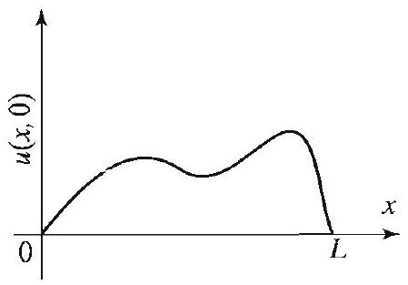

Figure 1 Initial shap string, $u(x, 0)$.

Right margin note (page 7)

109

As wave -axis cing the verse In We for rtial ne $u$ not
).
ontal verse ning ring,
cting o its g on the ring, le, it rains ance
d $B$, t the g on en $\tau_{1}$ tions need

++++

Section 3.2 Modeling: Vibrating Strings and the Wave Equation

: Vibrating Strings and the Wave Equation
In this section we derive the equation governing the vibrating string. you may have guessed, our goal is to arrive at the one dimensional equation that we investigated briefly in Section 1.2.

Consider a stretched string of length $L$ with ends fastened on the $x$ at $x=0$ and $x=L$. Suppose that the string is set to vibrate by displa it from its equilibrium position and then releasing it. Assuming that string vibrates only in a fixed plane, we let $u(x, t)$ denote the trans displacement at time $t \geq 0$ of the point on the string at position $x$. particular, $u(x, 0)$ denotes the initial shape of the string (see Figure 1). wish to determine the subsequent motion of the string by finding $u(x, t t>0$ and $0<x<L$. To this end, in this section we derive the pa differential equation that $u$ satisfies, and in the next section we determi by solving this differential equation subject to certain conditions.

In our study we make the following simplifying assumptions that are far from being realistic, say in the case of a taut guitar string.
1. The string has a constant mass density $\rho$ (homogeneous string
2. The string is perfectly elastic and offers no resistance to bending.
3. The motion of the string is transverse only (this implies the horiz component of the tension is the same at all points). The trans vibrations of the string are small and take place in a plane contai the $x$-axis, the $x u$-plane. Also, the slope at any point of the st $\partial u / \partial x$, is small.

Modeling the Free Vibrations of the String
We start by analyzing the situation in which no external force is a on the string, and the weight of the string is negligible compared t tension. Thus in our first experiment, the only significant force actin the string is its tension. Let $\tau$ denote the magnitude of the tension ir equilibrium position. This tension is the same at every point of the st and since the change in the length of the string as it moves is negligib is reasonable to make the simplifying assumption that the tension rem constant throughout the motion. Also, since the string offers no resist to bending, the tension is tangent to the string at every point.

Consider a small portion of the string between two points $A$ an located at $x$ and $x+\Delta x$, respectively. Let $\tau_{1}$ and $\tau_{2}$ be the tensions a points $A$ and $B$, respectively (these are the forces exerted by the strin the small portion from its left and right endpoints, respectively). The and $\tau_{2}$ both have magnitude $\tau$ but will, in general, have different direc (Figure 2(a)). Since there is no motion in the horizontal direction, we only consider the vertical components of the tensions.

---

<!-- Page 8 -->

Left margin note (page 8)

110
Chapter 3 Partial Differe

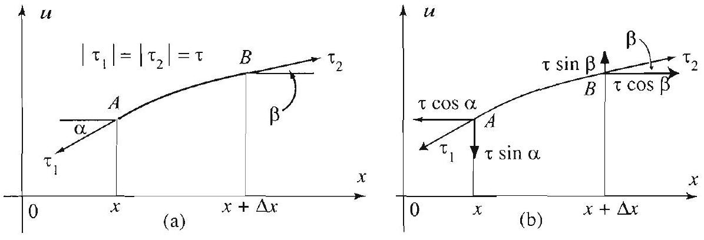

Figure 2 Forces acting on a small portion of the string.

Right margin note (page 8)

$\tau_{2}$
$x$

ere $\alpha$ points comand es the
bllows e the

Since

one

++++

ntial Equations in Rectangular Coordinates

The vertical components of the tensions are $-\tau \sin \alpha$ and $\tau \sin \beta$, wh and $\beta$ are the angles formed by the tangents and the horizontal at the $A$ and $B$ (Figure 2(b)). Newton's second law applied to the vertical ponents yields the equation
$$
-\tau \sin \alpha+\tau \sin \beta=m a,
$$
where $m$ is the mass of the portion of the string between $x$ and $x+\Delta x a$ is its acceleration. We have $a=\frac{\partial^{2} u}{\partial t^{2}}$ and $m=\rho \Delta x$, where $\rho$ denot mass density of the string (i.e., the mass per unit length). Hence
$$
-\tau \sin \alpha+\tau \sin \beta=\rho \Delta x \frac{\partial^{2} u}{\partial t^{2}} .
$$

Note that for a very small angle $\theta$, because $\cos \theta$ is approximately 1 , it fc that $\sin \theta$ is approximately equal to $\tan \theta$. So, in (1), we can replac sine by the tangent and get
$$
-\tau \tan \alpha+\tau \tan \beta=\rho \Delta x \frac{\partial^{2} u}{\partial t^{2}} .
$$

Fix $t$ for the moment and consider $u(x, t)$ as a function of $x$ alone. the slope of the tangent line to the graph of $u(x, t)$ is $\frac{\partial u}{\partial x}(x, t)$, we get
$$
\tan \alpha=\frac{\partial u}{\partial x}(x, t) \quad \text { and } \quad \tan \beta=\frac{\partial u}{\partial x}(x+\Delta x, t) .
$$

Putting these into (2) we obtain
$$
\begin{aligned}
\tau\left[\frac{\partial u}{\partial x}(x+\Delta x, t)-\frac{\partial u}{\partial x}(x, t)\right] & =\rho \Delta x \frac{\partial^{2} u}{\partial t^{2}} \\
\frac{\frac{\partial u}{\partial x}(x+\Delta x, t)-\frac{\partial u}{\partial x}(x, t)}{\Delta x} & =\frac{\rho}{\tau} \frac{\partial^{2} u}{\partial t^{2}}
\end{aligned}
$$

As $\Delta x \rightarrow 0$, the quotient on the left tends to $\frac{\partial^{2} u}{\partial x^{2}}(x, t)$, and we get th dimensional wave equation for the free vibrations of the string
$$
\frac{\partial^{2} u}{\partial t^{2}}=c^{2} \frac{\partial^{2} u}{\partial x^{2}},
$$

---

<!-- Page 9 -->

Left margin note (page 9)

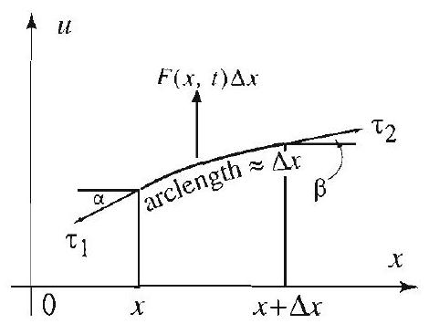

Figure 3 Force diagram for forced vibrations.

Right margin note (page 9)

111

and
eight force ntial force s we
ernal nted
the qua-
rious
neous
$10^{-3}$
sures

++++

Section 3.2 Modeling: Vibrating Strings and the Wave Equation

where we have set
$$
c^{2}=\frac{\tau}{\rho} .
$$

Note that $c$ represents a velocity, since $\tau$ has units of mass-length/time ${ }^{2} \rho$ has units of mass/length, so that $c^{2}$ has units of length ${ }^{2} /$ time $^{2}$.

Case of Forced Vibrations
If additional transverse forces are acting on the string (due to its w or other impressed exterior forces), let $F(x, t)$ denote the amount of per unit length acting in the $u$-direction. To derive the partial differe equation in this case, all we have to do is account for the additional by adding $F(x, t) \Delta x$ to the left of (2). After carrying out the details, did before, we get the equation of forced vibrations of the string
$$
\frac{\partial^{2} u}{\partial t^{2}}=c^{2} \frac{\partial^{2} u}{\partial x^{2}}+\frac{F(x, t)}{\rho} .
$$

Two special cases of (5) are particularly interesting. When the ext force is due to the gravitational acceleration $g$ only (consider a string orie horizontally), the equation becomes
$$
\frac{\partial^{2} u}{\partial t^{2}}=c^{2} \frac{\partial^{2} u}{\partial x^{2}}-g .
$$

When the external force is due to resistance that is proportional to instantaneous velocity (a string vibrating in a fluid, for example), the $\epsilon$ tion becomes
$$
\frac{\partial^{2} u}{\partial t^{2}}+2 k \frac{\partial u}{\partial t}=c^{2} \frac{\partial^{2} u}{\partial x^{2}},
$$
where $k$ is a positive constant.
In the exercises we use the modeling ideas of this section to derive va: other classical partial differential equations.

Exercises 3.2
In Exercises 1-4, derive the equation of the vibrations of a stretched homoge string with the given conditions.
1. No force other than the tension is to be considered. The linear density is $\mathrm{kg} / \mathrm{m}$, and $\tau=100 N$.
2. Same as Exercise 1, but the weight is to be taken into account.
3. No force other than the tension is to be considered. The string meas 1 m and has mass $10^{-2} \mathrm{~kg}$. The tension is $\tau=10 \mathrm{~N}$.

---

<!-- Page 10 -->

Left margin note (page 10)

112
Chapter 3
Partial Differe

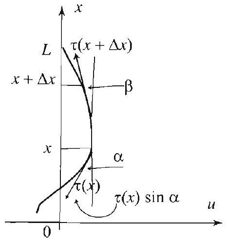

Figure for Exercise 6.

Right margin note (page 10)

ential For oint$(x, t)$ n the mass $x$ is ation Seclaced bar, e bar $t)$ of $x, 0$ ). enote ntally
called mass

4

++++

ntial Equations in Rectangular Coordinates
4. Same as Exercise 3 but taking into account the weight of the string
5. Give the necessary details to derive (5), (6), and (7).
6. The hanging chain. In this exercise we derive the partial differ equation that models the vibrations of a hanging chain of length $L$. convenience, the $x$-axis is placed vertically with the positive direction ing upward, and the fixed end of the chain is fastened at $x=L$. Let $u$ denote the deflection of the chain, which we assume is taking place i $(x, u)$-plane, as shown in the figure, and let $\rho$ denote its mass density per unit length).
(a) Show that, in the equilibrium position, the tension at a point $\tau(x)=\rho g x$, where $g$ is the gravitational acceleration.
(b) Reasoning as we did to derive equations (1) and (2), show that
$$
\begin{array}{c}
\rho \Delta x \frac{\partial^{2} u}{\partial t^{2}}=\tau(x+\Delta x) \sin \beta-\tau(x) \sin \alpha \\
\rho \frac{\partial^{2} u}{\partial t^{2}}=\frac{1}{\Delta x}\left[\tau(x+\Delta x) \frac{\partial u}{\partial x}(x+\Delta x, t)-\tau(x) \frac{\partial u}{\partial x}(x, t)\right] .
\end{array}
$$
(c) Let $\Delta x \rightarrow 0$ and obtain
$$
\rho \frac{\partial^{2} u}{\partial t^{2}}=\frac{\partial}{\partial x}\left[\tau(x) \frac{\partial u}{\partial x}\right],
$$
and finally
$$
\frac{\partial^{2} u}{\partial t^{2}}=g\left(x \frac{\partial^{2} u}{\partial x^{2}}+\frac{\partial u}{\partial x}\right) .
$$

The motion of the chain is completely determined by solving this equ subject to the initial and boundary conditions. This will be done in tion 6.3.
7. Longitudinal vibrations of elastic bars. An elastic bar is p on the $x$-axis with one end fixed at the origin. A displacement of the directed along the $x$-axis and uniform over each cross section, causes th to vibrate parallel to the $x$-axis. The longitudinal displacement $u(x$ a cross section at $x$ for $t>0$ is measured from the initial position $u$ Consider a portion of the bar between $x$ and $x+\Delta x$, and let $F(x, t) \mathrm{d}$ the force exerted on this portion at time $t$ at $x$. It is shown experime that
$$
F(x, t)=-A E u_{x}(x, t),
$$
where $A$ is the area of each cross section and $E$ is a positive constant Young's modulus of elasticity. Let $\rho$ denote the density of the bar per unit volume).

---

<!-- Page 11 -->

Left margin note (page 11)

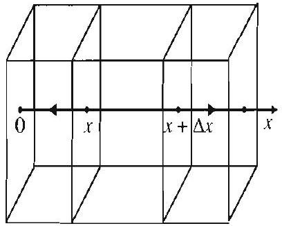

Figure for Exercise

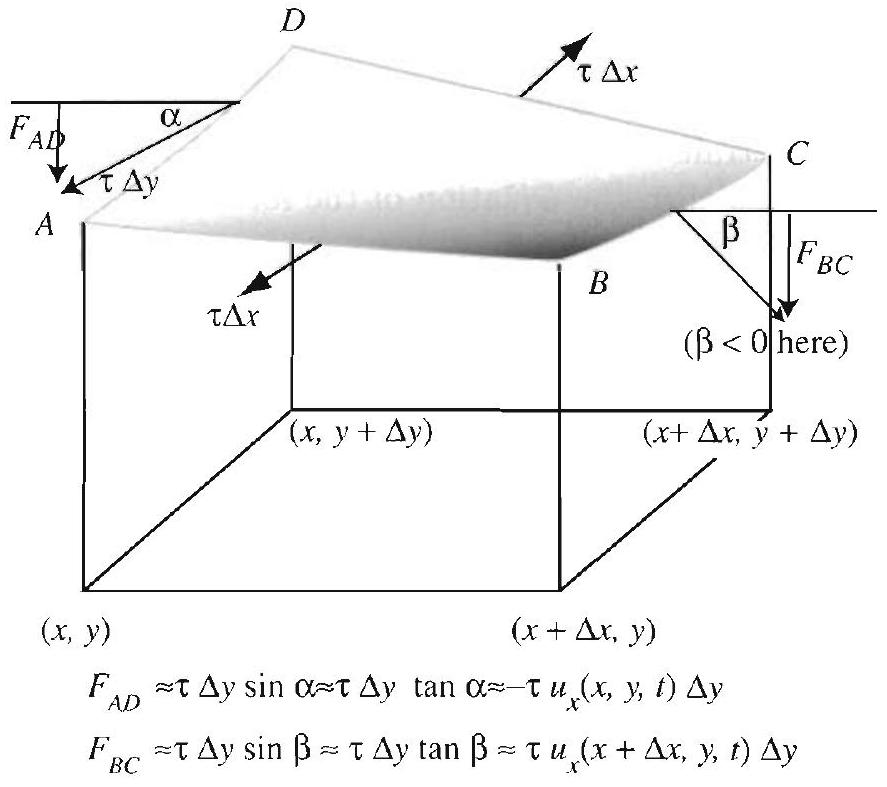

Right margin note (page 11)

113

d by
ngu-anguheld idealn detions. orane to the We stant enote point rtion hown cting ghout er the $e$, the , per-mem-
conthe s on
$A D$ the

++++

Section 3.2 Modeling: Vibrating Strings and the Wave Equation
$$
\begin{array}{l}
\Delta y \tan \alpha \approx-\tau u_{x}(x, y, t) \Delta y \\
\tau \Delta y \tan \beta \approx \tau u_{x}(x+\Delta x, y, t) \Delta y
\end{array}
$$
8. Free transverse vibrations of a recta lar membrane. Consider a flexible rect lar homogeneous membrane whose edges are fixed on a horizontal frame. Under some ization assumptions on the membrane, we ca rive the equation that governs its small vibra We assume that all the points on the mem vibrate only in the vertical direction and the membrane offers no resistance to bending. also assume that at all time tension is con throughout the membrane. Let $u(x, y, t) \mathrm{d}$ the vertical displacement at time $t$ of the $(x, y)$ on the membrane. Consider a small pc $A B C D$ on the surface of the membrane as s in the figure. We now identify the forces a on this portion. Since tension balances throu the interior of this piece, we need only conside tensions along the four edges. Along an edg tension produces a net force pointing outward pendicular to the edge, and tangent to the brane. We focus on the edge $A B$.

The net force on this edge has magnitude $\tau \Delta x$, where $\tau$ is the stant tension per unit length. In the figure we exhibit this vector and corresponding vectors for the other three sides.
(a) Argue that the resultant of the vertical components of the tension the edges $A B$ and $C D$ is approximately
$$
\tau u_{y}(x, y+\Delta y, t) \Delta x-\tau u_{y}(x, y, t) \Delta x ;
$$
and the resultant of the vertical components of the tensions on the edge and $B C$ is approximately
$$
\tau u_{x}(x+\Delta x, y, t) \Delta y-\tau u_{x}(x, y, t) \Delta y .
$$
[Hint: See the figure and refer to the modeling of the vibrations of string.]

---

<!-- Page 12 -->

Left margin note (page 12)

114
Chapter 3
Pa
3.3
Solution
The Me

Figure 1 Initial sh stretched string, $u(x$

Right margin note (page 12)

Deof the unit ations
ration of the full and ve the ations n the enote evious
tions

++++

rtial Differential Equations in Rectangular Coordinates
(b) Assuming that there is no force other than the tension involved motion of the membrane, conclude from Newton's second law that
$$
\begin{array}{l}
\tau\left(u_{y}(x, y+\Delta y, t)-u_{y}(x, y, t)\right) \Delta x \\
\quad+\tau\left(u_{x}(x+\Delta x, y, t)-u_{x}(x, y, t)\right) \Delta y \\
\quad=\Delta x \Delta y \rho u_{t t}(x, y, t)
\end{array}
$$
where $\rho$ is the mass density (mass per unit area) of the membrane. rive the two dimensional wave equation for the free vibrations membrane
$$
u_{t t}=c^{2}\left(u_{x x}+u_{y y}\right), \quad \text { where } c^{2}=\frac{\tau}{\rho} .
$$
(This equation is treated in Section 3.7.)
9. Forced transverse vibrations of a rectangular membrane.
(a) Show that if an external transverse force given by $F(x, y, t)$ per area is acting on the membrane, then the equation of the forced vibra of the membrane is
$$
u_{t t}=c^{2}\left(u_{x x}+u_{y y}\right)+\frac{F}{\rho}, \quad \text { where } c^{2}=\frac{\tau}{\rho} .
$$
(b) If the only external force is due to gravitation, show that the equ becomes
$$
u_{t t}=c^{2}\left(u_{x x}+u_{y y}\right)-g,
$$
where $g$ is the gravitational acceleration.
of the One Dimensional Wave Equation: thod of Separation of Variables

Recall that in Section 1.2 we made a preliminary study of the problem vibrating string (with its ends held fixed). In this section we give th solution of that problem with arbitrary initial position (displacement velocity using the method of separation of variables. That is, we sol

$f(x)$ boundary value problem for the wave equation that describes the vibr of a string with fixed ends. The string is assumed to be stretched o
ape of a , 0 ).
$x$-axis with ends fastened at $x=0$ and $x=L$ (Figure 1). Let $u(x, t) \mathrm{d}$ the position at time $t$ of the point $x$ on the string. We saw in the pre section that $u$ satisfies the one dimensional wave equation
$$
\frac{\partial^{2} u}{\partial t^{2}}=c^{2} \frac{\partial^{2} u}{\partial x^{2}}, \quad 0<x<L, t>0
$$

To find $u$, we will solve this equation subject to the boundary condi

---

<!-- Page 13 -->

Right margin note (page 13)

115

i for $f(x)$ heral erful ions es $u$ as of hod,

The
pect
the
that
is a

++++

Section 3.3 Wave Equation, the Method of Separation of Variables
$$
u(0, t)=0 \quad \text { and } \quad u(L, t)=0 \text { for all } t>0,
$$
and the initial conditions
$$
u(x, 0)=f(x) \quad \text { and } \quad \frac{\partial u}{\partial t}(x, 0)=g(x) \text { for } 0<x<L .
$$

The boundary conditions state that the ends of the string are held fixe all time, while the initial conditions give the initial shape of the string and its initial velocity $g(x)$.

We present two solutions of this problem. One is based on a ger method called the method of separation of variables. This very pow method will be used in the solution of many partial differential equat throughout the book. The second solution, due to d'Alembert, express in closed form and leads to interesting geometric interpretations in tern traveling waves. It will be presented in the next section.

To highlight the principal ideas behind the separation of variables met we break up the solution into three basic steps.

Step 1: Separating Variables in (1) and (2)
We start by seeking nonzero product solutions of (1) of the form
$$
u(x, t)=X(x) T(t),
$$
where $X(x)$ is a function of $x$ alone and $T(t)$ is a function of $t$ alone. problem is now reduced to finding $X$ and $T$. Differentiating (4) with res to $t$ and $x$, we get
$$
\frac{\partial^{2} u}{\partial t^{2}}=X T^{\prime \prime} \quad \text { and } \quad \frac{\partial^{2} u}{\partial x^{2}}=X^{\prime \prime} T .
$$

Plugging these into (1), we obtain
$$
X T^{\prime \prime}=c^{2} X^{\prime \prime} T,
$$
and now, dividing by $c^{2} X T$, we get
$$
\frac{T^{\prime \prime}}{c^{2} T}=\frac{X^{\prime \prime}}{X} .
$$
(We will not worry about $X T$ being 0 , and we continue formally with solution.) In equation (5) the variables are separated in the sense the left side of the equation is a function of $t$ alone, and the right side

---

<!-- Page 14 -->

Left margin note (page 14)

116
Chapter 3 Partial Differe

At this point we have arrived at two ordinary differential equations in place of our original partial differential equation. This is the gist of the method of separation of variables. Notice, however, that the two equations are coupled by the constant $k$, and so they are not independent of each other, as you might think.

We start by solving the equation for $X$ because this equation comes with boundary conditions, whereas the equation for $T$ does not. The boundary conditions allow us to narrow down the possible solutions.

Right margin note (page 14)

each des of

We
s (2).
, $u$ is
istant
d the with eview
es
atisfy
that

++++

ntial Equations in Rectangular Coordinates
function of $x$ alone. Since the variables $t$ and $x$ are independent of other, the only way to get equality is to have the functions on both sic (5) constant and equal. Thus
$$
\frac{T^{\prime \prime}}{c^{2} T}=k \quad \text { and } \quad \frac{X^{\prime \prime}}{X}=k
$$
where $k$ is an arbitrary constant called the separation constant. rewrite the separated equations as two ordinary differential equations
$$
X^{\prime \prime}-k X=0
$$
and
$$
T^{\prime \prime}-k c^{2} T=0 .
$$

Our next move is to separate the variables in the boundary condition Using (4) and the boundary conditions, we get
$$
X(0) T(t)=0 \quad \text { and } \quad X(L) T(t)=0, \text { for all } t>0 .
$$

If $X(0) \neq 0$ or $X(L) \neq 0$, then $T(t)$ must be 0 for all $t$, and so, by (4) identically zero. To avoid this trivial solution, we set
$$
X(0)=0 \quad \text { and } \quad X(L)=0 .
$$

Thus we arrive at the boundary value problem in $X$ :
$$
X^{\prime \prime}-k X=0, \quad X(0)=0 \text { and } X(L)=0 .
$$

As we will see in the next step, not all values of the separation cor $k$ yield a nontrivial solution $X$. Our discussion will revolve aroun solutions of simple second order linear ordinary differential equations constant coefficients. You should refer to Appendix A. 2 for a thorough r of these topics.

Step 2: Solving the Separated Equations
If $k$ is positive, say $k=\mu^{2}$ with $\mu>0$, then the equation in $X$ becom
$$
X^{\prime \prime}-\mu^{2} X=0,
$$
with general solution
$$
X(x)=c_{1} \cosh \mu x+c_{2} \sinh \mu x
$$
(see Appendix A.2, Example 1). We now show that the only way to s the conditions on $X$ is to take $c_{1}=c_{2}=0$. Indeed, $X(0)=0$ implie

---

<!-- Page 15 -->

Left margin note (page 15)

We take $c_{2}=1$ for convenience. Any other nonzero value will do.

Right margin note (page 15)

117
ition
and
ivial
with
dary
ivial
The
lude
for
be

++++

Section 3.3 Wave Equation, the Method of Separation of Variables
$0=c_{1} \cosh (0)+c_{2} \sinh (0)=c_{1}$, so that $X(x)=c_{2} \sinh \mu x$. The cond $X(L)=0$ implies that $c_{2} \sinh (\mu L)=0$. But $\mu L \neq 0$, so $\sinh \mu L \neq 0$, hence $c_{2}=0$, implying that $X=0$. Thus, the case $k>0$ yields tr solutions.

Similarly for $k=0$, the differential equation reduces to $X^{\prime \prime}=0$ general solution $X(x)=c_{1} x+c_{2}$. The only way to satisfy the boun conditions on $X$ is to take $c_{1}=c_{2}=0$, which again leads to the tr solution $u=0$. The only choice left to check is
$$
k=-\mu^{2}<0
$$

The corresponding boundary value problem in $X$ is
$$
X^{\prime \prime}+\mu^{2} X=0, \quad X(0)=0 \text { and } X(L)=0 .
$$

The general solution of the differential equation is
$$
X=c_{1} \cos \mu x+c_{2} \sin \mu x
$$

The condition $X(0)=0$ implies that $c_{1}=0$, and hence $X=\sin \mu x$. condition $X(L)=0$ implies that
$$
c_{2} \sin \mu L=0
$$

To avoid the trivial solution $X=0$, we take $c_{2}=1$, which forces
$$
\sin \mu L=0
$$

Since the sine function vanishes at the integer multiples of $\pi$, we conc that
$$
\mu=\mu_{n}=\frac{n \pi}{L}, \quad n= \pm 1, \pm 2, \ldots
$$
and so
$$
X=X_{n}=\sin \frac{n \pi}{L} x, \quad n=1,2, \ldots
$$

Note that for negative values of $n$ we obtain the same solutions excep a change of sign; hence, solutions corresponding to negative $n$ 's ma discarded without loss.

We now go back to (7) and substitute $k=-\mu^{2}=-\left(\frac{n \pi}{L}\right)^{2}$ and get
$$
T^{\prime \prime}+\left(c \frac{n \pi}{L}\right)^{2} T=0
$$

---

<!-- Page 16 -->

Left margin note (page 16)

118
Chapter 3
Partial Differe

Right margin note (page 16)

ain an litions

Their
uation rem 1, ver, it satisfy e, it is
coeffiditions to the
e thus ection

++++

ntial Equations in Rectangular Coordinates

The general solution of this equation is
$$
T_{n}=b_{n} \cos \lambda_{n} t+b_{n}^{*} \sin \lambda_{n} t
$$
where we have set
$$
\lambda_{n}=c \frac{n \pi}{L}, \quad n=1,2, \ldots
$$

Combining the solutions for $X$ and $T$ as described by (4), we obta infinite set of product solutions of (1), all satisfying the boundary cond (2):
$$
u_{n}(x, t)=\sin \frac{n \pi}{L} x\left(b_{n} \cos \lambda_{n} t+b_{n}^{*} \sin \lambda_{n} t\right), \quad n=1,2, \ldots
$$

These are the normal modes of the wave equation (see Section 1.2). physical significance will be discussed at the end of the section.

Since all the normal modes satisfy the linear and homogeneous eq
(1) and boundary conditions (2), by the superposition principle (Theo Section 3.1), any linear combination will also solve (1) and (2). Howe is not hard to see that in general, such a linear combination may not the initial conditions (3). So, motivated by the superposition principl natural to try an "infinite" linear combination
$$
u(x, t)=\sum_{n=1}^{\infty} \sin \frac{n \pi}{L} x\left(b_{n} \cos \lambda_{n} t+b_{n}^{*} \sin \lambda_{n} t\right)
$$
as a solution of the boundary value problem (1)-(3).
Step 3: Fourier Series Solution of the Entire Problem
To solve our problem completely, we must determine the unknown cients $b_{n}$ and $b_{n}^{*}$ so that the function $u(x, t)$ satisfies the initial conc (3). Starting with the first condition in (3), and plugging $t=0$ in infinite series for $u$, we get
$$
u(x, 0)=f(x)=\sum_{n=1}^{\infty} b_{n} \sin \frac{n \pi}{L} x, \quad 0<x<L
$$

The series on the right is the half-range sine series expansion of $f$. W conclude that the coefficients $b_{n}$ are the sine coefficients given by (4), S 2.4:
$$
b_{n}=\frac{2}{L} \int_{0}^{L} f(x) \sin \frac{n \pi}{L} x d x, \quad n=1,2, \ldots
$$

---

<!-- Page 17 -->

Left margin note (page 17)

SOLUTION OF THE ONE DIMENSIONAL WAVE EQUATION

Right margin note (page 17)

119
Dif-
ting
pre-
ving

++++

Section 3.3 Wave Equation, the Method of Separation of Variables

Similarly, we determine $b_{n}^{*}$ by using the second initial condition in (3). ferentiating the series for $u$ term by term with respect to $t$, and then set $t=0$, we get
$$
g(x)=\sum_{n=1}^{\infty} b_{n}^{*} \lambda_{n} \sin \frac{n \pi}{L} x .
$$

Since this should be the half-range expansion of $g$, we get
$$
b_{n}^{*} \lambda_{n}=\frac{2}{L} \int_{0}^{L} g(x) \sin \frac{n \pi}{L} x d x, \quad n=1,2, \ldots
$$

Solving for $b_{n}^{*}$ and recalling the value of $\lambda_{n}$, we get
$$
b_{n}^{*}=\frac{2}{c n \pi} \int_{0}^{L} g(x) \sin \frac{n \pi}{L} x d x, \quad n=1,2, \ldots
$$

We have thus determined all the unknown coefficients in the series re sentation of the solution $u$. We summarize our findings in the follov box.

The solution of the one dimensional wave equation
$$
\frac{\partial^{2} u}{\partial t^{2}}=c^{2} \frac{\partial^{2} u}{\partial x^{2}}, \quad 0<x<L, t>0
$$
with boundary conditions
$$
u(0, t)=0 \quad \text { and } \quad u(L, t)=0 \quad \text { for all } \quad t>0
$$
and initial conditions
$$
u(x, 0)=f(x) \text { and } \frac{\partial u}{\partial t}(x, 0)=g(x) \text { for } 0<x<L
$$
is
$$
u(x, t)=\sum_{n=1}^{\infty} \sin \frac{n \pi}{L} x\left(b_{n} \cos \lambda_{n} t+b_{n}^{*} \sin \lambda_{n} t\right)
$$
where
(9) $\quad b_{n}=\frac{2}{L} \int_{0}^{L} f(x) \sin \frac{n \pi}{L} x d x, \quad b_{n}^{*}=\frac{2}{c n \pi} \int_{0}^{L} g(x) \sin \frac{n \pi}{L} x d x$,
and
$$
\lambda_{n}=c \frac{n \pi}{L}, \quad n=1,2, \ldots .
$$

---

<!-- Page 18 -->

Left margin note (page 18)

120
Chapter 3 Partial Differe

Figure 2 Initial shape of the string in Example 1.

In some of our examples we may see unrealistically large displacements. This is only a matter of convenience. Since our equations are linear, to obtain realistic displacements, we need only multiply our solution by a scaling factor.

Figure 3 The instantaneous shape of the string at various times, plotted using the 10th partial sum of the series solution.

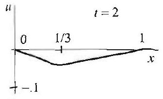

Right margin note (page 18)

The
shape
ts, we
$\frac{x}{1}$
$\frac{1}{\gamma_{x}}$
$\frac{1}{\gamma_{x}}$
t that
of the
ven by

++++

ntial Equations in Rectangular Coordinates

EXAMPLE 1 Vibration of a stretched string with fixed ends
The ends of a stretched string of length $L=1$ are fixed at $x=0$ and $x=1$ string is set to vibrate from rest by releasing it from an initial triangular modeled by the function
$$
f(x)=\left\{\begin{array}{ll}
\frac{3}{10} x & \text { if } 0 \leq x \leq \frac{1}{3}, \\
\frac{3(1-x)}{20} & \text { if } \frac{1}{3} \leq x \leq 1 .
\end{array}\right.
$$

Determine the subsequent motion of the string, given that $c=1 / \pi$.
Solution Since $g(x)=0$, we have $b_{n}^{*}=0$. Using (9) and integrating by par get
$$
\begin{aligned}
b_{n} & =2 \int_{0}^{1} f(x) \sin n \pi x d x \\
& =\frac{3}{5} \int_{0}^{1 / 3} x \sin n \pi x d x+\frac{3}{10} \int_{1 / 3}^{1}(1-x) \sin n \pi x d x \\
& =-\frac{\cos \frac{n \pi}{3}}{5 n \pi}+\frac{3}{5} \frac{\sin \frac{n \pi}{3}}{n^{2} \pi^{2}}+\frac{\cos \frac{n \pi}{3}}{5 n \pi}+\frac{3}{10} \frac{\sin \frac{n \pi}{3}}{n^{2} \pi^{2}} \\
& =\frac{9}{10 \pi^{2}} \frac{\sin \frac{n \pi}{3}}{n^{2}}
\end{aligned}
$$

From (10) we have $\lambda_{n}=n$. Putting all this in (8), we find the solution
$$
u(x, t)=\frac{9}{10 \pi^{2}} \sum_{n=1}^{\infty} \frac{\sin \frac{n \pi}{3}}{n^{2}} \sin n \pi x \cos n t .
$$

By plotting $u(x, t)$ for a fixed value of $t$, we get the shape of the string a time. An approximation of the graphs is obtained by plotting partial sums series. As expected, when $t=0$ we have the initial shape of the string gi the function $f(x)$ (see Figure 3).

---

<!-- Page 19 -->

Left margin note (page 19)

Figure 4 Normal modes Not counting the ends of the string, there are $(n-$ 1) equidistant points on the string that do not vibrate in the $n$th normal mode.

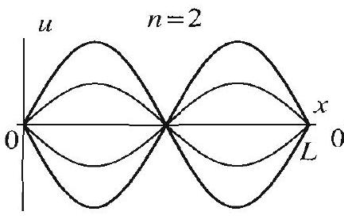
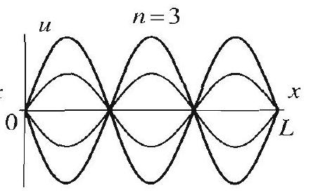

Right margin note (page 19)

121
inite

it is the usic, s on nattion the that sity. the ngth
$x L$
ring tion here le. itial swer
et to the tting $=0$.

++++

Section 3.3 Wave Equation, the Method of Separation of Variables

As given by (8), the solution of the vibrating string problem is an inf sum of the normal modes
$$
u_{n}(x, t)=\sin \frac{n \pi}{L} x\left(b_{n} \cos \lambda_{n} t+b_{n}^{*} \sin \lambda_{n} t\right) \quad n=1,2, \ldots
$$

When the string vibrates according to one of the $u_{n}$ 's, we say that in its $n$th normal mode of vibration. The first normal mode is called fundamental mode; all other modes are known as overtones. In m the intensity of the sound produced by a given normal mode depend $\sqrt{b_{n}^{2}+\left(b_{n}^{*}\right)^{2}}$, the amplitude of the $n$th normal mode. The circular or , ural frequency of the normal mode, which gives the number of oscilla in $2 \pi$ units of time, is $\lambda_{n}=n \pi c / L$. The larger the natural frequency, higher the pitch of the sound produced. Recall from (4), Section 3.2, $c=\sqrt{\tau / \rho}$, where $\tau$ is the tension of the string and $\rho$ is the mass den Thus the pitch of the sound can be changed by varying the tension or length of the string. For example, by clamping down the string, the le is shortened and the pitch is increased.

When the string vibrates in a normal mode, some points on the st are fixed at all times (Figure 4). These are the solutions of the equa $\sin \frac{n \pi}{L} x=0$. Not counting the ends of the string among these points, t are $n-1$ equidistant points that do not vibrate in the $n$th normal mod

We talked about a string vibrating in a normal mode. Which in conditions cause the string to vibrate this way? We illustrate the an with the following example.

EXAMPLE 2 Normal modes of vibration
Show that if a string with initial shape $f(x)=\sin \frac{m \pi}{L} x$ for $0<x<L$ is s vibrate from rest, then its vibrations are given by the $m$ th mode. (Note that initial shape of the string is obtained from the $m$ th normal mode (11) by se $t=0$.)

Solution We use (8) to find the function $u(x, t)$. Since $g(x)=0$, we get $b_{n}^{*}$ To find $b_{n}$, we compute the integral
$$
b_{n}=\frac{2}{L} \int_{0}^{L} f(x) \sin \frac{n \pi}{L} x d x=\frac{2}{L} \int_{0}^{L} \sin \frac{m \pi}{L} x \sin \frac{n \pi}{L} x d x .
$$

---

<!-- Page 20 -->

Left margin note (page 20)

122
Chapter 3 Partial Differe

Figure 5 The 5th normal modes $u_{5}(x, t)$, shown for various values of $t$.

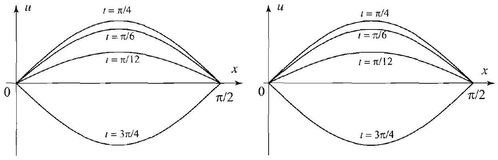

Figure 6 Snapshots of the string in Example 3 for $t= \frac{\pi}{12}, \frac{\pi}{6}, \frac{3 \pi}{4}, \frac{3 \pi}{4}$ using the first and fourth partial sums from (12). Note that the first normal mode (shown on the left) gives a very good picture of the string as it moves.

Right margin note (page 20)

unless utting
when given es this
modes
ement
t note nction er sine ling to
der the

++++

ential Equations in Rectangular Coordinates

By the orthogonality of the trigonometric system, the last expression is zero $m=n$, in which case its value is 1 . Thus $b_{n}=0$ if $n \neq m$ and $b_{m}=1$. these values in (8), we find the solution
$$
u(x, t)=u_{m}(x, t)=\sin \frac{m \pi}{L} x \cos c \frac{m \pi}{L} t,
$$
which is the $m$ th normal mode of the string (see Figure 5 for an illustration $m=5$ ). Thus a string that starts to vibrate from rest with an initial shape by a normal mode will continue to vibrate in that mode. Figure 5 illustrat phenomenon for the 5th normal mode.

We close with another example illustrating how we can use normal to understand more complicated motions.

EXAMPLE 3 A nonzero initial velocity
Solve for the motion of a string of length $L=\frac{\pi}{2}$ if $c=1$ and the initial displac and velocity are given by $f(x)=0$ and $g(x)=x \cos x$.

Solution Since $f(x)=0$, all the $b_{n}$ 's in (8) are 0 . In computing $b_{n}^{*}$ we firs from (9) that $b_{n}^{*}$ is equal to $\frac{1}{\lambda_{n}}$ times the sine Fourier coefficient of the fu $g(x)=x \cos x, 0<x<\frac{\pi}{2}$, where $\lambda_{n}=2 n$. Since $x \cos x$ is odd, its Fouri series on $0<x<\frac{\pi}{2}$ is identical to its Fourier series on $-\frac{\pi}{2}<x<\frac{\pi}{2}$. Appea the result of Example 5, Section 2.3, we obtain
$$
b_{n}^{*}=\frac{1}{\lambda_{n}} \frac{16(-1)^{n+1} n}{\pi\left(4 n^{2}-1\right)^{2}}=\frac{8(-1)^{n+1}}{\pi\left(4 n^{2}-1\right)^{2}}, \quad n=1,2, \ldots .
$$

Therefore, by (8), the solution is
$$
u(x, t)=\frac{8}{\pi} \sum_{n=1}^{\infty} \frac{(-1)^{n+1}}{\left(4 n^{2}-1\right)^{2}} \sin 2 n x \sin 2 n t .
$$

In Figure 6, we show several snapshots of the string as it begins to move und influence of the initial velocity. Note that the first partial sum
$$
\frac{8}{9 \pi} \sin 2 x \sin 2 t
$$

---

<!-- Page 21 -->

Right margin note (page 21)

123
ed by
nd so
have r, as ment find note our
unit
eries your hould

++++

Section 3.3 Wave Equation, the Method of Separation of Variables

already gives a very good picture of how the string moves. This can be justifi observing that the coefficients in the series in (12) decrease rapidly to zero, a the contributions of additional terms become small.

For problems with nonzero initial displacement and velocity, we only to work them as in Examples 1 and 3 and put the results togethe specified by equations (8) and (9). That is, from the initial displacer $f(x)$ we find the $b_{n}$ 's as in Example 1, from the initial velocity $g(x)$ we the $b_{n}^{*}$ 's as in Example 3, and then we put these results into (8). We too that if we have the Fourier sine series of $f(x)$ and/or $g(x)$ at hand task is considerably reduced, as illustrated by Example 3.

Exercises 3.3
In Exercises 1-10, (a) solve the boundary value problem (1)-(3) for a string o, length, subject to the given conditions.
(b) Illustrate the motion of the string by plotting a partial sum of your solution at various values of $t$. To decide how many terms to include in partial sum, compare the graph at $t=0$ and the graph of $f(x)$. The graphs $s$ match when you have enough terms in your partial sum.
1. $f(x)=.05 \sin \pi x, g(x)=0, c=\frac{1}{\pi}$.
2. $f(x)=\sin \pi x \cos \pi x, g(x)=0, c=\frac{1}{\pi}$.
3. $f(x)=\sin \pi x+3 \sin 2 \pi x-\sin 5 \pi x, g(x)=0, c=1$.
4. $f(x)=\sin \pi x+\frac{1}{2} \sin 3 \pi x+3 \sin 7 \pi x, g(x)=\sin 2 \pi x, c=1$.
5. $g(x)=0, c=4$,
$$
f(x)=\left\{\begin{array}{ll}
2 x & \text { if } 0 \leq x \leq \frac{1}{2} \\
2(1-x) & \text { if } \frac{1}{2}<x \leq 1
\end{array}\right.
$$
6. $g(x)=2, c=\frac{1}{\pi}$,
$$
f(x)=\left\{\begin{array}{ll}
0 & \text { if } 0 \leq x \leq \frac{1}{3}, \\
\frac{1}{30}(x-1 / 3) & \text { if } \frac{1}{3} \leq x \leq \frac{2}{3}, \\
\frac{1}{30}(1-x) & \text { if } \frac{2}{3}<x \leq 1 .
\end{array}\right.
$$
7. $g(x)=1, c=4$,
$$
f(x)=\left\{\begin{array}{ll}
4 x & \text { if } 0 \leq x \leq \frac{1}{4} \\
1 & \text { if } \frac{1}{4}<x \leq \frac{3}{4} \\
4(1-x) & \text { if } \frac{3}{4}<x \leq 1
\end{array}\right.
$$
8. $f(x)=x \sin \pi x, g(x)=0, c=\frac{1}{\pi}$.
9. $f(x)=x(1-x), g(x)=\sin \pi x, c=1$.

---

<!-- Page 22 -->

Left margin note (page 22)

124
Chapter 3
Partial Differe

Right margin note (page 22)

riodic eriod all $x$ of the ise 12 es 13tional ad (3) e the
$$
=0 .
$$
with are to ns for

++++

ntial Equations in Rectangular Coordinates
10. $g(x)=0, c=1$,
$$
f(x)=\left\{\begin{array}{ll}
4 x & \text { if } 0 \leq x \leq \frac{1}{4}, \\
-4(x-1 / 2) & \text { if } \frac{1}{4}<x \leq \frac{3}{4}, \\
4(x-1) & \text { if } \frac{3}{4}<x \leq 1 .
\end{array}\right.
$$
11. Time period of motion. (a) Show that the $n$th normal mode (11) is pe in time with period $2 L / n c$. Conclude that for any $n$, a period of $u_{n}$ is $2 L / c$.
(b) Show that any superposition of normal modes is periodic in time with $2 L / c$. Conclude that the string vibrates with a time period $2 L / c$.
(c) Shape of the string at half a time period. Using (8), show that for and $t, u(x, t+L / c)=-u(L-x, t)$. What does this imply about the shape string at half a time period?
Project Problem: Solve a case of the wave equation with damping in Exerc and then apply your solution to a specific problem by doing any one of Exercis 15.
12. Damped vibrations of a string. In the presence of resistance propor to velocity, the one dimensional wave equation becomes
$$
\frac{\partial^{2} u}{\partial t^{2}}+2 k \frac{\partial u}{\partial t}=c^{2} \frac{\partial^{2} u}{\partial x^{2}}
$$
(see (7), Section 3.2). We will solve this equation subject to conditions (2) at by following the method of this section.
(a) Assume a product solution of the form $u(x, t)=X(x) T(t)$, and deriv following equations for $X$ and $T$ :
$$
\begin{array}{c}
X^{\prime \prime}+\mu^{2} X=0, \quad X(0)=0, \quad X(L)=0, \\
T^{\prime \prime}+2 k T^{\prime}+(\mu c)^{2} T=0,
\end{array}
$$
where $\mu$ is the separation constant.
(b) Show that
$$
\mu=\mu_{n}=\frac{n \pi}{L} \quad \text { and } \quad X=X_{n}=\sin \frac{n \pi}{L} x, n=1,2, \ldots .
$$
(c) To determine the solutions in $T$ we have to solve $T^{\prime \prime}+2 k T^{\prime}+\left(\frac{n \pi}{L} c\right)^{2} T$ Review the general solution of the second order linear differential equation constant coefficients (Appendix A.2), and explain why three possible cases be treated separately: $n<\frac{k L}{\pi c}, n=\frac{k L}{\pi c}$, and $n>\frac{k L}{\pi c}$. The respective solutio $T$ are
$$
\begin{array}{c}
T_{n}=e^{-k t}\left(a_{n} \cosh \lambda_{n} t+b_{n} \sinh \lambda_{n} t\right), \\
T_{\frac{k L}{\pi c}}=a_{\frac{k L}{\pi c}} e^{-k t}+b_{\frac{k L}{\pi c}} t e^{-k t} \\
T_{n}=e^{-k t}\left(a_{n} \cos \lambda_{n} t+b_{n} \sin \lambda_{n} t\right),
\end{array}
$$
where
$$
\lambda_{n}=\sqrt{\left|k^{2}-\left(\frac{n \pi}{L} c\right)^{2}\right|} .
$$

---

<!-- Page 23 -->

Right margin note (page 23)

125

h the
from
ds to

++++

Section 3.3 Wave Equation, the Method of Separation of Variables
(d) Conclude that when $\frac{k L}{\pi c}$ is not a positive integer, the solution is
$$
\begin{aligned}
u(x, t)= & e^{-k t} \sum_{1 \leq n<\frac{k L}{\pi c}} \sin \frac{n \pi}{L} x\left(a_{n} \cosh \lambda_{n} t+b_{n} \sinh \lambda_{n} t\right) \\
& +e^{-k t} \sum_{\frac{k L}{\pi c}<n<\infty} \sin \frac{n \pi}{L} x\left(a_{n} \cos \lambda_{n} t+b_{n} \sin \lambda_{n} t\right),
\end{aligned}
$$
where these sums run over integers only, and where
$$
a_{n}=\frac{2}{L} \int_{0}^{L} f(x) \sin \frac{n \pi}{L} x d x, \quad n=1,2, \ldots,
$$
and the $b_{n}$ are determined from the equation
$$
-k a_{n}+\lambda_{n} b_{n}=\frac{2}{L} \int_{0}^{L} g(x) \sin \frac{n \pi}{L} x d x, \quad n=1,2, \ldots
$$
(e) Conclude that when $\frac{k L}{\pi c}$ is a positive integer, the solution is as in (d) wit one additional term
$$
\sin \left(\frac{k}{c} x\right)\left(a_{\frac{k L}{\pi c}} e^{-k t}+b_{\frac{k L}{\pi c}} t e^{-k t}\right)
$$
with $a_{n}$ and $b_{n}$ as in (d), except that $b_{\frac{k L}{\pi c}}$ is determined from the equation
$$
-k a_{\frac{k L}{\pi c}}+b_{\frac{k L}{\pi c}}=\frac{2}{L} \int_{0}^{L} g(x) \sin \frac{k}{c} x d x
$$
13. Solve
$$
\begin{array}{c}
\frac{\partial^{2} u}{\partial t^{2}}+\frac{\partial u}{\partial t}=\frac{\partial^{2} u}{\partial x^{2}} \\
u(0, t)=u(\pi, t)=0 \\
u(x, 0)=\sin x, \quad \frac{\partial u}{\partial t}(x, 0)=0
\end{array}
$$
[Hint: Since $k=.5$ and $L=\pi$, we have $n>\frac{k L}{\pi}$ for all $n$. So only one case the solution of Exercise 12 needs to be considered.]
14. Solve
$$
\begin{array}{c}
\frac{\partial^{2} u}{\partial t^{2}}+\frac{\partial u}{\partial t}=\frac{\partial^{2} u}{\partial x^{2}} \\
u(0, t)=u(\pi, t)=0 \\
u(x, 0)=x \sin x, \quad \frac{\partial u}{\partial t}(x, 0)=0
\end{array}
$$
15. (a) Solve
$$
\begin{array}{c}
\frac{\partial^{2} u}{\partial t^{2}}+3 \frac{\partial u}{\partial t}=\frac{\partial^{2} u}{\partial x^{2}} \\
u(0, t)=u(\pi, t)=0 \\
u(x, 0)=0, \quad \frac{\partial u}{\partial t}(x, 0)=10
\end{array}
$$
(b) Illustrate graphically the fact that the solution tends to zero as $t$ ten infinity.

---

<!-- Page 24 -->

Left margin note (page 24)

126
Chapter 3 Pa
3.4 D'Alem

Right margin note (page 24)

series tring, cisely, called an inof (4) using
evious yields
we see
soluin the (4) by on, we nsion.

++++

rtial Differential Equations in Rectangular Coordinates

bert's Method
As promised earlier, we will show in this section how the Fourier solution of the boundary value problem associated with the vibrating s
$$
\frac{\partial^{2} u}{\partial t^{2}}=c^{2} \frac{\partial^{2} u}{\partial x^{2}}, \quad 0<x<L, \quad t>0,
$$
$$
u(0, t)=0 \quad \text { and } \quad u(L, t)=0 \text { for all } t>0,
$$
$$
u(x, 0)=f(x) \quad \text { and } \quad \frac{\partial u}{\partial t}(x, 0)=g(x) \quad \text { for } 0<x<L,
$$
has a simpler expression in terms of the initial data $f$ and $g$. More pre we will show that the solution of (1)-(3) is given by
$$
u(x, t)=\frac{1}{2}\left[f^{*}(x-c t)+f^{*}(x+c t)\right]+\frac{1}{2 c} \int_{x-c t}^{x+c t} g^{*}(s) d s
$$
where $f^{*}$ and $g^{*}$ denote the odd extensions of $f$ and $g$. This is d'Alembert's solution of the vibrating string problem, and it has teresting interpretation in terms of traveling waves. The derivation from the solution of the previous section ((8), Section 3.3) involves trigonometric identities, as illustrated by the following example.

EXAMPLE 1 From Fourier series to d'Alembert's solution
When $f(x)=\sin \frac{m \pi}{L} x$ and $g(x)=0$, the Fourier series method of the section yields the following solution of (1)-(3):
$$
u(x, t)=\sin \frac{m \pi}{L} x \cos c \frac{m \pi}{L} t .
$$
(See Example 2, Section 3.3.) On the other hand, d'Alembert's solution (4) the following form of the solution:
$$
u(x, t)=\frac{1}{2}\left[\sin \frac{m \pi}{L}(x-c t)+\sin \frac{m \pi}{L}(x+c t)\right] .
$$

Recalling the trigonometric identity $\sin a \cos b=\frac{1}{2}[\sin (a+b)+\sin (a-b)]$, that the two solutions are the same.

The derivation of d'Alembert's solution (4) from the Fourier series tion of the previous section is based on similar ideas and is outlined exercises. It is more instructive at this point to check the validity of verifying that it satisfies the equations (1)-(3). To simplify the notatic drop the * and use the same notation for a function and its odd exte

---

<!-- Page 25 -->

Right margin note (page 25)

127
om-
ting
m of
are
at
over
tion
pler
h of
*(x)

++++

Section 3.4 D'Alembert's Method

In addition, we assume that all derivatives encountered in the following c putations exist. We begin by showing that (4) satisfies (1). Differentia (4) with respect to $t$, using the chain rule and the fundamental theore calculus, we get
$$
\begin{aligned}
\frac{\partial u}{\partial t} & =\frac{\partial}{\partial t}\left\{\frac{1}{2}[f(x-c t)+f(x+c t)]+\frac{1}{2 c} \int_{x-c t}^{x+c t} g(s) d s\right\} \\
& =\frac{1}{2}\left[-c f^{\prime}(x-c t)+c f^{\prime}(x+c t)\right]+\frac{1}{2}[g(x+c t)+g(x-c t)]
\end{aligned}
$$

Differentiating a second time with respect to $t$, we get
$$
\frac{\partial^{2} u}{\partial t^{2}}=\frac{c^{2}}{2}\left[f^{\prime \prime}(x-c t)+f^{\prime \prime}(x+c t)\right]+\frac{c}{2}\left[g^{\prime}(x+c t)-g^{\prime}(x-c t)\right] .
$$

Likewise, differentiating (4) with respect to $x$ we get
$$
\frac{\partial u}{\partial x}=\frac{1}{2}\left[f^{\prime}(x-c t)+f^{\prime}(x+c t)\right]+\frac{1}{2 c}[g(x+c t)-g(x-c t)],
$$
and
$$
\frac{\partial^{2} u}{\partial x^{2}}=\frac{1}{2}\left[f^{\prime \prime}(x-c t)+f^{\prime \prime}(x+c t)\right]+\frac{1}{2 c}\left[g^{\prime}(x+c t)-g^{\prime}(x-c t)\right] .
$$

It follows that $\frac{\partial^{2} u}{\partial t^{2}}=c^{2} \frac{\partial^{2} u}{\partial x^{2}}$, and so (4) satisfies the wave equation (1).
To check that (4) satisfies (2) and (3), we use the fact that $f^{*}$ and $g^{*}$ odd and $2 L$-periodic. For example, to check the boundary condition (2 $x=0$, we plug $x=0$ into (4) and get
$$
u(0, t)=\frac{1}{2}\left[f^{*}(-c t)+f^{*}(c t)\right]+\frac{1}{2} \int_{-c t}^{c t} g^{*}(s) d s=0
$$
because $f^{*}$ is odd, so $f^{*}(-c t)=-f^{*}(c t)$, and $g^{*}$ is odd, so its integral a symmetric interval is 0 . We leave the verification of the second condi in (2) and (3) to Exercise 14.

Geometric Interpretation of D'Alembert's Solution
When the initial velocity is zero, d'Alembert's solution takes on the sim form
$$
u(x, t)=\frac{1}{2}\left[f^{*}(x-c t)+f^{*}(x+c t)\right] .
$$

This has an interesting geometric interpretation. For fixed $t$, the grap $f^{*}(x-c t)$ (as a function of $x$ ) is obtained by translating the graph of $f$

---

<!-- Page 26 -->

Left margin note (page 26)

128
Chapter 3
Partial Differe

Right margin note (page 26)

veling wave on of ctions
et geint $x$ itions $t$ and otion,
e last atives The
$t)]$,
oving that ctions - and
string

++++

ntial Equations in Rectangular Coordinates
by $c t$ units to the right. As $t$ increases, the graph represents a wave tra to the right with velocity $c$. Similarly, the graph of $f^{*}(x+c t)$ is a traveling to the left with velocity $c$. We see from (5) that this solut the wave equation is an average of two waves traveling in opposite dire with shapes determined from the initial shape of the string.

The general form of d'Alembert's solution (4) is harder to interpr ometrically. It does tell us, however, that the displacement at the po at time $t>0$ is determined entirely by the initial displacements at pos $x-c t$ and $x+c t$ and by the initial velocity on the interval between $x-c x+c t$. To understand the contribution of the initial velocity to the m let $G$ denote an antiderivative of $g^{*}$. Hence
$$
G(x)=\int_{a}^{x} g^{*}(z) d z
$$
for some fixed number $a$. Note that
$$
G(x+2 L)-G(x)=\int_{x}^{x+2 L} g^{*}(z) d z=\int_{-L}^{L} g^{*}(z) d z=0
$$
where the second equality follows from Theorem 1, Section 2.1, and th equality follows because $g^{*}$ is odd. Hence $G$ is $2 L$ periodic. (Antideriv of periodic functions were discussed in Exercises 15-16, Section 2.1.) solution (4) may be rewritten in terms of $f^{*}$ and $G$ as follows:
$$
u(x, t)=\frac{1}{2}\left[f^{*}(x-c t)+f^{*}(x+c t)\right]+\frac{1}{2 c}[G(x+c t)-G(x-c t)]
$$
$$
=\frac{1}{2}\left[f^{*}(x-c t)-\frac{1}{c} G(x-c t)\right]+\frac{1}{2}\left[f^{*}(x+c t)+\frac{1}{c} G(x+c\right.
$$
showing that, in general, the solution still consists of right- and left-m waveforms. The main difference from the case represented by (5) is here the two waveforms need no longer have the same shape. The fun $\frac{1}{2}\left[f^{*}(x)-\frac{1}{c} G(x)\right]$ and $\frac{1}{2}\left[f^{*}(x)+\frac{1}{c} G(x)\right]$ give the shapes of the right left-moving waves, respectively.

EXAMPLE 2 D'Alembert's solution with zero initial velocity Consider the wave problem of Example 1, Section 3.3, where $L=1, c=\frac{1}{\pi}$,
$$
f(x)=\left\{\begin{array}{ll}
\frac{3}{10} x & \text { if } 0 \leq x \leq \frac{1}{3}, \\
\frac{3(1-x)}{20} & \text { if } \frac{1}{3} \leq x \leq 1,
\end{array}\right.
$$
and $g(x)=0$. (a) Use d'Alembert's solution to determine the shape of the at times $t=\frac{\pi}{3}$ and $\frac{2 \pi}{3}$.
(b) Determine the first time when the string returns to its initial shape.

---

<!-- Page 27 -->

Left margin note (page 27)

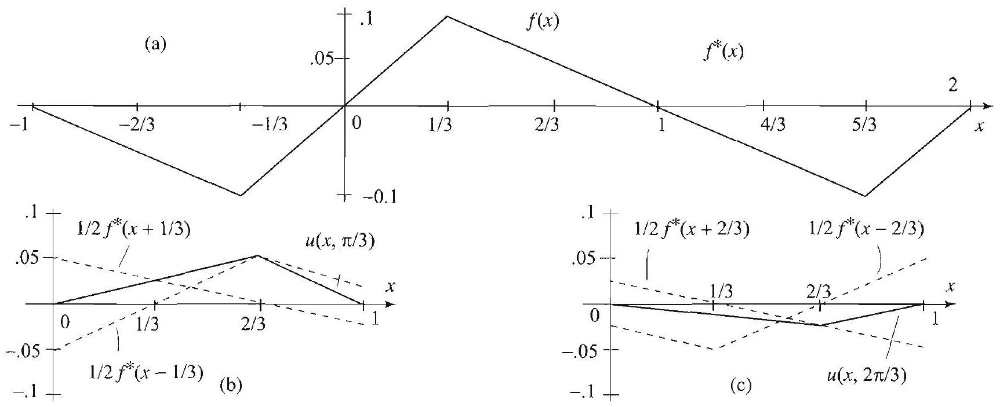

Figure 1 (a) Initial at time $t=\pi / 3$, obta $\left.f^{*}(x-1 / 3)\right)$.
(c) Sn

Right margin note (page 27)

129

time first left the ing at ohs of tring, e also $x$
string 1/3) +
$$
=1,
$$
. Let

++++

Section 3.4 D'Alembert's Method

Solution (a) Since $g(x)=0$, we use (5) and get the shape of the string at $t=\frac{\pi}{3}$ as the graph of $\frac{1}{2}\left[f^{*}(x-1 / 3)+f^{*}(x+1 / 3)\right]$. To plot this graph, w plot $f^{*}(x)$, the 2 -periodic odd extension of $f$. By translating this graph to th by $1 / 3$ unit, we obtain the graph of $f^{*}(x+1 / 3)$; translating it to the right same amount, we obtain the graph of $f^{*}(x-1 / 3)$. Now the shape of the str time $t=\pi / 3$ is obtained by averaging (adding and dividing by two) the gra $f^{*}(x+1 / 3)$ and $f^{*}(x-1 / 3)$. Since we are only interested in the shape of the $s$ we restrict the graphs to the interval $0<x<1$. See Figure 1, where we hav plotted the graphs for $t=2 \pi / 3$.
shape of the string, $f(x), 0<x<1$, and its odd extension $f^{*}(x)$. (b) Snapshot of the ined by averaging the translates $f^{*}(x+1 / 3)$ and $f^{*}(x-1 / 3): u(x, \pi / 3)=1 / 2\left(f^{*}(x+\right.$ apshot of the string at time $t=2 \pi / 3: u(x, 2 \pi / 3)=1 / 2\left(f^{*}(x+2 / 3)+f^{*}(x-2 / 3)\right)$.
(b) The string returns to its initial shape when
$$
\frac{1}{2}\left[f^{*}(x-t / \pi)+f^{*}(x+t / \pi)\right]=f^{*}(x) .
$$

Since $f^{*}$ is 2-periodic, this happens when $t / \pi=2$, or $t=2 \pi$.

EXAMPLE 3 D'Alembert's solution with nonzero initial velocity
Use d'Alembert's method to solve the wave problem (1)-(3) with $c=1, L f(x)=0$, and $g(x)=x$ for $0<x<1$.
Solution We use (4) with $f^{*}=0$. Hence
$$
u(x, t)=\frac{1}{2} \int_{x-t}^{x+t} g^{*}(s) d s=\frac{1}{2}(G(x+t)-G(x-t))
$$
where $g^{*}$ is the odd 2-periodic extension of $g$ and $G$ is an antiderivative of $g$ us take
$$
G(x)=\int_{-1}^{x} g^{*}(z) d z
$$

---

<!-- Page 28 -->

Left margin note (page 28)

130
Chapter 3
Partial Differe

Figure 2 (a) Graph of $g^{*}$, the 2-periodic odd extension of $g$. (b) Graph of $G$, an antiderivative of $g^{*}$. Note that $G$ is $2-$ periodic.

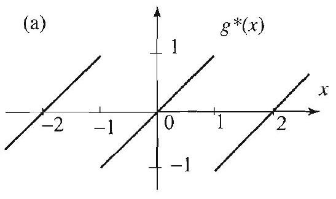

Figure 3

Right margin note (page 28)

$\mathrm{g}(6)$, val of
$3^{x}$
hot of right e two again.
ad its of the of $x$, lange where finite which

These ritten
er the angle points $\left.-c t_{0}\right]$,

++++

ential Equations in Rectangular Coordinates

To complete the solution, we must determine $G$. From our discussion precedin we know that $G$ is 2-periodic. Thus, it suffices to determine $G$ on any inter length 2 . Since $g^{*}(x)=x$ on the interval $(-1,1)$, we obtain
$$
G(x)=\int_{-1}^{x} z d z=\frac{1}{2} x^{2}-\frac{1}{2}
$$
for all $x$ in $(-1,1)$. Hence
$$
G(x)=\left\{\begin{array}{ll}
\frac{1}{2} x^{2}-\frac{1}{2} & \text { if }-1<x<1, \\
G(x+2) & \text { otherwise. }
\end{array}\right.
$$

The graph of $G$ is shown in Figure 2(b). According to (7), to get a snaps the string at a given time $t$, it suffices to take the difference of the left and translates of the graph of $G$ by $t$ units and divide by 2 . In this case we hav half-length waves still, but one is inverted. We then just superpose them Note how this yields the zero initial position when $t=0$.

Characteristic Lines
Here we discuss some interesting properties of the wave equation ar solution. Up until now, in order to interpret $u(x, t)$ as the shape string at a given time $t$, we have been thinking of $u(x, t)$ as a function for a fixed value of $t$. For the sake of our discussion, it would help to cl the way we think of $u$ and consider $u(x, t)$ as a function of $(x, t)$, $x$ and $t$ vary simultaneously in the $x t$-plane. Because the string has length $L$, we are particularly interested in the semi-infinite strip $S$, consists of the points $(x, t)$ with $0 \leq x \leq L$ and $t \geq 0$.

The lines with slopes $\pm \frac{1}{c}$ in the $x t$-plane play an important role. are called the characteristic lines of the wave equation and can be w in the form
(9) $\quad x+c t=x_{0}+c t_{0} \quad\left(\right.$ slope $=-\frac{1}{c}<0$, through the point $\left.\left(x_{0}, t_{0}\right)\right)$.

The characteristic lines consists of two families of parallel lines that cov $x t$-plane (Figure 3). Each point $\left(x_{0}, t_{0}\right)$ is the vertex of an isosceles tri formed by two characteristic lines, which intersect the $x$-axis at the $x_{0}-c t_{0}$ and $x_{0}+c t_{0}$ (Figure 4). The base of this triangle, $\left[x_{0}-c t_{0}, x_{0}\right.$

---

<!-- Page 29 -->

Left margin note (page 29)

Figure 4 Interval pendence, centered radius $c t_{0}$.

Figure 5 Characteris allelogram.

PROPOSIT
CHARACTER
PARALLELOG

Right margin note (page 29)

131

To that erval and way erval erval $L]$ if d by rigin , for over the
ral of
outall a nes.
with
ct)],

++++

Section 3.4 D'Alembert's Method

is called the interval of dependence of the point $\left(x_{0}, t_{0}\right)$ (Figure 4) understand this terminology, from d'Alembert's solution (4), we see $u\left(x_{0}, t_{0}\right)$ is determined by the values of $f^{*}$ at the endpoints of the int of dependence and by integrating $g^{*}$ on that interval. The values of $f^{*} g^{*}$ outside the interval of dependence of $\left(x_{0}, t_{0}\right)$ do not affect in any the value of $u\left(x_{0}, t_{0}\right)$; consequently, any perturbation outside this int is not felt at the point $\left(x_{0}, t_{0}\right)$. From Figure 4 it is clear that the int of dependence $\left[x_{0}-c t_{0}, x_{0}+c t_{0}\right]$ lies entirely inside the interval $[0$, and only if the point $\left(x_{0}, t_{0}\right)$ belongs to the triangular region $I$ bounde the interval $[0, L]$ and the characteristic lines $x-c t=0$ (through the o with slope $\frac{1}{c}$ ) and $x+c t=L$ (through the $(0, L)$ with slope $-\frac{1}{c}$ ). Thus $(x, t)$ inside the region $I, u(x, t)$ depends only on the values of $f$ and $g$ the interval $[0, L]$; and so in order to compute $u(x, t)$ we do not need periodic extensions of $f$ and $g$.

EXAMPLE 4 Using intervals of dependence
Consider the wave problem
$$
\begin{array}{c}
u_{t t}=4 u_{x x}, 0<x<1, t>0 \\
u(0, t)=0, u(1, t)=0 \\
u(x, 0)=x(1-x), u_{t}(x, 0)=8 x
\end{array}
$$

Find $u(x, t)$ for $(x, t)$ in region $I$ in Figure 4, with $L=1$ and $c=2$.
Solution Applying d'Alembert's solution and using the fact that the interv dependence of a point in region $I$ lies entirely in $[0,1]$, we obtain
$$
\begin{aligned}
u(x, t) & =\frac{1}{2}[f(x-2 t)+f(x+2 t)]+\frac{1}{4} \int_{x-2 t}^{x+2 t} 8 s d s \\
& =\frac{1}{2}[(x-2 t)(1-(x-2 t))+(x+2 t)(1-(x+2 t))]+\left.s^{2}\right|_{x-2 t} ^{x+2 t} \\
& =-4 t^{2}+x-x^{2}+(x+2 t)^{2}-(x-2 t)^{2} \\
& =-4 t^{2}+x-x^{2}+8 t x
\end{aligned}
$$

We next describe a method for finding the values of $u$ at points side the region $I$. We need the following interesting identity. Let us c characteristic parallelogram one whose sides lie on characteristic li

ION 1
ISTIC RAM

Let $P_{1}, P_{2}, Q_{1}, Q_{2}$ denote the vertices of a characteristic parallelogram. $P_{1}$ diagonally opposite to $P_{2}$ (Figure 5). Then
$$
u\left(P_{1}\right)+u\left(P_{2}\right)=u\left(Q_{1}\right)+u\left(Q_{2}\right)
$$

Proof Write
$$
A(x, t)=\frac{1}{2}\left[f^{*}(x-c t)-\frac{1}{c} G(x-c t)\right], B(x, t)=\frac{1}{2}\left[f^{*}(x+c t)+\frac{1}{c} G(x+\right.
$$

---

<!-- Page 30 -->

Left margin note (page 30)

132
Chapter 3 Pa

Figure 6 Divid strip by reflecting teristic lines.

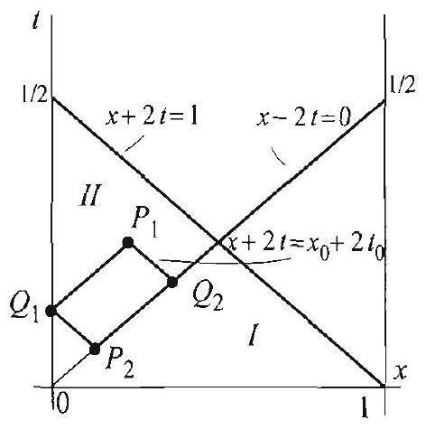

Figure 7

Right margin note (page 30)

6)
$c t=$
$+c t_{0}$.
$A\left(Q_{2}\right)$

6 by rpose, eristic the $x$ eristic on, as
racterertices on the $u\left(P_{2}\right)$. $+8 t x$ ecause
sideraample, $2 t=0$. obtain comLet us $(x, t)$

++++

rtial Differential Equations in Rectangular Coordinates

where $G$ is an antiderivative of $g^{*}$. Then for all $(x, t)$, we have from (
$$
u(x, t)=A(x, t)+B(x, t) .
$$

We note from (11) that $A$ is constant on the characteristic lines $x- x_{0}-c t_{0}$, while $B$ is constant on the characteristic lines $x+c t=x_{0}$ Hence $A\left(P_{1}\right)=A\left(Q_{1}\right), B\left(P_{1}\right)=B\left(Q_{2}\right), B\left(P_{2}\right)=B\left(Q_{1}\right), A\left(P_{2}\right)=$
(Figure 5), and so
$$
u\left(P_{1}\right)+u\left(P_{2}\right)=A\left(P_{1}\right)+B\left(P_{1}\right)+A\left(P_{2}\right)+B\left(P_{2}\right)=u\left(Q_{1}\right)+u\left(Q_{2}\right) .
$$

With the help of (10) we can determine $u$ in the strip $S$ in Figure using geometric constructions to reduce to the region $I$. For this pu we divide $S$ into triangular and polygonal regions bounded by charact lines, as follows. Start with two characteristic lines that emanate from axis at $x=0$ and $x=L$, and reflect on the boundary of $S$ along charact lines with opposite slopes. Label these regions by II, III, IV, and so shown in Figure 6.

EXAMPLE 5 Using characteristic parallelograms
Refer to Example 4. Determine the values of $u$ in the region $I I$.
Solution Let $P_{1}=\left(x_{0}, t_{0}\right)$ be an arbitrary point in the region $I I$. Form a cha istic parallelogram with vertices $P_{1}, P_{2}, Q_{1}, Q_{2}$, as shown in Figure 7. The v $P_{2}$ and $Q_{2}$ are on the characteristic line $x-2 t=0$, and the vertex $Q_{1}$ is boundary line $x=0$. From Proposition 1, we have $u\left(P_{1}\right)=u\left(Q_{1}\right)+u\left(Q_{2}\right)-$ We will find $u\left(P_{2}\right)$ and $u\left(Q_{2}\right)$ by using the formula $u(x, t)=-4 t^{2}+x-x^{2}$ from Example 4, because $P_{2}$ and $Q_{2}$ are in the region $I$. Also, $u\left(Q_{1}\right)=0, \mathrm{~b}$ of the boundary condition $u(0, t)=0$ for all $t>0$.

To determine the coordinates of $P_{2}$ and $Q_{2}$, we use simple geometric con tions using the equations of characteristic lines as labeled in Figure 7. For ex $Q_{2}$ is the intersection point of the characteristic lines $x+2 t=x_{0}+2 t_{0}$ and $x-$ : Adding the equations, we get $2 x=x_{0}+2 t_{0}$ or $x=\frac{x_{0}+2 t_{0}}{2}$. From $x=2 t$, we $t=\frac{x_{0}+2 t_{0}}{4}$, and so $Q_{2}=\left(\frac{x_{0}+2 t_{0}}{2}, \frac{x_{0}+2 t_{0}}{4}\right)$. The coordinates of $Q_{1}$ and $P_{2}$ ar puted similarly. We have $Q_{1}=\left(0,-\frac{x_{0}}{2}+t_{0}\right)$ and $P_{2}=\left(\frac{-x_{0}+2 t_{0}}{2}, \frac{-x_{0}+2 t_{0}}{4}\right)$. simplify the notation and write $P_{1}=(x, t)$ instead of $\left(x_{0}, t_{0}\right)$. Then, for $P_{1}=$ in the region II,
$$
\begin{aligned}
u(x, t)= & u\left(Q_{2}\right)-u\left(P_{2}\right) \\
= & u\left(\frac{x+2 t}{2}, \frac{x+2 t}{4}\right)-u\left(\frac{-x+2 t}{2}, \frac{-x+2 t}{4}\right) \\
= & \overbrace{-4\left(\frac{x+2 t}{4}\right)^{2}+\frac{x+2 t}{2}-\left(\frac{x+2 t}{2}\right)^{2}+8 \frac{x+2 t}{2} \frac{x+2 t}{4}}^{u\left(Q_{2}\right)} \\
& +\overbrace{4\left(\frac{-x+2 t}{4}\right)^{2}-\frac{-x+2 t}{2}+\left(\frac{-x+2 t}{2}\right)^{2}-8 \frac{-x+2 t}{2} \frac{-x+}{4}}^{-u\left(P_{2}\right)} \\
= & x+4 t x .
\end{aligned}
$$

---

<!-- Page 31 -->

Right margin note (page 31)

133
dary
n the

III,
blem case, 3 for
ses 1
3.3,
$$
f(x)
$$
$L, t)=$ dness
and

++++

Section 3.4 D'Alembert's Method

Note how this formula for $u(x, t)$ satisfies the wave equation and the bour condition at $x=0$. The other conditions in the wave problem do not concer points in the region II and thus should not be checked.

In the exercises, you are asked to find the values of $u$ in the regions $I I$, and $I V$, by using techniques similar to the ones of Examples 4 and 5.
Exercises 3.4
In Exercises 1-8, use d'Alembert's formula (4) to solve the boundary value pro (1) - (3) for a string of unit length, subject to the given conditions. In each describe completely $f^{*}$ and $G$ (an antiderivative of $g^{*}$ ) (see Examples 2 and hints).
1. $f(x)=\sin \pi x, g(x)=0, c=\frac{1}{\pi}$.
2. $f(x)=\sin \pi x \cos \pi x, g(x)=0, c=\frac{1}{\pi}$.
3. $f(x)=\sin \pi x+3 \sin 2 \pi x, g(x)=\sin \pi x, c=1$.
4. $f(x)=0, g(x)=1, c=1$.
5. $f(x)$ as in Exercise 5, Section 3.3, $g(x)=x, c=1$.
6. $f(x)=0, g(x)=\cos \pi x, c=1$.
7. $f(x)=0, g(x)=-10, c=1$.
8. $f(x)=0, g(x)=\sin \pi x, c=1$.
9. Determine the first time the string returns to its initial shape in Exerci and 5 .
10. Plot the solution in Exercise 1 for $t=1 / 2$ and 1 .
11. Plot the solution in Exercise 4 for $t=1 / 2$ and 1 .
12. Time period of motion. Prove the results of Exercise 11(b), Section using d'Alembert's solution.
13. Suppose that both $f$ and $g$ are symmetric about $x=\frac{L}{2}$; that is, $f(L-x)=$ and $g(L-x)=g(x)$. Show that
$$
u\left(x, t+\frac{L}{c}\right)=-u(x, t)
$$
for all $0<x<L$ and $t>0$.
14. Check that d'Alembert's solution (4) satisfies (a) the boundary condition $u($ 0 for all $t>0$; and (b) the initial conditions (3). [Hint: For (a), use the od and the $2 L$-periodicity of $f$ and $g$.]
15. Consider the boundary value problem (1)-(3) with $c=1, L=1, g(x)=0$
$$
f(x)=\left\{\begin{array}{ll}
4 x & \text { if } 0 \leq x \leq \frac{1}{4}, \\
4\left(\frac{1}{2}-x\right) & \text { if } \frac{1}{4}<x \leq \frac{1}{2}, \\
0 & \text { if } \frac{1}{2}<x \leq 1 .
\end{array}\right.
$$
(a) Use d'Alembert's method to plot the string at times $t=0, \frac{1}{4}, \frac{1}{2}$.
(b) For $t=\frac{1}{4}$, identify the points on the string that are still in rest position.

---

<!-- Page 32 -->

Left margin note (page 32)

134
Chapter 3
Partial Differe

Right margin note (page 32)

How
n (8),
$\frac{n \pi}{L} s$.]
Let $g^{*}$
n (4).
$t$ of a

++++

ntial Equations in Rectangular Coordinates
(c) Take a point $x$ on the string with zero initial displacement $\left(\frac{1}{2}<x<1\right)$. long does it take before the point $x$ starts to vibrate?
(d) What is the answer in (c) for an arbitrary string constant $c>0$ ?
16. D'Alembert's solution for zero initial velocity. (a) Starting fror Section 3.3, show that, if the initial velocity $g(x)=0$, then
$$
u(x, t)=\frac{1}{2} \sum_{n=1}^{\infty} b_{n}\left[\sin \frac{n \pi}{L}(x-c t)+\sin \frac{n \pi}{L}(x+c t)\right] .
$$
(b) Derive d'Alembert's solution (4) using (a). [Hint: $f^{*}(s)=\sum_{n=1}^{\infty} b_{n} \sin$
17. Project Problem: D'Alembert's solution (the general case). denote the odd $2 L$-periodic extension of $g$, and let
$$
G(x)=\int_{0}^{x} g^{*}(s) d s
$$
(a) Show that $G$ is even and $2 L$-periodic, and
$$
G(x)=\sum_{n=1}^{\infty} B_{n}\left(\cos \frac{n \pi}{L} x-1\right),
$$
where
$$
B_{n}=\frac{-2}{n \pi} \int_{0}^{L} g(x) \sin \frac{n \pi}{L} x d x=-c b_{n}^{*} \quad(n=1,2, \ldots) .
$$
[Hint: Exercise 33, Section 2.3.]
(b) Use (a) to show that
$$
G(x+c t)-G(x-c t)=\sum_{n=1}^{\infty} B_{n}\left[\cos \frac{n \pi}{L}(x+c t)-\cos \frac{n \pi}{L}(x-c t)\right] .
$$
(c) Using (b), show that $\frac{1}{2 c} \int_{x-c t}^{x+c t} g^{*}(s) d s=\sum_{n=1}^{\infty} b_{n}^{*} \sin \frac{n \pi}{L} x \sin \lambda_{n} t$.
(d) Use (c), (8) of Section 3.3, and Exercise 16 to derive d'Alembert's solutic
18. Project Problem: Conservation of energy. The energy at time vibrating string is given by
$$
E(t)=\frac{1}{2} \int_{0}^{L}\left(u_{t}^{2}+c^{2} u_{x}^{2}\right) d x
$$
(a) By differentiating under the integral sign, show that
$$
\frac{d E}{d t}=\int_{0}^{L}\left(u_{t} u_{t t}+c^{2} u_{x} u_{x t}\right) d x
$$
(b) Use the wave equation (1) to replace $u_{t t}$ by $c^{2} u_{x x}$ and obtain
$$
\frac{d E}{d t}=c^{2} \int_{0}^{L}\left(u_{x} u_{t}\right)_{x} d x .
$$

---

<!-- Page 33 -->

Left margin note (page 33)

Figure 8
3.5 The One Dime

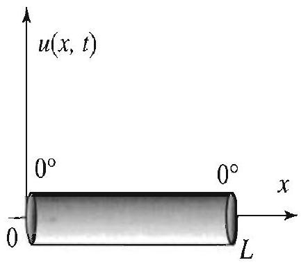

Figure 1 Insulated bar with ends kept at $0^{\circ}$.

Since the problem is first order in $t$, we only need one initial condition, unlike the wave problem where two conditions were needed.

Right margin note (page 33)

135

uring $=0$, o the 8) e 8). in ernal To ture itial the $x, t)$ , we the on

After use sting wing

++++

Section 3.5 The One Dimensional Heat Equation
(c) Using (2), show that $u_{t}(0, t)=u_{t}(L, t)=0$ for all $t>0$.
(d) Prove the principle of conservation of energy, which states that the energy d the free vibrations of a string is constant for all time. [Hint: Prove that $d E / d t$ using (b) and (c).]
19. Refer to Example 3.
(a) What are the characteristic lines?
(b) Find the intervals of dependence of the points (.5, .2) and (.3,2).
(c) Describe the region $I$ in this case. Which one of the points in (b) belongs $t$ region $I$ ?
(d) Find $u(x, t)$ for all points in the region $I$.
20. Refer to Example 3. Find $u(x, t)$ for all points in the region $I I$.
21. Refer to Example 4. Find $u(x, t)$ for all points in the region III (see Figur
22. Refer to Example 4. Find $u(x, t)$ for all points in the region $I V$ (see Figu
ensional Heat Equation
In this and the following section we study the temperature distributic a uniform bar of length $L$ with insulated lateral surface and no inte sources of heat, subject to certain boundary and initial conditions. describe the problem, let $u(x, t)(0<x<L, t>0)$ represent the tempera of the point $x$ of the bar at time $t$ (Figure 1). Given that the in temperature distribution of the bar is $u(x, 0)=f(x)$, and given that ends of the bar are held at constant temperature 0 , we ask, What is $u($ for $0<x<L, t>0$ ? As you would expect, to answer this question must solve a boundary value problem. We will show in the appendix at end of this section that $u$ satisfies the one dimensional heat equati
$$
\frac{\partial u}{\partial t}=c^{2} \frac{\partial^{2} u}{\partial x^{2}}, \quad 0<x<L, \quad t>0 .
$$

In addition, $u$ satisfies the boundary conditions
$$
u(0, t)=0 \quad \text { and } \quad u(L, t)=0 \quad \text { for all } t>0
$$
and the initial condition
$$
u(x, 0)=f(x) \quad \text { for } 0<x<L .
$$

We solve this problem using the method of separation of variables. doing so, we will introduce the notion of steady-state temperature and it to solve a related heat problem with nonzero boundary data. Interes and important variations on these problems are presented in the follo section.

---

<!-- Page 34 -->

Left margin note (page 34)

136
Chapter 3
Partial Differe

Right margin note (page 34)

gging
t two
rating
et the

++++

ntial Equations in Rectangular Coordinates

Separation of Variables
We start by looking for product solutions of the form
$$
u(x, t)=X(x) T(t),
$$
where $X(x)$ is a function of $x$ alone and $T(t)$ is a function of $t$ alone. Plu into the heat equation and separating variables, we obtain
$$
\frac{T^{\prime}}{c^{2} T}=\frac{X^{\prime \prime}}{X} .
$$

For the equality to hold we must have
$$
\frac{T^{\prime}}{c^{2} T}=k \quad \text { and } \quad \frac{X^{\prime \prime}}{X}=k,
$$
where $k$ is the separation constant. From these equations, we ge ordinary differential equations
$$
X^{\prime \prime}-k X=0 \quad \text { and } \quad T^{\prime}-k c^{2} T=0 .
$$

Separating variables in the boundary conditions, we get
$$
X(0) T(t)=0 \quad \text { and } \quad X(L) T(t)=0 \text { for all } t>0 .
$$

To avoid trivial solutions we require
$$
X(0)=0 \quad \text { and } \quad X(L)=0 .
$$

We thus obtain the boundary value problem in $X$ :
$$
X^{\prime \prime}-k X=0, \quad X(0)=0 \quad \text { and } \quad X(L)=0 .
$$

This problem is exactly the one that we solved in Section 3.3 for the viby string. We found that
$$
k=-\mu^{2}, \quad \text { where } \mu=\mu_{n}=\frac{n \pi}{L}, \quad n=1,2, \ldots,
$$
and
$$
X=X_{n}=\sin \frac{n \pi}{L} x, \quad n=1,2, \ldots .
$$

Substituting the values of $k$ in the differential equation for $T$, we g first order ordinary differential equation
$$
T^{\prime}+\left(c \frac{n \pi}{L}\right)^{2} T=0
$$

---

<!-- Page 35 -->

Right margin note (page 35)

137
n, or
(ho-
ciple
nitial
get
gs as

++++

Section 3.5 The One Dimensional Heat Equation

whose general solution is
$$
T_{n}(t)=b_{n} e^{-\lambda_{n}^{2} t}, \quad n=1,2, \ldots
$$
where we set
$$
\lambda_{n}=c \frac{n \pi}{L}, \quad n=1,2, \ldots
$$
(see Theorem 1, Appendix A.1). We thus arrive at the product solutio normal mode,
$$
u_{n}(x, t)=b_{n} e^{-\lambda_{n}^{2} t} \sin \frac{n \pi}{L} x, \quad n=1,2, \ldots .
$$

By construction, each $u_{n}$ is a solution of the heat equation and the given mogeneous) boundary conditions. Motivated by the superposition prin (Theorem 1, Section 3.1) we let
$$
u(x, t)=\sum_{n=1}^{\infty} b_{n} e^{-\lambda_{n}^{2} t} \sin \frac{n \pi}{L} x .
$$

Our next step is to determine the coefficients $b_{n}$ so as to satisfy the ir condition $u(x, 0)=f(x)$.

Fourier Series Solution of the Entire Problem
We set $t=0$, use the initial condition, and get
$$
f(x)=u(x, 0)=\sum_{n=1}^{\infty} b_{n} \sin \frac{n \pi}{L} x .
$$

Recognizing this sum as the half-range sine series expansion of $f$, w from (4), Section 2.4,
$$
b_{n}=\frac{2}{L} \int_{0}^{L} f(x) \sin \frac{n \pi}{L} x d x \quad n=1,2, \ldots,
$$
which completely determines the solution. We summarize our findin follows.

---

<!-- Page 36 -->

Left margin note (page 36)

138
Chapter 3 Partial Differe

SOLUTION OF THE ONE DIMENSIONAL HEAT EQUATION

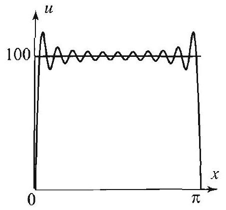

Figure 2 Partial sum of the sine Fourier series expansion of the initial temperature distribution (with $k$ up to 10) $100=\frac{400}{\pi} \sum_{k=0}^{\infty} \frac{\sin (2 k+1) x}{2 k+1} 0<x<\pi$. (See Exercise 1, Section 2.3.)

Right margin note (page 36)

After With nersed ad the
s even
alone.
e $t$. In

++++

ntial Equations in Rectangular Coordinates

The solution of the one dimensional heat boundary value problem
$$
\frac{\partial u}{\partial t}=c^{2} \frac{\partial^{2} u}{\partial x^{2}} \quad 0<x<L, \quad t>0
$$
$$
u(0, t)=0 \quad \text { and } \quad u(L, t)=0 \quad \text { for all } t>0
$$
$$
u(x, 0)=f(x) \quad \text { for } 0<x<L
$$
is
$$
u(x, t)=\sum_{n=1}^{\infty} b_{n} e^{-\lambda_{n}^{2} t} \sin \frac{n \pi}{L} x
$$
where
(5)
$$
b_{n}=\frac{2}{L} \int_{0}^{L} f(x) \sin \frac{n \pi}{L} x d x \quad \text { and } \quad \lambda_{n}=c \frac{n \pi}{L}, \quad n=1,2, \ldots
$$

EXAMPLE 1 Temperature in a bar with ends held at $0^{\circ} \mathrm{C}$
A thin bar of length $\pi$ units is placed in boiling water (temperature $100^{\circ} \mathrm{C}$ ) reaching $100^{\circ} \mathrm{C}$ throughout, the bar is removed from the boiling water. the lateral sides kept insulated, suddenly, at time $t=0$, the ends are imr in a medium with constant freezing temperature $0^{\circ} \mathrm{C}$. Taking $c=1$, fir temperature $u(x, t)$ for $t>0$.

Solution The boundary value problem that we need to solve is
$$
\begin{array}{r}
\frac{\partial u}{\partial t}=\frac{\partial^{2} u}{\partial x^{2}}, \quad 0<x<\pi, \quad t>0, \\
u(0, t)=0 \quad \text { and } \quad u(\pi, t)=0, \quad t>0, \\
u(x, 0)=100, \quad 0<x<\pi .
\end{array}
$$

From (4), we have
$$
u(x, t)=\sum_{n=1}^{\infty} b_{n} e^{-n^{2} t} \sin n x
$$
where
$$
b_{n}=\frac{2}{\pi} \int_{0}^{\pi} 100 \sin n x d x=\frac{200}{n \pi}(1-\cos n \pi)
$$

Substituting the values of $b_{n}$ and using the fact that $(1-\cos n \pi)=0$ if $n$ i and 2 if $n$ is odd, we get
$$
u(x, t)=\frac{400}{\pi} \sum_{\substack{n=0 \\ n \text { Odd }}}^{\infty} \frac{e^{-n^{2} t}}{n} \sin n x=\frac{400}{\pi} \sum_{k=0}^{\infty} \frac{e^{-(2 k+1)^{2} t}}{2 k+1} \sin (2 k+1) x .
$$

If we plug a given value of $t$ into the series solution, we obtain a function of $x$ This function gives the temperature distribution of the bar at the given tim

---

<!-- Page 37 -->

Left margin note (page 37)

Figure 3 Approximation of the temperature by the first normal mode
$$
u_{1}(x, t)=\frac{400}{\pi} e^{-t} \sin x .
$$

Right margin note (page 37)

139

f the re in ming the lecay nzero first this nt in $\pi$

$x$
$\pi$
ture
ated
two
zero
kept
ture
ady-
the
nde-
that
0, or
only.
$+B$,
con-

++++

Section 3.5 The One Dimensional Heat Equation
particular, when $t=0, u(x, 0)$ yields the half-range sine series expansion o initial temperature distribution $f(x)$, illustrated in Figure 2 and the first pictu Figure 4. In Figures 3 and 4, we have approximated the series solution by sum it through the terms with $k=0$ and $k=10$, respectively, and have showr temperature distribution at various values of $t$. Notice the rapid exponential of the higher order terms of the series solution. The exponent of the second nor term is 9 times bigger and the third is 25 times bigger than the exponent of the term. This shows that the higher order terms die exceedingly fast. Because o fast fall off of the higher order terms, the Gibbs phenomenon, which is appare the first frame in Figure 4, disappears very quickly from the partial sums.

Figure 4 Temperature distribution in a bar with ends held at $0^{\circ}$. The tempers decays to 0 as $t$ increases. Note that for large $t$, the shape of the graph is domin by the first normal mode. Indeed, comparison with Figure 3 shows that the curves are virtually indistinguishable for $t \geq 0.5$.

Steady-State Temperature Distribution
The graphs in Figure 4 show that the temperature in the bar tends to as $t$ increases. This is intuitively clear, since the ends of the bar are at $0^{\circ}$ and there is no internal source of heat. In general, the tempera distribution that we get as $t \rightarrow \infty$ is a function of $x$ alone called the ste: state solution (or time-independent solution). So, in Example 1 steady-state solution is the function that is identically 0 .

For general boundary conditions, since the steady-state solution is pendent of $t$, we must have $\partial u / \partial t=0$. Substituting this in (1), we see the steady-state distribution satisfies the differential equation $\frac{\partial^{2} u}{\partial x^{2}}=$ simply $\frac{d^{2} u}{d x^{2}}=0$, because $u$, the steady-state solution, is a function of $x$ The general solution of this simple differential equation is $u(x)=A x$ where $A$ and $B$ are constants that are determined using the boundary ditions. We illustrate with an example.

---

<!-- Page 38 -->

Left margin note (page 38)

140
Chapter 3 Partial Differe

Figure 5 Steady-state or time-independent solution.

Right margin note (page 38)

t temface is $\iota(x)= \frac{T_{2}-T_{1}}{L}$
gh the
nperaolving st imed by ndary
ertain

If you s, you e now g and
ing to

nsider

++++

ntial Equations in Rectangular Coordinates

EXAMPLE 2 Steady-state solution
Describe the steady-state solution in a bar of length $L$ with one end kept a perature $T_{1}$ and the other at temperature $T_{2}$. Assume that the lateral sur insulated and that there are no internal sources of heat.
Solution We have $u(0)=T_{1}$ and $u(L)=T_{2}$. Hence, from the fact that $A x+B$, it follows that $B=T_{1}$ and $A L+T_{1}=T_{2}$. Solving for $A$, we get $A=$ and so
$$
u(x)=\frac{T_{2}-T_{1}}{L} x+T_{1} .
$$

Thus, the graph of the steady-state solution is a straight line that goes throu given boundary values $T_{1}$ at 0 and $T_{2}$ at $L$ (see Figure 5).

In later sections of this chapter we will study steady-state ten ture distributions in higher dimensions. These problems will require s Laplace's equation in two or more variables, which is one of the mo portant differential equations in applied mathematics. As illustrat Example 2, the solutions will depend in an essential way on the bou conditions.

We next illustrate how steady-state solutions can be used to solve c nonhomogeneous boundary value problems.

Nonzero Boundary Conditions
Consider the heat boundary value problem
$$
\begin{array}{c}
\frac{\partial u}{\partial t}=c^{2} \frac{\partial^{2} u}{\partial x^{2}}, \quad 0<x<L, \quad t>0, \\
u(0, t)=T_{1} \quad \text { and } \quad u(L, t)=T_{2}, \quad t>0, \\
u(x, 0)=f(x), \quad 0<x<L .
\end{array}
$$

The problem is nonhomogeneous when $T_{1}$ and $T_{2}$ are not both zero. try to solve it in this case using the method of separation of variable will encounter difficulties because of the boundary conditions. As w show, the problem can be reduced to the zero-ends case by subtractir then adding the steady-state solution.

We begin by finding the steady-state solution, $u_{1}(x)$, correspond the boundary conditions (7). From Example 2, we have
$$
u_{1}(x)=\frac{T_{2}-T_{1}}{L} x+T_{1} .
$$

Subtract $u_{1}(x)$ from the initial temperature distribution in (8) and co

---

<!-- Page 39 -->

Right margin note (page 39)

141
have
state
using
g the
nd at
tem-
cients
d the
ature

++++

Section 3.5 The One Dimensional Heat Equation

the resulting zero-ends (homogeneous) heat boundary value problem
$$
\begin{array}{c}
\frac{\partial u}{\partial t}=c^{2} \frac{\partial^{2} u}{\partial x^{2}}, \quad 0<x<L, \quad t>0, \\
u(0, t)=0 \quad \text { and } \quad u(L, t)=0, \quad t>0, \\
u(x, 0)=f(x)-u_{1}(x), \quad 0<x<L .
\end{array}
$$

Let $u_{2}(x, t)$ be the solution of (10)-(12). According to (4) and (5), we
$$
u_{2}(x, t)=\sum_{n=1}^{\infty} b_{n} e^{-\lambda_{n}^{2} t} \sin \frac{n \pi}{L} x
$$
where $\lambda_{n}=\frac{c n \pi}{L}$, and
$$
b_{n}=\frac{2}{L} \int_{0}^{L}(f(x)-\overbrace{\left(\frac{T_{2}-T_{1}}{L} x+T_{1}\right)}^{u_{1}(x)}) \sin \frac{n \pi}{L} x d x
$$

Now the solution of (6)-(8) is obtained by adding to $u_{2}(x, t)$ the steadysolution $u_{1}(x)$ as follows:
$$
u(x, t)=u_{1}(x)+u_{2}(x, t) .
$$

This can be verified directly by plugging into the equations (6)-(8) and the properties of $u_{1}$ and $u_{2}$ (see Exercise 10).

EXAMPLE 3 A nonhomogeneous boundary value problem
Consider the experiment in Example 1. Find the solution if after bringin temperature of the bar to $100^{\circ}$, the end at $x=0$ is frozen at $0^{\circ}$, while the e $x=\pi$ is kept at $100^{\circ}$.

Solution We have $T_{1}=0$ and $T_{2}=100$. Thus $u_{1}(x)=\frac{100}{\pi} x$, and the initial perature distribution in (12) becomes $100-\frac{100}{\pi} x$. We now determine the coeffic in the series solution $u_{2}$ in (13). Using (14) and integration by parts, we get
$$
b_{n}=\frac{2}{\pi} \int_{0}^{\pi}\left(100-\frac{100}{\pi} x\right) \sin n x d x=\frac{200}{n \pi}
$$

Finally, appealing to (15), we obtain the solution
$$
u(x, t)=\frac{100}{\pi} x+\frac{200}{\pi} \sum_{n=1}^{\infty} \frac{\sin n x}{n} e^{-n^{2} t} .
$$

Two questions come to mind when we consider this solution: Does it yiel steady-state solution $u_{1}(x)$ when $t \rightarrow \infty$ ? and does it yield the initial temper

---

<!-- Page 40 -->

Left margin note (page 40)

142
Chapter 3 Partial Differe

Figure 6 As $t$ increases the graph of $u(x, t)$ approaches that of the steady-state solution $u_{1}(x)$. When $t=0$, the graph approximates the initial temperature distribution. Note the Gibbs phenomenon at the endpoints, causing the graph to overshoot the value 100.

Right margin note (page 40)

erm in
ons is e rate an be sented nd get
ourier
gure 6 after
blems -state itions ess of ion is ons to tion ids at iform inside verns from

++++

ntial Equations in Rectangular Coordinates
distribution 100 when $t=0$ ? We have $\lim _{t \rightarrow \infty} \frac{\sin n x}{n} e^{-n^{2} t}=0$. Thus each te the series in (16) tends to 0 as $t \rightarrow \infty$, which leads us to conclude that
$$
\lim _{t \rightarrow \infty} u(x, t)=\frac{100}{\pi} x=u_{1}(x) .
$$

This argument lacks rigor (in general, the limit of an infinite sum of functi not equal to the sum of the limits of the functions). However, because th of convergence of the series is very fast, due to the terms $e^{-n^{2} t}$, this proof justified using properties of convergent series of functions similar to those pres in Section 2.7. Toward answering our second question, we set $t=0$ in (16) al
$$
u(x, 0)=\frac{100}{\pi} x+\frac{200}{\pi} \sum_{n=1}^{\infty} \frac{\sin n x}{n} .
$$

Is this equal to 100 for $0<x<\pi$ ? Recognizing the infinite series as the F series of the sawtooth function, we obtain
$$
u(x, 0)=\frac{100}{\pi} x+\frac{200}{\pi} \frac{1}{2}(\pi-x)=100, \quad \text { for } 0<x<\pi,
$$
which yields an affirmative answer to our second question. The graphs in Fi illustrate both answers. To plot $u(x, t)$ we used (16) and truncated the series three terms.

From the last example, you could extract a method for solving pro with nonhomogeneous boundary conditions. By subtracting the steady solution, we were able to reduce to a problem with zero boundary cond and then solve using the method of separation of variables. The succ this method depends in a crucial way on the fact that the heat equat linear. These ideas are very important and will be used in later sectic solve more complicated nonhomogeneous higher dimensional problems

Appendix: Derivation of the one dimensional heat equa
Consider a bar of length $L$ placed horizontally on the $x$-axis with en $x=0$ and $x=L$. We suppose that the cross sections of the bar are un and that the lateral sides of the bar are well insulated, so that heat the bar flows only in the $x$-direction. To derive the equation that go the heat transfer inside the bar, we recall some definitions and laws

---

<!-- Page 41 -->

Left margin note (page 41)

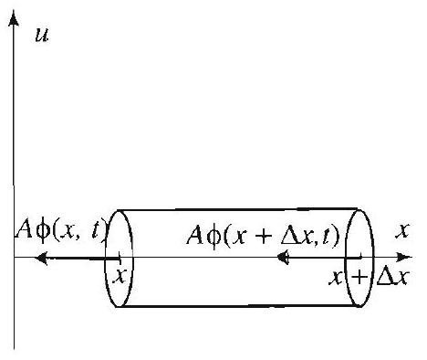

Figure 7 Flow of heat into a small portion of the rod.

Right margin note (page 41)

143

ving
ature,
the
$\Delta x$,
takes
${ }^{\circ}$, to
ge of and
heat
urier's
from

++++

Section 3.5 The One Dimensional Heat Equation

physics. The following definitions will be needed:
$$
\begin{array}{l}
u(x, t)=\text { temperature at } x \text { at time } t \text {, } \\
e(x, t)=\text { thermal energy density } \\
\text { (heat energy per unit volume), } \\
\phi(x, t)=\text { heat flux (amount of heat energy per unit time flow } \\
\text { in the positive direction across a unit surface), } \\
Q(x, t)=\text { heat source (heat energy per unit volume } \\
\text { per unit time), } \\
s(x)=\text { specific heat (heat energy required to raise the } \\
\text { temperature of one unit mass by one unit of temper } \\
\text { assumed here to depend only on the position } x \\
\text { along the bar), } \\
\rho(x)=\text { mass density (mass per unit volume). }
\end{array}
$$

Consider a thin vertical slice of the bar at $x$ with width $\Delta x$. Denot area of the cross section by $A$ (Figure 7). The volume of the slice is $A$ and its total thermal energy is therefore
$$
\text { thermal energy in slice }=e(x, t) A \Delta x .
$$

Since the thermal energy of the slice is also defined to be the energy it to raise the temperature of the slice from a reference temperature, say 0 its current temperature $u(x, t)$, we have
$$
e(x, t) A \Delta x=s(x) u(x, t) \rho(x) A \Delta x .
$$

Hence
$$
e(x, t)=s(x) u(x, t) \rho(x)
$$

The law of conservation of heat energy states that the rate of chan the heat energy is due to the heat energy flowing across the boundaries internal sources of heat. Applied to the slice at $x$, the law states that
$$
\frac{\partial}{\partial t}[e(x, t) A \Delta x]=\phi(x, t) A-\phi(x+\Delta x, t) A+Q(x, t) A \Delta x
$$
(see Figure 7). The second law that we appeal to is Fourier's law of 1 conduction, expressed by the equation
$$
\phi(x, t)=-K_{0} \frac{\partial u}{\partial x},
$$
where the positive constant $K_{0}$ is called the thermal conductivity. Fo law expresses in quantitative form the well-known fact that heat flows

---

<!-- Page 42 -->

Left margin note (page 42)

144 Chapter 3 Partial Differe

Right margin note (page 42)

heat ation. t side right to is no data.

++++

ntial Equations in Rectangular Coordinates

hotter to cooler. (Thus if temperature increases as $x$ increases, the energy will flow to the left, explaining the minus sign in Fourier's law.

We now have all the necessary ingredients to derive the heat equ Going back to (18), dividing by $A \Delta x$ and making $\Delta x \rightarrow 0$ on the righ of the equation, we get
$$
\frac{\partial}{\partial t} e(x, t)=\lim _{\Delta x \rightarrow 0} \frac{\phi(x, t)-\phi(x+\Delta x, t)}{\Delta x}+Q(x, t)=-\frac{\partial \phi}{\partial x}+Q(x, t
$$

Substituting on the left the expression of $e(x, t)$ from (17), and on the using Fourier's law, we get
$$
\frac{\partial}{\partial t}[s(x) u(x, t) \rho(x)]=-\frac{\partial}{\partial x}\left[-K_{0} \frac{\partial u}{\partial x}\right]+Q(x, t),
$$
from which we get the heat equation
$$
s(x) \rho(x) \frac{\partial}{\partial t} u(x, t)=K_{0} \frac{\partial^{2} u}{\partial x^{2}}+Q(x, t) .
$$

If the specific heat and the density are constant, the equation reduces
$$
\frac{\partial}{\partial t} u(x, t)=\frac{K_{0}}{s \rho} \frac{\partial^{2} u}{\partial x^{2}}+\frac{1}{s \rho} Q(x, t) .
$$

The constant $\frac{K_{0}}{s \rho}$ is called the thermal diffusivity. Finally, if there internal heat source, then $Q(x, t)=0$, and the equation becomes
$$
\frac{\partial}{\partial t} u(x, t)=\frac{K_{0}}{s \rho} \frac{\partial^{2} u}{\partial x^{2}} .
$$

Letting $c^{2}=\frac{K_{0}}{s \rho}$, we get the heat equation treated in this section.
Exercises 3.5
In Exercises 1-6, solve the boundary value heat problem (1)-(3) with the giver In each case, give a brief physical explanation of the problem.
1. $L=\pi, c=1, f(x)=78$.
2. $L=\pi, c=1, f(x)=30 \sin x$.
3. $L=\pi, c=1$,
4. $L=\pi, c=1$,
$$
f(x)=\left\{\begin{array}{ll}
33 x & \text { if } 0<x \leq \frac{\pi}{2}, \\
33(\pi-x) & \text { if } \quad \frac{\pi}{2}<x<\pi .
\end{array}\right.
$$
$$
f(x)=\left\{\begin{array}{ll}
100 & \text { if } 0<x \leq \frac{\pi}{2}, \\
0 & \text { if } \frac{\pi}{2}<x<\pi
\end{array}\right.
$$
5. $L=1, c=1, f(x)=x$.
6. $L=1, c=1, f(x)=e^{-x}$.

---

<!-- Page 43 -->

Right margin note (page 43)

145
de 1 ,
p to
ecific
ue of
tion
dary
istri-
for

$x)$ is und? deas 10ge-
ation on of not hich rium rmly

++++

Section 3.5 The One Dimensional Heat Equation
7. (a) Plot the temperature distributions for various values of $t>0$ in Examp and approximate how long it will take for the maximum temperature to dro $50^{\circ}$.
(b) Plot the surface $z=u(x, t)(t>0)$ and explain what it represents. Be spe in your description of the surface as $t \rightarrow 0$ and $t \rightarrow \infty$.
8. (a) Generalize Example 1 by solving the problem for arbitrary $c$.
(b) Plot the solution at $t=1$, for $c=1,2,3$. Describe how a change in the val $c$ affects the rate of heat transfer. Justify your answer by considering the solv given by (4) and (5).
9. Determine the steady-state solution in a bar of length 1 with the given boun conditions.
(a) $u(0, t)=0, u(1, t)=100$.
(b) $\quad u(0, t)=100, u(1, t)=100$.
10. (a) Verify that the solution of (6)-(8) is given by (15).
(b) Show that, in terms of the Fourier coefficients of the initial temperature d bution $f(x)$ in (8), the coefficient in (14) is
$$
b_{n}=\frac{2}{L} \int_{0}^{L} f(x) \sin \frac{n \pi}{L} x d x-2 \frac{T_{1}+(-1)^{n+1} T_{2}}{n \pi}
$$

In Exercises 11-14, solve the nonhomogeneous boundary value problem (6)-(8 the given data.
11. $u(0, t)=100, u(1, t)=0, f(x)=30 \sin (\pi x), L=1, c=1$.
12. $u(0, t)=100, u(1, t)=100, f(x)=50 x(1-x), L=1, c=1$.
13. $u(0, t)=100, u(\pi, t)=50, f(x)$ as in Exercise $3, L=\pi, c=1$.
14. $u(0, t)=0, u(\pi, t)=100, f(x)$ as in Exercise $4, L=\pi, c=1$.
15. What is the solution of (6)-(8) if the initial temperature distribution $f($ equal to the steady-state solution $u_{1}(x)$ ? Justify your answer on physical gro
16. Project Problem: A nonhomogeneous wave problem. Using the behind the solution of the boundary value problem (6)-(8), solve the nonhon neous wave problem
$$
\begin{array}{c}
u_{t t}=c^{2} u_{x x}, \quad 0<x<L, \quad t>0, \\
u(0, t)=A, \quad u(L, t)=B, \quad t>0, \\
u(x, 0)=f(x), \quad u_{t}(x, 0)=g(x), \quad 0<x<L,
\end{array}
$$
where $A$ and $B$ are not both zero. (As you may verify, the time-independent solu is still $u_{1}(x)=\frac{B-A}{L} x+A$. Unlike the case of the heat equation, the solutic the wave equation does not have a limit in general as $t \rightarrow \infty$. Hence $u_{1}(x)$ is the time-asymptotic form of the solution. However, $u_{1}$ is the solution about w the waves wiggle. For this reason, a physicist would still call $u_{1}$ the equilib solution.)
17. Show that for fixed $t>0$, the solution of the heat equation (4) is unifo convergent for $0 \leq x \leq L$. (Assume that $f(x)$ is bounded for $0 \leq x \leq L$.)

---

<!-- Page 44 -->

Left margin note (page 44)

146
Chapter 3
Pa
3.6 Heat Co

Figure 1 Bar with ends.

Right margin note (page 44)

ferent with nd extions. ctions lution elated
n $f(x)$
end)
on 3.5,
e same ditions utions plution ng and $k=0$
ve the

++++

rtial Differential Equations in Rectangular Coordinates

onduction in Bars: Varying the Boundary Conditions
We continue our study of the one dimensional heat equation, with di boundary conditions. These model temperature distributions in bar both ends insulated, with one end at zero temperature and the other echanging heat with a surrounding medium, and other interesting varia We will see that the boundary conditions determine the type of fun that are used to build up the solution. In the previous section, the so was expressed as a sine series; here we will see cosine series and other $r$ expansions known as generalized Fourier series.

EXAMPLE 1 Bar with insulated ends
The problem of heat transfer in a bar of length $L$ with initial heat distributio and no heat loss at either end (Figure 1) is modeled by the heat equation
$$
\frac{\partial u}{\partial t}=c^{2} \frac{\partial^{2} u}{\partial x^{2}}, \quad 0<x<L, \quad t>0,
$$
along with the boundary conditions (no heat flux in the $x$-direction at eithe
$L, t)=0$
insulated
$$
\frac{\partial u}{\partial x}(0, t)=\frac{\partial u}{\partial x}(L, t)=0, \quad t>0,
$$
and the initial condition
$$
u(x, 0)=f(x), \quad 0<x<L .
$$

Solve this problem using the method of separation of variables.
Solution We assume that $u(x, t)=X(x) T(t)$, follow the method of Sectic and arrive in exactly the same way at the following equations:
$$
\begin{array}{c}
T^{\prime}-k c^{2} T=0 \\
X^{\prime \prime}-k X=0, \quad X^{\prime}(0)=0 \quad \text { and } \quad X^{\prime}(L)=0,
\end{array}
$$
where $k$ is the separation constant. Note that the differential equations are th as in Section 3.5, but the boundary conditions are different, due to the con (2). This difference in the boundary conditions will give rise to different so in $X$. It is easy to check that positive values of $k$ lead only to the trivial s $X=0$. For $k=0$, we have $X^{\prime \prime}=0$, leading to $X=c_{1} x+c_{2}$. Differentiati imposing the boundary conditions, we find $c_{1}=0$ and $c_{2}$ is arbitrary. Thus leads to a nontrivial solution
$$
X_{0}=1 .
$$

To consider the case of negative separation constant, we set $k=-\mu^{2}$, so resulting equation, and get $X=c_{1} \cos \mu x+c_{2} \sin \mu x$. Computing
$$
X^{\prime}=-c_{1} \mu \sin \mu x+c_{2} \mu \cos \mu x
$$

---

<!-- Page 45 -->

Left margin note (page 45)

Compare this solution with the solution (4) of the heat problem with zero end conditions (Section 3.5). Note that the change in boundary conditions causes sines to be replaced by cosines, and the solution to involve the Fourier cosine expansion of the initial temperature distribution rather than the Fourier sine expansion.

Right margin note (page 45)

147
g the
from
the
(3) is
pandary nishther dary ll be
ries kept at a
ction adary

++++

Section 3.6 Heat Conduction in Bars: Varying the Boundary Conditions

and using the first boundary condition $X^{\prime}(0)=0$, we obtain $c_{2}=0$. Usin, second boundary condition $X^{\prime}(L)=0$, we obtain the equation $\sin \mu L=0$, which we get
$$
\mu=\mu_{n}=\frac{n \pi}{L}, \quad n=1,2, \ldots
$$
and hence
$$
X_{n}=\cos \frac{n \pi}{L} x, \quad n=1,2, \ldots .
$$

The corresponding solutions to the equation for $T$ are
$$
T_{0}=a_{0} \quad \text { and } \quad T_{n}=a_{n} e^{-\lambda_{n}^{2} t}, \quad n=1,2, \ldots,
$$
where $\lambda_{n}=c \frac{n \pi}{L}$. Superposing the product solutions, we obtain
$$
u(x, t)=a_{0}+\sum_{n=1}^{\infty} a_{n} e^{-\lambda_{n}^{2} t} \cos \frac{n \pi}{L} x
$$

To finish the solution, we must determine the coefficients $a_{n}$ so as to matc initial condition (3). This yields
$$
f(x)=a_{0}+\sum_{n=1}^{\infty} a_{n} \cos \frac{n \pi}{L} x .
$$

Recognizing this as a cosine expansion of $f$, we conclude that
$$
a_{0}=\frac{1}{L} \int_{0}^{L} f(x) d x \quad \text { and } \quad a_{n}=\frac{2}{L} \int_{0}^{L} f(x) \cos \frac{n \pi}{L} x d x
$$
(Use Section 2.4, (2).) Thus the solution of the boundary value problem (1)given by (4) with the coefficients determined by (5).

The fact that cosine expansions arose in Example 1 while sine ex sions arose in the previous section is caused by the change in the boun conditions: vanishing endpoint conditions force sine expansions, va ing derivatives force cosine expansions. As the next example shows, expansions will arise naturally from the imposition of yet other boun conditions. These so-called generalized Fourier series expansions wi studied in detail, from a unified perspective, in Chapter 6.

EXAMPLE 2 Bar with one radiating end: generalized Fourier se Determine the temperature $u(x, t)$ in a bar of length $L$, given that one end is at zero temperature and the other end loses heat to the surrounding medium rate proportional to its temperature. Thus the boundary conditions are
$$
u(0, t)=0, \quad \frac{\partial u}{\partial x}(L, t)=-\kappa u(L, t) \quad(t>0),
$$
where $\kappa$ is a positive constant called the heat transfer constant or conve coefficient. Denoting the initial temperature distribution by $f(x)$, the bour

---

<!-- Page 46 -->

Left margin note (page 46)

148
Chapter 3 Partial Differe

Note that the boundary conditions are leading to the complicated equation (7), compared to the much simpler equation $\sin \mu L=0$ that we had to solve in the heat problem with zero end conditions (Section 3.5).

Figure 2 Graphs of $y= \tan \mu L$ and $y=-\frac{\mu}{\kappa}$ as functions of $\mu>0$. The transcendental equation $\tan \mu L= -\frac{\mu}{\kappa}$ has infinitely many positive roots $\mu_{1}<\mu_{2}<\mu_{3} \ldots$.

Right margin note (page 46)

ditions em are e form
riables $(L)=$ ositive, $X= d$ from $\operatorname{inh} \mu L$ ig that $k=0$
indary $=0$, or $\mu$
is of $\mu$. ggested While ole, we values ated in

++++

ntial Equations in Rectangular Coordinates
value problem to be solved consists of the heat equation (1), the boundary con (6), and the initial condition (3). The boundary conditions in this proble known as Robin conditions, which are linear boundary conditions of th $c_{1} u\left(x_{0}, t\right)+c_{2} u_{x}\left(x_{0}, t\right)=h(t)$.

Solution We set $u(x, t)=X(x) T(t)$, apply the method of separation of va as in Section 3.5, and arrive at the equations $X^{\prime \prime}-k X=0, X(0)=0, X -\kappa X(L)$, and $T^{\prime}-k c^{2} T=0$, where $k$ is the separation constant. If $k$ is po say $k=\mu^{2}$ with $\mu>0$, then the general solution of $X^{\prime \prime}-\mu^{2} X=0$ is $c_{1} \cosh \mu x+c_{2} \sinh \mu x$. The condition $X(0)=0$ implies that $c_{1}=0$, and $X^{\prime}(L)=-\kappa X(L)$ we get $\mu c_{2} \cosh \mu L=-\kappa c_{2} \sinh \mu L$. But $\cosh \mu L, \kappa$, and s are all strictly positive. So the last equation holds only when $c_{2}=0$, implyir $X=0$. Thus $k>0$ leads to the trivial solution. Similarly, we argue that leads the trivial solution. Thus $k=-\mu^{2}<0$ and the equations become
$$
\begin{array}{c}
X^{\prime \prime}+\mu^{2} X=0, \quad X(0)=0 \quad \text { and } \quad X^{\prime}(L)=-\kappa X(L), \\
T^{\prime}+\mu^{2} c^{2} T=0 .
\end{array}
$$

Solving the equation in $X$, we find $X=c_{1} \cos \mu x+c_{2} \sin \mu x$. Imposing the bo conditions, we get $X=\sin \mu x$, where $\mu$ must satisfy $\mu \cos \mu L+\kappa \sin \mu L=$ equivalently,
$$
\tan \mu L=-\frac{\mu}{\kappa} .
$$

In Figure 2 we have plotted the graphs of $y=\tan \mu L$ and $y=-\frac{\mu}{\kappa}$ as function The intersections of these graphs determine the solutions of (7). Thus, as sug by Figure 2, equation (7) has infinitely many positive solutions $\mu_{1}, \mu_{2}, \ldots$. we do not have explicit forms for the $\mu_{n}$ as we had in the previous exam can still proceed with the solution much as before. Approximate numerical of the $\mu_{n}$ 's can be obtained with the help of a computer system, as illustr; Example 3. Corresponding to $\mu_{n}$, we have
$$
X_{n}=\sin \mu_{n} x,
$$
and
$$
T_{n}=c_{n} e^{-c^{2} \mu_{n}^{2} t}, \quad n=1,2, \ldots,
$$

---

<!-- Page 47 -->

Left margin note (page 47)

Compare the solutio (4), Section 3.5. N the solution here is n periodic in $x$, since th common period for tions $\sin \mu_{n} x$.

Note that expansion some similarity with series expansions of 2.4 , but differs in sor (for example, the fo $\sin \mu_{n} x, \quad n=1,2,$. no common period). new representation izes Fourier sine series sions to which it reduc $\kappa \rightarrow \infty$ (in which c can see graphically fr ure 2 that $\mu_{n}$ tends to The general theory of pansions will be devel Chapter 6.

Right margin note (page 47)

149
solu-
oeffi-
coef-
if the
and
egral
(10)
value
ation ation preville these coneries on of

++++

Section 3.6 Heat Conduction in Bars: Varying the Boundary Conditions

n (8) to ote that to longer ere is no the solu-
(9) has the sine Section ne ways inctions have This general-expanes when ase, we om Fig$n \pi / L$ ). such exoped in
which are obtained by solving the equation for $T$. Superposing the product tions, we get
$$
u(x, t)=\sum_{n=1}^{\infty} c_{n} e^{-c^{2} \mu_{n}^{2} t} \sin \mu_{n} x
$$
as a solution of (1) and (2). To finish the solution, we must determine the c cients $c_{n}$ so as to match the initial condition. Setting $t=0$, we see that
$$
f(x)=\sum_{n=1}^{\infty} c_{n} \sin \mu_{n} x .
$$

This is a so-called generalized Fourier series with generalized Fourier ficients $c_{n}$. Taking our lead from the case of Fourier series, we observe that functions
$$
\sin \mu_{1} x, \sin \mu_{2} x, \ldots
$$
satisfy the following "orthogonality relations"
$$
\int_{0}^{L} \sin \mu_{m} x \sin \mu_{n} x d x=0, \text { for } m \neq n
$$
then we can solve for the $c_{n}$ as follows. We multiply (9) through by $\sin \mu_{m} x$ integrate from 0 to $L$. Assuming that we can interchange the sum and the int and using (10), we get
$$
\int_{0}^{L} f(x) \sin \mu_{m} x d x=\sum_{n=1}^{\infty} c_{n} \overbrace{\int_{0}^{L} \sin \mu_{m} x \sin \mu_{n} x d x}^{=0 \text { unless } n=m}=c_{m} \int_{0}^{L} \sin ^{2} \mu_{m} x d x
$$

This yields the formula
$$
c_{n}=\frac{1}{\int_{0}^{L} \sin ^{2} \mu_{n} x d x} \int_{0}^{L} f(x) \sin \mu_{n} x d x
$$

This formal discussion is completed by the proof of the orthogonality relations outlined in Exercise 10. Therefore, the complete solution of the boundary problem (1), (6), (3), is the series (8) with the coefficients given by (11).
To make the previous discussion rigorous, we would need a represent theorem for series of the form (9) analogous to the Fourier represent theorem (Theorem 1, Section 2.3). Such representation theorems are sented in Chapter 6, where we study the general theory of Sturm-Liou problems (see, in particular, Section 6.2, Theorem 3). The gist of results is that a series like (9) with coefficients determined by (11) will verge for piecewise smooth functions in much the same way Fourier s will. These ideas are illustrated in the following numerical applicatio Example 2.

---

<!-- Page 48 -->

Left margin note (page 48)

150
Chapter 3
Pa

Figure 3

Right margin note (page 48)

g end
1 , and
ven by
um for ximum
$=-x$.
uation
lutions
ficients
$\sin \mu_{n} x$
anction
sum of good
dpoint

++++

rtial Differential Equations in Rectangular Coordinates

EXAMPLE 3 A numerical application for a bar with one radiatin
Consider the boundary value problem in Example 2 with $L=1, c=1, \kappa=$ with the initial temperature distribution $f(x)=x(1-x)$.
(a) Compute explicitly the first five $\mu_{n}$ 's and the corresponding $X_{n}$ 's.
(b) Compute the first five terms of the series expansion of the function $f$ gi
(9). Plot $f$ and several partial sums to check the validity of the expansion.
(c) Write down the first five terms of the solution (8). Plot this partial s various values of $t$, and use these to estimate the time it takes for the ma: temperature in the bar to drop to 0.1 .

Solution (a) In Figure 3 we have plotted the graphs of $y=\tan x$ and $y$
According to the solution of Example 2, to find the $\mu_{n}$ 's, we must solve the eq $\tan x=-x$. With the help of a computer system, we find the first five so to be approximately
$$
\mu_{1}=2.0288, \mu_{2}=4.9132, \mu_{3}=7.9787, \mu_{4}=11.0855, \mu_{5}=14.2074 .
$$

Thus
$$
\begin{array}{c}
X_{1}(x)=\sin (2.0288 x), X_{2}(x)=\sin (4.9132 x), X_{3}(x)=\sin (7.9787 x), \\
X_{4}(x)=\sin (11.0855 x), X_{5}(x)=\sin (14.2074 x) .
\end{array}
$$
(b) From (9) and (11), we have
$$
x(1-x)=\sum_{n=1}^{\infty} c_{n} \sin \mu_{n} x,
$$
where
$$
c_{n}=\int_{0}^{1} x(1-x) \sin \mu_{n} x d x / \int_{0}^{1} \sin ^{2} \mu_{n} x d x
$$
with the numerical values of the $\mu_{j}$ 's given in (a). We evaluate these coeff with the help of a computer system and find
$$
c_{1}=.2133, c_{2}=.1040, c_{3}=-.0220, c_{4}=.0187, c_{5}=-.0083
$$

Thus the expansion of $f$ is
$$
\begin{aligned}
f(x)=. & 2133 \sin (2.0288 x)+.1040 \sin (4.9132 x)-.0220 \sin (7.9787 x) \\
& +.0187 \sin (11.0855 x)-.0083 \sin (14.2074 x)+\cdots .
\end{aligned}
$$

Keep in mind that this is not a Fourier sine series, because the functions do not have a common period. However, the expansion approximates the fu much like Fourier series do. In Figure 4 we have plotted the fifth partial this generalized Fourier series, along with the graph of $f$. We have a prett approximation of the function throughout the interval $[0,1]$, except at the en $x=1$, where the convergence seems to be slow.

---

<!-- Page 49 -->

Left margin note (page 49)

Figure $f(x)=$

Right margin note (page 49)

151
$$
\underset{1}{\stackrel{t=.8}{t}} \underset{1}{\stackrel{t=}{t}}
$$
various
based
heat and

++++

Section 3.6 Heat Conduction in Bars: Varying the Boundary Conditions

4 Generalized Fourier series expansion of $x(1-x), 0<x<1$.

Figure 5 Temperature distribution at times (using the sixth partial sum).
(c) Combining (8) with part (b), we find that
$$
\begin{aligned}
u(x, t)= & .2133 e^{-\mu_{1}^{2} t} \sin (2.0288 x)+.1040 e^{-\mu_{2}^{2} t} \sin (4.9132 x) \\
& -.0220 e^{-\mu_{3}^{2} t} \sin (7.9787 x)+.0187 e^{-\mu_{4}^{2} t} \sin (11.0855 x) \\
& -.0083 e^{-\mu_{5}^{2} t} \sin (14.2074 x)+\cdots
\end{aligned}
$$
where the $\mu_{n}$ 's are given in (a). Plotting the fifth partial sum at $t=0, .2$, we see from Figure 5 that after approximately $t=.2$ the maximum temperat the bar drops below .1.

Exercises 3.6
In Exercises 1-6, solve the heat problem (1) - (3) for the given data.
1. $L=\pi, c=1, f(x)=100$. [Hint: In this case, you can guess the answer on your physical intuition.]
2. $L=1, c=1, f(x)=\cos \pi x$.
3. $L=\pi, c=1, f(x)=100 x$ if $0<x \leq \frac{\pi}{2}$ and $100(\pi-x)$ if $\frac{\pi}{2}<x<\pi$.
4. $L=1, c=1, f(x)=100$ if $0<x \leq \frac{1}{2}$ and 0 if $\frac{1}{2}<x<1$.
5. A problem with odd harmonics only. Show that the solution of the equation (1), subject to the boundary conditions $u(0, t)=0$ and $u_{x}(L, t)=0$ the initial condition $u(x, 0)=f(x)$, is
$$
u(x, t)=\sum_{n=0}^{\infty} B_{n} \sin \left[\frac{\pi}{2 L}(2 n+1) x\right] e^{-\left[c \frac{\pi}{2 L}(2 n+1)\right]^{2} t}
$$
where
$$
B_{n}=\frac{2}{L} \int_{0}^{L} f(x) \sin \left[\frac{\pi}{2 L}(2 n+1) x\right] d x
$$
6. Solve the problem in Exercise 5 with $c=1, L=\pi$, and $f(x)=\sin x$.

---

<!-- Page 50 -->

Left margin note (page 50)

152
Chapter 3 Pa

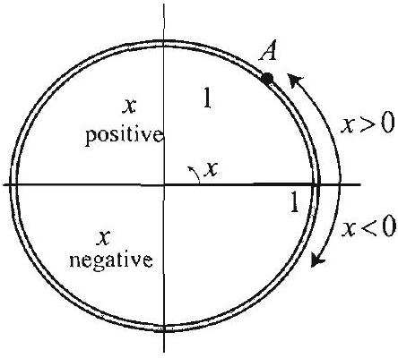

Figure 6 As $x$ run the interval $(-\pi, \pi]$, $A$ traces the circle o Here $x$ is the distan to the point $(1,0)$. the measure in radi angle formed by the tal axis and the ray origin through the p

Right margin note (page 50)

en by
e is no rature initial xplain.
als the he out-
$\left.\mu_{m}^{2}\right)$.
bution.
$=\frac{1}{2}$,
< 1 .
Work 0 but ons.

In this that is by the Thus shape riodic,

The undary

++++

rtial Differential Equations in Rectangular Coordinates
7. The average temperature in a bar of length $L$ at a given time $t$ is giv
$$
\frac{1}{L} \int_{0}^{L} u(x, t) d x
$$

Suppose that, as in Example 1, the bar is insulated in such a way that ther exchange of heat with the surrounding medium. Show that the average tempe is constant for all time. What is the average temperature in terms of the heat distribution $f(x)$ ? Does your answer agree with your intuition? E: [Hint: Integrate (4) term by term.]
8. In Example 1, show that the steady-state temperature is constant and equ average temperature.
9. Compute the average temperature in Exercises 1 and 5.
10. Orthogonality. Establish the orthogonality relations (10) following th lined steps.
(a) For $m \neq n$, show that
$$
\int_{0}^{L} \sin \mu_{m} x \sin \mu_{n} x d x=\left[\mu_{m} \sin \mu_{n} L \cos \mu_{m} L-\mu_{n} \cos \mu_{n} L \sin \mu_{m} L\right] /\left(\mu_{n}^{2}-\right.
$$
(b) Use (7) to prove that the right side in (a) is 0 .

In Exercises 11-14, repeat Example 3 for the given initial temperature distri
11. $f(x)=x$.
13.
$$
f(x)=\left\{\begin{array}{ll}
100 & \text { if } 0<x \leq \frac{1}{2}, \\
0 & \text { if } \frac{1}{2}<x<1 .
\end{array}\right.
$$
12. $f(x)=\sin \pi x$.
14.
$$
f(x)=\left\{\begin{array}{ll}
0 & \text { if } 0<x \\
100\left(x-\frac{1}{2}\right) & \text { if } \frac{1}{2}<x
\end{array}\right.
$$
s through the point radius 1. ce from $A$ It is also ans of the horizonfrom the oint $A$.
15. Project Problem: Bar with one insulated and one radiating end. through Example 2 with the left boundary condition replaced by $u_{x}(0, t)=$ with all other conditions unchanged. Your answer will involve cosine functi
16. Project Problem: Heat conduction in a thin circular ring. problem we study heat conduction in a thin circular ring of unit radius insulated along its lateral sides. The temperature in the ring is governed heat equation (1), where $x$ represents arclength along the ring (Figure 6). despite the two dimensional shape, we have a one dimensional problem. The does come into play, however, in that the boundary conditions are now pe that is,
$$
u(-\pi, t)=u(\pi, t) \quad \text { and } \quad u_{x}(-\pi, t)=u_{x}(\pi, t) .
$$

Here we think of the ring to be parameterized by the interval $-\pi<x \leq \pi$ initial condition is given by (3).
(a) Using separation of variables, derive the differential equations and bo conditions
$$
\begin{array}{c}
T^{\prime}-k c^{2} T=0 \\
X^{\prime \prime}-k X=0 \\
X(-\pi)=X(\pi) \text { and } X^{\prime}(-\pi)=X^{\prime}(\pi)
\end{array}
$$

---

<!-- Page 51 -->

Right margin note (page 51)

153

, ...,
nulas
dary next stant new
the
pro-
ding
erval

++++

Section 3.6 Heat Conduction in Bars: Varying the Boundary Conditions
(b) Argue that positive choices of $k$ lead only to trivial solutions for $X$.
(c) Show that for $k=0$ we obtain the solution $X_{0}=a_{0}$.
(d) Show that for $k=-\mu^{2}$, nontrivial solutions arise only if $\mu=n$ for $n=1,2,3$ and the corresponding solutions are $X_{n}=a_{n} \cos n x+b_{n} \sin n x$.
(e) Conclude that
$$
u(x, t)=a_{0}+\sum_{n=1}^{\infty}\left(a_{n} \cos n x+b_{n} \sin n x\right) e^{-n^{2} c^{2} t}
$$
where $a_{0}, a_{n}$, and $b_{n}$ are the Fourier coefficients of $f$, given by the Euler forn in Section 2.2.

The point of the following set of problems is to show you that the boun conditions can have all sorts of effects on the solution. For example, in the problem, you will see that positive and negative values of the separation con have to be included. You will also encounter new equations for $\mu$, and hence generalized Fourier series expansions.
17. Project Problem: A problem with positive and negative values of separation constant. Consider the heat boundary value problem
$$
\begin{array}{c}
u_{t}=u_{x x}, \quad t>0, \quad 0<x<1 \\
u_{x}(0, t)=-u(0, t), \quad u_{x}(1, t)=-u(1, t) \\
u(x, 0)=f(x)
\end{array}
$$

This models a heat problem in a bar that is losing heat at its ends at a rate portional to the temperature of the endpoints.
(a.) Using separation of variables, obtain
$$
\begin{array}{c}
T^{\prime}-k T=0 \\
X^{\prime \prime}-k X=0, \quad X^{\prime}(0)=-X(0), \quad X^{\prime}(1)=-X(1)
\end{array}
$$
where $k$ is a separation constant.
(b) Argue convincingly that $k$ cannot be 0 .
(c) Show that if $k=\mu^{2}$, then $\mu=1$ and the corresponding solutions are
$$
T_{0}(t)=e^{t} \quad \text { and } \quad X_{0}(x)=e^{-x}
$$
(d) Show that if $k=-\mu^{2}$, then $\mu=n \pi, \quad n=1,2, \ldots$, and the correspor solutions are
$$
T_{n}(t)=e^{-(n \pi)^{2} t}
$$
and
$$
X_{n}(x)=n \pi \cos n \pi x-\sin n \pi x, n=1,2, \ldots .
$$
(e) Establish the orthogonality of the functions $X_{0}, X_{1}, X_{2}, \ldots$ on the int $(0,1)$ by showing that
$$
\int_{0}^{1} X_{j}(x) X_{k}(x) d x=0 \quad \text { if } j \neq k
$$

---

<!-- Page 52 -->

Left margin note (page 52)

154
Chapter 3
Pat

Right margin note (page 52)

rature
1.
$$
\iota=\frac{2 \mu}{\mu^{2}-1} .
$$
ations.
$$
\begin{array}{c}
\ldots, 5 \\
\text { kercise }
\end{array}
$$
rature
1 .

++++

tial Differential Equations in Rectangular Coordinates
(f) Conclude that
$$
u(x, t)=c_{0} e^{t} e^{-x}+\sum_{n=1}^{\infty} c_{n} T_{n}(t) X_{n}(x),
$$
where
$$
c_{0}=\frac{2 e^{2}}{e^{2}-1} \int_{0}^{1} f(x) e^{-x} d x
$$
and
$$
c_{n}=\frac{2}{1+n^{2} \pi^{2}} \int_{0}^{1} f(x) X_{n}(x) d x, \quad n=1,2, \ldots
$$
18. Illustrate the solution in Exercise 17 when $f(x)=x$. Plot the tempe distribution at various values of $t$ and discuss the behavior at $x=0$ and $x=$
19. Project Problem: Bar with two radiating ends; the equation $\tan$ / Consider the heat boundary value problem
$$
\begin{array}{c}
u_{t}=u_{x x}, \quad t>0, \quad 0<x<1 \\
u_{x}(0, t)=u(0, t), \quad u_{x}(1, t)=-u(1, t) \\
u(x, 0)=f(x)
\end{array}
$$
(a) Using separation of variables, obtain
$$
\begin{array}{c}
T^{\prime}-k T=0 \\
X^{\prime \prime}-k X=0, \quad X^{\prime}(0)=X(0), \quad X^{\prime}(1)=-X(1),
\end{array}
$$
where $k$ is a separation constant.
(b) Show that $k=-\mu^{2}<0$.
(c) Show that the corresponding solutions are
$$
T_{n}(t)=e^{-\mu_{n}^{2} t}
$$
and
$$
X_{n}(x)=\mu_{n} \cos \mu_{n} x+\sin \mu_{n} x, \quad n=1,2, \ldots,
$$
where $\mu_{n}$ is the $n$th positive root of the equation $\tan \mu=\frac{2 \mu}{\mu^{2}-1}$.
(d) Show graphically that the last equation has infinitely many positive sol Approximate the first five positive roots: $\mu_{1}, \mu_{2}, \ldots, \mu_{5}$.
(e) Check the orthogonality relations on the interval $(0,1)$ for $X_{n}, n=1,2$, (You can actually prove the orthogonality for all $n$ by taking a hint from E. 10.)
(f) Conclude that
$$
u(x, t)=\sum_{n=1}^{\infty} c_{n} T_{n}(t) X_{n}(x),
$$
where
$$
c_{n}=\frac{1}{\kappa_{n}} \int_{0}^{1} f(x) X_{n}(x) d x
$$
and
$$
\kappa_{n}=\int_{0}^{1} X_{n}^{2}(x) d x
$$
20. Illustrate the solution in Exercise 19 when $f(x)=x$. Plot the tempe distribution at various values of $t$ and discuss the behavior at $x=0$ and $x=$

---

<!-- Page 53 -->

Left margin note (page 53)

3.7 The Two

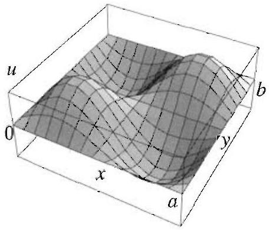

Figure 1 Initial a membrane with ed fixed.

In applying the metho aration of variables dimensions, it helps in mind the one dim cases treated earlier.

Right margin note (page 53)

155

rame The asing ional
$t$ (see essed icitly, time funcg the 3.3. ction stant. tants

++++

Section 3.7 The Two Dimensional Wave and Heat Equations

Dimensional Wave and Heat Equations
Suppose that a thin elastic membrane is stretched over a rectangular with dimensions $a$ and $b$, and that the edges are held fixed (Figure 1). membrane is then set to vibrate by displacing it vertically and then rele it. The vibrations of the membrane are governed by the two dimens wave equation

$b$
$$
\frac{\partial^{2} u}{\partial t^{2}}=c^{2}\left(\frac{\partial^{2} u}{\partial x^{2}}+\frac{\partial^{2} u}{\partial y^{2}}\right), \quad 0<x<a, \quad 0<y<b, \quad t>0
$$
where $u=u(x, y, t)$ denotes the deflection at the point $(x, y)$ at time Exercise 8, Section 3.2). The fact that the edges are held fixed is expr by the condition $u(x, y, t)=0$ on the boundary for all $t \geq 0$. More expl we have the boundary conditions
$$
u(0, y, t)=0 \text { and } u(a, y, t)=0 \quad \text { for } 0 \leq y \leq b \text { and } t \geq 0
$$
$$
u(x, 0, t)=0 \text { and } u(x, b, t)=0 \text { for } 0 \leq x \leq a \text { and } t \geq 0 .
$$

The initial conditions
$$
u(x, y, 0)=f(x, y) \quad \text { and } \quad \frac{\partial u}{\partial t}(x, y, 0)=g(x, y)
$$
represent, respectively, the shape and the velocity of the membrane at $t=0$. To determine the vibrations of the membrane, we must find the tion $u$ that satisfies (1)-(3). We solve the boundary value problem usin separation of variables method, following the steps outlined in Section

Separating Variables in (1) and (2)
We first look for product solutions of the form
$$
u(x, y, t)=X(x) Y(y) T(t) .
$$

Differentiating and plugging into (1), we obtain
$$
X Y T^{\prime \prime}=c^{2}\left(X^{\prime \prime} Y T+X Y^{\prime \prime} T\right) .
$$

Dividing both sides by $c^{2} X Y T$, we get
$$
\frac{T^{\prime \prime}}{c^{2} T}=\frac{X^{\prime \prime}}{X}+\frac{Y^{\prime \prime}}{Y}
$$

Since the left side is a function of $t$ alone, and the right side is a fun of $x$ and $y$ only, the expressions on both sides must be equal to a cons Expecting a periodic solution in $t$, we consider negative separation cons

---

<!-- Page 54 -->

Left margin note (page 54)

156
Chapter 3
Partial Differe

Right margin note (page 54)

been
hus
ne left
values
tions.)
equa-

tively,
$$
a=0,
$$

++++

ntial Equations in Rectangular Coordinates

only. (We could also rule out the nonnegative cases by arguing, as has done in previous sections, that they only lead to trivial solutions.)
$$
\frac{T^{\prime \prime}}{c^{2} T}=-k^{2} \quad \text { and } \quad \frac{X^{\prime \prime}}{X}+\frac{Y^{\prime \prime}}{Y}=-k^{2} \quad(k>0) .
$$

The first equation yields
$$
T^{\prime \prime}+k^{2} c^{2} T=0
$$
(with periodic solutions) and the second one yields
$$
\frac{X^{\prime \prime}}{X}=-\frac{Y^{\prime \prime}}{Y}-k^{2} .
$$

Because in this last equation the right side depends only on $y$ and th side only on $x$, we infer that
$$
\frac{X^{\prime \prime}}{X}=-\mu^{2} \quad \text { and } \quad-\frac{Y^{\prime \prime}}{Y}-k^{2}=-\mu^{2}, \quad \mu>0
$$
or
$$
X^{\prime \prime}+\mu^{2} X=0 \quad \text { and } \quad Y^{\prime \prime}+\nu^{2} Y=0,
$$
where $\nu^{2}=k^{2}-\mu^{2}$. (Here again we have ruled out all nonnegative of the separation constant on the basis that they lead to trivial solut Separating variables in the boundary conditions (2), we arrive at the tions
$$
\begin{array}{c}
X^{\prime \prime}+\mu^{2} X=0, \quad X(0)=0, \quad X(a)=0, \\
Y^{\prime \prime}+\nu^{2} Y=0, \quad Y(0)=0, \quad Y(b)=0, \\
T^{\prime \prime}+c^{2} k^{2} T=0, \quad k^{2}=\mu^{2}+\nu^{2} .
\end{array}
$$

Solution of the Separated Equations
The general solutions of the last three differential equations are, respec
$$
\begin{array}{c}
X(x)=c_{1} \cos \mu x+c_{2} \sin \mu x \\
Y(y)=d_{1} \cos \nu y+d_{2} \sin \nu y \\
T(t)=e_{1} \cos c k t+e_{2} \sin c k t \quad\left(k^{2}=\mu^{2}+\nu^{2}\right)
\end{array}
$$

From the boundary conditions for $X$ and $Y$ we get $c_{1}=0$ and $c_{2} \sin \mu d_{1}=0$ and $d_{2} \sin \nu a=0$. Thus
$$
\mu=\mu_{m}=\frac{m \pi}{a} \quad \text { and } \quad \nu=\nu_{n}=\frac{n \pi}{b} \quad m, n=1,2, \ldots,
$$
and so
$$
X_{m}(x)=\sin \frac{m \pi}{a} x \quad \text { and } \quad Y_{n}(y)=\sin \frac{n \pi}{b} y .
$$

---

<!-- Page 55 -->

Right margin note (page 55)

157
are
the
For
e. In ristic
ional
notiand
$y$.
tions $\leq b$.

++++

Section 3.7 The Two Dimensional Wave and Heat Equations
(Note that if $m=0$ or $n=0$, the solutions are identically zero, whic of no interest. Also, negative choices of $m$ and $n$ would only chang signs of the solutions and hence would not contribute new solutions.) $m, n=1,2, \ldots$, we have
$$
k=k_{m n}=\sqrt{\mu_{m}^{2}+\nu_{n}^{2}}=\sqrt{\frac{m^{2} \pi^{2}}{a^{2}}+\frac{n^{2} \pi^{2}}{b^{2}}},
$$
and so
$$
T(t)=T_{m n}(t)=B_{m n} \cos \lambda_{m n} t+B_{m n}^{*} \sin \lambda_{m n} t,
$$
where we put
$$
\lambda_{m n}=c \pi \sqrt{\frac{m^{2}}{a^{2}}+\frac{n^{2}}{b^{2}}} .
$$

The $\lambda_{m n}$ 's are called the characteristic frequencies of the membran contrast to the one dimensional case of a vibrating string, the characte frequencies are not integer multiples of any basic frequency.

We have thus derived the product solutions satisfying (1) and (2):
$$
u_{m n}(x, y, t)=\sin \frac{m \pi}{a} x \sin \frac{n \pi}{b} y\left(B_{m n} \cos \lambda_{m n} t+B_{m n}^{*} \sin \lambda_{m n} t\right) .
$$

The functions $u_{m n}$ are called the normal modes of the two dimens wave equation.

Double Fourier Series Solution of the Entire Problem
In order to find a solution that also satisfies the initial conditions (3), vated by the superposition principle, we sum all the product solutions try
$$
u(x, y, t)=\sum_{n=1}^{\infty} \sum_{m=1}^{\infty}\left(B_{m n} \cos \lambda_{m n} t+B_{m n}^{*} \sin \lambda_{m n} t\right) \sin \frac{m \pi}{a} x \sin \frac{n \pi}{b}
$$

From the initial condition $u(x, y, 0)=f(x, y)$, we get
$$
f(x, y)=\sum_{n=1}^{\infty} \sum_{m=1}^{\infty} B_{m n} \sin \frac{m \pi}{a} x \sin \frac{n \pi}{b} y .
$$

The key to computing the coefficients $B_{m n}$ is to observe that the func $\sin \frac{m \pi}{a} x \sin \frac{n \pi}{b} y$ are "orthogonal" over the rectangle $0 \leq x \leq a, 0 \leq y$ That is,
$$
\int_{0}^{b} \int_{0}^{a} \sin \frac{m \pi}{a} x \sin \frac{n \pi}{b} y \sin \frac{m^{\prime} \pi}{a} x \sin \frac{n^{\prime} \pi}{b} y d x d y=0
$$
if $(m, n) \neq\left(m^{\prime}, n^{\prime}\right)$. Also, if $(m, n)=\left(m^{\prime}, n^{\prime}\right)$, then we get
$$
\int_{0}^{b} \int_{0}^{a} \sin ^{2} \frac{m \pi}{a} x \sin ^{2} \frac{n \pi}{b} y d x d y=\frac{a b}{4} .
$$

---

<!-- Page 56 -->

Left margin note (page 56)

158
Chapter 3 Partial Differe

SOLUTION OF THE TWO DIMENSIONAL WAVE EQUATION

THEOREM 1
DOUBLE SINE
SERIES
REPRESENTATION

Right margin note (page 56)

ccises. e , and
urier
ngular
y con-
$y$,
ce, we ds for ves in tions, ion of
e have
(8).

++++

ntial Equations in Rectangular Coordinates

The proofs of (6) and (7) are straightforward and are left to the exer Multiplying (5) by $\sin \frac{m^{\prime} \pi}{a} x \sin \frac{n^{\prime} \pi}{b} y$, integrating over the $a \times b$ rectangl using the orthogonality properties, we find
$$
B_{m n}=\frac{4}{a b} \int_{0}^{b} \int_{0}^{a} f(x, y) \sin \frac{m \pi}{a} x \sin \frac{n \pi}{b} y d x d y
$$

The series in (5) with coefficients given by (8) is called the double Fo sine series of $f$. Similarly, using the second initial condition, we get
$$
g(x, y)=\sum_{n=1}^{\infty} \sum_{m=1}^{\infty} B_{m n}^{*} \lambda_{m n} \sin \frac{m \pi}{a} x \sin \frac{n \pi}{b} y .
$$

Arguing as before with the help of orthogonality, we obtain
$$
B_{m n}^{*}=\frac{4}{a b \lambda_{m n}} \int_{0}^{b} \int_{0}^{a} g(x, y) \sin \frac{m \pi}{a} x \sin \frac{n \pi}{b} y d x d y
$$

We have now completely determined the solution of the vibrating rectar membrane and we summarize our results as follows.

The solution of the two dimensional wave equation (1) with boundar ditions (2) and initial conditions (3) is
$$
u(x, y, t)=\sum_{n=1}^{\infty} \sum_{m=1}^{\infty}\left(B_{m n} \cos \lambda_{m n} t+B_{m n}^{*} \sin \lambda_{m n} t\right) \sin \frac{m \pi}{a} x \sin \frac{n \pi}{b}
$$
where
$$
\lambda_{m n}=c \pi \sqrt{\frac{m^{2}}{a^{2}}+\frac{n^{2}}{b^{2}}}
$$
and $B_{m n}$ and $B_{m n}^{*}$ are as in (8) and (9).
To justify the convergence of the series in (5), and for ease of referen state the double Fourier sine series representation theorem which hol continuous functions with continuous first and second partial derivati $x$ and $y$. (See Fourier Series, by Georgi P. Tolstov, Dover Publica 1976, p. 178.) This important result will also be needed for the solut Poisson's equation (Section 3.9).

Suppose that $f(x, y)$ is defined for all $0<x<a, 0<y<b$. Then w the double Fourier sine series expansion
$$
f(x, y)=\sum_{n=1}^{\infty} \sum_{m=1}^{\infty} B_{m n} \sin \frac{m \pi}{a} x \sin \frac{n \pi}{b} y
$$
where the double Fourier sine series coefficient $B_{m n}$ is given by

---

<!-- Page 57 -->

Left margin note (page 57)

Figure 2 Shape of th

Right margin note (page 57)

159
s
ne as
fixed,
$y)=$
rts to
$t>0$.
re
$\frac{64}{m^{3} n^{3}}$.
)

$\nabla_{1}$
$=10$
$\neq l_{1}$

++++

Section 3.7 The Two Dimensional Wave and Heat Equations

EXAMPLE 1 Vibration of a stretched membrane with fixed edge A square membrane with $a=1, b=1$, and $c=1 / \pi$, is placed in the $x y$-pla shown in the first picture in Figure 2. The edges of the membrane are held and the membrane is stretched into a shape modeled by the function $f(x$, $x(x-1) y(y-1), 0<x<1,0<y<1$. Suppose that the membrane sta vibrate from rest. Determine the position of each point on the membrane for

Solution We have $g(x, y)=0$, and so $B_{m n}^{*}=0$. For $m, n=1,2, \ldots$, we hav
$$
\begin{aligned}
B_{m n} & =4 \int_{0}^{1} \int_{0}^{1} x(x-1) y(y-1) \sin m \pi x \sin n \pi y d x d y \\
& =4 \int_{0}^{1} y(y-1) \sin n \pi y d y \int_{0}^{1} x(x-1) \sin m \pi x d x
\end{aligned}
$$

Integrating by parts, we get
$$
\int_{0}^{1} x(x-1) \sin m \pi x d x=\frac{2\left((-1)^{m}-1\right)}{\pi^{3} m^{3}} .
$$

A similar formula holds for the integral in the $y$ variable. So,
$$
B_{m n}=4 \frac{2\left((-1)^{n}-1\right)}{\pi^{3} n^{3}} \frac{2\left((-1)^{m}-1\right)}{\pi^{3} m^{3}} \quad \text { for all } m, n=1,2, \ldots .
$$

If either $m$ or $n$ is even, $B_{m n}$ is zero. If both $m$ and $n$ are odd, then $B_{m n}=\frac{}{\pi^{6}}$ Hence, the solution is
$$
\begin{aligned}
u(x, y, t)= & \sum_{n \text { odd } m} \sum_{\text {odd }} \frac{64}{\pi^{6} m^{3} n^{3}} \sin m \pi x \sin n \pi y \cos \sqrt{m^{2}+n^{2}} t \\
= & \sum_{l=0}^{\infty} \sum_{k=0}^{\infty}\left\{\frac{64}{\pi^{6}(2 k+1)^{3}(2 l+1)^{3}} \sin ((2 k+1) \pi x) \sin ((2 l+1) \pi\right. \\
& \left.\times \cos \sqrt{(2 k+1)^{2}+(2 l+1)^{2}} t\right\} .
\end{aligned}
$$
membrane in Example 1 at various values of $t$.

---

<!-- Page 58 -->

Left margin note (page 58)

160
Chapter 3
Pa

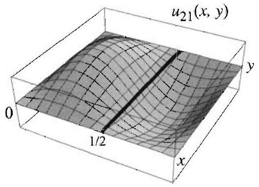

Figure 3 Nodal line

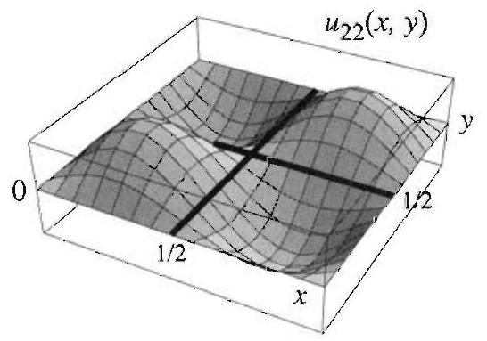
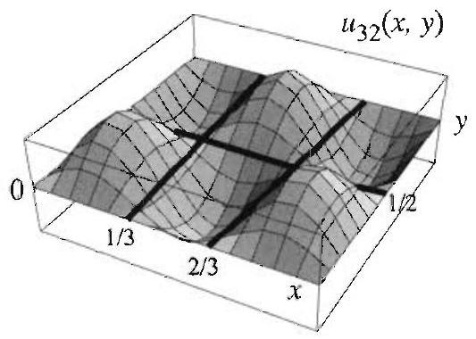

Right margin note (page 58)

e of a is due latedsition
orane. curves points menon
uation nough

The $x=\frac{1}{3}$, , y) $y$ heat al heat plate initial sed on tion of rcises.

++++

rtial Differential Equations in Rectangular Coordinates

It is important to note in Example 1 that, in contrast to the cas vibrating string, the motion of the membrane is not periodic in $t$. This to the fact that the characteristic frequencies are not harmonically re they are not integer multiples of a fixed frequency. Thus the superpo of the normal modes is not periodic.

Nodal Lines
As an experiment, we sprinkle sand on the surface of a vibrating meml It is observed that for certain frequencies the sand gathers on fixed on the surface. These curves, known as nodal lines, consist of the that remain fixed as the membrane vibrates. We illustrate this phenor by analyzing the solution when it is given by
$$
u_{m n}(x, y, t)=\sin \frac{m \pi}{a} x \sin \frac{n \pi}{b} y\left(B_{m n} \cos \lambda_{m n} t+B_{m n}^{*} \sin \lambda_{m n} t\right) .
$$

The points $(x, y)$ that remain fixed for all $t$ are solutions of the eq $u_{m n}(x, y, t)=0$ for all $t>0$. Thus to determine the nodal lines it is e to solve the equation
$$
\sin \frac{m \pi}{a} x \sin \frac{n \pi}{b} y=0, \quad \text { for } 0<x<a, \quad 0<y<b .
$$

For example, when $a=b=1$, the nodal line for $u_{21}$ is the line $x=\frac{1}{2}$. nodal lines for $u_{22}$ are $x=\frac{1}{2}$ and $y=\frac{1}{2}$. The nodal lines for $u_{32}$ are $x=\frac{2}{3}, y=\frac{1}{2}$ (Figure 3).

Two Dimensional Heat Equation
We end this section by stating the solution of the two dimensiona equation with homogeneous boundary conditions. This two dimensiona problem models the distribution of temperature in a thin rectangular with insulated faces, edges kept at zero temperature, and with an temperature distribution $f(x, y)$. The solution of the problem is ba the separation of variables technique and follows step by step the solu the two dimensional wave equation. The details are outlined in the exe

---

<!-- Page 59 -->

Left margin note (page 59)

SOLUTION OF THE TWO DIMENSIONAL HEAT EQUATION FOR A RECTANGLE

Right margin note (page 59)

161
that
on is

++++

Section 3.7 The Two Dimensional Wave and Heat Equations

The solution of the two dimensional heat equation
$$
\frac{\partial u}{\partial t}=c^{2}\left(\frac{\partial^{2} u}{\partial x^{2}}+\frac{\partial^{2} u}{\partial y^{2}}\right), \quad 0<x<a, \quad 0<y<b, \quad t>0
$$
with boundary conditions
$$
u(0, y, t)=u(a, y, t)=0, \quad 0<y<b, \quad t>0,
$$
$$
u(x, 0, t)=u(x, b, t)=0, \quad 0<x<a, \quad t>0,
$$
and initial condition
$$
u(x, y, 0)=f(x, y), \quad 0<x<a, \quad 0<y<b
$$
is
$$
u(x, y, t)=\sum_{n=1}^{\infty} \sum_{m=1}^{\infty} A_{m n} \sin \frac{m \pi}{a} x \sin \frac{n \pi}{b} y e^{-\lambda_{m n}^{2} t}
$$
where
$$
\lambda_{m n}=c \pi \sqrt{\frac{m^{2}}{a^{2}}+\frac{n^{2}}{b^{2}}}
$$
and
$$
\begin{array}{c}
A_{m n}=\frac{4}{a b} \int_{0}^{b} \int_{0}^{a} f(x, y) \sin \frac{m \pi}{a} x \sin \frac{n \pi}{b} y d x d y \\
m, n=1,2, \ldots
\end{array}
$$

EXAMPLE 2 A two dimensional heat problem
Solve the heat problem in a square plate with $a=b=1$, and $c=\frac{1}{\pi}$. Assume the edges are kept at zero temperature and the initial temperature distribut $u(x, y, 0)=100^{\circ}$.
Solution We have
$$
u(x, y, t)=\sum_{n=1}^{\infty} \sum_{m=1}^{\infty} A_{m n} \sin m \pi x \sin n \pi y e^{-\lambda_{m n}^{2} t}
$$
where $\lambda_{m n}=\sqrt{m^{2}+n^{2}}$ and
$$
\begin{aligned}
A_{m n} & =400 \int_{0}^{1} \int_{0}^{1} \sin m \pi x \sin n \pi y d x d y \\
& =\frac{400}{\pi^{2}} \frac{\left[1-(-1)^{m}\right]\left[1-(-1)^{n}\right]}{m n}
\end{aligned}
$$

---

<!-- Page 60 -->

Left margin note (page 60)

162
Chapter 3
Pa

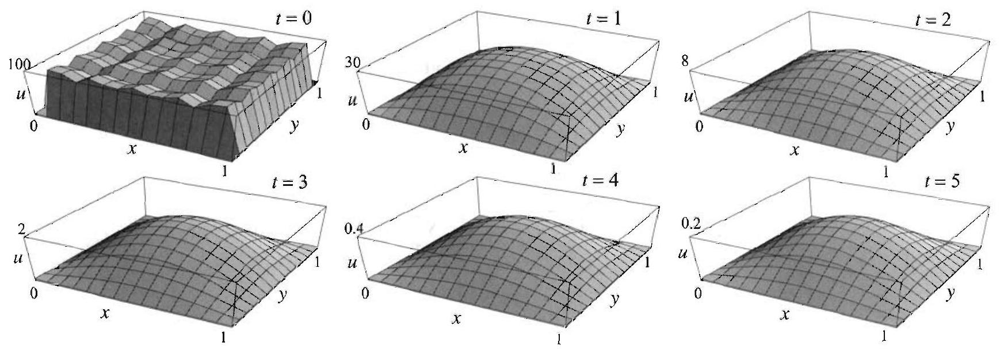

Figure 4 Temperat 0 to 4). The first boundary for $t>0$.

Right margin note (page 60)

of $t$.
zero.
(zero

1
from on the
$b=1$,
ate the graph

++++

rtial Differential Equations in Rectangular Coordinates

Since $A_{m n}$ is zero if either $m$ or $n$ is even, we get
$$
u(x, y, t)=\frac{1600}{\pi^{2}} \sum_{k=0}^{\infty} \sum_{l=0}^{\infty} \frac{\sin (2 l+1) \pi x \sin (2 k+1) \pi y}{(2 l+1)(2 k+1)} e^{-\lambda_{(2 l+1)(2 k+1)}^{2} t} .
$$

Figure 4 shows the temperature distribution in the plate at various value Note how the temperature smooths out across the membrane and tends to This is precisely what we would expect in view of the boundary conditions temperature).
ure distribution in Example 2 at various times (using a partial sum with $k$ and $l$ runnin icture approximates the initial temperature distribution. Note the zero temperature

Exercises 3.7
In Exercises 1-8, (a) solve the boundary value problem (1)-(3) with $a= c=1 / \pi$, and the given functions $f$ and $g$.
(b) Plot a partial sum of the series solution at various values of to illustr vibrations of the membrane. Include the graph at $t=0$ and compare it to the of $f(x, y)$.
1. $f(x, y)=\sin 3 \pi x \sin \pi y, \quad g(x, y)=0$.
2. $f(x, y)=\sin \pi x \sin \pi y, g(x, y)=\sin \pi x$.
3. $f(x, y)=x(1-x) y(1-y), g(x, y)=2 \sin \pi x \sin 2 \pi y$.
4. $f(x, y)=x \cos \frac{\pi x}{2} y(1-y), g(x, y)=1$.
5. $f(x, y)=0, g(x, y)=1$.
6. $f(x, y)=0, g(x, y)=x(1-y)$.
7. $f(x, y)=x\left(1-e^{x-1}\right) y\left(1-y^{2}\right), g(x, y)=0$.
8. $f(x, y)=\sin (x y) \cos \frac{\pi x}{2} \sin \pi y, g(x, y)=0$.

---

<!-- Page 61 -->

Left margin note (page 61)

3.8 Laplace':

Right margin note (page 61)

163
with
zero
$\pi y$
of $t$.
te to
heat
tions
heat
iables
The-
asso-
The $x)=$ sions

++++

Section 3.8 Laplace's Equation in Rectangular Coordinates

In Exercises 9-10, find and plot the nodal lines for the given function.
9. $u(x, y, t)=\sin 4 \pi x \sin \pi y \cos t, 0<x<1,0<y<1$.
10. $u(x, y, t)=\sin \frac{3 \pi}{2} x \sin \pi y \sin \sqrt{2} t, 0<x<2,0<y<1$.

In Exercises 11-14, solve the heat equation (11) in a unit square ( $a=b=1$ ) the given initial temperature distribution $f$. Assume that the edges are kept a temperature and that $c=1$.
11. $f(x, y)=100$.
12. $f(x, y)=x(1-x) y(1-y)$.
13. $f(x, y)=\sin \pi x \sin$
14.
$$
f(x, y)=\left\{\begin{array}{ll}
1 & \text { if } y \leq x \\
0 & \text { otherwise }
\end{array}\right.
$$
15. (a) Take $c=1$ in Example 2 and plot the solutions for various values Approximate how long it will take for the maximum temperature in the pla drop to $50^{\circ}$.
(b) What is the answer if $c=2$ ? What is your conclusion about the speed of transfer as a function of $c$ ?
16. Establish relations (6) and (7) (orthogonality and normalization of the func $\sin \frac{m \pi}{a} x \sin \frac{n \pi}{b} y$ ).
17. Project Problem: In this exercise we derive (13), the solution of the problem.
(a) Show that if we assume $u=X(x) Y(y) T(t)$ then the separation of var method yields
$$
\begin{array}{c}
X^{\prime \prime}+\mu^{2} X=0, \quad X(0)=0, \quad X(a)=0 \\
Y^{\prime \prime}+\nu^{2} Y=0, \quad Y(0)=0, \quad Y(b)=0 \\
T^{\prime}+c^{2}\left(\mu^{2}+\nu^{2}\right) T=0
\end{array}
$$
(b) Obtain the product solutions
$$
u_{m n}(x, y, t)=A_{m n} e^{-c^{2}\left[\left(\frac{m \pi}{a}\right)^{2}+\left(\frac{n \pi}{b}\right)^{2}\right] t} \sin \frac{m \pi}{a} x \sin \frac{n \pi}{b} y .
$$
(c) Given the initial temperature distribution $f(x, y)$, derive (13)-(15) using orem 1.

Equation in Rectangular Coordinates
In Section 3.5 we saw that the steady-state temperature distributions ciated with the one dimensional heat equation
$$
\frac{\partial u}{\partial t}=c^{2} \frac{\partial^{2} u}{\partial x^{2}}, \quad 0<x<L, \quad t>0,
$$
satisfy $u_{x x}=0$, since steady-state solutions are time independent. equation $u_{x x}=0$ is easily solved and yields only linear solutions $u( c_{1} x+c_{2}$. For steady-state or time independent problems in two dimen over an $a \times b$ rectangle, we consider the equation
$$
\frac{\partial^{2} u}{\partial x^{2}}+\frac{\partial^{2} u}{\partial y^{2}}=0, \quad 0<x<a, \quad 0<y<b .
$$

---

<!-- Page 62 -->

Left margin note (page 62)

164
Chapter 3
Pa

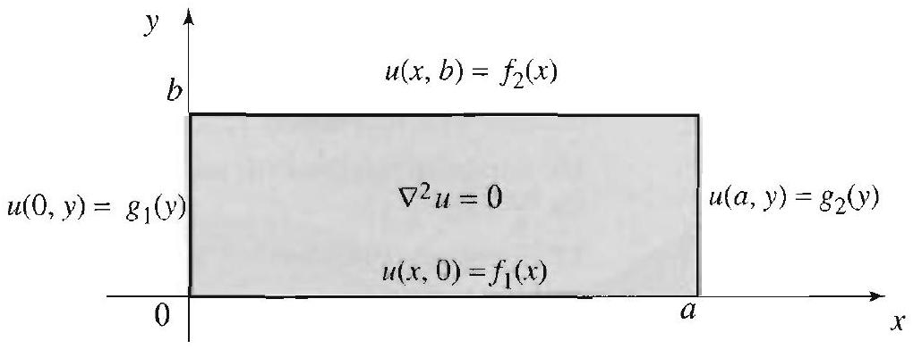

Figure 1 A ger let problem on

Figure 2 Dirichlet p Example 1.

Right margin note (page 62)

and is ration wide be ction, More
gether us the Rather ng the eneral
f sepa-

Substi-

0 lead s $\mu x+$

++++

rtial Differential Equations in Rectangular Coordinates

This equation is known as Laplace's equation in two variables obtained by setting the time derivative equal to zero in the heat equ (11), Section 3.7. As we saw in Section 3.1, Laplace's equation has a variety of solutions. In a typical problem, the solution that we seek v determined by the given boundary conditions. In the rest of the se we solve (1) when $u$ is specified along the boundary of the rectangle. specifically, we impose the boundary conditions
$$
\begin{array}{lll}
u(x, 0)=f_{1}(x), & u(x, b)=f_{2}(x), & 0<x<a, \\
u(0, y)=g_{1}(y), & u(a, y)=g_{2}(y), & 0<y<b,
\end{array}
$$
as illustrated in Figure 1.

neral Dirich-
a rectangle.

A problem consisting of Laplace's equation on a region in the plane to with specified boundary values is called a Dirichlet problem. Thr problem we described above is a Dirichlet problem on a rectangle. than attacking this problem in its full generality, we will start by solvi special case when $f_{1}, g_{1}$, and $g_{2}$ are all zero. We will return to the $g$ problem at the end of the section.

EXAMPLE 1 A Dirichlet problem on a rectangle
Solve the boundary value problem described in Figure 2 using the method o ration of variables. roblem in

Solution We begin by looking for product solutions $u(x, y)=X(x) Y(y)$. tuting into (1) and using the separation method, we arrive at the equations
$$
X^{\prime \prime}+k X=0, \quad Y^{\prime \prime}-k Y=0,
$$
where $k$ is the separation constant, with the boundary conditions
$$
X(0)=0, X(a)=0, \quad \text { and } \quad Y(0)=0 .
$$

For the boundary value problem in $X$, you can check that the values $k \leq$ to trivial solutions only. For $k=\mu^{2}>0$, we obtain the solutions $X=c_{1}$ co $c_{2} \sin \mu x$. Imposing the boundary conditions on $X$ forces $c_{1}=0$,
$$
\mu=\mu_{n}=\frac{n \pi}{a}, \quad n=1,2, \ldots
$$

---

<!-- Page 63 -->

Right margin note (page 63)

165

e the em 1 ,

(2)
plate
e.
em as d (3),

++++

Section 3.8 Laplace's Equation in Rectangular Coordinates

and hence
$$
X_{n}(x)=\sin \frac{n \pi}{a} x, \quad n=1,2, \ldots
$$

Turning now to $Y$ with $k=\mu_{n}^{2}$, we find
$$
Y=A_{n} \cosh \mu_{n} y+B_{n} \sinh \mu_{n} y
$$

Imposing $Y(0)=0$, we find that $A_{n}=0$, and hence
$$
Y_{n}=B_{n} \sinh \mu_{n} y
$$

We have thus found the product solutions
$$
B_{n} \sin \frac{n \pi}{a} x \sinh \frac{n \pi}{a} y .
$$

Superposing these solutions, we get the general form of the solution
$$
u(x, y)=\sum_{n=1}^{\infty} B_{n} \sin \frac{n \pi}{a} x \sinh \frac{n \pi}{a} y .
$$

Finally, the boundary condition $u(x, b)=f_{2}(x)$ implies that
$$
f_{2}(x)=\sum_{n=1}^{\infty} B_{n} \sinh \frac{n \pi b}{a} \sin \frac{n \pi}{a} x
$$

To meet this last requirement, we choose the coefficients $B_{n} \sinh \frac{n \pi b}{a}$ to b Fourier sine coefficients of $f_{2}$ on the interval $0<x<a$. Thus from Theor Section 2.4, it follows that
$$
B_{n}=\frac{2}{a \sinh \frac{n \pi \bar{b}}{a}} \int_{0}^{a} f_{2}(x) \sin \frac{n \pi}{a} x d x, \quad n=1,2, \ldots
$$

The solution of the Dirichlet problem described in Figure 2 is therefore given with coefficients determined by (3).

The following is a specific application of Example 1.

EXAMPLE 2 Steady-state temperature in a square plate
(a) Determine the steady-state temperature distribution in a $1 \times 1$ square where one side is held at $100^{\circ}$ and the other three sides are held at $0^{\circ}$.
(b) In particular, find the steady-state temperature at the center of the plat

Solution (a) By choosing coordinates appropriately, we can do this probl a special case of Example 1, where $f_{2}(x)=100^{\circ}$ and $a=b=1$. From (2) an we have
$$
u(x, y)=\sum_{n=1}^{\infty} B_{n} \sin n \pi x \sinh n \pi y
$$

---

<!-- Page 64 -->

Left margin note (page 64)

166
Chapter 3
Partial Differe

Figure 3 Linearity is used here to decompose the Dirichlet problem into the "sum" of four simpler Dirichlet subproblems.

Right margin note (page 64)

100,
erbolic
series.

ges to adding
turns ple 1. ns, as

0
$a$
y)
$a$

++++

ntial Equations in Rectangular Coordinates
where
$$
B_{n}=\frac{200}{\sinh n \pi} \int_{0}^{1} \sin n \pi x d x=\frac{200}{n \pi \sinh n \pi}(1-\cos n \pi) .
$$

Simplifying, we find the solution
$$
u(x, y)=\frac{400}{\pi} \sum_{k=0}^{\infty} \frac{\sin (2 k+1) \pi x}{(2 k+1)} \frac{\sinh (2 k+1) \pi y}{\sinh (2 k+1) \pi} .
$$

Note that when $y=1$, this reduces to the Fourier sine series expansion matching the boundary condition. Also, if $0<y<1$, the ratio of the hyp sines decays exponentially with $k$ and hence leads to rapid convergence of the
(b) Plugging in $x=y=\frac{1}{2}$ to find the temperature at the center, we get
$$
u\left(\frac{1}{2}, \frac{1}{2}\right)=\frac{200}{\pi} \sum_{k=0}^{\infty} \frac{(-1)^{k}}{(2 k+1)} \frac{1}{\cosh (2 k+1) \frac{\pi}{2}},
$$
where we have simplified using
$$
\sinh u=2 \sinh \frac{u}{2} \cosh \frac{u}{2}
$$
and
$$
\sin (2 k+1) \frac{\pi}{2}=(-1)^{k} .
$$

By a judicious use of symmetry, we will show below that this series conver 25. At this point, we can approximate the infinite sum to within $10^{-4}$ by the first four terms, obtaining 25 .

We now return to the general problem described in Figure 1. It out that this problem can be solved by using the solution to Exam The trick is to decompose the original problem into four subprobler described by Figure 3.

---

<!-- Page 65 -->

Right margin note (page 65)

167

vely.

need
d in

same

++++

Section 3.8 Laplace's Equation in Rectangular Coordinates

Let $u_{1}, u_{2}, u_{3}, u_{4}$ be the solutions of subproblems $1,2,3,4$, respecti By direct computation, we see that the function
$$
u=u_{1}+u_{2}+u_{3}+u_{4}
$$
is the solution to the original problem given in Figure 1. Thus we only determine $u_{1}, u_{2}, u_{3}, u_{4}$. The function $u_{2}$ is already compute Example 1. We have
$$
u_{2}(x, y)=\sum_{n=1}^{\infty} B_{n} \sin \frac{n \pi}{a} x \sinh \frac{n \pi}{a} y,
$$
where
$$
B_{n}=\frac{2}{a \sinh \frac{n \pi b}{a}} \int_{0}^{a} f_{2}(x) \sin \frac{n \pi}{a} x d x .
$$

The other solutions can be found analogously. In particular, $u_{4}$ is the ${ }^{1}$ as $u_{2}$ except that $a$ and $b$ are interchanged, as are $x$ and $y$. Thus
$$
u_{4}(x, y)=\sum_{n=1}^{\infty} D_{n} \sinh \frac{n \pi}{b} x \sin \frac{n \pi}{b} y
$$
where
$$
D_{n}=\frac{2}{b \sinh \frac{n \pi a}{b}} \int_{0}^{b} g_{2}(y) \sin \frac{n \pi}{b} y d y .
$$

The solutions $u_{1}$ and $u_{3}$ are found similarly. We have
$$
u_{1}(x, y)=\sum_{n=1}^{\infty} A_{n} \sin \frac{n \pi}{a} x \sinh \frac{n \pi}{a}(b-y),
$$
where
$$
A_{n}=\frac{2}{a \sinh \frac{n \pi b}{a}} \int_{0}^{a} f_{1}(x) \sin \frac{n \pi}{a} x d x,
$$
and
$$
u_{3}(x, y)=\sum_{n=1}^{\infty} C_{n} \sinh \frac{n \pi}{b}(a-x) \sin \frac{n \pi}{b} y,
$$
where
$$
C_{n}=\frac{2}{b \sinh \frac{n \pi a}{b}} \int_{0}^{b} g_{1}(y) \sin \frac{n \pi}{b} y d y .
$$

---

<!-- Page 66 -->

Left margin note (page 66)

168
Chapter 3 Partial Differe

SOLUTION OF THE DIRICHLET PROBLEM IN A RECTANGLE

Right margin note (page 66)

We
$\left(\frac{1}{2}, \frac{1}{2}\right)$ ndary oblem d, we cribed and of the
exact series
ns to s you s heat
$y$.

++++

ential Equations in Rectangular Coordinates

We have thus completely solved the Dirichlet problem in Figure 1. summarize the solution as follows.

The solution of the two dimensional Dirichlet problem in Figure 1 is
$$
u(x, y)=\sum_{n=1}^{\infty} A_{n} \sin \frac{n \pi}{a} x \sinh \frac{n \pi}{a}(b-y)+\sum_{n=1}^{\infty} B_{n} \sin \frac{n \pi}{a} x \sinh \frac{n \pi}{a} y
$$
(9)
$$
+\sum_{n=1}^{\infty} C_{n} \sinh \frac{n \pi}{b}(a-x) \sin \frac{n \pi}{b} y+\sum_{n=1}^{\infty} D_{n} \sinh \frac{n \pi}{b} x \sin \frac{n \pi}{b} y
$$
where the coefficients $A_{n}, B_{n}, C_{n}$, and $D_{n}$ are given by (5)-(8).
Let us now revisit Example 2(b). We shall derive the value of $u$ by using a symmetry argument. Consider the problem where the bou data 100 is specified on all four sides of the plate. Clearly, this pr has solution $u(x, y)=100$ throughout the square. On the other han can certainly decompose this problem into the four subproblems desc in Figure 3. Because of the symmetry, the four functions $u_{1}, u_{2}, u_{3} u_{4}$ assume the same value at the center. Equating the two versions solution at the center, we see that
$$
100=u_{1}\left(\frac{1}{2}, \frac{1}{2}\right)+u_{2}\left(\frac{1}{2}, \frac{1}{2}\right)+u_{3}\left(\frac{1}{2}, \frac{1}{2}\right)+u_{4}\left(\frac{1}{2}, \frac{1}{2}\right)=4 u_{2}\left(\frac{1}{2}, \frac{1}{2}\right) .
$$

Hence $u_{2}\left(\frac{1}{2}, \frac{1}{2}\right)=25$. Note that by this means we have found the value of the series in (4). As a challenging exercise, try to sum this by other means.

You may recall how in Section 3.5 we used steady-state solutic solve heat problems with nonhomogeneous boundary conditions. A can imagine, these methods are also useful in solving nonhomogeneou problems in higher dimensions. See Exercise 11 for an illustration.

Exercises 3.8
In Exercises 1-6, solve the Dirichlet problem in Figure 1 for the given data.
1. $a=1, b=2, f_{2}(x)=x, f_{1}=g_{1}=g_{2}=0$.
2. $a=1, b=1, f_{1}(x)=0, f_{2}=100, g_{1}=0, g_{2}=100$.
3. $a=2, b=1, f_{1}(x)=100, f_{2}=g_{1}=0, g_{2}(y)=100(1-y)$.
4. $a=b=1, f_{1}(x)=1-x, f_{2}(x)=x, g_{1}=g_{2}=0$.
5. $a=b=1, f_{1}(x)=\sin 7 \pi x, f_{2}(x)=\sin \pi x, g_{1}(y)=\sin 3 \pi y, g_{2}(y)=\sin 6 \pi$
6. $a=b=\pi, f_{1}(x)=\cos x, f_{2}(x)=x \sin x, g_{1}(y)=\pi-y$,
$$
g_{2}(y)=\left\{\begin{array}{ll}
3 & \text { if } 0<y<\pi / 2 \\
0 & \text { if } \frac{\pi}{2}<y<\pi
\end{array}\right.
$$

---

<!-- Page 67 -->

Left margin note (page 67)

$$
\frac{\begin{array}{c}
\hat{y} \\
b \quad u=f_{2}(x)
\end{array}}{\begin{array}{c}
u_{t}=c^{2}\left(u_{x x}+u_{y y}\right. \\
u=g_{1}(y) \quad u=g
\end{array}} 3 \quad \begin{array}{r}
u=f_{1}(x)
\end{array}
$$

Figure 4

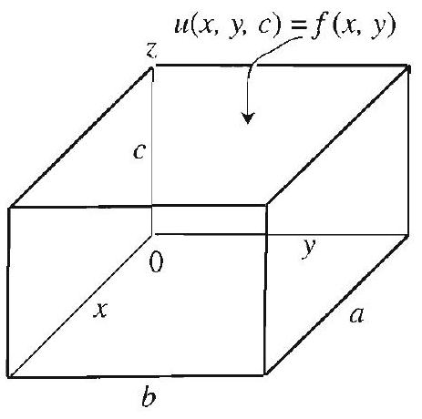

Figure 5 The bound ues for $u$ are 0 excep upper horizontal face, $u(x, y, c)=f(x, y)$.

Right margin note (page 67)

169
urier
sraph
solu-
neral
1 this

ound$x, y)$ n the with $x, y$ ). $y)+$ here, 100, avior richsolid ions:
neralation

++++

Section 3.8 Laplace's Equation in Rectangular Coordinates
7. (a) Show that the solution to Example 1, when expressed in terms of the Fc sine coefficients $b_{n}$ of $f_{2}(x)$, is
$$
u(x, y)=\sum_{n=1}^{\infty} b_{n} \sin \frac{n \pi}{a} x \frac{\sinh \frac{n \pi}{a} y}{\sinh \frac{n \pi b}{a}} .
$$
(b) State the corresponding result for the solution of the general problem (9)
8. Approximate the temperature at the center of the plate in Exercise 1.
9. Use the method of separation of variables to derive $u_{1}$ and $A_{n}$ in (7).
10. Maximum principle for solutions of Laplace's equation. Plot the of the solution in Example 2. Observe that the maxima and minima of the tion occur at the boundary. This property of the solution holds for more ge
boundary data and is known as the maximum principle. For more details on subject, see Section 3.11.
11. Project Problem: Two dimensional heat problem with nonzero bo ary data. Consider the nonhomogeneous heat problem in Figure 4. Let $v($ denote the solution of the Dirichlet problem $\nabla^{2} v=0$ with boundary values as i figure, and let $w(x, y, t)$ denote the solution of the heat problem $w_{t}=c^{2} \nabla^{2} w$ 0 boundary data and initial temperature distribution $w(x, y, 0)=f(x, y)-v($
(a) Show that the solution of the heat problem in Figure 4 is $u(x, y, t)=v(x$, $w(x, y, t)$, where $v$ is given by (9), and $w$ is given by (13)-(15), Section 3.7, $w$ in (15), $f(x, y)$ is to be replaced by $f(x, y)-v(x, y)$.
(b) Solve the problem in the figure when $a=b=1, c=1, f_{1}=0, f_{2}= g_{1}=g_{2}=0$, and $f(x, y)=0$.
(c) Plot the temperature of the center in part (b) for $t>0$ and discuss its beh as $t \rightarrow \infty$.
12. Project Problem: Three dimensional Laplace's equation and Di let problems. Steady-state temperature problems inside a three dimensional lead to Dirichlet problems associated with Laplace's equation in three dimens
$$
\nabla^{2} u=\frac{\partial^{2} u}{\partial x^{2}}+\frac{\partial^{2} u}{\partial y^{2}}+\frac{\partial^{2} u}{\partial z^{2}}=0
$$

Consider such a problem as described in Figure 5. (See Exercise 13 for a ger ization.) Follow the outlined steps to derive the solution
$$
\begin{array}{c}
u(x, y, z)=\sum_{n=1}^{\infty} \sum_{m=1}^{\infty} A_{m n} \sin \frac{m \pi}{a} x \sin \frac{n \pi}{b} y \sinh \lambda_{m n} z \\
\lambda_{m n}=\pi \sqrt{\left(\frac{m}{a}\right)^{2}+\left(\frac{n}{b}\right)^{2}} \\
A_{m n}=\frac{4}{a b \sinh \left(c \lambda_{m n}\right)} \int_{0}^{b} \int_{0}^{a} f(x, y) \sin \frac{m \pi}{a} x \sin \frac{n \pi}{b} y d x d y
\end{array}
$$
(a) Step 1: Look for product solutions of the form $X(x) Y(y) Z(z)$. Use separ of variables and derive the equations
$$
\begin{array}{c}
X^{\prime \prime}+\mu^{2} X=0, \quad Y^{\prime \prime}+\nu^{2} Y=0, \quad Z^{\prime \prime}-\left(\mu^{2}+\nu^{2}\right) Z=0, \\
X(0)=X(a)=0, \quad Y(0)=Y(b)=0, \quad Z(0)=0 .
\end{array}
$$

---

<!-- Page 68 -->

Left margin note (page 68)

170
Chapter 3 Pa
3.9 Poisson

Note that if $f(x, y)$ the equation is no neous. If you try th tion of variables me will quickly realize method does not ap

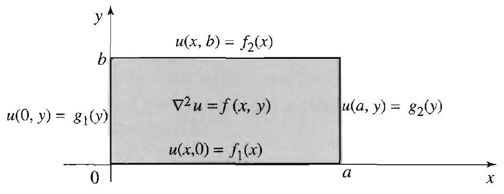

Figure 1 A ger problem on a rec

Right margin note (page 68)

were
blems eigenons of thod. ld not e will cribed epenot be n this nd insions. oblem blems,

++++

rtial Differential Equations in Rectangular Coordinates

(You should justify the signs of the separation constants.)
(b) Step 2: Show that
$$
\mu=\frac{m \pi}{a}, \quad \nu=\frac{n \pi}{b}, \quad m, n=1,2, \ldots,
$$
and derive the product solutions
$$
u_{m n}(x, y, z)=A_{m n} \sin \frac{m \pi}{a} x \sin \frac{n \pi}{b} y \sinh \lambda_{m n} z .
$$
(c) Step 3: Complete the solution using Theorem 1 of Section 3.7.
13. How would you solve the problem in Exercise 12 if the boundary dat nonzero on some of the six faces?
s Equation: The Method of Eigenfunction Expansions
In this section, we present a new approach to boundary value pro involving the Laplacian. The method that we describe is called the function expansion method. We will use it to derive alternative soluti previous problems that were solved using the separation of variables me More importantly, we will solve nonhomogeneous problems that we cou solve by previous methods.

To highlight the power of the eigenfunction expansion method, w tackle a Poisson boundary value problem on an $a \times b$ rectangle, as des by Figure 1, involving Poisson's equation
$\neq 0$, then nhomogee separathod, you that this
$$
\nabla^{2} u=\frac{\partial^{2} u}{\partial x^{2}}+\frac{\partial^{2} u}{\partial y^{2}}=f(x, y) .
$$

Poisson's equation arises in steady-state heat problems with time ind dent heat sources. It is nonhomogeneous when $f(x, y) \neq 0$ and cann solved directly by the method of separation of variables. Our goal i section is to solve boundary value problems involving this equation a troduce in the process the very useful method of eigenfunction expan

heral Poisson tangle.

As we did in Section 3.8, the first step in solving the general Poisson pr in Figure 1 consists of decomposing the problem into simpler subprob

---

<!-- Page 69 -->

Left margin note (page 69)

Figure 2 Decomposition of a general Poisson problem.

Note that summing over all the functions $\sin \frac{m \pi}{a} x \sin \frac{n \pi}{b} y$ leads to a double Fourier sine series form of the solution (Section 3.7).

Right margin note (page 69)

171

se is
$x$
hods m in data

Secand isfies isfies find
logy
$1 \frac{n \pi}{b} y$ n an ction ation ll be et us

++++

Section 3.9 Poisson's Equation: The Method of Eigenfunction Expansions
using the superposition principle. The decomposition in the present ca described by Figure 2.

Figure 2(b) describes a Dirichlet problem that can be solved by the met of the previous section. Thus, to complete the solution of the proble Figure 1, we only need to treat Poisson's equation with zero boundary (Figure 2(a)).

We will take a hint from the solution of the Dirichlet problem tion 3.8), which is a special case of our problem when $f(x, y)=0$, consider the function $\phi_{m n}(x, y)=\sin \frac{m \pi}{a} x \sin \frac{n \pi}{b} y$, which clearly sat the 0 boundary conditions in Figure 2(a). The function $\phi_{m n}$ also sat another important property. Computing the Laplacian of $\phi_{m n}(x, y)$ we
$$
\begin{aligned}
\nabla^{2}\left(\phi_{m n}\right) & =\sin \frac{n \pi}{b} y \frac{\partial^{2}}{\partial x^{2}}\left(\sin \frac{m \pi}{a} x\right)+\sin \frac{m \pi}{a} x \frac{\partial^{2}}{\partial y^{2}}\left(\sin \frac{n \pi}{b} y\right) \\
& =-\left[\left(\frac{m \pi}{a}\right)^{2}+\left(\frac{n \pi}{b}\right)^{2}\right] \sin \frac{m \pi}{a} x \sin \frac{n \pi}{b} y
\end{aligned}
$$

So the Laplacian of $\phi_{m n}$ is a constant multiple of $\phi_{m n}$. Using a terminc that is common in linear algebra, we call the constant
$$
\lambda_{m n}=\left(\frac{m \pi}{a}\right)^{2}+\left(\frac{n \pi}{b}\right)^{2} \quad(m, n=1,2, \ldots)
$$
an eigenvalue of the Laplacian and the function $\phi_{m n}(x, y)=\sin \frac{m \pi}{a} x \sin$ the corresponding eigenfunction. Because the effect of the Laplacian o eigenfunction is very simple to describe (it just multiplies the eigenfunc by a constant), it makes sense to try a series of eigenfunctions for a solu to a problem that involves the Laplacian over a rectangle. This idea wi clarified as we carry out the solution of the problem in Figure 2(a). L try for a solution
$$
u(x, y)=\sum_{n=1}^{\infty} \sum_{m=1}^{\infty} E_{m n} \sin \frac{m \pi}{a} x \sin \frac{n \pi}{b} y,
$$

---

<!-- Page 70 -->

Left margin note (page 70)

172
Chapter 3 Partial Differe

SOLUTION OF POISSON'S EQUATION IN A RECTANGLE

Right margin note (page 70)

check ve for e will iating

Theo-
mma-
lata in e 2(b). ven by
on all
nd (4)
g into

++++

ntial Equations in Rectangular Coordinates
where $E_{m n}$ are constants to be determined. It is straightforward to that $u$ satisfies the zero boundary conditions in Figure 2(a). We now sol $E_{m n}$ so as to satisfy Poisson's equation (1). As usual, in this process, w assume that we can interchange the sums and the derivatives. Different twice in (2) and plugging into (1), we obtain
$$
\sum_{n=1}^{\infty} \sum_{m=1}^{\infty}-E_{m n} \underbrace{\left[\left(\frac{m \pi}{a}\right)^{2}+\left(\frac{n \pi}{b}\right)^{2}\right]}_{\lambda_{m n}} \sin \frac{m \pi}{a} x \sin \frac{n \pi}{b} y=f(x, y) .
$$

Thinking of (3) as a double Fourier sine series expansion of $f(x, y)$ ( rem 1, Section 3.7), we conclude that
$$
E_{m n}=\frac{-4}{a b \lambda_{m n}} \int_{0}^{b} \int_{0}^{a} f(x, y) \sin \frac{m \pi}{a} x \sin \frac{n \pi}{b} y d x d y
$$

We have thus completely solved Poisson's problem in Figure 1. We su rize our findings as follows.

The solution of the Poisson problem in Figure 1 is
$$
u(x, y)=u_{1}(x, y)+u_{2}(x, y),
$$
where $u_{1}$ is the solution of the Poisson problem with zero boundary Figure 2(a), and $u_{2}$ is the solution of the Dirichlet problem in Figur The function $u_{1}$ is given by (2) and (4), and the function $u_{2}$ is gi (5)-(9), Section 3.8.

EXAMPLE 1 A Poisson problem with zero boundary data
Solve $\nabla^{2} u=1$ in a $1 \times 1$ square, subject to the boundary condition $u=0$ four sides of the square.

Solution Note that in this case $u_{2}=0$. The function $u_{1}$ is given by (2) a with $a=b=1$ and $f(x, y)=1$. Thus
$$
E_{m n}=\frac{-4}{\lambda_{m n}} \int_{0}^{1} \int_{0}^{1} \sin m \pi x \sin n \pi y d x d y
$$
where
$$
\lambda_{m n}=(m \pi)^{2}+(n \pi)^{2}
$$

Evaluating the integrals (as we did in Example 2, Section 3.7), and pluggir (2), we obtain the solution
$$
u(x, y)=\frac{-16}{\pi^{4}} \sum_{l=0}^{\infty} \sum_{k=0}^{\infty} \frac{\sin (2 k+1) \pi x \sin (2 l+1) y}{(2 k+1)(2 l+1)\left((2 k+1)^{2}+(2 l+1)^{2}\right)} .
$$

---

<!-- Page 71 -->

Left margin note (page 71)

These are the same boundary conditions as in Figure 2(a).

Right margin note (page 71)

173
and
lems
rob-
arat-
$\phi_{m n}$

value nown thod holtz ction funcseries se to ters. solve thod
ndary
(6)nding t)) = ution

++++

Section 3.9 Poisson's Equation: The Method of Eigenfunction Expansions

The Method of Eigenfunction Expansions
Let us summarize the steps that we used to solve Poisson's problem describe in the process a general method for solving boundary value prob involving the Laplacian. We considered the functions
$$
\phi_{m n}(x, y)=\sin \frac{m \pi}{a} x \sin \frac{n \pi}{b} y,
$$
which are solutions (or eigenfunctions) of the following eigenvalue p lem:
$$
\begin{array}{c}
\nabla^{2} \phi(x, y)=-\lambda \phi(x, y) \\
\phi(0, y)=0, \quad \phi(a, y)=0, \quad \phi(x, 0)=0, \phi(x, b)=0 .
\end{array}
$$

Equation (6) is known as the Helmholtz equation. It arises when sep ing variables in the heat and wave equations (see Exercise 16). Each corresponds to the eigenvalue
$$
\lambda=\lambda_{m n}=\left(\frac{m \pi}{a}\right)^{2}+\left(\frac{n \pi}{b}\right)^{2}, \quad m, n=1,2,3, \ldots .
$$

The method that consists of building up the solution of a boundary problem as a sum of eigenfunctions of a related Helmholtz problem is kı as the method of eigenfunction expansions. The success of this me on a given region depends on whether the eigenfunctions of the Helm problem on that region form a complete set, in the sense that a fun defined on the region can be expanded in a series in terms of the eigen tions, called an eigenseries expansion. For the rectangle, the eigens expansion is the double sine series expansion. Other regions will give ri different types of series expansions, as we will see in the following chap

In our next example, we use the eigenfunction expansion method to a nonhomogeneous problems that cannot be tackled directly by the me of separation of variables.

EXAMPLE 2 The eigenfunction expansion method
Solve $\nabla^{2} u=u+3$ in a $1 \times 1$ square $(0<x<1,0<y<1)$, subject to the bour condition $u=0$ on all four sides of the square.

Solution The associated eigenfunction problem is precisely the one given by (7), with $a=b=1$. The eigenvalues are $\lambda_{m n}=(m \pi)^{2}+(n \pi)^{2}$, with correspo eigenfunctions $\phi_{m n}(x, y)=\sin m \pi x \sin n \pi y$. This means that $\nabla^{2}\left(\phi_{m n}(x\right.$, ? $-\left((m \pi)^{2}+(n \pi)^{2}\right) \phi_{m n}(x, y)$, as you can easily check. Our candidate for a sol is
$$
u(x, y)=\sum_{n=1}^{\infty} \sum_{m=1}^{\infty} E_{m n} \sin m \pi x \sin n \pi y,
$$

---

<!-- Page 72 -->

Left margin note (page 72)

174
Chapter 3 Partial Differe

We continue to use the notation $\nabla^{2} \phi(x)$ to show the relation to equation (1), but, of course, the notation $\frac{d^{2} \phi}{d x^{2}}$ is more appropriate here.

Right margin note (page 72)

n and
+3

3
+ 3
$c, y)=$
em in series, series. o the neous sually
sional

++++

ntial Equations in Rectangular Coordinates
where $E_{m n}$ are to be determined. Plugging this expression into the equatic assuming that the sums and the derivatives can be interchanged, we get
$$
\begin{array}{ll} 
& \nabla^{2}\left(\sum_{n=1}^{\infty} \sum_{m=1}^{\infty} E_{m n} \sin m \pi x \sin n \pi y\right)=\sum_{n=1}^{\infty} \sum_{m=1}^{\infty} E_{m n} \sin m \pi x \sin n \pi y \\
\Leftrightarrow & \sum_{n=1}^{\infty} \sum_{m=1}^{\infty} E_{m n} \nabla^{2}(\sin m \pi x \sin n \pi y)=\sum_{n=1}^{\infty} \sum_{m=1}^{\infty} E_{m n} \sin m \pi x \sin n \pi y+ \\
\Leftrightarrow & \sum_{n=1}^{\infty} \sum_{m=1}^{\infty}-E_{m n} \lambda_{m n} \sin m \pi x \sin n \pi y=\sum_{n=1}^{\infty} \sum_{m=1}^{\infty} E_{m n} \sin m \pi x \sin n \pi y- \\
\Leftrightarrow & \sum_{n=1}^{\infty} \sum_{m=1}^{\infty} E_{m n}\left(-1-\lambda_{m n}\right) \sin m \pi x \sin n \pi y=3 .
\end{array}
$$

Thus $E_{m n}\left(-1-\lambda_{m n}\right)$ is the double sine Fourier coefficient of the function $f( 3,0<x<1,0<y<1$. From Theorem 1, Section 3.7, we find
$$
E_{m n}\left(-1-\lambda_{m n}\right)=4 \int_{0}^{1} \int_{0}^{1} 3 \sin m \pi x \sin n \pi y d x d y
$$

Evaluating the integral and then solving for $E_{m n}$, we get
$$
\begin{aligned}
E_{m n} & =-\frac{12}{1+\lambda_{m n}} \frac{1}{m n \pi^{2}}\left((-1)^{m}-1\right)\left((-1)^{n}-1\right) \\
& =\left\{\begin{array}{ll}
0 & \text { if either } m \text { or } n \text { is even } \\
\frac{-48}{\pi^{2} m n\left(1+\lambda_{m n}\right)} & \text { if both } m \text { and } n \text { are odd. }
\end{array}\right.
\end{aligned}
$$

This determines completely the solution.
A One Dimensional Eigenvalue Problem
If you compare the solution (2) to the solution of the Dirichlet probl Example 1, Section 3.8, you will notice that here we used double while in the previous section the solution was expressed as a single We will show that it is possible to obtain a single series solution t Poisson problem if we start with a related one dimensional homoge problem. This alternative approach has merit, since single series u converge faster and are easier to work with than double series.

To solve the problem in Figure 2(a), consider the related one dimen eigenvalue problem
$$
\begin{array}{c}
\nabla^{2} \phi(x)=-\lambda \phi(x) \\
\phi(0)=0, \quad \phi(a)=0
\end{array}
$$

It is easy to check that the eigenfunctions of this problem are
$$
\phi_{m}(x)=\sin \frac{m \pi}{a} x,
$$

---

<!-- Page 73 -->

Right margin note (page 73)

175
cond
ging
(14)
urier
rom

eous
$$
=0
$$

ram-
eous
is

++++

Section 3.9 Poisson's Equation: The Method of Eigenfunction Expansions
corresponding to the eigenvalues
$$
\lambda=\lambda_{m}=\left(\frac{m \pi}{a}\right)^{2}, \quad m=1,2,3, \ldots
$$

Now for a solution of the problem in Figure 2(a), we try
$$
u(x, y)=\sum_{m=1}^{\infty} E_{m}(y) \sin \frac{m \pi}{a} x .
$$

Here we have to allow the coefficients $E_{m n}$ to be functions of the se variable $y$. To complete the solution, we must solve for $E_{m}(y)$. Plug (13) into (1), we obtain
$$
\sum_{m=1}^{\infty} \underbrace{\left(E_{m}^{\prime \prime}(y)-\left(\frac{m \pi}{a}\right)^{2} E_{m}(y)\right)}_{b_{m}(y)} \sin \frac{m \pi}{a} x=f(x, y),
$$
where $0<x<a, 0<y<b$. For each $y$ in the interval $(0, b)$, think of as a Fourier sine series expansion of the function $x \mapsto f(x, y)$. The Fo sine coefficients in (14) are functions of $y$ that we denote by $b_{m}(y)$.
(4), Section 2.4, we have
$$
b_{m}(y)=\frac{2}{a} \int_{0}^{a} f(x, y) \sin \frac{m \pi}{a} x d x
$$

Hence $E_{m}(y)$ is the unique solution of the second order nonhomogen initial value problem
$$
\begin{array}{c}
E_{m}^{\prime \prime}(y)-\left(\frac{m \pi}{a}\right)^{2} E_{m}(y)=b_{m}(y), \\
E_{m}(0)=0 \quad \text { and } \quad E_{m}(b)=0,
\end{array}
$$
where the initial conditions (17) follow from (13) and the fact that $u(x, 0)$ and $u(x, b)=0$. We now proceed to solve (16) using the variation of pa eters formula (Appendix A.3). Two solutions of the associated homogen equation
$$
E_{m}^{\prime \prime}(y)-\left(\frac{m \pi}{a}\right)^{2} E_{m}(y)=0
$$
are readily found to be
$$
h_{1}(y)=\sinh \left(\frac{m \pi}{a}(b-y)\right) \quad \text { and } \quad h_{2}(y)=\sinh \left(\frac{m \pi}{a} y\right) .
$$

A straightforward computation shows that the Wronskian of $h_{1}$ and $h_{2}$

---

<!-- Page 74 -->

Left margin note (page 74)

176 Chapter 3 Partial Differe

Recall from Appendix A.1:
$$
W\left(h_{1}, h_{2}\right)=h_{1} h_{2}^{\prime}-h_{1}^{\prime} h_{2} .
$$

Right margin note (page 74)

pplyain a
ant of differ 17) is (19), utside
initial = 0.) series

From

++++

ntial Equations in Rectangular Coordinates
$$
W\left(h_{1}, h_{2}\right)=\frac{m \pi}{a} \sinh \left(\frac{m \pi}{a} b\right) .
$$

Since $W\left(h_{1}, h_{2}\right) \neq 0$, the two solutions are linearly independent. ing the variation of parameters formula ((4), Appendix A.3), we ob particular solution of (16) in the form
$$
h_{1}(y) \int \frac{-h_{2}(y)}{W\left(h_{1}, h_{2}\right)} b_{m}(y) d y+h_{2}(y) \int \frac{h_{1}(y)}{W\left(h_{1}, h_{2}\right)} b_{m}(y) d y .
$$

Each integral in this formula is determined up to an arbitrary const integration. Different constants yield particular solutions of (16) that by linear combinations of $h_{1}$ and $h_{2}$. The (unique) solution of (16)determined by a specific choice of the constants of integration. From we see that $W\left(h_{1}, h_{2}\right)$ is independent of $y$, and hence it can be pulled o the integrals in (20). You can check that
$$
\begin{array}{c}
E_{m}(y)=\frac{-1}{\frac{m \pi}{a} \sinh \left(\frac{m \pi}{a} b\right)}\left[h_{1}(y) \int_{0}^{y} h_{2}(s) b_{m}(s) d s\right. \\
\left.\quad+h_{2}(y) \int_{y}^{b} h_{1}(s) b_{m}(s) d s\right]
\end{array}
$$
satisfies the initial conditions and hence is the unique solution of the value problem (16)-(17). (Use the fact that $h_{1}(b)=0$ and $h_{2}(0)$ This completely solves the problem in Figure 2(a) and yields a single solution (13) with coefficients given by (21).

EXAMPLE 3 A single series solution of a Poisson problem
To find a single series expression of the solution in Example 1, we use (13). (15), we have
$$
b_{m}(y)=2 \int_{0}^{1} \sin m \pi x d x=\frac{-2(\cos m \pi-1)}{m \pi}=\left\{\begin{array}{ll}
\frac{4}{m \pi} & \text { if } m \text { is odd, } \\
0 & \text { if } m \text { is even. }
\end{array}\right.
$$

From (18), we have
$$
h_{1}(y)=\sinh (m \pi(1-y)) \quad \text { and } \quad h_{2}(y)=\sinh (m \pi y)
$$

From (21) and (22), we see that $E_{m}(y)=0$ if $m$ is even, and if $m$ is odd
$$
\begin{aligned}
E_{m}(y)= & \frac{-4}{m^{2} \pi^{2} \sinh (m \pi)}\left[\sinh (m \pi(1-y)) \int_{0}^{y} \sinh (m \pi s) d s\right. \\
& \left.+\sinh (m \pi y) \int_{y}^{1} \sinh (m \pi(1-s)) d s\right]
\end{aligned}
$$

---

<!-- Page 75 -->

Right margin note (page 75)

177

ation
igure
unit
unit
ions.
ions.
same
esult
rt by
urier
dary
$r$ the

++++

Section 3.9 Poisson's Equation: The Method of Eigenfunction Expansions

Evaluating the integrals, we find that, for $m=1,3,5, \ldots$,
$$
\begin{aligned}
E_{m}(y)= & \frac{-4}{m^{3} \pi^{3} \sinh (m \pi)}[\sinh (m \pi(1-y))(\cosh (m \pi y)-1) \\
& +\sinh (m \pi y)(\cosh (m \pi(1-y))-1)]
\end{aligned}
$$

Putting all this in (13), we get
$$
u(x, y)=\sum_{k=0}^{\infty} E_{2 k+1}(y) \sin ((2 k+1) \pi x) .
$$

In Exercise 12 you are asked to use a computer to verify that indeed this sol is equal to the double series solution of Example 1.

Exercises 3.9
In Exercises 1-4, use double Fourier series to solve the Poisson problem in F 1 for the given data. Take $a=b=1$.
1. $f(x, y)=x, f_{1}=f_{2}=0, g_{1}=g_{2}=0$.
2. $f(x, y)=\sin 2 \pi x, f_{1}=f_{2}=0, g_{1}=g_{2}=0$.
3. $f(x, y)=\sin \pi x, f_{1}(x)=0, f_{2}(x)=x, g_{1}=g_{2}=0$.
4. $f(x, y)=x y, f_{1}(x)=0, f_{2}(x)=x, g_{1}=g_{2}=0$.
5. Use the eigenfunction expansions method to solve $\nabla^{2} u=3 u-1$ inside the square $(0<x<1,0<y<1)$, given that $u$ is zero on the boundary.
6. Use the eigenfunction expansions method to solve $\nabla^{2} u=u_{x x}+u$ inside the square $(0<x<1,0<y<1)$, given that $u$ is zero on the boundary.
7. Solve the problem in Exercise 2 using one dimensional eigenfunction expans
8. Solve the problem in Exercise 1 using one dimensional eigenfunction expans
9. Solve the eigenfunction problem (6)-(7) by deriving (5) and (8).
10. Derive (18) and (19).
11. Show that (21) is a solution of (16)-(17).
12. Using a computer, verify that the solutions in Examples 1 and 3 are the by evaluating them at various points inside the $1 \times 1$ square.
13. Project Problem: Dirichlet problem in a rectangle. Derive the r of Example 1, Section 3.8, using the method of eigenfunction expansions. Sta considering the following related one dimensional eigenvalue problem:
$$
\frac{d^{2} \phi}{d x^{2}}=-\lambda \phi(x), \quad \phi(0)=0, \quad \phi(a)=0
$$
14. Project Problem: A Poisson problem in a box. Use (triple) Fo series expansions to solve Poisson's equation
$$
\nabla^{2} u(x, y, z)=f(x, y, z)
$$
inside a rectangular box $(0<x<a, 0<y<b, 0<z<c)$ subject to the boun condition $u=0$ on all six sides. In solving this problem, you should answe

---

<!-- Page 76 -->

Left margin note (page 76)

178
Chapter 3 Partial Differe

Right margin note (page 76)

ables?
1 sides
on
nd $t$ is tion.
sions
on 3.7
nction
uld be
n. Do
n. To
e The
ce and at $0^{\circ}$
t heat
od.

++++

ntial Equations in Rectangular Coordinates
following questions:
(a) What is the related homogeneous problem?
(b) What are the eigenvalues and their corresponding eigenfunctions?
(c) What is the analog of Theorem 1, Section 3.7, for functions of three vari
15. Describe the solution of the problem in Exercise 14 if $u$ is not zero on al of the box. [Hint: Exercises 12 and 13, Section 3.8.]
16. The Helmholtz equation. (a) Separate variables in the heat equat
$$
u_{t}=c^{2}\left(u_{x x}+u_{y y}+u_{z z}\right)
$$
by letting $u(x, y, z, t)=\phi(x, y, z) T(t)$, where $(x, y, z)$ is the spatial variable a the time variable. Show that the spatial part $\phi$ satisfies the Helmholtz equa
(b) Repeat part (a) for the one and two dimensional heat equations.
(c) Repeat part (a) for the three dimensional wave equation.
17. Project Problem: The heat equation via the eigenfunction expar method. Solve the two dimensional heat boundary value problem of Secti by using the eigenfunction expansions method. Note: The related eigenfu problem is given by (6) and (7). The coefficients in the series solution sho functions of $t$.

Project Problem: Nonhomogeneous heat boundary value probler Exercises 18 and 20 to solve a nonhomogeneous heat boundary value probler illustrate the solution, do Exercises 19 and 21.
18. Nonhomogeneous heat boundary value problem: a special cas boundary value problem
$$
\begin{array}{c}
u_{t}=c^{2} u_{x x}+q(x, t), \quad t>0, \quad 0<x<L \\
u(0, t)=0, u(L, t)=0, \quad t>0 \\
u(x, 0)=f(x)
\end{array}
$$
models heat transfer in a uniform bar of length $L$ with insulated lateral surfa initial temperature distribution $f(x)$, given that the ends of the bar are kep temperature. The addition of the term $q(x, t)$ accounts for a time dependen source. We will solve this problem using the eigenfunction expansions meth
(a) Solve the related eigenvalue problem
$$
\frac{d^{2} \phi}{d x^{2}}=-\lambda \phi(x), \quad \phi(0)=0, \quad \phi(L)=0 .
$$
(b) Write the Fourier sine series of $f$ and $q$ as
$$
f(x)=\sum_{n=1}^{\infty} b_{n} \sin \frac{n \pi}{L} x,
$$
where
$$
b_{n}=\frac{2}{L} \int_{0}^{L} f(x) \sin \frac{n \pi}{L} x d x
$$
and
$$
q(x, t)=\sum_{n=1}^{\infty} q_{n}(t) \sin \frac{n \pi}{L} x,
$$

---

<!-- Page 77 -->

Right margin note (page 77)

179
$$
c=
$$
$$
\infty .
$$

In
nitial
$d$ the
esult
$$
L=
$$
$$
\rightarrow \infty .
$$

++++

Section 3.9 Poisson's Equation: The Method of Eigenfunction Expansions

where
$$
q_{n}(t)=\frac{2}{L} \int_{0}^{L} q(x, t) \sin \frac{n \pi}{L} x d x
$$

To apply the eigenfunction expansions method, let
$$
u(x, t)=\sum_{n=1}^{\infty} B_{n}(t) \sin \frac{n \pi}{L} x
$$

Show that $B_{n}(t)$ satisfies the first order initial value problem
$$
\frac{d B_{n}}{d t}+c^{2} \lambda_{n} B_{n}=q_{n}(t), \quad B_{n}(0)=b_{n}
$$
where $\lambda_{n}=\left(\frac{n \pi}{L}\right)^{2}$.
(c) Show that
$$
B_{n}(t)=e^{-c^{2} \lambda_{n} t}\left(b_{n}+\int_{0}^{t} q_{n}(s) e^{c^{2} \lambda_{n} s} d s\right)
$$
19. (a) Work out all the details in Exercise 18 for the specific case when $1, L=\pi, q(x, t)=x e^{-t}$, and $f(x)=0$.
(b) Plot the solution for various values of $t$ and comment on the graphs as $t-$ Does the behavior of the graphs meet with your expectations?
20. Nonhomogeneous heat boundary value problem: general case this exercise, we will solve the heat equation of Exercise 18 with the same it condition but with the following time-dependent boundary conditions:
$$
u(0, t)=A(t), \quad u(L, t)=B(t), \quad t>0
$$

To motivate the solution, refer to Section 3.5 (problem (6)-(8)), where we di case when $A(t)$ and $B(t)$ are constant.
(a) Show that the solution is of the form
$$
u(x, t)=v(x, t)+\frac{B(t)-A(t)}{L} x+A(t)
$$
where $v(x, t)$ is the solution of the following heat problem:
$$
\begin{array}{c}
v_{t}=c^{2} v_{x x}+q(x, t)-\frac{B^{\prime}(t)-A^{\prime}(t)}{L} x-A^{\prime}(t), \quad t>0, \quad 0<x<L \\
v(0, t)=0, \quad v(L, t)=0, \quad t>0 \\
v(x, 0)=f(x)-\frac{B(0)-A(0)}{L} x-A(0)
\end{array}
$$
(b) Solve the problem using (a) and Exercise 18.
(c) Describe what you get when $A(t)$ and $B(t)$ are constant. Compare your r to that of Section 3.5.
21. (a) Work out all the details in Exercise 20 for the specific case: $c=1$, $\pi, q(x, t)=0, A(t)=t e^{-t}, B(t)=0$, and $f(x)=0$.
(b) Plot the solution for various values of $t$ and comment on the graphs as $t-$

---

<!-- Page 78 -->

Left margin note (page 78)

180
Chapter 3
Pa
3.10 Neum:

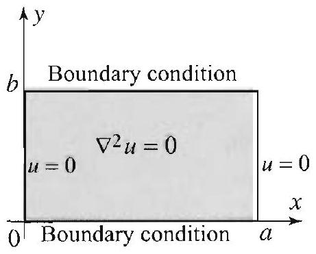

Figure 1 Laplace tion in a rectangle boundary condition vertical sides.

PROPOSI' PRC SOLU

Right margin note (page 78)

e sep1. We mplify on, we d and
n two , they werful ion on ertical
more
in the ertical
in the
),
jon of valent ential
plying n , then 0 . The $\left(\frac{m \pi}{a}\right)^{2}$. es that
n any and

++++

rtial Differential Equations in Rectangular Coordinates
ann and Robin Conditions
So far we have successfully solved boundary value problems using th aration of variables method and the eigenfunction expansion methoc took advantage of linearity and used superposition principles to six problems and break them up into simpler subproblems. In this sectic devise methods based on a combination of the tools that we just liste greatly expand the scope of our applications.

The problems that we present introduce further classical topics dimensions, such as Robin and Neumann conditions. More important illustrate how simple ideas can be combined together to devise po techniques. To simplify the presentation, we focus on Laplace's equat the $a \times b$-rectangle $R$, with zero boundary conditions on the two v sides,
$$
u(0, y)=0 \quad \text { and } \quad u(a, y)=0 \quad \text { for all } 0<y<b
$$
as shown in Figure 1. It will become clear from the examples that general problems can be reduced to this situation using superposition

We start with a simple result that will be used often.

TION 1
DUCT TIONS

If $\phi(x, y)=X(x) Y(y)$ is a product solution of Laplace's equation $a \times b$-rectangle of Figure 1, with the zero boundary conditions on the sides, then
$$
\phi(x, y)=\phi_{m}(x, y)=\sin \frac{m \pi}{a} x\left(A_{m} \cosh \frac{m \pi}{a} y+B_{m} \sinh \frac{m \pi}{a} y\right.
$$
where $m=1,2, \ldots$, and $A_{m}$ and $B_{m}$ are arbitrary constants.
In some applications, it will be convenient to write the solution (2) form
$$
\phi_{m}(x, y)=\sin \frac{m \pi}{a} x\left(\alpha_{m} \cosh \frac{m \pi}{a}(\beta-y)+\beta_{m} \sinh \frac{m \pi}{a}(\beta-y)\right.
$$
where $\beta$ is a fixed number. You can check directly that (3) is a solut the problem in Figure 1, or you can verify that (2) and (3) are equi by expressing the hyperbolic cosine and sine in terms of the expor function.
Proof As we have done several times before (see, for example, Section 3.8), ap the separation of variables method, we find that if $\phi(x, y)=X Y$ is a solutio $X$ satisfies $X^{\prime \prime}+k X=0$ and $X(0)=X(a)=0$, and $Y$ satisfies $Y^{\prime \prime}-k Y=$ only nontrivial solutions are $X=X_{m}=\sin \frac{m \pi}{a} x$, which correspond to $k=$ Moving to the $Y$ component, we have $Y^{\prime \prime}-\left(\frac{m \pi}{a}\right)^{2} Y=0$, which impli $Y=A_{m} \cosh \frac{m \pi}{a} y+B_{m} \sinh \frac{m \pi}{a} y$, as claimed.

In a boundary value problem, we will call a Dirichlet conditio condition that specifies the values of the solution $u$ on the boundar

---

<!-- Page 79 -->

Left margin note (page 79)

Figure 2 Mixed Dirichlet and Neumann boundary conditions in Example 1. The Neumann condition is nonhomogeneous.

Right margin note (page 79)

181

ative cifies chlet tanthe on is dary and
verthe im$y)=$ o the
and
$$
\begin{array}{c}
0< \\
f(x) ;
\end{array}
$$

++++

Section 3.10 Neumann and Robin Conditions

a Neumann condition any condition that specifies the normal derive $\frac{\partial u}{\partial n}$ on the boundary. A Robin condition is any condition that spec $\frac{\partial u}{\partial n}+\alpha u$ on the boundary, where $\alpha$ is a function of $x$ and $y$. Thus Diri and Neumann conditions are special cases of Robin conditions. In a rec gular region, the normal derivative on the boundary is a derivative in positive or negative direction of the $x$ - or $y$-axes. Thus a Robin conditi a condition that specifies the values of $u_{x}+\alpha u$ or $u_{y}+\alpha u$ on the boun of the rectangle.

With this terminology, let us solve a problem with mixed Dirichlet Neumann conditions.

EXAMPLE 1 Mixed Dirichlet and Neumann conditions
Solve the boundary value problem in Figure 2.
Solution Appealing to Proposition 1, the product solutions are of the form
$$
\phi_{m}(x, y)=\sin \frac{m \pi}{a} x\left(A_{m} \cosh \frac{m \pi}{a} y+B_{m} \sinh \frac{m \pi}{a} y\right) .
$$

As we know, these solutions already satisfy the boundary conditions on the tical sides. Next, we specify the constants $A_{m}$ and $B_{m}$ in order to satisfy zero Dirichlet condition on the horizontal side $y=0$. Indeed, $u(x, 0)=0$ plies that $A_{m} \sin \frac{m \pi}{a} x=0$, which in turn implies that $A_{m}=0$. So $\phi_{m}(x$, $B_{m} \sin \frac{m \pi}{a} x \sinh \frac{m \pi}{a} y$. To satisfy the nonhomogeneous Neumann condition or upper horizontal side, we will superpose the product solutions and try
$$
u(x, y)=\sum_{m=1}^{\infty} B_{m} \sin \frac{m \pi}{a} x \sinh \frac{m \pi}{a} y .
$$

Proceeding formally to compute $u_{y}$ by differentiating the series term by term then setting $u_{y}=f(x)$ when $y=b$, we obtain
$$
f(x)=u_{y}(x, b)=\sum_{m=1}^{\infty} B_{m} \frac{m \pi}{a} \cosh \left(\frac{m \pi}{a} b\right) \sin \frac{m \pi}{a} x, \quad 0<x<a .
$$

Recognizing this as the Fourier sine series expansion of $f(x)$ on the interval $x<a$, it follows that $B_{m} \frac{m \pi}{a} \cosh \left(\frac{m \pi}{a} b\right)$ is the Fourier sine coefficient of equivalently,
$$
B_{m}=\frac{2}{\pi m \cosh \left(\frac{m \pi}{a} b\right)} \int_{0}^{a} f(x) \sin \frac{m \pi}{a} x d x
$$

This determines the coefficients $B_{m}$ and solves the problem completely.
We next consider a problem with a Robin condition.

---

<!-- Page 80 -->

Left margin note (page 80)

182
Chapter 3 Partial Differe

Figure 3 Mixed homogeneous Robin condition and nonhomogeneous Neumann boundary condition in Example 2.

Right margin note (page 80)

$$
B_{m}=
$$
upper
$$
f(x)
$$
neous case were equawhere earity ndary

++++

ntial Equations in Rectangular Coordinates

EXAMPLE 2 Robin conditions
Solve the boundary value problem in Figure 3.
Solution From (2), we have the product solutions
$$
\phi(x, y)=\sin \frac{m \pi}{a} x\left(A_{m} \cosh \frac{m \pi}{a} y+B_{m} \sinh \frac{m \pi}{a} y\right) .
$$

In order to satisfy the homogeneous Robin condition, we compute
$$
\phi_{y}=\sin \frac{m \pi}{a} x\left(\frac{m \pi}{a} A_{m} \sinh \frac{m \pi}{a} y+\frac{m \pi}{a} B_{m} \cosh \frac{m \pi}{a} y\right)
$$

Thus $\phi_{y}(x, 0)+2 \phi(x, 0)=\sin \frac{m \pi}{a} x\left(\frac{m \pi}{a} B_{m}+2 A_{m}\right)=0$, which implies that $-\frac{2 a}{m \pi} A_{m}$, and so the product solutions are of the form
$$
A_{m} \sin \frac{m \pi}{a} x\left(\cosh \frac{m \pi}{a} y-\frac{2 a}{m \pi} \sinh \frac{m \pi}{a} y\right)
$$

Moving to the last nonhomogeneous Neumann boundary condition on the horizontal side, we superpose the product solutions and take
$$
u(x, y)=\sum_{m=1}^{\infty} A_{m} \sin \frac{m \pi}{a} x\left(\cosh \frac{m \pi}{a} y-\frac{2 a}{m \pi} \sinh \frac{m \pi}{a} y\right)
$$
(We always deal with the nonhomogeneous condition last.) From $u_{y}(x, b)=$ we get
$$
f(x)=u_{y}(x, b)=\sum_{m=1}^{\infty} A_{m} \sin \frac{m \pi}{a} x\left(\frac{m \pi}{a} \sinh \left(\frac{m \pi}{a} b\right)-2 \cosh \left(\frac{m \pi}{a} b\right)\right)
$$
which is the sine Fourier series of $f(x)$ on the interval $0<x<a$; and so
$$
A_{m}=\frac{2}{a\left(\frac{m \pi}{a} \sinh \left(\frac{m \pi}{a} b\right)-2 \cosh \left(\frac{m \pi}{a} b\right)\right)} \int_{0}^{a} f(x) \sin \frac{m \pi}{a} x d x
$$

This determines $A_{m}$ and solves the problem.
In the previous examples, we always dealt with the nonhomoge condition last. This approach relied heavily on the fact that in eac. the partial differential equation and three of the boundary condition homogeneous; so the infinite sum of product solutions still satisfied the tion and the homogeneous conditions. In boundary value problems more than one boundary condition is nonhomogeneous, we can use lin to break up the problem into subproblems in which at most one bou condition is nonhomogeneous. We illustrate with examples.

---

<!-- Page 81 -->

Left margin note (page 81)

Figure 4 Decompositi

Right margin note (page 81)

183

dary ems 4(b) is a n in the the $\frac{n \pi}{a} x$; eous ions
$x<$
the
lary

++++

Section 3.10 Neumann and Robin Conditions

EXAMPLE 3 Decomposition of boundary conditions
The boundary value problem in Figure 4(a) has two nonhomogeneous boun conditions on the horizontal sides. We can write it as the sum of two subprob where in each case three of the boundary conditions are homogeneous (Figures and (c)). You should check that if $u_{1}$ is a solution of problem \#1 and $u_{2}$ solution of problem \#2, then $u=u_{1}+u_{2}$ is a solution of the original probler Figure 4(a). We now proceed to solve the subproblems.
on of the boundary value problem in Example 3.
Problem \# 1 in Figure 4(b) is solved in Example 1. We have from (5) and (6)
$$
u_{1}(x, y)=\sum_{m=1}^{\infty} B_{m} \sin \frac{m \pi}{a} x \sinh \frac{m \pi}{a} y,
$$
where
$$
B_{m}=\frac{2}{\pi m \cosh \left(\frac{m \pi}{a} b\right)} \int_{0}^{a} f(x) \sin \frac{m \pi}{a} x d x
$$

For problem \#2, it will be more convenient to use the product solutions in form (3): $\phi(x, y)=\sin \frac{m \pi}{a} x\left(A_{m} \cosh \frac{m \pi}{a}(b-y)+B_{m} \sinh \frac{m \pi}{a}(b-y)\right)$. Then homogeneous boundary condition, $u_{y}(x, b)=0$, implies that $0=-B_{m} \frac{m \pi}{a} \sin \frac{r}{n}$ which implies that $B_{m}=0$. Now, in order to satisfy the last nonhomogen Dirichlet condition on the lower horizontal side, we superpose the product solut and take
$$
u_{2}(x, y)=\sum_{m=1}^{\infty} A_{m} \sin \frac{m \pi}{a} x \cosh \frac{m \pi}{a}(b-y) .
$$

Evaluating at $y=0$, we get
$$
g(x)=u(x, 0)=\sum_{m=1}^{\infty} A_{m} \cosh \left(\frac{m \pi}{a} b\right) \sin \frac{m \pi}{a} x, \quad 0<x<a .
$$

Recognizing this as the Fourier sine series expansion of $g(x)$ on the interval $0< a$, it follows that
$$
A_{m}=\frac{2}{a \cosh \left(\frac{m \pi}{a} b\right)} \int_{0}^{a} g(x) \sin \frac{m \pi}{a} x d x .
$$

This determines the coefficients $A_{m}$, solves problem \#2 and thus completes solution.

In the next example, we have to break up nonhomogeneous bound conditions (including a Robin condition) into two parts.

---

<!-- Page 82 -->

Left margin note (page 82)

184
Chapter 3
P

Figure 5 Decompos
1.

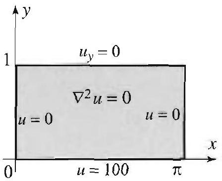

Figure 6 for E

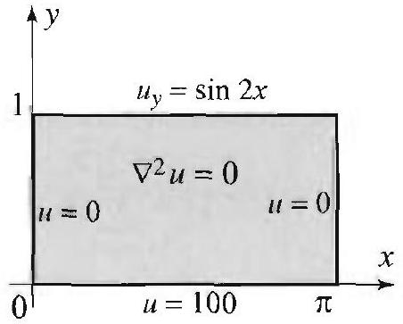

Right margin note (page 82)

undary to two ghtforroblem
$=0$
$x$
re 5(c) ethods
y) and re pre-
e (Fig-
$x$
$y$ ) is a ith the

++++

artial Differential Equations in Rectangular Coordinates

EXAMPLE 4 Decomposition of boundary conditions
The boundary value problem in Figure 5(a) has two nonhomogeneous bo conditions on the horizontal sides. To solve the problem, we break it up in subproblems with three homogeneous boundary conditions each. It is strai ward to check that if $u_{1}$ is a solution of problem \#1 and $u_{2}$ is a solution of p \#2, then $u=u_{1}+u_{2}$ is a solution of the original problem.
sition of the boundary value problem in Example 4.
The problem in Figure 5(b) was solved in Example 2. The problem in Figu has only one nonhomogeneous boundary condition and can be solved by the m of this section. We leave the details to Exercise 3.

Further properties of Neumann conditions (e.g., their compatibilit interesting applications involving the two-dimensional heat equation a sented in the exercises.
Exercises 3.10
In Exercises 1-3, solve the boundary value problem described by the figur ures 6-8).
2.

Figure 7 for Exercise 2.
3.

Figure 8 for Exercise 3.
4. (a) Prove the following variant of Proposition 1: If $\phi(x, y)=X(x) Y($ product solution of Laplace's equation in the $a \times b$-rectangle of Figure 9, w zero Neumann conditions on the vertical sides, then $\phi(x, y)=B_{0} y+A_{0}$ or
$$
\phi(x, y)=\phi_{m}(x, y)=\cos \frac{m \pi}{a} x\left(A_{m} \cosh \frac{m \pi}{a} y+B_{m} \sinh \frac{m \pi}{a} y\right),
$$
where $m=1,2, \ldots$, and $A_{m}$ and $B_{m}$ are arbitrary constants.
(b) For $m=1,2, \ldots$, show that, alternatively,
$$
\phi_{m}(x, y)=\cos \frac{m \pi}{a} x\left(\alpha_{m} \cosh \frac{m \pi}{a}(\beta-y)+\beta_{m} \sinh \frac{m \pi}{a}(\beta-y)\right) .
$$

---

<!-- Page 83 -->

Left margin note (page 83)

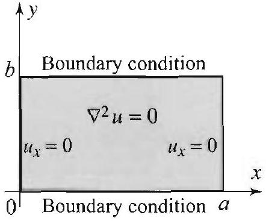

Figure 9 for Exerc

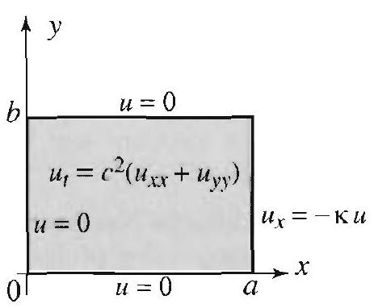

Figure 12 Plate with diating side.

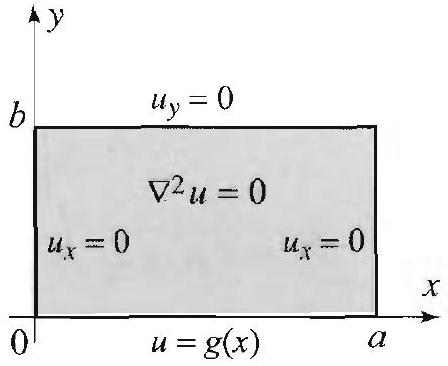

Right margin note (page 83)

185
Fig-
dity
$$
=1 .
$$
we
lary
tion side ure,
$$
T(t)
$$
orry
and

++++

Section 3.10 Neumann and Robin Conditions

In Exercises 5-6, solve the boundary value problem described by the figure
5.

ion
$\xrightarrow[i \text { ion } a]{x=0}$
ise 4. ures 10-11). Use Exercise 4.

Figure 10 for Exercise 5.
6.

Figure 11 for Exercise 6.

In Exercises 7-10, (a) solve the given boundary value problem. (b) Check the vali of your answer by verifying the boundary conditions.
7. The boundary value problem in Figure 2, with $a=b=\pi$ and $f(x)=\sin 2 x$.
8. The boundary value problem in Figure 3, with $a=b=\pi$ and $f(x)=\sin x$.
9. The boundary value problem in Figure 4(a), with $a=b=\pi$ and $f(x)=g(x)$
10. The boundary value problem in Figure 8 with $a=b=\pi$ and $g(x)=1$.
11. Project Problem: Insulated plate with one radiating side. Here outline a solution of the heat equation
$$
u_{t}=c^{2}\left(u_{x x}+u_{y y}\right), \quad 0<x<a, 0<y<b, t>0
$$
subject to the initial condition $u(x, y, 0)=f(x, y)$ and the (Robin) bounc conditions described in Figure 12. The problem models the temperature distribu in an insulated rectangular plate with three sides kept at 0 temperature and one loosing heat to the surrounding medium at a rate proportional to its temperat with convection coefficient (or heat transfer constant) $\kappa>0$.
$=-\kappa u$
$x$
one ra-
(a) Use the separation of variables method to show that, if $u(x, y, t)=X(x) Y(y)$, is a product solution of the equation and the boundary conditions (do not w about the initial condition at this point), then
$$
\begin{array}{c}
X^{\prime \prime}+\mu^{2} X=0, \quad X(0)=0, \quad X^{\prime}(a)=-\kappa X(a), \\
Y^{\prime \prime}+\nu^{2} Y=0, \quad Y(0)=0, \quad Y(b)=0, \\
T^{\prime}+c^{2}\left(\mu^{2}+\nu^{2}\right) T=0 .
\end{array}
$$
(b) Show that
$$
\begin{array}{c}
X=X_{m}=\sin \mu_{m} x, \quad m=1,2, \ldots, \\
Y=Y_{n}=\sin \frac{n \pi}{b} y, \quad n=1,2, \ldots, \\
T=T_{m n}=e^{-\lambda_{m n}^{2} t}, \quad m, n=1,2, \ldots,
\end{array}
$$
where $\mu_{m}$ is the $m$ th positive root of the transcendental equation $\tan a \mu=-\frac{\mu}{\kappa}$, $\lambda_{m n}^{2}=c^{2}\left(\mu_{m}^{2}+\left(\frac{n \pi}{b}\right)^{2}\right)$. (See Example 2, Section 3.6.)

---

<!-- Page 84 -->

Left margin note (page 84)

186
Chapter 3
Partial Differe

Right margin note (page 84)

nat the
3.7 in ike the series" follows on the nd the $[0, b]$ mplete iogonal orthogysis in ons on
$\kappa=1$,
e series
te temdecays and by
mann
roblem $y)=0$
f $R$. In
a rate of $R$. y must ibility

Green's lve the lify the

++++

ntial Equations in Rectangular Coordinates
(c) Superpose the product solutions and use the initial condition to show th solution of the problem is
$$
u(x, y, t)=\sum_{n=1}^{\infty} \sum_{m=1}^{\infty} B_{m n} e^{-\lambda_{m n}^{2} t} \sin \mu_{m} x \sin \frac{n \pi}{b} y,
$$
where
$$
B_{m n}=\frac{2}{b \int_{0}^{a} \sin ^{2} \mu_{m} x d x} \int_{0}^{b} \int_{0}^{a} f(x, y) \sin \mu_{m} x \sin \frac{n \pi}{b} y d x d y
$$
(Note: The double sine series that arise here differ from those of Section one major way: The functions $\sin \mu_{m} x$ do not have a common period. But 1 double Fourier sine series of Section 3.7, these "generalized double Fourier can be used to expand any reasonably well-behaved function $f(x, y)$. This because the functions $\sin \mu_{m} x$ form a complete orthogonal set of functions interval $[0, a]$ (see the comments preceeding Example 3 in Section 3.6), a functions $\sin \frac{n \pi}{b} y$ form a complete orthogonal set of functions on the interve (half-range sine series expansions). In general, whenever $\left(f_{m}(x)\right)_{m=1}^{\infty}$ is a co set of orthogonal functions on $[a, b]$ and $\left(g_{n}(y)\right)_{n=1}^{\infty}$ is a complete set of orth functions on $[c, d]$, it is straightforward to show that $\left(f_{m}(x) g_{n}(y)\right)_{m, n=1}^{\infty}$ are onal functions on the rectangle $[a, b] \times[c, d]$. Using basic tools from ana higher dimensions, we can show that they also form a complete set of funct $[a, b] \times[c, d]$.)
12. (a) Solve the heat problem in Exercise 11 with $a=1, b=\pi, c=1$, $f(x, y)=x(1-x) \sin y$. (Example 3, Section 3.6, is very helpful.)
(b) Write down at least five product solutions and form a partial sum of th solution.
(c) Consider $u\left(\frac{1}{2}, \frac{\pi}{2}, t\right)$, the temperature of the point $\left(\frac{1}{2}, \frac{\pi}{2}\right)$, and $u\left(\frac{1}{2}, t\right)$, th perature of the point $x=\frac{1}{2}$ in Example 3, Section 3.6. Which temperature faster? Justify your answer by comparing the analytical series solutions giving reasons based on the physical interpretation of the problems.
13. Project Problem: Compatibility of boundary conditions in Neu problems. A Neumann problem on a rectangle $R$ is a boundary value p consisting of Laplace's equation and Neumann boundary conditions: $\nabla^{2} u(x$, for all $(x, y)$ in $R$, and $\frac{\partial u}{\partial n} u(x, y)=f(x, y)$ for all $(x, y)$ on the boundary o this problem, all sides are exchanging heat with the surrounding medium at given by $f$. The total flux of heat is the integral of $f$ along the boundar Since $u$ is a steady-state solution, the total flux of heat across the boundar be 0 . This means that $f$ cannot be arbitrary; it must satisfy the compat condition
$$
\int_{0}^{a} f(x, 0) d x+\int_{0}^{b} f(a, y) d y-\int_{0}^{a} f(x, b) d x-\int_{0}^{b} f(0, y) d y=0 .
$$

This condition can be derived by using properties of harmonic functions and identities (see Chapter 12). Here we show that it is necessary in order to so Neumann problem using Fourier series and separation of variables. To simp

---

<!-- Page 85 -->

Left margin note (page 85)

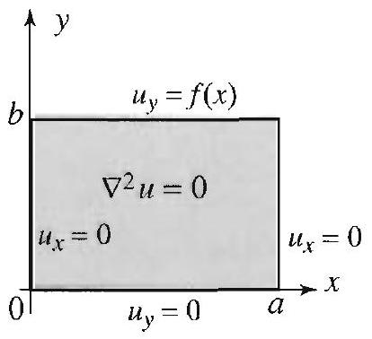

Figure 13 A Neuman lem.

3.11 The Ma

Right margin note (page 85)

187
f the
be
is a
here
$<\pi$.
and tion es of ture tain ture than re of the nain Is to num heat tical tion

++++

Section 3.11 The Maximum Principle

presentation, we consider the problem in Figure 13.
(a) Using the product solutions found in Exercise 4, show that the solution is 0 form
$$
u(x, y)=A_{0}+\sum_{m=1}^{\infty} A_{m} \cos \frac{m \pi}{a} x \cosh \frac{m \pi}{a} y .
$$
(b) Show that
$$
f(x)=\sum_{m=1}^{\infty} \frac{m \pi}{a} A_{m} \sinh \frac{m \pi b}{a} \cos \frac{m \pi}{a} x .
$$
(c) Conclude from (b) that $f$ must satisfy the compatibility condition
$$
\int_{0}^{a} f(x) d x=0
$$
[Hint: What are the cosine Fourier coefficients of $f$ ?]
(d) Show that for $m=1,2, \ldots$,
$$
A_{m}=\frac{2}{m \pi \sinh \frac{m \pi b}{a}} \int_{0}^{a} f(x) \cos \frac{m \pi}{a} x d x
$$

This determines the solution $u(x, y)$ up to an arbitrary constant $A_{0}$. This is expected, since the problem does not have a unique solution. Indeed, if $u(x, y)$ solution, then it is not difficult to check that $u(x, y)+C$ is also a solution, w $C$ is an arbitrary constant.
14. Solve the problem in Figure 13, with $a=b=\pi$, and $f(x)=\frac{\pi}{2}-x$ for $0<x$
ximum Principle
The title of this section refers to a property of the solutions of the heat Laplace's equations. Consider, for example, the temperature distribu inside a uniform bar with insulated lateral surface and no internal sourc heat, subject to boundary and initial conditions. If the initial tempera distribution and the temperature of the endpoints do not exceed a cer value $M$, then, arguing on physical grounds, we infer that the tempera distribution inside the bar at any subsequent time will remain smaller $M$. Similarly, if the initial temperature distribution and the temperatu the endpoints do not fall below a certain value $m$, then we infer that temperature distribution inside the bar at any subsequent time will rer greater than $m$. The mathematical formulation of these assertions lead what is known as the maximum principle, or the maximum-minin principle. Our goal in this section is to prove this principle for the and Laplace's equations and derive some of its theoretical and prac applications. Another approach to the results concerning Laplace's equa is presented in Chapter 12. We start with the heat equation.

---

<!-- Page 86 -->

Left margin note (page 86)

188
Chapter 3 Partial Differe

THEOREM 1
THE MAXIMUM PRINCIPLE FOR THE HEAT EQUATION

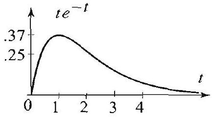

Figure 1 Maximum $M= e^{-1} \approx .37$, attained at $t=1$.

Right margin note (page 86)

y con-
and $M$
y new
$t>0$.
n. We
$t)=0$,
ll time
5.

Again,
This
andary

0 (see
$x, t) \leq$
ve the

++++

ential Equations in Rectangular Coordinates

Consider the heat boundary value problem with nonconstant boundar ditions
$$
\begin{array}{c}
u_{t}=c^{2} u_{x x}, \quad 0<x<L, \quad t>0, \\
u(0, t)=g_{1}(t), \quad u(L, t)=g_{2}(t), \quad t \geq 0, \\
u(x, 0)=f(x), \quad 0<x<L .
\end{array}
$$

Suppose that $f, g_{1}, g_{2}$ are bounded. Thus, there are constants $m$ \& such that for all $0 \leq x \leq L$, and all $t \geq 0$, we have
$$
m \leq f(x) \leq M ; \quad m \leq g_{1}(t) \leq M ; \quad m \leq g_{2}(t) \leq M .
$$

Then the solution of (1)-(3) satisfies the inequalities
$$
m \leq u(x, t) \leq M ; \quad 0 \leq x \leq L ; \quad t \geq 0
$$

At the endpoints $x=0, x=L$, or $t=0$, (5) reduces to (4). So the onl information in (5) concerns the values of $u(x, t)$ when $0<x<L$ and The proof of (5) is presented in the Appendix at the end of the sectio continue with some examples and applications.

EXAMPLE 1 The maximum principle for the heat equation
(a) In Example 1, Section 3.5, we have $f(x)=100,0<x<\pi ; g_{1}(t)=0, g_{2}($ for $t \geq 0$. Taking $m=0$ and $M=100$ in (4), we infer from (5) that at a $0 \leq u(x, t) \leq 100$. For $t>0$, this is clearly illustrated in Figure 4, Section 3.
(b) In Example 3, Section 3.5, we have $f(x)=100, g_{1}(t)=0, g_{2}(t)=100$. taking $m=0$ and $M=100$ in (4), we infer from (5) that $0 \leq u(x, t) \leq 100$ is illustrated in Figure 6, Section 3.5.
(c) Consider the heat equation (1) with $c=1, L=1$, and the following bou and initial conditions:
$$
\begin{array}{l}
u(0, t)=t e^{-t}, \quad u(1, t)=0, \quad t \geq 0 \\
u(x, 0)=0, \quad 0 \leq x \leq 1 .
\end{array}
$$

Here $m=0$, and $M=e^{-1}$, which is the maximum value of $t e^{-t}$ for $t \geq$ Figure 1). Without solving the problem, we can infer from (5) that $0 \leq u( e^{-1}$.

In the following example, we apply the maximum principle to pro uniqueness of the solution of the heat problem (1)-(3).

---

<!-- Page 87 -->

Left margin note (page 87)

ΝοιLV ΩοᲰ S.GOVTdV' HOA GTAIONIHA WΩWIXVIN SHL $z$ NAMOAHL

Right margin note (page 87)

189

hen are lary and that
iple
(1)-
. In
for
(1),
$t)-$
(5)
ata, striable rob-
and

++++

Section 3.11 The Maximum Principle

EXAMPLE 2 Uniqueness of the solution of the heat problem
Show that if $u_{1}(x, t)$ and $u_{2}(x, t)$ are solutions of the heat problem (1)-(3), $u_{1}(x, t)=u_{2}(x, t)$. Thus the solution of the heat problem (1)-(3) is unique.
Solution Consider the function $u(x, t)=u_{1}(x, t)-u_{2}(x, t)$. Since $u_{1}$ and $u_{2}$ solutions of (1)-(3), it is easy to check that $u$ is also a solution of (1) with bound conditions $u(0, t)=u(L, t)=0$ and initial condition $u(x, 0)=0$. Thus $m=0 M=0$ for $u$ and (5) implies that $0 \leq u(x, t) \leq 0$. Hence $u(x, t)=0$, implying $u_{1}(x, t)=u_{2}(x, t)$.

We next apply the maximum principle to derive a comparison princ for the solution of the heat problem.

EXAMPLE 3 A comparison principle
Let $u_{1}(x, t)$ and $u_{2}(x, t)$ denote the solutions of two heat problems of the form (3). Suppose that $u_{1}(0, t) \leq u_{2}(0, t), u_{1}(L, t) \leq u_{2}(L, t)$, and $u_{1}(x, 0) \leq u_{2}(x, 0)$, other words, suppose that the boundary and initial data for $u_{2}$ dominate those $u_{1}$. Show that $u_{1}(x, t) \leq u_{2}(x, t)$ for all $0 \leq x \leq L$ and all $t \geq 0$.
Solution The function $u(x, t)=u_{2}(x, t)-u_{1}(x, t)$ satisfies the heat equation with boundary conditions $u(0, t)=u_{2}(0, t)-u_{1}(0, t) \geq 0$ and $u(L, t)=u_{2}(L$, $u_{1}(L, t) \geq 0$, and initial condition $u(x, 0)=u_{2}(x, 0)-u_{1}(x, 0) \geq 0$. Applying with $m \geq 0$, we get $0 \leq u(x, t)$; equivalently $u_{1}(x, t) \leq u_{2}(x, t)$.

Laplace's Equation
Consider the Dirichlet problem in a rectangle
$$
\begin{array}{c}
u_{x x}+u_{y y}=0, \quad 0<x<a, 0<y<b, \\
u(x, 0)=f_{1}(x), \quad u(x, b)=f_{2}(x), 0<x<a, \\
u(0, y)=g_{1}(y), \quad u(a, y)=g_{2}(y), 0<y<b .
\end{array}
$$

Assuming that we know the upper and lower bounds of the boundary d and thinking of the problem as modeling the steady-state temperature dis bution in an insulated plate with no internal sources of heat, it is reason to infer that these bounds apply as well to the solution of the Dirichlet p lem. Indeed, we have the following important result.

Suppose that $f_{1}, f_{2}, g_{1}, g_{2}$ are bounded. Thus, there are constants $m M$ such that for all $0 \leq x \leq a$, and all $0 \leq y \leq b$, we have
$$
m \leq f_{1}(x), f_{2}(x) \leq M ; \quad m \leq g_{1}(y), g_{2}(y) \leq M .
$$

Then the solution of (6)-(8) satisfies the inequalities
$$
m \leq u(x, y) \leq M ; \quad 0 \leq x \leq a ; \quad 0 \leq y \leq b .
$$

---

<!-- Page 88 -->

Left margin note (page 88)

190
Chapter 3
Partial Differe

LEMMA 1

Right margin note (page 88)

eorem 1 and ation. mparn the
5). In
holds. nsider $-g_{1}(t)$, oblem, tion of 1), we $R_{T}=$ is that m and actions unded m this ur goal upper other plying
$<x<$
$<x_{0}<$
on $v$ ce the d (iii), nction e must cannot
or on done

++++

ential Equations in Rectangular Coordinates

The proof will be presented in the appendix, following the proof of The 1. You can use Theorem 2 in the same way that we used Theorem derive properties of Laplace's equation similar to those of the heat equ In particular, we have a corresponding uniqueness theorem and a coison principle. The exact statements of these results are presented exercises.

Appendix: Proofs of (5) and (10)
Starting with (5), we note that it is enough to prove one inequality from ( fact, we will prove
$$
u(x, t) \leq M, \quad 0 \leq x \leq L, \quad 0 \leq t \leq T,
$$
where $T$ is fixed but arbitrary. To see that this is enough, suppose that (11) By letting $T$ tend to infinity, we obtain inequality (11) with $0 \leq t<\infty$. Co now the problem consisting of (1) subject to the initial conditions $u(0, t)=- u(L, t)=-g_{2}(t)$, and the boundary condition $u(x, 0)=-f(x)$. For this pr the upper bound is $-m$ and the lower bound is $-M$. Furthermore, the solu this problem is $-u(x, t)$, where $u(x, t)$ is the solution of (1)-(3). Applying (1 get $-u(x, t) \leq-m$, or $m \leq u(x, t)$. Thus (11) implies (5).

In proving (11), we will assume that $u(x, t)$ is continuous on the rectangle $\{(x, t): 0 \leq x \leq L, 0 \leq t \leq T\}$. Now recall a result from calculus that assert a continuous function over a closed and bounded interval attains its maximu minimum values on that interval. There is a similar result for continuous fur of several variables. It asserts that a continuous function over a closed and bo set, such as our rectangle $R_{T}$, attains its maximum and minimum values. Fro result, it follows that $u$ attains its maximum value over the rectangle $R_{T}$. O is to show that this value cannot be attained on the inside of $R_{T}$, or on its side. This will imply that the maximum value is attained somewhere on the three sides. But on these three sides $u$ is bounded by $M$, and so (11) holds, im (5).

We need two lemmas.
Let $v(x, t)$ be a function of two variables such that $v_{t}$ and $v_{x x}$ exist for 0 $L, 0<t \leq T$. Suppose that $v$ has a local maximum at $\left(x_{0}, t_{0}\right)$, where 0 $L, 0<t_{0} \leq T$. Then
(i) $v_{x x}\left(x_{0}, t_{0}\right) \leq 0$;
(ii) $v_{t}\left(x_{0}, t_{0}\right)=0$, if $0<t_{0}<T$;
(iii) $v_{t}\left(x_{0}, t_{0}\right) \geq 0$, if $t_{0}=T$.

Proof To prove (i), think of $v\left(x, t_{0}\right)$ as a function of $x$. Our assumption implies that the function $x \mapsto v\left(x, t_{0}\right)$ has a local maximum at $x_{0}$. Hen concavity of the graph cannot be positive, and (i) follows. To prove (ii) an we argue in a similar way, thinking of $v\left(x_{0}, t\right)$ as a function of $t$. If this fu has a local maximum somewhere inside the interval $(0, T)$, then the derivativ vanish, implying (ii). If the function has a local maximum at $t=T$, then it be decreasing at $t=T$, and hence (iii) follows.

We want to show that $u(x, t)$ cannot have a local maximum inside $R_{T}$ its upper side. If inequality (i) in Lemma 1 were strict, then we would b

---

<!-- Page 89 -->

Right margin note (page 89)

191

and early num, come
three
e $R_{T}$ naxi$\leq 0$. ) fol$L$, or
mma
gh to
mum $\left.0, y_{0}\right)$
t the cond duce

++++

Section 3.11 The Maximum Principle

because then we could apply Lemma 1 to $u$ and get that $u_{t} \geq 0$ and $u_{x x}<0$ hence $u_{t} \neq c^{2} u_{x x}$ at any local maximum inside $R_{T}$ or on its upper side. This cl contradicts the fact that $u$ is a solution of (1). Unfortunately, at a local maxir we may have $u_{x x}=0$ which is not sufficient to reach a contradiction. To over this problem, we will introduce an auxiliary function
$$
v(x, t)=u(x, t)+\frac{1}{n} x^{2}
$$
for which an argument similar to the one that we just presented will work.
Let $v$ be as in (12). Then
(i) $v_{t}(x, t)<c^{2} v_{x x}(x, t)$ for all $(x, t)$ inside $R_{T}$ and on its upper side.
(ii) The maximum value of $v$ over the rectangle $R_{T}$ occurs somewhere on the sides $x=0, x=L$, or $t=0$.
(iii) For all $(x, t)$ in $R_{T}$, we have $v(x, t) \leq M+\frac{L^{2}}{n}$.

Proof From (12), we have $v_{t}=u_{t}$ and $v_{x x}=u_{x x}+\frac{2}{n}$. Since $u_{t}=c^{2} u_{x x}$ insid and on its upper side, (i) follows. To prove (ii), assume that we have a local r mum at $\left(x_{0}, t_{0}\right)$ inside $R_{T}$. By Lemma 1, we have $v_{t}\left(x_{0}, t_{0}\right) \geq 0$ and $v_{x x}\left(x_{0}, t_{0}\right)$ But by (i), $v_{x x}\left(x_{0}, t_{0}\right)>\frac{1}{c^{2}} v_{t}\left(x_{0}, t_{0}\right) \geq 0$, which is a contradiction. Hence (ii lows. To prove (iii), we use (ii) and the fact that $u(x, t) \leq M$ for $x=0, x= t=0$.

We are now in a position to complete the proof of (5). Using (12) and (iii) of Le 2 , we see that for all $(x, t)$ in $R_{T}$, we have
$$
u(x, t)=v(x, t)-\frac{x^{2}}{n} \leq v(x, t) \leq M+\frac{L^{2}}{n} .
$$

Letting $n$ tend to infinity, we obtain (11), and hence (5) follows.
Proof of (10) Arguing as we did in the proof of (5), we see that it is enou show one part of inequality (10). In fact, it is enough to show that
$$
u(x, y) \leq M, \quad 0<x<a, \quad 0<y<b .
$$

Using Lemma 1 , or the proof of Lemma 1 , we see that if $u$ has a local maxi inside the rectangle $R=\{(x, y): 0 \leq x \leq a, 0 \leq y \leq b\}$, say at the point ( $x$ where $0<x_{0}<a, 0<y_{0}<b$, then
$$
u_{x x}\left(x_{0}, y_{0}\right) \leq 0, \quad \text { and } \quad u_{y y}\left(x_{0}, y_{0}\right) \leq 0 .
$$

Here again, if one of these inequalities were strict, then this would contradic equality $u_{x x}\left(x_{0}, y_{0}\right)+u_{y y}\left(x_{0}, y_{0}\right)=0$, and complete the proof. However, the se derivatives in (14) may be equal to zero. So, as we did in proof of (5), we intro an auxiliary function
$$
v(x, y)=u(x, y)+\frac{x^{2}+y^{2}}{n} .
$$

Since $u$ satisfies Laplace's equation inside $R$, it follows that
$$
v_{x x}+v_{y y}=u_{x x}+u_{y y}+\frac{4}{n}=\frac{4}{n}>0 .
$$

---

<!-- Page 90 -->

Left margin note (page 90)

192
Chapter 3
Partial Differe

Right margin note (page 90)

ald get Hence on the
kimum eat for data? $M$ at ration. ith an ty. ximum Model

++++

ntial Equations in Rectangular Coordinates

This implies that $v$ cannot have a local maximum inside $R$; otherwise we wor $v_{x x} \leq 0$ and $v_{y y} \leq 0$, implying that $v_{x x}+v_{y y} \leq 0$, which is a contradiction. the maximum of $v$ occurs at the boundary of $R$. Since $u$ is bounded by $M$ boundary of $R$, it follows from (15) that
$$
v(x, y) \leq M+\frac{a^{2}+b^{2}}{n},
$$
for all $(x, y)$ in $R$. Hence, for all $(x, y)$ in $R$,
$$
u(x, y)=v(x, y)-\frac{x^{2}+y^{2}}{n} \leq v(x, y) \leq M+\frac{a^{2}+b^{2}}{n} .
$$

Letting $n$ tend to infinity, we obtain (13) and hence (10).
Exercises 3.11
1. Refer to the heat problem in Exercise 3, Section 3.5. What does the maprinciple tell us about the solution in this case?
2. Repeat Exercise 1 with the heat problem of Exercise 11, Section 3.5.
3. In this exercise we consider a heat problem with an internal source of $h$ which the maximum principle does not hold. The problem is the following:
$$
\begin{array}{l}
u_{t}=u_{x x}+2(t+1)+x(1-x), \quad 0<x<1, \quad t>0, \\
u(0, t)=0, \quad u(1, t)=0, \\
u(x, 0)=x(1-x) \quad 0<x<1 .
\end{array}
$$
(a) Verify that $u(x, t)=(t+1) x(1-x)$ is a solution.
(b) What are the maximum and minimum values of the initial and boundary Denote these values by $M$ and $m$, respectively.
(c) Show that for some values of $t>0$, the temperature distribution exceeds certain points in the bar. Illustrate your answer with a concrete example.
4. State and prove the maximum principle for the two dimensional heat equ (See Section 3.7 for a statement of the problem with zero boundary data.)
5. The maximum principle fails for the wave equation. Illustrate this fact w example of a wave problem as in (1)-(3), Section 3.3, with zero initial veloci
6. Uniqueness of the solution of the Dirichlet problem. Use the ma: principle to show that the Dirichlet problem (6)-(8) has a unique solution.
7. State and prove a comparison principle for the Dirichlet problem (6)-(8). your statement after the one for the heat equation (Example 3).
