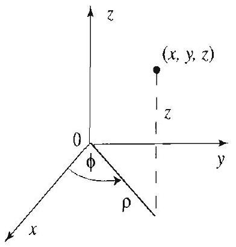

## Topics to Review

Fourier scrics (Sections 2.1-2.4) and the separation of variables method (Section 3.3) are crucial in this chapter. Section 12.1 is self-contained. It presents the Laplacian in polar, cylindrical, and spherical coordinates. Sections 12.2 and 12.3 deal with the vibrating circular membrane. These require knowledge of Bessel functions (Sections 4.7, 4.8) and Fourier series. Section 12.4 requires Fourier series. For Section 12.5, further properties of Bessel functions from Sections 12.7 and 12.8 are needed. Section 12.6 develops the eigenfunction expansions method on the disk. For this section, it is recommended to review the material of Section 3.9.

## Looking Ahead...

You recall from Section 3.6 how by varying the boundary conditions we were led to new types of series expansions. In this chapter we will solve boundary value problems over circular and cylindrical domains. It should not surprise you that the solutions will entail new series expansions; for example, Bessel series. These series look quite complicated at first, but with the help of a computer system, you will be able to plot them and see that they behave very much like Fourier series. The ideas of this chapter will be developed further in Chapter 5, where we will consider problems in spherical coordinates, giving rise to new families of special functions.

## 12

# PARTIAL DIFFERENTIAL EQUATIONS IN POLAR AND CYLINDRICAL COORDINATES 

One cannot understand ... the universality of laws of nature, the relationship of things, without an understanding of mathematics. There is no other way to do it.
-RICHARD P. FEYNMAN

In the previous chapter we used our knowledge of Fourier series to solve several interesting boundary value problems by the method of separation of variables. The success of our method depended to a large extent on the fact that the domains under consideration were easily described in Cartesian coordinates. In this chapter we address problems where the domains are easily described in polar and cylindrical coordinates. Specifically, we consider boundary value problems for the wave, heat, Laplace, and Poisson equations over disks or cylinders. Upon restating these problems in suitable coordinate systems and separating variables, we will encounter new ordinary differential equations, Bessel's equation, whose solutions are called Bessel functions. The full implementation of the separation of variables method will lead us to study expansions of functions in terms of Bessel functions in ways analogous to Fourier series expansions.

You do not need to know about Bessel series to start the chapter. As needed, we will refer to Sections 12.7 and 12.8, where you will find a comprehensive treatment of these special series expansions. Section 12.9 contains mostly proofs of interesting properties of Bessel functions, with surprising connections to Fourier series. This section can be omitted without affecting the rest of the chapter.

### 12.1 The Laplacian in Various Coordinate Systems

The two dimensional Laplacian and its higher dimensional versions are of paramount importance in applications. They appear, for example, in the wave and heat equations, and also in Laplace's equation. In previous sections we solved these equations over rectangular and box shaped regions. To extend our applications to regions such as the disk, the sphere or the cylinder, it is to our advantage to use new coordinate systems in which the region and its boundary have simple expressions. For example, for problems over a disk we change to polar coordinates, where the equation of a circle centered at the origin reduces to $r=a$. Similarly, problems over spheres are simplified by a change to spherical coordinates. For later applications, in this section we express the Laplacian in various coordinate systems.

## The Laplacian in Polar Coordinates

We recall the relationship between rectangular and polar coordinates

$$
\begin{array}{cc}
x=r \cos \theta, & y=r \sin \theta \\
r^{2}=x^{2}+y^{2}, & \tan \theta=\frac{y}{x}
\end{array}
$$

(Since the inverse tangent takes its values in the interval ( $-\pi / 2, \pi / 2$ ), we have $\theta=\tan ^{-1}\left(\frac{y}{x}\right) \pm k \pi$, where $k=0,1$, or -1 , depending on whether $x>0, x<0$ and $y \geq 0$, or $x<0$ and $y<0$. Also, if $x=0$, then $\theta=\pi / 2$ if $y>0$ and $-\pi / 2$ if $y<0$. See Figure 1.) Differentiating $r^{2}=x^{2}+y^{2}$ with respect to $x$, we obtain

$$
2 r \frac{\partial r}{\partial x}=2 x \quad \text { or } \quad \frac{\partial r}{\partial x}=\frac{x}{r} .
$$

Figure 1 Polar coordinates.

Differentiating a second time with respect to $x$ and simplifying, we obtain

$$
\frac{\partial^{2} r}{\partial x^{2}}=\frac{r-x \frac{\partial r}{\partial x}}{r^{2}}=\frac{r-x \frac{x}{r}}{r^{2}}=\frac{r^{2}-x^{2}}{r^{3}}=\frac{y^{2}}{r^{3}}
$$

Differentiating $\theta=\tan ^{-1} \frac{y}{x} \pm \pi$ with respect to $x$ yields

$$
\frac{\partial \theta}{\partial x}=\frac{1}{1+\left(\frac{y}{x}\right)^{2}}\left(-\frac{y}{x^{2}}\right)=-\frac{y}{r^{2}} .
$$

Differentiating a second time with respect to $x$ and simplifying yields

$$
\frac{\partial^{2} \theta}{\partial x^{2}}=\frac{2 y}{r^{3}} \frac{\partial r}{\partial x}=\frac{2 x y}{r^{4}} .
$$

Differentiating now with respect to $y$, we obtain in a similar way

$$
\frac{\partial r}{\partial y}=\frac{y}{r}, \frac{\partial \theta}{\partial y}=\frac{x}{r^{2}}, \text { and } \frac{\partial^{2} r}{\partial y^{2}}=\frac{x^{2}}{r^{3}}, \frac{\partial^{2} \theta}{\partial y^{2}}=-\frac{2 x y}{r^{4}} .
$$

(Check these identities.) From what we have done so far, it is easy to derive the following interesting identities

$$
\frac{\partial^{2} \theta}{\partial x^{2}}+\frac{\partial^{2} \theta}{\partial y^{2}}=0
$$

and

$$
\frac{\partial \theta}{\partial x} \frac{\partial r}{\partial x}+\frac{\partial \theta}{\partial y} \frac{\partial r}{\partial y}=0
$$

We are now ready to change to polar coordinates in the Laplacian. Using the chain rule in two dimensions, we have

$$
\frac{\partial u}{\partial x}=\frac{\partial u}{\partial r} \frac{\partial r}{\partial x}+\frac{\partial u}{\partial \theta} \frac{\partial \theta}{\partial x}
$$

Applying the product rule for differentiation and the chain rule, we obtain

$$
\begin{aligned}
\frac{\partial^{2} u}{\partial x^{2}}= & \frac{\partial}{\partial x}\left(\frac{\partial u}{\partial r}\right) \frac{\partial r}{\partial x}+\frac{\partial u}{\partial r} \frac{\partial^{2} r}{\partial x^{2}}+\frac{\partial}{\partial x}\left(\frac{\partial u}{\partial \theta}\right) \frac{\partial \theta}{\partial x}+\frac{\partial u}{\partial \theta} \frac{\partial^{2} \theta}{\partial x^{2}} \\
= & \left(\frac{\partial^{2} u}{\partial r^{2}} \frac{\partial r}{\partial x}+\frac{\partial^{2} u}{\partial r \partial \theta} \frac{\partial \theta}{\partial x}\right) \frac{\partial r}{\partial x}+\frac{\partial u}{\partial r} \frac{\partial^{2} r}{\partial x^{2}} \\
& +\left(\frac{\partial^{2} u}{\partial r \partial \theta} \frac{\partial r}{\partial x}+\frac{\partial^{2} u}{\partial \theta^{2}} \frac{\partial \theta}{\partial x}\right) \frac{\partial \theta}{\partial x}+\frac{\partial u}{\partial \theta} \frac{\partial^{2} \theta}{\partial x^{2}} \\
= & \frac{\partial^{2} u}{\partial r^{2}}\left(\frac{\partial r}{\partial x}\right)^{2}+2 \frac{\partial^{2} u}{\partial r \partial \theta} \frac{\partial \theta}{\partial x} \frac{\partial r}{\partial x}+\frac{\partial u}{\partial r} \frac{\partial^{2} r}{\partial x^{2}} \\
& +\frac{\partial^{2} u}{\partial \theta^{2}}\left(\frac{\partial \theta}{\partial x}\right)^{2}+\frac{\partial u}{\partial \theta} \frac{\partial^{2} \theta}{\partial x^{2}} .
\end{aligned}
$$

Changing $x$ to $y$, we obtain

$$
\frac{\partial^{2} u}{\partial y^{2}}=\frac{\partial^{2} u}{\partial r^{2}}\left(\frac{\partial r}{\partial y}\right)^{2}+2 \frac{\partial^{2} u}{\partial r \partial \theta} \frac{\partial \theta}{\partial y} \frac{\partial r}{\partial y}+\frac{\partial u}{\partial r} \frac{\partial^{2} r}{\partial y^{2}}+\frac{\partial^{2} u}{\partial \theta^{2}}\left(\frac{\partial \theta}{\partial y}\right)^{2}+\frac{\partial u}{\partial \theta} \frac{\partial^{2} \theta}{\partial y^{2}} .
$$

Adding and simplifying with the help of (1) and (2), we get

$$
\begin{aligned}
\frac{\partial^{2} u}{\partial x^{2}}+\frac{\partial^{2} u}{\partial y^{2}}= & \frac{\partial^{2} u}{\partial r^{2}}\left\{\left(\frac{\partial r}{\partial x}\right)^{2}+\left(\frac{\partial r}{\partial y}\right)^{2}\right\}+2 \frac{\partial^{2} u}{\partial r \partial \theta}\left\{\frac{\partial \theta}{\partial x} \frac{\partial r}{\partial x}+\frac{\partial \theta}{\partial y} \frac{\partial r}{\partial y}\right\} \\
& +\frac{\partial u}{\partial r}\left\{\frac{\partial^{2} r}{\partial x^{2}}+\frac{\partial^{2} r}{\partial y^{2}}\right\}+\frac{\partial^{2} u}{\partial \theta^{2}}\left\{\left(\frac{\partial \theta}{\partial x}\right)^{2}+\left(\frac{\partial \theta}{\partial y}\right)^{2}\right\} \\
& +\frac{\partial u}{\partial \theta}\left\{\frac{\partial^{2} \theta}{\partial x^{2}}+\frac{\partial^{2} \theta}{\partial y^{2}}\right\} \\
= & \frac{\partial^{2} u}{\partial r^{2}}\left\{\left(\frac{\partial r}{\partial x}\right)^{2}+\left(\frac{\partial r}{\partial y}\right)^{2}\right\}+\frac{\partial u}{\partial r}\left\{\frac{\partial^{2} r}{\partial x^{2}}+\frac{\partial^{2} r}{\partial y^{2}}\right\} \\
& +\frac{\partial^{2} u}{\partial \theta^{2}}\left\{\left(\frac{\partial \theta}{\partial x}\right)^{2}+\left(\frac{\partial \theta}{\partial y}\right)^{2}\right\}
\end{aligned}
$$

Figure 2 Cylindrical coordinates.

We should note that there is no unanimity about which spherical coordinates to call $\theta$ and which to call $\phi$. Calculus texts tend to use $\theta$ for longitude and $\phi$ for colatitude. Our notation is more common in physics texts and hence more convenient for the physical applications of Chapter 5.

Replacing the partial derivatives with respect to $x$ and $y$ by their expressions in terms of $r$ and $\theta$, we arrive at

$$
\frac{\partial^{2} u}{\partial x^{2}}+\frac{\partial^{2} u}{\partial y^{2}}=\frac{\partial^{2} u}{\partial r^{2}}\left(\frac{x^{2}}{r^{2}}+\frac{y^{2}}{r^{2}}\right)+\frac{\partial u}{\partial r}\left(\frac{x^{2}}{r^{3}}+\frac{y^{2}}{r^{3}}\right)+\frac{\partial^{2} u}{\partial \theta^{2}}\left(\frac{x^{2}}{r^{4}}+\frac{y^{2}}{r^{4}}\right) .
$$

Simplifying with the help of the identity $x^{2}+y^{2}=r^{2}$, we get the polar form of the Laplacian

$$
\Delta u=\nabla^{2} u=\frac{\partial^{2} u}{\partial r^{2}}+\frac{1}{r} \frac{\partial u}{\partial r}+\frac{1}{r^{2}} \frac{\partial^{2} u}{\partial \theta^{2}}
$$

## The Laplacian in Cylindrical Coordinates

If $u$ is a function of three variables $x, y$, and $z$, the Laplacian is

$$
\Delta u=\nabla^{2} u=\frac{\partial^{2} u}{\partial x^{2}}+\frac{\partial^{2} u}{\partial y^{2}}+\frac{\partial^{2} u}{\partial z^{2}}
$$

The relationships between rectangular and cylindrical coordinates are

$$
x=\rho \cos \phi, \quad y=\rho \sin \phi, \quad z=z
$$

where we now use $\rho$ and $\phi$ to denote polar coordinates in the $x y$-plane as illustrated in Figure 2. The cylindrical form of the Laplacian is now evident from (3):

$$
\Delta u=\nabla^{2} u=\frac{\partial^{2} u}{\partial \rho^{2}}+\frac{1}{\rho} \frac{\partial u}{\partial \rho}+\frac{1}{\rho^{2}} \frac{\partial^{2} u}{\partial \phi^{2}}+\frac{\partial^{2} u}{\partial z^{2}}
$$

## The Laplacian in Spherical Coordinates

We will use $(r, \theta, \phi)$ to denote the spherical coordinates of the point $(x, y, z)$. We have

$$
\begin{gathered}
x=r \cos \phi \sin \theta, \quad y=r \sin \phi \sin \theta, \quad z=r \cos \theta \\
r^{2}=x^{2}+y^{2}+z^{2}
\end{gathered}
$$

From the geometry in Figure 3, we have

$$
\rho=r \sin \theta, \quad x=\rho \cos \phi, \quad y=\rho \sin \phi, \quad \rho^{2}=x^{2}+y^{2} .
$$

Figure 3 Spherical coordinates.

Our goal is to express $\nabla^{2} u$ in terms of $r, \theta$, and $\phi$. From the polar form of the Laplacian (3), we have

$$
\frac{\partial^{2} u}{\partial x^{2}}+\frac{\partial^{2} u}{\partial y^{2}}=\frac{\partial^{2} u}{\partial \rho^{2}}+\frac{1}{\rho} \frac{\partial u}{\partial \rho}+\frac{1}{\rho^{2}} \frac{\partial^{2} u}{\partial \phi^{2}} .
$$

Observe that the relations

$$
z=r \cos \theta, \quad \rho=r \sin \theta
$$

are analogous to those between polar and rectangular coordinates. So, by using again the polar form of the Laplacian with $z$ and $\rho$ (in place of $x$ and $y$ ), we get from (3)

$$
\frac{\partial^{2} u}{\partial z^{2}}+\frac{\partial^{2} u}{\partial \rho^{2}}=\frac{\partial^{2} u}{\partial r^{2}}+\frac{1}{r} \frac{\partial u}{\partial r}+\frac{1}{r^{2}} \frac{\partial^{2} u}{\partial \theta^{2}} .
$$

Adding $\frac{\partial^{2} u}{\partial z^{2}}$ to (5) and using (6) gives

$$
\frac{\partial^{2} u}{\partial x^{2}}+\frac{\partial^{2} u}{\partial y^{2}}+\frac{\partial^{2} u}{\partial z^{2}}=\frac{\partial^{2} u}{\partial r^{2}}+\frac{1}{r} \frac{\partial u}{\partial r}+\frac{1}{r^{2}} \frac{\partial^{2} u}{\partial \theta^{2}}+\frac{1}{\rho} \frac{\partial u}{\partial \rho}+\frac{1}{\rho^{2}} \frac{\partial^{2} u}{\partial \phi^{2}} .
$$

It remains to express $\partial u / \partial \rho$ in spherical coordinates. From the relation $\theta=\tan ^{-1}(\rho / z)$, we get

$$
\frac{\partial \theta}{\partial \rho}=\frac{1}{1+(\rho / z)^{2}} \frac{1}{z}=\frac{z}{z^{2}+\rho^{2}}=\frac{z}{r^{2}}=\frac{\cos \theta}{r} .
$$

Differentiating $\rho=r \sin \theta$ with respect to $\rho$, we get

$$
1=\frac{\partial r}{\partial \rho} \sin \theta+r \cos \theta \frac{\partial \theta}{\partial \rho}=\frac{\partial r}{\partial \rho} \sin \theta+\cos ^{2} \theta .
$$

Hence

$$
\frac{\partial r}{\partial \rho}=\frac{1-\cos ^{2} \theta}{\sin \theta}=\sin \theta .
$$

Now note that $\phi$ and $\rho$ are polar coordinates in the $x y$-plane, hence $\partial \phi / \partial \rho=$ 0 . Using the chain rule, we get

$$
\frac{\partial u}{\partial \rho}=\frac{\partial u}{\partial r} \frac{\partial r}{\partial \rho}+\frac{\partial u}{\partial \theta} \frac{\partial \theta}{\partial \rho}+\frac{\partial u}{\partial \phi} \frac{\partial \phi}{\partial \rho}=\frac{\partial u}{\partial r} \frac{\rho}{r}+\frac{\partial u}{\partial \theta} \frac{\cos \theta}{r} .
$$

Substituting this in (7) and simplifying, we get the spherical form of the Laplacian:
(8) $\Delta u=\nabla^{2} u=\frac{\partial^{2} u}{\partial r^{2}}+\frac{2}{r} \frac{\partial u}{\partial r}+\frac{1}{r^{2}}\left(\frac{\partial^{2} u}{\partial \theta^{2}}+\cot \theta \frac{\partial u}{\partial \theta}+\csc ^{2} \theta \frac{\partial^{2} u}{\partial \phi^{2}}\right)$.

EXAMPLE 1 Use spherical coordinates to compute the Laplacian of

$$
f(x, y, z)=\ln \left(x^{2}+y^{2}+z^{2}\right), \quad(x, y, z) \neq(0,0,0)
$$

Solution In spherical coordinates, we have

$$
f(r, \theta, \phi)=\ln r^{2}=2 \ln r
$$

Since $f$ is independent of $\theta$ and $\phi$, all partial derivatives in these variables are zero. From (8) we get

$$
\nabla^{2} f=\frac{\partial^{2} f}{\partial r^{2}}+\frac{2}{r} \frac{\partial f}{\partial r}=-\frac{2}{r^{2}}+\frac{4}{r^{2}}=\frac{2}{r^{2}}
$$

## Exercises 4.1

In Exercises 1-8, compute the Laplacian in an appropriate coordinate system and decide if the given function satisfies Laplace's equation $\nabla^{2} u=0$. The appropriate dimension is indicated by the number of variables.

1. $u(x, y)=\frac{x}{x^{2}+y^{2}}$.
2. $u(x, y)=\tan ^{-1}\left(\frac{y}{x}\right)$.
3. $u(x, y)=\frac{1}{\sqrt{x^{2}+y^{2}}}$.
4. $u(x, y, z)=\frac{z}{\sqrt{x^{2}+y^{2}}}$.
5. $u(x, y, z)=\left(x^{2}+y^{2}+z^{2}\right)^{3 / 2}$.
6. $u(x, y)=\ln \left(x^{2}+y^{2}\right)$.
7. $u(x, y, z)=\left(x^{2}+y^{2}+z^{2}\right)^{-1 / 2}$.
8. $u(x, y)=\tan ^{-1}\left(\frac{y}{x}\right) \frac{y}{x^{2}+y^{2}}$.
9. (a) Show that if $u(r, \theta, \phi)$ depends only on $r$, then the Laplacian takes the form $\nabla^{2} u=\frac{\partial^{2} u}{\partial r^{2}}+\frac{2}{r} \frac{\partial u}{\partial r}$.
(b) What is the form of the Laplacian if the function $u$ depends only on $r$ and $\theta$ ?
10. Supply all the details to derive (8) from (7).
11. Project Problem: Harmonic functions. Recall from Section 3.1 that $u(x, y)$ is called a harmonic function if it satisfies Laplace's equation.
(a) Show that if $u$ and $v$ are harmonic and $\alpha$ and $\beta$ are numbers, then $\alpha u+\beta v$ is harmonic.
(b) Give an example of two harmonic functions $u$ and $v$ such that $u v$ is not harmonic.
(c) Show that if $u$ and $u^{2}$ are both harmonic, then $u$ must be constant. [Hint: Write down what it means for $u$ and $u^{2}$ to be harmonic in terms of their partial derivatives.]
(d) Show that if $u, v$ and $u^{2}+v^{2}$ are harmonic, then $u$ and $v$ must be constant.
