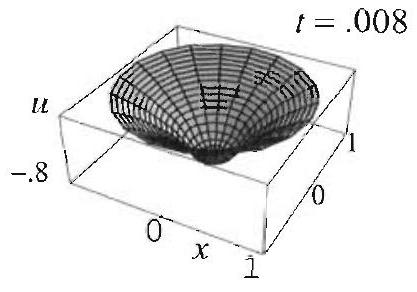
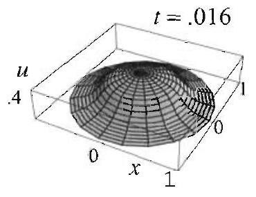
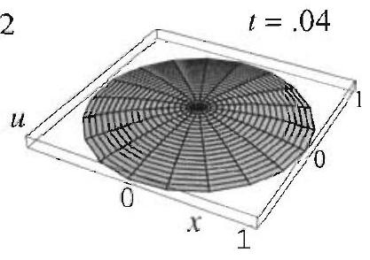

### 12.2 Vibrations of a Circular Membrane: Symmetric Case

In this and the next section we study the vibrations of a thin circular membrane with uniform mass density, clamped along its circumference. We place the center of the membrane at the origin, and we denote the radius by $a$. The vibrations of the membrane are governed by the two-dimensional wave equation, which will be expressed in polar coordinates, because these are the coordinates best suited to this problem. Using the polar form of the Lapla-

Figure 1 A radially symmetric shape.

The initial conditions are radially symmetric, so they depend only on $r$.
cian ((3), Section 12.1), the two dimensional wave equation becomes

$$
\frac{\partial^{2} u}{\partial t^{2}}=c^{2}\left(\frac{\partial^{2} u}{\partial r^{2}}+\frac{1}{r} \frac{\partial u}{\partial r}+\frac{1}{r^{2}} \frac{\partial^{2} u}{\partial \theta^{2}}\right) .
$$

The initial shape of the membrane will be modeled by the function $f(r, \theta)$, and its initial velocity by $g(r, \theta)$.

In this section we confine our study to the case where $f$ and $g$ are radially symmetric or axisymmetric, that is, they depend only on the radius $r$ and not on $\theta$. It is reasonable on physical grounds that in this case the solution also does not depend on $\theta$ (see Figure 1). Consequently, $\partial u / \partial \theta=0$, and (1) becomes

$$
\frac{\partial^{2} u}{\partial t^{2}}=c^{2}\left(\frac{\partial^{2} u}{\partial r^{2}}+\frac{1}{r} \frac{\partial u}{\partial r}\right),
$$

where $u=u(r, t), 0<r<a$, and $t>0$. Since the membrane is clamped at the circumference, we have the boundary condition

$$
u(a, t)=0, \quad t \geq 0 .
$$

The radially symmetric initial conditions are

$$
u(r, 0)=f(r), \quad \frac{\partial u}{\partial t}(r, 0)=g(r), \quad 0<r<a .
$$

We solve the boundary value problem (2)-(4) using the separation of variables method, as we did throughout Chapter 3. The goal is to separate the variables in the partial differential equation (2) and reduce the problem to two ordinary differential equations in $r$ and $t$. As you will see, the equation in $t$ is the same as the one that we obtained after separating variables in the wave equation in rectangular coordinates. Hence the solution in $t$ will consist of sines and cosines. The equation in the spatial variable $r$ is new, and its solution will involve the so-called Bessel functions.

## Separating Variables

We assume that the solution is of the form $u(r, t)=R(r) T(t)$. After differentiating, plugging into (2), and separating variables, we get

$$
\frac{T^{\prime \prime}}{c^{2} T}=\frac{1}{R}\left(R^{\prime \prime}+\frac{1}{r} R^{\prime}\right)=-\lambda^{2} .
$$

Because we expect periodic solutions in $T$, we have set the sign of the separation constant negative. (For a more rigorous argument based on the fact that

Figure 2 The Bessel functions of order 0 .

the solution in $R$ should be bounded in the interval [ $0, a$ ], see the solution of the Dirichlet problem in Section 12.5.) Hence

$$
\begin{gathered}
r R^{\prime \prime}+R^{\prime}+\lambda^{2} r R=0, \quad R(a)=0 \quad(\text { from }(3)), \\
T^{\prime \prime}+c^{2} \lambda^{2} T=0 .
\end{gathered}
$$

## Solving the Separated Equations

Here again, we begin by solving the equation with the boundary conditions to narrow down the possible solutions. Equation (5) is known as the parametric form of Bessel's equation of order zero (here $\lambda$ is the parameter). This equation arises so frequently in applications that its solutions have been named. Since the equation is second order and homogeneous, we need only two linearly independent solutions to be able to write its general solution. By convention, these two linearly independent solutions are called Bessel functions of order 0 of the first and second kind, and are denoted $J_{0}(\lambda r)$ and $Y_{0}(\lambda r)$, respectively. Hence the general solution to the parametric form of Bessel's equation in (5) is

$$
R(r)=c_{1} J_{0}(\lambda r)+c_{2} Y_{0}(\lambda r)
$$

where $r>0$ (Theorem 3, Section 12.8). The functions $J_{0}$ and $Y_{0}$ are treated in great detail in Sections 12.7-12.9; here we recall facts only as needed. Figure 2 shows the graphs of $J_{0}$ and $Y_{0}$.

Since on physical grounds the solutions to the wave equation are expected to be bounded, it follows that the spatial part of the solution, $R(r)$, has to be bounded near $r=0$. This is effectively a second boundary condition on $R$. Now the fact that $Y_{0}$ is unbounded near 0 forces us to choose $c_{2}=0$ in (7). To avoid trivial solutions, we will take $c_{1}=1$ and get

$$
R(r)=J_{0}(\lambda r)
$$

The condition $R(a)=0$ (see (5)) implies that

$$
J_{0}(\lambda a)=0
$$

and so $\lambda a$ must be a root of the Bessel function $J_{0}$. As Figure 2 suggests, $J_{0}$ has infinitely many positive zeros, which we denote by

$$
\alpha_{1}<\alpha_{2}<\alpha_{3}<\cdots<\alpha_{n}<\cdots
$$

(For a proof of this fact, see Section 12.9, or Exercise 35, Section 12.8.) Thus

$$
\lambda=\lambda_{n}=\frac{\alpha_{n}}{a}, \quad n=1,2, \ldots,
$$

and the corresponding solutions of (5) are

$$
R_{n}(r)=J_{0}\left(\frac{\alpha_{n}}{a} r\right), \quad n=1,2, \ldots
$$

where $\alpha_{n}$ is the $n$th positive zero of $J_{0}$. These solutions are analogous to the solutions $\sin \frac{n \pi}{L} x$ that we have encountered several times previously, in particular, while solving the one dimensional wave equation. The only difference is that the function sine and its zeros $n \pi$ are now replaced by the function $J_{0}$ and its zeros $\alpha_{n}$. Returning to (6) with $\lambda=\lambda_{n}$, we find

$$
T(t)=T_{n}(t)=A_{n} \cos c \lambda_{n} t+B_{n} \sin c \lambda_{n} t
$$

We thus obtain the product solutions of (2) and (3)

$$
u_{n}(r, t)=\left(A_{n} \cos c \lambda_{n} t+B_{n} \sin c \lambda_{n} t\right) J_{0}\left(\lambda_{n} r\right) \quad n=1,2, \ldots
$$

## Bessel Series Solution of the Entire Problem

To satisfy the initial conditions, motivated by the superposition principle, we let

$$
u(r, t)=\sum_{n=1}^{\infty}\left(A_{n} \cos c \lambda_{n} t+B_{n} \sin c \lambda_{n} t\right) J_{0}\left(\lambda_{n} r\right)
$$

We determine the unknown coefficients by evaluating the series at $t=0$ and using the initial conditions. We get from the first condition in (4)

$$
u(r, 0)=f(r)=\sum_{n=1}^{\infty} A_{n} J_{0}\left(\lambda_{n} r\right), \quad 0<r<a
$$

This series representation of $f(r)$ is akin to a Fourier sine series, except that the sine functions are now replaced by Bessel functions. There are analogous expansion theorems that apply in such cases; the series expansions that arise are known as Bessel, or Fourier-Bessel, expansions (see Theorem 2, Section 12.8). For the case at hand, we make use of Theorem 2, Section 12.8, with $p=0$. The Bessel coefficients $A_{n}$ are given by

$$
A_{n}=\frac{2}{a^{2} J_{1}^{2}\left(\alpha_{n}\right)} \int_{0}^{a} f(r) J_{0}\left(\lambda_{n} r\right) r d r
$$

where $J_{1}$ is the Bessel function of order 1. Now, differentiating the series for $u$ term by term with respect to $t$, and then setting $t=0$, we get from the second initial condition

$$
u_{t}(r, 0)=g(r)=\sum_{n=1}^{\infty} c \lambda_{n} B_{n} J_{0}\left(\lambda_{n} r\right)
$$

## THEOREM 1 WAVE EQUATION IN POLAR COORDINATES

There is a clear analogy between the solution (9) and the solution of the onedimensional wave equation (8), Section 3.3. The only difference is that spatial variations are now determined by Bessel functions rather than the simpler sine functions.

From (7), Section 12.8,

$$
\begin{aligned}
& \int x^{p+1} J_{p}(x) d x= \\
& x^{p+1} J_{p+1}(x)+C
\end{aligned}
$$

Thus $c \lambda_{n} B_{n}=c \frac{\alpha_{n}}{a} B_{n}$ is the $n$th Bessel coefficient of $g$, and so

$$
B_{n}=\frac{2}{c \alpha_{n} a J_{1}^{2}\left(\alpha_{n}\right)} \int_{0}^{a} g(r) J_{0}\left(\lambda_{n} r\right) r d r
$$

This completely determines the solution.
The solution of the radially symmetric two-dimensional wave equation (2) with boundary and initial conditions (3) and (4) is

$$
u(r, t)=\sum_{n=1}^{\infty}\left(A_{n} \cos c \lambda_{n} t+B_{n} \sin c \lambda_{n} t\right) J_{0}\left(\lambda_{n} r\right)
$$

where
(10)

$$
\begin{gathered}
A_{n}=\frac{2}{a^{2} J_{1}^{2}\left(\alpha_{n}\right)} \int_{0}^{a} f(r) J_{0}\left(\lambda_{n} r\right) r d r \\
B_{n}=\frac{2}{c \alpha_{n} a J_{1}^{2}\left(\alpha_{n}\right)} \int_{0}^{a} g(r) J_{0}\left(\lambda_{n} r\right) r d r \\
\lambda_{n}=\frac{\alpha_{n}}{a}, \quad \text { and } \quad \alpha_{n}=n \text {th positive zero of } J_{0}
\end{gathered}
$$

When applying (10) in concrete situations, we are required to evaluate integrals involving Bessel functions that are quite complicated. In many interesting cases these integrals can be evaluated with the help of integral formulas developed in the exercises and in Section 12.8. As an illustration, consider the integral

$$
\int_{0}^{a} x^{p+1} J_{p}\left(\frac{\alpha}{a} x\right) d x, \quad p \geq 0, \alpha>0
$$

Let $u=\frac{\alpha}{a} x, d u=\frac{\alpha}{a} d x$, then

$$
\begin{aligned}
\int x^{p+1} J_{p}\left(\frac{\alpha}{a} x\right) d x & =\frac{a^{p+2}}{\alpha^{p+2}} \int u^{p+1} J_{p}(u) d u \\
& =\frac{a^{p+2}}{\alpha^{p+2}} u^{p+1} J_{p+1}(u)+C
\end{aligned}
$$

where the last equality follows from (7), Section 12.8. Substituting back $u=\frac{\alpha x}{a}$, simplifying, and then evaluating at $x=0$ and $x=a$, we obtain the very useful identity

$$
\int_{0}^{a} x^{p+1} J_{p}\left(\frac{\alpha}{a} x\right) d x=\frac{a^{p+2}}{\alpha} J_{p+1}(\alpha)
$$

## EXAMPLE 1 A circular membrane with constant initial velocity

An explosion near the surface of a flexible circular membrane with clamped edges imparts a uniform initial velocity equal to $-100 \mathrm{~m} / \mathrm{sec}$. Assume the initial shape of the membrane to be flat, take $a=1$ and $c=100$, and determine the subsequent vibrations of the membrane.

Solution The solution is given by (9), where $A_{n}=0$ for all $n$, since $f(r)=0$. From (10) we have

$$
\begin{aligned}
B_{n} & =\frac{-2}{\alpha_{n} J_{1}^{2}\left(\alpha_{n}\right)} \int_{0}^{1} J_{0}\left(\alpha_{n} r\right) r d r \\
& =\frac{-2}{\alpha_{n}^{2} J_{1}\left(\alpha_{n}\right)} \quad(\text { by }(11) \text { with } p=0)
\end{aligned}
$$

Thus, from (9), we obtain the solution

$$
u(r, t)=\sum_{n=1}^{\infty} \frac{-2}{\alpha_{n}^{2} J_{1}\left(\alpha_{n}\right)} \sin \left(100 \alpha_{n} t\right) J_{0}\left(\alpha_{n} r\right) .
$$

To get numerical values from our answer in Example 1, it is clearly necessary to know the values of the zeros of the Bessel function $J_{0}$. Since these values are useful in solving many problems, they have been computed and tabulated to a high degree of accuracy. With the help of a computer system, we approximated the first five positive roots of the equation $J_{0}(x)=$ 0 . These and other relevant numerical data are given in Table 1.

| $j$ | 1 | 2 | 3 | 4 | 5 |
| :---: | :---: | :---: | :---: | :---: | :---: |
| $\alpha_{j}$ | 2.4048 | 5.5201 | 8.6537 | 11.7915 | 14.9309 |
| $J_{1}\left(\alpha_{j}\right)$ | .5191 | -.3403 | .2714 | -.2325 | .2065 |
| $\frac{-2}{\alpha_{j}^{2} J_{1}\left(\alpha_{j}\right)}$ | -0.6662 | 0.1929 | -.0984 | 0.0619 | -0.0434 |

Table 1 Numerical data for Example 1.

With the help of this table, we find the first three terms of the solution in Example 1:

$$
\begin{aligned}
u(r, t) \approx & -0.6662 J_{0}(2.40 r) \sin (240 t) \\
& +0.1929 J_{0}(5.52 r) \sin (552 t)-.0984 J_{0}(8.65 r) \sin (865 t) .
\end{aligned}
$$

We used these terms to plot the shape of the membrane at various values of $t>0$ in Figure 3.

As expected, soon after the explosion, the elastic membrane starts to vibrate downward.

Figure 3 Vibrating circular membrane with radial symmetry in Example 1.

The next example treats the case of a vibrating membrane with nonzero initial displacement and zero initial velocity.

EXAMPLE 2 A circular membrane with radially symmetric initial shape Solve the boundary value problem (2)-(4), given that

$$
f(r)=1-r^{2}, \quad g(r)=0, \quad a=c=1 .
$$

Solution Note that the problem is radially symmetric because of the boundary and initial conditions. The solution is given by (9), where $B_{n}=0$ for all $n$ since $g(r)=0$, and $A_{n}$ is the Bessel coefficient of the function $1-r^{2}$, given by (10). We have

$$
\begin{aligned}
A_{n} & =\frac{2}{J_{1}^{2}\left(\alpha_{n}\right)} \int_{0}^{1}\left(1-r^{2}\right) J_{0}\left(\alpha_{n} r\right) r d r \\
& =\frac{2}{\alpha_{n}^{4} J_{1}^{2}\left(\alpha_{n}\right)} \int_{0}^{\alpha_{n}}\left(\alpha_{n}^{2}-s^{2}\right) J_{0}(s) s d s \quad\left(s=\alpha_{n} r\right)
\end{aligned}
$$

Integrating by parts, with $u=\alpha_{n}^{2}-s^{2}, d v=J_{0}(s) s d s$, and hence $d u=-2 s d s, v= J_{1}(s) s$ (by (7), Section 12.8 , with $p=0$ ), we find

$$
\begin{aligned}
A_{n} & =\frac{2}{\alpha_{n}^{4} J_{1}^{2}\left(\alpha_{n}\right)}\left[\left.\left(\alpha_{n}^{2}-s^{2}\right) J_{1}(s) s\right|_{0} ^{\alpha_{n}}+2 \int_{0}^{\alpha_{n}} J_{1}(s) s^{2} d s\right] \\
& =\frac{4}{\alpha_{n}^{4} J_{1}^{2}\left(\alpha_{n}\right)} \int_{0}^{\alpha_{n}} J_{1}(s) s^{2} d s
\end{aligned}
$$

To evaluate the integral, we appeal to (11) and arrive at

$$
A_{n}=\frac{4}{\alpha_{n}^{2} J_{1}^{2}\left(\alpha_{n}\right)} J_{2}\left(\alpha_{n}\right)
$$

At this point, we could appeal to (9) to write the explicit form of the solution. However, before doing so, we mention one more worthy simplification based on yet another property of Bessel functions. Appealing to (6), Section 12.8, with $p=1$, and recalling that $\alpha_{n}$ is a zero of $J_{0}$, we find

From (6), Section 12.8, $J_{p+1}(x)=\frac{2 p}{x} J_{p}(x)-J_{p-1}(x)$.
and hence

$$
J_{2}\left(\alpha_{n}\right)=\frac{2}{\alpha_{n}} J_{1}\left(\alpha_{n}\right)
$$

$$
A_{n}=\frac{8}{\alpha_{n}^{3} J_{1}\left(\alpha_{n}\right)}
$$

Thus, from (9), we obtain the solution

$$
u(r, t)=\sum_{n=1}^{\infty} \frac{8}{\alpha_{n}^{3} J_{1}\left(\alpha_{n}\right)} \cos \left(\alpha_{n} t\right) J_{0}\left(\alpha_{n} r\right)
$$

Setting $t=0$ in the solution of Example 2, we should get the initial displacement, that is, we should get

$$
1-r^{2}=\sum_{n=1}^{\infty} \frac{8}{\alpha_{n}^{3} J_{1}\left(\alpha_{n}\right)} J_{0}\left(\alpha_{n} r\right), \quad 0<r<1 .
$$

This is the Bessel series of the function $1-r^{2}$ that we have computed in passing as we worked out the solution to Example 2. Figure 4 shows some partial sums of this series converging to $1-r^{2}, 0<r<1$.

We end this section with a remark concerning the physical interpretation of the solution of Example 2. In our derivation of the wave equation, we always assumed small displacements, but you may not be willing to call a unit displacement at the center of a drum of unit radius small. To give our problem a meaningful interpretation, we could rescale the initial data. Because of the linearity of the boundary value problem this leads only to the same rescaling of the solution.

## Exercises 4.2

In Exercises 1-8, solve the vibrating membrane problem (2)-(4) for the given data. If possible, with the help of a computer, find numerical values for the first five nonzero coefficients of the series solution and plot the shape of the membrane at various values of $t$. (Formula (11) is useful in all these exercises.)

1. $a=2, c=1, f(r)=0, g(r)=1$.
2. $a=1, c=10, f(r)=1-r^{2}, g(r)=1$.
3. $a=1, c=1, f(r)=0$,

$$
g(r)= \begin{cases}1 & \text { if } 0<r<\frac{1}{2}, \\ 0 & \text { if } \frac{1}{2}<r<1 .\end{cases}
$$

[Hint: Follow Example 1.]
4. $a=1, c=1, f(r)=0, g(r)=J_{0}\left(\alpha_{3} r\right)$.
[Hint: Orthogonality relations in Section 12.8.]
5. $a=1, c=1, f(r)=J_{0}\left(\alpha_{1} r\right), g(r)=0$.
[Hint: Orthogonality relations in Section 12.8.]
6. $a=2, c=1, f(r)=1-r, g(r)=0$.
7. $a=1, c=1, f(r)=J_{0}\left(\alpha_{3} r\right), g(r)=1-r^{2}$.
8. $a=1, c=1, f(r)=\frac{1}{128}\left(3-4 r^{2}+r^{4}\right), g(r)=0$.
[Hint: Integration by parts, Example 2.]
9. (a) Find the solution in Exercise 3 for an arbitrary value of $c>0$.
(b) Describe what happens to the solution as $c$ increases.

## 10. Project Problem: Radially symmetric heat equation on a disk.

Use the methods of this section to show that the solution of the heat boundary value problem

$$
\begin{array}{cl}
\frac{\partial u}{\partial t}=c^{2}\left(\frac{\partial^{2} u}{\partial r^{2}}+\frac{1}{r} \frac{\partial u}{\partial r}\right), & 0<r<a, t>0, \\
u(a, t)=0, & t>0, \\
u(r, 0)=f(r), & 0<r<a,
\end{array}
$$

is

$$
u(r, t)=\sum_{n=1}^{\infty} A_{n} e^{-c^{2} \lambda_{n}^{2} t} J_{0}\left(\lambda_{n} r\right)
$$

with

$$
A_{n}=\frac{2}{a^{2} J_{1}^{2}\left(\alpha_{n}\right)} \int_{0}^{a} f(r) J_{0}\left(\lambda_{n} r\right) r d r
$$

where $\lambda_{n}=\frac{\alpha_{n}}{a}$, and $\alpha_{n}=n$th positive zero of $J_{0}$.
11. (a) Solve the heat problem of Exercise 10 when $f(r)=100,0<r<a$. What does your solution represent?
(b) Approximate the temperature of the hottest point on the plate at time $t=3$, given that $a=1$ and $c=1$. Where is this point on the plate? Justify your answer intuitively.

## 12. Project Problem: Integral identities with Bessel functions.

(a) Use (7) and (8), Section 12.8, to establish the identities

$$
\int J_{1}(x) d x=-J_{0}(x)+C \quad \text { and } \quad \int x J_{0}(x) d x=x J_{1}(x)+C
$$

In the rest of this problem we generalize these identities.
(b) By integrating (5), Section 12.8, show that

$$
\int J_{p+1}(x) d x=\int J_{p-1}(x) d x-2 J_{p}(x)
$$

(c) Use the first integral in (a), (b), and induction to establish that

$$
\int J_{2 n+1}(x) d x=-J_{0}(x)-2 \sum_{k=1}^{n} J_{2 k}(x)+C, \quad n=0,1,2, \ldots
$$

As an illustration, derive the following identities:

$$
\begin{gathered}
\int J_{3}(x) d x=-J_{0}(x)-2 J_{2}(x)+C \\
\int J_{5}(x) d x=-J_{0}(x)-2 J_{2}(x)-2 J_{4}(x)+C
\end{gathered}
$$

(d) By integrating (3), Section 12.8, show that

$$
x J_{p+1}(x)+p \int J_{p+1}(x) d x=\int x J_{p}(x) d x
$$

[Hint: Evaluate the integral of $x J_{p}^{\prime}(x)$ by parts.] (e) Take $p=2 n$ in (d) and use (c) to prove that for $n=0,1,2, \ldots$,

$$
\int x J_{2 n}(x) d x=x J_{2 n+1}(x)-2 n J_{0}(x)-4 n \sum_{k=1}^{n} J_{2 k}(x)+C
$$

Derive the following identities:

$$
\begin{gathered}
\int x J_{2}(x) d x=x J_{3}(x)-2 J_{0}(x)-4 J_{2}(x)+C \\
\int x J_{4}(x) d x=x J_{5}(x)-4 J_{0}(x)-8 J_{2}(x)-8 J_{4}(x)+C
\end{gathered}
$$
