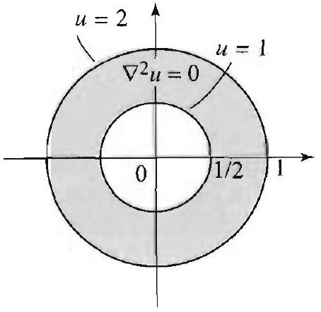

### 12.4 Laplace's Equation in Circular Regions

The steady-state (or time independent) temperature distribution in a circular plate of radius $a$, with prescribed temperature at the boundary, satisfies the two-dimensional Laplace equation (in polar coordinates):

$$
\nabla^{2} u=\frac{\partial^{2} u}{\partial r^{2}}+\frac{1}{r} \frac{\partial u}{\partial r}+\frac{1}{r^{2}} \frac{\partial^{2} u}{\partial \theta^{2}}=0, \quad 0<r<a, 0<\theta<2 \pi
$$

and the boundary condition

$$
u(a, \theta)=f(\theta), \quad 0<\theta<2 \pi
$$

(Note that $f$ is necessarily $2 \pi$-periodic.) Equations (1) and (2) describe a Dirichlet problem over a disk of radius $a$. We have solved this kind of
problems over a rectangle in Section 3.8. Problems over other regions, such as a cylinder or a sphere, will be studied in the following sections and in Chapter 5.

Following the method of separation of variables, we will look for product solutions of (1) of the form $u(r, \theta)=R(r) \Theta(\theta)$. Plugging this into (1) and simplifying, we obtain

$$
\begin{array}{cl}
R^{\prime \prime} \Theta+\frac{1}{r} R^{\prime} \Theta+\frac{1}{r^{2}} R \Theta^{\prime \prime}=0 & \text { (Plug into (1).) } \\
r^{2} \frac{R^{\prime \prime}}{R}+r \frac{R^{\prime}}{R}+\frac{\Theta^{\prime \prime}}{\Theta}=0 & \text { (Multiply by } r^{2} \\
\left.r^{2} \frac{R^{\prime \prime}}{R}+r \frac{R^{\prime}}{R}=\lambda \text { and } \quad \frac{\Theta^{\prime \prime}}{\Theta}=-\lambda \quad \text { (Separation constant } \lambda .\right) \\
r^{2} R^{\prime \prime}+r R^{\prime}-\lambda R=0 \text { and } \quad \Theta^{\prime \prime}+\lambda \Theta=0 \quad \text { (Simplify.) }
\end{array}
$$

Recall that $\Theta$ is necessarily $2 \pi$-periodic. From our knowledge of the solutions of the equation $\Theta^{\prime \prime}+\lambda \Theta=0$, we conclude that $\lambda=n^{2}(n=0,1,2 \ldots)$, in order to get $2 \pi$-periodic functions in $\theta$. Thus the separated equations become

$$
\begin{gathered}
r^{2} R^{\prime \prime}+r R^{\prime}-n^{2} R=0 \\
\Theta^{\prime \prime}+n^{2} \Theta=0
\end{gathered}
$$

We have the $2 \pi$-periodic solutions

$$
\Theta=\Theta_{n}=a_{n} \cos n \theta+b_{n} \sin n \theta, n=0,1,2, \ldots .
$$

Recall from Appendix A.3, Euler's equation
$x^{2} y^{\prime \prime}+\alpha x y^{\prime}+\beta y=0$,
with indicial equation
$\rho^{2}+(\alpha-1) \rho+\beta=0$
and indicial roots $\rho_{1}$ and $\rho_{2}$.
If $\rho_{1} \neq \rho_{2}$, the general solution is
$y=c_{1} x^{\rho_{1}}+c_{2} x^{\rho_{2}}$.
If $\rho_{1}=\rho_{2}$, the general solution is
$y=c_{1} x^{\rho_{1}}+c_{2} x^{\rho_{1}} \ln x$.

We recognize the equation for $R$ as an Euler equation. Appealing to results from Appendix A.3, we find that the indicial roots are $\pm n$, and hence the solutions
and

$$
R(r)=c_{1}+c_{2} \ln \left(\frac{r}{a}\right), \quad n=0
$$

For the Dirichlet problem in the disk, the solution should remain bounded at 0 . So we take $c_{2}=0$, since $\left(\frac{r}{a}\right)^{-n}$ and $\ln \left(\frac{r}{a}\right)$ are not bounded when $r=0$. (Other choices of the constant will be needed in Dirichlet problem outside a disk or on an annular region. See Exercises 12, 21, and 24.) We thus arrive at the product solutions

$$
u_{0}(r, \theta)=a_{0} \quad \text { and } \quad u_{n}(r, \theta)=\left(\frac{r}{a}\right)^{n}\left(a_{n} \cos n \theta+b_{n} \sin n \theta\right), n=1,2, \ldots
$$

## SOLUTION OF THE DIRICHLET PROBLEM ON THE DISK

Figure 1 A Dirichlet problem.

Superposing these solutions, we get

$$
u(r, \theta)=a_{0}+\sum_{n=1}^{\infty}\left(\frac{r}{a}\right)^{n}\left[a_{n} \cos n \theta+b_{n} \sin n \theta\right] .
$$

As we now show, the unknown coefficients $a_{0}, a_{n}, b_{n}$ are precisely the Fourier coefficients of the boundary function $f(\theta)$.

The solution of Laplace's equation (1) satisfying the prescribed boundary condition (2) is given by (4), where $a_{0}, a_{n}, b_{n}$ are the Fourier coefficients of the $2 \pi$-periodic function $f(\theta)$ :

$$
a_{0}=\frac{1}{2 \pi} \int_{0}^{2 \pi} f(\theta) d \theta
$$

(5)

$$
a_{n}=\frac{1}{\pi} \int_{0}^{2 \pi} f(\theta) \cos n \theta d \theta, \quad b_{n}=\frac{1}{\pi} \int_{0}^{2 \pi} f(\theta) \sin n \theta d \theta
$$

$n=1,2, \ldots$.
Proof Putting $r=a$ in (4) and using (2) we get

$$
f(\theta)=u(a, \theta)=a_{0}+\sum_{n=1}^{\infty}\left(a_{n} \cos n \theta+b_{n} \sin n \theta\right)
$$

This is clearly the Fourier series representation of $f$, and hence the coefficients are given by the Euler formulas (Section 2.2).

Since (4) gives the steady-state temperature of the points inside the disk, by taking $r=0$ in (4), we get $a_{0}$ as the temperature of the center. Now

$$
a_{0}=\frac{1}{2 \pi} \int_{0}^{2 \pi} f(\theta) d \theta
$$

which shows that the temperature of the center is equal to the average value of the temperature on the boundary.

## EXAMPLE 1 A Dirichlet problem on the disk

Find the steady-state temperature distribution in a disk of radius 1 if the upper half of the circumference is kept at $100^{\circ}$ and the lower half is kept at $0^{\circ}$.
Solution The boundary values are described by the function

$$
u(1, \theta)=f(\theta)= \begin{cases}100 & \text { if } 0<\theta<\pi, \\ 0 & \text { if } \pi<\theta<2 \pi .\end{cases}
$$

Substituting in (5), we get

$$
a_{0}=\frac{1}{2 \pi} \int_{0}^{\pi} 100 d \theta=50, \quad a_{n}=\frac{1}{\pi} \int_{0}^{\pi} 100 \cos n \theta d \theta=0
$$

Figure 2 Fourier series of $f(\theta)$.

and

$$
b_{n}=\frac{1}{\pi} \int_{0}^{\pi} 100 \sin n \theta d \theta=\frac{100}{n \pi}[1-\cos n \pi]
$$

Substituting in (4) we find the solution

$$
u(r, \theta)=50+\frac{100}{\pi} \sum_{n=1}^{\infty} \frac{1}{n}(1-\cos n \pi) r^{n} \sin n \theta
$$

Setting $r=0$, we see that the temperature of the center is $50^{\circ}$, which corresponds to the average of the temperature on the boundary of the disk.

On the boundary of the disk, when $r=1$, the series becomes

$$
u(1, \theta)=50+\frac{200}{\pi} \sum_{k=0}^{\infty} \frac{1}{(2 k+1)} \sin (2 k+1) \theta
$$

According to the given boundary values, this series should represent the function $f(\theta)$. In fact, this is the Fourier series of $f(\theta)$. Some of its partial sums are plotted in Figure 2.

In many interesting situations, the series solution of the Dirichlet problem can be computed in closed form with the help of the formula

$$
\sum_{n=1}^{\infty} r^{n} \frac{\sin n \theta}{n}=\tan ^{-1}\left(\frac{r \sin \theta}{1-r \cos \theta}\right)
$$

which is valid for $0<r<1$, and all $\theta$. A derivation of this formula, using the complex logarithm, is presented in Exercise 19. We can give an indirect proof based on the uniqueness property of the solution of the Dirichlet problem (1)-(2). Properties of this nature were discussed and proved in Section 3.10 for the Dirichlet problem in a rectangle. To prove (6), it is enough to show that the left and the right sides are solutions of the same Dirichlet problem. Indeed, we will show that they satisfy ( 1 ), with $a=1$, and ( 2 ) with $f(\theta)= \frac{1}{2}(\pi-\theta), 0<\theta<2 \pi$. To verify the assertion for the left side of (6), it suffices to use (4) and the fact that the Fourier series of $f(\theta)$ is $\sum_{n=1}^{\infty} \frac{\sin n \theta}{n}$. To verify the assertion for the right side of (6), let $u(r, \theta)=\tan ^{-1}\left(\frac{r \sin \theta}{1-r \cos \theta}\right)$. We must show that $\nabla^{2} u=0$ and $u(1, \theta)=\frac{1}{2}(\pi-\theta)$. The first part is straightforward and is left to Exercise 6. For the second part, we have

$$
\begin{aligned}
u(1, \theta) & =\tan ^{-1}\left(\frac{\sin \theta}{1-\cos \theta}\right) \\
& =\tan ^{-1}\left(\frac{\cos \frac{\theta}{2}}{\sin \frac{\theta}{2}}\right) \quad\left(\sin \theta=2 \cos \frac{\theta}{2} \sin \frac{\theta}{2} ; 1-\cos \theta=2 \sin ^{2} \frac{\theta}{2}\right) \\
& =\tan ^{-1} \cot \left(\frac{\theta}{2}\right)=\frac{\pi}{2}-\frac{\theta}{2}
\end{aligned}
$$

which completes the proof of (6).

## EXAMPLE 2 Converting to Cartesian coordinates

Show that in Cartesian coordinates the steady-state solution in Example 1 is

$$
u(x, y)=50+\frac{100}{\pi}\left[\tan ^{-1}\left(\frac{y}{1-x}\right)+\tan ^{-1}\left(\frac{y}{1+x}\right)\right],
$$

for $x^{2}+y^{2}<1$.
Solution We start by rewriting the solution of Example 1 as

$$
\begin{aligned}
u(r, \theta) & =50+\frac{100}{\pi} \sum_{n=1}^{\infty} \frac{1}{n}(1-\cos n \pi) r^{n} \sin n \theta \\
& =50+\frac{100}{\pi} \sum_{n=1}^{\infty} \frac{\sin n \theta}{n} r^{n}-\frac{100}{\pi} \sum_{n=1}^{\infty} \frac{\cos n \pi}{n} r^{n} \sin n \theta
\end{aligned}
$$

Noting that $\cos n \pi \sin n \theta=\sin n(\theta-\pi)$ and using (6), we get

$$
u(r, \theta)=50+\frac{100}{\pi} \tan ^{-1}\left(\frac{r \sin \theta}{1-r \cos \theta}\right)-\frac{100}{\pi} \tan ^{-1}\left(\frac{r \sin (\theta-\pi)}{1-r \cos (\theta-\pi)}\right) .
$$

We now use the identities $\sin (\theta-\pi)=-\sin \theta ; \cos (\theta-\pi)=-\cos \theta ; \tan ^{-1}(-x)= -\tan ^{-1} x$, and get

$$
u(r, \theta)=50+\frac{100}{\pi}\left[\tan ^{-1}\left(\frac{r \sin \theta}{1-r \cos \theta}\right)+\tan ^{-1}\left(\frac{r \sin \theta}{1+r \cos \theta}\right)\right] .
$$

Passing to rectangular coordinates by using $x=r \cos \theta, y=r \sin \theta$, we get (7). $\square$

When dealing with steady-state problems, we are often interested in determining the points with the same temperature. These points lie on curves called isotherms. We illustrate this notion by finding the isotherms of the solution in Example 1.

## EXAMPLE 3 Isotherms or curves of constant temperature

Two extreme isotherms are easy to guess in Example 1: The upper semicircle corresponds to the temperature $100^{\circ}$, and the lower semicircle corresponds to the temperature $0^{\circ}$. The temperature of all other isotherms is clearly between these two values. Let $0<T<100$. Our goal is to determine the points ( $x, y$ ) such that $u(x, y)=T$. Setting the right side of (7) equal to $T$ and simplifying, we get

$$
\frac{\pi(T-50)}{100}=\tan ^{-1}\left(\frac{y}{1-x}\right)+\tan ^{-1}\left(\frac{y}{1+x}\right) .
$$

When $T=50$, the left side equals 0 , and the solution in this case is $y=0$ ( $x$ is arbitrary). This corresponds to the set of points on the $x$-axis. Intuitively this answer is clear. Do you see why? For $T \neq 50$, apply the tangent to both sides of (8), use the identity

$$
\tan (a+b)=\frac{\tan a+\tan b}{1-\tan a \tan b},
$$

The larger circle in Figure 3(a) determines the isotherm $u(r, \theta)=30$ in the unit disk. It is centered at $\left(0, \tan \left(\frac{3 \pi}{10}\right)\right)$ with radius $\sec \left(\frac{3 \pi}{10}\right)$. We have $\tan \left(\frac{3 \pi}{10}\right)=$

$$
\frac{1+\sqrt{5}}{\sqrt{2}(5-\sqrt{5})} \approx 1.38
$$

and

$$
\sec \left(\frac{3 \pi}{10}\right) \approx 1.7
$$

Figure 3(b) shows various isotherms inside the unit disk.

Figure 3(a)

Figure 3(b)

and get

$$
\frac{\left(\frac{y}{1-x}\right)+\left(\frac{y}{1+x}\right)}{1-\left(\frac{y}{1-x}\right)\left(\frac{y}{1+x}\right)}=\tan \left(\frac{\pi T}{100}-\frac{\pi}{2}\right)=-\cot \left(\frac{\pi T}{100}\right) .
$$

Straightforward manipulations lead to

$$
x^{2}+y^{2}-1-2 y \tan \left(\frac{\pi T}{100}\right)=0
$$

Completing the square yields

$$
x^{2}+\left[y-\tan \left(\frac{\pi T}{100}\right)\right]^{2}=1+\tan ^{2}\left(\frac{\pi T}{100}\right)
$$

Hence the isotherm corresponding to the value $T$ consists of the arc of the circle with center $\left(0, \tan \left(\frac{\pi T}{100}\right)\right)$ and radius $\sqrt{1+\tan ^{2}\left(\frac{\pi T}{100}\right)}=\left|\sec \frac{\pi T}{100}\right|$. Figure 3(a) shows the isotherm $T=30$. Figure 3(b) shows various other isotherms.

## Varying the Region and the Boundary Conditions

We can use the methods of this section to solve problems over planar regions other than disks. These are regions that are conveniently described in polar coordinates, such as a wedge, an annulus, or a region outside a circle. Furthermore, we can vary the boundary conditions and consider Neumann and Robin conditions. Recall that these are linear conditions that involve the function $u$ and its normal derivative on the boundary. In polar coordinates, the normal derivative of $u$ at points lying on a circle centered at the origin

Figure 4 The normal derivative of $u, \frac{\partial u}{\partial n}$, is $\frac{\partial u}{\partial r}$.

Figure 5 The wedge shaped region bounded by the rays $\theta=0$ and $\theta=\alpha$, and the circle $r=1$.

is simply the partial derivative of $u$ with respect to $r$ (Figure 4). Thus for a boundary lying on a circle centered at the origin, a Neumann condition specifies $u_{r}(r, \theta)$; and a Robin condition specifies $u_{r}(r, \theta)+a(\theta) u(r, \theta)$, where $a$ is a function of $\theta$. The following example illustrates how we can solve such problems.

## EXAMPLE 4 A Robin condition on a wedge

Solve Laplace's equation (1) over the wedge region in Figure 5, supplied with the boundary conditions: for $0<r<1$ and $0<\theta<\alpha$,

$$
u(r, 0)=0, \quad u(r, \alpha)=0, \quad \frac{\partial}{\partial r} u(1, \theta)=-u(1, \theta)-\theta .
$$

The boundary conditions represent a wedge whose sides along the rays $\theta=0$ and $\theta=\alpha$ are kept at 0 temperature, and the wedge is exchanging heat along its circular boundary at a rate given by the Robin condition $u_{r}(1, \theta)=-u(1, \theta)-\theta$. Presumably, the insulation of the wedge along the circular boundary is better for smaller values of $\theta$, since the rate of heat loss is smaller for $\theta$ near 0 .

Solution Before we proceed with the solution, note how the points ( $r, \theta$ ) in the wedge region are conveniently described in polar coordinates by the inequalities $0<r<1$ and $0<\theta<\alpha$. Applying the method of separation of variables as we did at the outset of this section, we arrive at the equations

$$
\begin{gathered}
\Theta^{\prime \prime}+\lambda \Theta=0, \quad \Theta(0)=0, \Theta(\alpha)=0 \\
r^{2} R^{\prime \prime}+r R^{\prime}-\lambda R=0
\end{gathered}
$$

where $\lambda$ is a separation constant. We have new conditions on $\Theta$, which follow from the boundary conditions $u(r, 0)=0$ and $u(r, \alpha)=0$. For example, from $u(r, \alpha)=0$, we get $R(r) \Theta(\alpha)=0$, and so $\Theta(\alpha)=0$. The initial value problem in $\theta$ is different from the one that we encountered at the beginning of this section, but it is a familiar problem that we solved in Section 3.3, with the variable $x$ instead of $\theta$. The nonzero solutions are

$$
\Theta_{n}(\theta)=\sin \frac{n \pi}{\alpha} \theta \quad(n=1,2, \ldots),
$$

and these correspond to the separation constants $\lambda=\left(\frac{n \pi}{\alpha}\right)^{2}$. Plugging the value of $\lambda$ into the radial equation yields the Euler equation

$$
r^{2} R^{\prime \prime}+r R^{\prime}-\left(\frac{n \pi}{\alpha}\right)^{2} R=0 .
$$

The indicial equation for this Euler equation is $\rho^{2}-\left(\frac{n \pi}{\alpha}\right)^{2}=0$, with roots $\rho= \pm \frac{n \pi}{\alpha}$. Hence, the bounded solutions for $0 \leq r<a$ are constant multiples of $R(r)= R_{n}(r)=r^{\frac{n \pi}{\alpha}}$. We thus have the product solutions

$$
b_{n} r^{\frac{n \pi}{\alpha}} \sin \frac{n \pi}{\alpha} \theta,
$$

and the superposition principle leads us to the following form of the solution:

$$
u(r, \theta)=\sum_{n=1}^{\infty} b_{n} r^{\frac{n \pi}{\alpha}} \sin \frac{n \pi}{\alpha} \theta, \quad 0<r<1,0<\theta<\alpha .
$$

You should check at this point that this solution satisfies the boundary conditions $u(r, 0)=0$ and $u(r, \alpha)=0$ for all choices of $b_{n}$. Next, we determine $b_{n}$ so as to satisfy the given Robin condition. Setting $r=1$ in $u(r, \theta)$, we obtain $u(1, \theta)= \sum_{n=1}^{\infty} b_{n} \sin \frac{n \pi}{\alpha} \theta$. Differentiating $u(r, \theta)$ with respect to $r$ and then setting $r=1$, we obtain

$$
\begin{aligned}
u_{r}(1, \theta) & =\left.\frac{\partial}{\partial r}\left(\sum_{n=1}^{\infty} b_{n} r^{\frac{n \pi}{\alpha}} \sin \left(\frac{n \pi}{\alpha} \theta\right)\right)\right|_{r=1} \\
& =\left.\sum_{n=1}^{\infty} b_{n} \sin \left(\frac{n \pi}{\alpha} \theta\right) \frac{\partial}{\partial r}\left(r^{\frac{n \pi}{\alpha}}\right)\right|_{r=1} \\
& =\sum_{n=1}^{\infty} \frac{n \pi}{\alpha} b_{n} \sin \left(\frac{n \pi}{\alpha} \theta\right) .
\end{aligned}
$$

The condition $u_{r}(1, \theta)=-u(1, \theta)-\theta$ implies that, for all $0<\theta<\alpha$,

$$
\sum_{n=1}^{\infty} \frac{n \pi}{\alpha} b_{n} \sin \left(\frac{n \pi}{\alpha} \theta\right)=-\sum_{n=1}^{\infty} b_{n} \sin \left(\frac{n \pi}{\alpha} \theta\right)-\theta ;
$$

equivalently,

$$
-\theta=\sum_{n=1}^{\infty} b_{n}\left(1+\frac{n \pi}{\alpha}\right) \sin \frac{n \pi}{\alpha} \theta, \quad 0<\theta<\alpha .
$$

We recognize this as the half-range sine Fourier series expansion of the function $f(\theta)=-\theta$ on the interval $(0, \alpha)$, where $b_{n}\left(1+\frac{n \pi}{\alpha}\right)$ is the $n$th sine coefficient:

$$
\begin{aligned}
b_{n}\left(1+\frac{n \pi}{\alpha}\right) & =-\frac{2}{\alpha} \int_{0}^{\alpha} \theta \sin \frac{n \pi}{\alpha} \theta d \theta \\
& =-\frac{2}{\alpha}\left[-\left.\theta\left(\frac{\alpha}{n \pi}\right) \cos \frac{n \pi}{\alpha} \theta\right|_{0} ^{\alpha}+\frac{\alpha}{n \pi} \int_{0}^{\alpha} \cos \frac{n \pi}{\alpha} \theta d \theta\right] \\
& =\frac{2 \alpha(-1)^{n}}{n \pi}
\end{aligned}
$$

Solving for $b_{n}$ and substituting into (9), we get the solution

$$
u(r, \theta)=\frac{2 \alpha^{2}}{\pi} \sum_{n=1}^{\infty} \frac{(-1)^{n}}{n(\alpha+n \pi)} r^{\frac{n \pi}{\alpha}} \sin \frac{n \pi}{\alpha} \theta, \quad 0<r<1,0<\theta<\alpha
$$

## Exercises 4.4

In Exercises 1-5, solve the Dirichlet problem on the unit disk for the given boundary values.

1. $f(\theta)=\cos \theta$.
2. $f(\theta)=\sin 2 \theta$.
3. $f(\theta)=\frac{1}{2}(\pi-\theta), 0<\theta<2 \pi$.
4. $f(\theta)= \begin{cases}\pi-\theta & \text { if } 0 \leq \theta \leq \pi, \\ 0 & \text { if } \pi \leq \theta<2 \pi .\end{cases}$
5. $f(\theta)= \begin{cases}100 & \text { if } 0 \leq \theta \leq \pi / 4, \\ 0 & \text { if } \pi / 4<\theta<2 \pi .\end{cases}$
6. Verify that

$$
u(r, \theta)=\tan ^{-1}\left(\frac{r \sin \theta}{1-r \cos \theta}\right)
$$

Figure 6 for Exercise 12(b).

is a solution of (1). [Hint: Change to Cartesian coordinates.]
7. Determine the isotherms in Exercise 3.
8. Show that the isotherms in Exercise 1 lie on vertical lines.
9. Show that the isotherms in Exercise 2 lie on branches of hyperbolas centered at the origin.
10. (a) Solve the Dirichlet problem

$$
\begin{aligned}
& \nabla^{2} u(r, \theta)=0, \quad 0<r<1,0<\theta<2 \pi, \\
& u(1, \theta)=1+\sin 2 \theta .
\end{aligned}
$$

(b) Determine the isotherms. [Hint: $\sin 2 \theta=2 \sin \theta \cos \theta$.]
11. Independence of $r$. (a) Suppose that $u(r, \theta)$ is a solution of Laplace's equation that does not depend on $r$. Show that $u(r, \theta)=a \theta+b$ where $a$ and $b$ are constants.
(b) Determine $a$ and $b$ in order for $u(r, \theta)$ to be a solution of Laplace's equation in the wedge $0<r<1,0<\theta<\alpha$, with the boundary conditions $u=T_{1}$ when $\theta=0$ and $u=T_{2}$ when $\theta=\alpha$. What are the values of $u$ on the circular boundary of the wedge, when $r=1$ ?
12. Independence of $\theta$. (a) Suppose that $u(r, \theta)$ is a solution of Laplace's equation that does not depend on $\theta$. Show that $u(r \theta)=a \ln r+b$ where $a$ and $b$ are constants.
(b) Find a solution of Laplace's equation in the annulus in Figure 6 satisfying $u=1$ when $r=\frac{1}{2}$ and $u=2$ when $r=1$.
13. Solve Laplace's equation in the wedge $0<r<1,0<\theta<\frac{\pi}{4}$, subject to the boundary conditions $u=0$ when $\theta=0, u=0$ when $\theta=\frac{\pi}{4}$, and $\frac{\partial u}{\partial r}(\theta, 1)=\sin \theta$.
14. Solve Laplace's equation in the wedge $0<r<1,0<\theta<\frac{\pi}{2}$, subject to the boundary $u=0$ when $\theta=0, u=0$ when $\theta=\frac{\pi}{2}$, and $\frac{\partial u}{\partial r}(\theta, 1)=\theta$.
15. Consider the problem in the wedge in Figure 7(a). Show that this problem can be decomposed into two subproblems as indicated in Figure 7. That is, show that if $u_{1}$ is a solution of the problem in Figure 7(b) and $u_{2}$ is a solution of the problem in Figure 7(c), then $u=u_{1}+u_{2}$ is a solution of the problem in Figure 7(a).

Figure 7

16. Consider the problem in the wedge in Figure 7(a). Take $\alpha=\frac{\pi}{4}$ and solve the problem subject to the conditions $u=0$ when $\theta=0, u=1$ when $\theta=\frac{\pi}{4}$, and $u(1, \theta)=3 \sin 4 \theta$. [Hint: For the problem in Figure 7(b), see Exercise 11.]

Figure 8 for Exercise 21.

17. A Neumann problem on the disk. Solve the Neumann problem $\nabla^{2} u=0$ for $0 \leq r<a$ with boundary condition $u_{r}(a, \theta)=f(\theta)$, where $f(\theta)$ determines the normal derivative on the circle $r=a$. For this problem to have a solution, we require the compatibility condition

$$
\int_{0}^{2 \pi} f(\theta) d \theta=0
$$

Explain why this condition is necessary for your solution.
18. A Robin condition. Solve Laplace's equation on the unit disk, subject to the Robin condition $u_{r}(1, \theta)+2 u(1, \theta)=100-2 \cos 2 \theta$.
19. A proof of (6). Let $z$ be a complex number with $|z|<1$. Write $z=r e^{i \theta}= r(\cos \theta+i \sin \theta)$. Consider the series expansion

$$
\log \left[(1-z)^{-1}\right]=z+\frac{1}{2} z^{2}+\frac{1}{3} z^{3}+\cdots
$$

which is valid for $|z|<1$. Compute the imaginary part of this series and derive (6). [Hint: Recall that if $w=r e^{i \theta}=x+i y$, with $-\pi<\theta<\pi$, then $\operatorname{Re}(\log (w))=\ln r$, and $\operatorname{Im}(\log (w))=\theta=\tan ^{-1} \frac{y}{x}$.]
20. Further identities. Taking real and imaginary parts in the series expansion

$$
\log (1+z)=\sum_{n=1}^{\infty}(-1)^{n+1} \frac{z^{n}}{n}, \quad|z|<1
$$

derive the identities: for $0 \leq r<1,0<\theta<2 \pi$,

$$
\begin{array}{r}
\sum_{n=1}^{\infty}(-1)^{n+1} \frac{\sin n \theta}{n} r^{n}=\tan ^{-1}\left(\frac{r \sin \theta}{1+r \cos \theta}\right) \\
\sum_{n=1}^{\infty}(-1)^{n+1} \frac{\cos n \theta}{n} r^{n}=\frac{1}{2} \ln \left(1+2 r \cos \theta+r^{2}\right)
\end{array}
$$

21. Dirichlet problem outside a disk. Show that the bounded solution of the Dirichlet problem outside the disk $r=a$ (Figure 8) is given by the series

$$
u(r, \theta)=a_{0}+\sum_{n=1}^{\infty}\left(\frac{a}{r}\right)^{n}\left(a_{n} \cos n \theta+b_{n} \sin n \theta\right), \quad r>a
$$

where the coefficients are given by (5). [Hint: Proceed as in the solution of the Dirichlet problem inside the disk. Choose the bounded solutions from (3).]
22. Solve the Dirichlet problem outside the unit disk with boundary values as in Example 1. What are the isotherms in this case?
23. (a) Solve the Dirichlet problem outside the unit disk with boundary values as in Exercise 5.
(b) Show that the isotherms are circles passing through the points $(1,0)$ and $\left(\frac{1}{\sqrt{2}}, \frac{1}{\sqrt{2}}\right)$.

Figure 9 for Exercise 24.

## 24. Project Problem: Dirichlet problems on annular regions.

(a) Show that the steady-state solution in the annular region shown in Figure 9 is

$$
u(r, \theta)=a_{0} \frac{\ln r-\ln R_{2}}{\ln R_{1}-\ln R_{2}}+\sum_{n=1}^{\infty}\left[a_{n} \cos n \theta+b_{n} \sin n \theta\right]\left(\frac{R_{1}}{r}\right)^{n}\left(\frac{R_{2}^{2 n}-r^{2 n}}{R_{2}^{2 n}-R_{1}^{2 n}}\right),
$$

( $R_{1}<r<R_{2}$ ) where $a_{0}, a_{n}$, and $b_{n}$ are the Fourier coefficients of $f_{1}(\theta)$. [Hint: Proceed as in the solution derived in this section, and use the condition $R\left(R_{2}\right)=0$.]
(b) What is the steady-state solution if the boundary conditions are $u\left(R_{1}, \theta\right)=0$, and $u\left(R_{2}, \theta\right)=f_{2}(\theta)$, for all $\theta$ ?
(c) Combine (a) and (b) to find the steady-state solution in the annular region given that $u\left(R_{1}, \theta\right)=f_{1}(\theta)$, and $u\left(R_{2}, \theta\right)=f_{2}(\theta)$ for all $\theta$.
25. Project Problem: Two dimensional heat equation with a nonhomogeneous boundary condition. Show that the solution of the two dimensional heat equation

$$
u_{t}=c^{2}\left(\frac{\partial^{2} u}{\partial r^{2}}+\frac{1}{r} \frac{\partial u}{\partial r}+\frac{1}{r^{2}} \frac{\partial^{2} u}{\partial \theta^{2}}\right), \quad 0<r<a, 0<\theta<2 \pi, t>0,
$$

subject to the nonhomogeneous boundary condition

$$
u(\alpha, \theta, t)=G(\theta), \quad 0<\theta<2 \pi, t>0,
$$

and the initial condition

$$
u(r, \theta, 0)=F(r, \theta), \quad 0<\theta<2 \pi, 0 \leq r<a,
$$

is

$$
\begin{aligned}
u(r, \theta, t)= & a_{0}+\sum_{m=1}^{\infty}\left[a_{m} \cos m \theta+b_{m} \sin m \theta\right]\left(\frac{r}{a}\right)^{m} \\
& +\sum_{m=0}^{\infty} \sum_{n=1}^{\infty} J_{m}\left(\lambda_{m n} r\right)\left(a_{m n} \cos m \theta+b_{m n} \sin m \theta\right) e^{-c^{2} \lambda_{m n}^{2} t}
\end{aligned}
$$

where the coefficients $a_{0}, a_{m}, b_{m}$ are the Fourier coefficients of the $2 \pi$-periodic function $G(\theta) ; \lambda_{m n}=\frac{\alpha_{m n}}{a}$ where $\alpha_{m n}$ is the $n$th positive zero of the Bessel function of order $m, J_{m}$; and $a_{m n}, b_{m n}$ are given by (12)-(14) of Section 12.3 with $f(r, \theta)= F(r, \theta)-u_{1}(r, \theta)$, where $u_{1}$ represents the steady-state solution. [Hint: Consider two separate problems. First problem (steady-state solution): $\nabla^{2} u_{1}=0,0<r<a, \theta$ arbitrary, subject to the boundary condition $u_{1}(a, \theta)=G(\theta)$ for all $\theta$. Second problem: $v_{t}=c^{2} \nabla^{2} v, 0<r<a, \theta$ arbitrary, and $t>0$, subject to the boundary condition $v(a, \theta, t)=0$ for all $\theta$ and $t>0$, and the initial condition $v(r, \theta, 0)= F(r, \theta)-u_{1}(r, \theta)$ for all $\theta$ and $0 \leq r<a$. Combine the solution of the Dirichlet problem with that of Exercise 11, Section 12.3.]
26. A circular plate of radius 1 was placed in a freezer and its temperature was brought to $0^{\circ}$. The plate was then insulated and removed from the freezer. The edge of the plate was kept at a temperature varying from $0^{\circ}$ to $100^{\circ}$ according to the formula $f(\theta)=50(1-\cos \theta), 0 \leq \theta \leq 2 \pi$.
(a) Plot the temperature of the boundary as a function of $\theta$, and find its Fourier
series.
(b) Find the steady-state temperature,
(c) Plot the steady-state temperature and from your graph determine the points of the plate with temperature $0^{\circ}$, respectively, $100^{\circ}$.
(d) Determine and plot the isotherms. Confirm your answer in (c).
(e) Solve the heat problem in the plate given that the thermal conductivity $c=1$ and given that the initial temperature distribution is $0^{\circ}$.
(f) Plot the temperature distribution at various values of $t>0$ and estimate the time it takes to raise the temperature of the center to $25^{\circ}$. What is the limiting value of the temperature of the center? Verify your answer using (b).
27. (a) Solve the heat problem in Exercise 26 for the following data: $a=c=$ 1, $F(r, \theta)=\left(1-r^{2}\right) r \sin \theta, G(\theta)=\sin 2 \theta$ for $0<\theta<2 \pi$. [Hint: See Example 2, Section 12.3.]
(b) What is the steady-state solution in this case?
(c) Plot the solution for several values of $t$ and compare with the graph of your answer in (b).
Project Problem: Poisson integral formula on a disk. This important formula expresses the solution of the Dirichlet problem (4) in terms of an integral involving the boundary data function. Derive this formula following the steps outlined in Exercises 28 and 29.
28. The Poisson kernel. Let $z=r e^{i \theta}$, and consider the power series

$$
\frac{1}{1-z}=\sum_{n=0}^{\infty} z^{n}, \quad|z|<1
$$

(a) Show that

$$
1+2 \operatorname{Re}\left(\frac{1}{1-z}-1\right)=1+2 \sum_{n=1}^{\infty} r^{n} \cos n \theta, \quad 0<r<1, \text { all } \theta
$$

(b) Obtain the identity

$$
1+2 \sum_{n=1}^{\infty} r^{n} \cos n \theta=\frac{1-r^{2}}{1-2 r \cos \theta+r^{2}}, \quad 0<r<1, \text { all } \theta
$$

The function $P(r, \theta)=\frac{1-r^{2}}{1-2 r \cos \theta+r^{2}}$ is known as the Poisson kernel on the disk. It plays an important role in the theory of partial differential equations, complex and harmonic analysis.
29. Poisson integral formula on the disk. In this exercise we derive the integral form of the solution (4) of the Dirichlet problem (1)-(2), known as the Poisson integral formula: for $0<r<a$, and all $\theta$,

$$
\begin{aligned}
u(r, \theta) & =\frac{1}{2 \pi} \int_{0}^{2 \pi} f(\phi) P\left(\frac{r}{a}, \theta-\phi\right) d \phi \\
& =\frac{1}{2 \pi} \int_{0}^{2 \pi} f(\phi) \frac{a^{2}-r^{2}}{a^{2}-2 a r \cos (\theta-\phi)+r^{2}} d \phi
\end{aligned}
$$

Thus this formula is an alternative way of writing the series solution (4). (a) Substitute the coefficients (5) in the series solution (4) and obtain

$$
u(r, \theta)=\frac{1}{2 \pi} \int_{0}^{2 \pi} f(\phi)\left\{1+2 \sum_{n=1}^{\infty} \cos [n(\theta-\phi)]\left(\frac{r}{a}\right)^{n}\right\} d \phi
$$

[Hint: Before you do the substitution, replace the dummy variable $\theta$ in (5) by $\phi$.] (b) Derive the Poisson formula using (a) and Exercise 28.
