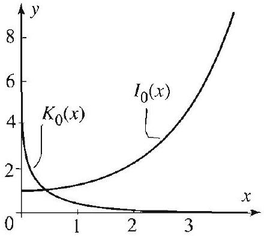
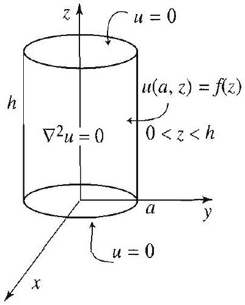
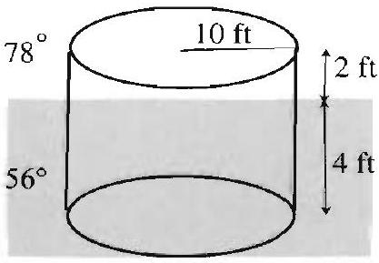

### 12.5 Laplace's Equation in a Cylinder

Figure 1
DIRICHLET PROBLEM IN A CYLINDER WITH ZERO LATERAL TEMPERATURE

In this section we treat certain radially symmetric Dirichlet problems in cylindrical regions. In cylindrical coordinates, Laplace's equation, with no $\phi$ dependence, is

$$
\nabla^{2} u=\frac{\partial^{2} u}{\partial \rho^{2}}+\frac{1}{\rho} \frac{\partial u}{\partial \rho}+\frac{\partial^{2} u}{\partial z^{2}}=0
$$

(See (4), Section 12.1.) The first problem that we will consider models the steady-state temperature distribution inside a cylinder with lateral surface and bottom kept at zero temperature and with radially symmetric temperature distribution at the top, as shown in Figure 1.

The solution of Laplace's equation (1) with boundary conditions

$$
\begin{array}{r}
u(\rho, 0)=0, \quad 0<\rho<a \\
u(a, z)=0, \quad 0<z<h \\
u(\rho, h)=f(\rho), \quad 0<\rho<a
\end{array}
$$

is

$$
u(\rho, z)=\sum_{n=1}^{\infty} A_{n} J_{0}\left(\lambda_{n} \rho\right) \sinh \lambda_{n} z
$$

where

$$
A_{n}=\frac{2}{\sinh \left(\lambda_{n} h\right) a^{2} J_{1}^{2}\left(\alpha_{n}\right)} \int_{0}^{a} f(\rho) J_{0}\left(\lambda_{n} \rho\right) \rho d \rho, \quad \lambda_{n}=\frac{\alpha_{n}}{a}
$$

and $\alpha_{n}$ is the $n$th positive zero of $J_{0}$, the Bessel function of order 0 .
Proof Using the method of separation of variables and setting $u(\rho, z)=R(\rho) Z(z)$, we get the equations $\rho^{2} R^{\prime \prime}+\rho R^{\prime}-k \rho^{2} R=0, R(a)=0$, and $Z^{\prime \prime}+k Z=0$, $Z(0)=0$, where $k$ is the separation constant. We also require that $R$ be bounded

Figure 2 Modified Bessel functions.

Figure 3

DIRICHLET PROBLEM IN A CYLINDER WITH NONZERO LATERAL TEMPERATURE
at $\rho=0$, since we are solving for the temperature inside the cylinder. If $k=0$, it is straightforward to check that we only get the solution $R=0$. If $k>0$, say $k=\lambda^{2}$, then we get the parametric form of the modified Bessel equation of order 0 defined in Exercise 7 (see also Exercises 29 and 30, Section 12.7). The general solution in this case is a linear combination of the modified Bessel functions of the first and second kind, $I_{0}$ and $K_{0}$, shown in Figure 2 (see Exercise 7). Since the first one is positive and strictly increasing for $\rho>0$, and the second one is unbounded near zero, we conclude that no nontrivial bounded linear combination of these functions can satisfy the boundary conditions on $R$. So this leaves the only possibility $k=-\lambda^{2}<0$. In this case we have

$$
\begin{gathered}
\rho^{2} R^{\prime \prime}+\rho R^{\prime}+\lambda^{2} \rho^{2} R=0, \quad R(a)=0, \\
Z^{\prime \prime}-\lambda^{2} Z=0, \quad Z(0)=0 .
\end{gathered}
$$

Applying Theorem 3, Section 12.8, we find that $R=R_{n}(\rho)=J_{0}\left(\lambda_{n} \rho\right)$, where $\lambda_{n}= \alpha_{n} / a, n=1,2, \ldots$. Solving the equation for $Z$ with $\lambda=\lambda_{n}$, we find

$$
Z_{n}(z)=\sinh \lambda_{n} z \quad n=1,2, \ldots .
$$

Superposing the product solutions we get (2) as a solution. To determine the unknown coefficients $A_{n}$, we set $z=h$ and get the Bessel series expansion

$$
f(\rho)=\sum_{n=1}^{\infty} A_{n} J_{0}\left(\lambda_{n} \rho\right) \sinh \lambda_{n} h .
$$

Thus $A_{n} \sinh \lambda_{n} h$ must be the $n$th Bessel coefficient of $f(\rho)$, and so (3) follows from Theorem 2, Section 12.8. $\square$

As a second illustration, we consider a boundary value problem with a nonzero boundary condition on the lateral surface of the cylinder (see Figure 3).

The solution of Laplace's equation (1) with boundary conditions

$$
\begin{gathered}
u(\rho, 0)=u(\rho, h)=0, \quad 0<\rho<a \\
u(a, z)=f(z), \quad 0<z<h
\end{gathered}
$$

is

$$
u(\rho, z)=\sum_{n=1}^{\infty} B_{n} I_{0}\left(\frac{n \pi}{h} \rho\right) \sin \frac{n \pi}{h} z,
$$

where $I_{0}$ is the modified Bessel function of the first kind of order 0, and

$$
B_{n}=\frac{2}{I_{0}\left(\frac{n \pi a}{h}\right) h} \int_{0}^{h} f(z) \sin \frac{n \pi}{h} z d z .
$$

Figure 4 for Exercise 5.

The derivation of the solution is very much like the one we did previously, except that now the interesting case of the separation constant is $k=\nu^{2}>0$. The details are left to Exercise 8.

## Exercises 4.5

In Exercises 1-4, find the steady-state temperature in the cylinder of Figure 1 for the given temperature distribution of its top. Take $a=1$, and $h=2$.

1. $f(\rho)=100$.
2. $f(\rho)=100-\rho^{2}$.
3. $f(\rho)= \begin{cases}100 & \text { if } 0<\rho<\frac{1}{2}, \\ 0 & \text { if } \frac{1}{2}<\rho<1 .\end{cases}$
4. $f(\rho)=70 J_{0}(\rho)$.
5. (a) Find the steady-state temperature in the cylinder with boundary values as shown in Figure 4.
(b) Solve (1) for the boundary conditions

$$
\begin{gathered}
u(\rho, 0)=f_{1}(\rho), \quad 0<\rho<a \\
u(a, z)=0, \quad 0<z<h \\
u(\rho, h)=f_{2}(\rho), \quad 0<\rho<a
\end{gathered}
$$

[Hint: Combine (a) with the solution in this section.]
6. Solve (1) for the boundary conditions

$$
\begin{array}{cc}
u(\rho, 0)=100, & 0<\rho<1, \\
u(1, z)=0, & 0<z<2, \\
u(\rho, 2)=100, & 0<\rho<1 .
\end{array}
$$

7. Make the substitution $x=\lambda \rho(\lambda>0)$ in the parametric form of the modified Bessel equation $\rho^{2} R^{\prime \prime}+\rho R^{\prime}-\lambda^{2} \rho^{2} R=0$ and obtain that its general solution is $y=c_{1} I_{0}(\lambda \rho)+c_{2} K_{0}(\lambda \rho)$, where $I_{0}$ and $K_{0}$ are the modified Bessel functions of the first and second kind. [Hint: Use Exercises 29 and 30, Section 12.7.]

Project Problem: Lateral surface with nonzero temperature. Do Exercises 8 and 9.
8. In this exercise we derive (4) and (5).
(a) Refer to the Dirichlet problem in the cylinder with boundary conditions as given just before (4). Use the separation of variables method and obtain

$$
\begin{gathered}
Z^{\prime \prime}+\nu^{2} Z=0, \quad Z(0)=0 \text { and } Z(h)=0, \\
\rho^{2} R^{\prime \prime}+\rho R^{\prime}-\nu^{2} \rho^{2} R=0 .
\end{gathered}
$$

(b) Show that the only possible solutions of the first equation correspond to $\nu_{n}=\frac{n \pi}{h}$ and hence are

$$
Z_{n}(z)=\sin \frac{n \pi}{h} z, \quad n=1,2, \ldots
$$

(c) Derive (4) and (5). [Hint: Use Exercise 7.]
9. Solve (1) for the boundary conditions

$$
\begin{gathered}
u(\rho, 0)=u(\rho, 2)=0, \quad 0<\rho<1, \\
u(1, z)=10 z, \quad 0<z<2 .
\end{gathered}
$$

Figure 5 for Exercise 11.

10. Solve (1) for the boundary conditions

$$
\begin{array}{ll}
u(\rho, 0)=100, & 0<\rho<1, \\
u(1, z)=10 z, & 0<z<2, \\
u(\rho, 2)=100, & 0<\rho<1 .
\end{array}
$$

[Hint: Combine the solutions of Exercises 6 and 9.]
11. Find the steady-state temperature in a cylindrical barrel floating in water as shown in Figure 5.
