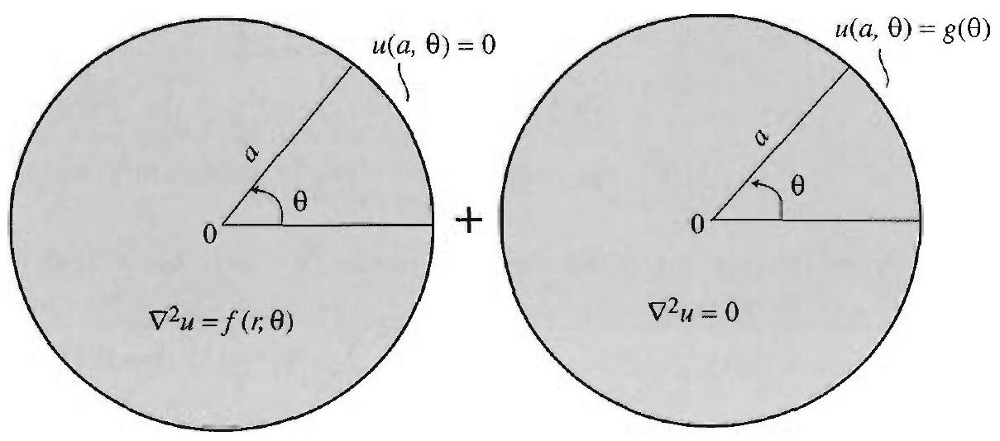

### 12.6 The Helmholtz and Poisson Equations

We know from Section 3.9 that several important boundary value problems can be solved by applying the method of eigenfunction expansions. In this section, we will present some applications of this method on the disk. For this purpose, we start by solving the eigenvalue problem consisting of the Helmholtz equation on a disk of radius $a$,

$$
\nabla^{2} \phi(r, \theta)=-k \phi(r, \theta), 0<r<a, 0<\theta<2 \pi,
$$

with the boundary condition

$$
\phi(a, \theta)=0,0<\theta<2 \pi .
$$

To solve this problem means to determine the values of $k$ (or eigenvalues) for which we have nontrivial solutions and find these nontrivial solutions (or eigenfunctions).

Substituting $\phi(r, \theta)=R(r) \Theta(\theta)$ into ( 1 ), separating variables, and using the fact that $\Theta$ is $2 \pi$-periodic, we arrive at the equations

$$
\begin{gathered}
\Theta^{\prime \prime}+m^{2} \Theta=0, \quad m=0,1,2, \ldots, \\
r^{2} R^{\prime \prime}+r R^{\prime}+\left(k r^{2}-m^{2}\right) R=0, \quad R(a)=0 .
\end{gathered}
$$

The solutions of (3) are

$$
\cos m \theta, \text { and } \sin m \theta, \quad m=0,1,2, \ldots .
$$

If $k<0$, equation (4) becomes the modified Bessel equation of order $m$, and it can be shown that in this case the only bounded solution with $R(a)=0$ is the zero solution. So we take $k \geq 0$ and (4) becomes the parametric form of Bessel's equation of order $m$. We know from Theorem 3, Section 12.8, that the nontrivial solutions of (4) are constant multiples of $J_{m}\left(\lambda_{m n} r\right)$, which is the solution corresponding to the eigenvalue $k=\lambda_{m n}^{2}$. Piecing together the product solutions, we obtain the following important result.

THEOREM 1 THE HELMHOLTZ EQUATION IN A DISK

THEOREM 2 EXPANSIONS IN TERMS OF THE EIGENFUNCTIONS OF THE HELMHOLTZ EQUATION

The eigenvalues of the problem (1)-(2) are

$$
k=\lambda_{m n}^{2}=\left(\alpha_{m n} / a\right)^{2}, \quad m=0,1,2, \ldots, n=1,2, \ldots
$$

where $\alpha_{m n}$ is the $n$th positive zero of the Bessel function $J_{m}$. To each eigenvalue $\lambda_{m n}^{2}$ correspond the eigenfunctions

$$
\cos m \theta J_{m}\left(\lambda_{m n} r\right) \text { and } \sin m \theta J_{m}\left(\lambda_{m n} r\right) .
$$

(Note that for $m=1,2, \ldots$ we have two distinct eigenfunctions for a given eigenvalue.)

In other words, if $\phi_{m n}(r, \theta)=\cos m \theta J_{m}\left(\lambda_{m n} r\right)$ or $\phi_{m n}(r, \theta)=\sin m \theta J_{m}\left(\lambda_{m n} r\right)$, then $\nabla^{2} \phi_{m n}=-\lambda_{m n}^{2} \phi_{m n}$ and $\phi(a, \theta)=0$.

As you will discover, the eigenfunctions satisfy orthogonality relations that can be used to expand functions on the disk, much as we used $\cos n x$ and $\sin n x$ to expand functions in terms of Fourier series. The orthogonality here follows as a consequence of the orthogonality of the Bessel functions and the trigonometric system. Because the orthogonality relations for the Bessel functions are expressed with respect to the weight function $r$ (Theorem 1, Section 12.8), the orthogonality of the eigenfunctions in (6) will be expressed by integrals over the disk with respect to $r d r d \theta$. For example, we have

$$
\int_{0}^{2 \pi} \int_{0}^{a} \sin m \theta J_{m}\left(\lambda_{m n} r\right) \cos m \theta J_{m}\left(\lambda_{m n} r\right) r d r d \theta=0
$$

Putting these facts together, we obtain the following expansion theorem, which was already used in (8), Section 12.3.

Suppose that $f(r, \theta)$ is defined for all $0<r<a$ and $0<\theta<2 \pi$. Then

$$
f(r, \theta)=\sum_{m=0}^{\infty} \sum_{n=1}^{\infty} J_{m}\left(\lambda_{m n} r\right)\left(a_{m n} \cos m \theta+b_{m n} \sin m \theta\right)
$$

where (the generalized Fourier coefficients) $a_{m n}$ and $b_{m n}$ are given by (12)(14), Section 12.3.

In Section 12.3, we established (8) as a consequence of Fourier series and Bessel-Fourier series. A simpler and more direct derivation can be obtained using the orthogonality of the eigenfunctions (6) (see Exercise 4).

## EXAMPLE 1 The method of eigenfunction expansions

Solve $\nabla^{2} u(r, \theta)=u(r, \theta)+3 r^{2} \cos 2 \theta$ in the unit disk, given that $u=0$ on the boundary.

Solution We look for a solution in the form of an eigenfunction expansion

$$
u(r, \theta)=\sum_{m=0}^{\infty} \sum_{n=1}^{\infty} J_{m}\left(\alpha_{m n} r\right)\left(A_{m n} \cos m \theta+B_{m n} \sin m \theta\right)
$$

Since each eigenfunction satisfies the boundary condition, our candidate for a solution, $u(r, \theta)$, also satisfies the boundary condition. Plugging $u$ into the equation and using the fact that, for an eigenfunction $\phi_{m n}, \nabla^{2} \phi_{m n}=-\alpha_{m n}^{2} \phi_{m n}$, we get

$$
\begin{aligned}
\sum_{m=0}^{\infty} & \sum_{n=1}^{\infty}-\alpha_{m n}^{2} J_{m}\left(\alpha_{m n} r\right)\left(A_{m n} \cos m \theta+B_{m n} \sin m \theta\right) \\
& =\sum_{m=0}^{\infty} \sum_{n=1}^{\infty} J_{m}\left(\alpha_{m n} r\right)\left(A_{m n} \cos m \theta+B_{m n} \sin m \theta\right)+3 r^{2} \cos 2 \theta
\end{aligned}
$$

hence

$$
\sum_{m=0}^{\infty} \sum_{n=1}^{\infty}\left(-1-\alpha_{m n}^{2}\right) J_{m}\left(\alpha_{m n} r\right)\left(A_{m n} \cos m \theta+B_{m n} \sin m \theta\right)=3 r^{2} \cos 2 \theta
$$

Thus $\left(-1-\alpha_{m n}^{2}\right) A_{m n}$ and $\left(-1-\alpha_{m n}^{2}\right) B_{m n}$ are the generalized Fourier coefficients of the function $f(r, \theta)=3 r^{2} \cos 2 \theta$. Note that the orthogonality of the trigonometric system will imply that only $A_{2 n}$ is nonzero. All other coefficients will be zero. Appealing to (13), Section 12.3, with $m=2$, we find

$$
\begin{aligned}
\left(-1-\alpha_{2 n}^{2}\right) A_{2 n} & =\frac{2}{\pi J_{3}^{2}\left(\alpha_{2 n}\right)} \int_{0}^{1} \int_{0}^{2 \pi} 3 \cos ^{2} 2 \theta d \theta r^{2} J_{2}\left(\alpha_{2 n} r\right) r d r \\
& =\frac{6}{J_{3}^{2}\left(\alpha_{2 n}\right)} \int_{0}^{1} r^{3} J_{2}\left(\alpha_{2 n} r\right) d r \quad\left(\int_{0}^{2 \pi} \cos ^{2} 2 \theta d \theta=\pi\right) \\
& =\frac{6}{J_{3}^{2}\left(\alpha_{2 n}\right)} \frac{J_{3}\left(\alpha_{2 n}\right)}{\alpha_{2 n}} \quad(\text { by (11), Section 12.2) } \\
& =\frac{6}{\alpha_{2 n} J_{3}\left(\alpha_{2 n}\right)}
\end{aligned}
$$

Solving for $A_{2 n}$ and plugging into the eigenfunction expansion of $u$, we find

$$
u(r, \theta)=\cos 2 \theta \sum_{n=1}^{\infty} \frac{-6}{\left(1+\alpha_{2 n}^{2}\right) \alpha_{2 n} J_{3}\left(\alpha_{2 n}\right)} J_{2}\left(\alpha_{2 n} r\right)
$$

The collapsing of the double sum in (8) to a single sum is due to the fact that only the terms in $\cos 2 \theta$ are needed here. In general, you may need the entire double sum.

## Poisson's Equation in a Disk

Consider the Poisson problem

$$
\begin{gathered}
\nabla^{2} u=f(r, \theta), \quad 0<r<a, \quad 0<\theta<2 \pi \\
u(a, \theta)=g(\theta), \quad 0<\theta<2 \pi
\end{gathered}
$$

Figure 1 Decomposition of a Poisson problem.

Our first step is to decompose the problem into the two simpler subproblems in Figure 1.

(a) Poisson problem with zero boundary data
(b) Dirichlet problem

The Dirichlet problem in Figure 1(b) can be solved by the methods of Section 12.4. Thus, to complete the solution, we need only solve Poisson's equation with zero boundary data (Figure 1(a)). We will use the method of eigenfunction expansions. This method tells us to look for a solution of (9) (with zero boundary data) in the form

$$
u(r, \theta)=\sum_{m=0}^{\infty} \sum_{n=1}^{\infty} J_{m}\left(\lambda_{m n} r\right)\left(A_{m n} \cos m \theta+B_{m n} \sin m \theta\right)
$$

Plugging into (9) and using the fact that each eigenfunction satisfies (1), we obtain

$$
\sum_{m=0}^{\infty} \sum_{n=1}^{\infty}-\lambda_{m n}^{2} J_{m}\left(\lambda_{m n} r\right)\left(A_{m n} \cos m \theta+B_{m n} \sin m \theta\right)=f(r, \theta) .
$$

This being the eigenfunction expansion of $f(r, \theta)$, we apply Theorem 2, solve for $A_{m n}$ and $B_{m n}$, and obtain, for $m, n=1,2, \ldots$,

$$
A_{0 n}=\frac{-1}{\pi \alpha_{0 n}^{2} J_{1}^{2}\left(\alpha_{0 n}\right)} \int_{0}^{a} \int_{0}^{2 \pi} f(r, \theta) J_{0}\left(\lambda_{0 n} r\right) r d \theta d r
$$

$$
A_{m n}=\frac{-2}{\pi \alpha_{m n}^{2} J_{m+1}^{2}\left(\alpha_{m n}\right)} \int_{0}^{a} \int_{0}^{2 \pi} f(r, \theta) \cos m \theta J_{m}\left(\lambda_{m n} r\right) r d \theta d r
$$

$$
B_{m n}=\frac{-2}{\pi \alpha_{m n}^{2} J_{m+1}^{2}\left(\alpha_{m n}\right)} \int_{0}^{a} \int_{0}^{2 \pi} f(r, \theta) \sin m \theta J_{m}\left(\lambda_{m n} r\right) r d \theta d r
$$

This completely determines the solutions of the problem in Figure 1(a). We summarize our findings as follows.

## SOLUTION OF POISSON'S PROBLEM IN A DISK

The solution of the Poisson problem (9)-(10) is given by

$$
u(r, \theta)=u_{1}(r, \theta)+u_{2}(r, \theta),
$$

where $u_{1}$ is the solution of the Poisson problem with zero boundary data in Figure 1(a), and $u_{2}$ is the solution of the Dirichlet problem in Figure 1(b). The function $u_{1}$ is given by (11)-(14), and the function $u_{2}$ is given by (4)-(5), Section 12.4.

## EXAMPLE 2 A Poisson problem with zero boundary data

Solve $\nabla^{2} u=1$ in the unit disk, given that $u=0$ on the boundary.
Solution Note that in this case $u_{2}=0$ in (15). The function $u_{1}$ is given by (11). Since the whole problem is independent of $\theta$, we expect the solution to be inclependent of $\theta$. Indeed, plugging $f(r, \theta)=1$ into (13) and (14), we get 0 because of the integral in $\theta$. Now (12) yields

$$
A_{0 n}=\frac{-2}{\alpha_{0 n}^{2} J_{1}^{2}\left(\alpha_{0 n}\right)} \int_{0}^{1} J_{0}\left(\alpha_{0 n} r\right) r d r
$$

Using (11), Section 12.2, to evaluate the integral and simplifying, we get $A_{0 n}= \frac{-2}{\alpha_{0 n}^{3} J_{1}\left(\alpha_{0 n}\right)}$. Substituting into (11), we obtain

$$
u(r, \theta)=\sum_{n=1}^{\infty} \frac{-2}{\alpha_{0 n}^{3} J_{1}\left(\alpha_{0 n}\right)} J_{0}\left(\alpha_{0 n} r\right)
$$

Interesting applications of the eigenfunction expansions method are presented in the exercises.

## Exercises 4.6

1. Derive (3) and (4) from (1) and (2).
2. State and prove all the orthogonality relations for the eigenfunctions of the Helmholtz problem (1) and (2) ((7) is one of them).
3. Let $\phi_{m n}(r, \theta)$ denote either one of the eigenfunctions in (6). Evaluate

$$
\int_{0}^{2 \pi} \int_{0}^{a} \phi_{m n}^{2}(r, \theta) r d r d \theta
$$

Treat the case $m=0$ separately. [Hint: Use (12), Section 12.8.]
4. Derive the coefficients in Theorem 2 by using the orthogonality of the eigenfunctions (6). [Hint: Multiply both sides of (8) by an eigenfunction, interchange integrals and summation signs, then integrate over the disk with respect to $r d \theta d r$.]

In Exercises 5-12, use the method of eigenfunction expansions to solve the given problem in the unit disk.
5. $\nabla^{2} u=-u+1, u(1, \theta)=0$.
6. $\nabla^{2} u=3 u+r \sin \theta, u(1, \theta)=0$.
7. $\nabla^{2} u=2+r^{3} \cos 3 \theta, u(1, \theta)=0$.
8. $\nabla^{2} u=r^{2}, u(1, \theta)=0$.
9.

$$
\begin{gathered}
\nabla^{2} u= \begin{cases}r \sin \theta & \text { if } 0<r<\frac{1}{2} \\
0 & \text { if } \frac{1}{2}<r<1\end{cases} \\
u(1, \theta)=0 .
\end{gathered}
$$

10. $\nabla^{2} u=r^{m} \sin m \theta, u(1, \theta)=0$.
11. $\nabla^{2} u=1, u(1, \theta)=\sin 2 \theta$.
12. $\nabla^{2} u=1+r \cos \theta, u(1, \theta)=1$.
13. A heat problem. Do Exercise 11, Section 12.3, using the method of eigenfunction expansions.
14. Project Problem: A nonhomogeneous heat problem. For this project, you are asked to use the eigenfunction expansions method to solve the nonhomogeneous heat boundary value problem, with time-dependent heat source,

$$
\begin{gathered}
\frac{\partial u}{\partial t}=c^{2}\left(\frac{\partial^{2} u}{\partial r^{2}}+\frac{1}{r} \frac{\partial u}{\partial r}+\frac{1}{r^{2}} \frac{\partial^{2} u}{\partial \theta^{2}}\right)+q(r, \theta, t) \\
u(a, \theta, t)=0 \\
u(r, \theta, 0)=f(r, \theta)
\end{gathered}
$$

where $0<r<a, 0<\theta<2 \pi$, and $t>0$. Justify the following steps.
(a) Let

$$
\begin{gathered}
u(r, \theta, t)=\sum_{m=0}^{\infty} \sum_{n=1}^{\infty} J_{m}\left(\lambda_{m n} r\right)\left(A_{m n}(t) \cos m \theta+B_{m n}(t) \sin m \theta\right) \\
f(r, \theta)=\sum_{m=0}^{\infty} \sum_{n=1}^{\infty} J_{m}\left(\lambda_{m n} r\right)\left(a_{m n} \cos m \theta+b_{m n} \sin m \theta\right) \\
q(r, \theta, t)=\sum_{m=0}^{\infty} \sum_{n=1}^{\infty} J_{m}\left(\lambda_{m n} r\right)\left(c_{m n}(t) \cos m \theta+d_{m n}(t) \sin m \theta\right)
\end{gathered}
$$

(Why should this be your starting point?) What are $a_{m n}, b_{m n}, c_{m n}(t)$, and $d_{m n}(t)$, in terms of $f$ and $q$ ?
(b) Show that $A_{m n}$ and $B_{m n}$ are solutions of the following initial value problems:

$$
\begin{array}{ll}
A_{m n}^{\prime}(t)+\lambda_{m n}^{2} A_{m n}(t)=c_{m n}(t), & A_{m n}(0)=a_{m n} \\
B_{m n}^{\prime}(t)+\lambda_{m n}^{2} B_{m n}(t)=d_{m n}(t), & B_{m n}(0)=b_{m n}
\end{array}
$$

(c) Complete the solution by showing that

$$
A_{m n}(t)=e^{-\lambda_{m n}^{2} t}\left(a_{m n}+\int_{0}^{t} e^{\lambda_{m n}^{2} s} c_{m n}(s) d s\right)
$$

and

$$
B_{m n}(t)=e^{-\lambda_{m n}^{2} t}\left(b_{m n}+\int_{0}^{t} e^{\lambda_{m n}^{2} s} d_{m n}(s) d s\right)
$$

15. (a) Work out the details in Exercise 14 when $c=1, f=1$, and $q(r, \theta, t)=e^{-t}$.
(b) Plot the temperature of the center and describe what happens as $t \rightarrow \infty$.
16. (a) Work out the details in Exercise 14 when $c=1, f=r \sin \theta$, and $q=1$.
(b) Plot the temperature of the center and describe what happens as $t \rightarrow \infty$.
