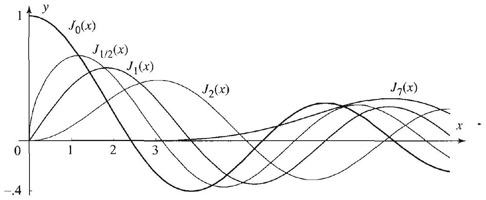
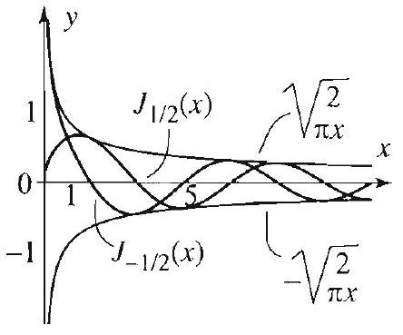
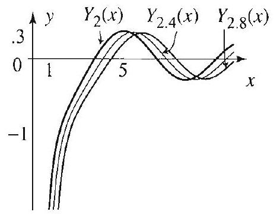
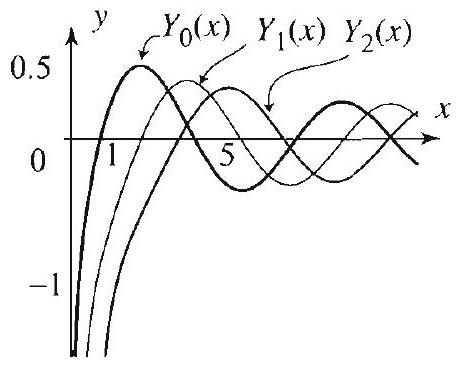
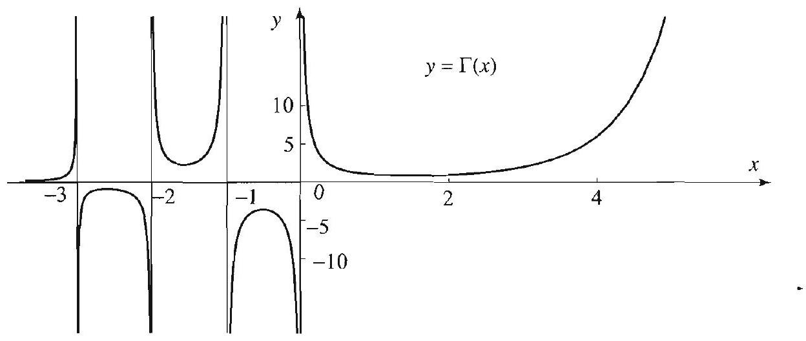

### 12.7 Bessel's Equation and Bessel Functions

We saw in this chapter that Bessel's equation of order $p \geq 0$,

$$
x^{2} y^{\prime \prime}+x y^{\prime}+\left(x^{2}-p^{2}\right) y=0, \quad x>0
$$

arises when solving partial differential equations involving the Laplacian in polar and cylindrical coordinates. Note that Bessel's equation is a whole family of differential equations, one for each value of $p$. Note also the unfortunate clash of terminology-Bessel's equation of order $p$ is a differential equation of order 2 .

Bessel's equation also appears in solving various other classical problems. Historically, the equation with $p=0$ was first encountered and solved by Daniel Bernoulli in 1732 in his study of the hanging chain problem (Section 6.3). Similar equations appeared later in 1770 in the work of Lagrange on astronomical problems. In 1824, while investigating the problem of elliptic planetary motion, the great German astronomer F. W. Bessel encountered a special form of (1). Influenced by the monumental work of Fourier that had just appeared in 1822 (see Chapter 2), Bessel conducted a systematic study of (1).

## Solution of Bessel's Equation

We will apply the method of Frobenius from Appendix A.6. It is easy to show that $x=0$ is a regular singular point of Bessel's equation. So, as suggested by the method of Frobenius, we try for a solution

$$
y=\sum_{m=0}^{\infty} a_{m} x^{r+m}
$$

where $a_{0} \neq 0$. Substituting this into (1) yields

We have shifted the index of summation by 2 in the third series so that each series is expressed in terms of $x^{r+m}$.

$$
\begin{aligned}
& \sum_{m=0}^{\infty} a_{m}(r+m)(r+m-1) x^{r+m}+\sum_{m=0}^{\infty} a_{m}(r+m) x^{r+m} \\
& \quad+\sum_{m=2}^{\infty} a_{m-2} x^{r+m}-p^{2} \sum_{m=0}^{\infty} a_{m} x^{r+m}=0
\end{aligned}
$$

Writing the terms corresponding to $m=0$ and $m=1$ separately gives

$$
\begin{aligned}
& a_{0}\left(r^{2}-p^{2}\right) x^{r}+a_{1}\left[(r+1)^{2}-p^{2}\right] x^{r+1} \\
& \quad+\sum_{m=2}^{\infty}\left(a_{m}\left[(r+m)^{2}-p^{2}\right]+a_{m-2}\right) x^{r+m}=0
\end{aligned}
$$

Equating coefficients of the series to zero gives

$$
\begin{gathered}
a_{0}\left(r^{2}-p^{2}\right)=0 \quad(m=0) \\
a_{1}\left[(r+1)^{2}-p^{2}\right]=0 \quad(m=1) \\
a_{m}\left[(r+m)^{2}-p^{2}\right]+a_{m-2}=0 \quad(m \geq 2)
\end{gathered}
$$

From (3), since $a_{0} \neq 0$, we get the indicial equation

$$
(r+p)(r-p)=0
$$

with indicial roots $r=p$ and $r=-p$.

## First Solution of Bessel's Equation

Setting $r=p$ in (5) gives the recurrence relation

$$
a_{m}=\frac{-1}{m(m+2 p)} a_{m-2}, \quad m \geq 2
$$

This is a two-step recurrence relation, so the even- and odd-indexed terms are determined separately. We deal with the odd-indexed terms first. With $r=p$, (4) becomes $a_{1}\left[(p+1)^{2}-p^{2}\right]=0$ which implies that $a_{1}=0$ (recall that $p \geq 0$ in (1)), and so $a_{3}=a_{5}=\cdots=0$. To make it easier to find a pattern for the even-indexed terms we rewrite the recurrence relation with $m=2 k$ and get

$$
a_{2 k}=\frac{-1}{2^{2} k(k+p)} a_{2(k-1)}, \quad k \geq 1
$$

This gives

$$
\begin{aligned}
& a_{2}=\frac{-1}{2^{2}(1+p)} a_{0} \\
& a_{4}=\frac{-1}{2^{2} 2(2+p)} a_{2}=\frac{1}{2^{4} 2!(1+p)(2+p)} a_{0} \\
& a_{6}=\frac{-1}{2^{2} 3(3+p)} a_{4}=\frac{-1}{2^{6} 3!(1+p)(2+p)(3+p)} a_{0}
\end{aligned}
$$

and so on. Substituting these coefficients into (2) gives one solution to Bessel's equation:

$$
y=a_{0} \sum_{k=0}^{\infty} \frac{(-1)^{k}}{2^{2 k} k!(1+p)(2+p) \cdots(k+p)} x^{2 k+p},
$$

where $a_{0} \neq 0$ is arbitrary. This solution may be written in a nicer way with the aid of the gamma function. (If you have not previously encountered this function, it is described at the end of this section.) We choose

$$
a_{0}=\frac{1}{2^{p} \Gamma(p+1)}
$$

and simplify the terms in the series using the basic property of the gamma function, $\Gamma(x+1)=x \Gamma(x)$, as follows:

$$
\begin{aligned}
\Gamma(1+p)[(1+p)(2+p) \cdots(k+p)] & =\Gamma(2+p)[(2+p) \cdots(k+p)] \\
& =\Gamma(3+p)[\cdots(k+p)] \\
& =\cdots=\Gamma(k+p+1) .
\end{aligned}
$$

After this simplification, (6) yields the first solution, denoted by $J_{p}$ and called the Bessel function of order $p$,

$$
J_{p}(x)=\sum_{k=0}^{\infty} \frac{(-1)^{k}}{k!\Gamma(k+p+1)}\left(\frac{x}{2}\right)^{2 k+p} .
$$

When $p=n$, we have $\Gamma(k+p+1)=(k+n)$ ! (see (14) below), and so the Bessel function of order $n$ is

$$
J_{n}(x)=\sum_{k=0}^{\infty} \frac{(-1)^{k}}{k!(k+n)!}\left(\frac{x}{2}\right)^{2 k+n} .
$$

To get an idea of the behavior of the Bessel functions, we sketch the graphs of $J_{0}, J_{1 / 2}, J_{1}, J_{2}$ and $J_{7}$ in Figure 1.

$$
\begin{aligned}
& J_{0}(0)=1 \\
& J_{p}(0)=0 \text { if } p>0
\end{aligned}
$$

Figure 1 Graphs of $J_{p}(x)$ for $p=0, \frac{1}{2}, 1,2,7$.

Note that $J_{p}$ is bounded at 0 . As we will see shortly, this property is not shared by the second linearly independent solution.

## Second Solution of Bessel's Equation

If in (2) we replace $r$ by the second indicial root $-p$, we arrive as before at the solution

$$
J_{-p}(x)=\sum_{k=0}^{\infty} \frac{(-1)^{k}}{k!\Gamma(k-p+1)}\left(\frac{x}{2}\right)^{2 k-p}
$$

It turns out that if $p$ is not an integer, then (8) is linearly independent of $J_{p}$. Thus when $p$ is not an integer, (7) and (8) determine a fundamental set of solutions of Bessel's equation of order $p$. Before turning to the case when $p$ is an integer, we compute the Bessel functions $J_{p}$ and $J_{-p}$ for the value $p=\frac{1}{2}$.

## EXAMPLE 1 Bessel functions of order $p= \pm \frac{1}{2}$

Show that

$$
J_{1 / 2}(x)=\sqrt{\frac{2}{\pi x}} \sin x \quad \text { and } \quad J_{-1 / 2}(x)=\sqrt{\frac{2}{\pi x}} \cos x .
$$

Solution Substituting $p=\frac{1}{2}$ in (7), we get

$$
J_{1 / 2}(x)=\sum_{k=0}^{\infty} \frac{(-1)^{k}}{k!\Gamma\left(k+\frac{1}{2}+1\right)}\left(\frac{x}{2}\right)^{2 k+\frac{1}{2}} .
$$

To simplify this expression, we use the result of Exercise 44(b), which implies that

$$
\Gamma\left(k+\frac{1}{2}+1\right)=\frac{(2 k+1)!}{2^{2 k+1} k!} \sqrt{\pi} .
$$

Figure 2 Graphs of $J_{1 / 2}$, $J_{-1 / 2}$, and their envelopes $y= \pm \sqrt{\frac{2}{\pi x}}$.

Figure 3 Approximation of $Y_{2}$.

Thus

$$
\begin{aligned}
J_{1 / 2}(x) & =\frac{1}{\sqrt{\pi}} \sum_{k=0}^{\infty} \frac{(-1)^{k} 2^{2 k+1} k!}{k!(2 k+1)!}\left(\frac{x}{2}\right)^{2 k+\frac{1}{2}} \\
& =\sqrt{\frac{2}{\pi x}} \sum_{k=0}^{\infty} \frac{(-1)^{k}}{(2 k+1)!} x^{2 k+1}=\sqrt{\frac{2}{\pi x}} \sin x
\end{aligned}
$$

The other part is proved similarly by substituting $p=-\frac{1}{2}$ into (8) and simplifying with the help Exercise 44(a) (see Exercise 21). In Figure 2 we plotted $J_{\frac{1}{2}}$ and $J_{-\frac{1}{2}}$. Clearly these two functions are linearly independent, since the first one is bounded while the second one is not.

It is important to keep in mind that $J_{p}$ and $J_{-p}$ are linearly independent only when $p$ is not an integer. In fact, when $p$ is a positive integer, we observe that $k-p+1 \leq 0$ for $k=0,1, \ldots, p-1$, and so the coefficients in (8) are not even defined for $k=0,1, \ldots, p-1$, because the gamma function is not defined at 0 and negative integers. It is useful, however, to have a definition for $J_{-n}$ for $n=1,2, \ldots$. A simple construction of this function is presented in Exercise 16. It yields a second linearly dependent solution that satisfies

$$
J_{-n}(x)=(-1)^{n} J_{n}(x) \quad(n \text { integer } \geq 0)
$$

We could use the Frobenius method to derive a second linearly independent solution. However, we will describe an alternative method that is commonly used in applied mathematics. We start again with the case when $p$ is not an integer and define

$$
Y_{p}(x)=\frac{J_{p}(x) \cos p \pi-J_{-p}(x)}{\sin p \pi} \quad(p \text { not an integer }) .
$$

Since $J_{p}$ and $J_{-p}$ are in this case linearly independent solutions of Bessel's equation, it follows from (10) that $Y_{p}$ is also a solution of Bessel's equation that is linearly independent of $J_{p}$. The function $Y_{p}$ is called a Bessel function of the second kind of order $p$. For integer $p$, this function is constructed by a limiting process from the noninteger values as follows:

Figure $4 Y_{0}, Y_{1}, Y_{2}$.

$$
Y_{p}=\lim _{\nu \rightarrow p} Y_{\nu}
$$

It can be shown that this limit exists (see Figure 3 for an illustration) and defines a solution of Bessel's equation of order $p$ which is also linearly independent of $J_{p}$. As illustrated in Figure 4, we have

## GENERAL

SOLUTION OF BESSEL'S EQUATION OF ORDER $p$

In particular, the Bessel functions of the second kind are not bounded near 0 . We summarize our analysis of (1) as follows.

The general solution of Bessel's equation (1) of order $p$ is

$$
y(x)=c_{1} J_{p}(x)+c_{2} Y_{p}(x)
$$

where $J_{p}$ is given by (7) and $Y_{p}$ is given by (10) or (11). When $p$ is not an integer, a general solution is also given by

$$
y(x)=c_{1} J_{p}(x)+c_{2} J_{-p}(x),
$$

where $J_{p}$ is given by (7) and $J_{-p}$ is given by (8).
Explicit formulas and computations of the Bessel functions are presented in the exercises. We next investigate the gamma function.

## The Gamma Function

The gamma function is defined for $x>0$ by

$$
\Gamma(x)=\int_{0}^{\infty} t^{x-1} e^{-t} d t
$$

This integral is improper and converges for all $x>0$. The basic property of the gamma function is

$$
\Gamma(x+1)=x \Gamma(x) .
$$

To prove this we use integration by parts as follows:

$$
\Gamma(x+1)=\int_{0}^{\infty} t^{x} e^{-t} d t=-\left.t^{x} e^{-t}\right|_{0} ^{\infty}+x \int_{0}^{\infty} t^{x-1} e^{-t} d t=x \Gamma(x)
$$

where in the first integral we let $u(t)=t^{x}, d v=e^{-t} d t, d u=x t^{x-1} d t, v(t)= -e^{-t}$.

We can easily find the values of the gamma function at the positive integers. For example,

$$
\Gamma(1)=\int_{0}^{\infty} e^{-t} d t=1
$$

The basic property now gives

$$
\Gamma(2)=1 \Gamma(1)=1!, \quad \Gamma(3)=2 \Gamma(2)=2!, \quad \Gamma(4)=3 \Gamma(3)=3!, \ldots
$$

Continuing in this manner, we see that

$$
\Gamma(n+1)=n!
$$

for all $n=0,1,2,3, \ldots$, where we have set $0!=1$. For this reason the gamma function is sometimes called the generalized factorial function. Other values of the gamma function can be found with various degrees of difficulty. From the value

$$
\Gamma\left(\frac{1}{2}\right)=\sqrt{\pi}
$$

(Exercise 34) and the basic property we find

$$
\Gamma\left(\frac{3}{2}\right)=\frac{1}{2} \Gamma\left(\frac{1}{2}\right)=\frac{\sqrt{\pi}}{2} \quad \text { and } \quad \Gamma\left(\frac{5}{2}\right)=\frac{3}{2} \Gamma\left(\frac{3}{2}\right)=\frac{3}{2} \frac{\sqrt{\pi}}{2}=\frac{3}{4} \sqrt{\pi} .
$$

Although we have defined the gamma function for $x>0$, it is possible to extend its definition to all real numbers other than $0,-1,-2,-3, \ldots$ in such a way that the basic property continues to hold. To do so, we write the basic property as

$$
\Gamma(x)=\frac{1}{x} \Gamma(x+1)
$$

and then define the value of the gamma function at $x$ from its value at $x+1$. For example, we have

$$
\Gamma\left(-\frac{1}{2}\right)=-2 \Gamma\left(\frac{1}{2}\right)=-2 \sqrt{\pi} \quad \text { and } \quad \Gamma\left(-\frac{3}{2}\right)=-\frac{2}{3} \Gamma\left(-\frac{1}{2}\right)=\frac{4}{3} \sqrt{\pi} .
$$

This clearly extends the definition of the gamma function to negative numbers other than $-1,-2,-3, \ldots$. The graph of the gamma function is sketched in Figure 5. Notice the vertical asymptotes at $x=0,-1,-2$, ... Also notice the alternating sign of the gamma function over negative intervals.

For $n=0,1,2, \ldots$,
$\Gamma(n+1)=n!$
$\Gamma(1)=0!=1$
$\Gamma(-n)$ is not defined
$\Gamma(x)>0$ for $x>0$
$\Gamma(x)$ alternates signs on the negative axis.

Figure $5 \Gamma(x)$, the generalized factorial function.

## Exercises 4.7

In Exercises 1-4, determine the order $p$ of the given Bessel equation. Use (7) to write down three terms of the first series solution.

1. $x^{2} y^{\prime \prime}+x y^{\prime}+\left(x^{2}-9\right) y=0$.
2. $x^{2} y^{\prime \prime}+x y^{\prime}+x^{2} y=0$.
3. $x^{2} y^{\prime \prime}+x y^{\prime}+\left(x^{2}-\frac{1}{4}\right) y=0$.
4. $x^{2} y^{\prime \prime}+x y^{\prime}+\left(x^{2}-\frac{1}{9}\right) y=0$.

In Exercises 5-8, find the general solution of the given differential equation on $(0, \infty)$. Write down two terms of the series expansions of each part of the solution. [Hint: Use (8).]
5. $x^{2} y^{\prime \prime}+x y^{\prime}+\left(x^{2}-\frac{9}{4}\right) y=0$.
6. $x^{2} y^{\prime \prime}+x y^{\prime}+\left(x^{2}-\frac{25}{4}\right) y=0$.
7. $x^{2} y^{\prime \prime}+x y^{\prime}+\left(x^{2}-\frac{1}{16}\right) y=0$.
8. $x^{2} y^{\prime \prime}+x y^{\prime}+\left(x^{2}-\frac{1}{25}\right) y=0$.
9. Find at least three terms of a second linearly independent solution of the equation of Exercise 1 using the Frobenius method. (A first solution is given by (7).)
10. Verify that $y_{1}=x^{p} J_{p}(x)$ and $y_{2}=x^{p} Y_{p}(x)$ are linearly independent solutions of

$$
x y^{\prime \prime}+(1-2 p) y^{\prime}+x y=0, \quad x>0
$$

In Exercises 11-14, use the result of Exercise 10 to solve the given equation for $x>0$.
11. $x y^{\prime \prime}-y^{\prime}+x y=0$.
12. $y^{\prime \prime}+y=0$.
13. $x y^{\prime \prime}-2 y^{\prime}+x y=0$.
14. $x y^{\prime \prime}-3 y^{\prime}+x y=0$.
15. Establish the following properties:
(a) $J_{0}(0)=1, J_{p}(0)=0$ if $p>0$;
(b) $J_{n}(x)$ is an even function if $n$ is even, and odd if $n$ is odd;
(c) $\lim _{x \rightarrow 0^{+}} \frac{J_{p}(x)}{x^{p}}=\frac{1}{2^{p} \Gamma(p+1)}$.
16. Suppose in (7) we replace $p$ by a negative integer $-n$.
(a) Based on the properties of the gamma function, explain why in (7) it makes sense to set $1 / \Gamma(k-p+1)=0$ for $k=0,1,2, \ldots, p-1$. [Hint: Exercise 32 below.]
(b) By reindexing the series that you obtain, show that $J_{-n}(x)=(-1)^{n} J_{n}(x)$.

In Exercises 17-20, solve the given equation by reducing it first to a Bessel's equation. Use the suggested change of variables and take $x>0$.
17. $x y^{\prime \prime}+(1+2 p) y^{\prime}+x y=0, y=x^{-p} u$.
18. $x y^{\prime \prime}+y^{\prime}+\frac{1}{4} y=0, z=\sqrt{x}$.
19. $y^{\prime \prime}+e^{-x} y=0, \quad z=2 e^{-\frac{x}{2}}$.
20. $x^{2} y^{\prime \prime}+x y^{\prime}+\left(4 x^{4}-\frac{1}{4}\right) y=0, z=x^{2}$.
21. Show that $J_{-1 / 2}(x)=\sqrt{\frac{2}{\pi x}} \cos x$.
22. Establish the identities
(a) $J_{3 / 2}(x)=\sqrt{\frac{2}{\pi x}}\left[\frac{\sin x}{x}-\cos x\right]$.
(b) $J_{-3 / 2}(x)=\sqrt{\frac{2}{\pi x}}\left[-\frac{\cos x}{x}-\sin x\right]$.

## 23. General solution of Bessel's equation of order 0.

(a) Use (7) to derive the first six terms of the series solution $J_{0}$ of the Bessel's equation $x^{2} y^{\prime \prime}+x y^{\prime}+x^{2} y=0$.
(b) Use (a) and the reduction of order formula to find six terms of $y_{2}$, the second series solution. [Hint: See Example 5, Appendix A.6.]
(b) Plot your answers and compare their graphs to those of $J_{0}$ and $Y_{0}$ for $x$ near zero, say $0<x<4$. Describe what you find.
(c) Explain why we must have $Y_{0}=a J_{0}+b y_{2}$, where $a$ and $b$ are some constants. Evaluate the functions at two points in the interval $0<x<4$, say at $x=.2$ and $x=.3$, and obtain two equations in the unknown coefficients $a$ and $b$. Solve the equations to determine $a$ and $b$, and then plot and compare the graphs of $Y_{0}$ and $a J_{0}+b y_{2}$.
24. Repeat Exercise 23 with Bessel's equation of order 1.
25. Project Problem: The aging spring problem. The equation

$$
y^{\prime \prime}(t)+e^{-a t+b} y(t)=0 \quad(a>0), \quad t>0
$$

models the vibrations of a spring whose spring constant is tending to zero with time.
(a) Show that the change of variables $u=\frac{2}{a} e^{-\frac{1}{2}(a t-b)}$ transforms the differential equation into Bessel's equation of order zero (with the new variable $u$ ). [Hint: Let $\left.Y(u)=y(t), e^{-a t+b}=\frac{a^{2}}{4} u^{2} ; \quad \frac{d y}{d t}=-\frac{a}{2} u \frac{d Y}{d u} ; \quad \frac{d^{2} y}{d t^{2}}=\frac{a^{2}}{4} u\left[\frac{d Y}{d u}+u \frac{d^{2} Y}{d u^{2}}\right].\right]$
(b) Obtain the general solution of the differential equation in the form

$$
y(t)=c_{1} J_{0}\left(\frac{2}{a} e^{-\frac{1}{2}(a t-b)}\right)+c_{2} Y_{0}\left(\frac{2}{a} e^{-\frac{1}{2}(a t-b)}\right),
$$

where $c_{1}$ and $c_{2}$ are arbitrary constants, $J_{0}$ is the Bessel function of order 0 , and $Y_{0}$ is the Bessel function of order 0 of the second kind.
(c) Discuss the behavior of the solution as $t \rightarrow \infty$ in the following three cases: $c_{1}=0, c_{2} \neq 0 ; c_{1} \neq 0, c_{2}=0 ; c_{1} \neq 0, c_{2} \neq 0$. Does it make sense to have unbounded solutions of the differential equation? [Hint: What happens to the differential equation as $t \rightarrow \infty$ ?]

In Exercises 26-27, solve the given aging spring problem. In each case determine whether the solution is bounded or unbounded as $t \rightarrow \infty$.
26. $y^{\prime \prime}(t)+e^{-2 t} y(t)=0, y(0)=J_{0}(1) \approx .765, y^{\prime}(0)=-J_{0}^{\prime}(1) \approx .440$.
27. $y^{\prime \prime}(t)+e^{-2 t} y(t)=0, y(0)=.1, y^{\prime}(0)=0$. [Use $J_{0}(1) \approx .765 ; J_{0}^{\prime}(1) \approx-.440$; $Y_{0}(1) \approx .088 ; Y_{0}^{\prime}(1) \approx .781$.]
28. Bessel's function of the second kind of order zero. The Bessel function of the second kind of order 0 is given explicitly by the formula

$$
Y_{0}(x)=\frac{2}{\pi}\left[J_{0}(x)(\ln x+\gamma)+\sum_{m=1}^{\infty} \frac{(-1)^{m-1} h_{m}}{2^{2 m}(m!)^{2}} x^{2 m}\right],
$$

where $h_{m}=1+\frac{1}{2}+\frac{1}{3}+\ldots+\frac{1}{m}$ and $\gamma$ is Euler's constant:

$$
\gamma=\lim _{m \rightarrow \infty}\left(h_{m}-\ln m\right) \approx 0.577216 .
$$

(a) Approximate the numerical value of Euler's constant.
(b) Justify the property $\lim _{x \rightarrow 0^{+}} Y_{0}(x)=-\infty$.
29. Modified Bessel function. In some applications the Bessel function $J_{p}$ appears as a function of the pure imaginary number $i x$.
(a) Show that $J_{p}(i x)=i^{p} \sum_{k=0}^{\infty} \frac{(x / 2)^{2 k+p}}{k!\Gamma(k+p+1)}$. Thus except for the factor $i^{p}$ the function that we get is real-valued. This function defines the so-called modified Bessel function of order $p$,

$$
I_{p}(x)=\sum_{k=0}^{\infty} \frac{(x / 2)^{2 k+p}}{k!\Gamma(k+p+1)} .
$$

(b) Verify that the modified Bessel function of order $p$ satisfies the modified Bessel's differential equation

$$
x^{2} y^{\prime \prime}+x y^{\prime}-\left(x^{2}+p^{2}\right) y=0 .
$$

(c) Plot the modified Bessel function of order 0 and note that it is positive and increasing for $x>0$.
30. Modified Bessel functions of the second kind.
(a) Show that $K_{p}(x)=\frac{\pi}{2 \sin p \pi}\left[I_{-p}(x)-I_{p}(x)\right]$ is also a solution of the modified Bessel's equation of Exercise 29. This function is called the modified Bessel function of the second kind (sometimes called of the third kind).
(b) Show that when $p$ is not an integer $I_{p}(x)$ and $K_{p}(x)$ are linearly independent.
(c) How would you construct $K_{p}(x)$ when $p$ is an integer?

## The Gamma Function

31. (a) Compute the numerical values of $\Gamma(1)$ and $\Gamma(2)$ starting from (13).
(b) Use (15) and the basic property of the gamma function to compute the values of $\Gamma\left(\frac{5}{2}\right)$ and $\Gamma\left(-\frac{3}{2}\right)$.
32. The reciprocal of the gamma function.
(a) Show that $1 / \Gamma(x) \rightarrow 0$ as $x$ approaches a negative integer or 0 . For this reason, we define $1 / \Gamma(x)=0$ for $x=0,-1,-2, \ldots$.
(b) Plot the graph of $1 / \Gamma(x)$ and show that it is continuous for all $x$.
33. For $x, y>0$,

$$
\frac{\Gamma(x) \Gamma(y)}{\Gamma(x+y)}=2 \int_{0}^{\pi / 2} \cos ^{2 x-1} \theta \sin ^{2 y-1} \theta d \theta .
$$

Derive this useful formula as follows.
(a) Make the change of variables $u^{2}=t$ in (13) and obtain

$$
\Gamma(x)=2 \int_{0}^{\infty} e^{-u^{2}} u^{2 x-1} d u, \quad x>0
$$

(b) Use (a) to show that for $x, y>0$,

$$
\Gamma(x) \Gamma(y)=4 \int_{0}^{\infty} \int_{0}^{\infty} e^{-\left(u^{2}+v^{2}\right)} u^{2 x-1} v^{2 y-1} d u d v
$$

(c) Change to polar coordinates in (b) ( $u=r \cos \theta, v=r \sin \theta, \quad d u d v=r d r d \theta$ ) and obtain that for $x, y>0$,

$$
\Gamma(x) \Gamma(y)=2 \Gamma(x+y) \int_{0}^{\pi / 2} \cos ^{2 x-1} \theta \sin ^{2 y-1} \theta d \theta
$$

[Hint: After you change coordinates, keep in mind (a) as you compute the integral in $r$.]
34. Use the result of Exercise 33 to obtain (15).
35. Derive the formula

$$
\frac{1}{\sqrt{\pi}} \int_{-\infty}^{\infty} e^{-u^{2}} d u=1
$$

[Hint: Use (15) and Exercise 33(a).]
In Exercises 36-39, use the result of Exercise 33 to compute the given integral.
36. $\int_{0}^{\pi / 2} \cos \theta \sin \theta d \theta$.
37. $\int_{0}^{\pi / 2} \cos ^{2} \theta \sin ^{3} \theta d \theta$.
38. $\int_{0}^{\pi / 2} \cos ^{5} \theta \sin ^{6} \theta d \theta$.
39. $\int_{0}^{\pi / 2} \cos ^{8} \theta d \theta$.

Use the result of Exercise 33 to establish the following Wallis's formulas.
40. $\int_{0}^{\pi / 2} \sin ^{2 k} \theta d \theta=\frac{\pi}{2} \frac{(2 k)!}{2^{2 k}(k!)^{2}}, \quad k=0,1,2, \ldots$.
41. $\int_{0}^{\pi / 2} \sin ^{2 k+1} \theta d \theta=\frac{2^{2 k}(k!)^{2}}{(2 k+1)!}, \quad k=0,1,2, \ldots$.
42. (a) Explain with the help of a graph why

$$
\int_{0}^{\pi / 2} \cos ^{2 k} \theta d \theta=\int_{0}^{\pi / 2} \sin ^{2 k} \theta d \theta
$$

and

$$
\int_{0}^{\pi / 2} \cos ^{2 k+1} \theta d \theta=\int_{0}^{\pi / 2} \sin ^{2 k+1} \theta d \theta
$$

(b) Use (a) and Exercises 40, and 41 to show that for $k=0,1,2, \ldots$,

$$
\int_{0}^{\pi / 2} \cos ^{2 k} \theta d \theta=\frac{\pi}{2} \frac{(2 k)!}{2^{2 k}(k!)^{2}} \quad \text { and } \quad \int_{0}^{\pi / 2} \cos ^{2 k+1} \theta d \theta=\frac{2^{2 k}(k!)^{2}}{(2 k+1)!}
$$

43. Derive the following formulas using Exercise 42: for $k=0,1,2, \ldots$

$$
\frac{1}{\pi} \int_{0}^{\pi} \cos ^{2 k} \theta d \theta=\frac{(2 k)!}{2^{2 k}(k!)^{2}} \quad \text { and } \quad \int_{0}^{\pi} \cos ^{2 k+1} \theta d \theta=0
$$

44. Show that (a) $\quad \Gamma\left(n+\frac{1}{2}\right)=\frac{(2 n)!}{2^{2 n} n!} \sqrt{\pi}$. (b) $\quad \Gamma\left(n+\frac{1}{2}+1\right)=\frac{(2 n+1)!}{2^{2 n+1} n!} \sqrt{\pi}$.
45. (a) Use the result of Exercise 33 to obtain that the arc length of the lemniscate $r^{2}=2 \cos 2 \theta$ is $2 \sqrt{2 \pi} \Gamma\left(\frac{1}{4}\right) / \Gamma\left(\frac{3}{4}\right)$. [Hint: Arc length in polar coordinates is $L=\int_{a}^{b} \sqrt{r^{2}+\left(\frac{d r}{d \theta}\right)^{2}} d \theta$.]
(b) Approximate the arc length in (a).
46. The beta function is defined for $r, s>0$ by

$$
\beta(r, s)=\int_{0}^{1} t^{r-1}(1-t)^{s-1} d t
$$

(a) Use the change of variables $t=\sin ^{2} \theta$ to obtain

$$
\beta(r, s)=2 \int_{0}^{\pi / 2} \cos ^{2 s-1} \theta \sin ^{2 r-1} \theta d \theta
$$

(b) From Exercise 33 conclude that

$$
\beta(r, s)=\frac{\Gamma(r) \Gamma(s)}{\Gamma(r+s)}
$$
