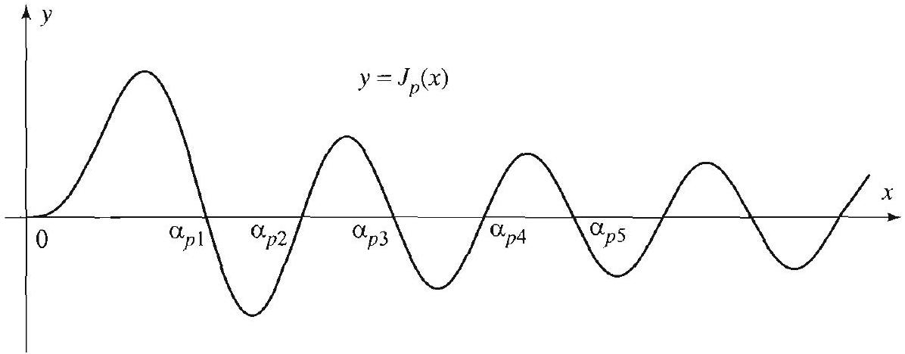
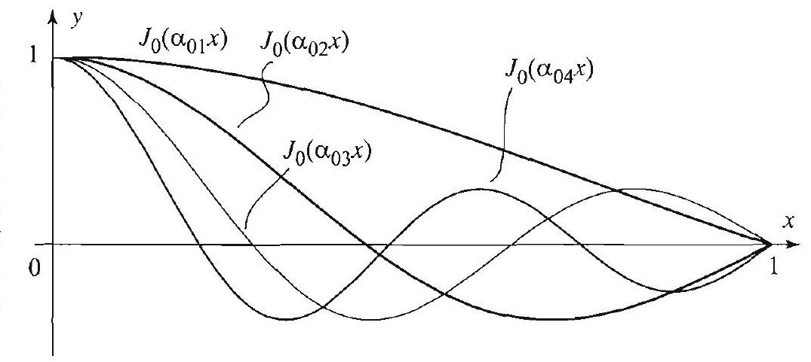
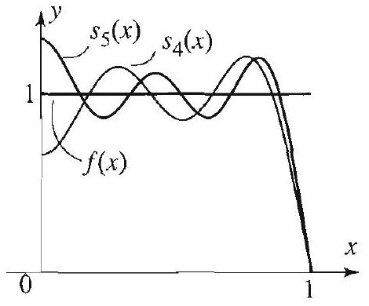

### 12.8 Bessel Series Expansions

In this section we explore some recurrence relations, orthogonality properties of Bessel functions, and expansions of functions in Bessel series. Many of these properties are used in solving the boundary value problems occurring in this chapter and throughout this book.

## Identities Involving Bessel Functions

We start with two basic identities. For any $p \geq 0$,

$$
\frac{d}{d x}\left[x^{p} J_{p}(x)\right]=x^{p} J_{p-1}(x)
$$

$$
\frac{d}{d x}\left[x^{-p} J_{p}(x)\right]=-x^{-p} J_{p+1}(x)
$$

Note that for $p=0$, the second identity yields

$$
\frac{d}{d x}\left[J_{0}(x)\right]=-J_{1}(x)
$$

To prove (1) we recall the definition of $J_{p}$ from (7) of Section 12.7 and write

$$
\begin{aligned}
\frac{d}{d x}\left[x^{p} J_{p}(x)\right] & =\frac{d}{d x} \sum_{k=0}^{\infty} \frac{(-1)^{k} 2^{p}}{k!\Gamma(k+p+1)}\left(\frac{x}{2}\right)^{2 k+2 p} \\
& =\sum_{k=0}^{\infty} \frac{(-1)^{k} 2^{p}(k+p)}{k!\Gamma(k+p+1)}\left(\frac{x}{2}\right)^{2 k+2 p-1} \\
& =x^{p} \sum_{k=0}^{\infty} \frac{(-1)^{k}}{k!\Gamma(k+p)}\left(\frac{x}{2}\right)^{2 k+p-1} \\
& =x^{p} J_{p-1}(x)
\end{aligned}
$$

In the next to last step we used the basic property of the gamma function to write $\Gamma(k+p+1)=(p+k) \Gamma(p+k)$. The second identity is proved similarly (Exercise 1(a)).

Many other useful identities follow from (1) and (2). We list some of the most commonly used ones:

$$
\begin{gathered}
x J_{p}^{\prime}(x)+p J_{p}(x)=x J_{p-1}(x) \\
x J_{p}^{\prime}(x)-p J_{p}(x)=-x J_{p+1}(x) \\
J_{p-1}(x)-J_{p+1}(x)=2 J_{p}^{\prime}(x) \\
J_{p-1}(x)+J_{p+1}(x)=\frac{2 p}{x} J_{p}(x)
\end{gathered}
$$

(We note that the corresponding formulas for Bessel functions of the second kind also hold.) To prove (3), we expand the left side of (1) using the product rule and get

$$
x^{p} J_{p}^{\prime}(x)+p x^{p-1} J_{p}(x)=x^{p} J_{p-1}(x)
$$

Dividing through by $x^{p-1}$ gives (3). Identity (4) is proved similarly by starting with (2) and expanding using the product rule. Adding (3) and (4) and simplifying yields (5). Subtracting (4) from (3) and simplifying yields (6)

There are similar identities involving integrals of Bessel functions. For example, the identities

$$
\int x^{p+1} J_{p}(x) d x=x^{p+1} J_{p+1}(x)+C
$$

and

$$
\int x^{-p+1} J_{p}(x) d x=-x^{-p+1} J_{p-1}(x)+C
$$

follow easily by integrating both sides of (1) and (2) (Exercise 1).

## Orthogonality of Bessel Functions

To understand the orthogonality relations of Bessel functions, let us recall the familiar example of the functions $\sin n \pi x, n=1,2,3, \ldots$. We know that these functions are orthogonal on the interval $[0,1]$, in the sense that $\int_{0}^{1} \sin n \pi x \sin m \pi x d x=0$ if $n \neq m$. The key here is to note that the functions $\sin n \pi x$ are constructed from a single function, namely $\sin x$, and its positive zeros, namely $n \pi, n=1,2,3, \ldots$.

In constructing systems of orthogonal Bessel functions, we will proceed in a similar way by using a single Bessel function and its zeros. Fix an order $p \geq 0$, and consider the graph of $J_{p}(x)$ for $x>0$. Figure 1 shows typical graphs of Bessel functions.

Figure 1 A Bessel function $J_{p}(x)$ has infinitely many positive zeros.

We see from Figure 1 that the Bessel function $J_{p}$ has infinitely many zeros on the positive axis $x>0$ (just like $\sin x$ ). This important fact is proved in the following section (see Exercises 14 and 35 for the cases $p=0, \pm 1, \pm 2, \ldots$, and $\frac{1}{2}$ ). We denote these zeros in ascending order

$$
0<\alpha_{p 1}<\alpha_{p 2}<\cdots<\alpha_{p j}<\cdots .
$$

Hence $\alpha_{p j}$ denotes the $j$ th positive zero of $J_{p}$. (Sometimes the notation $\alpha_{p, j}$ will be used.) Unlike the case of the sine function, where the zeros are easily determined by $n \pi$, there is no formula for the positive zeros of the Bessel

Let $a$ be a positive number. To generate orthogonal functions on the interval $[0, a]$ from $J_{p}$, we proceed as in the case of the sine function, using $\alpha_{p j}$, the zeros of the Bessel function. We obtain the functions

$$
J_{p}\left(\frac{\alpha_{p j}}{a} x\right), \quad j=1,2,3, \ldots
$$

The first four functions, corresponding to $p=0$, are shown in Figure 2.

It is interesting to note that all these functions are bounded by 1 and their number of zeros increase in the interval $(0,1)$. These properties are shared by other systems of orthogonal functions encountered earlier, in particular, the
functions. Since the numerical values of these zeros are very important in applications, they are found in most mathematical tables and computer systems. For later use, we list in Table 1 the first five positive zeros of $J_{0}$, $J_{1}$, and $J_{2}$.

| $j$ | 1 | 2 | 3 | 4 | 5 |
| :---: | :---: | :---: | :---: | :---: | :---: |
| $\alpha_{0 j}$ | 2.40483 | 5.52008 | 8.65373 | 11.7915 | 14.9309 |
| $\alpha_{1 j}$ | 3.83171 | 7.01559 | 10.1735 | 13.3237 | 16.4706 |
| $\alpha_{2 j}$ | 5.13562 | 8.41724 | 11.6198 | 14.796 | 18.9801 |

Table 1 Positive zeros of $J_{0}, J_{1}$, and $J_{2}$.

functions. Since the numerical values of these zeros are very important in applications, they are found in most mathematical tables and computer systems. For later use, we list in Table 1 the first five positive zeros of $J_{0}$,
$J_{1}$, and $J_{2}$. | $j$ | 1 | 2 | 3 | 4 | 5 |
| :---: | :---: | :---: | :---: | :---: | :---: |
| $\alpha_{0 j}$ | 2.40483 | 5.52008 | 8.65373 | 11.7915 | 14.9309 |
| $\alpha_{1 j}$ | 3.83171 | 7.01559 | 10.1735 | 13.3237 | 16.4706 |
| $\alpha_{2 j}$ | 5.13562 | 8.41724 | 11.6198 | 14.796 | 18.9801 | trigonometric functions.

Figure 2 Orthogonal functions generated with $J_{0}(x): J_{0}\left(\alpha_{01} x\right), J_{0}\left(\alpha_{02} x\right), \ldots$.

To simplify the notation, we let

$$
\lambda_{p j}=\frac{\alpha_{p j}}{a} \quad j=1,2,3, \ldots
$$

So $\lambda_{p j}$ is the value of the $j$ th positive zero of $J_{p}$ scaled by a fixed factor $1 / a$. We are now in a position to state some fundamental identities.

THEOREM 1 ORTHOGONALITY OF BESSEL FUNCTIONS WITH RESPECT TO A WEIGHT

Fix $p \geq 0$ and $a>0$. Let $J_{p}\left(\lambda_{p j} x\right)(j=1,2, \ldots)$ be as in (9) and (10). Then

$$
\int_{0}^{a} J_{p}\left(\lambda_{p j} x\right) J_{p}\left(\lambda_{p k} x\right) x d x=0 \text { for } j \neq k
$$

and

$$
\int_{0}^{a} J_{p}^{2}\left(\lambda_{p j} x\right) x d x=\frac{a^{2}}{2} J_{p+1}^{2}\left(\alpha_{p j}\right) \text { for } j=1,2, \ldots
$$

Note that (12) involves $\lambda_{p j}$ and $\alpha_{p j}$. Property (11) is described by saying that the functions $J_{p}\left(\lambda_{p j} x\right), j=1,2, \ldots$ are orthogonal on the interval $[0, a]$ with respect to the weight $x$. The phrase "with respect to the weight $x$ " refers to the presence of the function $x$ in the integrand in (11). On the interval [ 0,1 ]-that is when $a=1$-formulas (11) and (12) take on a simpler form

$$
\begin{gathered}
\int_{0}^{1} J_{p}\left(\alpha_{p j} x\right) J_{p}\left(\alpha_{p k} x\right) x d x=0 \quad \text { for } j \neq k \\
\int_{0}^{1} J_{p}^{2}\left(\alpha_{p j} x\right) x d x=\frac{1}{2} J_{p+1}^{2}\left(\alpha_{p j}\right) \quad \text { for } j=1,2, \ldots
\end{gathered}
$$

The proof of (11) is found in the proof of Theorem 3. The proof of (12) is outlined in Exercise 36.

## Bessel Series and Bessel-Fourier Coefficients

Just as we used the functions $\sin n \pi x$ to expand functions in sine Fourier series, now we will see how we can expand functions using Bessel series. More precisely, a given function $f$ on the interval $[0, a]$ can be expressed as a series

$$
f(x)=\sum_{j=1}^{\infty} A_{j} J_{p}\left(\lambda_{p j} x\right)
$$

called the Bessel series of order $p$ of $f$. Putting aside questions of convergence, let us assume (15) is valid and proceed to find the coefficients in the series. Multiplying both sides of (15) by $J_{p}\left(\lambda_{p k} x\right) x$ and integrating term by term on the interval $[0, a]$ gives

$$
\int_{0}^{a} f(x) J_{p}\left(\lambda_{p k} x\right) x d x=\sum_{j=1}^{\infty} A_{j} \overbrace{\int_{0}^{a} J_{p}\left(\lambda_{p j} x\right) J_{p}\left(\lambda_{p k} x\right) x d x}^{=0 \text { except when } j=k}
$$

The orthogonality property (11) shows that all the terms on the right side of (16) are 0 except when $j=k$. Canceling the zero terms and using (12), we get

$$
A_{j}=\frac{\int_{0}^{a} f(x) J_{p}\left(\lambda_{p j} x\right) x d x}{\int_{0}^{a} J_{p}^{2}\left(\lambda_{p j} x\right) x d x}=\frac{2}{a^{2} J_{p+1}^{2}\left(\alpha_{p j}\right)} \int_{0}^{a} f(x) J_{p}\left(\lambda_{p j} x\right) x d x
$$

The number $A_{j}$ is called the $\boldsymbol{j}$ th Bessel-Fourier coefficient or simply the Bessel coefficient of the function $f$.

The next theorem gives conditions under which the Bessel series expansion of a function is valid. For the meaning of piecewise smooth, refer to Section 2.2.

THEOREM 2 BESSEL SERIES OF ORDER $p$

Note the similarity with Fourier series. At the points of discontinuity the Bessel series converges to the average of the function.

If $f$ is piecewise smooth on $[0, a]$, then $f$ has a Bessel series expansion of order $p$ on the interval $(0, a)$ given by

$$
f(x)=\sum_{j=1}^{\infty} A_{j} J_{p}\left(\lambda_{p j} x\right),
$$

where $\lambda_{p 1}, \lambda_{p 2}, \ldots$ are the scaled positive zeros of the Bessel function $J_{p}$ given by ( 10 ), and $A_{j}$ is given by ( 17 ). In the interval ( $0, a$ ), the series converges to $f(x)$ where $f$ is continuous and converges to the average $\frac{f(x+)+f(x-)}{2}$ at the points of discontinuity.

Before giving an example of a Bessel series, we make a useful remark about the notation. While the notation $\alpha_{p j}$ and $\lambda_{p j}$ is appropriate to denote the zeros and scaled zeros of the Bessel function of order $p$, it is a little cumbersome to work with. For this reason, when it is understood which order we are dealing with, and so there is no risk of confusion, we will drop the index $p$ and write $\alpha_{j}$ and $\lambda_{j}$ instead of $\alpha_{p j}$ and $\lambda_{p j}$.

EXAMPLE 1 A Bessel series on the interval [0,1]
Find the Bessel series expansion of order 0 of the function $f(x)=1,0<x<1$.
Solution Applying Theorem 2, we get

$$
f(x)=\sum_{j=1}^{\infty} A_{j} J_{0}\left(\alpha_{j} x\right)
$$

where $\alpha_{j}$ is the $j$ th positive zero of $J_{0}$, and

Figure 3 Partial sums of the Bessel series.

$$
\begin{aligned}
A_{j} & =\frac{2}{J_{1}^{2}\left(\alpha_{j}\right)} \int_{0}^{1} f(x) J_{0}\left(\alpha_{j} x\right) x d x \\
& =\frac{2}{J_{1}^{2}\left(\alpha_{j}\right)} \int_{0}^{1} J_{0}\left(\alpha_{j} x\right) x d x \\
& =\frac{2}{\alpha_{j}^{2} J_{1}^{2}\left(\alpha_{j}\right)} \int_{0}^{\alpha_{j}} J_{0}(t) t d t \quad\left(t=\alpha_{j} x\right) \\
& \left.=\left.\frac{2}{\alpha_{j}^{2} J_{1}^{2}\left(\alpha_{j}\right)} J_{1}(t) t\right|_{0} ^{\alpha_{j}} \quad \text { (by (7) with } p=0\right) \\
& =\frac{2}{\alpha_{j} J_{1}\left(\alpha_{j}\right)}
\end{aligned}
$$

Theorem 2 asserts that the Bessel series converges to $f(x)$ at all points in the interval. Thus

$$
1=\sum_{j=1}^{\infty} \frac{2}{\alpha_{j} J_{1}\left(\alpha_{j}\right)} J_{0}\left(\alpha_{j} x\right) \quad 0<x<1 .
$$

| $j$ | 1 | 2 | 3 | 4 | 5 |
| :---: | :---: | :---: | :---: | :---: | :---: |
| $\alpha_{j}$ | 2.4048 | 5.5201 | 8.6537 | 11.7915 | 14.9309 |
| $J_{1}\left(\alpha_{j}\right)$ | .5191 | -.3403 | .2714 | -.2325 | .2065 |
| $\frac{2}{\alpha_{j} J_{1}\left(\alpha_{2}\right)}$ | 1.6020 | -1.0648 | .8514 | -.7295 | .6487 |

Table 2 Numerical data for Example 1

Using the numerical data provided by Tables 1 and 2, we can write explicitly the first few terms of the series:

$$
\begin{aligned}
1= & 1.6020 J_{0}(2.4048 x)-1.0648 J_{0}(5.5201 x)+.8514 J_{0}(8.6537 x) \\
& -.7295 J_{0}(11.7915 x)+.6487 J_{0}(14.9309 x)+\cdots
\end{aligned}
$$

It is worth noticing that the Bessel coefficients tend to 0 as $j \rightarrow \infty$. This is a property that holds in general.

Note that Theorem 2 tells us nothing about the behavior of the Bessel series at the endpoints of the interval. In this example, if we take $x=1$ in the series all the terms become zero, since we are evaluating $J_{0}$ at its zeros. This is also clear from the graphs of the partial sums in Figure 3. So, in this example, the Bessel series does not converge to the function at one of the endpoints.

## Parametric Form of Bessel's Equation

In the remainder of this section, we explore two important differential equations that are closely related to Bessel's equation.

THEOREM 3 PARAMETRIC FORM OF BESSEL'S EQUATION

The condition that $y(0)$ be finite is effectively a second boundary condition on $y$.

Let $p \geq 0, a>0$, and let $\alpha_{p j}$ denote the $j$ th positive zero of $J_{p}(x)$. For $j=1,2, \ldots$, the functions $J_{p}\left(\frac{\alpha_{p j}}{\alpha} x\right)$ are solutions of the parametric form of Bessel's equation of order $p$,

$$
x^{2} y^{\prime \prime}(x)+x y^{\prime}(x)+\left(\lambda^{2} x^{2}-p^{2}\right) y(x)=0
$$

together with the boundary conditions

$$
y(0) \text { finite, } y(a)=0
$$

when $\lambda=\lambda_{p j}=\frac{\alpha_{p j}}{a}$, and these are the only solutions of (18), aside from scalar multiples, with these properties. Moreover, these solutions satisfy (11) and (12) and so they are orthogonal on the interval $[0, a]$ with respect to the weight function $x$.

Proof We will make a change of variables in (18) and reduce it to Bessel's equation as follows. Let $u=\lambda x, d u=\lambda d x$, and let $y(x)=y\left(\frac{u}{\lambda}\right)=Y(u)$. From the chain rule, $y^{\prime}(x)=Y^{\prime}(u) \frac{d u}{d x}=\lambda Y^{\prime}(u)$, and, likewise, $y^{\prime \prime}(x)=\lambda^{2} Y^{\prime \prime}(u)$. Substituting in (18), we get Bessel's equation of order $p$ in $Y(u)$

$$
u^{2} Y^{\prime \prime}(u)+u Y^{\prime}(u)+\left(u^{2}-p^{2}\right) Y(u)=0
$$

Thus the general solution is

$$
Y(u)=c_{1} J_{p}(u)+c_{2} Y_{p}(u)=c_{1} J_{p}(\lambda x)+c_{2} Y_{p}(\lambda x)=y(x)
$$

For $y(0)$ to be finite, we must set $c_{2}=0$, because $Y_{p}$ blows up at 0 . So $y(x)= c_{1} J_{p}(\lambda x)$, and the boundary condition $y(a)=0$ holds (for $c_{1} \neq 0$ ) if and only if $\lambda a=\alpha_{p j}$. Hence,

$$
\lambda=\lambda_{p j}=\frac{\alpha_{p j}}{a}
$$

are the only positive values of $\lambda$ for which there are nontrivial solutions. Therefore, the solutions of (18) and (19) are as claimed.

We come now to the proof of (11). To simplify notation, let us write $\lambda_{j}$ for $\lambda_{p j}$, and $\phi_{j}(x)$ for $J_{p j}\left(\lambda_{p j} x\right)$. The goal is to show that for $j \neq k$

$$
\int_{0}^{a} \phi_{j}(x) \phi_{k}(x) x d x=0
$$

Let us write (18) in the form $\left(x y^{\prime}\right)^{\prime}=-\frac{\left(\lambda^{2} x^{2}-p^{2}\right)}{x} y$. Since the $\phi$ 's satisfy this equation with the corresponding $\lambda$ 's, we have

$$
\left(x \phi_{j}^{\prime}\right)^{\prime}=-\frac{\left(\lambda_{j}^{2} x^{2}-p^{2}\right)}{x} \phi_{j}
$$

and

$$
\left(x \phi_{k}^{\prime}\right)^{\prime}=-\frac{\left(\lambda_{k}^{2} x^{2}-p^{2}\right)}{x} \phi_{k}
$$

Multiplying the first equation by $\phi_{k}$ and the second one by $\phi_{j}$ and then subtracting the resulting equations, we get, after simplifying,

$$
\left(\lambda_{k}^{2}-\lambda_{j}^{2}\right) \phi_{j} \phi_{k} x=\phi_{k}\left(x \phi_{j}^{\prime}\right)^{\prime}-\phi_{j}\left(x \phi_{k}^{\prime}\right)^{\prime} .
$$

Note that

$$
\phi_{k}\left(x \phi_{j}^{\prime}\right)^{\prime}-\phi_{j}\left(x \phi_{k}^{\prime}\right)^{\prime}=\frac{d}{d x}\left[\phi_{k} x \phi_{j}^{\prime}-\phi_{j} x \phi_{k}^{\prime}\right]
$$

Hence

$$
\left(\lambda_{k}^{2}-\lambda_{j}^{2}\right) \int_{0}^{a} \phi_{j}(x) \phi_{k}(x) x d x=\phi_{k} x \phi_{j}^{\prime}-\left.\phi_{j} x \phi_{k}^{\prime}\right|_{0} ^{a}=0
$$

because $\phi_{j}(a)=\phi_{k}(a)=0$, and the desired result follows, since $\lambda_{k}^{2}-\lambda_{j}^{2} \neq 0$. For the proof of (12), see Exercise 36. $\square$

Our last example is a differential equation that gives rise to yet another important family of functions.

## EXAMPLE 2 Spherical Bessel functions

The equation

$$
x^{2} y^{\prime \prime}+2 x y^{\prime}+\left(k x^{2}-n(n+1)\right) y=0, \quad 0<x<a, \quad y(a)=0,
$$

arises in many important applications in Chapter 5. In this equation, $k$ is a nonnegative real number and $n=0,1,2, \ldots$. We are seeking bounded solutions in the interval $0 \leq x \leq a$. You can check that the substitution

$$
y=x^{-1 / 2} w
$$

transforms (20) into the following parametric form of Bessel's equation:

$$
x^{2} w^{\prime \prime}+x w^{\prime}+\left(k x^{2}-\left(n+\frac{1}{2}\right)^{2}\right) w=0, \quad w(a)=0
$$

(Exercise 37). We know from Theorem 3 (with $p=n+1 / 2$ ) that bounded solutions arise only when

$$
k=\lambda^{2}
$$

and

$$
\lambda=\lambda_{n, j}=\frac{\alpha_{n+1 / 2, j}}{a},
$$

where $\alpha_{n+1 / 2, j}$ denotes the $j$ th positive zero of $J_{n+\frac{1}{2}}$. The corresponding solutions are scalar multiples of

$$
w_{n, j}(x)=J_{n+\frac{1}{2}}\left(\lambda_{n, j} x\right), \quad n=0,1,2, \ldots, \quad j=1,2, \ldots
$$

Hence, using (21), it follows that the solutions $y_{n j}$ of (20) are scalar multiples of

Figure 4 Spherical Bessel functions, $j_{0}, j_{1}, j_{2}, j_{3}$.

$$
x^{-1 / 2} J_{n+\frac{1}{2}}\left(\lambda_{n}, j x\right), \quad n=0,1,2, \ldots, \quad j=1,2, \ldots .
$$

It is customary to express the solutions in terms of the spherical Bessel functions of the first kind (see Figure 4):

$$
j_{n}(x)=\left(\frac{\pi}{2 x}\right)^{1 / 2} J_{n+\frac{1}{2}}(x), \quad n=0,1,2, \ldots
$$

Choosing a specific multiple of the functions in (22), we obtain the solutions of (20) as the spherical Bessel functions:

$$
y_{n, j}(x)=j_{n}\left(\lambda_{n, j} x\right), \quad n=0,1,2, \ldots, \quad j=1,2, \ldots .
$$ $\square$

In the exercises you are asked to study the spherical Bessel functions, including their orthogonality. In most cases, the results are simple consequences of properties of Bessel functions and (23).

## Exercises 4.8

1. (a) Supply the details of the proof of (2), (7), and (8). [Hint: To prove (2), show that the derivative is $\sum_{k=1}^{\infty} \frac{(-1)^{k} 2 k}{k!\Gamma(k+p+1) 2^{2 k+p}} x^{2 k-1}$. Then change $k$ to $k+1$ to start the sum at 0 .]
(b) Supply the details of the proof of (4), (5), and (6).
2. (a) On the graphs of $J_{0}$ and $J_{1}$ in Figure 1, Section 12.7, note that the maxima and minima of $J_{0}$ occur at the zeros of $J_{1}$. Prove this fact.
(b) Show that the maximum and minimum values of $J_{p}$ occur when

$$
x=\frac{p J_{p}(x)}{J_{p+1}(x)} \quad \text { or } \quad x=\frac{p J_{p}(x)}{J_{p-1}(x)} \quad \text { or } \quad J_{p-1}(x)=J_{p+1}(x) .
$$

(c) Illustrate (b) graphically when $p=2$.
(d) Show that at the zeros of $J_{p}, J_{p-1}$ and $J_{p+1}$ have equal absolute values but opposite signs.

In Exercises 3-10, evaluate the given integral.
3. $\int x J_{0}(x) d x$.
4. $\int x^{4} J_{3}(x) d x$.
5. $\int J_{1}(x) d x$.
6. $\int x^{-2} J_{3}(x) d x$.
7. $\int x^{3} J_{2}(x) d x$.
8. $\int x^{3} J_{0}(x) d x$.
9. $\int J_{3}(x) d x$.
10. $\int_{0}^{\infty} J_{1}(x)\left[J_{0}(x)\right]^{n} d x$.
[Hint: Let $u=J_{0}(x)$.]
11. Use (2) and Example 1 of Section 12.7 to derive the formula

$$
J_{3 / 2}(x)=\sqrt{\frac{2}{\pi x}}\left[\frac{\sin x}{x}-\cos x\right]
$$

12. Use (2) and Exercise 11 to derive

$$
J_{5 / 2}(x)=\sqrt{\frac{2}{\pi x}}\left[\left(\frac{3}{x^{2}}-1\right) \sin x-\frac{3}{x} \cos x\right] .
$$

13. Express $J_{5}$ in terms of $J_{0}$ and $J_{1}$.
14. Use the explicit formula for $J_{1 / 2}$ given in Example 1 of Section 12.7 to show that $J_{1 / 2}$ has infinitely many positive zeros in the interval $0<x<\infty$. What are these zeros?
15. (a) Plot the functions $\frac{\sin x}{x}$ and $\cos x$ on the same graph to illustrate the fact that they intersect at infinitely many points. Conclude that the function $J_{3 / 2}(x)$ has infinitely many zeros in ( $0, \infty$ ).
(b) Approximate the first three roots of the equation $\frac{\sin x}{x}=\cos x$.
16. (a) Let $0<\alpha_{p 1}<\alpha_{p 2}<\cdots<\alpha_{p j}<\cdots$ denote the positive zeros of $J_{p}$. How many roots does the function $J_{p}\left(\frac{\alpha_{p j}}{a} x\right)$ have in the interval $0<x<a$ ? Justify your answer.
(b) Illustrate your answer graphically with $p=2, a=1$, and $j=5$.
17. Let $0<c<1$, and let

$$
f(x)= \begin{cases}1 & \text { if } 0<x<c \\ 0 & \text { if } c<x<1\end{cases}
$$

(a) Derive the Bessel series of order 0 of $f$

$$
\sum_{j=1}^{\infty} \frac{2 c J_{1}\left(c \alpha_{j}\right)}{\alpha_{j} J_{1}\left(\alpha_{j}\right)^{2}} J_{0}\left(\alpha_{j} x\right), \quad 0<x<1
$$

(b) Discuss the convergence of the series in the interval $0<x<1$.
(c) Take $c=\frac{1}{2}$. Investigate the convergence of the series at $x=0$ and $x=1$ numerically. Does the series seem to converge at one or both points? To what values? (Note that convergence at these points is not covered by Theorem 2.)
18. Take $a=\frac{1}{3}$ in Exercise 17 and write explicitly the first five terms of the series in this case. Plot several partial sums and describe the behavior at and around the point $x=\frac{1}{3}$. Observe how the partial sums overshoot their limiting values regardless of the increase in the number of terms in the approximating partial sums. This illustrates the Gibbs phenomenon at a point of discontinuity for Bessel series expansions.
19. (a) Obtain the Bessel series expansion

$$
x^{4}=2 \sum_{j=1}^{\infty} \frac{1}{\alpha_{j} J_{5}\left(\alpha_{j}\right)} J_{4}\left(\alpha_{j} x\right), \quad 0<x<1
$$

where the $\alpha_{j}$ 's are the positive zeros of $J_{4}$.
(b) Plot some partial sums and discuss their behavior on the interval $0<x<1$.
20. Bessel series of order $m$. Fix a number $m \geq 0$ and let $0<\alpha_{1}<\alpha_{2}< \ldots<\alpha_{j}<\ldots$ denote the sequence of positive zeros of $J_{m}$. Obtain the Bessel series expansion

$$
x^{m}=2 \sum_{j=1}^{\infty} \frac{1}{\alpha_{j} J_{m+1}\left(\alpha_{j}\right)} J_{m}\left(\alpha_{j} x\right), \quad 0<x<1
$$

21. Refer to Exercise 20.
(a) Take $m=\frac{1}{2}$, and determine the exact values of the $\alpha_{j}$ 's in this case? [Hint: Example 1 of Section 12.7.]
(b) Compute explicitly the coefficients in the Bessel series expansion of $f(x)=\sqrt{x}$, $0<x<1$.
(c) Recall the formula for $J_{\frac{1}{2}}$ in terms of $\sin x$ and show that the expansion in (b) is really a sine Fourier series expansion of $x$.
(d) Plot some partial sums of the Bessel series and discuss the convergence on the interval $0<x<1$.
22. Study the behavior of the partial sums of the Bessel series in Exercise 20 when $m=\frac{3}{2}$. What do they converge to in the interval $0<x<1$ ?
In Exercises 23-30, approximate the given function by a Bessel series of the given order $p$. Plot several partial sums of the series and discuss their convergence on the given interval.
23. $f(x)=x^{2} ; 0<x<1 ; p=2$.
24. $f(x)=x^{3} ; 0<x<1 ; p=3$.
25. $f(x)= \begin{cases}0 & \text { if } 0<x<\frac{1}{2}, \\ \frac{1}{x} & \text { if } \frac{1}{2}<x<1 ;\end{cases}$
26. $f(x)=x^{2}, 0<x<1, p=0$.
$p=1$.
27. $f(x)= \begin{cases}0 & \text { if } 0<x<\frac{1}{2}, \\ \frac{1}{x^{2}} & \text { if } \frac{1}{2}<x<1 ;\end{cases}$
28. $f(x)= \begin{cases}0 & \text { if } 0<x<\frac{1}{30}, \\ \frac{1}{x^{3}} & \text { if } \frac{1}{30}<x<1 ;\end{cases}$
$p=2$ 。 $p=3$.
29. $f(x)=1 ; 0<x<2 ; p=1$.
30. $f(x)=J_{0}(x) ; 0<x<\alpha_{01} ; p=0$.

In Exercises 31-34, find all $\lambda>0$ for which the given parametric form of Bessel's equation has a solution that is finite at $x=0$ and satisfies the given boundary condition.
31. $x^{2} y^{\prime \prime}(x)+x y^{\prime}(x)+\left(\lambda^{2} x^{2}-1\right) y(x)=0, \quad y(1)=0$.
32. $x^{2} y^{\prime \prime}(x)+x y^{\prime}(x)+\lambda^{2} x^{2} y(x)=0, \quad y(2)=0$.
33. $x^{2} y^{\prime \prime}(x)+x y^{\prime}(x)+\left(\lambda^{2} x^{2}-\frac{1}{4}\right) y(x)=0, \quad y(\pi)=0$.
34. $x^{2} y^{\prime \prime}(x)+x y^{\prime}(x)+\left(\lambda^{2} x^{2}-1\right) y(x)=0, \quad y\left(\frac{\pi}{2}\right)=0$.
35. Project Problem: Zeros of $\boldsymbol{J}_{\boldsymbol{n}}$. We will prove that the positive zeros of $J_{n}(x)(n=0 \pm 1, \pm 2, \ldots)$ form an increasing sequence

$$
0<\alpha_{n 1}<\alpha_{n 2}<\cdots<\alpha_{n k}<\cdots \rightarrow \infty
$$

Parts (a)-(g) deal with the case $n=0$.
(a) Plot the graph of $J_{0}(x)$ and note that there are infinitely many positive zeros that we will denote in ascending order by $0<\alpha_{1}<\alpha_{2}<\alpha_{3}<\ldots$
(b) Show that the substitution $y(x)=\frac{1}{\sqrt{x}} u(x)$ transforms Bessel's equation of order 0 into

$$
u^{\prime \prime}+\left(1+\frac{1}{4 x^{2}}\right) u=0
$$

Conclude that $u(x)=\sqrt{x} J_{0}(x)$ is a solution of this differential equation.
(c) Let $v(x)=\sin x$. Check that

$$
-\left(u^{\prime \prime}+u\right) v(x)=\frac{d}{d x}\left(u v^{\prime}-u^{\prime} v\right)
$$

(d) Using (b), show that $-\left(u^{\prime \prime}+u\right)=\frac{u}{4 x^{2}}$.
(e) Show that $\int \frac{u(x) v(x)}{4 x^{2}} d x=u v^{\prime}-u^{\prime} v+C$ and hence

$$
\int_{2 k \pi}^{(2 k+1) \pi} \frac{u(x) \sin x}{4 x^{2}} d x=-[u(2 k \pi)+u(2 k \pi+\pi)]
$$

(f) Conclude from (e) that $u(x)$ has at least one zero in $[2 k \pi,(2 k+1) \pi]$. [Hint: Assume the contrary, say $u(x)>0$ for all $x$ in the interval, and get a contradiction by studying the signs of the terms on both sides of the last equality in (e).]
(g) Conclude that $J_{0}(x)$ has infinitely many positive zeros.
(h) Suppose that $f$ and $g$ are differentiable functions such that $\frac{d}{d x} f(x)=g(x)$. Show that between any two zeros of $f$ there is at least one zero of $g$.
(i) Use (2) with $p=0$ to show that $J_{1}$ has infinitely many zeros that tend to $\infty$.
(j) Use (2) and induction to show that $J_{n}(n>0)$ has infinitely many zeros that tend to $\infty$. Prove this result for all integers $n$.
36. Project Problem: A proof of (12). Let $0<\alpha_{1}<\alpha_{2}<\cdots<\alpha_{k}<\cdots$ denote the sequence of zeros of $J_{p}$ in ( $0, \infty$ ), and let $\lambda_{k}=\frac{\alpha_{k}}{a}$.
(a) Rewrite (18) as

$$
\left(x y^{\prime}\right)^{\prime}+\left(\lambda^{2} x-\frac{p^{2}}{x}\right) y=0, \quad y(a)=0
$$

Multiply both sides of the equation by $x y^{\prime}$ and put it in the form

$$
\left[\left(x y^{\prime}\right)^{2}\right]^{\prime}+\left(\lambda^{2} x^{2}-p^{2}\right)\left(y^{2}\right)^{\prime}=0
$$

(b) Take $y=J_{p}\left(\lambda_{k} x\right)$ and $\lambda=\lambda_{k}$, integrate the equation in (a) over $0<x<a$, and obtain

$$
\left[a y^{\prime}(a)\right]^{2}+\left(\lambda^{2} a^{2}-p^{2}\right) y(a)^{2}-2 \lambda^{2} \int_{0}^{a} y(x)^{2} x d x=0
$$

[Hint: Use integration by parts on the second term in (a). Justify the equality $p y(0)=0$.]
(c) For $y=J_{p}\left(\lambda_{k} x\right)$ and $\lambda=\lambda_{k}$, justify the equality $y(a)=0$, and get

$$
\left[y^{\prime}(a)\right]^{2}=\frac{2 \lambda^{2}}{a^{2}} \int_{0}^{a} x[y(x)]^{2} d x
$$

(d) For $y=J_{p}\left(\lambda_{k} x\right)$, use (4) to show that $y^{\prime}(a)=-\lambda_{k} J_{p+1}\left(\alpha_{k}\right)$. Derive (12) from (c).

## Spherical Bessel Functions

37. Use (21) to transform (20) into one of the equations of the form (18).
38. Use (23) and explicit formulas for the Bessel functions to show that

$$
\begin{gathered}
j_{0}(x)=\frac{\sin x}{x} \\
j_{1}(x)=\frac{\sin x-x \cos x}{x^{2}} \\
j_{2}(x)=\frac{\left(3-x^{2}\right) \sin x-3 x \cos x}{x^{3}} .
\end{gathered}
$$

[Hint: See Exercises 11 and 12.]
In Exercises 39-42, derive the given recurrence relation for the spherical Bessel functions. [Hint: Use (23) and the corresponding formulas for the Bessel functions.]
39. $\frac{d}{d x}\left[x^{n+1} j_{n}(x)\right]=x^{n+1} j_{n-1}(x)$.
40. $\frac{d}{d x}\left[x^{-n} j_{n}(x)\right]=-x^{-n} j_{n+1}(x)$.
41. $\int x^{n+2} j_{n}(x) d x=x^{n+2} j_{n+1}(x)+C$.
42. $\int x^{-n+1} j_{n}(x) d x=-x^{-n+1} j_{n-1}(x)+C$.
43. Recurrence relations. Use the results of Exercises 39 and 40 to obtain that

$$
j_{n-1}(x)+j_{n+1}(x)=\frac{2 n+1}{x} j_{n}(x)
$$

and

$$
n j_{n-1}(x)-(n+1) j_{n+1}(x)=(2 n+1) j_{n}^{\prime}(x) .
$$

44. Use the results of Exercises 43 and 38 to obtain that

$$
j_{3}(x)=\frac{\left(15-6 x^{2}\right) \sin x-\left(15 x-x^{3}\right) \cos x}{x^{4}} .
$$

45. Orthogonality of the spherical Bessel functions. Use (11) and (12) to show that

$$
\int_{0}^{a} j_{n}\left(\lambda_{n, j} x\right) j_{n}\left(\lambda_{n, j^{\prime}} x\right) x^{2} d x=0 \quad \text { for } j \neq j^{\prime}
$$

and

$$
\int_{0}^{a} j_{n}^{2}\left(\lambda_{n, j} x\right) x^{2} d x=\frac{a^{3}}{2} j_{n+1}^{2}\left(\alpha_{n+\frac{1}{2}, j}\right)
$$

where $\alpha_{n+\frac{1}{2}, j}$ is the $j$ th positive zero of $j_{n}$ (equivalently, of $J_{n+\frac{1}{2}}$ ). Hence the spherical Bessel functions are orthogonal on the interval $[0, a]$ with respect to the weight function $x^{2}$.
