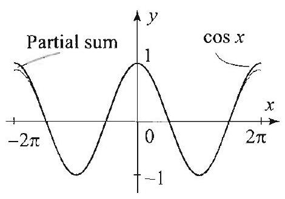
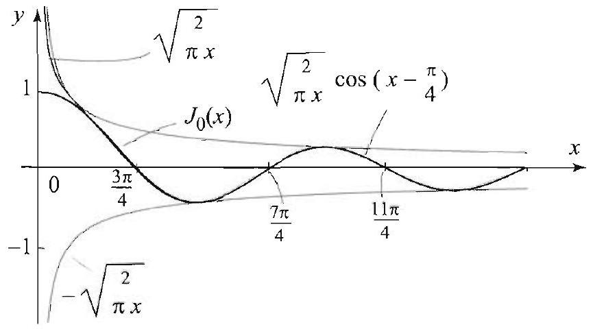

### 12.9 Integral Formulas and Asymptotics for Bessel Functions

Bessel functions are widely used in mathematics, engineering, and physics, because they are at the heart of so many important applications. It is thus essential to get familiarized with their basic properties. To gain insight into the theory of Bessel functions we will represent them by formulas and integrals involving more familiar functions, such as the cosine and sine functions. Let us start by deriving an important integral representation for Bessel functions and then use it to show a surprising connection with Fourier series.

## THEOREM 1 INTEGRAL REPRESENTATION

 □Let $n=0, \pm 1, \pm 2, \ldots$. Then for all $x$, we have

$$
J_{n}(x)=\frac{1}{\pi} \int_{0}^{\pi} \cos (n \theta-x \sin \theta) d \theta
$$

Proof We do the case $n \geq 0$, and in the exercises you can show that this case implies the formula when $n<0$. Let $x$ and $\theta$ be real numbers and set $\zeta=e^{i \theta}$. For all $\theta$, we have $|\zeta|=\left|e^{i \theta}\right|=1$. So $\zeta$ lies on the unit circle. The function $e^{-\frac{x}{2 \zeta}}$ has a series expansion about 0 in $-\frac{x}{2 \zeta}$, which is obtained by plugging $-\frac{x}{2 \zeta}$ in place of $z$ in the series expansion of $e^{z}=\sum_{k=0}^{\infty} \frac{z^{k}}{k!}$. Thus

$$
e^{\frac{x}{2}\left(\zeta-\frac{1}{\zeta}\right)}=e^{\frac{x}{2} \zeta} e^{-\frac{x}{2 \zeta}}=e^{\frac{x}{2} \zeta} \sum_{k=0}^{\infty} \frac{1}{k!}\left(-\frac{x}{2 \zeta}\right)^{k}=\sum_{k=0}^{\infty} \frac{(-1)^{k}}{k!2^{k}} x^{k} \frac{e^{\frac{x}{2} \zeta}}{\zeta^{k}} .
$$

For fixed $x$, the series is absolutely convergent for all $\theta$ (remember, $\zeta=e^{i \theta}$ ). So we can multiply both sides by $\zeta^{-n}$, integrate term by term, and get

$$
\frac{1}{2 \pi} \int_{0}^{2 \pi} e^{\frac{x}{2}\left(\zeta-\frac{1}{\zeta}\right)} \zeta^{-n} d \theta=\sum_{k=0}^{\infty} \frac{(-1)^{k}}{k!2^{k}} x^{k} \frac{1}{2 \pi} \int_{0}^{2 \pi} \frac{e^{\frac{x}{2} \zeta}}{\zeta^{k+n}} d \theta
$$

We claim that, for $n \geq 0$, the left side is equal to $\frac{1}{\pi} \int_{0}^{\pi} \cos (n \theta-x \sin \theta) d \theta$, and the right side is equal to $J_{n}(x)$. Obviously, we will be done once we prove these claims. We need the identities

$$
\zeta-\frac{1}{\zeta}=e^{i \theta}-e^{-i \theta}=2 i \sin \theta \quad \text { and } \quad \zeta^{-n}=e^{-i n \theta}
$$

Proof of first claim: For any integer $n$, write

$$
e^{\frac{x}{2}\left(\zeta-\frac{1}{\zeta}\right)} \zeta^{-n}=e^{i(x \sin \theta-n \theta)}=\cos (x \sin \theta-n \theta)+i \sin (x \sin \theta-n \theta) .
$$

The terms on the right side are $2 \pi$-periodic functions of $\theta$; moreover, the first one is even and the second one is odd. Using Theorem 1, Section 2.1, we obtain

$$
\begin{aligned}
& \frac{1}{2 \pi} \int_{0}^{2 \pi} e^{\frac{x}{2}\left(\zeta-\frac{1}{\zeta}\right)} \zeta^{-n} d \theta \\
& \quad=\frac{1}{2 \pi} \int_{-\pi}^{\pi} \cos (x \sin \theta-n \theta) d \theta+i \overbrace{\frac{1}{2 \pi} \int_{-\pi}^{\pi} \sin (x \sin \theta-n \theta) d \theta}^{=0} \\
& \quad=\frac{1}{\pi} \int_{0}^{\pi} \cos (x \sin \theta-n \theta) d \theta
\end{aligned}
$$

Proof of second claim: Take $n \geq 0$. It is enough to show that

$$
\frac{1}{2 \pi} \int_{0}^{2 \pi} \frac{e^{\frac{x}{2} \zeta}}{\zeta^{k+n}} d \theta=\left(\frac{x}{2}\right)^{k+n} \frac{1}{(k+n)!}
$$

Then substituting this value of the integral into the right side of (2), we obtain the series expansion for $J_{n}(x)$ (see the formula following (7), Section 12.7), which would complete the proof. To prove (3), we use the Taylor series expansion of $e^{z}$, as we did before, and integrate term by term (recall $\zeta=e^{i \theta}$ ):

$$
\begin{aligned}
\frac{e^{\frac{x}{2} \zeta}}{\zeta^{k+n}} & =\zeta^{-(k+n)} \sum_{j=0}^{\infty} \frac{1}{j!}\left(\frac{x}{2} \zeta\right)^{j}=\sum_{j=0}^{\infty} \frac{1}{j!}\left(\frac{x}{2}\right)^{j} \zeta^{j-k-n} \\
& =\sum_{j=0}^{\infty} \frac{1}{j!}\left(\frac{x}{2}\right)^{j} e^{i(j-k-n) \theta} ; \\
\frac{1}{2 \pi} \int_{0}^{2 \pi} \frac{e^{\frac{x}{2} \zeta}}{\zeta^{k+n}} d \theta & =\sum_{j=0}^{\infty} \frac{1}{j!}\left(\frac{x}{2}\right)^{j} \frac{1}{2 \pi} \int_{0}^{2 \pi} e^{i(j-k-n) \theta} d \theta .
\end{aligned}
$$

But $\frac{1}{2 \pi} \int_{0}^{2 \pi} e^{i(j-k-n) \theta} d \theta=0$ if $j-k-n \neq 0$ and 1 if $j=k+n$ (see Section 2.6); so only one term of the series is nonzero (when $j=k+n$ ) and (3) follows.

## EXAMPLE $1 \quad J_{0}$ is bounded by 1

Show that for all $x,\left|J_{0}(x)\right| \leq 1$. (Since $J_{0}(0)=1$, this inequality is best possible.)
Solution Using (1) with $n=0$, we have

$$
\left|J_{0}(x)\right|=\frac{1}{\pi}\left|\int_{0}^{\pi} \cos (x \sin \theta) d \theta\right| \leq \frac{1}{\pi} \int_{0}^{\pi} \overbrace{|\cos (x \sin \theta)|}^{\leq 1} d \theta \leq \frac{1}{\pi} \int_{0}^{\pi} d \theta=1
$$

We now explore a surprising connection with Fourier series. Consider the function $f(\theta)=e^{\frac{x}{2}\left(\zeta-\frac{1}{\zeta}\right)}=e^{i x \sin \theta}$, which appears in the integral in (2) (recall $\zeta=e^{i \theta}$ ). Express the complex exponential in terms of the cosine and sine functions, as we did previously in the proof of Theorem 1, and get

$$
f(\theta)=\cos (x \sin \theta)+i \sin (x \sin \theta)
$$

For fixed $x$, the real and imaginary parts of $f(\theta)$ are $2 \pi$-periodic and smooth. Thus $f$ has a Fourier series representation, with complex Fourier coefficients

$$
c_{n}=\frac{1}{2 \pi} \int_{0}^{2 \pi} f(\theta) e^{-i n \theta} d \theta
$$

This integral is precisely the integral that appears in (1) (see the first claim in the proof of Theorem 1). So, from Theorem 1,

$$
J_{n}(x)=\frac{1}{2 \pi} \int_{0}^{2 \pi} f(\theta) e^{-i n \theta} d \theta=c_{n}
$$

Substituting into the Fourier series representation of $f(\theta)=\sum_{n=-\infty}^{\infty} c_{n} e^{i n \theta}$ (Theorem 1, Section 2.6), we obtain the following interesting result, which provides a Fourier series generating the Bessel functions.

THEOREM 2 FOURIER SERIES GENERATING BESSEL FUNCTIONS

For all $x$ and all $\theta$, we have

$$
e^{i x \sin \theta}=\sum_{n=-\infty}^{\infty} J_{n}(x) e^{i n \theta}
$$

Formula (4) has many interesting consequences that follow by simply evaluating the series at particular values of $\theta$ (see the exercises). We illustrate with an example.

Figure 1 Approximation of $\cos x$ by the partial sum $J_{0}(x)+2\left(-J_{2}(x)+J_{4}(x)-\right. J_{6}(x)$ ). The graphs are almost indistinguishable on the interval $[-2 \pi, 2 \pi]$.

EXAMPLE 2 Bessel functions related to $\cos x$ and $\sin x$
Derive the following identities: For all $x$,

$$
\begin{gathered}
\cos x=J_{0}(x)+2 \sum_{n=1}^{\infty}(-1)^{n} J_{2 n}(x) \\
\sin x=2 \sum_{n=0}^{\infty}(-1)^{n} J_{2 n+1}(x)
\end{gathered}
$$

Solution Put $\theta=\frac{\pi}{2}$ in (4). Then for all $x$,

$$
\begin{aligned}
e^{i x \sin \frac{\pi}{2}} & =\sum_{n=-\infty}^{\infty} J_{n}(x) e^{i n \frac{\pi}{2}} ; \\
\cos x+i \sin x & =\sum_{n=-\infty}^{\infty} J_{n}(x)\left(\cos \left(\frac{n \pi}{2}\right)+i \sin \left(\frac{n \pi}{2}\right)\right) .
\end{aligned}
$$

Taking real parts, then using that $\cos \frac{n \pi}{2}=0$ if $n$ is odd and $(-1)^{m}$ if $n=2 m$ and that $J_{-2 n}(x)=(-1)^{2 n} J_{2 n}(x)=J_{2 n}(x)$, we obtain

$$
\begin{aligned}
\cos x & =\sum_{n=-\infty}^{\infty} \cos \left(\frac{n \pi}{2}\right) J_{n}(x) \\
& =J_{0}(x)+\sum_{n=1}^{\infty}(-1)^{n} J_{2 n}(x)+\sum_{n=-1}^{-\infty}(-1)^{n} J_{2 n}(x) \\
& =J_{0}(x)+\sum_{n=1}^{\infty}(-1)^{n}\left(J_{2 n}(x)+J_{-2 n}(x)\right)=J_{0}(x)+2 \sum_{n=1}^{\infty}(-1)^{n} J_{2 n}(x) .
\end{aligned}
$$

This proves the identity with the cosine. The one with the sine follows similarly and is left to the exercises. The series is illustrated in Figure 1.

## Asymptotics for Bessel Functions

Looking at the graph of a Bessel function, say $J_{0}(x)$, we notice two features: As $x$ tends to $\infty$, the graph oscillates like a cosine or sine wave and its amplitude decays like a negative power of $x$. In Figure 2, we show the graphs of $J_{0}(x)$ and $\sqrt{\frac{2}{\pi x}} \cos \left(x-\frac{\pi}{4}\right)$. The graphs are almost identical for large $x$. In fact, a more delicate analysis reveals that the difference between them is tending to 0 at the same rate as $1 / x^{3 / 2}$. We write $J_{0}(x) \sim \sqrt{\frac{2}{\pi x}} \cos \left(x-\frac{\pi}{4}\right)$ or, more precisely,

$$
J_{0}(x) \sim \sqrt{\frac{2}{\pi x}} \cos \left(x-\frac{\pi}{4}\right)+\mathcal{O}\left(\frac{1}{x^{3 / 2}}\right),
$$

and say that $J_{0}(x)$ is asymptotic to $\sqrt{\frac{2}{\pi x}} \cos \left(x-\frac{\pi}{4}\right)$ plus a big oh of $1 / x^{3 / 2}$. The expression "big on of $1 / x^{3 / 2}$ " means that there is a constant $C>0$ such

THEOREM 3 ASYMPTOTIC FORMULA

## LEMMA 1 METHOD OF STATIONARY PHASE

that $\left|J_{0}(x)-\sqrt{\frac{2}{\pi x}} \cos \left(x-\frac{\pi}{4}\right)\right| \leq C / x^{3 / 2}$ for all large $x$. Thus the error in the approximation tends to zero like $1 / x^{3 / 2}$. This asymptotic formula has many important consequences. For example, it follows immediately from it that $J_{0}(x)$ has infinitely many zeros and that these zeros are approximately the same as the zeros of $\cos \left(x-\frac{\pi}{4}\right)$ (Figure 2).

Figure 2 The asymptotic formula says that $J_{0}(x) \sim \sqrt{\frac{2}{\pi x}} \cos \left(x-\frac{\pi}{4}\right)$ with an error of the order $1 / x^{3 / 2}$. See how well the zeros of $J_{0}(x)$ are approximated by the zeros of $\cos \left(x-\frac{\pi}{4}\right)$, which are $\frac{3 \pi}{4} \approx 2.35619, \frac{7 \pi}{4} \approx 5.49779$, $\frac{11 \pi}{4} \approx 8.63938, \ldots$. Compare with the table of zeros of $J_{0}(x)$ in the previous section.

In general, we have the following asymptotic formula.
Let $n \geq 0$ be an integer. Then for all large $x$, we have

$$
J_{n}(x) \sim \sqrt{\frac{2}{\pi x}} \cos \left(x-\frac{\pi}{4}-\frac{n \pi}{2}\right)+\mathcal{O}\left(\frac{1}{x^{3 / 2}}\right)
$$

where the big oh notation means that the approximation is of the order $\frac{1}{x^{3 / 2}}$.
Asymptotic formulas can be derived using the method of stationary phase, from which we quote the following result.

Suppose that $f(t)$ is a real-valued function with a Taylor series centered at $t_{0}$ in the interval $[a, b]$, such that $f^{\prime}\left(t_{0}\right)=0, f^{\prime}(t) \neq 0$ for all $t \neq t_{0}$, and $f^{\prime \prime}\left(t_{0}\right) \neq 0$. Let $g(t)$ be an arbitrary smooth complex-valued function on $[a, b]$. Then for large $x$
(6)

$$
\int_{a}^{b} e^{i x f(t)} g(t) d t \sim \sqrt{\frac{2 \pi}{x}} g\left(t_{0}\right) \frac{e^{i\left(x f\left(t_{0}\right) \pm \frac{\pi}{4}\right)}}{\sqrt{\left|f^{\prime \prime}\left(t_{0}\right)\right|}}
$$

where we use the plus sign if $f^{\prime \prime}\left(t_{0}\right)>0$ and the minus sign if $f^{\prime \prime}\left(t_{0}\right)<0$.
The function $f(t)$ is called a phase function and the point $t_{0}$ is called a stationary point. The lemma states that most of the contribution to the integral comes from the part of the function near the stationary point. To understand the reason behind this, look at the graph in Figure 3, where we have plotted the function $e^{t} \cos \left(40(t-1 / 2)^{2}\right)$, which is the real part of

Figure 3 Concentration of area around the stationary point $t=1 / 2$.

the function $e^{t} e^{40 i(t-1 / 2)^{2}}$. The phase function is in this case $(t-1 / 2)^{2}$. Its derivative vanishes at $t=1 / 2$, which is the stationary point. The area bounded by the graph and the $t$-axis over any interval $[a, b]$ that contains $t_{0}=1 / 2$ is equal to the integral $\int_{a}^{b} e^{t} \cos \left(40(t-1 / 2)^{2}\right) d t$. It is clear from Figure 3 that the area is concentrated around the stationary point $t=1 / 2$. Away from the stationary point, the graph oscillates and the areas cancel out. This is basically what the lemma is saying, only it is about the complex exponential and not the cosine function. However, because the phase function $f(t)$ is real-valued, $e^{i x f(t)}$ is the sum of a cosine and a sine, and so its integral is the sum of two integrals like the one we just described.

We will sketch the proof of the lemma, but before we do so, let us see how the lemma applies toward the proof of Theorem 3.

Proof of Theorem 3. To see how (5) follows from Lemma 1, recall the integral representation that we derived in the proof of the first claim in Theorem 1:

$$
\begin{aligned}
J_{n}(x) & =\frac{1}{2 \pi} \int_{0}^{2 \pi} e^{\frac{x}{2}\left(\zeta-\frac{1}{\zeta}\right)} \zeta^{-n} d \theta=\frac{1}{2 \pi} \int_{0}^{2 \pi} e^{i x \sin \theta} e^{-i n \theta} d \theta \\
& =\frac{1}{2 \pi} \int_{-\pi}^{\pi} e^{i x \sin \theta} e^{-i n \theta} d \theta \\
& =\frac{1}{2 \pi} \int_{0}^{\pi} e^{i x \sin \theta} e^{-i n \theta} d \theta+\frac{1}{2 \pi} \int_{0}^{\pi} e^{-i x \sin \theta} e^{i n \theta} d \theta
\end{aligned}
$$

where the last integral follows by changing the variable $\theta$ to $-\theta$ on the interval $[-\pi, 0]$. Consider the first integral in this representation:

$$
\frac{1}{2 \pi} \int_{0}^{\pi} e^{i x \sin \theta} e^{-i n \theta} d \theta
$$

In Lemma 1, take $f(\theta)=\sin \theta$ and $g(\theta)=e^{-i n \theta}$. Clearly, $f^{\prime}(\theta)=0$ only at $\theta=\frac{\pi}{2}$ in the interval $[0, \pi]$, and $f^{\prime \prime}\left(\frac{\pi}{2}\right)=-\sin \frac{\pi}{2}=-1 \neq 0$. From Lemma 1, it follows that the asymptotic for the integral is

$$
\frac{1}{2 \pi} \sqrt{\frac{2 \pi}{x}} e^{-i n \frac{\pi}{2}} e^{i\left(x-\frac{\pi}{4}\right)}=\frac{1}{2} \sqrt{\frac{2}{\pi x}} e^{i\left(x-\frac{\pi}{4}-n \frac{\pi}{2}\right)}
$$

Similarly, the asymptotic formula for the second integral is

$$
\frac{1}{2 \pi} \int_{0}^{\pi} e^{-i x \sin \theta} e^{i n \theta} d \theta \sim \frac{1}{2} \sqrt{\frac{2}{\pi x}} e^{-i\left(x-\frac{\pi}{4}-n \frac{\pi}{2}\right)}
$$

and (5) follows upon adding the two asymptotics and simplifying with the help of the identity

$$
e^{i\left(x-\frac{\pi}{4}-n \frac{\pi}{2}\right)}+e^{-i\left(x-\frac{\pi}{4}-n \frac{\pi}{2}\right)}=2 \cos \left(x-\frac{\pi}{4}-n \frac{\pi}{2}\right)
$$

Sketch of proof of Lemma 1. Let $I$ denote the integral on the left side of (6), and suppose that $f^{\prime \prime}\left(t_{0}\right)>0$. Expand the function $f(t)$ in a Taylor series about $t_{0}$ :

$$
f(t)=f\left(t_{0}\right)+f^{\prime}\left(t_{0}\right)\left(t-t_{0}\right)+\frac{f^{\prime \prime}\left(t_{0}\right)}{2}\left(t-t_{0}\right)^{2}+\cdots
$$

Since $f^{\prime}\left(t_{0}\right)=0$, approximate $f(t)$ by $f\left(t_{0}\right)+\frac{f^{\prime \prime}\left(t_{0}\right)}{2}\left(t-t_{0}\right)^{2}$, and approximate $g(t)$ by a constant $g\left(t_{0}\right)$. Then

$$
\begin{aligned}
I & \approx \int_{a}^{b} e^{i x\left(f\left(t_{0}\right)+\frac{f^{\prime \prime}\left(t_{0}\right)}{2}\left(t-t_{0}\right)^{2}\right)} g\left(t_{0}\right) d t \\
& =g\left(t_{0}\right) e^{i x f\left(t_{0}\right)} \int_{a}^{b} e^{i x\left(\frac{f^{\prime \prime}\left(t_{0}\right)}{2}\left(t-t_{0}\right)^{2}\right)} d t=g\left(t_{0}\right) e^{i x f\left(t_{0}\right)} \int_{a}^{b} e^{i\left(\left[\frac{x f^{\prime \prime}\left(t_{0}\right)}{2}\right]^{1 / 2}\left(t-t_{0}\right)\right)^{2}} d t \\
& =\sqrt{\frac{2}{x}} g\left(t_{0}\right) \frac{e^{i x f\left(t_{0}\right)}}{\sqrt{f^{\prime \prime}\left(t_{0}\right)}} \int_{A}^{B} e^{i u^{2}} d u
\end{aligned}
$$

where in the last step we used the change of variables $u=\left[\frac{x f^{\prime \prime}\left(t_{0}\right)}{2}\right]^{1 / 2}\left(t-t_{0}\right)$, $d u=\left[\frac{x f^{\prime \prime}\left(t_{0}\right)}{2}\right]^{1 / 2} d t, A=\left[\frac{x f^{\prime \prime}\left(t_{0}\right)}{2}\right]^{1 / 2}\left(a-t_{0}\right)$, and $B=\left[\frac{x f^{\prime \prime}\left(t_{0}\right)}{2}\right]^{1 / 2}\left(b-t_{0}\right)$. As $x \rightarrow \infty, A \rightarrow-\infty$ and $B \rightarrow \infty$, and the integral converges to

$$
\int_{-\infty}^{\infty} e^{i u^{2}} d u=\int_{-\infty}^{\infty} \cos \left(u^{2}\right) d u+i \int_{-\infty}^{\infty} \sin \left(u^{2}\right) d u=\sqrt{\pi}\left[\cos \frac{\pi}{4}+i \sin \frac{\pi}{4}\right]=\sqrt{\pi} e^{i \frac{\pi}{4}}
$$

The last displayed integrals are known as the Fresnel integrals. See [1] for their evaluation. This justifies the asymptotic formula (6) in the case $f^{\prime \prime}\left(t_{0}\right)>0$. The case $f^{\prime \prime}\left(t_{0}\right)<0$ is handled similarly.

## Exercises 4.9

1. Use the integral representation (1) to show that $J_{0}(0)=1$ and $J_{n}(0)=0$ for all integers $n \neq 0$.
2. Use the integral representation (1) to show that $\left|J_{n}(x)\right| \leq 1$ for all integers $n$ and all $x$. (A better bound for $n \neq 0$ is given in Exercise 5.)
3. Derive the series expansion for $\sin x$ in Example 2.
4. (a) Show that $\left|e^{i x \sin \theta}\right|=1$ for all real $x$ and $\theta$.
(b) Use Parseval's identity (Section 2.6) and the Fourier series (4) to prove that for all $x$

$$
1=\left|J_{0}(x)\right|^{2}+2 \sum_{n=1}^{\infty}\left|J_{n}(x)\right|^{2}
$$

(c) For any fixed $x$, show that $\lim _{n \rightarrow \infty} J_{n}(x)=0$.
5. Use Exercise 4(b) to show that, for all $x,\left|J_{0}(x)\right| \leq 1$ and $\left|J_{n}(x)\right| \leq \frac{1}{\sqrt{2}}$.
6. Take real and imaginary parts on both sides of (4) and show that, for all $x$ and all $\theta$,

$$
\begin{aligned}
& \cos (x \sin \theta)=J_{0}(x)+2 \sum_{n=1}^{\infty} J_{2 n}(x) \cos (2 n \theta) \\
& \sin (x \sin \theta)=2 \sum_{n=1}^{\infty} J_{2 n+1}(x) \sin (2 n+1) \theta
\end{aligned}
$$

7. A useful fact. Suppose that $f(t)$ and $g(t)$ are continuous functions for $0 \leq t \leq \pi$, such that $f(t)=f(\pi-t)$ ( $f$ is symmetric with respect to the line $x=\frac{\pi}{2}$ ), and
$g(t)=-g(\pi-t)$ ( $g$ is symmetric with respect to the point $\left.\left(\frac{\pi}{2}, 0\right)\right)$. Show that

$$
\int_{0}^{\pi} f(t) g(t) d t=0
$$

[Hint: Break up the integral over $\left[0, \frac{\pi}{2}\right]$ plus over $\left[\frac{\pi}{2}, \pi\right]$.]
8. Apply the result of Exercise 7 to show that
(a) $\int_{0}^{\pi} \cos \theta \cos (x \sin \theta) d \theta=0$;
(b) $\int_{0}^{\pi} \sin (n \theta) \sin (x \sin \theta) d \theta=0$.
9. Use the integral representation (1) to show that $\frac{d}{d x} J_{0}(x)=-J_{1}(x)$. [Hint: Differentiate under the integral sign. The result of Exercise 8(a) is also useful.]
10. Completing the proof of Theorem 1. Let $\mathcal{I}_{n}(x)$ denote the right side of
(1). We proved in the section that for $n \geq 0, \mathcal{I}_{n}(x)=J_{n}(x)$. We have defined $J_{-n}(x)$ to be $(-1)^{n} J_{n}(x)$. Thus in order to show that (1) holds for $n<0$, it is enough to show that $\mathcal{I}_{-n}(x)=(-1)^{n} \mathcal{I}_{n}(x)$.
(a) Show that $\mathcal{I}_{-n}(x)=\frac{1}{\pi} \int_{0}^{\pi} \cos (n \theta+x \sin \theta) d \theta$.
(b) Use the addition formula for the cosine to expand the integrands in $\mathcal{I}_{n}$ and $\mathcal{I}_{-n}$. Then apply the result of Exercise 7 to conclude that $\mathcal{I}_{n}=(-1)^{n} \mathcal{I}_{n}$.
In Exercises 11-12, find an asymptotic formula for the given function as $x \rightarrow \infty$. If the interval of integration contains more than one stationary point, write your integral as a sum of integrals over intervals that contain one stationary point each.
11. $\int_{-1}^{1} e^{i x^{2} \cos t} d t$.
12. $\int_{-10}^{10} e^{i x \cos t} \sin ^{2} t d t$.
13. Project Problem: Zeros of Bessel functions. The asymptotic formula (5) says that there is a constant $C$ such that, for all large $x$,

$$
\left|J_{n}(x)-\sqrt{\frac{2}{\pi x}} \cos \left(x-\frac{\pi}{4}-\frac{n \pi}{2}\right)\right| \leq \frac{C}{x^{3 / 2}}
$$

(a) Show that, for all large $x,\left|\sqrt{x} J_{n}(x)-\sqrt{\frac{2}{\pi}} \cos \left(x-\frac{\pi}{4}-\frac{n \pi}{2}\right)\right| \leq \frac{C}{x}$.
(b) Show that the function $\cos \left(x-\frac{\pi}{4}-\frac{n \pi}{2}\right)$ equals to $\pm 1$ for $x=k \pi+\frac{\pi}{4}+\frac{n \pi}{2}$, $k=0,1,2, \ldots$.
(c) Show that for large values of $x$, the function $\sqrt{x} J_{n}(x)$ has at least one zero in the interval $I_{k}=\left[k \pi+\frac{\pi}{4}+\frac{n \pi}{2},(k+1) \pi+\frac{\pi}{4}+\frac{n \pi}{2}\right]$. Conclude that $J_{n}(x)$ has infinitely many zeros; at least one in each interval $I_{k}$, for $k$ sufficiently large.
(d) Show that the function $\cos \left(x-\frac{\pi}{4}-\frac{n \pi}{2}\right)$ is equal to 0 for $x=\alpha_{k}=\frac{\pi}{4}+\frac{(n+1) \pi}{2}+k \pi$, $k=0,1,2, \ldots$. You can actually show that the zeros of $J_{n}(x)$ are approximated by the $\alpha_{k} \mathrm{~s}$. Thus, for large $x$, the zeros of $J_{n}(x)$ are approximately $\alpha_{k}= \frac{\pi}{4}+\frac{(n+1) \pi}{2}+k \pi, k=0,1,2, \ldots$.
(e) Test the last assertion by computing the first ten zeros of $J_{0}(x), J_{1}(x)$, and $J_{2}(x)$, and then comparing them with the sequences $\frac{\pi}{4}+\frac{(n+1) \pi}{2}+k \pi k=0,1,2, \ldots$, for $n=0,1,2$.
(f) Use the result in (d) to show that if $\lambda_{n, j}<\lambda_{n, j+1}$ are two consecutive positive zeros of $J_{n}$, then $\lim _{j \rightarrow \infty}\left(\lambda_{n, j+1}-\lambda_{n, j}\right)=\pi$.
