<!-- Page 1 -->

Left margin note (page 1)

Topics to Review
Fourier scries (Sections 2.1-2.4) and the separation of variables method (Section 3.3) are crucial in this chapter. Section 4.1 is self-contained. It presents the Laplacian in polar, cylindrical, and spherical coordinates. Sections 4.2 and 4.3 deal with the vibrating circular membrane. These require knowledge of Bessel functions (Sections 4.7, 4.8) and Fourier series. Section 4.4 requires Fourier series. For Section 4.5, further properties of Bessel functions from Sections 4.7 and 4.8 are needed. Section 4.6 develops the eigenfunction expansions method on the disk. For this section, it is recommended to review the material of Section 3.9.

Looking Ahead...
You recall from Section 3.6 how by varying the boundary conditions we were led to new types of series expansions. In this chapter we will solve boundary value problems over circular and cylindrical domains. It should not surprise you that the solutions will entail new series expansions; for example, Bessel series. These series look quite complicated at first, but with the help of a computer system, you will be able to plot them and see that they behave very much like Fourier series. The ideas of this chapter will be developed further in Chapter 5, where we will consider problems in spherical coordinates, giving rise to new families of special functions.

Right margin note (page 1)

L
e rehere MAN s to of to a were lress ylinlems ylintems ntial uncthod unc-
pter. nd a n 4.9 ions, n be

++++

4

PARTIAL DIFFERENTIA EQUATIONS IN POLAR AND CYLINDRICAL COORDINATES

One cannot understand . . . the universality of laws of nature, th lationship of things, without an understanding of mathematics. T is no other way to do it.
-RICHARD P. FEYNN

In the previous chapter we used our knowledge of Fourier serie solve several interesting boundary value problems by the metho separation of variables. The success of our method depended large extent on the fact that the domains under consideration easily described in Cartesian coordinates. In this chapter we adc problems where the domains are easily described in polar and c drical coordinates. Specifically, we consider boundary value prob for the wave, heat, Laplace, and Poisson equations over disks or c ders. Upon restating these problems in suitable coordinate sys and separating variables, we will encounter new ordinary differe equations, Bessel's equation, whose solutions are called Bessel f tions. The full implementation of the separation of variables me will lead us to study expansions of functions in terms of Bessel f tions in ways analogous to Fourier series expansions.

You do not need to know about Bessel series to start the cha As needed, we will refer to Sections 4.7 and 4.8 , where you will fi comprehensive treatment of these special series expansions. Sectio contains mostly proofs of interesting properties of Bessel funct with surprising connections to Fourier series. This section ca, omitted without affecting the rest of the chapter.

---

<!-- Page 2 -->

Left margin note (page 2)

194
Chapter 4
P
4.1 The Lap

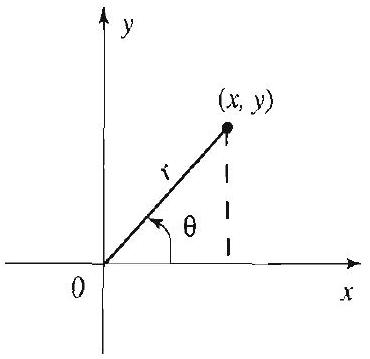

Figure 1 Polar coo

Right margin note (page 2)

are of in the is secgions. or the ch the blems circle pheres ations,
2), we hether $\pi / 2$ if ${ }^{2}$ with
tain

++++

artial Differential Equations in Polar and Cylindrical Coordinates

olacian in Various Coordinate Systems
The two dimensional Laplacian and its higher dimensional versions paramount importance in applications. They appear, for example, wave and heat equations, and also in Laplace's equation. In previou tions we solved these equations over rectangular and box shaped re To extend our applications to regions such as the disk, the sphere cylinder, it is to our advantage to use new coordinate systems in whi region and its boundary have simple expressions. For example, for pro over a disk we change to polar coordinates, where the equation of a centered at the origin reduces to $r=a$. Similarly, problems over s] are simplified by a change to spherical coordinates. For later applica in this section we express the Laplacian in various coordinate system:
The Laplacian in Polar Coordinates
We recall the relationship between rectangular and polar coordinates
$$
\begin{array}{cc}
x=r \cos \theta, & y=r \sin \theta \\
r^{2}=x^{2}+y^{2}, & \tan \theta=\frac{y}{x}
\end{array}
$$
(Since the inverse tangent takes its values in the interval $(-\pi / 2, \pi /$ have $\theta=\tan ^{-1}\left(\frac{y}{x}\right) \pm k \pi$, where $k=0,1$, or -1 , depending on w . $x>0, x<0$ and $y \geq 0$, or $x<0$ and $y<0$. Also, if $x=0$, then $\theta= y>0$ and $-\pi / 2$ if $y<0$. See Figure 1.) Differentiating $r^{2}=x^{2}+y$ respect to $x$, we obtain
$$
2 r \frac{\partial r}{\partial x}=2 x \quad \text { or } \quad \frac{\partial r}{\partial x}=\frac{x}{r} .
$$

Differentiating a second time with respect to $x$ and simplifying, we of
$$
\frac{\partial^{2} r}{\partial x^{2}}=\frac{r-x \frac{\partial r}{\partial x}}{r^{2}}=\frac{r-x \frac{x}{r}}{r^{2}}=\frac{r^{2}-x^{2}}{r^{3}}=\frac{y^{2}}{r^{3}} .
$$

Differentiating $\theta=\tan ^{-1} \frac{y}{x} \pm \pi$ with respect to $x$ yields
$$
\frac{\partial \theta}{\partial x}=\frac{1}{1+\left(\frac{y}{x}\right)^{2}}\left(-\frac{y}{x^{2}}\right)=-\frac{y}{r^{2}} .
$$

Differentiating a second time with respect to $x$ and simplifying yields
$$
\frac{\partial^{2} \theta}{\partial x^{2}}=\frac{2 y}{r^{3}} \frac{\partial r}{\partial x}=\frac{2 x y}{r^{4}} .
$$

Differentiating now with respect to $y$, we obtain in a similar way
$$
\frac{\partial r}{\partial y}=\frac{y}{r}, \frac{\partial \theta}{\partial y}=\frac{x}{r^{2}}, \text { and } \frac{\partial^{2} r}{\partial y^{2}}=\frac{x^{2}}{r^{3}}, \frac{\partial^{2} \theta}{\partial y^{2}}=-\frac{2 x y}{r^{4}} .
$$

---

<!-- Page 3 -->

Right margin note (page 3)

195

erive

Jsing
tain
$\frac{\theta}{2}$.
$\}$

++++

Section 4.1 The Laplacian in Various Coordinate Systems

(Check these identities.) From what we have done so far, it is easy to d the following interesting identities
$$
\frac{\partial^{2} \theta}{\partial x^{2}}+\frac{\partial^{2} \theta}{\partial y^{2}}=0
$$
and
$$
\frac{\partial \theta}{\partial x} \frac{\partial r}{\partial x}+\frac{\partial \theta}{\partial y} \frac{\partial r}{\partial y}=0 .
$$

We are now ready to change to polar coordinates in the Laplacian. the chain rule in two dimensions, we have
$$
\frac{\partial u}{\partial x}=\frac{\partial u}{\partial r} \frac{\partial r}{\partial x}+\frac{\partial u}{\partial \theta} \frac{\partial \theta}{\partial x} .
$$

Applying the product rule for differentiation and the chain rule, we ob
$$
\begin{aligned}
\frac{\partial^{2} u}{\partial x^{2}}= & \frac{\partial}{\partial x}\left(\frac{\partial u}{\partial r}\right) \frac{\partial r}{\partial x}+\frac{\partial u}{\partial r} \frac{\partial^{2} r}{\partial x^{2}}+\frac{\partial}{\partial x}\left(\frac{\partial u}{\partial \theta}\right) \frac{\partial \theta}{\partial x}+\frac{\partial u}{\partial \theta} \frac{\partial^{2} \theta}{\partial x^{2}} \\
= & \left(\frac{\partial^{2} u}{\partial r^{2}} \frac{\partial r}{\partial x}+\frac{\partial^{2} u}{\partial r \partial \theta} \frac{\partial \theta}{\partial x}\right) \frac{\partial r}{\partial x}+\frac{\partial u}{\partial r} \frac{\partial^{2} r}{\partial x^{2}} \\
& +\left(\frac{\partial^{2} u}{\partial r \partial \theta} \frac{\partial r}{\partial x}+\frac{\partial^{2} u}{\partial \theta^{2}} \frac{\partial \theta}{\partial x}\right) \frac{\partial \theta}{\partial x}+\frac{\partial u}{\partial \theta} \frac{\partial^{2} \theta}{\partial x^{2}} \\
= & \frac{\partial^{2} u}{\partial r^{2}}\left(\frac{\partial r}{\partial x}\right)^{2}+2 \frac{\partial^{2} u}{\partial r \partial \theta} \frac{\partial \theta}{\partial x} \frac{\partial r}{\partial x}+\frac{\partial u}{\partial r} \frac{\partial^{2} r}{\partial x^{2}} \\
& +\frac{\partial^{2} u}{\partial \theta^{2}}\left(\frac{\partial \theta}{\partial x}\right)^{2}+\frac{\partial u}{\partial \theta} \frac{\partial^{2} \theta}{\partial x^{2}} .
\end{aligned}
$$

Changing $x$ to $y$, we obtain
$$
\frac{\partial^{2} u}{\partial y^{2}}=\frac{\partial^{2} u}{\partial r^{2}}\left(\frac{\partial r}{\partial y}\right)^{2}+2 \frac{\partial^{2} u}{\partial r \partial \theta} \frac{\partial \theta}{\partial y} \frac{\partial r}{\partial y}+\frac{\partial u}{\partial r} \frac{\partial^{2} r}{\partial y^{2}}+\frac{\partial^{2} u}{\partial \theta^{2}}\left(\frac{\partial \theta}{\partial y}\right)^{2}+\frac{\partial u}{\partial \theta} \frac{\partial^{2}}{\partial y}
$$

Adding and simplifying with the help of (1) and (2), we get
$$
\begin{aligned}
\frac{\partial^{2} u}{\partial x^{2}}+\frac{\partial^{2} u}{\partial y^{2}}= & \frac{\partial^{2} u}{\partial r^{2}}\left\{\left(\frac{\partial r}{\partial x}\right)^{2}+\left(\frac{\partial r}{\partial y}\right)^{2}\right\}+2 \frac{\partial^{2} u}{\partial r \partial \theta}\left\{\frac{\partial \theta}{\partial x} \frac{\partial r}{\partial x}+\frac{\partial \theta}{\partial y} \frac{\partial r}{\partial y}\right. \\
& +\frac{\partial u}{\partial r}\left\{\frac{\partial^{2} r}{\partial x^{2}}+\frac{\partial^{2} r}{\partial y^{2}}\right\}+\frac{\partial^{2} u}{\partial \theta^{2}}\left\{\left(\frac{\partial \theta}{\partial x}\right)^{2}+\left(\frac{\partial \theta}{\partial y}\right)^{2}\right\} \\
& +\frac{\partial u}{\partial \theta}\left\{\frac{\partial^{2} \theta}{\partial x^{2}}+\frac{\partial^{2} \theta}{\partial y^{2}}\right\} \\
= & \frac{\partial^{2} u}{\partial r^{2}}\left\{\left(\frac{\partial r}{\partial x}\right)^{2}+\left(\frac{\partial r}{\partial y}\right)^{2}\right\}+\frac{\partial u}{\partial r}\left\{\frac{\partial^{2} r}{\partial x^{2}}+\frac{\partial^{2} r}{\partial y^{2}}\right\} \\
& +\frac{\partial^{2} u}{\partial \theta^{2}}\left\{\left(\frac{\partial \theta}{\partial x}\right)^{2}+\left(\frac{\partial \theta}{\partial y}\right)^{2}\right\} .
\end{aligned}
$$

---

<!-- Page 4 -->

Left margin note (page 4)

196
Chapter 4 Partial Differ

Figure 2 Cylindrical coordinates.

We should note that there is no unanimity about which spherical coordinates to call $\theta$ and which to call $\phi$. Calculus texts tend to use $\theta$ for longitude and $\phi$ for colatitude. Our notation is more common in physics texts and hence more convenient for the physical applications of Chapter 5.

Right margin note (page 4)

ssions
polar
ane as s now
$, y, z)$.

++++

ential Equations in Polar and Cylindrical Coordinates

Replacing the partial derivatives with respect to $x$ and $y$ by their expre in terms of $r$ and $\theta$, we arrive at
$$
\frac{\partial^{2} u}{\partial x^{2}}+\frac{\partial^{2} u}{\partial y^{2}}=\frac{\partial^{2} u}{\partial r^{2}}\left(\frac{x^{2}}{r^{2}}+\frac{y^{2}}{r^{2}}\right)+\frac{\partial u}{\partial r}\left(\frac{x^{2}}{r^{3}}+\frac{y^{2}}{r^{3}}\right)+\frac{\partial^{2} u}{\partial \theta^{2}}\left(\frac{x^{2}}{r^{4}}+\frac{y^{2}}{r^{4}}\right)
$$

Simplifying with the help of the identity $x^{2}+y^{2}=r^{2}$, we get the form of the Laplacian
$$
\Delta u=\nabla^{2} u=\frac{\partial^{2} u}{\partial r^{2}}+\frac{1}{r} \frac{\partial u}{\partial r}+\frac{1}{r^{2}} \frac{\partial^{2} u}{\partial \theta^{2}} .
$$

The Laplacian in Cylindrical Coordinates
If $u$ is a function of three variables $x, y$, and $z$, the Laplacian is
$$
\Delta u=\nabla^{2} u=\frac{\partial^{2} u}{\partial x^{2}}+\frac{\partial^{2} u}{\partial y^{2}}+\frac{\partial^{2} u}{\partial z^{2}} .
$$

The relationships between rectangular and cylindrical coordinates are
$$
x=\rho \cos \phi, \quad y=\rho \sin \phi, \quad z=z,
$$
where we now use $\rho$ and $\phi$ to denote polar coordinates in the $x y$-pl illustrated in Figure 2. The cylindrical form of the Laplacian evident from (3):
(4)
$$
\Delta u=\nabla^{2} u=\frac{\partial^{2} u}{\partial \rho^{2}}+\frac{1}{\rho} \frac{\partial u}{\partial \rho}+\frac{1}{\rho^{2}} \frac{\partial^{2} u}{\partial \phi^{2}}+\frac{\partial^{2} u}{\partial z^{2}} .
$$

The Laplacian in Spherical Coordinates
We will use $(r, \theta, \phi)$ to denote the spherical coordinates of the point ( $x$ We have
$$
\begin{array}{c}
x=r \cos \phi \sin \theta, \quad y=r \sin \phi \sin \theta, \quad z=r \cos \theta, \\
r^{2}=x^{2}+y^{2}+z^{2} .
\end{array}
$$

From the geometry in Figure 3, we have
$$
\rho=r \sin \theta, \quad x=\rho \cos \phi, \quad y=\rho \sin \phi, \quad \rho^{2}=x^{2}+y^{2} .
$$

---

<!-- Page 5 -->

Left margin note (page 5)

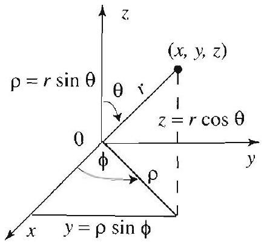

Figure 3 Spherical coordinates.

Right margin note (page 5)

197
m of
by
and

ation
$$
\partial \rho=
$$
the

++++

Section 4.1 The Laplacian in Various Coordinate Systems

Our goal is to express $\nabla^{2} u$ in terms of $r, \theta$, and $\phi$. From the polar for the Laplacian (3), we have
$$
\frac{\partial^{2} u}{\partial x^{2}}+\frac{\partial^{2} u}{\partial y^{2}}=\frac{\partial^{2} u}{\partial \rho^{2}}+\frac{1}{\rho} \frac{\partial u}{\partial \rho}+\frac{1}{\rho^{2}} \frac{\partial^{2} u}{\partial \phi^{2}}
$$

Observe that the relations
$$
z=r \cos \theta, \quad \rho=r \sin \theta
$$
are analogous to those between polar and rectangular coordinates. using again the polar form of the Laplacian with $z$ and $\rho$ (in place of $x y$ ), we get from (3)
$$
\frac{\partial^{2} u}{\partial z^{2}}+\frac{\partial^{2} u}{\partial \rho^{2}}=\frac{\partial^{2} u}{\partial r^{2}}+\frac{1}{r} \frac{\partial u}{\partial r}+\frac{1}{r^{2}} \frac{\partial^{2} u}{\partial \theta^{2}}
$$

Adding $\frac{\partial^{2} u}{\partial z^{2}}$ to (5) and using (6) gives
$$
\frac{\partial^{2} u}{\partial x^{2}}+\frac{\partial^{2} u}{\partial y^{2}}+\frac{\partial^{2} u}{\partial z^{2}}=\frac{\partial^{2} u}{\partial r^{2}}+\frac{1}{r} \frac{\partial u}{\partial r}+\frac{1}{r^{2}} \frac{\partial^{2} u}{\partial \theta^{2}}+\frac{1}{\rho} \frac{\partial u}{\partial \rho}+\frac{1}{\rho^{2}} \frac{\partial^{2} u}{\partial \phi^{2}}
$$

It remains to express $\partial u / \partial \rho$ in spherical coordinates. From the rel $\theta=\tan ^{-1}(\rho / z)$, we get
$$
\frac{\partial \theta}{\partial \rho}=\frac{1}{1+(\rho / z)^{2}} \frac{1}{z}=\frac{z}{z^{2}+\rho^{2}}=\frac{z}{r^{2}}=\frac{\cos \theta}{r} .
$$

Differentiating $\rho=r \sin \theta$ with respect to $\rho$, we get
$$
1=\frac{\partial r}{\partial \rho} \sin \theta+r \cos \theta \frac{\partial \theta}{\partial \rho}=\frac{\partial r}{\partial \rho} \sin \theta+\cos ^{2} \theta
$$

Hence
$$
\frac{\partial r}{\partial \rho}=\frac{1-\cos ^{2} \theta}{\sin \theta}=\sin \theta
$$

Now note that $\phi$ and $\rho$ are polar coordinates in the $x y$-plane, hence $\partial \phi /$ 0 . Using the chain rule, we get
$$
\frac{\partial u}{\partial \rho}=\frac{\partial u}{\partial r} \frac{\partial r}{\partial \rho}+\frac{\partial u}{\partial \theta} \frac{\partial \theta}{\partial \rho}+\frac{\partial u}{\partial \phi} \frac{\partial \phi}{\partial \rho}=\frac{\partial u}{\partial r} \frac{\rho}{r}+\frac{\partial u}{\partial \theta} \frac{\cos \theta}{r} .
$$

Substituting this in (7) and simplifying, we get the spherical form of Laplacian:
$$
\Delta u=\nabla^{2} u=\frac{\partial^{2} u}{\partial r^{2}}+\frac{2}{r} \frac{\partial u}{\partial r}+\frac{1}{r^{2}}\left(\frac{\partial^{2} u}{\partial \theta^{2}}+\cot \theta \frac{\partial u}{\partial \theta}+\csc ^{2} \theta \frac{\partial^{2} u}{\partial \phi^{2}}\right)
$$

---

<!-- Page 6 -->

Left margin note (page 6)

198
Chapter 4
4.2
Vibrati

Right margin note (page 6)

e zero.
m and opriate
e form and $\theta$ ?
$u(x, y)$
$+\beta v$ is
monic.
Write atives.] ant.
memplace by $a$.
l wave are the Lapla-

++++

artial Differential Equations in Polar and Cylindrical Coordinates

EXAMPLE 1 Use spherical coordinates to compute the Laplacian of
$$
f(x, y, z)=\ln \left(x^{2}+y^{2}+z^{2}\right), \quad(x, y, z) \neq(0,0,0) .
$$

Solution In spherical coordinates, we have
$$
f(r, \theta, \phi)=\ln r^{2}=2 \ln r
$$

Since $f$ is independent of $\theta$ and $\phi$, all partial derivatives in these variables ar From (8) we get
$$
\nabla^{2} f=\frac{\partial^{2} f}{\partial r^{2}}+\frac{2}{r} \frac{\partial f}{\partial r}=-\frac{2}{r^{2}}+\frac{4}{r^{2}}=\frac{2}{r^{2}} .
$$

Exercises 4.1
In Exercises 1-8, compute the Laplacian in an appropriate coordinate syste decide if the given function satisfies Laplace's equation $\nabla^{2} u=0$. The appr dimension is indicated by the number of variables.
1. $u(x, y)=\frac{x}{x^{2}+y^{2}}$.
2. $\quad u(x, y)=\tan ^{-1}\left(\frac{y}{x}\right)$.
3. $u(x, y)=\frac{1}{\sqrt{x^{2}+y^{2}}}$.
4. $u(x, y, z)=\frac{z}{\sqrt{x^{2}+y^{2}}}$.
5. $u(x, y, z)=\left(x^{2}+y^{2}+z^{2}\right)^{3 / 2}$.
6. $u(x, y)=\ln \left(x^{2}+y^{2}\right)$.
7. $u(x, y, z)=\left(x^{2}+y^{2}+z^{2}\right)^{-1 / 2}$.
8. $u(x, y)=\tan ^{-1}\left(\frac{y}{x}\right) \frac{y}{x^{2}+y^{2}}$.
9. (a) Show that if $u(r, \theta, \phi)$ depends only on $r$, then the Laplacian takes th $\nabla^{2} u=\frac{\partial^{2} u}{\partial r^{2}}+\frac{2}{r} \frac{\partial u}{\partial r}$.
(b) What is the form of the Laplacian if the function $u$ depends only on $r$
10. Supply all the details to derive (8) from (7).
11. Project Problem: Harmonic functions. Recall from Section 3.1 that is called a harmonic function if it satisfies Laplace's equation.
(a) Show that if $u$ and $v$ are harmonic and $\alpha$ and $\beta$ are numbers, then $\alpha u$ harmonic.
(b) Give an example of two harmonic functions $u$ and $v$ such that $u v$ is not han
(c) Show that if $u$ and $u^{2}$ are both harmonic, then $u$ must be constant. [Hint: down what it means for $u$ and $u^{2}$ to be harmonic in terms of their partial derive
(d) Show that if $u, v$ and $u^{2}+v^{2}$ are harmonic, then $u$ and $v$ must be const
ons of a Circular Membrane: Symmetric Case
In this and the next section we study the vibrations of a thin circular brane with uniform mass density, clamped along its circumference. We the center of the membrane at the origin, and we denote the radius The vibrations of the membrane are governed by the two-dimensiona equation, which will be expressed in polar coordinates, because these a coordinates best suited to this problem. Using the polar form of the

---

<!-- Page 7 -->

Left margin note (page 7)

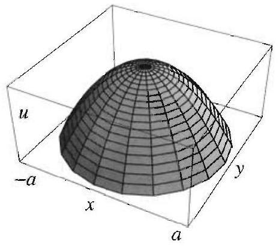

Figure 1 A radially symmetric shape.

The initial conditions are radially symmetric, so they depend only on $r$.

Right margin note (page 7)

199
es
$r, \theta)$,
ially
and
ution
and
mped
vari-
e the
m to
ation
es in
will
new,
liffer-
para-
that

++++

Section 4.2 Vibrations of a Circular Membrane: Symmetric Case
cian ((3), Section 4.1), the two dimensional wave equation become
$$
\frac{\partial^{2} u}{\partial t^{2}}=c^{2}\left(\frac{\partial^{2} u}{\partial r^{2}}+\frac{1}{r} \frac{\partial u}{\partial r}+\frac{1}{r^{2}} \frac{\partial^{2} u}{\partial \theta^{2}}\right)
$$

The initial shape of the membrane will be modeled by the function $f($ and its initial velocity by $g(r, \theta)$.

In this section we confine our study to the case where $f$ and $g$ are rad symmetric or axisymmetric, that is, they depend only on the radius not on $\theta$. It is reasonable on physical grounds that in this case the sol also does not depend on $\theta$ (see Figure 1). Consequently, $\partial u / \partial \theta=0$ (1) becomes
$$
\frac{\partial^{2} u}{\partial t^{2}}=c^{2}\left(\frac{\partial^{2} u}{\partial r^{2}}+\frac{1}{r} \frac{\partial u}{\partial r}\right),
$$
where $u=u(r, t), 0<r<a$, and $t>0$. Since the membrane is clan at the circumference, we have the boundary condition
$$
u(a, t)=0, \quad t \geq 0
$$

The radially symmetric initial conditions are
$$
u(r, 0)=f(r), \quad \frac{\partial u}{\partial t}(r, 0)=g(r), \quad 0<r<a .
$$

We solve the boundary value problem (2)-(4) using the separation of ables method, as we did throughout Chapter 3. The goal is to separat variables in the partial differential equation (2) and reduce the proble two ordinary differential equations in $r$ and $t$. As you will see, the equ in $t$ is the same as the one that we obtained after separating variabl the wave equation in rectangular coordinates. Hence the solution in consist of sines and cosines. The equation in the spatial variable $r$ is and its solution will involve the so-called Bessel functions.

Separating Variables
We assume that the solution is of the form $u(r, t)=R(r) T(t)$. After d entiating, plugging into (2), and separating variables, we get
$$
\frac{T^{\prime \prime}}{c^{2} T}=\frac{1}{R}\left(R^{\prime \prime}+\frac{1}{r} R^{\prime}\right)=-\lambda^{2}
$$

Because we expect periodic solutions in $T$, we have set the sign of the se tion constant negative. (For a more rigorous argument based on the fact

---

<!-- Page 8 -->

Left margin note (page 8)

200
Chapter 4 Partial Differ

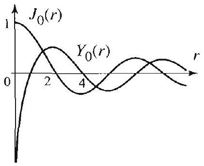

Figure 2 The Bessel functions of order 0 .

Right margin note (page 8)

ion of itions para-aramations is, we eneral called re deo the ted in gure 2 ected las to on on $=0 \mathrm{in}$
gests,

Thus

++++

ential Equations in Polar and Cylindrical Coordinates
the solution in $R$ should be bounded in the interval $[0, a]$, see the solut the Dirichlet problem in Section 4.5.) Hence
$$
\begin{array}{c}
r R^{\prime \prime}+R^{\prime}+\lambda^{2} r R=0, \quad R(a)=0 \quad(\text { from }(3)), \\
T^{\prime \prime}+c^{2} \lambda^{2} T=0 .
\end{array}
$$

Solving the Separated Equations
Here again, we begin by solving the equation with the boundary cond to narrow down the possible solutions. Equation (5) is known as the metric form of Bessel's equation of order zero (here $\lambda$ is the p eter). This equation arises so frequently in applications that its solu have been named. Since the equation is second order and homogeneor need only two linearly independent solutions to be able to write its g solution. By convention, these two linearly independent solutions are Bessel functions of order 0 of the first and second kind, and a noted $J_{0}(\lambda r)$ and $Y_{0}(\lambda r)$, respectively. Hence the general solution parametric form of Bessel's equation in (5) is
$$
R(r)=c_{1} J_{0}(\lambda r)+c_{2} Y_{0}(\lambda r),
$$
where $r>0$ (Theorem 3, Section 4.8). The functions $J_{0}$ and $Y_{0}$ are trea great detail in Sections 4.7-4.9; here we recall facts only as needed. Fig shows the graphs of $J_{0}$ and $Y_{0}$.

Since on physical grounds the solutions to the wave equation are exp to be bounded, it follows that the spatial part of the solution, $R(r)$, be bounded near $r=0$. This is effectively a second boundary conditi $R$. Now the fact that $Y_{0}$ is unbounded near 0 forces us to choose $c_{2}=$ (7). To avoid trivial solutions, we will take $c_{1}=1$ and get
$$
R(r)=J_{0}(\lambda r)
$$

The condition $R(a)=0$ (see (5)) implies that
$$
J_{0}(\lambda a)=0
$$
and so $\lambda a$ must be a root of the Bessel function $J_{0}$. As Figure 2 sug $J_{0}$ has infinitely many positive zeros, which we denote by
$$
\alpha_{1}<\alpha_{2}<\alpha_{3}<\cdots<\alpha_{n}<\cdots
$$
(For a proof of this fact, see Section 4.9, or Exercise 35, Section 4.8.)
$$
\lambda=\lambda_{n}=\frac{\alpha_{n}}{a}, \quad n=1,2, \ldots,
$$

---

<!-- Page 9 -->

Right margin note (page 9)

201

gous usly, only y the ciple, and that gous arise m 2, 4.8,
eries from

++++

Section 4.2 Vibrations of a Circular Membrane: Symmetric Case

and the corresponding solutions of (5) are
$$
R_{n}(r)=J_{0}\left(\frac{\alpha_{n}}{a} r\right), \quad n=1,2, \ldots,
$$
where $\alpha_{n}$ is the $n$th positive zero of $J_{0}$. These solutions are analo to the solutions $\sin \frac{n \pi}{L} x$ that we have encountered several times previo in particular, while solving the one dimensional wave equation. The difference is that the function sine and its zeros $n \pi$ are now replaced by function $J_{0}$ and its zeros $\alpha_{n}$. Returning to (6) with $\lambda=\lambda_{n}$, we find
$$
T(t)=T_{n}(t)=A_{n} \cos c \lambda_{n} t+B_{n} \sin c \lambda_{n} t
$$

We thus obtain the product solutions of (2) and (3)
$$
u_{n}(r, t)=\left(A_{n} \cos c \lambda_{n} t+B_{n} \sin c \lambda_{n} t\right) J_{0}\left(\lambda_{n} r\right) \quad n=1,2, \ldots
$$

Bessel Series Solution of the Entire Problem
To satisfy the initial conditions, motivated by the superposition princ we let
$$
u(r, t)=\sum_{n=1}^{\infty}\left(A_{n} \cos c \lambda_{n} t+B_{n} \sin c \lambda_{n} t\right) J_{0}\left(\lambda_{n} r\right) .
$$

We determine the unknown coefficients by evaluating the series at $t=0$ using the initial conditions. We get from the first condition in (4)
$$
u(r, 0)=f(r)=\sum_{n=1}^{\infty} A_{n} J_{0}\left(\lambda_{n} r\right), \quad 0<r<a .
$$

This series representation of $f(r)$ is akin to a Fourier sine series, except the sine functions are now replaced by Bessel functions. There are analo expansion theorems that apply in such cases; the series expansions that are known as Bessel, or Fourier-Bessel, expansions (see Theore Section 4.8). For the case at hand, we make use of Theorem 2, Section with $p=0$. The Bessel coefficients $A_{n}$ are given by
$$
A_{n}=\frac{2}{a^{2} J_{1}^{2}\left(\alpha_{n}\right)} \int_{0}^{a} f(r) J_{0}\left(\lambda_{n} r\right) r d r
$$
where $J_{1}$ is the Bessel function of order 1. Now, differentiating the s for $u$ term by term with respect to $t$, and then setting $t=0$, we get the second initial condition
$$
u_{t}(r, 0)=g(r)=\sum_{n=1}^{\infty} c \lambda_{n} B_{n} J_{0}\left(\lambda_{n} r\right) .
$$

---

<!-- Page 10 -->

Left margin note (page 10)

202
Chapter 4 P

THEO
WAVE EQUAT
I
COORDI

There is a clear a tween the solution the solution of dimensional wave (8), Section 3.3. Th ference is that spa tions are now dete Bessel functions ra the simpler sine fur

From (7), Section 4.
$$
\begin{array}{r}
\int x^{p+1} J_{p}(x) d x \\
x^{p+1} J_{p+1}(x)
\end{array}
$$

Right margin note (page 10)

(2)
ate inny integral ation,
back in the

++++

artial Differential Equations in Polar and Cylindrical Coordinates

Thus $c \lambda_{n} B_{n}=c \frac{\alpha_{n}}{a} B_{n}$ is the $n$th Bessel coefficient of $g$, and so
$$
B_{n}=\frac{2}{c \alpha_{n} a J_{1}^{2}\left(\alpha_{n}\right)} \int_{0}^{a} g(r) J_{0}\left(\lambda_{n} r\right) r d r
$$

This completely determines the solution.

REM 1 [ON IN POLAR NATES
nalogy be(9) and the oneequation e only diftial variarmined by ther than actions.

The solution of the radially symmetric two-dimensional wave equat with boundary and initial conditions (3) and (4) is
$$
u(r, t)=\sum_{n=1}^{\infty}\left(A_{n} \cos c \lambda_{n} t+B_{n} \sin c \lambda_{n} t\right) J_{0}\left(\lambda_{n} r\right)
$$
where
$$
A_{n}=\frac{2}{a^{2} J_{1}^{2}\left(\alpha_{n}\right)} \int_{0}^{a} f(r) J_{0}\left(\lambda_{n} r\right) r d r
$$
$$
\begin{array}{c}
B_{n}=\frac{2}{c \alpha_{n} a J_{1}^{2}\left(\alpha_{n}\right)} \int_{0}^{a} g(r) J_{0}\left(\lambda_{n} r\right) r d r \\
\lambda_{n}=\frac{\alpha_{n}}{a}, \quad \text { and } \quad \alpha_{n}=n \text {th positive zero of } J_{0}
\end{array}
$$

When applying (10) in concrete situations, we are required to evalua tegrals involving Bessel functions that are quite complicated. In ma teresting cases these integrals can be evaluated with the help of in formulas developed in the exercises and in Section 4.8. As an illust, consider the integral
$$
\int_{0}^{a} x^{p+1} J_{p}\left(\frac{\alpha}{a} x\right) d x, \quad p \geq 0, \alpha>0
$$

Let $u=\frac{\alpha}{a} x, d u=\frac{\alpha}{a} d x$, then
$$
\begin{aligned}
\int x^{p+1} J_{p}\left(\frac{\alpha}{a} x\right) d x & =\frac{a^{p+2}}{\alpha^{p+2}} \int u^{p+1} J_{p}(u) d u \\
& =\frac{a^{p+2}}{\alpha^{p+2}} u^{p+1} J_{p+1}(u)+C,
\end{aligned}
$$
where the last equality follows from (7), Section 4.8. Substituting $u=\frac{\alpha x}{a}$, simplifying, and then evaluating at $x=0$ and $x=a$, we obta very useful identity
$$
\int_{0}^{a} x^{p+1} J_{p}\left(\frac{\alpha}{a} x\right) d x=\frac{a^{p+2}}{\alpha} J_{p+1}(\alpha)
$$

---

<!-- Page 11 -->

Right margin note (page 11)

203
edges
hape
quent
$=0$.
early Since uted uter $x)=$ on in es of

++++

Section 4.2 Vibrations of a Circular Membrane: Symmetric Case

EXAMPLE 1 A circular membrane with constant initial velocity
An explosion near the surface of a flexible circular membrane with clamped imparts a uniform initial velocity equal to $-100 \mathrm{~m} / \mathrm{sec}$. Assume the initial s of the membrane to be flat, take $a=1$ and $c=100$, and determine the subsec vibrations of the membrane.
Solution The solution is given by (9), where $A_{n}=0$ for all $n$, since $f(r)$ From (10) we have
$$
\begin{aligned}
B_{n} & =\frac{-2}{\alpha_{n} J_{1}^{2}\left(\alpha_{n}\right)} \int_{0}^{1} J_{0}\left(\alpha_{n} r\right) r d r \\
& =\frac{-2}{\alpha_{n}^{2} J_{1}\left(\alpha_{n}\right)} \quad(\text { by }(11) \text { with } p=0)
\end{aligned}
$$

Thus, from (9), we obtain the solution
$$
u(r, t)=\sum_{n=1}^{\infty} \frac{-2}{\alpha_{n}^{2} J_{1}\left(\alpha_{n}\right)} \sin \left(100 \alpha_{n} t\right) J_{0}\left(\alpha_{n} r\right) .
$$

To get numerical values from our answer in Example 1, it is cle necessary to know the values of the zeros of the Bessel function $J_{0}$. these values are useful in solving many problems, they have been comp and tabulated to a high degree of accuracy. With the help of a comp system, we approximated the first five positive roots of the equation $J_{0}($ 0 . These and other relevant numerical data are given in Table 1.

\begin{table}
| $j$ | 1 | 2 | 3 | 4 | 5 |
| :---: | :---: | :---: | :---: | :---: | :---: |
| $\alpha_{j}$ | 2.4048 | 5.5201 | 8.6537 | 11.7915 | 14.9309 |
| $J_{1}\left(\alpha_{j}\right)$ | .5191 | -.3403 | .2714 | -.2325 | .2065 |
| $\frac{-2}{\alpha_{j}^{2} J_{1}\left(\alpha_{j}\right)}$ | -0.6662 | 0.1929 | -.0984 | 0.0619 | -0.0434 |
\captionsetup{labelformat=empty}
\caption{Table 1 Numerical data for Example 1.}
\end{table}

With the help of this table, we find the first three terms of the solutic Example 1:
$$
\begin{aligned}
u(r, t) \approx & -0.6662 J_{0}(2.40 r) \sin (240 t) \\
& +0.1929 J_{0}(5.52 r) \sin (552 t)-.0984 J_{0}(8.65 r) \sin (865 t)
\end{aligned}
$$

We used these terms to plot the shape of the membrane at various valu $t>0$ in Figure 3.

---

<!-- Page 12 -->

Left margin note (page 12)

204
Chapter 4

As expected, soon explosion, the elas brane starts to vibr ward.

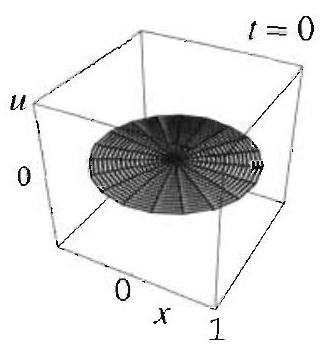

Figure 3 Vibratin membrane with ra metry in Example 1

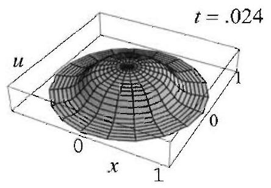

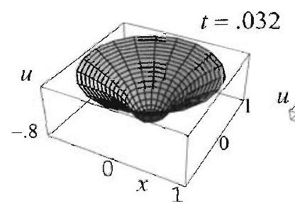

Right margin note (page 12)

. 016
. 04
onzero

1 shape
undary
$n$ since
0 ). We
ls, $v=$

++++

artial Differential Equations in Polar and Cylindrical Coordinates
after the tic memate down-
g circular dial sym-

The next example treats the case of a vibrating membrane with n initial displacement and zero initial velocity.

EXAMPLE 2 A circular membrane with radially symmetric initia Solve the boundary value problem (2)-(4), given that
$$
f(r)=1-r^{2}, \quad g(r)=0, \quad a=c=1 .
$$

Solution Note that the problem is radially symmetric because of the bo and initial conditions. The solution is given by (9), where $B_{n}=0$ for all $g(r)=0$, and $A_{n}$ is the Bessel coefficient of the function $1-r^{2}$, given by ( 1 have
$$
\begin{aligned}
A_{n} & =\frac{2}{J_{1}^{2}\left(\alpha_{n}\right)} \int_{0}^{1}\left(1-r^{2}\right) J_{0}\left(\alpha_{n} r\right) r d r \\
& =\frac{2}{\alpha_{n}^{4} \frac{J_{1}^{2}\left(\alpha_{n}\right)}{\alpha_{n}}} \int_{0}^{\alpha_{n}}\left(\alpha_{n}^{2}-s^{2}\right) J_{0}(s) s d s \quad\left(s=\alpha_{n} r\right)
\end{aligned}
$$

Integrating by parts, with $u=\alpha_{n}^{2}-s^{2}, d v=J_{0}(s) s d s$, and hence $d u=-2 s c J_{1}(s) s$ (by (7), Section 4.8 , with $p=0$ ), we find
$$
\begin{aligned}
A_{n} & =\frac{2}{\alpha_{n}^{4} J_{1}^{2}\left(\alpha_{n}\right)}\left[\left.\left(\alpha_{n}^{2}-s^{2}\right) J_{1}(s) s\right|_{0} ^{\alpha_{n}}+2 \int_{0}^{\alpha_{n}} J_{1}(s) s^{2} d s\right] \\
& =\frac{4}{\alpha_{n}^{4} J_{1}^{2}\left(\alpha_{n}\right)} \int_{0}^{\alpha_{n}} J_{1}(s) s^{2} d s
\end{aligned}
$$

To evaluate the integral, we appeal to (11) and arrive at
$$
A_{n}=\frac{4}{\alpha_{n}^{2} J_{1}^{2}\left(\alpha_{n}\right)} J_{2}\left(\alpha_{n}\right) .
$$

---

<!-- Page 13 -->

Left margin note (page 13)

From (6), Section 4.8,
$$
J_{p+1}(x)=\frac{2 p}{x} J_{p}(x)-J_{p-1}(x) .
$$

Figure 4 Partial sums of Bessel series.

Right margin note (page 13)

205

tion. n yet $=1$,
lacein ome
tion we all a give lata. y to
data. five ne at

++++

Section 4.2 Vibrations of a Circular Membrane: Symmetric Case

At this point, we could appeal to (9) to write the explicit form of the solu However, before doing so, we mention one more worthy simplification based o another property of Bessel functions. Appealing to (6), Section 4.8, with $p$ and recalling that $\alpha_{n}$ is a zero of $J_{0}$, we find
$$
J_{2}\left(\alpha_{n}\right)=\frac{2}{\alpha_{n}} J_{1}\left(\alpha_{n}\right)
$$
and hence
$$
A_{n}=\frac{8}{\alpha_{n}^{3} J_{1}\left(\alpha_{n}\right)}
$$

Thus, from (9), we obtain the solution
$$
u(r, t)=\sum_{n=1}^{\infty} \frac{8}{\alpha_{n}^{3} J_{1}\left(\alpha_{n}\right)} \cos \left(\alpha_{n} t\right) J_{0}\left(\alpha_{n} r\right)
$$

Setting $t=0$ in the solution of Example 2, we should get the initial disp. ment, that is, we should get
$$
1-r^{2}=\sum_{n=1}^{\infty} \frac{8}{\alpha_{n}^{3} \frac{1}{J_{1}\left(\alpha_{n}\right)}} J_{0}\left(\alpha_{n} r\right), \quad 0<r<1 .
$$

This is the Bessel series of the function $1-r^{2}$ that we have compute passing as we worked out the solution to Example 2. Figure 4 shows s partial sums of this series converging to $1-r^{2}, 0<r<1$.

We end this section with a remark concerning the physical interprets of the solution of Example 2. In our derivation of the wave equation always assumed small displacements, but you may not be willing to c unit displacement at the center of a drum of unit radius small. To our problem a meaningful interpretation, we could rescale the initial Because of the linearity of the boundary value problem this leads on the same rescaling of the solution.

Exercises 4.2
In Exercises 1-8, solve the vibrating membrane problem (2)-(4) for the given If possible, with the help of a computer, find numerical values for the firs nonzero coefficients of the series solution and plot the shape of the membra various values of $t$. (Formula (11) is useful in all these exercises.)
1. $a=2, c=1, f(r)=0, g(r)=1$.
2. $a=1, c=10, f(r)=1-r^{2}, g(r)=1$.
3. $a=1, c=1, f(r)=0$,
$$
g(r)=\left\{\begin{array}{ll}
1 & \text { if } 0<r<\frac{1}{2}, \\
0 & \text { if } \frac{1}{2}<r<1 .
\end{array}\right.
$$
[Hint: Follow Example 1.]

---

<!-- Page 14 -->

Left margin note (page 14)

206
Chapter 4
Pa

Right margin note (page 14)

undary

What
$$
t=3,
$$
answer

++++

tial Differential Equations in Polar and Cylindrical Coordinates
4. $a=1, c=1, f(r)=0, g(r)=J_{0}\left(\alpha_{3} r\right)$.
[Hint: Orthogonality relations in Section 4.8.]
5. $a=1, c=1, f(r)=J_{0}\left(\alpha_{1} r\right), g(r)=0$.
[Hint: Orthogonality relations in Section 4.8.]
6. $a=2, c=1, f(r)=1-r, g(r)=0$.
7. $a=1, c=1, f(r)=J_{0}\left(\alpha_{3} r\right), g(r)=1-r^{2}$.
8. $a=1, c=1, f(r)=\frac{1}{128}\left(3-4 r^{2}+r^{4}\right), g(r)=0$.
[Hint: Integration by parts, Example 2.]
9. (a) Find the solution in Exercise 3 for an arbitrary value of $c>0$.
(b) Describe what happens to the solution as $c$ increases.
10. Project Problem: Radially symmetric heat equation on a disl Use the methods of this section to show that the solution of the heat bo value problem
$$
\begin{array}{cl}
\frac{\partial u}{\partial t}=c^{2}\left(\frac{\partial^{2} u}{\partial r^{2}}+\frac{1}{r} \frac{\partial u}{\partial r}\right), & 0<r<a, t>0, \\
u(a, t)=0, & t>0, \\
u(r, 0)=f(r), & 0<r<a,
\end{array}
$$
is
$$
u(r, t)=\sum_{n=1}^{\infty} A_{n} e^{-c^{2} \lambda_{n}^{2} t} J_{0}\left(\lambda_{n} r\right)
$$
with
$$
A_{n}=\frac{2}{a^{2} J_{1}^{2}\left(\alpha_{n}\right)} \int_{0}^{a} f(r) J_{0}\left(\lambda_{n} r\right) r d r
$$
where $\lambda_{n}=\frac{\alpha_{n}}{a}$, and $\alpha_{n}=n$th positive zero of $J_{0}$.
11. (a) Solve the heat problem of Exercise 10 when $f(r)=100,0<r<a$. does your solution represent?
(b) Approximate the temperature of the hottest point on the plate at time given that $a=1$ and $c=1$. Where is this point on the plate? Justify your intuitively.
12. Project Problem: Integral identities with Bessel functions.
(a) Use (7) and (8), Section 4.8, to establish the identities
$$
\int J_{1}(x) d x=-J_{0}(x)+C \quad \text { and } \quad \int x J_{0}(x) d x=x J_{1}(x)+C
$$

In the rest of this problem we generalize these identities.
(b) By integrating (5), Section 4.8, show that
$$
\int J_{p+1}(x) d x=\int J_{p-1}(x) d x-2 J_{p}(x)
$$
(c) Use the first integral in (a), (b), and induction to establish that
$$
\int J_{2 n+1}(x) d x=-J_{0}(x)-2 \sum_{k=1}^{n} J_{2 k}(x)+C, \quad n=0,1,2, \ldots
$$

---

<!-- Page 15 -->

Left margin note (page 15)

4.3 Vibratio

Right margin note (page 15)

207
hout
vave
eflec-
ions
rane

++++

Section 4.3 Vibrations of a Circular Membrane: General Case

As an illustration, derive the following identities:
$$
\begin{array}{c}
\int J_{3}(x) d x=-J_{0}(x)-2 J_{2}(x)+C \\
\int J_{5}(x) d x=-J_{0}(x)-2 J_{2}(x)-2 J_{4}(x)+C
\end{array}
$$
(d) By integrating (3), Section 4.8, show that
$$
x J_{p+1}(x)+p \int J_{p+1}(x) d x=\int x J_{p}(x) d x
$$
[Hint: Evaluate the integral of $x J_{p}^{\prime}(x)$ by parts.]
(e) Take $p=2 n$ in (d) and use (c) to prove that for $n=0,1,2, \ldots$,
$$
\int x J_{2 n}(x) d x=x J_{2 n+1}(x)-2 n J_{0}(x)-4 n \sum_{k=1}^{n} J_{2 k}(x)+C
$$

Derive the following identities:
$$
\begin{array}{c}
\int x J_{2}(x) d x=x J_{3}(x)-2 J_{0}(x)-4 J_{2}(x)+C \\
\int x J_{4}(x) d x=x J_{5}(x)-4 J_{0}(x)-8 J_{2}(x)-8 J_{4}(x)+C
\end{array}
$$
ns of a Circular Membrane: General Case
We continue our study of the vibrating circular membrane, now wit any symmetry assumptions. We will solve the two dimensional v equation in polar coordinates:
$$
\frac{\partial^{2} u}{\partial t^{2}}=c^{2}\left(\frac{\partial^{2} u}{\partial r^{2}}+\frac{1}{r} \frac{\partial u}{\partial r}+\frac{1}{r^{2}} \frac{\partial^{2} u}{\partial \theta^{2}}\right),
$$
where $0<r<a, 0<\theta<2 \pi, t>0$. Here $u=u(r, \theta, t)$ denotes the de tion of the membrane at the point $(r, \theta)$ at time $t$. The initial condit (displacement and velocity) are
$$
u(r, \theta, 0)=f(r, \theta), \quad \frac{\partial u}{\partial t}(r, \theta, 0)=g(r, \theta),
$$
$0<r<a, 0<\theta<2 \pi$. The requirement that the edges of the memb be held fixed translates into the boundary condition
$$
u(a, \theta, t)=0, \quad 0<\theta<2 \pi, t>0
$$

---

<!-- Page 16 -->

Left margin note (page 16)

208
Chapter 4
Partial Differ

Right margin note (page 16)

point, in $\theta$.
oundnd set sepa-
refore, $T$, we
ecause ndary To ilarly, e have

++++

ential Equations in Polar and Cylindrical Coordinates

Since $\theta$ is a polar angle, $(r, \theta)$ and $(r, \theta+2 \pi)$ represent the same and hence $u(r, \theta, t)=u(r, \theta+2 \pi, t)$. In other words, $u$ is $2 \pi$-periodi Consequently,
$$
u(r, 0, t)=u(r, 2 \pi, t) \quad \text { and } \quad \frac{\partial u}{\partial \theta}(r, 0, t)=\frac{\partial u}{\partial \theta}(r, 2 \pi, t) .
$$

Separation of Variables
We start by deriving the general solution of (1) subject to the ary condition (3). We use the method of separation of variables a $u(r, \theta, t)=R(r) \Theta(\theta) T(t)$. Differentiating $u$, substituting into (1), and rating variables gives
$$
\frac{T^{\prime \prime}}{c^{2} T}=\frac{R^{\prime \prime}}{R}+\frac{R^{\prime}}{r R}+\frac{\Theta^{\prime \prime}}{r^{2} \Theta}
$$

The left side depends only on $t$ and the right side only on $r$ and $\theta$. Ther each side must equal a constant $k$. Expecting periodic solutions in take $k=-\lambda^{2}$. Thus
$$
\frac{T^{\prime \prime}}{c^{2} T}=-\lambda^{2}, \quad \text { and } \quad \frac{R^{\prime \prime}}{R}+\frac{R^{\prime}}{r R}+\frac{\Theta^{\prime \prime}}{r^{2} \Theta}=-\lambda^{2}
$$

Separating variables in the second equation we get
$$
\lambda^{2} r^{2}+\frac{r^{2} R^{\prime \prime}}{R}+\frac{r R^{\prime}}{R}=\mu^{2} \quad \text { and } \quad-\frac{\Theta^{\prime \prime}}{\Theta}=\mu^{2} .
$$

We have chosen a nonnegative sign for the separating constant $\mu^{2}$ b the solutions of the equation in $\Theta$ have to be $2 \pi$-periodic. The bou condition (3) becomes $R(a) \Theta(\theta) T(t)=0$ for $0<\theta<2 \pi$ and $t>0$ avoid the trivial solution, we impose the condition $R(a)=0$. Sim using (4), we find that $\Theta(0)=\Theta(2 \pi)$ and $\Theta^{\prime}(0)=\Theta^{\prime}(2 \pi)$. Thus w arrived at the following separated equations:
$$
\begin{array}{c}
\Theta^{\prime \prime}+\mu^{2} \Theta=0, \quad \Theta(0)=\Theta(2 \pi), \quad \Theta^{\prime}(0)=\Theta^{\prime}(2 \pi) \\
r^{2} R^{\prime \prime}+r R^{\prime}+\left(\lambda^{2} r^{2}-\mu^{2}\right) R=0, \quad R(a)=0 \\
T^{\prime \prime}+c^{2} \lambda^{2} T=0
\end{array}
$$

---

<!-- Page 17 -->

Left margin note (page 17)

Note that we start with the $\Theta$ equation, since we have a full complement of boundary conditions for it, and it contains only one separation constant. After determining that $\mu=m, m=0,1,2,3, \ldots$, we can turn to the equation in $R$ and determine which values of the separation constant $\lambda$ allow for nontrivial solutions. The $T$ equation is dealt with last.

We get $J_{m}$ 's here, and not $Y_{m}$ 's or a combination of $J_{m}$ 's and $Y_{m}$ 's because, on physical grounds, we insist that our solutions remain bounded at $r=0$.

Right margin note (page 17)

209
If
To
Set- ch is tion ions ions
the thile fact, s we $=0$

++++

Section 4.3 Vibrations of a Circular Membrane: General Case

Solving the Separated Equations
We begin by solving for $\Theta$. For $\mu=0$ the solution is a constant $A_{0}$. $\mu \neq 0$, the general solution is of the form $\Theta(\theta)=c_{1} \cos \mu \theta+c_{2} \sin \mu \theta$. satisfy the boundary conditions we must take $\mu$ to be an integer. Thus
$$
\Theta_{m}(\theta)=A_{m} \cos m \theta+B_{m} \sin m \theta, \quad m=0,1,2, \ldots .
$$
(Note that negative values of $m$ do not contribute any new solutions.) ting $\mu=m$ in the equation for $R$, we get
$$
r^{2} R^{\prime \prime}+r R^{\prime}+\left(\lambda^{2} r^{2}-m^{2}\right) R=0, \quad R(a)=0 .
$$

This is the parametric form of Bessel's equation of order $m$ whic treated in Theorem 3, Section 4.8. Quoting from this theorem, we have
$$
R(r)=R_{m n}(r)=J_{m}\left(\lambda_{m n} r\right), \quad m=0,1,2, \ldots, n=1,2, \ldots,
$$
where $\lambda_{m n}=\alpha_{m n} / a$ and $\alpha_{m n}$ is the $n$th positive zero of the Bessel func $J_{m}$. For $\lambda=\lambda_{m n}$ the equation in $T$ becomes $T^{\prime \prime}+c^{2} \lambda_{m n}^{2} T=0$ with solut
$$
A_{m n} \cos c \lambda_{m n} t \quad \text { and } \quad B_{m n} \sin c \lambda_{m n} t .
$$

Using the expressions for $R, \Theta$, and, $T$, we arrive at the product solut of (1) and (3):
$$
u_{m n}(r, \theta, t)=J_{m}\left(\lambda_{m n} r\right)\left(a_{m n} \cos m \theta+b_{m n} \sin m \theta\right) \cos c \lambda_{m n} t
$$
and
$$
u_{m n}^{*}(r, \theta, t)=J_{m}\left(\lambda_{m n} r\right)\left(a_{m n}^{*} \cos m \theta+b_{m n}^{*} \sin m \theta\right) \sin c \lambda_{m n} t,
$$
where $m=0,1,2, \ldots, n=1,2, \ldots$. Note that we have replaced coefficient $A_{m} A_{m n}$ by $a_{m n}$, and similarly for $b_{m n}, a_{m n}^{*}$, and $b_{m n}^{*}$. this may appear to be just relabeling of the unknown coefficients, in it provides a more convenient choice of solutions that will be needed a proceed. Note too that $b_{0 n}$ and $b_{0 n}^{*}$ will never be needed, since $\sin m \theta$ when $m=0$, and so for the sake of definiteness we take them to be 0 .

---

<!-- Page 18 -->

Left margin note (page 18)

210
Chapter 4 Partial Differ

Right margin note (page 18)

d (6). lexity nitial zero.
on are e form
ctions pondortant 1 and ties of he use coeffi2, we

++++

ential Equations in Polar and Cylindrical Coordinates

Superposition Principle and the General Solution
The superposition principle suggests adding all the functions in (5) an The resulting sum is displayed in (16) below. Because of the comp of this solution, we consider two cases separately: one in which the velocity $g$ is zero, and a second in which the initial displacement $f$ is The general solution is then obtained by combining these two cases.

EXAMPLE 1 Vibrations of a membrane with zero initial velocity Solve the boundary value problem consisting of (1)-(3) given that $g=0$.
Solution The initial conditions in this case are
$$
u(r, \theta, 0)=f(r, \theta), \quad \frac{\partial u}{\partial t}(r, \theta, 0)=0, \quad 0<r<a, 0<\theta<2 \pi .
$$

It is easily seen that the only product solutions that meet the second conditi those given by (5). Thus the superposition principle suggests a solution of th
$$
u(r, \theta, t)=\sum_{m=0}^{\infty} \sum_{n=1}^{\infty} J_{m}\left(\lambda_{m n} r\right)\left(a_{m n} \cos m \theta+b_{m n} \sin m \theta\right) \cos c \lambda_{m n} t .
$$

Setting $t=0$, we get
$$
f(r, \theta)=\sum_{m=0}^{\infty} \sum_{n=1}^{\infty} J_{m}\left(\lambda_{m n} r\right)\left(a_{m n} \cos m \theta+b_{m n} \sin m \theta\right) .
$$

This surely is a sort of a generalized Fourier series of $f(r, \theta)$ in terms of the fun $J_{m}\left(\lambda_{m n} r\right) \cos m \theta$ and $J_{m}\left(\lambda_{m n} r\right) \sin m \theta$, and hence $a_{m n}$ and $b_{m n}$ are the corres ing generalized Fourier coefficients of the function $f$. This fact and many imp related applications are explored in Section 4.6 (see in particular Theorems 2 of that section). We now proceed to determine $a_{m n}$ and $b_{m n}$, using proper the usual Fourier series and Bessel series.

Fix $r$ and think of $f(r, \theta)$ as a ( $2 \pi$-periodic) function of $\theta$. To facilitate t of Fourier series, we write (8) as
$$
\begin{aligned}
f(r, \theta)= & \overbrace{\sum_{n=1}^{\infty} a_{0 n} J_{0}\left(\lambda_{0 n} r\right)}^{=a_{0}(r)}+\sum_{m=1}^{\infty}\{\overbrace{\left(\sum_{n=1}^{\infty} a_{m n} J_{m}\left(\lambda_{m n} r\right)\right)}^{=a_{m}(r)} \cos m \theta \\
& +\overbrace{\left(\sum_{n=1}^{\infty} b_{m n} J_{m}\left(\lambda_{m n} r\right)\right)}^{=b_{m}(r)} \sin m \theta\} \\
= & a_{0}(r)+\sum_{m=1}^{\infty}\left(a_{m}(r) \cos m \theta+b_{m}(r) \sin m \theta\right)
\end{aligned}
$$

Now we see clearly that (for fixed $r$ ) $a_{0}(r), a_{m}(r)$, and $b_{m}(r)$ are the Fourier cients in the Fourier series expansion of $\theta \mapsto f(r, \theta)$. Using (2)-(4), Section 2

---

<!-- Page 19 -->

Left margin note (page 19)

A USEFUL IDENTITY

Right margin note (page 19)

211

essel
$n(r)$,
(17),
on of
□
y in-
n the

++++

Section 4.3 Vibrations of a Circular Membrane: General Case

conclude that
$$
\begin{array}{c}
a_{0}(r)=\frac{1}{2 \pi} \int_{0}^{2 \pi} f(r, \theta) d \theta=\sum_{n=1}^{\infty} a_{0 n} J_{0}\left(\lambda_{0 n} r\right), \\
a_{m}(r)=\frac{1}{\pi} \int_{0}^{2 \pi} f(r, \theta) \cos m \theta d \theta=\sum_{n=1}^{\infty} a_{m n} J_{m}\left(\lambda_{m n} r\right), \\
b_{m}(r)=\frac{1}{\pi} \int_{0}^{2 \pi} f(r, \theta) \sin m \theta d \theta=\sum_{n=1}^{\infty} b_{m n} J_{m}\left(\lambda_{m n} r\right),
\end{array}
$$
for $m=1,2, \ldots$. Now let $r$ vary and think of the last three series as the B series expansions of order $m=0,1,2, \ldots$ of the functions $a_{0}(r), a_{m}(r)$, and $b_{7}$ respectively. The coefficients in these series are Bessel coefficients and so from Section 4.8, we obtain
$$
\begin{array}{c}
a_{0 n}=\frac{2}{a^{2} J_{1}^{2}\left(\alpha_{0 n}\right)} \int_{0}^{a} a_{0}(r) J_{0}\left(\lambda_{0 n} r\right) r d r, \\
a_{m n}=\frac{2}{a^{2} J_{m+1}^{2}\left(\alpha_{m n}\right)} \int_{0}^{a} a_{m}(r) J_{m}\left(\lambda_{m n} r\right) r d r, \\
b_{m n}=\frac{2}{a^{2} J_{m+1}^{2}\left(\alpha_{m n}\right)} \int_{0}^{a} b_{m}(r) J_{m}\left(\lambda_{m n} r\right) r d r,
\end{array}
$$

Now using (9)-(11), we get
$$
\begin{array}{c}
a_{0 n}=\frac{1}{\pi a^{2} J_{1}^{2}\left(\alpha_{0 n}\right)} \int_{0}^{a} \int_{0}^{2 \pi} f(r, \theta) J_{0}\left(\lambda_{0 n} r\right) r d \theta d r \\
a_{m n}=\frac{2}{\pi a^{2} J_{m+1}^{2}\left(\alpha_{m n}\right)} \int_{0}^{a} \int_{0}^{2 \pi} f(r, \theta) \cos m \theta J_{m}\left(\lambda_{m n} r\right) r d \theta d r, \\
b_{m n}=\frac{2}{\pi a^{2} J_{m+1}^{2}\left(\alpha_{m n}\right)} \int_{0}^{a} \int_{0}^{2 \pi} f(r, \theta) \sin m \theta J_{m}\left(\lambda_{m n} r\right) r d \theta d r,
\end{array}
$$
for $m, n=1,2 \ldots$. Substituting these coefficients in (7) completes the soluti the problem.

Before giving a numerical application, we present a useful identit volving Bessel functions.

For any $k \geq 0, a>0$, and $\alpha>0$, we have
$$
\int_{0}^{a}\left(a^{2}-r^{2}\right) r^{k+1} J_{k}\left(\frac{\alpha}{a} r\right) d r=2 \frac{a^{k+4}}{\alpha^{2}} J_{k+2}(\alpha) .
$$

Proof We first make a change of variables, $\frac{\alpha}{a} r=x, d r=\frac{a}{\alpha} d x$, and transforn integral into
$$
\begin{array}{l}
\frac{a^{k+2}}{\alpha^{k+2}} \int_{0}^{\alpha}\left(a^{2}-\frac{a^{2} x^{2}}{\alpha^{2}}\right) x^{k+1} J_{k}(x) d x \\
\quad=\frac{a^{k+4}}{\alpha^{k+2}} \int_{0}^{\alpha} x^{k+1} J_{k}(x) d x-\frac{a^{k+4}}{\alpha^{k+4}} \int_{0}^{\alpha} x^{k+3} J_{k}(x) d x
\end{array}
$$

---

<!-- Page 20 -->

Left margin note (page 20)

212
Chapter 4 Partial Differ

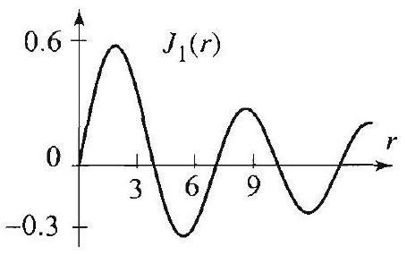

Figure $1 J_{1}(r)$ and its first four positive zeros.

Right margin note (page 20)

tegra$+1(x)$.
$$
r, \theta)=
$$
onality
$$
n=0,
$$
tt
he fact gure 1 he first

of the
of the

++++

ential Equations in Polar and Cylindrical Coordinates

From (7), Section 4.8, with $p=k$, the first term is
$$
\frac{a^{k+4}}{\alpha^{k+2}}\left[x^{k+1} J_{k+1}(x)\right]_{0}^{\alpha}=\frac{a^{k+4}}{\alpha} J_{k+1}(\alpha) .
$$

The second integral can be evaluated with the help of (7), Section 4.8, and ir tion by parts. Let $u=x^{2}, d v=x^{k+1} J_{k}(x) d x$, then $d u=2 x d x, v=x^{k+1} J_{k}$ Hence the second term becomes
$$
-\frac{a^{k+4}}{\alpha^{k+4}}\left[x^{k+3} J_{k+1}(x)\right]_{0}^{\alpha}+2 \frac{a^{k+4}}{\alpha^{k+4}} \int_{0}^{\alpha} x^{k+2} J_{k+1}(x) d x
$$

Using (7), Section 4.8, one more time and simplifying, we get
$$
-\frac{a^{k+4}}{\alpha} J_{k+1}(\alpha)+2 \frac{a^{k+4}}{\alpha^{2}} J_{k+2}(\alpha),
$$
and (15) follows.

EXAMPLE 2 A vibrating membrane
Refer to Example 1 and determine the solution $u(r, \theta, t)$ when $a=c=1, f( \left(1-r^{2}\right) r \sin \theta, g(r, \theta)=0$.
Solution From (12), we have
$$
a_{0 n}=\frac{1}{\pi J_{1}^{2}\left(\alpha_{0 n}\right)} \int_{0}^{1} \int_{0}^{2 \pi}\left(1-r^{2}\right) r \sin \theta J_{0}\left(\alpha_{0 n} r\right) r d \theta d r=0
$$
because $\int_{0}^{2 \pi} \sin \theta d \theta=0$. A similar argument using (13), (14), and the orthoge of the trigonometric functions shows that $a_{m n}=0$ for all $m$ and $n$, and $b_{m}$ except when $m=1$, in which case we have
$$
\begin{aligned}
b_{1 n} & =\frac{2}{\pi J_{2}^{2}\left(\alpha_{1 n}\right)} \int_{0}^{1} \int_{0}^{2 \pi}\left(1-r^{2}\right) r \sin ^{2} \theta J_{1}\left(\alpha_{1 n} r\right) r d \theta d r \\
& =\frac{2}{J_{2}^{2}\left(\alpha_{1 n}\right)} \int_{0}^{1}\left(1-r^{2}\right) r^{2} J_{1}\left(\alpha_{1 n} r\right) d r
\end{aligned}
$$
because $\frac{1}{\pi} \int_{0}^{2 \pi} \sin ^{2} \theta d \theta=1$. We now appeal to (15) with $a=1, k=1$ and ge
$$
b_{1 n}=\frac{4 J_{3}\left(\alpha_{1 n}\right)}{\alpha_{1 n}^{2} J_{2}^{2}\left(\alpha_{1 n}\right)}=\frac{16}{\alpha_{1 n}^{3} J_{2}\left(\alpha_{1 n}\right)},
$$
where in the last step we have used (6) from Section 4.8 with $p=2$, and t) that $J_{1}\left(\alpha_{1 n}\right)=0$. Recall that $\alpha_{1 n}$ denotes the $n$th positive zero of $J_{1}$. See Fi for an illustration and Table 1, Section 4.8 for a list of numerical values of th five $\alpha_{1 n}$. Substituting $b_{1 n}$ into (7), we arrive at the solution
$$
u(r, \theta, t)=\sin \theta \sum_{n=1}^{\infty} \frac{16}{\alpha_{1 n}^{3} J_{2}\left(\alpha_{1 n}\right)} J_{1}\left(\alpha_{1 n} r\right) \cos \alpha_{1 n} t
$$

With the help of a computer system we found approximate numerical values first three coefficients in the series and plotted in Figure 2 the partial sum series solution (with $n$ up to 3 ) at various values of $t$.

---

<!-- Page 21 -->

Left margin note (page 21)

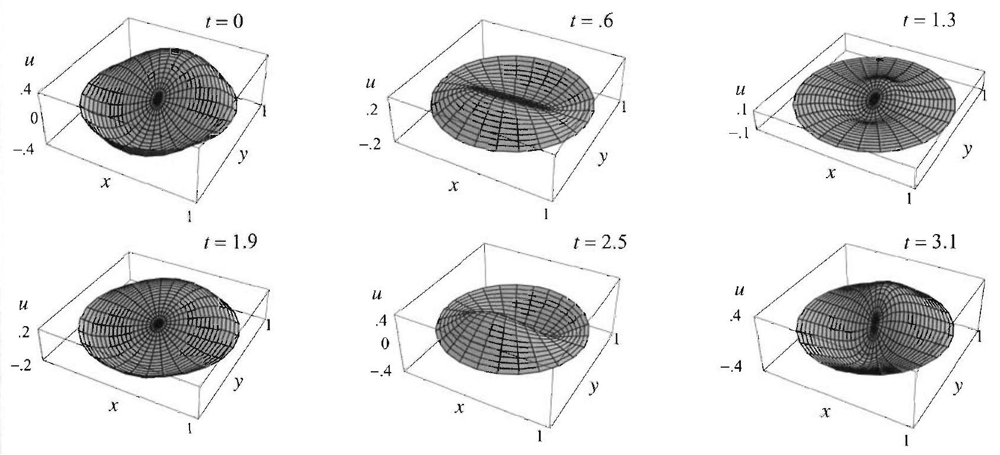

Figure 2 Vibrating circular $m$

THE WAVE EQUATION IN POLAR COORDINATES: GENERAL CASE

Right margin note (page 21)

213

treat this ses 7 the given

++++

Section 4.3 Vibrations of a Circular Membrane: General Case
embrane: a nonradially symmetric case.
To complete the solution of the vibrating membrane, we need to the case of a nonzero initial velocity. Save for some minor differences, case is similar to the one we just treated. The proof is outlined in Exerci and 8 . For ease of reference, we state the entire solution for this case in following box.

The solution of the boundary value problem (1)-(3) is given by
$$
\begin{aligned}
u(r, \theta, t) & =\sum_{m=0}^{\infty} \sum_{n=1}^{\infty} J_{m}\left(\lambda_{m n} r\right)\left(a_{m n} \cos m \theta+b_{m n} \sin m \theta\right) \cos c \lambda_{m n} t \\
& +\sum_{m=0}^{\infty} \sum_{n=1}^{\infty} J_{m}\left(\lambda_{m n} r\right)\left(a_{m n}^{*} \cos m \theta+b_{m n}^{*} \sin m \theta\right) \sin c \lambda_{m n} t,
\end{aligned}
$$
where $\lambda_{m n}=\frac{\alpha_{m n}}{a} ; \alpha_{m n}$ is the $n$th positive zero of $J_{m} ; a_{m n}, b_{m n}$ are by (12)-(14); and
$$
\begin{array}{c}
a_{0 n}^{*}=\frac{1}{\pi c \alpha_{0 n} a J_{1}^{2}\left(\alpha_{0 n}\right)} \int_{0}^{a} \int_{0}^{2 \pi} g(r, \theta) J_{0}\left(\lambda_{0 n} r\right) r d \theta d r, \\
a_{m n}^{*}=\frac{2}{\pi c \alpha_{m n} a . J_{m+1}^{2}\left(\alpha_{m n}\right)} \int_{0}^{a} \int_{0}^{2 \pi} g(r, \theta) \cos m \theta J_{m}\left(\lambda_{m n} r\right) r d \theta d r, \\
b_{m n}^{*}=\frac{2}{\pi c \alpha_{m n} a . J_{m+1}^{2}\left(\alpha_{m n}\right)} \int_{0}^{a} \int_{0}^{2 \pi} g(r, \theta) \sin m \theta J_{m}\left(\lambda_{m n} r\right) r d \theta d r,
\end{array}
$$
for $m, n=1,2, \ldots$.

---

<!-- Page 22 -->

Left margin note (page 22)

214
Chapter 4 Partial Differ

Right margin note (page 22)

second onality d that $2 n$, we
with
fact the
ter, as
re the
data.
st five
ane at

++++

ential Equations in Polar and Cylindrical Coordinates

EXAMPLE 3 Nonzero initial displacement and velocity Determine the solution $u(r, \theta, t)$ of (1)-(3) when
$$
a=c=1, f(r, \theta)=\left(1-r^{2}\right) r \sin \theta, g(r, \theta)=\left(1-r^{2}\right) r^{2} \sin 2 \theta .
$$

Solution The solution is given by (16). We only need to compute the double series since the first one is computed in Example 2. Using the orthogd of the trigonometric functions and arguing as we did in Example 2, we fin $a_{m n}^{*}=0$ for all $m$ and $n$, and $b_{m n}^{*}=0$, except when $m=2$. To compute $b$ use (19) with $g(r, \theta)=\left(1-r^{2}\right) r^{2} \sin 2 \theta, a=c=1$, and $\lambda_{m n}=\alpha_{m n}$, and get
$$
\begin{aligned}
b_{2 n}^{*} & =\frac{2}{\pi \alpha_{2 n} J_{3}^{2}\left(\alpha_{2 n}\right)} \int_{0}^{1} \int_{0}^{2 \pi}\left(1-r^{2}\right) r^{2} \sin ^{2} 2 \theta J_{2}\left(\alpha_{2 n} r\right) r d \theta d r \\
& =\frac{2}{\alpha_{2 n} J_{3}^{2}\left(\alpha_{2 n}\right)} \int_{0}^{1}\left(1-r^{2}\right) r^{3} J_{2}\left(\alpha_{2 n} r\right) d r
\end{aligned}
$$
because $\frac{1}{\pi} \int_{0}^{2 \pi} \sin ^{2} 2 \theta d \theta=1$. To compute the last integral we apply (15 $a=1, k=2$, and obtain
$$
b_{2 n}^{*}=\frac{4 J_{4}\left(\alpha_{2 n}\right)}{\alpha_{2 n}^{3} J_{3}^{2}\left(\alpha_{2 n}\right)}=\frac{24}{\alpha_{2 n}^{4} J_{3}\left(\alpha_{2 n}\right)}
$$
where in the last step we have used (6) from Section 4.8 with $p=3$ and th that $J_{2}\left(\alpha_{2 n}\right)=0$. Substituting in the second double series in (16) and usi solution of Example 2, we get the solution
$$
\begin{aligned}
u(r, \theta, t)= & \sin \theta \sum_{n=1}^{\infty} \frac{16}{\alpha_{1 n}^{3} J_{2}\left(\alpha_{1 n}\right)} J_{1}\left(\alpha_{1 n} r\right) \cos \alpha_{1 n} t \\
& +\sin 2 \theta \sum_{n=1}^{\infty} \frac{24}{\alpha_{2 n}^{4} J_{3}\left(\alpha_{2 n}\right)} J_{2}\left(\alpha_{2 n} r\right) \sin \alpha_{2 n} t
\end{aligned}
$$

The coefficients in the series can be approximated with the help of a compu we did in Example 2.

In the exercises, we will use the methods of this section to sol general heat problem on the disk.

Exercises 4.3
In Exercises 1-8, solve the vibrating membrane problem (1)-(3) for the giver If possible, with the help of a computer, find numerical values for the fir nonzero coefficients of the series solution and plot the shape of the membr various values of $t$. (Formula (15) is helpful in doing these problems.)
1. $f(r, \theta)=\left(1-r^{2}\right) r^{2} \sin 2 \theta, g(r, \theta)=0, a=c=1$.
2. $f(r, \theta)=\left(9-r^{2}\right) \cos 2 \theta, g(r, \theta)=0, a=3, c=1$.
3. $f(r, \theta)=\left(4-r^{2}\right) r \sin \theta, g(r, \theta)=1, a=2, c=1$.
4. $f(r, \theta)=J_{3}\left(\alpha_{32} r\right) \sin 3 \theta, g(r, \theta)=0, a=c=1$.

---

<!-- Page 23 -->

Right margin note (page 23)

215

ent. cular ment on of and $=0$.
(12)-
itten $d$ the ution $w$ the (7), true e the

++++

Section 4.3 Vibrations of a Circular Membrane: General Case
5. $f(r, \theta)=0, g(r, \theta)=\left(1-r^{2}\right) r^{2} \sin 2 \theta, a=c=1$.
6. $f(r, \theta)=1-r^{2}, g(r, \theta)=J_{0}(r), a=c=1$.
7. Project Problem: Circular membrane with zero initial displacem Follow the steps outlined in this exercise to determine the vibrations of a cir membrane with radius $a$ and fixed boundary, given that the initial displace of the membrane is 0 , and its initial velocity is $g(r, \theta)$. Review the soluti Example 1 for hints.
(a) Write down explicitly the differential equation, the boundary conditions, the initial conditions.
(b) Assume a product solution of the form $R(r) \Theta(\theta) T(t)$ and show that $T(0)$ Conclude that
$$
u(r, \theta, t)=\sum_{m=0}^{\infty} \sum_{n=1}^{\infty} J_{m}\left(\lambda_{m n} r\right)\left(a_{m n}^{*} \cos m \theta+b_{m n}^{*} \sin m \theta\right) \sin c \lambda_{m n} t
$$
(c) Use the given initial velocity and (b) to obtain
$$
\begin{array}{r}
g(r, \theta)=\sum_{n=1}^{\infty} c \lambda_{0 n} a_{0 n}^{*} J_{0}\left(\lambda_{0 n} r\right)+\sum_{m=1}^{\infty}\left\{\left(\sum_{n=1}^{\infty} c \lambda_{m n} a_{m n}^{*} J_{m}\left(\lambda_{m n} r\right)\right) \cos m \theta\right. \\
\left.+\left(\sum_{n=1}^{\infty} c \lambda_{m n} b_{m n}^{*} J_{m}\left(\lambda_{m n} r\right)\right) \sin m \theta\right\}
\end{array}
$$
(d) Derive (17)-(19) by proceeding from here as we did in the derivation of (14).
8. General solution of the vibrating circular membrane problem.
(a) Show that the solution of the boundary value problem (1)-(3) can be wr as $u(r, \theta, t)=u_{1}(r, \theta, t)+u_{2}(r, \theta, t)$, where $u_{1}$ and $u_{2}$ satisfy (1) and (3) an following initial conditions:
$$
\begin{array}{l}
u_{1}(r, \theta, 0)=f(r, \theta), \quad \frac{\partial u_{1}}{\partial t}(r, \theta, 0)=0 ; \\
u_{2}(r, \theta, 0)=0, \quad \frac{\partial u_{2}}{\partial t}(r, \theta, 0)=g(r, \theta) .
\end{array}
$$
(b) Combine the results of Example 1 and Exercise 7 to derive the general sol (16).
9. Project Problem: An integral formula for Bessel functions. Follo outlined steps to prove that for any $k \geq 0$, and any integer $l \geq 0$, we have
$$
\int r^{k+1+2 l} J_{k}(r) d r=\sum_{n=0}^{l}(-1)^{n} 2^{n} \frac{l!}{(l-n)!} r^{k+1+2 l-n} J_{k+n+1}(r)+C
$$
(a) Show that the formula holds for $l=0$ and all $k \geq 0$. [Hint: Use Section 4.8.]
(b) Complete the proof by induction on $l$. [Hint: Assume the formula is for $l-1$ and all $k$. To establish the formula for $l$, integrate by parts and us formula with $l-1$ and $k+1$.]

---

<!-- Page 24 -->

Left margin note (page 24)

216
Chapter 4
P
4.4 Laplace

Right margin note (page 24)

(1 -
case).
value
ven by
$=c=$
rature
circu-
tisfies
ribe a
ind of

++++

artial Differential Equations in Polar and Cylindrical Coordinates
10. Solve the boundary value problem (1)-(3) when $a=c=1, f(r, \theta)= \left.r^{2}\right)\left(\frac{1}{4}-r^{2}\right) r^{3} \sin 3 \theta$, and $g(r, \theta)=0$. [Hint: Exercise 9 is useful.]
11. Project Problem: Two-dimensional heat equation (general Use the methods of this section to show that the solution of heat boundary problem
$$
\begin{array}{c}
\frac{\partial u}{\partial t}=c^{2}\left(\frac{\partial^{2} u}{\partial r^{2}}+\frac{1}{r} \frac{\partial u}{\partial r}+\frac{1}{r^{2}} \frac{\partial^{2} u}{\partial \theta^{2}}\right), \quad 0<r<a, 0<\theta<2 \pi, t>0, \\
u(a, \theta, t)=0, \quad 0<\theta<2 \pi, t>0, \\
u(r, \theta, 0)=f(r, \theta), \quad 0<r<a, 0<\theta<2 \pi,
\end{array}
$$
is
$$
u(r, \theta, t)=\sum_{m=0}^{\infty} \sum_{n=1}^{\infty} J_{m}\left(\lambda_{m n} r\right)\left(a_{m n} \cos m \theta+b_{m n} \sin m \theta\right) e^{-c^{2} \lambda_{m n}^{2} t}
$$
where $\lambda_{m n}=\frac{\alpha_{m n}}{a} ; \alpha_{m n}$ is the $n$th positive zero of $J_{m}$; and $a_{m n}, b_{m n}$ are gi (12)-(14).
12. (a) Solve the heat problem in Exercise 11 for the following data: a 1, $f(r, \theta)=\left(1-r^{2}\right) r \sin \theta$. [Hint: Example 2.]
(b) What are the hottest points when $t=0$ ?
(c) Locate the hottest point in the plate for $t=1,2$. Approximate the tempe of these points at the given times.
13. Solve the heat equation
$$
\frac{\partial u}{\partial t}=\frac{\partial^{2} u}{\partial r^{2}}+\frac{1}{r} \frac{\partial u}{\partial r}+\frac{1}{r^{2}} \frac{\partial^{2} u}{\partial \theta^{2}}, \quad 0<r<1,0<\theta<2 \pi, t>0,
$$
given the nonzero boundary condition
$$
u(1, \theta, t)=\sin 3 \theta,
$$
and the initial condition $u(r, \theta, 0)=0$.
's Equation in Circular Regions
The steady-state (or time independent) temperature distribution in a lar plate of radius $a$, with prescribed temperature at the boundary, sa the two-dimensional Laplace equation (in polar coordinates):
$$
\nabla^{2} u=\frac{\partial^{2} u}{\partial r^{2}}+\frac{1}{r} \frac{\partial u}{\partial r}+\frac{1}{r^{2}} \frac{\partial^{2} u}{\partial \theta^{2}}=0, \quad 0<r<a, 0<\theta<2 \pi,
$$
and the boundary condition
$$
u(a, \theta)=f(\theta), \quad 0<\theta<2 \pi .
$$
(Note that $f$ is necessarily $2 \pi$-periodic.) Equations (1) and (2) desc Dirichlet problem over a disk of radius $a$. We have solved this k

---

<!-- Page 25 -->

Left margin note (page 25)

Recall from Appendix A.3, Euler's equation
$x^{2} y^{\prime \prime}+\alpha x y^{\prime}+\beta y=0$,
with indicial equation
$\rho^{2}+(\alpha-1) \rho+\beta=0$
and indicial roots $\rho_{1}$ and $\rho_{2}$.
If $\rho_{1} \neq \rho_{2}$, the general solution is
$y=c_{1} x^{\rho_{1}}+c_{2} x^{\rho_{2}}$.
If $\rho_{1}=\rho_{2}$, the general solution is
$y=c_{1} x^{\rho_{1}}+c_{2} x^{\rho_{1}} \ln x$.

Right margin note (page 25)

217
such d in
luct and
.)
ions ...), ions
sults the
aded $=0$. de a rive
⋯

++++

Section 4.4 Laplace's Equation in Circular Regions

problems over a rectangle in Section 3.8. Problems over other regions, as a cylinder or a sphere, will be studied in the following sections an Chapter 5.

Following the method of separation of variables, we will look for pro solutions of (1) of the form $u(r, \theta)=R(r) \Theta(\theta)$. Plugging this into (1) simplifying, we obtain
$$
\begin{array}{cl}
R^{\prime \prime} \Theta+\frac{1}{r} R^{\prime} \Theta+\frac{1}{r^{2}} R \Theta^{\prime \prime}=0 & \text { (Plug into (1).) } \\
r^{2} \frac{R^{\prime \prime}}{R}+r \frac{R^{\prime}}{R}+\frac{\Theta^{\prime \prime}}{\Theta}=0 & \text { (Multiply by } r^{2} \\
\left.r^{2} \frac{R^{\prime \prime}}{R}+r \frac{R^{\prime}}{R}=\lambda \text { and } \quad \frac{\Theta^{\prime \prime}}{\Theta}=-\lambda \quad \text { (Separation constant }\right) \\
r^{2} R^{\prime \prime}+r R^{\prime}-\lambda R=0 \quad \text { and } \quad \Theta^{\prime \prime}+\lambda \Theta=0 & \text { (Simplify.) }
\end{array}
$$

Recall that $\Theta$ is necessarily $2 \pi$-periodic. From our knowledge of the solut of the equation $\Theta^{\prime \prime}+\lambda \Theta=0$, we conclude that $\lambda=n^{2}(n=0,1,2$ in order to get $2 \pi$-periodic functions in $\theta$. Thus the separated equat become
$$
\begin{array}{c}
r^{2} R^{\prime \prime}+r R^{\prime}-n^{2} R=0 \\
\Theta^{\prime \prime}+n^{2} \Theta=0
\end{array}
$$

We have the $2 \pi$-periodic solutions
$$
\Theta=\Theta_{n}=a_{n} \cos n \theta+b_{n} \sin n \theta, n=0,1,2, \ldots .
$$

We recognize the equation for $R$ as an Euler equation. Appealing to res from Appendix A.3, we find that the indicial roots are $\pm n$, and hence solutions
$$
R(r)=c_{1}\left(\frac{r}{a}\right)^{n}+c_{2}\left(\frac{r}{a}\right)^{-n}, \quad n=1,2, \ldots,
$$
and
$$
R(r)=c_{1}+c_{2} \ln \left(\frac{r}{a}\right), \quad n=0 .
$$

For the Dirichlet problem in the disk, the solution should remain bour at 0 . So we take $c_{2}=0$, since $\left(\frac{r}{a}\right)^{-n}$ and $\ln \left(\frac{r}{a}\right)$ are not bounded when $r$ (Other choices of the constant will be needed in Dirichlet problem outsi disk or on an annular region. See Exercises 12, 21, and 24.) We thus an at the product solutions
$$
u_{0}(r, \theta)=a_{0} \quad \text { and } \quad u_{n}(r, \theta)=\left(\frac{r}{a}\right)^{n}\left(a_{n} \cos n \theta+b_{n} \sin n \theta\right), n=1,2, .
$$

---

<!-- Page 26 -->

Left margin note (page 26)

218
Chapter 4 Partial Differ

SOLUTION OF THE DIRICHLET PROBLEM ON THE DISK

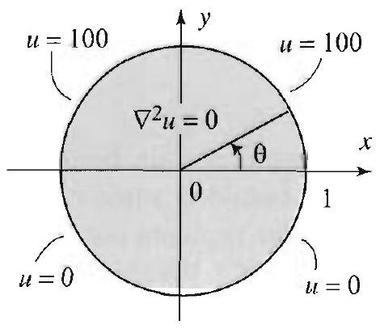

Figure 1 A Dirichlet problem.

Right margin note (page 26)

ourier
indary
ents of
nts are
□
disk,
oW
value
upper

++++

ential Equations in Polar and Cylindrical Coordinates

Superposing these solutions, we get
$$
u(r, \theta)=a_{0}+\sum_{n=1}^{\infty}\left(\frac{r}{a}\right)^{n}\left[a_{n} \cos n \theta+b_{n} \sin n \theta\right] .
$$

As we now show, the unknown coefficients $a_{0}, a_{n}, b_{n}$ are precisely the F coefficients of the boundary function $f(\theta)$.

The solution of Laplace's equation (1) satisfying the prescribed bor condition (2) is given by (4), where $a_{0}, a_{n}, b_{n}$ are the Fourier coeffici the $2 \pi$-periodic function $f(\theta)$ :
$$
a_{0}=\frac{1}{2 \pi} \int_{0}^{2 \pi} f(\theta) d \theta
$$
(5)
$$
a_{n}=\frac{1}{\pi} \int_{0}^{2 \pi} f(\theta) \cos n \theta d \theta, \quad b_{n}=\frac{1}{\pi} \int_{0}^{2 \pi} f(\theta) \sin n \theta d \theta,
$$
$$
n=1,2, \ldots .
$$

Proof Putting $r=a$ in (4) and using (2) we get
$$
f(\theta)=u(a, \theta)=a_{0}+\sum_{n=1}^{\infty}\left(a_{n} \cos n \theta+b_{n} \sin n \theta\right) .
$$

This is clearly the Fourier series representation of $f$, and hence the coefficier given by the Euler formulas (Section 2.2).

Since (4) gives the steady-state temperature of the points inside the by taking $r=0$ in (4), we get $a_{0}$ as the temperature of the center. N
$$
a_{0}=\frac{1}{2 \pi} \int_{0}^{2 \pi} f(\theta) d \theta
$$
which shows that the temperature of the center is equal to the average of the temperature on the boundary.

EXAMPLE 1 A Dirichlet problem on the disk
Find the steady-state temperature distribution in a disk of radius 1 if the half of the circumference is kept at $100^{\circ}$ and the lower half is kept at $0^{\circ}$.
Solution The boundary values are described by the function
$$
u(1, \theta)=f(\theta)=\left\{\begin{array}{ll}
100 & \text { if } 0<\theta<\pi, \\
0 & \text { if } \pi<\theta<2 \pi .
\end{array}\right.
$$

Substituting in (5), we get
$$
a_{0}=\frac{1}{2 \pi} \int_{0}^{\pi} 100 d \theta=50, \quad a_{n}=\frac{1}{\pi} \int_{0}^{\pi} 100 \cos n \theta d \theta=0,
$$

---

<!-- Page 27 -->

Left margin note (page 27)

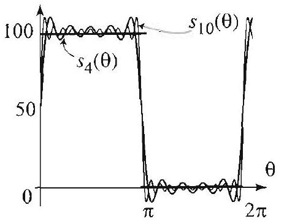

Figure 2 Fourier series of $f(\theta)$.

Right margin note (page 27)

219

onds

ction
stted
olem
the roof blem 3.10 how lem. $\theta)=$ fices erify nust ward
$\left.\frac{9}{2}\right)$

++++

Section 4.4 Laplace's Equation in Circular Regions

and
$$
b_{n}=\frac{1}{\pi} \int_{0}^{\pi} 100 \sin n \theta d \theta=\frac{100}{n \pi}[1-\cos n \pi]
$$

Substituting in (4) we find the solution
$$
u(r, \theta)=50+\frac{100}{\pi} \sum_{n=1}^{\infty} \frac{1}{n}(1-\cos n \pi) r^{n} \sin n \theta .
$$

Setting $r=0$, we see that the temperature of the center is $50^{\circ}$, which corresp to the average of the temperature on the boundary of the disk.

On the boundary of the disk, when $r=1$, the series becomes
$$
u(1, \theta)=50+\frac{200}{\pi} \sum_{k=0}^{\infty} \frac{1}{(2 k+1)} \sin (2 k+1) \theta .
$$

According to the given boundary values, this series should represent the fun $f(\theta)$. In fact, this is the Fourier series of $f(\theta)$. Some of its partial sums are ple in Figure 2.

In many interesting situations, the series solution of the Dirichlet prol can be computed in closed form with the help of the formula
$$
\sum_{n=1}^{\infty} r^{n} \frac{\sin n \theta}{n}=\tan ^{-1}\left(\frac{r \sin \theta}{1-r \cos \theta}\right),
$$
which is valid for $0<r<1$, and all $\theta$. A derivation of this formula, using complex logarithm, is presented in Exercise 19. We can give an indirect p based on the uniqueness property of the solution of the Dirichlet prol (1)-(2). Properties of this nature were discussed and proved in Section for the Dirichlet problem in a rectangle. To prove (6), it is enough to s that the left and the right sides are solutions of the same Dirichlet prob Indeed, we will show that they satisfy (1), with $a=1$, and (2) with $f( \frac{1}{2}(\pi-\theta), 0<\theta<2 \pi$. To verify the assertion for the left side of (6), it suf to use (4) and the fact that the Fourier series of $f(\theta)$ is $\sum_{n=1}^{\infty} \frac{\sin n \theta}{n}$. To v the assertion for the right side of (6), let $u(r, \theta)=\tan ^{-1}\left(\frac{r \sin \theta}{1-r \cos \theta}\right)$. We r show that $\nabla^{2} u=0$ and $u(1, \theta)=\frac{1}{2}(\pi-\theta)$. The first part is straightfor and is left to Exercise 6. For the second part, we have
$$
\begin{aligned}
u(1, \theta) & =\tan ^{-1}\left(\frac{\sin \theta}{1-\cos \theta}\right) \\
& =\tan ^{-1}\left(\frac{\cos \frac{\theta}{2}}{\sin \frac{\theta}{2}}\right) \quad\left(\sin \theta=2 \cos \frac{\theta}{2} \sin \frac{\theta}{2} ; 1-\cos \theta=2 \sin ^{2}\right. \\
& =\tan ^{-1} \cot \left(\frac{\theta}{2}\right)=\frac{\pi}{2}-\frac{\theta}{2}
\end{aligned}
$$

---

<!-- Page 28 -->

Left margin note (page 28)

220
Chapter 4 Partial Differ

Right margin note (page 28)

s
$$
(-x)=
$$
7).
in decurves of the
nicircle to the these ch that

0 ( $x$ is ely this ides of

++++

ential Equations in Polar and Cylindrical Coordinates
which completes the proof of (6).

EXAMPLE 2 Converting to Cartesian coordinates
Show that in Cartesian coordinates the steady-state solution in Example 1
$$
u(x, y)=50+\frac{100}{\pi}\left[\tan ^{-1}\left(\frac{y}{1-x}\right)+\tan ^{-1}\left(\frac{y}{1+x}\right)\right],
$$
for $x^{2}+y^{2}<1$.
Solution We start by rewriting the solution of Example 1 as
$$
\begin{aligned}
u(r, \theta) & =50+\frac{100}{\pi} \sum_{n=1}^{\infty} \frac{1}{n}(1-\cos n \pi) r^{n} \sin n \theta \\
& =50+\frac{100}{\pi} \sum_{n=1}^{\infty} \frac{\sin n \theta}{n} r^{n}-\frac{100}{\pi} \sum_{n=1}^{\infty} \frac{\cos n \pi}{n} r^{n} \sin n \theta
\end{aligned}
$$

Noting that $\cos n \pi \sin n \theta=\sin n(\theta-\pi)$ and using (6), we get
$$
u(r, \theta)=50+\frac{100}{\pi} \tan ^{-1}\left(\frac{r \sin \theta}{1-r \cos \theta}\right)-\frac{100}{\pi} \tan ^{-1}\left(\frac{r \sin (\theta-\pi)}{1-r \cos (\theta-\pi)}\right)
$$

We now use the identities $\sin (\theta-\pi)=-\sin \theta ; \cos (\theta-\pi)=-\cos \theta ; \tan ^{-1} -\tan ^{-1} x$, and get
$$
u(r, \theta)=50+\frac{100}{\pi}\left[\tan ^{-1}\left(\frac{r \sin \theta}{1-r \cos \theta}\right)+\tan ^{-1}\left(\frac{r \sin \theta}{1+r \cos \theta}\right)\right] .
$$

Passing to rectangular coordinates by using $x=r \cos \theta, y=r \sin \theta$, we get (
When dealing with steady-state problems, we are often interested termining the points with the same temperature. These points lie on called isotherms. We illustrate this notion by finding the isotherms solution in Example 1.

EXAMPLE 3 Isotherms or curves of constant temperature
Two extreme isotherms are easy to guess in Example 1: The upper sen corresponds to the temperature $100^{\circ}$, and the lower semicircle corresponds temperature $0^{\circ}$. The temperature of all other isotherms is clearly betweer two values. Let $0<T<100$. Our goal is to determine the points $(x, y)$ su $u(x, y)=T$. Setting the right side of (7) equal to $T$ and simplifying, we ge
$$
\frac{\pi(T-50)}{100}=\tan ^{-1}\left(\frac{y}{1-x}\right)+\tan ^{-1}\left(\frac{y}{1+x}\right) .
$$

When $T=50$, the left side equals 0 , and the solution in this case is $y=$ arbitrary). This corresponds to the set of points on the $x$-axis. Intuitive answer is clear. Do you see why? For $T \neq 50$, apply the tangent to both (8), use the identity
$$
\tan (a+b)=\frac{\tan a+\tan b}{1-\tan a \tan b},
$$

---

<!-- Page 29 -->

Left margin note (page 29)

The larger circle in Figure 3(a) determines the isotherm $u(r, \theta)=30 \mathrm{in}$ the unit disk. It is centered at $\left(0, \tan \left(\frac{3 \pi}{10}\right)\right)$ with radius $\sec \left(\frac{3 \pi}{10}\right)$. We have $\tan \left(\frac{3 \pi}{10}\right)=$
$$
\frac{1+\sqrt{5}}{\sqrt{2}(5-\sqrt{5})} \approx 1.38
$$
and
$$
\sec \left(\frac{3 \pi}{10}\right) \approx 1.7
$$

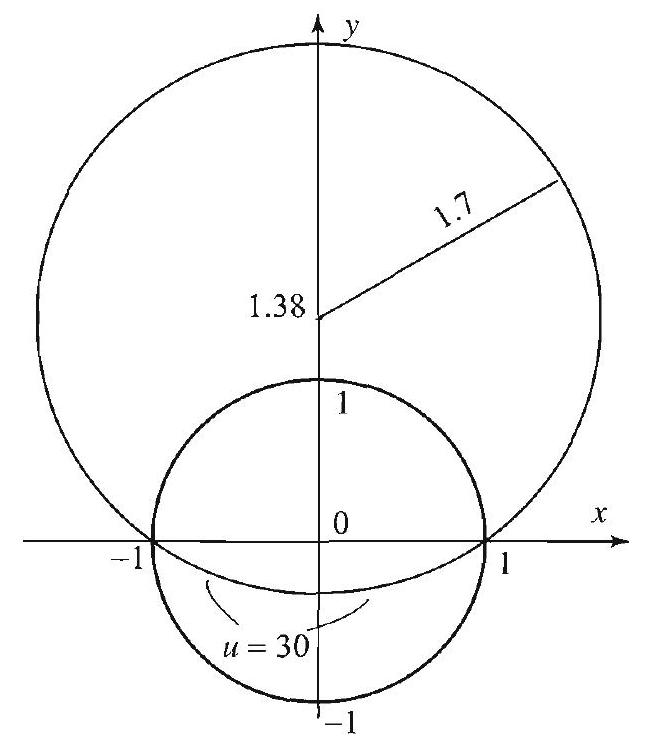

Figure 3(b) shows various isotherms inside the unit disk.

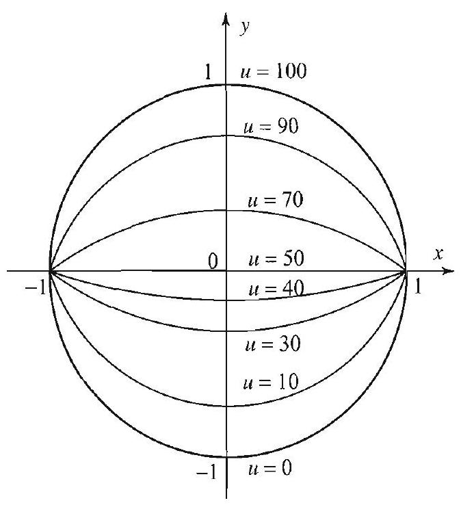

Right margin note (page 29)

221

ircle
3(a)
$$
\xrightarrow{x}
$$
ions
olar
Fur-
and
the
ates,
-igin

++++

Section 4.4 Laplace's Equation in Circular Regions

and get
$$
\frac{\left(\frac{y}{1-x}\right)+\left(\frac{y}{1+x}\right)}{1-\left(\frac{y}{1-x}\right)\left(\frac{y}{1+x}\right)}=\tan \left(\frac{\pi T}{100}-\frac{\pi}{2}\right)=-\cot \left(\frac{\pi T}{100}\right) .
$$

Straightforward manipulations lead to
$$
x^{2}+y^{2}-1-2 y \tan \left(\frac{\pi T}{100}\right)=0
$$

Completing the square yields
$$
x^{2}+\left[y-\tan \left(\frac{\pi T}{100}\right)\right]^{2}=1+\tan ^{2}\left(\frac{\pi T}{100}\right) .
$$

Hence the isotherm corresponding to the value $T$ consists of the arc of the with center $\left(0, \tan \left(\frac{\pi T}{100}\right)\right)$ and radius $\sqrt{1+\tan ^{2}\left(\frac{\pi T}{100}\right)}=\left|\sec \frac{\pi T}{100}\right|$. Figure shows the isotherm $T=30$. Figure 3(b) shows various other isotherms.

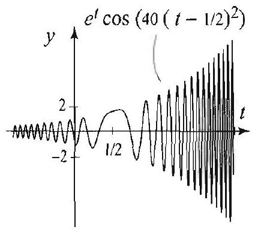
Figure 3(a)

Figure 3(b)

Varying the Region and the Boundary Conditions
We can use the methods of this section to solve problems over planar reg other than disks. These are regions that are conveniently described in coordinates, such as a wedge, an annulus, or a region outside a circle. thermore, we can vary the boundary conditions and consider Neumann Robin conditions. Recall that these are linear conditions that involve function $u$ and its normal derivative on the boundary. In polar coordina the normal derivative of $u$ at points lying on a circle centered at the or

---

<!-- Page 30 -->

Left margin note (page 30)

222
Chapter 4 Partial Differ

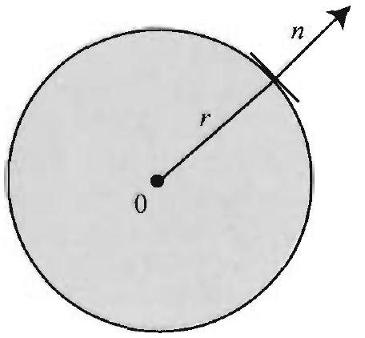

Figure 4 The normal derivative of $u, \frac{\partial u}{\partial n}$, is $\frac{\partial u}{\partial r}$.

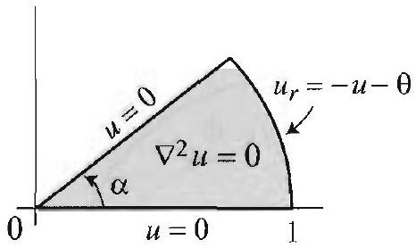

Figure 5 The wedge shaped region bounded by the rays $\theta=0$ and $\theta=\alpha$, and the circle $r=1$.

Right margin note (page 30)

s for a spechere $a$ e such
ith the 0 and ong its $\theta)-\theta$. ter for
in the ualities we did
follow from em in $\theta$ on, but tead of
alue of
$$
\begin{array}{l}
= \pm \frac{n \pi}{\alpha} \\
R(r)=
\end{array}
$$
n :

++++

ential Equations in Polar and Cylindrical Coordinates
is simply the partial derivative of $u$ with respect to $r$ (Figure 4). Thu boundary lying on a circle centered at the origin, a Neumann condition ifies $u_{r}(r, \theta)$; and a Robin condition specifies $u_{r}(r, \theta)+a(\theta) u(r, \theta)$, w is a function of $\theta$. The following example illustrates how we can solv problems.

EXAMPLE 4 A Robin condition on a wedge
Solve Laplace's equation (1) over the wedge region in Figure 5, supplied w boundary conditions: for $0<r<1$ and $0<\theta<\alpha$,
$$
u(r, 0)=0, \quad u(r, \alpha)=0, \quad \frac{\partial}{\partial r} u(1, \theta)=-u(1, \theta)-\theta .
$$

The boundary conditions represent a wedge whose sides along the rays $\theta= \theta=\alpha$ are kept at 0 temperature, and the wedge is exchanging heat al circular boundary at a rate given by the Robin condition $u_{r}(1, \theta)=-u(1$, Presumably, the insulation of the wedge along the circular boundary is bet smaller values of $\theta$, since the rate of heat loss is smaller for $\theta$ near 0 .

Solution Before we proceed with the solution, note how the points $(r, \theta)$ wedge region are conveniently described in polar coordinates by the ineq $0<r<1$ and $0<\theta<\alpha$. Applying the method of separation of variables as at the outset of this section, we arrive at the equations
$$
\begin{array}{c}
\Theta^{\prime \prime}+\lambda \Theta=0, \quad \Theta(0)=0, \quad \Theta(\alpha)=0 ; \\
r^{2} R^{\prime \prime}+r R^{\prime}-\lambda R=0,
\end{array}
$$
where $\lambda$ is a separation constant. We have new conditions on $\Theta$, which from the boundary conditions $u(r, 0)=0$ and $u(r, \alpha)=0$. For example $u(r, \alpha)=0$, we get $R(r) \Theta(\alpha)=0$, and so $\Theta(\alpha)=0$. The initial value proble is different from the one that we encountered at the beginning of this sectic it is a familiar problem that we solved in Section 3.3, with the variable $x$ ins
$\theta$. The nonzero solutions are
$$
\Theta_{n}(\theta)=\sin \frac{n \pi}{\alpha} \theta \quad(n=1,2, \ldots),
$$
and these correspond to the separation constants $\lambda=\left(\frac{n \pi}{\alpha}\right)^{2}$. Plugging the $\lambda$ into the radial equation yields the Euler equation
$$
r^{2} R^{\prime \prime}+r R^{\prime}-\left(\frac{n \pi}{\alpha}\right)^{2} R=0 .
$$

The indicial equation for this Euler equation is $\rho^{2}-\left(\frac{n \pi}{\alpha}\right)^{2}=0$, with roots $\rho=$ Hence, the bounded solutions for $0 \leq r<a$ are constant multiples of $R_{n}(r)=r^{\frac{n \pi}{\alpha}}$. We thus have the product solutions
$$
b_{n} r^{\frac{n \pi}{\alpha}} \sin \frac{n \pi}{\alpha} \theta,
$$
and the superposition principle leads us to the following form of the solutio
$$
u(r, \theta)=\sum_{n=1}^{\infty} b_{n} r^{\frac{n \pi}{\alpha}} \sin \frac{n \pi}{\alpha} \theta, \quad 0<r<1,0<\theta<\alpha .
$$

---

<!-- Page 31 -->

Right margin note (page 31)

223

ions s to ) = $=1$,
tion
dary

++++

Section 4.4 Laplace's Equation in Circular Regions

You should check at this point that this solution satisfies the boundary condit $u(r, 0)=0$ and $u(r, \alpha)=0$ for all choices of $b_{n}$. Next, we determine $b_{n}$ so a satisfy the given Robin condition. Setting $r=1$ in $u(r, \theta)$, we obtain $u(1, \theta \sum_{n=1}^{\infty} b_{n} \sin \frac{n \pi}{\alpha} \theta$. Differentiating $u(r, \theta)$ with respect to $r$ and then setting $r$ we obtain
$$
\begin{aligned}
u_{r}(1, \theta) & =\left.\frac{\partial}{\partial r}\left(\sum_{n=1}^{\infty} b_{n} r^{\frac{n \pi}{\alpha}} \sin \left(\frac{n \pi}{\alpha} \theta\right)\right)\right|_{r=1} \\
& =\left.\sum_{n=1}^{\infty} b_{n} \sin \left(\frac{n \pi}{\alpha} \theta\right) \frac{\partial}{\partial r}\left(r^{\frac{n \pi}{\alpha}}\right)\right|_{r=1} \\
& =\sum_{n=1}^{\infty} \frac{n \pi}{\alpha} b_{n} \sin \left(\frac{n \pi}{\alpha} \theta\right) .
\end{aligned}
$$

The condition $u_{r}(1, \theta)=-u(1, \theta)-\theta$ implies that, for all $0<\theta<\alpha$,
$$
\sum_{n=1}^{\infty} \frac{n \pi}{\alpha} b_{n} \sin \left(\frac{n \pi}{\alpha} \theta\right)=-\sum_{n=1}^{\infty} b_{n} \sin \left(\frac{n \pi}{\alpha} \theta\right)-\theta ;
$$
equivalently,
$$
-\theta=\sum_{n=1}^{\infty} b_{n}\left(1+\frac{n \pi}{\alpha}\right) \sin \frac{n \pi}{\alpha} \theta, \quad 0<\theta<\alpha .
$$

We recognize this as the half-range sine Fourier series expansion of the func $f(\theta)=-\theta$ on the interval $(0, \alpha)$, where $b_{n}\left(1+\frac{n \pi}{\alpha}\right)$ is the $n$th sine coefficient:
$$
\begin{aligned}
b_{n}\left(1+\frac{n \pi}{\alpha}\right) & =-\frac{2}{\alpha} \int_{0}^{\alpha} \theta \sin \frac{n \pi}{\alpha} \theta d \theta \\
& =-\frac{2}{\alpha}\left[-\left.\theta\left(\frac{\alpha}{n \pi}\right) \cos \frac{n \pi}{\alpha} \theta\right|_{0} ^{\alpha}+\frac{\alpha}{n \pi} \int_{0}^{\alpha} \cos \frac{n \pi}{\alpha} \theta d \theta\right] \\
& =\frac{2 \alpha(-1)^{n}}{n \pi}
\end{aligned}
$$

Solving for $b_{n}$ and substituting into (9), we get the solution
$$
u(r, \theta)=\frac{2 \alpha^{2}}{\pi} \sum_{n=1}^{\infty} \frac{(-1)^{n}}{n(\alpha+n \pi)} r^{\frac{n \pi}{\alpha}} \sin \frac{n \pi}{\alpha} \theta, \quad 0<r<1,0<\theta<\alpha .
$$

Exercises 4.4
In Exercises 1-5, solve the Dirichlet problem on the unit disk for the given boun values.
1. $f(\theta)=\cos \theta$.
2. $f(\theta)=\sin 2 \theta$.
3. $f(\theta)=\frac{1}{2}(\pi-\theta), 0<\theta<2 \pi$.
4. $f(\theta)=\left\{\begin{array}{ll}\pi-\theta & \text { if } 0 \leq \theta \leq \pi, \\ 0 & \text { if } \pi \leq \theta<2 \pi .\end{array}\right.$
5. $f(\theta)=\left\{\begin{array}{ll}100 & \text { if } 0 \leq \theta \leq \pi / 4, \\ 0 & \text { if } \pi / 4<\theta<2 \pi .\end{array}\right.$
6. Verify that
$$
u(r, \theta)=\tan ^{-1}\left(\frac{r \sin \theta}{1-r \cos \theta}\right)
$$

---

<!-- Page 32 -->

Left margin note (page 32)

224
Chapter 4

Figure 6 for Exer

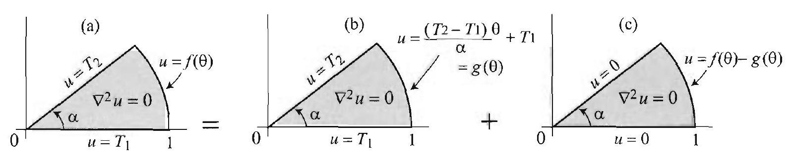

Figure 7

Right margin note (page 32)

ered at
quation stants. tion in n $\theta=0$ of the
quation stants. $\mathrm{g} u=1$ to the $\sin \theta$. to the em can ow that roblem
lve the $\frac{\pi}{4}$, and

++++

artial Differential Equations in Polar and Cylindrical Coordinates

is a solution of (1). [Hint: Change to Cartesian coordinates.]
7. Determine the isotherms in Exercise 3.
8. Show that the isotherms in Exercise 1 lie on vertical lines.
9. Show that the isotherms in Exercise 2 lie on branches of hyperbolas cent the origin.
10. (a) Solve the Dirichlet problem
$$
\begin{array}{l}
\nabla^{2} u(r, \theta)=0, \quad 0<r<1,0<\theta<2 \pi, \\
u(1, \theta)=1+\sin 2 \theta .
\end{array}
$$
(b) Determine the isotherms. [Hint: $\sin 2 \theta=2 \sin \theta \cos \theta$.]
11. Independence of $r$. (a) Suppose that $u(r, \theta)$ is a solution of Laplace's e that does not depend on $r$. Show that $u(r, \theta)=a \theta+b$ where $a$ and $b$ are cor
(b) Determine $a$ and $b$ in order for $u(r, \theta)$ to be a solution of Laplace's eque the wedge $0<r<1,0<\theta<\alpha$, with the boundary conditions $u=T_{1}$ whe and $u=T_{2}$ when $\theta=\alpha$. What are the values of $u$ on the circular boundary
wedge, when $r=1$ ? when $r=\frac{1}{2}$ and $u=2$ when $r=1$.
12. Independence of $\theta$. (a) Suppose that $u(r, \theta)$ is a solution of Laplace's e that does not depend on $\theta$. Show that $u(r \theta)=a \ln r+b$ where $a$ and $b$ are cor
(b) Find a solution of Laplace's equation in the annulus in Figure 6 satisfyin
13. Solve Laplace's equation in the wedge $0<r<1,0<\theta<\frac{\pi}{4}$, subject boundary conditions $u=0$ when $\theta=0, u=0$ when $\theta=\frac{\pi}{4}$, and $\frac{\partial u}{\partial r}(\theta, 1)=s$
14. Solve Laplace's equation in the wedge $0<r<1,0<\theta<\frac{\pi}{2}$, subject boundary $u=0$ when $\theta=0, u=0$ when $\theta=\frac{\pi}{2}$, and $\frac{\partial u}{\partial r}(\theta, 1)=\theta$.
15. Consider the problem in the wedge in Figure 7(a). Show that this prob) be decomposed into two subproblems as indicated in Figure 7. That is, sho if $u_{1}$ is a solution of the problem in Figure 7(b) and $u_{2}$ is a solution of the p in Figure 7(c), then $u=u_{1}+u_{2}$ is a solution of the problem in Figure 7(a)
16. Consider the problem in the wedge in Figure 7(a). Take $\alpha=\frac{\pi}{4}$ and sc problem subject to the conditions $u=0$ when $\theta=0, u=1$ when $\theta= u(1, \theta)=3 \sin 4 \theta$. [Hint: For the problem in Figure 7(b), see Exercise 11.]

---

<!-- Page 33 -->

Left margin note (page 33)

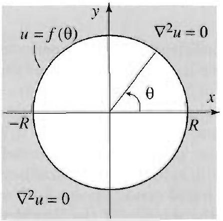

Figure 8 for Exercise 21.

Right margin note (page 33)

225
$=0$
ines
, we
the
$\mathrm{i} \theta=$
(6).
$\ln r$,
ion
the
the
is in
es as
and

++++

Section 4.4 Laplace's Equation in Circular Regions
17. A Neumann problem on the disk. Solve the Neumann problem $\nabla^{2} u$ for $0 \leq r<a$ with boundary condition $u_{r}(a, \theta)=f(\theta)$, where $f(\theta)$ determ the normal derivative on the circle $r=a$. For this problem to have a solution require the compatibility condition
$$
\int_{0}^{2 \pi} f(\theta) d \theta=0
$$

Explain why this condition is necessary for your solution.
18. A Robin condition. Solve Laplace's equation on the unit disk, subject to Robin condition $u_{r}(1, \theta)+2 u(1, \theta)=100-2 \cos 2 \theta$.
19. A proof of (6). Let $z$ be a complex number with $|z|<1$. Write $z=r e r(\cos \theta+i \sin \theta)$. Consider the series expansion
$$
\log \left[(1-z)^{-1}\right]=z+\frac{1}{2} z^{2}+\frac{1}{3} z^{3}+\cdots,
$$
which is valid for $|z|<1$. Compute the imaginary part of this series and derive [Hint: Recall that if $w=r e^{i \theta}=x+i y$, with $-\pi<\theta<\pi$, then $\operatorname{Re}(\log (w))=$ and $\operatorname{Im}(\log (w))=\theta=\tan ^{-1} \frac{y}{x}$.]
20. Further identities. Taking real and imaginary parts in the series expans
$$
\log (1+z)=\sum_{n=1}^{\infty}(-1)^{n+1} \frac{z^{n}}{n}, \quad|z|<1,
$$
derive the identities: for $0 \leq r<1,0<\theta<2 \pi$,
$$
\begin{array}{c}
\sum_{n=1}^{\infty}(-1)^{n+1} \frac{\sin n \theta}{n} r^{n}=\tan ^{-1}\left(\frac{r \sin \theta}{1+r \cos \theta}\right) \\
\sum_{n=1}^{\infty}(-1)^{n+1} \frac{\cos n \theta}{n} r^{n}=\frac{1}{2} \ln \left(1+2 r \cos \theta+r^{2}\right)
\end{array}
$$
21. Dirichlet problem outside a disk. Show that the bounded solution of Dirichlet problem outside the disk $r=a$ (Figure 8) is given by the series
$$
u(r, \theta)=a_{0}+\sum_{n=1}^{\infty}\left(\frac{a}{r}\right)^{n}\left(a_{n} \cos n \theta+b_{n} \sin n \theta\right), \quad r>a
$$
where the coefficients are given by (5). [Hint: Proceed as in the solution of Dirichlet problem inside the disk. Choose the bounded solutions from (3).]
22. Solve the Dirichlet problem outside the unit disk with boundary values a Example 1. What are the isotherms in this case?
23. (a) Solve the Dirichlet problem outside the unit disk with boundary value in Exercise 5.
(b) Show that the isotherms are circles passing through the points $(1,0) \left(\frac{1}{\sqrt{2}}, \frac{1}{\sqrt{2}}\right)$.

---

<!-- Page 34 -->

Left margin note (page 34)

226
Chapter 4 Partial Differ

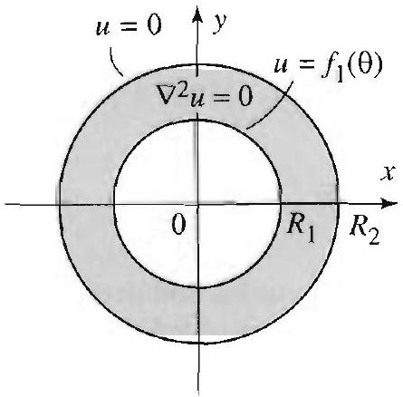

Figure 9 for Exercise 24.

Right margin note (page 34)

ure 9 is $\left.\frac{i}{n}\right)$,
[Hint: 2) $=0$. $\theta)=0$, region 1onhonsional
$t$
eriodic unction $(r, \theta)=$ der two $r<a, \theta$ Second undary $\theta, 0)=$ irichlet
re was r. The ding to

Fourier

++++

ential Equations in Polar and Cylindrical Coordinates
24. Project Problem: Dirichlet problems on annular regions.
(a) Show that the steady-state solution in the annular region shown in Fig
$$
u(r, \theta)=a_{0} \frac{\ln r-\ln R_{2}}{\ln R_{1}-\ln R_{2}}+\sum_{n=1}^{\infty}\left[a_{n} \cos n \theta+b_{n} \sin n \theta\right]\left(\frac{R_{1}}{r}\right)^{n}\left(\frac{R_{2}^{2 n}-r^{2}}{R_{2}^{2 n}-R_{1}^{2}}\right.
$$
( $R_{1}<r<R_{2}$ ) where $a_{0}, a_{n}$, and $b_{n}$ are the Fourier coefficients of $f_{1}(\theta)$ Proceed as in the solution derived in this section, and use the condition $R(R$
(b) What is the steady-state solution if the boundary conditions are $u\left(R_{1}\right.$, and $u\left(R_{2}, \theta\right)=f_{2}(\theta)$, for all $\theta$ ?
(c) Combine (a) and (b) to find the steady-state solution in the annular given that $u\left(R_{1}, \theta\right)=f_{1}(\theta)$, and $u\left(R_{2}, \theta\right)=f_{2}(\theta)$ for all $\theta$.
25. Project Problem: Two dimensional heat equation with a mogeneous boundary condition. Show that the solution of the two dime heat equation
$$
u_{t}=c^{2}\left(\frac{\partial^{2} u}{\partial r^{2}}+\frac{1}{r} \frac{\partial u}{\partial r}+\frac{1}{r^{2}} \frac{\partial^{2} u}{\partial \theta^{2}}\right), \quad 0<r<a, 0<\theta<2 \pi, t>0,
$$
subject to the nonhomogeneous boundary condition
$$
u(a, \theta, t)=G(\theta), \quad 0<\theta<2 \pi, t>0,
$$
and the initial condition
$$
u(r, \theta, 0)=F(r, \theta), \quad 0<\theta<2 \pi, 0 \leq r<a,
$$
is
$$
\begin{aligned}
u(r, \theta, t)= & a_{0}+\sum_{m=1}^{\infty}\left[a_{m} \cos m \theta+b_{m} \sin m \theta\right]\left(\frac{r}{a}\right)^{m} \\
& +\sum_{m=0}^{\infty} \sum_{n=1}^{\infty} J_{m}\left(\lambda_{m n} r\right)\left(a_{m n} \cos m \theta+b_{m n} \sin m \theta\right) e^{-c^{2} \lambda_{m n}^{2}}
\end{aligned}
$$
where the coefficients $a_{0}, a_{m}, b_{m}$ are the Fourier coefficients of the $2 \pi$ function $G(\theta) ; \lambda_{m n}=\frac{\alpha_{m n}}{a}$ where $\alpha_{m n}$ is the $n$th positive zero of the Bessel f of order $m, J_{m}$; and $a_{m n}, b_{m n}$ are given by (12)-(14) of Section 4.3 with $f F(r, \theta)-u_{1}(r, \theta)$, where $u_{1}$ represents the steady-state solution. [Hint: Consi separate problems. First problem (steady-state solution): $\nabla^{2} u_{1}=0,0<$ arbitrary, subject to the boundary condition $u_{1}(a, \theta)=G(\theta)$ for all $\theta$. problem: $v_{t}=c^{2} \nabla^{2} v, 0<r<a, \theta$ arbitrary, and $t>0$, subject to the bo condition $v(a, \theta, t)=0$ for all $\theta$ and $t>0$, and the initial condition $v(r$, $F(r, \theta)-u_{1}(r, \theta)$ for all $\theta$ and $0 \leq r<a$. Combine the solution of the D problem with that of Exercise 11, Section 4.3.]
26. A circular plate of radius 1 was placed in a freezer and its temperat brought to $0^{\circ}$. The plate was then insulated and removed from the freeze edge of the plate was kept at a temperature varying from $0^{\circ}$ to $100^{\circ}$ accor the formula $f(\theta)=50(1-\cos \theta), 0 \leq \theta \leq 2 \pi$.
(a) Plot the temperature of the boundary as a function of $\theta$, and find its

---

<!-- Page 35 -->

Right margin note (page 35)

227

ats of
$$
c=1
$$
e the iting
$$
c=
$$
ple 2,

your
rtant
egral
steps
disk.
aplex
e the
s the

++++

Section 4.4 Laplace's Equation in Circular Regions

series.
(b) Find the steady-state temperature,
(c) Plot the steady-state temperature and from your graph determine the poir the plate with temperature $0^{\circ}$, respectively, $100^{\circ}$.
(d) Determine and plot the isotherms. Confirm your answer in (c).
(e) Solve the heat problem in the plate given that the thermal conductivity and given that the initial temperature distribution is $0^{\circ}$.
(f) Plot the temperature distribution at various values of $t>0$ and estimat time it takes to raise the temperature of the center to $25^{\circ}$. What is the lim value of the temperature of the center? Verify your answer using (b).
27. (a) Solve the heat problem in Exercise 26 for the following data: $a=$ 1, $F(r, \theta)=\left(1-r^{2}\right) r \sin \theta, G(\theta)=\sin 2 \theta$ for $0<\theta<2 \pi$. [Hint: See Exam] Section 4.3.]
(b) What is the steady-state solution in this case?
(c) Plot the solution for several values of $t$ and compare with the graph of answer in (b).
Project Problem: Poisson integral formula on a disk. This impo formula expresses the solution of the Dirichlet problem (4) in terms of an int involving the boundary data function. Derive this formula following the outlined in Exercises 28 and 29.
28. The Poisson kernel. Let $z=r e^{i \theta}$, and consider the power series
$$
\frac{1}{1-z}=\sum_{n=0}^{\infty} z^{n}, \quad|z|<1
$$
(a) Show that
$$
1+2 \operatorname{Re}\left(\frac{1}{1-z}-1\right)=1+2 \sum_{n=1}^{\infty} r^{n} \cos n \theta, \quad 0<r<1, \text { all } \theta
$$
(b) Obtain the identity
$$
1+2 \sum_{n=1}^{\infty} r^{n} \cos n \theta=\frac{1-r^{2}}{1-2 r \cos \theta+r^{2}}, \quad 0<r<1, \text { all } \theta
$$

The function $P(r, \theta)=\frac{1-r^{2}}{1-2 r \cos \theta+r^{2}}$ is known as the Poisson kernel on the It plays an important role in the theory of partial differential equations, con and harmonic analysis.
29. Poisson integral formula on the disk. In this exercise we deriv integral form of the solution (4) of the Dirichlet problem (1)-(2), known a Poisson integral formula: for $0<r<a$, and all $\theta$,
$$
\begin{aligned}
u(r, \theta) & =\frac{1}{2 \pi} \int_{0}^{2 \pi} f(\phi) P\left(\frac{r}{a}, \theta-\phi\right) d \phi \\
& =\frac{1}{2 \pi} \int_{0}^{2 \pi} f(\phi) \frac{a^{2}-r^{2}}{a^{2}-2 a r \cos (\theta-\phi)+r^{2}} d \phi
\end{aligned}
$$

---

<!-- Page 36 -->

Left margin note (page 36)

228
Chapter 4
P
4.5 Laplace

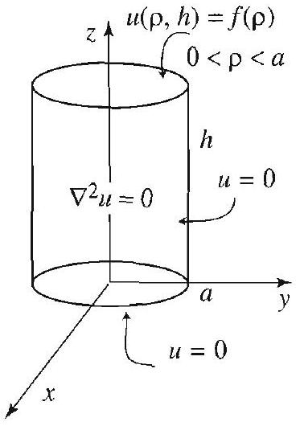

Figure 1

DIRI PROBLEI CYLINDER ZERO LA' TEMPER

Right margin note (page 36)

by $\phi$.]
ms in ith no ls the urface mper-
$$
\begin{array}{l}
Z(z) \\
=0 \\
\text { unded }
\end{array}
$$

++++

artial Differential Equations in Polar and Cylindrical Coordinates

Thus this formula is an alternative way of writing the series solution (4).
(a) Substitute the coefficients (5) in the series solution (4) and obtain
$$
u(r, \theta)=\frac{1}{2 \pi} \int_{0}^{2 \pi} f(\phi)\left\{1+2 \sum_{n=1}^{\infty} \cos [n(\theta-\phi)]\left(\frac{r}{a}\right)^{n}\right\} d \phi .
$$
[Hint: Before you do the substitution, replace the dummy variable $\theta$ in (5)
(b) Derive the Poisson formula using (a) and Exercise 28.
's Equation in a Cylinder
In this section we treat certain radially symmetric Dirichlet proble cylindrical regions. In cylindrical coordinates, Laplace's equation, w

ρ) $\phi$ dependence, is

$<a$
$$
\nabla^{2} u=\frac{\partial^{2} u}{\partial \rho^{2}}+\frac{1}{\rho} \frac{\partial u}{\partial \rho}+\frac{\partial^{2} u}{\partial z^{2}}=0 .
$$

$=0$

(See (4), Section 4.1.) The first problem that we will consider mode steady-state temperature distribution inside a cylinder with lateral s and bottom kept at zero temperature and with radially symmetric te ature distribution at the top, as shown in Figure 1.

CHLET

The solution of Laplace's equation (1) with boundary conditions

M IN A
WITH
TERAL
ATURE
$$
\begin{array}{c}
u(\rho, 0)=0, \quad 0<\rho<a \\
u(a, z)=0, \quad 0<z<h \\
u(\rho, h)=f(\rho), \quad 0<\rho<a
\end{array}
$$
is
$$
u(\rho, z)=\sum_{n=1}^{\infty} A_{n} J_{0}\left(\lambda_{n} \rho\right) \sinh \lambda_{n} z
$$
where
$$
A_{n}=\frac{2}{\sinh \left(\lambda_{n} h\right) a^{2} J_{1}^{2}\left(\alpha_{n}\right)} \int_{0}^{a} f(\rho) J_{0}\left(\lambda_{n} \rho\right) \rho d \rho, \quad \lambda_{n}=\frac{\alpha_{n}}{a},
$$
and $\alpha_{n}$ is the $n$th positive zero of $J_{0}$, the Bessel function of order 0 .
Proof Using the method of separation of variables and setting $u(\rho, z)=R(\mu$, we get the equations $\rho^{2} R^{\prime \prime}+\rho R^{\prime}-k \rho^{2} R=0, R(a)=0$, and $Z^{\prime \prime}+k 2 Z(0)=0$, where $k$ is the separation constant. We also require that $R$ be bo

---

<!-- Page 37 -->

Left margin note (page 37)

Figure 2 Modified Bessel functions.

Figure 3

DIRICHLET PROBLEM IN A CYLINDER WITH NONZERO LATERAL TEMPERATURE

Right margin note (page 37)

229

it is $=\lambda^{2}$, rder neral ns of Since ne is ation s the
$$
\lambda_{n}=
$$
the
from
ith a igure

++++

Section 4.5 Laplace's Equation in a Cylinder

at $\rho=0$, since we are solving for the temperature inside the cylinder. If $k=0$ straightforward to check that we only get the solution $R=0$. If $k>0$, say $k$; then we get the parametric form of the modified Bessel equation of o 0 defined in Exercise 7 (see also Exercises 29 and 30, Section 4.7). The ge solution in this case is a linear combination of the modified Bessel functio the first and second kind, $I_{0}$ and $K_{0}$, shown in Figure 2 (see Exercise 7). the first one is positive and strictly increasing for $\rho>0$, and the second unbounded near zero, we conclude that no nontrivial bounded linear combin of these functions can satisfy the boundary conditions on $R$. So this leave only possibility $k=-\lambda^{2}<0$. In this case we have
$$
\begin{array}{c}
\rho^{2} R^{\prime \prime}+\rho R^{\prime}+\lambda^{2} \rho^{2} R=0, \quad R(a)=0, \\
Z^{\prime \prime}-\lambda^{2} Z=0, \quad Z(0)=0 .
\end{array}
$$

Applying Theorem 3, Section 4.8, we find that $R=R_{n}(\rho)=J_{0}\left(\lambda_{n} \rho\right)$, where $\alpha_{n} / a, n=1,2, \ldots$. Solving the equation for $Z$ with $\lambda=\lambda_{n}$, we find
$$
Z_{n}(z)=\sinh \lambda_{n} z \quad n=1,2, \ldots
$$

Superposing the product solutions we get (2) as a solution. To determin unknown coefficients $A_{n}$, we set $z=h$ and get the Bessel series expansion
$$
f(\rho)=\sum_{n=1}^{\infty} A_{n} J_{0}\left(\lambda_{n} \rho\right) \sinh \lambda_{n} h .
$$

Thus $A_{n} \sinh \lambda_{n} h$ must be the $n$th Bessel coefficient of $f(\rho)$, and so (3) follows Theorem 2, Section 4.8.

As a second illustration, we consider a boundary value problem w nonzero boundary condition on the lateral surface of the cylinder (see F $3)$.

The solution of Laplace's equation (1) with boundary conditions
$$
\begin{array}{c}
u(\rho, 0)=u(\rho, h)=0, \quad 0<\rho<a \\
u(a, z)=f(z), \quad 0<z<h
\end{array}
$$
is
$$
u(\rho, z)=\sum_{n=1}^{\infty} B_{n} I_{0}\left(\frac{n \pi}{h} \rho\right) \sin \frac{n \pi}{h} z
$$
where $I_{0}$ is the modified Bessel function of the first kind of order 0, an
$$
B_{n}=\frac{2}{I_{0}\left(\frac{n \pi a}{h}\right) h} \int_{0}^{h} f(z) \sin \frac{n \pi}{h} z d z
$$

---

<!-- Page 38 -->

Left margin note (page 38)

230
Chapter 4 Partial Differ

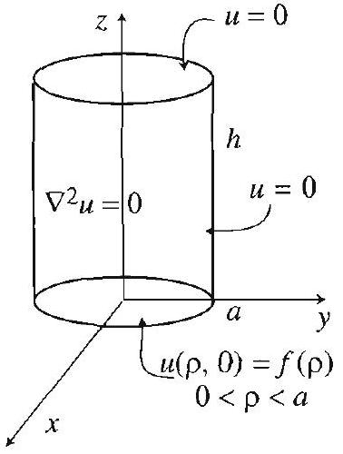

Figure 4 for Exercise 5.

Right margin note (page 38)

iously,
$$
t^{2}>0 .
$$
e 1 for
lues as
dified
ation is s of the
cercises
ions as
$$
n=\frac{n \pi}{h}
$$

++++

ential Equations in Polar and Cylindrical Coordinates

The derivation of the solution is very much like the one we did prev except that now the interesting case of the separation constant is $k=v$ The details are left to Exercise 8.

Exercises 4.5
In Exercises 1-4, find the steady-state temperature in the cylinder of Figur the given temperature distribution of its top. Take $a=1$, and $h=2$.
1. $f(\rho)=100$.
2. $f(\rho)=100-\rho^{2}$.
3. $f(\rho)=\left\{\begin{array}{ll}100 & \text { if } 0<\rho<\frac{1}{2}, \\ 0 & \text { if } \frac{1}{2}<\rho<1 .\end{array}\right.$
4. $f(\rho)=70 J_{0}(\rho)$.
5. (a) Find the steady-state temperature in the cylinder with boundary va shown in Figure 4.
(b) Solve (1) for the boundary conditions
$$
\begin{array}{c}
u(\rho, 0)=f_{1}(\rho), \quad 0<\rho<a \\
u(a, z)=0, \quad 0<z<h \\
u(\rho, h)=f_{2}(\rho), \quad 0<\rho<a
\end{array}
$$
[Hint: Combine (a) with the solution in this section.]
6. Solve (1) for the boundary conditions
$$
\begin{array}{cc}
u(\rho, 0)=100, & 0<\rho<1, \\
u(1, z)=0, & 0<z<2, \\
u(\rho, 2)=100, & 0<\rho<1 .
\end{array}
$$
7. Make the substitution $x=\lambda \rho(\lambda>0)$ in the parametric form of the $\mathbf{m c}$ Bessel equation $\rho^{2} R^{\prime \prime}+\rho R^{\prime}-\lambda^{2} \rho^{2} R=0$ and obtain that its general solu $y=c_{1} I_{0}(\lambda \rho)+c_{2} K_{0}(\lambda \rho)$, where $I_{0}$ and $K_{0}$ are the modified Bessel function first and second kind. [Hint: Use Exercises 29 and 30, Section 4.7.]

Project Problem: Lateral surface with nonzero temperature. Do Ex 8 and 9 .
8. In this exercise we derive (4) and (5).
(a) Refer to the Dirichlet problem in the cylinder with boundary condit given just before (4). Use the separation of variables method and obtain
$$
\begin{array}{c}
Z^{\prime \prime}+\nu^{2} Z=0, \quad Z(0)=0 \text { and } Z(h)=0 \\
\rho^{2} R^{\prime \prime}+\rho R^{\prime}-\nu^{2} \rho^{2} R=0
\end{array}
$$
(b) Show that the only possible solutions of the first equation correspond to $\nu$ and hence are
$$
Z_{n}(z)=\sin \frac{n \pi}{h} z, \quad n=1,2, \ldots .
$$
(c) Derive (4) and (5). [Hint: Use Exercise 7.]
9. Solve (1) for the boundary conditions
$$
\begin{array}{c}
u(\rho, 0)=u(\rho, 2)=0, \quad 0<\rho<1, \\
u(1, z)=10 z, \quad 0<z<2 .
\end{array}
$$

---

<!-- Page 39 -->

Left margin note (page 39)

Figure 5 for Exercise 11.
4.6 The Helmholt:

Right margin note (page 39)

231
er as
lems
this
For
f the

ues)
s (or
sing
and
$=0$
form
that
ch is
the

++++

Section 4.6 The Helmholtz and Poisson Equations
10. Solve (1) for the boundary conditions
$$
\begin{array}{ll}
u(\rho, 0)=100, & 0<\rho<1, \\
u(1, z)=10 z, & 0<z<2, \\
u(\rho, 2)=100, & 0<\rho<1 .
\end{array}
$$
[Hint: Combine the solutions of Exercises 6 and 9.]
11. Find the steady-state temperature in a cylindrical barrel floating in wat shown in Figure 5.
z and Poisson Equations
We know from Section 3.9 that several important boundary value prob can be solved by applying the method of eigenfunction expansions. In section, we will present some applications of this method on the disk. this purpose, we start by solving the eigenvalue problem consisting o Helmholtz equation on a disk of radius $a$,
$$
\nabla^{2} \phi(r, \theta)=-k \phi(r, \theta), 0<r<a, 0<\theta<2 \pi,
$$
with the boundary condition
$$
\phi(a, \theta)=0,0<\theta<2 \pi .
$$

To solve this problem means to determine the values of $k$ (or eigenval for which we have nontrivial solutions and find these nontrivial solution eigenfunctions).

Substituting $\phi(r, \theta)=R(r) \Theta(\theta)$ into (1), separating variables, and $u$ the fact that $\Theta$ is $2 \pi$-periodic, we arrive at the equations
$$
\begin{array}{c}
\Theta^{\prime \prime}+m^{2} \Theta=0, \quad m=0,1,2, \ldots, \\
r^{2} R^{\prime \prime}+r R^{\prime}+\left(k r^{2}-m^{2}\right) R=0, \quad R(a)=0
\end{array}
$$

The solutions of (3) are
$$
\cos m \theta, \text { and } \sin m \theta, \quad m=0,1,2, \ldots
$$

If $k<0$, equation (4) becomes the modified Bessel equation of order $m$, it can be shown that in this case the only bounded solution with $R(a)$ is the zero solution. So we take $k \geq 0$ and (4) becomes the parametric of Bessel's equation of order $m$. We know from Theorem 3, Section 4.8, the nontrivial solutions of (4) are constant multiples of $J_{m}\left(\lambda_{m n} r\right)$, whi the solution corresponding to the eigenvalue $k=\lambda_{m n}^{2}$. Piecing together product solutions, we obtain the following important result.

---

<!-- Page 40 -->

Left margin note (page 40)

ΝΟΙLVΩΌᲪ
ZLIOHWTAH
THOL HO SNOILON $\cap$ ANGPIA AHL HO SNYAL NI SNOISNVdXA Z NAYOAHL

HSIG
V NI NOILVΩΌᲪ
ZLIOHWIGH SHL
I NAYOSHL
Z\&Z

Right margin note (page 40)

o each
a given
$n\left(\lambda_{m n} r\right)$,
lations
$\cos n x$
onality ns and Bessel rem 1, ressed ave
eorem,
en
y (12)-
es and tained
on the

++++

ential Equations in Polar and Cylindrical Coordinates

The eigenvalues of the problem (1)-(2) are
$$
k=\lambda_{m n}^{2}=\left(\alpha_{m n} / a\right)^{2}, \quad m=0,1,2, \ldots, n=1,2, \ldots
$$
where $\alpha_{m n}$ is the $n$th positive zero of the Bessel function $J_{m}$. eigenvalue $\lambda_{m n}^{2}$ correspond the eigenfunctions
$$
\cos m \theta J_{m}\left(\lambda_{m n} r\right) \text { and } \sin m \theta J_{m}\left(\lambda_{m n} r\right)
$$
(Note that for $m=1,2, \ldots$ we have two distinct eigenfunctions for eigenvalue.)

In other words, if $\phi_{m n}(r, \theta)=\cos m \theta J_{m}\left(\lambda_{m n} r\right)$ or $\phi_{m n}(r, \theta)=\sin m \theta J_{r}$ then $\nabla^{2} \phi_{m n}=-\lambda_{m n}^{2} \phi_{m n}$ and $\phi(a, \theta)=0$.

As you will discover, the eigenfunctions satisfy orthogonality re that can be used to expand functions on the disk, much as we used and $\sin n x$ to expand functions in terms of Fourier series. The orthog here follows as a consequence of the orthogonality of the Bessel functio the trigonometric system. Because the orthogonality relations for the functions are expressed with respect to the weight function $r$ (Theo Section 4.8), the orthogonality of the eigenfunctions in (6) will be exp by integrals over the disk with respect to $r d r d \theta$. For example, we h
$$
\int_{0}^{2 \pi} \int_{0}^{a} \sin m \theta J_{m}\left(\lambda_{m n} r\right) \cos m \theta J_{m}\left(\lambda_{m n} r\right) r d r d \theta=0
$$

Putting these facts together, we obtain the following expansion th which was already used in (8), Section 4.3.

Suppose that $f(r, \theta)$ is defined for all $0<r<a$ and $0<\theta<2 \pi$. Th
$$
f(r, \theta)=\sum_{m=0}^{\infty} \sum_{n=1}^{\infty} J_{m}\left(\lambda_{m n} r\right)\left(a_{m n} \cos m \theta+b_{m n} \sin m \theta\right),
$$
where (the generalized Fourier coefficients) $a_{m n}$ and $b_{m n}$ are given b (14), Section 4.3.

In Section 4.3, we established (8) as a consequence of Fourier seri Bessel-Fourier series. A simpler and more direct derivation can be ob using the orthogonality of the eigenfunctions (6) (see Exercise 4).

EXAMPLE 1 The method of eigenfunction expansions
Solve $\nabla^{2} u(r, \theta)=u(r, \theta)+3 r^{2} \cos 2 \theta$ in the unit disk, given that $u=0$ boundary.

---

<!-- Page 41 -->

Right margin note (page 41)

233
a so-
ation
et
ats of
etric
zero.
only
ouble

++++

Section 4.6 The Helmholtz and Poisson Equations

Solution We look for a solution in the form of an eigenfunction expansion
$$
u(r, \theta)=\sum_{m=0}^{\infty} \sum_{n=1}^{\infty} J_{m}\left(\alpha_{m n} r\right)\left(A_{m n} \cos m \theta+B_{m n} \sin m \theta\right) .
$$

Since each eigenfunction satisfies the boundary condition, our candidate for lution, $u(r, \theta)$, also satisfies the boundary condition. Plugging $u$ into the equ and using the fact that, for an eigenfunction $\phi_{m n}, \nabla^{2} \phi_{m n}=-\alpha_{m n}^{2} \phi_{m n}$, we ge
$$
\begin{aligned}
\sum_{m=0}^{\infty} & \sum_{n=1}^{\infty}-\alpha_{m n}^{2} J_{m}\left(\alpha_{m n} r\right)\left(A_{m n} \cos m \theta+B_{m n} \sin m \theta\right) \\
& =\sum_{m=0}^{\infty} \sum_{n=1}^{\infty} J_{m}\left(\alpha_{m n} r\right)\left(A_{m n} \cos m \theta+B_{m n} \sin m \theta\right)+3 r^{2} \cos 2 \theta
\end{aligned}
$$
hence
$$
\sum_{m=0}^{\infty} \sum_{n=1}^{\infty}\left(-1-\alpha_{m n}^{2}\right) J_{m}\left(\alpha_{m n} r\right)\left(A_{m n} \cos m \theta+B_{m n} \sin m \theta\right)=3 r^{2} \cos 2 \theta .
$$

Thus $\left(-1-\alpha_{m n}^{2}\right) A_{m n}$ and $\left(-1-\alpha_{m n}^{2}\right) B_{m n}$ are the generalized Fourier coefficier the function $f(r, \theta)=3 r^{2} \cos 2 \theta$. Note that the orthogonality of the trigonom system will imply that only $A_{2 n}$ is nonzero. All other coefficients will be Appealing to (13), Section 4.3, with $m=2$, we find
$$
\begin{aligned}
\left(-1-\alpha_{2 n}^{2}\right) A_{2 n} & =\frac{2}{\pi J_{3}^{2}\left(\alpha_{2 n}\right)} \int_{0}^{1} \int_{0}^{2 \pi} 3 \cos ^{2} 2 \theta d \theta r^{2} J_{2}\left(\alpha_{2 n} r\right) r d r \\
& =\frac{6}{J_{3}^{2}\left(\alpha_{2 n}\right)} \int_{0}^{1} r^{3} J_{2}\left(\alpha_{2 n} r\right) d r \quad\left(\int_{0}^{2 \pi} \cos ^{2} 2 \theta d \theta=\pi\right) \\
& =\frac{6}{J_{3}^{2}\left(\alpha_{2 n}\right)} \frac{J_{3}\left(\alpha_{2 n}\right)}{\alpha_{2 n}} \quad(\text { by (11), Section 4.2) } \\
& =\frac{6}{\alpha_{2 n} J_{3}\left(\alpha_{2 n}\right)} .
\end{aligned}
$$

Solving for $A_{2 n}$ and plugging into the eigenfunction expansion of $u$, we find
$$
u(r, \theta)=\cos 2 \theta \sum_{n=1}^{\infty} \frac{-6}{\left(1+\alpha_{2 n}^{2}\right) \alpha_{2 n} J_{3}\left(\alpha_{2 n}\right)} J_{2}\left(\alpha_{2 n} r\right) .
$$

The collapsing of the double sum in (8) to a single sum is due to the fact that the terms in $\cos 2 \theta$ are needed here. In general, you may need the entire d sum.

Poisson's Equation in a Disk
Consider the Poisson problem
$$
\begin{array}{c}
\nabla^{2} u=f(r, \theta), \quad 0<r<a, \quad 0<\theta<2 \pi, \\
u(a, \theta)=g(\theta), \quad 0<\theta<2 \pi .
\end{array}
$$

---

<!-- Page 42 -->

Left margin note (page 42)

234
Chapter 4 Partial Differ

Figure 1 Decomposition of a Poisson problem.

Right margin note (page 42)

pblems
$g(\theta)$
of Secisson's hod of of (9)
(1), we
solve

++++

ential Equations in Polar and Cylindrical Coordinates

Our first step is to decompose the problem into the two simpler subpro in Figure 1.

The Dirichlet problem in Figure 1(b) can be solved by the methods tion 4.4. Thus, to complete the solution, we need only solve Po equation with zero boundary data (Figure 1(a)). We will use the met eigenfunction expansions. This method tells us to look for a solution (with zero boundary data) in the form
$$
u(r, \theta)=\sum_{m=0}^{\infty} \sum_{n=1}^{\infty} J_{m}\left(\lambda_{m n} r\right)\left(A_{m n} \cos m \theta+B_{m n} \sin m \theta\right) .
$$

Plugging into (9) and using the fact that each eigenfunction satisfies obtain
$$
\sum_{m=0}^{\infty} \sum_{n=1}^{\infty}-\lambda_{m n}^{2} J_{m}\left(\lambda_{m n} r\right)\left(A_{m n} \cos m \theta+B_{m n} \sin m \theta\right)=f(r, \theta) .
$$

This being the eigenfunction expansion of $f(r, \theta)$, we apply Theorem 2 for $A_{m n}$ and $B_{m n}$, and obtain, for $m, n=1,2, \ldots$,
$$
\begin{array}{c}
A_{0 n}=\frac{-1}{\pi \alpha_{0 n}^{2} J_{1}^{2}\left(\alpha_{0 n}\right)} \int_{0}^{a} \int_{0}^{2 \pi} f(r, \theta) J_{0}\left(\lambda_{0 n} r\right) r d \theta d r \\
A_{m n}=\frac{-2}{\pi \alpha_{m n}^{2} J_{m+1}^{2}\left(\alpha_{m n}\right)} \int_{0}^{a} \int_{0}^{2 \pi} f(r, \theta) \cos m \theta J_{m}\left(\lambda_{m n} r\right) r d \theta d r \\
B_{m n}=\frac{-2}{\pi \alpha_{m n}^{2} J_{m+1}^{2}\left(\alpha_{m n}\right)} \int_{0}^{a} \int_{0}^{2 \pi} f(r, \theta) \sin m \theta J_{m}\left(\lambda_{m n} r\right) r d \theta d r
\end{array}
$$

---

<!-- Page 43 -->

Left margin note (page 43)

SOLUTION OF POISSON'S PROBLEM IN A DISK

Right margin note (page 43)

235

We

| ata in |
| :--- |
| $1(\mathrm{~b})$. |
| $)-(5)$, |
1(b).
)-(5),

en by to be cause
pre-
of the
eigenhange $1 \theta d r$.]

++++

Section 4.6 The Helmholtz and Poisson Equation

This completely determines the solutions of the problem in Figure 1(a). summarize our findings as follows.

The solution of the Poisson problem (9)-(10) is given by
$$
u(r, \theta)=u_{1}(r, \theta)+u_{2}(r, \theta),
$$
where $u_{1}$ is the solution of the Poisson problem with zero boundary d Figure 1(a), and $u_{2}$ is the solution of the Dirichlet problem in Figure The function $u_{1}$ is given by (11)-(14), and the function $u_{2}$ is given by (4 Section 4.4.

EXAMPLE 2 A Poisson problem with zero boundary data Solve $\nabla^{2} u=1$ in the unit disk, given that $u=0$ on the boundary.
Solution Note that in this case $u_{2}=0$ in (15). The function $u_{1}$ is giv (11). Since the whole problem is independent of $\theta$, we expect the solution independent of $\theta$. Indeed, plugging $f(r, \theta)=1$ into (13) and (14), we get 0 be of the integral in $\theta$. Now (12) yields
$$
A_{0 n}=\frac{-2}{\alpha_{0 n}^{2} J_{1}^{2}\left(\alpha_{0 n}\right)} \int_{0}^{1} J_{0}\left(\alpha_{0 n} r\right) r d r
$$

Using (11), Section 4.2, to evaluate the integral and simplifying, we get $\frac{-2}{\alpha_{0 n}^{3} J_{1}\left(\alpha_{0 n}\right)}$. Substituting into (11), we obtain
$$
u(r, \theta)=\sum_{n=1}^{\infty} \frac{-2}{\alpha_{0 n}^{3} J_{1}\left(\alpha_{0 n}\right)} J_{0}\left(\alpha_{0 n} r\right) .
$$

Interesting applications of the eigenfunction expansions method are sented in the exercises.

Exercises 4.6
1. Derive (3) and (4) from (1) and (2).
2. State and prove all the orthogonality relations for the eigenfunctions Helmholtz problem (1) and (2) ((7) is one of them).
3. Let $\phi_{m n}(r, \theta)$ denote either one of the eigenfunctions in (6). Evaluate
$$
\int_{0}^{2 \pi} \int_{0}^{a} \phi_{m n}^{2}(r, \theta) r d r d \theta
$$

Treat the case $m=0$ separately. [Hint: Use (12), Section 4.8.]
4. Derive the coefficients in Theorem 2 by using the orthogonality of the functions (6). [Hint: Multiply both sides of (8) by an eigenfunction, interc integrals and summation signs, then integrate over the disk with respect to $r$

---

<!-- Page 44 -->

Left margin note (page 44)

236
Chapter 4 Pat

Right margin note (page 44)

given eigenroject, moge-
$$
l_{m n}(t),
$$
blems:
$$
=e^{-t} .
$$
b.
$$
=1 .
$$

。

++++

tial Differential Equations in Polar and Cylindrical Coordinates

In Exercises 5-12, use the method of eigenfunction expansions to solve the problem in the unit disk.
5. $\nabla^{2} u=-u+1, \quad u(1, \theta)=0$.
6. $\nabla^{2} u=3 u+r \sin \theta, u(1, \theta)=0$
7. $\nabla^{2} u=2+r^{3} \cos 3 \theta, u(1, \theta)=0$.
8. $\nabla^{2} u=r^{2}, u(1, \theta)=0$.
9.
10. $\nabla^{2} u=r^{m} \sin m \theta, u(1, \theta)=0$.
11. $\nabla^{2} u=1, u(1, \theta)=\sin 2 \theta$.
$$
\nabla^{2} u=\left\{\begin{array}{ll}
r \sin \theta & \text { if } 0<r<\frac{1}{2}, \\
0 & \text { if } \frac{1}{2}<r<1,
\end{array}\right.
$$
12. $\nabla^{2} u=1+r \cos \theta, u(1, \theta)=1$.
$$
u(1, \theta)=0 .
$$
13. A heat problem. Do Exercise 11, Section 4.3, using the method of function expansions.
14. Project Problem: A nonhomogeneous heat problem. For this $p$ you are asked to use the eigenfunction expansions method to solve the nonh neous heat boundary value problem, with time-dependent heat source,
$$
\begin{array}{c}
\frac{\partial u}{\partial t}=c^{2}\left(\frac{\partial^{2} u}{\partial r^{2}}+\frac{1}{r} \frac{\partial u}{\partial r}+\frac{1}{r^{2}} \frac{\partial^{2} u}{\partial \theta^{2}}\right)+q(r, \theta, t), \\
u(a, \theta, t)=0, \\
u(r, \theta, 0)=f(r, \theta),
\end{array}
$$
where $0<r<a, 0<\theta<2 \pi$, and $t>0$. Justify the following steps.
(a) Let
$$
\begin{array}{c}
u(r, \theta, t)=\sum_{m=0}^{\infty} \sum_{n=1}^{\infty} J_{m}\left(\lambda_{m n} r\right)\left(A_{m n}(t) \cos m \theta+B_{m n}(t) \sin m \theta\right) \\
f(r, \theta)=\sum_{m=0}^{\infty} \sum_{n=1}^{\infty} J_{m}\left(\lambda_{m n} r\right)\left(a_{m n} \cos m \theta+b_{m n} \sin m \theta\right) \\
q(r, \theta, t)=\sum_{m=0}^{\infty} \sum_{n=1}^{\infty} J_{m}\left(\lambda_{m n} r\right)\left(c_{m n}(t) \cos m \theta+d_{m n}(t) \sin m \theta\right)
\end{array}
$$
(Why should this be your starting point?) What are $a_{m n}, b_{m n}, c_{m n}(t)$, and $c$ in terms of $f$ and $q$ ?
(b) Show that $A_{m n}$ and $B_{m n}$ are solutions of the following initial value pro
$$
\begin{array}{ll}
A_{m n}^{\prime}(t)+\lambda_{m n}^{2} A_{m n}(t)=c_{m n}(t), & A_{m n}(0)=a_{m n} ; \\
B_{m n}^{\prime}(t)+\lambda_{m n}^{2} B_{m n}(t)=d_{m n}(t), & B_{m n}(0)=b_{m n}
\end{array}
$$
(c) Complete the solution by showing that
$$
A_{m n}(t)=e^{-\lambda_{m n}^{2} t}\left(a_{m n}+\int_{0}^{t} e^{\lambda_{m n}^{2} s} c_{m n}(s) d s\right)
$$
and
$$
B_{m n}(t)=e^{-\lambda_{m n}^{2} t}\left(b_{m n}+\int_{0}^{t} e^{\lambda_{m n}^{2} s} d_{m n}(s) d s\right)
$$
15. (a) Work out the details in Exercise 14 when $c=1, f=1$, and $q(r, \theta, t)$
(b) Plot the temperature of the center and describe what happens as $t \rightarrow 0$
16. (a) Work out the details in Exercise 14 when $c=1, f=r \sin \theta$, and $q$ :
(b) Plot the temperature of the center and describe what happens as $t \rightarrow 0$

---

<!-- Page 45 -->

Left margin note (page 45)

4.7 Bessel's

We have shifted the summation by 2 in t series so that each ser pressed in terms of $x^{7}$

Right margin note (page 45)

237

an in whole unntial ems. d by ction ge on iptic tered that natic
sy to o , as

++++

Section 4.7 Bessel's Equation and Bessel Functions

Equation and Bessel Functions
We saw in this chapter that Bessel's equation of order $p \geq 0$,
$$
x^{2} y^{\prime \prime}+x y^{\prime}+\left(x^{2}-p^{2}\right) y=0, \quad x>0,
$$
arises when solving partial differential equations involving the Laplaci polar and cylindrical coordinates. Note that Bessel's equation is a v family of differential equations, one for each value of $p$. Note also the fortunate clash of terminology-Bessel's equation of order $p$ is a differe equation of order 2 .

Bessel's equation also appears in solving various other classical prob) Historically, the equation with $p=0$ was first encountered and solve Daniel Bernoulli in 1732 in his study of the hanging chain problem (Se 6.3). Similar equations appeared later in 1770 in the work of Lagrang astronomical problems. In 1824, while investigating the problem of ell planetary motion, the great German astronomer F. W. Bessel encount a special form of (1). Influenced by the monumental work of Fourier had just appeared in 1822 (see Chapter 2), Bessel conducted a syster study of (1).

Solution of Bessel's Equation
We will apply the method of Frobenius from Appendix A.6. It is eas show that $x=0$ is a regular singular point of Bessel's equation.
suggested by the method of Frobenius, we try for a solution
$$
y=\sum_{m=0}^{\infty} a_{m} x^{r+m}
$$
where $a_{0} \neq 0$. Substituting this into (1) yields
index of he third es is ex$+m$.
$$
\begin{array}{l}
\sum_{m=0}^{\infty} a_{m}(r+m)(r+m-1) x^{r+m}+\sum_{m=0}^{\infty} a_{m}(r+m) x^{r+m} \\
\quad+\sum_{m=2}^{\infty} a_{m-2} x^{r+m}-p^{2} \sum_{m=0}^{\infty} a_{m} x^{r+m}=0
\end{array}
$$

Writing the terms corresponding to $m=0$ and $m=1$ separately gives
$$
\begin{array}{l}
a_{0}\left(r^{2}-p^{2}\right) x^{r}+a_{1}\left[(r+1)^{2}-p^{2}\right] x^{r+1} \\
\quad+\sum_{m=2}^{\infty}\left(a_{m}\left[(r+m)^{2}-p^{2}\right]+a_{m-2}\right) x^{r+m}=0
\end{array}
$$

---

<!-- Page 46 -->

Left margin note (page 46)

238
Chapter 4 Partial Differ

Right margin note (page 46)

terms With (recall find a with
ion to

++++

ential Equations in Polar and Cylindrical Coordinates

Equating coefficients of the series to zero gives
$$
\begin{array}{c}
a_{0}\left(r^{2}-p^{2}\right)=0 \quad(m=0) ; \\
a_{1}\left[(r+1)^{2}-p^{2}\right]=0 \quad(m=1) ; \\
a_{m}\left[(r+m)^{2}-p^{2}\right]+a_{m-2}=0 \quad(m \geq 2) .
\end{array}
$$

From (3), since $a_{0} \neq 0$, we get the indicial equation
$$
(r+p)(r-p)=0
$$
with indicial roots $r=p$ and $r=-p$.
First Solution of Bessel's Equation
Setting $r=p$ in (5) gives the recurrence relation
$$
a_{m}=\frac{-1}{m(m+2 p)} a_{m-2}, \quad m \geq 2 .
$$

This is a two-step recurrence relation, so the even- and odd-indexed are determined separately. We deal with the odd-indexed terms first. $r=p$, (4) becomes $a_{1}\left[(p+1)^{2}-p^{2}\right]=0$ which implies that $a_{1}=0$ that $p \geq 0$ in (1)), and so $a_{3}=a_{5}=\cdots=0$. To make it easier to pattern for the even-indexed terms we rewrite the recurrence relatio $m=2 k$ and get
$$
a_{2 k}=\frac{-1}{2^{2} k(k+p)} a_{2(k-1)}, \quad k \geq 1 .
$$

This gives
$$
\begin{array}{l}
a_{2}=\frac{-1}{2^{2}(1+p)} a_{0} \\
a_{4}=\frac{-1}{2^{2} 2(2+p)} a_{2}=\frac{1}{2^{4} 2!(1+p)(2+p)} a_{0} \\
a_{6}=\frac{-1}{2^{2} 3(3+p)} a_{4}=\frac{-1}{2^{6} 3!(1+p)(2+p)(3+p)} a_{0}
\end{array}
$$
and so on. Substituting these coefficients into (2) gives one solut Bessel's equation:
$$
y=a_{0} \sum_{k=0}^{\infty} \frac{(-1)^{k}}{2^{2 k} k!(1+p)(2+p) \cdots(k+p)} x^{2 k+p},
$$

---

<!-- Page 47 -->

Right margin note (page 47)

239
with
this
mma
and

the

++++

Section 4.7 Bessel's Equation and Bessel Functions

where $a_{0} \neq 0$ is arbitrary. This solution may be written in a nicer way the aid of the gamma function. (If you have not previously encountered function, it is described at the end of this section.) We choose
$$
a_{0}=\frac{1}{2^{p} \Gamma(p+1)}
$$
and simplify the terms in the series using the basic property of the ga function, $\Gamma(x+1)=x \Gamma(x)$, as follows:
$$
\begin{aligned}
\Gamma(1+p)[(1+p)(2+p) \cdots(k+p)] & =\Gamma(2+p)[(2+p) \cdots(k+p) \\
& =\Gamma(3+p)[\cdots(k+p)] \\
& =\cdots=\Gamma(k+p+1) .
\end{aligned}
$$

After this simplification, (6) yields the first solution, denoted by $J_{p}$ called the Bessel function of order $p$,
$$
J_{p}(x)=\sum_{k=0}^{\infty} \frac{(-1)^{k}}{k!\Gamma(k+p+1)}\left(\frac{x}{2}\right)^{2 k+p}
$$

When $p=n$, we have $\Gamma(k+p+1)=(k+n)!$ (see (14) below), and s Bessel function of order $n$ is
$$
J_{n}(x)=\sum_{k=0}^{\infty} \frac{(-1)^{k}}{k!(k+n)!}\left(\frac{x}{2}\right)^{2 k+n} .
$$

To get an idea of the behavior of the Bessel functions, we sketch the gr of $J_{0}, J_{1 / 2}, J_{1}, J_{2}$ and $J_{7}$ in Figure 1.

---

<!-- Page 48 -->

Left margin note (page 48)

240
Chapter 4 Partial Differ
$$
\begin{array}{l}
J_{0}(0)=1 \\
J_{p}(0)=0 \text { if } p>0 .
\end{array}
$$

Right margin note (page 48)

not ore at of $J_{p}$. set of when value

that

++++

ential Equations in Polar and Cylindrical Coordinates

Figure 1 Graphs of $J_{p}(x)$ for $p=0, \frac{1}{2}, 1,2,7$.

Note that $J_{p}$ is bounded at 0 . As we will see shortly, this property shared by the second linearly independent solution.

Second Solution of Bessel's Equation
If in (2) we replace $r$ by the second indicial root $-p$, we arrive as bef the solution
$$
J_{-p}(x)=\sum_{k=0}^{\infty} \frac{(-1)^{k}}{k!\Gamma(k-p+1)}\left(\frac{x}{2}\right)^{2 k-p} .
$$

It turns out that if $p$ is not an integer, then (8) is linearly independent Thus when $p$ is not an integer, (7) and (8) determine a fundamental solutions of Bessel's equation of order $p$. Before turning to the case $p$ is an integer, we compute the Bessel functions $J_{p}$ and $J_{-p}$ for the $p=\frac{1}{2}$.

EXAMPLE 1 Bessel functions of order $p= \pm \frac{1}{2}$
Show that
$$
J_{1 / 2}(x)=\sqrt{\frac{2}{\pi x}} \sin x \quad \text { and } \quad J_{-1 / 2}(x)=\sqrt{\frac{2}{\pi x}} \cos x .
$$

Solution Substituting $p=\frac{1}{2}$ in (7), we get
$$
J_{1 / 2}(x)=\sum_{k=0}^{\infty} \frac{(-1)^{k}}{k!\Gamma\left(k+\frac{1}{2}+1\right)}\left(\frac{x}{2}\right)^{2 k+\frac{1}{2}} .
$$

To simplify this expression, we use the result of Exercise 44(b), which implie
$$
\Gamma\left(k+\frac{1}{2}+1\right)=\frac{(2 k+1)!}{2^{2 k+1} k!} \sqrt{\pi} .
$$

---

<!-- Page 49 -->

Left margin note (page 49)

Figure 2 Graphs $J_{-1 / 2}$, and their envel $\pm \sqrt{\frac{2}{\pi x}}$.

Figure 3 Approxin $Y_{2}$.

Figure $4 Y_{0}, Y_{1}, Y_{2}$

Right margin note (page 49)

241

ifying $J_{-\frac{1}{2}}$. anded
ident r, we ts in ction ave a ction ution
adent nonly s not
ssel's ation essel on is s:
and inde-

++++

Section 4.7 Bessel's Equation and Bessel Functions

Thus
$$
\begin{aligned}
J_{1 / 2}(x) & =\frac{1}{\sqrt{\pi}} \sum_{k=0}^{\infty} \frac{(-1)^{k} 2^{2 k+1} k!}{k!(2 k+1)!}\left(\frac{x}{2}\right)^{2 k+\frac{1}{2}} \\
& =\sqrt{\frac{2}{\pi x}} \sum_{k=0}^{\infty} \frac{(-1)^{k}}{(2 k+1)!} x^{2 k+1}=\sqrt{\frac{2}{\pi x}} \sin x
\end{aligned}
$$

The other part is proved similarly by substituting $p=-\frac{1}{2}$ into (8) and simpl with the help Exercise 44(a) (see Exercise 21). In Figure 2 we plotted $J_{\frac{1}{2}}$ and Clearly these two functions are linearly independent, since the first one is bou while the second one is not.

It is important to keep in mind that $J_{p}$ and $J_{-p}$ are linearly indeper only when $p$ is not an integer. In fact, when $p$ is a positive intege observe that $k-p+1 \leq 0$ for $k=0,1, \ldots, p-1$, and so the coefficier (8) are not even defined for $k=0,1, \ldots, p-1$, because the gamma fun is not defined at 0 and negative integers. It is useful, however, to h definition for $J_{-n}$ for $n=1,2, \ldots$. A simple construction of this fun is presented in Exercise 16. It yields a second linearly dependent sol that satisfies
$$
J_{-n}(x)=(-1)^{n} J_{n}(x) \quad(n \text { integer } \geq 0) .
$$

We could use the Frobenius method to derive a second linearly indeper solution. However, we will describe an alternative method that is comn used in applied mathematics. We start again with the case when $p$ i an integer and define

nation of (10)
$$
Y_{p}(x)=\frac{J_{p}(x) \cos p \pi-J_{-p}(x)}{\sin p \pi} \quad(p \text { not an integer }) .
$$

Since $J_{p}$ and $J_{-p}$ are in this case linearly independent solutions of Be equation, it follows from (10) that $Y_{p}$ is also a solution of Bessel's equ that is linearly independent of $J_{p}$. The function $Y_{p}$ is called a $\mathbf{B}$ function of the second kind of order $p$. For integer $p$, this funct constructed by a limiting process from the noninteger values as follow
$$
Y_{2}(x)
$$
$$
Y_{p}=\lim _{\nu \rightarrow p} Y_{\nu}
$$

It can be shown that this limit exists (see Figure 3 for an illustration defines a solution of Bessel's equation of order $p$ which is also linearly pendent of $J_{p}$. As illustrated in Figure 4, we have
$$
\lim _{x \rightarrow 0^{+}} Y_{p}(x)=-\infty
$$

---

<!-- Page 50 -->

Left margin note (page 50)

242
Chapter 4 Partial Differ

GENERAL SOLUTION OF BESSEL'S EQUATION OF ORDER $p$

Right margin note (page 50)

near
not an sented
perty
$$
v(t)=
$$

ositive

++++

ential Equations in Polar and Cylindrical Coordinates

In particular, the Bessel functions of the second kind are not boundec 0 . We summarize our analysis of (1) as follows.

The general solution of Bessel's equation (1) of order $p$ is
$$
y(x)=c_{1} J_{p}(x)+c_{2} Y_{p}(x),
$$
where $J_{p}$ is given by (7) and $Y_{p}$ is given by (10) or (11). When $p$ is integer, a general solution is also given by
$$
y(x)=c_{1} J_{p}(x)+c_{2} J_{-p}(x),
$$
where $J_{p}$ is given by (7) and $J_{-p}$ is given by (8).
Explicit formulas and computations of the Bessel functions are pres in the exercises. We next investigate the gamma function.

The Gamma Function
The gamma function is defined for $x>0$ by
$$
\Gamma(x)=\int_{0}^{\infty} t^{x-1} e^{-t} d t
$$

This integral is improper and converges for all $x>0$. The basic pro of the gamma function is
$$
\Gamma(x+1)=x \Gamma(x) .
$$

To prove this we use integration by parts as follows:
$$
\Gamma(x+1)=\int_{0}^{\infty} t^{x} e^{-t} d t=-\left.t^{x} e^{-t}\right|_{0} ^{\infty}+x \int_{0}^{\infty} t^{x-1} e^{-t} d t=x \Gamma(x)
$$
where in the first integral we let $u(t)=t^{x}, d v=e^{-t} d t, d u=x t^{x-1} d t$, $-e^{-t}$.

We can easily find the values of the gamma function at the integers. For example,
$$
\Gamma(1)=\int_{0}^{\infty} e^{-t} d t=1
$$

The basic property now gives
$$
\Gamma(2)=1 \Gamma(1)=1!, \quad \Gamma(3)=2 \Gamma(2)=2!, \quad \Gamma(4)=3 \Gamma(3)=3!, \ldots
$$

---

<!-- Page 51 -->

Right margin note (page 51)

243
the
ion.
es of
sible
. . in
vrite
+1 .
num-
n is
,-2 ,
ative

++++

Section 4.7 Bessel's Equation and Bessel Functions

Continuing in this manner, we see that
$$
\Gamma(n+1)=n!
$$
for all $n=0,1,2,3, \ldots$, where we have set $0!=1$. For this reason gamma function is sometimes called the generalized factorial funct Other values of the gamma function can be found with various degre difficulty. From the value
$$
\Gamma\left(\frac{1}{2}\right)=\sqrt{\pi}
$$
(Exercise 34) and the basic property we find
$$
\Gamma\left(\frac{3}{2}\right)=\frac{1}{2} \Gamma\left(\frac{1}{2}\right)=\frac{\sqrt{\pi}}{2} \quad \text { and } \quad \Gamma\left(\frac{5}{2}\right)=\frac{3}{2} \Gamma\left(\frac{3}{2}\right)=\frac{3}{2} \frac{\sqrt{\pi}}{2}=\frac{3}{4} \sqrt{\pi} .
$$

Although we have defined the gamma function for $x>0$, it is pos to extend its definition to all real numbers other than $0,-1,-2,-3$.. such a way that the basic property continues to hold. To do so, we the basic property as
$$
\Gamma(x)=\frac{1}{x} \Gamma(x+1)
$$
and then define the value of the gamma function at $x$ from its value at $x$ For example, we have
$$
\Gamma\left(-\frac{1}{2}\right)=-2 \Gamma\left(\frac{1}{2}\right)=-2 \sqrt{\pi} \quad \text { and } \quad \Gamma\left(-\frac{3}{2}\right)=-\frac{2}{3} \Gamma\left(-\frac{1}{2}\right)=\frac{4}{3} \sqrt{\pi} .
$$

This clearly extends the definition of the gamma function to negative $r$ bers other than $-1,-2,-3, \ldots$. The graph of the gamma functic sketched in Figure 5. Notice the vertical asymptotes at $x=0,-1$ .... Also notice the alternating sign of the gamma function over neg; intervals.

---

<!-- Page 52 -->

Left margin note (page 52)

244
Chapter 4 Partial Differ

For $n=0,1,2, \ldots$,
$\Gamma(n+1)=n$ !
$\Gamma(1)=0!=1$
$\Gamma(-n)$ is not defined
$\Gamma(x)>0$ for $x>0$
$\Gamma(x)$ alternates signs on the negative axis.

Right margin note (page 52)

(7) to
ion on lution.
of the ven by
lutions
ion for

++++

ential Equations in Polar and Cylindrical Coordinates

Figure $5 \Gamma(x)$, the generalized factorial function.

Exercises 4.7
In Exercises 1-4, determine the order $p$ of the given Bessel equation.

Use write down three terms of the first series solution.
1. $x^{2} y^{\prime \prime}+x y^{\prime}+\left(x^{2}-9\right) y=0$.
2. $x^{2} y^{\prime \prime}+x y^{\prime}+x^{2} y=0$.
3. $x^{2} y^{\prime \prime}+x y^{\prime}+\left(x^{2}-\frac{1}{4}\right) y=0$.
4. $x^{2} y^{\prime \prime}+x y^{\prime}+\left(x^{2}-\frac{1}{9}\right) y=0$.

In Exercises 5-8, find the general solution of the given differential equat $(0, \infty)$. Write down two terms of the series expansions of each part of the so [Hint: Use (8).]
5. $x^{2} y^{\prime \prime}+x y^{\prime}+\left(x^{2}-\frac{9}{4}\right) y=0$.
6. $x^{2} y^{\prime \prime}+x y^{\prime}+\left(x^{2}-\frac{25}{4}\right) y=0$.
7. $x^{2} y^{\prime \prime}+x y^{\prime}+\left(x^{2}-\frac{1}{16}\right) y=0$.
8. $x^{2} y^{\prime \prime}+x y^{\prime}+\left(x^{2}-\frac{1}{25}\right) y=0$.
9. Find at least three terms of a second linearly independent solution equation of Exercise 1 using the Frobenius method. (A first solution is gi (7).)
10. Verify that $y_{1}=x^{p} J_{p}(x)$ and $y_{2}=x^{p} Y_{p}(x)$ are linearly independent of
$$
x y^{\prime \prime}+(1-2 p) y^{\prime}+x y=0, \quad x>0 .
$$

In Exercises 11-14, use the result of Exercise 10 to solve the given equat $x>0$.
11. $x y^{\prime \prime}-y^{\prime}+x y=0$.
12. $y^{\prime \prime}+y=0$.
13. $x y^{\prime \prime}-2 y^{\prime}+x y=0$.
14. $x y^{\prime \prime}-3 y^{\prime}+x y=0$.
15. Establish the following properties:
(a) $J_{0}(0)=1, J_{p}(0)=0$ if $p>0$;
(b) $J_{n}(x)$ is an even function if $n$ is even, and odd if $n$ is odd;
(c) $\lim _{x \rightarrow 0^{+}} \frac{J_{p}(x)}{x^{p}}=\frac{1}{2^{p} \Gamma(p+1)}$.

---

<!-- Page 53 -->

Right margin note (page 53)

245

akes low.]
tion.
$=x^{2}$.
ssel's
cond
near
ants.
and
the and
with
ntial
Let
and
ases:
have
the

++++

Section 4.7 Bessel's Equation and Bessel Functions
16. Suppose in (7) we replace $p$ by a negative integer $-n$.
(a) Based on the properties of the gamma function, explain why in (7) it $m$ sense to set $1 / \Gamma(k-p+1)=0$ for $k=0,1,2, \ldots, p-1$. [Hint: Exercise 32 be
(b) By reindexing the series that you obtain, show that $J_{-n}(x)=(-1)^{n} J_{n}(x$

In Exercises 17-20, solve the given equation by reducing it first to a Bessel's equa Use the suggested change of variables and take $x>0$.
17. $x y^{\prime \prime}+(1+2 p) y^{\prime}+x y=0, y=x^{-p} u$.
18. $x y^{\prime \prime}+y^{\prime}+\frac{1}{4} y=0, \quad z=\sqrt{x}$.
19. $y^{\prime \prime}+e^{-x} y=0, z=2 e^{-\frac{z}{2}}$.
20. $x^{2} y^{\prime \prime}+x y^{\prime}+\left(4 x^{4}-\frac{1}{4}\right) y=0, z=$
21. Show that $J_{-1 / 2}(x)=\sqrt{\frac{2}{\pi x}} \cos x$.
22. Establish the identities
(a) $J_{3 / 2}(x)=\sqrt{\frac{2}{\pi x}}\left[\frac{\sin x}{x}-\cos x\right]$.
(b) $J_{-3 / 2}(x)=\sqrt{\frac{2}{\pi x}}\left[-\frac{\cos x}{x}-\sin x\right]$.
23. General solution of Bessel's equation of order 0.
(a) Use (7) to derive the first six terms of the series solution $J_{0}$ of the Be: equation $x^{2} y^{\prime \prime}+x y^{\prime}+x^{2} y=0$.
(b) Use (a) and the reduction of order formula to find six terms of $y_{2}$, the se series solution. [Hint: See Example 5, Appendix A.6.]
(b) Plot your answers and compare their graphs to those of $J_{0}$ and $Y_{0}$ for $x$ zero, say $0<x<4$. Describe what you find.
(c) Explain why we must have $Y_{0}=a J_{0}+b y_{2}$, where $a$ and $b$ are some const Evaluate the functions at two points in the interval $0<x<4$, say at $x=.2 x=.3$, and obtain two equations in the unknown coefficients $a$ and $b$. Solv equations to determine $a$ and $b$, and then plot and compare the graphs of $Y_{0} a J_{0}+b y_{2}$.
24. Repeat Exercise 23 with Bessel's equation of order 1.
25. Project Problem: The aging spring problem. The equation
$$
y^{\prime \prime}(t)+e^{-a t+b} y(t)=0 \quad(a>0), \quad t>0
$$
models the vibrations of a spring whose spring constant is tending to zero time.
(a) Show that the change of variables $u=\frac{2}{a} e^{-\frac{1}{2}(a t-b)}$ transforms the differe equation into Bessel's equation of order zero (with the new variable $u$ ).
$\left.Y(u)=y(t), e^{-a t+b}=\frac{a^{2}}{4} u^{2} ; \quad \frac{d y}{d t}=-\frac{a}{2} u \frac{d Y}{d u} ; \frac{d^{2} y}{d t^{2}}=\frac{a^{2}}{4} u\left[\frac{d Y}{d u}+u \frac{d^{2} Y}{d u^{2}}\right].\right]$
(b) Obtain the general solution of the differential equation in the form
$$
y(t)=c_{1} J_{0}\left(\frac{2}{a} e^{-\frac{1}{2}(a t-b)}\right)+c_{2} Y_{0}\left(\frac{2}{a} e^{-\frac{1}{2}(a t-b)}\right)
$$
where $c_{1}$ and $c_{2}$ are arbitrary constants, $J_{0}$ is the Bessel function of order 0 , $Y_{0}$ is the Bessel function of order 0 of the second kind.
(c) Discuss the behavior of the solution as $t \rightarrow \infty$ in the following three c $c_{1}=0, c_{2} \neq 0 ; c_{1} \neq 0, c_{2}=0 ; c_{1} \neq 0, c_{2} \neq 0$. Does it make sense to unbounded solutions of the differential equation? [Hint: What happens to differential equation as $t \rightarrow \infty$ ?]

---

<!-- Page 54 -->

Left margin note (page 54)

246
Chapter 4
Pan

Right margin note (page 54)

ermine
-.440;
inction
ion $J_{p}$
$i^{p}$ the
dified
dified
ve and
odified
Bessel
ndent.
values
or this

++++

tial Differential Equations in Polar and Cylindrical Coordinates

In Exercises 26-27, solve the given aging spring problem. In each case det whether the solution is bounded or unbounded as $t \rightarrow \infty$.
26. $y^{\prime \prime}(t)+e^{-2 t} y(t)=0, y(0)=J_{0}(1) \approx .765, y^{\prime}(0)=-J_{0}^{\prime}(1) \approx .440$.
27. $y^{\prime \prime}(t)+e^{-2 t} y(t)=0, y(0)=.1, y^{\prime}(0)=0$. [Use $J_{0}(1) \approx .765 ; J_{0}^{\prime}(1) \approx Y_{0}(1) \approx .088 ; Y_{0}^{\prime}(1) \approx .781$.]
28. Bessel's function of the second kind of order zero. The Bessel f of the second kind of order 0 is given explicitly by the formula
$$
Y_{0}(x)=\frac{2}{\pi}\left[J_{0}(x)(\ln x+\gamma)+\sum_{m=1}^{\infty} \frac{(-1)^{m-1} h_{m}}{2^{2 m}(m!)^{2}} x^{2 m}\right],
$$
where $h_{m}=1+\frac{1}{2}+\frac{1}{3}+\ldots+\frac{1}{m}$ and $\gamma$ is Euler's constant:
$$
\gamma=\lim _{m \rightarrow \infty}\left(h_{m}-\ln m\right) \approx 0.577216
$$
(a) Approximate the numerical value of Euler's constant.
(b) Justify the property $\lim _{x \rightarrow 0^{+}} Y_{0}(x)=-\infty$.
29. Modified Bessel function. In some applications the Bessel funct appears as a function of the pure imaginary number $i x$.
(a) Show that $J_{p}(i x)=i^{p} \sum_{k=0}^{\infty} \frac{(x / 2)^{2 k+p}}{k!\Gamma(k+p+1)}$. Thus except for the factor function that we get is real-valued. This function defines the so-called mo Bessel function of order $p$,
$$
I_{p}(x)=\sum_{k=0}^{\infty} \frac{(x / 2)^{2 k+p}}{k!\Gamma(k+p+1)}
$$
(b) Verify that the modified Bessel function of order $p$ satisfies the mo Bessel's differential equation
$$
x^{2} y^{\prime \prime}+x y^{\prime}-\left(x^{2}+p^{2}\right) y=0
$$
(c) Plot the modified Bessel function of order 0 and note that it is positi increasing for $x>0$.
30. Modified Bessel functions of the second kind.
(a) Show that $K_{p}(x)=\frac{\pi}{2 \sin p \pi}\left[I_{-p}(x)-I_{p}(x)\right]$ is also a solution of the m Bessel's equation of Exercise 29. This function is called the modified function of the second kind (sometimes called of the third kind).
(b) Show that when $p$ is not an integer $I_{p}(x)$ and $K_{p}(x)$ are linearly indepe
(c) How would you construct $K_{p}(x)$ when $p$ is an integer?

The Gamma Function
31. (a) Compute the numerical values of $\Gamma(1)$ and $\Gamma(2)$ starting from (13).
(b) Use (15) and the basic property of the gamma function to compute the of $\Gamma\left(\frac{5}{2}\right)$ and $\Gamma\left(-\frac{3}{2}\right)$.
32. The reciprocal of the gamma function.
(a) Show that $1 / \Gamma(x) \rightarrow 0$ as $x$ approaches a negative integer or 0 . reason, we define $1 / \Gamma(x)=0$ for $x=0,-1,-2, \ldots$.
(b) Plot the graph of $1 / \Gamma(x)$ and show that it is continuous for all $x$.

---

<!-- Page 55 -->

Right margin note (page 55)

247
$r d \theta)$
egral

++++

Section 4.7 Bessel's Equation and Bessel Functions
33. For $x, y>0$,
$$
\frac{\Gamma(x) \Gamma(y)}{\Gamma(x+y)}=2 \int_{0}^{\pi / 2} \cos ^{2 x-1} \theta \sin ^{2 y-1} \theta d \theta
$$

Derive this useful formula as follows.
(a) Make the change of variables $u^{2}=t$ in (13) and obtain
$$
\Gamma(x)=2 \int_{0}^{\infty} e^{-u^{2}} u^{2 x-1} d u, \quad x>0
$$
(b) Use (a) to show that for $x, y>0$,
$$
\Gamma(x) \Gamma(y)=4 \int_{0}^{\infty} \int_{0}^{\infty} e^{-\left(u^{2}+v^{2}\right)} u^{2 x-1} v^{2 y-1} d u d v
$$
(c) Change to polar coordinates in (b) $(u=r \cos \theta, v=r \sin \theta, d u d v=r d$ and obtain that for $x, y>0$,
$$
\Gamma(x) \Gamma(y)=2 \Gamma(x+y) \int_{0}^{\pi / 2} \cos ^{2 x-1} \theta \sin ^{2 y-1} \theta d \theta
$$
[Hint: After you change coordinates, keep in mind (a) as you compute the int in $r$.]
34. Use the result of Exercise 33 to obtain (15).
35. Derive the formula
$$
\frac{1}{\sqrt{\pi}} \int_{-\infty}^{\infty} e^{-u^{2}} d u=1
$$
[Hint: Use (15) and Exercise 33(a).]
In Exercises 36-39, use the result of Exercise 33 to compute the given integra
36. $\int_{0}^{\pi / 2} \cos \theta \sin \theta d \theta$.
37. $\int_{0}^{\pi / 2} \cos ^{2} \theta \sin ^{3} \theta d \theta$.
38. $\int_{0}^{\pi / 2} \cos ^{5} \theta \sin ^{6} \theta d \theta$.
39. $\int_{0}^{\pi / 2} \cos ^{8} \theta d \theta$.

Use the result of Exercise 33 to establish the following Wallis's formulas.
40. $\int_{0}^{\pi / 2} \sin ^{2 k} \theta d \theta=\frac{\pi}{2} \frac{(2 k)!}{2^{2 k}(k!)^{2}}, \quad k=0,1,2, \ldots$.
41. $\int_{0}^{\pi / 2} \sin ^{2 k+1} \theta d \theta=\frac{2^{2 k}(k!)^{2}}{(2 k+1)!}, \quad k=0,1,2, \ldots$.
42. (a) Explain with the help of a graph why
$$
\int_{0}^{\pi / 2} \cos ^{2 k} \theta d \theta=\int_{0}^{\pi / 2} \sin ^{2 k} \theta d \theta
$$
and
$$
\int_{0}^{\pi / 2} \cos ^{2 k+1} \theta d \theta=\int_{0}^{\pi / 2} \sin ^{2 k+1} \theta d \theta
$$

---

<!-- Page 56 -->

Left margin note (page 56)

248
Chapter 4
4.8
Bessel

Right margin note (page 56)

$\frac{1)!}{n!} \sqrt{\pi}$. lemnisnates is
perties Iany of curring

++++

Partial Differential Equations in Polar and Cylindrical Coordinates
(b) Use (a) and Exercises 40, and 41 to show that for $k=0,1,2, \ldots$,
$$
\int_{0}^{\pi / 2} \cos ^{2 k} \theta d \theta=\frac{\pi}{2} \frac{(2 k)!}{2^{2 k}(k!)^{2}} \quad \text { and } \quad \int_{0}^{\pi / 2} \cos ^{2 k+1} \theta d \theta=\frac{2^{2 k}(k!)^{2}}{(2 k+1)!}
$$
43. Derive the following formulas using Exercise 42: for $k=0,1,2, \ldots$
$$
\frac{1}{\pi} \int_{0}^{\pi} \cos ^{2 k} \theta d \theta=\frac{(2 k)!}{2^{2 k}(k!)^{2}} \quad \text { and } \quad \int_{0}^{\pi} \cos ^{2 k+1} \theta d \theta=0
$$
44. Show that (a) $\Gamma\left(n+\frac{1}{2}\right)=\frac{(2 n)!}{2^{2 n} n!} \sqrt{\pi}$. (b) $\quad \Gamma\left(n+\frac{1}{2}+1\right)=\frac{(2 n+}{2^{2 n+1}}$
45. (a) Use the result of Exercise 33 to obtain that the arc length of the cate $r^{2}=2 \cos 2 \theta$ is $2 \sqrt{2 \pi} \Gamma\left(\frac{1}{4}\right) / \Gamma\left(\frac{3}{4}\right)$. [Hint: Arc length in polar coordi $L=\int_{a}^{b} \sqrt{r^{2}+\left(\frac{d r}{d \theta}\right)^{2}} d \theta$.]
(b) Approximate the arc length in (a).
46. The beta function is defined for $r, s>0$ by
$$
\beta(r, s)=\int_{0}^{1} t^{r-1}(1-t)^{s-1} d t
$$
(a) Use the change of variables $t=\sin ^{2} \theta$ to obtain
$$
\beta(r, s)=2 \int_{0}^{\pi / 2} \cos ^{2 s-1} \theta \sin ^{2 r-1} \theta d \theta
$$
(b) From Exercise 33 conclude that
$$
\beta(r, s)=\frac{\Gamma(r) \Gamma(s)}{\Gamma(r+s)}
$$

Series Expansions
In this section we explore some recurrence relations, orthogonality pro of Bessel functions, and expansions of functions in Bessel series. N these properties are used in solving the boundary value problems oc in this chapter and throughout this book.

Identities Involving Bessel Functions
We start with two basic identities. For any $p \geq 0$,
(1)
$$
\frac{d}{d x}\left[x^{p} J_{p}(x)\right]=x^{p} J_{p-1}(x)
$$
(2)
$$
\frac{d}{d x}\left[x^{-p} J_{p}(x)\right]=-x^{-p} J_{p+1}(x)
$$

---

<!-- Page 57 -->

Right margin note (page 57)

249
rite
n to
arly
e of
ond
the

by
(4)
elds

For

++++

Section 4.8 Bessel Series Expansions

Note that for $p=0$, the second identity yields
$$
\frac{d}{d x}\left[J_{0}(x)\right]=-J_{1}(x)
$$

To prove (1) we recall the definition of $J_{p}$ from (7) of Section 4.7 and w
$$
\begin{aligned}
\frac{d}{d x}\left[x^{p} J_{p}(x)\right] & =\frac{d}{d x} \sum_{k=0}^{\infty} \frac{(-1)^{k} 2^{p}}{k!\Gamma(k+p+1)}\left(\frac{x}{2}\right)^{2 k+2 p} \\
& =\sum_{k=0}^{\infty} \frac{(-1)^{k} 2^{p}(k+p)}{k!\Gamma(k+p+1)}\left(\frac{x}{2}\right)^{2 k+2 p-1} \\
& =x^{p} \sum_{k=0}^{\infty} \frac{(-1)^{k}}{k!\Gamma(k+p)}\left(\frac{x}{2}\right)^{2 k+p-1} \\
& =x^{p} J_{p-1}(x)
\end{aligned}
$$

In the next to last step we used the basic property of the gamma functio write $\Gamma(k+p+1)=(p+k) \Gamma(p+k)$. The second identity is proved simil (Exercise 1(a)).

Many other useful identities follow from (1) and (2). We list som the most commonly used ones:
$$
\begin{array}{c}
x J_{p}^{\prime}(x)+p J_{p}(x)=x J_{p-1}(x) \\
x J_{p}^{\prime}(x)-p J_{p}(x)=-x J_{p+1}(x) \\
J_{p-1}(x)-J_{p+1}(x)=2 J_{p}^{\prime}(x) \\
J_{p-1}(x)+J_{p+1}(x)=\frac{2 p}{x} J_{p}(x)
\end{array}
$$
(We note that the corresponding formulas for Bessel functions of the sec kind also hold.) To prove (3), we expand the left side of (1) using product rule and get
$$
x^{p} J_{p}^{\prime}(x)+p x^{p-1} J_{p}(x)=x^{p} J_{p-1}(x) .
$$

Dividing through by $x^{p-1}$ gives (3). Identity (4) is proved similarly starting with (2) and expanding using the product rule. Adding (3) and and simplifying yields (5). Subtracting (4) from (3) and simplifying yi (6).

There are similar identities involving integrals of Bessel functions. example, the identities

---

<!-- Page 58 -->

Left margin note (page 58)

250
Chapter 4
Partial Differ

Right margin note (page 58)

recall know e that at the $x$, and roceed lorder ypical
eros on in the $2, \ldots$,
on $\alpha_{p, j}$ easily Bessel

++++

ential Equations in Polar and Cylindrical Coordinates
$$
\int x^{p+1} J_{p}(x) d x=x^{p+1} J_{p+1}(x)+C
$$
and
$$
\int x^{-p+1} J_{p}(x) d x=-x^{-p+1} J_{p-1}(x)+C
$$
follow easily by integrating both sides of (1) and (2) (Exercise 1).
Orthogonality of Bessel Functions
To understand the orthogonality relations of Bessel functions, let us the familiar example of the functions $\sin n \pi x, n=1,2,3, \ldots$. We that these functions are orthogonal on the interval $[0,1]$, in the sens $\int_{0}^{1} \sin n \pi x \sin m \pi x d x=0$ if $n \neq m$. The key here is to note th functions $\sin n \pi x$ are constructed from a single function, namely sin its positive zeros, namely $n \pi, n=1,2,3, \ldots$.

In constructing systems of orthogonal Bessel functions, we will p in a similar way by using a single Bessel function and its zeros. Fix ar $p \geq 0$, and consider the graph of $J_{p}(x)$ for $x>0$. Figure 1 shows graphs of Bessel functions.

Figure 1 A Bessel function $J_{p}(x)$ has infinitely many positive zeros.

We see from Figure 1 that the Bessel function $J_{p}$ has infinitely many ze the positive axis $x>0$ (just like $\sin x$ ). This important fact is proved following section (see Exercises 14 and 35 for the cases $p=0, \pm 1, \pm$ and $\frac{1}{2}$ ). We denote these zeros in ascending order
$$
0<\alpha_{p 1}<\alpha_{p 2}<\cdots<\alpha_{p j}<\cdots
$$

Hence $\alpha_{p j}$ denotes the $j$ th positive zero of $J_{p}$. (Sometimes the notati will be used.) Unlike the case of the sine function, where the zeros are determined by $n \pi$, there is no formula for the positive zeros of the

---

<!-- Page 59 -->

Left margin note (page 59)

It is interesting to note that all these functions are bounded by 1 and their number of zeros increase in the interval $(0,1)$. These properties are shared by other systems of orthogonal functions encountered earlier, in particular, the trigonometric functions.

Right margin note (page 59)

251
rtant
outer
of $J_{0}$,
n the
using
$1 / a$.

++++

Section 4.8 Bessel Series Expansions

functions. Since the numerical values of these zeros are very impo in applications, they are found in most mathematical tables and comy systems. For later use, we list in Table 1 the first five positive zeros $J_{1}$, and $J_{2}$.

\begin{table}
| $j$ | 1 | 2 | 3 | 4 | 5 |
| :---: | :---: | :---: | :---: | :---: | :---: |
| $\alpha_{0 j}$ | 2.40483 | 5.52008 | 8.65373 | 11.7915 | 14.9309 |
| $\alpha_{1 j}$ | 3.83171 | 7.01559 | 10.1735 | 13.3237 | 16.4706 |
| $\alpha_{2 j}$ | 5.13562 | 8.41724 | 11.6198 | 14.796 | 18.9801 |
\captionsetup{labelformat=empty}
\caption{Table 1 Positive zeros of $J_{0}, J_{1}$, and $J_{2}$.}
\end{table}

Let $a$ be a positive number. To generate orthogonal functions or interval $[0, a]$ from $J_{p}$, we proceed as in the case of the sine function, $\alpha_{p j}$, the zeros of the Bessel function. We obtain the functions
$$
J_{p}\left(\frac{\alpha_{p j}}{a} x\right), \quad j=1,2,3, \ldots
$$

The first four functions, corresponding to $p=0$, are shown in Figure 2

Figure 2 Orthogonal functions generated with $J_{0}(x)$ : $J_{0}\left(\alpha_{01} x\right), J_{0}\left(\alpha_{02} x\right), \ldots$

To simplify the notation, we let
$$
\lambda_{p j}=\frac{\alpha_{p j}}{a} \quad j=1,2,3, \ldots
$$

So $\lambda_{p j}$ is the value of the $j$ th positive zero of $J_{p}$ scaled by a fixed factor We are now in a position to state some fundamental identities.

---

<!-- Page 60 -->

Left margin note (page 60)

252
Chapter 4
Partial Diffe
THEOREM 1
ORTHOGONALITY
OF BESSEL
FUNCTIONS WITH
RESPECT TO A
WEIGHT

Right margin note (page 60)

id (10).
saying terval to the n (11). ake on
(12) is

Fourier series. ssed as
ions of ficients grating

++++

ential Equations in Polar and Cylindrical Coordinates

Fix $p \geq 0$ and $a>0$. Let $J_{p}\left(\lambda_{p j} x\right)(j=1,2, \ldots)$ be as in (9) ar Then
$$
\int_{0}^{a} J_{p}\left(\lambda_{p j} x\right) J_{p}\left(\lambda_{p k} x\right) x d x=0 \quad \text { for } j \neq k
$$
and
$$
\int_{0}^{a} J_{p}^{2}\left(\lambda_{p j} x\right) x d x=\frac{a^{2}}{2} J_{p+1}^{2}\left(\alpha_{p j}\right) \text { for } j=1,2, \ldots
$$

Note that (12) involves $\lambda_{p j}$ and $\alpha_{p j}$. Property (11) is described by that the functions $J_{p}\left(\lambda_{p j} x\right), j=1,2, \ldots$ are orthogonal on the in $[0, a]$ with respect to the weight $x$. The phrase "with respect weight $x$ " refers to the presence of the function $x$ in the integrand i On the interval [ 0,1 ]-that is when $a=1$-formulas (11) and (12) t a simpler form
$$
\begin{array}{c}
\int_{0}^{1} J_{p}\left(\alpha_{p j} x\right) J_{p}\left(\alpha_{p k} x\right) x d x=0 \quad \text { for } j \neq k \\
\int_{0}^{1} J_{p}^{2}\left(\alpha_{p j} x\right) x d x=\frac{1}{2} J_{p+1}^{2}\left(\alpha_{p j}\right) \quad \text { for } j=1,2, \ldots
\end{array}
$$

The proof of (11) is found in the proof of Theorem 3. The proof of outlined in Exercise 36.

Bessel Series and Bessel-Fourier Coefficients
Just as we used the functions $\sin n \pi x$ to expand functions in sine series, now we will see how we can expand functions using Bessel More precisely, a given function $f$ on the interval $[0, a]$ can be expre a series
$$
f(x)=\sum_{j=1}^{\infty} A_{j} J_{p}\left(\lambda_{p j} x\right)
$$
called the Bessel series of order $p$ of $f$. Putting aside quest convergence, let us assume (15) is valid and proceed to find the coef in the series. Multiplying both sides of (15) by $J_{p}\left(\lambda_{p k} x\right) x$ and inte term by term on the interval $[0, a]$ gives
$$
\int_{0}^{a} f(x) J_{p}\left(\lambda_{p k} x\right) x d x=\sum_{j=1}^{\infty} A_{j} \overbrace{\int_{0}^{a} J_{p}\left(\lambda_{p j} x\right) J_{p}\left(\lambda_{p k} x\right) x d x}^{=0 \text { except when } j=k}
$$

---

<!-- Page 61 -->

Left margin note (page 61)

THEOR
BESSEL SERIE
ORD

Note the similarit Fourier series. At th of discontinuity the B ries converges to the of the function.

Right margin note (page 61)

253

side 12),
.
the
paner to
on of
$J_{p}$ con-$f(x-)$
hark note ittle hich lrop
1.

++++

Section 4.8 Bessel Series Expansions

The orthogonality property (11) shows that all the terms on the right of (16) are 0 except when $j=k$. Canceling the zero terms and using we get
$$
A_{j}=\frac{\int_{0}^{a} f(x) J_{p}\left(\lambda_{p j} x\right) x d x}{\int_{0}^{a} J_{p}^{2}\left(\lambda_{p j} x\right) x d x}=\frac{2}{a^{2} J_{p+1}^{2}\left(\alpha_{p j}\right)} \int_{0}^{a} f(x) J_{p}\left(\lambda_{p j} x\right) x d x
$$

The number $A_{j}$ is called the $\boldsymbol{j}$ th Bessel-Fourier coefficient or simply Bessel coefficient of the function $f$.

The next theorem gives conditions under which the Bessel series ex sion of a function is valid. For the meaning of piecewise smooth, ref Section 2.2.

EM 2 QS OF ER $p$
with e points essel seaverage

If $f$ is piecewise smooth on $[0, a]$, then $f$ has a Bessel series expansi order $p$ on the interval $(0, a)$ given by
$$
f(x)=\sum_{j=1}^{\infty} A_{j} J_{p}\left(\lambda_{p j} x\right)
$$
where $\lambda_{p 1}, \lambda_{p 2}, \ldots$ are the scaled positive zeros of the Bessel functio given by (10), and $A_{j}$ is given by (17). In the interval ( $0, a$ ), the series verges to $f(x)$ where $f$ is continuous and converges to the average $\frac{f(x+)+}{2}$ at the points of discontinuity.

Before giving an example of a Bessel series, we make a useful ren about the notation. While the notation $\alpha_{p j}$ and $\lambda_{p j}$ is appropriate to der the zeros and scaled zeros of the Bessel function of order $p$, it is a 1 cumbersome to work with. For this reason, when it is understood w order we are dealing with, and so there is no risk of confusion, we will the index $p$ and write $\alpha_{j}$ and $\lambda_{j}$ instead of $\alpha_{p j}$ and $\lambda_{p j}$.

EXAMPLE 1 A Bessel series on the interval [0,1]
Find the Bessel series expansion of order 0 of the function $f(x)=1,0<x<$
Solution Applying Theorem 2, we get
$$
f(x)=\sum_{j=1}^{\infty} A_{j} J_{0}\left(\alpha_{j} x\right)
$$
where $\alpha_{j}$ is the $j$ th positive zero of $J_{0}$, and

---

<!-- Page 62 -->

Left margin note (page 62)

254
Chapter 4 Partial Differ

Figure 3 Partial sums of the Bessel series.

Right margin note (page 62)

in the
tly the
is is a
eries at all the r from series
equa-

++++

ential Equations in Polar and Cylindrical Coordinates
$$
\begin{aligned}
A_{j} & =\frac{2}{J_{1}^{2}\left(\alpha_{j}\right)} \int_{0}^{1} f(x) J_{0}\left(\alpha_{j} x\right) x d x \\
& =\frac{2}{J_{1}^{2}\left(\alpha_{j}\right)} \int_{0}^{1} J_{0}\left(\alpha_{j} x\right) x d x \\
& =\frac{2}{\alpha_{j}^{2} J_{1}^{2}\left(\alpha_{j}\right)} \int_{0}^{\alpha_{j}} J_{0}(t) t d t \quad\left(t=\alpha_{j} x\right) \\
& =\left.\frac{2}{\alpha_{j}^{2} J_{1}^{2}\left(\alpha_{j}\right)} J_{1}(t) t\right|_{0} ^{\alpha_{j}} \quad(\text { by }(7) \text { with } p=0) \\
& =\frac{2}{\alpha_{j} J_{1}\left(\alpha_{j}\right)}
\end{aligned}
$$

Theorem 2 asserts that the Bessel series converges to $f(x)$ at all points interval. Thus
$$
1=\sum_{j=1}^{\infty} \frac{2}{\alpha_{j} J_{1}\left(\alpha_{j}\right)} J_{0}\left(\alpha_{j} x\right) \quad 0<x<1 .
$$

\begin{table}
| $j$ | $\overline{1}$ | 2 | 3 | 4 | 5 |
| :---: | :---: | :---: | :---: | :---: | :---: |
| $\alpha_{j}$ | 2.4048 | 5.5201 | 8.6537 | 11.7915 | 14.9309 |
| $J_{1}\left(\alpha_{j}\right)$ | .5191 | -.3403 | .2714 | -.2325 | .2065 |
| $\frac{2}{\alpha_{1} J_{1}\left(\alpha_{2}\right)}$ | 1.6020 | -1.0648 | .8514 | .$- \overline{7295}$ | $.6 \overline{487}$ |
\captionsetup{labelformat=empty}
\caption{Table 2 Numerical data for Example 1}
\end{table}

Using the numerical data provided by Tables 1 and 2, we can write explici first few terms of the series:
$$
\begin{aligned}
1= & 1.6020 J_{0}(2.4048 x)-1.0648 J_{0}(5.5201 x)+.8514 J_{0}(8.6537 x) \\
& -.7295 J_{0}(11.7915 x)+.6487 J_{0}(14.9309 x)+\cdots .
\end{aligned}
$$

It is worth noticing that the Bessel coefficients tend to 0 as $j \rightarrow \infty$. Th property that holds in general.

Note that Theorem 2 tells us nothing about the behavior of the Bessel se the endpoints of the interval. In this example, if we take $x=1$ in the series terms become zero, since we are evaluating $J_{0}$ at its zeros. This is also clea the graphs of the partial sums in Figure 3. So, in this example, the Besse does not converge to the function at one of the endpoints.

Parametric Form of Bessel's Equation
In the remainder of this section, we explore two important differential tions that are closely related to Bessel's equation.

---

<!-- Page 63 -->

Left margin note (page 63)

THEOR
PARAME
FORM OF BES
EQUA'

The condition that finite is effectively a boundary condition o

Right margin note (page 63)

255

For orm
from tisfy spect
ation hain gg in
c) $=$ ly if
fore, for this
cting

++++

Section 4.8 Bessel Series Expansions

EM 3
TRIC
SEL'S
TION
$y(0)$ be second n $y$.

Let $p \geq 0, a>0$, and let $\alpha_{p j}$ denote the $j$ th positive zero of $J_{p}(x)$. $j=1,2, \ldots$, the functions $J_{p}\left(\frac{\alpha_{p j}}{a} x\right)$ are solutions of the parametric of Bessel's equation of order $p$,
$$
x^{2} y^{\prime \prime}(x)+x y^{\prime}(x)+\left(\lambda^{2} x^{2}-p^{2}\right) y(x)=0
$$
together with the boundary conditions
$$
y(0) \text { finite, } y(a)=0
$$
when $\lambda=\lambda_{p j}=\frac{\alpha_{p j}}{a}$, and these are the only solutions of (18), aside scalar multiples, with these properties. Moreover, these solutions se (11) and (12) and so they are orthogonal on the interval $[0, a]$ with re: to the weight function $x$.

Proof We will make a change of variables in (18) and reduce it to Bessel's equa as follows. Let $u=\lambda x, d u=\lambda d x$, and let $y(x)=y\left(\frac{u}{\lambda}\right)=Y(u)$. From the $c$ rule, $y^{\prime}(x)=Y^{\prime}(u) \frac{d u}{d x}=\lambda Y^{\prime}(u)$, and, likewise, $y^{\prime \prime}(x)=\lambda^{2} Y^{\prime \prime}(u)$. Substitutin (18), we get Bessel's equation of order $p$ in $Y(u)$
$$
u^{2} Y^{\prime \prime}(u)+u Y^{\prime}(u)+\left(u^{2}-p^{2}\right) Y(u)=0
$$

Thus the general solution is
$$
Y(u)=c_{1} J_{p}(u)+c_{2} Y_{p}(u)=c_{1} J_{p}(\lambda x)+c_{2} Y_{p}(\lambda x)=y(x)
$$

For $y(0)$ to be finite, we must set $c_{2}=0$, because $Y_{p}$ blows up at 0 . So $y( c_{1} J_{p}(\lambda x)$, and the boundary condition $y(a)=0$ holds (for $c_{1} \neq 0$ ) if and on $\lambda a=\alpha_{p j}$. Hence,
$$
\lambda=\lambda_{p j}=\frac{\alpha_{p j}}{a}
$$
are the only positive values of $\lambda$ for which there are nontrivial solutions. There the solutions of (18) and (19) are as claimed.

We come now to the proof of (11). To simplify notation, let us write $\lambda \lambda_{p j}$, and $\phi_{j}(x)$ for $J_{p j}\left(\lambda_{p j} x\right)$. The goal is to show that for $j \neq k$
$$
\int_{0}^{a} \phi_{j}(x) \phi_{k}(x) x d x=0
$$

Let us write (18) in the form $\left(x y^{\prime}\right)^{\prime}=-\frac{\left(\lambda^{2} x^{2}-p^{2}\right)}{x} y$. Since the $\phi$ 's satisfy equation with the corresponding $\lambda$ 's, we have
$$
\left(x \phi_{j}^{\prime}\right)^{\prime}=-\frac{\left(\lambda_{j}^{2} x^{2}-p^{2}\right)}{x} \phi_{j}
$$
and
$$
\left(x \phi_{k}^{\prime}\right)^{\prime}=-\frac{\left(\lambda_{k}^{2} x^{2}-p^{2}\right)}{x} \phi_{k}
$$

Multiplying the first equation by $\phi_{k}$ and the second one by $\phi_{j}$ and then subtrac the resulting equations, we get, after simplifying,
$$
\left(\lambda_{k}^{2}-\lambda_{j}^{2}\right) \phi_{j} \phi_{k} x=\phi_{k}\left(x \phi_{j}^{\prime}\right)^{\prime}-\phi_{j}\left(x \phi_{k}^{\prime}\right)^{\prime} .
$$

---

<!-- Page 64 -->

Left margin note (page 64)

256
Chapter 4 Partial Differ

Figure 4 Spherical Bessel functions, $j_{0}, j_{1}, j_{2}, j_{3}$.

Right margin note (page 64)

0. For
nother
$\_\_\_\_$
$k$ is a lutions
lutions
lutions
les of
ctions
of (20)

++++

ential Equations in Polar and Cylindrical Coordinates

Note that
$$
\phi_{k}\left(x \phi_{j}^{\prime}\right)^{\prime}-\phi_{j}\left(x \phi_{k}^{\prime}\right)^{\prime}=\frac{d}{d x}\left[\phi_{k} x \phi_{j}^{\prime}-\phi_{j} x \phi_{k}^{\prime}\right] .
$$

Hence
$$
\left(\lambda_{k}^{2}-\lambda_{j}^{2}\right) \int_{0}^{a} \phi_{j}(x) \phi_{k}(x) x d x=\phi_{k} x \phi_{j}^{\prime}-\left.\phi_{j} x \phi_{k}^{\prime}\right|_{0} ^{a}=0,
$$
because $\phi_{j}(a)=\phi_{k}(a)=0$, and the desired result follows, since $\lambda_{k}^{2}-\lambda_{j}^{2} \neq$ the proof of (12), see Exercise 36.

Our last example is a differential equation that gives rise to yet a important family of functions.

EXAMPLE 2 Spherical Bessel functions
The equation
$$
x^{2} y^{\prime \prime}+2 x y^{\prime}+\left(k x^{2}-n(n+1)\right) y=0, \quad 0<x<a, \quad y(a)=0,
$$
arises in many important applications in Chapter 5. In this equation, nonnegative real number and $n=0,1,2, \ldots$. We are seeking bounded so in the interval $0 \leq x \leq a$. You can check that the substitution
$$
y=x^{-1 / 2} w
$$
transforms (20) into the following parametric form of Bessel's equation:
$$
x^{2} w^{\prime \prime}+x w^{\prime}+\left(k x^{2}-\left(n+\frac{1}{2}\right)^{2}\right) w=0, \quad w(a)=0
$$
(Exercise 37). We know from Theorem 3 (with $p=n+1 / 2$ ) that bounded so arise only when
$$
k=\lambda^{2},
$$
and
$$
\lambda=\lambda_{n, j}=\frac{\alpha_{n+1 / 2, j}}{a},
$$
where $\alpha_{n+1 / 2, j}$ denotes the $j$ th positive zero of $J_{n+\frac{1}{2}}$. The corresponding so are scalar multiples of
$$
w_{n, j}(x)=J_{n+\frac{1}{2}}\left(\lambda_{n, j} x\right), \quad n=0,1,2, \ldots, \quad j=1,2, \ldots
$$

Hence, using (21), it follows that the solutions $y_{n j}$ of (20) are scalar multip.
$$
x^{-1 / 2} J_{n+\frac{1}{2}}\left(\lambda_{n, j} x\right), \quad n=0,1,2, \ldots, \quad j=1,2, \ldots
$$

It is customary to express the solutions in terms of the spherical Bessel fun of the first kind (see Figure 4):
$$
j_{n}(x)=\left(\frac{\pi}{2 x}\right)^{1 / 2} J_{n+\frac{1}{2}}(x), \quad n=0,1,2, \ldots .
$$

Choosing a specific multiple of the functions in (22), we obtain the solutions as the spherical Bessel functions:
$$
y_{n, j}(x)=j_{n}\left(\lambda_{n, j} x\right), \quad n=0,1,2, \ldots, \quad j=1,2, \ldots .
$$

---

<!-- Page 65 -->

Right margin note (page 65)

257
ons, nse-
how start
kima.
but
show are
fact
${ }_{2}(x)$
$\mathrm{f} J_{p}$.
stify

++++

Section 4.8 Bessel Series Expansions

In the exercises you are asked to study the spherical Bessel functi including their orthogonality. In most cases, the results are simple co quences of properties of Bessel functions and (23).
Exercises 4.8
1. (a) Supply the details of the proof of (2), (7), and (8). [Hint: To prove (2), that the derivative is $\sum_{k=1}^{\infty} \frac{(-1)^{k} 2 k}{k!\Gamma(k+p+1) 2^{2 k+p}} x^{2 k-1}$. Then change $k$ to $k+1$ to the sum at 0 .]
(b) Supply the details of the proof of (4), (5), and (6).
2. (a) On the graphs of $J_{0}$ and $J_{1}$ in Figure 1, Section 4.7, note that the max and minima of $J_{0}$ occur at the zeros of $J_{1}$. Prove this fact.
(b) Show that the maximum and minimum values of $J_{p}$ occur when
$$
x=\frac{p J_{p}(x)}{J_{p+1}(x)} \quad \text { or } \quad x=\frac{p J_{p}(x)}{J_{p-1}(x)} \quad \text { or } \quad J_{p-1}(x)=J_{p+1}(x)
$$
(c) Illustrate (b) graphically when $p=2$.
(d) Show that at the zeros of $J_{p}, J_{p-1}$ and $J_{p+1}$ have equal absolute values opposite signs.

In Exercises 3-10, evaluate the given integral.
3. $\int x J_{0}(x) d x$.
4. $\int x^{4} J_{3}(x) d x$.
5. $\int J_{1}(x) d x$.
6. $\int x^{-2} J_{3}(x) d x$.
7. $\int x^{3} J_{2}(x) d x$.
8. $\int x^{3} J_{0}(x) d x$.
9. $\int J_{3}(x) d x$.
10. $\int_{0}^{\infty} J_{1}(x)\left[J_{0}(x)\right]^{n} d x$.
[Hint: Let $u=J_{0}(x)$
11. Use (2) and Example 1 of Section 4.7 to derive the formula
$$
J_{3 / 2}(x)=\sqrt{\frac{2}{\pi x}}\left[\frac{\sin x}{x}-\cos x\right]
$$
12. Use (2) and Exercise 11 to derive
$$
J_{5 / 2}(x)=\sqrt{\frac{2}{\pi x}}\left[\left(\frac{3}{x^{2}}-1\right) \sin x-\frac{3}{x} \cos x\right]
$$
13. Express $J_{5}$ in terms of $J_{0}$ and $J_{1}$.
14. Use the explicit formula for $J_{1 / 2}$ given in Example 1 of Section 4.7 to that $J_{1 / 2}$ has infinitely many positive zeros in the interval $0<x<\infty$. Wha these zeros?
15. (a) Plot the functions $\frac{\sin x}{x}$ and $\cos x$ on the same graph to illustrate the that they intersect at infinitely many points. Conclude that the function $J_{3}$, has infinitely many zeros in $(0, \infty)$.
(b) Approximate the first three roots of the equation $\frac{\sin x}{x}=\cos x$.
16. (a) Let $0<\alpha_{p 1}<\alpha_{p 2}<\cdots<\alpha_{p j}<\cdots$ denote the positive zeros o How many roots does the function $J_{p}\left(\frac{\alpha_{p 2}}{a} x\right)$ have in the interval $0<x<a$ ? Ju your answer.
(b) Illustrate your answer graphically with $p=2, a=1$, and $j=5$.

---

<!-- Page 66 -->

Left margin note (page 66)

258
Chapter 4 Pa

Right margin note (page 66)

$$
x=1
$$
what 2.)
series around values sums. series
$$
<1 .
$$
$$
\alpha_{2}<
$$
series
[Hint:
$$
=\sqrt{x},
$$
in (b)
on the
when
e given nce on

++++

rtial Differential Equations in Polar and Cylindrical Coordinates
17. Let $0<c<1$, and let
$$
f(x)=\left\{\begin{array}{ll}
1 & \text { if } 0<x<c, \\
0 & \text { if } c<x<1 .
\end{array}\right.
$$
(a) Derive the Bessel series of order 0 of $f$
$$
\sum_{j=1}^{\infty} \frac{2 c J_{1}\left(c \alpha_{j}\right)}{\alpha_{j} J_{1}\left(\alpha_{j}\right)^{2}} J_{0}\left(\alpha_{j} x\right), \quad 0<x<1
$$
(b) Discuss the convergence of the series in the interval $0<x<1$.
(c) Take $c=\frac{1}{2}$. Investigate the convergence of the series at $x=0$ and numerically. Does the series seem to converge at one or both points? T values? (Note that convergence at these points is not covered by Theorem
18. Take $a=\frac{1}{3}$ in Exercise 17 and write explicitly the first five terms of the in this case. Plot several partial sums and describe the behavior at and the point $x=\frac{1}{3}$. Observe how the partial sums overshoot their limiting regardless of the increase in the number of terms in the approximating partia This illustrates the Gibbs phenomenon at a point of discontinuity for Besse expansions.
19. (a) Obtain the Bessel series expansion
$$
x^{4}=2 \sum_{j=1}^{\infty} \frac{1}{\alpha_{j} J_{5}\left(\alpha_{j}\right)} J_{4}\left(\alpha_{j} x\right), \quad 0<x<1
$$
where the $\alpha_{j}$ 's are the positive zeros of $J_{4}$.
(b) Plot some partial sums and discuss their behavior on the interval $0<x$
20. Bessel series of order $m$. Fix a number $m \geq 0$ and let $0<\alpha_{1}< \ldots<\alpha_{j}<\ldots$ denote the sequence of positive zeros of $J_{m}$. Obtain the Besse expansion
$$
x^{m}=2 \sum_{j=1}^{\infty} \frac{1}{\alpha_{j} J_{m+1}\left(\alpha_{j}\right)} J_{m}\left(\alpha_{j} x\right), \quad 0<x<1
$$
21. Refer to Exercise 20.
(a) Take $m=\frac{1}{2}$, and determine the exact values of the $\alpha_{j}$ 's in this case? Example 1 of Section 4.7.]
(b) Compute explicitly the coefficients in the Bessel series expansion of $f(x) 0<x<1$.
(c) Recall the formula for $J_{\frac{1}{2}}$ in terms of $\sin x$ and show that the expansion is really a sine Fourier series expansion of $x$.
(d) Plot some partial sums of the Bessel series and discuss the convergence interval $0<x<1$.
22. Study the behavior of the partial sums of the Bossel series in Exercise 2 $m=\frac{3}{2}$. What do they converge to in the interval $0<x<1$ ?
In Exercises 23-30, approximate the given function by a Bessel series of th order $p$. Plot several partial sums of the series and discuss their converge the given interval.

---

<!-- Page 67 -->

Right margin note (page 67)

259
0.
ssel's dary
os of zeros on of

Hint: ction
$g(x)$.
$\infty$.

++++

Section 4.8 Bessel Series Expansions
23. $f(x)=x^{2} ; 0<x<1 ; p=2$.
25. $f(x)=\left\{\begin{array}{ll}0 & \text { if } 0<x<\frac{1}{2}, \\ \frac{1}{x} & \text { if } \frac{1}{2}<x<1 ;\end{array}\right. p=1$.
27. $f(x)=\left\{\begin{array}{ll}0 & \text { if } 0<x<\frac{1}{2}, \\ \frac{1}{x^{2}} & \text { if } \frac{1}{2}<x<1 ;\end{array}\right. p=2$ 。
29. $f(x)=1 ; 0<x<2 ; p=1$.
24. $f(x)=x^{3} ; 0<x<1 ; p=3$.
26. $f(x)=x^{2}, 0<x<1, p=0$.
28. $f(x)=\left\{\begin{array}{ll}0 & \text { if } 0<x<\frac{1}{30}, \\ \frac{1}{x^{3}} & \text { if } \frac{1}{30}<x<1 ;\end{array}\right. p=3$.
30. $f(x)=J_{0}(x) ; 0<x<\alpha_{01} ; p=$

In Exercises 31-34, find all $\lambda>0$ for which the given parametric form of Be equation has a solution that is finite at $x=0$ and satisfies the given bour condition.
31. $x^{2} y^{\prime \prime}(x)+x y^{\prime}(x)+\left(\lambda^{2} x^{2}-1\right) y(x)=0, \quad y(1)=0$.
32. $x^{2} y^{\prime \prime}(x)+x y^{\prime}(x)+\lambda^{2} x^{2} y(x)=0, \quad y(2)=0$.
33. $x^{2} y^{\prime \prime}(x)+x y^{\prime}(x)+\left(\lambda^{2} x^{2}-\frac{1}{4}\right) y(x)=0, \quad y(\pi)=0$.
34. $x^{2} y^{\prime \prime}(x)+x y^{\prime}(x)+\left(\lambda^{2} x^{2}-1\right) y(x)=0, \quad y\left(\frac{\pi}{2}\right)=0$.
35. Project Problem: Zeros of $J_{n}$. We will prove that the positive zer $J_{n}(x)(n=0 \pm 1, \pm 2, \ldots)$ form an increasing sequence
$$
0<\alpha_{n 1}<\alpha_{n 2}<\cdots<\alpha_{n k}<\cdots \rightarrow \infty .
$$

Parts (a)-(g) deal with the case $n=0$.
(a) Plot the graph of $J_{0}(x)$ and note that there are infinitely many positive that we will denote in ascending order by $0<\alpha_{1}<\alpha_{2}<\alpha_{3}<\ldots$
(b) Show that the substitution $y(x)=\frac{1}{\sqrt{x}} u(x)$ transforms Bessel's equatic order 0 into
$$
u^{\prime \prime}+\left(1+\frac{1}{4 x^{2}}\right) u=0
$$

Conclude that $u(x)=\sqrt{x} J_{0}(x)$ is a solution of this differential equation.
(c) Let $v(x)=\sin x$. Check that
$$
-\left(u^{\prime \prime}+u\right) v(x)=\frac{d}{d x}\left(u v^{\prime}-u^{\prime} v\right) .
$$
(d) Using (b), show that $-\left(u^{\prime \prime}+u\right)=\frac{u}{4 x^{2}}$.
(e) Show that $\int \frac{u(x) v(x)}{4 x^{2}} d x=u v^{\prime}-u^{\prime} v+C$ and hence
$$
\int_{2 k \pi}^{(2 k+1) \pi} \frac{u(x) \sin x}{4 x^{2}} d x=-[u(2 k \pi)+u(2 k \pi+\pi)]
$$
(f) Conclude from (e) that $u(x)$ has at least one zero in $[2 k \pi,(2 k+1) \pi]$. Assume the contrary, say $u(x)>0$ for all $x$ in the interval, and get a contradi by studying the signs of the terms on both sides of the last equality in (e).]
(g) Conclude that $J_{0}(x)$ has infinitely many positive zeros.
(h) Suppose that $f$ and $g$ are differentiable functions such that $\frac{d}{d x} f(x)=$ Show that between any two zeros of $f$ there is at least one zero of $g$.
(i) Use (2) with $p=0$ to show that $J_{1}$ has infinitely many zeros that tend to

---

<!-- Page 68 -->

Left margin note (page 68)

260
Chapter 4 Partial Differ

Right margin note (page 68)

that
$<\cdots$
$x<a$,
quality
from

Bessel $l$ func-
).

++++

ential Equations in Polar and Cylindrical Coordinates
(j) Use (2) and induction to show that $J_{n}(n>0)$ has infinitely many zerc tend to $\infty$. Prove this result for all integers $n$.
36. Project Problem: A proof of (12). Let $0<\alpha_{1}<\alpha_{2}<\cdots<\alpha_{k}$ denote the sequence of zeros of $J_{p}$ in $(0, \infty)$, and let $\lambda_{k}=\frac{\alpha_{k}}{a}$.
(a) Rewrite (18) as
$$
\left(x y^{\prime}\right)^{\prime}+\left(\lambda^{2} x-\frac{p^{2}}{x}\right) y=0, \quad y(a)=0 .
$$

Multiply both sides of the equation by $x y^{\prime}$ and put it in the form
$$
\left[\left(x y^{\prime}\right)^{2}\right]^{\prime}+\left(\lambda^{2} x^{2}-p^{2}\right)\left(y^{2}\right)^{\prime}=0 .
$$
(b) Take $y=J_{p}\left(\lambda_{k} x\right)$ and $\lambda=\lambda_{k}$, integrate the equation in (a) over $0<$ and obtain
$$
\left[a y^{\prime}(a)\right]^{2}+\left(\lambda^{2} a^{2}-p^{2}\right) y(a)^{2}-2 \lambda^{2} \int_{0}^{a} y(x)^{2} x d x=0
$$
[Hint: Use integration by parts on the second term in (a). Justify the e $p y(0)=0$.]
(c) For $y=J_{p}\left(\lambda_{k} x\right)$ and $\lambda=\lambda_{k}$, justify the equality $y(a)=0$, and get
$$
\left[y^{\prime}(a)\right]^{2}=\frac{2 \lambda^{2}}{a^{2}} \int_{0}^{a} x[y(x)]^{2} d x
$$
(d) For $y=J_{p}\left(\lambda_{k} x\right)$, use (4) to show that $y^{\prime}(a)=-\lambda_{k} J_{p+1}\left(\alpha_{k}\right)$. Derive (12 (c).

Spherical Bessel Functions
37. Use (21) to transform (20) into one of the equations of the form (18).
38. Use (23) and explicit formulas for the Bessel functions to show that
$$
\begin{array}{c}
j_{0}(x)=\frac{\sin x}{x} \\
j_{1}(x)=\frac{\sin x-x \cos x}{x^{2}} \\
j_{2}(x)=\frac{\left(3-x^{2}\right) \sin x-3 x \cos x}{x^{3}}
\end{array}
$$
[Hint: See Exercises 11 and 12.]
In Exercises 39-42, derive the given recurrence relation for the spherical functions. [Hint: Use (23) and the corresponding formulas for the Besse tions.]
39. $\frac{d}{d x}\left[x^{n+1} j_{n}(x)\right]=x^{n+1} j_{n-1}(x)$.
40. $\frac{d}{d x}\left[x^{-n} j_{n}(x)\right]=-x^{-n} j_{n+1}(x$
41. $\int x^{n+2} j_{n}(x) d x=x^{n+2} j_{n+1}(x)+C$.
42. $\int x^{-n+1} j_{n}(x) d x=-x^{-n+1} j_{n-1}(x)+C$.

---

<!-- Page 69 -->

Left margin note (page 69)

4.9 Integral

THEOF
INTE
REPRESENTA

Right margin note (page 69)

261
that
2) to
the
the

ysics, thus into inteions. funces.

case
For
has a
e of $z$

++++

Section 4.9 Integral Formulas and Asymptotics for Bessel Functions
43. Recurrence relations. Use the results of Exercises 39 and 40 to obtain
$$
j_{n-1}(x)+j_{n+1}(x)=\frac{2 n+1}{x} j_{n}(x)
$$
and
$$
n j_{n-1}(x)-(n+1) j_{n+1}(x)=(2 n+1) j_{n}^{\prime}(x) .
$$
44. Use the results of Exercises 43 and 38 to obtain that
$$
j_{3}(x)=\frac{\left(15-6 x^{2}\right) \sin x-\left(15 x-x^{3}\right) \cos x}{x^{4}} .
$$
45. Orthogonality of the spherical Bessel functions. Use (11) and (1) show that
$$
\int_{0}^{a} j_{n}\left(\lambda_{n, j} x\right) j_{n}\left(\lambda_{n, j^{\prime}} x\right) x^{2} d x=0 \quad \text { for } j \neq j^{\prime}
$$
and
$$
\int_{0}^{a} j_{n}^{2}\left(\lambda_{n, j} x\right) x^{2} d x=\frac{a^{3}}{2} j_{n+1}^{2}\left(\alpha_{n+\frac{1}{2}, j}\right)
$$
where $\alpha_{n+\frac{1}{2}, j}$ is the $j$ th positive zero of $j_{n}$ (equivalently, of $J_{n+\frac{1}{2}}$ ). Henc spherical Bessel functions are orthogonal on the interval $[0, a]$ with respect weight function $x^{2}$.

Formulas and Asymptotics for Bessel Functions
Bessel functions are widely used in mathematics, engineering, and ph because they are at the heart of so many important applications. It is essential to get familiarized with their basic properties. To gain insight the theory of Bessel functions we will represent them by formulas and grals involving more familiar functions, such as the cosine and sine funct Let us start by deriving an important integral representation for Bessel tions and then use it to show a surprising connection with Fourier seri

REM 1
GRAL
TION

Let $n=0, \pm 1, \pm 2, \ldots$. Then for all $x$, we have
$$
J_{n}(x)=\frac{1}{\pi} \int_{0}^{\pi} \cos (n \theta-x \sin \theta) d \theta
$$

Proof We do the case $n \geq 0$, and in the exercises you can show that this implies the formula when $n<0$. Let $x$ and $\theta$ be real numbers and set $\zeta=e^{i \theta}$ all $\theta$, we have $|\zeta|=\left|e^{i \theta}\right|=1$. So $\zeta$ lies on the unit circle. The function $e^{-\frac{x}{2 \zeta}}$ series expansion about 0 in $-\frac{x}{2 \zeta}$, which is obtained by plugging $-\frac{x}{2 \zeta}$ in plac in the series expansion of $e^{z}=\sum_{k=0}^{\infty} \frac{z^{k}}{k!}$. Thus
$$
e^{\frac{x}{2}\left(\zeta-\frac{1}{\zeta}\right)}=e^{\frac{x}{2} \zeta} e^{-\frac{x}{2 \zeta}}=e^{\frac{x}{2} \zeta} \sum_{k=0}^{\infty} \frac{1}{k!}\left(-\frac{x}{2 \zeta}\right)^{k}=\sum_{k=0}^{\infty} \frac{(-1)^{k}}{k!2^{k}} x^{k} \frac{e^{\frac{x}{2} \zeta}}{\zeta^{k}} .
$$

---

<!-- Page 70 -->

Left margin note (page 70)

262
Chapter 4 Partial Differ

Right margin note (page 70)

So we nd the claims. rst one ain the would as we
n 2.6);

++++

ential Equations in Polar and Cylindrical Coordinates

For fixed $x$, the series is absolutely convergent for all $\theta$ (remember, $\zeta=e^{i \theta}$ ). can multiply both sides by $\zeta^{-n}$, integrate term by term, and get
$$
\frac{1}{2 \pi} \int_{0}^{2 \pi} e^{\frac{x}{2}\left(\zeta-\frac{1}{\zeta}\right)} \zeta^{-n} d \theta=\sum_{k=0}^{\infty} \frac{(-1)^{k}}{k!2^{k}} x^{k} \frac{1}{2 \pi} \int_{0}^{2 \pi} \frac{e^{\frac{\pi}{2} \zeta}}{\zeta^{k+n}} d \theta
$$

We claim that, for $n \geq 0$, the left side is equal to $\frac{1}{\pi} \int_{0}^{\pi} \cos (n \theta-x \sin \theta) d \theta$, a right side is equal to $J_{n}(x)$. Obviously, we will be done once we prove these We need the identities
$$
\zeta-\frac{1}{\zeta}=e^{i \theta}-e^{-i \theta}=2 i \sin \theta \quad \text { and } \quad \zeta^{-n}=e^{-i n \theta} .
$$

Proof of first claim: For any integer $n$, write
$$
e^{\frac{\pi}{2}\left(\zeta-\frac{1}{\zeta}\right)} \zeta^{-n}=e^{i(x \sin \theta-n \theta)}=\cos (x \sin \theta-n \theta)+i \sin (x \sin \theta-n \theta) .
$$

The terms on the right side are $2 \pi$-periodic functions of $\theta$; moreover, the fi is even and the second one is odd. Using Theorem 1, Section 2.1, we obtain
$$
\begin{array}{l}
\frac{1}{2 \pi} \int_{0}^{2 \pi} e^{\frac{x}{2}\left(\zeta-\frac{1}{\zeta}\right)} \zeta^{-n} d \theta \\
\quad=\frac{1}{2 \pi} \int_{-\pi}^{\pi} \cos (x \sin \theta-n \theta) d \theta+i \overbrace{\frac{1}{2 \pi} \int_{-\pi}^{\pi} \sin (x \sin \theta-n \theta) d \theta}^{=0} \\
\quad=\frac{1}{\pi} \int_{0}^{\pi} \cos (x \sin \theta-n \theta) d \theta
\end{array}
$$

Proof of second claim: Take $n \geq 0$. It is enough to show that
$$
\frac{1}{2 \pi} \int_{0}^{2 \pi} \frac{e^{\frac{\pi}{2} \zeta}}{\zeta^{k+n}} d \theta=\left(\frac{x}{2}\right)^{k+n} \frac{1}{(k+n)!} .
$$

Then substituting this value of the integral into the right side of (2), we obt series expansion for $J_{n}(x)$ (see the formula following (7), Section 4.7), which complete the proof. To prove (3), we use the Taylor series expansion of $e^{z}$ did before, and integrate term by term (recall $\zeta=e^{i \theta}$ ):
$$
\begin{aligned}
\frac{e^{\frac{x}{2} \zeta}}{\zeta^{k+n}} & =\zeta^{-(k+n)} \sum_{j=0}^{\infty} \frac{1}{j!}\left(\frac{x}{2} \zeta\right)^{j}=\sum_{j=0}^{\infty} \frac{1}{j!}\left(\frac{x}{2}\right)^{j} \zeta^{j-k-n} \\
& =\sum_{j=0}^{\infty} \frac{1}{j!}\left(\frac{x}{2}\right)^{j} e^{i(j-k-n) \theta} ; \\
\frac{1}{2 \pi} \int_{0}^{2 \pi} \frac{e^{\frac{x}{2} \zeta}}{\zeta^{k+n}} d \theta & =\sum_{j=0}^{\infty} \frac{1}{j!}\left(\frac{x}{2}\right)^{j} \frac{1}{2 \pi} \int_{0}^{2 \pi} e^{i(j-k-n) \theta} d \theta
\end{aligned}
$$

But $\frac{1}{2 \pi} \int_{0}^{2 \pi} e^{i(j-k-n) \theta} d \theta=0$ if $j-k-n \neq 0$ and 1 if $j=k+n$ (see Sectic so only one term of the series is nonzero (when $j=k+n$ ) and (3) follows.

---

<!-- Page 71 -->

Left margin note (page 71)

SNOILONOA TASSAY ĐNILV\&GNG⇆ SAIHGS HAIHAOA Z NGΉΟΑHL

Right margin note (page 71)

263
ible.)
sider
(2)
and
poth.
ients
laim

${ }_{n} e^{i n \theta}$ vhich
mply trate

++++

Section 4.9 Integral Formulas and Asymptotics for Bessel Functions

EXAMPLE $1 \quad J_{0}$ is bounded by 1
Show that for all $x,\left|J_{0}(x)\right| \leq 1$. (Since $J_{0}(0)=1$, this inequality is best poss
Solution Using (1) with $n=0$, we have
$$
\left|J_{0}(x)\right|=\frac{1}{\pi}\left|\int_{0}^{\pi} \cos (x \sin \theta) d \theta\right| \leq \frac{1}{\pi} \int_{0}^{\pi} \overbrace{|\cos (x \sin \theta)|}^{\leq 1} d \theta \leq \frac{1}{\pi} \int_{0}^{\pi} d \theta=1 .
$$

We now explore a surprising connection with Fourier series. Con the function $f(\theta)=e^{\frac{x}{2}\left(\zeta-\frac{1}{\zeta}\right)}=e^{i x \sin \theta}$, which appears in the integral i (recall $\zeta=e^{i \theta}$ ). Express the complex exponential in terms of the cosine sine functions, as we did previously in the proof of Theorem 1, and get
$$
f(\theta)=\cos (x \sin \theta)+i \sin (x \sin \theta) .
$$

For fixed $x$, the real and imaginary parts of $f(\theta)$ are $2 \pi$-periodic and sm Thus $f$ has a Fourier series representation, with complex Fourier coeffic
$$
c_{n}=\frac{1}{2 \pi} \int_{0}^{2 \pi} f(\theta) e^{-i n \theta} d \theta
$$

This integral is precisely the integral that appears in (1) (see the first in the proof of Theorem 1). So, from Theorem 1,
$$
J_{n}(x)=\frac{1}{2 \pi} \int_{0}^{2 \pi} f(\theta) e^{-i n \theta} d \theta=c_{n}
$$

Substituting into the Fourier series representation of $f(\theta)=\sum_{n=-\infty}^{\infty} c$ (Theorem 1, Section 2.6), we obtain the following interesting result, v provides a Fourier series generating the Bessel functions.

For all $x$ and all $\theta$, we have
(4)
$$
e^{i x \sin \theta}=\sum_{n=-\infty}^{\infty} J_{n}(x) e^{i n \theta}
$$

Formula (4) has many interesting consequences that follow by si evaluating the series at particular values of $\theta$ (see the exercises). We illus with an example.

---

<!-- Page 72 -->

Left margin note (page 72)

264
Chapter 4 Partial Differ

Figure 1 Approximation of $\cos x$ by the partial sum $J_{0}(x)+2\left(-J_{2}(x)+J_{4}(x)-\right. J_{6}(x)$ ). The graphs are almost indistinguishable on the interval $[-2 \pi, 2 \pi]$.

Right margin note (page 72)

$2 m$ and
${ }_{2}(x)$.
milarly
atures:
and its graphs
arge $x$. hem is $\left.x-\frac{\pi}{4}\right)$
$1 / x^{3 / 2}$.
0 such

++++

ential Equations in Polar and Cylindrical Coordinates

EXAMPLE 2 Bessel functions related to $\cos x$ and $\sin x$ Derive the following identities: For all $x$,
$$
\begin{array}{c}
\cos x=J_{0}(x)+2 \sum_{n=1}^{\infty}(-1)^{n} J_{2 n}(x) \\
\sin x=2 \sum_{n=0}^{\infty}(-1)^{n} J_{2 n+1}(x)
\end{array}
$$

Solution Put $\theta=\frac{\pi}{2}$ in (4). Then for all $x$,
$$
\begin{aligned}
e^{i x \sin \frac{\pi}{2}} & =\sum_{n=-\infty}^{\infty} J_{n}(x) e^{i n \frac{\pi}{2}} \\
\cos x+i \sin x & =\sum_{n=-\infty}^{\infty} J_{n}(x)\left(\cos \left(\frac{n \pi}{2}\right)+i \sin \left(\frac{n \pi}{2}\right)\right)
\end{aligned}
$$

Taking real parts, then using that $\cos \frac{n \pi}{2}=0$ if $n$ is odd and $(-1)^{m}$ if $n=$ that $J_{-2 n}(x)=(-1)^{2 n} J_{2 n}(x)=J_{2 n}(x)$, we obtain
$$
\begin{aligned}
\cos x & =\sum_{n=-\infty}^{\infty} \cos \left(\frac{n \pi}{2}\right) J_{n}(x) \\
& =J_{0}(x)+\sum_{n=1}^{\infty}(-1)^{n} J_{2 n}(x)+\sum_{n=-1}^{-\infty}(-1)^{n} J_{2 n}(x) \\
& =J_{0}(x)+\sum_{n=1}^{\infty}(-1)^{n}\left(J_{2 n}(x)+J_{-2 n}(x)\right)=J_{0}(x)+2 \sum_{n=1}^{\infty}(-1)^{n} J_{2}
\end{aligned}
$$

This proves the identity with the cosine. The one with the sine follows si and is left to the exercises. The series is illustrated in Figure 1.

Asymptotics for Bessel Functions
Looking at the graph of a Bessel function, say $J_{0}(x)$, we notice two fe As $x$ tends to $\infty$, the graph oscillates like a cosine or sine wave a amplitude decays like a negative power of $x$. In Figure 2, we show the of $J_{0}(x)$ and $\sqrt{\frac{2}{\pi x}} \cos \left(x-\frac{\pi}{4}\right)$. The graphs are almost identical for la In fact, a more delicate analysis reveals that the difference between $t$ tending to 0 at the same rate as $1 / x^{3 / 2}$. We write $J_{0}(x) \sim \sqrt{\frac{2}{\pi x}} \cos ($ or, more precisely,
$$
J_{0}(x) \sim \sqrt{\frac{2}{\pi x}} \cos \left(x-\frac{\pi}{4}\right)+\mathcal{O}\left(\frac{1}{x^{3 / 2}}\right),
$$
and say that $J_{0}(x)$ is asymptotic to $\sqrt{\frac{2}{\pi x}} \cos \left(x-\frac{\pi}{4}\right)$ plus a big oh of The expression "big oh of $1 / x^{3 / 2}$ " means that there is a constant $C>$

---

<!-- Page 73 -->

Left margin note (page 73)

Figure 2 The asymptotic formula says that $J_{0}(x) \sim \sqrt{\frac{2}{\pi x}} \cos \left(x-\frac{\pi}{4}\right)$ with an error of the order $1 / x^{3 / 2}$. See how well the zeros of $J_{0}(x)$ are approximated by the zeros of $\cos \left(x-\frac{\pi}{4}\right)$, which are $\frac{3 \pi}{4} \approx 2.35619, \frac{7 \pi}{4} \approx 5.49779$, $\frac{11 \pi}{4} \approx 8.63938, \ldots$. Compare with the table of zeros of $J_{0}(x)$ in the previous section.

THEOREM 3 ASYMPTOTIC FORMULA

LEMMA 1 METHOD OF STATIONARY PHASE

Right margin note (page 73)

265

or in has m it ately
$\frac{1}{x^{3 / 2}}$.
nary
ed at and n on

0 .
ed a the To here rt of

++++

Section 4.9 Integral Formulas and Asymptotics for Bessel Functions
that $\left|J_{0}(x)-\sqrt{\frac{2}{\pi x}} \cos \left(x-\frac{\pi}{4}\right)\right| \leq C / x^{3 / 2}$ for all large $x$. Thus the errc the approximation tends to zero like $1 / x^{3 / 2}$. This asymptotic formula many important consequences. For example, it follows immediately fro that $J_{0}(x)$ has infinitely many zeros and that these zeros are approxima the same as the zeros of $\cos \left(x-\frac{\pi}{4}\right)$ (Figure 2).

In general, we have the following asymptotic formula.
Let $n \geq 0$ be an integer. Then for all large $x$, we have
$$
J_{n}(x) \sim \sqrt{\frac{2}{\pi x}} \cos \left(x-\frac{\pi}{4}-\frac{n \pi}{2}\right)+\mathcal{O}\left(\frac{1}{x^{3 / 2}}\right)
$$
where the big oh notation means that the approximation is of the order
Asymptotic formulas can be derived using the method of statio phase, from which we quote the following result.

Suppose that $f(t)$ is a real-valued function with a Taylor series center $t_{0}$ in the interval $[a, b]$, such that $f^{\prime}\left(t_{0}\right)=0, f^{\prime}(t) \neq 0$ for all $t \neq t_{0} f^{\prime \prime}\left(t_{0}\right) \neq 0$. Let $g(t)$ be an arbitrary smooth complex-valued functic $[a, b]$. Then for large $x$
$$
\int_{a}^{b} e^{i x f(t)} g(t) d t \sim \sqrt{\frac{2 \pi}{x}} g\left(t_{0}\right) \frac{e^{i\left(x f\left(t_{0}\right) \pm \frac{\pi}{4}\right)}}{\sqrt{\left|f^{\prime \prime}\left(t_{0}\right)\right|}},
$$
where we use the plus sign if $f^{\prime \prime}\left(t_{0}\right)>0$ and the minus sign if $f^{\prime \prime}\left(t_{0}\right)$
The function $f(t)$ is called a phase function and the point $t_{0}$ is call stationary point. The lemma states that most of the contribution to integral comes from the part of the function near the stationary point understand the reason behind this, look at the graph in Figure 3, w we have plotted the function $e^{t} \cos \left(40(t-1 / 2)^{2}\right)$, which is the real pa

---

<!-- Page 74 -->

Left margin note (page 74)

266
Chapter 4 Partial Differ

Figure 3 Concentration of area around the stationary point $t=1 / 2$.

Right margin note (page 74)

$1 / 2)^{2}$. e area ntains from $=1 / 2$. cancel comphase and so us see ntegral
nterval
$$
\theta=\frac{\pi}{2}
$$
follows
help of
of (6), out $t_{0}$ :

++++

ential Equations in Polar and Cylindrical Coordinates

the function $e^{t} e^{40 i(t-1 / 2)^{2}}$. The phase function is in this case $(t-$ Its derivative vanishes at $t=1 / 2$, which is the stationary point. Th bounded by the graph and the $t$-axis over any interval $[a, b]$ that co $t_{0}=1 / 2$ is equal to the integral $\int_{a}^{b} e^{t} \cos \left(40(t-1 / 2)^{2}\right) d t$. It is cleas Figure 3 that the area is concentrated around the stationary point $t$ Away from the stationary point, the graph oscillates and the areas out. This is basically what the lemma is saying, only it is about the plex exponential and not the cosine function. However, because the function $f(t)$ is real-valued, $e^{i x f(t)}$ is the sum of a cosine and a sine, its integral is the sum of two integrals like the one we just described.

We will sketch the proof of the lemma, but before we do so, let how the lemma applies toward the proof of Theorem 3.

Proof of Theorem 3. To see how (5) follows from Lemma 1, recall the i representation that we derived in the proof of the first claim in Theorem 1:
$$
\begin{aligned}
J_{n}(x) & =\frac{1}{2 \pi} \int_{0}^{2 \pi} e^{\frac{x}{2}\left(\zeta-\frac{1}{\zeta}\right)} \zeta^{-n} d \theta=\frac{1}{2 \pi} \int_{0}^{2 \pi} e^{i x \sin \theta} e^{-i n \theta} d \theta \\
& =\frac{1}{2 \pi} \int_{-\pi}^{\pi} e^{i x \sin \theta} e^{-i n \theta} d \theta \\
& =\frac{1}{2 \pi} \int_{0}^{\pi} e^{i x \sin \theta} e^{-i n \theta} d \theta+\frac{1}{2 \pi} \int_{0}^{\pi} e^{-i x \sin \theta} e^{i n \theta} d \theta
\end{aligned}
$$
where the last integral follows by changing the variable $\theta$ to $-\theta$ on the i $[-\pi, 0]$. Consider the first integral in this representation:
$$
\frac{1}{2 \pi} \int_{0}^{\pi} e^{i x \sin \theta} e^{-i n \theta} d \theta
$$

In Lemma 1, take $f(\theta)=\sin \theta$ and $g(\theta)=e^{-i n \theta}$. Clearly, $f^{\prime}(\theta)=0$ only at in the interval $[0, \pi]$, and $f^{\prime \prime}\left(\frac{\pi}{2}\right)=-\sin \frac{\pi}{2}=-1 \neq 0$. From Lemma 1, it that the asymptotic for the integral is
$$
\frac{1}{2 \pi} \sqrt{\frac{2 \pi}{x}} e^{-i n \frac{\pi}{2}} e^{i\left(x-\frac{\pi}{4}\right)}=\frac{1}{2} \sqrt{\frac{2}{\pi x}} e^{i\left(x-\frac{\pi}{4}-n \frac{\pi}{2}\right)} .
$$

Similarly, the asymptotic formula for the second integral is
$$
\frac{1}{2 \pi} \int_{0}^{\pi} e^{-i x \sin \theta} e^{i n \theta} d \theta \sim \frac{1}{2} \sqrt{\frac{2}{\pi x}} e^{-i\left(x-\frac{\pi}{4}-n \frac{\pi}{2}\right)},
$$
and (5) follows upon adding the two asymptotics and simplifying with the the identity
$$
e^{i\left(x-\frac{\pi}{4}-n \frac{\pi}{2}\right)}+e^{-i\left(x-\frac{\pi}{4}-n \frac{\pi}{2}\right)}=2 \cos \left(x-\frac{\pi}{4}-n \frac{\pi}{2}\right) .
$$

Sketch of proof of Lemma 1. Let $I$ denote the integral on the left side and suppose that $f^{\prime \prime}\left(t_{0}\right)>0$. Expand the function $f(t)$ in a Taylor series ab
$$
f(t)=f\left(t_{0}\right)+f^{\prime}\left(t_{0}\right)\left(t-t_{0}\right)+\frac{f^{\prime \prime}\left(t_{0}\right)}{2}\left(t-t_{0}\right)^{2}+\cdots .
$$

---

<!-- Page 75 -->

Right margin note (page 75)

267
e $g(t)$
$$
\text { s) })^{2} d t
$$
$$
\left.-t_{0}\right),
$$
- As
$$
\bar{\pi} e^{i \frac{\pi}{4}} .
$$
their The
or all
$$
\text { ers } n
$$
at for
and
$$
\leq \pi,
$$
and

++++

Section 4.9 Integral Formulas and Asymptotics for Bessel Functions

Since $f^{\prime}\left(t_{0}\right)=0$, approximate $f(t)$ by $f\left(t_{0}\right)+\frac{f^{\prime \prime}\left(t_{0}\right)}{2}\left(t-t_{0}\right)^{2}$, and approximat by a constant $g\left(t_{0}\right)$. Then
$$
\begin{aligned}
I & \approx \int_{a}^{b} e^{i x\left(f\left(t_{0}\right)+\frac{f^{\prime \prime}\left(t_{0}\right)}{2}\left(t-t_{0}\right)^{2}\right)} g\left(t_{0}\right) d t \\
& =g\left(t_{0}\right) e^{i x f\left(t_{0}\right)} \int_{a}^{b} e^{i x\left(\frac{f^{\prime \prime}\left(t_{0}\right)}{2}\left(t-t_{0}\right)^{2}\right)} d t=g\left(t_{0}\right) e^{i x f\left(t_{0}\right)} \int_{a}^{b} e^{i\left([ \frac { x f ^ { \prime \prime } ( t _ { 0 } ) } { 2 } ] ^ { 1 / 2 } \left(t-t_{0}\right.\right.} \\
& =\sqrt{\frac{2}{x}} g\left(t_{0}\right) \frac{e^{i x f\left(t_{0}\right)}}{\sqrt{f^{\prime \prime}\left(t_{0}\right)}} \int_{A}^{B} e^{i u^{2}} d u
\end{aligned}
$$
where in the last step we used the change of variables $u=\left[\frac{x f^{\prime \prime}\left(t_{0}\right)}{2}\right]^{1 / 2}(t d u=\left[\frac{x f^{\prime \prime}\left(t_{0}\right)}{2}\right]^{1 / 2} d t, A=\left[\frac{x f^{\prime \prime}\left(t_{0}\right)}{2}\right]^{1 / 2}\left(a-t_{0}\right)$, and $B=\left[\frac{x f^{\prime \prime}\left(t_{0}\right)}{2}\right]^{1 / 2}\left(b-t_{0}\right) x \rightarrow \infty, A \rightarrow-\infty$ and $B \rightarrow \infty$, and the integral converges to
$$
\int_{-\infty}^{\infty} e^{i u^{2}} d u=\int_{-\infty}^{\infty} \cos \left(u^{2}\right) d u+i \int_{-\infty}^{\infty} \sin \left(u^{2}\right) d u=\sqrt{\pi}\left[\cos \frac{\pi}{4}+i \sin \frac{\pi}{4}\right]=\sqrt{ }
$$

The last displayed integrals are known as the Fresnel integrals. See [1] for evaluation. This justifies the asymptotic formula (6) in the case $f^{\prime \prime}\left(t_{0}\right)>0$. case $f^{\prime \prime}\left(t_{0}\right)<0$ is handled similarly.

Exercises 4.9
1. Use the integral representation (1) to show that $J_{0}(0)=1$ and $J_{n}(0)=0$ f integers $n \neq 0$.
2. Use the integral representation (1) to show that $\left|J_{n}(x)\right| \leq 1$ for all integ and all $x$. (A better bound for $n \neq 0$ is given in Exercise 5.)
3. Derive the series expansion for $\sin x$ in Example 2.
4. (a) Show that $\left|e^{i x \sin \theta}\right|=1$ for all real $x$ and $\theta$.
(b) Use Parseval's identity (Section 2.6) and the Fourier series (4) to prove the all $x$
$$
1=\left|J_{0}(x)\right|^{2}+2 \sum_{n=1}^{\infty}\left|J_{n}(x)\right|^{2} .
$$
(c) For any fixed $x$, show that $\lim _{n \rightarrow \infty} J_{n}(x)=0$.
5. Use Exercise 4(b) to show that, for all $x,\left|J_{0}(x)\right| \leq 1$ and $\left|J_{n}(x)\right| \leq \frac{1}{\sqrt{2}}$.
6. Take real and imaginary parts on both sides of (4) and show that, for all all $\theta$,
$$
\begin{array}{l}
\cos (x \sin \theta)=J_{0}(x)+2 \sum_{n=1}^{\infty} J_{2 n}(x) \cos (2 n \theta) ; \\
\sin (x \sin \theta)=2 \sum_{n=1}^{\infty} J_{2 n+1}(x) \sin (2 n+1) \theta .
\end{array}
$$
7. A useful fact. Suppose that $f(t)$ and $g(t)$ are continuous functions for $0 \leq$ such that $f(t)=f(\pi-t)\left(f\right.$ is symmetric with respect to the line $\left.x=\frac{\pi}{2}\right)$

---

<!-- Page 76 -->

Left margin note (page 76)

268
Chapter 4 Pa

Right margin note (page 76)

[Hint: ul.] side of lefined 0 , it is $\mathrm{d} \mathcal{I}_{-n}$. $\rightarrow \infty$. e your $t$ each.
ula (5) $+\frac{n \pi}{2}$, he zero $x)$ has $\frac{\pi}{}+k \pi$, pproxi$\alpha_{k}= J_{2}(x)$, .., for ositive

++++

tial Differential Equations in Polar and Cylindrical Coordinates

$g(t)=-g(\pi-t)\left(g\right.$ is symmetric with respect to the point $\left.\left(\frac{\pi}{2}, 0\right)\right)$. Show th
$$
\int_{0}^{\pi} f(t) g(t) d t=0
$$
[Hint: Break up the integral over $\left[0, \frac{\pi}{2}\right]$ plus over $\left[\frac{\pi}{2}, \pi\right]$.]
8. Apply the result of Exercise 7 to show that
(a) $\int_{0}^{\pi} \cos \theta \cos (x \sin \theta) d \theta=0$;
(b) $\int_{0}^{\pi} \sin (n \theta) \sin (x \sin \theta) d \theta=0$.
9. Use the integral representation (1) to show that $\frac{d}{d x} J_{0}(x)=-J_{1}(x)$. Differentiate under the integral sign. The result of Exercise 8(a) is also usef
10. Completing the proof of Theorem 1. Let $\mathcal{I}_{n}(x)$ denote the right
(1). We proved in the section that for $n \geq 0, \mathcal{I}_{n}(x)=J_{n}(x)$. We have $J_{-n}(x)$ to be $(-1)^{n} J_{n}(x)$. Thus in order to show that (1) holds for $n<$ enough to show that $\mathcal{I}_{-n}(x)=(-1)^{n} \mathcal{I}_{n}(x)$.
(a) Show that $\mathcal{I}_{-n}(x)=\frac{1}{\pi} \int_{0}^{\pi} \cos (n \theta+x \sin \theta) d \theta$.
(b) Use the addition formula for the cosine to expand the integrands in $\mathcal{I}_{n}$ an Then apply the result of Exercise 7 to conclude that $\mathcal{I}_{n}=(-1)^{n} \mathcal{I}_{n}$.
In Exercises 11-12, find an asymptotic formula for the given function as $x$ If the interval of integration contains more than one stationary point, writ integral as a sum of integrals over intervals that contain one stationary poin
11. $\int_{-1}^{1} e^{i x^{2} \cos t} d t$.
12. $\int_{-10}^{10} e^{i x \cos t} \sin ^{2} t d t$.
13. Project Problem: Zeros of Bessel functions. The asymptotic form says that there is a constant $C$ such that, for all large $x$,
$$
\left|J_{n}(x)-\sqrt{\frac{2}{\pi x}} \cos \left(x-\frac{\pi}{4}-\frac{n \pi}{2}\right)\right| \leq \frac{C}{x^{3 / 2}}
$$
(a) Show that, for all large $x,\left|\sqrt{x} J_{n}(x)-\sqrt{\frac{2}{\pi}} \cos \left(x-\frac{\pi}{4}-\frac{n \pi}{2}\right)\right| \leq \frac{C}{x}$.
(b) Show that the function $\cos \left(x-\frac{\pi}{4}-\frac{n \pi}{2}\right)$ equals to $\pm 1$ for $x=k \pi+\frac{\pi}{4} k=0,1,2, \ldots$.
(c) Show that for large values of $x$, the function $\sqrt{x} J_{n}(x)$ has at least or in the interval $I_{k}=\left[k \pi+\frac{\pi}{4}+\frac{n \pi}{2},(k+1) \pi+\frac{\pi}{4}+\frac{n \pi}{2}\right]$. Conclude that $J_{n}$ infinitely many zeros; at least one in each interval $I_{k}$, for $k$ sufficiently large
(d) Show that the function $\cos \left(x-\frac{\pi}{4}-\frac{n \pi}{2}\right)$ is equal to 0 for $x=\alpha_{k}=\frac{\pi}{4}+\frac{(n+1)}{2} k=0,1,2, \ldots$. You can actually show that the zeros of $J_{n}(x)$ are a mated by the $\alpha_{k}$ s. Thus, for large $x$, the zeros of $J_{n}(x)$ are approximatel $y \frac{\pi}{4}+\frac{(n+1) \pi}{2}+k \pi, k=0,1,2, \ldots$.
(e) Test the last assertion by computing the first ten zeros of $J_{0}(x), J_{1}(x)$, and and then comparing them with the sequences $\frac{\pi}{4}+\frac{(n+1) \pi}{2}+k \pi k=0,1,2$, $n=0,1,2$.
(f) Use the result in (d) to show that if $\lambda_{n, j}<\lambda_{n, j+1}$ are two consecutive zeros of $J_{n}$, then $\lim _{j \rightarrow \infty}\left(\lambda_{n, j+1}-\lambda_{n, j}\right)=\pi$.
