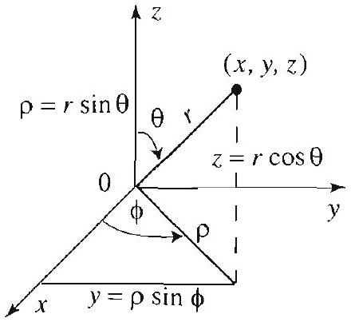

## Topics to Review

As in the previous chapter, the separation of variables method is crucial. The other essential tools are developed as needed. Section 13.1 is self-contained. Section 13.2 refers to Sections 5.1, 5.5 and 5.6. Sections 13.3 and 13.4 refer to Sections 13.1 and 13.5-5.7. Also, in Section 13.4, Bessel functions will reappear, and the material from Section 4.8 will be used again. Prior knowledge of the eigenfunction expansions method (Sections 3.9 and 4.6) is helpful but not required for Section 13.4. The supplementary material (Sections 13.5-13.7) is selfcontained and can be covered before starting the chapter. For Section 13.5 you need to review the power series method of Appendix A.4.

## Looking Ahead...

Legendre polynomials and the associated Legendre functions and their expansion theories arise frequently in physics, engineering, applied mathematics, and numerical analysis. Spherical harmonics, developed and used in Section 13.3, are also very useful in these areas. Their construction requires both Fourier series and the associated Legendre functions. As you will see in this chapter, spherical harmonics are the natural analogs of Fourier series for functions defined on the sphere. All the new functions that you will encounter in this chapter are available in most computer systems. To get acquainted with their many new features, it is strongly recommended that you experiment with them graphically and numerically with a computer.

## 13

# PARTIAL DIFFERENTIAL EQUATIONS IN SPHERICAL COORDINATES 

#### Abstract

Don't just read it; fight it! Ask your own questions, look for your own examples, discover your own proofs.

-PAUL HALMOS

In this chapter we turn our attention to problems in spheres and other regions, such as the region between two spheres or the region outside a sphere, for which it is natural to use spherical coordinates. For example, to find the steady-state temperature in a metallic ball whose surface is kept at a given temperature distribution, we need to solve Laplace's equation inside the ball that takes the given boundary values on its surface. These and related problems can be treated by the same techniques as in the previous two chapters; in particular, the method of separation of variables and the method of eigenfunction expansions can be applied.

You may recall from the previous chapters how Fourier series and Bessel series arose from applying the separation of variables method to equations involving the Laplacian in polar coordinates. Here, with equations involving the Laplacian in spherical coordinates, we will encounter other special functions when carrying the method of separation of variables to completion. A comprehensive treatment of this requisite material is presented in the last three sections of the chapter. It covers in detail Legendre polynomials and associated Legendre functions, and their corresponding expansion theories. You do not need to cover this material before starting the chapter; we will refer to it as needed.

### 13.1 Preview of Problems and Methods

Figure 1 Spherical coordinates.

Here the polar angle in the $x y$ plane is denoted by $\phi$, while in the two-dimensional case (Chapter 4) we used $\theta$.

In this chapter we will solve boundary value problems that involve the Laplacian in spherical coordinates. In this first section we will survey the methods and additional tools that are required for the solutions. As you would expect by now, the method will involve solving certain ordinary differential equations, forming generalized Fourier series, and expressing the boundary or initial data in terms of these series. For example, the solutions of problems in Cartesian coordinates (Chapter 3) involved, among other things, Fourier sine series. In Chapter 4, where we considered problems in polar coordinates, we were led to Bessel series expansions. In this section you will encounter new types of expansions (Legendre series, spherical harmonics expansions, and others) that arise naturally when solving problems in spherical coordinates.

## Consider Laplace's equation in spherical coordinates

$$
\nabla^{2} u=\frac{\partial^{2} u}{\partial r^{2}}+\frac{2}{r} \frac{\partial u}{\partial r}+\frac{1}{r^{2}}\left(\frac{\partial^{2} u}{\partial \theta^{2}}+\cot \theta \frac{\partial u}{\partial \theta}+\csc ^{2} \theta \frac{\partial^{2} u}{\partial \phi^{2}}\right)=0
$$

where $0<r<a, 0<\phi<2 \pi$, and $0<\theta<\pi$ (see Section 4.1). The solution of this equation is quite involved. To clarify the presentation, we will treat simultaneously the simpler case when $u$ is symmetric with respect to the $z$-axis or axisymmetric. In this case, $u$ is independent of the azimuthal angle $\phi$, the derivatives with respect to $\phi$ are all 0 , and (1) reduces to

## RADIALLY

SYMMETRIC LAPLACE'S

$$
\nabla^{2} u=\frac{\partial^{2} u}{\partial r^{2}}+\frac{2}{r} \frac{\partial u}{\partial r}+\frac{1}{r^{2}}\left(\frac{\partial^{2} u}{\partial \theta^{2}}+\cot \theta \frac{\partial u}{\partial \theta}\right)=0,
$$

## EQUATION

where $0<r<a$ and $0<\theta<\pi$.

## Separating Variables in Laplace's Equation

Let

$$
u(r, \theta, \phi)=R(r) \Theta(\theta) \Phi(\phi) .
$$

Differentiate, plug into (1), divide by $R \Theta \Phi$, and separate variables to arrive at the Euler equation:

$$
r^{2} R^{\prime \prime}+2 r R^{\prime}-\mu R=0, \quad 0<r<a
$$

We are using the complex form of the solution to keep the notation compact. You could use $\cos m \phi$ and $\sin m \phi$ instead. Recall that $e^{i m \phi}=\cos m \phi+i \sin m \phi$.
and

$$
\frac{\Theta^{\prime \prime}}{\Theta}+\cot \theta \frac{\Theta^{\prime}}{\Theta}+\csc ^{2} \theta \frac{\Phi^{\prime \prime}}{\Phi}=-\mu,
$$

where $\mu$ is a separation constant. The details of the separation of variables are left to Exercise 1. Recall that when we separated variables in Laplace's equation in polar coordinates (Section 4.4), we also obtained an Euler equation in $R$. Separating variables in (4), we arrive at the equations

$$
\Phi^{\prime \prime}+m^{2} \Phi=0, \quad m=0,1,2, \ldots
$$

and

$$
\Theta^{\prime \prime}+\cot \theta \Theta^{\prime}+\left(\mu-m^{2} \csc ^{2} \theta\right) \Theta=0 .
$$

Expecting $2 \pi$-periodic solutions in $\Phi$, since $\phi$ is a polar angle, we have already determined that the separation constant should be $m^{2}$ in (5). We have now separated the variables in (1) and arrived at the three equations (3), (5), and (6). Of these three equations only (6) is new. As we will see shortly, it is related to a family of differential equations known as the associated Legendre differential equations.

In the symmetric case, with no dependence on $\phi$, starting with (2), we arrive in a similar way at (3) and the following equation in $\Theta$ :

$$
\Theta^{\prime \prime}+\cot \theta \Theta^{\prime}+\mu \Theta=0
$$

Note that (7) is a special case of (6) with $m=0$. We will see shortly that it is related to the so-called Legendre's differential equation.

## Product Solutions of Laplace's Equation

We now describe the solutions of (3), (5), and (6) and derive the product solutions of (1). Equation (5) is readily solved and yields

$$
\Phi(\phi)=e^{i m \phi}, \quad m=0, \pm 1, \pm 2, \ldots
$$

To solve (6), we make the change of variables

$$
s=\cos \theta ; \quad \frac{d s}{d \theta}=-\sin \theta
$$

Hence, by the chain rule,

$$
\begin{aligned}
\Theta^{\prime} & =\frac{d \Theta}{d \theta}=\frac{d \Theta}{d s} \frac{d s}{d \theta}=-\frac{d \Theta}{d s} \sin \theta ; \\
\frac{d^{2} \Theta}{d \theta^{2}} & =-\frac{d}{d \theta}\left(\frac{d \Theta}{d s} \sin \theta\right)=-\frac{d^{2} \Theta}{d s^{2}} \frac{d s}{d \theta} \sin \theta-\cos \theta \frac{d \Theta}{d s} \\
& =\sin ^{2} \theta \frac{d^{2} \Theta}{d s^{2}}-\cos \theta \frac{d \Theta}{d s}=\left(1-s^{2}\right) \frac{d^{2} \Theta}{d s^{2}}-s \frac{d \Theta}{d s} .
\end{aligned}
$$

Plugging into (6) and simplifying, we arrive at

$$
\left(1-s^{2}\right) \frac{d^{2} \Theta}{d s^{2}}-2 s \frac{d \Theta}{d s}+\left(\mu-\frac{m^{2}}{1-s^{2}}\right) \Theta=0, \quad-1<s<1
$$

This second order, linear, ordinary differential equation is known as the associated Legendre differential equation (Section 13.7). The difficulty in solving this equation is due to the fact that the coefficients are nontrivial functions of $s$. In the symmetric case, back to equation (7), if we make the substitution $s=\cos \theta$ and simplify, we arrive at the equation

$$
\left(1-s^{2}\right) \frac{d^{2} \Theta}{d s^{2}}-2 s \frac{d \Theta}{d s}+\mu \Theta=0, \quad-1<s<1
$$

This is Legendre's differential equation (Section 13.5). It is a special case of (12) with $m=0$. Legendre's differential equation is treated in detail in Sections 13.5 and 13.6. It is a fact that (12) and (13) have bounded solutions in the interval $[-1,1]$ if and only if the separation constant has the special form

$$
\mu=n(n+1), \quad n=0,1,2, \ldots .
$$

Since for practical reasons we are only interested in bounded solutions, henceforth we take $\mu$ as in (14). The corresponding bounded solutions of (12),

The functions $e^{\text {rmb }} P_{n}^{m}(\cos \theta)$ are very important in applications. When properly normalized, they are denoted by $Y_{n, m}(\theta, \phi)$ and called the spherical harmonics (see (4), Section 13.3).
when properly normalized, are denoted by $P_{n}^{m}(s)$ and are called the associated Legendre functions. Substituting back $s=\cos \theta$, we see that the bounded solutions of (6) are

$$
P_{n}^{m}(\cos \theta) .
$$

In the symmetric case, when $m=0, P_{n}^{0}$ reduces to the Legendre polynomial of degree $n$, which is denoted by $P_{n}$. This yields

$$
P_{n}(\cos \theta)
$$

as solutions of (7). Now that we know the solutions in $\Theta$ and $\Phi$, let us solve for $R$. Substituting $\mu=n(n+1)$ in (3), we obtain the Euler equation

$$
r^{2} R^{\prime \prime}+2 r R^{\prime}-n(n+1) R=0, \quad 0<r<a
$$

To solve this equation, we appeal to results from Appendix A.3. The indicial equation is

$$
\nu^{2}+\nu-n(n+1)=0
$$

with indicial roots $\nu=n$ and $\nu=-(n+1)$. Since the indicial roots are distinct, we are in Case I of Euler's equation, and hence the solutions are

$$
R_{n}(r)=r^{n} \quad \text { and } \quad R_{n}^{*}(r)=r^{-(n+1)}, \quad n=0,1,2 \ldots
$$

For problems inside the ball with $0<r<a$, we choose the bounded solutions in (16), $R_{n}(r)=r^{n}$, and discard the others. For problems outside the ball, with $r>a$, we take $R_{n}^{*}(r)=r^{-(n+1)}$ in (16) and discard $R_{n}(r)=r^{n}$, which is unbounded as $r \rightarrow \infty$.

Summing up, we have found the following product solutions of (1):

$$
u(r, \theta, \phi)=r^{n} e^{i m \phi} P_{n}^{m}(\cos \theta)
$$

where $P_{n}^{m}$ are the associated Legendre functions. We have also found the following product solutions of (2):

$$
u(r, \theta)=r^{n} P_{n}(\cos \theta)
$$

where $P_{n}$ is the $n$th Legendre polynomial, $n=0,1, \ldots$.

Solutions of boundary value problems involving Laplace's equation will be expressed as infinite series in terms of the product solutions (17) (superposition principle). In determining the coefficients in these series, we will use the boundary conditions and appeal to various properties of the associated Legendre functions (and Legendre polynomials). More specifically, we will require expansion theorems for associated Legendre functions (and Legendre polynomials) that are similar to Bessel series representations and Fourier series. This requisite material is developed in detail in Sections 13.5-13.7. We will refer to it as needed.

## Exercises 5.1

1. Carry out the details of the separation of variables method to derive (3), (5), and (6) from (1).
2. Carry out the details of the separation of variables method to derive (3) and (7) from (2).
3. Refer to Section 13.5, where you will find a list of Legendre polynomials. Use this list to compute explicitly $P_{n}(\cos \theta)$ for $n=0,1,2$. Verify that these functions are solutions of (7) for the corresponding value of $\mu$.
4. Refer to Section 13.7, where you will find a list of associated Legendre functions. Use this list to compute explicitly $P_{1}^{m}(\cos \theta)$ for $m=-1,0,1$. Verify that these functions are solutions of (6) for the corresponding values of $\mu$ and $m$.
5. Write down (18) explicitly when $n=1$, and verify that it is a solution of (2).
6. Write down (17) explicitly when $m=n=1$, and verify that it is a solution of (1).
