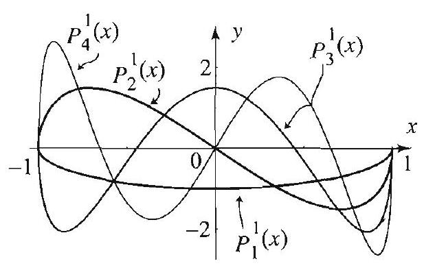

### 13.7 Associated Legendre Functions and Series Expansions

Like Legendre polynomials, the associated Legendre functions arise from the solutions of important problems involving Laplace's equation in spherical coordinates. You should keep in mind the major concepts that you encountered with the Legendre polynomials to guide you through the topics of this section.

## Rodrigues' Formula

For each $m=0,1,2, \ldots$, we define a family of functions, called the associated Legendre functions of order $m$, by the formula

$$
P_{n}^{m}(x)=(-1)^{m}\left(1-x^{2}\right)^{m / 2} \frac{d^{m} P_{n}(x)}{d x^{m}}
$$

where $P_{n}(x)$ is the Legendre polynomial of degree $n$ (see Section 13.5). Following the usual convention that the derivative of order 0 of a function is the function itself, we see that

$$
P_{n}^{0}(x)=P_{n}(x)
$$

Thus the associated Legendre functions are generalizations of the Legendre polynomials. For this reason, whatever property we derive concerning the associated Legendre functions, it should reduce to a property of the Legendre polynomials when you take $m=0$.

Since $P_{n}(x)$ is a polynomial of degree $n$, we see from (1) that, in order to get nonzero functions, we must take $0 \leq m \leq n$. For the applications, we extend the definition of the associated Legendre functions to negative $m$ 's by setting

$$
P_{n}^{m}(x)=(-1)^{m} \frac{(n+m)!}{(n-m)!} P_{n}^{-m}(x) .
$$

Note that for negative $m$ 's, $P_{n}^{m}(x)$ is simply a scalar multiple of $P_{n}^{-m}(x)$. So, for each $n=0,1,2, \ldots$, we have $2 n+1$ associated Legendre functions $P_{n}^{m}(x)$, where $m$ runs from $-n$ to $n$.

## EXAMPLE 1 Associated Legendre functions

Using (1) and (2) with $m=-2,-1,0,1,2$, respectively, we get
(a) $P_{0}^{0}(x)=1=P_{0}(x)$,
$P_{1}^{0}(x)=x=P_{1}(x)$,
$P_{2}^{0}(x)=\frac{3 x^{2}-1}{2}=P_{2}(x)$,
$P_{3}^{0}(x)=\frac{5 x^{3}-3 x}{2}=P_{3}(x)$.
(b) $P_{1}^{1}(x)=-\sqrt{1-x^{2}}$,
$P_{2}^{1}(x)=-3 x \sqrt{1-x^{2}}$,
$P_{3}^{1}(x)=-\frac{3\left(5 x^{2}-1\right)}{2} \sqrt{1-x^{2}}$,
$P_{4}^{1}(x)=-\frac{5\left(7 x^{3}-3 x\right)}{2} \sqrt{1-x^{2}}$.
(c) $P_{2}^{2}(x)=3\left(1-x^{2}\right)$,
$P_{3}^{2}(x)=15 x\left(1-x^{2}\right)$,
$P_{4}^{2}(x)=\frac{15\left(7 x^{2}-1\right)}{2}\left(1-x^{2}\right)$,
$P_{5}^{2}(x)=\frac{105\left(3 x^{3}-x\right)}{2}\left(1-x^{2}\right)$.
(d) $P_{1}^{-1}(x)=\frac{1}{2} \sqrt{1-x^{2}}$,
$P_{2}^{-1}(x)=\frac{1}{2} x \sqrt{1-x^{2}}$,
$P_{3}^{-1}(x)=\frac{\left(5 x^{2}-1\right)}{8} \sqrt{1-x^{2}}$,
$P_{4}^{-1}(x)=\frac{\left(7 x^{3}-3 x\right)}{8} \sqrt{1-x^{2}}$.
(e) $P_{2}^{-2}(x)=\frac{1}{8}\left(1-x^{2}\right)$,
$P_{3}^{-2}(x)=\frac{1}{8} x\left(1-x^{2}\right)$,
$P_{4}^{-2}(x)=\frac{\left(7 x^{2}-1\right)}{48}\left(1-x^{2}\right)$,
$P_{5}^{-2}(x)=\frac{\left(3 x^{3}-x\right)}{16}\left(1-x^{2}\right)$.

Figure 1 Associated Legendre functions.

It is clear from (1) that if $m$ is odd and nonzero, $P_{n}^{m}$ is not a polynomial, because of the factor $\left(1-x^{2}\right)^{m / 2}$. Also, as illustrated by Figure 1, $P_{n}^{m}$ is even if $n+m$ is even and it is odd if $n+m$ is odd.

## The Associated Legendre Differential Equation

We know from Section 13.5 that the Legendre polynomials satisfy the (Legendre) differential equation $\left(1-x^{2}\right) y^{\prime \prime}-2 x y^{\prime}+n(n+1) y=0$. We now establish a similar result for the associated Legendre functions.

For $n=0,1,2, \ldots$ and $m=0, \pm 1, \pm 2, \ldots, \pm n$, the associated Legendre differential equation is given by

$$
\left(1-x^{2}\right) y^{\prime \prime}-2 x y^{\prime}+\left(n(n+1)-\frac{m^{2}}{1-x^{2}}\right) y=0, \quad-1<x<1
$$

When $m=0$, the equation reduces to Legendre's differential ((1), Section 13.5), and so it is satisfied by the Legendre polynomials $P_{n}=P_{n}^{0}$. Thus in showing that the associated Legendre functions are solutions of (3), it suffices to consider the case $m \neq 0$. Moreover, since for negative $m, P_{n}^{m}$ is proportional to $P_{n}^{-m}$ (see (2)), it suffices to consider $m>0$. Let us start with Legendre's equation, which is satisfied by the $n$th Legendre polynomial $P_{n}$. Using the Leibniz rule to differentiate this equation $m$ times with respect to $x$ and then plugging $P_{n}$ for $y$, we arrive at

$$
\left(1-x^{2}\right) P_{n}^{(m+2)}-2(m+1) x P_{n}^{(m+1)}+(n-m)(n+m+1) P_{n}^{(m)}=0
$$

(Exercise 14). Thus the function $P_{n}^{(m)}$ satisfies the differential equation

$$
\left(1-x^{2}\right) y^{\prime \prime}-2(m+1) x y^{\prime}+(n-m)(n+m+1) y=0
$$

Now you can verify that this equation reduces to (3) if we use the substitution

$$
y=\left(1-x^{2}\right)^{-m / 2} v
$$

(Exercise 14). Hence a solution of (3) is $\left(1-x^{2}\right)^{m / 2} \frac{d^{m} P_{n}(x)}{d x^{m}}$, and since (3) is homogeneous, it follows that $P_{n}^{m}$ is also a solution.

## Orthogonality and Series Expansions

Like Legendre polynomials, the associated Legendre functions enjoy orthogonality relations on the interval $[-1,1]$. The proofs are very much like the ones for Legendre polynomials. They will be outlined in the exercises.

## THEOREM 1 ORTHOGONALITY OF ASSOCIATED LEGENDRE FUNCTIONS

Let $k \leq n$ be nonnegative integers and let $m$ be an integer such $|m| \leq k$. Then

$$
\int_{-1}^{1} P_{k}^{m}(x) P_{n}^{m}(x) d x=0, \quad k \neq n
$$

and

$$
\int_{-1}^{1}\left[P_{n}^{m}(x)\right]^{2} d x=\frac{2}{2 n+1} \frac{(n+m)!}{(n-m)!}, \quad|m| \leq n
$$

## THEOREM 2 ASSOCIATED LEGENDRE SERIES EXPANSIONS

Figure 2 Partial sum of the associated Legendre series $\sum_{n=2}^{\infty} A_{n} P_{n}^{2}(x)$.

We next state a very useful series expansion theorem for associated Legendre functions. You should check that it reduces to Theorem 2, Section 13.6, when $m=0$.

Fix a nonnegative integer $m$. Suppose that $f(x)$ is piecewise smooth on $[-1,1]$. Then we have the associated Legendre series expansion of order $m$

$$
f(x)=\sum_{n=m}^{\infty} A_{n} P_{n}^{m}(x)
$$

where the associated Legendre coefficient $A_{n}$ is given by
(9) $A_{n}=\frac{2 n+1}{2} \frac{(n-m)!}{(n+m)!} \int_{-1}^{1} f(x) P_{n}^{m}(x) d x, \quad n=m, m+1, m+2, \ldots$.

For $x$ in the open interval $(-1,1)$, the series converges to $f(x)$ if $f$ is continuous at $x$, and to $(f(x+)+f(x-)) / 2$ otherwise.

The proof of Theorem 2 is beyond the level of this text and will be omitted. You can test the validity of the result by considering concrete applications. In the following example, we have computed the associated Legendre series expansion of a simple function, when $m=2$. We have used a computer to carry out the computation of the associated Legendre coefficients and plot some partial sums of the associated Legendre series. As you can imagine, the explicit expressions of these series are very complicated.

EXAMPLE 2 An associated Legendre series expansion of order $m=2$
Consider the function

$$
f(x)= \begin{cases}0 & \text { if }-1<x<0 \\ 1 & \text { if } 0<x<1\end{cases}
$$

We will illustrate its associated Legendre series expansion of order $m=2$. For this purpose, we will compute the coefficients $A_{n}$ for $n=2,3,4, \ldots, 10$ (note that $n \geq m$ ). Then using these coefficients, we will form and plot a partial sum of the associated Legendre series with $n$ up to 10 . With the help of a computer, the coefficients are found to be as shown in Table 1.

| $n$ | 2 | 3 | 4 | 5 | 6 | 7 | 8 | 9 | 10 |
| :--- | :---: | :---: | :---: | :---: | :---: | :---: | :---: | :---: | :---: |
| $A_{n}$ | $\frac{5}{24}$ | $\frac{7}{64}$ | $\frac{1}{40}$ | 0 | $\frac{13}{1680}$ | $\frac{65}{6144}$ | $\frac{17}{5040}$ | $-\frac{19}{30720}$ | $\frac{7}{3960}$ |

Table 1 Associated Legendre coefficients

The graphs of $f$ and a partial sum of the associated Legendre series (with $n$ up to 10) are shown in Figure 2. Note that the associated Legendre coefficients tend to
zero as $n$ increases. Also note the overshoot of the partial sum of the associated Legendre series near the points of discontinuity. As you would expect, both of these facts are true for general associated Legendre series.

## Exercises 5.7

In Exercises 1-4, use (1) and (2) to derive $P_{n}^{m}$ for the given $m$ and $n$.

1. $m= \pm 1, n=2$.
2. $m=1, n=1,2,3$.
3. $m=3, n=4$.
4. $m=-3, n=4$.

In Exercises 5-8, (a) determine $m$ and $n$ for the given associated Legendre differential equation. (b) Use the list of Legendre functions in Example 1 to find one solution. (c) Verify your answer in (b) by plugging back into the differential equation.
5. $\left(1-x^{2}\right) y^{\prime \prime}-2 x y^{\prime}+\left(2-\frac{1}{1-x^{2}}\right) y=0$.
6. $\left(1-x^{2}\right) y^{\prime \prime}-2 x y^{\prime}+\left(6-\frac{4}{1-x^{2}}\right) y=0$.
7. $\left(1-x^{2}\right) y^{\prime \prime}-2 x y^{\prime}+\left(6-\frac{1}{1-x^{2}}\right) y=0$.
8. $\left(1-x^{2}\right) y^{\prime \prime}-2 x y^{\prime}+\left(12-\frac{4}{1-x^{2}}\right) y=0$.
9. Verify (6) and (7) with $m=1$, and $n=1,2$.

In Exercises 10-15, you are given an order $m$ and a function $f(x)$ defined on the interval $[-1,1]$. (a) Use a computer system with built-in associated Legendre functions to compute the associated Legendre coefficients of $f(x)$ of order $m$. Take $n=m, m+1, \ldots, m+10$. (b) Use the coefficients in (a) to construct several partial sums of the associated Legendre series expansion of order $m$. Plot these partial sums along with the given function to illustrate Theorem 2.
10. $m=1, f(x)=\sin \pi x$.
11. $m=1, f(x)=(x-1)(x+1)$.
12. $m=2, f(x)=x$.
13. $m=2, f(x)=|x|$.
14. (a) Prove (4) using the Leibnitz rule for differentiation.
(b) With the help of a computer system, verify that the substitution $y=(1- \left.x^{2}\right)^{-m / 2} v$ transforms (5) into (3).
15. Prove (6) by following the steps of the proof of Theorem 1, (i), Section 13.6. [Hint: Show that (3) can be put in the form

$$
\left.\left(\left(1-x^{2}\right) y^{\prime}\right)^{\prime}+\left(n(n+1)-\frac{m^{2}}{1-x^{2}}\right) y=0 .\right]
$$

16. Project Problem: Proof of (7).
(a) Use (1) to show that

$$
P_{n}^{m+1}=-\left(1-x^{2}\right)^{1 / 2} \frac{d P_{n}^{m}}{d x}-m\left(1-x^{2}\right)^{-1 / 2} x P_{n}^{m}
$$

(b) Square both sides of (a) and integrate to get

$$
\begin{aligned}
\int_{-1}^{1}\left[P_{n}^{m+1}(x)\right]^{2} d x= & \int_{-1}^{1}\left(1-x^{2}\right)\left[\frac{d P_{n}^{m}}{d x}\right]^{2} d x+2 m \int_{-1}^{1} x P_{n}^{m}(x) \frac{d P_{n}^{m}}{d x} d x \\
& +\int_{-1}^{1} \frac{m^{2} x^{2}}{1-x^{2}}\left[P_{n}^{m}(x)\right]^{2} d x
\end{aligned}
$$

(c) Show that $\left[m x\left[P_{n}^{m}(x)\right]^{2}\right]_{-1}^{1}=0$.
(d) Use integration by parts to show that the right side of the equation in (b) is equal to

$$
\begin{array}{r}
-\int_{-1}^{1} P_{n}^{m}(x) \frac{d}{d x}\left[\left(1-x^{2}\right) \frac{d P_{n}^{m}}{d x}\right] d x-m \int_{-1}^{1}\left[P_{n}^{m}(x)\right]^{2} d x \\
+\int_{-1}^{1} \frac{m^{2} x^{2}}{1-x^{2}}\left[P_{n}^{m}(x)\right]^{2} d x
\end{array}
$$

(e) Explain why

$$
\frac{d}{d x}\left[\left(1-x^{2}\right) \frac{d P_{n}^{m}}{d x}\right]=-\left[n(n+1)-\frac{m^{2}}{1-x^{2}}\right] P_{n}^{m}(x)
$$

[Hint: See the hint for Exercise 15.]
(f) Combine (d)-(e) to get

$$
\int_{-1}^{1}\left[P_{n}^{m+1}(x)\right]^{2} d x=(n-m)(n+m+1) \int_{-1}^{1}\left[P_{n}^{m}(x)\right]^{2} d x
$$

(g) Use (f) to get

$$
\begin{aligned}
& \int_{-1}^{1}\left[P_{n}^{m}(x)\right]^{2} d x \\
& \quad=(n-m+1)(n-m+2) \ldots n(n+m)(n+m-1) \ldots(n+1) \int_{-1}^{1}\left[P_{n}(x)\right]^{2} d x
\end{aligned}
$$

(h) Use (g) and Theorem 1 (ii), Section 13.6, to get (7).
