<!-- Page 1 -->

Left margin note (page 1)

Topics to Review
As in the previous chapter, the separation of variables method is crucial. The other essential tools are developed as needed. Section 5.1 is self-contained. Section 5.2 refers to Sections 5.1, 5.5 and 5.6. Sections 5.3 and 5.4 refer to Sections 5.1 and 5.5-5.7. Also, in Section 5.4, Bessel functions will reappear, and the material from Section 4.8 will be used again. Prior knowledge of the eigenfunction expansions method (Sections 3.9 and 4.6) is helpful but not required for Section 5.4. The supplementary material (Sections 5.5-5.7) is selfcontained and can be covered before starting the chapter. For Section 5.5 you need to review the power series method of Appendix A.4.

Looking Ahead...
Legendre polynomials and the associated Legendre functions and their expansion theories arise frequently in physics, engineering, applied mathematics, and numerical analysis. Spherical harmonics, developed and used in Section 5.3, are also very useful in these areas. Their construction requires both Fourier series and the associated Legendre functions. As you will see in this chapter, spherical harmonics are the natural analogs of Fourier series for functions defined on the sphere. All the new functions that you will encounter in this chapter are available in most computer systems. To get acquainted with their many new features, it is strongly recommended that you experiment with them graphically and numerically with a computer.

Right margin note (page 1)

L

own

MOS
other tside For vhose solve alues same thod sions
and thod with ll enation equier. It funced to it as

++++

5

PARTIAL DIFFERENTIA EQUATIONS IN SPHERICAL COORDINATES

Don't just read it; fight it! Ask your own questions, look for your examples, discover your own proofs.
-PAUL HAL

In this chapter we turn our attention to problems in spheres and regions, such as the region between two spheres or the region ou a sphere, for which it is natural to use spherical coordinates. example, to find the steady-state temperature in a metallic ball surface is kept at a given temperature distribution, we need to Laplace's equation inside the ball that takes the given boundary v on its surface. These and related problems can be treated by the techniques as in the previous two chapters; in particular, the me of separation of variables and the method of eigenfunction expan can be applied.

You may recall from the previous chapters how Fourier serie Bessel series arose from applying the separation of variables me to equations involving the Laplacian in polar coordinates. Here, equations involving the Laplacian in spherical coordinates, we wi counter other special functions when carrying the method of separ of variables to completion. A comprehensive treatment of this $r$ site material is presented in the last three sections of the chapt covers in detail Legendre polynomials and associated Legendre tions, and their corresponding expansion theories. You do not ne cover this material before starting the chapter; we will refer to needed.

---

<!-- Page 2 -->

Left margin note (page 2)

270
Chapter 5
Pa
5.1 Preview

Figure 1 Sphericz nates.

Here the polar angle plane is denoted by in the two-dimensi (Chapter 4) we used

RAL
SYMM
LAPI
EQU

Right margin note (page 2)

Laplathods ld exential ndary probhings, polar ou will ics exnerical
lution treat to the angle
arrive

++++

rtial Differential Equations in Spherical Coordinates
of Problems and Methods
In this chapter we will solve boundary value problems that involve the cian in spherical coordinates. In this first section we will survey the me and additional tools that are required for the solutions. As you wou pect by now, the method will involve solving certain ordinary differ
$r \cos \theta$
y
coordi-
in the $x y$ -
$\phi$, while
onal case
$\theta$.

IALLY
ETRIC
ACE'S
ATION equations, forming generalized Fourier series, and expressing the bou or initial data in terms of these series. For example, the solutions of lems in Cartesian coordinates (Chapter 3) involved, among other t Fourier sine series. In Chapter 4, where we considered problems in coordinates, we were led to Bessel series expansions. In this section yc encounter new types of expansions (Legendre series, spherical harmon pansions, and others) that arise naturally when solving problems in spl coordinates.

Consider Laplace's equation in spherical coordinates
$$
\nabla^{2} u=\frac{\partial^{2} u}{\partial r^{2}}+\frac{2}{r} \frac{\partial u}{\partial r}+\frac{1}{r^{2}}\left(\frac{\partial^{2} u}{\partial \theta^{2}}+\cot \theta \frac{\partial u}{\partial \theta}+\csc ^{2} \theta \frac{\partial^{2} u}{\partial \phi^{2}}\right)=0,
$$
where $0<r<a, 0<\phi<2 \pi$, and $0<\theta<\pi$ (see Section 4.1). The so of this equation is quite involved. To clarify the presentation, we wil simultaneously the simpler case when $u$ is symmetric with respect $z$-axis or axisymmetric. In this case, $u$ is independent of the azimuthal $\phi$, the derivatives with respect to $\phi$ are all 0 , and (1) reduces to
$$
\nabla^{2} u=\frac{\partial^{2} u}{\partial r^{2}}+\frac{2}{r} \frac{\partial u}{\partial r}+\frac{1}{r^{2}}\left(\frac{\partial^{2} u}{\partial \theta^{2}}+\cot \theta \frac{\partial u}{\partial \theta}\right)=0,
$$
where $0<r<a$ and $0<\theta<\pi$.
Separating Variables in Laplace's Equation
Let
$$
u(r, \theta, \phi)=R(r) \Theta(\theta) \Phi(\phi) .
$$

Differentiate, plug into (1), divide by $R \Theta \Phi$, and separate variables to at the Euler equation:
$$
r^{2} R^{\prime \prime}+2 r R^{\prime}-\mu R=0, \quad 0<r<a,
$$

---

<!-- Page 3 -->

Left margin note (page 3)

We are using the complex form of the solution to keep the notation compact. You could use $\cos m \phi$ and $\sin m \phi$ instead. Recall that
$$
e^{i m \phi}=\cos m \phi+i \sin m \phi .
$$

Right margin note (page 3)

271

ables ace's equa-
ceady now (5), ortly, iated ), we nat it oduct

++++

Section 5.1 Preview of Problems and Methods

and
$$
\frac{\Theta^{\prime \prime}}{\Theta}+\cot \theta \frac{\Theta^{\prime}}{\Theta}+\csc ^{2} \theta \frac{\Phi^{\prime \prime}}{\Phi}=-\mu,
$$
where $\mu$ is a separation constant. The details of the separation of vari are left to Exercise 1. Recall that when we separated variables in Lap equation in polar coordinates (Section 4.4), we also obtained an Euler tion in $R$. Separating variables in (4), we arrive at the equations
$$
\Phi^{\prime \prime}+m^{2} \Phi=0, \quad m=0,1,2, \ldots
$$
and
$$
\Theta^{\prime \prime}+\cot \theta \Theta^{\prime}+\left(\mu-m^{2} \csc ^{2} \theta\right) \Theta=0
$$

Expecting $2 \pi$-periodic solutions in $\Phi$, since $\phi$ is a polar angle, we have al determined that the separation constant should be $m^{2}$ in (5). We have separated the variables in (1) and arrived at the three equations (3) and (6). Of these three equations only (6) is new. As we will see sh it is related to a family of differential equations known as the assoc Legendre differential equations.

In the symmetric case, with no dependence on $\phi$, starting with (2 arrive in a similar way at (3) and the following equation in $\Theta$ :
$$
\Theta^{\prime \prime}+\cot \theta \Theta^{\prime}+\mu \Theta=0
$$

Note that (7) is a special case of (6) with $m=0$. We will see shortly th is related to the so-called Legendre's differential equation.

Product Solutions of Laplace's Equation
We now describe the solutions of (3), (5), and (6) and derive the pro solutions of (1). Equation (5) is readily solved and yields
$$
\Phi(\phi)=e^{i m \phi}, \quad m=0, \pm 1, \pm 2, \ldots .
$$

---

<!-- Page 4 -->

Left margin note (page 4)

272
Chapter 5 Partial Differe

Right margin note (page 4)

as the ficulty trivial ke the
al case tail in utions pecial

hence-
(12),

++++

ntial Equations in Spherical Coordinates

To solve (6), we make the change of variables
$$
s=\cos \theta ; \quad \frac{d s}{d \theta}=-\sin \theta
$$

Hence, by the chain rule,
$$
\begin{aligned}
\Theta^{\prime} & =\frac{d \Theta}{d \theta}=\frac{d \Theta}{d s} \frac{d s}{d \theta}=-\frac{d \Theta}{d s} \sin \theta ; \\
\frac{d^{2} \Theta}{d \theta^{2}} & =-\frac{d}{d \theta}\left(\frac{d \Theta}{d s} \sin \theta\right)=-\frac{d^{2} \Theta}{d s^{2}} \frac{d s}{d \theta} \sin \theta-\cos \theta \frac{d \Theta}{d s} \\
& =\sin ^{2} \theta \frac{d^{2} \Theta}{d s^{2}}-\cos \theta \frac{d \Theta}{d s}=\left(1-s^{2}\right) \frac{d^{2} \Theta}{d s^{2}}-s \frac{d \Theta}{d s} .
\end{aligned}
$$

Plugging into (6) and simplifying, we arrive at
$$
\left(1-s^{2}\right) \frac{d^{2} \Theta}{d s^{2}}-2 s \frac{d \Theta}{d s}+\left(\mu-\frac{m^{2}}{1-s^{2}}\right) \Theta=0, \quad-1<s<1
$$

This second order, linear, ordinary differential equation is known associated Legendre differential equation (Section 5.7). The dif in solving this equation is due to the fact that the coefficients are non functions of $s$. In the symmetric case, back to equation (7), if we ma substitution $s=\cos \theta$ and simplify, we arrive at the equation
$$
\left(1-s^{2}\right) \frac{d^{2} \Theta}{d s^{2}}-2 s \frac{d \Theta}{d s}+\mu \Theta=0, \quad-1<s<1
$$

This is Legendre's differential equation (Section 5.5). It is a speci of (12) with $m=0$. Legendre's differential equation is treated in de Sections 5.5 and 5.6. It is a fact that (12) and (13) have bounded sol in the interval $[-1,1]$ if and only if the separation constant has the $s$ form
$$
\mu=n(n+1), \quad n=0,1,2, \ldots .
$$

Since for practical reasons we are only interested in bounded solutions, forth we take $\mu$ as in (14). The corresponding bounded solutions o

---

<!-- Page 5 -->

Left margin note (page 5)

The functions $e^{\imath m \phi} P_{n}^{m}(\cos \theta)$ are very important in applications. When properly normalized, they are denoted by $Y_{n, m}(\theta, \phi)$ and called the spherical harmonics (see (4), Section 5.3).

Right margin note (page 5)

273
sSO-
$t$ the
yno-
solve
dicial
are
are
tions
ball,
phich
the

++++

Section 5.1 Preview of Problems and Methods

when properly normalized, are denoted by $P_{n}^{m}(s)$ and are called the $\boldsymbol{a}$ ciated Legendre functions. Substituting back $s=\cos \theta$, we see tha bounded solutions of (6) are
$$
P_{n}^{m}(\cos \theta) .
$$

In the symmetric case, when $m=0, P_{n}^{0}$ reduces to the Legendre pol, mial of degree $\boldsymbol{n}$, which is denoted by $P_{n}$. This yields
$$
P_{n}(\cos \theta)
$$
as solutions of (7). Now that we know the solutions in $\Theta$ and $\Phi$, let us for $R$. Substituting $\mu=n(n+1)$ in (3), we obtain the Euler equation
$$
r^{2} R^{\prime \prime}+2 r R^{\prime}-n(n+1) R=0, \quad 0<r<a .
$$

To solve this equation, we appeal to results from Appendix A.3. The inc equation is
$$
\nu^{2}+\nu-n(n+1)=0,
$$
with indicial roots $\nu=n$ and $\nu=-(n+1)$. Since the indicial root distinct, we are in Case I of Euler's equation, and hence the solutions
$$
R_{n}(r)=r^{n} \quad \text { and } \quad R_{n}^{*}(r)=r^{-(n+1)}, \quad n=0,1,2 \ldots
$$

For problems inside the ball with $0<r<a$, we choose the bounded solu in (16), $R_{n}(r)=r^{n}$, and discard the others. For problems outside the with $r>a$, we take $R_{n}^{*}(r)=r^{-(n+1)}$ in (16) and discard $R_{n}(r)=r^{n}$, w is unbounded as $r \rightarrow \infty$.

Summing up, we have found the following product solutions of (1):
$$
u(r, \theta, \phi)=r^{n} e^{i m \phi} P_{n}^{m}(\cos \theta),
$$
where $P_{n}^{m}$ are the associated Legendre functions. We have also found following product solutions of (2):
$$
u(r, \theta)=r^{n} P_{n}(\cos \theta),
$$
where $P_{n}$ is the $n$th Legendre polynomial, $n=0,1, \ldots$.

---

<!-- Page 6 -->

Left margin note (page 6)

274
Chapter 5
P
5.2 Dirichle

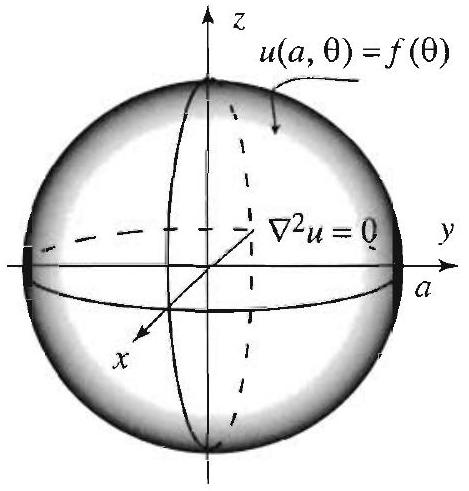

Figure 1 A Dirichle with symmetry.

Right margin note (page 6)

will
super-
will
asso-
ically,
(and is and ctions
3), (5),
3) and Use actions
ctions. these
f (2). tion of $a>0$, re 1). ent of aplace
ndary
ration arrive

++++

artial Differential Equations in Spherical Coordinates

Solutions of boundary value problems involving Laplace's equatio be expressed as infinite series in terms of the product solutions (17) (: position principle). In determining the coefficients in these series, w use the boundary conditions and appeal to various properties of the ciated Legendre functions (and Legendre polynomials). More specif we will require expansion theorems for associated Legendre functions Legendre polynomials) that are similar to Bessel series representatior Fourier series. This requisite material is developed in detail in Se 5.5-5.7. We will refer to it as needed.

Exercises 5.1
1. Carry out the details of the separation of variables method to derive ( and (6) from (1).
2. Carry out the details of the separation of variables method to derive ( (7) from (2).
3. Refer to Section 5.5, where you will find a list of Legendre polynomials this list to compute explicitly $P_{n}(\cos \theta)$ for $n=0,1,2$. Verify that these fur are solutions of (7) for the corresponding value of $\mu$.
4. Refer to Section 5.7, where you will find a list of associated Legendre fun Use this list to compute explicitly $P_{1}^{m}(\cos \theta)$ for $m=-1,0,1$. Verify tha functions are solutions of (6) for the corresponding values of $\mu$ and $m$.
5. Write down (18) explicitly when $n=1$, and verify that it is a solution o
6. Write down (17) explicitly when $m=n=1$, and verify that it is a solu (1).
t Problems with Symmetry
In this section we will solve Laplace's equation inside a ball of radius with prescribed boundary values on the sphere of radius $a$ (see Figu We will assume throughout this section that the problem is independ the angle $\phi$, and so we will be dealing with the radially symmetric L
$\theta)=f(\theta)$
t problem equation
$$
\nabla^{2} u=\frac{\partial^{2} u}{\partial r^{2}}+\frac{2}{r} \frac{\partial u}{\partial r}+\frac{1}{r^{2}}\left(\frac{\partial^{2} u}{\partial \theta^{2}}+\cot \theta \frac{\partial u}{\partial \theta}\right)=0,
$$
where $0<r<a$, and $0<\theta<\pi$ (see (2), Section 5.1). The bou condition is also radially symmetric:
$$
u(a, \theta)=f(\theta) .
$$

Let us recall some facts from the previous section. Applying the sepa of variables method, we let $u(r, \theta)=R(r) \Theta(\theta)$ plug into (1), and we

---

<!-- Page 7 -->

Left margin note (page 7)

THEOREM 1
DIRICHLET PROBLEM IN A BALL

Right margin note (page 7)

275

other hence ation n the polyendre duct on of

To rpose for a dary ff the rtant
$a$ in

++++

Section 5.2 Dirichlet Problems with Symmetry

at the separated equations
$$
\begin{array}{ll}
r^{2} R^{\prime \prime}+2 r R^{\prime}-n(n+1) R=0, & 0<r<a \\
\Theta^{\prime \prime}+\cot \theta \Theta^{\prime}+n(n+1) \Theta=0, & 0<\theta<\pi
\end{array}
$$
where the separation constant is $n(n+1)$ with $n=0,1,2, \ldots$. (All choices of the separation constant lead to unbounded solutions and 1 are discarded on physical grounds.) The equation in $R$ is an Euler equ with bounded solution $r^{n}$. Making the change of variables $s=\cos \theta$ i second equation, we get Legendre's differential equation of order $n$ :
$$
\left(1-s^{2}\right) \Theta^{\prime \prime}-2 s \Theta^{\prime}+n(n+1) \Theta=0, \quad-1<s<1
$$
(see Section 5.1, (9)-(11) and (13)). For each $n$, this equation has a nomial solution of degree $n$, denoted by $P_{n}(s)$ and called the $n$th Lege polynomial. Substituting back $s=\cos \theta$, we obtain $r^{n} P_{n}(\cos \theta)$ as pro solutions of (1). Since any multiple of these functions is also a soluti $(1)$, it will be convenient to denote the product solutions by
$$
A_{n}\left(\frac{r}{a}\right)^{n} P_{n}(\cos \theta),
$$
where $A_{n}$ is an arbitrary constant, and $a$ is the radius of the ball. complete the solution of the Dirichlet problem (1)-(2), we will supe the product solutions (3) in an infinite series to form our candidate solution, then determine the $A_{n}$ 's in the series so as to satisfy the bour condition (2). In this last step, we will appeal to the orthogonality o Legendre polynomials from Section 5.6. We have the following impo result.

The solution of the Dirichlet problem (1)-(2), is given by
$$
u(r, \theta)=\sum_{n=0}^{\infty} A_{n}\left(\frac{r}{a}\right)^{n} P_{n}(\cos \theta)
$$
where $P_{n}$ is the $n$th Legendre polynomial (Section 5.5), and
$$
A_{n}=\frac{2 n+1}{2} \int_{0}^{\pi} f(\theta) P_{n}(\cos \theta) \sin \theta d \theta, \quad n=0,1,2, \ldots
$$

Proof Superposing the product solutions (3), we arrive at (4). Setting $r=$ (4) and using the boundary condition (2), we get
$$
f(\theta)=\sum_{n=0}^{\infty} A_{n} P_{n}(\cos \theta), \quad 0<\theta<\pi
$$

---

<!-- Page 8 -->

Left margin note (page 8)

276
Chapter 5
P

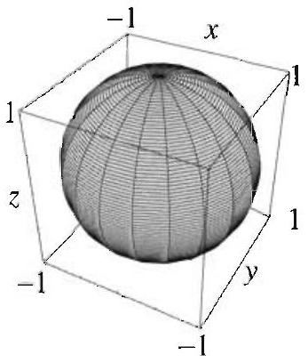

Figure 2 Graphs $\left(\left|P_{n}(\cos \theta)\right|, \theta, \phi\right)$ for respect to the $z$-axis $0<x<1$.

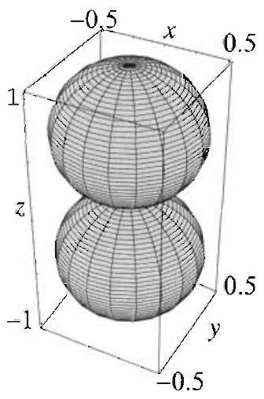

Right margin note (page 8)

ides of pect to in $\theta d \theta$. Section which
ortant n idea phs of c with reases. of the
points ic with (x), for

++++

artial Differential Equations in Spherical Coordinates

To determine the coefficients $A_{n}$, we proceed formally. Multiplying both s the equation by $P_{m}(\cos \theta) \sin \theta$, and then integrating term by term with resi $\theta$, we get
$$
\begin{aligned}
\int_{0}^{\pi} f(\theta) P_{m}(\cos \theta) \sin \theta d \theta & =\sum_{n=0}^{\infty} A_{n} \int_{0}^{\pi} P_{n}(\cos \theta) P_{m}(\cos \theta) \sin \theta d \theta \\
& =\sum_{n=0}^{\infty} A_{n} \int_{-1}^{1} P_{n}(x) P_{m}(x) d x
\end{aligned}
$$
where the last equality follows by making the substitution $x=\cos \theta, d x=-\mathrm{s}$ Appealing to the orthogonality of the Legendre polynomials, Theorem 1, $\$$ 5.6, we see that all the terms in the series are zero, except when $m=n$, in case the term is equal to $A_{m} \int_{-1}^{1}\left[P_{m}(x)\right]^{2} d x=A_{m} \frac{2}{2 m+1}$. Thus
$$
\int_{0}^{\pi} f(\theta) P_{m}(\cos \theta) \sin \theta d \theta=A_{m} \frac{2}{2 m+1},
$$
which implies (5).
It is clear from Theorem 1 that the functions $P_{n}(\cos \theta)$ play an imp role in the solution of the Dirichlet problem in the sphere. To get a of the magnitude of these functions, we show in Figure 2 the gra $r=\left|P_{n}(\cos \theta)\right|$, for $0 \leq \theta \leq \pi, n=0,1,2,3$. The graphs are symmetri respect to rotation about the $z$-axis and acquire more lobes as $n$ incr The latter property is a consequence of the increasing number of zeros Legendre polynomials in the interval $[-1,1]$.

1

$r=\left|P_{1}(\cos \theta)\right|$

$r=\left|P_{2}(\cos \theta)\right|$

$r=\left|P_{3}(\cos \theta)\right|$
of $r=\left|P_{n}(\cos \theta)\right|, n=0,1,2,3$. In spherical coordinates, these represent the $0<\theta<\pi, 0<\phi<2 \pi$. Because $r$ is independent of $\phi$, the graphs are symmetr They aquire more lobes, as $n$ increases, due to the increasing number of zeroes of $P_{n}$.

---

<!-- Page 9 -->

Left margin note (page 9)

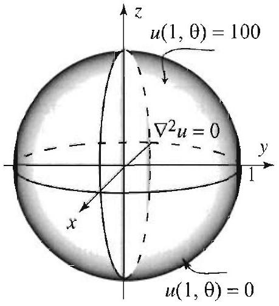

Figure 3 Dirichlet problem.

Right margin note (page 9)

277
pper
ngly,
nany
$=50$.
this
n to
the
$o$ be
the
ation
the
blem
5.6.
thus

++++

Section 5.2 Dirichlet Problems with Symmetry

EXAMPLE 1 A Dirichlet problem inside a sphere
Find the steady-state temperature in a sphere of unit radius, given that the $u$ hemisphere is kept at $100^{\circ}$ and the lower one is kept at $0^{\circ}$ (Figure 3).

Solution The boundary function is given by
$$
f(\theta)=\left\{\begin{array}{ll}
100 & \text { if } 0<\theta<\frac{\pi}{2}, \\
0 & \text { if } \frac{\pi}{2}<\theta<\pi .
\end{array}\right.
$$

Since $f$ is independent of $\phi$, the problem is covered by Theorem 1. Accordi we have
$$
u(r, \theta)=\sum_{n=0}^{\infty} A_{n} r^{n} P_{n}(\cos \theta),
$$
where
$$
A_{n}=50(2 n+1) \int_{0}^{\pi / 2} P_{n}(\cos \theta) \sin \theta d \theta=50(2 n+1) \int_{0}^{1} P_{n}(x) d x
$$

At this point, you can use the explicit formulas for the $P_{n}$ 's to compute as n coefficients as you wish. For example, since $P_{0}(x)=1$, we get $A_{0}=50 \int_{0}^{1} d x=$ Also, using $P_{1}(x)=x$, we get $A_{1}=150 \int_{0}^{1} x d x=\frac{150}{2}=75$. Continuing in manner, by appealing to the explicit formulas of the $P_{n}$ 's, we arrive at
$$
A_{0}=50, \quad A_{1}=75, \quad A_{2}=0, \quad A_{3}=-\frac{175}{4}, \quad A_{4}=0 .
$$

Hence the temperature inside the sphere is
$$
u(r, \theta)=50+75 r P_{1}(\cos \theta)-\frac{175}{4} r^{3} P_{3}(\cos \theta)+\cdots
$$

In Table 1, we have used the first three nonzero terms of the series solutio approximate the temperature inside the sphere at the indicated points.

\begin{table}
| $\theta$ | 0 | $\pi / 4$ | $\pi / 2$ | $3 \pi / 4$ | $\pi$ |
| :---: | :---: | :---: | :---: | :---: | :---: |
| $u(1 / 4, \theta)$ | 68.1 | 63.4 | 50 | 36.6 | 32 |
| $u(1 / 2, \theta)$ | 82 | 77.5 | 50 | 22.5 | 18 |
| $u(3 / 4, \theta)$ | 87.8 | 93 | 50 | 7 | 12.2 |
\captionsetup{labelformat=empty}
\caption{Table 1 Approximation of the temperature inside the ball.}
\end{table}

For fixed $r$, as $\theta$ varies from 0 to $\pi$, the points move from the north pole to south pole. Note how the temperature decreases as $\theta$ increases. This is $t$ expected, given the boundary conditions. Also, note that as $r$ approaches 1 points in the upper hemisphere have temperature near $100^{\circ}$. Better approxima of the steady-state temperature can be obtained by taking more terms from series solution.

As you will soon discover, you always learn more about a solution of a prol by appealing to properties of the Legendre polynomials from Sections 5.5 and Here, for example, we will show how to compute the $A_{n}$ 's in closed form,

---

<!-- Page 10 -->

Left margin note (page 10)

278
Chapter 5
Partial Differ

Right margin note (page 10)

6, we
ish by ties in
face $00^{\circ}$ as
rature

++++

ential Equations in Spherical Coordinates
yielding a more satisfactory form of the solution. From Exercise 10, Section have
$$
\begin{array}{c}
\int_{0}^{1} P_{0}(x) d x=1, \quad \int_{0}^{1} P_{2 n}(x) d x=0, n=1,2, \ldots \\
\int_{0}^{1} P_{2 n+1}(x) d x=\frac{(-1)^{n}(2 n)!}{2^{2 n+1}(n!)^{2}(n+1)}, n=0,1,2, \ldots
\end{array}
$$

The proofs of these identities are nontrivial, but you can do them if you w following the outlined steps in Exercise 10, Section 5.6. Using these identi (6), we obtain
$$
\begin{array}{c}
A_{0}=50, \quad A_{2 n}=0, n=1,2,3, \ldots \\
A_{2 n+1}=50(4 n+3) \frac{(-1)^{n}(2 n)!}{2^{2 n+1}(n!)^{2}(n+1)}, n=1,2, \ldots
\end{array}
$$

Thus
$$
u(r, \theta)=50+25 \sum_{n=0}^{\infty}(4 n+3) \frac{(-1)^{n}(2 n)!}{2^{2 n}(n!)^{2}(n+1)} r^{2 n+1} P_{2 n+1}(\cos \theta) .
$$

See Exercise 7 for further properties of the solution.

EXAMPLE 2 A polynomial temperature distribution on the sur The temperature on the surface of a ball of unit radius varies from $0^{\circ}$ to 1 one moves from the north pole to the south pole, according to the formula
$$
f(\theta)=50(1-\cos \theta), \quad 0<\theta<\pi .
$$
(Thus $f$ is a first-degree polynomial in $\cos \theta$.) Find the steady-state tempe inside the ball.
Solution According to (4), the temperature is given by
$$
u(r, \theta)=\sum_{n=0}^{\infty} A_{n} P_{n}(\cos \theta) r^{n},
$$
where
$$
\begin{aligned}
A_{n} & =\frac{2 n+1}{2} \int_{0}^{\pi} 50(1-\cos \theta) P_{n}(\cos \theta) \sin \theta d \theta \\
& =25(2 n+1) \int_{-1}^{1}(1-x) P_{n}(x) d x \quad(x=\cos \theta, d x=-\sin \theta d \theta)
\end{aligned}
$$

Using the explicit formulas for the $P_{n}$ 's, it is easy to check that
$$
A_{0}=50, \quad A_{1}=-50, \quad A_{2}=0, \quad A_{3}=0, \quad A_{4}=0 .
$$

Indeed, with the help of a computer you can check that $A_{n}=0$ for $n \geq 2$.
$$
u(r, \theta)=50 P_{0}(\cos \theta)-50 r P_{1}(\cos \theta)=50-50 r \cos \theta .
$$

---

<!-- Page 11 -->

Left margin note (page 11)

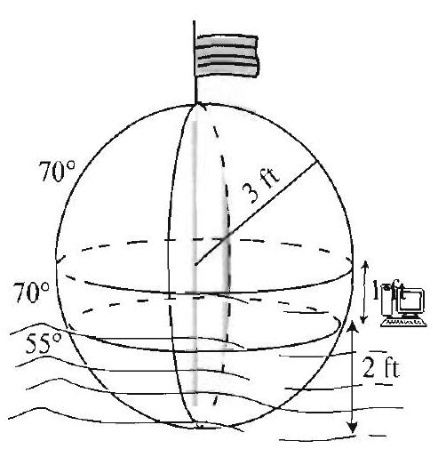

Figure 4 for Exercise

Right margin note (page 11)

279
full Legendre of the hence s , we omial nsion
hout will
phere t two of the from
ies of ution on? 1 this as a ff the $<1$, ysical ple 1 hown

++++

Section 5.2 Dirichlet Problems with Symmetry

Surely there must be a reason for the vanishing of the $A_{n}$ 's when $n \geq 2$. justification of this fact is again found by understanding basic properties of endre polynomials and Legendre series. According to (9), $A_{n}$ is the $n$th Lege coefficient of the polynomial $50-50 x$ (see (7), Section 5.6 for the definition Legendre coefficient). Thus, we are seeking $A_{n}$ so that
$$
50-50 x=A_{0} P_{0}(x)+A_{1} P_{1}(x)+A_{2} P_{2}(x)+A_{3} P_{3}(x)+\cdots .
$$

Since $P_{0}(x)=1$, and $P_{1}(x)=x$, then $50-50 x=50 P_{0}(x)-50 P_{1}(x)$; $A_{0}=50, A_{1}=-50$, and by the orthogonality of the Legendre polynomial conclude that $A_{n}=0$ for all $n \geq 2$. This argument can be used with any polyno $p(x)$ of degree $k$. In this case, the $n$th coefficient in the Legendre series expa of $p(x)$ is zero for all $n>k$ (see Exercise 44, Section 5.6).

In the next section we treat the general case of Laplace's equation wit symmetry. This case requires more than the Legendre polynomials: We need the so-called associated Legendre functions.
Exercises 5.2
In Exercises 1-6, you are asked to solve Laplace's equation (1) inside a s of unit radius subject to the given boundary condition. (a) Compute at leas nonzero coefficients of the Legendre series solution. (b) Find the general form coefficients in the series solution. A hint is given whenever you need results Section 5.6.
1. $f(\theta)=20(\cos \theta+1)$.
2. $f(\theta)=\cos ^{2} \theta+2$.
3. $f(\theta)=\left\{\begin{array}{ll}100 & \text { if } 0<\theta<\pi / 2, \\ 20 & \text { if } \pi / 2<\theta<\pi .\end{array}\right.$
4. $f(\theta)=\left\{\begin{array}{ll}100 & \text { if } 0<\theta<\pi / 3, \\ 0 & \text { if } \pi / 3<\theta<\pi .\end{array}\right.$
[Hint: Exercise 10, Section 5.6.]
5. $f(\theta)=\left\{\begin{array}{ll}\cos \theta & \text { if } 0<\theta<\pi / 2, \\ 0 & \text { if } \pi / 2<\theta<\pi .\end{array}\right.$
6. $f(\theta)=|\cos \theta|$.
[Hint: Exercise 11, Section 5.6.]
[Hint: Exercise 27, Section 5.6.]
7. Experimenting with Example 1. In this exercise, use various propert Legendre polynomials from Sections 5.5 and 5.6 to derive properties of the sol in Example 1. Throughout this exercise, $u(r, \theta)$ refers to (8).
(a) Using (8), show that $u(r, \pi / 2)=50$. Does this meet with your expectati
(b) If you take $r=1$ in (8), you should get the boundary function $f$. Confirm fact by plotting several partial sums of the solution. Plot your partial sums function of $\theta$ over the interval $[0, \pi]$.
(c) If you take $\theta=0$ in (8), you should get the steady-state temperature o points on the $z$-axis in the upper hemisphere. Plot (8) for $\theta=0$ and $0<r$ and comment on the graph.
(d) Show that, for $0<r<1, \frac{u(r, 0)+u(r, \pi)}{2}=50$. Does this make sense on phy grounds?
8. Get a better approximation of the temperature inside the sphere in Exam and the points indicated in Table 1. Use at least ten terms from (8).
9. Find the steady-state temperature inside a buoy floating on the ocean as s. in the figure. [Hint: Exercise 9, Section 5.6.]

---

<!-- Page 12 -->

Left margin note (page 12)

280
Chapter 5 Partial Differ

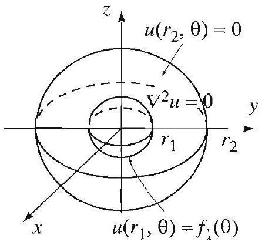

Figure 5 for Exercise 12.

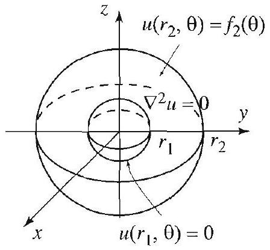

Figure 6 for Exercise 13.

Right margin note (page 12)

and 11 ject to theory, Ve will ct that $\theta)$ and
lutions e?]
ues on
cononzero 13 you mbine n both
ditions $=0$ to nat the centric

++++

ential Equations in Spherical Coordinates

Project Problem: Dirichlet problem outside a sphere. Exercises 10 deal with Laplace's equation in the region outside the sphere $r>a$, sub the boundary conditions $u(a, \theta)=f(\theta)$. Such equations arise in potential when studying, for example, the potential outside a spherical capacitor. impose the additional condition $\lim _{r \rightarrow \infty} u(r, \theta)=0$, which expresses the fa the potential tends to zero as we move far away from the sphere.
10. Show that the solution of (1) subject to the conditions $u(a, \theta)=f( \lim _{r \rightarrow \infty} u(r, \theta)=0$, in the region outside the sphere $r=a$, is given by
$$
u(r, \theta)=\sum_{n=0}^{\infty} A_{n}\left(\frac{r}{a}\right)^{-(n+1)} P_{n}(\cos \theta), \quad(r>a),
$$
where $A_{n}$ is as in (5). [Hint: Repeat the proof of Theorem 1, using the so $R_{n}^{*}$ instead of $R_{n}$ from (16), Section 5.1. Why should you make this change
11. Solve the Dirichlet problem outside the unit sphere with boundary val the unit sphere as in Exercise 3.
Project Problem: A Dirichlet problem in the region between tw centric spheres. In Exercise 12 you are asked to solve this problem with n data on the inner sphere and zero data on the outer sphere. In Exercise are asked to treat the opposite case, and in Exercise 14 you are asked to cc the results to give a solution of the Dirichlet problem with nonzero data o spherical surfaces.
12. Consider the Dirichlet problem consisting of (1) with the boundary con described in the figure.
(a) Use both functions in (16), Section 5.1, and impose the condition $R\left(r_{2}\right)$ arrive at the solution
$$
u_{1}(r, \theta)=\sum_{n=0}^{\infty} A_{n}^{*}\left[\left(\frac{r}{r_{2}}\right)^{n}-\left(\frac{r_{2}}{r}\right)^{n+1}\right] P_{n}(\cos \theta),
$$
where $r_{1}<r<r_{2}, 0<\theta<\pi$, and $A_{n}^{*}$ are to be determined. Verify th boundary condition $u_{1}\left(r_{2}, \theta\right)=0$ is satisfied.
(b) The other boundary condition implies that
$$
u_{1}\left(r_{1}, \theta\right)=f_{1}(\theta)=\sum_{n=0}^{\infty} A_{n}^{*}\left[\left(\frac{r_{1}}{r_{2}}\right)^{n}-\left(\frac{r_{2}}{r_{1}}\right)^{n+1}\right] P_{n}(\cos \theta) .
$$

Conclude that
$$
A_{n}^{*}\left[\left(\frac{r_{1}}{r_{2}}\right)^{n}-\left(\frac{r_{2}}{r_{1}}\right)^{n+1}\right]=\frac{2 n+1}{2} \int_{0}^{\pi} f_{1}(\theta) P_{n}(\cos \theta) \sin \theta d \theta .
$$

Determine $A_{n}^{*}$ to complete the solution.
13. Show that the steady-state temperature in the region between the con spheres, as shown in the figure, is
$$
u_{2}(r, \theta)=\sum_{n=0}^{\infty} B_{n}^{*}\left[\left(\frac{r}{r_{1}}\right)^{n}-\left(\frac{r_{1}}{r}\right)^{n+1}\right] P_{n}(\cos \theta),
$$

---

<!-- Page 13 -->

Left margin note (page 13)

5.3 Spherica

Right margin note (page 13)

281

I the ween id $u_{2}$
disk hich ball ries" the urier rical espesuch ry of lem. lered
we way,
quantial

++++

Section 5.3 Spherical Harmonics and the General Dirichlet Problem

where $r_{1}<r<r_{2}, 0<\theta<\pi$, and
$$
B_{n}^{*}\left[\left(\frac{r_{2}}{r_{1}}\right)^{n}-\left(\frac{r_{1}}{r_{2}}\right)^{n+1}\right]=\frac{2 n+1}{2} \int_{0}^{\pi} f_{2}(\theta) P_{n}(\cos \theta) \sin \theta d \theta
$$
14. Show that the solution of the Dirichlet problem consisting of (1) and boundary conditions $u\left(r_{1}, \theta\right)=f_{1}(\theta)$ and $u\left(r_{2}, \theta\right)=f_{2}(\theta)$, in the region bet the concentric sphere $r_{1}<r<r_{2}$ is $u(r, \theta)=u_{1}(r, \theta)+u_{2}(r, \theta)$, where $u_{1}$ an are given in Exercises 12 and 13, respectively.

Harmonics and the General Dirichlet Problem
Recall from Section 4.4 that the solution of the Dirichlet problem in a was expressed in terms of the Fourier series of the boundary function, w was defined on the circle. The solution of the Dirichlet problem inside a shares a similar property: It will be expressed in terms of a "Fourier se of the boundary function, which is defined on the sphere. Thus solvin Dirichlet problem on the sphere will require developing an analog of Fo series expansions for functions defined on the sphere, the so-called sphe harmonics expansions. Like Fourier series, these are very useful tools, cially when dealing with boundary value problems in spherical regions, as heat, wave, Dirichlet and Poisson problems. We will develop the theo spherical harmonics as it arises from our solution of the Dirichlet prob

Let us start by recalling a few facts from Section 5.1. We consic Laplace's equation in spherical coordinates
$$
\frac{\partial^{2} u}{\partial r^{2}}+\frac{2}{r} \frac{\partial u}{\partial r}+\frac{1}{r^{2}}\left(\frac{\partial^{2} u}{\partial \theta^{2}}+\cot \theta \frac{\partial u}{\partial \theta}+\csc ^{2} \theta \frac{\partial^{2} u}{\partial \phi^{2}}\right)=0
$$
where $0<r<a, 0<\theta<\pi$, and $0<\phi<2 \pi$, with boundary condition
$$
u(a, \theta, \phi)=f(\theta, \phi), \quad 0<\theta<\pi, 0<\phi<2 \pi
$$

When we applied the method of separation of variables in Section 5.1 set $u(r, \theta, \phi)=R(r) \Theta(\theta) \Phi(\phi)$, plugged into (1), proceeded in the usual and arrived at the three equations
$$
\begin{array}{c}
r^{2} R^{\prime \prime}+2 r R^{\prime}-n(n+1) R=0, \quad 0<r<a, \quad n=0,1,2, \ldots, \\
\Phi^{\prime \prime}+m^{2} \Phi=0, \quad m=0,1,2, \ldots,
\end{array}
$$
and
$$
\Theta^{\prime \prime}+\cot \theta \Theta^{\prime}+\left(n(n+1)-m^{2} \csc ^{2} \theta\right) \Theta=0
$$

After making the change of variables $s=\cos \theta ; \frac{d s}{d \theta}=-\sin \theta$ in the last tion and simplifying, we arrived at the associated Legendre differe

---

<!-- Page 14 -->

Left margin note (page 14)

282
Chapter 5
Partial Differ

Right margin note (page 14)

$(r)=$ riodic The on 5.7. s have
mporthese ce, we doing terms
$m=$ rms of to be (2),
r $n=$ pher-
ient in set of

++++

ential Equations in Spherical Coordinates

equation
$$
\left(1-s^{2}\right) \frac{d^{2} \Theta}{d s^{2}}-2 s \frac{d \Theta}{d s}+\left(n(n+1)-\frac{m^{2}}{1-s^{2}}\right) \Theta=0, \quad-1<s<1
$$

The equation in $R$ is an Euler equation with bounded solutions $R r^{n}, 0<r<a$. The solutions of the equation in $\Phi$ are the $2 \pi$-pe $\cos m \phi$ and $\sin m \phi$, which we combined in complex form as $\Phi(\phi)=e^{i m c}$ associated Legendre differential equation is treated in detail in Sectic Its solutions are the associated Legendre functions $P_{n}^{m}(s)$. We thu the following product solutions of (1):
$$
u(r, \theta, \phi)=r^{n} e^{i m \phi} P_{n}^{m}(\cos \theta) .
$$

The functions $e^{i m \phi} P_{n}^{m}(\cos \theta)$ appear in the solutions of many other $i$ tant applications. As we will see shortly, when properly normalized products are called spherical harmonics. Because of their importan will formulate their definitions and study their basic properties. After so, we will return to the Dirichlet problem and express its solution in of the spherical harmonics.

Spherical Harmonics
We start by recalling facts from Section 5.7. For $n=0,1,2, \ldots$ and $0,1,2, \ldots$, the associated Legendre function $P_{n}^{m}(x)$ is defined in te the $m$ th derivative of the Legendre polynomial of degree $n$ by
$$
P_{n}^{m}(x)=(-1)^{m}\left(1-x^{2}\right)^{m / 2} \frac{d^{m} P_{n}(x)}{d x^{m}},
$$
(see (1), Section 5.7). Since $P_{n}$ is a polynomial of degree $n$, for $P_{n}^{m}$ nonzero, we must take $0 \leq m \leq n$. For negative $m$ 's, we defined Section 5.7,
$$
P_{n}^{m}(x)=(-1)^{m} \frac{(n+m)!}{(n-m)!} P_{n}^{-m}(x) .
$$

This extends the definition of the associated Legendre functions fo $0,1,2, \ldots$, and $m=-n,-(n-1), \ldots, n-1, n$. We now define the $s$ ical harmonics $Y_{n, m}(\theta, \phi)$ by
$$
Y_{n, m}(\theta, \phi)=\sqrt{\frac{2 n+1}{4 \pi} \frac{(n-m)!}{(n+m)!}} P_{n}^{m}(\cos \theta) e^{i m \phi},
$$
where $n=0,1,2, \ldots$, and $m=-n,-n+1, \ldots, n-1, n$. The coeffic (4) is chosen so that the spherical harmonics become an orthonormal

---

<!-- Page 15 -->

Left margin note (page 15)

THEOF ORTHOGONA RELATION SPHEF HARMC

Figure 1 Graphs of $r$ with respect to the $z$ -

Right margin note (page 15)

283

area ns. be as $m^{\prime}$, func-exls in $\cos \theta$, 3 . 2 2 netric

++++

Section 5.3 Spherical Harmonics and the General Dirichlet Problem

functions on the surface of the sphere when using the element of surface $\sin \theta d \theta d \phi$. More precisely, we have the following orthogonality relatio

EM 1
LITY
FOR
ICAL
ONICS

Let $n=0,1,2, \ldots$, and $m=-n,-n+1, \ldots, n-1, n$, and let $Y_{n, m}$ in (4). Then
(5) $\int_{0}^{2 \pi} \int_{0}^{\pi} Y_{n, m}(\theta, \phi) \bar{Y}_{n^{\prime}, m^{\prime}}(\theta, \phi) \sin \theta d \theta d \phi=0 \quad$ if $n \neq n^{\prime}$ or $m \neq$ where $\bar{Y}_{n^{\prime}, m^{\prime}}$ is the complex conjugate of $Y_{n^{\prime}, m^{\prime}}$, and
$$
\int_{0}^{2 \pi} \int_{0}^{\pi}\left|Y_{n, m}(\theta, \phi)\right|^{2} \sin \theta d \theta d \phi=1
$$

The proofs are based on the orthogonality of the associated Legendre tions (Theorem 1, Section 5.7) and the orthogonality of the comple ponentials ((11), Section 2.6). Simply use (4) to rewrite the integra terms of $P_{n}^{m}(\cos \theta) e^{i m \phi}$, and then use the change of variables $s= d s=-\sin \theta d \theta$. The details are straightforward and are left to Exercis
axis.

---

<!-- Page 16 -->

Left margin note (page 16)

284
Chapter 5 Partial Differ

THEOREM 2
SPHERICAL HARMONICS SERIES EXPANSIONS

Right margin note (page 16)

show origin, prigin, The $\phi) \mid$ at pint of nerical $=1$, it urface
sed to es and
uppose series
es extion $f <\infty$. typinsone,
series. ed the er the rem 1, efined where rating nerical

++++

ential Equations in Spherical Coordinates

In Figure 1 we used spherical coordinates to plot the surfaces
$$
r=\left|Y_{n, m}(\theta, \phi)\right| \quad \text { where } 0<\theta<\pi, 0<\phi<2 \pi .
$$

These surfaces represent the points $\left(\left|Y_{n, m}(\theta, \phi)\right|, \theta, \phi\right)$ and hence they the magnitude of the spherical harmonics over a sphere centered at the in the following sense. Pick a point on the sphere (centered at the with radius $a>0$ ), and denote its spherical coordinates by ( $a, \theta_{0}, \phi_{0}$ ) ray through $(0,0,0)$ and $\left(a, \theta_{0}, \phi_{0}\right)$ intersects the surface $r=\mid Y_{n, m}(\theta$, the point $\left(\left|Y_{n, m}\left(\theta_{0}, \phi_{0}\right)\right|, \theta_{0}, \phi_{0}\right)$. The distance from the origin to that po intersection is clearly $\left|Y_{n, m}\left(\theta_{0}, \phi_{0}\right)\right|$, which is the magnitude of the spl harmonics at the point ( $a, \theta_{0}, \phi_{0}$ ). From (4) and the fact that $\left|e^{i m \phi}\right|=$ follows that $\left|Y_{n, m}(\theta, \phi)\right|$ is independent of $\phi$. This explains why the s $r=\left|Y_{n, m}(\theta, \phi)\right|$ is symmetric with respect to the $z$-axis.

Our next theorem states that the spherical harmonics can be us expand functions defined on the sphere, much as we used Fourier serie other orthogonal series expansions.

Let $f(\theta, \phi)$ be a function defined for all $0<\phi<2 \pi, 0<\theta<\pi$, and s that $f$ is $2 \pi$-periodic in $\phi$. Then we have the spherical harmonics expansion
$$
f(\theta, \phi)=\sum_{n=0}^{\infty} \sum_{m=-n}^{n} A_{n m} Y_{n, m}(\theta, \phi),
$$
where the spherical harmonics coefficients are given by
$$
A_{n m}=\int_{0}^{2 \pi} \int_{0}^{\pi} f(\theta, \phi) \bar{Y}_{n, m}(\theta, \phi) \sin \theta d \theta d \phi
$$

We can justify (8) as we have done before with other orthogonal seri pansions, by using the orthogonality relations (5) and (6). The func in Theorem 2 is square integrable; that is, $\int_{0}^{2 \pi} \int_{0}^{\pi}|f(\theta, \phi)|^{2} \sin \theta d \theta d \phi$ Sufficient conditions for the pointwise convergence of the series are cally quite complicated to state. (See Orthogonal Functions, by G. Sa Interscience Publishers, 1959.)

Let us compare Theorems 1 and 2 to the complex form of Fourier When we defined the spherical harmonics coefficient in (8), we use complex conjugate of the spherical harmonics, and we integrated ov sphere with respect to $\sin \theta d \theta d \phi$, the element of surface area. In Theo Section 2.6, you can think of a $2 \pi$-periodic function, $f(\theta)$, as being d on the unit circle, by parameterizing the points of the circle by $\theta$, $0 \leq \theta<2 \pi$. The Fourier coefficients of $f(\theta)$ are then obtained by integ over the circle with respect to $d \theta$, the element of arc length. Thus, spl

---

<!-- Page 17 -->

Left margin note (page 17)

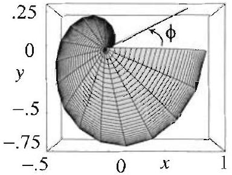

Figure 2 View from above of the surface $r=f(\theta, \phi)$. As $\phi$ increases from 0 to $2 \pi, r$ increases from 0 to 1.

Figure 3 Approximation of the surface in Figure 1 by the graph of a partial sum of the Dirichlet series in Example 1, with $0 \leq n \leq 10$ and $-n \leq m \leq n$.

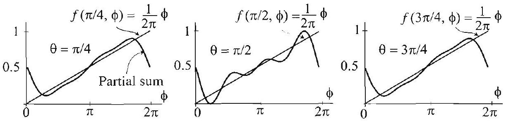

Figure 4

Right margin note (page 17)

285

s for s $2 \pi$ from 0 or m 2 .
(see into
of the 7, we $\mathrm{n}-1$ s the
g the cise 1
$\phi$
$\frac{\phi}{z}$

++++

Section 5.3 Spherical Harmonics and the General Dirichlet Problem

harmonics series expansions are the natural analogues of Fourier serie functions defined on the surface of the unit sphere.

EXAMPLE 1 A spherical harmonics series expansion
Consider the function $f(\theta, \phi)=\frac{1}{2 \pi} \phi$ for $0<\theta<\pi, 0<\phi<2 \pi$, where $f$ i periodic in $\phi$. The surface $r=f(\theta, \phi)$ is shown in Figure 2. As $\phi$ increases 0 to $2 \pi, f$ increases from 0 to 1 . Note the discontinuity of the graph at $\phi= \phi=2 \pi$. To expand $f$ in a spherical harmonics series, we appeal to Theore Using (8) and (4), we find
$$
\begin{aligned}
A_{n m} & =\int_{0}^{2 \pi} \int_{0}^{\pi} f(\theta, \phi) \bar{Y}_{n, m}(\theta, \phi) \sin \theta d \theta d \phi \\
& =\frac{1}{2 \pi} \sqrt{\frac{2 n+1}{4 \pi} \frac{(n-m)!}{(n+m)!}} \int_{0}^{2 \pi} \phi e^{-i m \phi} d \phi \int_{0}^{\pi} P_{n}^{m}(\cos \theta) \sin \theta d \theta
\end{aligned}
$$

The inner integral is straightforward to evaluate using integration by parts Exercise 5). The change of variables $\cos \theta=s$ transforms the second integral
$$
\int_{-1}^{1} P_{n}^{m}(s) d s
$$

Particular values of this integral can be evaluated by appealing to properties c associated Legendre functions (see Exercise 6). For example, from Section 5. know that $P_{n}^{m}(s)$ is odd if $n+m$ is odd, and hence its integral as $s$ varies frov to 1 is zero. Hence when $n+m$ is odd, we have $A_{n m}=0$. Table 1 show coefficients corresponding to $n=0,1,2$ and $m=-n, \ldots, n$.

\begin{table}
| $n \backslash m$ | -2 | -1 | 0 | 1 | 2 |
| :---: | :---: | :---: | :---: | :---: | :---: |
| 0 |  |  | $\sqrt{\pi}$ |  |  |
| 1 |  | $\frac{-i}{4} \sqrt{\frac{3 \pi}{2}}$ | 0 | $\frac{-i}{4} \sqrt{\frac{3 \pi}{2}}$ |  |
| 2 | $\frac{-i}{2} \sqrt{\frac{5}{6 \pi}}$ | 0 | 0 | 0 | $\frac{i}{2} \sqrt{\frac{5}{6 \pi}}$ |
\captionsetup{labelformat=empty}
\caption{Table 1 Spherical harmonics coefficients $A_{n m}$.}
\end{table}

Partial sums of the spherical harmonics series (7) can now be formed usin coefficients from Table 1. After using the explicit form of the $Y_{n, m}$ from Exer and simplifying, we obtain
$$
f(\theta, \phi) \approx \sum_{n=0}^{2} \sum_{m=-n}^{n} A_{n m} Y_{n, m}(\theta, \phi)=\frac{1}{2}-\frac{3}{8} \sin \phi \sin \theta-\frac{5}{8 \pi} \sin 2 \phi \sin ^{2} \theta .
$$

---

<!-- Page 18 -->

Left margin note (page 18)

286
Chapter 5 Partial Differ

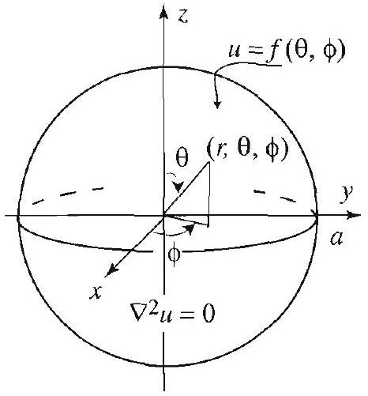

Figure 5 A Dirichlet problem in a ball.

THEOREM 3 DIRICHLET PROBLEM IN A BALL

Right margin note (page 18)

arying sum of face in olotted partial n $(0, \pi)$
oblem (1), ultiple s $\theta$ ) by utions
dition
ven by
y (11), inction
a ball, n both cients"

++++

ential Equations in Spherical Coordinates

We used a computer to calculate the spherical harmonics coefficients with $n$ from 0 to 10 and $-n \leq m \leq n$. Using these coefficients, we formed a partial the spherical harmonics expansion, and then plotted the corresponding sur Figure 3. Note the resemblance to the surface in Figure 2. In Figure 4, we the partial sum for fixed values of $\theta$. Both Figures 3 and 4 show that the sum of the spherical harmonics series expansion approximates $f$, as $\theta$ varies it and $\phi$ varies in $(0,2 \pi)$.

Solution of the Dirichlet Problem in a Ball
We are now in a position to derive the entire solution of the Dirichlet pr (1)-(2), illustrated in Figure 5. Let us recall the product solutions of
$$
r^{n} e^{i m \phi} P_{n}^{m}(\cos \theta), \quad n=0,1,2, \ldots, \quad|m| \leq n .
$$

Since Laplace's equation is homogeneous, we may choose any scalar m of these functions. In particular, using (4), we can replace $e^{i m \phi} P_{n}^{m}$ (co the spherical harmonics $Y_{n, m}(\theta, \phi)$ and take the following product sol
$$
\left(\frac{r}{a}\right)^{n} Y_{n, m}(\theta, \phi) .
$$

Superposing scalar multiples of these solutions, we get
$$
u(r, \theta, \phi)=\sum_{n=0}^{\infty} \sum_{m=-n}^{n} A_{n m}\left(\frac{r}{a}\right)^{n} Y_{n, m}(\theta, \phi),
$$
where the coefficient $A_{n m}$ will be determined from the boundary cor (2). Setting $r=a$ in (11) and using (2), we get
$$
f(\theta, \phi)=\sum_{n=0}^{\infty} \sum_{m=-n}^{n} A_{n m} Y_{n, m}(\theta, \phi),
$$
which is the spherical harmonics expansion of $f$. Hence $A_{n m}$ is gi (8). We summarize our findings as follows.

The solution of (1) subject to the boundary condition (2) is given b where $A_{n m}$ is the spherical harmonics coefficient of the boundary f $f$ and is given by (8).

You should compare (11), the solution of the Dirichlet problem in to (4), Section 4.4, the solution of the Dirichlet problem in a disk. I cases, the solution has a nice expression in terms of the "Fourier coeffic of the boundary function.

---

<!-- Page 19 -->

Right margin note (page 19)

287
alues
ation
wing

then the
the from duct $, \phi)$, $r^{n}$, ntial ables
ying uler
ation vhen pond We

++++

Section 5.3 Spherical Harmonics and the General Dirichlet Problem

EXAMPLE 2 A Dirichlet problem inside the unit ball
If we want to solve the Dirichlet problem inside the unit ball with boundary v given by the function $f$ in Example 1, appealing to Theorem 3, we find the sol
$$
u(r, \theta, \phi)=\sum_{n=0}^{\infty} \sum_{m=-n}^{n} A_{n m} r^{n} Y_{n, m}(\theta, \phi),
$$
where $A_{n m}$ is given by (9). Using the data from Example 1, we obtain the follo partial sum approximation of the solution
$$
\begin{aligned}
u(r, \theta, \phi) & \approx \sum_{n=0}^{2} \sum_{m=-n}^{n} A_{n m} r^{n} Y_{n, m}(\theta, \phi) \\
& =\frac{1}{2}-\frac{3}{8} r \sin \phi \sin \theta-\frac{5}{8 \pi} r^{2} \sin 2 \phi \sin ^{2} \theta .
\end{aligned}
$$

If $u(r, \theta, \phi)$ represents the steady-state temperature distribution inside the ball, we can use this partial sum to approximate the temperature of points insid ball.

Differential Equation for the Spherical Harmonics
For future applications, we need to know the differential equation for spherical harmonics. In deriving this equation, we will work backward our solution of Laplace's equation (1). We now know that the pro solutions of Laplace's equation are of the form $u(r, \theta, \phi)=r^{n} Y_{n, m}(\theta$ where $n=0,1,2, \ldots$ and $|m| \leq n$. We also know that the radial part satisfies Euler's equation. We are interested in determining the differe equation for the spherical harmonics. For this purpose, we separate varia in (1) by setting
$$
u(r, \theta, \phi)=R(r) Y(\theta, \phi),
$$
thus keeping the $\theta$ and $\phi$ variables together. Plugging into (1) and carr out the usual details of the separation of variables, we arrive at the equation in $R$, as expected, and the following equation in $Y$
$$
\frac{\partial^{2} Y}{\partial \theta^{2}}+\cot \theta \frac{\partial Y}{\partial \theta}+\csc ^{2} \theta \frac{\partial^{2} Y}{\partial \phi^{2}}+\mu Y=0,
$$
where $\mu$ is a separation constant. Again, from our knowledge of the sol of Laplace's equation (1), we conclude that (12) has nontrivial solutions v $\mu=\mu_{n}=n(n+1), \quad n=0,1,2,3, \ldots$. To each $\mu=n(n+1)$ corresp $2 n+1$ spherical harmonics solutions $Y(\theta, \phi)=Y_{n, m}(\theta, \phi),|m| \leq n$. summarize these results as follows.

---

<!-- Page 20 -->

Left margin note (page 20)

288
Chapter 5 Partial Differ

THEOREM 4
DIFFERENTIAL
EQUATION FOR THE
SPHERICAL
HARMONICS

Right margin note (page 20)

hat are
ntrivial
onality
nctions
nics for
$e^{-i \phi} ;$
$\theta e^{-2 i \phi} ;$
$\left.\cos ^{3} \theta\right)$;
$e^{2 i \phi} ;$

++++

ential Equations in Spherical Coordinates

The equation
$$
\frac{\partial^{2} Y}{\partial \theta^{2}}+\cot \theta \frac{\partial Y}{\partial \theta}+\csc ^{2} \theta \frac{\partial^{2} Y}{\partial \phi^{2}}+\mu Y=0
$$
where $0<\theta<\pi, 0<\phi<2 \pi$, admits nontrivial bounded solutions t $2 \pi$-periodic in $\phi$ when
$$
\mu=n(n+1), \quad n=0,1,2,3, \ldots
$$

To each acceptable value of $\mu$ (or eigenvalue) we have $2 n+1$ no solutions (or eigenfunctions) given by the spherical harmonics
$$
Y(\theta, \phi)=Y_{n, m}(\theta, \phi), \quad|m| \leq n
$$

The eigenfunctions are given explicitly by (4) and satisfy the orthog relations of Theorem 1.

Exercises 5.3
1. Spherical harmonics Use (4) and the list of associated Legendre fu from Example 1, Section 5.7, to derive the following list of spherical harmo $n=0,1,2,3$, and $m=-n, \ldots, n$.
(a) $(n=0)$
$$
Y_{0,0}(\theta, \phi)=\frac{1}{2 \sqrt{\pi}}
$$
(b) $(n=1)$
$$
\begin{array}{c}
Y_{1,-1}(\theta, \phi)=\frac{1}{2} \sqrt{\frac{3}{2 \pi}} \sin \theta e^{-i \phi} ; Y_{1,0}(\theta, \phi)=\frac{1}{2} \sqrt{\frac{3}{\pi}} \cos \theta \\
Y_{1,1}(\theta, \phi)=-\frac{1}{2} \sqrt{\frac{3}{2 \pi}} \sin \theta e^{i \phi} .
\end{array}
$$
(c) $(n=2)$
$$
\begin{array}{c}
Y_{2,-2}(\theta, \phi)=\frac{3}{4} \sqrt{\frac{5}{6 \pi}} \sin ^{2} \theta e^{-2 i \phi} ; Y_{2,-1}(\theta, \phi)=\frac{3}{2} \sqrt{\frac{5}{6 \pi}} \cos \theta \sin \theta \\
Y_{2,0}(\theta, \phi)=\frac{1}{4} \sqrt{\frac{5}{\pi}}\left(-1+3 \cos ^{2} \theta\right) \\
1(\theta, \phi)=-\frac{3}{2} \sqrt{\frac{5}{6 \pi}} \cos \theta \sin \theta e^{i \phi} ; Y_{2,2}(\theta, \phi)=\frac{3}{4} \sqrt{\frac{5}{6 \pi}} \sin ^{2} \theta e^{2 i \phi}
\end{array}
$$
(d) $(n=3) Y_{3,-3}(\theta, \phi)=\frac{1}{8} \sqrt{\frac{35}{\pi}} \sin ^{3} \theta e^{-3 i \phi} ; Y_{3,-2}(\theta, \phi)=\frac{15}{4} \sqrt{\frac{7}{30 \pi}} \cos \theta \sin ^{2}$
$$
\begin{array}{c}
Y_{3,-1}(\theta, \phi)=\frac{1}{8} \sqrt{\frac{21}{\pi}}\left(-1+5 \cos ^{2} \theta\right) \sin \theta e^{-i \phi} ; Y_{3,0}(\theta, \phi)=\frac{1}{4} \sqrt{\frac{7}{\pi}}(-3 \cos \theta+5 \\
Y_{3,1}(\theta, \phi)=\frac{1}{8} \sqrt{\frac{21}{\pi}}\left(1-5 \cos ^{2} \theta\right) \sin \theta e^{i \phi} ; Y_{3,2}(\theta, \phi)=\frac{15}{4} \sqrt{\frac{7}{30 \pi}} \cos \theta \sin ^{2} \theta \\
Y_{3,3}(\theta, \phi)=-\frac{1}{8} \sqrt{\frac{35}{\pi}} \sin ^{3} \theta e^{3 i \phi} .
\end{array}
$$

---

<!-- Page 21 -->

Right margin note (page 21)

289
$\ldots, n$,
of the
or all
m of nd $n$.
the
the
$n m$ :
this
When
you
c).

++++

Section 5.3 Spherical Harmonics and the General Dirichlet Problem
2. Check the orthogonality relations (5) and (6) for $n=0,1$, and $m=-n$, . using the explicit formulas from Exercise 1.
3. Prove the orthogonality relations (5) and (6), using the orthogonality associated Legendre functions from Section 5.7.
4. (a) Prove that $\bar{Y}_{n, m}(\theta, \phi)=(-1)^{m} Y_{n,-m}(\theta, \phi)$.
(b) Show that $Y_{n, m}$ is $2 \pi$-periodic in $\phi$.
5. More on Example 1.
(a) Compute the integral $\int_{0}^{2 \pi} \phi e^{-i m \phi} d \phi$ that appears in (9).
(b) Compute by hand the entries in the first two rows of Table 1.
(c) Using properties of the Legendre polynomials, explain why $A_{n 0}=0$ f $n=1,2, \ldots$.
(d) Compute $A_{n m}$ for $n=3,4$, and $m$ between $-n$ and $n$. Form a partial su the spherical harmonics series of $f$ with $n=0,1, \ldots, 4$ and $m$ between $-n$ a Use graphics to illustrate the convergence of the series to $f$.
6. Project Problem: In evaluating the coefficients (9), we encountere integral
$$
I_{n m}=\int_{-1}^{1} P_{n}^{m}(s) d s
$$

As it turns out, this integral is quite difficult to evaluate in closed form. Prov following properties.
(a) $I_{n m}$ is 0 if $n+m$ is odd.
(b) $I_{00}=2$ and $I_{n 0}=0$ for $n=1,2,3, \ldots$.
(c) Professor Stephen Montgomery-Smith offered the following formula for $I$,
$$
I_{n m}=c_{n m} \frac{4 m\left[\Gamma\left(1+\frac{n}{2}\right)\right]^{2}(-1+m+n)!}{n(1+n)!\Gamma\left(1+\frac{-m+n}{2}\right) \Gamma\left(\frac{m+n}{2}\right)},
$$
where
$$
c_{n m}=\left\{\frac{-1+(-1)^{n}}{2}+\frac{1+(-1)^{m}}{2} \operatorname{sgn} m\right\} \frac{1+(-1)^{n+m}}{2},
$$
and $\operatorname{sgn} m=-1,0$, or 1 according as $m$ is negative, 0 , or positive. Test formula for $n=1,2, \ldots, 10$ and $m$ varying from $-n$ to $n$ in steps of 2 . $m=-n$, there is a problem with the formula as it is written. In this case should compute $\lim _{s \rightarrow-n} I_{n s}$. You can check that
$$
\lim _{s \rightarrow-n} \frac{(-1+s+n)!}{\Gamma\left(\frac{s+n}{2}\right)}=\frac{1}{2},
$$
and $c_{n,-n}=-1$, and so you can set
$$
I_{n,-n}=\frac{2}{(1+n)!n!}\left[\Gamma\left(1+\frac{n}{2}\right)\right]^{2}
$$

This is a much faster way to compute the integral $I_{n m}$ when $m=-n$.
(d) As a challenging part of this project, you can try to prove the result of (

---

<!-- Page 22 -->

Left margin note (page 22)

290
Chapter 5
Pan

Right margin note (page 22)

to find urface $0^{\circ}$ and nclude obtain
$\_\_\_\_$ , $n$.
xercise
s 1 to h your of the
ate the e illuss fact? given
$9, \phi)$.
$$
\frac{\pi}{2},
$$
of the teme tem$r=0$

++++

tial Differential Equations in Spherical Coordinates
7. A steady-state problem inside a sphere. Follow the outlined steps the steady-state temperature in the sphere with radius one given that the s of the wedge between the lines of longitude $\phi=-\frac{\pi}{4}$ and $\phi=\frac{\pi}{4}$ is kept at 10 the rest of the surface of the sphere is kept at $0^{\circ}$.
(a) Let $u(r, \theta, \phi)$ denote the steady-state temperature inside the sphere. that $u$ is given by (11), where
$$
A_{n m}=100 \int_{-\pi / 4}^{\pi / 4} \int_{0}^{\pi} \bar{Y}_{n, m}(\theta, \phi) \sin \theta d \theta d \phi
$$
(b) Using the explicit formulas for the spherical harmonics from Exercise 1, the following table of coefficients corresponding to $n=0,1,2$, and $m=-n$,

| $n \backslash m$ | -2 | -1 | 0 | 1 | 2 |
| :---: | :---: | :---: | :---: | :---: | :---: |
| 0 |  |  | $50 \sqrt{\pi}$ |  |  |
| 1 |  | $25 \sqrt{3 \pi}$ | 0 | $-25 \sqrt{3 \pi}$ |  |
| 2 | $100 \sqrt{\frac{5}{6 \pi}}$ | 0 | 0 | 0 | $100 \sqrt{\frac{5}{6 \pi}}$ |

Spherical harmonics coefficients $A_{n m}$.
(c) Using the coefficients in (b) and the list of spherical harmonics from E 1, obtain the partial sum approximation of the solution
$$
u(r, \theta, \phi) \approx 25+75 \frac{\sqrt{2}}{2} r \sin \theta \cos \phi+125 r^{2} \frac{1}{\pi} \sin ^{2} \theta \cos 2 \phi .
$$
(d) Evaluate this partial sum at various points inside the sphere of radit get an idea about the temperature distribution. Do these values agree wit intuition? Use graphics as we did in Example 1 to illustrate the convergence series solution to the boundary function as $r \rightarrow 1$.
8. Repeat Example 1 with $f(\theta, \phi)=\frac{1}{\pi^{2}} \phi(2 \pi-\phi)$. Use a computer to evalu spherical harmonics coefficients. You should get nicer pictures when you ar trating the convergence of the spherical harmonics series. Can you justify thi

In Exercises 9-12, solve Laplace's equation inside the unit sphere for the boundary function. Follow the steps that are outlined in Exercise 7.
9. $f(\theta, \phi)=Y_{0,0}(\theta, \phi)$.
10. $f(\theta, \phi)=Y_{1,0}(\theta, \phi)+3 Y_{1,1}($
11. $f(\theta, \phi)=\left\{\begin{array}{ll}50 & \text { if } \frac{-\pi}{3}<\phi<\frac{\pi}{3}, \\ 0 & \text { otherwise. }\end{array}\right.$
12. $f(\theta, \phi)=\left\{\begin{array}{ll}100 & \text { if } 0<\phi< \\ 0 & \text { otherwise }\end{array}\right.$
13. A symmetric case with no dependence on $\phi$.
(a) What does Theorem 2 reduce to if $f$ is independent of $\phi$ ?
(b) Obtain Theorem 1 of Section 5.2 from Theorem 3 of this section.
14. Temperature of the center as an average. Since the solution Dirichlet problem, (11), represents a steady-state temperature distribution, th perature of the center of the ball $(r=0)$ should be equal to the average of th perature of the boundary. Find the temperature of the center by plugging

---

<!-- Page 23 -->

Left margin note (page 23)

5.4 The Heln the Poiss

Our notation already that the solution in $Y$ volve the spherical har

Right margin note (page 23)

291
ge of
atric
egion
coose
given
See
ordi-
lems
ving
ning
ions
here
ant,
nore,
the
olem
ables
vari-
ason
vari-
rical

++++

Section 5.4 The Helmholtz, Poisson, Heat, and Wave Equations

into (11), and then explain how your answer can be interpreted as an avera the temperature of the boundary.
15. Project Problem: A Dirichlet problem between two concer spheres. (a) Show that the Dirichlet problem given by (1) and (2) in the re $a<r, 0<\theta<\pi, 0<\phi<2 \pi$ is given by
$$
u(r, \theta, \phi)=\sum_{n=0}^{\infty} \sum_{m=-n}^{n} A_{n m}\left(\frac{r}{a}\right)^{-(n+1)} Y_{n, m}(\theta, \phi),
$$
where $A_{n m}$ are determined by (8). [Hint: Going back to (16), Section 5.1, ch the solutions that are bounded for $r>a$.]
(b) Solve Laplace's equation (1) for $r_{1}<r<r_{2}, 0<\theta<\pi, 0<\phi<2 \pi$, the boundary conditions $u\left(r_{1}, \theta, \phi\right)=f_{1}(\theta, \phi), u\left(r_{2}, \theta, \phi\right)=f_{2}(\theta, \phi)$.
[Hint:
Exercise 14, Section 5.2.]
nholtz Equation with Applications to son, Heat, and Wave Equations

In this section we complete our treatment of problems in spherical co nates by considering the Helmholtz equation and boundary value prob involving the heat, wave, and Poisson equations. We will start by sol an eigenvalue problem involving the Helmholtz equation. The remai boundary value problems will be solved using the eigenfunction expans method. This was the approach that we took in Sections 3.9 and 4.6, w we treated similar problems in Cartesian and polar coordinates.

The Helmholtz Equation in a Ball
Consider the eigenvalue problem
$$
\begin{array}{c}
\nabla^{2} \Psi(r, \theta, \phi)=-k \Psi(r, \theta, \phi), \\
\Psi(a, \theta, \phi)=0,
\end{array}
$$
where $0<r<a, 0<\theta<\pi, 0<\phi<2 \pi, k$ is a nonnegative const and $\nabla^{2} \Psi$ denotes the Laplacian of $\Psi$ in spherical coordinates. Furthern we require that $\Psi$ be bounded and $2 \pi$-periodic in $\phi$. Equation (1) is Helmholtz equation in spherical coordinates. The eigenvalue prol (1)-(2) is homogeneous and can be solved using the separation of varia method. To this end, let

uggests
will in-
$$
\Psi(r, \theta, \phi)=R(r) Y(\theta, \phi) .
$$

monics.

(Note that, unlike previous instances where we used the separation of ables method, here we do not separate the variables $\theta$ and $\phi$. The re will become apparent when we derive the equation for $Y$.) To separate ables in (1), we use (3) and the explicit form of the Laplacian in sphe

---

<!-- Page 24 -->

Left margin note (page 24)

292
Chapter 5
Partial Differ

Right margin note (page 24)

he deing to n for at are
onics
trivial

++++

ential Equations in Spherical Coordinates
coordinates ((1), Section 5.1) and arrive at
$$
r^{2} R^{\prime \prime}+2 r R^{\prime}+\left(k r^{2}-\mu\right) R=0, \quad R(a)=0,
$$
and
$$
\frac{\partial^{2} Y}{\partial \theta^{2}}+\cot \theta \frac{\partial Y}{\partial \theta}+\csc ^{2} \theta \frac{\partial^{2} Y}{\partial \phi^{2}}+\mu Y=0,
$$
where $\mu$ is the separation constant and $Y$ is $2 \pi$-periodic in $\phi$. tails of the separation of the variables are left to Exercise 1.) Appeal Theorem 4, Section 5.3, we see that (5) is the differential equatio the spherical harmonics. It has nontrivial bounded solutions th $2 \pi$-periodic in $\phi$ when
$$
\mu=n(n+1), \quad n=0,1,2, \ldots .
$$

For each $\mu=n(n+1)$, we have $2 n+1$ solutions, the spherical harm
$$
Y_{n, m}(\theta, \phi) \quad m=-n,-n+1, \ldots, 0, \ldots, n-1, n .
$$

Putting the values of $\mu$ from (6) into (4), and letting
$$
k=\lambda^{2},
$$
we arrive at the spherical Bessel equation in $R$ :
(8)
$$
r^{2} R^{\prime \prime}+2 r R^{\prime}+\left(\lambda^{2} r^{2}-n(n+1)\right) R=0, \quad R(a)=0
$$
(see Example 2, Section 4.8). For each $n$, we have infinitely many non solutions
$$
R_{n, j}(r)=j_{n}\left(\lambda_{n, j} r\right), \quad n=0,1,2, \ldots, j=1,2, \ldots,
$$
where
$$
\lambda=\lambda_{n, j}=\frac{\alpha_{n+1 / 2, j}}{a},
$$

---

<!-- Page 25 -->

Left margin note (page 25)

NOILV ΩΌ ZLIOHWTGH SHAL HO SNOILATOS HO XLITVNODOHJYO $z$ WAYOAHL

TTVE
V NI NOILV ΩΌ ZLIOHWTAH I NGYOSHL

Right margin note (page 25)

293

nd $j_{n}$ ed in
ducts
$j$ is as
sed to aightand
$=0$
f volem 3, ms of efined s you three
ogues tions ed on

++++

Section 5.4 The Helmholtz, Poisson, Heat, and Wave Equations

$\alpha_{n+1 / 2, j}$ denotes the $j$ th positive zero of the Bessel function $J_{n+\frac{1}{2}}$ as is the spherical Bessel function of the first kind, which is defin terms of the Bessel function by
$$
j_{n}(r)=\left(\frac{\pi}{2 r}\right)^{1 / 2} J_{n+\frac{1}{2}}(r)
$$

The complete solution of (1) and (2) can now be stated in terms of pro of spherical harmonics and spherical Bessel functions as follows.

The eigenvalue problem (1)-(2) has eigenvalues $k=\lambda^{2}$, where $\lambda=\lambda_{n}$, in (10). To each eigenvalue correspond $2 n+1$ eigenfunctions
$$
\Psi_{j n m}(r, \theta, \phi)=j_{n}\left(\lambda_{n, j} r\right) Y_{n, m}(\theta, \phi),
$$
where $|m| \leq n$.
The eigenfunctions (12) enjoy orthogonality relations that will be us expand functions defined inside the ball. The following results are stre forward to check, using the orthogonality of the spherical harmonic spherical Bessel functions. (See Exercise 3.)

For $j=1,2, \ldots, n=0,1,2, \ldots$, and $|m| \leq n$, we have
$$
\int_{0}^{a} \int_{0}^{2 \pi} \int_{0}^{\pi} j_{n}\left(\lambda_{n, j} r\right) Y_{n, m}(\theta, \phi) j_{n^{\prime}}\left(\lambda_{n^{\prime}, j^{\prime}} r\right) \bar{Y}_{n^{\prime}, m^{\prime}}(\theta, \phi) r^{2} \sin \theta d \theta d \phi d r
$$
for $(j, n, m) \neq\left(j^{\prime}, n^{\prime}, m^{\prime}\right)$, and
$$
\int_{0}^{a} \int_{0}^{2 \pi} \int_{0}^{\pi} j_{n}^{2}\left(\lambda_{n, j} r\right)\left|Y_{n, m}(\theta, \phi)\right|^{2} r^{2} \sin \theta d \theta d \phi d r=\frac{a^{3}}{2} j_{n+1}^{2}\left(\alpha_{n+\frac{1}{2}}\right.
$$
where $\alpha_{n+\frac{1}{2}, j}$ is the $j$ th positive zero of $J_{n+\frac{1}{2}}$.
Note that the integrals in Theorem 2 are with respect to the element o ume in spherical coordinates, $r^{2} \sin \theta d \theta d \phi d r$. Our next result, Theor states that functions defined in a ball can be expanded in series in ter the eigenfunctions in Theorem 1. The coefficients in these series are de by integrals using the element of volume in spherical coordinates. A would expect, these series have to include all the eigenfunctions; thus indices of summation are required.

Theorems 2 and 3 of this section are the higher-dimensional anal of Theorems 1 and 2 of Section 4.6. In both situations, the eigenfunc of the Helmholtz equation are used to expand functions that are defin the disk (in Section 4.6) and in the ball (in Section 5.4).

---

<!-- Page 26 -->

Left margin note (page 26)

294
Chapter 5
P

THEO
S
EXPANSIO
FUNC
DEFINED IN A

General Poiss

Figure 1 Decompos

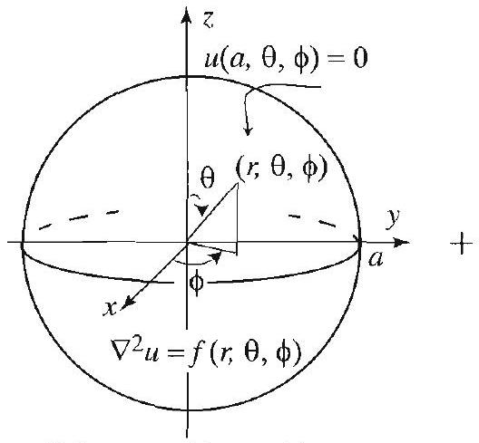
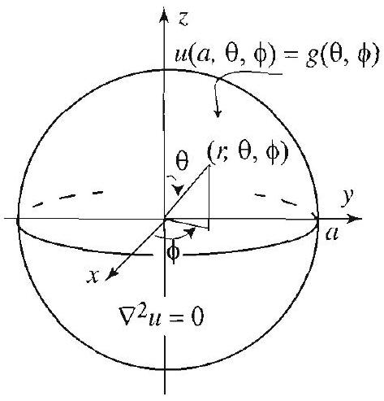

Right margin note (page 26)

$<\theta<$
eigen-
lower-
body
ertain

dary

pprob-

++++

artial Differential Equations in Spherical Coordinates

REM 3 ERIES NS OF TIONS BALL

Let $f(r, \theta, \phi)$ be a square integrable function, defined for $0<r<a, 0 \pi, 0<\phi<2 \pi$, and $2 \pi$-periodic in $\phi$. Then we have
$$
f(r, \theta, \phi)=\sum_{j=1}^{\infty} \sum_{n=0}^{\infty} \sum_{m=-n}^{n} A_{j n m} j_{n}\left(\lambda_{n, j} r\right) Y_{n, m}(\theta, \phi),
$$
where
$$
\begin{array}{l}
A_{j n m}=\frac{2}{a^{3} j_{n+1}^{2}\left(\alpha_{n+\frac{1}{2}, j}\right)} \\
\quad \times \int_{0}^{a} \int_{0}^{2 \pi} \int_{0}^{\pi} f(r, \theta, \phi) j_{n}\left(\lambda_{n, j} r\right) \bar{Y}_{n, m}(\theta, \phi) r^{2} \sin \theta d \theta d \phi d r
\end{array}
$$

We are now ready to tackle boundary value problems using the function expansions method. For motivation, you should review the dimensional problems that are treated in Sections 3.9 and 4.6.

Poisson's Equation in a Ball
The steady-state temperature distribution inside a spherically shaped with time independent heat source, given that the surface is kept at a c temperature distribution is modeled by Poisson's equation
$$
\nabla^{2} u(r, \theta, \phi)=f(r, \theta, \phi),
$$
where $0<r<a, 0<\theta<\pi, 0<\phi<2 \pi$, along with the bour condition
$$
u(a, \theta, \phi)=g(\theta, \phi) .
$$
ition of a general Poisson problem.
As in the lower-dimensional cases, the first step is to reduce to two sut

---

<!-- Page 27 -->

Right margin note (page 27)

295

isson olem, with
exseries and
each
e get
on of
data, lius $a$ (21), nts in cients

++++

Section 5.4 The Helmholtz, Poisson, Heat, and Wave Equations
lems: a Dirichlet problem with boundary data given by (18), and a Po problem with zero boundary data (see Figure 1). For the Dirichlet prob you are referred to the previous section. Thus, it remains to solve (17) the homogeneous boundary condition
$$
u(a, \theta, \phi)=0
$$

In solving (17) and (19), we will use the method of eigenfunctio pansions. Accordingly, we start by assuming that the solution has a expansion in terms of the eigenfunctions of the Helmholtz problem (1) (2). Hence,
$$
u(r, \theta, \phi)=\sum_{j=1}^{\infty} \sum_{n=0}^{\infty} \sum_{m=-n}^{n} B_{j n m} j_{n}\left(\lambda_{n, j} r\right) Y_{n, m}(\theta, \phi)
$$

To determine $B_{j n m}$, we plug the triple series into (17), use the fact that term satisfies (1) with $k=\lambda_{n, j}^{2}$, and get
$$
\sum_{j=1}^{\infty} \sum_{n=0}^{\infty} \sum_{m=-n}^{n}-\lambda_{n, j}^{2} B_{j n m} j_{n}\left(\lambda_{n, j} r\right) Y_{n, m}(\theta, \phi)=f(r, \theta, \phi) .
$$

Thinking of this last equation as an eigenfunction expansion of $f$, w from Theorem 3 that
$$
B_{j n m}=\frac{-1}{\lambda_{n, j}^{2}} A_{j n m}
$$
where $A_{j n m}$ is given by (16). This completely determines the soluti the Poisson problem. We summarize our findings as follows.

The solution of the Poisson problem (17)-(18) is
$$
u(r, \theta, \phi)=u_{1}(r, \theta, \phi)+u_{2}(r, \theta, \phi)
$$
where $u_{1}$ is the solution of the Poisson problem with zero boundary and $u_{2}$ is the solution of the Dirichlet problem inside the ball of rac with boundary condition (18). The function $u_{1}$ is given by (20) and and the function $u_{2}$ is given by Theorem 3, Section 5.3. (The coefficie the series solution (11), Section 5.3, are the spherical harmonics coeffi of the boundary function $g$.)

---

<!-- Page 28 -->

Left margin note (page 28)

296
Chapter 5 Partial Differ

Right margin note (page 28)

ndent 1 temat $0^{\circ}$ blems heat in the pordi-
$\phi)$, dition s , and nfunc-
. We
and $q$, icients

++++

ential Equations in Spherical Coordinates

A Nonhomogeneous Heat Problem
Our next example is a heat problem inside a ball with time indepe internal heat source (nonhomogeneous heat equation), given an initia perature distribution and given that the surface of the sphere is held temperature (homogeneous boundary condition). More general pro involving nonhomogeneous boundary conditions and time dependent sources can be solved by the same methods and will be developed exercises.

Consider the nonhomogeneous heat equation in spherical co nates
$$
\frac{\partial u}{\partial t}=c^{2}\left\{\frac{\partial^{2} u}{\partial r^{2}}+\frac{2}{r} \frac{\partial u}{\partial r}+\frac{1}{r^{2}}\left(\frac{\partial^{2} u}{\partial \theta^{2}}+\cot \theta \frac{\partial u}{\partial \theta}+\csc ^{2} \theta \frac{\partial^{2} u}{\partial \phi^{2}}\right)\right\}+q(r, \theta,
$$
where $0<r<a, 0<\theta<\pi, 0<\phi<2 \pi, t>0$, with boundary cond
$$
u(a, \theta, \phi, t)=0,
$$
and initial condition
$$
u(r, \theta, \phi, 0)=f(r, \theta, \phi)
$$

We solve this problem using the method of eigenfunction expansion hence start by assuming that $u$ has an expansion in terms of the eige tions of the Helmholtz problem (1)-(2). Thus
$$
u(r, \theta, \phi, t)=\sum_{j=1}^{\infty} \sum_{n=0}^{\infty} \sum_{m=-n}^{n} B_{j n m}(t) j_{n}\left(\lambda_{n, j} r\right) Y_{n, m}(\theta, \phi),
$$
where the coefficients $B_{j n m}(t)$ are functions of $t$, and $\lambda_{n, j}=\frac{\alpha_{n+1 / 2,}}{a}$ now expand $f$ and $q$ using Theorem 3 and obtain
$$
f(r, \theta, \phi)=\sum_{j=1}^{\infty} \sum_{n=0}^{\infty} \sum_{m=-n}^{n} f_{j n m} j_{n}\left(\lambda_{n, j} r\right) Y_{n, m}(\theta, \phi),
$$
and
$$
q(r, \theta, \phi)=\sum_{j=1}^{\infty} \sum_{n=0}^{\infty} \sum_{m=-n}^{n} q_{j n m} j_{n}\left(\lambda_{n, j} r\right) Y_{n, m}(\theta, \phi),
$$
where $f_{j n m}$ and $q_{j n m}$ are computed with the help of (16) by using $f$ respectively. To complete the solution, we must determine the coeff

---

<!-- Page 29 -->

Right margin note (page 29)

297

mple (25) is a and (29)
ation ients nel"

CO-
tion

++++

Section 5.4 The Helmholtz, Poisson, Heat, and Wave Equations
$B_{j n m}(t)$ in (25). As you will see, these turn out to be solutions of si first-order ordinary differential equations. Plug the expression of $u$ in into the heat equation (22). Use the fact that each term in the series solution of (1) with $k=\lambda_{n, j}^{2}$. Also use (27) and get
$$
\begin{array}{l}
\sum_{j=1}^{\infty} \sum_{n=0}^{\infty} \sum_{m=-n}^{n} B_{j n m}^{\prime}(t) j_{n}\left(\lambda_{n, j} r\right) Y_{n, m}(\theta, \phi) \\
\quad=\sum_{j=1}^{\infty} \sum_{n=0}^{\infty} \sum_{m=-n}^{n}\left(-\lambda_{n, j}^{2} c^{2} B_{j n m}(t)+q_{j n m}\right) j_{n}\left(\lambda_{n, j} r\right) Y_{n, m}(\theta, \phi)
\end{array}
$$

This yields the differential equation for $B_{j n m}(t)$,
$$
B_{j n m}^{\prime}(t)+\lambda_{n, j}^{2} c^{2} B_{j n m}(t)=q_{j n m}
$$

The initial condition for this equation is obtained by using (24), (25), (26), thus implying
$$
B_{j n m}(0)=f_{j n m}
$$

As you can check directly, the solution of the initial value problem (28)is
$$
B_{j n m}(t)=e^{-\lambda_{n, j}^{2} c^{2} t}\left(f_{j n m}-\frac{q_{j n m}}{c^{2} \lambda_{n, j}^{2}}\right)+\frac{q_{j n m}}{c^{2} \lambda_{n, j}^{2}}
$$

This determines the unknown coefficients in (25) and completes the solu of the heat problem. Note that the final answer involves the coeffic of the eigenfunction expansions of $f$ and $q$ and the familiar "heat ket $e^{-\lambda_{n, j}^{2} c^{2} t}$.

Wave Equation in a Ball
In our final application, we consider the wave equation in spherica ordinates
$$
\frac{\partial^{2} u}{\partial t^{2}}=c^{2}\left\{\frac{\partial^{2} u}{\partial r^{2}}+\frac{2}{r} \frac{\partial u}{\partial r}+\frac{1}{r^{2}}\left(\frac{\partial^{2} u}{\partial \theta^{2}}+\cot \theta \frac{\partial u}{\partial \theta}+\csc ^{2} \theta \frac{\partial^{2} u}{\partial \phi^{2}}\right)\right\}
$$
where $0<r<a, 0<\theta<\pi, 0<\phi<2 \pi, t>0$, with boundary condi
$$
u(a, \theta, \phi, t)=0
$$
and initial conditions
$$
u(r, \theta, \phi, 0)=f(r, \theta, \phi), \quad u_{t}(r, \theta, \phi, 0)=g(r, \theta, \phi)
$$

---

<!-- Page 30 -->

Left margin note (page 30)

298
Chapter 5 Partial Differ

THEOREM 5
WAVE EQUATION IN A BALL

Right margin note (page 30)

d and of the
heat
herical
xercise
(14).
ate the
$r)=0$

++++

ential Equations in Spherical Coordinates

To solve this problem, we use the eigenfunction expansions metho assume that the solution $u$ is a series in terms of the eigenfunctions Helmholtz problem (1)-(2). We obtain the following solution.

The solution of wave boundary value problem (31)-(33) is
$$
\begin{array}{c}
u(r, \theta, \phi, t)=\sum_{j=1}^{\infty} \sum_{n=0}^{\infty} \sum_{m=-n}^{n} j_{n}\left(\lambda_{n, j} r\right) Y_{n, m}(\theta, \phi) \\
\times\left(C_{j n m} \cos c \lambda_{n, j} t+D_{j n m} \sin c \lambda_{n, j} t\right)
\end{array}
$$
where
$$
\begin{array}{r}
C_{j n m}=\frac{2}{a^{3} j_{n+1}^{2}\left(\alpha_{n+\frac{1}{2}, j}\right)} \int_{0}^{a} \int_{0}^{2 \pi} \int_{0}^{\pi} f(r, \theta, \phi) j_{n}\left(\lambda_{n, j} r\right) \\
\times \bar{Y}_{n, m}(\theta, \phi) r^{2} \sin \theta d \theta d \phi d r
\end{array}
$$
and
$$
\begin{aligned}
D_{j n m}=\frac{2}{c \lambda_{n j} a^{3} j_{n+1}^{2}\left(\alpha_{n+\frac{1}{2}, j}\right)} & \int_{0}^{a} \int_{0}^{2 \pi} \int_{0}^{\pi} g(r, \theta, \phi) j_{n}\left(\lambda_{n, j} r\right) \\
& \times \bar{Y}_{n, m}(\theta, \phi) r^{2} \sin \theta d \theta d \phi d r
\end{aligned}
$$

The interesting details of the derivation are very similar to those of th equation and are left to the exercises.

Exercises 5.4
1. Derive (4) and (5) from (1) and (2).
2. Use the explicit formulas for the spherical Bessel functions and the sp harmonics to verify (13) and (14) when $j=1, n=0,1$, and $m=-1,0,1$.
3. (a) Use the orthogonality properties of the spherical Bessel functions (E 45, Section 4.8) and the spherical harmonics (Section 5.3) to prove (13) and (b) Use Theorem 2 to justify (16).
4. What does Theorem 3 reduce to if $f$ depends only on $r$ ?
5. Define a function inside the unit ball by $f(r)=1$ for $0<r<1$. Compt series expansion (15) for $f$.
6. Define a function inside the unit ball by $f(r)=1$ if $0<r<1 / 2$ and $f($ if $1 / 2<r<1$. Compute the series expansion (15) for $f$.

---

<!-- Page 31 -->

Right margin note (page 31)

299
series
series
$$
=0 .
$$
and
urce.
$\phi, t)$.
w the
Solve
subdition See,
$$
a=1
$$

Take
many ms of ature
th the ion is
$$
q=
$$

++++

Section 5.4 The Helmholtz, Poisson, Heat, and Wave Equations
7. Define a function inside the unit ball by $f(r)=r^{2}$. Compute the expansion (15) for $f$.
8. Define a function inside the unit ball by $f(r, \phi)=r^{2} \phi$. Compute the expansion (15) for $f$.
9. Solve the Poisson problem (17), (19) inside the unit ball with $f=1$, and
10. Solve the Poisson problem (17), (18) inside the unit ball with $f= g=\frac{1}{2 \pi} \phi$.
11. Derive (29), then solve (28)-(29) to get (30).
12. What is the solution of the heat problem (22)-(24) if $q=0$ ?
13. Project Problem: A problem with time-dependent heat so Solve the heat problem (22)-(24) with a time-dependent heat source $q(r, \theta$, [Hint: Modify the solution of (22)-(24) as follows. In (27), you should allo coefficients $q_{j m n}$ to depend on $t$. In (28), the right side depends on $t$. (28)-(29) as in Exercise 18(c), Section 3.9.]
14. A nonhomogeneous heat problem. Solve the heat equation (22) ject to the initial condition (24), and the nonhomogeneous boundary cond $u(a, \theta, \phi, t)=g(\theta, \phi)$. [Hint: Decompose the problem into two subproblems. for example, Exercise 17, Section 4.4.]
15. A heat problem with symmetry. A solid ball at $30^{\circ} \mathrm{C}$ with radius is placed in a refrigerator that maintains a constant temperature of $0^{\circ} \mathrm{C}$. (a) $c=1$ and determine the temperature $u(r, \theta, \phi, t)$ inside the ball.
(b) The function
$$
\theta_{4}(u, q)=1+2 \sum_{n=1}^{\infty}(-1)^{n} q^{n^{2}} \cos 2 n u
$$
is called an elliptic theta function. This type of function is built into computer systems. Express the temperature of the center in part (a) in ter $\theta_{4}$, then plot the temperature for $t>0$.
(c) Use your graph in (b) to determine how long it will take for the temper at the center to drop to $10^{\circ} \mathrm{C}$.
16. (a) Solve the heat problem in the ball of radius 1 with $c=1$, given the surface temperature is kept at $0^{\circ}$ and that the initial temperature distribut $f(r, \theta, \phi)=r^{2}$. Assume that there is no internal source of heat.
(b) Plot the temperature of the center for $t>0$.
17. (a) Solve the heat problem (22)-(24) inside the unit ball. Take $c=1 20 r^{2}$, and $f(r, \theta, \phi)=100$.
(b) Plot the temperature of the center for $t>0$.
18. Project Problem: The wave equation in a ball. Derive (34)-(36)

---

<!-- Page 32 -->

Left margin note (page 32)

300
Chapter 5
P
5.5 Legendr

A through review methods that are this section is pres Appendixes A. 4 These sections are recommended for who are not fami the power series m solving ordinary di equations.

Right margin note (page 32)

(13), ndre's of the
$(x)=$ radii at (1) nverge nd its 0 .
ead of have we get
tes $a_{3}$, series vers of

++++

artial Differential Equations in Spherical Coordinates

e's Differential Equation
of the used in sented in and A.5. strongly readers liar with ethod for fferential

Legendre's differential equation
$$
\left(1-x^{2}\right) y^{\prime \prime}-2 x y^{\prime}+\mu y=0, \quad-1<x<1,
$$
arose when solving Laplace's equation in spherical coordinates (see Section 5.1). It is thus a very important differential equation. Lege differential equation is really a family of equations, one for each value parameter $\mu$. Upon dividing by $\left(1-x^{2}\right)$, the equation becomes
$$
y^{\prime \prime}-\frac{2 x}{1-x^{2}} y^{\prime}+\frac{\mu}{1-x^{2}} y=0 .
$$

Using the geometric series expansion, we can verify that the functions 7 $-\frac{2 x}{1-x^{2}}$ and $q(x)=\frac{\mu}{1-x^{2}}$ have power series expansions about 0 with botl of convergence equal to 1. It follows from Theorem 1, Appendix A.5, th has two linearly independent solutions given by power series that cor for $|x|<1$. To find these solutions we substitute $y=\sum_{m=0}^{\infty} a_{m} x^{m}$ a derivatives into (1) and get
$$
\left(1-x^{2}\right) \sum_{m=2}^{\infty} m(m-1) a_{m} x^{m-2}-2 x \sum_{m=1}^{\infty} m a_{m} x^{m-1}+\mu \sum_{m=0}^{\infty} a_{m} x^{m}=
$$

Expanding and reindexing gives
$$
\begin{array}{r}
\sum_{m=0}^{\infty}(m+2)(m+1) a_{m+2} x^{m}-\sum_{m=0}^{\infty} m(m-1) a_{m} x^{m} \\
-\sum_{m=0}^{\infty} 2 m a_{m} x^{m}+\sum_{m=0}^{\infty} \mu a_{m} x^{m}=0
\end{array}
$$

Note that we have started the second and third series at $m=0$ inst $m=2$ and $m=1$. This makes no difference, since the added term, value 0 . Combining the series and setting the coefficients equal to 0 , the two-step recurrence relation
$$
(m+2)(m+1) a_{m+2}-[m(m+1)-\mu] a_{m}=0,
$$
or
$$
a_{m+2}=\frac{m(m+1)-\mu}{(m+2)(m+1)} a_{m} .
$$

Thus $a_{0}$ determines $a_{2}$, which determines $a_{4}, a_{6}, \ldots$, and $a_{1}$ determir which determines $a_{5}, a_{7}, \ldots$. Using these coefficients, we get the two solutions, known as Legendre functions, one consisting of even pov $x$ only and the other consisting of odd powers of $x$ only.

---

<!-- Page 33 -->

Left margin note (page 33)

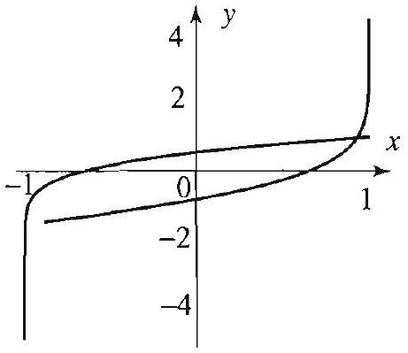

Figure 1 Legendre functions with $\mu=3 / 4$.

Right margin note (page 33)

301

ation ne of the the er $\mu$, nzero ents, gence the one and hs of up at n the case
6)

++++

Section 5.5 Legendre's Differential Equation

Legendre Polynomials
If $\mu$ is a nonnegative integer of the form $n(n+1)$, then the recurrence rel shows that $a_{n+2}=0$, implying that $a_{n+4}=a_{n+6}=\cdots=0$. Thus o the Legendre functions in this case is a polynomial of degree $n$, whil other one is an infinite series that converges but is not bounded or interval $(-1,1)$ (see Exercise 25). For all other values of the paramet the Legendre functions are both infinite series with infinitely many no terms. Using the ratio test and the recurrence formula for the coeffici we can show that these infinite series solutions have radius of conver equal to 1 (Exercise 21). Moreover, it can be shown that, except fo polynomial solutions of (1), any Legendre function is not bounded a or both of the endpoints $x= \pm 1$ (see N. N. Lebedev, Special Function Their Applications, Dover Publications, 1972). Figure 1 shows the grap two Legendre functions when $\mu=\frac{3}{4}$. Note how each function blows one endpoint of $[-1,1]$. Since for practical reasons we are interested i bounded solutions of (1), from here on we will restrict our study to the
$$
\mu=n(n+1), \quad n=0,1,2, \ldots .
$$

The recurrence relation becomes
$$
a_{m+2}=-\frac{(n-m)(n+m+1)}{(m+2)(m+1)} a_{m},
$$
from which we get
$$
\begin{array}{cc}
a_{2}=-\frac{n(n+1)}{2!} a_{0} & a_{3}=-\frac{(n-1)(n+2)}{3!} a_{1} \\
a_{4}=\frac{(n-2) n(n+1)(n+3)}{4!} a_{0} & a_{5}=\frac{(n-3)(n-1)(n+2)(n+4)}{5!} a_{1} \\
a_{6}=-\frac{(n-4)(n-2) n(n+1)(n+3)(n+5)}{6!} a_{0} & \\
a_{7}=-\frac{(n-5)(n-3)(n-1)(n+2)(n+4)(n+}{7!} &
\end{array}
$$

Hence, the general solution of (1) is
$$
y(x)=a_{0} y_{1}(x)+a_{1} y_{2}(x)
$$
where
$$
\begin{aligned}
y_{1}(x) & =1-\frac{n(n+1)}{2!} x^{2}+\frac{(n-2) n(n+1)(n+3)}{4!} x^{4} \\
& -\frac{(n-4)(n-2) n(n+1)(n+3)(n+5)}{6!} x^{6}+\cdots
\end{aligned}
$$

---

<!-- Page 34 -->

Left margin note (page 34)

302
Chapter 5
Partial Differ

Right margin note (page 34)

$x^{5}$
hence
gree $n$
f odd

It is
relaterms

++++

ential Equations in Spherical Coordinates
and
$$
\begin{aligned}
y_{2}(x) & =x-\frac{(n-1)(n+2)}{3!} x^{3}+\frac{(n-3)(n-1)(n+2)(n+4)}{5!} \\
& -\frac{(n-5)(n-3)(n-1)(n+2)(n+4)(n+6)}{7!} x^{7}+\cdots
\end{aligned}
$$

If $n$ is an even integer, then, from (2), we have that $a_{n+2}=0$, and $a_{n+4}=a_{n+6}=\cdots=0$. Thus (3) reduces to a polynomial of even de containing only even powers of $x$ :
$$
y_{1}=a_{0}+a_{2} x^{2}+\cdots+a_{n} x^{n} \quad(n \text { even }) .
$$

Similarly, if $n$ is an odd integer, then (4) reduces to a polynomial degree $n$ containing only odd powers of $x$ :
$$
y_{2}=a_{1} x+a_{3} x^{3}+\cdots+a_{n} x^{n} \quad(n \text { odd }) .
$$

Thus far the solutions are determined up to an arbitrary constant. customary to normalize the polynomial solution by taking
$$
a_{n}=\frac{(2 n)!}{2^{n}(n!)^{2}} .
$$

To compute the remaining coefficients we need a backward recurrence tion that takes us from $a_{m}$ to $a_{m-2}$. For that purpose, express $a_{m}$ in of $a_{m+2}$ in (2), and then replace $m$ by $m-2$ to get
$$
a_{m-2}=-\frac{m(m-1)}{(n-m+2)(n+m-1)} a_{m} .
$$

We compute $a_{n-2}$ from $a_{n}$ using (7) and (8):
$$
a_{n-2}=-\frac{n(n-1)}{2(2 n-1)} a_{n}=-\frac{n(n-1)}{2(2 n-1)} \frac{(2 n)!}{2^{n}(n!)^{2}}=-\frac{(2 n-2)!}{2^{n}(n-1)!(n-2)}
$$

Similarly,
$$
a_{n-4}=-\frac{(n-2)(n-3)}{4(2 n-3)} a_{n-2}=\frac{(2 n-4)!}{2^{n} 2!(n-2)!(n-4)!},
$$
and in general for $2 m \leq n$, we have
$$
a_{n-2 m}=(-1)^{m} \frac{(2 n-2 m)!}{2^{n} m!(n-m)!(n-2 m)!} .
$$

---

<!-- Page 35 -->

Left margin note (page 35)

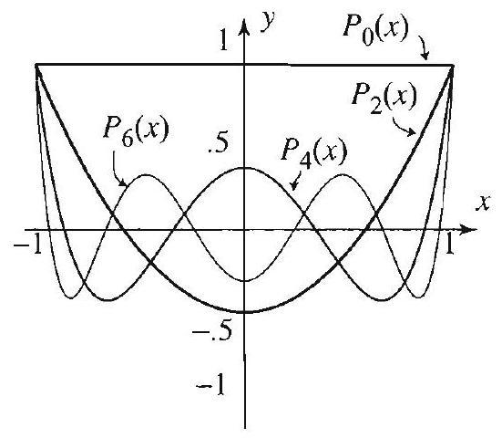

Figure 2 Legendre polynomials.

Right margin note (page 35)

303

oly$n$ is
$$
-35 x)
$$

$x$
One
eries
the
on of
gen-
<1
den-
t $P_{n}$

++++

Section 5.5 Legendre's Differential Equation

With these coefficients the polynomial solution is called the Legendre p nomial of degree $n$ and is denoted by $P_{n}(x)$. Setting $M=n / 2$ if even or $(n-1) / 2$ if $n$ is odd, the $n$th Legendre polynomial becomes
$$
P_{n}(x)=\frac{1}{2^{n}} \sum_{m=0}^{M}(-1)^{m} \frac{(2 n-2 m)!}{m!(n-m)!(n-2 m)!} x^{n-2 m} .
$$

The first few Legendre polynomials are (see Figure 2)
$$
\begin{array}{ll}
P_{0}(x)=1 & P_{1}(x)=x \\
P_{2}(x)=\frac{1}{2}\left(3 x^{2}-1\right) & P_{3}(x)=\frac{1}{2}\left(5 x^{3}-3 x\right) \\
P_{4}(x)=\frac{1}{8}\left(35 x^{4}-30 x^{2}+3\right) & P_{5}(x)=\frac{1}{8}\left(63 x^{5}-70 x^{3}+15 x\right) \\
P_{6}(x)=\frac{1}{16}\left(231 x^{6}-315 x^{4}+105 x^{2}-5\right) & P_{7}(x)=\frac{1}{16}\left(429 x^{7}-693 x^{5}+315 x\right.
\end{array}
$$

Summary and Further Properties
For $n=0,1,2, \ldots$, Legendre's equation of order $n$
$$
\left(1-x^{2}\right) y^{\prime \prime}-2 x y^{\prime}+n(n+1) y=0, \quad-1<x<1,
$$
has two linearly independent solutions $y_{1}$ and $y_{2}$ given by (3) and (4). of them is a polynomial of degree $n$ and the other one is an infinite s solution. If we normalize the polynomial solution by (7), we obtain Legendre polynomial of degree $n, P_{n}(x)$, given by (9). The other soluti (10), when suitably normalized, is denoted by $Q_{n}(x)$ and is called a Le dre function of the second kind. It converges on the interval $-1<x$ and is not bounded in $[-1,1]$ (see Exercises 23-27). Since $P_{n}$ is not tically 0 and bounded in $[-1,1]$ and $Q_{n}$ is not bounded, it follows tha

---

<!-- Page 36 -->

Left margin note (page 36)

304
Chapter 5 Partial Differ

FURTHER PROPERTIES OF

LEGENDRE POLYNOMIALS

Right margin note (page 36)

ndre's
plution ${ }_{3}(x)$ is
with (11) is d so it initial $x$, and lution. s, start
e Legproofs

++++

ential Equations in Spherical Coordinates
and $Q_{n}$ are linearly independent. Hence the general solution of Lege equation of order $n$ is
$$
y(x)=c_{1} P_{n}(x)+c_{2} Q_{n}(x),
$$
where $c_{1}$ and $c_{2}$ are arbitrary constants.

EXAMPLE 1 Solution of Legendre's differential equation Find the general solution of the differential equation
$$
\left(1-x^{2}\right) y^{\prime \prime}-2 x y^{\prime}+12 y=0 .
$$

Solution This is Legendre's equation with $n=3$. From (11) the general sc is $y(x)=c_{1} P_{3}(x)+c_{2} Q_{3}(x)$. Since $n$ is odd, the infinite series solution $Q$ thus given by (3), up to normalization. We have
$$
y=c_{1}\left(\frac{1}{2}\left[5 x^{3}-3 x\right]\right)+c_{2}\left(1-6 x^{2}+3 x^{4}+\frac{4}{5} x^{6}-\cdots\right) .
$$

EXAMPLE 2 An initial value problem
Without deriving the solution, determine whether the initial value problem
$$
\left(1-x^{2}\right) y^{\prime \prime}-2 x y^{\prime}+6 y=0 ; \quad y(0)=1, y^{\prime}(0)=1,
$$
has a bounded solution in the interval $[-1,1]$.
Solution We recognize the differential equation as a Legendre's equatio $n=2$. The only way to get a bounded solution from the general solution to take $c_{2}=0$. In this case, the solution is a constant multiple of $P_{2}(x)$, an is of the form $y_{1}(x)=c_{1} P_{2}(x)=a_{0}+a_{2} x^{2}$. It is easy to see that the second condition cannot be satisfied by any polynomial of this form, since $y_{1}^{\prime}=2 a_{2}$ so $y_{1}^{\prime}(0)=0$. Hence the initial value problem does not have a bounded so The solution must be an infinite series. To find the coefficients of this series with $a_{0}=1$ and $a_{1}=1$, and generate the rest using (2) with $n=2$.

The graphs in Figure 2 illustrate many interesting properties of th endre polynomials. We list some of them for ease of reference. Their are left as exercises or provided in the next section.
$P_{n}$ is even if $n$ is even and odd if $n$ is odd. $P_{n}(1)=1$ and $P_{n}(-1)=(-1)^{n}$ for all $n$. $\left|P_{n}(x)\right| \leq 1$ for all $n$ and all $x$ in $[-1,1]$. $P_{n}(x)$ has $n$ distinct zeros in $[-1,1]$. All relative maxima and minima of $P_{n}$ occur in $[-1,1]$.

---

<!-- Page 37 -->

Right margin note (page 37)

305
yno-
ential
c) $d x$.
Write
er.
has a

ns of

tion) r the 1.

++++

Section 5.5 Legendre's Differential Equation

In a sense, these properties say that the interesting behavior of the pol mials $P_{n}$ occurs in the interval $[-1,1]$.

Exercises 5.5
1. Use (9) to derive (a) $P_{0}(x), P_{1}(x), P_{2}(x)$;
(b) $P_{3}(x), P_{4}(x)$
2. Use (9) to prove the following: (a) establish (12);
(b) $P_{2 n}(0)=(-1)^{n} \frac{(2 n)!}{2^{2 n}(n!)^{2}}$, and $P_{2 n+1}(0)=0$;
(c) $P_{2 n}^{\prime}(0)=0$, and $P_{2 n+1}^{\prime}(0)=(2 n+1) P_{2 n}(0)$.
3. Use Exercise 2(b) to obtain the following useful identity for $n=0,1,2, \ldots$
$$
P_{2 n}(0)-P_{2 n+2}(0)=(-1)^{n} \frac{(2 n)!(4 n+3)}{2^{2 n+1}(n!)^{2}(n+1)} .
$$
4. Verify the following assertions for the first three Legendre polynomials.
(a) The Legendre polynomial of degree $n$ is a solution of Legendre's differe equation of order $n$.
(b) $P_{n}(1)=1, P_{n}(-1)=(-1)^{n}$.

Evaluate the following integrals.
5. $\int_{-1}^{1} P_{3}(x) d x$.
6. $\int_{-1}^{1} P_{2}(x) P_{3}(x) d x$.
7. $\int_{0}^{1} P_{2}(x) d x$.
8. $\int_{-1}^{1} P_{2}^{2}(x$

In Exercises 9-12, find the general solution of the given differential equation. down at least two terms from the series expansions of each part of your answ
9. $\left(1-x^{2}\right) y^{\prime \prime}-2 x y^{\prime}+30 y=0$.
10. $\left(1-x^{2}\right) y^{\prime \prime}-2 x y^{\prime}+42 y=0$.
11. $\left(1-x^{2}\right) y^{\prime \prime}-2 x y^{\prime}=0$.
12. $y^{\prime \prime}-\frac{2 x}{\left(1-x^{2}\right)} y^{\prime}+\frac{6}{\left(1-x^{2}\right)} y=0$.

In Exercises 13-16, without solving, decide whether the initial value problem bounded solution in $[-1,1]$. Find the solution if it is bounded.
13. $\left(1-x^{2}\right) y^{\prime \prime}-2 x y^{\prime}+6 y=0 ; y(0)=0, y^{\prime}(0)=1$.
14. $\left(1-x^{2}\right) y^{\prime \prime}-2 x y^{\prime}+56 y=0 ; y(0)=0, y^{\prime}(0)=1$.
15. $\left(1-x^{2}\right) y^{\prime \prime}-2 x y^{\prime}+56 y=0 ; y(0)=1, y^{\prime}(0)=0$.
16. $\left(1-x^{2}\right) y^{\prime \prime}-2 x y^{\prime}+110 y=0 ; y(0)=1, y^{\prime}(0)=1$.

In Exercises 17-20, with the help of (2), determine the first four nonzero ter the series solution of the given initial value problem.
17. $\left(1-x^{2}\right) y^{\prime \prime}-2 x y^{\prime}+\frac{3}{4} y=0 ; y(0)=1, y^{\prime}(0)=1$.
18. $\left(1-x^{2}\right) y^{\prime \prime}-2 x y^{\prime}+2 y=0 ; y(0)=1, y^{\prime}(0)=0$.
19. $\left(1-x^{2}\right) y^{\prime \prime}-2 x y^{\prime}+3 y=0 ; y(0)=0, y^{\prime}(0)=1$.
20. $\left(1-x^{2}\right) y^{\prime \prime}-2 x y^{\prime}+2 y=0 ; y(0)=1, y^{\prime}(0)=1$.
21. Consider a Legendre function (solution of Legendre's differential equa that is not a polynomial. Use the ratio test and the recurrence formula fo coefficients to show that the radius of convergence of the Legendre function is

---

<!-- Page 38 -->

Left margin note (page 38)

306
Chapter 5
P

Figure 3 Legendre $Q_{2}(x)$ and $Q_{3}(x)$.

Right margin note (page 38)

cise 22 lowing owhere gendre e not for the 1; and 24. Show at der $n$.] $y$ is a mial of uation it is a Ne can re 3)

++++

artial Differential Equations in Spherical Coordinates

Project Problem: Legendre functions of the second kind. Do Exer and any one of 23 or 24 .
22. (a) Use the reduction of order formula (Appendix A.3) to derive the fol formula for the Legendre functions of the second kind:
$$
Q_{n}(x)=P_{n}(x) \int \frac{1}{\left[P_{n}(x)\right]^{2}\left(1-x^{2}\right)} d x \quad(n=0,1,2, \ldots)
$$
(The integral is defined up to an arbitrary constant.)
(b) Compute the Wronskian $W\left(P_{n}(x), Q_{n}(x)\right)$ and show that it vanishes $n$ on $-1<x<1$. Conclude that the two solutions are linearly independent.

Use the formula in Exercise 22 to derive the given expression for the Le function of the second kind.
23. $Q_{0}(x)=\frac{1}{2} \ln \left(\frac{1+x}{1-x}\right)$.
24. $Q_{1}(x)=-1+\frac{x}{2} \ln \left(\frac{1+x}{1-x}\right)$.
25. Project Problem: Legendre functions of the second kind an bounded. The purpose of this problem is to derive the following formula Legendre functions of the second kind: for $n=0,1,2, \ldots$,
$$
Q_{n}(x)=\frac{1}{2} P_{n}(x) \ln \left(\frac{1+x}{1-x}\right)+f_{n}(x),
$$
where $f_{n}(x)$ is a polynomial of degree $n-1$ for $n \geq 1$ and $f_{0}(x)=0$.
(a) Before we derive the formula, use it to show that $\left|Q_{n}(x)\right| \rightarrow \infty$ if $x \rightarrow \pm$ thus $Q_{n}(x)$ is not bounded in $[-1,1]$.
(b) Verify the formula for $n=0$ and 1 , using the results of Exercises 23 and
(c) For $n \geq 2$, let $u(x)=\frac{1}{2} \ln \left(\frac{1+x}{1-x}\right), v(x)=u(x) P_{n}(x)$, and $\alpha_{n}=n(n+1)$. that $\left(\left(1-x^{2}\right) u^{\prime}(x)\right)^{\prime}=0$; equivalently, $\left(1-x^{2}\right) u^{\prime \prime}(x)-2 x u^{\prime}(x)=0$.
(d) Plug $v(x)=u(x) P_{n}(x)$ into Legendre's equation of order $n$ and show the
$$
\left(1-x^{2}\right) v^{\prime \prime}-2 x v^{\prime}+\alpha_{n} v=2 P_{n}^{\prime}(x) .
$$

functions

[Hint: Use (c) and the fact that $P_{n}$ is a solution of Legendre's equation of or (e) Let $f_{n}(x)$ denote a particular solution of the differential equation
$$
\left(1-x^{2}\right) y^{\prime \prime}-2 x y^{\prime}+\alpha_{n} y=-2 P_{n}^{\prime}(x) .
$$

Show that $f_{n}$ can be chosen to be a polynomial of degree $n-1$. [Hint: If polynomial of degree $n-1$, then $\left(1-x^{2}\right) y^{\prime \prime}-2 x y^{\prime}+\alpha_{n} y$ is also a polyno degree $n-1$.]
(f) Use (d) and (e) to show that $v(x)+f_{n}(x)$ is a solution of Legendre's eo of order $n$.
(g) Show that $v(x)+f_{n}(x)$ is not bounded on $[-1,1]$ and conclude that second solution of Legendre's equation, which is independent of $P_{n}(x)$. take $Q_{n}(x)=v(x)+f_{n}(x)$.
26. Follow the steps in Exercise 25 and derive the Legendre function (Figu
$$
Q_{2}(x)=-\frac{3}{2} x+\frac{1}{4}\left(-1+3 x^{2}\right) \ln \left(\frac{1+x}{1-x}\right) .
$$

---

<!-- Page 39 -->

Right margin note (page 39)

307
3)
Iere $i$
many
f, see
).
ials.
omial
To
that

++++

Section 5.5 Legendre's Differential Equation
27. Follow the steps in Exercise 25 and derive the Legendre function (Figure
$$
Q_{3}(x)=\frac{1}{6}\left(4-15 x^{2}\right)+\frac{1}{4}\left(-3 x+5 x^{3}\right) \ln \left(\frac{1+x}{1-x}\right) .
$$

The formula
$$
P_{n}(x)=\frac{1}{\pi} \int_{0}^{\pi}\left(x+i \sqrt{1-x^{2}} \cos \theta\right)^{n} d \theta \quad(n=0,1,2, \ldots)
$$
is known as Laplace's integral formula for the Legendre polynomials. I denotes as usual the complex number such that $(i)^{2}=-1$. This formula has , interesting applications that we explore in the following exercises. For a proo [1], Section 10.5.
28. Derive the first three Legendre polynomials using (17).
29. (a) Show that for $|x| \leq 1$, we have
$$
\left|\left(x+i \sqrt{1-x^{2}} \cos \theta\right)^{n}\right| \leq 1 .
$$
[Hint: If $\alpha+i \beta$ is a complex number, then $|\alpha+i \beta|=\sqrt{\alpha^{2}+\beta^{2}}$.] (b) Use (17) and (a) to establish (14).
30. (a) Use (17) to establish (13).
(b) Use (17) and Exercise 42, Section 4.7 (Wallis's formulas) to compute $P_{n}($
31. Project Problem: Generating function for the Legendre polynom

Recall that if $\alpha$ is any real number and $k$ is a nonnegative integer, the $k$ th bind coefficient is
$$
\binom{\alpha}{k}=\frac{\alpha(\alpha-1)(\alpha-2) \ldots(\alpha-k+1)}{k!} \quad \text { for } k \geq 1
$$
and $\binom{\alpha}{0}=1$. With this notation, the binomial theorem asserts that
$$
(1+x)^{\alpha}=\sum_{k=0}^{\infty}\binom{\alpha}{k} x^{k}, \quad-1<x<1 .
$$
(a) Set $\alpha=-\frac{1}{2}$, and obtain that
$$
\frac{1}{\sqrt{1+v}}=\sum_{k=0}^{\infty}(-1)^{k} \frac{(2 k)!}{2^{2 k}(k!)^{2}} v^{k}, \quad|v|<1 .
$$
(b) Conclude that
$$
\frac{1}{\sqrt{1-2 x u+u^{2}}}=\sum_{n=0}^{\infty} P_{n}(x) u^{n}, \quad|x| \leq 1,|u|<1 .
$$

This is called the generating function for the Legendre polynomials prove it, set $v=-2 x u+u^{2}$ in (a), expand, and collect like powers of $u$. Note

---

<!-- Page 40 -->

Left margin note (page 40)

308
Chapter 5
P

Figure 4 Three ma
5.6 Legendr

RODRI
FOR

Right margin note (page 40)

given
id $m_{3}$, wton's sses is etween $|O Q|$. xpress $v$ that $m_{2}$ is le, this gendre series
polyomials efining
e have

++++

artial Differential Equations in Spherical Coordinates

since $\left|P_{n}(x)\right| \leq 1$ for $|x| \leq 1$ (Exercise 29), the series is convergent for all the values of $x$ and $u$.
31. A three-mass problem. Consider three masses in a plane $m_{1}, m_{2}$, an located at the points $O, P$, and $Q$, respectively (Figure 4). According to Ne law of gravitation, the magnitude of the attractive force between two ma inversely proportional to their distance. Thus the magnitude of the force b $m_{1}$ and $m_{3}$ is $F_{1}=\frac{G m_{1} m_{3}}{r^{2}}$, where $G$ is the gravitational constant and $r=$ The force between $m_{2}$ and $m_{3}$ has a similar expression in terms of $\rho$. To e this force as a function of $r$, use the law of cosines in a triangle to sho $\rho^{2}=1+r^{2}-2 r \cos \alpha$, and obtain
$$
F_{2}=\frac{G m_{2} m_{3}}{1+r^{2}-2 r \cos \alpha} .
$$

In terms of potential function for the mass $m_{2}$, we find that the potential of

sses.
$$
\frac{G m_{2}}{\rho}=\frac{G m_{2}}{\sqrt{1+r^{2}-2 r \cos \alpha}} .
$$

Replacing $r$ by $u$ and letting $\cos \alpha=x$, we see that, up to a constant multip potential is the generating function for the Legendre polynomials.
e Polynomials and Legendre Series Expansions
Our goal in this section is to establish the orthogonality of the Leg polynomials, and show how they can be used to expand functions in in terms of Legendre polynomials. We start with a useful formula.

GUES'
MULA

For $n=0,1,2, \ldots$, we have
$$
P_{n}(x)=\frac{1}{2^{n} n!} \frac{d^{n}}{d x^{n}}\left(x^{2}-1\right)^{n}
$$

This concise formula could be used as the definition of the Legendre nomials. It is apparent from this formula that the Legendre polyn are polynomials of degree $n$. Formulas of this type will be used in de other useful functions (see Section 5.7).

Proof Recall from Section 5.5 that
$$
P_{n}(x)=\frac{1}{2^{n}} \sum_{m=0}^{M}(-1)^{m} \frac{(2 n-2 m)!}{m!(n-m)!(n-2 m)!} x^{n-2 m}
$$
where $M=n / 2$ if $n$ is even or $(n-1) / 2$ if $n$ is odd. For each $0 \leq m \leq M$, w
$$
\frac{d^{n}}{d x^{n}} x^{2 n-2 m}=\frac{(2 n-2 m)!}{(n-2 m)!} x^{n-2 m},
$$
and for $M<m \leq n$, we have
$$
\frac{d^{n}}{d x^{n}} x^{2 n-2 m}=0 .
$$

---

<!-- Page 41 -->

Left margin note (page 41)

Binomial formula:
$$
\begin{array}{l}
(a+b)^{n} \\
=\sum_{m=0}^{n} \frac{n!}{m!(n-m)!} a^{n-m} b^{m}
\end{array}
$$

BONNET'S RECURRENCE RELATION

Right margin note (page 41)

309

tant

t to and $=x$, tion hen,
the odd if $n$

++++

Section 5.6 Legendre Polynomials and Legendre Series Expansions

So we can write (2) as
$$
P_{n}(x)=\frac{1}{2^{n} n!} \sum_{m=0}^{n}(-1)^{m} \frac{n!}{m!(n-m)!} \frac{d^{n}}{d x^{n}} x^{2 n-2 m},
$$
and because differentiation is a linear operation, we get
$$
P_{n}(x)=\frac{1}{2^{n} n!} \frac{d^{n}}{d x^{n}} \sum_{m=0}^{n}(-1)^{m} \frac{n!}{m!(n-m)!}\left(x^{2}\right)^{n-m}=\frac{1}{2^{n} n!} \frac{d^{n}}{d x^{n}}\left(x^{2}-1\right)^{n},
$$
where the last equality follows from the binomial formula.
A judicious use of Rodrigues' formula yields the following impor identity which relates different Legendre polynomials.

For $n=1,2, \ldots$ we have
$$
(n+1) P_{n+1}(x)+n P_{n-1}(x)=(2 n+1) x P_{n}(x) .
$$

Bonnet's relation has several applications. For example, we can use i generate as many Legendre polynomials as we wish by just knowing $P_{0} P_{1}$. (See Exercise 1.) The following related formula is also useful:
$$
P_{n+1}^{\prime}(x)=P_{n-1}^{\prime}(x)+(2 n+1) P_{n}(x) .
$$

The proofs of (3) and (4) are presented in the appendix to this section.

EXAMPLE 1 An application of Bonnet's relation
Show that for all $n=0,1,2, \ldots$, we have
(a) $P_{n}(1)=1$;
(b) $P_{n}(-1)=(-1)^{n}$.

Solution (a) We use a two-step induction. Recall that $P_{0}(x)=1$ and $P_{1}(x)$ and so the assertion is clear for $n=0$ and $n=1$. Now assume that the asser is true for $(n-1)$ and $n$; that is, assume that $P_{n-1}(1)=1$ and $P_{n}(1)=1$. T Bonnet's recurrence relation gives
$$
(n+1) P_{n+1}(1)+n P_{n-1}(1)=(2 n+1) P_{n}(1) .
$$

Using our inductive hypothesis and simplifying, we get, $P_{n+1}(1)=1$. assertion is true for $n=0$ and $n=1$, by induction, it is true for all $n$.

To prove (b), we recall that $P_{n}(x)$ is an even function when $n$ is even, and when $n$ is odd. Thus $P_{n}(-1)=P_{n}(1)=1$ if $n$ is even, $P_{n}(-1)=-P_{n}(1)=-1$ is odd. Equivalently, $P_{n}(-1)=(-1)^{n}$.

---

<!-- Page 42 -->

Left margin note (page 42)

310
Chapter 5 Partial Differ

THEOREM 1 ORTHOGONALITY OF LEGENDRE POLYNOMIALS

You should compare this proof with that of the orthogonality of Bessel functions and note the use of the special form of the differential equations in both cases.

Right margin note (page 42)

s. As ory of count
$n$ and
dding

++++

ential Equations in Spherical Coordinates
Orthogonality of Legendre Polynomials
We can now establish the orthogonality of the Legendre polynomial with Bessel functions, this property is a consequence of a general the Sturm and Liouville (Chapter 6). We present here an independent ac to illustrate further the general theory.
(i) If $m \neq n$, then
$$
\int_{-1}^{1} P_{m}(x) P_{n}(x) d x=0
$$
(ii) For each $n$, we have
$$
\int_{-1}^{1} P_{n}^{2}(x) d x=\frac{2}{2 n+1}
$$

In particular, taking $m=0$ in (i), we obtain
$$
\int_{-1}^{1} P_{n}(x) d x=0, \quad \text { for all } n \neq 0
$$

Proof (i) Consider Legendre's differential equation
$$
\left(1-x^{2}\right) y^{\prime \prime}-2 x y^{\prime}+\lambda(\lambda+1) y=0
$$
and rewrite it as
$$
\left[\left(1-x^{2}\right) y^{\prime}\right]^{\prime}=-\lambda(\lambda+1) y .
$$

Since $P_{m}$ and $P_{n}$ are solutions of this differential equation with $\lambda= \lambda=n$, respectively, we obtain
$$
\begin{aligned}
-\lambda_{m} P_{m} & =\left[\left(1-x^{2}\right) P_{m}^{\prime}\right]^{\prime}, \\
-\lambda_{n} P_{n} & =\left[\left(1-x^{2}\right) P_{n}^{\prime}\right]^{\prime},
\end{aligned}
$$
where $\lambda_{m}=m(m+1)$,
where $\lambda_{n}=n(n+1)$.
Multiplying the first equation by $-P_{n}$ and the second by $P_{m}$ and gives
$$
\begin{aligned}
\left(\lambda_{m}-\lambda_{n}\right) P_{m} P_{n} & =-\left[\left(1-x^{2}\right) P_{m}^{\prime}\right]^{\prime} P_{n}+\left[\left(1-x^{2}\right) P_{n}^{\prime}\right]^{\prime} P_{m} \\
& =\frac{d}{d x}\left[\left(1-x^{2}\right)\left(P_{m} P_{n}^{\prime}-P_{m}^{\prime} P_{n}\right)\right] .
\end{aligned}
$$

Hence,
$$
\begin{array}{l}
\left(\lambda_{m}-\lambda_{n}\right) \int_{-1}^{1} P_{m}(x) P_{n}(x) d x \\
\quad=\left[\left.\left(1-x^{2}\left(P_{m}(x) P_{n}^{\prime}(x)-P_{m}^{\prime}(x) P_{n}(x)\right)\right]\right|_{x=-1} ^{x=1}=0,\right.
\end{array}
$$

---

<!-- Page 43 -->

Right margin note (page 43)

311

and we
tions

++++

Section 5.6 Legendre Polynomials and Legendre Series Expansions

and since $\lambda_{m} \neq \lambda_{n}$, (i) follows.
(ii) Bonnet's recurrence relations for $n$ and $n-1$ give
$$
(n+1) P_{n+1}+n P_{n-1}=(2 n+1) x P_{n}
$$
and
$$
n P_{n}+(n-1) P_{n-2}=(2 n-1) x P_{n-1} .
$$

We multiply the first equation by $P_{n-1}$ and the second equation by $P_{n}$ then integrate the resulting equations from $x=-1$ to $x=1$. Using (i) get
$$
n \int_{-1}^{1} P_{n-1}^{2}(x) d x=(2 n+1) \int_{-1}^{1} x P_{n}(x) P_{n-1}(x) d x
$$
and
$$
n \int_{-1}^{1} P_{n}^{2}(x) d x=(2 n-1) \int_{-1}^{1} x P_{n-1}(x) P_{n}(x) d x .
$$

Comparing the right sides of these equations, we get
$$
(2 n+1) \int_{-1}^{1} P_{n}^{2}(x) d x=(2 n-1) \int_{-1}^{1} P_{n-1}^{2}(x) d x
$$
equivalently,
$$
\int_{-1}^{1} P_{n}^{2}(x) d x=\frac{2 n-1}{2 n+1} \int_{-1}^{1} P_{n-1}^{2}(x) d x
$$

Now recall that $P_{0}(x)=1$, and so $\int_{-1}^{1} P_{0}^{2}(x) d x=2$. Repeated applica of (5) give
$$
\int_{-1}^{1} P_{1}^{2}(x) d x=\frac{(2-1)}{(2+1)} 2=\frac{2}{3} ; \quad \int_{-1}^{1} P_{2}^{2}(x) d x=\frac{(4-1)}{(4+1)} \frac{2}{3}=\frac{2}{5} ;
$$
and so on. A simple induction argument completes the proof of (ii).

---

<!-- Page 44 -->

Left margin note (page 44)

312
Chapter 5
Partial Differ

THEOREM 2
LEGENDRE SERIES

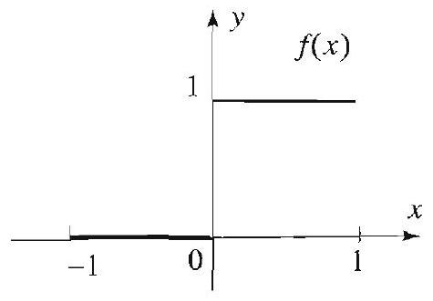

Figure 1 Function in Example 2.

Right margin note (page 44)

and a
ed the asked have icient. ose for refer
$x \leq 1$.
$f(x)$ if
tion in
l sums partial
te that und in

++++

ential Equations in Spherical Coordinates

Legendre Series
The orthogonality of the Legendre polynomials can be used to exp given function $f$ in series of the form
$$
f(x)=\sum_{j=0}^{\infty} A_{j} P_{j}(x),
$$
called the Legendre series expansion of $f$. The coefficient $A_{j}$ is call $j$ th Legendre coefficient of $f$. The following theorem, which you are to apply in the exercises, gives sufficient conditions for a function t a Legendre series and provides a formula for the $j$ th Legendre coeff Note the similarity between the hypotheses of this theorem and the Fourier and Bessel expansions. For the definition of piecewise smooth to Section 2.2.

Suppose that $f$ is a piecewise smooth function on the interval $-1 \leq$ Then $f$ has the Legendre series expansion
$$
f(x)=\sum_{j=0}^{\infty} A_{j} P_{j}(x),
$$
where
$$
A_{j}=\frac{2 j+1}{2} \int_{-1}^{1} f(x) P_{j}(x) d x
$$

For $x$ in the (open) interval $(-1,1)$, the Legendre series converges to $f$ is continuous at $x$, and to $(f(x+)+f(x-)) / 2$ otherwise.

EXAMPLE 2 A Legendre series
(a) Find the first eight Legendre coefficients $A_{0}, A_{1}, \ldots, A_{7}$ of the func Figure 1:
$$
f(x)=\left\{\begin{array}{ll}
0 & \text { if }-1 \leq x<0, \\
1 & \text { if } 0 \leq x \leq 1 .
\end{array}\right.
$$
(b) On the same coordinate axes, sketch the graphs of $f$ and the partia $s_{n}(x)=\sum_{j=0}^{n} A_{j} P_{j}(x)$ for $n=0,1,3,7$. Describe the behavior of the sums over the interval $[-1,1]$.

Solution (a) We use (7) to compute the Legendre coefficients and no $\int_{-1}^{1} f(x) P_{j}(x) d x=\int_{0}^{1} P_{j}(x) d x$. Using the list of Legendre polynomials fo

---

<!-- Page 45 -->

Right margin note (page 45)

313

with

2048

As gets ive $y$ of the and

++++

Section 5.6 Legendre Polynomials and Legendre Series Expansions

Section 5.5, we get
$$
\begin{array}{l}
A_{0}=\frac{1}{2} \int_{0}^{1} P_{0}(x) d x=\frac{1}{2} \int_{0}^{1} 1 d x=\frac{1}{2} \\
A_{1}=\frac{3}{2} \int_{0}^{1} P_{1}(x) d x=\frac{3}{2} \int_{0}^{1} x d x=\frac{3}{4} \\
A_{2}=\frac{5}{2} \int_{0}^{1} P_{2}(x) d x=\frac{5}{2} \int_{0}^{1} \frac{3 x^{2}-1}{2} d x=0 \\
A_{3}=\frac{7}{2} \int_{0}^{1} P_{3}(x) d x=\frac{7}{2} \int_{0}^{1} \frac{5 x^{3}-3 x}{2} d x=-\frac{7}{16}
\end{array}
$$

In a similar way we get
$$
A_{4}=0, \quad A_{5}=\frac{11}{32}, \quad A_{6}=0, \quad \text { and } \quad A_{7}=-\frac{75}{256} .
$$
(b) Using the coefficients we obtained in part (a) and simplifying (preferably a computer system), we get
$$
\begin{array}{l}
s_{0}(x)=A_{0}=\frac{1}{2} \\
s_{1}(x)=A_{0}+A_{1} P_{1}(x)=\frac{1}{2}+\frac{3}{4} x, \\
s_{2}(x)=s_{1}(x), \\
s_{3}(x)=\sum_{j=0}^{3} A_{j} P_{j}(x)=\frac{-35 x^{3}+45 x+16}{32}, \\
s_{4}(x)=s_{3}(x), \\
s_{5}(x)=\sum_{j=0}^{5} A_{j} P_{j}(x)=\frac{693 x^{5}-1050 x^{3}+525 x+128}{256}, \\
s_{6}(x)=s_{5}(x), \\
s_{7}(x)=\sum_{j=0}^{7} A_{j} P_{j}(x)=\frac{-32,175 x^{7}+63,063 x^{5}-40,425 x^{3}+11,025 x+2}{4096}
\end{array}
$$

The graphs of $f$ together with these partial sums are shown in Figure 2. the number of terms in a partial sum increases, the graph of the partial sum closer to the graph of $f$. Note that all the graphs of the partial sums ha intercept $\frac{1}{2}$. This confirms the assertion of Theorem 2 concerning the limit Legendre series at points of discontinuity, since 0 is a point of discontinuit, $(f(0+)+f(0-)) / 2=\frac{1}{2}$.

---

<!-- Page 46 -->

Left margin note (page 46)

314
Chapter 5 Partial Differ

Figure 2 The partial sums of the Legendre series converge to $f(x)$ for all $0<x<1$, except at the point of discontinuity $x=0$. There, the series converges to
$$
\frac{f(0+)+f(0-)}{2}=\frac{1}{2} .
$$

Right margin note (page 46)

icients You oint of have a s.
$$
\left[u^{n}\right] .
$$
$$
\iota^{n} .
$$
ng Ro-
$$
\left.{ }^{n}\right]
$$

++++

ential Equations in Spherical Coordinates

In Exercise 26 you are asked to find a closed form for the Legendre coeff in Example 2 and to further study the behavior of the partial sums. will see that Legendre series exhibit a Gibbs phenomenon near a p discontinuity.

Legendre polynomials, like Bessel functions and Fourier series, wealth of interesting properties. These are illustrated in the exercise

Appendix: Proofs of (3) and (4)
Let $u=x^{2}-1$, and write $D^{n}$ for $\frac{d^{n}}{d x^{n}}$. We have
$$
\begin{aligned}
D^{2} u^{n+1} & =D\left[2(n+1) x u^{n}\right]=2(n+1)\left[u^{n}+2 x^{2} n u^{n-1}\right] \\
& =2(n+1)\left[u^{n}+2(u+1) n u^{n-1}\right]=2(n+1)\left[2 n u^{n-1}+(2 n+1)\right.
\end{aligned}
$$

Hence
$$
\begin{aligned}
D^{n+1}\left(u^{n+1}\right) & =D^{n-1} D^{2}\left(u^{n+1}\right) \\
& =4 n(n+1) D^{n-1} u^{n-1}+2(n+1)(2 n+1) D^{n-1} u^{n}
\end{aligned}
$$

Write Rodrigues' formula (1) as $P_{n}(x)=\frac{1}{2^{n} n!} D^{n} u^{n}$. Now (8) gives
$$
P_{n+1}(x)=\frac{1}{2^{n+1}(n+1)!} D^{n-1} D^{2}\left(u^{n+1}\right)=P_{n-1}(x)+\frac{(2 n+1)}{2^{n} n!} D^{n-1}
$$

Recall the Leibniz product rule for differentiation:
$$
\frac{d^{n}}{d x^{n}}(f \cdot g)=\sum_{m=0}^{n} \frac{n!}{m!(n-m)!} \frac{d^{m} f}{d x^{m}} \frac{d^{n-m} g}{d x^{n-m}} .
$$

Hence $D^{n}\left[x u^{n}\right]=x D^{n} u^{n}+n D^{n-1} u^{n}$. So, writing $D^{n+1}=D^{n} D$ and us drigues' formula yields
$$
\begin{aligned}
P_{n+1}(x) & =\frac{1}{2^{n+1}(n+1)!} D^{n} D\left(u^{n+1}\right)=\frac{1}{2^{n+1}(n+1)!} D^{n}[2(n+1) x u \\
& \left.\left.=\frac{1}{2^{n} n!} D^{n} \right\rvert\, x u^{n}\right]=\frac{1}{2^{n} n!}\left[x D^{n} u^{n}+n D^{n-1} u^{n}\right] \\
& =x P_{n}(x)+\frac{n}{2^{n} n!} D^{n-1} u^{n}
\end{aligned}
$$

---

<!-- Page 47 -->

Right margin note (page 47)

315

plify, end,
that
given
$) d x$.
c) $d x$.

d Ex-

++++

Section 5.6 Legendre Polynomials and Legendre Series Expansions

Now if we solve for $\frac{1}{2^{n} n!} D^{n-1} u^{n}$ in (9) and (10), equate the results, and sim we get Bonnet's recurrence relation (3). It remains to establish (4). To this differentiate both sides of (9):
$$
P_{n+1}^{\prime}(x)=P_{n-1}^{\prime}(x)+\frac{(2 n+1)}{2^{n} n!} D^{n} u^{n} .
$$

Rodrigues' formula again implies that
$$
P_{n+1}^{\prime}(x)=P_{n-1}^{\prime}(x)+(2 n+1) P_{n}(x),
$$
which is precisely what we want.
Exercises 5.6
1. Use Bonnet's recurrence relation to find $P_{2}(x), P_{3}(x)$, and $P_{4}(x)$ given $P_{0}(x)=1, P_{1}(x)=x$.
2. Use Bonnet's recurrence relation to compute $P_{2}(0), P_{3}(0)$, and $P_{4}(0)$ that $P_{0}(0)=1, P_{1}(0)=0$.

Evaluate the following integrals using Bonnet's relation and orthogonality.
3. $\int_{-1}^{1} x P_{7}(x) d x$.
4. $\int_{-1}^{1} P_{2}(x) P_{7}(x) d x$.
5. $\int_{-1}^{1} x P_{2}(x) P_{3}(x$
6. $\int_{-1}^{1} x^{2} P_{4}(x) d x$.
7. $\int_{-1}^{1} x^{2} P_{7}(x) d x$.
8. $\int_{-1}^{1} x^{2} P_{6}(x) P_{7}($
9. (a) Use (4) to prove that for $n=1,2, \ldots$
$$
\int_{x}^{1} P_{n}(t) d t=\frac{1}{2 n+1}\left[P_{n-1}(x)-P_{n+1}(x)\right]
$$
(b) Deduce that $\int_{-1}^{1} P_{n}(t) d t=0$ for $n=1,2, \ldots$.
(c) Use (a) and (b) to prove that for $n=1,2, \ldots$.
$$
\int_{-1}^{x} P_{n}(t) d t=\frac{1}{2 n+1}\left[P_{n+1}(x)-P_{n-1}(x)\right]
$$
10. Use Exercise 9 to derive the following identities.
(a)
$$
\int_{0}^{1} P_{2 n}(t) d t=0, \quad n=1,2, \ldots
$$
(b)
$$
\int_{0}^{1} P_{2 n+1}(t) d t=\frac{(-1)^{n}(2 n)!}{2^{2 n+1}(n!)^{2}(n+1)}, \quad n=0,1,2, \ldots
$$
[Hint: Exercise 3, Section 5.5.]
11. Derive the following identities. For (b) and (c), use Bonnet's relation an ercise 10.
(a)
$$
\int_{0}^{1} x P_{0}(x) d x=\frac{1}{2} ; \quad \int_{0}^{1} x P_{1}(x) d x=\frac{1}{3}
$$
(b)
$$
\int_{0}^{1} x P_{2 n}(x) d x=\frac{(-1)^{n+1}(2 n-2)!}{2^{2 n}((n-1)!)^{2} n(n+1)}, \quad n=1,2, \ldots
$$

---

<!-- Page 48 -->

Left margin note (page 48)

316
Chapter 5
Parti

Right margin note (page 48)

Write
pansion
oint of nction. $y$ or a points
gendre

++++

al Differential Equations in Spherical Coordinates
(c)
$$
\int_{0}^{1} x P_{2 n+1}(x) d x=0, \quad n=1,2, \ldots
$$
12. Use Rodrigues' formula and integration by parts to show that
$$
\int_{-1}^{1} f(x) P_{n}(x) d x=\frac{(-1)^{n}}{2^{n} n!} \int_{-1}^{1} f^{(n)}(x)\left(x^{2}-1\right)^{n} d x, \quad n=0,1,2, \ldots
$$
(As a convention, $f^{(0)}(x)=f(x)$.)
In Exercises 13-24, evaluate the integral using Exercise 12. Take $n=0,1$,
13. $\int_{-1}^{1}\left(1-x^{2}\right) P_{13}(x) d x$.
14. $\int_{-1}^{1} x^{4} P_{3}(x) d x$.
15. $\int_{-1}^{1} x^{n} P_{n}(x) d x$.
16. $\int_{-1}^{1} x^{n+1} P_{n}(x) d x$.
[Hint: In Exercises 15 and 16, use Wallis's formulas, Section 4.7.]
17. $\int_{-1}^{1} \ln (1-x) P_{2}(x) d x$.
18. $\int_{-1}^{1} \ln (1+x) P_{4}(x) d x$.
19. $\int_{-1}^{1} \ln (1-x) x P_{2}(x) d x$.
20. $\int_{-1}^{1} \ln (1+x) x P_{2}(x) d x$.
[Hint: In Exercises 19 and 20, use Bonnet's relation (3).]
21. $\int_{-1}^{1} \ln (1-x) P_{n}(x) d x$.
22. $\int_{-1}^{1} \ln (1+x) P_{n}(x) d x$.
23. $\int_{-1}^{1} \ln (1-x) x P_{n}(x) d x$.
24. $\int_{-1}^{1} \ln (1+x) x P_{n}(x) d x$.
25. Use Rodrigues' formula to show that $P_{n}(1)=1, n=0,1,2, \ldots$. [Hint: $\left(x^{2}-1\right)^{n}=(x-1)^{n}(x+1)^{n}$, and use the Leibniz rule.]
26. (a) Consider the function in Example 2. Derive the Legendre series exf
$$
f(x)=\frac{1}{2}+\sum_{n=0}^{\infty}(-1)^{n}\left(\frac{4 n+3}{4 n+4}\right) \frac{(2 n)!}{2^{2 n}(n!)^{2}} P_{2 n+1}(x) .
$$
[Hint: Exercise 10.]
(b) Plot several partial sums of the series and note that near $x=0$, a p discontinuity of the function, the partial sums overshoot the graph of the fu Do the overshoots disappear with larger partial sums? State a propert principle concerning the convergence of partial sums of Legendre series near of discontinuity.
27. Let $f(x)=|x|,-1 \leq x \leq 1$. (a) Compute the first three nonzero Le coefficients of $f$.
(b) Derive the Legendre coefficients $A_{0}=\frac{1}{2}, A_{2 n+1}=0$ for all $n$, and
$$
A_{2 n}=(-1)^{n+1} \frac{n(2 n-2)!}{2^{2 n}(n!)^{2}}\left(\frac{4 n+1}{n+1}\right), \quad n=1,2, \ldots .
$$

---

<!-- Page 49 -->

Right margin note (page 49)

317
for
ntire
on
of $f$
sider

eries. of its $n$ esse 39 se 30
ries. eries. cises
ries. eries and If ntire

5-37, the

++++

Section 5.6 Legendre Polynomials and Legendre Series Expansions

[Hint: Exercise 11.]
(c) Plot the function and the partial sums of the Legendre series $\sum_{j=0}^{n} A_{j} P_{j}(x n=1,2,5$, and 20 .
(d) If $f(x)$ is to be approximated by its Legendre series to within 0.05 on the e interval $-1 \leq x \leq 1$, how large should $n$ be?
28. (a) Find the first eight Legendre coefficients $A_{0}, A_{1}, \ldots, A_{7}$ of the functi
$$
f(x)=\left\{\begin{array}{ll}
0 & \text { if }-1 \leq x<0, \\
x & \text { if } 0 \leq x \leq 1 .
\end{array}\right.
$$
(b) Illustrate Theorem 2 by plotting on the same coordinate axes the graphs and the partial sums
$$
\sum_{j=0}^{3} A_{j} P_{j}(x), \quad \sum_{j=0}^{5} A_{j} P_{j}(x), \quad \sum_{j=0}^{7} A_{j} P_{j}(x)
$$
29. Derive the Legendre series of the function in Exercise 28. [Hint: Con the function $\frac{1}{2}\left(|x|+P_{1}(x)\right)$ and use Exercise 27.]
30. (a) Obtain the Legendre series expansion
$$
\ln (1-x)=\ln 2-1-\sum_{n=1}^{\infty} \frac{2 n+1}{n(n+1)} P_{n}(x), \quad-1<x<1
$$
[Hint: Exercise 21.]
(b) Plot several partial sums to illustrate the convergence of the Legendre s (Note that the function does not satisfy the hypothesis of Theorem 2, because behavior at the endpoint $x=1$, yet the Legendre series does converge. You ca tablish the convergence of this Legendre series using a different test; see Exerci below.)
31. (a) Make a suitable change of variables in the series expansion of Exerci to derive the Legendre series of $f(x)=\ln (1+x), \quad-1<x<1$.
(b) Plot several partial sums to illustrate the convergence of the Legendre se
32. Expand the Legendre function of the second kind $Q_{0}(x)$ in a Legendre s The explicit formula for $Q_{0}$ is given in Exercise 23, Section 5.5. [Hint: Exer 30 and 31.]
(b) Plot several partial sums to illustrate the convergence of the Legendre In Exercises 33 and 34, (a) compute at least eight terms of the Legendre expansion of the given function.
(b) On the same graph, plot the function several partial sums to illustrate the convergence of the Legendre series. the function is to be approximated by its Legendre series to within .1 on the interval $-1<x<1$, how many terms of the series should you take?
33. $f(x)=\cos \frac{\pi}{2} x,-1<x<1$.
34. $f(x)=\sin x,-1<x<1$.

Project Problem: Dirichlet test for Legendre series. Do Exercises 3 and either 38 or 39 .
35. Plot several partial sums $\sum_{k=0}^{n} P_{k}(x)$ and the function $1 /(1-x)$ ove

---

<!-- Page 50 -->

Left margin note (page 50)

318
Chapter 5
Partial Differ

Right margin note (page 50)

Fejér. easing ence of ined in t: Use
easing ence of verges e proof eries is gendre 37. Be $x<1$. [Hint: $Q_{1}(x)$. ise 40.]
nterval special ly both y-term
if $p(x)$

++++

ential Equations in Spherical Coordinates
interval $[-1,1]$. This should illustrate the inequality
$$
0 \leq \sum_{k=0}^{n} P_{k}(x) \leq \frac{1}{1-x}, \quad-1<x<1 .
$$

This nontrivial inequality is due to the Hungarian mathematician Leopoldo
36. Test for uniform convergence of Legendre series with decr coefficients. Prove the following test. Suppose that $\left(A_{k}\right)_{k=0}^{\infty}$ is a sequ positive numbers decreasing to zero. Let $E$ be any closed interval conta $(-1,1)$. Then the series $\sum_{k=0}^{\infty} A_{k} P_{k}(x)$ is uniformly convergent on $E$. [Hin Exercise 35 of this section, and Theorem 1, Section 2.8.]
37. Test for pointwise convergence of Legendre series with decr coefficients. Prove the following test. Suppose that $\left(A_{k}\right)_{k=0}^{\infty}$ is a sequ positive numbers decreasing to zero. Then the series $\sum_{k=0}^{\infty} A_{k} P_{k}(x)$ cor pointwise for all $x$ in $(-1,1)$. [Hint: Use Exercise 36 and proceed as in th of part (b) of Theorem 2, Section 2.8.]
38. Determine the values of $x$ from the interval $[-1,1]$ for which the s convergent. Justify your answer, and be sure to check the endpoints.
(a) $\quad \sum_{k=0}^{\infty} \frac{P_{k}(x)}{\sqrt{k+1}}$.
(b) $\quad \sum_{k=1}^{\infty} \frac{P_{k}(x)}{k}$.
39. Discuss the uniform convergence and pointwise convergence of the Le series in Exercise 30, based on the tests for convergence in Exercises 36 and sure to discuss the behavior of the series at the endpoints.
40. (a) Find the Legendre series of the function $f(x)=x \ln (1-x),-1<$ [Hint: Exercise 23.]
(b) Find the Legendre series of the function $f(x)=x \ln (1+x),-1<x<1$ Change variables in (a).]
41. Find the Legendre series of the Legendre function of the second kind For the explicit formula of $Q_{1}(x)$ see Exercise 24, Section 5.5. [Hint: Exerc
42. Orthogonality of $\boldsymbol{P}_{n}^{\prime}(\boldsymbol{x})$. (a) Verify that for $m=0,1,2, \ldots$ we have
$$
\left[\left(1-x^{2}\right) P_{m}^{\prime}(x)\right]^{\prime}=-m(m+1) P_{m}(x) .
$$
[Hint: Use the differential equation for $P_{m}(x)$.]
(b) Show that if $m$ and $n$ are positive integers with $m \neq n$, then
$$
\int_{-1}^{1} P_{n}^{\prime}(x) P_{m}^{\prime}(x)\left(1-x^{2}\right) d x=0
$$

This states that the functions $P_{n}^{\prime}(x)(n=1,2, \ldots)$ are orthogonal on the $i -1 \leq x \leq 1$ with respect to the weight function $\left(1-x^{2}\right)$. This result is a case of Theorem 1, Section 5.7. [Hint: Integrate by parts and use (a).]
43. The $\boldsymbol{j}$ th Legendre coefficient. In this exercise we justify (7). Multip sides of (6) by $P_{j}(x)$ and then integrate from -1 to 1 . Assume that term-t integration is allowed and derive (7) using Theorem 1.
44. Legendre series of polynomials. (a) Use Exercise 12 to show that is a polynomial of degree $n$, then $\int_{-1}^{1} p(x) P_{m}(x) d x=0$ for all $m>n$.

---

<!-- Page 51 -->

Left margin note (page 51)

5.7 Associat

Right margin note (page 51)

319

ies of Write n defrom pheryou ppics
oci-

Folon is
ndre the ndre
er to s, we $m$ 's

++++

Section 5.7 Associated Legendre Functions and Series Expansions
(b) Conclude that if $p(x)$ is a polynomial of degree $n$, then the Legendre ser $p(x)$ has only finitely many terms.

In Exercises 45-48, find the Legendre series of the given polynomial. [Hint: the polynomial as a linear combination of the Legendre polynomials, and the termine the coefficients.]
45. $p(x)=x^{2}+2 x+1$.
46. $p(x)=63 x^{5}-7 x^{3}+15 x$.
47. $p(x)=x^{4}+2 x^{3}+x^{2}+x$.
48. $p(x)=x^{6}$.
ed Legendre Functions and Series Expansions
Like Legendre polynomials, the associated Legendre functions arise the solutions of important problems involving Laplace's equation in st ical coordinates. You should keep in mind the major concepts that encountered with the Legendre polynomials to guide you through the t of this section.

Rodrigues' Formula
For each $m=0,1,2, \ldots$, we define a family of functions, called the ass ated Legendre functions of order $m$, by the formula
$$
P_{n}^{m}(x)=(-1)^{m}\left(1-x^{2}\right)^{m / 2} \frac{d^{m} P_{n}(x)}{d x^{m}},
$$
where $P_{n}(x)$ is the Legendre polynomial of degree $n$ (see Section 5.5). lowing the usual convention that the derivative of order 0 of a functi the function itself, we see that
$$
P_{n}^{0}(x)=P_{n}(x) .
$$

Thus the associated Legendre functions are generalizations of the Lege polynomials. For this reason, whatever property we derive concerning associated Legendre functions, it should reduce to a property of the Lege polynomials when you take $m=0$.

Since $P_{n}(x)$ is a polynomial of degree $n$, we see from (1) that, in ord get nonzero functions, we must take $0 \leq m \leq n$. For the application extend the definition of the associated Legendre functions to negative by setting
$$
P_{n}^{m}(x)=(-1)^{m} \frac{(n+m)!}{(n-m)!} P_{n}^{-m}(x) .
$$

---

<!-- Page 52 -->

Left margin note (page 52)

320
Chapter 5 Partial Differ

Figure 1 Associated Legendre functions.

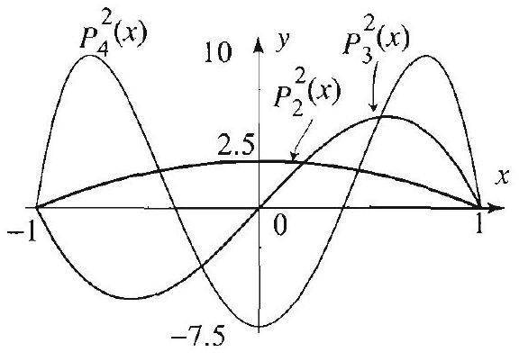

Right margin note (page 52)

${ }^{-m}(x)$. ctions

$x$
omial,
$P_{n}^{m}$ is

++++

ential Equations in Spherical Coordinates

Note that for negative $m$ 's, $P_{n}^{m}(x)$ is simply a scalar multiple of $P_{n}^{-}$ So, for each $n=0,1,2, \ldots$, we have $2 n+1$ associated Legendre fun $P_{n}^{m}(x)$, where $m$ runs from $-n$ to $n$.

EXAMPLE 1 Associated Legendre functions
Using (1) and (2) with $m=-2,-1,0,1,2$, respectively, we get
(a) $P_{0}^{0}(x)=1=P_{0}(x)$,
$$
\begin{array}{l}
P_{1}^{0}(x)=x=P_{1}(x) \\
P_{3}^{0}(x)=\frac{5 x^{3}-3 x}{2}=P_{3}(x)
\end{array}
$$
$$
P_{2}^{0}(x)=\frac{3 x^{2}-1}{2}=P_{2}(x),
$$
$$
\begin{array}{l}
P_{2}^{1}(x)=-3 x \sqrt{1-x^{2}} \\
P_{4}^{1}(x)=-\frac{5\left(7 x^{3}-3 x\right)}{2} \sqrt{1-x^{2}}
\end{array}
$$
$$
\begin{array}{l}
P_{3}^{2}(x)=15 x\left(1-x^{2}\right) \\
P_{5}^{2}(x)=\frac{105\left(3 x^{3}-x\right)}{2}\left(1-x^{2}\right)
\end{array}
$$
(d) $P_{1}^{-1}(x)=\frac{1}{2} \sqrt{1-x^{2}}$,
$$
P_{3}^{-1}(x)=\frac{\left(5 x^{2}-1\right)}{8} \sqrt{1-x^{2}},
$$
$$
\begin{array}{l}
P_{3}^{-2}(x)=\frac{1}{8} x\left(1-x^{2}\right), \\
P_{5}^{-2}(x)=\frac{\left(3 x^{3}-x\right)}{16}\left(1-x^{2}\right) .
\end{array}
$$
(e) $P_{2}^{-2}(x)=\frac{1}{8}\left(1-x^{2}\right)$,
$$
P_{4}^{-2}(x)=\frac{\left(7 x^{2}-1\right)}{48}\left(1-x^{2}\right),
$$
$$
\begin{array}{l}
\text { (b) } P_{1}^{1}(x)=-\sqrt{1-x^{2}} \\
P_{3}^{1}(x)=-\frac{3\left(5 x^{2}-1\right)}{2} \sqrt{1-x^{2}} \\
\text { (c) } P_{2}^{2}(x)=3\left(1-x^{2}\right) \\
P_{4}^{2}(x)=\frac{15\left(7 x^{2}-1\right)}{2}\left(1-x^{2}\right)
\end{array}
$$
$$
\begin{array}{l}
P_{2}^{-1}(x)=\frac{1}{2} x \sqrt{1-x^{2}} \\
P_{4}^{-1}(x)=\frac{\left(7 x^{3}-3 x\right)}{8} \sqrt{1-x^{2}}
\end{array}
$$

---

<!-- Page 53 -->

Left margin note (page 53)

THEOREM 1 ORTHOGONALITY OF ASSOCIATED LEGENDRE FUNCTIONS

Right margin note (page 53)

321

egenblish
gen-
ction Thus 3), it ${ }_{n}^{m}$ is with $1 P_{n}$. ct to
n
ution
(3)
thoge the
$\leq k$.

++++

Section 5.7 Associated Legendre Functions and Series Expansions
The Associated Legendre Differential Equation
We know from Section 5.5 that the Legendre polynomials satisfy the (L dre) differential equation $\left(1-x^{2}\right) y^{\prime \prime}-2 x y^{\prime}+n(n+1) y=0$. We now esta a similar result for the associated Legendre functions.

For $n=0,1,2, \ldots$ and $m=0, \pm 1, \pm 2, \ldots, \pm n$, the associated Le dre differential equation is given by
$$
\left(1-x^{2}\right) y^{\prime \prime}-2 x y^{\prime}+\left(n(n+1)-\frac{m^{2}}{1-x^{2}}\right) y=0, \quad-1<x<1 .
$$

When $m=0$, the equation reduces to Legendre's differential ( $(1)$, Se 5.5), and so it is satisfied by the Legendre polynomials $P_{n}=P_{n}^{0}$. in showing that the associated Legendre functions are solutions of ( suffices to consider the case $m \neq 0$. Moreover, since for negative $m, H$ proportional to $P_{n}^{-m}$ (see (2)), it suffices to consider $m>0$. Let us start Legendre's equation, which is satisfied by the $n$th Legendre polynomia Using the Leibniz rule to differentiate this equation $m$ times with respe $x$ and then plugging $P_{n}$ for $y$, we arrive at
$$
\left(1-x^{2}\right) P_{n}^{(m+2)}-2(m+1) x P_{n}^{(m+1)}+(n-m)(n+m+1) P_{n}^{(m)}=0
$$
(Exercise 14). Thus the function $P_{n}^{(m)}$ satisfies the differential equatic
$$
\left(1-x^{2}\right) y^{\prime \prime}-2(m+1) x y^{\prime}+(n-m)(n+m+1) y=0
$$

Now you can verify that this equation reduces to (3) if we use the substit
$$
y=\left(1-x^{2}\right)^{-m / 2} v
$$
(Exercise 14). Hence a solution of (3) is $\left(1-x^{2}\right)^{m / 2} \frac{d^{m} P_{n}(x)}{d x^{m}}$, and sinc is homogeneous, it follows that $P_{n}^{m}$ is also a solution.
Orthogonality and Series Expansions
Like Legendre polynomials, the associated Legendre functions enjoy or onality relations on the interval $[-1,1]$. The proofs are very much lik ones for Legendre polynomials. They will be outlined in the exercises.

Let $k \leq n$ be nonnegative integers and let $m$ be an integer such $\mid m$ Then
$$
\int_{-1}^{1} P_{k}^{m}(x) P_{n}^{m}(x) d x=0, \quad k \neq n
$$
and
$$
\int_{-1}^{1}\left[P_{n}^{m}(x)\right]^{2} d x=\frac{2}{2 n+1} \frac{(n+m)!}{(n-m)!}, \quad|m| \leq n
$$

---

<!-- Page 54 -->

Left margin note (page 54)

322
Chapter 5
P

THEO ASSOC
LEGENDRE S EXPAN

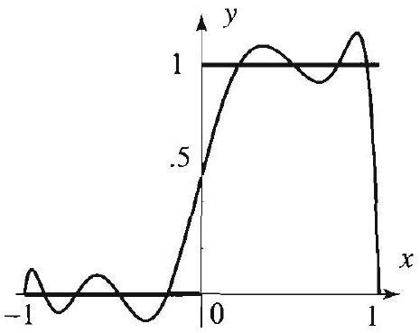

Figure 2 Partial su associated Legendn $\sum_{n=2}^{\infty} A_{n} P_{n}^{2}(x)$.

Right margin note (page 54)

endre when
oth on ion of
is con-
itted. tions. series ter to d plot agine,
$$
n=2
$$

For
e that
um of
er, the
up to
end to

++++

artial Differential Equations in Spherical Coordinates

We next state a very useful series expansion theorem for associated Leg functions. You should check that it reduces to Theorem 2, Section 5.6, $m=0$.

REM 2 IATED ERIES SIONS

Fix a nonnegative integer $m$. Suppose that $f(x)$ is piecewise smo $[-1,1]$. Then we have the associated Legendre series expans order $m$
$$
f(x)=\sum_{n=m}^{\infty} A_{n} P_{n}^{m}(x)
$$
where the associated Legendre coefficient $A_{n}$ is given by
$$
A_{n}=\frac{2 n+1}{2} \frac{(n-m)!}{(n+m)!} \int_{-1}^{1} f(x) P_{n}^{m}(x) d x, \quad n=m, m+1, m+2
$$

For $x$ in the open interval $(-1,1)$, the series converges to $f(x)$ if $f$ tinuous at $x$, and to $(f(x+)+f(x-)) / 2$ otherwise.

The proof of Theorem 2 is beyond the level of this text and will be on You can test the validity of the result by considering concrete applica In the following example, we have computed the associated Legendre expansion of a simple function, when $m=2$. We have used a compu carry out the computation of the associated Legendre coefficients an some partial sums of the associated Legendre series. As you can im the explicit expressions of these series are very complicated.

EXAMPLE 2 An associated Legendre series expansion of order
Consider the function
$$
f(x)=\left\{\begin{array}{ll}
0 & \text { if }-1<x<0, \\
1 & \text { if } 0<x<1 .
\end{array}\right.
$$

We will illustrate its associated Legendre series expansion of order $m=2$ this purpose, we will compute the coefficients $A_{n}$ for $n=2,3,4, \ldots, 10$ (not $n \geq m)$. Then using these coefficients, we will form and plot a partial the associated Legendre series with $n$ up to 10 . With the help of a comput coefficients are found to be as shown in Table 1.

\begin{table}
| $n$ | 2 | 3 | 4 | 5 | 6 | 7 | 8 | 9 | 10 |
| :--- | :---: | :---: | :---: | :---: | :---: | :---: | :---: | :---: | :---: |
| $A_{n}$ | $\frac{5}{24}$ | $\frac{7}{64}$ | $\frac{1}{40}$ | 0 | $\frac{13}{1680}$ | $\frac{65}{6144}$ | $\frac{17}{5040}$ | $-\frac{19}{30720}$ | $\frac{7}{3960}$ |
\captionsetup{labelformat=empty}
\caption{Table 1 Associated Legendre coefficients}
\end{table}

The graphs of $f$ and a partial sum of the associated Legendre series (with $n$ 10) are shown in Figure 2. Note that the associated Legendre coefficients $t$

---

<!-- Page 55 -->

Right margin note (page 55)

323

ated th of
$=4$.
diffind ntial
$=0$.
$=0$.
r the funcTake veral these
(1 -
5.6.

$x$

++++

Section 5.7 Associated Legendre Functions and Series Expansions

zero as $n$ increases. Also note the overshoot of the partial sum of the associ Legendre series near the points of discontinuity. As you would expect, bo these facts are true for general associated Legendre series.

Exercises 5.7
In Exercises 1-4, use (1) and (2) to derive $P_{n}^{m}$ for the given $m$ and $n$.
1. $m= \pm 1, n=2$.
2. $m=1, n=1,2,3$.
3. $m=3, n=4$.
4. $m=-3, n$

In Exercises 5-8, (a) determine $m$ and $n$ for the given associated Legendre ferential equation. (b) Use the list of Legendre functions in Example 1 to one solution. (c) Verify your answer in (b) by plugging back into the differe equation.
5. $\left(1-x^{2}\right) y^{\prime \prime}-2 x y^{\prime}+\left(2-\frac{1}{1-x^{2}}\right) y=0$.
6. $\left(1-x^{2}\right) y^{\prime \prime}-2 x y^{\prime}+\left(6-\frac{4}{1-x^{2}}\right) y$
7. $\left(1-x^{2}\right) y^{\prime \prime}-2 x y^{\prime}+\left(6-\frac{1}{1-x^{2}}\right) y=0$.
8. $\left(1-x^{2}\right) y^{\prime \prime}-2 x y^{\prime}+\left(12-\frac{4}{1-x^{2}}\right) y$
9. Verify (6) and (7) with $m=1$, and $n=1,2$.

In Exercises 10-15, you are given an order $m$ and a function $f(x)$ defined on interval $[-1,1]$. (a) Use a computer system with built-in associated Legendre tions to compute the associated Legendre coefficients of $f(x)$ of order $m$. $n=m, m+1, \ldots, m+10$. (b) Use the coefficients in (a) to construct se partial sums of the associated Legendre series expansion of order $m$. Plot partial sums along with the given function to illustrate Theorem 2.
10. $m=1, f(x)=\sin \pi x$.
11. $m=1, f(x)=(x-1)(x+1)$.
12. $m=2, f(x)=x$.
13. $m=2, f(x)=|x|$.
14. (a) Prove (4) using the Leibnitz rule for differentiation.
(b) With the help of a computer system, verify that the substitution $y= \left.x^{2}\right)^{-m / 2} v$ transforms (5) into (3).
15. Prove (6) by following the steps of the proof of Theorem 1, (i), Section [Hint: Show that (3) can be put in the form
$$
\left.\left(\left(1-x^{2}\right) y^{\prime}\right)^{\prime}+\left(n(n+1)-\frac{m^{2}}{1-x^{2}}\right) y=0 .\right]
$$
16. Project Problem: Proof of (7).
(a) Use (1) to show that
$$
P_{n}^{m+1}=-\left(1-x^{2}\right)^{1 / 2} \frac{d P_{n}^{m}}{d x}-m\left(1-x^{2}\right)^{-1 / 2} x P_{n}^{m}
$$
(b) Square both sides of (a) and integrate to get
$$
\begin{aligned}
\int_{-1}^{1}\left[P_{n}^{m+1}(x)\right]^{2} d x= & \int_{-1}^{1}\left(1-x^{2}\right)\left[\frac{d P_{n}^{m}}{d x}\right]^{2} d x+2 m \int_{-1}^{1} x P_{n}^{m}(x) \frac{d P_{n}^{m}}{d x} d \\
& +\int_{-1}^{1} \frac{m^{2} x^{2}}{1-x^{2}}\left[P_{n}^{m}(x)\right]^{2} d x
\end{aligned}
$$

---

<!-- Page 56 -->

Left margin note (page 56)

324
Chapter 5
Partial Differ

Right margin note (page 56)

(b) is $d x$.

++++

ential Equations in Spherical Coordinates
(c) Show that $\left[m x\left[P_{n}^{m}(x)\right]^{2}\right]_{-1}^{1}=0$.
(d) Use integration by parts to show that the right side of the equation in equal to
$$
\begin{array}{r}
-\int_{-1}^{1} P_{n}^{m}(x) \frac{d}{d x}\left[\left(1-x^{2}\right) \frac{d P_{n}^{m}}{d x}\right] d x-m \int_{-1}^{1}\left[P_{n}^{m}(x)\right]^{2} d x \\
+\int_{-1}^{1} \frac{m^{2} x^{2}}{1-x^{2}}\left[P_{n}^{m}(x)\right]^{2} d x
\end{array}
$$
(e) Explain why
$$
\frac{d}{d x}\left[\left(1-x^{2}\right) \frac{d P_{n}^{m}}{d x}\right]=-\left[n(n+1)-\frac{m^{2}}{1-x^{2}}\right] P_{n}^{m}(x) .
$$
[Hint: See the hint for Exercise 15.]
(f) Combine (d)--(e) to get
$$
\int_{-1}^{1}\left[P_{n}^{m+1}(x)\right]^{2} d x=(n-m)(n+m+1) \int_{-1}^{1}\left[P_{n}^{m}(x)\right]^{2} d x .
$$
(g) Use (f) to get
$$
\begin{array}{l}
\int_{-1}^{1}\left[P_{n}^{m}(x)\right]^{2} d x \\
\quad=(n-m+1)(n-m+2) \ldots n(n+m)(n+m-1) \ldots(n+1) \int_{-1}^{1}\left[P_{n}(x)\right]^{2}
\end{array}
$$
(h) Use (g) and Theorem 1 (ii), Section 5.6, to get (7).
