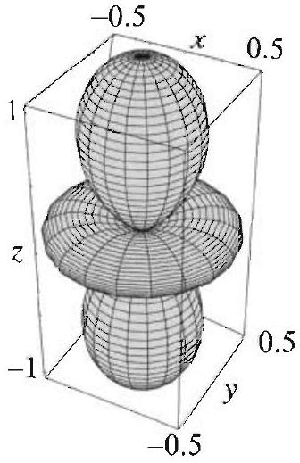
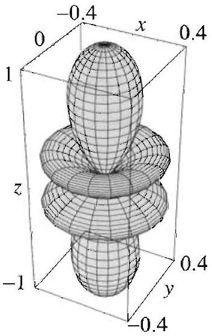
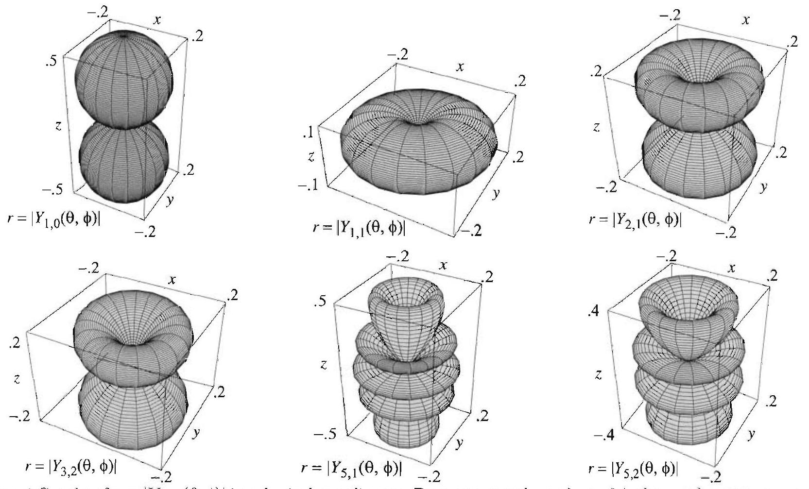
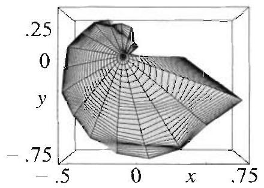
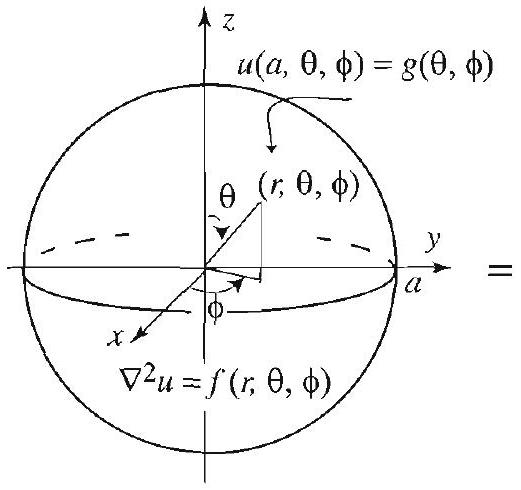
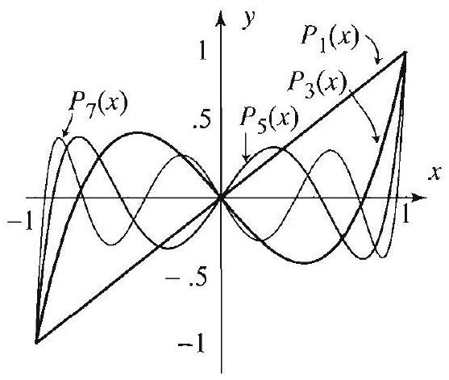
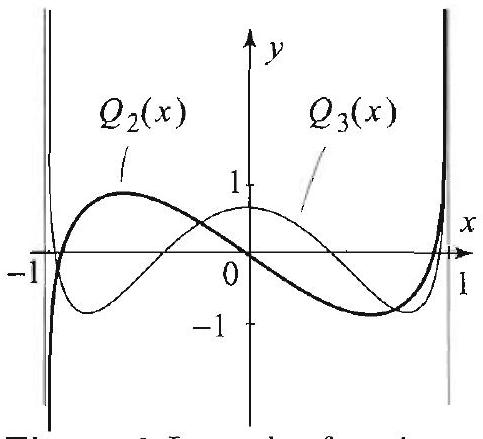
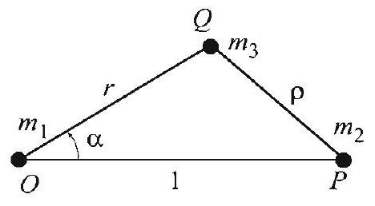
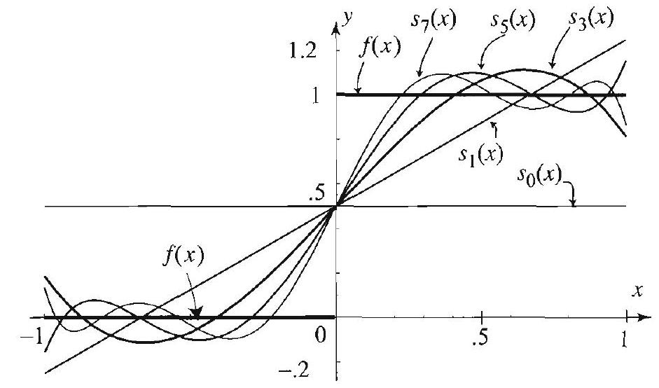

## Topics to Review

As in the previous chapter, the separation of variables method is crucial. The other essential tools are developed as needed. Section 13.1 is self-contained. Section 13.2 refers to Sections 5.1, 5.5 and 5.6. Sections 13.3 and 13.4 refer to Sections 13.1 and 13.5-5.7. Also, in Section 13.4, Bessel functions will reappear, and the material from Section 4.8 will be used again. Prior knowledge of the eigenfunction expansions method (Sections 3.9 and 4.6) is helpful but not required for Section 13.4. The supplementary material (Sections 13.5-13.7) is selfcontained and can be covered before starting the chapter. For Section 13.5 you need to review the power series method of Appendix A.4.

## Looking Ahead...

Legendre polynomials and the associated Legendre functions and their expansion theories arise frequently in physics, engineering, applied mathematics, and numerical analysis. Spherical harmonics, developed and used in Section 13.3, are also very useful in these areas. Their construction requires both Fourier series and the associated Legendre functions. As you will see in this chapter, spherical harmonics are the natural analogs of Fourier series for functions defined on the sphere. All the new functions that you will encounter in this chapter are available in most computer systems. To get acquainted with their many new features, it is strongly recommended that you experiment with them graphically and numerically with a computer.

## 13

# PARTIAL DIFFERENTIAL EQUATIONS IN SPHERICAL COORDINATES 

#### Abstract

Don't just read it; fight it! Ask your own questions, look for your own examples, discover your own proofs.

-PAUL HALMOS

In this chapter we turn our attention to problems in spheres and other regions, such as the region between two spheres or the region outside a sphere, for which it is natural to use spherical coordinates. For example, to find the steady-state temperature in a metallic ball whose surface is kept at a given temperature distribution, we need to solve Laplace's equation inside the ball that takes the given boundary values on its surface. These and related problems can be treated by the same techniques as in the previous two chapters; in particular, the method of separation of variables and the method of eigenfunction expansions can be applied.

You may recall from the previous chapters how Fourier series and Bessel series arose from applying the separation of variables method to equations involving the Laplacian in polar coordinates. Here, with equations involving the Laplacian in spherical coordinates, we will encounter other special functions when carrying the method of separation of variables to completion. A comprehensive treatment of this requisite material is presented in the last three sections of the chapter. It covers in detail Legendre polynomials and associated Legendre functions, and their corresponding expansion theories. You do not need to cover this material before starting the chapter; we will refer to it as needed.

### 13.1 Preview of Problems and Methods

Figure 1 Spherical coordinates.

Here the polar angle in the $x y$ plane is denoted by $\phi$, while in the two-dimensional case (Chapter 4) we used $\theta$.

In this chapter we will solve boundary value problems that involve the Laplacian in spherical coordinates. In this first section we will survey the methods and additional tools that are required for the solutions. As you would expect by now, the method will involve solving certain ordinary differential equations, forming generalized Fourier series, and expressing the boundary or initial data in terms of these series. For example, the solutions of problems in Cartesian coordinates (Chapter 3) involved, among other things, Fourier sine series. In Chapter 4, where we considered problems in polar coordinates, we were led to Bessel series expansions. In this section you will encounter new types of expansions (Legendre series, spherical harmonics expansions, and others) that arise naturally when solving problems in spherical coordinates.

## Consider Laplace's equation in spherical coordinates

$$
\nabla^{2} u=\frac{\partial^{2} u}{\partial r^{2}}+\frac{2}{r} \frac{\partial u}{\partial r}+\frac{1}{r^{2}}\left(\frac{\partial^{2} u}{\partial \theta^{2}}+\cot \theta \frac{\partial u}{\partial \theta}+\csc ^{2} \theta \frac{\partial^{2} u}{\partial \phi^{2}}\right)=0
$$

where $0<r<a, 0<\phi<2 \pi$, and $0<\theta<\pi$ (see Section 4.1). The solution of this equation is quite involved. To clarify the presentation, we will treat simultaneously the simpler case when $u$ is symmetric with respect to the $z$-axis or axisymmetric. In this case, $u$ is independent of the azimuthal angle $\phi$, the derivatives with respect to $\phi$ are all 0 , and (1) reduces to

## RADIALLY

SYMMETRIC LAPLACE'S

$$
\nabla^{2} u=\frac{\partial^{2} u}{\partial r^{2}}+\frac{2}{r} \frac{\partial u}{\partial r}+\frac{1}{r^{2}}\left(\frac{\partial^{2} u}{\partial \theta^{2}}+\cot \theta \frac{\partial u}{\partial \theta}\right)=0,
$$

## EQUATION

where $0<r<a$ and $0<\theta<\pi$.

## Separating Variables in Laplace's Equation

Let

$$
u(r, \theta, \phi)=R(r) \Theta(\theta) \Phi(\phi) .
$$

Differentiate, plug into (1), divide by $R \Theta \Phi$, and separate variables to arrive at the Euler equation:

$$
r^{2} R^{\prime \prime}+2 r R^{\prime}-\mu R=0, \quad 0<r<a
$$

We are using the complex form of the solution to keep the notation compact. You could use $\cos m \phi$ and $\sin m \phi$ instead. Recall that $e^{i m \phi}=\cos m \phi+i \sin m \phi$.
and

$$
\frac{\Theta^{\prime \prime}}{\Theta}+\cot \theta \frac{\Theta^{\prime}}{\Theta}+\csc ^{2} \theta \frac{\Phi^{\prime \prime}}{\Phi}=-\mu,
$$

where $\mu$ is a separation constant. The details of the separation of variables are left to Exercise 1. Recall that when we separated variables in Laplace's equation in polar coordinates (Section 4.4), we also obtained an Euler equation in $R$. Separating variables in (4), we arrive at the equations

$$
\Phi^{\prime \prime}+m^{2} \Phi=0, \quad m=0,1,2, \ldots
$$

and

$$
\Theta^{\prime \prime}+\cot \theta \Theta^{\prime}+\left(\mu-m^{2} \csc ^{2} \theta\right) \Theta=0 .
$$

Expecting $2 \pi$-periodic solutions in $\Phi$, since $\phi$ is a polar angle, we have already determined that the separation constant should be $m^{2}$ in (5). We have now separated the variables in (1) and arrived at the three equations (3), (5), and (6). Of these three equations only (6) is new. As we will see shortly, it is related to a family of differential equations known as the associated Legendre differential equations.

In the symmetric case, with no dependence on $\phi$, starting with (2), we arrive in a similar way at (3) and the following equation in $\Theta$ :

$$
\Theta^{\prime \prime}+\cot \theta \Theta^{\prime}+\mu \Theta=0
$$

Note that (7) is a special case of (6) with $m=0$. We will see shortly that it is related to the so-called Legendre's differential equation.

## Product Solutions of Laplace's Equation

We now describe the solutions of (3), (5), and (6) and derive the product solutions of (1). Equation (5) is readily solved and yields

$$
\Phi(\phi)=e^{i m \phi}, \quad m=0, \pm 1, \pm 2, \ldots
$$

To solve (6), we make the change of variables

$$
s=\cos \theta ; \quad \frac{d s}{d \theta}=-\sin \theta
$$

Hence, by the chain rule,

$$
\begin{aligned}
\Theta^{\prime} & =\frac{d \Theta}{d \theta}=\frac{d \Theta}{d s} \frac{d s}{d \theta}=-\frac{d \Theta}{d s} \sin \theta ; \\
\frac{d^{2} \Theta}{d \theta^{2}} & =-\frac{d}{d \theta}\left(\frac{d \Theta}{d s} \sin \theta\right)=-\frac{d^{2} \Theta}{d s^{2}} \frac{d s}{d \theta} \sin \theta-\cos \theta \frac{d \Theta}{d s} \\
& =\sin ^{2} \theta \frac{d^{2} \Theta}{d s^{2}}-\cos \theta \frac{d \Theta}{d s}=\left(1-s^{2}\right) \frac{d^{2} \Theta}{d s^{2}}-s \frac{d \Theta}{d s} .
\end{aligned}
$$

Plugging into (6) and simplifying, we arrive at

$$
\left(1-s^{2}\right) \frac{d^{2} \Theta}{d s^{2}}-2 s \frac{d \Theta}{d s}+\left(\mu-\frac{m^{2}}{1-s^{2}}\right) \Theta=0, \quad-1<s<1
$$

This second order, linear, ordinary differential equation is known as the associated Legendre differential equation (Section 13.7). The difficulty in solving this equation is due to the fact that the coefficients are nontrivial functions of $s$. In the symmetric case, back to equation (7), if we make the substitution $s=\cos \theta$ and simplify, we arrive at the equation

$$
\left(1-s^{2}\right) \frac{d^{2} \Theta}{d s^{2}}-2 s \frac{d \Theta}{d s}+\mu \Theta=0, \quad-1<s<1
$$

This is Legendre's differential equation (Section 13.5). It is a special case of (12) with $m=0$. Legendre's differential equation is treated in detail in Sections 13.5 and 13.6. It is a fact that (12) and (13) have bounded solutions in the interval $[-1,1]$ if and only if the separation constant has the special form

$$
\mu=n(n+1), \quad n=0,1,2, \ldots .
$$

Since for practical reasons we are only interested in bounded solutions, henceforth we take $\mu$ as in (14). The corresponding bounded solutions of (12),

The functions $e^{\text {rmb }} P_{n}^{m}(\cos \theta)$ are very important in applications. When properly normalized, they are denoted by $Y_{n, m}(\theta, \phi)$ and called the spherical harmonics (see (4), Section 13.3).
when properly normalized, are denoted by $P_{n}^{m}(s)$ and are called the associated Legendre functions. Substituting back $s=\cos \theta$, we see that the bounded solutions of (6) are

$$
P_{n}^{m}(\cos \theta) .
$$

In the symmetric case, when $m=0, P_{n}^{0}$ reduces to the Legendre polynomial of degree $n$, which is denoted by $P_{n}$. This yields

$$
P_{n}(\cos \theta)
$$

as solutions of (7). Now that we know the solutions in $\Theta$ and $\Phi$, let us solve for $R$. Substituting $\mu=n(n+1)$ in (3), we obtain the Euler equation

$$
r^{2} R^{\prime \prime}+2 r R^{\prime}-n(n+1) R=0, \quad 0<r<a
$$

To solve this equation, we appeal to results from Appendix A.3. The indicial equation is

$$
\nu^{2}+\nu-n(n+1)=0
$$

with indicial roots $\nu=n$ and $\nu=-(n+1)$. Since the indicial roots are distinct, we are in Case I of Euler's equation, and hence the solutions are

$$
R_{n}(r)=r^{n} \quad \text { and } \quad R_{n}^{*}(r)=r^{-(n+1)}, \quad n=0,1,2 \ldots
$$

For problems inside the ball with $0<r<a$, we choose the bounded solutions in (16), $R_{n}(r)=r^{n}$, and discard the others. For problems outside the ball, with $r>a$, we take $R_{n}^{*}(r)=r^{-(n+1)}$ in (16) and discard $R_{n}(r)=r^{n}$, which is unbounded as $r \rightarrow \infty$.

Summing up, we have found the following product solutions of (1):

$$
u(r, \theta, \phi)=r^{n} e^{i m \phi} P_{n}^{m}(\cos \theta)
$$

where $P_{n}^{m}$ are the associated Legendre functions. We have also found the following product solutions of (2):

$$
u(r, \theta)=r^{n} P_{n}(\cos \theta)
$$

where $P_{n}$ is the $n$th Legendre polynomial, $n=0,1, \ldots$.

Solutions of boundary value problems involving Laplace's equation will be expressed as infinite series in terms of the product solutions (17) (superposition principle). In determining the coefficients in these series, we will use the boundary conditions and appeal to various properties of the associated Legendre functions (and Legendre polynomials). More specifically, we will require expansion theorems for associated Legendre functions (and Legendre polynomials) that are similar to Bessel series representations and Fourier series. This requisite material is developed in detail in Sections 13.5-13.7. We will refer to it as needed.

## Exercises 5.1

1. Carry out the details of the separation of variables method to derive (3), (5), and (6) from (1).
2. Carry out the details of the separation of variables method to derive (3) and (7) from (2).
3. Refer to Section 13.5, where you will find a list of Legendre polynomials. Use this list to compute explicitly $P_{n}(\cos \theta)$ for $n=0,1,2$. Verify that these functions are solutions of (7) for the corresponding value of $\mu$.
4. Refer to Section 13.7, where you will find a list of associated Legendre functions. Use this list to compute explicitly $P_{1}^{m}(\cos \theta)$ for $m=-1,0,1$. Verify that these functions are solutions of (6) for the corresponding values of $\mu$ and $m$.
5. Write down (18) explicitly when $n=1$, and verify that it is a solution of (2).
6. Write down (17) explicitly when $m=n=1$, and verify that it is a solution of (1).

### 13.2 Dirichlet Problems with Symmetry

In this section we will solve Laplace's equation inside a ball of radius $a>0$, with prescribed boundary values on the sphere of radius a (see Figure 1). We will assume throughout this section that the problem is independent of

Figure 1 A Dirichlet problem with symmetry.

the angle $\phi$, and so we will be dealing with the radially symmetric Laplace equation

$$
\nabla^{2} u=\frac{\partial^{2} u}{\partial r^{2}}+\frac{2}{r} \frac{\partial u}{\partial r}+\frac{1}{r^{2}}\left(\frac{\partial^{2} u}{\partial \theta^{2}}+\cot \theta \frac{\partial u}{\partial \theta}\right)=0
$$

where $0<r<a$, and $0<\theta<\pi$ (see (2), Section 13.1). The boundary condition is also radially symmetric:

$$
u(a, \theta)=f(\theta) .
$$

Let us recall some facts from the previous section. Applying the separation of variables method, we let $u(r, \theta)=R(r) \Theta(\theta)$ plug into (1), and we arrive
at the separated equations

$$
\begin{array}{ll}
r^{2} R^{\prime \prime}+2 r R^{\prime}-n(n+1) R=0, & 0<r<a, \\
\Theta^{\prime \prime}+\cot \theta \Theta^{\prime}+n(n+1) \Theta=0, & 0<\theta<\pi,
\end{array}
$$

where the separation constant is $n(n+1)$ with $n=0,1,2, \ldots$. (All other choices of the separation constant lead to unbounded solutions and hence are discarded on physical grounds.) The equation in $R$ is an Euler equation with bounded solution $r^{n}$. Making the change of variables $s=\cos \theta$ in the second equation, we get Legendre's differential equation of order $n$ :

$$
\left(1-s^{2}\right) \Theta^{\prime \prime}-2 s \Theta^{\prime}+n(n+1) \Theta=0, \quad-1<s<1
$$

(see Section 13.1, (9)-(11) and (13)). For each $n$, this equation has a polynomial solution of degree $n$, denoted by $P_{n}(s)$ and called the $n$th Legendre polynomial. Substituting back $s=\cos \theta$, we obtain $r^{n} P_{n}(\cos \theta)$ as product solutions of (1). Since any multiple of these functions is also a solution of $(1)$, it will be convenient to denote the product solutions by

$$
A_{n}\left(\frac{r}{a}\right)^{n} P_{n}(\cos \theta)
$$

where $A_{n}$ is an arbitrary constant, and $a$ is the radius of the ball. To complete the solution of the Dirichlet problem (1)-(2), we will superpose the product solutions (3) in an infinite series to form our candidate for a solution, then determine the $A_{n}$ 's in the series so as to satisfy the boundary condition (2). In this last step, we will appeal to the orthogonality of the Legendre polynomials from Section 13.6. We have the following important result.

THEOREM 1 DIRICHLET PROBLEM IN A BALL

The solution of the Dirichlet problem (1)-(2), is given by

$$
u(r, \theta)=\sum_{n=0}^{\infty} A_{n}\left(\frac{r}{a}\right)^{n} P_{n}(\cos \theta),
$$

where $P_{n}$ is the $n$th Legendre polynomial (Section 13.5), and

$$
A_{n}=\frac{2 n+1}{2} \int_{0}^{\pi} f(\theta) P_{n}(\cos \theta) \sin \theta d \theta, \quad n=0,1,2, \ldots
$$

Proof Superposing the product solutions (3), we arrive at (4). Setting $r=a$ in (4) and using the boundary condition (2), we get

$$
f(\theta)=\sum_{n=0}^{\infty} A_{n} P_{n}(\cos \theta), \quad 0<\theta<\pi
$$

To determine the coefficients $A_{n}$, we proceed formally. Multiplying both sides of the equation by $P_{m}(\cos \theta) \sin \theta$, and then integrating term by term with respect to $\theta$, we get

$$
\begin{aligned}
\int_{0}^{\pi} f(\theta) P_{m}(\cos \theta) \sin \theta d \theta & =\sum_{n=0}^{\infty} A_{n} \int_{0}^{\pi} P_{n}(\cos \theta) P_{m}(\cos \theta) \sin \theta d \theta \\
& =\sum_{n=0}^{\infty} A_{n} \int_{-1}^{1} P_{n}(x) P_{m}(x) d x
\end{aligned}
$$

where the last equality follows by making the substitution $x=\cos \theta, d x=-\sin \theta d \theta$. Appealing to the orthogonality of the Legendre polynomials, Theorem 1, Section 13.6, we see that all the terms in the series are zero, except when $m=n$, in which case the term is equal to $A_{m} \int_{-1}^{1}\left[P_{m}(x)\right]^{2} d x=A_{m} \frac{2}{2 m+1}$. Thus

$$
\int_{0}^{\pi} f(\theta) P_{m}(\cos \theta) \sin \theta d \theta=A_{m} \frac{2}{2 m+1}
$$

which implies (5).
It is clear from Theorem 1 that the functions $P_{n}(\cos \theta)$ play an important role in the solution of the Dirichlet problem in the sphere. To get an idea of the magnitude of these functions, we show in Figure 2 the graphs of $r=\left|P_{n}(\cos \theta)\right|$, for $0 \leq \theta \leq \pi, n=0,1,2,3$. The graphs are symmetric with respect to rotation about the $z$-axis and acquire more lobes as $n$ increases. The latter property is a consequence of the increasing number of zeros of the Legendre polynomials in the interval $[-1,1]$.

$r=P_{0}(\cos \theta)$

$r=\left|P_{1}(\cos \theta)\right|$

$r=\left|P_{2}(\cos \theta)\right|$

$r=\left|P_{3}(\cos \theta)\right|$

Figure 2 Graphs of $r=\left|P_{n}(\cos \theta)\right|, n=0,1,2,3$. In spherical coordinates, these represent the points
$\left(\left|P_{n}(\cos \theta)\right|, \theta, \phi\right)$ for $0<\theta<\pi, 0<\phi<2 \pi$. Because $r$ is independent of $\phi$, the graphs are symmetric with respect to the $z$-axis. They aquire more lobes, as $n$ increases, due to the increasing number of zeroes of $P_{n}(x)$, for $0<x<1$.

Figure 3 Dirichlet problem.

## EXAMPLE 1 A Dirichlet problem inside a sphere

Find the steady-state temperature in a sphere of unit radius, given that the upper hemisphere is kept at $100^{\circ}$ and the lower one is kept at $0^{\circ}$ (Figure 3).

Solution The boundary function is given by

$$
f(\theta)= \begin{cases}100 & \text { if } 0<\theta<\frac{\pi}{2}, \\ 0 & \text { if } \frac{\pi}{2}<\theta<\pi .\end{cases}
$$

Since $f$ is independent of $\phi$, the problem is covered by Theorem 1. Accordingly, we have

$$
u(r, \theta)=\sum_{n=0}^{\infty} A_{n} r^{n} P_{n}(\cos \theta),
$$

where

$$
A_{n}=50(2 n+1) \int_{0}^{\pi / 2} P_{n}(\cos \theta) \sin \theta d \theta=50(2 n+1) \int_{0}^{1} P_{n}(x) d x .
$$

At this point, you can use the explicit formulas for the $P_{n}$ 's to compute as many coefficients as you wish. For example, since $P_{0}(x)=1$, we get $A_{0}=50 \int_{0}^{1} d x=50$. Also, using $P_{1}(x)=x$, we get $A_{1}=150 \int_{0}^{1} x d x=\frac{150}{2}=75$. Continuing in this manner, by appealing to the explicit formulas of the $P_{n}$ 's, we arrive at

$$
A_{0}=50, \quad A_{1}=75, \quad A_{2}=0, \quad A_{3}=-\frac{175}{4}, \quad A_{4}=0
$$

Hence the temperature inside the sphere is

$$
u(r, \theta)=50+75 r P_{1}(\cos \theta)-\frac{175}{4} r^{3} P_{3}(\cos \theta)+\cdots .
$$

In Table 1, we have used the first three nonzero terms of the series solution to approximate the temperature inside the sphere at the indicated points.

| $\theta$ | 0 | $\pi / 4$ | $\pi / 2$ | $3 \pi / 4$ | $\pi$ |
| :---: | :---: | :---: | :---: | :---: | :---: |
| $u(1 / 4, \theta)$ | 68.1 | 63.4 | 50 | 36.6 | 32 |
| $u(1 / 2, \theta)$ | 82 | 77.5 | 50 | 22.5 | 18 |
| $u(3 / 4, \theta)$ | 87.8 | 93 | 50 | 7 | 12.2 |

Table 1 Approximation of the temperature inside the ball.

For fixed $r$, as $\theta$ varies from 0 to $\pi$, the points move from the north pole to the south pole. Note how the temperature decreases as $\theta$ increases. This is to be expected, given the boundary conditions. Also, note that as $r$ approaches 1 , the points in the upper hemisphere have temperature near $100^{\circ}$. Better approximation of the steady-state temperature can be obtained by taking more terms from the series solution.

As you will soon discover, you always learn more about a solution of a problem by appealing to properties of the Legendre polynomials from Sections 13.5 and 13.6. Here, for example, we will show how to compute the $A_{n}$ 's in closed form, thus
yielding a more satisfactory form of the solution. From Exercise 10, Section 13.6, we have

$$
\begin{gathered}
\int_{0}^{1} P_{0}(x) d x=1, \quad \int_{0}^{1} P_{2 n}(x) d x=0, n=1,2, \ldots \\
\int_{0}^{1} P_{2 n+1}(x) d x=\frac{(-1)^{n}(2 n)!}{2^{2 n+1}(n!)^{2}(n+1)}, n=0,1,2, \ldots
\end{gathered}
$$

The proofs of these identities are nontrivial, but you can do them if you wish by following the outlined steps in Exercise 10, Section 13.6. Using these identities in (6), we obtain

$$
\begin{gathered}
A_{0}=50, \quad A_{2 n}=0, n=1,2,3, \ldots \\
A_{2 n+1}=50(4 n+3) \frac{(-1)^{n}(2 n)!}{2^{2 n+1}(n!)^{2}(n+1)}, n=1,2, \ldots
\end{gathered}
$$

Thus

$$
u(r, \theta)=50+25 \sum_{n=0}^{\infty}(4 n+3) \frac{(-1)^{n}(2 n)!}{2^{2 n}(n!)^{2}(n+1)} r^{2 n+1} P_{2 n+1}(\cos \theta)
$$

See Exercise 7 for further properties of the solution. $\square$

EXAMPLE 2 A polynomial temperature distribution on the surface The temperature on the surface of a ball of unit radius varies from $0^{\circ}$ to $100^{\circ}$ as one moves from the north pole to the south pole, according to the formula

$$
f(\theta)=50(1-\cos \theta), \quad 0<\theta<\pi
$$

(Thus $f$ is a first-degree polynomial in $\cos \theta$.) Find the steady-state temperature inside the ball.
Solution According to (4), the temperature is given by

$$
u(r, \theta)=\sum_{n=0}^{\infty} A_{n} P_{n}(\cos \theta) r^{n}
$$

where

$$
\begin{aligned}
A_{n} & =\frac{2 n+1}{2} \int_{0}^{\pi} 50(1-\cos \theta) P_{n}(\cos \theta) \sin \theta d \theta \\
& =25(2 n+1) \int_{-1}^{1}(1-x) P_{n}(x) d x \quad(x=\cos \theta, d x=-\sin \theta d \theta)
\end{aligned}
$$

Using the explicit formulas for the $P_{n}$ 's, it is easy to check that

$$
A_{0}=50, \quad A_{1}=-50, \quad A_{2}=0, \quad A_{3}=0, \quad A_{4}=0
$$

Indeed, with the help of a computer you can check that $A_{n}=0$ for $n \geq 2$. So

$$
u(r, \theta)=50 P_{0}(\cos \theta)-50 r P_{1}(\cos \theta)=50-50 r \cos \theta
$$

Surely there must be a reason for the vanishing of the $A_{n}$ 's when $n \geq 2$. A full justification of this fact is again found by understanding basic properties of Legendre polynomials and Legendre series. According to (9), $A_{n}$ is the $n$th Legendre coefficient of the polynomial 50-50x (see (7), Section 13.6 for the definition of the Legendre coefficient). Thus, we are seeking $A_{n}$ so that

$$
50-50 x=A_{0} P_{0}(x)+A_{1} P_{1}(x)+A_{2} P_{2}(x)+A_{3} P_{3}(x)+\cdots .
$$

Since $P_{0}(x)=1$, and $P_{1}(x)=x$, then $50-50 x=50 P_{0}(x)-50 P_{1}(x)$; hence $A_{0}=50, A_{1}=-50$, and by the orthogonality of the Legendre polynomials, we conclude that $A_{n}=0$ for all $n \geq 2$. This argument can be used with any polynomial $p(x)$ of degree $k$. In this case, the $n$th coefficient in the Legendre series expansion of $p(x)$ is zero for all $n>k$ (see Exercise 44, Section 13.6).

In the next section we treat the general case of Laplace's equation without symmetry. This case requires more than the Legendre polynomials: We will need the so-called associated Legendre functions.

## Exercises 5.2

In Exercises 1-6, you are asked to solve Laplace's equation (1) inside a sphere of unit radius subject to the given boundary condition. (a) Compute at least two nonzero coefficients of the Legendre series solution. (b) Find the general form of the coefficients in the series solution. A hint is given whenever you need results from Section 13.6.

Figure 4 for Exercise 9.

1. $f(\theta)=20(\cos \theta+1)$.
2. $f(\theta)=\cos ^{2} \theta+2$.
3. $f(\theta)= \begin{cases}100 & \text { if } 0<\theta<\pi / 2, \\ 20 & \text { if } \pi / 2<\theta<\pi .\end{cases}$
4. $f(\theta)= \begin{cases}100 & \text { if } 0<\theta<\pi / 3, \\ 0 & \text { if } \pi / 3<\theta<\pi .\end{cases}$
[Hint: Exercise 10, Section 13.6.]
5. $f(\theta)= \begin{cases}\cos \theta & \text { if } 0<\theta<\pi / 2, \\ 0 & \text { if } \pi / 2<\theta<\pi .\end{cases}$
[Hint: Exercise 11, Section 13.6.]
6. $f(\theta)=|\cos \theta|$.
[Hint: Exercise 27, Section 13.6.]
7. Experimenting with Example 1. In this exercise, use various properties of Legendre polynomials from Sections 13.5 and 13.6 to derive properties of the solution in Example 1. Throughout this exercise, $u(r, \theta)$ refers to (8).
(a) Using (8), show that $u(r, \pi / 2)=50$. Does this meet with your expectation?
(b) If you take $r=1$ in (8), you should get the boundary function $f$. Confirm this fact by plotting several partial sums of the solution. Plot your partial sums as a function of $\theta$ over the interval $[0, \pi]$.
(c) If you take $\theta=0$ in (8), you should get the steady-state temperature of the points on the $z$-axis in the upper hemisphere. Plot (8) for $\theta=0$ and $0<r<1$, and comment on the graph.
(d) Show that, for $0<r<1, \frac{u(r, 0)+u(r, \pi)}{2}=50$. Does this make sense on physical grounds?
8. Get a better approximation of the temperature inside the sphere in Example 1 and the points indicated in Table 1. Use at least ten terms from (8).
9. Find the steady-state temperature inside a buoy floating on the ocean as shown in the figure. [Hint: Exercise 9, Section 13.6.]

Figure 5 for Exercise 12.

Figure 6 for Exercise 13.

Project Problem: Dirichlet problem outside a sphere. Exercises 10 and 11 deal with Laplace's equation in the region outside the sphere $r>a$, subject to the boundary conditions $u(a, \theta)=f(\theta)$. Such equations arise in potential theory, when studying, for example, the potential outside a spherical capacitor. We will impose the additional condition $\lim _{r \rightarrow \infty} u(r, \theta)=0$, which expresses the fact that the potential tends to zero as we move far away from the sphere.
10. Show that the solution of (1) subject to the conditions $u(a, \theta)=f(\theta)$ and $\lim _{r \rightarrow \infty} u(r, \theta)=0$, in the region outside the sphere $r=a$, is given by

$$
u(r, \theta)=\sum_{n=0}^{\infty} A_{n}\left(\frac{r}{a}\right)^{-(n+1)} P_{n}(\cos \theta), \quad(r>a)
$$

where $A_{n}$ is as in (5). [Hint: Repeat the proof of Theorem 1, using the solutions $R_{n}^{*}$ instead of $R_{n}$ from (16), Section 13.1. Why should you make this change?]
11. Solve the Dirichlet problem outside the unit sphere with boundary values on the unit sphere as in Exercise 3.
Project Problem: A Dirichlet problem in the region between two concentric spheres. In Exercise 12 you are asked to solve this problem with nonzero data on the inner sphere and zero data on the outer sphere. In Exercise 13 you are asked to treat the opposite case, and in Exercise 14 you are asked to combine the results to give a solution of the Dirichlet problem with nonzero data on both spherical surfaces.
12. Consider the Dirichlet problem consisting of (1) with the boundary conditions described in the figure.
(a) Use both functions in (16), Section 13.1, and impose the condition $R\left(r_{2}\right)=0$ to arrive at the solution

$$
u_{1}(r, \theta)=\sum_{n=0}^{\infty} A_{n}^{*}\left[\left(\frac{r}{r_{2}}\right)^{n}-\left(\frac{r_{2}}{r}\right)^{n+1}\right] P_{n}(\cos \theta)
$$

where $r_{1}<r<r_{2}, 0<\theta<\pi$, and $A_{n}^{*}$ are to be determined. Verify that the boundary condition $u_{1}\left(r_{2}, \theta\right)=0$ is satisfied.
(b) The other boundary condition implies that

$$
u_{1}\left(r_{1}, \theta\right)=f_{1}(\theta)=\sum_{n=0}^{\infty} A_{n}^{*}\left[\left(\frac{r_{1}}{r_{2}}\right)^{n}-\left(\frac{r_{2}}{r_{1}}\right)^{n+1}\right] P_{n}(\cos \theta)
$$

Conclude that

$$
A_{n}^{*}\left[\left(\frac{r_{1}}{r_{2}}\right)^{n}-\left(\frac{r_{2}}{r_{1}}\right)^{n+1}\right]=\frac{2 n+1}{2} \int_{0}^{\pi} f_{1}(\theta) P_{n}(\cos \theta) \sin \theta d \theta
$$

Determine $A_{n}^{*}$ to complete the solution.
13. Show that the steady-state temperature in the region between the concentric spheres, as shown in the figure, is

$$
u_{2}(r, \theta)=\sum_{n=0}^{\infty} B_{n}^{*}\left[\left(\frac{r}{r_{1}}\right)^{n}-\left(\frac{r_{1}}{r}\right)^{n+1}\right] P_{n}(\cos \theta)
$$

where $r_{1}<r<r_{2}, 0<\theta<\pi$, and

$$
B_{n}^{*}\left[\left(\frac{r_{2}}{r_{1}}\right)^{n}-\left(\frac{r_{1}}{r_{2}}\right)^{n+1}\right]=\frac{2 n+1}{2} \int_{0}^{\pi} f_{2}(\theta) P_{n}(\cos \theta) \sin \theta d \theta
$$

14. Show that the solution of the Dirichlet problem consisting of (1) and the boundary conditions $u\left(r_{1}, \theta\right)=f_{1}(\theta)$ and $u\left(r_{2}, \theta\right)=f_{2}(\theta)$, in the region between the concentric sphere $r_{1}<r<r_{2}$ is $u(r, \theta)=u_{1}(r, \theta)+u_{2}(r, \theta)$, where $u_{1}$ and $u_{2}$ are given in Exercises 12 and 13, respectively.

### 13.3 Spherical Harmonics and the General Dirichlet Problem

Recall from Section 4.4 that the solution of the Dirichlet problem in a disk was expressed in terms of the Fourier series of the boundary function, which was defined on the circle. The solution of the Dirichlet problem inside a ball shares a similar property: It will be expressed in terms of a "Fourier series" of the boundary function, which is defined on the sphere. Thus solving the Dirichlet problem on the sphere will require developing an analog of Fourier series expansions for functions defined on the sphere, the so-called spherical harmonics expansions. Like Fourier series, these are very useful tools, especially when dealing with boundary value problems in spherical regions, such as heat, wave, Dirichlet and Poisson problems. We will develop the theory of spherical harmonics as it arises from our solution of the Dirichlet problem.

Let us start by recalling a few facts from Section 13.1. We considered Laplace's equation in spherical coordinates

$$
\frac{\partial^{2} u}{\partial r^{2}}+\frac{2}{r} \frac{\partial u}{\partial r}+\frac{1}{r^{2}}\left(\frac{\partial^{2} u}{\partial \theta^{2}}+\cot \theta \frac{\partial u}{\partial \theta}+\csc ^{2} \theta \frac{\partial^{2} u}{\partial \phi^{2}}\right)=0
$$

where $0<r<a, 0<\theta<\pi$, and $0<\phi<2 \pi$, with boundary condition

$$
u(a, \theta, \phi)=f(\theta, \phi), \quad 0<\theta<\pi, 0<\phi<2 \pi
$$

When we applied the method of separation of variables in Section 13.1, we set $u(r, \theta, \phi)=R(r) \Theta(\theta) \Phi(\phi)$, plugged into (1), proceeded in the usual way, and arrived at the three equations

$$
\begin{gathered}
r^{2} R^{\prime \prime}+2 r R^{\prime}-n(n+1) R=0, \quad 0<r<a, \quad n=0,1,2, \ldots, \\
\Phi^{\prime \prime}+m^{2} \Phi=0, \quad m=0,1,2, \ldots,
\end{gathered}
$$

and

$$
\Theta^{\prime \prime}+\cot \theta \Theta^{\prime}+\left(n(n+1)-m^{2} \csc ^{2} \theta\right) \Theta=0
$$

After making the change of variables $s=\cos \theta ; \frac{d s}{d \theta}=-\sin \theta$ in the last equation and simplifying, we arrived at the associated Legendre differential

## equation

$$
\left(1-s^{2}\right) \frac{d^{2} \Theta}{d s^{2}}-2 s \frac{d \Theta}{d s}+\left(n(n+1)-\frac{m^{2}}{1-s^{2}}\right) \Theta=0, \quad-1<s<1 .
$$

The equation in $R$ is an Euler equation with bounded solutions $R(r)= r^{n}, 0<r<a$. The solutions of the equation in $\Phi$ are the $2 \pi$-periodic $\cos m \phi$ and $\sin m \phi$, which we combined in complex form as $\Phi(\phi)=e^{i m \phi}$. The associated Legendre differential equation is treated in detail in Section 13.7. Its solutions are the associated Legendre functions $P_{n}^{m}(s)$. We thus have the following product solutions of (1):

$$
u(r, \theta, \phi)=r^{n} e^{i m \phi} P_{n}^{m}(\cos \theta)
$$

The functions $e^{i m \phi} P_{n}^{m}(\cos \theta)$ appear in the solutions of many other important applications. As we will see shortly, when properly normalized these products are called spherical harmonics. Because of their importance, we will formulate their definitions and study their basic properties. After doing so, we will return to the Dirichlet problem and express its solution in terms of the spherical harmonics.

## Spherical Harmonics

We start by recalling facts from Section 13.7. For $n=0,1,2, \ldots$ and $m= 0,1,2, \ldots$, the associated Legendre function $P_{n}^{m}(x)$ is defined in terms of the $m$ th derivative of the Legendre polynomial of degree $n$ by

$$
P_{n}^{m}(x)=(-1)^{m}\left(1-x^{2}\right)^{m / 2} \frac{d^{m} P_{n}(x)}{d x^{m}}
$$

(see (1), Section 13.7). Since $P_{n}$ is a polynomial of degree $n$, for $P_{n}^{m}$ to be nonzero, we must take $0 \leq m \leq n$. For negative $m$ 's, we defined in (2), Section 13.7,

$$
P_{n}^{m}(x)=(-1)^{m} \frac{(n+m)!}{(n-m)!} P_{n}^{-m}(x) .
$$

This extends the definition of the associated Legendre functions for $n= 0,1,2, \ldots$, and $m=-n,-(n-1), \ldots, n-1, n$. We now define the spherical harmonics $Y_{n, m}(\theta, \phi)$ by

$$
Y_{n, m}(\theta, \phi)=\sqrt{\frac{2 n+1}{4 \pi} \frac{(n-m)!}{(n+m)!}} P_{n}^{m}(\cos \theta) e^{i m \phi},
$$

where $n=0,1,2, \ldots$, and $m=-n,-n+1, \ldots, n-1, n$. The coefficient in (4) is chosen so that the spherical harmonics become an orthonormal set of

## THEOREM 1 ORTHOGONALITY RELATIONS FOR SPHERICAL HARMONICS

functions on the surface of the sphere when using the element of surface area $\sin \theta d \theta d \phi$. More precisely, we have the following orthogonality relations.

Let $n=0,1,2, \ldots$, and $m=-n,-n+1, \ldots, n-1, n$, and let $Y_{n, m}$ be as in (4). Then
(5) $\int_{0}^{2 \pi} \int_{0}^{\pi} Y_{n, m}(\theta, \phi) \bar{Y}_{n^{\prime}, m^{\prime}}(\theta, \phi) \sin \theta d \theta d \phi=0 \quad$ if $n \neq n^{\prime}$ or $m \neq m^{\prime}$, where $\bar{Y}_{n^{\prime}, m^{\prime}}$ is the complex conjugate of $Y_{n^{\prime}, m^{\prime}}$, and

$$
\int_{0}^{2 \pi} \int_{0}^{\pi}\left|Y_{n, m}(\theta, \phi)\right|^{2} \sin \theta d \theta d \phi=1
$$

The proofs are based on the orthogonality of the associated Legendre functions (Theorem 1, Section 13.7) and the orthogonality of the complex exponentials ((11), Section 2.6). Simply use (4) to rewrite the integrals in terms of $P_{n}^{m}(\cos \theta) e^{i m \phi}$, and then use the change of variables $s=\cos \theta$, $d s=-\sin \theta d \theta$. The details are straightforward and are left to Exercise 3.

Figure 1 Graphs of $r=\left|Y_{n, m}(\theta, \phi)\right|$ in spherical coordinates. Because $r$ is independent of $\phi$, the graphs are symmetric with respect to the $z$-axis.

THEOREM 2 SPHERICAL HARMONICS SERIES EXPANSIONS

In Figure 1 we used spherical coordinates to plot the surfaces

$$
r=\left|Y_{n, m}(\theta, \phi)\right| \quad \text { where } 0<\theta<\pi, 0<\phi<2 \pi .
$$

These surfaces represent the points $\left(\left|Y_{n, m}(\theta, \phi)\right|, \theta, \phi\right)$ and hence they show the magnitude of the spherical harmonics over a sphere centered at the origin, in the following sense. Pick a point on the sphere (centered at the origin, with radius $a>0$ ), and denote its spherical coordinates by ( $a, \theta_{0}, \phi_{0}$ ). The ray through $(0,0,0)$ and $\left(a, \theta_{0}, \phi_{0}\right)$ intersects the surface $r=\left|Y_{n, m}(\theta, \phi)\right|$ at the point $\left(\left|Y_{n, m}\left(\theta_{0}, \phi_{0}\right)\right|, \theta_{0}, \phi_{0}\right)$. The distance from the origin to that point of intersection is clearly $\left|Y_{n, m}\left(\theta_{0}, \phi_{0}\right)\right|$, which is the magnitude of the spherical harmonics at the point ( $a, \theta_{0}, \phi_{0}$ ). From (4) and the fact that $\left|e^{i m \phi}\right|=1$, it follows that $\left|Y_{n, m}(\theta, \phi)\right|$ is independent of $\phi$. This explains why the surface $r=\left|Y_{n, m}(\theta, \phi)\right|$ is symmetric with respect to the $z$-axis.

Our next theorem states that the spherical harmonics can be used to expand functions defined on the sphere, much as we used Fourier series and other orthogonal series expansions.
Let $f(\theta, \phi)$ be a function defined for all $0<\phi<2 \pi, 0<\theta<\pi$, and suppose that $f$ is $2 \pi$-periodic in $\phi$. Then we have the spherical harmonics series expansion

$$
f(\theta, \phi)=\sum_{n=0}^{\infty} \sum_{m=-n}^{n} A_{n m} Y_{n, m}(\theta, \phi)
$$

where the spherical harmonics coefficients are given by

$$
A_{n m}=\int_{0}^{2 \pi} \int_{0}^{\pi} f(\theta, \phi) \bar{Y}_{n, m}(\theta, \phi) \sin \theta d \theta d \phi
$$

We can justify (8) as we have done before with other orthogonal series expansions, by using the orthogonality relations (5) and (6). The function $f$ in Theorem 2 is square integrable; that is, $\int_{0}^{2 \pi} \int_{0}^{\pi}|f(\theta, \phi)|^{2} \sin \theta d \theta d \phi<\infty$. Sufficient conditions for the pointwise convergence of the series are typically quite complicated to state. (See Orthogonal Functions, by G. Sansone, Interscience Publishers, 1959.)

Let us compare Theorems 1 and 2 to the complex form of Fourier series. When we defined the spherical harmonics coefficient in (8), we used the complex conjugate of the spherical harmonics, and we integrated over the sphere with respect to $\sin \theta d \theta d \phi$, the element of surface area. In Theorem 1, Section 2.6, you can think of a $2 \pi$-periodic function, $f(\theta)$, as being defined on the unit circle, by parameterizing the points of the circle by $\theta$, where $0 \leq \theta<2 \pi$. The Fourier coefficients of $f(\theta)$ are then obtained by integrating over the circle with respect to $d \theta$, the element of arc length. Thus, spherical

Figure 2 View from above of the surface $r=f(\theta, \phi)$. As $\phi$ increases from 0 to $2 \pi, r$ increases from 0 to 1 .

Figure 3 Approximation of the surface in Figure 1 by the graph of a partial sum of the Dirichlet series in Example 1, with $0 \leq n \leq 10$ and $-n \leq m \leq n$.

harmonics series expansions are the natural analogues of Fourier series for functions defined on the surface of the unit sphere.

## EXAMPLE 1 A spherical harmonics series expansion

Consider the function $f(\theta, \phi)=\frac{1}{2 \pi} \phi$ for $0<\theta<\pi, 0<\phi<2 \pi$, where $f$ is $2 \pi$ periodic in $\phi$. The surface $r=f(\theta, \phi)$ is shown in Figure 2. As $\phi$ increases from 0 to $2 \pi, f$ increases from 0 to 1 . Note the discontinuity of the graph at $\phi=0$ or $\phi=2 \pi$. To expand $f$ in a spherical harmonics series, we appeal to Theorem 2. Using (8) and (4), we find

$$
\begin{aligned}
A_{n m} & =\int_{0}^{2 \pi} \int_{0}^{\pi} f(\theta, \phi) \bar{Y}_{n, m}(\theta, \phi) \sin \theta d \theta d \phi \\
& =\frac{1}{2 \pi} \sqrt{\frac{2 n+1}{4 \pi} \frac{(n-m)!}{(n+m)!}} \int_{0}^{2 \pi} \phi e^{-i m \phi} d \phi \int_{0}^{\pi} P_{n}^{m}(\cos \theta) \sin \theta d \theta
\end{aligned}
$$

The inner integral is straightforward to evaluate using integration by parts (see Exercise 5). The change of variables $\cos \theta=s$ transforms the second integral into

$$
\int_{-1}^{1} P_{n}^{m}(s) d s
$$

Particular values of this integral can be evaluated by appealing to properties of the associated Legendre functions (see Exercise 6). For example, from Section 13.7, we know that $P_{n}^{m}(s)$ is odd if $n+m$ is odd, and hence its integral as $s$ varies from -1 to 1 is zero. Hence when $n+m$ is odd, we have $A_{n m}=0$. Table 1 shows the coefficients corresponding to $n=0,1,2$ and $m=-n, \ldots, n$.

| $n \backslash m$ | -2 | -1 | 0 | 1 | 2 |
| :---: | :---: | :---: | :---: | :---: | :---: |
| 0 |  |  | $\sqrt{\pi}$ |  |  |
| 1 |  | $\frac{-i}{4} \sqrt{\frac{3 \pi}{2}}$ | 0 | $\frac{-i}{4} \sqrt{\frac{3 \pi}{2}}$ |  |
| 2 | $\frac{-i}{2} \sqrt{\frac{5}{6 \pi}}$ | 0 | 0 | 0 | $\frac{i}{2} \sqrt{\frac{5}{6 \pi}}$ |

Table 1 Spherical harmonics coefficients $A_{n m}$.

Partial sums of the spherical harmonics series (7) can now be formed using the coefficients from Table 1. After using the explicit form of the $Y_{n, m}$ from Exercise 1 and simplifying, we obtain

$$
f(\theta, \phi) \approx \sum_{n=0}^{2} \sum_{m=-n}^{n} A_{n m} Y_{n, m}(\theta, \phi)=\frac{1}{2}-\frac{3}{8} \sin \phi \sin \theta-\frac{5}{8 \pi} \sin 2 \phi \sin ^{2} \theta .
$$

Figure 4

Figure 5 A Dirichlet problem in a ball.
Figure 5 A Dirichlet problem a ball.

## THEOREM 3 DIRICHLET PROBLEM IN A BALL

We used a computer to calculate the spherical harmonics coefficients with $n$ varying from 0 to 10 and $-n \leq m \leq n$. Using these coefficients, we formed a partial sum of the spherical harmonics expansion, and then plotted the corresponding surface in Figure 3. Note the resemblance to the surface in Figure 2. In Figure 4, we plotted the partial sum for fixed values of $\theta$. Both Figures 3 and 4 show that the partial sum of the spherical harmonics series expansion approximates $f$, as $\theta$ varies in $(0, \pi)$ and $\phi$ varies in ( $0,2 \pi$ ). $\square$

## Solution of the Dirichlet Problem in a Ball

We are now in a position to derive the entire solution of the Dirichlet problem (1)-(2), illustrated in Figure 5. Let us recall the product solutions of (1),

$$
r^{n} e^{i m \phi} P_{n}^{m}(\cos \theta), \quad n=0,1,2, \ldots, \quad|m| \leq n .
$$

Since Laplace's equation is homogeneous, we may choose any scalar multiple of these functions. In particular, using (4), we can replace $e^{i m \phi} P_{n}^{m}(\cos \theta)$ by the spherical harmonics $Y_{n, m}(\theta, \phi)$ and take the following product solutions

$$
\left(\frac{r}{a}\right)^{n} Y_{n, m}(\theta, \phi) .
$$

Superposing scalar multiples of these solutions, we get

$$
u(r, \theta, \phi)=\sum_{n=0}^{\infty} \sum_{m=-n}^{n} A_{n m}\left(\frac{r}{a}\right)^{n} Y_{n, m}(\theta, \phi),
$$

where the coefficient $A_{n m}$ will be determined from the boundary condition (2). Setting $r=a$ in (11) and using (2), we get

$$
f(\theta, \phi)=\sum_{n=0}^{\infty} \sum_{m=-n}^{n} A_{n m} Y_{n, m}(\theta, \phi),
$$

which is the spherical harmonics expansion of $f$. Hence $A_{n m}$ is given by (8). We summarize our findings as follows.

The solution of (1) subject to the boundary condition (2) is given by (11), where $A_{n m}$ is the spherical harmonics coefficient of the boundary function $f$ and is given by (8).

You should compare (11), the solution of the Dirichlet problem in a ball, to (4), Section 4.4, the solution of the Dirichlet problem in a disk. In both cases, the solution has a nice expression in terms of the "Fourier coefficients" of the boundary function.

## EXAMPLE 2 A Dirichlet problem inside the unit ball

If we want to solve the Dirichlet problem inside the unit ball with boundary values given by the function $f$ in Example 1, appealing to Theorem 3, we find the solution

$$
u(r, \theta, \phi)=\sum_{n=0}^{\infty} \sum_{m=-n}^{n} A_{n m} r^{n} Y_{n, m}(\theta, \phi)
$$

where $A_{n m}$ is given by (9). Using the data from Example 1, we obtain the following partial sum approximation of the solution

$$
\begin{aligned}
u(r, \theta, \phi) & \approx \sum_{n=0}^{2} \sum_{m=-n}^{n} A_{n m} r^{n} Y_{n, m}(\theta, \phi) \\
& =\frac{1}{2}-\frac{3}{8} r \sin \phi \sin \theta-\frac{5}{8 \pi} r^{2} \sin 2 \phi \sin ^{2} \theta
\end{aligned}
$$

If $u(r, \theta, \phi)$ represents the steady-state temperature distribution inside the ball, then we can use this partial sum to approximate the temperature of points inside the ball.

## Differential Equation for the Spherical Harmonics

For future applications, we need to know the differential equation for the spherical harmonics. In deriving this equation, we will work backward from our solution of Laplace's equation (1). We now know that the product solutions of Laplace's equation are of the form $u(r, \theta, \phi)=r^{n} Y_{n, m}(\theta, \phi)$, where $n=0,1,2, \ldots$ and $|m| \leq n$. We also know that the radial part, $r^{n}$, satisfies Euler's equation. We are interested in determining the differential equation for the spherical harmonics. For this purpose, we separate variables in (1) by setting

$$
u(r, \theta, \phi)=R(r) Y(\theta, \phi)
$$

thus keeping the $\theta$ and $\phi$ variables together. Plugging into ( 1 ) and carrying out the usual details of the separation of variables, we arrive at the Euler equation in $R$, as expected, and the following equation in $Y$

$$
\frac{\partial^{2} Y}{\partial \theta^{2}}+\cot \theta \frac{\partial Y}{\partial \theta}+\csc ^{2} \theta \frac{\partial^{2} Y}{\partial \phi^{2}}+\mu Y=0
$$

where $\mu$ is a separation constant. Again, from our knowledge of the solution of Laplace's equation (1), we conclude that (12) has nontrivial solutions when $\mu=\mu_{n}=n(n+1), \quad n=0,1,2,3, \ldots$. To each $\mu=n(n+1)$ correspond $2 n+1$ spherical harmonics solutions $Y(\theta, \phi)=Y_{n, m}(\theta, \phi),|m| \leq n$. We summarize these results as follows.

THEOREM 4 DIFFERENTIAL EQUATION FOR THE SPHERICAL HARMONICS

The equation

$$
\frac{\partial^{2} Y}{\partial \theta^{2}}+\cot \theta \frac{\partial Y}{\partial \theta}+\csc ^{2} \theta \frac{\partial^{2} Y}{\partial \phi^{2}}+\mu Y=0
$$

where $0<\theta<\pi, 0<\phi<2 \pi$, admits nontrivial bounded solutions that are $2 \pi$-periodic in $\phi$ when

$$
\mu=n(n+1), \quad n=0,1,2,3, \ldots .
$$

To each acceptable value of $\mu$ (or eigenvalue) we have $2 n+1$ nontrivial solutions (or eigenfunctions) given by the spherical harmonics

$$
Y(\theta, \phi)=Y_{n, m}(\theta, \phi), \quad|m| \leq n .
$$

The eigenfunctions are given explicitly by (4) and satisfy the orthogonality relations of Theorem 1.

## Exercises 5.3

1. Spherical harmonics Use (4) and the list of associated Legendre functions from Example 1, Section 13.7, to derive the following list of spherical harmonics for $n=0,1,2,3$, and $m=-n, \ldots, n$.

$$
\begin{aligned}
& \text { (a) }(n=0) \quad Y_{0,0}(\theta, \phi)=\frac{1}{2 \sqrt{\pi}} . \\
& \begin{array}{l}
\text { (b) }(n=1) \quad Y_{1,-1}(\theta, \phi)=\frac{1}{2} \sqrt{\frac{3}{2 \pi}} \sin \theta e^{-i \phi} ; Y_{1,0}(\theta, \phi)=\frac{1}{2} \sqrt{\frac{3}{\pi}} \cos \theta ; \\
Y_{1,1}(\theta, \phi)=-\frac{1}{2} \sqrt{\frac{3}{2 \pi}} \sin \theta e^{i \phi} .
\end{array} \\
& \text { (c) }(n=2) \quad Y_{2,-2}(\theta, \phi)=\frac{3}{4} \sqrt{\frac{5}{6 \pi}} \sin ^{2} \theta e^{-2 i \phi} ; Y_{2,-1}(\theta, \phi)=\frac{3}{2} \sqrt{\frac{5}{6 \pi}} \cos \theta \sin \theta e^{-i \phi} ; \\
& Y_{2,0}(\theta, \phi)=\frac{1}{4} \sqrt{\frac{5}{\pi}}\left(-1+3 \cos ^{2} \theta\right) ; \\
& Y_{2,1}(\theta, \phi)=-\frac{3}{2} \sqrt{\frac{5}{6 \pi}} \cos \theta \sin \theta e^{i \phi} ; Y_{2,2}(\theta, \phi)=\frac{3}{4} \sqrt{\frac{5}{6 \pi}} \sin ^{2} \theta e^{2 i \phi} . \\
& \text { (d) }(n=3) Y_{3,-3}(\theta, \phi)=\frac{1}{8} \sqrt{\frac{35}{\pi}} \sin ^{3} \theta e^{-3 i \phi} ; Y_{3,-2}(\theta, \phi)=\frac{15}{4} \sqrt{\frac{7}{30 \pi}} \cos \theta \sin ^{2} \theta e^{-2 i \phi} ; \\
& Y_{3,-1}(\theta, \phi)=\frac{1}{8} \sqrt{\frac{21}{\pi}}\left(-1+5 \cos ^{2} \theta\right) \sin \theta e^{-i \phi} ; Y_{3,0}(\theta, \phi)=\frac{1}{4} \sqrt{\frac{7}{\pi}}\left(-3 \cos \theta+5 \cos ^{3} \theta\right) ; \\
& Y_{3,1}(\theta, \phi)=\frac{1}{8} \sqrt{\frac{21}{\pi}}\left(1-5 \cos ^{2} \theta\right) \sin \theta e^{i \phi} ; Y_{3,2}(\theta, \phi)=\frac{15}{4} \sqrt{\frac{7}{30 \pi}} \cos \theta \sin ^{2} \theta e^{2 i \phi} ; \\
& Y_{3,3}(\theta, \phi)=-\frac{1}{8} \sqrt{\frac{35}{\pi}} \sin ^{3} \theta e^{3 i \phi} .
\end{aligned}
$$

2. Check the orthogonality relations (5) and (6) for $n=0,1$, and $m=-n, \ldots, n$, using the explicit formulas from Exercise 1.
3. Prove the orthogonality relations (5) and (6), using the orthogonality of the associated Legendre functions from Section 13.7.
4. (a) Prove that $\bar{Y}_{n, m}(\theta, \phi)=(-1)^{m} Y_{n,-m}(\theta, \phi)$.
(b) Show that $Y_{n, m}$ is $2 \pi$-periodic in $\phi$.
5. More on Example 1.
(a) Compute the integral $\int_{0}^{2 \pi} \phi e^{-i m \phi} d \phi$ that appears in (9).
(b) Compute by hand the entries in the first two rows of Table 1.
(c) Using properties of the Legendre polynomials, explain why $A_{n 0}=0$ for all $n=1,2, \ldots$.
(d) Compute $A_{n m}$ for $n=3,4$, and $m$ between $-n$ and $n$. Form a partial sum of the spherical harmonics series of $f$ with $n=0,1, \ldots, 4$ and $m$ between $-n$ and $n$. Use graphics to illustrate the convergence of the series to $f$.
6. Project Problem: In evaluating the coefficients (9), we encountered the integral

$$
I_{n m}=\int_{-1}^{1} P_{n}^{m}(s) d s
$$

As it turns out, this integral is quite difficult to evaluate in closed form. Prove the following properties.
(a) $I_{n m}$ is 0 if $n+m$ is odd.
(b) $I_{00}=2$ and $I_{n 0}=0$ for $n=1,2,3, \ldots$.
(c) Professor Stephen Montgomery-Smith offered the following formula for $I_{n m}$ :

$$
I_{n m}=c_{n m} \frac{4 m\left[\Gamma\left(1+\frac{n}{2}\right)\right]^{2}(-1+m+n)!}{n(1+n)!\Gamma\left(1+\frac{-m+n}{2}\right) \Gamma\left(\frac{m+n}{2}\right)}
$$

where

$$
c_{n m}=\left\{\frac{-1+(-1)^{n}}{2}+\frac{1+(-1)^{m}}{2} \operatorname{sgn} m\right\} \frac{1+(-1)^{n+m}}{2},
$$

and $\operatorname{sgn} m=-1,0$, or 1 according as $m$ is negative, 0 , or positive. Test this formula for $n=1,2, \ldots, 10$ and $m$ varying from $-n$ to $n$ in steps of 2 . When $m=-n$, there is a problem with the formula as it is written. In this case, you should compute $\lim _{s \rightarrow-n} I_{n s}$. You can check that

$$
\lim _{s \rightarrow-n} \frac{(-1+s+n)!}{\Gamma\left(\frac{s+n}{2}\right)}=\frac{1}{2}
$$

and $c_{n,-n}=-1$, and so you can set

$$
I_{n,-n}=\frac{2}{(1+n)!n!}\left[\Gamma\left(1+\frac{n}{2}\right)\right]^{2}
$$

This is a much faster way to compute the integral $I_{n m}$ when $m=-n$.
(d) As a challenging part of this project, you can try to prove the result of (c).
7. A steady-state problem inside a sphere. Follow the outlined steps to find the steady-state temperature in the sphere with radius one given that the surface of the wedge between the lines of longitude $\phi=-\frac{\pi}{4}$ and $\phi=\frac{\pi}{4}$ is kept at $100^{\circ}$ and the rest of the surface of the sphere is kept at $0^{\circ}$.
(a) Let $u(r, \theta, \phi)$ denote the steady-state temperature inside the sphere. Conclude that $u$ is given by (11), where

$$
A_{n m}=100 \int_{-\pi / 4}^{\pi / 4} \int_{0}^{\pi} \bar{Y}_{n, m}(\theta, \phi) \sin \theta d \theta d \phi
$$

(b) Using the explicit formulas for the spherical harmonics from Exercise 1, obtain the following table of coefficients corresponding to $n=0,1,2$, and $m=-n, \ldots, n$.

| $n \backslash m$ | -2 | -1 | 0 | 1 | 2 |
| :---: | :---: | :---: | :---: | :---: | :---: |
| 0 |  |  | $50 \sqrt{\pi}$ |  |  |
| 1 |  | $25 \sqrt{3 \pi}$ | 0 | $-25 \sqrt{3 \pi}$ |  |
| 2 | $100 \sqrt{\frac{5}{6 \pi}}$ | 0 | 0 | 0 | $100 \sqrt{\frac{5}{6 \pi}}$ |

Spherical harmonics coefficients $A_{n m}$.

(c) Using the coefficients in (b) and the list of spherical harmonics from Exercise 1 , obtain the partial sum approximation of the solution

$$
u(r, \theta, \phi) \approx 25+75 \frac{\sqrt{2}}{2} r \sin \theta \cos \phi+125 r^{2} \frac{1}{\pi} \sin ^{2} \theta \cos 2 \phi
$$

(d) Evaluate this partial sum at various points inside the sphere of radius 1 to get an idea about the temperature distribution. Do these values agree with your intuition? Use graphics as we did in Example 1 to illustrate the convergence of the series solution to the boundary function as $r \rightarrow 1$.
8. Repeat Example 1 with $f(\theta, \phi)=\frac{1}{\pi^{2}} \phi(2 \pi-\phi)$. Use a computer to evaluate the spherical harmonics coefficients. You should get nicer pictures when you are illustrating the convergence of the spherical harmonics series. Can you justify this fact?

In Exercises 9-12, solve Laplace's equation inside the unit sphere for the given boundary function. Follow the steps that are outlined in Exercise 7.
9. $f(\theta, \phi)=Y_{0,0}(\theta, \phi)$.
10. $f(\theta, \phi)=Y_{1,0}(\theta, \phi)+3 Y_{1,1}(\theta, \phi)$.
11. $f(\theta, \phi)= \begin{cases}50 & \text { if } \frac{-\pi}{3}<\phi<\frac{\pi}{3}, \\ 0 & \text { otherwise. }\end{cases}$
12. $f(\theta, \phi)= \begin{cases}100 & \text { if } 0<\phi<\frac{\pi}{2}, \\ 0 & \text { otherwise } .\end{cases}$

## 13. A symmetric case with no dependence on $\phi$.

(a) What does Theorem 2 reduce to if $f$ is independent of $\phi$ ?
(b) Obtain Theorem 1 of Section 13.2 from Theorem 3 of this section.
14. Temperature of the center as an average. Since the solution of the Dirichlet problem, (11), represents a steady-state temperature distribution, the temperature of the center of the ball ( $r=0$ ) should be equal to the average of the temperature of the boundary. Find the temperature of the center by plugging $r=0$
into (11), and then explain how your answer can be interpreted as an average of the temperature of the boundary.
15. Project Problem: A Dirichlet problem between two concentric spheres. (a) Show that the Dirichlet problem given by (1) and (2) in the region $a<r, 0<\theta<\pi, 0<\phi<2 \pi$ is given by

$$
u(r, \theta, \phi)=\sum_{n=0}^{\infty} \sum_{m=-n}^{n} A_{n m}\left(\frac{r}{a}\right)^{-(n+1)} Y_{n, m}(\theta, \phi),
$$

where $A_{n m}$ are determined by (8). [Hint: Going back to (16), Section 13.1, choose the solutions that are bounded for $r>a$.]
(b) Solve Laplace's equation (1) for $r_{1}<r<r_{2}, 0<\theta<\pi, 0<\phi<2 \pi$, given the boundary conditions $u\left(r_{1}, \theta, \phi\right)=f_{1}(\theta, \phi), u\left(r_{2}, \theta, \phi\right)=f_{2}(\theta, \phi)$. [Hint: See Exercise 14, Section 13.2.]

### 13.4 The Helmholtz Equation with Applications to the Poisson, Heat, and Wave Equations

In this section we complete our treatment of problems in spherical coordinates by considering the Helmholtz equation and boundary value problems involving the heat, wave, and Poisson equations. We will start by solving an eigenvalue problem involving the Helmholtz equation. The remaining boundary value problems will be solved using the eigenfunction expansions method. This was the approach that we took in Sections 3.9 and 4.6, where we treated similar problems in Cartesian and polar coordinates.

## The Helmholtz Equation in a Ball

Consider the eigenvalue problem

$$
\begin{gathered}
\nabla^{2} \Psi(r, \theta, \phi)=-k \Psi(r, \theta, \phi) \\
\Psi(a, \theta, \phi)=0
\end{gathered}
$$

where $0<r<a, 0<\theta<\pi, 0<\phi<2 \pi, k$ is a nonnegative constant, and $\nabla^{2} \Psi$ denotes the Laplacian of $\Psi$ in spherical coordinates. Furthermore, we require that $\Psi$ be bounded and $2 \pi$-periodic in $\phi$. Equation (1) is the Helmholtz equation in spherical coordinates. The eigenvalue problem (1)--(2) is homogeneous and can be solved using the separation of variables method. To this end, let
Our notation already suggests that the solution in $Y$ will in-

$$
\Psi(r, \theta, \phi)=R(r) Y(\theta, \phi)
$$

(Note that, unlike previous instances where we used the separation of variables method, here we do not separate the variables $\theta$ and $\phi$. The reason will become apparent when we derive the equation for $Y$.) To separate variables in (1), we use (3) and the explicit form of the Laplacian in spherical
coordinates ((1), Section 13.1) and arrive at

$$
r^{2} R^{\prime \prime}+2 r R^{\prime}+\left(k r^{2}-\mu\right) R=0, \quad R(a)=0,
$$

and

$$
\frac{\partial^{2} Y}{\partial \theta^{2}}+\cot \theta \frac{\partial Y}{\partial \theta}+\csc ^{2} \theta \frac{\partial^{2} Y}{\partial \phi^{2}}+\mu Y=0
$$

where $\mu$ is the separation constant and $Y$ is $2 \pi$-periodic in $\phi$. (The details of the separation of the variables are left to Exercise 1.) Appealing to Theorem 4, Section 13.3, we see that (5) is the differential equation for the spherical harmonics. It has nontrivial bounded solutions that are $2 \pi$-periodic in $\phi$ when

$$
\mu=n(n+1), \quad n=0,1,2, \ldots
$$

For each $\mu=n(n+1)$, we have $2 n+1$ solutions, the spherical harmonics

$$
Y_{n, m}(\theta, \phi) \quad m=-n,-n+1, \ldots, 0, \ldots, n-1, n .
$$

Putting the values of $\mu$ from (6) into (4), and letting

$$
k=\lambda^{2},
$$

we arrive at the spherical Bessel equation in $R$ :

$$
r^{2} R^{\prime \prime}+2 r R^{\prime}+\left(\lambda^{2} r^{2}-n(n+1)\right) R=0, \quad R(a)=0
$$

(see Example 2, Section 4.8). For each $n$, we have infinitely many nontrivial solutions

$$
R_{n, j}(r)=j_{n}\left(\lambda_{n, j} r\right), \quad n=0,1,2, \ldots, j=1,2, \ldots,
$$

where

$$
\lambda=\lambda_{n, j}=\frac{\alpha_{n+1 / 2, j}}{a},
$$

THEOREM 1 HELMHOLTZ EQUATION IN A BALL

THEOREM 2 ORTHOGONALITY OF SOLUTIONS OF THE HELMHOLTZ EQUATION
$\alpha_{n+1 / 2, j}$ denotes the $j$ th positive zero of the Bessel function $J_{n+\frac{1}{2}}$ and $j_{n}$ is the spherical Bessel function of the first kind, which is defined in terms of the Bessel function by

$$
j_{n}(r)=\left(\frac{\pi}{2 r}\right)^{1 / 2} J_{n+\frac{1}{2}}(r) .
$$

The complete solution of (1) and (2) can now be stated in terms of products of spherical harmonics and spherical Bessel functions as follows.

The eigenvalue problem (1)-(2) has eigenvalues $k=\lambda^{2}$, where $\lambda=\lambda_{n, j}$ is as in (10). To each eigenvalue correspond $2 n+1$ eigenfunctions

$$
\Psi_{j n m}(r, \theta, \phi)=j_{n}\left(\lambda_{n, j} r\right) Y_{n, m}(\theta, \phi),
$$

where $|m| \leq n$.
The eigenfunctions (12) enjoy orthogonality relations that will be used to expand functions defined inside the ball. The following results are straightforward to check, using the orthogonality of the spherical harmonics and spherical Bessel functions. (See Exercise 3.)

For $j=1,2, \ldots, n=0,1,2, \ldots$, and $|m| \leq n$, we have

$$
\int_{0}^{a} \int_{0}^{2 \pi} \int_{0}^{\pi} j_{n}\left(\lambda_{n, j} r\right) Y_{n, m}(\theta, \phi) j_{n^{\prime}}\left(\lambda_{n^{\prime}, j^{\prime}} r\right) \bar{Y}_{n^{\prime}, m^{\prime}}(\theta, \phi) r^{2} \sin \theta d \theta d \phi d r=0
$$

for $(j, n, m) \neq\left(j^{\prime}, n^{\prime}, m^{\prime}\right)$, and

$$
\int_{0}^{a} \int_{0}^{2 \pi} \int_{0}^{\pi} j_{n}^{2}\left(\lambda_{n, j} r\right)\left|Y_{n, m}(\theta, \phi)\right|^{2} r^{2} \sin \theta d \theta d \phi d r=\frac{a^{3}}{2} j_{n+1}^{2}\left(\alpha_{n+\frac{1}{2}, j}\right)
$$

where $\alpha_{n+\frac{1}{2}, j}$ is the $j$ th positive zero of $J_{n+\frac{1}{2}}$.
Note that the integrals in Theorem 2 are with respect to the element of volume in spherical coordinates, $r^{2} \sin \theta d \theta d \phi d r$. Our next result, Theorem 3, states that functions defined in a ball can be expanded in series in terms of the eigenfunctions in Theorem 1. The coefficients in these series are defined by integrals using the element of volume in spherical coordinates. As you would expect, these series have to include all the eigenfunctions; thus three indices of summation are required.

Theorems 2 and 3 of this section are the higher-dimensional analogues of Theorems 1 and 2 of Section 4.6. In both situations, the eigenfunctions of the Helmholtz equation are used to expand functions that are defined on the disk (in Section 4.6) and in the ball (in Section 13.4).

THEOREM 3 SERIES EXPANSIONS OF FUNCTIONS
DEFINED IN A BALL

Let $f(r, \theta, \phi)$ be a square integrable function, defined for $0<r<a, 0<\theta< \pi, 0<\phi<2 \pi$, and $2 \pi$-periodic in $\phi$. Then we have

$$
f(r, \theta, \phi)=\sum_{j=1}^{\infty} \sum_{n=0}^{\infty} \sum_{m=-n}^{n} A_{j n m} j_{n}\left(\lambda_{n, j} r\right) Y_{n, m}(\theta, \phi),
$$

where

$$
A_{j n m}=\frac{2}{a^{3} j_{n+1}^{2}\left(\alpha_{n+\frac{1}{2}, j}\right)}
$$

(16) $\quad \times \int_{0}^{a} \int_{0}^{2 \pi} \int_{0}^{\pi} f(r, \theta, \phi) j_{n}\left(\lambda_{n, j} r\right) \bar{Y}_{n, m}(\theta, \phi) r^{2} \sin \theta d \theta d \phi d r$.

We are now ready to tackle boundary value problems using the eigenfunction expansions method. For motivation, you should review the lowerdimensional problems that are treated in Sections 3.9 and 4.6.

## Poisson's Equation in a Ball

The steady-state temperature distribution inside a spherically shaped body with time independent heat source, given that the surface is kept at a certain temperature distribution is modeled by Poisson's equation

$$
\nabla^{2} u(r, \theta, \phi)=f(r, \theta, \phi)
$$

where $0<r<a, 0<\theta<\pi, 0<\phi<2 \pi$, along with the boundary condition

$$
u(a, \theta, \phi)=g(\theta, \phi)
$$

General Poisson problem

Poisson problem with zero boundary data

General Dirichlet problem

Figure 1 Decomposition of a general Poisson problem.

As in the lower-dimensional cases, the first step is to reduce to two subprob-
lems: a Dirichlet problem with boundary data given by (18), and a Poisson problem with zero boundary data (see Figure 1). For the Dirichlet problem, you are referred to the previous section. Thus, it remains to solve (17) with the homogeneous boundary condition

$$
u(a, \theta, \phi)=0
$$

In solving (17) and (19), we will use the method of eigenfunction expansions. Accordingly, we start by assuming that the solution has a series expansion in terms of the eigenfunctions of the Helmholtz problem (1) and (2). Hence,

$$
u(r, \theta, \phi)=\sum_{j=1}^{\infty} \sum_{n=0}^{\infty} \sum_{m=-n}^{n} B_{j n m} j_{n}\left(\lambda_{n, j} r\right) Y_{n, m}(\theta, \phi)
$$

To determine $B_{j n m}$, we plug the triple series into (17), use the fact that each term satisfies (1) with $k=\lambda_{n, j}^{2}$, and get

$$
\sum_{j=1}^{\infty} \sum_{n=0}^{\infty} \sum_{m=-n}^{n}-\lambda_{n, j}^{2} B_{j n m} j_{n}\left(\lambda_{n, j} r\right) Y_{n, m}(\theta, \phi)=f(r, \theta, \phi) .
$$

Thinking of this last equation as an eigenfunction expansion of $f$, we get from Theorem 3 that

$$
B_{j n m}=\frac{-1}{\lambda_{n, j}^{2}} A_{j n m}
$$

where $A_{\text {jnm }}$ is given by (16). This completely determines the solution of the Poisson problem. We summarize our findings as follows.

THEOREM 4 POISSON PROBLEM IN A BALL

The solution of the Poisson problem (17)-(18) is

$$
u(r, \theta, \phi)=u_{1}(r, \theta, \phi)+u_{2}(r, \theta, \phi)
$$

where $u_{1}$ is the solution of the Poisson problem with zero boundary data, and $u_{2}$ is the solution of the Dirichlet problem inside the ball of radius $a$ with boundary condition (18). The function $u_{1}$ is given by (20) and (21), and the function $u_{2}$ is given by Theorem 3, Section 13.3. (The coefficients in the series solution (11), Section 13.3, are the spherical harmonics coefficients of the boundary function g .)

## A Nonhomogeneous Heat Problem

Our next example is a heat problem inside a ball with time independent internal heat source (nonhomogeneous heat equation), given an initial temperature distribution and given that the surface of the sphere is held at $0^{\circ}$ temperature (homogeneous boundary condition). More general problems involving nonhomogeneous boundary conditions and time dependent heat sources can be solved by the same methods and will be developed in the exercises.

Consider the nonhomogeneous heat equation in spherical coordinates

$$
\frac{\partial u}{\partial t}=c^{2}\left\{\frac{\partial^{2} u}{\partial r^{2}}+\frac{2}{r} \frac{\partial u}{\partial r}+\frac{1}{r^{2}}\left(\frac{\partial^{2} u}{\partial \theta^{2}}+\cot \theta \frac{\partial u}{\partial \theta}+\csc ^{2} \theta \frac{\partial^{2} u}{\partial \phi^{2}}\right)\right\}+q(r, \theta, \phi),
$$

where $0<r<a, 0<\theta<\pi, 0<\phi<2 \pi, t>0$, with boundary condition

$$
u(a, \theta, \phi, t)=0
$$

and initial condition

$$
u(r, \theta, \phi, 0)=f(r, \theta, \phi)
$$

We solve this problem using the method of eigenfunction expansions, and hence start by assuming that $u$ has an expansion in terms of the eigenfunctions of the Helmholtz problem (1)-(2). Thus

$$
u(r, \theta, \phi, t)=\sum_{j=1}^{\infty} \sum_{n=0}^{\infty} \sum_{m=-n}^{n} B_{j n m}(t) j_{n}\left(\lambda_{n, j} r\right) Y_{n, m}(\theta, \phi)
$$

where the coefficients $B_{j n m}(t)$ are functions of $t$, and $\lambda_{n, j}=\frac{\alpha_{n+1 / 2, j}}{a}$. We now expand $f$ and $q$ using Theorem 3 and obtain

$$
f(r, \theta, \phi)=\sum_{j=1}^{\infty} \sum_{n=0}^{\infty} \sum_{m=-n}^{n} f_{j n m} j_{n}\left(\lambda_{n, j} r\right) Y_{n, m}(\theta, \phi)
$$

and

$$
q(r, \theta, \phi)=\sum_{j=1}^{\infty} \sum_{n=0}^{\infty} \sum_{m=-n}^{n} q_{j n m} j_{n}\left(\lambda_{n, j} r\right) Y_{n, m}(\theta, \phi),
$$

where $f_{j n m}$ and $q_{j n m}$ are computed with the help of (16) by using $f$ and $q$, respectively. To complete the solution, we must determine the coefficients
$B_{\text {jnm }}(t)$ in (25). As you will see, these turn out to be solutions of simple first-order ordinary differential equations. Plug the expression of $u$ in (25) into the heat equation (22). Use the fact that each term in the series is a solution of (1) with $k=\lambda_{n, j}^{2}$. Also use (27) and get

$$
\begin{aligned}
& \sum_{j=1}^{\infty} \sum_{n=0}^{\infty} \sum_{m=-n}^{n} B_{j n m}^{\prime}(t) j_{n}\left(\lambda_{n, j} r\right) Y_{n, m}(\theta, \phi) \\
& \quad=\sum_{j=1}^{\infty} \sum_{n=0}^{\infty} \sum_{m=-n}^{n}\left(-\lambda_{n, j}^{2} c^{2} B_{j n m}(t)+q_{j n m}\right) j_{n}\left(\lambda_{n, j} r\right) Y_{n, m}(\theta, \phi) .
\end{aligned}
$$

This yields the differential equation for $B_{\text {jnm }}(t)$,

$$
B_{j n m}^{\prime}(t)+\lambda_{n, j}^{2} c^{2} B_{j n m}(t)=q_{j n m} .
$$

The initial condition for this equation is obtained by using (24), (25), and (26), thus implying

$$
B_{j n m}(0)=f_{j n m}
$$

As you can check directly, the solution of the initial value problem (28)-(29) is

$$
B_{j n m}(t)=e^{-\lambda_{n, j}^{2} c^{2} t}\left(f_{j n m}-\frac{q_{j n m}}{c^{2} \lambda_{n, j}^{2}}\right)+\frac{q_{j n m}}{c^{2} \lambda_{n, j}^{2}}
$$

This determines the unknown coefficients in (25) and completes the solution of the heat problem. Note that the final answer involves the coefficients of the eigenfunction expansions of $f$ and $q$ and the familiar "heat kernel" $e^{-\lambda_{n, j}^{2} c^{2} t}$.

## Wave Equation in a Ball

In our final application, we consider the wave equation in spherical coordinates

$$
\frac{\partial^{2} u}{\partial t^{2}}=c^{2}\left\{\frac{\partial^{2} u}{\partial r^{2}}+\frac{2}{r} \frac{\partial u}{\partial r}+\frac{1}{r^{2}}\left(\frac{\partial^{2} u}{\partial \theta^{2}}+\cot \theta \frac{\partial u}{\partial \theta}+\csc ^{2} \theta \frac{\partial^{2} u}{\partial \phi^{2}}\right)\right\}
$$

where $0<r<a, 0<\theta<\pi, 0<\phi<2 \pi, t>0$, with boundary condition

$$
u(a, \theta, \phi, t)=0
$$

and initial conditions

$$
u(r, \theta, \phi, 0)=f(r, \theta, \phi), \quad u_{t}(r, \theta, \phi, 0)=g(r, \theta, \phi)
$$

THEOREM 5 WAVE EQUATION IN A BALL

To solve this problem, we use the eigenfunction expansions method and assume that the solution $u$ is a series in terms of the eigenfunctions of the Helmholtz problem (1)-(2). We obtain the following solution.

The solution of wave boundary value problem (31)-(33) is

$$
\begin{gathered}
u(r, \theta, \phi, t)=\sum_{j=1}^{\infty} \sum_{n=0}^{\infty} \sum_{m=-n}^{n} j_{n}\left(\lambda_{n, j} r\right) Y_{n, m}(\theta, \phi) \\
\times\left(C_{j n m} \cos c \lambda_{n, j} t+D_{j n m} \sin c \lambda_{n, j} t\right)
\end{gathered}
$$

where

$$
\begin{array}{r}
C_{j n m}=\frac{2}{a^{3} j_{n+1}^{2}\left(\alpha_{n+\frac{1}{2}, j}\right)} \int_{0}^{a} \int_{0}^{2 \pi} \int_{0}^{\pi} f(r, \theta, \phi) j_{n}\left(\lambda_{n, j} r\right) \\
\times \bar{Y}_{n, m}(\theta, \phi) r^{2} \sin \theta d \theta d \phi d r
\end{array}
$$

and

$$
\begin{array}{r}
D_{j n m}=\frac{2}{c \lambda_{n j} a^{3} j_{n+1}^{2}\left(\alpha_{n+\frac{1}{2}, j}\right)} \int_{0}^{a} \int_{0}^{2 \pi} \int_{0}^{\pi} g(r, \theta, \phi) j_{n}\left(\lambda_{n, j} r\right) \\
\times \bar{Y}_{n, m}(\theta, \phi) r^{2} \sin \theta d \theta d \phi d r
\end{array}
$$

The interesting details of the derivation are very similar to those of the heat equation and are left to the exercises.

## Exercises 5.4

1. Derive (4) and (5) from (1) and (2).
2. Use the explicit formulas for the spherical Bessel functions and the spherical harmonics to verify (13) and (14) when $j=1, n=0,1$, and $m=-1,0,1$.
3. (a) Use the orthogonality properties of the spherical Bessel functions (Exercise 45, Section 4.8) and the spherical harmonics (Section 13.3) to prove (13) and (14). (b) Use Theorem 2 to justify (16).
4. What does Theorem 3 reduce to if $f$ depends only on $r$ ?
5. Define a function inside the unit ball by $f(r)=1$ for $0<r<1$. Compute the series expansion (15) for $f$.
6. Define a function inside the unit ball by $f(r)=1$ if $0<r<1 / 2$ and $f(r)=0$ if $1 / 2<r<1$. Compute the series expansion (15) for $f$.
7. Define a function inside the unit ball by $f(r)=r^{2}$. Compute the series expansion (15) for $f$.
8. Define a function inside the unit ball by $f(r, \phi)=r^{2} \phi$. Compute the series expansion (15) for $f$.
9. Solve the Poisson problem (17), (19) inside the unit ball with $f=1$, and $g=0$.
10. Solve the Poisson problem (17), (18) inside the unit ball with $f=1$ and $g=\frac{1}{2 \pi} \phi$.
11. Derive (29), then solve (28)-(29) to get (30).
12. What is the solution of the heat problem (22)-(24) if $q=0$ ?
13. Project Problem: A problem with time-dependent heat source. Solve the heat problem (22)-(24) with a time-dependent heat source $q(r, \theta, \phi, t)$. [Hint: Modify the solution of (22)-(24) as follows. In (27), you should allow the coefficients $q_{j m n}$ to depend on $t$. In (28), the right side depends on $t$. Solve (28)-(29) as in Exercise 18(c), Section 3.9.]
14. A nonhomogeneous heat problem. Solve the heat equation (22) subject to the initial condition (24), and the nonhomogeneous boundary condition $u(a, \theta, \phi, t)=g(\theta, \phi)$. [Hint: Decompose the problem into two subproblems. See, for example, Exercise 17, Section 4.4.]
15. A heat problem with symmetry. A solid ball at $30^{\circ} \mathrm{C}$ with radius $a=1$ is placed in a refrigerator that maintains a constant temperature of $0^{\circ} \mathrm{C}$. (a) Take $c=1$ and determine the temperature $u(r, \theta, \phi, t)$ inside the ball.
(b) The function

$$
\theta_{4}(u, q)=1+2 \sum_{n=1}^{\infty}(-1)^{n} q^{n^{2}} \cos 2 n u
$$

is called an elliptic theta function. This type of function is built into many computer systems. Express the temperature of the center in part (a) in terms of $\theta_{4}$, then plot the temperature for $t>0$.
(c) Use your graph in (b) to determine how long it will take for the temperature at the center to drop to $10^{\circ} \mathrm{C}$.
16. (a) Solve the heat problem in the ball of radius 1 with $c=1$, given that the surface temperature is kept at $0^{\circ}$ and that the initial temperature distribution is $f(r, \theta, \phi)=r^{2}$. Assume that there is no internal source of heat.
(b) Plot the temperature of the center for $t>0$.
17. (a) Solve the heat problem (22)-(24) inside the unit ball. Take $c=1, q= 20 r^{2}$, and $f(r, \theta, \phi)=100$.
(b) Plot the temperature of the center for $t>0$.
18. Project Problem: The wave equation in a ball. Derive (34)-(36).

### 13.5 Legendre's Differential Equation

A through review of the methods that are used in this section is presented in Appendixes A. 4 and A.5. These sections are strongly recommended for readers who are not familiar with the power series method for solving ordinary differential equations.

## Legendre's differential equation

$$
\left(1-x^{2}\right) y^{\prime \prime}-2 x y^{\prime}+\mu y=0, \quad-1<x<1,
$$

arose when solving Laplace's equation in spherical coordinates (see (13), Section 13.1). It is thus a very important differential equation. Legendre's differential equation is really a family of equations, one for each value of the parameter $\mu$. Upon dividing by $\left(1-x^{2}\right)$, the equation becomes

$$
y^{\prime \prime}-\frac{2 x}{1-x^{2}} y^{\prime}+\frac{\mu}{1-x^{2}} y=0
$$

Using the geometric series expansion, we can verify that the functions $p(x)= -\frac{2 x}{1-x^{2}}$ and $q(x)=\frac{\mu}{1-x^{2}}$ have power series expansions about 0 with both radii of convergence equal to 1. It follows from Theorem 1, Appendix A.5, that (1) has two linearly independent solutions given by power series that converge for $|x|<1$. To find these solutions we substitute $y=\sum_{m=0}^{\infty} a_{m} x^{m}$ and its derivatives into (1) and get

$$
\left(1-x^{2}\right) \sum_{m=2}^{\infty} m(m-1) a_{m} x^{m-2}-2 x \sum_{m=1}^{\infty} m a_{m} x^{m-1}+\mu \sum_{m=0}^{\infty} a_{m} x^{m}=0 .
$$

Expanding and reindexing gives

$$
\begin{array}{r}
\sum_{m=0}^{\infty}(m+2)(m+1) a_{m+2} x^{m}-\sum_{m=0}^{\infty} m(m-1) a_{m} x^{m} \\
-\sum_{m=0}^{\infty} 2 m a_{m} x^{m}+\sum_{m=0}^{\infty} \mu a_{m} x^{m}=0
\end{array}
$$

Note that we have started the second and third series at $m=0$ instead of $m=2$ and $m=1$. This makes no difference, since the added terms have value 0 . Combining the series and setting the coefficients equal to 0 , we get the two-step recurrence relation

$$
(m+2)(m+1) a_{m+2}-[m(m+1)-\mu] a_{m}=0
$$

or

$$
a_{m+2}=\frac{m(m+1)-\mu}{(m+2)(m+1)} a_{m}
$$

Thus $a_{0}$ determines $a_{2}$, which determines $a_{4}, a_{6}, \ldots$, and $a_{1}$ determines $a_{3}$, which determines $a_{5}, a_{7}, \ldots$ Using these coefficients, we get the two series solutions, known as Legendre functions, one consisting of even powers of $x$ only and the other consisting of odd powers of $x$ only.

Figure 1 Legendre functions with $\mu=3 / 4$.

## Legendre Polynomials

If $\mu$ is a nonnegative integer of the form $n(n+1)$, then the recurrence relation shows that $a_{n+2}=0$, implying that $a_{n+4}=a_{n+6}=\cdots=0$. Thus one of the Legendre functions in this case is a polynomial of degree $n$, while the other one is an infinite series that converges but is not bounded on the interval $(-1,1)$ (see Exercise 25). For all other values of the parameter $\mu$, the Legendre functions are both infinite series with infinitely many nonzero terms. Using the ratio test and the recurrence formula for the coefficients, we can show that these infinite series solutions have radius of convergence equal to 1 (Exercise 21). Moreover, it can be shown that, except for the polynomial solutions of (1), any Legendre function is not bounded at one or both of the endpoints $x= \pm 1$ (see N. N. Lebedev, Special Functions and Their Applications, Dover Publications, 1972). Figure 1 shows the graphs of two Legendre functions when $\mu=\frac{3}{4}$. Note how each function blows up at one endpoint of $[-1,1]$. Since for practical reasons we are interested in the bounded solutions of (1), from here on we will restrict our study to the case

$$
\mu=n(n+1), \quad n=0,1,2, \ldots .
$$

The recurrence relation becomes

$$
a_{m+2}=-\frac{(n-m)(n+m+1)}{(m+2)(m+1)} a_{m},
$$

from which we get

$$
\begin{gathered}
a_{2}=-\frac{n(n+1)}{2!} a_{0} \\
a_{4}=\frac{(n-2) n(n+1)(n+3)}{4!} a_{0} \quad a_{3}=-\frac{(n-1)(n+2)}{3!} a_{1} \\
a_{6}=-\frac{(n-3)(n-1)(n+2)(n+4)}{5!} a_{1} \\
a_{7}=-\frac{(n-5)(n-3)(n-1)(n+2)(n+4)(n+6)}{7!} a_{1} .
\end{gathered}
$$

Hence, the general solution of (1) is

$$
y(x)=a_{0} y_{1}(x)+a_{1} y_{2}(x),
$$

where

$$
\begin{aligned}
y_{1}(x) & =1-\frac{n(n+1)}{2!} x^{2}+\frac{(n-2) n(n+1)(n+3)}{4!} x^{4} \\
& -\frac{(n-4)(n-2) n(n+1)(n+3)(n+5)}{6!} x^{6}+\cdots
\end{aligned}
$$

and

$$
\begin{aligned}
y_{2}(x) & =x-\frac{(n-1)(n+2)}{3!} x^{3}+\frac{(n-3)(n-1)(n+2)(n+4)}{5!} x^{5} \\
& -\frac{(n-5)(n-3)(n-1)(n+2)(n+4)(n+6)}{7!} x^{7}+\cdots
\end{aligned}
$$

If $n$ is an even integer, then, from (2), we have that $a_{n+2}=0$, and hence $a_{n+4}=a_{n+6}=\cdots=0$. Thus (3) reduces to a polynomial of even degree $n$ containing only even powers of $x$ :

$$
y_{1}=a_{0}+a_{2} x^{2}+\cdots+a_{n} x^{n} \quad(n \text { even }) .
$$

Similarly, if $n$ is an odd integer, then (4) reduces to a polynomial of odd degree $n$ containing only odd powers of $x$ :

$$
y_{2}=a_{1} x+a_{3} x^{3}+\cdots+a_{n} x^{n} \quad(n \text { odd }) .
$$

Thus far the solutions are determined up to an arbitrary constant. It is customary to normalize the polynomial solution by taking

$$
a_{n}=\frac{(2 n)!}{2^{n}(n!)^{2}}
$$

To compute the remaining coefficients we need a backward recurrence relation that takes us from $a_{m}$ to $a_{m-2}$. For that purpose, express $a_{m}$ in terms of $a_{m+2}$ in (2), and then replace $m$ by $m-2$ to get

$$
a_{m-2}=-\frac{m(m-1)}{(n-m+2)(n+m-1)} a_{m} .
$$

We compute $a_{n-2}$ from $a_{n}$ using (7) and (8):

$$
a_{n-2}=-\frac{n(n-1)}{2(2 n-1)} a_{n}=-\frac{n(n-1)}{2(2 n-1)} \frac{(2 n)!}{2^{n}(n!)^{2}}=-\frac{(2 n-2)!}{2^{n}(n-1)!(n-2)!} .
$$

Similarly,

$$
a_{n-4}=-\frac{(n-2)(n-3)}{4(2 n-3)} a_{n-2}=\frac{(2 n-4)!}{2^{n} 2!(n-2)!(n-4)!},
$$

and in general for $2 m \leq n$, we have

$$
a_{n-2 m}=(-1)^{m} \frac{(2 n-2 m)!}{2^{n} m!(n-m)!(n-2 m)!} .
$$

With these coefficients the polynomial solution is called the Legendre polynomial of degree $n$ and is denoted by $P_{n}(x)$. Setting $M=n / 2$ if $n$ is even or $(n-1) / 2$ if $n$ is odd, the $n$th Legendre polynomial becomes

$$
P_{n}(x)=\frac{1}{2^{n}} \sum_{m=0}^{M}(-1)^{m} \frac{(2 n-2 m)!}{m!(n-m)!(n-2 m)!} x^{n-2 m} .
$$

The first few Legendre polynomials are (see Figure 2)

$$
\begin{array}{ll}
P_{0}(x)=1 & P_{1}(x)=x \\
P_{2}(x)=\frac{1}{2}\left(3 x^{2}-1\right) & P_{3}(x)=\frac{1}{2}\left(5 x^{3}-3 x\right) \\
P_{4}(x)=\frac{1}{8}\left(35 x^{4}-30 x^{2}+3\right) & P_{5}(x)=\frac{1}{8}\left(63 x^{5}-70 x^{3}+15 x\right) \\
P_{6}(x)=\frac{1}{16}\left(231 x^{6}-315 x^{4}+105 x^{2}-5\right) & P_{7}(x)=\frac{1}{16}\left(429 x^{7}-693 x^{5}+315 x^{3}-35 x\right)
\end{array}
$$

Figure 2 Legendre polynomials.

## Summary and Further Properties

For $n=0,1,2, \ldots$, Legendre's equation of order $n$

$$
\left(1-x^{2}\right) y^{\prime \prime}-2 x y^{\prime}+n(n+1) y=0, \quad-1<x<1,
$$

has two linearly independent solutions $y_{1}$ and $y_{2}$ given by (3) and (4). One of them is a polynomial of degree $n$ and the other one is an infinite series solution. If we normalize the polynomial solution by (7), we obtain the Legendre polynomial of degree $n, P_{n}(x)$, given by (9). The other solution of (10), when suitably normalized, is denoted by $Q_{n}(x)$ and is called a Legendre function of the second kind. It converges on the interval $-1<x<1$ and is not bounded in $[-1,1]$ (see Exercises 23-27). Since $P_{n}$ is not identically 0 and bounded in $[-1,1]$ and $Q_{n}$ is not bounded, it follows that $P_{n}$
and $Q_{n}$ are linearly independent. Hence the general solution of Legendre's equation of order $n$ is

$$
y(x)=c_{1} P_{n}(x)+c_{2} Q_{n}(x)
$$

where $c_{1}$ and $c_{2}$ are arbitrary constants.

## EXAMPLE 1 Solution of Legendre's differential equation

Find the general solution of the differential equation

$$
\left(1-x^{2}\right) y^{\prime \prime}-2 x y^{\prime}+12 y=0 .
$$

Solution This is Legendre's equation with $n=3$. From (11) the general solution is $y(x)=c_{1} P_{3}(x)+c_{2} Q_{3}(x)$. Since $n$ is odd, the infinite series solution $Q_{3}(x)$ is thus given by ( 3 ), up to normalization. We have

$$
y=c_{1}\left(\frac{1}{2}\left[5 x^{3}-3 x\right]\right)+c_{2}\left(1-6 x^{2}+3 x^{4}+\frac{4}{5} x^{6}-\cdots\right)
$$

## EXAMPLE 2 An initial value problem

Without deriving the solution, determine whether the initial value problem

$$
\left(1-x^{2}\right) y^{\prime \prime}-2 x y^{\prime}+6 y=0 ; \quad y(0)=1, y^{\prime}(0)=1
$$

has a bounded solution in the interval $[-1,1]$.
Solution We recognize the differential equation as a Legendre's equation with $n=2$. The only way to get a bounded solution from the general solution (11) is to take $c_{2}=0$. In this case, the solution is a constant multiple of $P_{2}(x)$, and so it is of the form $y_{1}(x)=c_{1} P_{2}(x)=a_{0}+a_{2} x^{2}$. It is easy to see that the second initial condition cannot be satisfied by any polynomial of this form, since $y_{1}^{\prime}=2 a_{2} x$, and so $y_{1}^{\prime}(0)=0$. Hence the initial value problem does not have a bounded solution. The solution must be an infinite series. To find the coefficients of this series, start with $a_{0}=1$ and $a_{1}=1$, and generate the rest using (2) with $n=2$.

The graphs in Figure 2 illustrate many interesting properties of the Legendre polynomials. We list some of them for ease of reference. Their proofs are left as exercises or provided in the next section.

## FURTHER PROPERTIES OF LEGENDRE POLYNOMIALS

$P_{n}$ is even if $n$ is even and odd if $n$ is odd. $P_{n}(1)=1$ and $P_{n}(-1)=(-1)^{n}$ for all $n$.
$\left|P_{n}(x)\right| \leq 1$ for all $n$ and all $x$ in $[-1,1]$. $P_{n}(x)$ has $n$ distinct zeros in $[-1,1]$. All relative maxima and minima of $P_{n}$ occur in $[-1,1]$.

In a sense, these properties say that the interesting behavior of the polynomials $P_{n}$ occurs in the interval $[-1,1]$.

## Exercises 5.5

1. Use (9) to derive (a) $P_{0}(x), P_{1}(x), P_{2}(x)$;
(b) $P_{3}(x), P_{4}(x)$
2. Use (9) to prove the following: (a) establish (12);
(b) $P_{2 n}(0)=(-1)^{n} \frac{(2 n)!}{2^{2 n}(n!)^{2}}$, and $P_{2 n+1}(0)=0$;
(c) $P_{2 n}^{\prime}(0)=0$, and $P_{2 n+1}^{\prime}(0)=(2 n+1) P_{2 n}(0)$.
3. Use Exercise 2(b) to obtain the following useful identity for $n=0,1,2, \ldots$ :

$$
P_{2 n}(0)-P_{2 n+2}(0)=(-1)^{n} \frac{(2 n)!(4 n+3)}{2^{2 n+1}(n!)^{2}(n+1)} .
$$

4. Verify the following assertions for the first three Legendre polynomials.
(a) The Legendre polynomial of degree $n$ is a solution of Legendre's differential equation of order $n$.
(b) $P_{n}(1)=1, P_{n}(-1)=(-1)^{n}$.

Evaluate the following integrals.
5. $\int_{-1}^{1} P_{3}(x) d x$.
6. $\int_{-1}^{1} P_{2}(x) P_{3}(x) d x$.
7. $\int_{0}^{1} P_{2}(x) d x$.
8. $\int_{-1}^{1} P_{2}^{2}(x) d x$.

In Exercises 9-12, find the general solution of the given differential equation. Write down at least two terms from the series expansions of each part of your answer.
9. $\left(1-x^{2}\right) y^{\prime \prime}-2 x y^{\prime}+30 y=0$.
10. $\left(1-x^{2}\right) y^{\prime \prime}-2 x y^{\prime}+42 y=0$.
11. $\left(1-x^{2}\right) y^{\prime \prime}-2 x y^{\prime}=0$.
12. $y^{\prime \prime}-\frac{2 x}{\left(1-x^{2}\right)} y^{\prime}+\frac{6}{\left(1-x^{2}\right)} y=0$.

In Exercises 13-16, without solving, decide whether the initial value problem has a bounded solution in $[-1,1]$. Find the solution if it is bounded.
13. $\left(1-x^{2}\right) y^{\prime \prime}-2 x y^{\prime}+6 y=0 ; y(0)=0, y^{\prime}(0)=1$.
14. $\left(1-x^{2}\right) y^{\prime \prime}-2 x y^{\prime}+56 y=0 ; y(0)=0, y^{\prime}(0)=1$.
15. $\left(1-x^{2}\right) y^{\prime \prime}-2 x y^{\prime}+56 y=0 ; y(0)=1, y^{\prime}(0)=0$.
16. $\left(1-x^{2}\right) y^{\prime \prime}-2 x y^{\prime}+110 y=0 ; y(0)=1, y^{\prime}(0)=1$.

In Exercises 17-20, with the help of (2), determine the first four nonzero terms of the series solution of the given initial value problem.
17. $\left(1-x^{2}\right) y^{\prime \prime}-2 x y^{\prime}+\frac{3}{4} y=0 ; y(0)=1, y^{\prime}(0)=1$.
18. $\left(1-x^{2}\right) y^{\prime \prime}-2 x y^{\prime}+2 y=0 ; y(0)=1, y^{\prime}(0)=0$.
19. $\left(1-x^{2}\right) y^{\prime \prime}-2 x y^{\prime}+3 y=0 ; y(0)=0, y^{\prime}(0)=1$.
20. $\left(1-x^{2}\right) y^{\prime \prime}-2 x y^{\prime}+2 y=0 ; y(0)=1, y^{\prime}(0)=1$.
21. Consider a Legendre function (solution of Legendre's differential equation) that is not a polynomial. Use the ratio test and the recurrence formula for the coefficients to show that the radius of convergence of the Legendre function is 1 .

Figure 3 Legendre functions $Q_{2}(x)$ and $Q_{3}(x)$.

Project Problem: Legendre functions of the second kind. Do Exercise 22 and any one of 23 or 24 .
22. (a) Use the reduction of order formula (Appendix A.3) to derive the following formula for the Legendre functions of the second kind:

$$
Q_{n}(x)=P_{n}(x) \int \frac{1}{\left[P_{n}(x)\right]^{2}\left(1-x^{2}\right)} d x \quad(n=0,1,2, \ldots)
$$

(The integral is defined up to an arbitrary constant.)
(b) Compute the Wronskian $W\left(P_{n}(x), Q_{n}(x)\right)$ and show that it vanishes nowhere on $-1<x<1$. Conclude that the two solutions are linearly independent.

Use the formula in Exercise 22 to derive the given expression for the Legendre function of the second kind.
23. $Q_{0}(x)=\frac{1}{2} \ln \left(\frac{1+x}{1-x}\right)$.
24. $Q_{1}(x)=-1+\frac{x}{2} \ln \left(\frac{1+x}{1-x}\right)$.
25. Project Problem: Legendre functions of the second kind are not bounded. The purpose of this problem is to derive the following formula for the Legendre functions of the second kind: for $n=0,1,2, \ldots$,

$$
Q_{n}(x)=\frac{1}{2} P_{n}(x) \ln \left(\frac{1+x}{1-x}\right)+f_{n}(x)
$$

where $f_{n}(x)$ is a polynomial of degree $n-1$ for $n \geq 1$ and $f_{0}(x)=0$.
(a) Before we derive the formula, use it to show that $\left|Q_{n}(x)\right| \rightarrow \infty$ if $x \rightarrow \pm 1$; and thus $Q_{n}(x)$ is not bounded in $[-1,1]$.
(b) Verify the formula for $n=0$ and 1, using the results of Exercises 23 and 24.
(c) For $n \geq 2$, let $u(x)=\frac{1}{2} \ln \left(\frac{1+x}{1-x}\right), v(x)=u(x) P_{n}(x)$, and $\alpha_{n}=n(n+1)$. Show that $\left(\left(1-x^{2}\right) u^{\prime}(x)\right)^{\prime}=0$; equivalently, $\left(1-x^{2}\right) u^{\prime \prime}(x)-2 x u^{\prime}(x)=0$.
(d) Plug $v(x)=u(x) P_{n}(x)$ into Legendre's equation of order $n$ and show that

$$
\left(1-x^{2}\right) v^{\prime \prime}-2 x v^{\prime}+\alpha_{n} v=2 P_{n}^{\prime}(x)
$$

[Hint: Use (c) and the fact that $P_{n}$ is a solution of Legendre's equation of order $n$.]
(e) Let $f_{n}(x)$ denote a particular solution of the differential equation

$$
\left(1-x^{2}\right) y^{\prime \prime}-2 x y^{\prime}+\alpha_{n} y=-2 P_{n}^{\prime}(x)
$$

Show that $f_{n}$ can be chosen to be a polynomial of degree $n-1$. [Hint: If $y$ is a polynomial of degree $n-1$, then $\left(1-x^{2}\right) y^{\prime \prime}-2 x y^{\prime}+\alpha_{n} y$ is also a polynomial of degree $n-1$.]
(f) Use (d) and (e) to show that $v(x)+f_{n}(x)$ is a solution of Legendre's equation of order $n$.
(g) Show that $v(x)+f_{n}(x)$ is not bounded on $[-1,1]$ and conclude that it is a second solution of Legendre's equation, which is independent of $P_{n}(x)$. We can take $Q_{n}(x)=v(x)+f_{n}(x)$.
26. Follow the steps in Exercise 25 and derive the Legendre function (Figure 3)

$$
Q_{2}(x)=-\frac{3}{2} x+\frac{1}{4}\left(-1+3 x^{2}\right) \ln \left(\frac{1+x}{1-x}\right)
$$

27. Follow the steps in Exercise 25 and derive the Legendre function (Figure 3)

$$
Q_{3}(x)=\frac{1}{6}\left(4-15 x^{2}\right)+\frac{1}{4}\left(-3 x+5 x^{3}\right) \ln \left(\frac{1+x}{1-x}\right)
$$

The formula

$$
P_{n}(x)=\frac{1}{\pi} \int_{0}^{\pi}\left(x+i \sqrt{1-x^{2}} \cos \theta\right)^{n} d \theta \quad(n=0,1,2, \ldots)
$$

is known as Laplace's integral formula for the Legendre polynomials. Here $i$ denotes as usual the complex number such that $(i)^{2}=-1$. This formula has many interesting applications that we explore in the following exercises. For a proof, see [1], Section 10.5.
28. Derive the first three Legendre polynomials using (17).
29. (a) Show that for $|x| \leq 1$, we have

$$
\left|\left(x+i \sqrt{1-x^{2}} \cos \theta\right)^{n}\right| \leq 1 .
$$

[Hint: If $\alpha+i \beta$ is a complex number, then $|\alpha+i \beta|=\sqrt{\alpha^{2}+\beta^{2}}$.]
(b) Use (17) and (a) to establish (14).
30. (a) Use (17) to establish (13).
(b) Use (17) and Exercise 42, Section 4.7 (Wallis's formulas) to compute $P_{n}(0)$.
31. Project Problem: Generating function for the Legendre polynomials. Recall that if $\alpha$ is any real number and $k$ is a nonnegative integer, the $k$ th binomial coefficient is

$$
\binom{\alpha}{k}=\frac{\alpha(\alpha-1)(\alpha-2) \ldots(\alpha-k+1)}{k!} \quad \text { for } k \geq 1
$$

and $\binom{\alpha}{0}=1$. With this notation, the binomial theorem asserts that

$$
(1+x)^{\alpha}=\sum_{k=0}^{\infty}\binom{\alpha}{k} x^{k}, \quad-1<x<1 .
$$

(a) Set $\alpha=-\frac{1}{2}$, and obtain that

$$
\frac{1}{\sqrt{1+v}}=\sum_{k=0}^{\infty}(-1)^{k} \frac{(2 k)!}{2^{2 k}(k!)^{2}} v^{k}, \quad|v|<1
$$

(b) Conclude that

$$
\frac{1}{\sqrt{1-2 x u+u^{2}}}=\sum_{n=0}^{\infty} P_{n}(x) u^{n}, \quad|x| \leq 1,|u|<1
$$

This is called the generating function for the Legendre polynomials. To prove it, set $v=-2 x u+u^{2}$ in (a), expand, and collect like powers of $u$. Note that
since $\left|P_{n}(x)\right| \leq 1$ for $|x| \leq 1$ (Exercise 29), the series is convergent for all the given values of $x$ and $u$.
31. A three-mass problem. Consider three masses in a plane $m_{1}, m_{2}$, and $m_{3}$, located at the points $O, P$, and $Q$, respectively (Figure 4). According to Newton's law of gravitation, the magnitude of the attractive force between two masses is inversely proportional to their distance. Thus the magnitude of the force between $m_{1}$ and $m_{3}$ is $F_{1}=\frac{G m_{1} m_{3}}{r^{2}}$, where $G$ is the gravitational constant and $r=|O Q|$.

Figure 4 Three masses.

The force between $m_{2}$ and $m_{3}$ has a similar expression in terms of $\rho$. To express this force as a function of $r$, use the law of cosines in a triangle to show that $\rho^{2}=1+r^{2}-2 r \cos \alpha$, and obtain

$$
F_{2}=\frac{G m_{2} m_{3}}{1+r^{2}-2 r \cos \alpha}
$$

In terms of potential function for the mass $m_{2}$, we find that the potential of $m_{2}$ is

$$
\frac{G m_{2}}{\rho}=\frac{G m_{2}}{\sqrt{1+r^{2}-2 r \cos \alpha}}
$$

Replacing $r$ by $u$ and letting $\cos \alpha=x$, we see that, up to a constant multiple, this potential is the generating function for the Legendre polynomials.

### 13.6 Legendre Polynomials and Legendre Series Expansions

Our goal in this section is to establish the orthogonality of the Legendre polynomials, and show how they can be used to expand functions in series in terms of Legendre polynomials. We start with a useful formula.

## RODRIGUES' FORMULA

For $n=0,1,2, \ldots$, we have

$$
P_{n}(x)=\frac{1}{2^{n} n!} \frac{d^{n}}{d x^{n}}\left(x^{2}-1\right)^{n}
$$

This concise formula could be used as the definition of the Legendre polynomials. It is apparent from this formula that the Legendre polynomials are polynomials of degree $n$. Formulas of this type will be used in defining other useful functions (see Section 13.7).

Proof Recall from Section 13.5 that

$$
P_{n}(x)=\frac{1}{2^{n}} \sum_{m=0}^{M}(-1)^{m} \frac{(2 n-2 m)!}{m!(n-m)!(n-2 m)!} x^{n-2 m}
$$

where $M=n / 2$ if $n$ is even or $(n-1) / 2$ if $n$ is odd. For each $0 \leq m \leq M$, we have

$$
\frac{d^{n}}{d x^{n}} x^{2 n-2 m}=\frac{(2 n-2 m)!}{(n-2 m)!} x^{n-2 m},
$$

and for $M<m \leq n$, we have

$$
\frac{d^{n}}{d x^{n}} x^{2 n-2 m}=0
$$

Binomial formula:

$$
=\sum_{m=0}^{n} \frac{n!}{m!(n-m)!} a^{n-m} b^{m} .
$$

## BONNET'S RECURRENCE RELATION

So we can write (2) as

$$
P_{n}(x)=\frac{1}{2^{n} n!} \sum_{m=0}^{n}(-1)^{m} \frac{n!}{m!(n-m)!} \frac{d^{n}}{d x^{n}} x^{2 n-2 m}
$$

and because differentiation is a linear operation, we get

$$
P_{n}(x)=\frac{1}{2^{n} n!} \frac{d^{n}}{d x^{n}} \sum_{m=0}^{n}(-1)^{m} \frac{n!}{m!(n-m)!}\left(x^{2}\right)^{n-m}=\frac{1}{2^{n} n!} \frac{d^{n}}{d x^{n}}\left(x^{2}-1\right)^{n}
$$

where the last equality follows from the binomial formula.
A judicious use of Rodrigues' formula yields the following important identity which relates different Legendre polynomials.

## For $n=1,2, \ldots$ we have

$$
(n+1) P_{n+1}(x)+n P_{n-1}(x)=(2 n+1) x P_{n}(x)
$$

Bonnet's relation has several applications. For example, we can use it to generate as many Legendre polynomials as we wish by just knowing $P_{0}$ and $P_{1}$. (See Exercise 1.) The following related formula is also useful:

$$
P_{n+1}^{\prime}(x)=P_{n-1}^{\prime}(x)+(2 n+1) P_{n}(x)
$$

The proofs of (3) and (4) are presented in the appendix to this section.

## EXAMPLE 1 An application of Bonnet's relation

Show that for all $n=0,1,2, \ldots$, we have
(a) $P_{n}(1)=1$;
(b) $P_{n}(-1)=(-1)^{n}$.

Solution (a) We use a two-step induction. Recall that $P_{0}(x)=1$ and $P_{1}(x)=x$, and so the assertion is clear for $n=0$ and $n=1$. Now assume that the assertion is true for $(n-1)$ and $n$; that is, assume that $P_{n-1}(1)=1$ and $P_{n}(1)=1$. Then, Bonnet's recurrence relation gives

$$
(n+1) P_{n+1}(1)+n P_{n-1}(1)=(2 n+1) P_{n}(1)
$$

Using our inductive hypothesis and simplifying, we get, $P_{n+1}(\mathbf{1})=1$. Since the assertion is true for $n=0$ and $n=1$, by induction, it is true for all $n$.

To prove (b), we recall that $P_{n}(x)$ is an even function when $n$ is even, and odd when $n$ is odd. Thus $P_{n}(-1)=P_{n}(1)=1$ if $n$ is even, $P_{n}(-1)=-P_{n}(1)=-1$ if $n$ is odd. Equivalently, $P_{n}(-1)=(-1)^{n}$.

THEOREM 1 ORTHOGONALITY OF LEGENDRE POLYNOMIALS

## Orthogonality of Legendre Polynomials

We can now establish the orthogonality of the Legendre polynomials. As with Bessel functions, this property is a consequence of a general theory of Sturm and Liouville (Chapter 6). We present here an independent account to illustrate further the general theory.
(i) If $m \neq n$, then

$$
\int_{-1}^{1} P_{m}(x) P_{n}(x) d x=0
$$

(ii) For each $n$, we have

$$
\int_{-1}^{1} P_{n}^{2}(x) d x=\frac{2}{2 n+1}
$$

In particular, taking $m=0$ in (i), we obtain

$$
\int_{-1}^{1} P_{n}(x) d x=0, \quad \text { for all } n \neq 0
$$

Proof (i) Consider Legendre's differential equation

$$
\left(1-x^{2}\right) y^{\prime \prime}-2 x y^{\prime}+\lambda(\lambda+1) y=0
$$

and rewrite it as
You should compare this proof with that of the orthogonality of Bessel functions and note the use of the special form of the differential equations in both cases.

$$
\left[\left(1-x^{2}\right) y^{\prime}\right]^{\prime}=-\lambda(\lambda+1) y
$$

Since $P_{m}$ and $P_{n}$ are solutions of this differential equation with $\lambda=m$ and $\lambda=n$, respectively, we obtain

$$
\begin{aligned}
-\lambda_{m} P_{m}=\left[\left(1-x^{2}\right) P_{m}^{\prime}\right]^{\prime}, \quad & \text { where } \lambda_{m}=m(m+1) \\
-\lambda_{n} P_{n}=\left[\left(1-x^{2}\right) P_{n}^{\prime}\right]^{\prime}, \quad & \text { where } \lambda_{n}=n(n+1)
\end{aligned}
$$

Multiplying the first equation by $-P_{n}$ and the second by $P_{m}$ and adding gives

$$
\begin{aligned}
\left(\lambda_{m}-\lambda_{n}\right) P_{m} P_{n} & =-\left[\left(1-x^{2}\right) P_{m}^{\prime}\right]^{\prime} P_{n}+\left[\left(1-x^{2}\right) P_{n}^{\prime}\right]^{\prime} P_{m} \\
& =\frac{d}{d x}\left[\left(1-x^{2}\right)\left(P_{m} P_{n}^{\prime}-P_{m}^{\prime} P_{n}\right)\right]
\end{aligned}
$$

Hence,

$$
\begin{aligned}
& \left(\lambda_{m}-\lambda_{n}\right) \int_{-1}^{1} P_{m}(x) P_{n}(x) d x \\
& \quad=\left[\left.\left(1-x^{2}\left(P_{m}(x) P_{n}^{\prime}(x)-P_{m}^{\prime}(x) P_{n}(x)\right)\right]\right|_{x=-1} ^{x=1}=0\right.
\end{aligned}
$$

and since $\lambda_{m} \neq \lambda_{n}$, (i) follows.
(ii) Bonnet's recurrence relations for $n$ and $n-1$ give

$$
(n+1) P_{n+1}+n P_{n-1}=(2 n+1) x P_{n}
$$

and

$$
n P_{n}+(n-1) P_{n-2}=(2 n-1) x P_{n-1}
$$

We multiply the first equation by $P_{n-1}$ and the second equation by $P_{n}$ and then integrate the resulting equations from $x=-1$ to $x=1$. Using (i), we get

$$
n \int_{-1}^{1} P_{n-1}^{2}(x) d x=(2 n+1) \int_{-1}^{1} x P_{n}(x) P_{n-1}(x) d x
$$

and

$$
n \int_{-1}^{1} P_{n}^{2}(x) d x=(2 n-1) \int_{-1}^{1} x P_{n-1}(x) P_{n}(x) d x
$$

Comparing the right sides of these equations, we get

$$
(2 n+1) \int_{-1}^{1} P_{n}^{2}(x) d x=(2 n-1) \int_{-1}^{1} P_{n-1}^{2}(x) d x
$$

equivalently,

$$
\int_{-1}^{1} P_{n}^{2}(x) d x=\frac{2 n-1}{2 n+1} \int_{-1}^{1} P_{n-1}^{2}(x) d x
$$

Now recall that $P_{0}(x)=1$, and so $\int_{-1}^{1} P_{0}^{2}(x) d x=2$. Repeated applications of (5) give

$$
\int_{-1}^{1} P_{1}^{2}(x) d x=\frac{(2-1)}{(2+1)} 2=\frac{2}{3} ; \quad \int_{-1}^{1} P_{2}^{2}(x) d x=\frac{(4-1)}{(4+1)} \frac{2}{3}=\frac{2}{5}
$$

and so on. A simple induction argument completes the proof of (ii). $\square$

## Legendre Series

The orthogonality of the Legendre polynomials can be used to expand a given function $f$ in series of the form

$$
f(x)=\sum_{j=0}^{\infty} A_{j} P_{j}(x)
$$

called the Legendre series expansion of $f$. The coefficient $A_{j}$ is called the $j$ th Legendre coefficient of $f$. The following theorem, which you are asked to apply in the exercises, gives sufficient conditions for a function to have a Legendre series and provides a formula for the $j$ th Legendre coefficient. Note the similarity between the hypotheses of this theorem and those for Fourier and Bessel expansions. For the definition of piecewise smooth, refer to Section 2.2.

THEOREM 2

## LEGENDRE SERIES

Figure 1 Function in Example 2.

Suppose that $f$ is a piecewise smooth function on the interval $-1 \leq x \leq 1$. Then $f$ has the Legendre series expansion

$$
f(x)=\sum_{j=0}^{\infty} A_{j} P_{j}(x)
$$

where

$$
A_{j}=\frac{2 j+1}{2} \int_{-1}^{1} f(x) P_{j}(x) d x
$$

For $x$ in the (open) interval ( $-1,1$ ), the Legendre series converges to $f(x)$ if $f$ is continuous at $x$, and to $(f(x+)+f(x-)) / 2$ otherwise.

## EXAMPLE 2 A Legendre series

(a) Find the first eight Legendre coefficients $A_{0}, A_{1}, \ldots, A_{7}$ of the function in Figure 1:

$$
f(x)= \begin{cases}0 & \text { if }-1 \leq x<0, \\ 1 & \text { if } 0 \leq x \leq 1 .\end{cases}
$$

(b) On the same coordinate axes, sketch the graphs of $f$ and the partial sums $s_{n}(x)=\sum_{j=0}^{n} A_{j} P_{j}(x)$ for $n=0,1,3,7$. Describe the behavior of the partial sums over the interval $[-1,1]$.

Solution (a) We use (7) to compute the Legendre coefficients and note that $\int_{-1}^{1} f(x) P_{j}(x) d x=\int_{0}^{1} P_{j}(x) d x$. Using the list of Legendre polynomials found in

Section 13.5, we get

$$
\begin{aligned}
& A_{0}=\frac{1}{2} \int_{0}^{1} P_{0}(x) d x=\frac{1}{2} \int_{0}^{1} 1 d x=\frac{1}{2} \\
& A_{1}=\frac{3}{2} \int_{0}^{1} P_{1}(x) d x=\frac{3}{2} \int_{0}^{1} x d x=\frac{3}{4} \\
& A_{2}=\frac{5}{2} \int_{0}^{1} P_{2}(x) d x=\frac{5}{2} \int_{0}^{1} \frac{3 x^{2}-1}{2} d x=0 \\
& A_{3}=\frac{7}{2} \int_{0}^{1} P_{3}(x) d x=\frac{7}{2} \int_{0}^{1} \frac{5 x^{3}-3 x}{2} d x=-\frac{7}{16}
\end{aligned}
$$

In a similar way we get

$$
A_{4}=0, \quad A_{5}=\frac{11}{32}, \quad A_{6}=0, \quad \text { and } \quad A_{7}=-\frac{75}{256}
$$

(b) Using the coefficients we obtained in part (a) and simplifying (preferably with a computer system), we get

$$
\begin{aligned}
& s_{0}(x)=A_{0}=\frac{1}{2} \\
& s_{1}(x)=A_{0}+A_{1} P_{1}(x)=\frac{1}{2}+\frac{3}{4} x \\
& s_{2}(x)=s_{1}(x) \\
& s_{3}(x)=\sum_{j=0}^{3} A_{j} P_{j}(x)=\frac{-35 x^{3}+45 x+16}{32} \\
& s_{4}(x)=s_{3}(x) \\
& s_{5}(x)=\sum_{j=0}^{5} A_{j} P_{j}(x)=\frac{693 x^{5}-1050 x^{3}+525 x+128}{256} \\
& s_{6}(x)=s_{5}(x) \\
& s_{7}(x)=\sum_{j=0}^{7} A_{j} P_{j}(x)=\frac{-32,175 x^{7}+63,063 x^{5}-40,425 x^{3}+11,025 x+2048}{4096}
\end{aligned}
$$

The graphs of $f$ together with these partial sums are shown in Figure 2. As the number of terms in a partial sum increases, the graph of the partial sum gets closer to the graph of $f$. Note that all the graphs of the partial sums have $y$ intercept $\frac{1}{2}$. This confirms the assertion of Theorem 2 concerning the limit of the Legendre series at points of discontinuity, since 0 is a point of discontinuity and $(f(0+)+f(0-)) / 2=\frac{1}{2}$.

Figure 2 The partial sums of the Legendre series converge to $f(x)$ for all $0<x<1$, except at the point of discontinuity $x=0$. There, the series converges to

$$
\frac{f(0+)+f(0-)}{2}=\frac{1}{2} .
$$

In Exercise 26 you are asked to find a closed form for the Legendre coefficients in Example 2 and to further study the behavior of the partial sums. You will see that Legendre series exhibit a Gibbs phenomenon near a point of discontinuity.

Legendre polynomials, like Bessel functions and Fourier series, have a wealth of interesting properties. These are illustrated in the exercises.

## Appendix: Proofs of (3) and (4)

Let $u=x^{2}-1$, and write $D^{n}$ for $\frac{d^{n}}{d x^{n}}$. We have

$$
\begin{aligned}
D^{2} u^{n+1} & =D\left[2(n+1) x u^{n}\right]=2(n+1)\left[u^{n}+2 x^{2} n u^{n-1}\right] \\
& =2(n+1)\left[u^{n}+2(u+1) n u^{n-1}\right]=2(n+1)\left[2 n u^{n-1}+(2 n+1) u^{n}\right]
\end{aligned}
$$

Hence

$$
\begin{aligned}
D^{n+1}\left(u^{n+1}\right) & =D^{n-1} D^{2}\left(u^{n+1}\right) \\
& =4 n(n+1) D^{n-1} u^{n-1}+2(n+1)(2 n+1) D^{n-1} u^{n}
\end{aligned}
$$

Write Rodrigues' formula (1) as $P_{n}(x)=\frac{1}{2^{n} n!} D^{n} u^{n}$. Now (8) gives

$$
P_{n+1}(x)=\frac{1}{2^{n+1}(n+1)!} D^{n-1} D^{2}\left(u^{n+1}\right)=P_{n-1}(x)+\frac{(2 n+1)}{2^{n} n!} D^{n-1} u^{n} .
$$

## Recall the Leibniz product rule for differentiation:

$$
\frac{d^{n}}{d x^{n}}(f \cdot g)=\sum_{m=0}^{n} \frac{n!}{m!(n-m)!} \frac{d^{m} f}{d x^{m}} \frac{d^{n-m} g}{d x^{n-m}}
$$

Hence $D^{n}\left[x u^{n}\right]=x D^{n} u^{n}+n D^{n-1} u^{n}$. So, writing $D^{n+1}=D^{n} D$ and using Rodrigues' formula yields

$$
\begin{aligned}
P_{n+1}(x) & =\frac{1}{2^{n+1}(n+1)!} D^{n} D\left(u^{n+1}\right)=\frac{1}{2^{n+1}(n+1)!} D^{n}\left[2(n+1) x u^{n}\right] \\
& =\frac{1}{2^{n} n!} D^{n}\left[x u^{n}\right]=\frac{1}{2^{n} n!}\left[x D^{n} u^{n}+n D^{n-1} u^{n}\right] \\
& =x P_{n}(x)+\frac{n}{2^{n} n!} D^{n-1} u^{n}
\end{aligned}
$$

Now if we solve for $\frac{1}{2^{n} n!} D^{n-1} u^{n}$ in (9) and (10), equate the results, and simplify, we get Bonnet's recurrence relation (3). It remains to establish (4). To this end, differentiate both sides of (9):

$$
P_{n+1}^{\prime}(x)=P_{n-1}^{\prime}(x)+\frac{(2 n+1)}{2^{n} n!} D^{n} u^{n} .
$$

Rodrigues' formula again implies that

$$
P_{n+1}^{\prime}(x)=P_{n-1}^{\prime}(x)+(2 n+1) P_{n}(x)
$$

which is precisely what we want.

## Exercises 5.6

1. Use Bonnet's recurrence relation to find $P_{2}(x), P_{3}(x)$, and $P_{4}(x)$ given that $P_{0}(x)=1, P_{1}(x)=x$.
2. Use Bonnet's recurrence relation to compute $P_{2}(0), P_{3}(0)$, and $P_{4}(0)$ given that $P_{0}(0)=1, P_{1}(0)=0$.

Evaluate the following integrals using Bonnet's relation and orthogonality.
3. $\int_{-1}^{1} x P_{7}(x) d x$.
4. $\int_{-1}^{1} P_{2}(x) P_{7}(x) d x$.
5. $\int_{-1}^{1} x P_{2}(x) P_{3}(x) d x$.
6. $\int_{-1}^{1} x^{2} P_{4}(x) d x$.
7. $\int_{-1}^{1} x^{2} P_{7}(x) d x$.
8. $\int_{-1}^{1} x^{2} P_{6}(x) P_{7}(x) d x$.
9. (a) Use (4) to prove that for $n=1,2, \ldots$

$$
\int_{x}^{1} P_{n}(t) d t=\frac{1}{2 n+1}\left[P_{n-1}(x)-P_{n+1}(x)\right]
$$

(b) Deduce that $\int_{-1}^{1} P_{n}(t) d t=0$ for $n=1,2, \ldots$.
(c) Use (a) and (b) to prove that for $n=1,2, \ldots$.

$$
\int_{-1}^{x} P_{n}(t) d t=\frac{1}{2 n+1}\left[P_{n+1}(x)-P_{n-1}(x)\right]
$$

10. Use Exercise 9 to derive the following identities.

$$
\begin{gathered}
\int_{0}^{1} P_{2 n}(t) d t=0, \quad n=1,2, \ldots \\
\int_{0}^{1} P_{2 n+1}(t) d t=\frac{(-1)^{n}(2 n)!}{2^{2 n+1}(n!)^{2}(n+1)}, \quad n=0,1,2, \ldots
\end{gathered}
$$

[Hint: Exercise 3, Section 13.5.]
11. Derive the following identities. For (b) and (c), use Bonnet's relation and Exercise 10.
(a)

$$
\int_{0}^{1} x P_{0}(x) d x=\frac{1}{2} ; \quad \int_{0}^{1} x P_{1}(x) d x=\frac{1}{3}
$$

(b)

$$
\int_{0}^{1} x P_{2 n}(x) d x=\frac{(-1)^{n+1}(2 n-2)!}{2^{2 n}((n-1)!)^{2} n(n+1)}, \quad n=1,2, \ldots
$$

$$
\int_{0}^{1} x P_{2 n+1}(x) d x=0, \quad n=1,2, \ldots
$$

12. Use Rodrigues' formula and integration by parts to show that

$$
\int_{-1}^{1} f(x) P_{n}(x) d x=\frac{(-1)^{n}}{2^{n} n!} \int_{-1}^{1} f^{(n)}(x)\left(x^{2}-1\right)^{n} d x, \quad n=0,1,2, \ldots
$$

(As a convention, $f^{(0)}(x)=f(x)$.)
In Exercises 13-24, evaluate the integral using Exercise 12. Take $n=0,1,2, \ldots$.
13. $\int_{-1}^{1}\left(1-x^{2}\right) P_{13}(x) d x$.
14. $\int_{-1}^{1} x^{4} P_{3}(x) d x$.
15. $\int_{-1}^{1} x^{n} P_{n}(x) d x$.
16. $\int_{-1}^{1} x^{n+1} P_{n}(x) d x$.
[Hint: In Exercises 15 and 16, use Wallis's formulas, Section 4.7.]
17. $\int_{-1}^{1} \ln (1-x) P_{2}(x) d x$.
18. $\int_{-1}^{1} \ln (1+x) P_{4}(x) d x$.
19. $\int_{-1}^{1} \ln (1-x) x P_{2}(x) d x$.
20. $\int_{-1}^{1} \ln (1+x) x P_{2}(x) d x$.
[Hint: In Exercises 19 and 20, use Bonnet's relation (3).]
21. $\int_{-1}^{1} \ln (1-x) P_{n}(x) d x$.
22. $\int_{-1}^{1} \ln (1+x) P_{n}(x) d x$.
23. $\int_{-1}^{1} \ln (1-x) x P_{n}(x) d x$.
24. $\int_{-1}^{1} \ln (1+x) x P_{n}(x) d x$.
25. Use Rodrigues' formula to show that $P_{n}(1)=1, n=0,1,2, \ldots$. [Hint: Write $\left(x^{2}-1\right)^{n}=(x-1)^{n}(x+1)^{n}$, and use the Leibniz rule.]
26. (a) Consider the function in Example 2. Derive the Legendre series expansion

$$
f(x)=\frac{1}{2}+\sum_{n=0}^{\infty}(-1)^{n}\left(\frac{4 n+3}{4 n+4}\right) \frac{(2 n)!}{2^{2 n}(n!)^{2}} P_{2 n+1}(x) .
$$

[Hint: Exercise 10.]
(b) Plot several partial sums of the series and note that near $x=0$, a point of discontinuity of the function, the partial sums overshoot the graph of the function. Do the overshoots disappear with larger partial sums? State a property or a principle concerning the convergence of partial sums of Legendre series near points of discontinuity.
27. Let $f(x)=|x|,-1 \leq x \leq 1$. (a) Compute the first three nonzero Legendre coefficients of $f$.
(b) Derive the Legendre coefficients $A_{0}=\frac{1}{2}, A_{2 n+1}=0$ for all $n$, and

$$
A_{2 n}=(-1)^{n+1} \frac{n(2 n-2)!}{2^{2 n}(n!)^{2}}\left(\frac{4 n+1}{n+1}\right), \quad n=1,2, \ldots
$$

[Hint: Exercise 11.]
(c) Plot the function and the partial sums of the Legendre series $\sum_{j=0}^{n} A_{j} P_{j}(x)$ for $n=1,2,5$, and 20 .
(d) If $f(x)$ is to be approximated by its Legendre series to within 0.05 on the entire interval $-1 \leq x \leq 1$, how large should $n$ be?
28. (a) Find the first eight Legendre coefficients $A_{0}, A_{1}, \ldots, A_{7}$ of the function

$$
f(x)= \begin{cases}0 & \text { if }-1 \leq x<0 \\ x & \text { if } 0 \leq x \leq 1\end{cases}
$$

(b) Illustrate Theorem 2 by plotting on the same coordinate axes the graphs of $f$ and the partial sums

$$
\sum_{j=0}^{3} A_{j} P_{j}(x), \quad \sum_{j=0}^{5} A_{j} P_{j}(x), \quad \sum_{j=0}^{7} A_{j} P_{j}(x) .
$$

29. Derive the Legendre series of the function in Exercise 28. [Hint: Consider the function $\frac{1}{2}\left(|x|+P_{1}(x)\right)$ and use Exercise 27.]
30. (a) Obtain the Legendre series expansion

$$
\ln (1-x)=\ln 2-1-\sum_{n=1}^{\infty} \frac{2 n+1}{n(n+1)} P_{n}(x), \quad-1<x<1
$$

[Hint: Exercise 21.]
(b) Plot several partial sums to illustrate the convergence of the Legendre series.
(Note that the function does not satisfy the hypothesis of Theorem 2, because of its behavior at the endpoint $x=1$, yet the Legendre series does converge. You can establish the convergence of this Legendre series using a different test; see Exercise 39 below.)
31. (a) Make a suitable change of variables in the series expansion of Exercise 30 to derive the Legendre series of $f(x)=\ln (1+x), \quad-1<x<1$.
(b) Plot several partial sums to illustrate the convergence of the Legendre series.
32. Expand the Legendre function of the second kind $Q_{0}(x)$ in a Legendre series. The explicit formula for $Q_{0}$ is given in Exercise 23, Section 13.5. [Hint: Exercises 30 and 31.]
(b) Plot several partial sums to illustrate the convergence of the Legendre series.

In Exercises 33 and 34, (a) compute at least eight terms of the Legendre series expansion of the given function. (b) On the same graph, plot the function and several partial sums to illustrate the convergence of the Legendre series. (c) If the function is to be approximated by its Legendre series to within .1 on the entire interval $-1<x<1$, how many terms of the series should you take?
33. $f(x)=\cos \frac{\pi}{2} x,-1<x<1$.
34. $f(x)=\sin x,-1<x<1$.

Project Problem: Dirichlet test for Legendre series. Do Exercises 35-37, and either 38 or 39.
35. Plot several partial sums $\sum_{k=0}^{n} P_{k}(x)$ and the function $1 /(1-x)$ over the
interval $[-1,1]$. This should illustrate the inequality

$$
0 \leq \sum_{k=0}^{n} P_{k}(x) \leq \frac{1}{1-x}, \quad-1<x<1 .
$$

This nontrivial inequality is due to the Hungarian mathematician Leopoldo Fejér.
36. Test for uniform convergence of Legendre series with decreasing coefficients. Prove the following test. Suppose that $\left(A_{k}\right)_{k=0}^{\infty}$ is a sequence of positive numbers decreasing to zero. Let $E$ be any closed interval contained in $(-1,1)$. Then the series $\sum_{k=0}^{\infty} A_{k} P_{k}(x)$ is uniformly convergent on $E$. [Hint: Use Exercise 35 of this section, and Theorem 1, Section 2.8.]
37. Test for pointwise convergence of Legendre series with decreasing coefficients. Prove the following test. Suppose that $\left(A_{k}\right)_{k=0}^{\infty}$ is a sequence of positive numbers decreasing to zero. Then the series $\sum_{k=0}^{\infty} A_{k} P_{k}(x)$ converges pointwise for all $x$ in $(-1,1)$. [Hint: Use Exercise 36 and proceed as in the proof of part (b) of Theorem 2, Section 2.8.]
38. Determine the values of $x$ from the interval $[-1,1]$ for which the series is convergent. Justify your answer, and be sure to check the endpoints.
(a) $\quad \sum_{k=0}^{\infty} \frac{P_{k}(x)}{\sqrt{k+1}}$.
(b) $\quad \sum_{k=1}^{\infty} \frac{P_{k}(x)}{k}$.
39. Discuss the uniform convergence and pointwise convergence of the Legendre series in Exercise 30, based on the tests for convergence in Exercises 36 and 37. Be sure to discuss the behavior of the series at the endpoints.
40. (a) Find the Legendre series of the function $f(x)=x \ln (1-x),-1<x<1$. [Hint: Exercise 23.]
(b) Find the Legendre series of the function $f(x)=x \ln (1+x),-1<x<1$. [Hint: Change variables in (a).]
41. Find the Legendre series of the Legendre function of the second kind $Q_{1}(x)$. For the explicit formula of $Q_{1}(x)$ see Exercise 24, Section 13.5. [Hint: Exercise 40.]
42. Orthogonality of $\boldsymbol{P}_{\boldsymbol{n}}^{\prime}(\boldsymbol{x})$. (a) Verify that for $m=0,1,2, \ldots$ we have

$$
\left[\left(1-x^{2}\right) P_{m}^{\prime}(x)\right]^{\prime}=-m(m+1) P_{m}(x) .
$$

[Hint: Use the differential equation for $P_{m}(x)$.]
(b) Show that if $m$ and $n$ are positive integers with $m \neq n$, then

$$
\int_{-1}^{1} P_{n}^{\prime}(x) P_{m}^{\prime}(x)\left(1-x^{2}\right) d x=0
$$

This states that the functions $P_{n}^{\prime}(x)(n=1,2, \ldots)$ are orthogonal on the interval $-1 \leq x \leq 1$ with respect to the weight function ( $1-x^{2}$ ). This result is a special case of Theorem 1, Section 13.7. [Hint: Integrate by parts and use (a).]
43. The $j$ th Legendre coefficient. In this exercise we justify (7). Multiply both sides of (6) by $P_{j}(x)$ and then integrate from -1 to 1 . Assume that term-by-term integration is allowed and derive (7) using Theorem 1.
44. Legendre series of polynomials. (a) Use Exercise 12 to show that if $p(x)$ is a polynomial of degree $n$, then $\int_{-1}^{1} p(x) P_{m}(x) d x=0$ for all $m>n$.
(b) Conclude that if $p(x)$ is a polynomial of degree $n$, then the Legendre series of $p(x)$ has only finitely many terms.
In Exercises 45-48, find the Legendre series of the given polynomial. [Hint: Write the polynomial as a linear combination of the Legendre polynomials, and then determine the coefficients.]
45. $p(x)=x^{2}+2 x+1$.
46. $p(x)=63 x^{5}-7 x^{3}+15 x$.
47. $p(x)=x^{4}+2 x^{3}+x^{2}+x$.
48. $p(x)=x^{6}$.

### 13.7 Associated Legendre Functions and Series Expansions

Like Legendre polynomials, the associated Legendre functions arise from the solutions of important problems involving Laplace's equation in spherical coordinates. You should keep in mind the major concepts that you encountered with the Legendre polynomials to guide you through the topics of this section.

## Rodrigues' Formula

For each $m=0,1,2, \ldots$, we define a family of functions, called the associated Legendre functions of order $m$, by the formula

$$
P_{n}^{m}(x)=(-1)^{m}\left(1-x^{2}\right)^{m / 2} \frac{d^{m} P_{n}(x)}{d x^{m}}
$$

where $P_{n}(x)$ is the Legendre polynomial of degree $n$ (see Section 13.5). Following the usual convention that the derivative of order 0 of a function is the function itself, we see that

$$
P_{n}^{0}(x)=P_{n}(x)
$$

Thus the associated Legendre functions are generalizations of the Legendre polynomials. For this reason, whatever property we derive concerning the associated Legendre functions, it should reduce to a property of the Legendre polynomials when you take $m=0$.

Since $P_{n}(x)$ is a polynomial of degree $n$, we see from (1) that, in order to get nonzero functions, we must take $0 \leq m \leq n$. For the applications, we extend the definition of the associated Legendre functions to negative $m$ 's by setting

$$
P_{n}^{m}(x)=(-1)^{m} \frac{(n+m)!}{(n-m)!} P_{n}^{-m}(x) .
$$

Note that for negative $m$ 's, $P_{n}^{m}(x)$ is simply a scalar multiple of $P_{n}^{-m}(x)$. So, for each $n=0,1,2, \ldots$, we have $2 n+1$ associated Legendre functions $P_{n}^{m}(x)$, where $m$ runs from $-n$ to $n$.

## EXAMPLE 1 Associated Legendre functions

Using (1) and (2) with $m=-2,-1,0,1,2$, respectively, we get
(a) $P_{0}^{0}(x)=1=P_{0}(x)$,
$P_{1}^{0}(x)=x=P_{1}(x)$,
$P_{2}^{0}(x)=\frac{3 x^{2}-1}{2}=P_{2}(x)$,
$P_{3}^{0}(x)=\frac{5 x^{3}-3 x}{2}=P_{3}(x)$.
(b) $P_{1}^{1}(x)=-\sqrt{1-x^{2}}$,
$P_{2}^{1}(x)=-3 x \sqrt{1-x^{2}}$,
$P_{3}^{1}(x)=-\frac{3\left(5 x^{2}-1\right)}{2} \sqrt{1-x^{2}}$,
$P_{4}^{1}(x)=-\frac{5\left(7 x^{3}-3 x\right)}{2} \sqrt{1-x^{2}}$.
(c) $P_{2}^{2}(x)=3\left(1-x^{2}\right)$,
$P_{3}^{2}(x)=15 x\left(1-x^{2}\right)$,
$P_{4}^{2}(x)=\frac{15\left(7 x^{2}-1\right)}{2}\left(1-x^{2}\right)$,
$P_{5}^{2}(x)=\frac{105\left(3 x^{3}-x\right)}{2}\left(1-x^{2}\right)$.
(d) $P_{1}^{-1}(x)=\frac{1}{2} \sqrt{1-x^{2}}$,
$P_{2}^{-1}(x)=\frac{1}{2} x \sqrt{1-x^{2}}$,
$P_{3}^{-1}(x)=\frac{\left(5 x^{2}-1\right)}{8} \sqrt{1-x^{2}}$,
$P_{4}^{-1}(x)=\frac{\left(7 x^{3}-3 x\right)}{8} \sqrt{1-x^{2}}$.
(e) $P_{2}^{-2}(x)=\frac{1}{8}\left(1-x^{2}\right)$,
$P_{3}^{-2}(x)=\frac{1}{8} x\left(1-x^{2}\right)$,
$P_{4}^{-2}(x)=\frac{\left(7 x^{2}-1\right)}{48}\left(1-x^{2}\right)$,
$P_{5}^{-2}(x)=\frac{\left(3 x^{3}-x\right)}{16}\left(1-x^{2}\right)$.

Figure 1 Associated Legendre functions.

It is clear from (1) that if $m$ is odd and nonzero, $P_{n}^{m}$ is not a polynomial, because of the factor $\left(1-x^{2}\right)^{m / 2}$. Also, as illustrated by Figure 1, $P_{n}^{m}$ is even if $n+m$ is even and it is odd if $n+m$ is odd.

## The Associated Legendre Differential Equation

We know from Section 13.5 that the Legendre polynomials satisfy the (Legendre) differential equation $\left(1-x^{2}\right) y^{\prime \prime}-2 x y^{\prime}+n(n+1) y=0$. We now establish a similar result for the associated Legendre functions.

For $n=0,1,2, \ldots$ and $m=0, \pm 1, \pm 2, \ldots, \pm n$, the associated Legendre differential equation is given by

$$
\left(1-x^{2}\right) y^{\prime \prime}-2 x y^{\prime}+\left(n(n+1)-\frac{m^{2}}{1-x^{2}}\right) y=0, \quad-1<x<1
$$

When $m=0$, the equation reduces to Legendre's differential ((1), Section 13.5), and so it is satisfied by the Legendre polynomials $P_{n}=P_{n}^{0}$. Thus in showing that the associated Legendre functions are solutions of (3), it suffices to consider the case $m \neq 0$. Moreover, since for negative $m, P_{n}^{m}$ is proportional to $P_{n}^{-m}$ (see (2)), it suffices to consider $m>0$. Let us start with Legendre's equation, which is satisfied by the $n$th Legendre polynomial $P_{n}$. Using the Leibniz rule to differentiate this equation $m$ times with respect to $x$ and then plugging $P_{n}$ for $y$, we arrive at

$$
\left(1-x^{2}\right) P_{n}^{(m+2)}-2(m+1) x P_{n}^{(m+1)}+(n-m)(n+m+1) P_{n}^{(m)}=0
$$

(Exercise 14). Thus the function $P_{n}^{(m)}$ satisfies the differential equation

$$
\left(1-x^{2}\right) y^{\prime \prime}-2(m+1) x y^{\prime}+(n-m)(n+m+1) y=0
$$

Now you can verify that this equation reduces to (3) if we use the substitution

$$
y=\left(1-x^{2}\right)^{-m / 2} v
$$

(Exercise 14). Hence a solution of (3) is $\left(1-x^{2}\right)^{m / 2} \frac{d^{m} P_{n}(x)}{d x^{m}}$, and since (3) is homogeneous, it follows that $P_{n}^{m}$ is also a solution.

## Orthogonality and Series Expansions

Like Legendre polynomials, the associated Legendre functions enjoy orthogonality relations on the interval $[-1,1]$. The proofs are very much like the ones for Legendre polynomials. They will be outlined in the exercises.

## THEOREM 1 ORTHOGONALITY OF ASSOCIATED LEGENDRE FUNCTIONS

Let $k \leq n$ be nonnegative integers and let $m$ be an integer such $|m| \leq k$. Then

$$
\int_{-1}^{1} P_{k}^{m}(x) P_{n}^{m}(x) d x=0, \quad k \neq n
$$

and

$$
\int_{-1}^{1}\left[P_{n}^{m}(x)\right]^{2} d x=\frac{2}{2 n+1} \frac{(n+m)!}{(n-m)!}, \quad|m| \leq n
$$

## THEOREM 2 ASSOCIATED LEGENDRE SERIES EXPANSIONS

Figure 2 Partial sum of the associated Legendre series $\sum_{n=2}^{\infty} A_{n} P_{n}^{2}(x)$.

We next state a very useful series expansion theorem for associated Legendre functions. You should check that it reduces to Theorem 2, Section 13.6, when $m=0$.

Fix a nonnegative integer $m$. Suppose that $f(x)$ is piecewise smooth on $[-1,1]$. Then we have the associated Legendre series expansion of order $m$

$$
f(x)=\sum_{n=m}^{\infty} A_{n} P_{n}^{m}(x)
$$

where the associated Legendre coefficient $A_{n}$ is given by
(9) $A_{n}=\frac{2 n+1}{2} \frac{(n-m)!}{(n+m)!} \int_{-1}^{1} f(x) P_{n}^{m}(x) d x, \quad n=m, m+1, m+2, \ldots$.

For $x$ in the open interval $(-1,1)$, the series converges to $f(x)$ if $f$ is continuous at $x$, and to $(f(x+)+f(x-)) / 2$ otherwise.

The proof of Theorem 2 is beyond the level of this text and will be omitted. You can test the validity of the result by considering concrete applications. In the following example, we have computed the associated Legendre series expansion of a simple function, when $m=2$. We have used a computer to carry out the computation of the associated Legendre coefficients and plot some partial sums of the associated Legendre series. As you can imagine, the explicit expressions of these series are very complicated.

EXAMPLE 2 An associated Legendre series expansion of order $m=2$
Consider the function

$$
f(x)= \begin{cases}0 & \text { if }-1<x<0 \\ 1 & \text { if } 0<x<1\end{cases}
$$

We will illustrate its associated Legendre series expansion of order $m=2$. For this purpose, we will compute the coefficients $A_{n}$ for $n=2,3,4, \ldots, 10$ (note that $n \geq m$ ). Then using these coefficients, we will form and plot a partial sum of the associated Legendre series with $n$ up to 10 . With the help of a computer, the coefficients are found to be as shown in Table 1.

| $n$ | 2 | 3 | 4 | 5 | 6 | 7 | 8 | 9 | 10 |
| :--- | :---: | :---: | :---: | :---: | :---: | :---: | :---: | :---: | :---: |
| $A_{n}$ | $\frac{5}{24}$ | $\frac{7}{64}$ | $\frac{1}{40}$ | 0 | $\frac{13}{1680}$ | $\frac{65}{6144}$ | $\frac{17}{5040}$ | $-\frac{19}{30720}$ | $\frac{7}{3960}$ |

Table 1 Associated Legendre coefficients

The graphs of $f$ and a partial sum of the associated Legendre series (with $n$ up to 10) are shown in Figure 2. Note that the associated Legendre coefficients tend to
zero as $n$ increases. Also note the overshoot of the partial sum of the associated Legendre series near the points of discontinuity. As you would expect, both of these facts are true for general associated Legendre series.

## Exercises 5.7

In Exercises 1-4, use (1) and (2) to derive $P_{n}^{m}$ for the given $m$ and $n$.

1. $m= \pm 1, n=2$.
2. $m=1, n=1,2,3$.
3. $m=3, n=4$.
4. $m=-3, n=4$.

In Exercises 5-8, (a) determine $m$ and $n$ for the given associated Legendre differential equation. (b) Use the list of Legendre functions in Example 1 to find one solution. (c) Verify your answer in (b) by plugging back into the differential equation.
5. $\left(1-x^{2}\right) y^{\prime \prime}-2 x y^{\prime}+\left(2-\frac{1}{1-x^{2}}\right) y=0$.
6. $\left(1-x^{2}\right) y^{\prime \prime}-2 x y^{\prime}+\left(6-\frac{4}{1-x^{2}}\right) y=0$.
7. $\left(1-x^{2}\right) y^{\prime \prime}-2 x y^{\prime}+\left(6-\frac{1}{1-x^{2}}\right) y=0$.
8. $\left(1-x^{2}\right) y^{\prime \prime}-2 x y^{\prime}+\left(12-\frac{4}{1-x^{2}}\right) y=0$.
9. Verify (6) and (7) with $m=1$, and $n=1,2$.

In Exercises 10-15, you are given an order $m$ and a function $f(x)$ defined on the interval $[-1,1]$. (a) Use a computer system with built-in associated Legendre functions to compute the associated Legendre coefficients of $f(x)$ of order $m$. Take $n=m, m+1, \ldots, m+10$. (b) Use the coefficients in (a) to construct several partial sums of the associated Legendre series expansion of order $m$. Plot these partial sums along with the given function to illustrate Theorem 2.
10. $m=1, f(x)=\sin \pi x$.
11. $m=1, f(x)=(x-1)(x+1)$.
12. $m=2, f(x)=x$.
13. $m=2, f(x)=|x|$.
14. (a) Prove (4) using the Leibnitz rule for differentiation.
(b) With the help of a computer system, verify that the substitution $y=(1- \left.x^{2}\right)^{-m / 2} v$ transforms (5) into (3).
15. Prove (6) by following the steps of the proof of Theorem 1, (i), Section 13.6. [Hint: Show that (3) can be put in the form

$$
\left.\left(\left(1-x^{2}\right) y^{\prime}\right)^{\prime}+\left(n(n+1)-\frac{m^{2}}{1-x^{2}}\right) y=0 .\right]
$$

16. Project Problem: Proof of (7).
(a) Use (1) to show that

$$
P_{n}^{m+1}=-\left(1-x^{2}\right)^{1 / 2} \frac{d P_{n}^{m}}{d x}-m\left(1-x^{2}\right)^{-1 / 2} x P_{n}^{m}
$$

(b) Square both sides of (a) and integrate to get

$$
\begin{aligned}
\int_{-1}^{1}\left[P_{n}^{m+1}(x)\right]^{2} d x= & \int_{-1}^{1}\left(1-x^{2}\right)\left[\frac{d P_{n}^{m}}{d x}\right]^{2} d x+2 m \int_{-1}^{1} x P_{n}^{m}(x) \frac{d P_{n}^{m}}{d x} d x \\
& +\int_{-1}^{1} \frac{m^{2} x^{2}}{1-x^{2}}\left[P_{n}^{m}(x)\right]^{2} d x
\end{aligned}
$$

(c) Show that $\left[m x\left[P_{n}^{m}(x)\right]^{2}\right]_{-1}^{1}=0$.
(d) Use integration by parts to show that the right side of the equation in (b) is equal to

$$
\begin{array}{r}
-\int_{-1}^{1} P_{n}^{m}(x) \frac{d}{d x}\left[\left(1-x^{2}\right) \frac{d P_{n}^{m}}{d x}\right] d x-m \int_{-1}^{1}\left[P_{n}^{m}(x)\right]^{2} d x \\
+\int_{-1}^{1} \frac{m^{2} x^{2}}{1-x^{2}}\left[P_{n}^{m}(x)\right]^{2} d x
\end{array}
$$

(e) Explain why

$$
\frac{d}{d x}\left[\left(1-x^{2}\right) \frac{d P_{n}^{m}}{d x}\right]=-\left[n(n+1)-\frac{m^{2}}{1-x^{2}}\right] P_{n}^{m}(x)
$$

[Hint: See the hint for Exercise 15.]
(f) Combine (d)-(e) to get

$$
\int_{-1}^{1}\left[P_{n}^{m+1}(x)\right]^{2} d x=(n-m)(n+m+1) \int_{-1}^{1}\left[P_{n}^{m}(x)\right]^{2} d x
$$

(g) Use (f) to get

$$
\begin{aligned}
& \int_{-1}^{1}\left[P_{n}^{m}(x)\right]^{2} d x \\
& \quad=(n-m+1)(n-m+2) \ldots n(n+m)(n+m-1) \ldots(n+1) \int_{-1}^{1}\left[P_{n}(x)\right]^{2} d x
\end{aligned}
$$

(h) Use (g) and Theorem 1 (ii), Section 13.6, to get (7).

