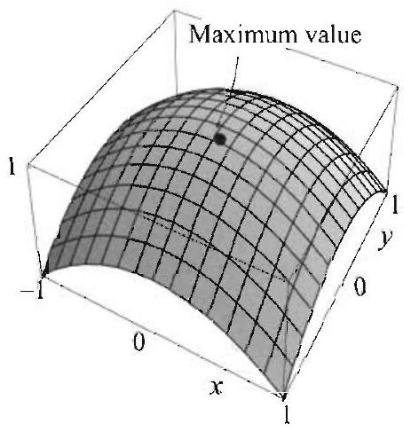
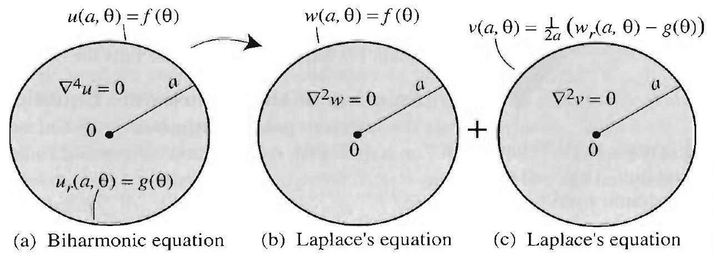
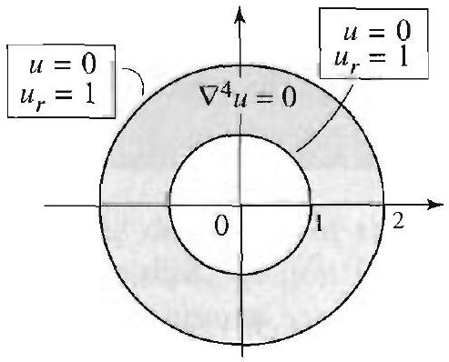
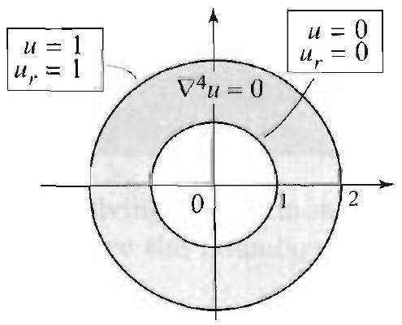

### 14.6 The Biharmonic Operator

In this and the following sections we consider boundary value problems on plates. As in the case of beams, the equations will involve fourth-order partial derivatives with respect to the spacial variables, due to the rigidity of the plates. Whereas with membranes the Laplacian plays a central role, here the iterated Laplacian or biharmonic operator will be at the heart of most equations. The biharmonic operator of $u(x, y)$ is defined as

$$
\nabla^{4} u=\nabla^{2}\left(\nabla^{2} u\right) .
$$

In Cartesian coordinates,

$$
\begin{aligned}
\nabla^{4} u(x, y) & =\nabla^{2}\left(u_{x x}+u_{y y}\right)=\left(u_{x x}+u_{y y}\right)_{x x}+\left(u_{x x}+u_{y y}\right)_{y y} \\
& =u_{x x x x}+u_{y y x x}+u_{x x y y}+u_{y y y y} \\
& =u_{x x x x}+2 u_{y y x x}+u_{y y y y}
\end{aligned}
$$

The fourth partial derivatives present a new challenge. Moreover, unlike Laplace's equation, you cannot separate the variables in the biharmonic equation in Cartesian coordinates:

$$
u_{x x x x}+2 u_{y y x x}+u_{y y y y}=0
$$

In fact, if we set $u(x, y)=X(x) Y(y)$ and plug into the equation, we get

$$
X^{\prime \prime \prime \prime} Y+2 X^{\prime \prime} Y^{\prime \prime}+X Y^{\prime \prime \prime \prime}=0,
$$

and clearly the variables cannot be separated in this equation. It turns out, however, that we can separate the variables in the biharmonic equation in polar coordinates. It is still an overwhelming task to work with the biharmonic equation directly. Instead, in this and the following section, as we search for analytical solutions, we will use clever methods to reduce to problems involving the Laplacian. These reductions work in polar coordinates but again fail in Cartesian coordinates. Because of this fact, we will forgo the search for analytical solutions in Cartesian coordinates (numerical solutions can be used for such problems) and work in polar coordinates.

We call a biharmonic function any solution of the biharmonic equation. Observe that any harmonic function $u$ is also biharmonic. This is clear, since if $\nabla^{2} u=0$, then $\nabla^{4}(u)=\nabla^{2}\left(\nabla^{2}(u)\right)=\nabla^{2}(0)=0$. The following provides a way to construct biharmonic functions, which are not necessarily harmonic.

## EXAMPLE 1 Biharmonic functions

Show that if $u=u(x, y)$ is harmonic and

$$
v=u \cdot\left(A\left(x^{2}+y^{2}\right)+B x+C y+D\right),
$$

where $A, B, C$, and $D$ are constants, then $v$ is biharmonic.
Solution We have to verify that $\nabla^{4} v=0$. As a first step, establish the identity

$$
\nabla^{2}(\phi \cdot \psi)=\psi \nabla^{2}(\phi)+\phi \nabla^{2}(\psi)+2 \phi_{x} \psi_{x}+2 \phi_{y} \psi_{y}
$$

(Exercise 10). Apply this identity with $u=\phi$ and $\psi=A\left(x^{2}+y^{2}\right)+B x+C y+D$, $\nabla^{2} u=0(u$ is harmonic $), \nabla^{2}\left(A\left(x^{2}+y^{2}\right)+B x+C y+D\right)=4 A, \psi_{x}=2 A x+B$, and $\psi_{y}=2 A y+C$; then

$$
\begin{aligned}
\nabla^{4} v & =\nabla^{2} \nabla^{2}\left(u \cdot\left(A\left(x^{2}+y^{2}\right)+B x+C y+D\right)\right) \\
& =\nabla^{2}\left(4 A u+2 u_{x}(2 A x+B)+2 u_{y}(2 A y+C)\right) \\
& =4 A \nabla^{2} u+2 \nabla^{2}\left(u_{x}(2 A x+B)\right)+2 \nabla^{2}\left(u_{y}(2 A y+C)\right) \\
& =2 \nabla^{2}\left(u_{x}(2 A x+B)\right)+2 \nabla^{2}\left(u_{y}(2 A y+C)\right) .
\end{aligned}
$$

Since $\nabla^{2} u=0$, then $\nabla^{2}\left(u_{x}\right)=\left(\nabla^{2} u\right)_{x}=0$, and, similarly, $\nabla^{2}\left(u_{y}\right)=0$. Also, $2 A x+B$ is a linear function, so $\nabla^{2}(2 A x+B)=0$. Similarly, $\nabla^{2}(2 A y+C)=0$. Applying (4), we find

$$
\nabla^{2}\left(u_{x}(2 A x+B)\right)=2\left(u_{x}\right)_{x}(2 A x+B)_{x}+2\left(u_{x}\right)_{y}(2 A x+B)_{y}=4 A u_{x x},
$$

because $(2 A x+B)_{y}=0$. Similarly, $\nabla^{2}\left(u_{y}(2 A y+C)\right)=4 A u_{y y}$. Hence $\nabla^{4} v= 8 A u_{x x}+8 A u_{y y}=8 A\left(u_{x x}+u_{y y}\right)=0$.

Figure 1 A biharmonic function that attains its maximum inside a region.

Taking $u(x, y)=1, A=-1, D=1$, and $B=C=0$ in (3), we obtain

$$
v(x, y)=1-x^{2}-y^{2} .
$$

We have $\nabla^{2} v=-2-2=-4$ and $\nabla^{4} v=\nabla^{2}(-4)=0$. Thus, as expected, $v$ is biharmonic but not harmonic. The graph of $v$ over the rectangle $-1 \leq x, y \leq 1$, in Figure 1, illustrates an important distinction between harmonic and biharmonic functions. The maximum value of $v$ is attained at the point $(0,0)$ inside the rectangle, which is unlike nonconstant harmonic functions whose maximum and minimum values must occur on the boundary (the maximum principle, Section 3.11). Thus the maximum principle, which holds for harmonic functions, fails for biharmonic functions.

## Solution of the Biharmonic Equation

We switch to polar coordinates ( $r, \theta$ ) and consider the biharmonic equation on a disk with center at the origin and radius $a>0$ :

$$
\nabla^{4} u=0, \quad 0 \leq r<a, \quad 0 \leq \theta \leq 2 \pi .
$$

Because the biharmonic equation involves fourth order derivatives, we impose two conditions on the boundary that specify the boundary values of $u$ and its normal derivative. Since the normal derivative is $\frac{\partial u}{\partial r}$ (or simply $u_{r}$ ) for the disk, we will consider (5) subject to the boundary conditions

$$
u(a, \theta)=f(\theta), \quad \frac{\partial u}{\partial r}(a, \theta)=g(\theta), \quad 0 \leq \theta \leq 2 \pi .
$$

We solve the boundary value problem (5)-(6) by reducing it to two Dirichlet problems on the disk, as follows. Consider a function of the form

$$
u(r, \theta)=\left(a^{2}-r^{2}\right) v(r, \theta)+w(r, \theta)
$$

where $v$ and $w$ are harmonic. Since $r^{2}=x^{2}+y^{2}$, it follows from Example 1 that $\left(a^{2}-r^{2}\right) v$ is biharmonic. And since $w$ is biharmonic, it follows that the right side of (7) is biharmonic, being the sum of two biharmonic functions. So $u$ satisfies (5). We next determine $v$ and $w$ so as to satisfy the boundary conditions (6). Since both $v$ and $w$ are harmonic, they are determined by their values on the boundary of the disk. Setting $r=a$ in (7) and using $u(a, \theta)=f(\theta)$, we determine the boundary values for $w$ :

$$
w(a, \theta)=f(\theta)
$$

Thus $w$ is the (unique) solution of the Dirichlet problem on the disk with boundary values (8). To find $w$, we use techniques from Section 4.4. Next, we determine the boundary values of $v$, which in turn will determine $v$ itself.

## THEOREM 1 SOLUTION OF THE BIHARMONIC EQUATION

For this purpose, differentiate both sides of (7) with respect to $r$, set $r=a$, use $u_{r}(a, \theta)=g(\theta)$, and get

$$
\begin{aligned}
u_{r}(r, \theta) & =-2 r v(r, \theta)+\left(a^{2}-r^{2}\right) v_{r}(r, \theta)+w_{r}(r, \theta) ; \\
u_{r}(a, \theta)=g(\theta) & =-2 a v(a, \theta)+w_{r}(a, \theta) ; \\
v(a, \theta) & =\frac{1}{2 a}\left(w_{r}(a, \theta)-g(\theta)\right) .
\end{aligned}
$$

Figure 2 Decomposition of a biharmonic problem with two boundary conditions into two Dirichlet problems with one boundary condition each.

Since $w$ is determined at this point, $w_{r}(a, \theta)$ is therfore known and the last equation determines the boundary values of $v$. Thus $v$ is the (unique) solution of the Dirichlet problem inside the disk with boundary values (9). This determines $v$ and $w$ in (7) and solves the boundary value problem (5)(6). The method is illustrated in Figure 2 and summarized in Theorem 1.

The solution of the boundary value problem (5)-(6) is the biharmonic function $u$ given by (7), where $v$ and $w$ are solutions of the Dirichlet problems on the disk with boundary values for $w$ given by (8) (same as the boundary values of $u$ ) and boundary values for $v$ given by (9).

As in the derivation of the solution, when solving a biharmonic equation inside the disk, we first find $w$ and then $v$, since the boundary values of $v$ depend on those of $w$.

## EXAMPLE 2 Biharmonic equation

On the unit disk, solve

$$
\nabla^{4} u=0, \quad u(1, \theta)=\cos \theta \quad \text { and } \quad u_{r}(1, \theta)=\sin \theta .
$$

Solution According to Theorem 1, the solution is of the form

$$
u(r, \theta)=\left(1-r^{2}\right) v+w
$$

where $v$ and $w$ are harmonic functions in the unit disk. The boundary values of $w$ are the same as those of $u$. Thus, to find $w$, we must solve $\nabla^{2} w=0$ subject to $w(1, \theta)=\cos \theta$. We know from Section 4.4 that the solution of this problem is given by $w(r, \theta)=a_{0}+\sum_{n=1}^{\infty} r^{n}\left(a_{n} \cos n \theta+b_{n} \sin n \theta\right)$, where $a_{n}$ and $b_{n}$ are the Fourier coefficients of the boundary function, $f(\theta)=\cos \theta$. Immediately, we conclude that $a_{1}=1$ and all other coefficients are 0 . So $w(r, \theta)=r \cos \theta$.

Having found $w$, we can determine the boundary values of $v$ from (9), using $g(\theta)=\sin \theta$ and $\left.w_{r}(r, \theta)\right|_{r=1}=\cos \theta$. We have

$$
v(1, \theta)=\frac{1}{2}(\cos \theta-\sin \theta)
$$

Arguing as we did with the solution of the Dirichlet problem for $w$, we see that the solution of the Dirichlet problem with boundary values $\frac{1}{2}(\cos \theta-\sin \theta)$ is $v(r, \theta)= \frac{1}{2} r(\cos \theta-\sin \theta)$. Thus the solution of the biharmonic problem is

$$
u(r, \theta)=\left(1-r^{2}\right) \frac{1}{2} r(\cos \theta-\sin \theta)+r \cos \theta
$$

You should check that this function is indeed a solution. Note that $r \cos \theta$ is harmonic but $\left(1-r^{2}\right) \frac{1}{2} r(\cos \theta-\sin \theta)$ is not. As a consequence, the function $u$ is not harmonic on the disk.

Even though the boundary conditions in Example 2 are somewhat special, they do illustrate the process of solving a biharmonic equation by reducing to two Dirichlet problems and the role of Fourier series. Here is one more illustration.

## EXAMPLE 3 Biharmonic function with 0 boundary values

On the unit disk, show that the solution of the boundary value problem

$$
\nabla^{4} u=0, \quad u(1, \theta)=0 \text { and } u_{r}(1, \theta)=g(\theta)
$$

is given by

$$
u(r, \theta)=-\frac{1}{2}\left(1-r^{2}\right)\left[a_{0}+\sum_{n=1}^{\infty} r^{n}\left(a_{n} \cos n \theta+b_{n} \sin n \theta\right)\right]
$$

where $a_{0}, a_{n}$ and $b_{n}$ are the Fourier coefficients of $g$.
Solution By Theorem 1, the solution is of the form

$$
u(r, \theta)=\left(1-r^{2}\right) v+w
$$

where $v$ and $w$ are harmonic functions on the unit disk. Since $w$ is 0 on the boundary, we conclude that $w$ is identically 0 inside the unit disk. Thus,

$$
u(r, \theta)=\left(1-r^{2}\right) v
$$

To solve the given problem, start with a biharmonic function of the form described by Exercise 9 and determine the constants in order to satisfy the boundary conditions.

Using (9) and the fact that $w_{r}=0$, we obtain the boundary values of $v$ :

$$
v(1, \theta)=-\frac{1}{2} g(\theta) .
$$

Using results from Section 4.4, we find that the solution of the Dirichlet problem with boundary values $-\frac{1}{2} g(\theta)$ is

$$
v(r, \theta)=-\frac{1}{2}\left[a_{0}+\sum_{n=1}^{\infty} r^{n}\left(a_{n} \cos n \theta+b_{n} \sin n \theta\right)\right],
$$

where $a_{0}, a_{n}$ and $b_{n}$ are the Fourier coefficients of $g$. This determines $v$ and shows that the desired solution is as claimed.

## Exercises 6.6

In Exercises 1-8, verify that the given function is biharmonic. Use the result of Example 1 where appropriate. In what follows, $(x, y)$ denote Cartesian coordinates, $(r, \theta)$ polar coordinates, and $n$ an integer.

1. $x^{4}-y^{4}$.
2. $x y^{2}+y x^{2}+x^{3}-2 y^{3}$.
3. $\frac{x^{2}}{x^{2}+y^{2}}$.
4. $\frac{x y}{x^{2}+y^{2}}$.
5. $\left(1-r^{2}\right) r^{2} \cos 2 \theta$.
6. $r^{3}(\cos \theta+\sin \theta)$.
7. $r^{n+2} \cos n \theta$.
8. $r^{2} \ln r$.

## 11.

Figure 3 for Exercise 11.

12. 

Figure 4 for Exercise 12.

9. Show that $a r^{2} \ln r+b r^{2}+c \ln r+d$ is biharmonic, where $a, b, c, d$ are constants. This function is useful in solving the biharmonic equation in an annulus with boundary data independent of $\theta$. See Exercises 11 and 12 .
10. Prove (4).

In Exercises 11 and 12, solve the problem that is described in the figure.
13. On the unit disk, solve $\nabla^{4} u=0$, subject to $u(1, \theta)=\cos 2 \theta$ and $u_{r}(1, \theta)=0$.
14. On the unit disk, solve $\nabla^{4} u=0$, subject to $u(1, \theta)=0$ and $u_{T}(1, \theta)=1$.
15. On the unit disk, solve $\nabla^{4} u=0$, subject to $u(1, \theta)=1$ and $u_{T}(1, \theta)=\cos \theta$.
16. On the unit disk, solve $\nabla^{4} u=0, u(1, \theta)=0$ and $u_{r}(1, \theta)=\theta^{2},-\pi<\theta<\pi$.
17. On the unit disk, solve $\nabla^{4} u=0$, subject to $u(1, \theta)=0$ and $u_{r}(1, \theta)=g(\theta)$.
18. On the unit disk, solve $\nabla^{4} u=0$, subject to $u(1, \theta)=f(\theta)$ and $u_{r}(1, \theta)=0$.
