## Topics to Review

In studying this chapter, it will help to keep in mind some specific examples of orthogonal functions and their associated expansion theory. For example, you might use Fourier series or Bessel expansions as your basis for comparison. Sections 6.1, 6.2, and 6.4 are self-contained. Sections 14.1 and 14.2 develop the general subject of Sturn-Liouville theory for boundary value problems associated with second order linear ordinary differential equations. Section 14.4 develops a corresponding theory for certain fourth-order problems. In Sections 14.3 and 14.5 we look at specific classical applications of the second and fourth-order theories, respectively.

## Looking Ahead...

The applications in this chapter are some of the most beautiful in physics and engineering. They put together different theories and use almost all our knowledge of special series expansions. Even though these applications are all classical, they are presented in a way that invites the use of computers. For example, in the hanging chain problem (Section 14.3), the solution is carried out to a point where it can be fed into a computer to generate pictures that simulate the motion of the hanging chain. The computer can be used in a similar way to illustrate the new expansion results arising in SturmLiouville theory, especially the complicated fourth-order expansions and their related applications to the elastic vibrations of beams (Sections 6.4, 6.5).

## 14

## STURM-LIOUVILLE THEORY WITH ENGINEERING APPLICATIONS

It is not once nor twice but times without number that the same ideas make their appearance in the world.
-ARISTOTLE

In the previous chapters you may have noticed a common theme in the solutions of the various boundary value problems. In each case, after separating variables, we had to solve a boundary value problem for an ordinary differential equation. Although the equations were often different, their solutions shared the common properties of being orthogonal and of having expansion theorems. We were then able to express an arbitrary function in a series in terms of these special orthogonal solutions. In this way, we encountered Legendre, Bessel, Fourier, and other related expansions. Are these expansions isolated theories that happened to share common properties, or are they part of a general theory that unifies them all?

The main focus of this chapter is to develop a general theory that encompasses all the specific expansion theorems considered previously, including Fourier, Fourier sine, Fourier cosine, Bessel, and Legendre expansions. This theory is named after Sturm and Liouville, who developed it in the early part of the nineteenth century in their studies of heat conduction problems, not long after the ground-breaking work of Fourier.

Beyond its esthetic appeal, Sturm-Liouville theory has many applications in applied mathematics, physics, and engineering. We will use it to obtain further expansion results rather than developing them on a case-by-case basis. Several classical applications are presented in this chapter, including the problems of the hanging chain (Section 14.3), the vibrating beam (Section 14.5), and the theory of plates and the biharmonic operator (Sections 14.6-14.7).

### 14.1 Orthogonal Functions

You may recall from your first course in differential equations how certain notions from linear algebra were crucial in studying solutions of differential equations. For example, to check whether two solutions of a second order linear differential equation yield the general solution, it is enough to show that the determinant of a certain matrix (the Wronskian) is nonzero (see Appendix A.1). These and other notions, such as linear independence and basis, contributed in an essential way to our understanding of solutions of differential equations. Similarly, our development of the theory of Sturm-Liouville in this chapter will require notions from linear algebra that are somewhat abstract but simple to explain in the context of a finite-dimensional vector space. For this reason, we start our discussion by reviewing some basic concepts from linear algebra, specialized to vectors in three dimensions.

Recall that the inner product of two vectors $\boldsymbol{x}=\left(x_{1}, x_{2}, x_{3}\right)$ and $\boldsymbol{y}=\left(y_{1}, y_{2}, y_{3}\right)$ is the number $\boldsymbol{x} \cdot \boldsymbol{y}=(\boldsymbol{x}, \boldsymbol{y})=x_{1} y_{1}+x_{2} y_{2}+x_{3} y_{3}$. Two nonzero vectors $\boldsymbol{x}$ and $\boldsymbol{y}$ are said to be orthogonal if $\boldsymbol{x} \cdot \boldsymbol{y}=0$. A set of nonzero vectors is said to be orthogonal if any two distinct vectors from this set are orthogonal. A simple example of an orthogonal set consists of the vectors $\boldsymbol{e}_{1}=(1,0,0), \boldsymbol{e}_{2}=(0,1,0)$, and $\boldsymbol{e}_{3}=(0,0,1)$. The inner product is also used to define the norm of a vector $\boldsymbol{v}$ by

$$
\|\boldsymbol{v}\|=\sqrt{(\boldsymbol{v}, \boldsymbol{v})}=\left(\sum_{j=1}^{3} v_{j}^{2}\right)^{1 / 2} .
$$

Here are two properties of the set $\left\{\boldsymbol{e}_{1}, \boldsymbol{e}_{2}, \boldsymbol{e}_{3}\right\}$ that we wish to investigate for sets of functions:

- The set $\left\{\boldsymbol{e}_{1}, \boldsymbol{e}_{2}, \boldsymbol{e}_{3}\right\}$ is complete. That is, if $\boldsymbol{v}$ is a vector that is orthogonal to $e_{1}, e_{2}$, and $e_{3}$ then $v=0$.
- The set $\left\{e_{1}, e_{2}, e_{3}\right\}$ is a generating set. That is, every vector $\boldsymbol{v}= \left(v_{1}, v_{2}, v_{3}\right)$ can be written as

$$
v=\sum_{j=1}^{3}\left(v, e_{j}\right) e_{j}
$$

## Inner Products and Orthogonality of Functions

In defining the inner product of two vectors, we summed the products of their components. To define the inner product of two functions, we will integrate their product as follows. Let $f$ and $g$ be real-valued functions defined on an interval $(a, b)$ (the interval may be infinite). The inner product of $f$ and $g$, denoted $(f, g)$, is the number

If $f$ and $g$ are complex-valued, then define

$$
(f, g)=\int_{a}^{b} f(x) \overline{g(x)} d x
$$

ORTHOGONAL FUNCTIONS

In the definitions of orthogonality and norm, you should use the appropriate definition of ( $f, g$ ) for complex-valued functions.

$$
(f, g)=\int_{a}^{b} f(x) g(x) d x
$$

This terminology is the same as for the inner product of vectors because the function ( $\cdot, \cdot$ ) defined in (3) satisfies the same properties as the inner product of vectors (see Exercise 21). We will assume that the functions are real-valued and nice enough that all integrals of the form (3) exist. This is for example the case, if the functions are piecewise continuous.

$$
\begin{aligned}
& \text { The functions } f \text { and } g \text { are called orthogonal on the interval }(a, b) \text { if } \\
& \qquad(f, g)=\int_{a}^{b} f(x) g(x) d x=0
\end{aligned}
$$

We define the norm of $f$, denoted $\|f\|$, by

$$
\|f\|=\sqrt{(f, f)}=\left(\int_{a}^{b}|f(x)|^{2} d x\right)^{1 / 2}
$$

If $\|f\|<\infty$, we also say that $f$ is square integrable on $(a, b)$. If $f$ is real-valued, then $|f(x)|^{2}$ is simply $f^{2}(x)$. But if $f$ is complex-valued, then $|f(x)|^{2}=f(x) \overline{f(x)}$. Note how both definitions, orthogonality and norm, are based on the notion of inner products as they were in the finite-dimensional case. (Compare with (2).) A set of functions $\left\{f_{1}, f_{2}, f_{3}, \ldots\right\}$ defined on the interval ( $a, b$ ) is called an orthogonal set if $\left\|f_{n}\right\| \neq 0$ for all $n$, and each distinct pair of functions from the set is orthogonal, that is, $\left(f_{n}, f_{m}\right)=$ 0 for $n \neq m$. If, in addition, the norm of each $f_{n}$ is 1 , the set is called an orthonormal set. Hence, if we divide each function in an orthogonal set by its norm we obtain an orthonormal set.

## EXAMPLE 1 Orthogonal functions

Show that the set of functions $f_{n}(x)=\sin n x(n=1,2, \ldots)$ is orthogonal on the interval $[-\pi, \pi]$ and obtain the corresponding orthonormal set.
Solution We need to show that $\|\sin n x\| \neq 0$ and each distinct pair of functions in the given set is orthogonal. We have

$$
\|\sin n x\|^{2}=\int_{-\pi}^{\pi} \sin ^{2} n x d x=\int_{-\pi}^{\pi} \frac{1-\cos 2 n x}{2} d x=\pi
$$

Thus the norm of $\sin n x$ is $\|\sin n x\|=\sqrt{\pi} \neq 0$. For $m \neq n$ we have

$$
\int_{-\pi}^{\pi} \sin m x \sin n x d x=\frac{1}{2} \int_{-\pi}^{\pi}[\cos (m-n) x-\cos (m+n) x] d x=0
$$

To obtain an orthonormal set we divide each function by its norm, thus obtaining functions of norm 1. The corresponding orthonormal set is

$$
\frac{\sin x}{\sqrt{\pi}}, \frac{\sin 2 x}{\sqrt{\pi}}, \frac{\sin 3 x}{\sqrt{\pi}}, \ldots
$$

The next example deals with the trigonometric system from Fourier series. Note that this set has the set from Example 1 as a subset.

## EXAMPLE 2 The trigonometric system

The set of functions

$$
1, \sin x, \cos x, \sin 2 x, \cos 2 x, \sin 3 x, \cos 3 x, \ldots
$$

is orthogonal on the interval $[-\pi, \pi]$ (see Section 2.1). To obtain the corresponding orthonormal set, we compute $\|\cos n x\|=\|\sin n x\|=\sqrt{\pi} \neq 0$, for $n=1,2, \ldots$. Also, the norm of the function identically 1 over the interval $[-\pi, \pi]$ is equal to $\sqrt{2 \pi}$. Thus the orthonormal set is

$$
\frac{1}{\sqrt{2 \pi}}, \frac{\sin x}{\sqrt{\pi}}, \frac{\cos x}{\sqrt{\pi}}, \frac{\sin 2 x}{\sqrt{\pi}}, \frac{\cos 2 x}{\sqrt{\pi}}, \frac{\sin 3 x}{\sqrt{\pi}}, \frac{\cos 3 x}{\sqrt{\pi}}, \ldots
$$

## EXAMPLE 3 Legendre polynomials

It was shown in Section 5.6 that the Legendre polynomials satisfy

$$
\int_{-1}^{1} P_{n}^{2}(x) d x=\frac{2}{2 n+1} \quad \text { and } \quad \int_{-1}^{1} P_{m}(x) P_{n}(x) d x=0 \quad \text { for } m \neq n
$$

Thus the Legendre polynomials form an orthogonal set on $[-1,1]$.

## Generalized Fourier Series

Let $A$ be a class of functions on ( $a, b$ ). For example, $A$ could be the class of all continuous functions on $(a, b)$; or $A$ could be the class of all piecewise smooth functions; or $A$ could be the class of all square integrable functions $f$ on ( $a, b$ ). Suppose $f_{1}, f_{2}, f_{3}, \ldots$ is an orthogonal set of functions in $A$. As in the finite-dimensional case, the following questions arise:

1. Do the functions $f_{1}, f_{2}, f_{3}, \ldots$ generate $A$ ? That is, given a function $f$ in $A$, is it possible to express $f$ as a series of the form

$$
f(x)=\sum_{j=1}^{\infty} a_{j} f_{j}(x)
$$

where the $a_{j}$ 's are real or complex numbers?
2. If the representation (4) is possible, how do we find the coefficients $a_{j}$ ?

A complete treatment of these questions requires machinery that is beyond the scope of this text. Without going far into the theory of orthogonal functions, we will try to motivate the answers to these fundamental questions
through examples. Starting with the second question, and taking a hint from (1), our guess is that the coefficients in (4) should be given in terms of the inner products of $f$ with $f_{1}, f_{2}, f_{3}, \ldots$. To see this, we proceed as we have done before with Fourier series. We multiply both sides of (4) by $f_{k}$ and integrate term by term on the interval $(a, b)$. This gives

$$
\int_{a}^{b} f(x) f_{k}(x) d x=\sum_{j=1}^{\infty} a_{j} \int_{a}^{b} f_{j}(x) f_{k}(x) d x
$$

Because of orthogonality, the $k$ th term is the only nonzero term on the right side and so

$$
\int_{a}^{b} f(x) f_{k}(x) d x=a_{k} \int_{a}^{b} f_{k}^{2}(x) d x
$$

The left side is the inner product of $f$ and $f_{k}$, and the integral on the right side is the square of the norm of $f_{k}$, so $\left(f, f_{k}\right)=a_{k}\left\|f_{k}\right\|^{2}$. Thus

$$
a_{k}=\frac{\left(f, f_{k}\right)}{\left\|f_{k}\right\|^{2}}=\frac{1}{\left\|f_{k}\right\|^{2}} \int_{a}^{b} f(x) f_{k}(x) d x
$$

This motivates the following answer to the second question.

THEOREM 1 GENERALIZED FOURIER SERIES

If $f_{1}, f_{2}, f_{3}, \ldots$ is a set of orthogonal functions on $(a, b)$ and if $f$ can be represented as a series in the form (4), then

$$
f(x)=\sum_{j=1}^{\infty} \frac{\left(f, f_{j}\right)}{\left\|f_{j}\right\|^{2}} f_{j}(x)
$$

The series (6) is called a generalized Fourier series. Examples of such series include Fourier, Legendre, and Bessel series of the previous chapters.

We now turn to the first question. Again, we take a hint from the three-dimensional real vector space. For the classes of functions that we will consider in this book, a set of orthogonal functions $f_{1}, f_{2}, f_{3}, \ldots$ in $A$ generates $A$ if and only if the the orthogonal functions $f_{1} ; f_{2}, f_{3}, \ldots$ form a complete set of function in the following sense: If $f$ is orthogonal to every $f_{j}, j=1,2,3, \ldots$, then $f$ must be identically 0 .

In the case of Fourier series on the interval $[-\pi, \pi]$, the functions $1, \cos x$, $\cos 2 x, \cos 3 x, \ldots, \cos n x, \ldots, \sin x, \sin 2 x, \sin 3 x, \ldots, \sin n x, \ldots$ form an orthogonal set of functions on $[-\pi, \pi]$. By the Fourier series representation theorem, this set also generates the class $A$ of $2 \pi$-periodic, piecewise smooth functions. What does completeness mean in this case? It means that if all the Fourier coefficients of a function $f$ are zero, then $f$ must be identically zero. This fact follows from the Fourier series representation theorem, since

ORTHOGONALITY WITH RESPECT TO A WEIGHT
if we set all the coefficients of $f$ equal to 0 , then the Fourier series of $f$ is identically 0 . But the Fourier series converges to $f$, and so $f$ must be zero.

To establish the completeness of a set of functions is difficult in general. The good news is that most orthogonal sets of functions that we will encounter arise from solutions of ordinary differential equations that fit the so-called Sturm-Liouville theory form. The completeness property of these sets of functions is a consequence of general results from the Sturm-Liouville theory. (See Theorem 3, Section 14.2.)

## Orthogonality with Respect to a Weight

What we have presented thus far can be extended to functions that are orthogonal with respect to a weight function. We have encountered such situations in the study of Bessel series. In general, if $f$ and $g$ are real-valued functions on $(a, b)$, we define their inner product with respect to the weight $\boldsymbol{w}$ to be the number

$$
(f, g)=\int_{a}^{b} f(x) g(x) w(x) d x
$$

We assume that $w(x)$ is a nonnegative piecewise continuous function on $[a, b]$ that is not identically 0 on any subinterval of $[a, b]$. The corresponding definition of orthogonality is as follows.

The functions $f$ and $g$ are orthogonal with respect to the weight function $w$ on the interval $[a, b]$ if

$$
\int_{a}^{b} f(x) g(x) w(x) d x=0
$$

The norm of $f$ with respect to the weight function $w$ is

$$
\|f\|=\left(\int_{a}^{b}|f(x)|^{2} w(x) d x\right)^{1 / 2}
$$

## EXAMPLE 4 Orthogonality with respect to a weight

(a) The functions $f_{n}(x)=\cos n x(n=1,2, \ldots)$ satisfy $\int_{-\pi}^{\pi} f_{m}(x) f_{n}(x) d x=0$ for $m \neq n$. So these functions form an orthogonal set with weight function $w(x)=1$ on the interval $(-\pi, \pi)$.
(b) Let $\alpha_{1}, \alpha_{2}, \alpha_{3}, \ldots$ denote the positive zeros of the Bessel function $J_{0}$. From Theorem 1, Section 4.8, we have $\int_{0}^{1} J_{0}\left(\alpha_{m} x\right) J_{0}\left(\alpha_{n} x\right) x d x=0$ for $m \neq n$. Thus the functions $J_{0}\left(\alpha_{n} x\right), n=1,2, \ldots$ form an orthogonal set with respect to the weight function $w(x)=x$ on the interval $(0,1)$.

The following is the analog of Theorem 1 for expansions in series with respect to functions that are orthogonal with respect to a weight.

THEOREM 2 GENERALIZED FOURIER SERIES

Although (8) looks identical to (6), you should keep in mind that computing the inner products and norms in (8) involves a weight function.

If $f_{1}, f_{2}, f_{3}, \ldots$ is a set of orthogonal functions with respect to the weight $w$ on $[a, b]$ and if $f$ can be represented as a series in the form (4), then

$$
f(x)=\sum_{j=1}^{\infty} \frac{\left(f, f_{j}\right)}{\left\|f_{j}\right\|^{2}} f_{j}(x)
$$

In Example 4(b) we observed that the functions $J_{0}\left(\alpha_{n} x\right)$ are orthogonal with weight $w(x)=x$ on the interval $(0,1)$. In Example 1 of Section 4.8 we derived the series expansion of the function $f(x)=1$ in terms of this orthogonal series. You should check that the series obtained there is the same as that in (8).

We end this section with a statement of Parseval's identity for complete orthogonal systems.

THEOREM 3 PARSEVAL'S IDENTITY

Let $f_{1}, f_{2}, f_{3}, \ldots$ be a complete set of orthogonal functions with respect to the weight $w$ on $[a, b]$ and let $f$ be such that its norm as given by (7) is finite. (That is, $f$ is square integrable with respect to the weight $w$.) Then

$$
\int_{a}^{b}|f(x)|^{2} w(x) d x=\sum_{j=1}^{\infty} \frac{\left|\left(f, f_{j}\right)\right|^{2}}{\left\|f_{j}\right\|^{2}}
$$

As we have seen in Section 2.5 with Fourier series, Parseval's identity has many important applications. We can motivate it as follows. Since the functions $f_{1}, f_{2}, f_{3}, \ldots$ form a complete orthogonal set of functions with respect to the weight $w$ on $[a, b]$, the function $f$ can be represented in a generalized series as in (8). If $f$ is real-valued, multiply both sides of (8) by $f(x) w(x)$, and integrate over the interval $[a, b]$. Assuming that we can integrate the series term by term and using the definition of the inner product with respect to the weight $w$, we get (9). If $f$ is complex-valued, we multiply both sides of (8) by $\overline{f(x)} w(x)$ and repeat the same proof.

## Exercises 6.1

In Exercises 1-8, show that the given set of functions is orthogonal with respect to the given weight on the prescribed interval.

1. $1, \sin \pi x, \cos \pi x, \sin 2 \pi x, \cos 2 \pi x, \sin 3 \pi x, \cos 3 \pi x, \ldots ; w(x)=1$ on $[0,2]$.
2. $f(x)$ is an even function, $g(x)$ is an odd function; $w(x)=1$ on any symmetric interval about 0 .
3. $1, x,-1+2 x^{2} ; w(x)=\frac{1}{\sqrt{1-x^{2}}}$ on $[-1,1]$. (These are examples of Chebyshev polynomials of the first kind. See Exercises 6.2 for further details.)
4. $-3 x+4 x^{3}, 1-8 x^{2}+8 x^{4} ; w(x)=\frac{1}{\sqrt{1-x^{2}}}$ on $[-1,1]$.
5. $1,2 x,-1+4 x^{2} ; w(x)=\sqrt{1-x^{2}}$ on $[-1,1]$. (These are examples of Chebyshev polynomials of the second kind.)
6. $1,1-x,\left(2-4 x+x^{2}\right) / 2 ; w(x)=e^{-x}$ on $[0, \infty)$. (These are examples of Laguerre polynomials.)
7. $1,2 x,-2+4 x^{2} ; w(x)=e^{-x^{2}}$ on $(-\infty, \infty)$. (These are examples of Hermite polynomials. [Hint: Exercise 33 (a), Section 4.7.]
8. $\left(2-4 x+x^{2}\right) / 2,-12 x+8 x^{3} ; w(x)=e^{-x}$ on $[0, \infty)$.
9. Determine the constants $a$ and $b$ so that the functions $1, x$, and $a+b x+x^{2}$ become orthogonal on the interval $[-1,1]$.
10. If the functions $f(x)$ and $g(x)$ are orthogonal with respect to a weight $w(x)$ on $[0, L]$, what can be said about the functions $f(a x)$ and $g(a x)$ where $a>0$ ?
11. Compute the norms of the functions in Exercise 1.
12. Compute the norms of the functions in Exercise 5.
13. What is the orthonormal set corresponding to the Legendre polynomials on the interval $[-1,1]$ ?
14. Show that if $f$ and $g$ are continuous functions on $[a, b]$ that are orthogonal with respect to the weight function 1 , then either $f$ or $g$ must vanish somewhere in $(a, b)$.
15. Show that if $f_{1}(x), f_{2}(x), \ldots$ are orthogonal on $[0,1]$ with respect to the weight $x$, then $f_{1}(\sqrt{x}), f_{2}(\sqrt{x}), \ldots$ are orthogonal on $[0,1]$ with respect to the weight function 1.
16. Parseval's identity for Fourier series. Specialize (9) to the trigonometric system (of period $2 p$ ) to obtain (6) of Section 2.5.
17. Parseval's identity for Legendre series. Use (9) to derive the identity

$$
\int_{-1}^{1} f(x)^{2} d x=\sum_{n=0}^{\infty} \frac{2 A_{n}^{2}}{2 n+1}
$$

where $A_{n}$ is the $n$th Legendre coefficient of $f$. (See Section 5.6.)
18. Parseval's identity for Bessel series. Use (9) to derive the identity

$$
\int_{0}^{R} f(x)^{2} x d x=\sum_{j=1}^{\infty} \frac{R^{2} J_{p+1}^{2}\left(\alpha_{p j}\right)}{2} A_{j}^{2}
$$

where $A_{j}$ is the $j$ th coefficient of the Bessel series expansion of $f$ of order $p$, and $\alpha_{p j}$ is the $j$ th positive zero of $J_{p}$. (See Section 4.8.)
19. Sums of reciprocals of squares of zeros of Bessel functions. Derive the following interesting formula: $\frac{1}{4(p+1)}=\sum_{j=1}^{\infty} \frac{1}{\alpha_{p j}^{2}}$. [Hint: Apply Exercise 18 with $R=1$ to the Bessel series expansion found in Exercise 20, Section 4.8.]
20. By specializing Exercise 19 to the case $p=\frac{1}{2}$, derive the identity

$$
\frac{\pi^{2}}{6}=\sum_{j=1}^{\infty} \frac{1}{j^{2}}
$$

21. Show that the inner product satisfies the following properties:
(a) $(a f, g)=a(f, g)$ for any number $a$,
(b) $(f+g, h)=(f, h)+(g, h)$,
(c) $(f, f) \geq 0$ for any function $f$.

### 14.2 Sturm-Liouville Theory

In this section we explore the interplay between orthogonal functions, orthogonal expansions, and differential equations. We study the so-called Sturm-Liouville problems, which comprise a general class of boundary value problems with sets of solutions that have the property of being mutually orthogonal. Moreover, a given function can be expressed as a generalized Fourier series in terms of these sets of orthogonal solutions.

A regular Sturm-Liouville problem is a boundary value problem on a closed finite interval $[a, b]$ of the form

## REGULAR STURM-LIOUVILLE PROBLEM

$$
\begin{aligned}
& {\left[p(x) y^{\prime}\right]^{\prime}+[q(x)+\lambda r(x)] y=0, \quad a<x<b} \\
& \text { (a) }\left\{\begin{array}{c}
c_{1} y(a)+c_{2} y^{\prime}(a)=0 \\
d_{1} y(b)+d_{2} y^{\prime}(b)=0
\end{array}\right.
\end{aligned}
$$

where at least one of $c_{1}$ and $c_{2}$ and at least one of $d_{1}$ and $d_{2}$ are nonzero, and $\lambda$ is a parameter. Equation (1) is said to be in Sturm-Liouville form. We further assume the regularity conditions: $p(x), p^{\prime}(x), q(x)$, and $r(x)$ are continuous on the closed interval $a \leq x \leq b$, with $p(x)>0$ and $r(x)>0$ for $a \leq x \leq b$. Often there is no need to mention the interval $a<x<b$ explicitly, since $a$ and $b$ can be understood from the boundary conditions.

A singular Sturm-Liouville problem is a boundary value problem consisting of equation (1) either on a finite interval where at least one of the regularity properties fails or on an infinite interval. In this case the boundary conditions are not always described by sets of equations like (2a) and (2b). Typically, a Sturm-Liouville problem is singular either because it occurs on an infinite interval, or because one or more of the coefficients goes to 0 or $\infty$ at an endpoint of the interval, or both. Indeed, it is convenient to require that $p(x), p^{\prime}(x), q(x)$, and $r(x)$ are continuous on the open interval $a<x<b$, with $p(x)>0$ and $r(x)>0$ for $a<x<b$. This will be the case for all singular problems encountered in this book. We illustrate with some examples.

Figure $1 \sinh x$ is always increasing.

## EXAMPLE 1 Classical singular Sturm-Liouville problems

(a) Legendre's equation $\left(1-x^{2}\right) y^{\prime \prime}-2 x y^{\prime}+n(n+1) y=0$ can be put in the Sturm-Liouville form

$$
\left[\left(1-x^{2}\right) y^{\prime}\right]^{\prime}+n(n+1) y=0, \quad-1<x<1,
$$

with $p(x)=1-x^{2}, q(x)=0, r(x)=1$, and $\lambda=n(n+1)$. Note that $p( \pm 1)=0$, and so one of the regularity conditions is not satisfied.
(b) Parametric form of Bessel's equation This refers to equation (18) in Section 4.8. It is easy to check that this equation can be put in the Sturm-Liouville form

$$
\left[x y^{\prime}\right]^{\prime}+\left[-\frac{p^{2}}{x}+\lambda^{2} x\right] y=0, \quad 0<x<a, \quad y(a)=0 .
$$

So $p(x)=r(x)=x, q(x)=-\frac{p^{2}}{x}$, and the parameter is written as $\lambda^{2}$. The regularity conditions are not all met, because $q(x)$ is not defined at 0 , and also $p(0)=r(0)=0$. Hence, this problem is a singular Sturm-Liouville problem. $\square$

Clearly $y=0$ is a solution of every Sturm-Liouville problem. The nonzero solutions of a Sturm-Liouville problem are called the eigenfunctions of the problem, and those values of $\lambda$ for which nonzero solutions can be found are called the eigenvalues. In Example 2 we see how to determine eigenvalues and eigenfunctions.

## EXAMPLE 2 A regular Sturm-Liouville problem

Find the eigenvalues and corresponding eigenfunctions of the Sturm-Liouville problem

$$
y^{\prime \prime}+\lambda y=0, \quad y(0)=y(\pi)=0 .
$$

Solution This differential equation fits the form of (1) with $p(x)=1, q(x)=0$, and $r(x)=1$. In the boundary conditions, $a=0$ and $b=\pi$, with $c_{1}=d_{1}=1$ and $c_{2}=d_{2}=0$, so this is a regular Sturm-Liouville problem.

We seek nonzero solutions of the problem. As is often the case with SturmLiouville problems, the nature of the solution depends on the sign of $\lambda$, so we consider three cases.

CASE 1: $\lambda<0$. Let us write $\lambda=-\alpha^{2}$, where $\alpha>0$. Then the equation becomes $y^{\prime \prime}-\alpha^{2} y=0$, and its general solution is $y=c_{1} \sinh \alpha x+c_{2} \cosh \alpha x$. We need $y(0)=0$, so substituting into the general solution gives $c_{2}=0$. Now using the condition $y(\pi)=0$, we get $0=c_{1} \sinh \alpha \pi$, and since $\sinh x \neq 0$ unless $x=0$ (see Figure 1), we infer that $c_{1}=0$. Thus there are no nonzero solutions in this case.

CASE 2: $\lambda=0$. Here the general solution of the differential equation is $y= c_{1} x+c_{2}$, and as in Case 1 the boundary conditions force $c_{1}$ and $c_{2}$ to be 0 . Thus again there is no nonzero solution.
CASE 3: $\lambda>0$. In this case we can write $\lambda=\alpha^{2}$ with $\alpha>0$, and so the equation becomes $y^{\prime \prime}+\alpha^{2} y=0$. The general solution is $y=c_{1} \cos \alpha x+c_{2} \sin \alpha x$. From $y(0)=0$ we get $0=c_{1} \cos 0+c_{2} \sin 0$, or $0=c_{1}$. Thus $y=c_{2} \sin \alpha x$. Now we substitute the other boundary condition to get $0=c_{2} \sin \alpha \pi$. Since we are seeking

# THEOREM 1 EIGENVALUES OF REGULAR STURM-LIOUVILLE PROBLEMS 

nonzero solutions, we take $c_{2} \neq 0$. Thus we must have $\sin \alpha \pi=0$, and hence $\alpha=1,2,3, \ldots$. This means that, since $\lambda=\alpha^{2}$, the problem has eigenvalues

$$
\lambda_{1}=1, \lambda_{2}=4, \lambda_{3}=9, \ldots
$$

and corresponding eigenfunctions

$$
y_{1}=\sin x, y_{2}=\sin 2 x, y_{3}=\sin 3 x, \ldots .
$$

We have let the constant $c_{2}$ be 1 in each case. All other eigenfunctions will be nonzero multiples of these. $\square$

We now describe some fundamental properties of eigenvalues and eigenfunctions of regular Sturm-Liouville problems, all of which are illustrated by the solution to Example 2. In that example, the eigenvalues form an increasing sequence of real numbers. Moreover, to each eigenvalue there corresponds just one linearly independent eigenfunction. For instance, when $\lambda=4$ in Example 2, the corresponding eigenfunctions are all of the form $c_{2} \sin 2 x$; that is, they are all multiples of $\sin 2 x$. It can be checked easily that the eigenfunctions $\sin x, \sin 2 x, \sin 3 x, \ldots$ form an orthogonal set over the interval $0<x<\pi$. As Theorems 1 and 2 below indicate, these observations hold for all regular second order Sturm-Liouville problems. The proofs of these theorems are found in Ordinary Differential Equations, 2nd ed., by G. Birkhoff and G. Rota, Wiley, 1969.

The eigenvalues of a regular Sturm-Liouville problem are all real and form an increasing sequence

$$
\lambda_{1}<\lambda_{2}<\lambda_{3}<\cdots
$$

where $\lambda_{j} \rightarrow \infty$ as $j \rightarrow \infty$.
Our next result deals with the orthogonality of eigenfunctions. This property holds for regular as well as some singular Sturm-Liouville problems. To understand the reason behind the orthogonality property, we start by deriving some consequences of the boundary conditions (2), in regular SturmLiouville problems.

Let $\lambda_{j}$ and $\lambda_{k}$ be two distinct eigenvalues of the regular Sturm-Liouville problem (1)-(2), and let $y_{j}$ and $y_{k}$ denote their corresponding eigenfunctions. From (2a) we have

$$
\begin{aligned}
c_{1} y_{j}(a)+c_{2} y_{j}^{\prime}(a) & =0 \\
c_{1} y_{k}(a)+c_{2} y_{k}^{\prime}(a) & =0 .
\end{aligned}
$$

In matrix form this becomes

$$
\left[\begin{array}{ll}
y_{j}(a) & y_{j}^{\prime}(a) \\
y_{k}(a) & y_{k}^{\prime}(a)
\end{array}\right]\left[\begin{array}{l}
c_{1} \\
c_{2}
\end{array}\right]=\left[\begin{array}{l}
0 \\
0
\end{array}\right] .
$$

## CONDITION FOR ORTHOGONALITY IN SINGULAR STURM-LIOUVILLE PROBLEMS

Since not both $c_{1}$ and $c_{2}$ are 0 , we must have that

$$
\operatorname{det}\left[\begin{array}{ll}
y_{j}(a) & y_{j}^{\prime}(a) \\
y_{k}(a) & y_{k}^{\prime}(a)
\end{array}\right]=0,
$$

or, equivalently, $y_{k}(a) y_{j}^{\prime}(a)-y_{j}(a) y_{k}^{\prime}(a)=0$. Similarly, since the eigenfunctions satisfy (2b), we get that $y_{k}(b) y_{j}^{\prime}(b)-y_{j}(b) y_{k}^{\prime}(b)=0$. Combining these two identities and the fact that $p(a)$ and $p(b)$ are finite, we infer that

$$
p(b)\left(y_{k}(b) y_{j}^{\prime}(b)-y_{j}(b) y_{k}^{\prime}(b)\right)-p(a)\left(y_{k}(a) y_{j}^{\prime}(a)-y_{j}(a) y_{k}^{\prime}(a)\right)=0
$$

As you will see from the proof of Theorem 2, it is precisely this equation that will imply the orthogonality of the eigenfunctions.

In singular problems, since we may be dealing with infinite intervals, or with functions that may be unbounded near the endpoints, instead of (2) we will require a condition similar to (3), but stated using limits as follows.

$$
\begin{aligned}
& \text { Suppose that } y_{1} \text { and } y_{2} \text { are eigenfunctions of a Sturm-Liouville problem, } \\
& \text { corresponding to two distinct eigenvalues } \lambda_{1} \text { and } \lambda_{2} \text {, respectively. We require } \\
& \text { that } \\
& (4) \\
& \lim _{x \uparrow b} p(x)\left(y_{1}(x) y_{2}^{\prime}(x)-y_{2}(x) y_{1}^{\prime}(x)\right)-\lim _{x \downarrow a} p(x)\left(y_{1}(x) y_{2}^{\prime}(x)-y_{2}(x) y_{1}^{\prime}(x)\right)=0 .
\end{aligned}
$$

As we just noted, (4) reduces to (3) for regular Sturm-Liouville problems, and thus it holds for regular Sturm-Liouville problems. It also holds in many important singular problems, such as Legendre's and Bessel's equations (see Example 3, below).

For another interesting example where (4) holds, consider the case of (1) when $a$ and $b$ are both finite and $p(a)=p(b)>0$. Instead of (2), we require that $y(a)=y(b)$ and $y^{\prime}(a)=y^{\prime}(b)$. These conditions appear frequently in applications. They are called periodic boundary conditions. It is easy to verify that (4) holds in this case.
(a) Each eigenvalue of a regular Sturm-Liouville problem has just one linearly independent eigenfunction corresponding to it.
(b) Eigenfunctions corresponding to different eigenvalues of a regular Sturm-Liouville problem are orthogonal with respect to the weight function $r(x)$. This assertion is also valid for the other Sturm-Liouville problems allowed by condition (4).

[^0]The reason we can use a Wronskian argument to prove the linear dependence of $y_{1}$ and $y_{2}$ is because $y_{1}$ and $y_{2}$ are eigenfunctions corresponding to the same eigenvalue, and hence they are solutions of the same ordinary differential equation. This argument will not work with eigenfunctions corresponding to distinct eigenvalues.
at one point to show that $W\left(y_{1}, y_{2}\right)=0$ (Theorem 7 , Appendix A.1), so let us evaluate the Wronskian at $x=a$. We have

$$
W\left(y_{1}, y_{2}\right)(a)=\left|\begin{array}{ll}
y_{1}(a) & y_{2}(a) \\
y_{1}^{\prime}(a) & y_{2}^{\prime}(a)
\end{array}\right|=y_{1}(a) y_{2}^{\prime}(a)-y_{2}(a) y_{1}^{\prime}(a)
$$

Since $y_{1}$ and $y_{2}$ satisfy (2a), we have

$$
\left\{\begin{array}{l}
c_{1} y_{1}(a)+c_{2} y_{1}^{\prime}(a)=0 \\
c_{1} y_{2}(a)+c_{2} y_{2}^{\prime}(a)=0
\end{array}\right.
$$

Note that if we take $c_{1}=c_{2}=0$, then the system of equations is satisfied. We also know from our assumptions that the system is verified when not both $c_{1}$ and $c_{2}$ are zero. Thus the system of equations has more than one solution in $c_{1}$ and $c_{2}$. This can happen if and only if the determinant of the coefficient matrix is zero. That is, $y_{1}(a) y_{2}^{\prime}(a)-y_{1}^{\prime}(a) y_{2}(a)=0$, or, equivalently, $W\left(y_{1}, y_{2}\right)(a)=0$.
(b) Suppose $\lambda_{j} \neq \lambda_{k}$ are eigenvalues of a Sturm-Liouville problem, with corresponding eigenfunctions $y_{j}$ and $y_{k}$, respectively. Since $y_{j}$ and $y_{k}$ are solutions of (1), we have

$$
\begin{aligned}
& {\left[p(x) y_{j}^{\prime}\right]^{\prime}+\left[q(x)+\lambda_{j} r(x)\right] y_{j}=0} \\
& {\left[p(x) y_{k}^{\prime}\right]^{\prime}+\left[q(x)+\lambda_{k} r(x)\right] y_{k}=0}
\end{aligned}
$$

We multiply the first equation by $y_{k}$, the second by $y_{j}$, subtract, and simplify to get

$$
y_{k}\left[p(x) y_{j}^{\prime}\right]^{\prime}-y_{j}\left[p(x) y_{k}^{\prime}\right]^{\prime}=\left(\lambda_{k}-\lambda_{j}\right) y_{j} y_{k} r(x)
$$

Since $\frac{d}{d x}\left(p(x)\left(y_{k} y_{j}^{\prime}-y_{j} y_{k}^{\prime}\right)\right)=y_{k}\left[p(x) y_{j}^{\prime}\right]^{\prime}-y_{j}\left[p(x) y_{k}^{\prime}\right]^{\prime}$ (use the product rule and simplify to see this), we get

$$
\begin{aligned}
\left(\lambda_{k}-\lambda_{j}\right) \int_{a}^{b} y_{j}(x) y_{k}(x) r(x) d x= & \int_{a}^{b} \frac{d}{d x}\left(p(x)\left(y_{k} y_{j}^{\prime}-y_{j} y_{k}^{\prime}\right)\right) d x \\
= & \left.p(x)\left(y_{k} y_{j}^{\prime}-y_{j} y_{k}^{\prime}\right)\right|_{a} ^{b} \\
= & p(b)\left[y_{k}(b) y_{j}^{\prime}(b)-y_{j}(b) y_{k}^{\prime}(b)\right] \\
& -p(a)\left[y_{k}(a) y_{j}^{\prime}(a)-y_{j}(a) y_{k}^{\prime}(a)\right]
\end{aligned}
$$

Appealing to (4), we see that the right side of (5) is 0 . Since $\lambda_{k}-\lambda_{j} \neq 0$, we infer that

$$
\int_{a}^{b} y_{j}(x) y_{k}(x) r(x) d x=0
$$

that is, $y_{j}$ and $y_{k}$ are orthogonal with respect to the weight function $r(x)$.
Note that part (a) of Theorem 2 may fail for Sturm-Liouville problems with periodic boundary conditions, because they do not satisfy (2a), as assumed in the proof. In particular, the equation

$$
y^{\prime \prime}+\lambda y=0
$$

with periodic boundary conditions $y(-\pi)=y(\pi), y^{\prime}(-\pi)=y^{\prime}(\pi)$ has eigenvalues $\lambda_{n}=n^{2}, n=0,1,2, \ldots$ and for each $\lambda_{n}$ with $n \geq 1$ there are two
linearly independent eigenfunctions $\sin n x$ and $\cos n x$ (see Exercise 14). In general, as illustrated by this example, in any second-order Sturm-Liouville problem, each eigenvalue has at most two linearly independent eigenfunctions corresponding to it. This is a consequence of the fact that we are dealing with a second-order differential equation.

## EXAMPLE 3 Legendre polynomials and Bessel functions

(a) Looking back at Example 1(a), we see that, when Legendre's equation is put in Sturm-Liouville form, the function $p(x)=1-x^{2}$ satisfies $p( \pm 1)=0$. Thus (4) holds, and so Theorem 2 implies that its eigenfunctions, the Legendre polynomials, $P_{n}(x)(n=0,1,2, \ldots)$, are orthogonal on the interval $(-1,1)$ with respect to the weight function $r(x) \equiv 1$.
(b) In Example 1(b), we put the parametric form of Bessel's equation in SturmLiouville form and obtained the functions $p(x)=x$ and $r(x)=x$. Using the fact that $p(0)=0$ and $y(R)=0$, we see that (4) holds. Thus Theorem 2 implies that the solutions of this equation, $J_{p}\left(\frac{\alpha_{p j}}{R} x\right), j=1,2, \ldots$, are orthogonal on the interval $(0, R)$ with respect to the weight function $r(x)=x$.

It is interesting to note that we do not have to impose a boundary condition (other than boundedness) at one of the singular points in (a) or (b). We do not apply a boundary condition at $\rho=0$ in cylindrical problems with Bessel functions, or at $x= \pm 1$ for Legendre polynomials.

## Eigenfunction Expansions

From Theorem 2 it follows that if $\lambda_{1}<\lambda_{2}<\lambda_{3}<\cdots$ is the set of eigenvalues for a regular Sturm-Liouville problem, then a corresponding set of eigenfunctions $\left\{y_{1}, y_{2}, y_{3}, \ldots\right\}$ is orthogonal with respect to the weight function $r(x)$. Thus, as in Section 14.1, we can find orthogonal expansions for suitable functions in terms of $y_{1}, y_{2}, y_{3}, \ldots$. More precisely, we have the following fundamental result in Sturm-Liouville theory. Recall that the inner product ( $y_{j}, y_{k}$ ) with weight $r(x)$ is defined as $\int_{a}^{b} y_{j} y_{k} r(x) d x$ and that the norm $\left\|y_{j}\right\|$ is $\sqrt{\left(y_{j}, y_{j}\right)}$.

## THEOREM 3 EIGENFUNCTION EXPANSIONS

Let $y_{1}, y_{2}, y_{3}, \ldots$ be the collection of eigenfunctions for a regular SturmLiouville problem on an interval $[a, b]$. If $f$ is piecewise smooth on the interval $[a, b]$, then we have $f(x)=\sum_{j=1}^{\infty} A_{j} y_{j}(x)$, where

$$
A_{j}=\frac{\left(f, y_{j}\right)}{\left\|y_{j}\right\|^{2}}=\int_{a}^{b} f(x) y_{j}(x) r(x) d x / \int_{a}^{b} y_{j}^{2}(x) r(x) d x
$$

For $a<x<b$, the series converges to $f(x)$ if $f$ is continuous at $x$, and to $\frac{f(x+-)+f(x-)}{2}$ otherwise.

The series expansion is called the eigenfunction expansion of the func-
tion $f$, and the coefficients $A_{j}$ are called generalized Fourier coefficients. Fourier sine (for the corresponding regular Sturm-Liouville problem, see Example 2 above) and cosine expansions provide illustrations of this theorem. The full proof of Theorem 3 is beyond the scope of this book. But we can derive the formula for the $A_{j}$ 's from Theorem 2 of Section 14.1. Beyond this, it is clear that much more is true. We have already seen that the conclusion of this theorem is valid for the singular cases of Legendre and Bessel series. Thus, Legendre series and Bessel series are examples of eigenfunction expansions. Similarly, the example of Fourier series shows that the conclusion also holds in a case where periodic boundary conditions are imposed.

Eigenfunction expansions arise naturally in the solution of applied problems. For example, when we studied heat conduction in a bar with one radiating end (Example 2, Section 3.6), we encountered a regular SturmLiouville problem. As a further illustration, which demonstrates the role of the boundary conditions in determining the eigenvalues and eigenfunctions, we solve a related problem with altered boundary conditions.

## EXAMPLE 4 Eigenvalues and eigenfunctions

Find the eigenvalues and eigenfunctions of the regular Sturm-Liouville problem

$$
X^{\prime \prime}+\lambda X=0, \quad X^{\prime}(0)=0, X(1)+X^{\prime}(1)=0 .
$$

Solution If $\lambda=0$, the general solution of the differential equation is $X=a x+b$. It is easy to check that the only way to satisfy the boundary conditions is to take $a= b=0$. Thus $\lambda=0$ is not an eigenvalue since no nontrivial solutions exist. If $\lambda<0$, the general solution of the differential equation is $X=c_{1} \cosh \sqrt{-\lambda} x+c_{2} \sinh \sqrt{-\lambda} x$. It is a straightforward exercise to check that no nontrivial solution of this form will satisfy the boundary conditions. Thus there are no negative eigenvalues. When $\lambda>0$, for convenience, we set $\lambda=\mu^{2}$ and find that the general solution of the differential equation is

$$
X=A \cos \mu x+B \sin \mu x
$$

We now apply the boundary conditions:

$$
\begin{aligned}
X^{\prime}(0)=0 \Rightarrow B=0 \\
X(1)+X^{\prime}(1)=0 \Rightarrow A(\cos \mu-\mu \sin \mu)=0 .
\end{aligned}
$$

To ensure that we get nonzero eigenfunctions, we take $A=1$ and set

$$
\cos \mu-\mu \sin \mu=0
$$

equivalently,

$$
\cot \mu=\mu .
$$

Thus the eigenvalues $\lambda=\mu^{2}$ correspond to the positive roots $\mu$ of this equation. If we plot the graphs of $y=\cot \mu$ and $y=\mu$, we see that these graphs intersect infinitely often (see Figure 2 for an illustration). Thus, (6) has infinitely many
roots. Although we cannot compute these roots in simple form, we can find their numerical values and use them in our subsequent computations. For now, we denote the roots by $\mu_{1}, \mu_{2}, \ldots, \mu_{n}, \ldots$ and conclude that the eigenfunctions are

$$
X=X_{n}=\cos \mu_{n} x, \quad n=1,2, \ldots
$$

The eigenvalues are $\mu_{1}^{2}, \mu_{2}^{2}, \ldots, \mu_{n}^{2}, \ldots$.

Figure 2 Roots of $\cot \mu=\mu$.
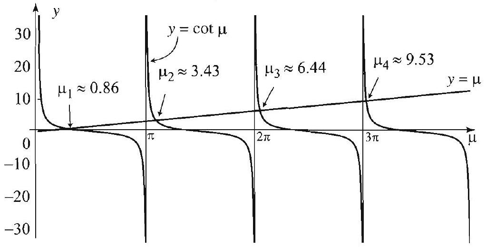

## EXAMPLE 5 Eigenfunction expansions

(a) Compute the first five eigenfunctions $X_{1}(x), X_{2}(x), \ldots, X_{5}(x)$ in Example 4 explicitly.
(b) Given $f(x)=x(1-x), 0<x<1$. What is the eigenfunction expansion of $f$ ? Plot $f$ and some partial sums of the eigenfunction expansion.
Solution (a) Figure 2 shows the graphs of $y=\cot \mu$ and $y=\mu$. According to the solution of Example 4, to find the eigenvalues, we must solve the equation $\cot \mu=\mu$. With the help of a computer system, we find the first five solutions to be approximately

$$
\mu_{1}=0.860, \mu_{2}=3.426, \mu_{3}=6.437, \mu_{4}=9.529, \mu_{5}=12.645 .
$$

Thus the first five eigenfunctions are

$$
\begin{gathered}
X_{1}(x)=\cos (0.860 x), \quad X_{2}(x)=\cos (3.426 x) \\
X_{3}(x)=\cos (6.437 x), \quad X_{4}(x)=\cos (9.529 x), \quad X_{5}(x)=\cos (12.645 x)
\end{gathered}
$$

(b) By Theorem 3, the eigenfunction expansion of $f$ is

$$
f(x)=\sum_{j=1}^{\infty} A_{j} \cos \mu_{j} x
$$

where

$$
A_{j}=\int_{0}^{1} x(1-x) \cos \mu_{j} x d x / \int_{0}^{1} \cos ^{2} \mu_{j} x d x
$$

with the numerical values of the $\mu_{j}$ 's given in (a). We evaluate these coefficients with the help of a computer and find

$$
A_{1}=.189, A_{2}=-0.032, A_{3}=-0.091, A_{4}=-0.001, A_{5}=-0.025
$$

Thus the eigenfunction expansion of $f$ is

$$
\begin{aligned}
f(x)= & .189 \cos (0.860 x)-0.032 \cos (3.426 x)-0.091 \cos (6.437 x) \\
& -0.001 \cos (9.529 x)-0.025 \cos (12.645 x)+\cdots
\end{aligned}
$$

Figure 3 Eigenfunction expansion of $f(x)=x(1-x)$.

As guaranteed by Theorem 3 and illustrated in Figure 3, the partial sums of the eigenfunction expansion converge to $f(x)$.

Further information about the eigenfunctions in Examples 4 and 5 can be obtained by quoting results from this section. For example, Theorem 2 implies the orthogonality of these eigenfunctions on the interval $(0,1)$.

The problem that we consider next arises in the solution a heat equation on a disk with Robin-type boundary conditions (Exercise 35). We will use a notation that reflects this connection with the heat equation.

## EXAMPLE 6 Bessel's equation with Robin conditions

Find the eigenvalues and eigenfunctions of the singular Sturm-Liouville problem

$$
r R^{\prime \prime}+R^{\prime}+\lambda^{2} r R=0 \quad(0 \leq r<a), \quad R^{\prime}(a)=-\kappa R(a) .
$$

Here $\kappa>0$ is a heat transfer constant or coefficient, and $a>0$ is the radius of the disk. Note that we do not give a boundary condition at the 0 endpoint. Instead, we usually require that the solutions be bounded in the interval $[0, a]$.
Solution We recognize the equation as a parametric form of Bessel's equation of order 0 (see Theorem 3, Section 4.8). Its bounded solutions in the interval $[0, a]$ are of the form

$$
R(r)=J_{0}(\lambda r)
$$

where the eigenvalue $\lambda$ is determined from the boundary condition:

$$
R^{\prime}(a)=-\kappa R(a) \Rightarrow \lambda J_{0}^{\prime}(\lambda a)=-\kappa J_{0}(\lambda a) .
$$

Does this equation have infinitely many solutions in $\lambda$ ? Using facts from calculus and properties of Bessel functions, it is not difficult to show that the answer is affirmative (Exercise 36). Here we shall give an approximation of the roots. Using the formula $J_{0}^{\prime}(x)=-J_{1}(x)((1)$, Section 4.8), the equation becomes

$$
\lambda J_{1}(a \lambda)=\kappa J_{0}(a \lambda)
$$

The graphs in Figure 4 suggest that indeed we do have infinitely many roots $\lambda=\lambda_{k}$, $k=1,2, \ldots$. The first six of these, for the case $\kappa=a=1$, are shown in Table 1.

| $k$ | 1 | 2 | 3 | 4 | 5 | 6 |
| :---: | :---: | :---: | :---: | :---: | :---: | :---: |
| $\lambda_{k}$ | 1.25578 | 4.07948 | 7.1558 | 10.271 | 13.3984 | 16.5312 |

Table 1. Positive roots of $\lambda J_{1}(\lambda)=J_{0}(\lambda)$.

The fact that the roots of the equations $J_{0}(\lambda)=\lambda J_{1}(\lambda)$ and $-\lambda=\tan (\lambda+\pi / 4)$ are approximately equal can be used to estimate the eigenvalues in Example 6. For example, by considering the vertical asymptotes of the tangent, can you justify the claim that, for large $k, \lambda_{k} \approx \frac{\pi}{4}+k \pi$ ?

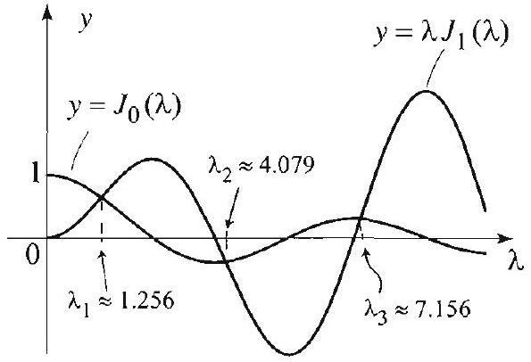
Figure 4

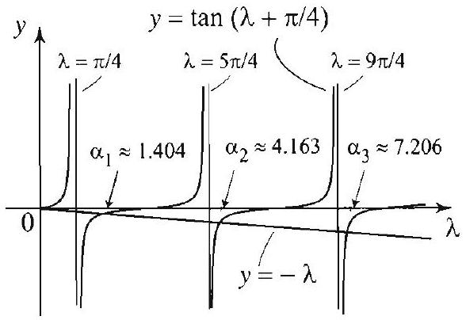
Figure 5

A more accurate description of the eigenvalues can be obtained by appealing to the asymptotic formulas for Bessel functions (Theorem 3, Section 4.9). We have $J_{0}(\lambda) \sim \sqrt{\frac{2}{\pi \lambda}} \cos \left(\lambda-\frac{\pi}{4}\right)$ and $J_{1}(\lambda) \sim \sqrt{\frac{2}{\pi \lambda}} \cos \left(\lambda-\frac{\pi}{4}-\frac{\pi}{2}\right)$. Hence the roots of $\lambda J_{1}(a \lambda)=\kappa J_{0}(a \lambda)$ are approximately the roots of the equation $\lambda \cos \left(a \lambda-\frac{3 \pi}{4}\right)= \kappa \cos \left(a \lambda-\frac{\pi}{4}\right) ;$ and since $\cos \left(a \lambda-\frac{3 \pi}{4}\right)=-\cos \left(a \lambda+\frac{\pi}{4}\right)$ and $\cos \left(a \lambda-\frac{\pi}{4}\right)=\sin \left(a \lambda+\frac{\pi}{4}\right)$, the equation becomes

$$
-\frac{1}{\kappa} \lambda=\tan \left(a \lambda+\frac{\pi}{4}\right) .
$$

The first six roots of this equation with $\kappa=a=1$ (denoted $\alpha_{k}$ ) are shown in Table 2 (Figure 5), whose entries should be compared with the entries in Table 1 (Figure 4):

| $k$ | 1 | 2 | 3 | 4 | 5 | 6 |
| :---: | :---: | :---: | :---: | :---: | :---: | :---: |
| $\alpha_{k}$ | 1.40422 | 4.16275 | 7.20647 | 10.3069 | 13.4261 | 16.5537 |

Table 2. Positive roots of $-\lambda=\tan \left(\lambda+\frac{\pi}{4}\right)$.

Because the asymptotic formulas for Bessel functions give better results for larger values of $\lambda$, the entries in Table 2 give a much better approximation for larger eigenvalues. To each eigenvalue $\lambda_{k}$ corresponds one eigenfunction $R_{k}(r)=J_{0}\left(\lambda_{k} r\right)$. We took $\kappa=a=1$ and plotted the eigenfunctions for $k=1,2$, and 3 in Figure 6. These should not be confused with the Bessel functions that arise from the solution of the heat equation on a disk, with 0 boundary condition. The latter are equal to 0 when $r=a$, which is not the case with the functions shown in Figure 6.

Figure 6 Eigenfunctions in Examples 6 and 7.

## EXAMPLE 7 Orthogonality

Show that the eigenfunctions in Example 6 are orthogonal on the interval ( $0, a$ ), with respect to the weight $r$. More explicitely, show that

$$
\int_{0}^{a} J_{0}\left(\lambda_{j} r\right) J_{0}\left(\lambda_{k} r\right) r d r=0 \quad(j \neq k)
$$

where $\lambda_{k}(k=1,2, \ldots)$ are the positive roots of (7).

Solution It is enough to show that condition (4) is satisfied. The Sturm-Liouville form of the equation is (recall the result of Example 1(b) with order $p=0$ ):

$$
\left[r R^{\prime}\right]^{\prime}+\lambda^{2} r R=0, \quad 0<r<a, \quad R^{\prime}(a)=-\kappa R(a) .
$$

So in (4), take $p(r)=r$ and let $y_{1}$ and $y_{2}$ be two eigenfunctions corresponding to distinct eigenvalues. In our notation, (4) becomes

$$
\lim _{r \uparrow a} p(r)\left(y_{1}(r) y_{2}^{\prime}(r)-y_{2}(r) y_{1}^{\prime}(r)\right)-\lim _{r \downarrow 0} p(r)\left(y_{1}(r) y_{2}^{\prime}(r)-y_{2}(r) y_{1}^{\prime}(r)\right)=0,
$$

and since $p(0)=0, p(a)=a$, and all the functions are continuous, the condition becomes

$$
a\left(y_{1}(a) y_{2}^{\prime}(a)-y_{2}(a) y_{1}^{\prime}(a)\right)=0 ; \text { equivalently, } y_{1}(a) y_{2}^{\prime}(a)-y_{2}(a) y_{1}^{\prime}(a)=0 .
$$

At the endpoint $r=a$, we have $y_{k}^{\prime}(a)=-\kappa y_{k}(a)$. So the left side of the last displayed condition becomes

$$
y_{1}(a)\left(-\kappa y_{2}(a)\right)-y_{2}(a)\left(-\kappa y_{1}(a)\right)=0,
$$

which is a true statement. Hence (4) holds, and by Theorem 2 the eigenfunctions are orthogonal with respect to the weight $r$.

Additional properties of the eigenfunctions in Examples 6 and 7 will be investigated in the exercises. In particlar, the completeness property of the eigenfunctions will be illustrated by studying the convergence of specific eigenfunction expansions.

In Section 14.4, we will study Sturm-Liouville problems associated with differential equations of order 4. This generalization is motivated by our later study of the vibrations of a beam which will require the solution of such problems.

## Exercises 6.2

In Exercises 1-10, put the given equation in Sturm-Liouville form and decide whether the problem is regular or singular.

1. $x y^{\prime \prime}+y^{\prime}+\lambda y=0, y(0)=0, y(1)=0$.
2. $x y^{\prime \prime}+y^{\prime}+\lambda y=0, y(1)=0, y(2)=0$.
3. $x y^{\prime \prime}+2 y^{\prime}+\lambda y=0, y(1)=0, y^{\prime}(2)=0$. [Hint: Multiply by $x$.]
4. $y^{\prime \prime}+(x+\lambda) y=0, y(0)=0, y(1)=0$.
5. $x y^{\prime \prime}-y^{\prime}+\lambda x y=0, y(0)=0, y(1)=0$. [Hint: Divide by $x^{2}$.]
6. $y^{\prime \prime}+\left[\frac{1+\lambda x}{x}\right] y=0, y(1)=0, y(2)=0$.
7. $y^{\prime \prime}+\lambda x y=0, y(-1)=0, y(1)=0$.
8. $\left(1-x^{2}\right) y^{\prime \prime}-2 x y^{\prime}+(1+\lambda x) y=0, y(-1)=0, y(1)=0$.
9. $\left(1-x^{2}\right) y^{\prime \prime}-2 x y^{\prime}+\lambda y=0, y(-1)=0, y(1)=0$.
10. $y^{\prime \prime}-\frac{x}{1-x^{2}} y^{\prime}+\lambda y=0, y(-1)=0, y(1)=0$.

In Exercises 11-20, determine the eigenvalues and eigenfunctions of the given SturmLiouville problem.
11. $y^{\prime \prime}+\lambda y=0, y(0)=0, y(2 \pi)=0$.
12. $y^{\prime \prime}+\lambda y=0, y(0)=0, y(\pi / 2)=0$.
13. $y^{\prime \prime}+\lambda y=0, y(0)=0, y^{\prime}(\pi)=0$.
14. $y^{\prime \prime}+\lambda y=0, y(-\pi)=y(\pi), y^{\prime}(-\pi)=y^{\prime}(\pi)$.
15. $y^{\prime \prime}+\lambda y=0, y(0)=0, y(\pi)+y^{\prime}(\pi)=0$.
16. $y^{\prime \prime}+\lambda y=0, y(0)+y^{\prime}(0)=0, y(2 \pi)=0$.
17. $y^{\prime \prime}+\lambda y=0, y(0)+y^{\prime}(0)=0, y(1)+y^{\prime}(1)=0$.
18. $y^{\prime \prime}+\lambda y=0, y(0)+2 y^{\prime}(0)=0, y(1)=0$.
19. $x y^{\prime \prime}+y^{\prime}+\left[-\frac{4}{x}+\lambda x\right] y=0,0<x<1, y(0)$ is finite, $y(1)=0$.
20. $x y^{\prime \prime}+y^{\prime}+\left[-\frac{1}{x}+\lambda x\right] y=0,0<x<3, y(0)$ is finite, $y(3)=0$.
21. Show that the boundary value problem $y^{\prime \prime}-\lambda y=0, y(0)=0, y(1)=0$ has no positive eigenvalues. Does this contradict Theorem 1?
22. Show that the boundary value problem $y^{\prime \prime}-\lambda y=0, y(0)+y^{\prime}(0)=0, y(1)+ y^{\prime}(1)=0$ has one positive eigenvalue. Does this contradict Theorem 1?
23. (a) Find the eigenfunction expansion of the function $f(x)=x, 0<x<\pi$, using the eigenfunctions of the Sturm-Liouville problem of Example 2.
(b) Plot the function and several partial sums of the eigenfunction expansion and comment on the graphs.
24. Repeat Exercise 23 with the function $f(x)=1,0<x<\pi$.
25. Repeat Exercise 23 with the function $f(x)=\sin x, 0<x<\pi$.
26. (a) Approximate the numerical values of the first eight eigenvalues in the Sturm-Liouville problem of Exercise 15, and describe the corresponding eigenfunctions.
(b) Approximate the first eight nonzero terms of the eigenfunction expansion of $\sin x$. Plot the function and several partial sums of the expansion. Describe what is happening in the picture that you obtain.
27. Expand the function $f(x)=1,0<x<\pi$, in a series in terms of the eigenfunctions of Exercise 26. Plot the function and the partial sums of the eigenfunction expansion and comment on the graphs.
28. Expand the function $f(x)=\sin \pi x, 0<x<1$, in a series in terms of the eigenfunctions of Example 5. Plot the function and the partial sums of the eigenfunction expansion and comment on the graphs.
29. Verify the orthogonality of the eigenfunctions of Exercise 11.
30. Verify numerically the orthogonality of the eigenfunctions of Example 5.
31. The second order, linear ordinary differential equation

$$
\left(1-x^{2}\right) y^{\prime \prime}-x y^{\prime}+n^{2} y=0, \quad-1<x<1
$$

where $n=0,1,2, \ldots$, is known as Chebyshev's differential equation. We are interested in solving this equation with the boundary conditions $y(1)=1$ and $y^{\prime}(1)$ is finite.
(a) Put the equation in Sturm-Liouville form and determine $p(x), q(x)$, and $r(x)$.
[Hint: First, divide through by $\left(1-x^{2}\right)^{1 / 2}$.]
(b) Use the power series method, as we did in Section 5.5 with Legendre's equation, and show that Chebyshev's equation has one polynomial solution of degree $n$. The one that satisfies $y(1)=1$ is called the Chebyshev polynomial of degree $n$ and is denoted by $T_{n}(x)$.

It is a fact that the derivative of the nonpolynomial solution is not bounded at $x=1$. Thus $T_{n}(x)$ is the only solution that satisfies the boundary conditions.
(c) Using (4), show that the Chebyshev polynomials are orthogonal on $(-1,1)$ with respect to the weight function $r(x)=\frac{1}{\sqrt{1-x^{2}}}$.
32. (a) Show that the change of variables $x=\cos \theta$ transforms Chebyshev's equation into $y^{\prime \prime}+n^{2} y=0,0<\theta<\pi$.
(b) Conclude that two linearly independent solutions of Chebyshev's equation are $y_{1}(x)=y_{1}(\cos \theta)=\cos n \theta$ and $y_{2}(x)=y_{2}(\cos \theta)=\sin n \theta$
(c) Show that $y_{2}^{\prime}(x)$ is not bounded at $x=1$. Hence $y_{1}(x)=\cos n \theta$ is the only solution that satisfies $y(1)=1$ and $y^{\prime}(1)$ is finite. Conclude that $T_{n}(x)=\cos n \theta$. As you know, $\cos n \theta$ can be expressed as a polynomial in $\cos \theta$. This polynomial expression is precisely $T_{n}(x)$ : for example, $T_{1}(x)=\cos \theta=x ; T_{2}(x)=\cos 2 \theta= 2 \cos ^{2} \theta-1=2 x^{2}-1$, and so on.
(d) Find $T_{3}(x)$ and $T_{4}(x)$.
33. (a) Show that the eigenfunctions in Example 6 satisfy

$$
\int_{0}^{a}\left[J_{0}\left(\lambda_{k} r\right)\right]^{2} r d r=\frac{a^{2}}{2}\left(\left[J_{0}\left(\lambda_{k} a\right)\right]^{2}+\left[J_{1}\left(\lambda_{k} a\right)\right]^{2}\right)
$$

[Hint: Exercise 36(b), Section 4.8.]
(b) Suppose that you know that the eigenfunctions form a complete set of orthogonal functions on the interval $(0, a)$. Show that if

$$
f(r)=\sum_{k=1}^{\infty} A_{k} J_{0}\left(\lambda_{k} r\right) \quad(0 \leq r<a)
$$

then

$$
A_{k}=\frac{2}{a^{2}\left(\left[J_{0}\left(\lambda_{k} a\right)\right]^{2}+\left[J_{1}\left(\lambda_{k} a\right)\right]^{2}\right)} \int_{0}^{a} f(r) J_{0}\left(\lambda_{k} r\right) r d r
$$

34. Consider the eigenfunctions in the preceeding exercise, and take $a=\kappa=1$. (a) Derive the following eigenfunction expansion of $f(r)=100$ for $0 \leq r<1$ :

$$
100=200 \sum_{k=1}^{\infty} \frac{J_{1}\left(\lambda_{k}\right)}{\lambda_{k}\left(\left[J_{0}\left(\lambda_{k}\right)\right]^{2}+\left[J_{1}\left(\lambda_{k}\right)\right]^{2}\right)} J_{0}\left(\lambda_{k} r\right)
$$

(b) Show that $J_{1}\left(\lambda_{k}\right)=\frac{J_{0}\left(\lambda_{k}\right)}{\lambda_{k}}$ and conclude that $0 \leq r<1$ :

$$
100=200 \sum_{k=1}^{\infty} \frac{J_{0}\left(\lambda_{k}\right)}{\left(1+\lambda_{k}^{2}\right)\left[J_{0}\left(\lambda_{k}\right)\right]^{2}} J_{0}\left(\lambda_{k} r\right)
$$

(c) Use the numerical values from Table 1 to obtain a six-term partial sum approximation of the function in part (b). Plot this partial sum to illustrate the convergence of the eigenfunction expansion.
35. Project Problem: Heat problem on a disk with Robin conditions. Use the method of separation of variable to solve the heat equation on a disk of unit radius

$$
\frac{\partial u}{\partial t}=\frac{\partial^{2} u}{\partial r^{2}}+\frac{1}{r} \frac{\partial u}{\partial r}, \quad 0 \leq r<1, t>0,
$$

with initial temperature distribution $u(r, 0)=100(0 \leq r<1)$, and Robin boundary condition

$$
\left.\frac{\partial u}{\partial r}(r, t)\right|_{r=1}=-u(1, t) .
$$

The problem models the temperature distribution in a plate with insulated lateral surface, whose boundary is exchanging heat with the surrounding medium at a rate proportional to the temperature at the boundary. Here the heat transfer constant or convection constant $\kappa$ is equal to 1 .
36. Fix $a, \kappa>0$ and let $h(\lambda)=\kappa J_{0}(a \lambda)+\lambda J_{0}^{\prime}(a \lambda)$, and $\lambda_{1}$ and $\lambda_{2}$ be two distinct consecutive zeros of $J_{0}(a \lambda)$ such that $0<\lambda_{1}<\lambda_{2}$.
(a) Show that $h\left(\lambda_{1}\right)=\lambda_{1} J_{0}^{\prime}\left(a \lambda_{1}\right), h\left(\lambda_{2}\right)=\lambda_{2} J_{0}^{\prime}\left(a \lambda_{2}\right)$ and that $h\left(a \lambda_{1}\right)$ and $h\left(a \lambda_{2}\right)$ have opposite signs. [Hint: Since $\lambda_{1}, \lambda_{2}>0$, it is enough to argue that the values of the derivative of $J_{0}$ at two consecutive roots of $J_{0}$ must have opposite signs.]
(b) Conclude that $h(a \lambda)=0$ for some $\lambda_{3}$ in the interval $\left(\lambda_{1}, \lambda_{2}\right)$.
(c) Using the fact that $J_{0}(a \lambda)$ has infinitely many positive zeros, show that $\kappa J_{0}(a \lambda)+ J_{0}^{\prime}(a \lambda)=0$ has infinitely many positive roots.

### 14.3 The Hanging Chain

Figure 1 Hanging chain.

Having studied Sturm-Liouville theory for second order equations, we illustrate the theory as it applies to the oscillations of the hanging chain. This problem played an important role in the development of the theory of partial differential equations. It was while solving this problem that Daniel Bernoulli first discovered Bessel functions in 1732. Although we link the solution to general Sturm-Liouville theory, our presentation contains all the necessary details to solve this problem based on the properties of Bessel functions from Section 4.8.

To describe the equation governing the motion of the hanging chain, we place the $x$-axis in a vertical position, pointing upward. Consider a chain of length $L$, hanging down with one end fastened at $x=L$ (Figure 1). The small transverse oscillations of the chain are described by the boundary value

Physically, another boundary condition that should be applied is $u(0, t)$ finite for all $t>$ 0 . This condition states that the vibrations of the free end remain bounded. It will be needed to rule out unbounded solutions.
problem

Here we have reversed our usual procedure in that we have argued on physical grounds that only negative values of the separating constant lead to nontrivial solutions. equations

$$
\begin{aligned}
& \frac{\partial^{2} u}{\partial t^{2}}=g\left[x \frac{\partial^{2} u}{\partial x^{2}}+\frac{\partial u}{\partial x}\right], \quad 0<x<L, t>0 \\
& u(L, t)=0, \quad t>0 \\
& u(x, 0)=f(x), \quad u_{t}(x, 0)=v(x)
\end{aligned}
$$

Here $g$ is the gravitational acceleration, $f(x)$ is the initial displacement of the chain, and $v(x)$ its initial velocity. The derivation of (1) is outlined in Exercise 6, Section 3.2. We will solve this boundary value problem using separation of variables. The method will lead to Bessel's equation, and the solution will involve a form of Bessel series.

## Separation of Variables

We assume a product solution of the form $u(x, t)=X(x) T(t)$. Plugging this into (1) and separating the variables, we get

$$
\begin{gathered}
X T^{\prime \prime}=g T\left(x X^{\prime \prime}+X^{\prime}\right) \\
\frac{1}{g} \frac{T^{\prime \prime}}{T}=\frac{x X^{\prime \prime}+X^{\prime}}{X}
\end{gathered}
$$

Since the variables are separated, for the last equality to hold, each side must be equal to a constant. Thus

$$
\frac{1}{g} \frac{T^{\prime \prime}}{T}=\lambda \quad \text { and } \quad \frac{x X^{\prime \prime}+X^{\prime}}{X}=\lambda
$$

The boundary condition implies that $T(t) X(L)=0$ for all $t>0$. Hence to avoid the trivial solution, we require that $X(L)=0$. Thus we arrive at the

$$
T^{\prime \prime}-\lambda g T=0 \quad \text { and } \quad x X^{\prime \prime}+X^{\prime}-\lambda X=0, \quad X(L)=0 .
$$

## Solving the Separated Equations

If $\lambda \geq 0$, the solutions of the differential equation in $T$ are either linear or exponential functions. We discard these solutions for obvious practical reasons. Thus $\lambda$ must be negative. To simplify notation, we will simply replace $\lambda$ in the equations by $-\lambda^{2}$ and get

$$
T^{\prime \prime}+\lambda^{2} g T=0
$$

and

$$
x X^{\prime \prime}+X^{\prime}+\lambda^{2} X=0, \quad X(L)=0
$$

The general solution of (2) is

$$
T(t)=A \cos (\sqrt{g} \lambda t)+B \sin (\sqrt{g} \lambda t) .
$$

Next we consider the differential equation in $X$ from the point of view of Sturm-Liouville theory. By rewriting (3), we see that the differential equation can be put in the Sturm-Liouville form

$$
\left(x X^{\prime}\right)^{\prime}+\lambda^{2} X=0
$$

Comparing this to (1) from Section 14.2, we find that $p(x)=x, q(x)=0$, and $r(x)=1$ and also that $a=0$ and $b=L$. Since $p(0)=0$, this is a singular Sturm-Liouville problem. We will show that this problem has infinitely many eigenvalues and a corresponding complete set of eigenfunctions, and, by Theorem 2(b) of the previous section, it follows that these eigenfunctions are orthogonal with respect to the weight function $r(x)=1$. It will then follow that we can construct the solution $u(x, t)$ to the hanging chain problem by superposing the corresponding product solutions, as we have done many times before.

In this particular example it is possible to be much more concrete since (3) is closely related to Bessel's equation. To see this, we make the change of variables $s=2 \sqrt{x}$. Using the chain rule, we verify that

$$
\begin{gathered}
X^{\prime}=\frac{d X}{d x}=\frac{d X}{d s} \frac{1}{\sqrt{x}} ; \\
X^{\prime \prime}=\frac{d^{2} X}{d x^{2}}=\frac{1}{x} \frac{d^{2} X}{d s^{2}}-\frac{1}{2 x^{3 / 2}} \frac{d X}{d s} .
\end{gathered}
$$

Substituting in (3) and simplifying, we get

$$
s^{2} \frac{d^{2} X}{d s^{2}}+s \frac{d X}{d s}+\lambda^{2} s^{2} X=0 \quad X(2 \sqrt{L})=0
$$

which is precisely the parametric form of Bessel's equation of order 0 (Theorem 3, Section 4.8). Since we are only interested in the bounded solutions of this equation, we can apply Theorem 3 of Section 4.8 (with $p=0$ ) and obtain that

$$
\lambda=\lambda_{j}=\frac{\alpha_{j}}{2 \sqrt{L}}, \quad \text { and } \quad X(s)=X_{j}(s)=J_{0}\left(\frac{\alpha_{j}}{2 \sqrt{L}} s\right),
$$

where $j=1,2,3, \ldots$, and $\alpha_{j}$ denotes the $j$ th zero of $J_{0}$. Moreover, these functions are orthogonal on the interval $0 \leq s \leq 2 \sqrt{L}$ with respect to the weight function $s$. The orthogonality relations expressed by (11) and (12) of Section 4.8 (with $a=2 \sqrt{L}$ ) become

$$
\int_{0}^{2 \sqrt{L}} J_{0}\left(\frac{\alpha_{j}}{2 \sqrt{L}} s\right) J_{0}\left(\frac{\alpha_{k}}{2 \sqrt{L}} s\right) s d s=0, \quad j \neq k
$$

and

$$
\int_{0}^{2 \sqrt{L}} J_{0}^{2}\left(\frac{\alpha_{j}}{2 \sqrt{L}} s\right) s d s=2 L J_{1}^{2}\left(\alpha_{j}\right), \quad j=1,2, \ldots
$$

Substituting $s=2 \sqrt{x}$ back into (5), (6), and (7), we find the solutions

$$
X_{j}(2 \sqrt{x})=J_{0}\left(\alpha_{j} \sqrt{\frac{x}{L}}\right), \quad j=1,2,3, \ldots
$$

and their orthogonality relations

## ORTHOGONALITY

OF EIGENFUNCTIONS

$$
\begin{gathered}
\int_{0}^{L} J_{0}\left(\alpha_{j} \sqrt{\frac{x}{L}}\right) J_{0}\left(\alpha_{k} \sqrt{\frac{x}{L}}\right) d x=0, \quad j \neq k \\
\frac{1}{L J_{1}^{2}\left(\alpha_{j}\right)} \int_{0}^{L} J_{0}^{2}\left(\alpha_{j} \sqrt{\frac{x}{L}}\right) d x=1, \quad j=1,2, \ldots
\end{gathered}
$$

Having solved the equation in $X$, we combine (4) and (8) and conclude that a product solution of (1) satisfying the accompanying boundary condition is

$$
u_{j}(x, t)=J_{0}\left(\alpha_{j} \sqrt{\frac{x}{L}}\right)\left[A_{j} \cos \left(\sqrt{\frac{g}{L}} \frac{\alpha_{j}}{2} t\right)+B_{j} \sin \left(\sqrt{\frac{g}{L}} \frac{\alpha_{j}}{2} t\right)\right]
$$

The functions $u_{j}(j=1,2, \ldots)$ are called the normal modes of the chain. For $j=1$ we get the fundamental mode of the chain. From (9), we obtain the frequency of the $j$ th normal mode

$$
\nu_{j}=\frac{\alpha_{j}}{4 \pi} \sqrt{\frac{g}{L}}
$$

## Bessel Series Solution of the Entire Problem

By superposing all the product solutions, we get

$$
u(x, t)=\sum_{j=1}^{\infty} J_{0}\left(\alpha_{j} \sqrt{\frac{x}{L}}\right)\left[A_{j} \cos \left(\sqrt{\frac{g}{L}} \frac{\alpha_{j}}{2} t\right)+B_{j} \sin \left(\sqrt{\frac{g}{L}} \frac{\alpha_{j}}{2} t\right)\right] .
$$

Setting $t=0$ and using the initial condition, we find that

$$
f(x)=u(x, 0)=\sum_{j=1}^{\infty} A_{j} J_{0}\left(\alpha_{j} \sqrt{\frac{x}{L}}\right) .
$$

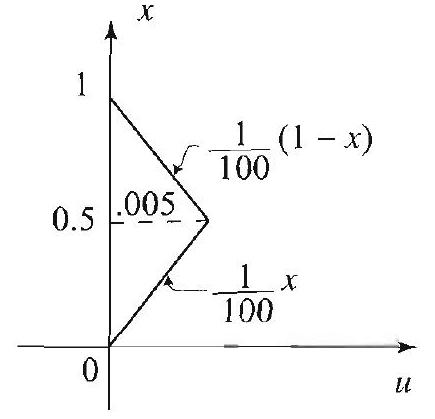
Figure 2 Initial shape of the chain.

To determine the $A_{j}$ 's we multiply both sides of the equality by $J_{0}\left(\alpha_{k} \sqrt{\frac{x}{L}}\right)$ and then integrate with respect to $x$ from 0 to $L$. By the orthogonality relations, all the terms with $j \neq k$ are equal to zero, and when $j=k$ we get

$$
A_{j}=\frac{1}{L J_{1}^{2}\left(\alpha_{j}\right)} \int_{0}^{L} f(x) J_{0}\left(\alpha_{j} \sqrt{\frac{x}{L}}\right) d x, \quad j=1,2, \ldots
$$

To determine $B_{j}$ we proceed in a similar way using the initial velocity $v(x)$. Differentiating $u$ with respect to $t$ and then setting $t=0$, we get

$$
v(x)=u_{t}(x, 0)=\sum_{j=1}^{\infty} B_{j} \sqrt{\frac{g}{L}} \frac{\alpha_{j}}{2} J_{0}\left(\alpha_{j} \sqrt{\frac{x}{L}}\right)
$$

Multiplying both sides by $J_{0}\left(\alpha_{k} \sqrt{\frac{x}{L}}\right)$ and then integrating with respect to $x$ from 0 to $L$, the orthogonality properties yield

$$
B_{j}=\frac{2}{\alpha_{j} J_{1}^{2}\left(\alpha_{j}\right)} \frac{1}{\sqrt{g L}} \int_{0}^{L} v(x) J_{0}\left(\alpha_{j} \sqrt{\frac{x}{L}}\right) d x, \quad j=1,2, \ldots
$$

This completely determines the solution in terms of the initial conditions. We illustrate this solution with a numerical example.

## EXAMPLE 1 Vibrating chain

A chain of length 1 meter is hanging from one end. An initial displacement of the chain is done by pulling the center .005 m while keeping the lower end fixed (see Figure 2). The chain is then left to vibrate freely.
(a) What are the frequencies of the first three normal modes? (Take $g=9.8 \mathrm{m} / \mathrm{sec}^{2}$.)
(b) Plot the graphs of the first three normal modes $u_{1}(x, t), u_{2}(x, t), u_{3}(x, t)$ at $t=0$.
(c) Determine the motion of the chain by finding $u(x, t)$.
(d) Approximate the solution with three terms of the series and plot the graphs of the approximating function at various values of $t$ to illustrate the motion of the chain.
Solution (a) Note that $B_{j}=0$ for all $j$ because the initial velocity is zero. Hence, from (9), the $j$ th normal mode is

$$
u_{j}(x, t)=A_{j} J_{0}\left(\alpha_{j} \sqrt{x}\right) \cos \left(\sqrt{9.8} \frac{\alpha_{j}}{2} t\right)
$$

where $\alpha_{j}$ is the $j$ th zero of $J_{0}$. The frequency of the $j$ th normal mode is $\nu_{j}=\frac{\alpha_{j}}{4 \pi} \sqrt{g}$. Using the numerical values of $\alpha_{j}$ from Table 1 below, we find

$$
\nu_{1}=.5990, \quad \nu_{2}=1.375, \quad \nu_{3}=2.1558
$$

Figure 3 Normal modes of the chain.
(b) At time $t=0$ we have $u_{1}(x, 0)=A_{1} J_{0}(2.4048 \sqrt{x}), u_{2}(x, 0)=A_{2} J_{0}(5.5201 \sqrt{x})$, and $u_{3}(x, 0)=A_{3} J_{0}(8.6537 \sqrt{x})$. To illustrate the shape of the normal modes, we set the $A_{j}$ 's equal to 1 and plot the corresponding graphs (Figure 3).

Note how the fundamental mode looks like a chain whose free end is displaced from its equilibrium position. The other modes correspond to other possible simple motions of the chain. And, as seen from (10), the motion of the chain is obtained by superposing these special modes of vibration.
(c) The function $u(x, t)$ is given by (10), where the coefficients $B_{j}$ are all equal to 0 . It remains to compute the $A_{j}$ 's. For this purpose, we use (11) and the equation of the initial displacement $f(x)$ given in Figure 2. We get

$$
A_{j}=\frac{1}{J_{1}^{2}\left(\alpha_{j}\right)}\left[\int_{0}^{1 / 2} \frac{1}{100} x J_{0}\left(\alpha_{j} \sqrt{x}\right) d x+\int_{1 / 2}^{1} \frac{1}{100}(1-x) J_{0}\left(\alpha_{j} \sqrt{x}\right) d x\right]
$$

These integrals are computed with the help of the following identities:

$$
\begin{gathered}
\int x J_{0}\left(\alpha_{j} \sqrt{x}\right) d x=\frac{2}{\alpha_{j}} x^{3 / 2} J_{1}\left(\alpha_{j} \sqrt{x}\right)-\frac{4}{\alpha_{j}^{2}} x J_{2}\left(\alpha_{j} \sqrt{x}\right)+C \\
\int J_{0}\left(\alpha_{j} \sqrt{x}\right) d x=\frac{2}{\alpha_{j}} x^{1 / 2} J_{1}\left(\alpha_{j} \sqrt{x}\right)+C
\end{gathered}
$$

which can be derived from (7), Section 4.8 (with $p=0$ ), after making the substitution $t=\alpha_{j} \sqrt{x}$. Applying these formulas and simplifying, we get

$$
A_{j}=\frac{J_{2}\left(\alpha_{j}\right)-J_{2}\left(\alpha_{j} / \sqrt{2}\right)}{25 \alpha_{j}^{2} J_{1}^{2}\left(\alpha_{j}\right)}
$$

Numerical values of the $A_{j}$ 's can be approximated with the help of a computer. They are presented Table 1 along with other pertinent numerical data. Plugging the numerical data into (10), we get

$$
\begin{gathered}
u(x, t)=0.003847 J_{0}(2.4048 \sqrt{x}) \cos (3.76415 t)-0.005787 J_{0}(5.52008 \sqrt{x}) \\
\times \cos (8.64029 t)+0.002371 J_{0}(8.65373 \sqrt{x}) \cos (13.5452 t)-\cdots
\end{gathered}
$$

| $j$ | 1 | 2 | 3 |
| :---: | :---: | :---: | :---: |
| $\alpha_{j}$ | 2.40483 | 5.52008 | 8.65373 |
| $\nu_{j}$ | .5990 | 1.375 | 2.1558 |
| $A_{j}$ | .003847 | -.005787 | .002371 |

Table 1 Numerical data for Example 1.

THEOREM 2 EIGENFUNCTION EXPANSIONS

If $f$ is piecewise smooth on the interval $[a, b]$, then we have the eigenfunction expansion

$$
f(x)=\sum_{j=1}^{\infty} A_{j} X_{j}(x)
$$

where

$$
A_{j}=\frac{\int_{a}^{b} f(x) X_{j}(x) r(x) d x}{\int_{a}^{b} X_{j}^{2}(x) r(x) d x}
$$

For $a<x<b$, the eigenfunction expansion converges to $f(x)$ at the points of continuity, and otherwise it converges to $\frac{f(x+)+f(x-)}{2}$.

## EXAMPLE 1 A fourth-order Sturm-Liouville problem

(a) Find the eigenvalues and eigenfunctions of the Sturm-Liouville problem

$$
\begin{gathered}
X^{(4)}-\lambda X=0 \\
X(0)=0, \quad X^{\prime}(0)=0, \quad X(L)=0, \quad X^{\prime}(L)=0 .
\end{gathered}
$$

(Here $L$ is a positive constant and stands for the length of a bar.)
(b) Take $L=1$ and compute explicitly the first five eigenfunctions $X_{1}(x), X_{2}(x)$, $X_{3}(x), X_{4}(x), X_{5}(x)$.
(c) Given $f(x)=\sin ^{2} \pi x, 0<x<1$, approximate the numerical values of the first five terms of the eigenfunction expansion of $f$. Plot $f$ and some partial sums of its eigenfunction expansion.
Solution Note that this problem is of the form (1)-(2). We will show in Example 2 below that in this kind of problem nontrivial solutions occur only if $\lambda>0$, so we focus exclusively on that case here. For $\lambda>0$ we write the parameter $\lambda$ as $\alpha^{4}$, with $\alpha>0$, to simplify the computations. The characteristic equation of the given differential equation is

$$
r^{4}-\alpha^{4}=0, \quad \text { or } \quad\left(r^{2}-\alpha^{2}\right)\left(r^{2}+\alpha^{2}\right)=0
$$

The characteristic roots are $r= \pm \alpha, \pm i \alpha$, and so the general solution of the differential equation is

$$
X=A \cosh \alpha x+B \sinh \alpha x+C \cos \alpha x+D \sin \alpha x .
$$

To determine the eigenvalues and eigenfunctions, we must find all the nonzero functions of the form (3) that satisfy the boundary conditions. Using these conditions, we see that

$$
\begin{array}{r}
A+C=0, B+D=0 \\
A \cosh \alpha L+B \sinh \alpha L+C \cos \alpha L+D \sin \alpha L=0 \\
A \sinh \alpha L+B \cosh \alpha L-C \sin \alpha L+D \cos \alpha L=0
\end{array}
$$

The first two equations imply that $A=-C, B=-D$. Substituting in the last two equations gives

$$
\left\{\begin{array}{l}
A(\cosh \alpha L-\cos \alpha L)+B(\sinh \alpha L-\sin \alpha L)=0 \\
A(\sinh \alpha L+\sin \alpha L)+B(\cosh \alpha L-\cos \alpha L)=0
\end{array}\right.
$$

Figure 1

For this system to have nonzero solutions $A$ and $B$ its determinant must be zero. In this case, $A$ can assume any value and

$$
B=-A \frac{\cosh \alpha L-\cos \alpha L}{\sinh \alpha L-\sin \alpha L}
$$

Computing the determinant and setting it to zero, we arrive at the equation

$$
\cosh \alpha L \cos \alpha L=1, \quad \text { or } \quad \cos \alpha L=\frac{1}{\cosh \alpha L} .
$$

Thus the admissible values of $\alpha$ are the roots of this equation. The graphs of $\cos L \alpha$ and $1 / \cosh L \alpha$ in Figure 1 show that there are infinitely many roots $\alpha_{1}, \alpha_{2}, \ldots$, $\alpha_{n}, \ldots$. For each value of $\alpha_{n}$ we take $A=1$; it then follows that

$$
C=-1, \quad B=-\frac{\cosh \alpha_{n} L-\cos \alpha_{n} L}{\sinh \alpha_{n} L-\sin \alpha_{n} L}, \quad D=-B .
$$

The corresponding eigenfunctions are obtained from (3):

$$
X_{n}(x)=\cosh \alpha_{n} x-\cos \alpha_{n} x-\frac{\cosh \alpha_{n} L-\cos \alpha_{n} L}{\sinh \alpha_{n} L-\sin \alpha_{n} L}\left(\sinh \alpha_{n} x-\sin \alpha_{n} x\right) .
$$

Although the eigenfunctions have a complicated form, we can get valuable information about them by simply appealing to Theorem 1. For example, their orthogonality on the interval $[0, L]$ is guaranteed by this theorem.
(b) We take $L=1$ and compute the first five positive roots of the equation

$$
\cos \alpha=\frac{1}{\cosh \alpha}
$$

with the help of a computer algebra system. These and other relevant numerical values are shown in Table 1.

| $n$ | 1 | 2 | 3 | 4 | 5 |
| :---: | :---: | :---: | :---: | :---: | :---: |
| $\alpha_{n}$ | 4.7300 | 7.8532 | 10.9956 | 14.1372 | 17.2788 |
| $\frac{\cosh \alpha_{n}-\cos \alpha_{n}}{\sinh \alpha_{n}-\sin \alpha_{n}}$ | .9825 | 1.0008 | 1.0000 | 1.0000 | 1.0000 |

Table 1 Numerical data for Example 1.

Thus the first five eigenfunctions are
$X_{1}(x)=\cosh (4.7300 x)-\cos (4.7300 x)+.9825(\sin (4.7300 x)-\sinh (4.7300 x))$,
$X_{2}(x)=\cosh (1.0008 x)-\cos (1.0008 x)+1.0008(\sin (1.0008 x)-\sinh (1.0008 x))$,
$X_{3}(x)=\cosh (10.9956 x)-\cos (10.9956 x)+\sin (10.9956 x)-\sinh (10.9956 x)$,
$X_{4}(x)=\cosh (14.1372 x)-\cos (14.1372 x)+\sin (14.1372 x)-\sinh (14.1372 x)$,
$X_{5}(x)=\cosh (17.2788 x)-\cos (17.2788 x)+\sin (17.2788 x)-\sinh (17.2788 x)$.
Note that without computing the inner product $\int_{0}^{1} X_{m}(x) X_{n}(x) d x$ we can conclude from Theorem 1 that it is 0 when $m \neq n$.
(c) To find the eigenfunction expansion of $f(x)=\sin ^{2} \pi x$, we must compute the numerical values of the coefficients in the series $\sum_{j=1}^{\infty} A_{j} X_{j}(x)$. We do this
for the first five terms using the explicit formulas for the $X_{j}$ 's from (b). Using a computer algebra system, we find

$$
A_{1}=\frac{\int_{0}^{1} \sin ^{2} \pi x X_{1}(x) d x}{\int_{0}^{1} X_{1}^{2}(x) d x}=.612, \quad A_{2}=\frac{\int_{0}^{1} \sin ^{2} \pi x X_{2}(x) d x}{\int_{0}^{1} X_{2}^{2}(x) d x}=0 .
$$

Similarly, we find

$$
A_{3}=-.022, A_{4}=0, A_{5}=-.002 .
$$

Thus

$$
f(x)=.612 X_{1}(x)-.022 X_{3}(x)-.002 X_{5}(x)+\cdots .
$$

In Figure 2 we plotted $f$ and the fifth partial sum of the eigenfunction expansion $.612 X_{1}-.022 X_{3}-.002 X_{5}$. The graphs show clearly that $f$ is approximated by its eigenfunction expansion. $\square$

Figure 2 The partial sum of the eigenfunction expansion with three nonzero terms yields a very good approximation of $f$ over the interval $(0,1)$. This is evidenced in Figure 2, which shows that the graphs of $f$ and the partial sum are very close over the interval $(0,1)$.

We next show that the eigenvalues in Example 1 are positive. You should note that while the proof uses the equation and the given conditions, it is of a general nature and can be used with other problems. To illustrate this point, we give another set of conditions for which the eigenvalues are positive.

## EXAMPLE 2 Sturm-Liouville problems with positive eigenvalues

(a) Show that the eigenvalues of the Sturm-Liouville problem

$$
\begin{gathered}
X^{(4)}-\lambda X=0 \\
X(0)=0, \quad X^{\prime}(0)=0, \quad X(L)=0, \quad X^{\prime}(L)=0
\end{gathered}
$$

are positive.
(b) Show that the conclusion of (a) holds if the initial conditions are replaced by

$$
X(0)=0, X^{\prime \prime}(0)=0, \quad X(L)=0, X^{\prime \prime}(L)=0 .
$$

Proof We solve (a) and (b) simultaneously. The case $\lambda=0$ leads to the equation $X^{(4)}=0$, whose general solution is a polynomial of degree 3. It is straightforward to show that in this case the zero polynomial is the only one that satisfies the initial conditions (Exercise 17). Hence $\lambda=0$ is not an eigenvalue. We now show that $\lambda$
must be $>0$. Suppose that $X$ is an eigenfunction corresponding to the eigenvalue $\lambda$. Then

$$
\begin{aligned}
X^{(4)}-\lambda X=0 & \Rightarrow X^{(4)}=\lambda X \\
& \Rightarrow X X^{(4)}=\lambda X^{2} \quad \text { (multiply both sides by } X \text { ) } \\
& \Rightarrow \int_{0}^{L} X(x) X^{(4)}(x) d x=\lambda \int_{0}^{L} X^{2}(x) d x
\end{aligned}
$$

Integrating the left side of the last equation by parts and using the initial conditions $X(0)=0, X(L)=0$, we obtain

$$
-\int_{0}^{L} X^{\prime}(x) X^{(3)}(x) d x=\lambda \int_{0}^{L} X^{2}(x) d x
$$

Integrating the left side once more by parts, we obtain

$$
-\left.X^{\prime}(x) X^{\prime \prime}(x)\right|_{0} ^{L}+\int_{0}^{L} X^{\prime \prime}(x)^{2} d x=\lambda \int_{0}^{L} X^{2}(x) d x
$$

Note that the initial conditions in (a) or (b) imply that the first term on the left side is 0 . Thus

$$
\int_{0}^{L} X^{\prime \prime}(x)^{2} d x=\lambda \int_{0}^{L} X^{2}(x) d x
$$

Now $X$ is not identically zero (by definition of an eigenfunction). So $X^{2}$ is nonnegative and not identically zero on the interval $(0, L)$. Hence $\int_{0}^{L} X^{2}(x) d x>0$. Also, $\int_{0}^{L} X^{\prime \prime}(x)^{2} d x \geq 0$, and so $\lambda \geq 0$. But $\lambda \neq 0$, hence $\lambda>0$.

## Exercises 6.4

In Exercises 1-2, find the eigenvalues and eigenfunctions of the given SturmLiouville problem.

1. $X^{(4)}-\alpha^{4} X=0, X(0)=0, X^{\prime}(0)=0, X(2)=0, X^{\prime}(2)=0$.
2. $X^{(4)}-\alpha^{4} X=0, X(-1)=0, X^{\prime}(-1)=0, X(1)=0, X^{\prime}(1)=0$.
[Hint: Reduce to Exercise 1 by a change of variables.]
In Exercises 3-6, (a) find the eigenfunction expansion of the given function using the prescribed set of eigenfunctions. (b) Plot the function and several partial sums of the eigenfunction expansion.
3. $f(x)=x(2-x), 0<x<2$; use the eigenfunctions of Exercise 1.
4. $f(x)=\sin \pi x, 0<x<2$; use the eigenfunctions of Exercise 1.
5. $f(x)=x(1-x), 0<x<1$; use the eigenfunctions of Example 1.
6. $f(x)=x^{2}(1-x)^{2}, 0<x<1$, use the eigenfunctions of Example 1.

Project Problem: In Exercise 7, you are asked to solve a fourth-order SturmLiouville problem dealing with the same equation as Example 1 but with different boundary conditions. This variation on Example 1 arises in the study of simply supported beams (see Section 14.5). Do also Exercise 8 to experiment with a related eigenfunction expansion. Model your solution after Example 1 and use the result of Example 2.
7. (a) Show that the eigenvalues $\lambda$ of

$$
\begin{gathered}
X^{(4)}-\lambda X=0 \\
X(0)=0, X^{\prime \prime}(0)=0, X(L)=0, X^{\prime \prime}(L)=0
\end{gathered}
$$

are $\lambda_{n}=\frac{n^{4} \pi^{4}}{L^{4}}, n=1,2, \ldots$
(b) Obtain the eigenfunctions $X_{n}(x)=\sin \frac{n \pi}{L} x$. Observe that the eigenfunctions are exactly what you would obtain in the second-order Sturm-Liouville problem

$$
X^{\prime \prime}+\mu X=0, \quad X(0)=0, \quad X(L)=0,
$$

and the eigenvalues are related by $\lambda=\mu^{2}$. This connection is investigated in Exercises 9 and 10 below.
8. Take $L=1$ in Exercise 7 and find the eigenfunction expansion of

$$
f(x)= \begin{cases}x & 0<x<\frac{1}{2} \\ 1-x & \frac{1}{2}<x<1\end{cases}
$$

9. Assume that $\mu$ and $X$ are an eigenvalue and a corresponding eigenfunction of the Sturm-Liouville problem

$$
X^{\prime \prime}+\mu X=0, \quad X(0)=0, \quad X(L)=0 .
$$

Differentiate twice to see that $X$ also satisfies the fourth-order Sturm-Liouville problem

$$
\begin{gathered}
X^{(4)}-\lambda X=0 \\
X(0)=0, X^{\prime \prime}(0)=0, X(L)=0, X^{\prime \prime}(L)=0 .
\end{gathered}
$$

[Hint: Use the equation $X^{\prime \prime}=-\mu X$.]
10. Assume that $\lambda$ and $X$ are an eigenvalue and a corresponding eigenfunction of the fourth-order Sturm-Liouville problem in Exercise 9.
(a) Show that $Y=X^{\prime \prime}$ is also an eigenfunction of the same problem. (Be sure to check the boundary conditions.)
(b) Show that the function $u=\alpha^{2} X-Y$ is a solution to the second-order SturmLiouville problem in Exercise 9 for the eigenvalue $\alpha^{2}$, where $\lambda=\alpha^{4}$.
(c) By using the explicit form $X=\sin \alpha x$, conclude from (b) that $u$ is an eigenfunction of the second-order Sturm-Liouville problem.

Project Problem: Eigenvalues with multiplicity two. In Exercise 11, you are asked to develop the solutions of a fourth-order Sturm-Liouville in which the first eigenvalue has multiplicity two. In addition to Exercise 11, you should do one of Exercises 12 or 13 to experiment with the related eigenfunction expansions. Model your solution after Example 1.
11. (a) Show that the eigenvalues $\lambda$ of

$$
\begin{gathered}
X^{(4)}-\lambda X=0 \\
X^{\prime \prime}(0)=0, X^{\prime \prime \prime}(0)=0, X^{\prime \prime}(L)=0, X^{\prime \prime \prime}(L)=0
\end{gathered}
$$

are $\lambda_{1}=0, \lambda_{2}=0$, and all values of the form $\lambda=\alpha^{4}$, where $\alpha$ is a positive root of $\cosh \alpha L \cos \alpha L=1$. Note that, aside from the eigenvalue 0 , these are precisely the
eigenvalues of Example 1.
(b) Derive the eigenfunctions

$$
\begin{gathered}
X_{1}=1, \quad X_{2}=x-\frac{L}{2} \\
X_{n}(x)=\cosh \alpha_{n} x+\cos \alpha_{n} x-\frac{\cosh \alpha_{n} L-\cos \alpha_{n} L}{\sinh \alpha_{n} L-\sin \alpha_{n} L}\left(\sin \alpha_{n} x+\sinh \alpha_{n} x\right)
\end{gathered}
$$

for $n=3,4, \ldots$, where $\alpha_{n+2}$ is the $n$th positive root of

$$
\cosh \alpha L \cos \alpha L=1
$$

(Note that $X_{2}$ was chosen so as to be orthogonal to $X_{1}$. The choice $X_{2}=x$ does not share this property.) [Hint: You can do this problem by following the solution of Example 1 or by noting that $X^{\prime \prime}$ is a solution of the Sturm-Liouville problem of Example 1. So the eigenfunctions for $n \geq 3$ can be obtained by integrating the eigenfunctions of Example 1 twice.]
12. (a) Take $L=1$ in Exercise 11 and compute explicitly the first six eigenfunctions $X_{1}(x), \ldots, X_{6}(x)$. You may use the numerical data of Example 1.
(b) Given $f(x)=x(1-x), 0<x<1$, approximate the numerical values of the first six terms of the eigenfunction expansion of $f$. Plot the function and several partial sums of its eigenfunction expansion.
13. Repeat Exercise 12 (b) with $f(x)=x^{4}(1-x)^{4}, 0<x<1$.

Project Problem: In Exercise 14 you are asked to solve a Sturm-Liouville problem that arises in the study of the vibrating clamped-free beam (see Section 14.5). Model your solution after Examples 1 and 2, and do Exercise 15 to experiment with eigenfunction expansions.
14. (a) Show that the eigenvalues $\lambda$ of

$$
\begin{gathered}
X^{(4)}-\lambda X=0 \\
X(0)=0, X^{\prime}(0)=0, X^{\prime \prime}(L)=0, X^{\prime \prime \prime}(L)=0
\end{gathered}
$$

are all values of the form $\lambda=\alpha^{4}$, where $\alpha$ is a positive root of $\cosh \alpha L \cos \alpha L=-1$.
(b) Derive the eigenfunctions

$$
X_{n}(x)=\cos \alpha_{n} x-\cosh \alpha_{n} x-\frac{\cosh \alpha_{n} L+\cos \alpha_{n} L}{\sinh \alpha_{n} L+\sin \alpha_{n} L}\left(\sin \alpha_{n} x-\sinh \alpha_{n} x\right)
$$

for $n=1,2, \ldots$, where $\alpha_{n}$ is the $n$th positive root of $\cosh \alpha L \cos \alpha L=-1$.
15. (a) Take $L=1$ in Exercise 14 and compute explicitly the first five eigenfunctions $X_{1}(x), \ldots, X_{5}(x)$.
(b) Given $f(x)=x(1-x), 0<x<1$, approximate the numerical values of the first six terms of the eigenfunction expansion of $f$. Plot the function and several partial sums of its eigenfunction expansion.
16. Orthogonality of eigenfunctions. Let $\lambda_{j} \neq \lambda_{k}$ be two eigenvalues of the fourth-order Sturm-Liouville problem (1)-(2), with corresponding eigenfunctions $y_{j}$ and $y_{k}$, respectively.
(a) Check that

$$
\frac{d}{d x}\left[y_{k}\left(p(x) y_{j}^{\prime \prime}\right)^{\prime}-y_{j}\left(p(x) y_{k}^{\prime \prime}\right)^{\prime}-y_{k}^{\prime}\left(p(x) y_{j}^{\prime \prime}\right)+y_{j}^{\prime}\left(p(x) y_{k}^{\prime \prime}\right)\right]=-\left(\lambda_{k}-\lambda_{j}\right) r(x) y_{j} y_{k}
$$

(b) Integrate from $a$ to $b$, and use the boundary conditions (2) to show that $y_{j}$ and $y_{k}$ are orthogonal with respect to the weight function $r(x)$.
17. (a) Verify that $\lambda=0$ is not an eigenvalue for the problems in Example 2(a) and (b).
(b) In Example 1, show that each $X_{n}(x)$ is either even or odd about $x=L / 2$ by showing, specifically, that $X_{n}(L-x)=(-1)^{n-1} X_{n}(x)$.
(c) Plot the first five eigenfunctions for Example 1, and observe that each of these has the symmetry property about $x=L / 2$ set forth in part (a).
(d) Based on part (b) or (c), can you explain why the second and fourth coefficients in the eigenfunction expansion in Example 1(c) are 0? Generalize.

### 14.5 Elastic Vibrations and Buckling of Beams

The applications that we consider in this section lead to partial differential equations that are fourth order in the space variables. We consider the transverse vibrations of an elastic homogeneous beam with various supports at its ends. We also consider the problem of determining the critical buckling load of a vertical column.

The modeling of these problems can be carried out in a way similar to the problems considered in Section 3.2. Because beams and columns present resistance to bending, the derivations of their equations are more complicated and, in particular, involve the fourth derivative of the displacement with respect to $x$.

## Transverse Vibrations of a Beam: Simply Supported Case

The free vertical vibrations of a uniform beam of length $L$ are described by the equation

$$
u_{t t}=-c^{2} u_{x x x x}
$$

where $c^{2}=\frac{E I}{\rho A}, E=$ Young's constant (determined by the constitutive material of the beam), $I=$ moment of inertia of a cross section of the beam with respect to an axis through its center of mass and perpendicular to the ( $x, u$ )-plane, $\rho=$ density (mass per unit volume), and $A=$ area of cross section. It is assumed that the beam is of uniform density throughout, that the cross sections are constant, and that in its equilibrium position the centers of mass of the cross sections lie on the $x$-axis (see Figure 1). The variable $u(x, t)$ represents the displacement of the point on the beam corresponding to position $x$ at time $t$.

It is customary in engineering to show a simple beam resting on a pin and a roller and not, say, on two pins. In this manner, the beam is said to be statically determinate. If the beam were to have two pins as supports, it would become statically indeterminate and develop horizontal reactions,

Figure 1 A simply supported beam is pinned at one end and roller supported at the other. The ends can rotate freely but do not move vertically.
which is still acceptable; however, it would not constitute the simplest possible beam. As far as the boundary conditions are concerned, both prevent vertical translation (completely) and both allow rotation (unlike a fixed or clamped support, which locks also rotation). The only difference between a pin and a roller is that a pin prevents horizontal movement, whereas a roller does not (it can roll horizontally). However, both allow rotation and both prevent vertical translation as we said.

A structure in equilibrium must also be stable. A simply supported beam is the simplest structure that is also stable. If the supports were to be two rollers, the beam would be unstable (it would not resist any perturbation in the horizontal direction). On the other hand, if it is to rest on two pins, it would have one additional reaction in excess of being a stable structure. Therefore, a pin and a roller are the simplest possible supports for a beam to be both in equilibrium and stable.
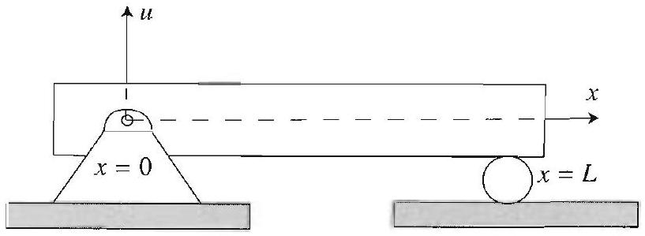

The boundary conditions that accompany equation (1) depend on the end supports of the beam. The case under consideration, that of simply supported ends, is described by

$$
u(0, t)=0, \quad u(L, t)=0, \quad u_{x x}(0, t)=0, \quad u_{x x}(L, t)=0 .
$$

The fact that the beam is prevented from translating vertically at its supports is expressed by the first two equations in (2). To understand the remaining equations in (2), recall that $u_{x x}(x, t)$ represents the curvature or concavity of the beam at any $x$. It is a fact from the theory of strength of materials that curvature is proportional to bending moment for an elastic beam. The last two equations in (2) state that the moments at the supports are zero, as is the case for a simply supported beam, since the beam can rotate at its ends.

To complete the description of the initial value problem, we specify the initial conditions

$$
u(x, 0)=f(x), u_{t}(x, 0)=g(x), \quad 0<x<L,
$$

which give the initial displacement and velocity of the beam.
To solve (1)-(3), we use the method of separation of variables. This leads to the equations

$$
\frac{X^{(4)}}{X}=-\frac{T^{\prime \prime}}{c^{2} T}=\alpha^{4} .
$$

We have chosen the separation constant to be positive because we expect periodic behavior in $t$, and for reasons that will become apparent momentarily it is convenient to denote this constant by $\alpha^{4}$. For the sake of completeness, we note that it can be shown that the boundary value problem $X^{(4)}-\lambda X=0$ together with the boundary conditions implied by (2) has nontrivial solutions only for positive choices of the separation constant $\lambda$ (see Example 2 (a), Section 14.4).

We begin by considering the boundary value problem for $X$ :

$$
\begin{gathered}
X^{(4)}-\alpha^{4} X=0 \\
X(0)=0, \quad X(L)=0, \quad X^{\prime \prime}(0)=0, X^{\prime \prime}(L)=0
\end{gathered}
$$

Note that this is a fourth-order Sturm-Liouville problem of the type described in the previous section, with $\lambda=\alpha^{4}, p(x)=1, q(x)=0$, and $r(x)=1$. Since (5) is a linear equation with constant coefficients, we solve it by passing to the characteristic equation in the familiar way (Appendix A.2). We find

$$
r^{4}-\alpha^{4}=0 \Rightarrow r= \pm \alpha, \quad \text { and } \quad r= \pm i \alpha
$$

Thus the general solution is

$$
X(x)=A \cosh \alpha x+B \sinh \alpha x+C \cos \alpha x+D \sin \alpha x
$$

where $A, B, C$, and $D$ are arbitrary constants. The first and third boundary conditions imply that

$$
A+C=0, \quad A-C=0 \Rightarrow A=C=0 .
$$

The second and fourth conditions then imply

$$
\left\{\begin{array}{l}
B \sinh \alpha L+D \sin \alpha L=0 \\
B \sinh \alpha L-D \sin \alpha L=0
\end{array}\right.
$$

These are equivalent to $B \sinh \alpha L=0$ and $D \sin \alpha L=0$, from which it follows that $B=0$ (since $\sinh \alpha L \neq 0$ for $\alpha>0$ ) and

$$
\alpha=\alpha_{n}=\frac{n \pi}{L}, \quad n=1,2, \ldots
$$

We thus obtain the solutions in $x$ :

$$
X_{n}(x)=\sin \frac{n \pi}{L} x, \quad n=1,2, \ldots
$$

Note that in this case it is easy to verify that the eigenfunctions $X_{n}$ are orthogonal on the interval $0<x<L$ as guaranteed by Theorem 1 of Section 14.4.

Figure 2 A beam with two clamped ends.

Going back to (4) and solving for $T$ with $\alpha=\alpha_{n}$, we obtain the corresponding solutions

$$
T_{n}(t)=A_{n} \cos c \alpha_{n}^{2} t+A_{n}^{*} \sin c \alpha_{n}^{2} t
$$

Forming the product solutions and superposing, we find the general form of the solution:

$$
u(x, t)=\sum_{n=1}^{\infty} \sin \frac{n \pi}{L} x\left(A_{n} \cos c \alpha_{n}^{2} t+A_{n}^{*} \sin c \alpha_{n}^{2} t\right) .
$$

Using the initial conditions (3), we get

$$
f(x)=\sum_{n=1}^{\infty} A_{n} \sin \frac{n \pi}{L} x
$$

and

$$
g(x)=\sum_{n=1}^{\infty} A_{n}^{*} c \alpha_{n}^{2} \sin \frac{n \pi}{L} x .
$$

Since these should just be the sine expansions of $f$ and $g$ on the interval $0<x<L$, it follows directly from Section 2.4 that

$$
\begin{gathered}
A_{n}=\frac{2}{L} \int_{0}^{L} f(x) \sin \frac{n \pi}{L} x d x \\
A_{n}^{*}=\frac{2 L}{n^{2} \pi^{2} c} \int_{0}^{L} g(x) \sin \frac{n \pi}{L} x d x, \quad n=1,2, \ldots
\end{gathered}
$$

The solution of (1)-(3) is thus given by the series (6) with the coefficients determined by (7) and (8).

## Transverse Vibrations of a Beam: Clamped Case

If the ends of the beam in the previous example are clamped (Figure 2), the boundary conditions become

$$
u(0, t)=0, u(L, t)=0, \quad u_{x}(0, t)=0, u_{x}(L, t)=0
$$

for all $t>0$. While the first two conditions in (9) are the same as those for the simply supported case, the last two impose a restraint against end rotation, since the beam does resist moments at its ends. The initial conditions remain

$$
u(x, 0)=f(x), u_{t}(x, 0)=g(x), \quad 0<x<L .
$$

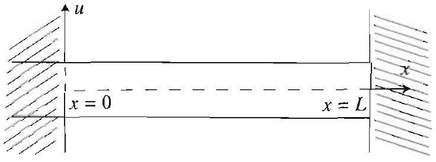

We solve the boundary value problem (1), (9), (10), in much the same way as in the previous example. After separating the variables, we arrive at the fourth order Sturm-Liouville problem

$$
\begin{gathered}
X^{(4)}-\lambda X=0, \\
X(0)=0, \quad X(L)=0, \quad X^{\prime}(0)=0, \quad X^{\prime}(L)=0 .
\end{gathered}
$$

This is precisely the problem solved in Examples 1 and 2 of the previous section, where we found that $\lambda=\lambda_{n}=\alpha_{n}^{4}$, and

$$
X_{n}(x)=\cosh \alpha_{n} x-\cos \alpha_{n} x-\frac{\cosh \alpha_{n} L-\cos \alpha_{n} L}{\sinh \alpha_{n} L-\sin \alpha_{n} L}\left(\sinh \alpha_{n} x-\sin \alpha_{n} x\right),
$$

where the $\alpha_{n}$ 's are the positive roots of the equation

$$
\cosh \alpha L \cos \alpha L=1, \quad \text { or } \quad \cos \alpha L=\frac{1}{\cosh \alpha L}
$$

Using the solution for $T$ from the previous example and superposing product solutions, we arrive at

$$
\begin{aligned}
& u(x, t)=\sum_{n=1}^{\infty}\left\{\cosh \alpha_{n} x-\cos \alpha_{n} x\right. \\
& \left.\quad-\frac{\cosh \alpha_{n} L-\cos \alpha_{n} L}{\sinh \alpha_{n} L-\sin \alpha_{n} L}\left(\sinh \alpha_{n} x-\sin \alpha_{n} x\right)\right\} \\
& \quad \times\left\{A_{n} \cos \alpha_{n}^{2} c t+A_{n}^{*} \sin \alpha_{n}^{2} c t\right\}
\end{aligned}
$$

We now determine the coefficients by using the initial conditions and appealing to Theorem 2 of Section 14.4. We get

$$
A_{n}=\frac{1}{\kappa_{n}} \int_{0}^{L} f(x) X_{n}(x) d x, \quad A_{n}^{*}=\frac{1}{\alpha_{n}^{2} c \kappa_{n}} \int_{0}^{L} g(x) X_{n}(x) d x
$$

where

$$
\kappa_{n}=\int_{0}^{L} X_{n}^{2}(x) d x
$$

and the $\alpha_{n}$ 's are the positive roots of (12). We illustrate this problem numerically.

## EXAMPLE 1 Vibrating elastic beam: clamped case

Consider the boundary value problem (1), (9), (10), with

$$
L=1, c=1, f(x)=\sin ^{2} \pi x, g(x)=0 .
$$

The solution of this problem is given by (13), where $A_{n}$ and $A_{n}^{*}$ are given by (14), and $\alpha_{n}$ is the $n$th positive root of (12), with $L=1$. The eigenfunctions are

$$
X_{n}(x)=\cosh \alpha_{n} x-\cos \alpha_{n} x-\frac{\cosh \alpha_{n}-\cos \alpha_{n}}{\sinh \alpha_{n}-\sin \alpha_{n}}\left(\sinh \alpha_{n} x-\sin \alpha_{n} x\right)
$$

Since $g$ is identically zero, we have $A_{n}^{*}=0$. In Table 1, we recall from Example 1 of the previous section the coefficients $A_{n}$ and the numerical values of the $\alpha_{n}$ 's, for $n=1,2, \ldots, 5$. We also compute the values of $\alpha_{n}^{2}$.

| $n$ | 1 | 2 | 3 | 4 | 5 |
| :---: | :---: | :---: | :---: | :---: | :---: |
| $\alpha_{n}$ | 4.7300 | 7.8532 | 10.9956 | 14.1372 | 17.2788 |
| $\alpha_{n}^{2}$ | 22.3729 | 61.6727 | 120.9032 | 199.8604 | 298.5569 |
| $A_{n}$ | .612 | 0 | -.022 | 0 | -.002 |

Table 1 Numerical data for Example 1.

Using the data from Table 1, we find

$$
u(x, t)=.612 X_{1}(x) \cos \alpha_{1}^{2} t-.022 X_{3}(x) \cos \alpha_{3}^{2} t-.002 X_{5}(x) \cos \alpha_{5}^{2} t+\cdots
$$

Figure 3 shows the graphs of the first four eigenfunctions of this problem. Figure 4 shows the position of the beam at various values of $t$. Here $u$ is approximated up to the fifth partial sum,

$$
u(x, t) \approx .612 X_{1}(x) \cos \alpha_{1}^{2} t-.022 X_{3}(x) \cos \alpha_{3}^{2} t-.002 X_{5}(x) \cos \alpha_{5}^{2} t
$$

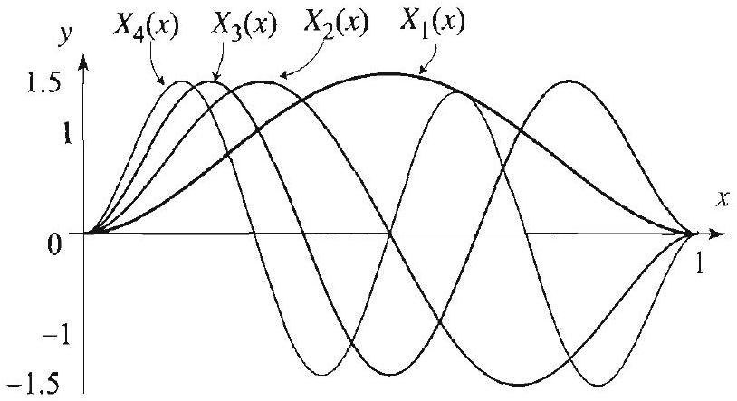
Figure 3 Eigenfunctions for the clamped beam.

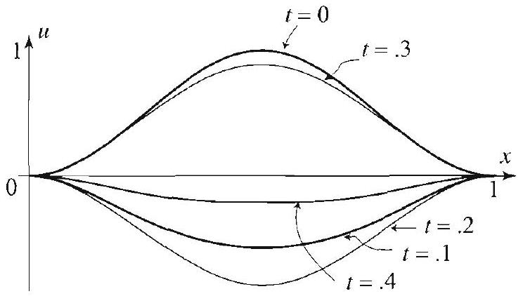
Figure 4 Snapshots of the vibrating clamped beam.

## Transverse Vibrations of a Beam: Clamped-Free Case

Consider the cantilevered beam in Figure 5, where one end is clamped and the other is free. We have the boundary conditions

$$
u(0, t)=0, u_{x}(0, t)=0, u_{x x}(L, t)=0, u_{x x x}(L, t)=0
$$

and the initial conditions

$$
u(x, 0)=f(x), u_{t}(x, 0)=g(x), \quad 0<x<L .
$$

Figure 5 A cantelivered beam is fixed at one end and free at the other.
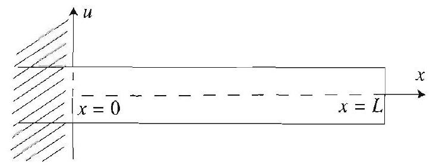

We separate the variables and arrive at the fourth order Sturm-Liouville problem

$$
\begin{gathered}
X^{(4)}-\lambda X=0 \\
X(0)=0, X^{\prime}(0)=0, X^{\prime \prime}(L)=0, X^{\prime \prime \prime}(L)=0
\end{gathered}
$$

The solution of this problem is outlined in Exercise 14, Section 14.4. We have

$$
\lambda=\lambda_{n}=\alpha_{n}^{4}
$$

and

$$
\begin{aligned}
X_{n}(x)= & \cos \alpha_{n} x-\cosh \alpha_{n} x \\
& -\frac{\cosh \alpha_{n} L+\cos \alpha_{n} L}{\sinh \alpha_{n} L+\sin \alpha_{n} L}\left(\sin \alpha_{n} x-\sinh \alpha_{n} x\right),
\end{aligned}
$$

for $n=1,2, \ldots$, where $\alpha_{n}$ is the $n$th positive root of

$$
\cosh \alpha L \cos \alpha L=-1
$$

Using the solution for $T$ from the previous example and superposing product solutions, we arrive at

$$
\begin{aligned}
u(x, t)= & \sum_{n=1}^{\infty}\left\{\cos \alpha_{n} x-\cosh \alpha_{n} x\right. \\
& \left.-\frac{\cosh \alpha_{n} L+\cos \alpha_{n} L}{\sinh \alpha_{n} L+\sin \alpha_{n} L}\left(\sin \alpha_{n} x-\sinh \alpha_{n} x\right)\right\} \\
& \times\left\{A_{n} \cos \alpha_{n}^{2} c t+A_{n}^{*} \sin \alpha_{n}^{2} c t\right\}
\end{aligned}
$$

To determine the coefficients, we use the initial conditions and appeal to Theorem 2, Section 14.4, and get

$$
A_{n}=\frac{1}{\kappa_{n}} \int_{0}^{L} f(x) X_{n}(x) d x, \quad A_{n}^{*}=\frac{1}{\alpha_{n}^{2} c \kappa_{n}} \int_{0}^{L} g(x) X_{n}(x) d x
$$

where

$$
\kappa_{n}=\int_{0}^{L} X_{n}^{2}(x) d x
$$

and the $\alpha_{n}$ 's are the positive roots of (18).

## EXAMPLE 2 Vibrating elastic beam: clamped-free case

Solve the boundary value problem (1), (15), (16), with

$$
L=1, f(x)=x^{2}, g(x)=0, c=1 .
$$

Solution Here the solution is given by (19) and (20), with $A_{n}^{*}=0$, and the $\alpha_{n}$ 's are determined from the equation

Figure 6

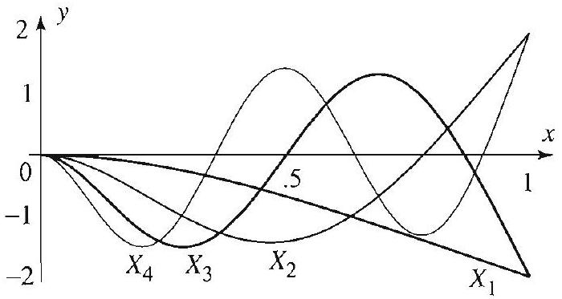
Figure 7 Eigenfunctions for the cantilevered beam.

$$
\cos \alpha=-\frac{1}{\cosh \alpha} .
$$

As shown in Figure 6, this equation has infinitely many positive real roots. With the help of a computer, we approximated the numerical values of the first five positive roots and included them in Table 2.

| $n$ | 1 | 2 | 3 | 4 | 5 |
| :--- | :---: | :---: | :---: | :---: | :---: |
| $\alpha_{n}$ | 1.875 | 4.694 | 7.855 | 10.995 | 14.137 |

Table 2 Numerical data for Example 2.

Note that in Table 2, starting with $n=2$, the values are close to those in Table 1 (starting with $n=1$ ). This is because $1 / \cosh \alpha$ goes to zero very rapidly with increasing $\alpha$. Hence the intersection points in Figure 6 above and Figure 1, Section 14.4, have very nearly equal $\alpha$ coordinates, which in turn are very nearly equal to $(n+1 / 2) \pi$. To determine the coefficients $A_{n}$ in the series solution (19), according to (20), we must compute the inner products of $f$ with the eigenfunctions

$$
X_{n}=\cos \alpha_{n} x-\cosh \alpha_{n} x-\frac{\cosh \alpha_{n}+\cos \alpha_{n}}{\sinh \alpha_{n}+\sin \alpha_{n}}\left(\sin \alpha_{n} x-\sinh \alpha_{n} x\right) .
$$

While these inner products can be performed by hand, here again we use a computer to approximate the coefficients. We have

$$
\begin{aligned}
u(x, t)= & -0.445 X_{1}(x) \cos \alpha_{1}^{2} t+.039 X_{2}(x) \cos \alpha_{2}^{2} t-.008 X_{3}(x) \cos \alpha_{3}^{2} t \\
& +.003 X_{4}(x) \cos \alpha_{4}^{2} t-.001 X_{5}(x) \cos \alpha_{5}^{2} t \ldots
\end{aligned}
$$

Figure 7 shows the graphs of the first four eigenfunctions of this problem. Figure 8 shows the position of the beam at various values of $t$. Here also, we used the fifth partial sum to approximate $u$.

Figure 8 Snapshots of the vibrating cantilevered beam.

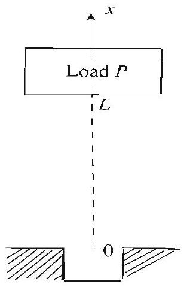
Figure 9 Vertical column with axial loading.

## Buckling of Columns under Axial Loading

Consider a vertical column of length $L$ of constant density and cross- sectional shape with a load $P$ at its top, as shown in Figure 9. We are interested in finding the largest load $P$ that the column can withstand before buckling. This critical value $P_{1}$ is known as the Euler load. It turns out that $P_{1}$ is determined by the first eigenvalue of the following fourth-order equation:

$$
y^{(4)}+\lambda y^{\prime \prime}=0,
$$

with boundary conditions corresponding to the manner in which the column is fastened at its ends. Typical boundary conditions are shown in Figure 10.

From the theory of strength of materials, the critical buckling load $P_{1}$ is related to the first eigenvalue of (21) with appropriate boundary conditions

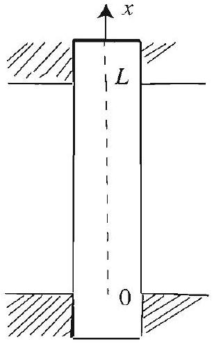
(b) Clamped-clamped case:

$$
\begin{aligned}
& y(0)=0, y^{\prime}(0)=0 \\
& y(L)=0, y^{\prime}(L)=0
\end{aligned}
$$

by

$$
P_{1}=E I \lambda_{1},
$$

where $E=$ Young's constant and $I=$ moment of inertia of a cross section of

(c) Simply supported case:

$y(0)=0, y^{\prime \prime}(0)=0$,
$y(L)=0, y^{\prime \prime}(L)=0$.
the column with respect to an axis through its center of mass and perpendicular to the ( $x, y$ )-plane. The eigenfunction corresponding to $\lambda_{1}$ gives an indication of the deformation of the column as it begins to buckle. In the following examples, we solve for the Euler load in the second and third cases in Figure 10. We begin with the third case.

(a) Clamped-free case:

$$
\begin{aligned}
& y(0)=0, y^{\prime}(0)=0 \\
& y(L)=\delta, y^{\prime \prime}(L)=0
\end{aligned}
$$

Figure 10 Boundary conditions for a vertical column with axial loading.

EXAMPLE 3 Buckling of a column: simply supported case To solve for the critical load (Euler load) of a hinged-hinged column, we consider the equation

$$
y^{(4)}+\lambda y^{\prime \prime}=0,
$$

together with the boundary conditions

$$
y(0)=0, y^{\prime \prime}(0)=0, y(L)=0, y^{\prime \prime}(L)=0 .
$$

It can be shown that nonpositive values of $\lambda$ lead only to the trivial solution $y=0$ (see Exercise 9). Therefore, we concentrate on the case $\lambda>0$, and hence it is convenient to set $\lambda=\alpha^{2}$ with $\alpha>0$. The characteristic equation of (22) is

$$
r^{4}+\alpha^{2} r^{2}=r^{2}\left(r^{2}+\alpha^{2}\right)=0
$$

which has roots $r=0$ (double) and $r= \pm i \alpha$. Thus the general solution to (22) is

$$
y=A+B x+C \cos \alpha x+D \sin \alpha x .
$$

Using the first two boundary conditions, we find $A=C=0$. The third and fourth imply that $B=0$ and $\sin \alpha L=0$. The last equation implies that

$$
\alpha=\alpha_{n}=\frac{n \pi}{L},
$$

and hence the first eigenvalue is

$$
\lambda_{1}=\alpha_{1}^{2}=\frac{\pi^{2}}{L^{2}}
$$

The corresponding buckling mode is

$$
y_{1}=\sin \frac{\pi}{L} x
$$

and gives the shape of the deflection when the column first begins to buckle. In conclusion, we find that the Euler load for this column is $E I \frac{\pi^{2}}{L^{2}}$.

## EXAMPLE 4 Buckling of a column: clamped-clamped case

For this case, we must solve equation (22) with the boundary conditions

$$
y(0)=0, y^{\prime}(0)=0, y(L)=0, y^{\prime}(L)=0 .
$$

It can be shown that nonpositive values of $\lambda$ lead only to the trivial solution $y=0$ (see Exercise 10). We therefore concentrate on the case $\lambda=\alpha^{2}$ with $\alpha>0$. From Example 3, we have

$$
y=A+B x+C \cos \alpha x+D \sin \alpha x .
$$

The boundary conditions yield the following equations for the coefficients:

$$
\begin{aligned}
& A+C=0 \Rightarrow A=-C \\
& B+\alpha D=0 \Rightarrow B=-\alpha D \\
& A+B L+C \cos \alpha L+D \sin \alpha L=0 \\
& B-\alpha C \sin \alpha L+\alpha D \cos \alpha L=0
\end{aligned}
$$

Using the first and second of these equations in the third and fourth, we get

$$
\left\{\begin{array}{l}
(1-\cos \alpha L) C+(\alpha L-\sin \alpha L) D=0 \\
\sin \alpha L C+(1-\cos \alpha L) D=0
\end{array}\right.
$$

$\left(k \pi+\frac{\pi}{2},(k+1) \pi+\frac{\pi}{2}\right)$, $k=0,1,2, \ldots$.

If this system of equations has a nonzero determinant, then its only solutions are $C=D=0$. This leads to a trivial solution for $y$. Hence, to get nontrivial solutions, we must set the determinant equal to 0 . We get

$$
(1-\cos \alpha L)^{2}-\sin \alpha L(\alpha L-\sin \alpha L)=0,
$$

or, equivalently,

$$
2-2 \cos \alpha L-\alpha L \sin \alpha L=0,
$$

since $\cos ^{2} \alpha L+\sin ^{2} \alpha L=1$. The first positive root $\alpha_{1}$ of this equation determines the first eigenvalue, and thus the critical load. Using the half-angle trigonometric identities, we have

$$
4 \sin ^{2} \frac{\alpha L}{2}-2 \alpha L \sin \frac{\alpha L}{2} \cos \frac{\alpha L}{2}=0 .
$$

Thus the roots we seek are the positive roots of

$$
\sin \frac{\alpha L}{2}\left[2 \sin \frac{\alpha L}{2}-\alpha L \cos \frac{\alpha L}{2}\right]=0 .
$$

The equation $\sin \frac{\alpha L}{2}=0$ has for its smallest positive root $\alpha=\frac{2 \pi}{L}$. The equation $2 \sin \frac{\alpha L}{2}-\alpha L \cos \frac{\alpha L}{2}=0$ transforms to

$$
\tan \frac{\alpha L}{2}=\frac{\alpha L}{2} .
$$

Figure 11 The transcendental equation $\tan x=x$ has infinitely many positive roots; one in each interval
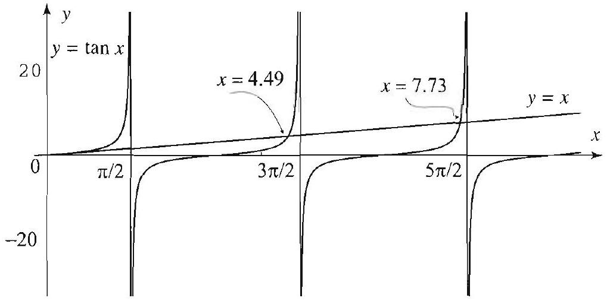

The roots of this transcendental equation cannot be found explicitly, but as we have done before, we can use a computer system to approximate them. As Figure 11 shows, the first positive root is certainly larger than $2 \pi / L$. Hence $\alpha_{1}=2 \pi / L$, and the Euler load is

$$
P_{1}=\frac{4 \pi^{2}}{L^{2}} E l
$$

Note that the critical load is four times greater than its value in the simply supported case. Finally, if we are interested in the shape of the column as it buckles, we have to compute the eigenfunction corresponding to $\alpha_{1}$. With $\alpha_{1}=\frac{2 \pi}{L}$, the first equation in (24) implies that $D=0$, and hence $B=0$. The coefficients $A$ and $C$ are related by $A=-C$. Taking $A=1$, we get the eigenfunction

$$
y_{1}=1-\cos \frac{2 \pi}{L} x,
$$

or, equivalently,

$$
y_{1}=2 \sin ^{2} \frac{\pi}{L} x .
$$

## Exercises 6.5

In Exercises 1-2, solve the boundary value problem (1), (2), (3) subject to the given conditions.

1. $f(x)=x \sin \pi x, g(x)=0, c=\pi, L=1$.
2. $f(x)=x(1-x), g(x)=0, c=\pi, L=1$.

In Exercises 3-4, solve the boundary value problem (1), (9), (10) subject to the given conditions.
3. $f(x)=x(1-x), \quad g(x)=x, c=1, L=1$.
4. $f(x)=1-\cos 4 \pi x, \quad g(x)=\sin 2 \pi x, c=1, L=1$.

In Exercises 5-6, solve the boundary value problem (1), (15), (16) subject to the given conditions.
5. $f(x)=x^{3}, g(x)=0, c=\pi, L=1$.
6. $f(x)=x^{2} \cos \pi x, g(x)=0, \quad c=\pi, L=1$.
7. (a) Determine the eigenvalues of the problem in Figure 10(a).
(b) Determine the critical buckling load for a clamped-free column.
8. Show that the eigenvalues in Example 3 are positive.
9. Show that the eigenvalues in Example 4 are positive.

### 14.6 The Biharmonic Operator

In this and the following sections we consider boundary value problems on plates. As in the case of beams, the equations will involve fourth-order partial derivatives with respect to the spacial variables, due to the rigidity of the plates. Whereas with membranes the Laplacian plays a central role, here the iterated Laplacian or biharmonic operator will be at the heart of most equations. The biharmonic operator of $u(x, y)$ is defined as

$$
\nabla^{4} u=\nabla^{2}\left(\nabla^{2} u\right) .
$$

In Cartesian coordinates,

$$
\begin{aligned}
\nabla^{4} u(x, y) & =\nabla^{2}\left(u_{x x}+u_{y y}\right)=\left(u_{x x}+u_{y y}\right)_{x x}+\left(u_{x x}+u_{y y}\right)_{y y} \\
& =u_{x x x x}+u_{y y x x}+u_{x x y y}+u_{y y y y} \\
& =u_{x x x x}+2 u_{y y x x}+u_{y y y y}
\end{aligned}
$$

The fourth partial derivatives present a new challenge. Moreover, unlike Laplace's equation, you cannot separate the variables in the biharmonic equation in Cartesian coordinates:

$$
u_{x x x x}+2 u_{y y x x}+u_{y y y y}=0
$$

In fact, if we set $u(x, y)=X(x) Y(y)$ and plug into the equation, we get

$$
X^{\prime \prime \prime \prime} Y+2 X^{\prime \prime} Y^{\prime \prime}+X Y^{\prime \prime \prime \prime}=0,
$$

and clearly the variables cannot be separated in this equation. It turns out, however, that we can separate the variables in the biharmonic equation in polar coordinates. It is still an overwhelming task to work with the biharmonic equation directly. Instead, in this and the following section, as we search for analytical solutions, we will use clever methods to reduce to problems involving the Laplacian. These reductions work in polar coordinates but again fail in Cartesian coordinates. Because of this fact, we will forgo the search for analytical solutions in Cartesian coordinates (numerical solutions can be used for such problems) and work in polar coordinates.

We call a biharmonic function any solution of the biharmonic equation. Observe that any harmonic function $u$ is also biharmonic. This is clear, since if $\nabla^{2} u=0$, then $\nabla^{4}(u)=\nabla^{2}\left(\nabla^{2}(u)\right)=\nabla^{2}(0)=0$. The following provides a way to construct biharmonic functions, which are not necessarily harmonic.

## EXAMPLE 1 Biharmonic functions

Show that if $u=u(x, y)$ is harmonic and

$$
v=u \cdot\left(A\left(x^{2}+y^{2}\right)+B x+C y+D\right),
$$

where $A, B, C$, and $D$ are constants, then $v$ is biharmonic.
Solution We have to verify that $\nabla^{4} v=0$. As a first step, establish the identity

$$
\nabla^{2}(\phi \cdot \psi)=\psi \nabla^{2}(\phi)+\phi \nabla^{2}(\psi)+2 \phi_{x} \psi_{x}+2 \phi_{y} \psi_{y}
$$

(Exercise 10). Apply this identity with $u=\phi$ and $\psi=A\left(x^{2}+y^{2}\right)+B x+C y+D$, $\nabla^{2} u=0(u$ is harmonic $), \nabla^{2}\left(A\left(x^{2}+y^{2}\right)+B x+C y+D\right)=4 A, \psi_{x}=2 A x+B$, and $\psi_{y}=2 A y+C$; then

$$
\begin{aligned}
\nabla^{4} v & =\nabla^{2} \nabla^{2}\left(u \cdot\left(A\left(x^{2}+y^{2}\right)+B x+C y+D\right)\right) \\
& =\nabla^{2}\left(4 A u+2 u_{x}(2 A x+B)+2 u_{y}(2 A y+C)\right) \\
& =4 A \nabla^{2} u+2 \nabla^{2}\left(u_{x}(2 A x+B)\right)+2 \nabla^{2}\left(u_{y}(2 A y+C)\right) \\
& =2 \nabla^{2}\left(u_{x}(2 A x+B)\right)+2 \nabla^{2}\left(u_{y}(2 A y+C)\right) .
\end{aligned}
$$

Since $\nabla^{2} u=0$, then $\nabla^{2}\left(u_{x}\right)=\left(\nabla^{2} u\right)_{x}=0$, and, similarly, $\nabla^{2}\left(u_{y}\right)=0$. Also, $2 A x+B$ is a linear function, so $\nabla^{2}(2 A x+B)=0$. Similarly, $\nabla^{2}(2 A y+C)=0$. Applying (4), we find

$$
\nabla^{2}\left(u_{x}(2 A x+B)\right)=2\left(u_{x}\right)_{x}(2 A x+B)_{x}+2\left(u_{x}\right)_{y}(2 A x+B)_{y}=4 A u_{x x},
$$

because $(2 A x+B)_{y}=0$. Similarly, $\nabla^{2}\left(u_{y}(2 A y+C)\right)=4 A u_{y y}$. Hence $\nabla^{4} v= 8 A u_{x x}+8 A u_{y y}=8 A\left(u_{x x}+u_{y y}\right)=0$.

Figure 1 A biharmonic function that attains its maximum inside a region.

Taking $u(x, y)=1, A=-1, D=1$, and $B=C=0$ in (3), we obtain

$$
v(x, y)=1-x^{2}-y^{2} .
$$

We have $\nabla^{2} v=-2-2=-4$ and $\nabla^{4} v=\nabla^{2}(-4)=0$. Thus, as expected, $v$ is biharmonic but not harmonic. The graph of $v$ over the rectangle $-1 \leq x, y \leq 1$, in Figure 1, illustrates an important distinction between harmonic and biharmonic functions. The maximum value of $v$ is attained at the point $(0,0)$ inside the rectangle, which is unlike nonconstant harmonic functions whose maximum and minimum values must occur on the boundary (the maximum principle, Section 3.11). Thus the maximum principle, which holds for harmonic functions, fails for biharmonic functions.

## Solution of the Biharmonic Equation

We switch to polar coordinates ( $r, \theta$ ) and consider the biharmonic equation on a disk with center at the origin and radius $a>0$ :

$$
\nabla^{4} u=0, \quad 0 \leq r<a, \quad 0 \leq \theta \leq 2 \pi .
$$

Because the biharmonic equation involves fourth order derivatives, we impose two conditions on the boundary that specify the boundary values of $u$ and its normal derivative. Since the normal derivative is $\frac{\partial u}{\partial r}$ (or simply $u_{r}$ ) for the disk, we will consider (5) subject to the boundary conditions

$$
u(a, \theta)=f(\theta), \quad \frac{\partial u}{\partial r}(a, \theta)=g(\theta), \quad 0 \leq \theta \leq 2 \pi .
$$

We solve the boundary value problem (5)-(6) by reducing it to two Dirichlet problems on the disk, as follows. Consider a function of the form

$$
u(r, \theta)=\left(a^{2}-r^{2}\right) v(r, \theta)+w(r, \theta)
$$

where $v$ and $w$ are harmonic. Since $r^{2}=x^{2}+y^{2}$, it follows from Example 1 that $\left(a^{2}-r^{2}\right) v$ is biharmonic. And since $w$ is biharmonic, it follows that the right side of (7) is biharmonic, being the sum of two biharmonic functions. So $u$ satisfies (5). We next determine $v$ and $w$ so as to satisfy the boundary conditions (6). Since both $v$ and $w$ are harmonic, they are determined by their values on the boundary of the disk. Setting $r=a$ in (7) and using $u(a, \theta)=f(\theta)$, we determine the boundary values for $w$ :

$$
w(a, \theta)=f(\theta)
$$

Thus $w$ is the (unique) solution of the Dirichlet problem on the disk with boundary values (8). To find $w$, we use techniques from Section 4.4. Next, we determine the boundary values of $v$, which in turn will determine $v$ itself.

## THEOREM 1 SOLUTION OF THE BIHARMONIC EQUATION

For this purpose, differentiate both sides of (7) with respect to $r$, set $r=a$, use $u_{r}(a, \theta)=g(\theta)$, and get

$$
\begin{aligned}
u_{r}(r, \theta) & =-2 r v(r, \theta)+\left(a^{2}-r^{2}\right) v_{r}(r, \theta)+w_{r}(r, \theta) ; \\
u_{r}(a, \theta)=g(\theta) & =-2 a v(a, \theta)+w_{r}(a, \theta) ; \\
v(a, \theta) & =\frac{1}{2 a}\left(w_{r}(a, \theta)-g(\theta)\right) .
\end{aligned}
$$

Figure 2 Decomposition of a biharmonic problem with two boundary conditions into two Dirichlet problems with one boundary condition each.

Since $w$ is determined at this point, $w_{r}(a, \theta)$ is therfore known and the last equation determines the boundary values of $v$. Thus $v$ is the (unique) solution of the Dirichlet problem inside the disk with boundary values (9). This determines $v$ and $w$ in (7) and solves the boundary value problem (5)(6). The method is illustrated in Figure 2 and summarized in Theorem 1.

The solution of the boundary value problem (5)-(6) is the biharmonic function $u$ given by (7), where $v$ and $w$ are solutions of the Dirichlet problems on the disk with boundary values for $w$ given by (8) (same as the boundary values of $u$ ) and boundary values for $v$ given by (9).

As in the derivation of the solution, when solving a biharmonic equation inside the disk, we first find $w$ and then $v$, since the boundary values of $v$ depend on those of $w$.

## EXAMPLE 2 Biharmonic equation

On the unit disk, solve

$$
\nabla^{4} u=0, \quad u(1, \theta)=\cos \theta \quad \text { and } \quad u_{r}(1, \theta)=\sin \theta .
$$

Solution According to Theorem 1, the solution is of the form

$$
u(r, \theta)=\left(1-r^{2}\right) v+w
$$

where $v$ and $w$ are harmonic functions in the unit disk. The boundary values of $w$ are the same as those of $u$. Thus, to find $w$, we must solve $\nabla^{2} w=0$ subject to $w(1, \theta)=\cos \theta$. We know from Section 4.4 that the solution of this problem is given by $w(r, \theta)=a_{0}+\sum_{n=1}^{\infty} r^{n}\left(a_{n} \cos n \theta+b_{n} \sin n \theta\right)$, where $a_{n}$ and $b_{n}$ are the Fourier coefficients of the boundary function, $f(\theta)=\cos \theta$. Immediately, we conclude that $a_{1}=1$ and all other coefficients are 0 . So $w(r, \theta)=r \cos \theta$.

Having found $w$, we can determine the boundary values of $v$ from (9), using $g(\theta)=\sin \theta$ and $\left.w_{r}(r, \theta)\right|_{r=1}=\cos \theta$. We have

$$
v(1, \theta)=\frac{1}{2}(\cos \theta-\sin \theta)
$$

Arguing as we did with the solution of the Dirichlet problem for $w$, we see that the solution of the Dirichlet problem with boundary values $\frac{1}{2}(\cos \theta-\sin \theta)$ is $v(r, \theta)= \frac{1}{2} r(\cos \theta-\sin \theta)$. Thus the solution of the biharmonic problem is

$$
u(r, \theta)=\left(1-r^{2}\right) \frac{1}{2} r(\cos \theta-\sin \theta)+r \cos \theta
$$

You should check that this function is indeed a solution. Note that $r \cos \theta$ is harmonic but $\left(1-r^{2}\right) \frac{1}{2} r(\cos \theta-\sin \theta)$ is not. As a consequence, the function $u$ is not harmonic on the disk.

Even though the boundary conditions in Example 2 are somewhat special, they do illustrate the process of solving a biharmonic equation by reducing to two Dirichlet problems and the role of Fourier series. Here is one more illustration.

## EXAMPLE 3 Biharmonic function with 0 boundary values

On the unit disk, show that the solution of the boundary value problem

$$
\nabla^{4} u=0, \quad u(1, \theta)=0 \text { and } u_{r}(1, \theta)=g(\theta)
$$

is given by

$$
u(r, \theta)=-\frac{1}{2}\left(1-r^{2}\right)\left[a_{0}+\sum_{n=1}^{\infty} r^{n}\left(a_{n} \cos n \theta+b_{n} \sin n \theta\right)\right]
$$

where $a_{0}, a_{n}$ and $b_{n}$ are the Fourier coefficients of $g$.
Solution By Theorem 1, the solution is of the form

$$
u(r, \theta)=\left(1-r^{2}\right) v+w
$$

where $v$ and $w$ are harmonic functions on the unit disk. Since $w$ is 0 on the boundary, we conclude that $w$ is identically 0 inside the unit disk. Thus,

$$
u(r, \theta)=\left(1-r^{2}\right) v
$$

To solve the given problem, start with a biharmonic function of the form described by Exercise 9 and determine the constants in order to satisfy the boundary conditions.

Using (9) and the fact that $w_{r}=0$, we obtain the boundary values of $v$ :

$$
v(1, \theta)=-\frac{1}{2} g(\theta) .
$$

Using results from Section 4.4, we find that the solution of the Dirichlet problem with boundary values $-\frac{1}{2} g(\theta)$ is

$$
v(r, \theta)=-\frac{1}{2}\left[a_{0}+\sum_{n=1}^{\infty} r^{n}\left(a_{n} \cos n \theta+b_{n} \sin n \theta\right)\right],
$$

where $a_{0}, a_{n}$ and $b_{n}$ are the Fourier coefficients of $g$. This determines $v$ and shows that the desired solution is as claimed.

## Exercises 6.6

In Exercises 1-8, verify that the given function is biharmonic. Use the result of Example 1 where appropriate. In what follows, $(x, y)$ denote Cartesian coordinates, $(r, \theta)$ polar coordinates, and $n$ an integer.

1. $x^{4}-y^{4}$.
2. $x y^{2}+y x^{2}+x^{3}-2 y^{3}$.
3. $\frac{x^{2}}{x^{2}+y^{2}}$.
4. $\frac{x y}{x^{2}+y^{2}}$.
5. $\left(1-r^{2}\right) r^{2} \cos 2 \theta$.
6. $r^{3}(\cos \theta+\sin \theta)$.
7. $r^{n+2} \cos n \theta$.
8. $r^{2} \ln r$.

## 11.

Figure 3 for Exercise 11.

12. 

Figure 4 for Exercise 12.

9. Show that $a r^{2} \ln r+b r^{2}+c \ln r+d$ is biharmonic, where $a, b, c, d$ are constants. This function is useful in solving the biharmonic equation in an annulus with boundary data independent of $\theta$. See Exercises 11 and 12 .
10. Prove (4).

In Exercises 11 and 12, solve the problem that is described in the figure.
13. On the unit disk, solve $\nabla^{4} u=0$, subject to $u(1, \theta)=\cos 2 \theta$ and $u_{r}(1, \theta)=0$.
14. On the unit disk, solve $\nabla^{4} u=0$, subject to $u(1, \theta)=0$ and $u_{T}(1, \theta)=1$.
15. On the unit disk, solve $\nabla^{4} u=0$, subject to $u(1, \theta)=1$ and $u_{T}(1, \theta)=\cos \theta$.
16. On the unit disk, solve $\nabla^{4} u=0, u(1, \theta)=0$ and $u_{r}(1, \theta)=\theta^{2},-\pi<\theta<\pi$.
17. On the unit disk, solve $\nabla^{4} u=0$, subject to $u(1, \theta)=0$ and $u_{r}(1, \theta)=g(\theta)$.
18. On the unit disk, solve $\nabla^{4} u=0$, subject to $u(1, \theta)=f(\theta)$ and $u_{r}(1, \theta)=0$.

### 14.7 Vibrations of Circular Plates

The vibrations of plates are governed by the two-dimensional analog of the equation for the vibrations of beams (Section 14.4):

$$
\frac{\partial^{2} u}{\partial t^{2}}+c^{2} \nabla^{4} u=0 .
$$

Here $u=u(x, y, t)$ denotes the deflection of the plate at the point $(x, y)$, at time $t>0$, and $\nabla^{4} u$ is the biharmonic operator of $u$, with respect to the variables $x$ and $y$. Because of difficulties that arise in Cartesian coordinates, as we explained in the previous section, we will consider problems in polar coordinates. On a disk of radius $a>0$ and center at the origin, the equation becomes

$$
u_{t t}+c^{2} \nabla^{4} u=0, \quad 0 \leq r<a, 0 \leq \theta \leq 2 \pi, t>0 .
$$

The appropriate boundary conditions for a clamped plate are

$$
u(a, \theta, t)=0 \text { and } u_{r}(a, \theta, t)=0
$$

and the initial conditions are

$$
u(r, \theta, 0)=f(r, \theta), u_{t}(r, \theta, 0)=g(r, \theta), 0 \leq r<a, 0 \leq \theta \leq 2 \pi .
$$

We will also consider the nonhomogeneous equation

$$
u_{t t}+c^{2} \nabla^{4} u=F(r, \theta, t), \quad 0 \leq r<a, 0 \leq \theta \leq 2 \pi, t>0,
$$

supplied with similar boundary and initial conditions. As you can imagine, the task ahead of us is at least as complicated as the solution of the vibrating membrane problem from Sections 4.2-4.3. We will first determine the eigenvalues and eigenfunctions of the biharmonic operator on the disk, and then use the eigenfunction expansion method to solve the stated boundary value problems. The good news is that the eigenfunction problem will be reduced to the one that we solved in Section 4.6.

Eigenfunctions of the Biharmonic Operator Consider the eigenvalue problem on a disk of radius $a$,

$$
\nabla^{4} \phi(r, \theta)=k^{4} \phi(r, \theta), 0 \leq r<a, 0 \leq \theta \leq 2 \pi,
$$

## PROPOSITION 1 DILATION OF EIGENFUNCTIONS

with the boundary conditions

$$
\phi(a, \theta)=0, \phi_{r}(a, \theta)=0, \quad 0 \leq \theta \leq 2 \pi .
$$

Here we have an additional condition on the normal derivative at the boundary, which we did not have with the Laplacian. Also, for the sake of convenience, we wrote the constant in (5) as $k^{4}$. The important fact is that the constant should be positive.

Note that if $\phi$ satisfies $\nabla^{2} \phi= \pm k^{2} \phi$, then

$$
\nabla^{4}(\phi)=\nabla^{2}\left(\nabla^{2} \phi\right)=\nabla^{2}\left( \pm k^{2} \phi\right)= \pm k^{2} \nabla^{2}(\phi)=k^{4} \phi
$$

So if $\phi$ is an eigenfunction of the Laplacian corresponding to the eigenvalue $\pm k^{2}$, then $\phi$ is an eigenfunction of the biharmonic operator corresponding to the eigenvalue $k^{4}$. With this in mind and without worrying about the boundary conditions for now, looking back at Section 4.6, we find that the functions

$$
\phi(r, \theta)=J_{m}(k r) \cos m \theta \text { or } J_{m}(k r) \sin m \theta \quad(m=0,1,2, \ldots)
$$

are solutions of $\nabla^{2} \phi=-k^{2} \phi$, and thus they satisfy the equation $\nabla^{4} u=k^{4} u$. We next ask, What are the nonzero solutions of $\nabla^{2} \phi=+k^{2} \phi$ ? Are they related to the solutions of $\nabla^{2} \phi=-k^{2} \phi$ ? To answer these questions, we first prove the following useful proposition.

Suppose that $\phi(r, \theta)$ satisfies $\nabla^{2} \phi=\lambda \phi(\lambda \neq 0)$, and let $\psi(r, \theta)=A \phi(\alpha r, \theta)$, where $A$ and $\alpha$ are nonzero constants. Then $\nabla^{2} \psi=\alpha^{2} \lambda \psi$.

In other words, the radial dilate of an eigenfunction by a factor $\alpha$ is an eigenfunction that corresponds to the same eigenvalue scaled by $\alpha^{2}$.
Proof The equation $\nabla^{2} \phi=\lambda \phi$ tells us that

$$
\phi_{r r}(r, \theta)+\frac{1}{r} \phi_{r}(r, \theta)+\frac{1}{r^{2}} \phi_{\theta \theta}(r, \theta)=\lambda \phi(r, \theta)
$$

To avoid confusion, let us denote the radial variable by $\rho$. Then

$$
\phi_{r r}(\rho, \theta)+\frac{1}{\rho} \phi_{r}(\rho, \theta)+\frac{1}{\rho^{2}} \phi_{\theta \theta}(\rho, \theta)=\lambda \phi(\rho, \theta)
$$

We now compute the Laplacian of $\psi$ using $\psi_{r}(\alpha r, \theta)=A \alpha \phi_{r}(\alpha r, \theta), \psi_{r r}(\alpha r, \theta)= A \alpha^{2} \phi_{r r}(\alpha r, \theta)$, and $\psi_{\theta \theta}(\alpha r, \theta)=A \phi_{\theta \theta}(\alpha r, \theta)$ :

$$
\begin{aligned}
\nabla^{2} \psi & =\psi_{r r}(r, \theta)+\frac{1}{r} \psi_{r}(r, \theta)+\frac{1}{r^{2}} \psi_{\theta \theta}(r, \theta) \\
& =A \alpha^{2}\left[\phi_{r r}(\alpha r, \theta)+\frac{1}{(\alpha r)} \phi_{r}(\alpha r, \theta)+\frac{1}{(\alpha r)^{2}} \phi_{\theta \theta}(\alpha r, \theta)\right] \\
& =A \alpha^{2} \nabla^{2} \phi(\alpha r, \theta) \quad \quad(\text { by }(8), \text { with } \rho=\alpha r) \\
& =A \alpha^{2} \lambda \phi(\alpha r, \theta)=\alpha^{2} \lambda \psi(r, \theta) . \quad
\end{aligned}
$$

This shows that $\psi$ is an eigenfunction that corresponds to the eigenvalue $\alpha^{2} \lambda$.
Recall the definition of the modified Bessel function of integer order $m$ (Section 4.7, Exercise 29): $I_{m}(r)=\frac{1}{i^{m}} J_{m}(i r)$. Let

$$
\psi(r, \theta)=I_{m}(k r) \cos m \theta \text { or } I_{m}(k r) \sin m \theta \quad(m=0,1,2, \ldots)
$$

We have $\psi(r, \theta)=\frac{1}{i^{m}} \phi(i r, \theta)$, where $\phi$ is as in (7). Since $\nabla^{2} \phi=-k^{2} \phi$, then, by Proposition 1,

$$
\nabla^{2} \psi=-k^{2}(i)^{2} \psi=k^{2} \psi \Rightarrow \nabla^{4} \psi=k^{4} \psi
$$

We now summarize our findings and give a formula for the eigenvalues.

THEOREM 1 EIGENFUNCTIONS OF THE BIHARMONIC OPERATOR

For $m=0,1,2, \ldots, n=1,2, \ldots$, consider the function $\phi_{m n}(r, \theta)$ given by

$$
\left[I_{m}\left(k_{m n} a\right) J_{m}\left(k_{m n} r\right)-J_{m}\left(k_{m n} a\right) I_{m}\left(k_{m n} r\right)\right] \cos m \theta
$$

or

$$
\left[I_{m}\left(k_{m n} a\right) J_{m}\left(k_{m n} r\right)-J_{m}\left(k_{m n} a\right) I_{m n}\left(k_{m n} r\right)\right] \sin m \theta
$$

where $k_{m n}$ is a positive root of

$$
J_{m}(k a) I_{m}^{\prime}(k a)-I_{m}(k a) \cdot J_{m}^{\prime}(k a)=0
$$

Then $\nabla^{4} \phi_{m n}=k_{m n}^{4} \phi_{m n}$ and $\phi_{m n}$ satisfies the boundary conditions (6).
Proof We have already established that $J_{m}\left(k_{m n} r\right) \cos m \theta, \quad I_{m}\left(k_{m n} r\right) \cos m \theta$, $J_{m}\left(k_{m n} r\right) \sin m \theta$, and $I_{m}\left(k_{m n} r\right) \sin m \theta$ are all eigenfunctions satisfying $\nabla^{4} \phi=k^{A} \phi$. Consequently, any linear combination of these functions is also an eigenfunction corresponding to $k^{4}$, and, in particular, the functions in (10) and (11) are eigenfunctions corresponding to $k^{4}$. We now show that if $k_{m n}$ is a root of equation (12), then the functions in (10) and (11) also satisfy the boundary conditions (6). Take $\phi(r, \theta)=\left[I_{m}\left(k_{m n} a\right) J_{m}\left(k_{m n} r\right)-J_{m}\left(k_{m n} a\right) I_{m}\left(k_{m n} r\right)\right] \cos m \theta$. Then

$$
\phi(a, \theta)=\left[I_{m}\left(k_{m n} a\right) J_{m}\left(k_{m n} a\right)-I_{m}\left(k_{m n} a\right) J_{m}\left(k_{m n} a\right)\right] \cos m \theta=0
$$

and

$$
\phi_{T}(a, \theta)=k_{m n}\left[I_{m}\left(k_{m n} a\right) J_{m}^{\prime}\left(k_{m n} a\right)-J_{m}\left(k_{m n} a\right) I_{m}^{\prime}\left(k_{m n} a\right)\right] \cos m \theta=0
$$

because $k_{m n}$ is a root of (12). The same is true if $\phi_{m n}$ is given by (11).
The most important property of the eigenfunctions in Theorem 1 is that they form a complete orthogonal set of functions in the disk $0 \leq r<a$. That is, any two distinct functions $\phi_{m n}$ and $\phi_{m^{\prime} n^{\prime}}$ from the sets (10) or (11) satisfy the orthogonality relation

$$
\int_{0}^{2 \pi} \int_{0}^{a} \phi_{m n}(r, \theta) \phi_{m^{\prime} n^{\prime}}(r, \theta) r d r d \theta=0
$$

and any reasonably smooth function $f(r, \theta)$ on the disk has an eigenfunction expansion of the form

$$
\begin{aligned}
f(r, \theta)= & \sum_{m=0}^{\infty} \sum_{n=1}^{\infty}\left[A_{m n}\left[I_{m}\left(k_{m n} a\right) J_{m}\left(k_{m n} r\right)-J_{m}\left(k_{m n} a\right) I_{m}\left(k_{m n} r\right)\right] \cos m \theta\right. \\
& \left.+B_{m n}\left[I_{m}\left(k_{m n} a\right) J_{m}\left(k_{m n} r\right)-J_{m}\left(k_{m n} a\right) I_{m n}\left(k_{m n} r\right)\right] \sin m \theta\right]
\end{aligned}
$$

where the coefficients are given by the inner product of $f$ against the eigenfunctions. We will prove these facts when $m=0$ in the second part of this section. The general case is similar, but the notation is much more cumbersome.

To solve problems with the results that we have derived thus far requires knowledge of the eigenvalues, which can be obtained by estimating numerically the solutions of (12). To keep the presentation clear, we will consider radially symmetric problems only.

## Radially Symmetric Problems

We will solve radially symmetric cases of equations (1) and (4) on the unit disk ( $a=1$ ). When a problem is radially symmetric, the functions do not depend on $\theta$ and the eigenfunction expansion (14) becomes (with $a=1$ )

$$
f(r)=\sum_{n=1}^{\infty} A_{n}\left[I_{0}\left(k_{n}\right) J_{0}\left(k_{n} r\right)-J_{0}\left(k_{n}\right) I_{0}\left(k_{n} r\right)\right]
$$

where $k_{n}$ is the $n$th positive root of equation (12) with $a=1$ and $m=0$,

$$
J_{0}(k) I_{0}^{\prime}(k)-I_{0}(k) J_{0}^{\prime}(k)=0 .
$$

We know from Section 4.8 that $J_{0}^{\prime}(k)=-J_{1}(k)$ and, in a similar way, we can prove that $I_{0}^{\prime}(k)=I_{1}(k)$. Thus the equation for the eigenvalues becomes

$$
J_{0}(k) I_{1}(k)+I_{0}(k) J_{1}(k)=0 .
$$

Figure 1

Figure 2

Figure 3

The graphs of $J_{0}$ and $J_{1}$ oscillate and have infinitely many zeros (Figure 1), while the graphs of $I_{0}$ and $I_{1}$ are increasing and tend to infinity (Figure 2). It is thus conceivable that the graph of $J_{0}(k) I_{1}(k)+I_{0}(k) J_{1}(k)$ will oscillate and have infinitely many zeros (Figure 3). Table 1 shows numerical estimates of the first six roots. It is interesting to observe that the $n$th root is approximately $n \pi$.

| $n$ | 1 | 2 | 3 | 4 | 5 | 6 |
| :---: | :---: | :---: | :---: | :---: | :---: | :---: |
| $k_{n}$ | 3.1962 | 6.3064 | 9.4395 | 12.5771 | 15.7164 | 18.8565 |
| $n \pi$ | 3.1416 | 6.2832 | 9.4248 | 12.5664 | 15.7080 | 18.8496 |

Table 1. $k_{n}$, positive roots of $J_{0}(k) I_{1}(k)+I_{0}(k) J_{1}(k)=0$.

Let us now describe the generalized Fourier coefficients $A_{n}$ in (15). These are derived in the usual way, using the orthogonality of the eigenfunctions

$$
\phi_{n}(r)=I_{0}\left(k_{n}\right) J_{0}\left(k_{n} r\right)-J_{0}\left(k_{n}\right) I_{0}\left(k_{n} r\right)
$$

on the interval $(0,1)$, with respect to the weight $r$. Thus,

$$
A_{n}=\frac{1}{\int_{0}^{1} \phi_{n}(r)^{2} r d r} \int_{0}^{1} f(r) \phi_{n}(r) r d r
$$

To handle integrals involving $J_{0}$ and $I_{0}$ (in particular, to find an expression for $\int_{0}^{1} \phi_{n}(r)^{2} r d r$ ), we will appeal to various integral identities, such as

## You can verify these identities by simply differentiating to undo the integrals.

You can also derive them by appealing to the differential equations for $I_{0}$ and $J_{0}$. Let us illustrate this important technique by proving (20).

Proof of (20). We know that $y=J_{0}(x)$ satisfies Bessel's equation of order 0 ,
$x^{2} y^{\prime \prime}+x y^{\prime}+x^{2} y=0$. Transform the equation as follows:

$$
\begin{array}{rlr}
x y^{\prime \prime}+y^{\prime}+x y & =0 & \text { (Divide by } x .) \\
\left(x y^{\prime}\right)^{\prime}+x y & =0 & \text { (Combine the derivatives.) } \\
2 x y^{\prime}\left(x y^{\prime}\right)^{\prime}+x^{2} 2 y y^{\prime} & =0 & \text { (Multiply by } \left.2 x y^{\prime} .\right) \\
\left(\left(x y^{\prime}\right)^{2}\right)^{\prime}+x^{2}\left(y^{2}\right)^{\prime} & =0 & \text { (Chain rule, twice.) } \\
\int\left(\left(x y^{\prime}\right)^{2}\right)^{\prime} d x+\int x^{2}\left(y^{2}\right)^{\prime} d x & =C & \text { (Integrate.) } \\
\left(x y^{\prime}\right)^{2}+\int x^{2}\left(y^{2}\right)^{\prime} d x & =C &
\end{array}
$$

Now $y^{\prime}=J_{0}^{\prime}(x)=J_{1}(x)$. So

$$
x^{2} J_{1}^{2}(x)+\int x^{2}\left(y^{2}\right)^{\prime} d x=C
$$

Evaluate the integral by parts with $u=x^{2}, d v=\left(y^{2}\right)^{\prime} d x, d u=2 x d x, v=y^{2}$, and get

$$
\int x^{2}\left(y^{2}\right)^{\prime} d x=x^{2} y^{2}-2 \int y^{2} x d x
$$

Combining the last two equations and using $y=J_{0}(x)$, we get

$$
x^{2} J_{1}^{2}(x)+x^{2} J_{0}^{2}(x)=2 \int J_{0}^{2}(x) x d x+C
$$

which is equivalent to (20). (Use a change of variables in (20), $t=\lambda x$.) $\square$

The other two identities (21) and (22) are proved similarly (Exercises 11 and 12). With the help of these identities and (17), it is a good exercise to show that

$$
\begin{gathered}
\int_{0}^{1} \phi_{n}^{2}(r) r d r \\
=\int_{0}^{1}\left[I_{0}\left(k_{n}\right) J_{0}\left(k_{n} r\right)-J_{0}\left(k_{n}\right) I_{0}\left(k_{n} r\right)\right]^{2} r d r \\
=\left[I_{0}\left(k_{n}\right)\right]^{2}\left[J_{0}\left(k_{n}\right)\right]^{2}+\frac{1}{2}\left[I_{0}\left(k_{n}\right)\right]^{2}\left[J_{1}\left(k_{n}\right)\right]^{2}-\frac{1}{2}\left[J_{0}\left(k_{n}\right)\right]^{2}\left[I_{1}\left(k_{n}\right)\right]^{2}
\end{gathered}
$$

We are now ready to compute a simple eigenfunction expansion, which will be needed later to solve a forced vibrations problem.

## EXAMPLE 1 An eigenfunction expansion

Expand the function $f(r)=1$ for $0 \leq r<1$ in terms of the eigenfunctions (18).
Solution We have to evaluate the coefficients $A_{n}$ in the series (15). We have already computed the integral $\int_{0}^{1} \phi_{n}(r)^{2} r d r$ in (23). We now compute

$$
\begin{aligned}
\int_{0}^{1} f(r) \phi_{n}(r) r d r & =\int_{0}^{1}\left[I_{0}\left(k_{n}\right) J_{0}\left(k_{n} r\right)-J_{0}\left(k_{n}\right) I_{0}\left(k_{n} r\right)\right] r d r \\
& =I_{0}\left(k_{n}\right) \int_{0}^{1} J_{0}\left(k_{n} r\right) r d r-J_{0}\left(k_{n}\right) \int_{0}^{1} I_{0}\left(k_{n} r\right) r d r
\end{aligned}
$$

Figure 4 Eigenfunction expansion of $f(r)=1$, $1<r<1$. Note the overshoot at the endpoints.

The first integral on the right side is similar to one that we computed in Example 1, Section 4.8. We have

$$
\int_{0}^{1} J_{0}\left(k_{n} r\right) r d r=\frac{1}{k_{n}^{2}} \int_{0}^{k_{n}} J_{0}(r) r d r=\left.\frac{1}{k_{n}^{2}} J_{1}(r) r\right|_{0} ^{k_{n}}=\frac{1}{k_{n}} J_{1}\left(k_{n}\right) .
$$

A similar computation using the identity $\int r I_{0}(r) d r=r I_{1}(r)+C$ yields

$$
\int_{0}^{1} I_{0}\left(k_{n} r\right) r d r=\frac{1}{k_{n}} I_{1}\left(k_{n}\right)
$$

Thus,

$$
\int_{0}^{1} f(r) \phi_{n}(r) r d r=\frac{1}{k_{n}}\left(J_{1}\left(k_{n}\right) I_{0}\left(k_{n}\right)-J_{0}\left(k_{n}\right) I_{1}\left(k_{n}\right)\right),
$$

and so, combining (19) and (23), we find

$$
\begin{gathered}
A_{n}=\frac{1}{k_{n}}\left(J_{1}\left(k_{n}\right) I_{0}\left(k_{n}\right)-J_{0}\left(k_{n}\right) I_{1}\left(k_{n}\right)\right) / \\
\left(\left[I_{0}\left(k_{n}\right)\right]^{2}\left[J_{0}\left(k_{n}\right)\right]^{2}+\frac{1}{2}\left[I_{0}\left(k_{n}\right)\right]^{2}\left[J_{1}\left(k_{n}\right)\right]^{2}-\frac{1}{2}\left[J_{0}\left(k_{n}\right)\right]^{2}\left[I_{1}\left(k_{n}\right)\right]^{2}\right) .
\end{gathered}
$$

Numerical values of the first six coefficients are shown in Table 2.

| $n$ | 1 | 2 | 3 | 4 | 5 | 6 |
| :---: | :---: | :---: | :---: | :---: | :---: | :---: |
| $A_{n}$ | 0.2812 | -0.0145 | 0.0007 | -0.00003 | 0.0 | 0.0 |

Table 2. Numerical values of the generalized Fourier coefficients $A_{n}$.

The eigenfunction expansion is illustrated in Figure 4, where we have plotted the third, fifth, and tenth partial sums of the eigenfunction expansion (15).

Next, we examine problems related to the vibrations of plates. We start with a radially symmetric version of the boundary value problem (1)-(3).

## EXAMPLE 2 Vibrations of a plate

Solve the equation

$$
u_{t t}+c^{2} \nabla^{4} u=0, \quad 0 \leq r<1,0 \leq \theta \leq 2 \pi, t>0,
$$

subject to the boundary conditions

$$
u(1, \theta, t)=0 \text { and } u_{r}(1, \theta, t)=0,
$$

and the radially symmetric initial conditions

$$
u(r, \theta, 0)=f(r), u_{t}(r, \theta, 0)=0,0 \leq r<a, 0 \leq \theta \leq 2 \pi .
$$

Solution We outline a step-by-step strategy.
Step 1. Use a radially symmetric solution, since the data is radially symmetric. Thus, $u(r, \theta, t)=u(r, t)$, and there is no dependence on $\theta$.

Step 2. Assume that the solution has an eigenfunction expansion in terms of the functions in Theorem 1. Since there is no dependence on $\theta$, we only need the order 0 Bessel functions. Thus, following (15), we set

$$
u(r, t)=\sum_{n=1}^{\infty} A_{n}(t)\left[I_{0}\left(k_{n}\right) J_{0}\left(k_{n} r\right)-J_{0}\left(k_{n}\right) I_{0}\left(k_{n} r\right)\right]=\sum_{n=1}^{\infty} A_{n}(t) \dot{\phi}_{n}(r),
$$

where here, unlike (15), we allow the coefficients $A_{n}$ to be functions of $t$. Note that because $\phi_{n}(1)=0$ and $\phi_{n}^{\prime}(1)=0$, the series (25) satisfies the boundary conditions. Now comes the crux of the method.
Step 3: Plug this solution into the equation (24), and use the fact that $\nabla^{4} \phi_{n}= k_{n}^{4} \phi_{n}$. Assuming all interchanges of derivatives and summation signs are possible, we have

$$
\begin{aligned}
\nabla^{4} u(r, t) & =\sum_{n=1}^{\infty} A_{n}(t) \nabla^{4} \phi_{n}(r)=\sum_{n=1}^{\infty} A_{n}(t) k_{n}^{4} \phi_{n}(r) ; \\
\frac{\partial^{2}}{\partial t^{2}} u(r, t) & =\sum_{n=1}^{\infty} \frac{\partial^{2}}{\partial t^{2}} A_{n}(t) \phi_{n}(r)=\sum_{n=1}^{\infty} A_{n}^{\prime \prime}(t) \phi_{n}(r) ; \\
u_{t t}+c^{2} \nabla^{4} u=0 & \Rightarrow \sum_{n=1}^{\infty}\left(A_{n}^{\prime \prime}(t)+k_{n}^{4} c^{2} A_{n}(t)\right) \phi_{n}(r)=0 .
\end{aligned}
$$

The only way for this series to be identically zero is to have all coefficients equal to 0 . Thus, for all $n$

$$
A_{n}^{\prime \prime}(t)+k_{n}^{4} c^{2} A_{n}(t)=0
$$

and so

$$
A_{n}(t)=\alpha_{n} \cos \left(k_{n}^{2} c t\right)+\beta_{n} \sin \left(k_{n}^{2} c t\right)
$$

We thus have the solution in the form

$$
u(r, t)=\sum_{n=1}^{\infty}\left(\alpha_{n} \cos \left(k_{n}^{2} c t\right)+\beta_{n} \sin \left(k_{n}^{2} c t\right)\right) \phi_{n}(r) .
$$

Step 4. Determine $\alpha_{n}$ and $\beta_{n}$ by using the initial conditions. Let us start with the initial velocity $u_{t}(r, 0)=0$, which implies that

$$
\sum_{n=1}^{\infty} k_{n}^{2} c \beta_{n} \phi_{n}(r)=0
$$

and so $\beta_{n}=0$ for all $n$. Now the initial condition $u(r, 0)=f(r)$ implies

$$
f(r)=\sum_{n=1}^{\infty} \alpha_{n} \phi_{n}(r)
$$

Thus $\alpha_{n}$ is the $n$th generalized Fourier coefficient of $f$, which is given by (19). We conclude that the solution of our problem is

$$
u(r, t)=\sum_{n=1}^{\infty} \alpha_{n} \cos \left(k_{n}^{2} c t\right)\left[I_{0}\left(k_{n}\right) J_{0}\left(k_{n} r\right)-J_{0}\left(k_{n}\right) I_{0}\left(k_{n} r\right)\right]
$$

where, as we just stated, $\alpha_{n}$ is computed using (19).
To solve more general vibration problems, you can repeat the steps in the previous solution and modify them as needed. The most general form of the solutions is given by a double eigenseries expansion as the one shown on the right side of (14), where you must allow $A_{m n}$ and $B_{m n}$ to be functions of $t$.

In what follows, we consider a radially symmetric case of equation (4), in which the external force depends only on time and is decaying with time.

## EXAMPLE 3 Forced vibrations of a plate

Solve the equation

$$
u_{t t}+c^{2} \nabla^{4} u=e^{-t}, \quad 0 \leq r<1,0 \leq \theta \leq 2 \pi, t>0
$$

subject to the boundary conditions

$$
u(1, \theta, t)=0 \text { and } u_{r}(1, \theta, t)=0
$$

and the radially symmetric initial conditions

$$
u(r, \theta, 0)=0, u_{t}(r, \theta, 0)=0,0 \leq r<a, 0 \leq \theta \leq 2 \pi
$$

Solution Use a radially symmetric solution and allow the coefficients to be functions of $t$ :

$$
u(r, t)=\sum_{n=1}^{\infty} a_{n}(t)\left[I_{0}\left(k_{n}\right) J_{0}\left(k_{n} r\right)-J_{0}\left(k_{n}\right) I_{0}\left(k_{n} r\right)\right]=\sum_{n=1}^{\infty} a_{n}(t) \phi_{n}(r)
$$

Plug this solution into equation (26), and use the fact that $\nabla^{4} \phi_{n}=k_{n}^{4} \phi_{n}$, as in the previous example. Then

$$
u_{t t}+c^{2} \nabla^{4} u=e^{-t} \Rightarrow \sum_{n=1}^{\infty}\left(a_{n}^{\prime \prime}(t)+k_{n}^{4} c^{2}\right) \phi_{n}(r)=e^{-t}
$$

To go any further, we have to think of the right side as an eigenfunction expansion in $r$. Indeed, think of it as $e^{-t} \cdot 1$ and expand the constant function 1 in a series in terms of the $\phi_{n}(r)$. This is precisely the expansion that we computed in Example 1. Thus,

$$
\sum_{n=1}^{\infty}\left(a_{n}^{\prime \prime}(t)+k_{n}^{4} c^{2} a_{n}(t)\right) \phi_{n}(r)=e^{-t} \overbrace{\sum_{n=1}^{\infty} A_{n} \phi_{n}(r)}^{=1}=\sum_{n=1}^{\infty} A_{n} e^{-t} \phi_{n}(r)
$$

where $A_{n}$ is the (complicated) coefficient in the series expansion in Example 1. Equating coefficients, we derive the differential equation for $a_{n}(t)$ :

$$
a_{n}^{\prime \prime}(t)+k_{n}^{4} c^{2} a_{n}(t)=A_{n} e^{-t}
$$

A particular solution $b_{n}(t)$ of this equation can be found by setting $b_{n}(t)=C e^{-t}$. Plugging into the equation, we find

$$
C e^{-t}+k_{n}^{4} c^{2} C e^{-t}=A_{n} e^{-t} \Rightarrow C=\frac{A_{n}}{1+k_{n}^{4} c^{2}}
$$

The general solution of the homogeneous equation $a_{n}^{\prime \prime}(t)+k_{n}^{4} c^{2} a_{n}(t)=0$ is $c_{n}(t)= \alpha_{n} \cos k_{n}^{2} c t+\beta_{n} \sin k_{n}^{2} c t$. Thus the general solution of (28) is

$$
a_{n}(t)=\alpha_{n} \cos k_{n}^{2} c t+\beta_{n} \sin k_{n}^{2} c t+\frac{A_{n}}{1+k_{n}^{4} c^{2}} e^{-t} .
$$

The solution of the boundary value problem is now of the form

$$
u(r, t)=\sum_{n=1}^{\infty}\left[\alpha_{n} \cos k_{n}^{2} c t+\beta_{n} \sin k_{n}^{2} c t+\frac{A_{n}}{1+k_{n}^{4} c^{2}} e^{-t}\right] \phi_{n}(r)
$$

Applying the initial conditions, $u(r, 0)=0$, we get

$$
0=\sum_{n=1}^{\infty}\left[\alpha_{n}+\frac{A_{n}}{1+k_{n}^{4} c^{2}}\right] \phi_{n}(r)
$$

and so $\alpha_{n}=-\frac{A_{n}}{1+k_{n}^{4} c^{2}}$. Applying the initial conditions, $u_{t}(r, 0)=0$, we get

$$
0=\sum_{n=1}^{\infty}\left[k_{n}^{2} c \beta_{n}-\frac{A_{n}}{1+k_{n}^{4} c^{2}}\right] \phi_{n}(r),
$$

and so $\beta_{n}=\frac{A_{n}}{k_{n}^{2} c\left(1+k_{n}^{4} c^{2}\right)}$, which leads us to the solution

$$
u(r, t)=\sum_{n=1}^{\infty}\left[-\cos k_{n}^{2} c t+\frac{1}{k_{n}^{2} c} \sin k_{n}^{2} c t+e^{-\iota}\right] \frac{A_{n}}{1+k_{n}^{4} c^{2}} \phi_{n}(r) .
$$

The validity of this solution can be checked without too much trouble.

## Exercises 6.7

In Exercises 1-10, we list properties of the modified Bessel functions. Prove each property by modifying the proof of the corresponding property for Bessel functions. Alternatively, you can use the corresponding property of the Bessel function and the definition of $I_{p}$ from Exercise 29, Section 4.7: $I_{p}(x)=\frac{1}{i^{p}} J_{p}(i x)$.

1. $\left[x^{p} I_{p}(x)\right]^{\prime}=x^{p} I_{p-1}$.
2. $\left[x^{-p} I_{p}(x)\right]^{\prime}=-x^{-p} I_{p+1}$.
3. $x I_{p}^{\prime}(x)=x I_{p-1}(x)-p I_{p}(x)$.
4. $x I_{p}^{\prime}(x)=x I_{p+1}(x)+p I_{p}(x)$.
5. $2 I_{p}^{\prime}(x)=I_{p-1}(x)+I_{p+1}(x)$.
6. $2 p I_{p}^{\prime}(x)=x\left[I_{p-1}(x)-I_{p+1}(x)\right]$.
7. $I_{-p}(x)=I_{p}(x)$.
$8 . \frac{d}{d x} I_{0}(x)=I_{1}(x)$.
8. $\int x^{p+1} I_{p}(x) d x=x^{p+1} I_{p+1}(x)+C$.
9. $\int x^{-p+1} I_{p}(x) d x=-x^{-p+1} I_{p-1}(x)+C$.
10. Prove (21) by modifying the proof of (20). (Recall that the differential equation for the modified Bessel function of order 0 is $x^{2} y^{\prime \prime}+x y^{\prime}-x^{2} y=0$.)
11. Project Problem: Proof of (22). Justify each step in the following proof of (22). Let $y_{1}=J_{0}(x)$ and $y_{2}=J_{1}(x)$. Then

$$
\begin{gathered}
x\left(y_{1}+y_{2}\right)^{\prime \prime}+\left(y_{1}+y_{2}\right)^{\prime}+x\left(y_{1}-y_{2}\right)=0 \\
{\left[x\left(y_{1}+y_{2}\right)^{\prime}\right]^{\prime}+x\left(y_{1}-y_{2}\right)=0} \\
{\left[\left[x\left(y_{1}+y_{2}\right)^{\prime}\right]^{2}\right]^{\prime}+2 x^{2}\left(y_{1}-y_{2}\right)\left(y_{1}^{\prime}-y_{2}^{\prime}\right)=0} \\
{\left[x\left(y_{1}+y_{2}\right)^{\prime}\right]^{2}=-2 \int x^{2}\left(y_{1}-y_{2}\right)\left(y_{1}^{\prime}-y_{2}^{\prime}\right) d x}
\end{gathered}
$$

Finish off the proof of (22) by using $y_{1}^{\prime}=-J_{1}(x), y_{2}^{\prime}=I_{1}(x)$, and evaluating the integral by parts. You will also need (20) and (21).
13. Prove (23) by using (20)-(22).
14. Expand the function $f(r)=1-r^{2}$ for $0 \leq r<1$ in terms of the eigenfunctions (18).
15. Solve equation (24) subject to the boundary conditions

$$
u(1, \theta, t)=0 \text { and } u_{r}(1, \theta, t)=0
$$

and the radially symmetric initial conditions

$$
u(r, \theta, 0)=0, u_{t}(r, \theta, 0)=g(r), 0 \leq r<a, 0 \leq \theta \leq 2 \pi
$$

16. Solve equation (24) subject to the boundary conditions

$$
u(1, \theta, t)=0 \text { and } u_{r}(1, \theta, t)=0
$$

and the radially symmetric initial conditions

$$
u(r, \theta, 0)=f(r), u_{t}(r, \theta, 0)=g(r), 0 \leq r<a, 0 \leq \theta \leq 2 \pi
$$

17. Solve equation (26) subject to the boundary conditions

$$
u(1, \theta, t)=0 \text { and } u_{r}(1, \theta, t)=0
$$

and the radially symmetric initial conditions

$$
u(r, \theta, 0)=f(r), u_{t}(r, \theta, 0)=0,0 \leq r<a, 0 \leq \theta \leq 2 \pi
$$

18. Solve the equation

$$
u_{t t}+c^{2} \nabla^{4} u=1-r^{2}, \quad 0 \leq r<1,0 \leq \theta \leq 2 \pi, t>0
$$

subject to the boundary conditions

$$
u(1, \theta, t)=0 \text { and } u_{r}(1, \theta, t)=0
$$

and the radially symmetric initial conditions

$$
u(r, \theta, 0)=0, u_{t}(r, \theta, 0)=0,0 \leq r<a, 0 \leq \theta \leq 2 \pi .
$$

19. Let $u=u(r, \theta, t)$. Solve the equation

$$
u_{t}+c^{2} \nabla^{4} u=0, \quad 0 \leq r<1,0 \leq \theta \leq 2 \pi, t>0,
$$

subject to the boundary conditions

$$
u(1, \theta, t)=0 \text { and } u_{r}(1, \theta, t)=0
$$

and the radially symmetric initial conditions

$$
u(r, \theta, 0)=100,0 \leq r<a, 0 \leq \theta \leq 2 \pi
$$

20. Let $u=u(r, \theta)$. Solve the equation

$$
\nabla^{4} u=100, \quad 0 \leq r<1,0 \leq \theta \leq 2 \pi
$$

subject to the boundary conditions

$$
u(1, \theta, t)=0 \text { and } u_{r}(1, \theta, t)=0
$$

21. Project Problem: Integral representation of $I_{0}(x)$. Recall the definition of $I_{0}$ from Exercise 29, Section 4.7: $I_{0}(x)=J_{0}(i x)$. Recall the integral representation

$$
J_{0}(x)=\frac{1}{2 \pi} \int_{-\pi}^{\pi} e^{i x \sin t} d t
$$

(see Section 4.9, Theorem 1 and its proof).
(a) Even though we have not established the validity of the integral representation of $J_{0}$ with complex variables, use it with $i x$ in place of $x$ to obtain

$$
I_{0}(x)=\frac{1}{2 \pi} \int_{-\pi}^{\pi} e^{-x \sin t} d t
$$

(b) Confirm the formula by verifying that the function defined by the integral satisfies the modified Bessel equation of order 0: $x^{2} y^{\prime \prime}+x y^{\prime}+x^{2} y=0$.
22. Project Problem: Asymptotics for $I_{0}(x)$. Starting from the asymptotic formula for $J_{0}(x)$ (Theorem 3, Section 4.9) and using the identity $\cos u=\frac{e^{i u}+e^{-i u}}{2}$, show that, as $x \rightarrow \infty$,

$$
I_{0}(x) \sim \frac{1}{\sqrt{2 \pi x}} e^{x}
$$

[^0]:    Proof (a) Suppose that $y_{1}$ and $y_{2}$ are two eigenfunctions corresponding to the eigenvalue $\lambda$. We will show that $y_{1}$ and $y_{2}$ are linearly dependent by proving that their Wronskian $W\left(y_{1}, y_{2}\right)$ is 0 . Recall that we need only prove that $W\left(y_{1}, y_{2}\right)=0$

