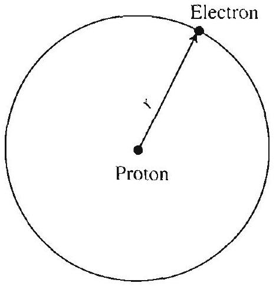
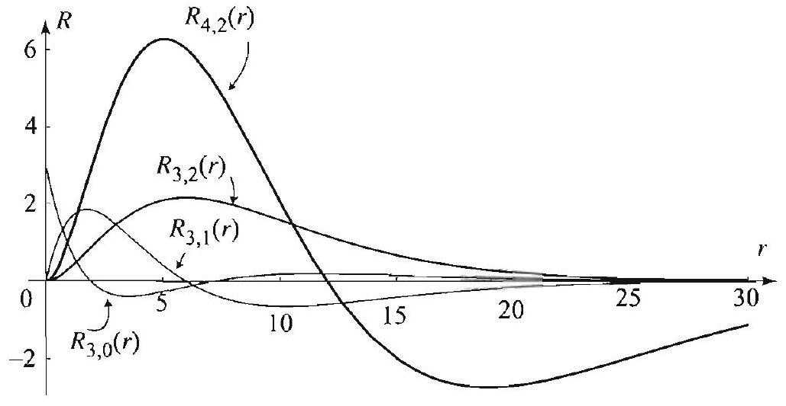

### 15.2 The Hydrogen Atom

In the preceding section we discussed some general principles of quantum mechanics. We presented the Schrödinger equation as an axiom that explains facts about particles on the atomic level. Even though in general the equation is impossible to solve in closed form, in this section we will present a complete solution in the simple but important case of the hydrogen atom. The solution also serves as a model for understanding more complicated structures.

Figure 1 The hydrogen atom.

Recall that an atom consists of a nucleus and a number of electrons. The nucleus consists of protons and neutrons. In the case of the hydrogen atom, we have one electron and a nucleus consisting of one proton. Since the proton is much heavier than the electron (about 1864 limes heavier), it moves only slightly. Hence we may think of the nucleus as fixed and focus our study on the motion of the electron (Figure 1).

## Time-Dependent Schrödinger Equation

In our model of the hydrogen atom, the electron moves in orbital motion around the proton with attractive force $-\epsilon^{2} / r^{2}$, where $r$ is the distance between the electron and the proton and $\epsilon$ is the charge of the proton. Since the force is the negative gradient of the potential, the attractive force of the proton has potential energy

$$
V=-\frac{\epsilon^{2}}{r} .
$$

Putting this in (4), Section 15.1, we obtain the time-dependent Schrödinger equation for the hydrogen atom

$$
i \hbar \frac{\partial \psi}{\partial t}=-\frac{\hbar^{2}}{2 \mu} \nabla^{2} \psi-\frac{\epsilon^{2}}{r} \psi,
$$

where $\mu$ is the mass of the electron. In solving this equation, it is convenient to use spherical coordinates, $(r, \theta, \phi)$, because of the simple expression of the potential $V$ in this coordinate system. As in the previous section, we will require the spatial part of $\psi$ be normalizable. That is, setting

$$
\psi=u(r, \theta, \phi) T(t)
$$

we require $u$ tend to zero at infinity and $|u|^{2}$ have a finite integral over the entire space. Separating variables in (1), we arrive at the equation

$$
T^{\prime}=-\frac{i}{\hbar} E T,
$$

and the time-independent Schrödinger equation for $u$ :

$$
-\frac{\hbar^{2}}{2 \mu} \nabla^{2} u-\frac{\epsilon^{2}}{r} u=E u
$$

(see (6) and (7), Section 15.1). We know from the previous section that the solutions of (2) are

$$
T(t)=A e^{-i E t / \hbar},
$$

where $A$ is a constant. The hard work is in solving (3) and determining the separation constant $E$. The solution will involve spherical harmonics (Chapter 5) and Laguerre polynomials (Section 15.4).

## Spherical Harmonics and the Schrödinger Equation

Tsing the spherical form of the Laplacian, (8), Section 4.1, (3) becomes
(5) $\frac{\hbar^{2}}{2 \mu}\left[\frac{\partial^{2} u}{\partial r^{2}}+\frac{2}{r} \frac{\partial u}{\partial r}+\frac{1}{r^{2}}\left(\frac{\partial^{2} u}{\partial \theta^{2}}+\cot \theta \frac{\partial u}{\partial \theta}+\csc ^{2} \theta \frac{\partial^{2} u}{\partial \phi^{2}}\right)\right]-\frac{\epsilon^{2}}{r} u=E u$.

Using separation of variables to solve this equation, we set

$$
u(r, \theta, \phi)=R(r) Y(\theta, \phi)
$$

and plug into (5). Separating the $R$ part from the $Y$ part, we get

$$
\frac{\partial^{2} Y}{\partial \theta^{2}}+\cot \theta \frac{\partial Y}{\partial \theta}+\csc ^{2} \theta \frac{\partial^{2} Y}{\partial \phi^{2}}+\eta Y=0
$$

and

$$
-\frac{\hbar^{2}}{2 \mu}\left[R^{\prime \prime}+\frac{2}{r} R^{\prime}-\frac{\eta}{r^{2}} R\right]-\frac{\epsilon^{2}}{r} R=E R
$$

where $\eta$ is a separation constant. From Theorem 4, Section 5.3, we recognize equation (6) as the differential equation for the spherical harmonics. It has nontrivial solutions when the separation constant is given by

$$
\eta=\eta_{n}=n(n+1), \quad n=0,1,2, \ldots
$$

For each $\eta_{n}=n(n+1)$, we have $2 n+1$ solutions, the spherical harmonics,

$$
Y_{n, m}(\theta, \phi), \quad m=-n,-n+1, \ldots, n-1, n
$$

Putting $\eta_{n}=n(n+1)$ in (7), we arrive at the radial equation

$$
-\frac{\hbar^{2}}{2 \mu}\left[R^{\prime \prime}+\frac{2}{r} R^{\prime}-\frac{n(n+1)}{r^{2}} R\right]-\frac{\epsilon^{2}}{r} R=E R .
$$

In determining the separation constant $E$, we use a fact from quantum physics that states that bounded solutions (corresponding to an electron and a proton bound together) occur only at negative energy levels. Hence we take $E<0$ in (10). We now show by two substitutions that (10) is
related to Laguerre's differential equation (Section 15.4). We first make the substitution

$$
s=\alpha r, \quad w(s)=R(s / \alpha), \quad \text { where } \alpha=\sqrt{-\frac{8 \mu E}{\hbar^{2}}} .
$$

This transforms (10) into

$$
\frac{d^{2} w}{d s^{2}}+\frac{2}{s} \frac{d w}{d s}-\frac{n(n+1)}{s^{2}} w-\frac{1}{4} w+\frac{\nu}{s} w=0,
$$

where

$$
\nu=\frac{2 \mu \epsilon^{2}}{\alpha \hbar^{2}}=\frac{\epsilon^{2}}{\hbar} \sqrt{\frac{\mu}{-2 E}}
$$

We then make the substitution

$$
w(s)=s^{n},-s / 2 y(s)
$$

and transform (12) into

$$
s \frac{d^{2} y}{d s^{2}}+[2(n+1)-s] \frac{d y}{d s}+(\nu-n-1) y=0
$$

The details of both substitutions are straightforward and are left as exercises. Equation (15) is the generalized Laguerre differential equation ((13), Section 15.4) with $\alpha=2 n+1$ and $n$ replaced by $\nu-n-1$. When $\nu-n-1$ is a nonnegative integer, that is, when $\nu$ is a positive integer such that

$$
\nu \geq n+1
$$

we know from Section 15.4 that (15) has a polynomial solution of degree $\nu-n-1$ denoted by

$$
y(s)=L_{v-n-1}^{2 n+1}(s)
$$

and called the generalized Laguerre polynomial of degree $\nu-\|-1$ and order $2 n+1$ (see Section 15.4, (13), (14)). From here on we take $\nu$ as in (16), since for all other values of $\nu$ it can be shown that the corresponding product solution $\psi=R Y T$ is not square integrable, and hence not normalizable. Substituting back with the help of (14) and (11), we obtain

$$
w(s)=w_{\nu n}(s)=s^{n} e^{-s / 2} L_{\nu-n-1}^{2 n+1}(s)
$$

and hence the solution of (10):

$$
R_{\nu n}(r)=e^{-(\alpha r) / 2}(\alpha r)^{n} L_{\nu-n-1}^{2 n+1}(\alpha r)
$$

Figure 2 Radial wave function of the hydrogen atom in stationary state. The distance $r$ is measured in Bohr radii $(a=1 \mathrm{in}(21))$.
where

$$
\alpha=\frac{2 \mu \epsilon^{2}}{\nu \hbar^{2}} .
$$

The function $R_{\nu n}$ is called the radial wave function (or simply, radial function) of the hydrogen atom in a stationary state. It is customary to introduce a scale where distance is measured in multiples of one Bohr radius (units in meters)

$$
a=\frac{\hbar^{2}}{\mu \epsilon^{2}}=0.529 \times 10^{-10} \mathrm{~m}
$$

In this scale, the radial function becomes

$$
R_{\nu n!}(r)=c^{-\frac{r}{\nu a}}\left(\frac{2}{\nu a} r\right)^{n} L_{\nu-n-1}^{2 n+1}\left(\frac{2}{\nu a} r\right) .
$$

See Figure 2 for graphs of the radial wave function.)

We are now ready to collect results and draw some important conclusions.

THEOREM 1 ENERGY LEVELS AND BOUND STATES OF THE HYDROGEN ATOM
(i) The bound states of the hydrogen atom have negative energies

$$
E_{\nu}=-\frac{\epsilon^{4} \mu}{2 \hbar^{2}} \frac{1}{\nu^{2}}, \quad \nu=1,2,3, \ldots
$$

(ii) To each energy level $E_{\nu}$ correspond $\nu^{2}$ bound states with

$$
u_{\nu n m}(r, \theta, \phi)=R_{\nu n}(r) Y_{n, m}(\theta, \phi), \quad|m| \leq n<\nu
$$

where the radial function $R_{\nu m}(r)$ is as in (21) and $Y_{n, m}(\theta, \phi)$ is the spherical harmonics.

## THEOREM 2 TIME-DEPENDENT WAVE FUNCTION AND PROBABILITY DISTRIBUTION

Proof To prove (i) solve for $E$ in (13). To prove (ii) use the product solutions of (5). Since for each $n$ we have $2 n+1$ eigenfunctions for (6), and $n$ can run from 0 to $\nu-1$, we have altogether a total of

$$
\sum_{n=0}^{\nu-1}(2 n+1)=\nu^{2}
$$

bound states.
The fact that the energy levels in a hydrogen atom form a discrete set was proved by Niels Bohr in 1913, before the discovery of Schrödinger's equation. Indeed it served as strong support for a quantum mechanics theory based on the Schrödinger equation.

The Bohr model was confirmed experimentally by observing a discrete set of light frequencies that the hydrogen atom emits after being excited. The lowest level of energy, corresponding to $\nu=1$, is called the ground energy and corresponds to an atom in the ground state. However, the electron can exist in a number of states with energy levels $E_{\nu}, \nu \geq 2$. We have

$$
E_{\nu}=\frac{E_{1}}{\nu^{2}}, \quad \nu=1,2,3, \ldots
$$

The ground energy $E_{1}$ is approximately -13.6 eV . This energy is also known as the binding energy, since it is required for the electron to be bound to the proton.
(i) The time-dependent wave function of the electron in a hydrogen atom in a state at energy level $E_{\nu}$ is

$$
\psi_{\nu m m}(r, \theta, \phi, t)=A_{m m} e^{-i E_{\nu} t / h} R_{m n}(r) Y_{n, m}(\theta, \phi)
$$

where

$$
A_{\nu n}=\sqrt{\left(\frac{2}{a \nu}\right)^{3} \frac{(\nu-n-1)!}{2 \nu(\nu+n)!}}, \quad|m| \leq n<\nu, \nu=1,2, \ldots .
$$

(ii) The probability density for the electron's position in a state at energy level $E_{\nu}$ is given by

$$
\rho_{\nu m m}(r, \theta, \phi)=A_{\nu n}^{2} R_{\nu n}^{2}(r)\left|Y_{n, m}(\theta, \phi)\right|^{2}
$$

Proof We get (23) by simply including in (22) the time component (4). This determines the wave function up to a constant $A_{\nu n}$. To determine $A_{\nu n}$, we use the fact that $\left|t_{\nu n m}\right|^{2}$ is a probability density, and hence its integral over the entire
three-dimensional space is 1 . We have

$$
\begin{aligned}
\left|\psi_{\nu n m}\right|^{2} & =\left|A_{\nu n}\right|^{2}\left|e^{-i E_{\nu} t / h}\right|^{2}\left|R_{\nu n}(r)\right|^{2}\left|Y_{n, m}(\theta, \phi)\right|^{2} \\
& =\left|A_{\nu n}\right|^{2}\left|R_{\nu n}(r)\right|^{2}\left|Y_{n, m}(\theta, \phi)\right|^{2},
\end{aligned}
$$

since $\left|e^{-i E_{\nu}, t / h}\right|=1$ for all $t$. We now set $\int_{-\infty}^{\infty} \int_{-\infty}^{\infty} \int_{-\infty}^{\infty}\left|\psi_{n \nu m}\right|^{2} d x d y d z=1$ and evaluate the integral to determine $A_{\nu n}$. In spherical coordinates, we have $d x d y d z=r^{2} \sin \theta d r d \theta d \phi$. So,

$$
\int_{0}^{2 \pi} \int_{0}^{\pi} \int_{0}^{\infty}\left|A_{\nu n}\right|^{2}\left|R_{\nu n}(r)\right|^{2}\left|Y_{n, m}(\theta, \phi)\right|^{2} \sin \theta r^{2} d r d \theta d \phi=1
$$

By (6), Section 5.3, the integrals in $\theta$ and $\phi$ evaluate to 1 . By calling on (21) and then making the change of variables $u=\frac{2}{\nu a} r$, we get

$$
\left|A_{\nu n}\right|^{-2}=\left(\frac{a \nu}{2}\right)^{3} \int_{0}^{\infty} e^{-u} u^{2 n+2}\left[L_{\nu-n-1}^{2 n+1}(u)\right]^{2} d u
$$

To complete the proof of (24), we will establish the following identity:

$$
\int_{0}^{\infty} e^{-x} x^{\alpha+1}\left[L_{N}^{\alpha}(x)\right]^{2} d x=\frac{\Gamma(N+\alpha+1)}{N!}(2 N+\alpha+1)
$$

By taking $N=\nu-n-1$ and $\alpha=2 n+1$ in (27) and plugging into (26), we obtain

$$
\left|A_{\nu n}\right|^{-2}=\left(\frac{a \nu}{2}\right)^{3} \frac{\Gamma(\nu+n+1)}{(\nu-n-1)!} 2 \nu=\left(\frac{a \nu}{2}\right)^{3} \frac{(\nu+n)!}{(\nu-n-1)!} 2 \nu,
$$

which completes the proof. Thus it remains to prove (27). We will show in the final section of this chapter that the Laguerre polynomials satisfy the recurrence relation

$$
(N+1) L_{N+1}^{\alpha}(x)-(2 N+\alpha+1-x) L_{N}^{\alpha}(x)+(N+\alpha) L_{N-1}^{\alpha}(x)=0
$$

((20), Section 15.4). Multiply this equation through by $x^{\alpha} L_{N}^{\alpha}(x) e^{-x}$ and integrate from $x=0$ to $\infty$. The desired identity follows now by using Theorem 5, Section 15.4 , and simplifying.

The fact that the square of the absolute value of a spherical harmonics integrates to 1 over the sphere ((6), Section 5.3) can be used to simplify the probability of finding the electron in a spherical region centered at the proton, in the hydrogen atom at energy level $E_{\nu}$. Indeed, let $p_{s}$ denote the probability of finding the electron within $s$ Bohr radii from the proton. Then from (25)

$$
\begin{aligned}
p_{s} & =\int_{0}^{s a} \int_{0}^{2 \pi} \int_{0}^{\pi} A_{\nu n}^{2} R_{\nu n}^{2}(r)\left|Y_{n, m}(\theta, \phi)\right|^{2} r^{2} \sin \theta d \theta d \phi d r \\
& =\int_{0}^{s n} A_{\nu n}^{2} R_{\nu n}^{2}(r) r^{2} d r
\end{aligned}
$$

Thus for spherical regions, the probability for the electron's position depends only on the radial function. For certain values of $n$, this probability can
be computed in closed form in terms of the incomplete gamma function (see Exercise 7).

EXAMPLE 1 Ground state (state of lowest energy)
(a) Derive the wave function for the atom in its ground state.
(b) Derive the probability density for the electrons position and check that it integrates to 1 over the whole three-dimensional space.
(c) What is the probability of finding the electron within two Bohr radii from the proton?
(d) Approximate the value of $s$ so that the electron is found within $s$ Bohr radii from the proton with $90 \%$ probability.

Solution (a) Take $\nu=1$ (hence $n=0, m=0$ ) in Theorem 2, use (21) and the list of spherical harmonics (Exercise 1. Section 5.3), and get

$$
\psi_{100}(r, \theta, \phi, t)=\frac{1}{\sqrt{\pi a^{3}}} e^{-i E_{1} t / \hbar} e^{-r / a}
$$

(b) The probability density for the electron's position is

$$
\rho_{100}(r, \theta, \phi)=\frac{1}{\pi a^{3}} e^{-2 r / a}
$$

For the integral over the whole space. we have

$$
\begin{aligned}
& \int_{0}^{\infty} \int_{0}^{2 \pi} \int_{0}^{\pi} \rho_{1 \mathrm{vo}}(r, \theta, \phi) r^{2} \sin \theta d \theta d \phi d r \\
& \quad=\frac{1}{\pi a^{3}} \int_{0}^{\infty} \int_{0}^{2 \pi} \int_{0}^{\pi} e^{-2 r / a} r^{2} \sin \theta d \theta d \phi d r \\
& \quad=\frac{4}{a^{3}} \int_{0}^{\infty} e^{-2 r / a} r^{2} d r=1
\end{aligned}
$$

as can be verified with the help of a computer or by doing two integrations by parts. (c) The probability of finding the electron within two Bohr radii from the electron

Figure 3 Graph of $p_{s}$.

$$
\int_{0}^{2 a} \int_{0}^{2 \pi} \int_{0}^{\pi} \rho_{100}(r, \theta, \phi) r^{2} \sin \theta d \theta d \phi d r=\frac{4}{a^{3}} \int_{0}^{2 a} e^{-2 r / a} r^{2} d r=1-\frac{13}{e^{4}} \approx 0.76
$$

(d) Proceeding as in (c), we find that the probability of finding the electron within $s$ Bohr radii from the proton is

$$
p_{s}=\frac{4}{a^{3}} \int_{0}^{s a} e^{-2 r / a} r^{2} d r=e^{-2 s}\left(e^{2 s}-1-2 s-2 s^{2}\right)
$$

The graph of $p_{s}$, as a function of $s$, is shown in Figure 3. As expected, the graph tends to 1 as $s \rightarrow \infty$. It reaches .9 between 2 and 3 . With the help of a computer, we find that $p_{s}=.9$ when $s \approx 2.7$.

## Exercises 11.2

1. Derive (6) and (7) from (5).
2. Derive (12) from (10), and (15) from (12).
3. Derive the following list of generalized Laguerre polynomials using (16), Section 15.4.

$$
\begin{array}{lll}
L_{0}(x)=1 & L_{1}(x)=1-x & L_{2}(x)=\frac{1}{2}\left(2-4 x+x^{2}\right) \\
& & L_{3}(x)=\frac{1}{6}\left(6-18 x+9 x^{2}-x^{3}\right) \\
L_{0}^{1}(x)=1 & L_{1}^{1}(x)=2-x & L_{2}^{1}(x)=\frac{1}{2}\left(6-6 x+x^{2}\right) \\
& & L_{3}^{1}(x)=\frac{1}{6}\left(24-36 x+12 x^{2}-x^{3}\right) \\
L_{0}^{2}(x)=1 & L_{1}^{2}(x)=3-x & L_{2}^{2}(x)=\frac{1}{2}\left(12-8 x+x^{2}\right) \\
& & L_{3}^{2}(x)=\frac{1}{6}\left(60-60 x+15 x^{2}-x^{3}\right) \\
L_{0}^{3}(x)=1 & L_{1}^{3}(x)=4-x & L_{2}^{3}(x)=\frac{1}{2}\left(20-10 x+x^{2}\right) \\
& & L_{3}^{3}(x)=\frac{1}{6}\left(120-90 x+18 x^{2}-x^{3}\right)
\end{array}
$$

4. Derive the list of radial functions for $\nu=1,2, \ldots, 5$.
5. Find the time-dependent wave functions of all four states at energy level $E_{2}$.
6. Find the time-dependent wave functions of all the states at energy level $E_{3}$.
7. (a) Show that the probability density for the electron's position at energy level $E_{\nu}$ in the state corresponding to $n=\nu-1$ is

$$
\rho_{\nu n m}=\left(\frac{2}{a \nu}\right)^{3} \frac{1}{2 \nu} e^{-\frac{2 r}{\nu a}}\left(\frac{2 r}{\nu a}\right)^{2 n}\left|Y_{n, m}\right|^{2} .
$$

(b) For $a>0, x>0$, recall from Section 7.9 the incomplete gamma function

$$
\Gamma(a, x)=\int_{x}^{\infty} e^{-t} t^{a-1} d t
$$

Show that the probability of finding the electron within $s$ Bohr radii from the proton is

$$
p_{\nu s}=1-\frac{1}{(2 \nu)!(2 \nu-1)!} \Gamma\left(1+2 \nu, \frac{2 s}{\nu}\right)
$$

(c) Take $\nu=1,2$, and plot $p_{\nu s}$ for $s>0$. What do you notice about the graphs? Explain.
(d) Take $s=1$ and plot $p_{\nu s}$ for $\nu>1$. What can you say about the probability of finding the electron within one Bohr radius for higher energy levels?
8. Repeat (a)-(d) of Example 1 with $\nu=2, n=1, m=1$.
