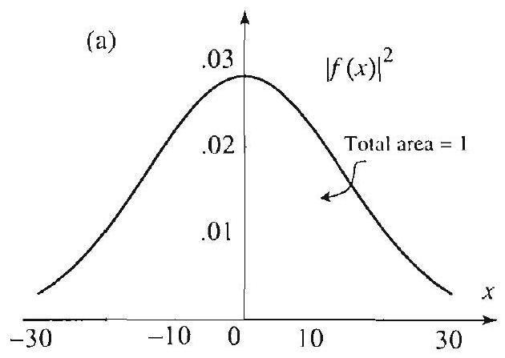
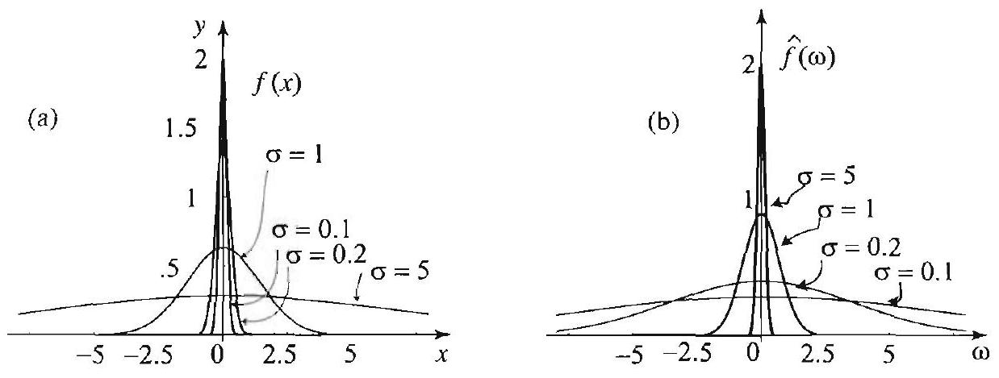

### 15.3 Heisenberg's Uncertainty Principle

In this section, we will prove a famous result in quantum mechanics that asserts that one cannot at the same time be certain of the position and of the velocity of an electron (or any particle). That is, increasing the knowledge of the position decreases the knowledge of the velocity or momentum of the electron. This mysterious fact about electrons is known as the Heisenberg uncertainty principle. It is proved with the help of the Fourier transform. As a matter of fact, it is simply a restatement of a property of the Fourier transform.

## Plancherel's and Parseval's Theorems

Recall that a function $f$ defined on the real line is square integrable if $\int_{-\infty}^{\infty}|f(t)|^{2} d t<\infty$. Since we will allow complex-valued functions, whenever we write $|f|$ we mean $\sqrt{f \bar{f}}$. The Fourier transform of $f$ will be written $\hat{f}$.

THEOREM 1 (PARSEVAL'S THEOREM)

Suppose that $f$ and $g$ are square integrable functions on the real line. Then

$$
\int_{-\infty}^{\infty} f(t) \overline{g(t)} d t=\int_{-\infty}^{\infty} \hat{f}(\omega) \overline{\hat{g}(\omega)} d \omega
$$

By taking $f=g$ in Parseval's theorem, we obtain Plancherel's theorem.

THEOREM 2 (PLANCHEREL'S THEOREM)

Suppose that $f$ is a square integrable function on the real line. Then

$$
\int_{-\infty}^{\infty}|f(t)|^{2} d t=\int_{-\infty}^{\infty}|\hat{f}(\omega)|^{2} d \omega
$$

Proof of Parseval's theorem. Use the inverse Fourier transform (Section 7.2, (2)) to write $g(t)=\frac{1}{\sqrt{2 \pi}} \int_{-\infty}^{\infty} e^{i \omega t} \hat{g}(\omega) d \omega$, and recall that $\overline{e^{i \omega t}}=e^{-i \omega t}$. Now, assuming that we can interchange the order of integration, we have

$$
\begin{aligned}
\int^{\infty} f(t) \overline{g(t)} d t & =\int_{-\infty}^{\infty} f(t) \frac{1}{\sqrt{2 \pi}} \int_{-\infty}^{\infty} e^{-i \omega t} \overline{\hat{g}(\omega)} d \omega d t \\
& =\int_{-\infty}^{\infty} \overline{\hat{g}(\omega)} \overbrace{\frac{1}{\sqrt{2 \pi}} \int_{-\infty}^{\infty} e^{-i \omega t} f(t) d t}^{=\hat{f}(\omega)} d \omega \\
& =\int_{-\infty}^{\infty} \hat{f}(\omega) \overline{\hat{g}(\omega)} d \omega
\end{aligned}
$$

which proves the theorem.

Before turning to the main applications of this section, we illustrate
a technique for computing some important integrals based on Plancherel's theorem.

## EXAMPLE 1 Evaluating integrals with Plancherel's theorem

The fact that the Fourier transform of $f(x)=\frac{\sin a x}{x}$ is

$$
\hat{f}(\omega)= \begin{cases}\sqrt{\frac{\pi}{2}} & \text { if }-a<\omega<a, \\ 0 & \text { if }|\omega|>a,\end{cases}
$$

yields, by Plancherel's theorem,

$$
\int_{-\infty}^{\infty}\left(\frac{\sin a x}{x}\right)^{2} d x=\int_{-a}^{a}\left(\sqrt{\frac{\pi}{2}}\right)^{2} d \omega=2 a \frac{\pi}{2}=a \pi
$$

In particular, when $a=1$ we get

$$
\int_{-\infty}^{\infty}\left(\frac{\sin x}{x}\right)^{2} d x=\pi
$$

## Heisenberg's Uncertainty Principle

Let us start by exploring the connection between the Fourier transform and quantum mechanics. Consider an electron moving along the $x$-axis. As we know from Section 15.1, to this electron is attached a wave function $f(x)$ that can be used to generate the probability density function for the position of the electron, $\rho(x)$, via the formula

$$
\rho(x)=|f(x)|^{2} .
$$

It is a fact from quantum mechanics that the probability density for the momentum of the electron is also related to the wave function $f$ in a very intrinsic way. To present this relation, let

$$
g(p)=\frac{1}{\sqrt{\hbar}} \hat{f}\left(\frac{p}{\hbar}\right), \quad-\infty<p<\infty,
$$

where $\hbar$ is Planck's constant. Hence $g(p)$ is a scaled Fourier transform of $f$. Using Plancherel's theorem, you can show that $|g(p)|^{2}$ is a probability density (Exercise 16). That is,

$$
\int_{-\infty}^{\infty}|g(p)|^{2} d p=1
$$

The function $|g(p)|^{2}$ is the probability density for the momentum of the clectron. Thus

$$
\text { Probability that the momentum is in }[c, d]=\int_{c}^{d}|g(p)|^{2} d p \text {. }
$$

We now introduce the notion of uncertainty of a nontrivial function $f$ about a point $a$ as

$$
\Delta_{a} f=\int_{-\infty}^{\infty}(x-a)^{2}|f(x)|^{2} d x / \int_{-\infty}^{\infty}|f(x)|^{2} d x
$$

Figure 1 A probability density with low uncertainty. The graph of $|f(x)|^{2}$ in (a) is localized near 0 . Consequently, the function $x^{2}|f(x)|^{2}$ in (b) (shown not to scale) is almost identically 0 and encloses a very small area under its graph and above the $x$-axis.

To understand this definition, suppose for a moment that $|f(x)|^{2}$ is a probability density of an electron so that, on the right side of (4), the integral in the denominator is 1 . Suppose that there is a very good chance of finding the electron near a point $a$. In this case, the probability density $|f(x)|^{2}$ is concentrated near $a$ and is very small away from $a$. Consequently, $(x-a)^{2}|f(x)|^{2}$ is small for all $x$ and so $\Delta_{a} f$ is small in this case. Thus, the more we know about the position of the electron (i.e., the larger the probability of finding the clectron near $a$ ), the less is the degree of uncertainty $\Delta_{a} f$. (This case is illustrated in Figure 1 with $a=0$.) On the other hand, if $|f(x)|^{2}$ is large away from $a$ (which would correspond to a small chance of finding the electron near $a$ ), a similar argument shows that the uncertainty $\Delta_{a} f$ is large in this case. (See Figure 2 for an illustration with $a=0$.)

The exact quantitative estimate of the Heisenberg uncertainty principle states that, for any $a$ (on the $x$-axis) and for any $\alpha$ (on the $p$-axis),

$$
\Delta_{a} f \Delta_{\alpha} g \geq \frac{\hbar^{2}}{4}
$$

Thus, decreasing the uncertainty $\Delta_{a} f$ toward 0 about some point $a$ causes an increase in the uncertainty $\Delta_{\alpha} g$ in the momentum about all values $\alpha$, and vice versa. Thus, an electron whose position is highly localized must necessarily have a very nonlocalized momentum density.

Figure 2 A probability density with high uncertainty. The graph in (a) is spread over the line.

THEOREM 3 HEISENBERG'S INEQUALITY

We will prove a scaled version of (5). Then (5) will follow from a change of variables outlined in Exercise 13. We need the following inequality for square integrable functions, known as the Cauchy-Schwarz inequality:

$$
\left|\int_{-\infty}^{\infty} f(r) \overline{g(x)} d x\right|^{2} \leq \int_{-\infty}^{\infty}|f(x)|^{2} d x \int_{-\infty}^{\infty}|g(x)|^{2} d x
$$

The proof is outlined in Exercise 15.

Suppose that $f(x)$ is a square integrable function on the real line that is not identically 0. Then
(6)

$$
\Delta_{a} f \Delta_{\alpha} \hat{f} \geq \frac{1}{4}
$$

for all $a$ on the $x$-axis and all $\alpha$ on the $\omega$-axis.
Proof To simplify the proof, we will assume that $\lim _{x \rightarrow \pm \infty} x|f(x)|^{2}=0$. We start with the case $a=\alpha=0$. Integrating by parts, and remembering that $\overline{f(x)} f(x)=|f(x)|^{2}$, we get

$$
\int_{-\infty}^{\infty} x \overline{f(x)} f^{\prime}(x) d x=\left.x|f(x)|^{2}\right|_{-\infty} ^{\infty}-\int_{-\infty}^{\infty}\left(|f(x)|^{2}+x f(x) \overline{f^{\prime}(x)}\right) d x
$$

Hence

$$
\int_{-\infty}^{\infty}|f(x)|^{2} d x=-\int_{-\infty}^{\infty}\left(x \overline{f(x)} f^{\prime}(x)+x f(x) \overline{f^{\prime}(x)}\right) d x
$$

The last integrand is of the form $z+\bar{z}$, where $z=x \overline{f(x)} f^{\prime}(x)$. Using the fact that $z+\bar{z}=2 \operatorname{Re}(z)$ (here $\operatorname{Re}(z)$ denotes the real part of $z$ ), and the Cauchy-Schwarz inequality, we get

$$
\int_{-\infty}^{\infty} \mid f(x)^{2} d x=-2 \int_{-\infty}^{\infty} \operatorname{Re}\left(x \overline{f(x)} f^{\prime}(x)\right) d x
$$

and so

$$
\begin{aligned}
\left(\int_{-\infty}^{\infty}|f(x)|^{2} d x\right)^{2} & \leq 4\left(\int_{-\infty}^{\infty}\left|x \overline{f(x)} f^{\prime}(x)\right| d x\right)^{2} \\
& \leq 4\left(\int_{-\infty}^{\infty} x^{2}|f(x)|^{2} d x\right)\left(\int_{-\infty}^{\infty}\left|f^{\prime}(x)\right|^{2} d x\right) \\
& =4 \Delta_{0} f \int_{-\infty}^{\infty}|f(x)|^{2} d x \int_{-\infty}^{\infty}\left|f^{\prime}(x)\right|^{2} d x
\end{aligned}
$$

where the last equality follows from

$$
\int_{-\infty}^{\backslash} x^{2}|f(x)|^{2} d x=\Delta_{0} f \int_{-\infty}^{1}|f(x)|^{2} d x
$$

Plancherel's theorem and Theorem 2 of Section 7.2 yield

$$
\begin{aligned}
\int_{-\infty}^{\infty}\left|f^{\prime}(x)\right|^{2} d x & =\int_{-\infty}^{\infty}\left|\mathcal{F}\left(f^{\prime}\right)(\omega)\right|^{2} d \omega \\
& =\int_{-\infty}^{\infty} \omega^{2}|\widehat{f}(\omega)|^{2} d \omega \\
& =\Delta_{0} \widehat{f} \int_{-\infty}^{\infty}|\widehat{f}(\omega)|^{2} d \omega \\
& =\Delta_{0} \hat{f} \int_{-\infty}^{\infty}|f(x)|^{2} d x
\end{aligned}
$$

Combining this with the previous inequalities, we get

$$
\left(\int_{-\infty}^{\infty}|f(x)|^{2} d x\right)^{2} \leq 4 \Delta_{0} f \Delta_{0} \hat{f}\left(\int_{-\infty}^{\infty}|f(x)|^{2} d x\right)^{2}
$$

Dividing both sides by $\left(\int_{-\infty}^{\infty}|f(x)|^{2} d x\right)^{2} \neq 0$, we get

$$
1 \leq 4 \Delta_{0} f \Delta_{0} \widehat{f}
$$

which is what we want to prove. The general case follows from (7) by translation (Exercise 14).

EXAMPLE 2 Heisenberg's inequality for a Gaussian Illustrate Theorem 3 with $a=\alpha=0$, and

$$
f(x)=\frac{1}{\left(2 \pi \sigma^{2}\right)^{1 / 4}} e^{-x^{2} / 4 \sigma^{2}}, \quad \sigma>0 .
$$

Solution Using Theorem 5 of Section 7.2, we have

$$
\widehat{f}(\omega)=\left(\frac{2 \sigma^{2}}{\pi}\right)^{1 / 4} e^{-\sigma^{2} \omega^{2}}
$$

Also, from (4), Section 7.2, $\int_{-\infty}^{\infty} e^{-x^{2}} d x=\sqrt{\pi}$. Using this identity and a change of variables, we get

$$
\int_{-\infty}^{\infty}|f(x)|^{2} d x=\frac{1}{\left(2 \pi \sigma^{2}\right)^{1 / 2}} \int_{-\infty}^{\infty} e^{-x^{2} / 2 \sigma^{2}} d x=1
$$

Now, appealing to Plancherel's theorem, we infer that

$$
\int_{-\infty}^{\infty}|\hat{f}(\omega)|^{2} d \omega=\int_{-\infty}^{\infty}|f(x)|^{2} d x=1
$$

We have from (4)

$$
\Delta_{0} f=\int_{-\infty}^{\infty} x^{2}|f(x)|^{2} d x=\frac{1}{\left(2 \pi \sigma^{2}\right)^{1 / 2}} \int_{-\infty}^{\infty} x^{2} e^{-x^{2} / 2 \sigma^{2}} d x=\sigma^{2}
$$

and

$$
\Delta_{0} \widehat{f}=\int_{-\infty}^{\infty} \omega^{2}|\widehat{f}(\omega)|^{2} d \omega=\left(\frac{2 \sigma^{2}}{\pi}\right)^{1 / 2} \int_{-\infty}^{\infty} \omega^{2} e^{-2 \sigma^{2} \omega^{2}} d \omega=\frac{1}{4 \sigma^{2}}
$$

where we have used the result of Exercise 10 to evaluate the integrals. Thus $\Delta_{0} f \Delta_{0} \widehat{f}=\frac{1}{4}$. $\square$

Figure 3 The more localized the graph of $f(x)$, the more spread out the graph of $\widehat{f}(\omega)$, and vice-versa.

Example 2 shows that the lower bound in Heisenberg's inequality is attained for any Gaussian. The functions that were used in this example give a concrete illustration of Heisenberg's inequality. In Figures 3(a) and (b) we have plotted $f$ and $\widehat{f}$ for various choices of $\sigma$. Note that as $\sigma$ decreases to 0 , the graphs of $f$ become more and more localized about 0 , while the graphs of $\widehat{f}$ spread farther and farther out. The opposite happens as we increase $\sigma$. This gives graphical evidence for the fact that we cannot localize both a function and its Fourier transform, which is basically what Heisenberg's inequality asserts.

Because Heisenberg's inequality is really a statement about waves in general, it also appears in various branches of science other than quantum mechanics. For applications in signal processing and electrical engineering, see The Fourier Integral and Its Applications, by Athanasious Papoulis, McGraw-Hill, 1962.

## Exercises 11.3

In Exercises 1-4, use Plancherel's theorem or Parseval's theorem and known Fourier transforms to compute the given integral.

1. $\int_{-\infty}^{\infty} \frac{1}{\left(1+x^{2}\right)^{2}} d x$.
2. $\int_{-\infty}^{\infty}\left(\frac{\sin x}{x}\right)^{4} d x$.
3. $\sqrt{\frac{2}{\pi}} \int_{-\infty}^{\infty}\left(\frac{\sin x}{x}\right)^{2} \frac{1}{\left(1+x^{2}\right)} d x$.
4. $\sqrt{\frac{2}{\pi}} \int_{-\infty}^{\infty} \frac{\sin x}{x\left(1+x^{2}\right)} d x$.

In Excrcises 5-8. verify Heisenberg's inequality for the given function. Take $a= \alpha=0$.
5. $f(x)=e^{-2 x^{2}}$.
6. $f(x)=\frac{\sin x}{x}$.
7. $f(x)=\frac{1}{1+x^{2}}$. [Hint: Exercise 1.]
8. $f(x)=e^{-x^{2}}$.
9. (a) The integrals $I_{n}=\int_{0}^{\infty} x^{n} e^{-x^{2}} d x, n=0,1,2, \ldots$, arise frequently in applications. In probability theory they are called the moments of the Gaussian. To compute them, let $t=x^{2}$, and show that $I_{n}=\frac{1}{2} \Gamma\left(\frac{n+1}{2}\right)$, where the gamma function is defined in Section 4.7.
(b) More generally, if $a>0$, use (a) and a change of variables to show that

$$
\int_{0}^{\infty} x^{n} e^{-a x^{2}} d x=\frac{\Gamma\left(\frac{n+1}{2}\right)}{2 a^{(n+1) / 2}}
$$

10. Let $a>0$. Conclude from Exercise 9 that

$$
\int_{-\infty}^{\infty} x^{n} e^{-a x^{2}} d x= \begin{cases}\frac{\Gamma\left(\frac{n+1}{2}\right)}{a^{(n+1) / 2}} & \text { if } n \text { is even } \\ 0 & \text { if } n \text { is odd }\end{cases}
$$

11. Use the result of Exercise 10 and what you know about the gamma function to evaluate the following integrals.
(a) $\quad \int_{-\infty}^{\infty} x^{2} e^{-x^{2}} d x=\frac{\sqrt{\pi}}{2}$.
(b) $\quad \int_{-\infty}^{\infty} x^{4} e^{-x^{2}} d x=3 \frac{\sqrt{\pi}}{4}$.
12. Verify Heisenberg's inequality for the function $f(x)=x e^{-x^{2}}$. Take $a=\alpha=0$.
13. Prove (5) using Theorem 3. [Hint: Use (3) to show that $\Delta_{\alpha} g=\hbar^{2} \Delta_{\frac{\alpha}{h}} \widehat{f}$.]
14. Given two arbitrary numbers $a$ and $\alpha$, and given a square integrable function $f$. let $F(x)=e^{-i \alpha x} f(x+a)$.
(a) Show that $\int_{-\infty}^{\infty}|F(x)|^{2} d x=\int_{-\infty}^{\infty}|f(x)|^{2} d x$.
(b) Show that $\Delta_{0} F=\Delta_{a} f$, and $\Delta_{0} \widehat{F}=\Delta_{\alpha} \widehat{f}$. [Hint: $\widehat{F}(\omega)=e^{i a(\omega+\alpha)} \widehat{f}(\omega+\alpha)$.]
(c) Complete the proof of Theorem 3.
15. Proof of the Cauchy-Schwarz inequality. We will use the inner product notation $(f, g)=\int_{-\infty}^{\infty} f(x) \overline{g(x)} d x$ and $\|f\|=\sqrt{(f, f)}$. The inequality is equivalent to $|(f, g)| \leq\|f\|\|g\|$. (This inequality is true for any inner product.)
(a) Show that for all real $t$

$$
0 \leq\|f+t g\|^{2}=\|f\|^{2}+2 t \operatorname{Re}(f, g)+t^{2}\|g\|^{2}
$$

(. Vote that $(g, f)=\overline{(f, g)}$. and hence $(f, g)+(g, f)=2 \operatorname{Re}(f . g)$.)
(b) Assume that ( $f, g$ ) is real and $\|g\| \neq 0$. (If $\|g\|=0$, we get 0 on both sides of the inequality, and so there is nothing to prove in this case.) Take $t=-\frac{(f, g)}{\|g\|^{2}}$ and conclude from (a) that

$$
0 \leq\|f\|^{2}\|g\|^{2}-(f, g)^{2},
$$

which proves the desired inequality in this case.
(c) Prove the incquality in general. [Hint: Write $(f, g)=r e^{i \theta}$ for some $r$ and $\theta$, and consider the function $F(x)=e^{-i \theta} f(x)$.]
16. Let $g(p)$ be as in (3). Use (2) and Plancherel's theorem to establish that $|g(p)|^{2}$ is a probability density function.
