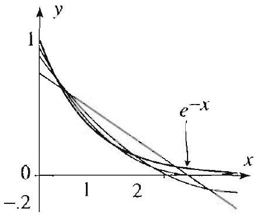

### 15.4 Hermite and Laguerre Polynomials

In this section we use Sturm Liouville theory to study two important families of polynomials: Hermite and Laguerre polynomials. These special functions, like so many others that we have encountered previously, arise as solutions of ordinary differential equations and have many interesting orthogonality properties and expansion theorems.

## Hermite's Equation and Hermite Polynomials

For $n=0,1,2 \ldots$. Hermite's differential equation of order $n$ is

$$
y^{\prime \prime}-2 x y^{\prime}+2 n y=0, \quad-\infty<x<\infty .
$$

This second order linear differential equation with noncoustant coefficients can be solved by the method of power series (Appendix A.5). We assume that the solution is of the form $y=\sum_{m=0}^{\infty} a_{m} x^{m}$. After plugging into (1) and simplifying, we arrive at the following two-step recurrence relation for the coefficients:

$$
a_{m+2}=\frac{2 m-2 n}{(m+2)(m+1)} a_{m,} \quad m=0,1,2, \ldots
$$

Thus $a_{0}$ determines $a_{2}, a_{4}, \ldots$, and $a_{1}$ determines $a_{3}, a_{5}, \ldots$. From (2) we have that $a_{n: 2}=0$, and so $a_{n+4}=a_{n+6}=\ldots=0$. Thus one solution is a polynomial of degree $n$. If we normalize the polynomial solution by setting

$$
a_{n}=2^{n},
$$

we obtain the Hermite polynomial, denoted by $H_{n}(x)$. Using (2) and (3), we can show that

$$
H_{n}(x)=n!\sum_{j=0}^{M} \frac{(-1)^{j}(2 x)^{n-2 j}}{j!(n-2 j)!},
$$

where $M=\frac{n}{2}$ if $n$ is even or $M=\frac{n-1}{2}$ if $n$ is odd. This explicit formula can be derived as we did for the Legendre polynomials in (9), Section 5.5. Using (4), we obtain

$$
H_{0}(x)=1, H_{1}(x)=2 x, H_{2}(x)=4 x^{2}-2, H_{3}(x)=8 x^{3}-12 x, \ldots .
$$

Figure 1 Hermite polynomials.

## Sturm-Liouville Theory and Orthogonality

It is clear that (1) cannot be put in the Sturm-Liouville form that is given by (1), Section 6.2. However, by multiplying (1) through by $e^{-r^{2}}$, we obtain the (equivalent) equation

$$
e^{-x^{2}} y^{\prime \prime}-2 x e^{-x^{2}} y^{\prime}+2 n e^{-x^{2}} y=0,
$$

which can be put in the Sturm-Liouville form

$$
\left(e^{-x^{2}} y^{\prime}\right)^{\prime}+2 n e^{-x^{2}} y=0 .
$$

Following the notation of (1), Section 6.2, we let $p(x)=e^{-x^{2}}, r(x)=e^{-x^{2}}$. Applying Theorem 2, Section 6.2, it follows that the Hermite polynomials are orthogonal on the interval $(-\infty, \infty)$ with respect to the weight function $e^{-x^{2}}$. More precisely, we have the following important result.
(i) For nonnegative integers $m$ and $n$ with $m \neq n$. . we have

$$
\int_{-\infty}^{\infty} H_{m}(x) H_{n}(x) e^{-x^{2}} d x=0 .
$$

(ii) For all $n=0,1,2, \ldots$, we have

$$
\int_{-\infty}^{\infty} H_{n}^{2}(x) e^{-x^{2}} d x=2^{n} n!\sqrt{\pi} .
$$

THEOREM 1 ORTHOGONALITY OF HERMITE POLYNOMIALS

THEOREM 2
HERMITE SERIES EXPANSIONS

Figure 2 Partial sums of the Hermite series with $k$ up to $n$.

The first assertion is a consequence of Sturm-Liouville theory, as we just indicated. A proof of (ii) is outlined in Exercise 10. These orthogonality relations can be used to expand functions in terms of Hermite polynomials (sec Theorem 3, Section 6.2).

If $f$ is piecewise smooth on $(-\infty, \infty)$, and

$$
\int_{-\infty}^{\infty}|f(x)|^{2} e^{-x^{2}} d x<\infty
$$

then we have the Hermite series expansion

$$
f(x)=\sum_{j=0}^{\infty} A_{j} H_{j}(x)
$$

where the Hermite coefficients $A_{j}$ are given by

$$
A_{j}=\frac{1}{2^{j} j!\sqrt{\pi}} \int_{-\infty}^{\infty} f(x) H_{j}(x) e^{-x^{2}} d x
$$

For any $x$, the Hermite series converges to $f(x)$ if $f$ is continuous at $x$ and to $[f(x+)+f(x-)] / 2$ otherwise.

The integrability condition that we impose on $f$ is expressed by saying that $f$ is square integrable with respect to the weight function $e^{-x^{2}}$. This condition guarantees the existence of the integral in (5) defining the coefficients. Examples of functions that are square integrable with respect to $e^{-x^{2}}$ are bounded functions; polynomial functions; exponential functions like $e^{a x+b}$. As we have done previously with other orthogonal series expansions, we can give a formal derivation of the Hermite coefficients (5) based on the orthogonality properties in Theorem 1 (see Exercise 11).

## EXAMPLE 1 A Hermite series expansion

The Hermite series

$$
\sin x=\sum_{k=0}^{\infty} \frac{(-1)^{k}}{e^{1 / 4} 2^{2 k+1}(2 k+1)!} H_{2 k+1}(x), \quad-\infty<x<\infty
$$

is derived in Exercise 14. The graphs in Figure 2 illustrate the convergence of this series, which is a fact guaranteed by Theorem 2 .

Laguerre's Equation and Laguerre Polynomials For $n=0,1, \ldots$, Laguerre's differential equation of order $n$ is

$$
x y^{\prime \prime}+(1-x) y^{\prime}+n y=0, \quad 0<x<\infty .
$$

We solve this second order linear differential equation using the Frobenius method (Appendix A.6). The point $x=0$ is a regular singular point. The indicial equation is $r(r-1)+r=0$ with one double indicial root $r=0$. As suggested by the Frobenius method (Case 2), we try $y=\sum_{m=0}^{\infty} a_{m} x^{m \prime}$ for a solution. After plugging into (7) and simplifying, we arrive at the following two-step recurrence relation for the coefficients:

$$
a_{m}=\frac{m-1-n}{m^{2}} a_{m-1}, \quad m=1,2, \ldots
$$

We have $a_{n+1}=a_{n+2}=\ldots=0$. Thus one solution is a polynomial of degree $n$. We normalize the polynomial solution by setting

$$
a_{n}=\frac{(-1)^{n}}{n!}
$$

and obtain the Laguerre polynomial of degree $n$ :

$$
L_{n}(x)=n!\sum_{j=0}^{n} \frac{(-1)^{j}}{(j!)^{2}(n-j)!} x^{j} .
$$

From this formula, we can derive the first few Laguerre polynomials (Figure 3):

$$
L_{0}(x)=1, \quad L_{1}(x)=1-x, \quad L_{2}(x)=\left(2-4 x+x^{2}\right) / 2, \ldots
$$

Figure 3 Laguerre polynomials.

THEOREM 3 ORTHOGONALITY OF LAGUERRE POLYNOMIALS

## Sturm-Liouville Theory and Orthogonality

Multiplying (7) through by $e^{-x}$, we obtain the (equivalent) equation

$$
x e^{-x} y^{\prime \prime}+(1-x) e^{-x} y^{\prime}+n e^{-x} y=0
$$

which can be put in the Sturm-Liouville form

$$
\left(x e^{-x} y^{\prime}\right)^{\prime}+n e^{-x} y=0
$$

Thus the Laguerre polynomials are the eigenfunctions of a singular SturmLiouville problem on the interval $(0, \infty)$. We thus have orthogonality relation and series expansion results, with respect to the weight $p(x)=e^{-x}$. The precise statement of these important results follows.
(i) For nonnegative integers $m$ and $n$ such that $m \neq n$, we have

$$
\int_{0}^{\infty} L_{m}(x) L_{n}(x) c^{-x} d x=0
$$

(ii) For all $n=0,1,2, \ldots$ we have

$$
\int_{0}^{\infty} L_{n}^{2}(x) e^{-x} d x=1
$$

Part (i) of Theorem 3 is an immediate consequence of the Sturm-Liouville theory (Theorem 2, Section 6.2). In Exercise 23, you are asked to give a direct proof of (i) and (ii) of Theorem 3 by using properties of the Laguerre polynomials; more specifically, by applying the result of Exercise 22.

THEOREM 4 LAGUERRE SERIES EXPANSIONS

Suppose that $f$ is piecewise smooth on $[0, \infty)$, and that $\int_{0}^{\infty}|f(x)|^{2} e^{-x} d x< \infty$. Then we have the Laguerre series expansion

$$
f(x)=\sum_{j=0}^{\infty} A_{j} L_{j}(x)
$$

where the Laguerre coefficients $A_{j}$ are given by

$$
A_{j}=\int_{0}^{\infty} f(x) L_{j}(x) e^{-x} d x
$$

For any $0<x<\infty$, the Laguerre series converges to $f(x)$ if $f$ is continuous at $x$ and to $[f(x+)+f(x-)] / 2$ otherwise.

Figure 4 Partial sums of the Laguere series with ki up to 1, 2, 3.

## EXAMPLE 2 A Laguerre series expansion

The Laguerre series

$$
e^{-x}=\sum_{k=0}^{\infty} \frac{1}{2^{k+1}} L_{k}(x), \quad 0<x<\infty
$$

is clerived in Exercise 24. The graphs in Figure 4 illustrate the convergence of the Laguerre series. which is a fact guaranteed by Theorem 4.

The Hermite and Laguerre polynomials enjoy many properties such as recurrence relations and Rodrigues-type formulas. These and other interesting properties are explored in the exercises.

## Generalized Laguerre Polynomials

In solving for the wave function for the hydrogen atom in Section 15.2, we encountered the so-called generalized Laguerre's differential equation:

$$
x y^{\prime \prime}+(\alpha+1-x) y^{\prime}+n y=0, \quad 0<x<\infty
$$

where $n=0,1,2,3, \ldots$ and $\alpha$ is a real number, $\alpha>-1$. Clearly, (13) reduces to (7) when $\alpha=0$. Using the Frobenius method, it can be shown that (13) has a polynomial solution that, when appropriately normalized, is called the generalized Laguerre polynomial of degree $n$ and order $\alpha$, and is given by

$$
L_{n}^{\alpha}(x)=\Gamma(\alpha+n+1) \sum_{j=0}^{n} \frac{(-1)^{j}}{j!(n-j)!\Gamma(\alpha+j+1)} x^{j}
$$

where $\Gamma$ denotes the gamma function (see Section 4.7). It is easy to check that the leading coefficient in (14) is $(-1)^{n} / n!$ for all $\alpha$ and that (14) reduces to (10) when $\alpha=0$. We thus have

$$
L_{n}^{0}(x)=L_{n}(x)
$$

The generalized Laguerre polynomials are given by a Rodrigues-type formula (see Theorem 7) and they satisfy orthogonality relations just like the Laguerre polynomials. You can check that all the remaining results of this section reduce to results about Laguerre polynomials when $\alpha=0$.

THEOREM 5 ORTHOGONALITY OF GENERALIZED LAGUERRE POLYNOMIALS

THEOREM 6 GENERALIZED LAGUERRE SERIES EXPANSIONS
(i) If $m \neq n$ are nonnegative integers, then

$$
\int_{0}^{\infty} L_{m}^{\alpha}(x) L_{n}^{\alpha}(x) e^{-x} x^{\alpha} d x=0
$$

(ii) For all $n=0,1,2, \ldots$, we have

$$
\int_{0}^{\infty}\left[L_{n}^{n}(x)\right]^{2} e^{-x} x^{\alpha} d x=\frac{\Gamma(n+n+1)}{n!}
$$

The proof of this theorem follows from the interesting formula of Exercise 22. We leave the details to Exercise 23.

Suppose that $f$ is piecewise smooth on $[0 . \infty)$, and that $\int_{0}^{\infty}|f(x)|^{2} e^{-x} x^{\alpha}<$ ×. Then we have the generalized Laguerre series expansion

$$
f(x)=\sum_{j=0}^{\infty} A_{j} L_{j}^{a}(x)
$$

where the generalized Laguerre coefficients $A_{j}$ are given by

$$
A_{j}=\frac{n!}{\Gamma(n+a+1)} \int_{0}^{\infty} f(x) L_{j}^{\alpha}(x) e^{-x} x^{\alpha} d x
$$

For any $0<x<\infty$, the Laguerre series converges to $f(x)$ if $f$ is continuous at $x$ and to $[f(x+)+f(x-)] / 2$ otherwise.

The generalized Laguerre polynomials are also given by the Rodrigues-type formula

$$
L_{n}^{\alpha}(x)=\frac{x^{-\alpha} c^{x}}{n!} \frac{d^{n}}{d x^{n}}\left[x^{n+\alpha} e^{-x}\right], \quad n=0,1,2, \ldots
$$

We will give the proof momentarily. As an interesting application, we compute a generalized Laguerre serios.

## EXAMPLE 3 A generalized Laguerre series expansion

Let $\alpha>-1$ and $f(x)=x^{\mu}$ with $\mu>-\frac{1}{2}(\alpha+1)$. Then $f$ satisfies the condition in Theorem 6. Its generalized Laguerre series expansion of order $\alpha$ is of the form

$$
x^{\prime \prime}=\sum_{j=0}^{\infty} A_{j} L_{j}^{\alpha}(x) \quad(0<x<\infty),
$$

where, by (15) and the Rodrigues formula, we have

$$
\begin{aligned}
A_{j} & =\frac{j!}{\Gamma(j+\alpha+1)} \int_{0}^{\infty} e^{-x} x^{\mu+\alpha} L_{j}^{\alpha}(x) d x \\
& =\frac{j!}{\Gamma(j+\alpha+1)} \int_{0}^{\infty} e^{-x} x^{\mu+\alpha} \frac{x^{-\alpha} e^{x}}{j!} \frac{d^{j}}{d x^{j}}\left[x^{j+\alpha} e^{-x}\right] d x \\
& =\frac{1}{\Gamma(j+\alpha+1)} \int_{0}^{\infty} x^{\mu} \frac{d^{j}}{d x^{j}}\left[x^{j+\alpha} e^{-x}\right] d x .
\end{aligned}
$$

We evaluate the last integral using integration by parts $j$ times. Each time we use the fact that an antiderivative of $x^{k+\alpha} e^{-x}$ ( $k$ positive integer) is equal to 0 at $x=0$ and tends to 0 as $x \rightarrow \infty$. As a result, we find that

$$
A_{j}=\frac{(-1)^{j}}{\Gamma(j+\alpha+1)} \mu(\mu-1) \cdots(\mu-j+1) \int_{0}^{\infty} x^{\mu+\alpha} e^{-x} d x
$$

From the definition of the gamma function, we recognize the last integral as $\Gamma(\mu+ \alpha+1)$. Hence

$$
A_{j}=\frac{(-1)^{j} \Gamma(\mu+\alpha+1)}{\Gamma(j+\alpha+1)} \mu(\mu-1) \cdots(\mu-j+1),
$$

and so, for $0<x<\infty$,

$$
x^{\mu}=\Gamma(\mu+\alpha+1) \sum_{j-0}^{\infty} \frac{(-1)^{j}}{\Gamma(j+\alpha+1)} \mu(\mu-1) \cdots(\mu-j+1) L_{j}^{\alpha}(x) .
$$

The coefficients can be simplified further by using properties of the gamma function. See Exercise 25.

We next present some useful formulas and then prove (16).

THEOREM 7 FORMULAS FOR GENERALIZED LAGUERRE POLYNOMIALS

## We have

$$
\left[L_{n}^{n}(x)\right]^{\prime}=-L_{n-1}^{\alpha+1}(x) ;
$$

$$
L_{n}^{\alpha}(x)=\frac{x}{n}\left[L_{n-1}^{\alpha}(x)\right]^{\prime}+\left(1+\frac{\alpha}{n}-\frac{x}{n}\right) L_{n-1}^{\alpha}(x) ;
$$

$$
\left[L_{n}^{\alpha}(x)\right]^{\prime}=\left[L_{n-1}^{a}(x)\right]^{\prime}-L_{n-1}^{a}(x) ;
$$

$$
(n+1) L_{n+1}^{\alpha}(x)-(2 n+\alpha+1-x) L_{n}^{\alpha}(x)+(n+\alpha) L_{n-1}^{\alpha}(x)=0
$$

Proof of (16) and Theorem 7 Identity (17) follows easily from (14) and is left as an exercise. In proving the remaining identities, we will proceed as follows. We first
show that the functions defined by the right side of (16) are polynomials of degree $n$ and have leading coefficient $a_{n}=(-1)^{n} / n!$. (This part follows by induction and is left as an exercise.) We then show that these polynomials satisfy (18), (19), (20) and are solutions of (13). Since they also have the same leading coefficient as the generalized Laguerre polynomials, then they must be the generalized Laguerre polynomials. This will prove (16) and also complete the proof of Theorem 7.

In the proof we will use the symbol $D^{n}$ for $\frac{d^{n}}{d x^{n}}$. To prove (18) from (16), use the Leibniz rule for differentiation and proceed as follows:

$$
\begin{aligned}
n!e^{-x} L_{n}^{\alpha} & =x^{-\alpha} D^{n}\left[x x^{\alpha+n-1} e^{-x}\right] \\
& =x^{-\alpha}\left(x D^{n}\left[x^{\alpha+n-1} e^{-x}\right]+n D^{n-1}\left[x^{\alpha+n-1} e^{-x}\right]\right)
\end{aligned}
$$

and so

$$
\begin{aligned}
L_{n}^{\alpha}= & x^{-\alpha \cdot 1} \frac{c^{r}}{n!} D^{n}\left[x^{\alpha+n-1} e^{-x}\right] \\
& +\overbrace{\frac{e^{x}}{(n-1)!} x^{-\alpha} D^{n-1}\left[x^{\alpha+n-1} e^{-x}\right]}^{=L_{n-1}^{\alpha}}
\end{aligned}
$$

Starting from (16) with $n-1$, then differentiating both sides of

$$
x^{\alpha} e^{-x} L_{n-1}^{\alpha}=\frac{1}{(n-1)!} D^{n-1}\left[x^{\alpha+n-1} e^{-x}\right]
$$

we obtain

$$
x^{\alpha} e^{-x}\left[L_{n-1}^{\alpha}\right]^{\prime}+\left(\alpha x^{\alpha-1} e^{-x}-x^{\alpha} e^{-x}\right) L_{n-1}^{\alpha}=\frac{1}{(n-1)!} D^{n}\left[x^{\alpha+n-1} e^{-x}\right]
$$

Multiplying through by $x^{-\alpha+1} \frac{e^{x}}{n}$ and simplifying, we obtain

$$
x^{-\alpha+1} \frac{e^{x}}{n!} D^{n}\left[x^{\alpha+n-1} e^{-x}\right]=\frac{x}{n}\left[L_{n-1}^{\alpha}\right]^{\prime}+\frac{\alpha}{n} L_{n-1}^{\alpha}-\frac{x}{n} L_{n-1}^{\alpha}
$$

Putting this in (21) and simplifying yield (18). We now prove (19). Starting from (16), we have

$$
\begin{aligned}
e^{-x} L_{n}^{\alpha} & =\frac{1}{n!} x^{-\alpha} D^{n-1} D\left[x^{\alpha+n} e^{-x}\right] \\
& =\frac{\alpha+n}{n!} x^{-\alpha} D^{n-1}\left[x^{\alpha+n-1} e^{-x}\right]-\frac{1}{n!} x^{-\alpha} D^{n-1}\left[x^{\alpha+n} e^{-x}\right]
\end{aligned}
$$

Hence

$$
L_{n}^{\alpha}=\frac{\alpha+n}{n} L_{n-1}^{\alpha}-\frac{1}{n!} x^{-\alpha} e^{x} D^{n-1}\left[x^{\alpha+n} e^{-x}\right] .
$$

Differentiating both sides and simplifying with the help of (16) yield

$$
\begin{aligned}
{\left[L_{n}^{\alpha}\right]^{\prime} } & =\frac{\alpha+n}{n}\left[L_{n-1}^{\alpha}\right]^{\prime}-L_{n}^{\alpha}-\frac{1}{n!}\left(x^{-\alpha} e^{x}-\alpha x^{-\alpha-1} e^{x}\right) D^{n-1}\left[x^{\alpha+n} e^{-x}\right] \\
& =\frac{\alpha+n}{n}\left[L_{n-1}^{\alpha}\right]^{\prime}-L_{n}^{\alpha}-\frac{x}{n} L_{n-1}^{\alpha+1}+\frac{\alpha}{n} L_{n-1}^{\alpha+1} \\
& =\frac{\alpha+n}{n}\left[L_{n-1}^{\alpha}\right]^{\prime}-L_{n}^{\alpha}+\frac{x}{n}\left[L_{n}^{\alpha}\right]^{\prime}-\frac{\alpha}{n}\left[L_{n}^{\alpha}\right]^{\prime}
\end{aligned}
$$

by (17). Simplifying further yields (19). Toward (20), solve for $\left[L_{n-1}^{\alpha}\right]^{\prime}$ in (19) and plug into (18) to obtain

$$
L_{n}^{\alpha}=\frac{x}{n}\left[L_{n}^{\alpha}\right]^{\prime}+\left(1+\frac{\alpha}{n}\right) L_{n-1}^{\alpha}
$$

Now (20) follows by changing $n$ to $n+1$ in (18), using (22) to get rid of $\left[L_{n}^{\alpha}\right]^{\prime}$, and then simplifying. In this final stage, we show that the functions satisfying (18) and (19) are solutions of (13). Differentiate (18) and then change $n$ to $n+1$ :

$$
\left[L_{n+1}^{\alpha}\right]^{\prime}=\frac{x}{n+1}\left[L_{n}^{\alpha}\right]^{\prime \prime}+\frac{1}{n+1}\left[L_{n}^{\alpha}\right]^{\prime}+\left(1+\frac{\alpha}{n+1}-\frac{x}{n+1}\right)\left[L_{n}^{\alpha}\right]^{\prime}-\frac{1}{n+1} L_{n}^{\alpha}
$$

Use (19) with $n+1$ in place of $n$ to eliminate $\left[L_{n+1}^{\alpha}\right]^{\prime}$, and then simplify to see that $L_{n}^{\alpha}$ satisfies (13).

## Exercises 11.4

## Hermite Polynomials

1. Derive the Hermite polynomials $H_{0}, H_{1}, H_{2}, H_{3}$ using (4).
2. Derive the recurrence relation (2) using the power series method (Appendix A.5).
3. Justify the application of Theorem 2, Section 6.2 in proving the orthogonality relation (i), Theorem 1. You must state and verify the conditions that cnable you to apply this theorem.

Rodrigues formula. You will show in Exercise 8 that the $n$th Hermite polynomial is given by the following Rodrigues-type formula:

$$
H_{n}(x)=(-1)^{n} e^{x^{2}} \frac{d^{n}}{d x^{n}} e^{-x^{2}}, \quad n=0,1,2, \ldots
$$

where, as usual, the derivative of order 0 of a function is the function itself. This formula has many interesting consequences that we explore in the following exercises.
4. Verify (23) by deriving $H_{0}, H_{1}, H_{2}, H_{3}$.
5. (a) Starting from (23), show that

$$
(-1)^{n} e^{-x^{2}} H_{n}(x)=\frac{d}{d x} \frac{d^{n-1}}{d x^{n-1}} e^{-x^{2}}
$$

(b) Conclude that

$$
\begin{aligned}
(-1)^{n} e^{-x^{2}} H_{n}(x) & =\frac{d}{d x}\left\{(-1)^{n-1} e^{-x^{2}} H_{n-1}(x)\right\} \\
& =(-1)^{n-1} e^{-x^{2}}\left(-2 x H_{n-1}(x)+H_{n-1}^{\prime}(x)\right)
\end{aligned}
$$

(c) Simplify to get the following inductive formula:

$$
H_{n}(x)=2 x H_{n-1}(x)-H_{n-1}^{\prime}(x), \quad n=1,2, \ldots
$$

6. Project Problem: Recurrence relation for Hermite polynomials. The purpose of this exercise is to prove the following recurrence relation that relates Hermite polynomials of different degrees. For $n=1,2, \ldots$, we have

$$
H_{n+1}(x)=2 x H_{n}(x)-2 n H_{n-1}(x) .
$$

(a) To simplify notation, we will use $D^{n}$ for $\frac{d^{n}}{d x^{n}}$. Use (23) to prove that

$$
e^{-x^{2}} H_{n+1}(x)=-2(-1)^{n+1} D^{n}\left(x e^{-x^{2}}\right)
$$

(b) Use the Leibniz rule for differentiation (see the Appendix of Section 5.6) to obtain that

$$
e^{-x^{2}} H_{n+1}(x)=2(-1)^{n}\left[x D^{n} e^{-x^{2}}+n D^{n-1} e^{-x^{2}}\right]
$$

(c) Derive the recurrence relation (25).
7. (a) I se (25) to show that

$$
H_{n}(-x)=(-1)^{n} H_{n}(x)
$$

Hence. $H_{n}$ is even when $n$ is even, and odd when $n$ is odd. [Hint: Proof by induction.]
(b) Conclude from (a) that $H_{n}(0)=0$ when $n$ is odd.
(c) Use induction, the fact that $H_{0}(0)=1$, and (25) to show that

$$
H_{2 m}(0)=(-1)^{m} \frac{(2 m)!}{m!}
$$

8. In this exercise, we show that the functions given by (23) are indecd the Hermite polynomials. For that purpose, we will show that these functions are polynomials of degree $n$; the leading coefficient is $2^{n}$; and they satisfy the differential equation (1). The desired conclusion follows from the fact that the Hermite polynomials are the only polynomials with these properties. For clarity's sake, let us denote the functions in (23), (24) and (25) by $p_{n}(x)$, and reserve the notation $H_{n}(x)$ for the Hermite polynomials (4).
(a) Use the fact that $p_{0}(x)=1$ and (24) to prove that $p_{n}(x)$ is indeed a polynomial of degree $n$. [Hint: Proof by induction.]
(b) Use induction to show that the coefficient of $x^{n}$ in $p_{n}(x)$ is $2^{n}$.
(c) Replace $n$ by $n+1$ in (24) and subtract the result from (25) to obtain

$$
p_{n}^{\prime}(x)=2 n p_{n-1}(x)
$$

Differentiate (24), and then use (26) to obtain

$$
2 n p_{n-1}(x)=2 x p_{n-1}^{\prime}(x)+2 p_{n-1}(x)-p_{n-1}^{\prime \prime}(x) .
$$

After rearranging, show that $p_{n}$ is a solution of (1).
9. Integrating against Hermite polynomials. Show that

$$
\int_{-\infty}^{\infty} f(x) H_{n}(x) e^{-x^{2}} d x=\int_{-\infty}^{\infty} f^{(n)}(x) e^{-x^{2}} d x, \quad n=0,1,2, \ldots
$$

(For the integrals to converge, we require that $\lim _{x \rightarrow \pm \infty} f^{(k)}(x) x^{m} e^{-x^{2}}=0$ for all nonnegative integers $k$ and $m$.) [Hint: Use (23) and repeated integration by parts.]
10. Proof of Theorem 1.
(a) Use Exercise 9 to prove (i) of Theorem 1. [Hint: Without loss of generality, $m<n$. Now take $f=H_{m}$ in Exercise 9.]
(b) Use Exercise 9 to prove (ii) of Theorem 1. [Hint: You also need (3), and Exercise 35, Section 4.7.]
11. Hermite coefficients. Justify (5) using the orthogonality of Hermite polynomials.
12. Prove that

$$
\int e^{-x^{2}} H_{n}(x) d x=-e^{-x^{2}} H_{n-1}(x)+C
$$

[Hint: Use the Sturm-Liouville form of (1).]
13. (a) Let

$$
\mathcal{U}_{0}(x)= \begin{cases}1 & \text { if } x>0 \\ 0 & \text { if } x<0\end{cases}
$$

denote the Heaviside unit step function. Show that

$$
\mathcal{U}(x)=\frac{1}{2}+\sum_{k=0}^{\infty} \frac{(-1)^{k}}{\sqrt{\pi} 2^{2 k+1}(2 k+1)!k!} H_{2 k+1}(x)
$$

[Hint: Exercises 12 and 7(c).]
(b) Plot some partial sums and discuss the convergence of the series. Describe the behavior of the series at $x=0$.
14. Project Problem: In this exercise, you are asked to derive (6).
(a) Show that

$$
\int_{-\infty}^{\infty} \sin x H_{2 k+1}(x) e^{-x^{2}} d x=2(-1)^{k} \int_{0}^{\infty} \cos x e^{-x^{2}} d x
$$

[Hint: Exercise 9.]
(b) Derive (6) given that

$$
2 \int_{0}^{\infty} \cos x e^{-x^{2}} d x=\frac{\sqrt{\pi}}{e^{1 / 4}}
$$

(This integral is computed at the end of Section 7.2 with the help of the Fourier transform.)
(c) Plot some partial sums and discuss the convergence of the Hermite series of $\sin x$.
15. Project Problem: Generating function for the Hermite polynomials. We will show that, for any real numbers $x$ and $u$, we have

$$
e^{2 x u-u^{2}}=\sum_{n=0}^{\infty} H_{n}(x) \frac{u^{n}}{n!}
$$

(a) Prove that

$$
\left.\frac{d^{n}}{d u^{n}} e^{-(x-n)^{2}}\right|_{u=0}=(-1)^{n} \frac{d^{n}}{d x^{n}} e^{-x^{2}}=e^{-x^{2}} H_{n}(x)
$$

(b) Compute the Taylor series expansion of $e^{-(x-u)^{2}}$ about $u=0$. Then derive the formula for the generating function. [Hint: $e^{2 x u-u^{2}}=e^{x^{2}} e^{-(x-u)^{2}}$.]
16. (a) Derive the Hermite serios expansion

$$
e^{x}=e^{1 / 4} \sum_{n=0}^{\infty} \frac{1}{2^{n} n!} H_{n}(x)
$$

[Hint: Exercise 15.]
(b) Illustrate graphically the convergence of the Hermite series.
17. (a) Take $u=i / 2$ in Exercise 15 and derive the Hermite series expansion

$$
\cos x=\sum_{k=0}^{\infty} \frac{(-1)^{k}}{e^{1 / 4} 2^{2 k}(2 k)!} H_{2 k}(x)
$$

(b) Plot several partial sums to illustrate the convergence of the series.

## Laguerre Polynomials

18. Derive the Laguerre polynomials $L_{0}, L_{1}, L_{2}, L_{3}$ using (10).
19. Derive the recurrence relation (8) using the Frobenius method (Appendix A.6).
20. Justify using Theorem 2, Section 6.2, to prove the orthogonality relation in Theorem 3 above.
21. Prove (17) from (14).
22. Integrating against Laguerre polynomials. Establish the formula

$$
\int_{0}^{\infty} f(x) L_{n}^{\alpha}(x) x^{\alpha} e^{-x} d x=\frac{(-1)^{n}}{n!} \int_{0}^{\infty} f^{(n)}(x) x^{\alpha+n} e^{-x} d x
$$

for $n=0,1,2, \ldots$. Here $f$ is such that $\lim _{x \rightarrow \infty} f^{(k)}(x) x^{m} e^{-x}=0$ for all nonnegative integers $k$ and $m$. [Hint: Integrate by parts.]
23. Prove Theorem 5 (and hence Theorem 3), using Exercise 22. [Hint: You also need to use (14).]
24. Generating function for the generalized Laguerre polynomials. For any real number $x$ and all $-1<t<1$, we have

$$
\frac{e^{-x t /(1-t)}}{(1-t)^{-(\alpha+1)}}=1+\sum_{n=1}^{\infty} L_{n}^{\alpha}(x) t^{n}
$$

This formula can be derived in much the same way we derived the generating function for the Hermite and Legendre polynomials. As an application, take $\alpha=0$ and derive the Laguerre series expansion of $e^{-x}$.
25. Show that the Laguerre series expansion of Example 3 can be written as

$$
x^{\mu}=\Gamma(\mu+\alpha+1) \Gamma(\mu+1) \sum_{j=0}^{\infty} \frac{(-1)^{J} L_{j}^{\alpha}(x)}{\Gamma(\alpha+j+1) \Gamma(\mu-j+1)}
$$

(a) Explain why this series has only finitely many terms when $\mu$ is a nonnegative integer. [Hint: Review the definition of the gamma function for nonpositive integers.]
(b) Simplify the expansion as much as possible when $\mu=1 / 2$.
(c) Plot several partial sums to illustrate your answer in (b).
26. Consider the Laguerre series expansion

$$
x^{-\alpha / 2} J_{\alpha}(2 \sqrt{x})=e^{-1} \sum_{k=0}^{\infty} \frac{1}{\Gamma(k+\alpha+1)} L_{k}^{\alpha}(x), \quad(0<x<\infty)
$$

where $\alpha \geq 0$.
(a) Simplify the expansion as much as possible when $\alpha=0$.
(b) Plot several partial sums to illustrate your answer in (a).
27. Use (4) and (14) to derive the following identities that relate certain Hermite and Laguerre polynomials:

$$
L_{n}^{-1 / 2}(x)=\frac{(-1)^{n}}{2^{2 n} n!} H_{2 n}(\sqrt{x}) ; \quad L_{n}^{1 / 2}(x)=\frac{(-1)^{n}}{2^{2 n+1} n!} \frac{H_{2 n+1}(\sqrt{x})}{\sqrt{x}}
$$
