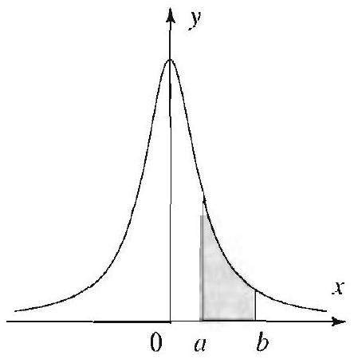
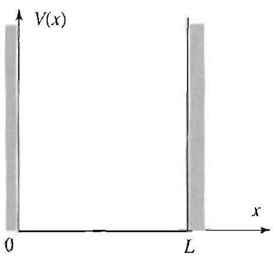
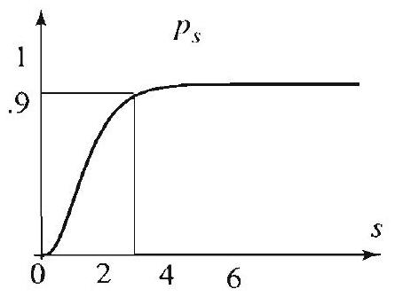
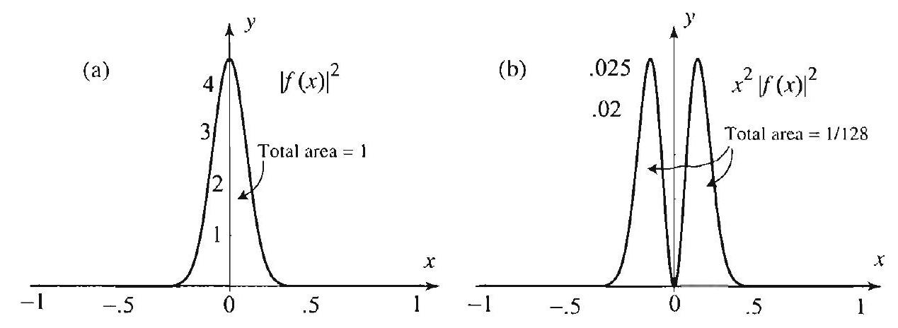
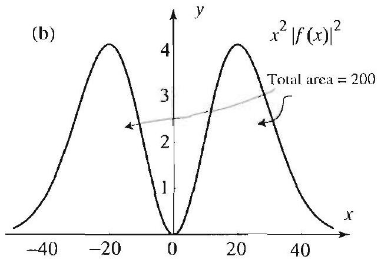
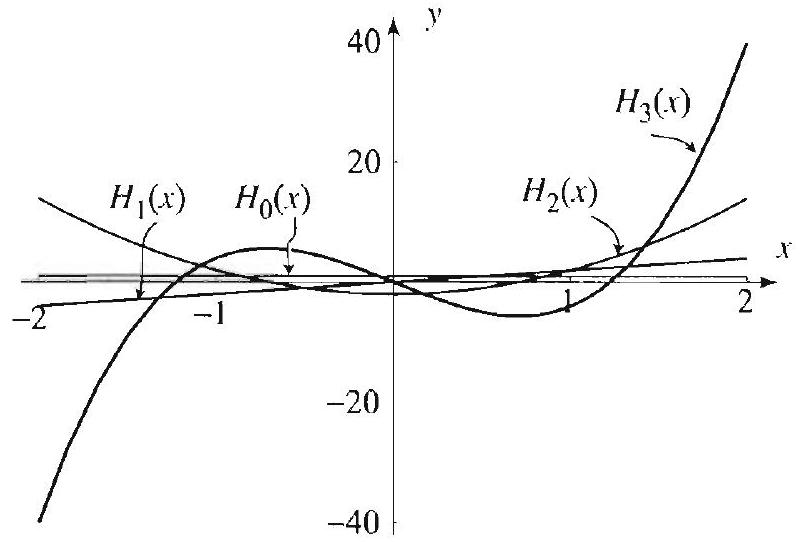
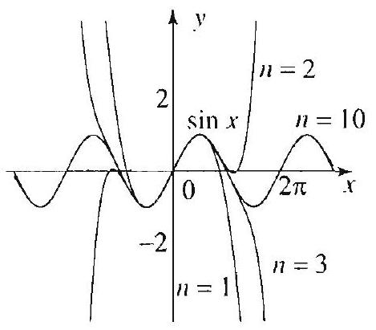
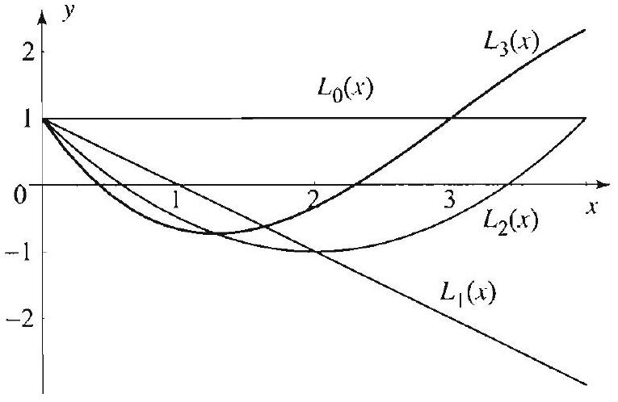

<!-- Page 1 -->

Left margin note (page 1)

Topics to Review
In Sections 11.1 and 11.2 we will use the method of separation of variables in solving certain special cases of the time-dependent Schrödinger equation. The detailed solutions of these problems require the use of the Hermite and Laguerre polynomials. The basic properties of these polynomials are covered in Section 11.4 and will be called upon as needed. A thorough treatment of Section 11.4 is not a prerequisite for this chapter. Spherical harmonics as presented in Section 5.4 are used in Section 11.2; however, as with the Laguerre and Hermite polynomials, this material need not have been studied previously but can be referred to as needed. The Fourier transform, as presented in Section 7.2, plays a crucial role in Section 11.3.

Looking Ahead...
This chapter considers the application of the Fourier transform and of the method of separation of variables to problems in quantum mechanics. As such, it offers a brief introduction to the subject of quantum mechanics and illustrates the wide applicability of the methods developed in this book. After covering this chapter the reader can consult any good book on quantum mechanics to discover many interesting applications that have not been touched upon here.

Right margin note (page 1)

de-owltical ANS and quaome beepts the bles. cools tom. and this ials. ntial apthe ting. 11.2,

++++

11

AN INTRODUCTION TO QUANTUM MECHANIC:

The final truth about a phenomenon resides in the mathematica scription of it; so long as there is no imperfection in this, our kn edge of the phenomenon is complete. We go beyond mathema formulas at our own risk.
-SIR JAMES JE

Up to now we have considered very classical topics from physics engineering: primarily the heat (or diffusion) equation, the wave $e$ tion, Laplace's equation, and Poisson's equation. We now take ups interesting topics that arise in quantum theory. In Section 11.1 we gin with a brief introduction to the fundamental objects and cono of quantum mechanics, show how Schrödinger's equation enters picture and then proceed with the method of separation of varia In Section 11.2 we present the most successful application of our and methods in quantum mechanics: the model of the hydrogen a In Section 11.3 we present a connection with the Fourier transform then proceed to develop the Heisenberg uncertainty principle in context. The final section is a supplement on orthogonal polynom These polynomials are needed in the solution of partial differe equations arising in our models from quantum mechanics. The plications of this chapter will give us the opportunity of applying method of separation of variables in a new and very interesting set Indeed, the model of the hydrogen atom, as presented in Section was among the major successes of quantum mechanics.

---

<!-- Page 2 -->

Left margin note (page 2)

574
Chapter 11
11.1 Schröc

Figure 1 Probabi area.

Right margin note (page 2)

Huence osition dation govrating overed escribe a fact and vebection nd betainty, ionary atomic
the inectron funcaterval 1926.
gure 1, $a$ and
ction, havior ity for For es that via the

++++

An Introduction to Quantum Mechanics
linger's Equation
In classical mechanics, the trajectory of an object moving under the int of a force can be completely determined once we know the initial p and velocity. Newton's second law of motion, $F=m a$, lies at the foun of this theory. It is the key in deriving the differential equations the ern the behavior of the moving object (e.g., a mass on a spring, a vil string or membrane, a hanging chain). In the early 1900s, it was disc that the classical models based on Newton's law do not adequately de the motion of very small objects, such as electrons. Indeed, it is that one cannot measure accurately and simultaneously the position a locity of an atomic particle (see Heisenberg's uncertainty principle, 11.3). Because of this sharp distinction from classical mechanics, a cause the state of particles cannot be determined with an absolute cer a new theory emerged based on statistical viewpoints. This revolut theory, known as quantum mechanics, postulates that the position of particles can only be determined with a certain probability.

Born's Statistical Interpretation
Consider the case of a single electron moving along the $x$-axis under fluence of some force field. In quantum mechanics, we attach to this el a certain nomegative function $\rho(x)$ called the probability density tion, which gives the probability of finding the electron in a given i $[a, b]$. This statistical interpretation was introduced by Max Born in Hence

Probability that the electron is in interval $[a, b]=\int_{a}^{b} \rho(x) d x$.

Because the total probability is one, we have $\int_{-\infty}^{\infty} \rho(x) d x=1$. In Fi this probability is the shaded area under the graph of $\rho$ between $x= x=b$.

A quantity of fundamental importance is the electron's wave fun $\psi(x)$. Knowledge of this function allows us to predict the whole be of the electron. We can use it to determine the probability dens the electron's momentum and velocity, and many other quantities example, one of the fundamental axioms of quantum mechanics stat the position density $\rho$ can be computed from the wave function $\psi$ formula
$$
\rho(x)=|\psi(x)|^{2}=\psi(x) \overline{\psi(x)} .
$$

---

<!-- Page 3 -->

Left margin note (page 3)

Strictly speaking, Planck's constant refers to the constant $h=6.626 \times 10^{-34} \mathrm{~J} \cdot \mathrm{~s}$, introduced by Max Planck in 1900 to explain the black body radiation problem, and used by Einstein five years later to explain the photoelectric effect. The constant $h$ is equal to $h /(2 \pi)$ and serves as a much more fundamental constant in the formulation of quantum mechanics.

Right margin note (page 3)

575

vave tion ame ncc. hore megion
$z, t)$ s of orce ianthat any
$$
l V,
$$

++++

Section 11.1 Schrödinger's Equation

In view of the fact that $\rho$ is a probability density, we have
$$
\int_{-\infty}^{\infty}|\psi(x)|^{2} d x=1
$$

The probability density for the electron's momentum is related to the v function $\psi$ via the Fourier transform. This connection is explored in Sec 11.3.

For particles moving in a force field in two or three dimensions, the s definitions apply. In addition, we may have to account for time-depende In this case, the probability densities are functions of two, three, or $n$ variables. For example, for a particle moving in three dimensions with ti dependent wave function $\psi$, the probability of finding this particle in a re $D$ at a given time $t$ is
$$
\iiint_{D}|\psi(x, y, z, t)|^{2} d x d y d z .
$$

Thus, for fixed $t$, the probability density for the particle's position is
$$
\rho(x, y, z, t)=|\psi(x, y, z, t)|^{2} .
$$

We next address the fundamental question of finding the wave function
Time-Dependent Schrödinger Equation
It is a fact from quantum mechanics that the wave function $\psi(x, y$, is a solution of the Schrödinger equation
$$
i \hbar \frac{\partial \psi}{\partial t}=-\frac{\hbar^{2}}{2 \mu} \nabla^{2} \uparrow+V(. x . y, z) \psi,
$$
where $\hbar$ is Planck's constant ( $\left.\hbar=1.054 \times 10^{-34} \mathrm{~J} \cdot \mathrm{~s}\right), \mu$ is the mas the particle, and $V$ is the time-independent potential energy of the f field (hence $F^{\prime}=-\nabla V$ ). Just as Newton's laws are to classical mect ics. Schrödinger's equation is really an axiom in quantum mechanics leads to correct physical conclusions and that can be used to explain $m$ phenomena at the atomic level.

Solution by Separation of Variables
In concrete applications, we have to solve (4) for a specific potentia subject to a given initial wave function
$$
\psi(x, y, z, 0)=f(x, y, z) .
$$

---

<!-- Page 4 -->

Left margin note (page 4)

576
Chapter 11
An Introduc

Right margin note (page 4)

to (4), c usual ic functs soluotential
rgy. An ntrivial mean a integral nalized g to an
$E$. For nsity

++++

tion to Quantum Mechanics

For now we will simply apply the separation of variables method without specifying the potential $V$ or the initial condition (5).

Setting $\psi=u(x, y, z) T(t)$ and plugging into (4), we arrive in th way at the separated equations
$$
i \hbar \frac{T^{\prime}}{T}=E
$$
and
$$
\frac{1}{u}\left[-\frac{\hbar^{2}}{2 \mu} \nabla^{2} u+V(x, y, z) u\right]=E,
$$
where $E$ is the separation constant. Simplifying, we get
$$
T^{\prime}=-\frac{i}{\hbar} E T
$$
and the time-independent Schrödinger equation for $u$,
$$
-\frac{\hbar^{2}}{2 \mu} \nabla^{2} u+V(x, y, z) u=E u
$$

You can easily check that the solutions of (6) are the simple harmon tions
$$
T(t)=A e^{-i E t / \hbar}
$$
where $A$ is a constant. Equation (7) is much more difficult to solve. tions have been computed in only a few but important cases of the p $V$; some of them will be discussed in this chapter.

Stationary States and the General Solution
In a quantum system, the separation constant $E$ has units of ene admissible value of $E$, or eigenvalue, is one for which we have a no solution of (7) that is normalizable, where by normalizable we function $f$ that tends to zero at infinity and such that $|f|^{2}$ has a finite over the whole space. Let us also call a normalizable function $f$ norn if $|f|^{2}$ has total integral 1. A product solution of (4) correspondin admissible value of $E$ is then
$$
\psi(x, y, z, t)=A e^{-i E t / \hbar} u(x, y, z) .
$$

Such solution of (4) is called a stationary state with energy level a stationary state, although $\psi$ is time-dependent, the probability de
$$
|\psi(x, y, z, t)|^{2}=|A|^{2}\left|e^{-i E t / \hbar}\right|^{2}|u(x, y, z)|^{2}=|A|^{2}|u(x, y, z)|^{2}
$$

---

<!-- Page 5 -->

Right margin note (page 5)

577
with
tial
ver,
For
$$
(t),
$$
rm.
apx). 6.2 tain $=1$ 1 be rval n of y be r, it
with ions eral

++++

Section 11.1 Schrödinger's Equation

is not, and thus the term stationary. This is clearly not the case arbitrary solutions of (4).

To proceed any further with the solution requires knowing the poter $V$ and the initial wave function in (5). We can gain some insight, howe by tying in our discussion with Sturm-Liouville theory from Section 6.2. this purpose, let us consider the one dimensional problem
$$
\begin{array}{c}
i \hbar \frac{\partial \psi}{\partial t}=-\frac{\hbar^{2}}{2 \mu} \frac{\partial^{2} \psi}{\partial x^{2}}+V(x) \psi \\
\psi(x, 0)=f(x)
\end{array}
$$

Here we are looking for product solutions of the form $\psi(x, t)=u(x)$ I where $T$ is given by (8). From (7), we get the equation for $u$
$$
-\frac{\hbar^{2}}{2 \mu} u^{\prime \prime}+V(x) u=E u
$$
where $E$ is a separation constant. Equation (12) can be put in the Stu Liouville form ((1), Section 6.2)
$$
u^{\prime \prime}+[q(x)+\lambda] u=0
$$
where
$$
q(x)=-\frac{2 \mu}{\hbar^{2}} V(x), \quad \lambda=\frac{2 \mu E}{\hbar^{2}}
$$

The set of admissible values of $E$ is called the spectrum. Since in most plications we are interested in solving (13) on the infinite interval $(-\infty$, the Sturm-Liouville problem will be singular, in general (see Section for the terminology). We can appeal to results from Section 6.2 to ob properties of the solutions of (13). In the notation of that section, $r(x)$ in (13). Thus, according to Theorem 2, Section 6.2, the solutions wil orthogonal with respect to the weight function $r(x)=1$ on the inte $(-\infty, \infty)$. Beyond this nothing else can be guaranteed. The spectrur (13) may be discrete as described by Theorem 1, Section 6.2. It ma continuous (for example, it may consist of all $\lambda \geq 0$, or all $\lambda \leq 0$ ). may be partly discrete and partly continuous.

Most applications in this chapter involve a Schrödinger equation discrete spectrum: $E_{1}, E_{2}, E_{3}, \ldots$. Denote the corresponding solut of (13) by $u_{1}, u_{2}, u_{3}, \ldots$. By superposing product solutions, the gen solution of (10)-(11) becomes
$$
\psi(x, t)=\sum_{n=1}^{\infty} A_{n} e^{-i E_{n} t / \hbar} u_{n}(x)
$$

---

<!-- Page 6 -->

Left margin note (page 6)

578
Chapter 11
An Introduc

Figure 2 Infinite square well potential.

Right margin note (page 6)

way,
interval
4) with
force of side the a given

Thus, ödinger
oes not
recall, iditions at $u(x)$ that $u$

++++

tion to Quantum Mechanics

where
$$
\psi(x, 0)=f(x)=\sum_{n=1}^{\infty} A_{n} u_{n}(x) .
$$

The coefficients in (16) are determined using orthogonality in the usu
$$
A_{n}=\int_{-\infty}^{\infty} f(x) u_{n}(r) d x / \int_{-\infty}^{\infty} u_{n}^{2}(x) d x
$$

We illustrate these ideas with an example involving Fourier series.

EXAMPLE 1 The infinite square well
The wave function for a small particle confined to move freely inside an $[0, L]$ satisfies the one dimensional version of the Schrödinger equation ( potential
$$
V(x)=\left\{\begin{array}{ll}
0 & \text { if } 0 \leq x \leq L, \\
\infty & \text { otherwise } .
\end{array}\right.
$$

The infinite value of the potential outside the interval $[0, L]$ represents a very large (infinite) magnitude that prevents the particle from bouncing outs: interval (Figure 2). Our goal is to find the wave function $\psi(x, t)$, subject to initial wave function
$$
\psi(x, 0)=f(x) .
$$

Clearly, the probability of finding the particle outside the interval $[0, L]$ is 0 . $\psi(x, t)=0$ for $x<0$ or $x>L$. For $0 \leq x \leq L$, the time-independent Schr equation (7) becomes
$$
-\frac{\hbar^{2}}{2 \mu} \frac{d^{2} u}{d x^{2}}=E u \quad \text { or } \quad \frac{d^{2} u}{d x^{2}}=-\frac{2 \mu E}{\hbar^{2}} u, \quad 0<x<L .
$$

Note that, outside $[0, L] . u$ must be 0 , since $\psi(x, t)=u(x) T(t)$, and $T \mathrm{~d}$ vanish, by (8). If $E=0$, then $u(x)=a x+b$. If $E<0$, then
$$
u(x)=a c^{\lambda x}+b e^{-\lambda x}, \quad \text { where } \lambda=\sqrt{-\frac{2 \mu E}{h^{2}}} .
$$

Finally, if $E>0$, then
$$
u(x)=a \cos \lambda x+b \sin \lambda x, \quad \text { where } \lambda=\sqrt{\frac{2 \mu E}{\hbar^{2}}} .
$$

At this point, we have to decide which functions to allow as solutions. As yo when applying the separation of variables method, you used boundary con to rule out certain solutions. Here, we will use the plausible condition th must be continuous. Since it has to vanish at $x=0$ and $x=L$ (recall

---

<!-- Page 7 -->

Right margin note (page 7)

579
$$
=0 .
$$

of the
dition
finite
$$
x)=
$$
time

$=1$.

++++

Section 11.1 Schrödinger's Equation

is identically 0 outside the interval $[0, L]$ ), we infer that $u(0)=0$ and $u(L)$ You can easily check that the nontrivial solutions occur when $E>0$ and are form (18). Moreover, the condition $u(0)=0$ implies that $a=0$; and the cond $u(L)=0$ implies that
$$
\sin \lambda L=0 \quad \text { or } \quad \lambda L=n \pi, \quad n=1,2, \ldots
$$

From this and (18), we get the eigenvalues
$$
E=E_{n}=\frac{n^{2} \pi^{2} \hbar^{2}}{2 \mu L^{2}}, \quad n=1,2, \ldots
$$
and the corresponding eigenfunctions
$$
u_{n}(x)=b_{n} \sin \frac{n \pi}{L} x
$$

Using (16) and (17), we see that
$$
f(x)=\sum_{n=1}^{\infty} b_{n} \sin \frac{n \pi}{L} x
$$

Thus the $b_{n}$ 's are the Fourier sine coefficients of $f$,
$$
b_{n}=\frac{2}{L} \int_{0}^{L} f(x) \sin \frac{n \pi}{L} x d x, \quad n=1,2, \ldots
$$
(See (3), (4), Section 2.4.) Collecting results, we obtain the wave function
$$
\psi(x, t)=\left\{\begin{array}{ll}
\sum_{n=1}^{\infty} b_{n} \sin \frac{n \pi}{L} x e^{-i E_{n} t / h}, & \text { if } 0 \leq x \leq L, \\
0 & \text { if } x<0 \text { or } x>L,
\end{array}\right.
$$
where $b_{n}$ and $E_{n}$ are as above.
Exercises 11.1
1. Derive (6) and (7) from (4).
2. Determine the constant $A$ so as to normalize $\psi$.
(a) $\psi(x)=A e^{-x^{2}}$.
(b) $\psi(x, y)=A e^{-\left(x^{2}+y^{2}\right)}$.
(c) $\psi(x)=\left\{\begin{array}{ll}A e^{2 i x} x(1-x) & \text { if } 0<x<1, \\ 0 & \text { otherwise } .\end{array}\right.$
3. Experimenting with Example 1. At time $t=0$, a particle in the in square well (with $L=1$ ) is represented by the wave function $\psi(x, 0)=f( A x(1-x)$, for $0 \leq x \leq 1$. In what follows take $\frac{\hbar}{2 \mu}=1$.
(a) Find the value of $A$ that normalizes $f$.
(b) What is the probability of finding the particle in the interval $[0,1 / 2]$ at $t=0$ ?
(c) What is the wave function that represents this particle?
(d) Approximate the probability of finding the particle in $[0,1 / 2]$ at time $t=$

---

<!-- Page 8 -->

Left margin note (page 8)

580 Chapter 11 An Introduc

Right margin note (page 8)

equires all from denote aw, the ve have erential
$B$ are ig-mass
lantum rations storing tion (4)
solving
pendent
we will nection
quation
$H_{n}(x)$,
Section
square
n 11.4.]
n $\phi^{\prime \prime}+$
$y$ when
onstant
where

++++

tion to Quantum Mechanics

Project Problem: The quantum harmonic oscillator. This project r a knowledge of Hermite's differential equation from Section 11.4. Let us reca classical mechanics the model of an undamped spring-mass system. Let $m$ the mass of the system and $k$ denote the spring constant. From Hooke's l restoring force is $F=-k x$. Hence from Newton's second law of motion v $m \frac{d^{2} x}{d t^{2}}=-k x$. (The potential in this case is $V(x)=\frac{1}{2} k x^{2}$.) Solving the diff equation, we obtain $x(t)=A e^{i \omega t}+B e^{-i \omega t}$, where $\omega=\sqrt{\frac{k}{m}}$, and $A$ and constants that can be determined from the initial conditions of the sprir system.

Now let us turn to the quantum harmonic oscillator, which is the q mechanical analog of the spring-mass system. This models the small vit of a particle of mass $\mu$ moving along the $x$-axis under the influence of a r force given by a potential $V(x)=\frac{1}{2} \kappa x^{2}$. In this case, Schrödinger's equat becomes
$$
i \hbar \frac{\partial \psi}{\partial t}=-\frac{\hbar^{2}}{2 \mu} \frac{\partial^{2}}{\partial x^{2}} \psi+\frac{1}{2} \kappa x^{2} \psi,
$$
where $\psi=\psi(x, t)$ is the unknown wave function. We will be interested in this equation given an initial wave function
$$
\psi(x, 0)=f(x)
$$

The separated equations consist now of (6) and the one dimensional time-inde Schrödinger equation
$$
-\frac{\hbar^{2}}{2 \mu} u^{\prime \prime}+\frac{1}{2} \kappa x^{2} u=E u
$$

This equation is obtained from (7) by using $V(x)=\frac{1}{2} \kappa x^{2}$. In solving (21), require that the solutions be normalizable. Our next step is to show a con to Hermite's differential equation ((1), Section 11.4).
4. Hermite functions.
(a) Show that the substitution $\phi(x)=e^{-\frac{x^{2}}{2}} y(x)$ transforms Hermite's e (1), Section 11.4, into $\phi^{\prime \prime}+\left(2 n+1-x^{2}\right) \phi=0,-\infty<x<\infty$.
(b) Conclude that the solutions of the equation in (a) are $\dot{\varphi}_{n}(x)=e^{-\frac{t^{2}}{2}} n=0,1,2, \ldots$. These are called Hermite functions.
(c) Show that $\int_{-\infty}^{\infty} \phi_{m}(x) \phi_{n}(x) d x=0$ for $m \neq n$. [Hint: Theorem 1, 11.4.]
(d) Show that $\int_{-\infty}^{\infty}\left[\phi_{m}(x)\right]^{2} d x=2^{n} n!\sqrt{\pi}$. Hence the Hermite functions are integrable on $(-\infty, \infty)$ and tend to 0 at infinity. [Hint: Theorem 1, Sectio

In closing, we note that it can be shown that the differential equatio $\left(\lambda-x^{2}\right) \phi=0$ admits normalizable solutions on the interval $(-\infty, \infty)$ onl $\lambda=2 n+1, n=0,1,2, \ldots$. In this case, as we just saw, the solutions are c multiples of the Hermite functions.
5. (a) Returning to (21), show that the change of variables $x=\sqrt{\frac{h}{\mu \omega}}$ s $\kappa=\mu \omega^{2}$, transforms the equation into
$$
\frac{d^{2} u}{d s^{2}}+\left(\frac{2 E}{\hbar \omega}-s^{2}\right) u=0
$$

---

<!-- Page 9 -->

Left margin note (page 9)

11.2 The Hy

Right margin note (page 9)

581
when
(20)
1].
ent of
, 1] at
ig the
evious
ntum
t ex-
al the
csent
tom.
cated

++++

Section 11.2 The Hydrogen Atom
(b) Using Exercise 4, conclude that the normalizable solutions of (21) occur
$$
E=E_{n}=\hbar \omega\left(n+\frac{1}{2}\right), \quad n=0,1,2, \ldots
$$

To each $E_{n}$ we have the solution
$$
u_{n}(. x)=e^{-\frac{\mu \omega x^{2}}{2 \hbar}} H_{n}\left(\sqrt{\frac{\mu \omega}{\hbar}} x\right), \quad n=0,1,2, \ldots
$$
6. Hermite series solution of the quantum harmonic oscillator
(a) Show that the product solutions of (19) are
$$
\psi_{n}(x, t)=A_{n} e^{-i E_{n} t / \hbar} e^{-\frac{\mu \omega x^{2}}{2 \hbar}} H_{n}\left(\sqrt{\frac{\mu \omega}{\hbar}} x\right)
$$
(b) Using the result of Exercise 4, show that the solution of (19) and (20) is
$$
\psi(x, t)=e^{-\frac{\mu \omega x^{2}}{2 \hbar}} \sum_{n=0}^{\infty} A_{n} e^{-i E_{n} t / \hbar} H_{n}\left(\sqrt{\frac{\mu \omega}{\hbar}} x\right),
$$
where
$$
A_{n}=\sqrt{\frac{\mu \omega}{\hbar}} \frac{1}{2^{n} n!\sqrt{\pi}} \int_{-\infty}^{\infty} f(x) e^{-\frac{\mu \omega x^{2}}{2 h}} H_{n}\left(\sqrt{\frac{\mu \omega}{\hbar}} x\right) d x
$$
7. In this problem, we take $\frac{\mu \omega}{\hbar}=1$ and consider the initial value problem (19) with initial wave function
$$
f(x)=A e^{-\frac{x^{2}}{2}}
$$
(a) Normalize $f(x)$.
(b) Approximate the probability of finding the oscillator in the interval [ -1 ,
(c) Find the wave function.
(d) What is the probability density for position? (Note that it is independ time.)
(e) Approximate the probability of finding the oscillator in the interval $[-1$ time $t=1$.
(f) Approximate the value of $a$ so that, at $t=1$, the probability of findit oscillator in $[-a, a]$ is at least $90 \%$.
8. Repeat Exercise 7 with $f(x)=A e^{-\frac{x^{2}}{2}}[1+\sqrt{2} x]$. (In contrast with the pre exercise, the probability density in (d) is not independent of time.)
drogen Atom
In the preceding section we discussed some general principles of qua mechanics. We presented the Schrödinger equation as an axiom tha plains facts about particles on the atomic level. Even though in genera equation is impossible to solve in closed form, in this section we will pr a complete solution in the simple but important case of the hydrogen The solution also serves as a model for understanding more compli structures.

---

<!-- Page 10 -->

Left margin note (page 10)

582
Chapter 11
An Introdu

Figure 1 The hydrogen atom.

Right margin note (page 10)

ctrons. drogen Since /ier), it d focus
motion istance Since of the
rödinger
venient n of the we will
ver the
hat the

++++

ction to Quantum Mechanics

Recall that an atom consists of a nucleus and a number of ele The nucleus consists of protons and neutrons. In the case of the hy atom, we have one electron and a nucleus consisting of one proton. the proton is much heavier than the electron (about 1864 times heav moves only slightly. Hence we may think of the nucleus as fixed an our study on the motion of the electron (Figure 1).

Time-Dependent Schrödinger Equation
In our model of the hydrogen atom, the electron moves in orbital around the proton with attractive force $-\epsilon^{2} / r^{2}$, where $r$ is the $d$ between the electron and the proton and $\epsilon$ is the charge of the proton. the force is the negative gradient of the potential, the attractive force proton has potential energy
$$
V=-\frac{\epsilon^{2}}{r} .
$$

Putting this in (4), Section 11.1, we obtain the time-dependent Sch equation for the hydrogen atom
$$
i \hbar \frac{\partial \psi}{\partial t}=-\frac{\hbar^{2}}{2 \mu} \nabla^{2} \psi-\frac{\epsilon^{2}}{r} \psi,
$$
where $\mu$ is the mass of the electron. In solving this equation, it is con to use spherical coordinates, $(r, \theta, \phi)$, because of the simple expression potential $V$ in this coordinate system. As in the previous section, require the spatial part of $\psi$ be normalizable. That is, setting
$$
\psi=u(r, \theta, \phi) T(t),
$$
we require $u$ tend to zero at infinity and $|u|^{2}$ have a finite integral o entire space. Separating variables in (1), we arrive at the equation
$$
T^{\prime}=-\frac{i}{\hbar} E T,
$$
and the time-independent Schrödinger equation for $u$ :
$$
-\frac{\hbar^{2}}{2 \mu} \nabla^{2} u-\frac{\epsilon^{2}}{r} u=E u
$$
(see (6) and (7), Section 11.1). We know from the previous section $t$ solutions of (2) are
$$
T(t)=A e^{-i E t / \hbar},
$$

---

<!-- Page 11 -->

Right margin note (page 11)

583
ning
onics
mes
Eu.
gnize
has
hics,
atum
tron
lence
0 ) is

++++

Section 11.2 The Hydrogen Atom

where $A$ is a constant. The hard work is in solving (3) and determi the separation constant $E$. The solution will involve spherical harm (Chapter 5) and Laguerre polynomials (Section 11.4).

Spherical Harmonics and the Schrödinger Equation
Using the spherical form of the Laplacian, (8), Section 4.1, (3) becc
$$
\frac{\hbar^{2}}{2 \mu}\left[\frac{\partial^{2} u}{\partial r^{2}}+\frac{2}{r} \frac{\partial u}{\partial r}+\frac{1}{r^{2}}\left(\frac{\partial^{2} u}{\partial \theta^{2}}+\cot \theta \frac{\partial u}{\partial \theta}+\csc ^{2} \theta \frac{\partial^{2} u}{\partial \phi^{2}}\right)\right]-\frac{\epsilon^{2}}{r} u=
$$

Using separation of variables to solve this equation, we set
$$
u(r, \theta, \phi)=R(r) Y(\theta, \phi),
$$
and plug into (5). Separating the $R$ part from the $Y$ part, we get
$$
\frac{\partial^{2} Y}{\partial \theta^{2}}+\cot \theta \frac{\partial Y}{\partial \theta}+\csc ^{2} \theta \frac{\partial^{2} Y}{\partial \phi^{2}}+\eta Y=0
$$
and
$$
-\frac{\hbar^{2}}{2 \mu}\left[R^{\prime \prime}+\frac{2}{r} R^{\prime}-\frac{\eta}{r^{2}} R\right]-\frac{\epsilon^{2}}{r} R=E R,
$$
where $\eta$ is a separation constant. From Theorem 4, Section 5.3, we reco equation (6) as the differential equation for the spherical harmonics. nontrivial solutions when the separation constant is given by
$$
\eta=\eta_{n}=n(n+1), \quad n=0,1,2, \ldots .
$$

For each $\eta_{n}=n(n+1)$, we have $2 n+1$ solutions, the spherical harmor
$$
Y_{n, m}(\theta, \phi), \quad m=-n,-n+1, \ldots, n-1, n .
$$

Putting $\eta_{n}=n(n+1)$ in (7), we arrive at the radial equation
$$
-\frac{\hbar^{2}}{2 \mu}\left[R^{\prime \prime}+\frac{2}{r} R^{\prime}-\frac{n(n+1)}{r^{2}} R\right]-\frac{\epsilon^{2}}{r} R=E R .
$$

In determining the separation constant $E$, we use a fact from qual physics that states that bounded solutions (corresponding to an elec and a proton bound together) occur only at negative energy levels. we take $E<0$ in (10). We now show by two substitutions that (1

---

<!-- Page 12 -->

Left margin note (page 12)

584
Chapter 11 An Introdu

Right margin note (page 12)

rake the
cercises. n ((13), $-n-1$ hat degree
-1 and in (16), product alizable.

++++

ction to Quantum Mechanics
related to Laguerre's differential equation (Section 11.4). We first m substitution
$$
s=\alpha r, \quad w(s)=R(s / \alpha), \quad \text { where } \alpha=\sqrt{-\frac{8 \mu E}{\hbar^{2}}} .
$$

This transforms (10) into
$$
\frac{d^{2} u}{d s^{2}}+\frac{2}{s} \frac{d w}{d s}-\frac{n(n+1)}{s^{2}} w-\frac{1}{4} w+\frac{\nu}{s} w=0
$$
where
$$
\nu=\frac{2 \mu \epsilon^{2}}{\alpha \hbar^{2}}=\frac{\epsilon^{2}}{\hbar} \sqrt{\frac{\mu}{-2 E}}
$$

We then make the substitution
$$
w(s)=s^{n},-s / 2 y(s)
$$
and transform (12) into
$$
s \frac{d^{2} y}{d s^{2}}+[2(n+1)-s] \frac{d y}{d s}+(\nu-n-1) y=0
$$

The details of both substitutions are straightforward and are left as e Equation (15) is the generalized Laguerre differential equatio Section 11.4) with $\alpha=2 n+1$ and $n$ replaced by $\nu-n-1$. When $\nu$ is a nonnegative integer, that is, when $\nu$ is a positive integer such th
$$
\nu \geq n+1,
$$
we know from Section 11.4 that (15) has a polynomial solution of $\nu-n-1$ denoted by
$$
y(s)=L_{\nu-n-1}^{2 n+1}(s)
$$
and called the generalized Laguerre polynomial of degree $\nu-\|$ order $2 n+1$ (see Section 11.4, (13), (14)). From here on we take $\nu$ as since for all other values of $\nu$ it can be shown that the corresponding solution $\psi=R Y T$ is not square integrable, and hence not norm Substituting back with the help of (14) and (11), we obtain
$$
w(s)=w_{\nu n}(s)=s^{n} e^{-s / 2} L_{\nu-n-1}^{2 n+1}(s)
$$
and hence the solution of (10):
$$
R_{\nu n}(r)=e^{-(\alpha r) / 2}(\alpha r)^{n} L_{\nu-n-1}^{2 n+1}(\alpha r)
$$

---

<!-- Page 13 -->

Left margin note (page 13)

Figure 2 Radial wave function of the hydrogen atom in stationary state. The distance $r$ is measured in Bohr radii ( $a=1 \mathrm{in}(21)$ ).

THEOREM 1
ENERGY LEVELS
AND BOUND
STATES OF THE HYDROGEN ATOM

++++

Section 11.2 The Hydrogen Atom

where
$$
\alpha=\frac{2 \mu \epsilon^{2}}{\nu \hbar^{2}} .
$$

The function $R_{\nu n}$ is called the radial wave function (or simply, ra function) of the hydrogen atom in a stationary state. It is customar introduce a scale where distance is measured in multiples of one Bohr rac (units in meters)
$$
a=\frac{\hbar^{2}}{\mu \epsilon^{2}}=0.529 \times 10^{-10} m .
$$

In this scale, the radial function becomes
$$
R_{\nu n}(r)=e^{-\frac{r}{\nu a}}\left(\frac{2}{\nu a} r\right)^{n} L_{\nu-n-1}^{2 n+1}\left(\frac{2}{\nu a} r\right) .
$$

See Figure 2 for graphs of the radial wave function.)

We are now ready to collect results and draw some important conclusi
(i) The bound states of the hydrogen atom have negative energies
$$
E_{\nu}=-\frac{\epsilon^{4} \mu}{2 \hbar^{2}} \frac{1}{\nu^{2}}, \quad \nu=1,2,3, \ldots
$$
(ii) To each energy level $E_{\nu}$ correspond $\nu^{2}$ bound states with
$$
u_{\nu n m}(r, \theta, \phi)=R_{\nu n}(r) Y_{n, m}(\theta, \phi), \quad|m| \leq n<\nu,
$$
where the radial function $R_{\nu m}(r)$ is as in (21) and $Y_{n, m}(\theta, \phi)$ is the sphe harmonics.

---

<!-- Page 14 -->

Left margin note (page 14)

586
Chapter 11
An Introdu

THEOREM 2
TIME-DEPENDENT WAVE FUNCTION
AND PROBABILITY DISTRIBUTION

Right margin note (page 14)

tions of from 0
set was uation. based
discrete excited. round er, the 2. We known und to en atom energy

This we use e entire

++++

ction to Quantum Mechanics

Proof To prove (i) solve for $E$ in (13). To prove (ii) use the product solu (5). Since for each $n$ we have $2 n+1$ eigenfunctions for (6), and $n$ can run to $\nu-1$, we have altogether a total of
$$
\sum_{n=0}^{\nu-1}(2 n+1)=\nu^{2}
$$
bound states.
The fact that the energy levels in a hydrogen atom form a discrete proved by Niels Bohr in 1913, before the discovery of Schrödinger's eq Indeed it served as strong support for a quantum mechanics theory on the Schrödinger equation.

The Bohr model was confirmed experimentally by observing a set of light frequencies that the hydrogen atom emits after being The lowest level of energy, corresponding to $\nu=1$, is called the $\mathbf{g}$ energy and corresponds to an atom in the ground state. Howev electron can exist in a number of states with energy levels $E_{\nu}, \nu \geq$ have
$$
E_{\nu}=\frac{E_{1}}{\nu^{2}}, \quad \nu=1,2,3, \ldots
$$

The ground energy $E_{1}$ is approximately -13.6 eV . This energy is also as the binding energy, since it is required for the electron to be bo the proton.
(i) The time-dependent wave function of the electron in a hydrog in a state at energy level $E_{\nu}$ is
$$
\psi_{\nu n m}(r, \theta, \phi, t)=A_{\nu n} e^{-i E_{\nu} t / h} R_{\nu n}(r) Y_{n, m}(\theta, \phi),
$$
where
$$
A_{\nu n}=\sqrt{\left(\frac{2}{a \nu}\right)^{3} \frac{(\nu-n-1)!}{2 \nu(\nu+n)!}}, \quad|m| \leq n<\nu, \nu=1,2, \ldots
$$
(ii) The probability density for the electron's position in a state at level $E_{\nu}$ is given by
$$
\rho_{\nu m m}(r, \theta, \phi)=A_{\nu n}^{2} R_{\nu n}^{2}(r)\left|Y_{n, m}(\theta, \phi)\right|^{2} .
$$

Proof We get (23) by simply including in (22) the time component (4) determines the wave function up to a constant $A_{\nu n}$. To determine $A_{\nu n}$, the fact that $\left|i_{\nu n m}\right|^{2}$ is a probability density, and hence its integral over th

---

<!-- Page 15 -->

Right margin note (page 15)

587
$=1$
have
and
tain
the
ence
grate
ction
hics plify the note ton.
ends can

++++

Section 11.2 The Hydrogen Atom

three-dimensional space is 1 . We have
$$
\begin{aligned}
\left|\psi_{\nu n m}\right|^{2} & =\left|A_{\nu n}\right|^{2}\left|e^{-i E_{\nu} t / \hbar}\right|^{2}\left|R_{\nu n}(r)\right|^{2}\left|Y_{n, m}(\theta, \phi)\right|^{2} \\
& =\left|A_{\nu n}\right|^{2}\left|R_{\nu n}(r)\right|^{2}\left|Y_{n, m}(\theta, \phi)\right|^{2},
\end{aligned}
$$
since $\left|e^{-i E_{\nu} t / \hbar}\right|=1$ for all $t$. We now set $\int_{-\infty}^{\infty} \int_{-\infty}^{\infty} \int_{-\infty}^{\infty}\left|\psi_{n \nu m}\right|^{2} d x d y d z$ and evaluate the integral to determine $A_{\nu n}$. In spherical coordinates, we $d x d y d z=r^{2} \sin \theta d r d \theta d \phi$. So,
$$
\int_{0}^{2 \pi} \int_{0}^{\pi} \int_{0}^{\infty}\left|A_{\nu n}\right|^{2}\left|R_{\nu n}(r)\right|^{2}\left|Y_{n, m}(\theta, \phi)\right|^{2} \sin \theta r^{2} d r d \theta d \phi=1
$$

By (6), Section 5.3, the integrals in $\theta$ and $\phi$ evaluate to 1 . By calling on (21) then making the change of variables $u=\frac{2}{\nu a} r$, we get
$$
\left|A_{\nu n}\right|^{-2}=\left(\frac{a \nu}{2}\right)^{3} \int_{0}^{\infty} e^{-u} u^{2 n+2}\left[L_{\nu-n-1}^{2 n+1}(u)\right]^{2} d u
$$

To complete the proof of (24), we will establish the following identity:
$$
\int_{0}^{\infty} e^{-x} x^{\alpha+1}\left[L_{N}^{\alpha}(x)\right]^{2} d x=\frac{\Gamma(N+\alpha+1)}{N!}(2 N+\alpha+1)
$$

By taking $N=\nu-n-1$ and $\alpha=2 n+1$ in (27) and plugging into (26), we ol
$$
\left|A_{\nu n}\right|^{-2}=\left(\frac{a \nu}{2}\right)^{3} \frac{\Gamma(\nu+n+1)}{(\nu-n-1)!} 2 \nu=\left(\frac{a \nu}{2}\right)^{3} \frac{(\nu+n)!}{(\nu-n-1)!} 2 \nu,
$$
which completes the proof. Thus it remains to prove (27). We will show ir final section of this chapter that the Laguerre polynomials satisfy the recurn relation
$$
(N+1) L_{N+1}^{\alpha}(x)-(2 N+\alpha+1-x) L_{N}^{\alpha}(x)+(N+\alpha) L_{N-1}^{\alpha}(x)=0
$$
((20), Section 11.4). Multiply this equation through by $x^{\alpha} L_{N}^{\alpha}(x) e^{-x}$ and inter from $x=0$ to $\infty$. The desired identity follows now by using Theorem 5, Se 11.4, and simplifying.

The fact that the square of the absolute value of a spherical harmc integrates to 1 over the sphere ((6), Section 5.3) can be used to sim the probability of finding the electron in a spherical region centered at proton, in the hydrogen atom at energy level $E_{\nu}$. Indeed, let $p_{s}$ de the probability of finding the electron within $s$ Bohr radii from the pro Then from (25)
$$
\begin{aligned}
p_{s} & =\int_{0}^{s a} \int_{0}^{2 \pi} \int_{0}^{\pi} A_{\nu n}^{2} R_{\nu n}^{2}(r)\left|Y_{n, m}(\theta, \phi)\right|^{2} r^{2} \sin \theta d \theta d \phi d r \\
& =\int_{0}^{s n} A_{\nu n}^{2} R_{\nu n}^{2}(r) r^{2} d r
\end{aligned}
$$

Thus for spherical regions, the probability for the electron's position dep only on the radial function. For certain values of $n$, this probability

---

<!-- Page 16 -->

Left margin note (page 16)

588
Chapter 11

Figure 3 Graph of

Right margin note (page 16)

on (see
at it inom the hr radii and the y parts. electron 0.76. within e graph mputer,

++++

An Introduction to Quantum Mechanics

be computed in closed form in terms of the incomplete gamma functi Exercise 7).

EXAMPLE 1 Ground state (state of lowest energy)
(a) Derive the wave function for the atom in its ground state.
(b) Derive the probability density for the electron's position and check the tegrates to 1 over the whole three-dimensional space.
(c) What is the probability of finding the electron within two Bohr radii fo proton?
(d) Approximate the value of $s$ so that the electron is found within $s$ Bo from the proton with $90 \%$ probability.

Solution (a) Take $\nu=1$ (hence $n=0, m=0$ ) in Theorem 2, use (21) list of spherical harmonics (Exercise 1, Section 5.3), and get
$$
\psi_{100}(r, \theta, \phi, t)=\frac{1}{\sqrt{\pi a^{3}}} e^{-i E_{1} t / \hbar} e^{-r / a} .
$$
(b) The probability density for the electron's position is
$$
\rho_{100}(r, \theta, \phi)=\frac{1}{\pi a^{3}} e^{-2 r / a} .
$$

For the integral over the whole space. we have
$$
\begin{array}{l}
\int_{0}^{\infty} \int_{0}^{2 \pi} \int_{0}^{\pi} \rho_{100}(r, \theta, \phi) r^{2} \sin \theta d \theta d \phi d r \\
\quad=\frac{1}{\pi a^{3}} \int_{0}^{\infty} \int_{0}^{2 \pi} \int_{0}^{\pi} e^{-2 r / a} r^{2} \sin \theta d \theta d \phi d r \\
\quad=\frac{4}{a^{3}} \int_{0}^{\infty} e^{-2 r / a} r^{2} d r=1
\end{array}
$$
as can be verified with the help of a computer or by doing two integrations b (c) The probability of finding the electron within two Bohr radii from the is
$$
\int_{0}^{2 a} \int_{0}^{2 \pi} \int_{0}^{\pi} \rho_{100}(r, \theta, \phi) r^{2} \sin \theta d \theta d \phi d r=\frac{4}{a^{3}} \int_{0}^{2 a} e^{-2 r / a} r^{2} d r=1-\frac{13}{e^{4}} \approx
$$
(d) Proceeding as in (c). we find that the probability of finding the electror $s$ Bohr radii from the proton is
$$
p_{s}=\frac{4}{a^{3}} \int_{0}^{s a} e^{-2 r / a} r^{2} d r=e^{-2 s}\left(e^{2 s}-1-2 s-2 s^{2}\right)
$$

The graph of $p_{s}$, as a function of $s$, is shown in Figure 3. As expected, th tends to 1 as $s \rightarrow \infty$. It reaches .9 between 2 and 3 . With the help of a co we find that $p_{s}=.9$ when $s \approx 2.7$.

---

<!-- Page 17 -->

Right margin note (page 17)

589
ection
$E_{2}$.
3.
level
roton

aphs?
lity of

++++

Scction 11.2 The Hydrogen Atom

Exercises 11.2
1. Derive (6) and (7) from (5).
2. Derive (12) from (10), and (15) from (12).
3. Derive the following list of generalized Laguerre polynomials using (16), S 11.4.
$$
\begin{array}{lll}
L_{0}(x)=1 & L_{1}(x)=1-x & L_{2}(x)=\frac{1}{2}\left(2-4 x+x^{2}\right) \\
& & L_{3}(x)=\frac{1}{6}\left(6-18 x+9 x^{2}-x^{3}\right) \\
L_{0}^{1}(x)=1 & L_{1}^{1}(x)=2-x & L_{2}^{1}(x)=\frac{1}{2}\left(6-6 x+x^{2}\right) \\
& & L_{3}^{1}(x)=\frac{1}{6}\left(24-36 x+12 x^{2}-x^{3}\right) \\
L_{0}^{2}(x)=1 & L_{1}^{2}(x)=3-x & L_{2}^{2}(x)=\frac{1}{2}\left(12-8 x+x^{2}\right) \\
& & L_{3}^{2}(x)=\frac{1}{6}\left(60-60 x+15 x^{2}-x^{3}\right) \\
L_{0}^{3}(x)=1 & L_{1}^{3}(x)=4-x & L_{2}^{3}(x)=\frac{1}{2}\left(20-10 x+x^{2}\right) \\
& & L_{3}^{3}(x)=\frac{1}{6}\left(120-90 x+18 x^{2}-x^{3}\right)
\end{array}
$$
4. Derive the list of radial functions for $\nu=1,2, \ldots, 5$.
5. Find the time-dependent wave functions of all four states at energy level
6. Find the time-dependent wave functions of all the states at energy level $E$
7. (a) Show that the probability density for the electron's position at energy $E_{\nu}$ in the state corresponding to $n=\nu-1$ is
$$
\rho_{\nu n m}=\left(\frac{2}{a \nu}\right)^{3} \frac{1}{2 \nu} e^{-\frac{2 r}{\nu a}}\left(\frac{2 r}{\nu a}\right)^{2 n}\left|Y_{n, m}\right|^{2} .
$$
(b) For $a>0, x>0$, recall from Section 7.9 the incomplete gamma function
$$
\Gamma(a, x)=\int_{x}^{\infty} e^{-t} t^{a-1} d t
$$

Show that the probability of finding the electron within $s$ Bohr radii from the p is
$$
p_{\nu *}=1-\frac{1}{(2 \nu)!(2 \nu-1)!} \Gamma\left(1+2 \nu, \frac{2 s}{\nu}\right) .
$$
(c) Take $\nu=1,2$, and plot $p_{\nu s}$ for $s>0$. What do you notice about the gr Explain.
(d) Take $s=1$ and plot $p_{\nu s}$ for $\nu>1$. What can you say about the probabi finding the electron within one Bohr radius for higher energy levels?
8. Repeat (a)-(d) of Example 1 with $\nu=2, n=1, m=1$.

---

<!-- Page 18 -->

Left margin note (page 18)

590
Chapter II
11.3 Heiser

THEC
(PARS
THE

THEC
(PLANCH
THE

Right margin note (page 18)

es that of the wledge of the enberg sform. Fourier
grable ctions, will be

Then
m.
n
ion 7.2,
Now,
ustrate

++++

An Introduction to Quantum Mechanics

aberg's Uncertainty Principle
In this section, we will prove a famous result in quantum mechanic asserts that one cannot at the same time be certain of the position and velocity of an electron (or any particle). That is, increasing the kno of the position decreases the knowledge of the velocity or momentum electron. This mysterious fact about electrons is known as the Heis uncertainty principle. It is proved with the help of the Fourier tran As a matter of fact, it is simply a restatement of a property of the transform.

Plancherel's and Parseval's Theorems
Recall that a function $f$ defined on the real line is square inte if $\int_{-\infty}^{\infty}|f(t)|^{2} d t<\infty$. Since we will allow complex-valued fun whenever we write $|f|$ we mean $\sqrt{f \bar{f}}$. The Fourier transform of $f$ written $\widehat{f}$.

REM 1
EVAL'S
OREM)

Suppose that $f$ and $g$ are square integrable functions on the real line
$$
\int_{-\infty}^{\infty} f(t) \overline{g(t)} d t=\int_{-\infty}^{\infty} \hat{f}(\omega) \overline{\widehat{g}(\omega)} d \omega
$$

By taking $f=g$ in Parseval's theorem, we obtain Plancherel's theore

REM 2
EREL'S
OREM)

Suppose that $f$ is a square integrable function on the real line. The
$$
\int_{-\infty}^{\infty}|f(t)|^{2} d t=\int_{-\infty}^{\infty}|\hat{f}(\omega)|^{2} d \omega
$$

Proof of Parseval's theorem. Use the inverse Fourier transform (Sect (2)) to write $g(t)=\frac{1}{\sqrt{2 \pi}} \int_{-\infty}^{\infty} e^{i \omega t} \hat{g}(\omega) d \omega$, and recall that $\overline{e^{i \omega t}}=e^{-i \omega t}$. assuming that we can interchange the order of integration, we have
$$
\begin{aligned}
\int^{\infty} f(t) \overline{g(t)} d t & =\int_{-\infty}^{\infty} f(t) \frac{1}{\sqrt{2 \pi}} \int_{-\infty}^{\infty} e^{-i \omega t} \overline{\widehat{g}(\omega)} d \omega d t \\
& =\int_{-\infty}^{\infty} \overline{\widehat{g}(\omega)} \overbrace{\frac{1}{\sqrt{2 \pi}} \int_{-\infty}^{\infty} e^{-i \omega t} f(t) d t}^{=\hat{f}(\omega)} d \omega \\
& =\int_{-\infty}^{\infty} \widehat{f}(\omega) \overline{\widehat{g}(\omega)} d \omega
\end{aligned}
$$
which proves the theorem.
Before turning to the main applications of this section, we ill

---

<!-- Page 19 -->

Right margin note (page 19)

591
crel's
form s. As $f(x)$ sition
the very
of bility
$\mathbf{m}$ of

++++

Section 11.3 Heisenberg's Uncertainty Principle

a technique for computing some important integrals based on Planch theorem.

EXAMPLE 1 Evaluating integrals with Plancherel's theorem The fact that the Fourier trausform of $f(x)=\frac{\sin a x}{x}$ is
$$
\widehat{f}(\omega)=\left\{\begin{array}{ll}
\sqrt{\frac{\pi}{2}} & \text { if }-a<\omega<a, \\
0 & \text { if }|\omega|>a,
\end{array}\right.
$$
yields, by Plancherel's theorem,
$$
\int_{-\infty}^{\infty}\left(\frac{\sin a x}{x}\right)^{2} d x=\int_{-a}^{a}\left(\sqrt{\frac{\pi}{2}}\right)^{2} d \omega=2 a \frac{\pi}{2}=a \pi
$$

In particular, when $a=1$ we get
$$
\int_{-\infty}^{\infty}\left(\frac{\sin x}{x}\right)^{2} d x=\pi
$$

Heisenberg's Uncertainty Principle
Let us start by exploring the connection between the Fourier trans and quantum mechanics. Consider an electron moving along the $r$-axi we know from Section 11.1, to this electron is attached a wave function that can be used to generate the probability density function for the pos of the electron, $\rho(x)$, via the formula
$$
\rho(x)=|f(x)|^{2} .
$$

It is a fact from quantum mechanics that the probability density fo momentum of the electron is also related to the wave function $f$ in a intrinsic way. To present this relation, let
$$
g(p)=\frac{1}{\sqrt{\hbar}} \widehat{f}\left(\frac{p}{\hbar}\right), \quad-\infty<p<\infty
$$
where $\hbar$ is Planck's constant. Hence $g(p)$ is a scaled Fourier transfor $f$. Using Plancherel's theorem, you can show that $|g(p)|^{2}$ is a proba density (Exercise 16). That is,
$$
\int_{-\infty}^{\infty}|g(p)|^{2} d p=1
$$

The function $|g(p)|^{2}$ is the probability density for the momentu the electron. Thus

Probability that the momentum is in $[c, d]=\int_{c}^{d}|g(p)|^{2} d p$.

---

<!-- Page 20 -->

Left margin note (page 20)

592
Chapter 11 An Introdu

Figure 1 A probability density with low uncertainty. The graph of $|f(x)|^{2}$ in (a) is localized near 0 . Consequently, the function $x^{2}|f(x)|^{2}$ in (b) (shown not to scale) is almost identically 0 and encloses a very small area under its graph and above the $x$-axis.

Right margin note (page 20)

tion $f$

1/128
probgral in ing the is con$|f(x)|^{2}$ know finding is case s large elecarge in
prinxis),
causes nes $\alpha$, d must

++++

ction to Quantum Mechanics

We now introduce the notion of uncertainty of a nontrivial func about a point $a$ as
$$
\Delta_{a} f=\int_{-\infty}^{\infty}(x-a)^{2}|f(x)|^{2} d x / \int_{-\infty}^{\infty}|f(x)|^{2} d x
$$

To understand this definition, suppose for a moment that $|f(x)|^{2}$ is a ability density of an electron so that, on the right side of (4), the inte the denominator is 1 . Suppose that there is a very good chance of find electron near a point $a$. In this case, the probability density $|f(x)|^{2}$ centrated near $a$ and is very small away from $a$. Consequently, $(x-a)^{2}$ is small for all $x$ and so $\Delta_{a} f$ is small in this case. Thus, the more w about the position of the electron (i.e., the larger the probability of the clectron near $a$ ), the less is the degree of uncertainty $\Delta_{a} f$. (Th is illustrated in Figure 1 with $a=0$.) On the other hand, if $|f(x)|^{2}$ i away from $a$ (which would correspond to a small chance of finding th tron near $a$ ), a similar argument shows that the uncertainty $\Delta_{a} f$ is l this case. (See Figure 2 for an illustration with $a=0$.)

The exact quantitative estimate of the Heisenberg uncertainty ciple states that, for any $a$ (on the $x$-axis) and for any $\alpha$ (on the $p$-a
$$
\Delta_{a} f \Delta_{\alpha} g \geq \frac{\hbar^{2}}{4} .
$$

Thus, decreasing the uncertainty $\Delta_{a} f$ toward 0 about some point $a$ an increase in the uncertainty $\Delta_{\alpha} g$ in the momentum about all va and vice versa. Thus, an electron whose position is highly localize necessarily have a very nonlocalized momentum density.

---

<!-- Page 21 -->

Left margin note (page 21)

Figure 2 A probability density with high uncertainty. The graph in (a) is spread over the line.

THEOREM 3
HEISENBERG'S
INEQUALITY

Right margin note (page 21)

593
$$
\text { c) }\left.\right|^{2}
$$
$$
\mathrm{ea}=200
$$
ange y for ity:
is not.

We
that
that
owarz

++++

Section 11.3 Heisenberg's Uncertainty Principle

We will prove a scaled version of (5). Then (5) will follow from a ch of variables outlined in Exercise 13. We need the following inequalit square integrable functions, known as the Cauchy-Schwarz inequal
$$
\left|\int_{-\infty}^{\infty} f(. r) \overline{g(x)} d x\right|^{2} \leq \int_{-\infty}^{\infty}|f(x)|^{2} d x \int_{-\infty}^{\infty}|g(x)|^{2} d x .
$$

The proof is outlined in Exercise 15.

Suppose that $f(x)$ is a square integrable function on the real line that identically 0. Then
(6)
$$
\Delta_{a} f \Delta_{\alpha} \hat{f} \geq \frac{1}{4}
$$
for all $a$ on the $x$-axis and all $\alpha$ on the $\omega$-axis.
Proof To simplify the proof, we will assume that $\lim _{x \rightarrow \pm \infty} x|f(x)|^{2}=0$. start with the case $a=\alpha=0$. Integrating by parts, and remembering $\overline{f(x)} f(x)=|f(x)|^{2}$, we get
$$
\int_{-\infty}^{\infty} x \overline{f(x)} f^{\prime}(x) d x=\left.x|f(x)|^{2}\right|_{-\infty} ^{\infty}-\int_{-\infty}^{\infty}\left(|f(x)|^{2}+x f(x) \overline{f^{\prime}(x)}\right) d x
$$

Hence
$$
\int_{-\infty}^{\infty}|f(x)|^{2} d x=-\int_{-\infty}^{\infty}\left(x \overline{f(x)} f^{\prime}(x)+x f(x) \overline{f^{\prime}(x)}\right) d x
$$

The last integrand is of the form $z+\bar{z}$, where $z=x \overline{f(x)} f^{\prime}(x)$. Using the fact $z+\bar{z}=2 \operatorname{Re}(z)$ (here $\operatorname{Re}(z)$ denotes the real part of $z$ ), and the Cauchy-Scl inequality, we get
$$
\int_{-\infty}^{\infty} \mid f(x)^{2} d x=-2 \int_{-\infty}^{\infty} \operatorname{Re}\left(x \overline{f(x)} f^{\prime}(x)\right) d x
$$

---

<!-- Page 22 -->

Left margin note (page 22)

594

Chapter 11 An Introdu

++++

ction to Quantum Mechanics
and so
$$
\begin{aligned}
\left(\int_{-x}^{\infty}|f(x)|^{2} d x\right)^{2} & \leq 4\left(\int_{-\infty}^{\infty}\left|x \overline{f(x)} f^{\prime}(x)\right| d x\right)^{2} \\
& \leq 4\left(\int_{-\infty}^{\infty} x^{2}|f(x)|^{2} d x\right)\left(\int_{-\infty}^{\infty}\left|f^{\prime}(x)\right|^{2} d x\right) \\
& =4 \Delta_{0} f \int_{-\infty}^{\infty}|f(x)|^{2} d x \int_{-\infty}^{\infty}\left|f^{\prime}(x)\right|^{2} d x
\end{aligned}
$$
where the last equality follows from
$$
\int_{-\infty}^{\backslash} x^{2}|f(x)|^{2} d x=\Delta_{0} f \int_{-\infty}^{x}|f(. x)|^{2} d x
$$

Plancherel's theorem and Theorem 2 of Section 7.2 yield
$$
\begin{aligned}
\int_{-\infty}^{\infty}\left|f^{\prime}(x)\right|^{2} d x & =\int_{-\infty}^{\infty}\left|\mathcal{F}\left(f^{\prime}\right)(\omega)\right|^{2} d \omega \\
& =\int_{-\infty}^{\infty} \omega^{2}|\widehat{f}(\omega)|^{2} d \omega \\
& =\Delta_{0} \widehat{f} \int_{-\infty}^{\infty}|\widehat{f}(\omega)|^{2} d \omega \\
& =\Delta_{0} \widehat{f} \int_{-\infty}^{\infty}|f(x)|^{2} d x
\end{aligned}
$$

Combining this with the previous inequalities, we get
$$
\left(\int_{-\infty}^{\infty}|f(x)|^{2} d x\right)^{2} \leq 4 \Delta_{0} f \Delta_{0} \widehat{f}\left(\int_{-\infty}^{\infty}|f(x)|^{2} d x\right)^{2}
$$

Dividing both sides by $\left(\int_{-\infty}^{\infty}|f(x)|^{2} d x\right)^{2} \neq 0$, we get
$$
1 \leq 4 \Delta_{0} f \Delta_{0} \widehat{f}
$$
which is what we want to prove. The general case follows from (7) by tra (Exercise 14).

EXAMPLE 2 Heisenberg's inequality for a Gaussian
Illustrate Theorem 3 with $\alpha=\alpha=0$, and
$$
f(x)=\frac{1}{\left(2 \pi \sigma^{2}\right)^{1 / 4}} e^{-x^{2} / 4 \sigma^{2}}, \quad \sigma>0 .
$$

Solution Using Theorem 5 of Section 7.2, we have
$$
\widehat{f}(\omega)=\left(\frac{2 \sigma^{2}}{\pi}\right)^{1 / 4} e^{-\sigma^{2} \omega^{2}}
$$

---

<!-- Page 23 -->

Left margin note (page 23)

Figure 3 The more localized the graph of $f(x)$, the more spread out the graph of $\widehat{f}(\omega)$, and vice-versa.

Right margin note (page 23)

595
ige of
Thus

$\vec{\omega}$
ained
ive a
)) we
to 0 ,
aphs
rease
both
erg's
es in
ntum
neer-
oulis,

++++

Section 11.3 Heisenberg's Uncertainty Principle

Also, from (4), Section 7.2, $\int_{-\infty}^{\infty} e^{-x^{2}} d x=\sqrt{\pi}$. Using this identity and a char variables, we get
$$
\int_{-\infty}^{\infty}|f(x)|^{2} d x=\frac{1}{\left(2 \pi \sigma^{2}\right)^{1 / 2}} \int_{-\infty}^{\infty} e^{-x^{2} / 2 \sigma^{2}} d x=1
$$

Now, appealing to Plancherel's theorem, we infer that
$$
\int_{-\infty}^{\infty}|\widehat{f}(\omega)|^{2} d \omega=\int_{-\infty}^{\infty}|f(x)|^{2} d x=1
$$

We have from (4)
$$
\Delta_{0} f=\int_{-\infty}^{\infty} x^{2}|f(x)|^{2} d x=\frac{1}{\left(2 \pi \sigma^{2}\right)^{1 / 2}} \int_{-\infty}^{\infty} x^{2} e^{-x^{2} / 2 \sigma^{2}} d x=\sigma^{2}
$$
and
$$
\Delta_{0} \widehat{f}=\int_{-\infty}^{\infty} \omega^{2}|\widehat{f}(\omega)|^{2} d \omega=\left(\frac{2 \sigma^{2}}{\pi}\right)^{1 / 2} \int_{-\infty}^{\infty} \omega^{2} e^{-2 \sigma^{2} \omega^{2}} d \omega=\frac{1}{4 \sigma^{2}}
$$
where we have used the result of Exercise 10 to evaluate the integrals. $\Delta_{0} f \Delta_{0} \widehat{f}=\frac{1}{4}$.

Example 2 shows that the lower bound in Heisenberg's inequality is att for any Gaussian. The functions that were used in this example g concrete illustration of Heisenberg's inequality. In Figures 3(a) and (b have plotted $f$ and $\widehat{f}$ for various choices of $\sigma$. Note that as $\sigma$ decreases the graphs of $f$ become more and more localized about 0 , while the gr of $\widehat{f}$ spread farther and farther out. The opposite happens as we inc $\sigma$. This gives graphical evidence for the fact that we cannot localize a function and its Fourier transform, which is basically what Heisenb inequality asserts.

Because Heisenberg's inequality is really a statement about wav general, it also appears in various branches of science other than quar mechanics. For applications in signal processing and electrical engi ing, see The Fourier Integral and Its Applications, by Athanasious Pap McGraw-Hill, 1962.

---

<!-- Page 24 -->

Left margin note (page 24)

596
Chapter 11 An Introdu

Right margin note (page 24)

Fourier

ike $a=$ ntly in ussian. gamma
ction to
$$
\begin{array}{l}
=3 \frac{\sqrt{\pi}}{4} . \\
=\alpha=0 . \\
\hat{f} .] \\
\text { unction } \\
+\alpha) . \\
\text { product } \\
\text { uivalent }
\end{array}
$$

++++

ction to Quantum Mechanics

Exercises 11.3
In Exercises 1-4, use Plancherel's theorem or Parseval's theorem and known transforms to compute the given integral.
1. $\int_{-\infty}^{\infty} \frac{1}{\left(1+x^{2}\right)^{2}} d x$.
2. $\int_{-\infty}^{\infty}\left(\frac{\sin x}{x}\right)^{4} d x$.
3. $\sqrt{\frac{2}{\pi}} \int_{-\infty}^{\infty}\left(\frac{\sin x}{x}\right)^{2} \frac{1}{\left(1+x^{2}\right)} d x$.
4. $\sqrt{\frac{2}{\pi}} \int_{-\infty}^{\infty} \frac{\sin x}{x\left(1+x^{2}\right)} d x$.

In Excrcises 5-8. verify Heisenberg's inequality for the given function. $\alpha=0$.
5. $f(x)=e^{-2 x^{2}}$.
6. $f(x)=\frac{\sin x}{x}$.
7. $f(x)=\frac{1}{1+x^{2}}$. [Hint: Exercise 1.]
8. $f(x)=e^{-x^{2}}$.
9. (a) The integrals $I_{n}=\int_{0}^{\infty} x^{n} e^{-x^{2}} d x, n=0,1,2, \ldots$, arise freque applications. In probability theory they are called the moments of the $\mathbf{G a}$ To compute them. let $t=x^{2}$, and show that $I_{n}=\frac{1}{2} \Gamma\left(\frac{n+1}{2}\right)$, where the function is defined in Section 4.7.
(b) More generally, if $a>0$, use (a) and a change of variables to show tha
$$
\int_{0}^{\infty} x^{n} e^{-a x^{2}} d x=\frac{\Gamma\left(\frac{n+1}{2}\right)}{2 a^{(n+1) / 2}}
$$
10. Let $a>0$. Conclude from Exercise 9 that
$$
\int_{-\infty}^{\infty} x^{n} e^{-a x^{2}} d x=\left\{\begin{array}{ll}
\frac{\Gamma\left(\frac{n+1}{2}\right)}{a^{(n+1) / 2}} & \text { if } n \text { is even } \\
0 & \text { if } n \text { is odd. }
\end{array}\right.
$$
11. Use the result of Exercise 10 and what you know about the gamma fun evaluate the following integrals.
(a) $\quad \int_{-\infty}^{\infty} x^{2} e^{-x^{2}} d x=\frac{\sqrt{\pi}}{2}$.
(b) $\quad \int_{-\infty}^{\infty} x^{4} e^{-x^{2}} d x=$
12. Verify Heisenberg's inequality for the function $f(x)=x e^{-x^{2}}$. Take $a=$
13. Prove (5) using Theorem 3. [Hint: Use (3) to show that $\Delta_{\alpha} g=\hbar^{2} \Delta_{\text {o }}$
14. Given two arbitrary numbers $a$ and $\alpha$, and given a square integrable f $f$. let $F(x)=e^{-i \alpha x} f(x+a)$.
(a) Show that $\int_{-\infty}^{\infty}|F(x)|^{2} d x=\int_{-\infty}^{\infty}|f(x)|^{2} d x$.
(b) Show that $\Delta_{0} F=\Delta_{a} f$, and $\Delta_{0} \widehat{F}=\Delta_{\alpha} \widehat{f}$. [Hint: $\widehat{F}(\omega)=e^{i a(\omega+\alpha)} \widehat{f}(\omega$
(c) Complete the proof of Theorem 3.
15. Proof of the Cauchy-Schwarz inequality. We will use the inner notation $(f, g)=\int_{-\infty}^{\infty} f(x) \overline{g(x)} d x$ and $\|f\|=\sqrt{(f, f)}$. The inequality is eq to $|(f, g)| \leq\|f\|\|g\|$. (This inequality is true for any inner product.)
(a) Show that for all real $t$
$$
0 \leq\|f+t g\|^{2}=\|f\|^{2}+2 t \operatorname{Re}(f, g)+t^{2}\|g\|^{2} .
$$

---

<!-- Page 25 -->

Left margin note (page 25)

11.4 Hermite

Right margin note (page 25)

597
les of and
θ, that
tilies ions, tions ality
ients sume (1) n for
) we is a ting
(3),

++++

Section 11.4 Hermite and Laguerre Polynomials

(Note that $(g, f)=\overline{(f, g)}$. and hence $(f, g)+(g, f)=2 \operatorname{Re}(f . g)$.)
(b) Assume that $(f, g)$ is real and $\|g\| \neq 0$. (If $\|g\|=0$, we get 0 on both sid the incquality. and so there is nothing to prove in this case.) Take $t=-\frac{(f, g)}{\|g\|^{2}}$ conclude from (a) that
$$
0 \leq\|f\|^{2}\|g\|^{2}-(f, g)^{2},
$$
which proves the desired inequality in this case.
(c) Prove the inequality in general. [Hint: Write $(f, g)=r e^{i \theta}$ for some $r$ a and consider the function $F(x)=e^{-i \theta} f(x)$.]
16. Let $g(p)$ be as in (3). Use (2) and Plancherel's theorem to establish $|g(p)|^{2}$ is a probability density function.
and Laguerre Polynomials
In this section we use Sturm Liouville theory to study two important fan of polynomials: Hermite and Laguerre polynomials. These special funct like so many others that we have encountered previously, arise as solu of ordinary differential equations and have many interesting orthogon properties and expansion theorems.

Hermite's Equation and Hermite Polynomials
For $n=0,1,2 \ldots$. Hermite's differential equation of order $n$ is
$$
y^{\prime \prime}-2 x y^{\prime}+2 n y=0, \quad-\infty<x<\infty .
$$

This second order linear differential equation with nonconstant coeffic can be solved by the method of power series (Appendix A.5). We ass that the solution is of the form $y=\sum_{m=0}^{\infty} a_{m} x^{m}$. After plugging int and simplifying, we arrive at the following two-step recurrence relatio the coefficients:
$$
a_{m+2}=\frac{2 m-2 n}{(m+2)(m+1)} a_{m}, \quad m=0,1,2, \ldots
$$

Thus $a_{0}$ determines $a_{2}, a_{4}, \ldots$, and $a_{1}$ determines $a_{3}, a_{5}, \ldots$. From (2 have that $a_{n: 2}=0$, and so $a_{n+4}=a_{n+6}=\ldots=0$. Thus one solution polynomial of degree $n$. If we normalize the polynomial solution by set
$$
a_{n}=2^{n},
$$
we obtain the Hermite polynomial, denoted by $H_{n}(x)$. Using (2) and we can show that
$$
H_{n}(x)=n!\sum_{j=0}^{M} \frac{(-1)^{j}(2 x)^{n-2 j}}{j!(n-2 j)!},
$$

---

<!-- Page 26 -->

Left margin note (page 26)

598
Chapter 11 An Introduc

Figure 1 Hermite polynomials.

THEOREM 1
ORTHOGONALITY
OF HERMITE POLYNOMIALS

Right margin note (page 26)

formula ion 5.5.
is given obtain
$=e^{-x^{2}}$. nomials unction

++++

ction to Quantum Mechanics

where $M=\frac{n}{2}$ if $n$ is even or $M=\frac{n-1}{2}$ if $n$ is odd. This explicit can be derived as we did for the Legendre polynomials in (9), Sect Using (4), we obtain
$$
H_{0}(x)=1, H_{1}(x)=2 x, H_{2}(x)=4 x^{2}-2, H_{3}(x)=8 x^{3}-12 x, .
$$

Sturm-Liouville Theory and Orthogonality
It is clear that (1) cannot be put in the Sturm-Liouville form that by (1), Section 6.2. However, by multiplying (1) through by $e^{-x^{2}}$, we the (equivalent) equation
$$
e^{-x^{2}} y^{\prime \prime}-2 x e^{-x^{2}} y^{\prime}+2 n e^{-x^{2}} y=0,
$$
which can be put in the Sturm-Liouville form
$$
\left(e^{-x^{2}} y^{\prime}\right)^{\prime}+2 n e^{-x^{2}} y=0 .
$$

Following the notation of (1), Section 6.2, we let $p(x)=e^{-x^{2}}, r(x)$ Applying Theorem 2, Section 6.2, it follows that the Hermite poly are orthogonal on the interval $(-\infty, \infty)$ with respect to the weight $f e^{-x^{2}}$. More precisely, we have the following important result.
(i) For nonnegative integers $m$ and $n$ with $m \neq n$. . we have
$$
\int_{-\infty}^{\infty} H_{m}(x) H_{n}(x) e^{-x^{2}} d x=0
$$
(ii) For all $n=0,1,2, \ldots$, we have
$$
\int_{-\infty}^{\infty} H_{n}^{2}(x) e^{-x^{2}} d x=2^{n} n!\sqrt{\pi} .
$$

---

<!-- Page 27 -->

Left margin note (page 27)

THEOREM 2
HERMITE SERIES EXPANSIONS

Figure 2 Partial sums of the Hermite series with $k$ : up to $n$.

Right margin note (page 27)

599
just
ality
nials
and
that
ndi-
ents.
are
$x+b$
carl
hog-
this

++++

Section 11.4 Hermite and Laguerre Polynomials

The first assertion is a consequence of Sturm-Liouville theory, as we indicated. A proof of (ii) is outlined in Exercise 10. These orthogon relations can be used to expand functions in terms of Hermite polynon (see Theorem 3, Section 6.2).

If $f$ is piecewise smooth on $(-\infty, \infty)$, and
$$
\int_{-\infty}^{\infty}|f(x)|^{2} e^{-x^{2}} d x<\infty
$$
then we have the Hermite series expansion
$$
f(x)=\sum_{j=0}^{\infty} A_{j} H_{j}(x),
$$
where the Hermite coefficients $A_{j}$ are given by
$$
A_{j}=\frac{1}{2^{j} j!\sqrt{\pi}} \int_{-\infty}^{\infty} f(x) H_{j}(x) e^{-x^{2}} d x
$$

For any $x$, the Hermite series converges to $f(x)$ if $f$ is continuous at $x$ to $[f(x+)+f(x-)] / 2$ otherwise.

The integrability condition that we impose on $f$ is expressed by saying $f$ is square integrable with respect to the weight function $e^{-x^{2}}$. This co tion guarantees the existence of the integral in (5) defining the coefficic Examples of functions that are square integrable with respect to $e^{-x^{2}}$ bounded functions; polynomial functions; exponential functions like $e^{a}$ As we have done previously with other orthogonal series expansions, wc give a formal derivation of the Hermite coefficients (5) based on the ort onality properties in Theorem 1 (see Exercise 11).

EXAMPLE 1 A Hermite series expansion
The Hermite series
$$
\sin x=\sum_{k=0}^{\infty} \frac{(-1)^{k}}{e^{1 / 4} 2^{2 k+1}(2 k+1)!} H_{2 k+1}(x), \quad-\infty<x<\infty,
$$
is derived in Exercise 14. The grapls in Figure 2 illustrate the convergence of series, which is a fact guaranted by Theorem 2 .

---

<!-- Page 28 -->

Left margin note (page 28)

600
Chapter 11 An Introduc

Figure 3 Laguerre polynomi-
als.

Right margin note (page 28)

obenius
t. The
$=0$. As
${ }^{m \prime}$ for a
llowing
mial of

Is (Fig-

++++

tion to Quantum Mechanics

Laguerre's Equation and Laguerre Polynomials For $n=0,1, \ldots$, Laguerre's differential equation of order $n$ is
$$
x y^{\prime \prime}+(1-x) y^{\prime}+n y=0, \quad 0<x<\infty .
$$

We solve this second order linear differential equation using the Fr method (Appendix A.6). The point $x=0$ is a regular singular poin indicial equation is $r(r-1)+r=0$ with one double indicial root $r=$ suggested by the Frobenius method (Case 2), we try $y=\sum_{m=0}^{\infty} a_{m n} x$ solution. After plugging into (7) and simplifying, we arrive at the fo two-step recurrence relation for the coefficients:
$$
a_{m}=\frac{m-1-n}{m^{2}} a_{m-1}, \quad m=1,2, \ldots
$$

We have $a_{n+1}=a_{n+2}=\ldots=0$. Thus one solution is a polyno degree $n$. We normalize the polynomial solution by setting
$$
a_{n}=\frac{(-1)^{n}}{n!}
$$
and obtain the Laguerre polynomial of degree $n$ :
$$
L_{n}(x)=n!\sum_{j=0}^{n} \frac{(-1)^{j}}{(j!)^{2}(n-j)!} x^{j} .
$$

From this formula, we can derive the first few Laguerre polynomia ure 3):
$$
L_{0}(x)=1, \quad L_{1}(x)=1-x, \quad L_{2}(x)=\left(2-4 x+x^{2}\right) / 2, \ldots .
$$

---

<!-- Page 29 -->

Left margin note (page 29)

THEOREM 3 ORTHOGONALITY OF LAGUERRE POLYNOMIALS

THEOREM 4 LAGUERRE SERIES EXPANSIONS

Right margin note (page 29)

601
11m-
y re-
$e^{-x}$.
ville
ive a
terre
$d x<$
nious

++++

Section 11.4 Hermite and Laguerre Polynomials

Sturm-Liouville Theory and Orthogonality
Multiplying (7) through by $e^{-x}$, we obtain the (equivalent) equation
$$
x e^{-x} y^{\prime \prime}+(1-x) e^{-x} y^{\prime}+n e^{-x} y=0,
$$
which can be put in the Sturm-Liouville form
$$
\left(x e^{-x} y^{\prime}\right)^{\prime}+n e^{-x} y=0 .
$$

Thus the Laguerre polynomials are the eigenfunctions of a singular Stı Liouville problem on the interval $(0, \infty)$. We thus have orthogonalit lation and series expansion results, with respect to the weight $p(x)=$ The precise statement of these important results follows.
(i) For nonnegative integers $m$ and $n$ such that $m \neq n$, we have
$$
\int_{0}^{\infty} L_{m}(x) L_{n}(x) e^{-x} d x=0
$$
(ii) For all $n=0,1,2, \ldots$ we have
$$
\int_{0}^{\infty} L_{n}^{2}(x) e^{-x} d x=1
$$

Part (i) of Theorem 3 is an immediate consequence of the Sturm-Liou theory (Theorem 2, Section 6.2). In Exercise 23, you are asked to g direct proof of (i) and (ii) of Theorem 3 by using properties of the Lagi polynomials; more specifically, by applying the result of Exercise 22.

Suppose that $f$ is piecewise smooth on $[0, \infty)$, and that $\int_{0}^{\infty}|f(x)|^{2} e^{-x} \infty$. Then we have the Laguerre series expansion
$$
f(x)=\sum_{j=0}^{\infty} A_{j} L_{j}(x),
$$
where the Laguerre coefficients $A_{j}$ are given by
$$
A_{j}=\int_{0}^{\infty} f(x) L_{j}(x) e^{-x} d x
$$

For any $0<x<\infty$, the Laguerre series converges to $f(x)$ if $f$ is contit at $x$ and to $[f(x+)+f(x-)] / 2$ otherwise.

---

<!-- Page 30 -->

Left margin note (page 30)

602
Chapter 11 An Introduc

Figure 4 Partial sums of the Laguerre series with $k$ : up to 1, 2, 3.

Right margin note (page 30)

of the
h as reresting
1.2, we ation:
y, (13) shown ized, is $\operatorname{der} \alpha$,
check educes
pe forike the of this

++++

tion to Quantum Mechanics

EXAMPLE 2 A Laguerre series expansion
The Laguerre series
$$
e^{-x}=\sum_{k=0}^{\infty} \frac{1}{2^{k+1}} L_{k}(x), \quad 0<x<\infty,
$$
is derived in Exercise 24. The graphs in Figure 4 illustrate the convergence Laguerre series. which is a fact guaranteed by Theorem 4.

The Hermite and Laguerre polynomials enjoy many properties suc currence relations and Rodrigues-type formulas. These and other inte properties are explored in the exercises.

Generalized Laguerre Polynomials
In solving for the wave function for the hydrogen atom in Section 1 encountered the so-called generalized Laguerre's differential equ
$$
x y^{\prime \prime}+(\alpha+1-x) y^{\prime}+n y=0, \quad 0<x<\infty,
$$
where $n=0,1,2,3, \ldots$ and $\alpha$ is a real number, $\alpha>-1$. Clearl reduces to (7) when $\alpha=0$. Using the Frobenius method, it can be that (13) has a polynomial solution that, when appropriately normal called the generalized Laguerre polynomial of degree $\boldsymbol{n}$ and or and is given by
$$
L_{n}^{\alpha}(x)=\Gamma(\alpha+n+1) \sum_{j=0}^{n} \frac{(-1)^{j}}{j!(n-j)!\Gamma(\alpha+j+1)} x^{j},
$$
where $\Gamma$ denotes the gamma function (see Section 4.7). It is easy to that the leading coefficient in (14) is $(-1)^{n} / n!$ for all $\alpha$ and that (14) to (10) when $\alpha=0$. We thus have
$$
L_{n}^{0}(x)=L_{n}(r) .
$$

The generalized Laguerre polynomials are given by a Rodrigues-ty mula (see Theorem 7) and they satisfy orthogonality relations just I Laguerre polynomials. You can check that all the remaining results section reduce to results about Laguerre polynomials when $\alpha=0$.

---

<!-- Page 31 -->

Left margin note (page 31)

SNOISNVdXA SAITAS AYHAROVT 9 NAYOSHL
STVINONATOD ᲭᲧᲧᲯᲘᲔ σલΖΙΤνΨΑΝΑς ΑΟ ALITVNOVOHLYO с ΝΘΗΟΑΗΙ

Right margin note (page 31)

603
22.
$x^{\alpha}<$

HOUS
type
:OM-
on in

++++

Section 11.4 Hermite and Laguerre Polynomials
(i) If $m \neq n$ are nonnegative integers, then
$$
\int_{0}^{\infty} L_{m}^{\alpha}(x) L_{n}^{\alpha}(x) e^{-x} x^{\alpha} d x=0
$$
(ii) For all $n=0,1,2, \ldots$, we have
$$
\int_{0}^{\infty}\left[L_{n}^{\alpha}(x)\right]^{2} e^{-x} x^{\alpha} d x=\frac{\Gamma(n+\alpha+1)}{n!}
$$

The proof of this theorem follows from the interesting formula of Exercis We leave the details to Exercise 23.

Suppose that $f$ is piecewise smooth on $[0, \infty)$, and that $\int_{0}^{\infty}|f(x)|^{2} e^{-x} \infty$. Then we have the generalized Laguerre series expansion
$$
f(x)=\sum_{j=0}^{\infty} A_{j} L_{j}^{\alpha}(x)
$$
where the generalized Laguerre coefficients $A_{j}$ are given by
$$
A_{j}=\frac{n!}{\Gamma(n+\alpha+1)} \int_{0}^{\infty} f(x) L_{j}^{\alpha}(x) e^{-x} x^{\alpha} d x
$$

For any $0<x<\infty$, the Laguerre series converges to $f(x)$ if $f$ is contin at $x$ and to $[f(x+)+f(x-)] / 2$ otherwise.

The generalized Laguerre polynomials are also given by the Rodriguesformula
$$
L_{n}^{\alpha}(x)=\frac{x^{-\alpha_{c} x}}{n!} \frac{d^{n}}{d x^{n}}\left[x^{n+\alpha} e^{-x}\right], \quad n=0,1,2, \ldots .
$$

We will give the proof momentarily. As an interesting application, we pute a generalized Laguerre serios.

EXAMPLE 3 A generalized Laguerre series expansion
Let $\alpha>-1$ and $f(x)=x^{\mu}$ with $\mu>-\frac{1}{2}(\alpha+1)$. Then $f$ satisfies the conditic Theorem 6. Its generalized Laguerre series expansion of order $\alpha$ is of the form
$$
x^{\prime \prime}=\sum_{j=0}^{\infty} A_{j} L_{j}^{\alpha}(x) \quad(0<x<\infty),
$$

---

<!-- Page 32 -->

Right margin note (page 32)

we use at $x=0 \mathrm{s} \Gamma(\mu+$
unction.
$=0$.
is left as We first

++++

tion to Quantum Mechanics
where, by (15) and the Rodrigues formula, we have
$$
\begin{aligned}
A_{j} & =\frac{j!}{\Gamma(j+\alpha+1)} \int_{0}^{\infty} e^{-x} x^{\mu+\alpha} L_{j}^{\alpha}(x) d x \\
& =\frac{j!}{\Gamma(j+\alpha+1)} \int_{0}^{\infty} e^{-x} x^{\mu+\alpha} \frac{x^{-\alpha} e^{x}}{j!} \frac{d^{j}}{d x^{j}}\left[x^{j+\alpha} e^{-x}\right] d x \\
& =\frac{1}{\Gamma(j+\alpha+1)} \int_{0}^{\infty} x^{\mu} \frac{d^{j}}{d x^{j}}\left[x^{j+\alpha} e^{-x}\right] d x
\end{aligned}
$$

We evaluate the last integral using integration by parts $j$ times. Each time the fact that an antiderivative of $x^{k+\alpha} e^{-x}$ ( $k$ positive integer) is equal to 0 and tends to 0 as $x \rightarrow \infty$. As a result, we find that
$$
A_{j}=\frac{(-1)^{j}}{\Gamma(j+\alpha+1)} \mu(\mu-1) \cdots(\mu-j+1) \int_{0}^{\infty} x^{\mu+\alpha} e^{-x} d x
$$

From the definition of the gamma function, we recognize the last integral a $\alpha+1)$. Hence
$$
A_{j}=\frac{(-1)^{j} \Gamma(\mu+\alpha+1)}{\Gamma(j+\alpha+1)} \mu(\mu-1) \cdots(\mu-j+1),
$$
and so, for $0<x<\infty$,
$$
x^{\mu}=\Gamma(\mu+\alpha+1) \sum_{j-0}^{\infty} \frac{(-1)^{j}}{\Gamma(j+\alpha+1)} \mu(\mu-1) \cdots(\mu-j+1) L_{j}^{\alpha}(x) .
$$

The coefficients can be simplified further by using properties of the gamma f See Exercise 25.

We next present some useful formulas and then prove (16).

We have
$$
\left[L_{n}^{\alpha}(x)\right]^{\prime}=-L_{n-1}^{\alpha+1}(x) ;
$$
$$
L_{n}^{\alpha}(x)=\frac{x}{n}\left[L_{n-1}^{\alpha}(x)\right]^{\prime}+\left(1+\frac{\alpha}{n}-\frac{x}{n}\right) L_{n-1}^{\alpha}(x) ;
$$
$$
\left[L_{n}^{\alpha}(x)\right]^{\prime}=\left[L_{n-1}^{a}(x)\right]^{\prime}-L_{n-1}^{\alpha}(x) ;
$$
$$
(n+1) L_{n+1}^{\alpha}(x)-(2 n+\alpha+1-x) L_{n}^{\alpha}(x)+(n+\alpha) L_{n-1}^{\alpha}(x)
$$

Proof of (16) and Theorem 7 Identity (17) follows easily from (14) and an exercise. In proving the remaining identities, we will proceed as follows.

---

<!-- Page 33 -->

Right margin note (page 33)

605
egree and (19), nt as uerre
, use
from

++++

Section 11.4 Hermite and Laguerre Polynomials

show that the functions defined by the right side of (16) are polynomials of d $n$ and have leading coefficient $a_{n}=(-1)^{n} / n!$. (This part follows by induction is left as an exercise.) We then show that these polynomials satisfy (18), (20) and are solutions of (13). Since they also have the same leading coefficie the generalized Laguerre polynomials, then they must be the generalized Lag polynomials. This will prove (16) and also complete the proof of Theorem 7.

In the proof we will use the symbol $D^{n}$ for $\frac{d^{n}}{d x^{n}}$. To prove (18) from (16) the Leibniz rule for differentiation and proceed as follows:
$$
\begin{aligned}
n!e^{-x} L_{n}^{\alpha} & =x^{-\alpha} D^{n}\left[x x^{\alpha+n-1} e^{-x}\right] \\
& =x^{-\alpha}\left(x D^{n}\left[x^{\alpha+n-1} e^{-x}\right]+n D^{n-1}\left[x^{\alpha+n-1} e^{-x}\right]\right)
\end{aligned}
$$
and so
$$
\begin{aligned}
L_{n}^{\alpha}= & x^{-\alpha \cdot 1 \frac{e^{r}}{n!} D^{n}\left[x^{\alpha+n-1} e^{-x}\right]} \\
& +\overbrace{\frac{e^{x}}{(n-1)!} x^{-\alpha} D^{n-1}\left[x^{\alpha+n-1} e^{-x}\right]}^{=L_{n-1}^{\alpha}}
\end{aligned}
$$

Starting from (16) with $n-1$, then differentiating both sides of
$$
x^{\alpha} e^{-x} L_{n-1}^{\alpha}=\frac{1}{(n-1)!} D^{n-1}\left[x^{\alpha+n-1} e^{-x}\right]
$$
we obtain
$$
x^{\alpha} e^{-x}\left[L_{n-1}^{\alpha}\right]^{\prime}+\left(\alpha x^{\alpha-1} e^{-x}-x^{\alpha} e^{-x}\right) L_{n-1}^{\alpha}=\frac{1}{(n-1)!} D^{n}\left[x^{\alpha+n-1} e^{-x}\right]
$$

Multiplying through by $x^{-\alpha+1} \frac{e^{x}}{n}$ and simplifying, we obtain
$$
x^{-\alpha+1} \frac{e^{x}}{n!} D^{n}\left[x^{\alpha+n-1} e^{-x}\right]=\frac{x}{n}\left[L_{n-1}^{\alpha}\right]^{\prime}+\frac{\alpha}{n} L_{n-1}^{\alpha}-\frac{x}{n} L_{n-1}^{\prime}
$$

Putting this in (21) and simplifying yield (18). We now prove (19). Starting (16), we have
$$
\begin{aligned}
e^{-x} L_{n}^{\alpha} & =\frac{1}{n!} x^{-\alpha} D^{n-1} D\left[x^{\alpha+n} e^{-x}\right] \\
& =\frac{\alpha+n}{n!} x^{-\alpha} D^{n-1}\left[x^{\alpha+n-1} e^{-x}\right]-\frac{1}{n!} x^{-\alpha} D^{n-1}\left[x^{\alpha+n} e^{-x}\right]
\end{aligned}
$$

Hence
$$
L_{n}^{\alpha}=\frac{\alpha+n}{n} L_{n-1}^{\alpha}-\frac{1}{n!} x^{-\alpha} e^{x} D^{n-1}\left[x^{\alpha+n} e^{-x}\right] .
$$

Differentiating both sides and simplifying with the help of (16) yield
$$
\begin{aligned}
{\left[L_{n}^{\alpha}\right]^{\prime} } & =\frac{\alpha+n}{n}\left[L_{n-1}^{\alpha}\right]^{\prime}-L_{n}^{\alpha}-\frac{1}{n!}\left(x^{-\alpha} e^{x}-\alpha x^{-\alpha-1} e^{x}\right) D^{n-1}\left[x^{\alpha+n} e^{-x}\right] \\
& =\frac{\alpha+n}{n}\left[L_{n-1}^{\alpha}\right]^{\prime}-L_{n}^{\alpha}-\frac{x}{n} L_{n-1}^{\alpha+1}+\frac{\alpha}{n} L_{n-1}^{\alpha+1} \\
& =\frac{\alpha+n}{n}\left[L_{n-1}^{\alpha}\right]^{\prime}-L_{n}^{\alpha}+\frac{x}{n}\left[L_{n}^{\alpha}\right]^{\prime}-\frac{\alpha}{n}\left[L_{n}^{\alpha}\right]^{\prime}
\end{aligned}
$$

---

<!-- Page 34 -->

Left margin note (page 34)

606
Chapter 11 An Introduc

Right margin note (page 34)

19) and $\left.{ }_{n}^{\alpha}\right]^{\prime}$, and 18) and
$-L_{n}^{\alpha}$. see that
ix A.5). gonality ble you
ynomial
f. This ng exer-

++++

tion to Quantum Mechanics

by (17). Simplifying further yields (19). Toward (20), solve for $\left[L_{n-1}^{\alpha}\right]^{\prime}$ in ( plug into (18) to obtain
$$
L_{n}^{\alpha}=\frac{x}{n}\left[L_{n}^{\alpha}\right]^{\prime}+\left(1+\frac{\alpha}{n}\right) L_{n-1}^{\alpha}
$$

Now (20) follows by changing $n$ to $n+1$ in (18), using (22) to get rid of [ $L$ then simplifying. In this final stage, we show that the functions satisfying ( (19) are solutions of (13). Differentiate (18) and then change $n$ to $n+1$ :
$$
\left[L_{n+1}^{\alpha}\right]^{\prime}=\frac{x}{n+1}\left[L_{n}^{\alpha}\right]^{\prime \prime}+\frac{1}{n+1}\left[L_{n}^{\alpha}\right]^{\prime}+\left(1+\frac{\alpha}{n+1}-\frac{x}{n+1}\right)\left[L_{n}^{\alpha}\right]^{\prime}-\frac{1}{n+}
$$

Use (19) with $n+1$ in place of $n$ to eliminate $\left[L_{n+1}^{\alpha}\right]^{\prime}$, and then simplify to $L_{n}^{\alpha}$ satisfies (13).

Exercises 11.4
Hermite Polynomials
1. Derive the Hermite polynomials $H_{0}, H_{1}, H_{2}, H_{3}$ using (4).
2. Derive the recurrence relation (2) using the power series method (Append
3. Justify the application of Theorem 2, Section 6.2 in proving the ortho relation (i), Theorem 1. You must state and verify the conditions that end to apply this theorem.

Rodrigues formula. You will show in Exercise 8 that the $n$th Hermite pol is given by the following Rodrigues-type formula:
$$
H_{n}(x)=(-1)^{n} e^{x^{2}} \frac{d^{n}}{d x^{n}} e^{-x^{2}}, \quad n=0,1,2, \ldots
$$
where, as usual, the derivative of order 0 of a function is the function itsel formula has many interesting consequences that we explore in the followi cises.
4. Verify (23) by deriving $H_{0}, H_{1}, H_{2}, H_{3}$.
5. (a) Starting from (23), show that
$$
(-1)^{n} e^{-x^{2}} H_{n}(x)=\frac{d}{d x} \frac{d^{n-1}}{d x^{n-1}} e^{-x^{2}}
$$
(b) Conclude that
$$
\begin{aligned}
(-1)^{n} e^{-x^{2}} H_{n}(x) & =\frac{d}{d x}\left\{(-1)^{n-1} e^{-x^{2}} H_{n-1}(x)\right\} \\
& =(-1)^{n-1} e^{-x^{2}}\left(-2 x H_{n-1}(x)+H_{n-1}^{\prime}(x)\right)
\end{aligned}
$$
(c) Simplify to get the following inductive formula:
$$
H_{n}(x)=2 x H_{n-1}(x)-H_{n-1}^{\prime}(x), \quad n=1,2, \ldots
$$

---

<!-- Page 35 -->

Right margin note (page 35)

607
The
lates
6) to by mite nials ation s are o the r the mial

++++

Section 11.4 Hermite and Laguerre Polynomials
6. Project Problem: Recurrence relation for Hermite polynomials. purpose of this exercise is to prove the following recurrence relation that re Hermite polynomials of different degrees. For $n=1,2, \ldots$, we have
$$
H_{n+1}(x)=2 x H_{n}(x)-2 n H_{n-1}(x) .
$$
(a) To simplify notation, we will use $D^{n}$ for $\frac{d^{n}}{d x^{n}}$. Use (23) to prove that
$$
e^{-x^{2}} H_{n+1}(x)=-2(-1)^{n+1} D^{n}\left(x e^{-x^{2}}\right)
$$
(b) Use the Leibniz rule for differentiation (see the Appendix of Section 5. obtain that
$$
e^{-x^{2}} H_{n+1}(x)=2(-1)^{n}\left[x D^{n} e^{-x^{2}}+n D^{n-1} e^{-x^{2}}\right]
$$
(c) Derive the recurrence relation (25).
7. (a) Use (25) to show that
$$
H_{n}(-x)=(-1)^{n} H_{n}(x)
$$

Hence. $H_{n}$ is even when $n$ is even, and odd when $n$ is odd. [Hint: Proc induction.]
(b) Conclude from (a) that $H_{n}(0)=0$ when $n$ is odd.
(c) Use induction, the fact that $H_{0}(0)=1$, and (25) to show that
$$
H_{2 m}(0)=(-1)^{m} \frac{(2 m)!}{m!}
$$
8. In this exercise, we show that the functions given by (23) are indeed the Her polynomials. For that purpose, we will show that these functions are polyno of degree $n$; the leading coefficient is $2^{n}$; and they satisfy the differential equ
(1). The desired conclusion follows from the fact that the Hermite polynomial the only polynomials with these properties. For clarity's sake, let us denot functions in (23), (24) and (25) by $p_{n}(x)$, and reserve the notation $H_{n}(x)$ fo Hermite polynomials (4).
(a) Use the fact that $p_{0}(x)=1$ and (24) to prove that $p_{n}(x)$ is indeed a polyno of degree $n$. [Hint: Proof by induction.]
(b) Use induction to show that the coefficient of $x^{n}$ in $p_{n}(x)$ is $2^{n}$.
(c) Replace $n$ by $n+1$ in (24) and subtract the result from (25) to obtain
$$
p_{n}^{\prime}(x)=2 n p_{n-1}(x)
$$

Differentiate (24), and then use (26) to obtain
$$
2 n p_{n-1}(x)=2 x p_{n-1}^{\prime}(x)+2 p_{n-1}(x)-p_{n-1}^{\prime \prime}(x) .
$$

After rearranging, show that $p_{n}$ is a solution of (1).
9. Integrating against Hermite polynomials. Show that
$$
\int_{-\infty}^{\infty} f(x) H_{n}(x) e^{-x^{2}} d x=\int_{-\infty}^{\infty} f^{(n)}(x) e^{-x^{2}} d x, \quad n=0,1,2, \ldots
$$

---

<!-- Page 36 -->

Left margin note (page 36)

608
Chapter 11 An Int

Right margin note (page 36)

for all parts.]
erality,
3 ), and

Hermite
ribe the

Fourier
series of
omials.

++++

roduction to Quantum Mechanics

(For the integrals to converge, we require that $\lim _{x \rightarrow \pm \infty} f^{(k)}(x) x^{m} e^{-x^{2}}=$ nonnegative integers $k$ and $m$.) [Hint: Use (23) and repeated integration by
10. Proof of Theorem 1.
(a) Use Exercise 9 to prove (i) of Theorem 1. [Hint: Without loss of ger $m<n$. Now take $f=H_{m}$ in Exercise 9.]
(b) Use Exercise 9 to prove (ii) of Theorem 1. [Hint: You also need Exercise 35, Section 4.7.]
11. Hermite coefficients. Justify (5) using the orthogonality of polynomials.
12. Prove that
$$
\int e^{-x^{2}} H_{n}(x) d x=-e^{-x^{2}} H_{n \sim 1}(x)+C
$$
[Hint: Use the Sturm-Liouville form of (1).]
13. (a) Let
$$
\mathcal{U}_{0}(x)=\left\{\begin{array}{ll}
1 & \text { if } x>0 \\
0 & \text { if } x<0
\end{array}\right.
$$
denote the Heaviside unit step function. Show that
$$
\mathcal{U}(x)=\frac{1}{2}+\sum_{k=0}^{\infty} \frac{(-1)^{k}}{\sqrt{\pi} 2^{2 k+1}(2 k+1)!k!} H_{2 k+1}(x)
$$
[Hint: Exercises 12 and 7(c).]
(b) Plot some partial sums and discuss the convergence of the series. Desc behavior of the series at $x=0$.
14. Project Problem: In this exercise, you are asked to derive (6).
(a) Show that
$$
\int_{-\infty}^{\infty} \sin x H_{2 k+1}(x) e^{-x^{2}} d x=2(-1)^{k} \int_{0}^{\infty} \cos x e^{-x^{2}} d x
$$
[Hint: Exercise 9.]
(b) Derive (6) given that
$$
2 \int_{0}^{\infty} \cos x e^{-x^{2}} d x=\frac{\sqrt{\pi}}{e^{1 / 4}}
$$
(This integral is computed at the end of Section 7.2 with the help of the transform.)
(c) Plot some partial sums and discuss the convergence of the Hermite $\sin x$.
15. Project Problem: Generating function for the Hermite polyn We will show that, for any real numbers $x$ and $u$, we have
$$
e^{2 x u-u^{2}}=\sum_{n=0}^{\infty} H_{n}(x) \frac{u^{n}}{n!}
$$

---

<!-- Page 37 -->

Right margin note (page 37)

609
crive
A.6).
n in
neg-
also
For
ating
$$
y=0
$$

++++

Section 11.4 Hermite and Laguerre Polynomials
(a) Prove that
$$
\left.\frac{d^{n}}{d u^{n}} e^{-(x-n)^{2}}\right|_{u=0}=(-1)^{n} \frac{d^{n}}{d x^{n}} e^{-x^{2}}=e^{-x^{2}} H_{n}(x)
$$
(b) Compute the Taylor series expansion of $e^{-(x-u)^{2}}$ about $u=0$. Then d the formula for the generating function. [Hint: $e^{2 x u-u^{2}}=e^{x^{2}} e^{-(x-u)^{2}}$.]
16. (a) Derive the Hermite serios expansion
$$
e^{x}=e^{1 / 4} \sum_{n=0}^{\infty} \frac{1}{2^{n} n!} H_{n}(x)
$$
[Hint: Exercise 15.]
(b) Illustrate graphically the convergence of the Hermite series.
17. (a) Take $u=i / 2$ in Exercise 15 and derive the Hermite series expansion
$$
\cos x=\sum_{k=0}^{\infty} \frac{(-1)^{k}}{e^{1 / 4} 2^{2 k}(2 k)!} H_{2 k}(x)
$$
(b) Plot several partial sums to illustrate the convergence of the series.

Laguerre Polynomials
18. Derive the Laguerre polynomials $L_{0}, L_{1}, L_{2}, L_{3}$ using (10).
19. Derive the recurrence relation (8) using the Frobenius method (Appendix
20. Justify using Theorem 2, Section 6.2, to prove the orthogonality relatic Theorem 3 above.
21. Prove (17) from (14).
22. Integrating against Laguerre polynomials. Establish the formula
$$
\int_{0}^{\infty} f(x) L_{n}^{\alpha}(x) x^{\alpha} e^{-x} d x=\frac{(-1)^{n}}{n!} \int_{0}^{\infty} f^{(n)}(x) x^{\alpha+n} e^{-x} d x
$$
for $n=0,1,2, \ldots$. Here $f$ is such that $\lim _{x \rightarrow \infty} f^{(k)}(x) x^{m} e^{-x}=0$ for all nor ative integers $k$ and $m$. [Hint: Integrate by parts.]
23. Prove Theorem 5 (and hence Theorem 3), using Exercise 22. [Hint: You need to use (14).]
24. Generating function for the generalized Laguerre polynomials. any real number $x$ and all $-1<t<1$, we have
$$
\frac{e^{-x t /(1-t)}}{(1-t)^{-(\alpha+1)}}=1+\sum_{n=1}^{\infty} L_{n}^{\alpha}(x) t^{n}
$$

This formula can be derived in much the same way we derived the gener function for the Hermite and Legendre polynomials. As an application, take 0 and derive the Laguerre series expansion of $e^{-x}$.

---

<!-- Page 38 -->

Left margin note (page 38)

610
Chapter 11 An Int

Right margin note (page 38)

as
regative
ve inte-

Hermite

++++

roduction to Quantum Mechanics
25. Show that the Laguerre series expansion of Example 3 can be written
$$
x^{\mu}=\Gamma(\mu+\alpha+1) \Gamma(\mu+1) \sum_{j=0}^{\infty} \frac{(-1)^{j} L_{j}^{\alpha}(x)}{\Gamma(\alpha+j+1) \Gamma(\mu-j+1)}
$$
(a) Explain why this series has only finitely many terms when $\mu$ is a non integer. [Hint: Review the definition of the gamma function for nonpositi gers.]
(b) Simplify the expansion as much as possible when $\mu=1 / 2$.
(c) Plot several partial sums to illustrate your answer in (b).
26. Consider the Laguerre series expansion
$$
x^{-\alpha / 2} J_{\alpha}(2 \sqrt{x})=e^{-1} \sum_{k=0}^{\infty} \frac{1}{\Gamma(k+\alpha+1)} L_{k}^{\alpha}(x), \quad(0<x<\infty) .
$$
where $\alpha \geq 0$.
(a) Simplify the expansion as much as possible when $\alpha=0$.
(b) Plot several partial sums to illustrate your answer in (a).
27. Use (4) and (14) to derive the following identities that relate certain and Laguerre polynomials:
$$
L_{n}^{-1 / 2}(x)=\frac{(-1)^{n}}{2^{2 n} n!} H_{2 n}(\sqrt{x}) ; \quad L_{n}^{1 / 2}(x)=\frac{(-1)^{n}}{2^{2 n+1} n!} \frac{H_{2 n+1}(\sqrt{x})}{\sqrt{x}} .
$$
