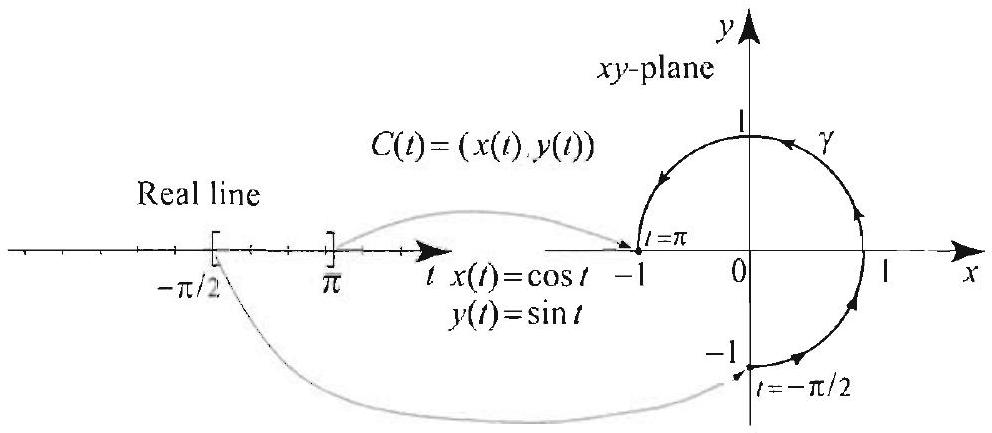
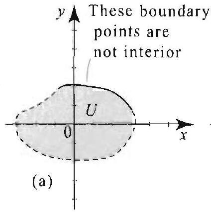
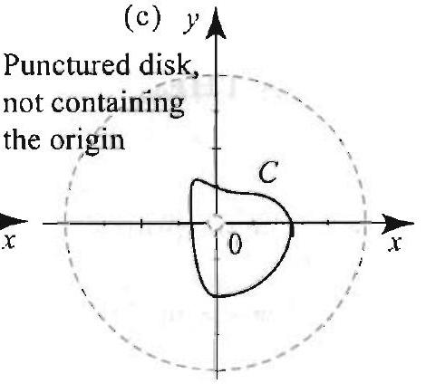
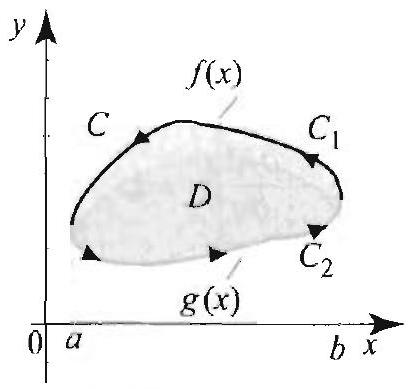
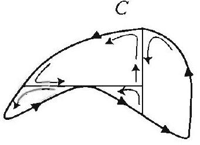
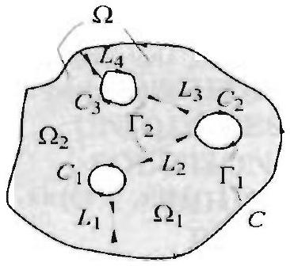
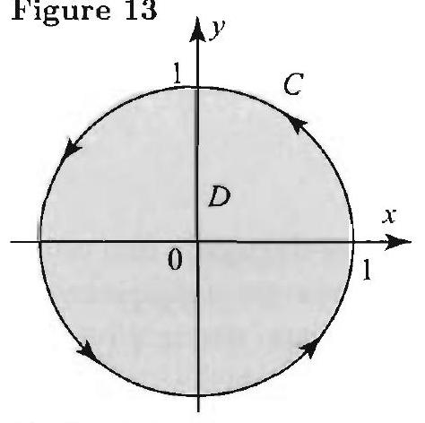

## Topics to Review

Green's theorem from calculus is required for this chapter. It is recalled and proved in Section 16.1. The chapter is intended to introduce methods for solving Laplace and Poisson equations. So Sections 3.8, 3.9, 4.4, and 7.5 are essential to appreciate this chapter. Sections 12.5 to 12.8 require familiarity with complex numbers and complex functions. The requisite material is included as a brief review in Section 16.5. Sections 16.5 and 16.6 can be covered independently of the rest of the chapter. Sections 16.7 and 16.8 are based on the preceding sections of the chapter.

## Looking Ahead . . .

In this chapter we introduce new tools for solving Dirichlet problems and Poisson equations: Green's functions, Neumann functions, and conformal mappings. Roughly speaking, Green's function for a given region $\Omega$ is a function that depends only on $\Omega$ and that can be used to solve any Dirichlet problem or Poisson problem on $\Omega$, in the same way that the Poisson kernel on the real line can be used to solve Dirichlet problems in the upper half-plane. A conformal mapping is like a change of variables that we can use to transform a Dirichlet problem from a given region onto another region on which the problem is simpler to solve, in the same way that a change of variables can be used to trasnform a difficult integral.

## 16

## GREEN'S FUNCTIONS AND CONFORMAL MAPPINGS

One cannot escape the feeling that these mathematical formulas have an independent existence and an intellignees of their own, that they are wiser that we are, wiser even than their discoverers, that we get more out of them than was originally put into them.

- HEINRICH HERTZ

The methods of this chapter are new, but the goal is still the same: to solve boundary value problems. To motivate the results of this chapter, review the Poisson integral formula in Section 7.5. Here we will derive similar formulas that solve the Dirichlet and Neumann problems on arbitrary (simply connected) regions in the plane. Like the Poisson integral, these formulas are packed with information about the solution.

In Sections 16.1 and 16.2, we start with Green's theorem from calculus and use simple tricks like integration by parts to clerive two identities, known as Green's first and second identities. We then apply these formulas to obtain important properties of solutions of Laplace's equation. In Section 16.3 we modify our formulas and introduce the amazing Green's functions. Simple manipulations with Green's functions yield formulas for the solutions of Dirichlet problems (Poisson integral-like formulas) and Poisson equations.

These remarkable formulas add to our understanding of properties of solutions of Dirichlet problems and, more important, they lead us to explore an important connection with the theory of analytic functions. Two major results are explored: the invariance of Laplace's equation by a change of variables using analytic functions (Section 16.6), and the composition of Green's functions with analytic functions (Section 16.7). The former yields the powerful method of conformal mappings, and the latter yields a nice way to compute Green's functions.

To simplify the presentation, we only discuss a sample of two dimensional problems. Many more types of problems can be treated in higher dimensions. We hope that this chapter will serve as a motivation to delve into the more advanced theories.

### 16.1 Green's Theorem and Identities

In this section, we prove Green's theorem and derive two identities, known as Green's first and second identities. We then derive several applications that give a flavor of the results of this chapter. We begin our discussion by reviewing basic definitions leading to the line integral.
Parametric Curves. Let $x=x(t)$ and $y=y(t)$ be continuous and piecewise smooth functions of $t$ on a closed interval $[a, b]$. The equations $x=x(t)$ and $y=y(t)$ are called parametric equations with parameter $t$. As $t$ varies over $[a, b]$, the point $(r(t), y(t))$ traces a parametric curve or simply a curve. It is sometimes convenient to set $C(t)=(x(t), y(t))$ and refer to the curve as the curve $C$. The point $(x(a), y(a))$ is called the initial point of $C$ and the point $(x(b), y(b))$ its terminal point. The curve is called closed if its terminal point is equal to its initial point; that is, $(x(a), y(a))=(x(b), y(b))$. In Figure 1 we show an arc of the unit circle parametrized by the equations $x(t)=\cos t$ and $y(t)=\sin t$, for $t$ in the interval $\left[-\frac{\pi}{2}, \pi\right]$.

Figure 1 The parametric interval $\left[-\frac{\pi}{2}, \pi\right]$ mapping to a circular are. Initial point ( $0,-1$ ), terminal point $(-1,0)$. To close the curve, we could use the interval $\left[-\frac{\pi}{2}, \frac{3 \pi}{2}\right]$.

Figure 2 Simple curves:
(a) positively oriented,
(b) negatively oriented.

Simple Curves. A closed curve is called simple if it does not intersect itself. That is, if $C$ is simple and $C\left(t_{1}\right)=C\left(t_{2}\right)$ for some $t_{1}<t_{2}$ in $[a, b]$, then $t_{1}=a$ and $t_{2}=b$. A simple curve is also known as a Jordan curve, after the French mathematician Camille Jordan (1838-1922). Jordan proved a famous theorem that states that a simple curve $C$ divides the plane into two regions: one bounded and interior to $C$, and one unbounded and exterior to $C$ (see Figure 2).

Orientation. Jordan's theorem allows us to define the orientation of a simple curve $C$. You are moving in the positive direction along $C$ if the interior region is to your left; otherwise. you are moving in the negative direction of $C$. We denote by $-C$ the reverse of $C$. It is the curve that is traversed in the opposite direction as $C$.
Open Sets and Regions. A subset $U$ of the plane is open if for every $\left(x_{0}, y_{0}\right)$ in $U$ there is an open disk $D$ centered at ( $x_{0}, y_{0}$ ) and contained entircly in $U$. In other words, $U$ is open if every point in $U$ is an interior point. Consequently, if $U$ is open, then it cannot contain any of its boundary points, since boundary points are not interior points (Figure 3). A subset
$S$ of the complex plane is called connected if any two points ( $x_{0}, y_{0}$ ) and ( $x_{1}, y_{1}$ ) in $S$ can be joined by a polygonal line segment that is entirely contained in $S$. (By a polygonal line we mean a curve formed by finitely many line segments joined end to end.) If a set is open and connected, then it is called a region.

## Figure 3

(a) Not open.
(b) Open, not connected.
(c) A region: Open and connected.

## Figure 4

(a) Simply connected.
(b) Multiply connected.
(c) Multiply connected.

In (b) and (c) we show a curve whose interior is not contained in the region.

Simply Connected Region. A region $D$ in the plane is called simply connected if the interior region of every simple curve in $D$ is also contained in $D$. Pictorially, $D$ is simply connected if it has no holes in it (Figure 4). A region that is not simply connected is called multiply connected.

Line Integral. If $C$ is a curve parametrized by $(x(t), y(t)), a \leq t \leq b$, and $f(x, y)$ is a continuous function on $C$, we define the line integral of $f$ over $C$ to be

$$
\int_{C} f(x, y) d s=\int_{a}^{b} f(x(t), y(t)) \sqrt{\left[x^{\prime}(t)\right]^{2}+\left[y^{\prime}(t)\right]^{2}} d t
$$

Two other integrals will be of interest:
and
(3)

$$
\int_{C} f(x, y) d x=\int_{a}^{b} f(x(t), y(t)) x^{\prime}(t) d t
$$

$$
\begin{aligned}
& \text { " } \\
& \text { L }
\end{aligned}
$$

## THEOREM 1 GREEN'S THEOREM

Figure 5 Area as a line integral in Example 1.

The line integral has many properties similar to the Riemann integral. We state some of these properties for the integral with $d x$. Similar identities hold for the integrals with $d y$ or $d s$. The integral is linear:

$$
\int_{C}(a f(x, y)+b g(x, y)) d x=a \int_{C} f(x . y) d x+b \int_{C} g(x, y) d x
$$

It is additive over curves: If $C$ is a curve made up of two curves $C_{1}$ and $C_{2}$, joined together end to end, then

$$
\int_{C} f(x, y) d x=\int_{C_{1}} f(x, y) d x+\int_{C_{2}} f(x, y) d x
$$

If $-C$ is the reverse of $C$, then

$$
\int_{-C} f(x, y) d x=-\int_{C} f(x, y) d x
$$

## Green's Theorem

Green's theorem is a striking result from the calculus of several variables that relates a line integral around a closed curve to a double integral over the region bounded by that curve.

Let $C$ be a positively oriented simple curve with interior region $D$. Let $M(x, y)$ and $N(x, y)$ be continuous functions with continuous first partial derivatives on $C$ and $D$. Then

$$
\int_{C}(M(x, y) d x+N(x, y) d y)=\iint_{D}\left(\frac{\partial N}{\partial x}-\frac{\partial M}{\partial y}\right) d x d y
$$

Let us illustrate the theorem with examples and relegate its proof to the end of this section.

## EXAMPLE 1 Area as a line integral

Let $C$ be a positively oriented simple curve and $D$ the region interior to $C$ (Figure 5). Then the area of $D$ is given by any one of the following three integrals:

$$
\int_{C}-y d x, \quad \int_{C} r d y, \quad \frac{1}{2} \int_{C}(-y d x+x d y)
$$

Solution For the first integral, apply Green's theorem with $M(x, y)=-y, N(x, y)= 0, M_{y}=-1$, and $N_{x}=0$, where we are using subscripts to denote partial derivatives. Then

$$
\int_{C}-y d x=\iint_{D} d x d y=\text { area of } D,
$$

as claimed. Similarly, applying Green's theorem with $M=0$ and $N=x$. we find that $\int_{C} x d y=\iint_{D} d x d y=$ area of $D$. Adding the first two intexrals in (5) and dividing by two, we find that the third integral is also equal to ulse area of $D$.

Figure 6 A typical multiply comected region: positively oriented outer curve, negatively oriented inner curve.

## EXAMPLE 2 Verifying Green's theorem

Let $C$ be the positively oriented unit circle, centered at the origin. Verify Grean's theorem with $M(x, y)=y^{2}$ and $N(x, y)=-x$.
Solution To do this problem, we compute the integrals on both sides of the identity (4) and show that they are equal. We have $M_{y}=2 y$, and $N_{x}=-1$, and (1) becomes

$$
\int_{C}\left(y^{2} d x-x d y\right) \cdots \iint_{D}(-1-2 y) d x d y
$$

To compute the line integral, we parametrize the circle by

$$
x(t)=\cos t, \quad y(t)=\sin t, \quad 0 \leq t \leq 2 \pi .
$$

Then $d x=-\sin t d t, d y=\cos t d t$, and the integral becomes

$$
\int_{C}\left(y^{2} d x-x d y\right)=-\int_{0}^{2 \pi}\left(\sin ^{3} t+\cos ^{2} t\right) d t=-\int_{-\pi}^{\pi}\left(\sin ^{3} t+\cos ^{2} t\right) d t
$$

where we have used Theorem 1, Section 2.1, to shift the interval of integration. Since $\sin ^{3} t$ is an odd function, its integral over a symmetric interval is 0 . Also,

$$
-\int_{-\pi}^{\pi} \cos ^{2} t d t=-\frac{1}{2} \int_{-\pi}^{\pi}(1+\cos 2 t) d t=-\pi
$$

Thus the value of the line integral is $-\pi$. To compute the double integral, because of the shape of the region, it is easier to use polar coordinates: $x=r \cos \theta, y=r \sin \theta$, $0 \leq \theta \leq 2 \pi, 0 \leq r \leq 1$, and $d x d y=r d r d \theta$. Then

$$
\begin{aligned}
\iint_{D}(-1-2 y) d x d y & =\int_{0}^{2 \pi} \int_{0}^{1}(-1-2 r \sin \theta) r d r d \theta \\
& =\int_{0}^{2 \pi}\left(-\frac{1}{2}-\frac{2}{3} \sin \theta\right) d \theta=-\pi
\end{aligned}
$$

Thus Green's theorem is verified. $\square$

## Multiply Connected Regions

For later applications, we will need a version of Green's theorem on multiply connected regions that are described as follows. Let $C$ be a simple closed curve and let $C_{1}, C_{2}, \ldots, C_{n}$ be simple closed curves. contained in the interior of $C$ and such that the interior regions of any two $C_{j}$ s have no common points. We also require that $C$ be positively oriented and all $C_{j} \mathrm{~s}$ be negatively oriented. Let $\Omega$ be the region interior to $C$ and exterior to $C_{1}$, $C_{2} \ldots, C_{n}$ (Figure 6). It will be convenient to refer to all the curves $C, C_{1}$, $C_{2}, \ldots, C_{n}$ collectively as the boundary of $\Omega$, and denote this boundary by $\Gamma$. Thus

$$
\int_{\Gamma} f(x, y) d x=\int_{C} f(x, y) d x+\sum_{j=1}^{n} \int_{C_{j}} f(x, y) d x
$$

## THEOREM 2 GREEN'S THEOREM FOR MULTIPLY CONNECTED REGIONS

Figure 7 for Example 3.

where $C_{j}$ are negatively oriented. A similar meaning is given to the integrals with $d y$ or $d s$.

Let $\Omega$ be a multiply connected region with boundary $\Gamma$, as just described. Suppose that $M(x, y)$ and $N(x, y)$ are continuous with continuous partial derivatives on $\Omega$ and $\Gamma$. Then

$$
\int_{\Gamma} M(x, y) d x+N(x, y) d y=\iint_{\Omega}\left(\frac{\partial N}{\partial x}-\frac{\partial M}{\partial y}\right) d x d y
$$

The proof is based on an interesting reduction to Theorem 1. (See the appendix of this section.)

## EXAMPLE 3 Green's theorem for multiply connected regions

Let $C$ be the positively oriented unit circle, centered at the origin, and let $C_{1}$ be the negatively oriented circle with center at the origin and radius $\frac{1}{2}$ (Figure 7). Evaluate

$$
I=\int_{C} \frac{y}{x^{2}+y^{2}} d x+\int_{C_{1}} \frac{y}{x^{2}+y^{2}} d x
$$

Solution Let $\Omega$ be the region bounded by $C$ and $C_{1}$. Applying (6) with $M=\frac{y}{x^{2}+y^{2}}$, $M_{y}=\frac{x^{2}-y^{2}}{\left(x^{2}+y^{2}\right)^{2}}, N=0$. and $N_{x}=0$, we find

$$
I=\iint_{\Omega} \frac{y^{2}-x^{2}}{\left(x^{2}+y^{2}\right)^{2}} d x d y
$$

where $\Omega$ is the annular region bounded by $C$ and $C_{1}$. Using polar coordinates: $x=r \cos \theta, y=r \sin \theta, 0 \leq \theta \leq 2 \pi, \frac{1}{2} \leq r \leq 1$, and $d x d y=r d r d \theta$, we get.

$$
\begin{aligned}
I=\iint_{\Omega} \frac{y^{2}-x^{2}}{\left(x^{2}+y^{2}\right)^{2}} d x d y & =\int_{0}^{2 \pi} \int_{\frac{1}{2}}^{1} \frac{r^{2}\left(\sin ^{2} \theta-\cos ^{2} \theta\right)}{r^{4}} r d r d \theta \\
& =\int_{0}^{2 \pi} \overbrace{\left(\sin ^{2} \theta-\cos ^{2} \theta\right)}^{-\cos 2 \theta} d \theta \int_{\frac{1}{2}}^{1} \frac{1}{r} d r \\
& =-\ln 2 \int_{0}^{2 \pi} \cos 2 \theta d \theta=0
\end{aligned}
$$

## Green's Identities

In solving Dirichlet and Neumann problems, we are asked to find a harmonic function inside a region $\Omega$, given its values or the values of its normal derivative on the boundary of $\Omega$. Green's theorem relates a line integral to a double integral, and so in a way it gives information about the values of a function inside a region from its values on the boundary of that region. Our goal in this chapter is to use Green's theorem in a very ingenious way and show how we can solve Dirichlet and Neumann problems using line integrals on the boundary. For this purpose, we derive two important formulas, known as Green's firsi and second identities.

## THEOREM 3 GREEN'S IDENTITIES

Figure 8 Example of the region in Theorem 3.

Let us recall the meaning of a normal derivative. If $u(x, y)$ is a function defined on a curve $C$, parametrized by $x(t)$ and $y(t)$, then the normal derivative of $u$, denoted $\frac{\partial u}{\partial n}$, is the directional derivative of $u$ in the direction of the unit normal vector:

$$
\frac{\partial u}{\partial n}=\nabla u \cdot n=\left(u_{x}, u_{y}\right) \cdot \frac{\left(y^{\prime}(t),-x^{\prime}(t)\right)}{\sqrt{\left[x^{\prime}(t)\right]^{2}+\left[y^{\prime}(t)\right]^{2}}},
$$

where in this expression we recognize the normal vector to the curve $C$ as the vector $\left(y^{\prime}(t),-x^{\prime}(t)\right)$ and its norm $\sqrt{\left[x^{\prime}(t)\right]^{2}+\left[y^{\prime}(t)\right]^{2}}$. Recalling the notation of (1), $d s=\sqrt{\left[x^{\prime}(t)\right]^{2}+\left[y^{\prime}(t)\right]^{2}} d t$, we have, for the points on the curve $C$,

$$
\begin{aligned}
\frac{\partial u}{\partial n} d s & =\left(u_{x}, u_{y}\right) \cdot\left(y^{\prime}(t),-x^{\prime}(t)\right) d t=u_{x} y^{\prime}(t) d t-u_{y} r^{\prime}(t) d t \\
& =-u_{y} d x+u_{x} d y
\end{aligned}
$$

We are now ready to state and prove two important identities.

Let $\Omega$ be a multiply connected region with boundary $\Gamma$, as described in Theorem 2 (Figure 8). (In particular, the outer curve is positively oriented and the inner curves are negatively oriented.) Let $u(x, y)$ and $v(x, y)$ have continuous second order partial derivatives on $\Omega$ and its boundary. Then we have Green's first identity

$$
\iint_{\Omega}\left(u \nabla^{2} v+\nabla u \cdot \nabla v\right) d x d y=\int_{\Gamma} u \frac{\partial v}{\partial n} d s
$$

## and Green's second identity

$$
\iint_{\Omega}\left(u \nabla^{2} v-v \nabla^{2} u\right) d x d y=\int_{\Gamma}\left(u \frac{\partial v}{\partial n}-v \frac{\partial u}{\partial n}\right) d s
$$

Proof Apply Green's theorem with $M(x, y)=-u v_{y}, N(x, y)=u v_{x}, M_{y}= -u_{y} v_{y}-u v_{y y} . N_{x}=u_{x} v_{x}+u v_{x x}$, and get

$$
\iint_{\Omega}\left(u\left(v_{x x}+v_{y y}\right)+\left(u_{x} v_{x}+u_{y} v_{y}\right)\right) d x d y=\int_{\Gamma} u\left(-v_{y} d x+v_{x} d y\right)
$$

The integral on the left is the same as the integral on the left of (9), and the integral on the right is the same as the integral on the right of (9), because of (8). So (9) holds. To prove (10), we reverse the roles of $u$ and $v$ in (9) and get

$$
\iint_{\Omega}\left(v \nabla^{2} u+\nabla u \cdot \nabla u\right) d x d y=\int_{\Gamma} v \frac{\partial u}{\partial n} d s
$$

Subtracting this from (9), we get (10).

## PROPOSITION 1

THEOREM 4 UNIQUENESS OF SOLUTION IN A DIRICHLET PROBLEM

## Applications to Boundary Value Problems

We now derive several interesting applications of Green's identities. In addition to their importance these applications give a flavor of the material of the remaining sections of this chapter.

EXAMPLE 4 Green's formula for the integral of the Laplacian
This formula states that if $v$ has continuous first and second-order partial derivatives in a simply or multiply connected region $\Omega$, as in Theorem 2, with boundary I', then

$$
\iint_{\Omega} \nabla^{2} v(x, y) d x d y=\int_{\Gamma} \frac{\partial v}{\partial n} d s .
$$

To prove this formula, simply take $u=1$ in Green's first identity.

## EXAMPLE 5 Compatibility condition in Neumann problems

Let $\Omega$ be a simply or multiply connected region as in Theorem 2, with boundary $\Gamma$. Suppose that $u$ is harmonic on $\Omega$; that is, $u$ has continuous first- and second-order partial derivatives in $\Omega$ and $u_{x x}+u_{y y}=0$ on $\Omega$. Then the normal derivative of $u$ must integrate to 0 along the boundary. That is, the boundary values of the normal derivative of a harmonic function $u$ cannot be arbitrary; they must satisfy the compatibility condition

$$
\int_{\Gamma^{-}} \frac{\partial u}{\partial n} d s=0
$$

To prove this fact, just take $v=1$ in Green's second identity.
For the remaining applications, we will need the following result, whose proof can be found in any book on vector calculus (or see [1], Section 2.1).

Suppose that $u(x, y)$ is a function defined on a region $\Omega$ such that $u_{x}(x, y)=$ 0 and $u_{y}(x, y)=0$ for all $(x, y)$ in $\Omega$. Then $u$ must be constant on $\Omega$.

We can now prove the uniqueness of the solution of the Dirichlet problem on a simply or multiply connected region $\Omega$.

Let $\Omega$ be a simply or multiply connected region with boundary $\Gamma$, as in Theorem 3. If $u_{1}$ and $u_{2}$ are harmonic functions on $\Omega$ and $u_{1}=u_{2}$ on the boundary $\Gamma$, then $u_{1}=u_{2}$ on $\Omega$.

Proof Let $u=u_{1}-u_{2}$. Then $u$ is harmonic on $\Omega$ and $u=0$ on $\Gamma$. We must show that $u$ is 0 on $\Omega$. Apply Green's first identity with $u=v$ and use the fact that $\nabla^{2} u=0$. We get

$$
\iint_{\Omega} \nabla u \cdot \nabla u d x d y=\int_{\Gamma} u \frac{\partial u}{\partial n} d s
$$

But $u=0$ on $\Gamma$ and $\nabla u \cdot \nabla u=u_{x}^{2}+u_{y}^{2}$, so

$$
\iint_{\Omega}\left(u_{x}^{2}+u_{y}^{2}\right) d x d y=0
$$

THEOREM 5 UNIQUENESS OF SOLUTION IN A NEUMANN PROBLEM

Figure 9 A standard curve $C$.

The only way for the integral of a nonnegative continuous function to be 0 is for this function to be identically 0 . Thus $u_{x}^{2}+u_{y}^{2}=0$, which in turn implies that $u_{x}=0$ and $u_{y}=0$ on $\Omega$. By Proposition 1, we conclude that $u$ is constant. But this constant has to be 0 on the boundary, so $u=0$ on $\Omega$. $\square$

In the preceding proof, we showed that if $u$ is harmonic on $\Omega$, then

$$
\iint_{\Omega}\left(u_{x}^{2}+u_{y}^{2}\right) d x d y=\int_{\Gamma} u \frac{\partial u}{\partial n} d s
$$

From this identity it follows that if $\frac{\partial u}{\partial n}=0$ on the boundary $\Gamma$, then

$$
\iint_{\Omega}\left(u_{x}^{2}+u_{y}^{2}\right) d x d y=0
$$

and as we argued previously, we conclude that $u=C$ on $\Omega$. Thus, as in Theorem 4, it follows that the solution of a Neumann problem is unique up to an additive constant.

Let $\Omega$ be a simply or multiply connected region as in Theorem 3, with boundary $\Gamma$. If $u_{1}$ and $u_{2}$ are harmonic functions on $\Omega$ and $\frac{\partial u_{1}}{\partial n}=\frac{\partial u_{2}}{\partial n}$ on the boundary $\Gamma$, then $u_{1}=u_{2}+C$ on $\Omega$.

Further applications of Green's identities to Dirichlet and Neumann problems will be represented in the next sections.

## Appendix: Proofs of Theorems 1 and 2

We will prove Theorem 1 in the case where the simple curve $C$ is a smooth standard curve, where by standard curve we mean that no vertical or horizontal line can intersect $C$ in more than two points. We then indicate how to extend this result to more general situations.

As illustrated by Figure 9, given a standard curve $C$, we can find an interval $[a, b]$ and two differentiable functions $f(x)$ and $g(x)$ on $[a, b]$. such that $C$ is composed of a top portion $C_{1}$, which consists of the graph of $f(x)$, and a bottom portion $C_{2}$, which consists of the graph of $g(x)$. Since $C$ is positively oriented, the reverse of $C_{1}$ is parametrized by ( $x . f(x)$ ), as $x$ runs from $a$ to $b$; while $C_{2}$ is parametrized by $(x, g(x))$, as $x$ runs from $a$ to $b$. So, for example,

$$
-\int_{C_{1}} M(x, y) d x=\int_{a}^{b} M(x, f(x)) d x ; \text { and } \int_{C_{2}} M(x, y) d x=\int_{a}^{b} M(x, g(x)) d x
$$

Also, if $D$ is the interior of $C$, then

$$
\begin{aligned}
\iint_{D} \frac{\partial M}{\partial y} d x d y & =\iint_{D} \frac{\partial M}{\partial y} d y d x=\int_{a}^{b}\left[\int_{g(x)}^{f(x)} \frac{\partial M}{\partial y} d y\right] d x \\
& =\int_{a}^{b}(M(x, f(x))-M \Gamma(x, g(x))) d x \\
& =-\int_{C_{1}} M(x, y) d x-\int_{C^{a}} M(x, y) d x=-\int_{C} M(x, y) d x
\end{aligned}
$$

Figure 10

Figure 11 Each polygonal path $L_{j}$ is traversed in both directions, so the integral over $L_{y}$ is 0 .

In a similar way, we can show that

$$
\iint_{D} \frac{\partial N}{\partial x} d x d y=\int_{C} N(x, y) d y,
$$

and Green's theorem follows in this case upon subtracting the last two equations. For an arbitrary simple curve $C$ ' we divide the region inside $C$ into regions with boundaries consisting of positively oriented standard curves. Let $C_{j}$, $j=1,2, \ldots, n$, denote the resulting boundary curves, and let $D_{j}$ denote the region inside $C_{j}$. This construction is illustrated in Figure 10 with $n=4$. Each curve consists of portions of the curve $C$ and portions not on $C^{\prime}$. The portions on $C$ are traversed once in the positive direction, while the portions not on $C$ are traversed twice in opposite direction. As a result, the sum of the integrals over all $C_{j}$ add up to the integral over $C$, since the integrals over the portions not on $C$ cancel out. Applying the version of Green's theorem for standard curves and then adding the integrals, we get

$$
\sum_{j=1}^{\prime \prime} \int_{C_{j}}(M(x . y) d x+N(x, y) d y)=\sum_{j=1}^{n} \iint_{D_{j}}\left(\frac{\partial N}{\partial x}-\frac{\partial M}{\partial y}\right) d x d y .
$$

But, as we just argued, the left side equals $\int_{C}(M(x, y) d x+N(x, y) d y)$, and the right side equals $\iint_{D}\left(\frac{\partial N}{\partial x}-\frac{\partial M}{\partial y}\right) d x d y$, because the $D_{j}$ 's are disjoint and cover $D$. Thus Green's theorem holds in this case.

The proof of Green's theorem for multiply connected regions (Theorem 2) follows from the version for simply connected regions, using ideas similar to those in the proof of Theorem 1. Recall that we have a region $\Omega$ with boundary $\Gamma$ consisting of an exterior curve $C$ and interior curves $C_{j}(j=1.2 \ldots, n)$. Join the outer curve $C$ to $C_{1}$ using a polygonal curve $L_{1}$ traversed in two opposite directions. Join $C_{1}$ to $C_{2}$ by a similar polygonal curve $L_{2}$. Continue in this fashion, joining the curve $C_{j}$ to the curve $C_{j+1}$ by a polygonal curve $L_{j+1}$ traversed in two opposite directions and finally join $C_{n}$ to $C$ by a polygonal curve $L_{n+1}$ traversed in two opposite directions. This construction yields two simple closed curves $\Gamma_{1}$ and $\Gamma_{2}$, as illustrated in Figure 11. Let $\Omega_{j}$ denote the region interior to $\Gamma_{j}(j=1,2)$. Apply Theorem 1 on the curves $\Gamma_{1}$ and $I_{2}$ and add the results:

$$
\begin{aligned}
\sum_{j=1}^{2} \int_{\Gamma_{j}}(M(x, y) d x+N(x, y) d y) & =\sum_{j=1}^{2} \iint_{\Omega_{j}}\left(\frac{\partial N}{\partial x}-\frac{\partial M}{\partial y}\right) d x d y \\
& =\iint_{D}\left(\frac{\partial N}{\partial x}-\frac{\partial M}{\partial y}\right) d x d y
\end{aligned}
$$

But the integrals over the polygonal portions $L_{j}$ cancel out because these portions are traversed in opposite direction. As a result, the left side adds up to $\int_{\Gamma}(M(x, y) d x+N(x, y) d y)$, and Theorem 2 follows.

Figure 12

Figure 14

Figure 15

## Exercises 12.1

In Exercises 1-4, verify Green's theorem for the given functions $M$ and $N$ and curve $C$. That is, compute both sides of (4) and show that they are equal.

1. $M=x y, N=y, C$ as in Figure 12.
2. $M=x^{2} y, N=x+y, C$ as in Figure 12.
3. $M=x-y, N=y^{2}, C$ as in Figure 13.
4. $M=x^{2}-y^{2}, N=2 x y . C$ as in Figure 14.

In Exercises 5-8, verify Green's theorem (Theorem 2) for the given functions M and $N$, where the curve $\Gamma$, shown in Figure 15, consists of the two rircles $C_{1}$ and $C_{2}$.
5. $M=0, N=x$.
6. $M=-y, N=x$.
7. $M=\frac{-y}{x^{2}+y^{2}}, N=\frac{x}{x^{2}+y^{2}}$.
8. $M=\frac{1}{x^{2}+y^{2}}, N=0$.

In Exercises 9-12, use Green's identities to evaluate the given integral.
9. $\int_{C} y \frac{\partial x}{\partial n} d s$, where $C$ is as in Figure 12.
10. $\int_{C} \frac{\partial f}{\partial n} d s$, where $f(x, y)=x^{2}-2 x+y^{2}$ and $C$ is as in Figure 12.
11. $\int_{C}(x+y) \frac{\partial f}{\partial n} d s$, where $f(x, y)=c^{r} \cos y$ and $C$ is as in Figure 12.
12. $\int_{C} x \frac{\partial f}{\partial n} d s$, where $f(x, y)=\ln \left(x^{2}+y^{2}\right)$ and $C$ is as in Figure 15.
13. Area of multiply connected regions. Let $\Omega$ and $\Gamma$ be as in Theorem 2 . Show that the area of $\Omega$ is given by any one of the integrals

$$
\int_{\Gamma}-y d x, \quad \int_{\Gamma} x d y, \quad \frac{1}{2} \int_{\Gamma}(-y d x+x d y)
$$

14. Let $C$ be any positively oriented simple curve enclosing the origin. Compute

$$
\int_{C} \frac{-y d x+x d y}{x^{2}+y^{2}}
$$

[Hint: Let $C_{r}$ be a negatively oriented circle around the origin, contained in $C$. Apply Theorem 2.]
15. In the notation of Theorem 3, suppose that $u$ is harmonic and $v=0$ on $\Gamma$. Show that

$$
\iint_{\Omega} \nabla u \cdot \nabla v d x d y=0
$$

16. In the notation of Theorem 2. suppose that $y$ is harmonic on $\Omega$. Show that

$$
\int_{\Gamma}\left(\frac{\partial u}{\partial y} d x-\frac{\partial u}{\partial x} d y\right)=0
$$

Figure 16 The hypocycloid in Exercise 18:
$x(t)=a \cos ^{3} t, y(t)=a \sin ^{3} t$, $0 \leq t \leq 2 \pi$.

17. Express the area of the ellipse $\frac{x^{2}}{a^{2}}+\frac{y^{2}}{b^{2}}=1$ as a line integral and then find the area. [Hint: Use one of the integrals in Example 1.]
18. Express the area of the hypocycloid $x^{\frac{2}{3}}+y^{\frac{2}{3}}=a^{\frac{2}{3}}$ as a line integral and then find the area (Figure 16). [Hint: Use the 3rd integral in (5).]
19. Consider the Neumann problem in polar coordinates: $\nabla^{2} u=0$ on the unit disk and $\frac{\partial u}{\partial r}(1, \theta)=\sin \theta$ if $0 \leq \theta \leq \pi$ and 0 if $\pi \leq \theta \leq 2 \pi$. Does the problem have a solution? Explain your answer.
20. Project Problem: Dirichlet's Principle. Let $\Omega$ be a simply or multiply connected region with boundary $\Gamma$, as in Theorem 3. Let $h(x, y)$ be defined for ( $x, y$ ) on $\Gamma$, and let $u(x, y)$ denote the (unique) solution of the Dirichlet problem $\nabla^{2} u=0$ on $\Omega$ and $u=h$ on $\Gamma$. The energy of a function $\phi$ defined on $\Omega$ is the nonnegative number

$$
E(\phi)=\frac{1}{2} \iint_{\Omega}|\nabla \phi|^{2} d x d y
$$

where $\nabla \phi=\left(\phi_{x}, \phi_{y}\right)$ is the gradient of 0 . Dirichlet's principle states that of all functions $v(x, y)$ on $\Omega$ that satisfy the Dirichlet boundary condition $v=h$ on $\Gamma$, the one that minimizes the energy integral is the harmonic function $u$. That is, if $v=h$ on $\Gamma$, then $E(v) \geq E(u)$. Follow the outlined steps to prove the principle.
(a) Write $v=u+(v-u)=u+u$, where $w=0$ on l'. Show that $|\nabla v|^{2}= |\nabla u|^{2}+2 \nabla u \cdot \nabla w+|\nabla w|^{2}$.
(b) With the help of Exercise 15, show that $E(v)=E(u)+E(u)$. Since $E(w) \geq 0$, conclude that $E(v) \geq E(u)$.
