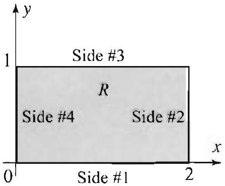
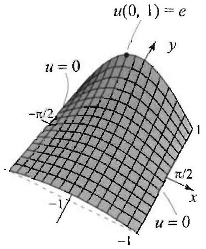

### 16.2 Harmonic Functions and Green's Identities

In this section, we derive several classical properties of harmonic functions, including Gauss's mean value property, and the maximum and minimum modulus principles. These important results follow from straightforward applications of Green's identities (Section 16.1) using the logarithmic function. For this reason, we start with two simple but very useful properties of the logarithm.

## PROPOSITION 1 NORMAL DERIVATIVE OF THE LOGARITHM

| For $(x, y) \neq\left(x_{0}, y_{0}\right)$ let |
| :--- |
| $\qquad v(x, y)=\frac{1}{2} \ln \left(\left(x-x_{0}\right)^{2}+\left(y-y_{0}\right)^{2}\right)$. |
| Let $C_{r}$ be a positively oriented circle with center $\left(x_{0}, y_{0}\right)$ and radius $r>0$ |
| (Figure 1). Then |
| $\qquad \frac{\partial v}{\partial n}(x, y)=\frac{1}{r}$ for all $(x, y)$ on $C_{r}$. |

Proof Parametrize $C_{r}$ by $x(t)=x_{0}+r \cos t, y(t)=y_{0}+r \sin t, 0 \leq t \leq 2 \pi$; then $x^{\prime}(t)=-r \sin t$ and $y^{\prime}(t)=r \cos t, \sqrt{\left[x^{\prime}(t)\right]^{2}+\left[y^{\prime}(t)\right]^{2}}=r$. So the unit normal

Figure 1 The circle $C_{r}$.

## PROPOSITION 2 HARMONICITY OF THE LOGARITHM

THEOREM 1 GAUSS'S MEAN VALUE PROPERTY

Figure 2 The circle $C_{r}$ and its interior region are contained in $\Omega$, for all $0 \leq r<a$.

vector on $C_{r}$ is $\frac{1}{r}(r \cos t, r \sin t)=(\cos t$. $\sin t)$. We have

$$
v_{x}=\frac{x-x_{0}}{\left(x-x_{0}\right)^{2}+\left(y-y_{0}\right)^{2}} \quad \text { and } \quad v_{y}=\frac{y-y_{0}}{\left(x-x_{0}\right)^{2}+\left(y-y_{0}\right)^{2}} .
$$

For $(x, y)$ on $C_{r}$, we have

$$
\begin{aligned}
\frac{\partial v}{\partial n}(x, y) & =\left.\left(v_{x}, v_{y}\right) \cdot(\cos t, \sin t)\right|_{x=x_{0}+r \cos t, y=y_{0}+r \sin t} \\
& =\left(\frac{r \cos t}{r^{2}\left(\cos ^{2} t+\sin ^{2} t\right)}, \frac{r \sin t}{r 2\left(\cos ^{2} t+\sin ^{2} t\right)}\right) \cdot(\cos t, \sin t)=\frac{1}{r}
\end{aligned}
$$

as claimed.
The following property was used several times previously.
The function $v(x, y)=\frac{1}{2} \ln \left(\left(x-x_{0}\right)^{2}+\left(y-y_{0}\right)^{2}\right)$ is harmonic at all points $(x, y) \neq\left(x_{0}, y_{0}\right)$.

Proof A quick way to see this is to realize that $v$ is the translate of $\frac{1}{2} \ln \left(x^{2}+y^{2}\right)= \ln r$. Using the polar form of the Laplacian, $\nabla^{2} f=f_{r r}+(1 / r) f_{r}+\left(1 / r^{2}\right) f_{00}$. it follows that $\ln r$ satisfies Laplaces equation for $r \neq 0$. Hence its translate $v(x, y)$ satisfies Laplaces equation for $(x, y) \neq\left(x_{0}, y_{0}\right)$.
We can now prove Gauss's mean value property of harmonic functions. This property says that the value of a harmonic function $u$ at any point ( $x_{0}, y_{0}$ ) is equal to the average value of $u$ over any circle centered around $\left(x_{0}, y_{0}\right)$.

Suppose that $u$ is harmonic on a region $\Omega$. Let $\left(x_{0}, y_{0}\right)$ be any point in $\Omega$ and $r>0$ be any real number such that the closed disk of radius $r>0$ centered at ( $x_{0}, y_{0}$ ) is contained in $\Omega$ (Figure 2). Then

$$
u\left(x_{0} \cdot y_{0}\right)=\frac{1}{2 \pi} \int_{0}^{2 \pi} u\left(x_{0}+r \cos t, y_{0}+r \sin t\right) d t
$$

A function satisfying (1) at all points in $\Omega$ is said to have the mean value property in $\Omega$.

Proof Consider the following function of $r \geq 0$,

$$
\phi(r)=\frac{1}{2 \pi} \int_{0}^{2 \pi} u\left(x_{0}+r \cos t . y_{0}+r \sin t\right) d t
$$

where $r$ is in a small interval, say $[0, a]$, such that the disk of radius $r=a$ with center at ( $x_{0} . y_{0}$ ) is contained in $\Omega$. For $r>0, \phi(r)$ is equal to the average value of $u$ on $C_{r}$, the circle of radius $r$ and center ( $x_{0}, y_{0}$ ). And. for $r=0$,

$$
\phi(0)=\frac{1}{2 \pi} \int_{0}^{2 \pi} u\left(x_{0}, y_{0}\right) d t=u\left(x_{0}, y_{0}\right)
$$

Figure 3 The boundary $\Gamma_{r_{1}, r_{2}}$ consists of $C_{r_{1}}$ and $C_{r_{2}}$.

Because $\phi$ is the integral of the continuous function $u$, it is itself a continuous function of $r$ on $[0, a]$. Our goal is to show that $\phi$ is in fact constant. From this it will follow that $\phi(r)=\phi(0)=u\left(x_{0}, y_{0}\right)$, which is what the theorem asserts.

It is enough to show that $\phi\left(r_{1}\right)=\phi\left(r_{2}\right)$ for all $0<r_{1}<r_{2} \leq a$. Then, by continuity of $\phi$, the equality $\phi\left(r_{1}\right)=\phi\left(r_{2}\right)$ will hold if $0 \leq r_{1}<r_{2} \leq a$. The proof uses Green's identities and properties of the logarithm in a nice way. Parametrize $C^{\prime}$, by $x(t)=x_{0}+r \cos t, y(t)=y_{0}+r \sin t, 0 \leq t \leq 2 \pi, d s=r d t$. Then the right side of (1) becomes

$$
\phi(r)=\frac{1}{2 \pi} \int_{0}^{2 \pi} u\left(x_{0}+r \cos t, y_{0}+r \sin t\right) d t=\frac{1}{2 \pi r} \int_{C_{r}} u d s
$$

Thus, to show that $\phi\left(r_{1}\right)=\omega\left(r_{2}\right)$ for any $0<r_{1}<r_{2} \leq a$, it is enough to show that

$$
\frac{1}{r_{2}} \int_{C_{r_{2}}} u d s-\frac{1}{r_{1}} \int_{C_{r_{1}}} u d s=0
$$

where $C_{r_{1}}$ and $C_{r_{2}}$ are circles centered at ( $x_{0}, y_{0}$ ) with radii $r_{1}$ and $r_{2}$, respectively. Using the result of Proposition 1, we find that on $C_{r_{1}}$

$$
\frac{1}{r_{1}} \int_{C_{r_{1}}} u d s=\int_{C_{r_{1}}} u \frac{\partial v}{\partial n} d s
$$

where $v=\frac{1}{2} \ln \left(\left(x-x_{0}\right)^{2}+\left(y-y_{0}\right)^{2}\right)$. Similarly, on $C_{r_{2}}$,

$$
\frac{1}{r_{2}} \int_{C_{r_{2}}} u d s=\int_{C_{r_{2}}} u \frac{\partial u}{\partial n} d s
$$

Hence

$$
\phi\left(r_{2}\right)-\phi\left(r_{1}\right)=\int_{C_{r_{2}}} u \frac{\partial v}{\partial n} d s-\int_{C_{r_{1}}} u \frac{\partial v}{\partial n} d s=\int_{\Gamma_{r_{1}, r_{2}}} u \frac{\partial v}{\partial n} d s
$$

where $\Gamma_{r_{1}, r_{2}}$ is the boundary of the annular region $\Omega_{r_{1}, r_{2}}$ that consists of the inner negatively oriented circle $C_{r_{1}}$ and the outer positively oriented circle $C_{r_{2}}$ (Figure 3). Since both $u$ and $v$ are harmonic in $\Omega_{r_{1}, r_{2}}$, it follows from Green's second identity that

$$
\int_{\Gamma_{r_{1}, r_{2}}} u \frac{\partial v}{\partial n} d s=\int_{\Gamma_{r_{1}, r_{2}}} v \frac{\partial u}{\partial n} d s
$$

because the left side of Green's identity is 0 in this case. Now using the fact that $v=\ln r_{1}$ on $C_{r_{1}}$ and $v=\ln r_{2}$ on $C_{r_{2}}$, we get

$$
\begin{aligned}
\int_{\Gamma_{r_{1}, r_{2}}} v \frac{\partial u}{\partial n} d s & =\int_{C_{r_{2}}} v \frac{\partial u}{\partial n} d s-\int_{C_{r_{1}}} v \frac{\partial u}{\partial n} d s \\
& =\ln \left(r_{2}\right) \overbrace{\int_{C_{r_{2}}} \frac{\partial u}{\partial n} d s}^{=0}-\ln \left(r_{1}\right) \overbrace{\int_{C_{r_{1}}} \frac{\partial u}{\partial n} d s}^{=0}=0
\end{aligned}
$$

because of the compatibility condition for harmonic functions (Example 5, Section 16.1). Thus $\phi\left(r_{2}\right)-\phi\left(r_{1}\right)=0$, as desired.

THEOREM 2
MAXIMUMMINIMUM PRINCIPLE

It can be shown that the converse of Gauss's mean value property is also true, in the following sense. Suppose that $u(x, y)$ has continuous first and second partial derivatives in a region $\Omega$ and $u$ satisfies the mean value property at all points in $\Omega$, then $u$ is harmonic on $\Omega$.

The mean value property has important consequences, such as the maximum and minimum modulus principles that we prove later in this section. Let us now show an interesting application to the evaluation of certain definite integrals.

## EXAMPLE 1 Applying the mean value property

(a) Verify that $u(x, y)=e^{y} \cos x$ is harmonic for all $(x, y)$.
(b) Show that

$$
\frac{1}{2 \pi} \int_{0}^{2 \pi}, \sin t \cos (\cos t) d t=1
$$

(c) More generally, show that for any real numbers $a$ and $b$

$$
\frac{1}{2 \pi} \int_{0}^{2 \pi} e^{b+\sin t} \cos (a+\cos t) d t=e^{b} \cos a
$$

Solution (a) This part is straightforward:

$$
u_{x x}=-e^{y} \cos x, \quad u_{y y}=e^{y} \cos x
$$

Hence $u_{x, r}+u_{y y}=0$ and the function is harmonic for all ( $x, y$ ). To do part (b), we use the mean value property of $u$ at the origin:

$$
u(0,0)=\frac{1}{2 \pi} \int_{0}^{2 \pi} u(\cos t \cdot \sin t) d t-\frac{1}{2 \pi} \int_{0}^{2 \pi} e^{\sin t} \cos (\cos t) d t
$$

But $u(0,0)=1$ and so (b) holds. To prove (c), we apply the mean value property at the point ( $a, b$ ). Then

$$
\begin{aligned}
e^{b} \cos a & =u(a . b)=\frac{1}{2 \pi} \int_{0}^{2 \pi} u(a+\cos t, b+\sin t) d t \\
& =\frac{1}{2 \pi} \int_{0}^{2 \pi} e^{b+\sin t} \cos (a+\cos t) d t
\end{aligned}
$$

as claimed.
We next prove an important property of harmonic functions.
Let $\Omega$ be a region and $u$ a harmonic function on $\Omega$. If $u$ attains a maximum or a minimum inside $\Omega$, then $u$ is constant on $\Omega$.

If the region $\Omega$ is not bounded, the function $u$ need not attain a maximum or a minimum anywhere inside $\Omega$ or on its boundary. For example. $u(x . y)=x y$ is harmonic in the upper half-plane $\Omega$. It is clear that $u$ takes on arbitrarily large and arbitrarily small values as $(x, y)$ ranges in $\Omega$. So $u$ does not have

## COROLLARY 1

Figure 4 The rectangle in Example 2.

Figure 5 Maximum and minimum values of a harmonic function.

a maximum or minimum value. However, if $\Omega$ is bounded and u is harmonic on $\Omega$ and continuous on its boundary, then it must attain its maximum and minimum values, by a well-known property of continuous functions on closed and bounded sets. Since these values cannot be attained inside $\Omega$ unless $u$ is constant, we obtain the following useful fact.

Let $\Omega$ be a bounded region and $u$ a harmonic function on $\Omega$. such that $u$ is continuous on the boundary of $\Omega$. Then $u$ attains its maximum value $M$ and its minimum value $m$ on the boundary of $\Omega$. Moreover, either $u$ is constant on $\Omega$ or $m<u(x, y)<M$ for all $(x, y)$ in $\Omega$.

Using Corollary 1, you can give an alternative proof of the uniqueness of the solution of a Dirichlet problem on a bounded region (Theorem 4, Section 16.1). We next illustrate the applications of Corollary 1 and then prove Theorem 2.

## EXAMPLE 2 Applying the maximum-minimum modulus principle Find the maximum and minimum values of $u(x, y)=x^{2}-y^{2}$ for $(x, y)$ in the rectangular region $R$ in Figure 1. where $0 \leq x \leq 2$ and $0 \leq y \leq 1$.

Solution It is straightforward to check that $u$ is harmonic for all ( $. x, y$ ). By Corollary 1, its maximum and minimum values occur on the boundary. Label the sides of $R$ as shown in Figure 4, and let $m_{j}$, respectively $M_{j}$, denote the minimum, respectively maximum, value of $u$ on side $\# j$.
On side \#1, we have $y=0$ and $0 \leq x \leq 2$. So $u(x, y)=x^{2}$, and since $0 \leq x \leq 2$, it follows that $m_{1}=0$ and $M_{1}=4$.
On side \#2, we have $x=2$ and $0 \leq y \leq 1$. So $u(x . y)=4-y^{2}$. and since $0 \leq y \leq 1$, it follows that $n_{2}=3$ and $M_{2}=4$.
On side \#3, we have $y=1$ and $0 \leq x \leq 2$. So $u(x, y)=x^{2}-1, m_{3}=-1$ and $\Lambda_{1}=3$.
On side \#4, we have $x=0$ and $0 \leq y \leq 1$. So $u(x, y)=-y^{2}, m_{4}=-1$ and $M_{4}=0$.
By comparison, we lind the smallest value of $u$ on the boundary to be $m \leq m_{3}= m_{4}=-1$. Note that $m_{3}$ and $m_{4}$ correspond to the value of $u$ at the same point $(0,1)$. Similarly the largest value of $u$ on the boundary is $M=M_{1}=M_{2}=4$, and it occurs at the point ( 2,1$)$ ). In conclusion, the maximum and minimum values of $u$ are attained at two points on the boundary. At all points inside $R$, we have

$$
-1<u(x, y)<4,
$$

as guaranteed by Corollary I (Figure 5).

## EXAMPLE 3 Applying the maximum-minimum modulus principle

Find the maximum and minimum values of $u(x, y)=e^{y} \cos x$ for ( $x, y$ ) in the rectangular region $R$, where $-\frac{\pi}{2} \leq x \leq \frac{\pi}{2}$ and $-1 \leq y \leq 1$.
Solution From Example 1, we know that $u$ is harmonic for all $(x, y)$. We thus look for the maximum and minimum values of $u$ on the boundary. Label the sides as in Figure 4, and let $m_{j}$, respectively $M_{j}$, denote the minimum, respectively maximum. value of $u$ on side $\# j$.

Figure 6 Maximum and minimum values of a harmonic function.

Figure 7 Covering the polygonal line with finitely many disks in $\Omega$ (here $n=8$ ).

On side \#1, we have $y=-1$ and $-\frac{\pi}{2} \leq x \leq \frac{\pi}{2}$. So $u(x, y)=e^{-1} \cos x$, and it follows that $m_{1}=0$ and $M_{1}=e^{-1}$, because $0 \leq \cos x \leq 1$ for $-\frac{\pi}{2} \leq x \leq \frac{\pi}{2}$.
On sides \#2 and 4, we have $x= \pm \frac{\pi}{2}, \cos x=0$; consequently, $u=0$ on sides \#2 and 4 , and so $m_{2}=M_{2}=m_{4}=M_{4}=0$.
On side $\# 3$, we have $y=1$, hence $u(x, y)=e \cos x$, where $-\frac{\pi}{2} \leq x \leq \frac{\pi}{2}$; and so $m_{3}=0$ and $M_{3}=e$. Comparing the values on the boundary, we find the smallest value of $u$ to be 0 and the largest one to be $e$. At all points inside $R$, we have

$$
0<v(x, y)<e
$$

Unlike the situation in Example 2, here the minimum value is attained at infinitely many points on the boundary, namely on the sides $\# 2$ and 4 . The maximum value $e$ is attained at one point on the boundary ( 0,1 ) (Figure 6).

Proof of Theorem 2. It is enough to prove the statement of the theorem concerning the inaximum of $u$. Then, if we let $v=-u$, we have that $v$ is harmonic and a minimum value of $u$ corresponds to a maximum value of $v$. So suppose that $u$ attains a maximum value at ( $x_{0}, y_{0}$ ) in $\Omega$, and let us prove in two steps that $u$ must be constant on $\Omega$. In a first step, we show that $u$ is constant in the largest disk that you can place around ( $x_{0}, y_{0}$ ) in $\Omega$. Then, using this fact, we show in the second step that $u$ must be constant on $\Omega$.
Step 1: Let $C_{r}$ be any positively oriented circle in $\Omega$, with center at ( $x_{0}, y_{0}$ ). By assumption $M=u\left(x_{0}, y_{0}\right) \geq u(x, y)$ for all $(x, y)$ in $\Omega$. By the mean value theorem, we have

$$
M=u\left(x_{0}, y_{0}\right)=\frac{1}{2 \pi} \int_{0}^{2 \pi} u\left(x_{0}+r \cos t, y_{0}+r \sin t\right) d t
$$

Consider the continuous function $f(t)=u\left(x_{0}+r \cos t, y_{0}+r \sin t\right)$ for $t$ in $[0,2 \pi]$. Since $M \geq u(x, y)$, we have $f(t) \leq M$ for all $t$ in $[0,2 \pi]$. Also, the average of $f$ on the interval $[0,2 \pi]$ is equal to $M$. The only way that this can happen is for $f(t)=M$ for all $t$ in $[0,2 \pi]$ (sec Exercise 12). Thus $M \cdots u\left(x_{0}+r \cos t, y_{0}+r \sin t\right)$ for all $t$ in $[0,2 \pi]$, which shows that $u$ is constant and equal to $u\left(x_{0}, y_{0}\right)$ on $C_{r}$. Since $r$ is arbitrary, it follows that $u$ is constant and equal to $u\left(x_{0}, y_{0}\right)$ on any circle that you can fit around ( $x_{0}, y_{0}$ ) in $\Omega$, which establishes the first part of the proof.

Step 2: Let $(x, y)$ be any point in $\Omega$. Join $\left(x_{0}, y_{0}\right)$ to $(x, y)$ using a polygonal line. Cover the polygonal line by finitely many overlapping disks, $S_{0}, S_{1}, \ldots, S_{n}$, with $S_{0}$ centered at $\left(x_{0}, y_{0}\right)$, and $S_{j}$ centered at $\left(x_{j}, y_{j}\right)$, the point of intersection of $S_{j-1}$ and the polygonal line (Figure 7). (The fact that you can cover the polygonal line with finitely many disks as described is not obvious in general, but it is true because the polygonal line is closed and bounded.) The function $u$ is constant and equals the maximum value $M$ on $S_{0}$. By continuity of $u$, it follows that $u\left(x_{1}, y_{1}\right)=M$. By the previous step, it follows that $u$ is constant in the largest disk that you fit around $\left(x_{1}, y_{1}\right)$. Hence $u$ is constant and equals $M$ in $S_{1}$. Continue in this fashion to conclude that $u$ is constant and equals $M$ in $S_{2}, \ldots, S_{n}$. Thus $u(x, y)=M$, and since ( $x . y$ ) is arbitrary it follows that $u$ is constant in $\Omega$.

## Exercises 12.2

In Exercises 1-4, identify each integral as the mean value of a harmonic function at a point and then evaluate the integral using Theorem 1.

1. $\frac{1}{2 \pi} \int_{0}^{2 \pi} e^{\cos t} \cos (\sin t) d t$.
2. $\frac{1}{2 \pi} \int_{0}^{2 \pi}(3+\cos t)(1+\sin t) d t$.
3. $\frac{1}{2 \pi} \int_{0}^{2 \pi} \cos (1+\cos t) \cosh (2+\sin t) d t$.
4. $\frac{1}{2 \pi} \int_{0}^{2 \pi} \sin (1+\cos t) \sinh (2+\sin t) d t$.

In Exercists 5-8, show that $u$ is harmonic on the given region; find its maximum and minimum values; and determine where they occur in that region.
5. $u(x, y)=x^{2}-y^{2}+x y$, for $0 \leq x \leq 1,0 \leq y \leq 1$.
6. $u(. x . y)=e^{x} \cos y$, for $0 \leq x \leq 1,-\pi \leq y \leq \pi$.
7. $u(x, y)=\frac{x}{x^{2}+y^{2}}$, where $(x, y)$ belongs to the annular region $1 \leq x^{2}+y^{2} \leq 4$.
8. $u(x, y)=x y$, where $(x, y)$ belongs to the annular region $1 \leq x^{2}+y^{2} \leq 4$.
9. Let $\Omega$ be a bounded region with boundary $\Gamma$. Show that if $u$ is harmonic on $\Omega$ and $u=0$ on $\Gamma$, then $u=0$ on $\Omega$.
10. Let $\Omega$ be a bounded region with boundary $\Gamma$. Show that if $u$ and $v$ are harmonic on $\Omega$ and $u=v$ on $\Gamma$, then $u=v$ on $\Omega$. Derive the uniqueness of the solution of the Dirichlet problem on $\Omega$.
11. Review the numerical technique based on the discretization of Laplace's equation (Section 9.3). Explain why the averaging formula ((6), Section 9.3) makes sense in view of the mean value property of harmonic functions.
12. Suppose that $f(t)$ is continuous on $[a, b]$ and that $f(t) \leq M$ for all $t$ in $[a, b]$. Show that if $\frac{1}{b-a} \int_{a}^{b} f(t) d t=M$ (that is, the average of $f$ on $[a, b]$ is equal to $M$ ), then $f(t)$ is constant and equal to $M$ for all $t$ in $[a, b]$. Intuitively the result is clear. To prove it, proceed as follows.
(a) For $x$ in $[a, b]$, let

$$
F(x)=\frac{1}{b-a} \int_{a}^{x}(M-f(t)) d t
$$

Compute $F^{\prime}(x)$ and show that $F^{\prime}(x) \geq 0$ for all $x$ in $[a, b]$. Henee $F$ is increasing on $[a, b]$.
(b) Show that $F(a)=0$ and $F(b)=0$. Conclude that $F$ is identically 0 on $[a, b]$.
(c) Show that $F^{\prime}(x)=0$ on $[a, b]$ and conclude that $f(t)=M$ for all $t$ in $[a, b]$.
13. Modify the outlined proof in Exercise 12 to show the following result. Suppose that $f(t)$ is continuous on $[a, b]$ and that $f(t) \geq M$ for all $t$ in $[a . b]$. Show that if $\frac{1}{b-a} \int_{a}^{b} f(t) d t=M$. then $f(t)$ is constant and equal to $M$ for all $t$ in $[a, b]$.
