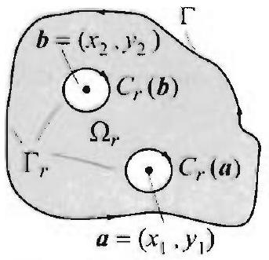

### 16.3 Green's Functions

In the previous section we proved the mean value property of a harmonic function $u$ on a region $\Omega$. which says that the value of $u$ at a given point ( $x_{0}, y_{0}$ ) in $\Omega$ is obtained by averaging (or integrating and dividing by $2 \pi$ ) the values of $u$ on any circle in $\Omega$ centered at ( $x_{0}, y_{0}$ ). In this section we prove a far-reaching generalization of this fact. We show that if $u$ is harmonic inside a region $\Omega$ and continuous on the boundary of $\Omega$, then we can determine all the values of $u$ inside of $\Omega$ by integrating on the boundary of $\Omega$ the product of $u$ times a fixed function that depends only on $\Omega$ and not $u$. This magical function is the normal derivative of the so-called Green's function for the region $\Omega$, and the integral formula thus obtained solves the Dirichlet

Figure 1 Typical region $\Omega$ for the results of this section.

## THEOREM 1 REPRESENTATION FORMULA

Figure 2 The circle $C_{r}$ encloses the problem point ( $x_{0}, y_{0}$ ) for the logarithm part $v$ and so $b$ is harmonic on $\Omega_{r}$.

problem inside $\Omega$. Variations on this formula solve Poisson's equation on $\Omega$. Concrete formulas of Green's functions for specific regions are derived in this section and Sections 16.4 and 16.7.

Throughout this section, $\Omega$ is a region with boundary $\Gamma$, where $\Gamma$ consists of simple curves $C$ (exterior boundary, positively oriented) and $C_{1}, \ldots, C_{n}$ (interior boundary, negatively oriented) (see Figure 1 for a case where $n=3$ ). For clarity's sake, as you read through this section, take $\Omega$ to be the unit disk, $\Gamma$ the positively oriented unit circle, and $C_{1}, \ldots, C_{n}$ circles of appropriate radii when present.

We start with an intermediate formula, in which the values of $u$ inside $\Omega$ are determined from its values and the values of its normal derivative on the boundary $\Gamma$.

Suppose that $u$ is harmonic inside $\Omega$ and continuous on its boundary $\Gamma$. Let $\left(x_{0}\right)$. $\left.y_{0}\right)$ be a point inside $\Omega$. Then

$$
u\left(x_{1}, y_{0}\right)=\frac{1}{2 \pi} \int_{\Gamma}\left(u \frac{\partial v}{\partial n}-v \frac{\partial u}{\partial n}\right) d s
$$

where $v(x, y)=\frac{1}{2} \ln \left(\left(x-x_{0}\right)^{2}+\left(y-y_{0}\right)^{2}\right)$.

Proof Draw a negatively oriented circle $C_{r}$ around $\left(r_{0}, y_{0}\right)$ in $\Omega$ and let $\Omega_{r}$ denote the region that consists of $\Omega$ minus the disk of radius $T$ around ( $x_{0}, y_{0}$ ) (Figure 2). The boundary of $\Omega_{r}$ is $\Gamma$ plus $C_{r}$. Both $u$ and $v$ are harmonic in $\Omega_{r}$ (remember. the only problem point for $v$ is $\left(x_{0}, y_{0}\right)$ and this point is not in $\Omega_{r}$ ). Apply Greens second identity over $\Omega_{r}$ (Theorem 3, Section 16.1) and use the fact that the left side of this identity is 0 in this case, because $\nabla^{2} u=0$ and $\nabla^{2} v=0$ on $\Omega_{r}$. Then

$$
\int_{\Gamma}\left(u \frac{\partial v}{\partial n}-v \frac{\partial u}{\partial n}\right) d s+\int_{C_{r}}\left(u \frac{\partial u}{\partial n}-v \frac{\partial u}{\partial n}\right) d s=0
$$

Thus

$$
\int_{\Gamma^{\prime}}\left(u \frac{\partial v}{\partial n}-v \frac{\partial u}{\partial n}\right) d s=-\int_{C_{r}^{\prime}}\left(u \frac{\partial v}{\partial n}-v \frac{\partial u}{\partial n}\right) d s
$$

and so the theorem will follow if we can show that the right side of the last equality is $2 \pi u\left(x_{0}, y_{0}\right)$. Since $C_{r}$ is negatively oriented, we have $-\int_{C_{r}}=\int_{-C_{r}}$, where $-C_{r}$ is now positively oriented. Parametrize $-C_{r}$ by $x(t)=x_{0}+r \cos t, y(t)=y_{0}+r \sin t$, $0 \leq t \leq 2 \pi, d s=r d t, v=\ln r, \frac{\partial v}{\partial n}=\frac{1}{r}$ (Proposition 2, Section 16.2). Then

$$
\begin{aligned}
\int_{-C_{r}}\left(u \frac{\partial v}{\partial n}-r \frac{\partial u}{\partial n}\right) d s & =\overbrace{\int_{0}^{2 \pi} u\left(x_{0}+r \cos t, y_{0}+r \sin t\right) d t}^{=2 \pi u\left(x_{0}, y_{0}\right)}-\ln r \overbrace{\int_{C} \frac{\partial u}{\partial n} d s}^{=0} \\
& =2 \pi u\left(x_{0}, y_{0}\right)
\end{aligned}
$$

where we have used the mean value property of harmonic functions (Theorem 1. Section 16.2), and the compatibility property (Example 5, Section 16.1).

Next, we modify the representation formula in Theorem 1 in such a way that the resulting line integral does not involve the normal derivative of $u$. For this purpose, suppose that there is a harmonic function $h$ on $\Omega$ such that $h=-v$ on $\Gamma$, where $v$ is as in Theorem 1. Applying Green's second identity with $u$ and $h$ (both are harmonic on $\Omega$ ), we get

$$
0=\int_{\Gamma}\left(u \frac{\partial h}{\partial n}-h \frac{\partial u}{\partial n}\right) d s
$$

Dividing by $2 \pi$ and using $h=-v$ on $\Gamma$, we get

$$
0=\frac{1}{2 \pi} \int_{\Gamma}\left(u \frac{\partial h}{\partial n}+v \frac{\partial u}{\partial n}\right) d s
$$

Adding this identity to the representation formula in Theorem 1, we obtain

$$
u\left(x_{0}, y_{0}\right)=\frac{1}{2 \pi} \int_{\Gamma} u \frac{\partial}{\partial n}(h+v) d s
$$

So far ( $x_{0}, y_{0}$ ) is fixed in $\Omega$, and $v$ and $h$. clearly depend on ( $x_{0}, y_{0}$ ). Let $\left(x_{0}, y_{0}\right)$ vary in $\Omega$ and suppose that for each $\left(x_{0}, y_{0}\right)$ we can find $h\left(x, y, x_{0}, y_{0}\right)$, so that (1) holds. Write

$$
G\left(x, y, x_{0}, y_{0}\right)=\overbrace{\frac{1}{2} \ln \left(\left(x-x_{0}\right)^{2}+\left(y-y_{0}\right)^{2}\right)}^{v\left(x, y, x_{0}, y_{0}\right)}+h\left(x, y, x_{0}, y_{0}\right) .
$$

The function $G$ is called Green's function for the region $\Omega$. Because of (1) we have the following important result.

THEOREM 2 SOLUTION OF DIRICHLET PROBLEM

Suppose that $u$ is harmonic on $\Omega$ and continuous on its boundary $\Gamma$. Then for $\left(x_{0}, y_{0}\right)$ in $\Omega$, we have

$$
u\left(x_{0}, y_{0}\right)=\frac{1}{2 \pi} \int_{\Gamma} u(x, y) \frac{\partial G}{\partial n}\left(x, y, x_{0}, y_{0}\right) d s
$$

where $G$ is Green's function for $\Omega$.

## THEOREM 3 PROPERTIES OF GREEN'S FUNCTION

Figure $3 G \approx v+h$, where $|h| \leq M$ in $D_{R}$ and $v$ tends to $-\infty$ at $\left(x_{0} . y_{0}\right)$. As a result $G$ tends to $-\infty$ at ( $x_{0}, y_{0}$ ).

Formula (3) solves the Dirichlet problem on $\Omega$. The trouble is that Green's functions are not easy to compute for arbitrary regions, and even when they are known, the integral (3) is still difficult to evaluate. Nevertheless, formula (3) offers many advantages. In the following sections, we will compute it explicitely for important regions such as disks, half-planes, and sectors. Furthermore, the same ideas that we used to derive (3) can be used to solve other important equations, such as Poisson's equation and Neumann prollems.

We now list fundamental properties of Green's function for future reference.

Let $\Omega$ be a region with boundary $\Gamma$, and let $G$ be its Green's function as in (2). Then
(i) $G\left(x, y, x_{0}, y_{0}\right)$ is a harmonic function of $(x, y)$ in $\Omega$ minus $\left(x_{0}, y_{0}\right)$. Harmonicity fails at ( $x_{0}, y_{0}$ ) due to the logarithmic part $v$.
(ii) $G\left(x, y, x_{0}, y_{0}\right)=0$ for all $(x, y)$ on the boundary $\Gamma$.
(iii) $G\left(x, y, x_{0}, y_{0}\right) \leq 0$ for all $(x, y)$ in $\Omega$ minus $\left(x_{0}, y_{0}\right)$.
(iv) (uniqueness property) Green's function is uniquely determined by the region $\Omega$.
(v) (symmetry property) $G\left(x, y, x_{0}, y_{0}\right)=G\left(x_{0}, y_{0}, x, y\right)$ for all $\left(x_{0}, y_{0}\right)$ and ( $x, y$ ) in $\Omega$.

Proof Properties (i) and (ii) are immediate from the definition of Green's function. Property (v) is not obvious but its proof is based on ideas that we have used throughout this section. We outline it in the exercises. (Another proof, based on conformal mappings, is given in Section 16.7, following Theorem 3.) Let us prove (iii) and (iv), starting with (iv). Write $G=v+h$ as in (2). If $Q=v+q$ is another Green's function for $\Omega$, then because $Q=0$ on $\Gamma$, it follows that $q=-v$ on $\Gamma$. But, $h=-v$ on $\Gamma$, so $h=q$ on $\Gamma$. Since both $h$ and $q$ are harmonic, it follows that $h=q$ on $\Omega$, by Theorem 4, Section 16.1. Hence $G=Q$ on $\Omega$.

To prove (iii), again write $G=v+h$ as in (2). Fix a closed disk $D_{R}$ centered at ( $x_{0}, y_{0}$ ) and contained in $\Omega$. Since $h$ is harmonic on $\Omega$, it is continuous and hence bounded in $D_{R}$, say $\left|h\left(x, y, x_{0}, y_{0}\right)\right| \leq M$ on $D_{R}$. Now, $v$ tends to $-\infty$ as $(x . y)$ approaches $\left(x_{0}, y_{0}\right)$. So we can find $0<r_{0}<R$ such that $v\left(x, y, x_{0}, y_{0}\right)<2 M$ on $C_{T}$ for all $0<r \leq r_{0}<R$ (see Figure 3). Hence $G\left(x, y, x_{0}, y_{0}\right) \leq-M$ on $C_{r}$. because $G=h+v, v\left(x, y, x_{0}, y_{0}\right)<-2 M$ and $\left|h\left(x, y, x_{0}, y_{0}\right)\right| \leq M$ on $C_{r}$. Denote the region $\Omega$ minus the disk of radius $r$ centered at ( $x_{0}, y_{0}$ ) by $\Omega_{r}$. The boundary of $\Omega_{r}$ consists of $\Gamma$ and $C_{r}$. The function $G$ is harmonic in $\Omega_{r}$ and we just proved that it is $\leq 0$ on its boundary. By the maximum principle for harmonic functions, it follows that $G \leq 0$ on $\Omega_{r}$. Since this is true for all $0<r \leq r_{0}$, letting $r \rightarrow 0$, we see that $G \leq 0$ on $\Omega$ minus ( $x_{0}, y_{0}$ ). Hence (iii) holds.

## Solution of Poisson's Equation

We consider Poisson equation on $\Omega$ and solve this important equation using ideas similar to those of the proof of Theorem 2.

THEOREM 4 SOLUTION OF POISSON'S EQUATION WITH ZERO BOUNDARY DATA

Let $\Omega$ be a region with boundary $\Gamma$ as in Theorem 1. Let $f(x, y)$ be a function on $\Omega$ and suppose that $u$ is a solution of Poisson's equation on $\Omega$.

$$
\nabla^{2} u(x, y)=f(x, y) . \quad(x, y) \text { in } \Omega .
$$

such that $u=0$ on the boundary $\Gamma$. Then, for all $\left(x_{0}, y_{0}\right)$ in $\Omega$.

$$
u\left(x_{0}, y_{0}\right)=\frac{1}{2 \pi} \iint_{\Omega} f(x, y) G\left(x, y, x_{0}, y_{0}\right) d x d y
$$

where $G$ is Green's function for $\Omega$.
Proof If $u$ is a solution, then $\nabla^{2} u(x, y)=f(x, y)$ on $\Omega$, and so

$$
\iint_{\Omega} f(x, y) G\left(x, y, x_{0}, y_{0}\right) d x d y=\iint_{\Omega} \nabla^{2} u(x, y) G\left(x, y, x_{0}, y_{0}\right) d x d y
$$

Let $C_{r}$ be a negatively oriented circle around ( $x_{0}, y_{0}$ ) and let $\Omega_{r}$ be $\Omega$ minus $D_{r}$. the closed disk of radius $r$ centered at ( $x_{0}, y_{0}$ ) (Figure 2). The boundary of $\Omega_{r}$ consists of $\Gamma$ plus the negatively oriented circle $C_{r}$. Apply Green's second identity in $\Omega_{r}$, use that $u=0$ on $\Gamma, G$ is harmonic in $\Omega_{T}$ and $G=0$ on $\Gamma$, and get

$$
\begin{aligned}
& -\iint_{\Omega_{r}} G\left(x, y, x_{0}, y_{0}\right) \nabla^{2} u(x, y) d x d y \\
& \quad=\int_{C_{r}} u(x, y) \frac{\partial G}{\partial n}\left(x, y, x_{0}, y_{0}\right) d s-\int_{C_{r}} G\left(x, y, x_{0}, y_{0}\right) \frac{\partial u}{\partial n}(x, y) d s
\end{aligned}
$$

To complete the proof of the theorem, we let $r \rightarrow 0$ in (6) and establish the following three limits:

$$
\begin{gathered}
\lim _{r \rightarrow 0}-\iint_{\Omega} G\left(x, y, x_{0}, y_{0}\right) \nabla^{2} u(x, y) d x d y \\
=-\iint_{\Omega} G\left(x, y, x_{0}, y_{0}\right) \nabla^{2} u(x, y) d x d y \\
\lim _{r \rightarrow 0} \int_{C_{r}} u(x, y) \frac{\partial G}{\partial n}\left(x, y, x_{0}, y_{0}\right) d s=-2 \pi u\left(x_{0} . y_{0}\right) \\
\lim _{r \rightarrow 0}-\int_{C_{r}} G\left(x, y, r_{0}, y_{0}\right) \frac{\partial u}{\partial n}(x, y) d s=0
\end{gathered}
$$

We shall prove (9) and leave the proofs of (7) and (8) to the exercises (with copious hints). Write $G\left(x, y, x_{0}, y_{0}\right)=h\left(x, y, x_{0}, y_{0}\right)+\frac{1}{2} \ln \left(\left(x-x_{0}\right)^{2}+\left(y-y_{0}\right)^{2}\right)$, where $h\left(x, y, x_{0}, y_{0}\right)$ is harmonic, hence continuous, and hence bounded by a constant $M$ on $D_{r}$ (in particular, $h$ is bounded by $M$ on $C_{r}$ ). Also, since $u$ has continuous partial derivatives in $\Omega . \frac{\partial u}{\partial n}$ is continuous on $D_{r}$ and bounded on $D_{r}$ (say, $\left|\frac{\partial u}{\partial n}\right| \leq A$ on $D_{r}$ ). Furthermore, for $(r \cdot y)$ on $C_{r}$, we have $\left|v\left(x, y, x_{0}, y_{0}\right)\right|=|\ln r|$; hence $\left|G\left(x, y, x_{0}, y_{0}\right) \frac{i_{n}}{\partial n}\right| \leq(M+|\ln r|), A$. and so

$$
\begin{aligned}
\left|\int_{C_{r}} G\left(x, y_{0}, x_{0}, y_{0}\right) \frac{\partial u}{\partial n}(x, y) d s\right| & \leq(M+|\ln r|) A \int_{C_{r}} d s \\
& =2 \pi r(M+|\ln r|) A \rightarrow 0, \text { as } r \rightarrow 0
\end{aligned}
$$

which completes the proof of (9). $\square$

To solve the general Poisson equation with arbitrary boundary values, we combine the solutions of the Dirichlet problem and Poisson's equation with zero boundary values, as illustrated by Figure 4. We state the result in a theorem and omit the proof which is similar to a proof that we gave in Section 3.9 for the Poisson problem on a rectangle.

## THEOREM 5 GENERAL SOLUTION OF POISSON'S EQUATION

With the notation of Theorem 4, suppose that $u$ is a solution of Poisson's equation (4) with boundary condition $u(x, y)=g(x, y)$ for all $(x, y)$ on $\Gamma$. Then, for all ( $x_{0}, y_{0}$ ) in $\Omega$.

$$
\begin{aligned}
u\left(x_{0}, y_{0}\right)= & \frac{1}{2 \pi} \iint_{\Omega} f(x, y) G\left(x, y, x_{0}, y_{0}\right) d x d y \\
& +\frac{1}{2 \pi} \int_{\Gamma} g(x, y) \frac{\partial G}{\partial n}\left(x, y, x_{0}, y_{0}\right) d s
\end{aligned}
$$

where $G$ is Green's function for $\Omega$.

Figure 4 Decomposition of a general Poisson problem into two simpler subproblems.

## Green's Function, Method of Eigenfunction Expansions

Recall that we have solved Poisson's equation on regions such as a rectangle or a disk, by using the eigenfunction expansion method. The solution in each case is given by an infinite or doubly infinite series. The plan now is to identify Green's function in these formulas by comparing them with (5). This will yield Green's functions on a rectangle and a disk in a double series form. Even though this form does not match (2), it does serve to illustrate some properties of Green's functions. (In the next section we will construct Green's function on a disk and obtain a formula that matches (2).)

Figure 5 Poisson problem on a rectangle, with zero boundary values.
Figure 5 Poisson problem on a rectangle, with zero boundary values.

## EXAMPLE 1 Green's function for a rectangle

Consider Poisson's equation $\nabla^{2} u(x, y)=f(x, y)$ on all $a \times b$ rectangle $R$ with 0 boundary values, as illustrated in Figure 5. From Section 3.9, we have, for any

Figure 6 Green's function for a $1 \times 1$-rectangle at $\left(x_{0}, y_{0}\right)= \left(\frac{1}{2}, \frac{1}{2}\right)$, drawn using a partial sum of (10) with $m=n=$ 40.

Figure 7 Poisson's equation in a disk of radius $\alpha$ and zero boundary values.

( $x_{0} \cdot y_{0}$ ) in $R$,

$$
u\left(x_{0}, y_{0}\right)=\sum_{n=1}^{\infty} \sum_{m=1}^{\infty} E_{m n} \sin \frac{m \pi x_{0}}{a} \sin \frac{n \pi y_{0}}{b},
$$

where

$$
E_{m n}=\frac{-4}{a b \lambda_{m n}} \int_{0}^{b} \int_{0}^{a} f(x, y) \sin \frac{m \pi x}{a} \sin \frac{n \pi y}{b} d x d y
$$

and $\lambda_{m n}=\pi^{2}\left[\left(\frac{m}{a}\right)^{2}+\left(\frac{n}{b}\right)^{2}\right](m, n-1,2, \ldots)$. Substituting $E_{m n}$ by its value in the formula for $u$, and then interchanging the sum and integral signs, we get

$$
\begin{aligned}
& u\left(x_{0}, y_{0}\right)= \\
& \quad \int_{0}^{b} \int_{0}^{a} f(x, y)\left(\sum_{n=1}^{\infty} \sum_{m=1}^{\infty} \frac{-4}{a b \lambda_{m n}} \sin \frac{m \pi x}{a} \sin \frac{n \pi y}{b} \sin \frac{m \pi x_{0}}{a} \sin \frac{n \pi y_{0}}{b}\right) d x d y
\end{aligned}
$$

Comparing this formula with (5), we conclude that Green's function for the rectangle is

$$
G\left(x, y, x_{0} . y_{0}\right)=\frac{-8}{a b \pi} \sum_{n=1}^{\infty} \sum_{m=1}^{\infty} \frac{\sin \frac{m \pi x}{a} \sin \frac{n \pi y}{b} \sin \frac{m \pi x_{0}}{a} \sin \frac{n \pi y_{0}}{b}}{\left(\frac{m}{a}\right)^{2}+\left(\frac{n}{b}\right)^{2}} .
$$

For any given ( $x_{0}, y_{0}$ ) in $R$, it can be shown that the series converges conditionally for all $(x, y) \neq\left(x_{0}, y_{0}\right)$ in $R$ and diverges for $(x, y)=\left(x_{0}, y_{0}\right)$. This fact is illustrated in Figure 6. Some properties of Green's function that are listed in Theorem 3 can be verified directly by considering (10) (see the exercises). $\square$

## EXAMPLE 2 Green's function for a disk

We use polar coordinates for convenience. Consider Poisson's equation $\nabla^{2} u(r, \theta)= f(r, \theta)$ on a disk $D$ of radius $a>0$, with 0 boundary values, as illustrated in Figure 7. Using the results of Section 4.6, and then comparing with (5), we find that for ( $r_{0}, \theta_{0}$ ) in $D$ :

$$
u\left(r_{0}, \theta_{0}\right)=\frac{1}{2 \pi} \int_{0}^{a} \int_{0}^{2 \pi} G\left(r, \theta, r_{0}, \theta_{0}\right) f(r, \theta) r d r d \theta
$$

where

$$
\begin{aligned}
& G\left(r, \theta, r_{0}, \theta_{0}\right)=-2 \sum_{n=1}^{\infty} \frac{J_{0}\left(\lambda_{0 n} r\right) J_{0}\left(\lambda_{0 n} r_{0}\right)}{\alpha_{0 n}^{2} J_{1}^{2}\left(\alpha_{0 n}\right)} \\
& \quad-4 \sum_{m=1}^{\infty} \sum_{n=1}^{\infty} \frac{J_{m}\left(\lambda_{m n} r\right) J_{m}\left(\lambda_{m n} r_{0}\right)}{\alpha_{m n}^{2} J_{m+1}^{2}\left(\alpha_{m n}\right)}\left(\cos m \theta \cos m \theta_{0}+\sin m \theta \sin m \theta_{0}\right) \\
& \quad=-2 \sum_{n=1}^{\infty} \frac{J_{0}\left(\lambda_{0 n} r\right) J_{0}\left(\lambda_{0 n} r_{0}\right)}{\alpha_{0 n}^{2} J_{1}^{2}\left(\alpha_{0 n}\right)}-4 \sum_{m=1}^{\infty} \sum_{n=1}^{\infty} \frac{J_{m}\left(\lambda_{m n} r\right) J_{m}\left(\lambda_{m n} r_{0}\right)}{\alpha_{m n}^{2} J_{m+1}^{2}\left(\alpha_{m n}\right)} \cos m\left(\theta-\theta_{0}\right)
\end{aligned}
$$

where $\lambda_{m n}=\frac{\alpha_{m n}}{a}$ and $\alpha_{m n}$ is the $n$th positive zero of the Bessel function $J_{m}$. The details of the derivation are straightforward and are left to the exercises. An

THEOREM 6 POISSON'S
EQUATION WITH A DIRAC FUNCTION
alternative simpler formula for Green's function for the disk is derived in the next section.

## Green's Function and the Dirac Delta Function

There is a concrete description of Green's function, $G\left(x . y, x_{0}, y_{0}\right)$, as the steady-state solution of a heat problem on a plate $\Omega$ with a heat source at ( $x_{0}, y_{0}$ ), where the boundary of $\Omega$ is kept at 0 temperature. More precisely, we have the following result.

For fixed $\left(x_{0}, y_{0}\right)$ in $\Omega, \frac{1}{2 \pi} G\left(x, y, x_{0}, y_{0}\right)$ is a solution of the following Poisson equation, with zero boundary condition:

$$
\begin{aligned}
\nabla^{2} u & =\delta_{\left(x_{0}, y_{0}\right)}(x, y), \quad(x, y) \text { in } \Omega \\
u(x, y) & =0 \text { for all }(x, y) \text { on the boundary of } \Omega .
\end{aligned}
$$

where $\delta_{\left(x_{0}, y_{0}\right)}(x, y)$ is the two dimensional delta Dirac function.
Before we prove the theorem, we explain a few facts about the two dimensional Dirac function. This function is defined in terms of the one dimensional Dirac function by

$$
\delta_{\left(x_{0}, y_{0}\right)}(x, y)=\delta_{x_{0}}(x) \delta_{y_{0}}(y)
$$

Consequently, if $f(x, y)$ is a function and $D$ is a subset of the plane, then

$$
\iint_{D} f(x, y) \delta_{\left(x_{0}, y_{0}\right)}(x, y) d x d y= \begin{cases}f\left(x_{0}, y_{0}\right) & \text { if }\left(x_{0}, y_{0}\right) \text { is in } D \\ 0 & \text { otherwise. }\end{cases}
$$

To explain what we mean by a solution of (11), we recall the definition of equality between two generalized functions from Section 7.8. For $u(x, y)$ to be a solution of (11), we must show that if $\phi(x, y)$ is any (test) function, then

$$
\iint_{\Omega} \phi(x, y) \nabla^{2} u d x d y=\iint_{\Omega} \phi(x, y) \delta_{\left(x_{0}, y_{0}\right)}(x, y) d x d y=\phi\left(x_{0}, y_{0}\right)
$$

Proof of Theorem 6. That $G$ satisfies (12) follows from Theorem 3(ii). We now show that (14) holds when $u(x, y)=\frac{1}{2 \pi} G\left(x, y, x_{0}, y_{0}\right)$. Letting $\phi(x, y)$ be any (test) function, we must show that

$$
\frac{1}{2 \pi} \iint_{\Omega} \phi(x, y) \nabla^{2} G\left(x, y, x_{0}, y_{0}\right) d x d y=\phi\left(x_{0}, y_{0}\right)
$$

where in the double integral, the Laplacian is computed with respect to ( $x, y$ ). But since $G$ is symmetric, we can write the Laplacian inside the double integral with respect to $\left(x_{0}, y_{0}\right)$, instead of $(x, y)$, without changing the values of the integrand. But then we can pull the Laplacian symbol outside the integral and write

$$
\frac{1}{2 \pi} \iint_{\Omega} \phi(x, y) \nabla^{2} G\left(x, y, x_{0}, y_{0}\right) d x d y=\nabla^{2}\left(\frac{1}{2 \pi} \iint_{\Omega} \phi(x, y) G\left(x, y, x_{0} . y_{0}\right) d x d y\right)
$$

By Theorem 4, the function defined by the clouble integral on the right side solves Poisson's equation $\nabla^{2} u=\infty$. So its Laplacian (with respect to $\left(x_{0}, y_{0}\right)$ ) is equal to $\phi\left(x_{0}, y_{0}\right)$, and (15) follows.

Many examples of Green's functions will be derived in the the next section and Section 16.7.

## Exercises 12.3

In Exercises 1-8, evaluate the given expression without computing. Appeal to various results from this section and explain how you are using them. In all cases, if not otherwise specified, take $\Omega$ to be a region with boundary $\Gamma$, as in Theorem 1 , ( $x_{0}, y_{0}$ ) a point in $\Omega$, and $G$ Green's function for $\Omega$.

1. $\int_{\Gamma} G\left(x, y, x_{\cup}, y_{0}\right) d s$.
2. $\int_{\Gamma} f(x, y) G\left(x, y, x_{0}, y_{0}\right) d s, f(x, y)$ an arbitrary function defined on $\Gamma$.
3. $\int_{\Gamma} \frac{\partial}{\partial n} G\left(x, y, x_{0}, y_{0}\right) d s$.
4. $\int_{\Gamma} x y \frac{\partial}{\partial n} G\left(x, y, x_{0}, y_{0}\right) d s$.
5. $\int_{\Gamma} x \frac{\partial}{\partial n} G\left(x, y, \frac{1}{2}, \frac{1}{3}\right) d s$, where $\Omega$ is the unit disk and $\Gamma$ its positively oriented boundary.
6. $\int_{\Gamma}\left(x^{2}-y^{2}\right) \frac{\partial}{\partial n} G\left(x, y, \frac{1}{2}, \frac{1}{3}\right) d s$.
7. $\nabla^{2}\left(\iint_{\Omega} G\left(x, y, x_{0}, y_{0}\right) d x d y\right)$.
8. $\nabla^{2}\left(\iint_{\Omega}\left(2 x+3 y^{3}\right) G\left(x, y, x_{0}, y_{0}\right) d y\right)$.
9. $\nabla^{2}\left(\iint_{\Omega} x^{2} y^{3} G\left(x, y . x_{0}, y_{0}\right) d x d y\right)$.
10. $\nabla^{2}\left(\iint_{\Omega} f(x, y) G\left(x, y, x_{0}, y_{0}\right) d x d y\right)$.
11. Derive Gauss's mean value property (Theorem 1, Section 16.2) from the representation formula in Theorem 1.
12. (a) Verify (i) of Theorem 3 for Green's function for a rectangle (10). (Assume that you can interchange the derivatives and the sums.)
(b) Verify (ii) and (v) of Theorem 3 for Green's function for a rectangle (10).
13. Verify (i) of Theorem 3 for Green's function for a disk in Example 2. (Assume that you can interchange the derivatives and the sums.)
14. Verify (ii) and (v) of Theorem 3 for Green's function for a disk in Example 2.
15. In the notation of Theorem 2, show that

$$
\frac{1}{4 \pi} \int_{\Gamma} \frac{\partial}{\partial n} \ln \left(\left(x-x_{0}\right)^{2}+\left(y-y_{0}\right)^{2}\right) d s=1
$$

[Hint: Take $u=1$ and use (2).]
16. Derive the solution of the Dirichlet problem on a rectangle in Section 3.8, starting with Green's function (10) and using Theorem 2. In computing the normal derivative of Green's function, you have to distinguish four cases, depending on the side of the rectangle.
17. Reverse the steps in the proof in Example 1 and show how you would solvc Poisson's equation with zero boundary values on a rectangle starting with Green's function (10) and using Theorem 4.
18. Supply more details in Example 2 showing clearly how to obtain Green's function from the results of Section 4.6.
19. Solve the Poisson problem in the plane $\nabla^{2} u=\delta_{(0,0)}(x, y)$.

In what follows, we use the notation of Theorem 1. Unless otherwise specified, ( $x_{0}, y_{0}$ ) denotes a point in $\Omega$, and $C_{r}$ is a positively oriented circle, contained in $\Omega$, with center ( $x_{0}, y_{0}$ ) and radius $r>0$. The Green's function for $\Omega$ is denoted by $G$. Hence $G=h+v$, where, $b y(2), v(x, y)=\frac{1}{2} \ln \left(\left(x-x_{0}\right)^{2}+\left(y-y_{0}\right)^{2}\right)$ and $h$ is harmonic on $\Omega$ and equals $v$ on $\Gamma$.
20. Suppose that $u$ is continuous (not necessarily harmonic) on an open disk around ( $x_{0}, y_{0}$ ) in $\Omega$. Show that

$$
\lim _{r \rightarrow 0} \int_{C_{r}} u \frac{\partial v}{\partial n} d s=2 \pi u\left(x_{0}, y_{0}\right)
$$

[Hint: From Proposition 1, Section 16.2, $\int_{C_{r}} u \frac{\partial v}{\partial n} d s=\int_{0}^{2 \pi} u\left(x_{0}+r \cos \theta_{s} y_{0}+\right. r \sin \theta) d \theta=\phi(r)$, where $\phi(r)$ is continuous. What is $\phi(0) ?]$
21. Suppose that $u$ is continuous and $h$ is harmonic on an open disk around ( $x_{0}, y_{0}$ ) in $\Omega$. Show that

$$
\lim _{r \rightarrow 0} \int_{C_{r}} u \frac{\partial h}{\partial n} d s=0
$$

[Hint: Both $|u|$ and $\left|\frac{\partial h}{\partial n}\right|$ are bounded near ( $x_{0}, y_{0}$ ), say by $M$. If $I_{r}$ denotes the integral in question, then $\left|I_{r}\right| \leq 2 \pi M r \rightarrow 0$ as $r \rightarrow 0$.]
22. A useful limit. Suppose that $u$ is continuous (not necessarily harmonic) on an open disk around $\left(x_{0}, y_{0}\right)$ in $\Omega$. Show that

$$
\lim _{r \rightarrow 0} \int_{C_{r}} u \frac{\partial G}{\partial n}\left(x, y, x_{0}, y_{0}\right) d s=2 \pi u\left(x_{0}, y_{0}\right)
$$

[Hint: Combine the previous two exercises.]
23. Another useful limit. Suppose that $u$ is continuous (not necessarily harmonic) on an open disk around ( $x_{0}, y_{0}$ ) in $\Omega$. Show that

$$
\lim _{r \rightarrow 0} \int_{C_{r}} u(x, y) G\left(x, y, x_{0}, y_{0}\right) d s=0
$$

[Hint: Repeat the end of the proof of Theorem 4 with minor modifications.]
24. Proof of (8). Prove (8) by appealing to Exercise 22. (Just note the difference in the orientation of the curves in the integrals.)

Figure 8 for Exercise 26.

25. Proof of (7). Justify the following steps:

$$
\begin{gathered}
\left|\iint_{\Omega_{r}} G\left(x, y, x_{0}, y_{0}\right) f(x, y) d x d y-\iint_{\Omega} G\left(x, y, x_{0}, y_{0}\right) f(x, y) d x d y\right| \\
=\left|\iint_{D_{r}} G\left(x, y, x_{0}, y_{0}\right) f(x, y) d x d y\right| \\
\leq \iint_{D_{r}}\left|h\left(x, y, x_{0}, y_{0}\right) f(x, y)\right| d x d y \\
+\iint_{D_{r}}\left|\frac{1}{2} \ln \left(\left(x-x_{0}\right)^{2}+\left(y-y_{0}\right)^{2}\right) f(x, y)\right| d x d y \\
\leq A \iint_{D_{r}} d x d y+B \iint_{D_{r}} \frac{1}{2}\left|\ln \left(\left(x-x_{0}\right)^{2}+\left(y \quad y_{0}\right)^{2}\right)\right| d x d y \\
=A r^{2} \pi+B \int_{0}^{2 \pi} \int_{0}^{r} \rho|\ln \rho| d \rho d \theta
\end{gathered}
$$

Evaluate the last integral and show that the resulting expression on the right side tends to 0 as $r \rightarrow 0$.
26. Proof of Theorem 3(v). Let $\boldsymbol{a}=\left(x_{1}, y_{1}\right)$ and $\boldsymbol{b}=\left(x_{2}, y_{2}\right)$ be any two points in $\Omega$. Follow the outlined steps to show that $G(\boldsymbol{a}, \boldsymbol{b})=G(\boldsymbol{b}, \boldsymbol{a})$.
(a) In $\Omega$, draw small negatively oriented circles $C_{r}(a)$ and $C_{r}(b)$ around $\boldsymbol{a}$ and $b$, respectively, with radii $r$. Let $\Omega_{r}$. denote the region $\Omega$ minus the closed disks $D_{r}(\boldsymbol{a})$ and $D_{r}(b)$, and let $\Gamma_{r}$ denote the boundary of $\Omega_{r}$ (Figure 8). Show that

$$
\int_{\Gamma_{r}}\left(G(x, y, \boldsymbol{a}) \frac{\partial}{\partial n} G(x, y, \boldsymbol{b})-G(x, y, \boldsymbol{b}) \frac{\partial}{\partial n} G(x, y, \boldsymbol{a})\right) d s=0
$$

(b) Using Theorem 3(ii), conclude that

$$
\begin{aligned}
\int_{C_{r}(\boldsymbol{a})} & \left(G(x, y, \boldsymbol{a}) \frac{\partial}{\partial n} G(x, y, \boldsymbol{b})-G(x, y, \boldsymbol{b}) \frac{\partial}{\partial n} G(x, y, \boldsymbol{a})\right) d s \\
& +\int_{C_{r}(\boldsymbol{b})}\left(G(x, y, \boldsymbol{a}) \frac{\partial}{\partial n} G(x, y, \boldsymbol{b})-G(x, y, \boldsymbol{b}) \frac{\partial}{\partial n} G(x, y, \boldsymbol{a})\right) d s=0
\end{aligned}
$$

(c) Using Exercises 22 and 23, show that

$$
\begin{gathered}
\lim _{r \rightarrow 0} \int_{C_{r}(\boldsymbol{a})} G(x, y, \boldsymbol{a}) \frac{\partial}{\partial n} G(x, y, \boldsymbol{b}) d s=0 \\
\lim _{r \rightarrow 0}-\int_{C_{r}(\boldsymbol{a})} G(x, y, \boldsymbol{b}) \frac{\partial}{\partial n} G(x, y, \boldsymbol{a}) d s=2 \pi G(\boldsymbol{a}, \boldsymbol{b}) \\
\lim _{r \rightarrow 0} \int_{C_{r}(\boldsymbol{b})} G(x, y, \boldsymbol{a}) \frac{\partial}{\partial n} G(x, y, \boldsymbol{b}) d s=-2 \pi G(\boldsymbol{b}, \boldsymbol{a}) \\
\lim _{r \rightarrow 0}-\int_{C_{r}(\boldsymbol{b})} G(x, y, \boldsymbol{b}) \frac{\partial}{\partial n} G(x, y, \boldsymbol{a}) d s=0
\end{gathered}
$$

(d) Conclude from (b) and (c) that $G(\boldsymbol{a}, \boldsymbol{b})=G(\boldsymbol{b}, \boldsymbol{a})$.
