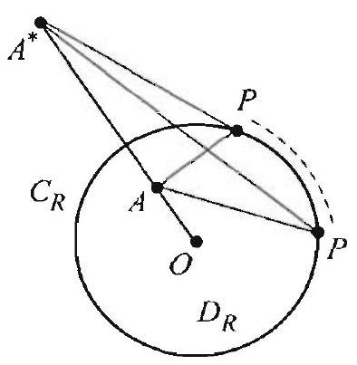
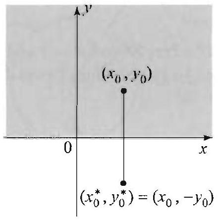

### 16.4 Green's Functions for the Disk and the Upper Half-Plane

Green's function for the unit disk was computed in the previous section using the method of eigenfunction expansions and was obtained in the form of a double series that involves cosine, sine and Bessel functions. In this section we apply the so-called method of images, which uses basic facts from plane geometry about the circle and gives a much simpler derivation of

Figure 1 The point $A^{*}$ is such that for all points $P$ on $C_{R}$, we have $A P=k \cdot A^{*} P$ for some $k>0$.

Figure 2 The point $A^{*}$ is the image of $A$ by the Steiner inversion. $A^{*}$ is on the ray $O A$, such that $O A \cdot O A^{*}=R^{2}$.

Green's function. These geometric ideas apply as well on other regions and yield concrete formulas for Green's functions.

Throughout this section, let $D_{R}$ denote a disk centered at the origin with radius $R>0$, and $C_{R}$ its positively oriented boundary. Recall from (2) of the previous section that Green's function is of the form

$$
G\left(x, y, x_{0}, y_{0}\right)=\overbrace{\frac{1}{2} \ln \left(\left(x-x_{0}\right)^{2}+\left(y-y_{0}\right)^{2}\right)}^{v\left(x, y, x_{0}, y_{0}\right)}+h\left(x, y, x_{0}, y_{0}\right)
$$

where $h$ is harmonic on $D_{R}$ and $h\left(x, y, x_{0}, y_{0}\right)=-v\left(x, y, x_{0}, y_{0}\right)$ for all ( $x . y$ ) on $C_{R}$. So the first half of the formula for $G$ is known, and to determine the second half, we must find a harmonic function $h$ on $D_{R}$ that equals $-v$ on $C_{R}$. Thus $h$ is the solution of a particular Dirichlet problem on $D_{R}$, with boundary condition $h=-v$ on $C_{R}$. Suppose for a moment that there is a point $A^{*}=\left(x_{0}^{*}, y_{0}^{*}\right)$ outside $D_{R}$ such that the distance from $A=\left(x_{0}, y_{0}\right)$ to any point $P=(x, y)$ on $C_{R}$ is proportional to the distance from ( $x_{0}^{*}, y_{0}^{*}$ ) to $(x, y)$ (Figure 1). That is, $\left(x_{0}^{*}, y_{0}^{*}\right)$ is such that there is a constant $k>0$ with

$$
\sqrt{\left(x-x_{0}\right)^{2}+\left(y-y_{0}\right)^{2}}=k \sqrt{\left(x-x_{0}^{*}\right)^{2}+\left(y-y_{0}^{*}\right)^{2}}
$$

for all $(x, y)$ on $C_{R}$. Given such a point $\left(x_{0}^{*}, y_{0}^{*}\right)$, define

$$
\begin{aligned}
h\left(x, y, x_{0}, y_{0}\right) & =-\ln \left(k \sqrt{\left(x-x_{0}^{*}\right)^{2}+\left(y-y_{0}^{*}\right)^{2}}\right) \\
& =-\frac{1}{2} \ln \left(\left(x-x_{0}^{*}\right)^{2}+\left(y-y_{0}^{*}\right)^{2}\right)-\ln k
\end{aligned}
$$

Then $h$ is harmonic for all $(x, y) \neq\left(x_{0}^{*}, y_{0}^{*}\right)$, in particular, $h$ is harmonic on $D_{R}$; and for all $(x, y)$ on $C_{R}$, we have $h\left(x, y, x_{0}, y_{0}\right)=-v\left(x, y, r_{U}, y_{0}\right)$, by (1). Thus $h$ is precisely the function that we are looking for, and consequently, Green's function for $D_{R}$ is
$G\left(x, y, x_{0}, y_{0}\right)=\frac{1}{2} \ln \left(\left(x-x_{0}\right)^{2}+\left(y-y_{0}\right)^{2}\right)-\frac{1}{2} \ln \left(\left(x-x_{0}^{*}\right)^{2}+\left(y-y_{0}^{*}\right)^{2}\right)-\ln k$.
Simplifying, we find that, for all $(x, y) \neq\left(x_{0}, y_{0}\right)$ in $D_{R}$,

$$
G\left(x, y, x_{0}, y_{0}\right)=\frac{1}{2} \ln \left[\frac{\left(x-x_{0}\right)^{2}+\left(y-y_{0}\right)^{2}}{\left(x-x_{0}^{*}\right)^{2}+\left(y-y_{0}^{*}\right)^{2}}\right]-\ln k
$$

With this we have reduced the construction of Green's function on the disk $D_{R}$ to the following geometric problem. Given a point $A=\left(x_{0}, y_{0}\right)$ inside $D_{R}$, find a point $A^{*}=\left(x_{0}^{*}, y_{0}^{*}\right)$ outside $D_{R}$ and a constant $k>0$ so that (1) holds for all points ( $x, y$ ) on the circle $C_{R}$.

The solution of this problem is given by a well-known geometric construction or transformation called the Steiner inversion: When $A$ is not

## PROPOSITION 1 STEINER INVERSION

Figure 3 Rotate the picture in Figure 3(a) to bring $A$ and $A^{*}$ to the positive $x$-axis (Figure 3(b)). A rotation does not change distances.

the origin, the point $A^{*}$ is the inverse of the point $A$ through the circle $C_{R}$. By definition of the Steiner inversion, $A^{*}$ is the point on the ray from the origin $O$ through $A$ at a distance such that

$$
O A \cdot O A^{*}=R^{2}
$$

(Figure 2). (Even though we exclude from our discussion the case where $A$ is the center of $C_{R}$, the formulas that we derive apply even when $A$ is the center of $C_{R}$.) We next state the property of the inversion that is key to the construction of Green's function. We use the notation $|A-B|= \sqrt{\left(x_{1}-x_{2}\right)^{2}+\left(y_{1}-y_{2}\right)^{2}}$ for the distance between the points $A=\left(x_{1}, y_{1}\right)$ and $B=\left(x_{2}, y_{2}\right)$, and $|A|=\sqrt{x_{1}^{2}+y_{1}^{2}}$ for the distance from $A$ to the origin.

Let $A=\left(x_{0}, y_{0}\right)$ be a a fixed point in $D_{R}$ minus its center and let $A^{*}= \left(x_{0}^{*}, y_{0}^{*}\right)$ be its image by the Steiner inversion. For any point $P=(x, y)$ on $C_{R}$, we have
(5)

$$
|A-P|=\frac{|A|}{R}\left|A^{*}-P\right|=k \cdot\left|A^{*}-P\right|,
$$

where $k=\frac{|A|}{R}=\frac{\sqrt{x_{0}^{2}+y_{0}^{2}}}{R}$.
Proof By rotating the picture, if necessary, we may assume that the points $A$ and $A^{*}$ are on the positive $x$-axis, located at the distances $|A|$ and $\left|A^{*}\right|$, respectively, where $\left|A^{*}\right|=\frac{R^{2}}{|A|}$, by (4) (Figure 3). Using polar coordinates, write $P=(R \cos \theta, R \sin \theta)$. Then

$$
\begin{aligned}
\frac{|A-P|^{2}}{\left|A^{*}-P\right|^{2}} & =\frac{(|A|-R \cos \theta)^{2}+R^{2} \sin ^{2} \theta}{\left(\left|A^{*}\right|-R \cos \theta\right)^{2}+R^{2} \sin ^{2} \theta} \\
& =\frac{|A|^{2}+R^{2}-2 R|A| \cos \theta}{\frac{R^{4}}{|A|^{2}}+R^{2}-2 \frac{R^{3}}{|A|} \cos \theta}=\frac{|A|^{2}}{R^{2}}
\end{aligned}
$$

where the last equality follows by simplifying. Thus (5) holds.
Combining the proposition with (3), we find that for $(x, y) \neq\left(x_{0}, y_{0}\right)$ in $D_{R}$, Green's function for $D_{R}$ is

$$
G\left(x, y, x_{0}, y_{0}\right)=\frac{1}{2} \ln \left[\frac{\left(x-x_{0}\right)^{2}+\left(y-y_{0}\right)^{2}}{\left(x-x_{0}^{*}\right)^{2}+\left(y-y_{0}^{*}\right)^{2}}\right]-\ln \frac{\sqrt{x_{0}^{2}+y_{0}^{2}}}{R} .
$$

It will be useful to have and expression for Green's function in polar coordinates. If $A=\left(r_{0} \cos \phi, r_{0} \sin \phi\right)$, then $A^{*}=\left(\frac{R^{2}}{r_{0}} \cos \phi, \frac{R^{2}}{r_{0}} \sin \phi\right)$. For $P=(r \cos \theta, r \sin \theta)$, using the law of cosines in the triangles $O A P$ and $O A^{*} P$ (Figure 4), we find $|A-P|^{2}=r^{2}+r_{0}^{2}-2 r r_{0} \cos (\theta-\phi)$ and $\left|A^{*}-P\right|^{2}=$

Figure 4 Law of cosines in a triangle.

> THEOREM 1 SOLUTION OF POISSON'S EQUATION ON THE DISK
$r^{2}+\frac{R^{1}}{r_{0}^{2}}-2 r \frac{R^{2}}{r_{0}} \cos (\theta-\phi)$, and so

$$
\begin{aligned}
G\left(r, \theta, r_{0}, \phi\right) & =\frac{1}{2} \ln \left[\frac{|A-P|^{2}}{\left|A-P^{*}\right|^{2}}\right]-\ln \frac{|A|}{R} \\
& =\frac{1}{2} \ln \left[\frac{r^{2}+r_{0}^{2}-2 r r_{0} \cos (\theta-\phi)}{r^{2}+\frac{R^{4}}{r_{0}^{2}}-2 r \frac{R^{2}}{r_{0}} \cos (\theta-\phi)}\right]-\frac{1}{2} \ln \frac{r_{0}^{2}}{R^{2}} \\
& =\frac{1}{2} \ln \left[R^{2} \frac{r^{2}+r_{0}^{2}-2 r r_{0} \cos (\theta-\phi)}{r^{2} r_{0}^{2}+R^{4}-2 r r_{0}} \frac{R^{2} \cos (\theta-\phi)}{}\right]
\end{aligned}
$$

With this formula in hand, we can now return to the previous section and derive concrete formulas for the solutions of Poisson's equation and the Dirichlet problem on the disk. For example, appealing to Theorem 4 of the previous section, we obtain the following interesting formula.
Let $f(r, \theta)$ be a function on the disk $D_{R}$. The solution of

$$
\nabla^{2} u(r, \theta)=f(r, \theta), \quad 0 \leq r<R, 0 \leq \theta \leq 2 \pi,
$$

with boundary values $u=0$ on $C_{R}$, is

$$
u\left(r_{0}, \phi\right)=\frac{1}{4 \pi} \int_{0}^{2 \pi} \int_{0}^{R} f(r, \theta) \ln \left[R^{2} \frac{r^{2}+r_{0}^{2}-2 r r_{0} \cos (\theta-\phi)}{r^{2} r_{0}^{2}+R^{4}-2 r r_{0} R^{2} \cos (\theta-\phi)}\right] r d r d \theta
$$

where $0 \leq r_{0}<R$ and $0 \leq \phi \leq 2 \pi$.
Our next goal is to derive a concrete formula for the solution of the Dirichlet problem (Theorem 2, Section 16.3). For this purpose, we need to find the normal derivative $\partial / \partial r_{0}$ of Green's function at the points on the circle $C_{R}$. Computing directly from (7), we get

$$
\begin{aligned}
\left.\frac{\partial}{\partial r_{0}} G\left(r, \theta, r_{0},()\right)\right|_{r_{0}=R} & =\left.\frac{1}{2} \frac{\partial}{\partial r_{0}} \ln \left[R^{2} \frac{r^{2}+r_{0}^{2}-2 r r_{0} \cos (\theta-\phi)}{r^{2} r_{0}^{2}+R^{4}-2 r r_{0} R^{2} \cos (\theta-\omega)}\right]\right|_{r_{0}=R} \\
& =\frac{1}{2} \frac{1}{N} \times\left.\frac{N^{\prime} \cdot D-N \cdot D^{\prime}}{D}\right|_{r_{0} \cdot R},
\end{aligned}
$$

where $N=r^{2}+r_{0}^{2}-2 r r_{0} \cos (\theta-\phi)$ and $D=r^{2} r_{0}^{2}+R^{4}-2 r r_{0} R^{2} \cos (\theta-\phi)$ and the prime denotes taking the derivative with respect to $r_{0}$. Straightforward computations yield:

$$
\begin{aligned}
\left.N\right|_{r_{0}=R} & =r^{2}+R^{2}-2 r R \cos (\theta-\phi) \\
\left.D\right|_{r_{0}=R} & =r^{2} R^{2}+R^{4}-2 r R^{3} \cos (\theta-\phi)=\left.R^{2} N\right|_{r_{0}=R} \\
\left.N^{\prime}\right|_{r_{0}=R} & =2 R-2 r \cos (\theta-\phi) \\
\left.D^{\prime}\right|_{r_{0}=R} & =2 r^{2} R-2 r R^{2} \cos (\theta-\phi)
\end{aligned}
$$

## THEOREM 2 SOLUTION OF DIRICHLET'S PROBLEM ON THE DISK

Figure 5 Image of a source point in the upper half-plane.

Using this in the normal derivative and simplifying, we obtain

$$
\left.\frac{\partial}{\partial r_{0}} G\left(r, \theta, r_{0}, \phi\right)\right|_{r_{0}=R}=\frac{R^{2}-r^{2}}{R\left(R^{2}+r^{2}-2 r R \cos (\theta-\phi)\right)} .
$$

We now restate Theorem 2, Section 16.3, using (9), with $d s=R d \theta$, and the following minor modification: Since the points on the boundary depend only on $\theta$, we set $u(x, y)=f(\theta)$ for all $(x, y)$ on $C_{R}$.

Suppose that $u$ is harmonic in $D_{R}$ and $u(R, \theta)=f(\theta)$ on the boundary $C_{R}$. Then

$$
u(r, \phi)=\frac{R^{2}-r^{2}}{2 \pi} \int_{0}^{2 \pi} \frac{f(\theta)}{R^{2}+r^{2}-2 r R \cos (\theta-\phi)} d \theta
$$

where $0 \leq r<R$ and $0 \leq \phi \leq 2 \pi$.
Formula (10) is know as the Poisson integral formula on the disk $D_{R}$. The function

$$
P(r, \theta)=\frac{R^{2}-r^{2}}{R^{2}+r^{2}-2 r R \cos (\theta-\phi)}, \quad 0 \leq r<R, 0 \leq \phi \leq 2 \pi
$$

is called the Poisson kernel on the disk $D_{R}$. Both formulas (10) and (11) were derived in the exercises of Section 4.4 using Fourier series.

## Green's Function for the Upper Half-Plane

We now turn our attention to the upper half-plane $\Omega$. The region $\Omega$ is obviously not bounded; so, strictly speaking, the results of the previous section do not apply. However, it can be shown that the results are still valid under added assumptions, such as boundedness of the harmonic functions on $\Omega$. For this reason, we will not hesitate to use the results of Section 16.3. To construct Green's function for the upper half-plane, we repeat the steps of the method of images as in the case of the disk; only here the computations turn out to be much easier, as you will see shortly.

Start by setting

$$
G\left(x, y, x_{0}, y_{0}\right)=\overbrace{\frac{1}{2} \ln \left(\left(x-x_{0}\right)^{2}+\left(y-y_{0}\right)^{2}\right)}^{v\left(x, y, x_{0}, y_{0}\right)}+h\left(x, y, x_{0}, y_{0}\right),
$$

and let us look for a harmonic function $h$ on $\Omega$ such that $h\left(. x . y, x_{0}, y_{0}\right)= -v\left(x, y, x_{0}, y_{0}\right)$ on the boundary of $\Omega$; that is, when $y=0$. The image, $A^{*}$, of the point $A$ is clear in this case: Take $A^{*}=\left(x_{0},-y_{0}\right)$. If you think of $A$ as the location of a heat source in the upper half-plane, then $A^{*}$ is the location of the heat source in the lower half-plane that yields a similar effect

## THEOREM 3 SOLUTION OF POISSON'S EQUATION ON THE UPPER HALF-PLANE

## THEOREM 4 SOLUTION OF DIRICHLET'S PROBLEM ON THE UPPER HALF-PLANE

on the boundary (Figure 5). Set $h\left(x, y, x_{0}, y_{0}\right)=-\frac{1}{2} \ln \left(\left(x-x_{0}\right)^{2}+(y+\right. \left.\left.y_{0}\right)^{2}\right)$. On the boundary, $y=0$, we see immediately that $h\left(x, 0, x_{0}, y_{0}\right)= -v\left(x, 0, x_{0}, y_{0}\right)$. Thus Green's function for the upper half-plane is

$$
G\left(x, y ., r_{0}, y_{0}\right)=\frac{1}{2} \ln \frac{\left(x-x_{0}\right)^{2}+\left(y-y_{0}\right)^{2}}{\left(x-x_{0}\right)^{2}+\left(y+y_{0}\right)^{2}}
$$

where $x_{0}$ and $x$ are arbitrary and $y_{0}$ and $y$ are $>0$. For future reference, we write the solution of Poisson's problem in the upper half-plane as follows.

Let $f(x, y)$ be a function defined on the upper half-plane. The solution of

$$
\nabla^{2} u(r, \theta)=f(x, y), \quad-\infty<x<\infty, 0<y .
$$

with boundary values $u=0$ on the $x$-axis $(y=0)$, is

$$
u\left(x_{0}, y_{0}\right)=\frac{1}{4 \pi} \int_{0}^{\infty} \int_{-\infty}^{\infty} f(x, y) \ln \frac{\left(x-x_{0}\right)^{2}+\left(y-y_{0}\right)^{2}}{\left(x-x_{0}\right)^{2}+\left(y+y_{0}\right)^{2}} d x d y
$$

To derive the solution of the Dirichlet problem in the upper half-plane, we first compute the normal derivative of $G$ at the points on the $x$-axis. The normal derivative in this case is $-\partial / \partial y_{0}$. Computing directly from (12), we get

$$
\begin{aligned}
& -\left.\frac{1}{2} \frac{\partial}{\partial y_{0}}\left[\ln \left[\left(x-x_{0}\right)^{2}+\left(y-y_{0}\right)^{2}\right]-\ln \left[\left(x-x_{0}\right)^{2}+\left(y+y_{0}\right)^{2}\right]\right]\right|_{y_{0}=0} \\
& \quad=-\left.\frac{1}{2}\left[\frac{-2\left(y-y_{0}\right)}{\left(x-x_{0}\right)^{2}+\left(y-y_{0}\right)^{2}}-\frac{2\left(y+y_{0}\right)}{\left(x-x_{0}\right)^{2}+\left(y+y_{0}\right)^{2}}\right]\right|_{y_{0}=0} \\
& \quad=\frac{2 y}{\left(x-x_{0}\right)^{2}+y^{2}}
\end{aligned}
$$

With this, Theorem 2, Section 16.3, takes the following form.
Suppose that $u$ is harmonic in the upper half-plane and $u(x, 0)=f(x)$ on the boundary. Then

$$
u\left(x_{0}, y\right)=\frac{y}{\pi} \int_{-\infty}^{\infty} \frac{f(x)}{\left(x-x_{0}\right)^{2}+y^{2}} d x
$$

where $-\infty<x_{0}<\infty$ and $0<y$.
We recognize (14) as the Poisson integral formula for the upper halfplane, which we have derived in Section 7.5 using the Fourier transform.

In the next sections, we introduce the powerful method of conformal mappings and derive formulas for Green's functions on various regions and
corresponding formulas for the solutions of Dirichlet's problem and Poisson's equation.

## Exercises 12.4

In Exercises 1-8, evaluate the given expression without computing. Appeal to various results from this section and uplain how you are using them.

1. $\frac{1}{2 \pi} \int_{0}^{2 \pi} \frac{1-r^{2}}{1+r^{2}-2 r \cos (\theta-\phi)} d \theta$. (This is the integral of the Poisson kernel on the unit disk.)
2. $\frac{1}{2 \pi} \int_{0}^{2 \pi} \frac{R^{2}-r^{2}}{R^{2}+r^{2}-2 r R \cos (\theta-\phi)} d \theta$.
3. $\quad \frac{1-r^{2}}{2 \pi} \int_{0}^{2 \pi} \frac{\cos n \theta}{1+r^{2}-2 r \cos (\theta-r)} d \theta$, where $n=1,2, \ldots$.
4. $\quad \frac{1-r^{2}}{2 \pi} \int_{0}^{2 \pi} \frac{\sin n \theta}{1+r^{2}-2 r \cos (\theta-\phi)} d \theta$, where $n=1,2, \ldots$.
5. $\frac{R^{n}\left(R^{2}-r^{2}\right)}{2 \pi} \int_{0}^{2 \pi} \frac{\cos n \theta}{R^{2}+r^{2}-2 r R \cos (\theta-\phi)} d \theta$, where $n=1,2, \ldots$.
6. $\frac{R^{n}\left(R^{2}-r^{2}\right)}{2 \pi \bar{R}^{n}} \int_{0}^{2 \pi} \frac{r^{n} \sin n \theta}{R^{2}+r^{2}-2 r R \cos (\theta-\phi)} d \theta$, where $n=1,2, \ldots$.
7. $\frac{-\alpha_{n}^{2}}{4 \pi} \int_{0}^{2 \pi} \int_{0}^{1} J_{0}\left(\alpha_{n} r\right) \ln \left[\frac{r^{2}+r_{0}^{2}-2 r r_{0} \cos (\theta-\phi)}{r^{2} r_{0}^{2}+1-2 r r_{0} \cos (\theta-\phi)}\right] r d r d \theta$, where $\alpha_{n}$ is the $n$th positive zero of Bessel's function $J_{0}$.
8. $\frac{-\alpha_{m, n}^{2}}{4 \pi} \int_{0}^{2 \pi} \int_{0}^{1} J_{m}\left(\alpha_{m, n} r\right) \cos (m \theta) \ln \left[\frac{r^{2}+r_{0}^{2}-2 r r_{0} \cos (\theta-\phi)}{r^{2} r_{0}^{2}+1-2 r r_{0} \cos (\theta-\phi)}\right] r d r d \theta$. where $m$ is a positive integer and $\alpha_{m, n}$ is the $n$th positive zero of Bessel's function $J_{m}$.
9. Verify directly from (7) that Green's function for the disk is 0 on the boundary $(r=R)$.
10. Verify directly from (7) that Green's function for the disk is $\leq 0$ for $0 \leq r<R$ and all $\theta$.
11. Verify directly from (7) that Green's function for the disk is symmetric.
12. Verify directly from (12) that Green's function in the upper half-plane satisfies properties (ii), (iii), and (v) of Theorem 3, Section 16.3.
13. Verify directly from (12) that Green's function in the upper half-plane satisfies Theorem 3(i), Section 16.3.
14. Combine Theorems 1 and 2 to solve the general Poisson problem: $\nabla^{2} \cdot u=f(r, \theta)$ on $D_{R}$, with boundary condition $u(R, \theta)=g(\theta)$ on $C_{R}$.
15. Combine Theorems 3 and 4 to solve the general Poisson problem: $\nabla^{2} u=f(x, y)$ in the upper half-plane, with boundary condition $u(x, 0)=g(x)$ on the $x$-axis.
16. Suppose in Theorem 1 that $f(r, \theta)=f(r)$ (thus $f$ depends only on $r$ and not
on $\theta)$. Show that the solution depends only on $r$. [Hint: Differentiate under the double integral sign with respect to $\phi$ and show that the derivative is 0 .]
17. Project Problem: A Neumann problem in the upper half-plane. In this exercise, you are asked to show that the solution of

$$
\phi_{x x}+\phi_{y y}=0 \quad(-\infty<x<\infty, y>0),
$$

subject to the Neumann boundary condition, $\phi_{y}(x, 0)=f(x)$, is

$$
\phi(x, y)=\frac{1}{2 \pi} \int_{-\infty}^{\infty} \ln \left((x-t)^{2}+y^{2}\right) f(t) d t
$$

Note that the solution can be determined only up to an arbitrary additive constant. For an alternative derivation, see Section 16.8 .
(a) Show that if 0 satisfies the stated Neumann problem, then $v=\frac{\partial \rho}{\partial y}$ satisfies the Dirichlet problem: For $-\infty<x<\infty$ and $y>0$,

$$
v_{x x}+v_{y y}=0, \text { and } v(x, 0)=f(x)
$$

(b) Apply Poisson's formula to obtain

$$
v(r . y)=\frac{y}{\pi} \int_{-\infty}^{\infty} \frac{f(t)}{(x-t)^{2}+y^{2}} d t
$$

(c) Derive the solution of the Neumann problem.
