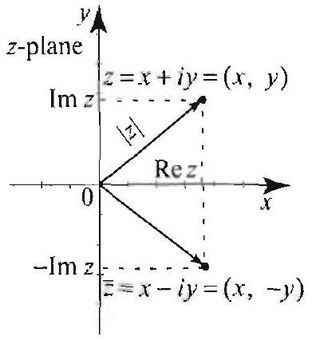
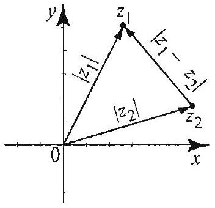
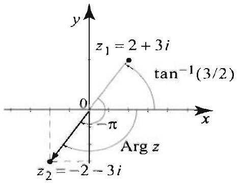
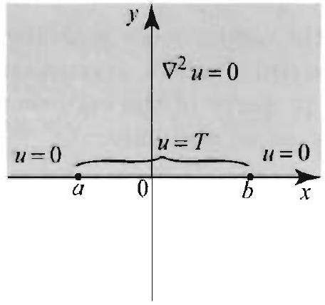
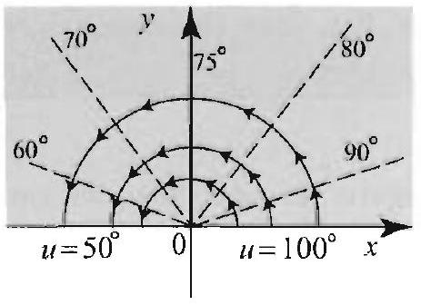
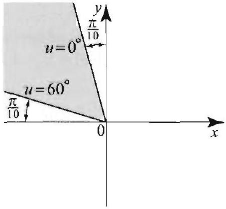
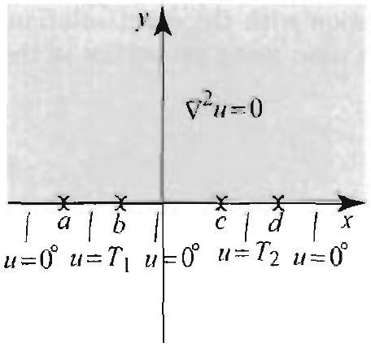
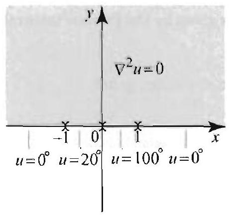

### 16.5 Analytic Functions

In the remaining sections of this chapter we explore a connection between complex-valued functions and the solution of partial differential equations.

Figure 1 Identifying a complex number $z$ with a point in the Cartesian plane; the complex conjugate $Z$; the norm $|z|$ of $z$.

If $z=x+i y$, where $x$ and $y$ are real numbers, we call $x$ the real part of $z$ and $y$ its imaginary part, and set $x=\operatorname{Re} z$ and $y=\operatorname{Im} z$. We denote the set of all complex numbers by $\mathbb{C}$. We identify a complex number $z=x+i y$ with a point ( $x, y$ ) in the Cartesian plane (referred to as the complex plane), much like a real number is identified with a point on the real number line (Figure 1). We introduce the notion of distance between two complex numbers, using the distance formula from the Cartesian plane: If $z_{1}=x_{1}+i y_{1}$ and $z_{2}=x_{2}+i y_{2}$, then the distance between $z_{1}$ and $z_{2}$ is

$$
\left|z_{1}-z_{2}\right|=\sqrt{\left(x_{1}-x_{2}\right)^{2}+\left(y_{1}-y_{2}\right)^{2}}
$$

(Figure 2). In particular, the modulus or absolute value of a complex number $z=x+i y$ is its distance to the origin: $|z|=\sqrt{x^{2}+y^{2}}$ (Figure 1). The complex conjugate of $z=x+i y$ is the complex number $\bar{z}=x-i y$. We have

$$
z \cdot \bar{z}=x^{2}+y^{2}
$$

Figure 2 Distance between two complex numbers $z_{1}$ and $z_{2}$.

Figure 3 Polar representation $z=|z| e^{i \theta}, \theta$ is the argument of $z$.

Thus $z \cdot \bar{z}$ is always a nonnegative real number and $z \cdot \bar{z}=0 \Leftrightarrow z=0$. In terms of the complex conjugate, we have $|z|=\sqrt{z \bar{z}}$.

Using polar coordinates, we write a nonzero complex number in polar form, $z=r(\cos \theta+i \sin \theta)$, where $r=|z|=\sqrt{x^{2}+y^{2}}$ and $\theta$ is the polar angle in Figure 3. With the help of Euler's identity, $e^{i \theta}=\cos \theta+i \sin \theta$, we can also write $z=r e^{i \theta}$. The angle $\theta$ is called the argument of $z$ and is denoted $\arg z$. It is clear that $\arg z$ is not single-valued: If $\alpha$ is one value of the argument, then any value of the form $\alpha+2 k \pi$, where $k$ is an integer, is also the argument of $z$. The unique value of $\arg z$ in the interval $(-\pi, \pi]$ is called the principal value of the argument and is clenoted by $\operatorname{Arg} z$.

The polar representation can be used to describe geometrically the effect of multiplication. Given two complex numbers $z_{1}=r_{1} e^{i \theta_{1}}$ and $z_{2}=r_{2} e^{i \theta_{2}}$, we have

$$
z_{1} \cdot z_{2}=r_{1} e^{i \theta_{1}} r_{2} e^{i \theta_{2}}=r_{1} r_{2} e^{i\left(\theta_{1}+\theta_{2}\right)}
$$

Thus to multiply two complex numbers we multiply their moduli and add their arguments.

## Complex Functions

A complex-valued function of a complex variable, or simply a complex function, is a mapping $w=f(z)$ whose domain is a subset of the complex $z$-plane and whose range is a subset of the complex $w$-plane. By taking real and imaginary parts. we can visualize such a function as a mapping from a subset of the Cartesian $x y$-plane into the Cartesian $u v$-plane. We have the relations, $f(z)=u(z)+i v(z)$ or $f(z)=u(x, y)+i v(x, y)$, where $u(x, y)=\operatorname{Re}(f(z))$ and $v(x, y)=\operatorname{Im}(f(z))$ (Figure 4).

The following examples illustrate these concepts.

## EXAMPLE 1 Functions of a complex variable

In each of the following examples, we express the function in the form $f(z)= u(x, y)+i v(x, y)$, where $z=x+i y$.
(a) The function $f(z)=\operatorname{Im} z$ is real-valued. We have $u(x, y)=y$ and $v(x, y)=0$.
(b) A linear function is of the form $f(z)=\alpha z+\beta$, where $\alpha$ and $\beta$ are complex numbers. Write $\alpha=a+i b$ and $\beta=c+i d$ where $a, b, c$, and $d$ are real. Then

$$
f(z)=(a+i b)(x+i y)+c+i d=a x-b y+c+i(b x+a y+d)
$$

Thus $u(x, y)=a x-b y+c$ and $v(x, y)=b x+a y+d$.
(c) For the exponential function, $f(z)=e^{z}$, we have

$$
e^{z}=e^{x+i y}=e^{x} e^{i y}=e^{x}(\cos y+i \sin y)
$$

Thus $u(x, y)=e^{x} \cos y$ and $v(x, y)=e^{x} \sin y$.
(d) The sine function is defined in terms of the exponential function as follows:

$$
\sin z=\frac{e^{i z}-e^{-i z}}{2 i}
$$

Notice that if $z=x$ is real, then $\sin z$ reduces to the usual sine function because $\frac{e^{i x}-e^{-i x}}{2 i}=\sin x$, by Euler's identity. Using $e^{i x}=\cos x+i \sin x$ and $\frac{1}{i}=-i$, we have

$$
\begin{aligned}
\sin z & =\frac{e^{i(x+i y)}-e^{-i(x+i y)}}{2 i}=\frac{e^{i x} e^{-y}-e^{-i x} e^{y}}{2 i} \\
& =\sin x \frac{e^{y}+e^{-y}}{2}+i \cos x \frac{e^{y}+e^{-y}}{2} \\
& =\sin x \cosh y+i \cos x \sinh y
\end{aligned}
$$

(e) We define the cosine function by

$$
\cos z=\frac{e^{i z}+e^{-i z}}{2}
$$

Computing as in (d), we find

$$
\cos z=\cos x \cosh y-i \sin x \sinh y
$$

(f) The complex logarithm is trickier to define. There are many "branches" of the logarithm. The principal branch of the logarithm is defined for all $z \neq 0$ by

$$
\log z=\ln |z|+i \operatorname{Arg} z
$$

where $\operatorname{Arg} z$ is the principal value of the argument. Taking real and imaginary parts of the function $\log z$, we find $u(x, y)=\ln |z|=\frac{1}{2} \ln \left(x^{2}+y^{2}\right)$ and $v(x, y)= \tan ^{-1}\left(\frac{y}{x}\right)$, where the value of the inverse tangent must be chosen in the interval ( $-\pi, \pi]$ (see (8)-(10) for explicit formulas for Arg $z$ in terms of $x$ and $y$ ). For any complex number $z \neq 0$, we have

$$
e^{\log z}=e^{\ln |z|+i \operatorname{Arg} z}=e^{\ln |z|} e^{i \operatorname{Arg} z}=|z| e^{i \operatorname{Arg} z}=z
$$

where we have used the fact that $\ln x$ and $e^{r}$ are inverse functions (hence $e^{\ln |z|}= |z|$ ), and we have used the polar representation $z=|z| e^{i \operatorname{Arg} z}$. As a result, we see that $e^{\log z}=z$, which is analogous to the inverse function relationship between $e^{x}$ and $\operatorname{In} x$. Notice however that the identity $\log \left(e^{z}\right)=z$ does not always hold (Exercise 22).

Figure $5 \operatorname{Arg} z$ is not continuous when $z_{0}=x_{0} \leq 0$. Limit of $\operatorname{Arg} z$ along the curve $C$ is $\pi$, but the limit along the curve $C^{\prime}$ is $-\pi$

Figure 6 Branch cut of $\log 2$, where the function fails to be continuous.

A complex function $f(z)=u(x, y)+i v(x, y)$ is continuous if and only if both $u$ and $v$ are continuous. You can verify that the functions in Example 1(a)-(e) are continuous for all $z=x+i y$. The logarithmic function $\log z$ is not defined at $z=0$ and is not continuous at all $z$ on the negative real axis. To see this, let $z_{0}=x_{0}$ with $x_{0}<0$. By definition of the principal value, we have $\operatorname{Arg} z_{0}=\pi$. If $z$ approaches the point $z_{0}$ from the lower half-plane, then $\operatorname{Arg} z$ tends to $-\pi$ which is not equal to $\operatorname{Arg} z_{0}$. Thus $\lim _{z \rightarrow z_{0}} \operatorname{Arg} z \neq \operatorname{Arg} z_{0}$ and so $\operatorname{Arg} z$ is not continuous at the point $z_{0}$ (Figure 5). It follows that $\log z$ is not continuous at $\varepsilon_{0}$. The set of points $z=x$, where $x \leq 0$ is called a branch cut for $\log z$ (Figure 6). We just proved that $\log z$ is not continuous at all the points on its branch cut. At all other points in the plane, $\log z$ is continuous.

## Analytic Functions, the Cauchy-Riemann Equations

We say that $f(z)$ is differentiable at $z$ if its derivative $f^{\prime}(z)$, or $\frac{d}{d z} f(z)$, exists and is finite at $z$, where

$$
f^{\prime}(z)=\lim _{\zeta \rightarrow z} \frac{f(\zeta)-f(z)}{\zeta-z}
$$

If $S$ is an open set in the complex plane we say that $f$ is analytic on $S$ if $f$ is differentiable at all points $z$ in $S$. A function is analytic at one point $z_{0}$ if it is analytic on an open set that contains $z_{0}$. Definition (1) resembles the familiar definition of the derivative of a function of a real variable from calculus. So you should not hesitate to try techniques from calculus in computing the limit in (1), especially if $f$ is a polynomial or a rational function. For example, if $f(z)=z$, then

$$
f^{\prime}(z)=\lim _{\zeta \rightarrow z} \frac{f(\zeta)-f(z)}{\zeta-z}=\lim _{\zeta \rightarrow z} \frac{\zeta-z}{\zeta-z}=1
$$

as expected. However, keep in mind that unlike a real variable which can vary in only two directions, the complex variable $\zeta$ in (1) can approach $z$ in infinitely many ways, and to say that (1) exists we mean that it exists and is the same no matter how we approach $z$. This is clearly a stronger requirement than the existence of the derivative in the real variable case. For this reason analytic functions have distinctive properties that are not shared by differentiable functions of a real variable. One of these striking propertios is expressed by the following result.

THEOREM 1 CAUCHY-RIEMANN EQUATIONS

Figure 7 Evaluating the limit (1), as $\zeta$ approaches $z$ in two different (special) ways.

The function $f(z)=u(x, y)+i v(x, y)$ is analytic in an open set $S$ if and only if the partial derivatives of $u$ and $v$ are continuous and satisfy the Cauchy-Riemann equations

$$
u_{x}=v_{y} \quad \text { and } \quad u_{y}=-v_{x} .
$$

Furthermore, if $f$ is analytic, then the derivative $f^{\prime}(z)$ is given as either of

$$
f^{\prime}(z)=u_{x}(x, y)+i v_{x}(x, y) \text { or } f^{\prime}(z)=v_{y}(x, y)-i u_{y}(x, y) .
$$

Thus the real and imaginary parts of an analytic function cannot be arbitrary of each other: They depend on each other in a precise manner described by the Cauchy-Riemann equations.
Proof Here we shall prove only one direction in the theorem. (For the full proof see [1], Chapter 2.) Suppose that $f$ is analytic at $z=x+i y$ so that the limit (1) exists. To prove that the Cauchy Riemann equations and (3) hold, we compute the limit (1) in two different ways: once by taking $\zeta=z+\Delta x$ and once by taking $\zeta=z+i \Delta y$, where $\Delta x$ and $\Delta y$ are small increments in $x$ and $y$ (Figure 7). If $\zeta=z+\Delta x=x+\Delta x+i y, \zeta-z=\Delta x$, and (1) becomes

$$
\begin{aligned}
f^{\prime}(z) & =\lim _{\Delta x \rightarrow 0} \frac{u(x+\Delta x, y)+i v(x+\Delta x, y)-(u(x, y)+i v(x, y))}{\Delta x} \\
& =\lim _{\Delta x \rightarrow 0} \frac{u(x+\Delta x, y)-u(x, y)}{\Delta x}+i \lim _{\Delta x \rightarrow 0} \frac{v(x+\Delta x, y)-v(x, y)}{\Delta x} \\
& =\frac{\partial u}{\partial x}+i \frac{\partial v}{\partial x} .
\end{aligned}
$$

In a similar way, if $\zeta=z+i \Delta y=x+i(y+\Delta y), \zeta-z=i \Delta y$, and (1) becomes

$$
\begin{aligned}
f^{\prime}(z) & =\lim _{\Delta y \rightarrow 0} \frac{u(x, y+\Delta y)+i v(x, y+\Delta y)-(u(x, y)+i v(x, y))}{i \Delta y} \\
& =\lim _{\Delta y \rightarrow 0}(-i) \frac{u(x, y+\Delta y)-u(x, y)}{\Delta y}+\lim _{\Delta y \rightarrow 0} \frac{v(x, y+\Delta y)-v(x, y)}{\Delta y} \\
& =\frac{\partial v}{\partial y}-i \frac{\partial u}{\partial y},
\end{aligned}
$$

where on the second line we have $1 / i=-i$ and $(-i) \cdot i=1$. Since $f^{\prime}(z)$ does not depend on how we approach $z$, equating the previous two limits, we see that (2) and (3) hold.

The following examples illustrate how Theorem 1 can be used to establish analyticity and compute derivatives.

## EXAMPLE 2 Applying the Cauchy-Riemann equations

Refer to the functions in Example 1.
(a) The function $f(z)=\operatorname{Im} z=y$ has real part $u(x, y)=y$ and imaginary part $v(x, y)=0$. Computing partial derivatives, we find $u_{x}=0, u_{y}=1, v_{x}=v_{y}=0$. Thus the equality $u_{y}=-v_{x}$ holds nowhere, and so the Cauchy-Riemann equations do not hold for any $z=x+i y$. Consequently, the function is not analytic at any point in the complex plane.
(b) Using the definition (1), it is straightforward to show that the derivative of the linear function $f(z)=\alpha z+\beta$ is $f^{\prime}(z)=\alpha$. Let us derive this result using Theorem 1 . Write $\alpha=a+i b$ and $\beta=c+i d, u(x, y)=a x-b y+c$ and $v(x, y)=b x+a y+d$. Then $u_{x}=a, u_{y}=-b, v_{x}=b$, and $v_{y}=a$. Thus $u_{x}=v_{y}$ and $u_{y}=-v_{x}$ for all $(x, y)$. Hence the Cauchy-Riemann equations hold and the partial derivatives are continuous at all points. It follows that the function is analytic for all $z$. Moreover, $f^{\prime}(z)=u_{x}+i v_{x}=a+i b=\alpha$.
(c) If $f(z)=e^{z}$, then $u=e^{x} \cos y, v=e^{x} \sin y, u_{x}=e^{x} \cos y, u_{y}=-e^{x} \sin y$, $v_{x}=e^{x} \sin y$, and $v_{y}=e^{x} \cos y$. The partial derivatives are continuous and satisfy the Cauchy-Riemann equations: $u_{x}=v_{y}$ and $u_{y}=-v_{x}$ for all $(x, y)$. Consequently, $f(z)=e^{z}$ is analytic for all $z$ and $f^{\prime}(z)=u_{x}+i v_{x}=e^{x} \cos y+i \rho^{x} \sin y=e^{z}$.
(d) It is a straightforward exercise to show that $\sin z$ is analytic for all $z$ and $\frac{d}{d z} \sin z=\cos z$ (Exercise 27(a)).
(e) Similarly, $\cos z$ is analytic for all $z$ and $\frac{d}{d z} \cos z=-\sin z$ (Exercise 27(b)).
(f) As in the real case, if $f(z)$ is analytic at a point $z$ then it is necessarily continuous at $z$. Thus $\log z$ is not analytic at the branch cut since it is not continuous there. For all other points in the complex plane, recall from Example 1(f) that $u(x, y)=\frac{1}{2} \ln \left(x^{2}+y^{2}\right)$. So

$$
u_{x}=\frac{x}{x^{2}+y^{2}} \quad \text { and } \quad u_{y}=\frac{y}{x^{2}+y^{2}} .
$$

In terms of the inverse tangent, the imaginary part of $\log z$ is $v(x, y)=\tan ^{-1} \underset{x}{y}+ k \pi$, where $k=0, \pm 1$, depending on the location of the point ( $x, y$ ) (see the discussion following Example 3, below). Using that $\frac{d}{d x} \tan ^{-1} x=\frac{1}{1+x^{2}}$ and the chain rule, it is straightforward to show that

$$
v_{x}=\frac{-y}{x^{2}+y^{2}} \quad \text { and } \quad v_{y}=\frac{x}{x^{2}+y^{2}}
$$

(Exercise 53). Thus, the partial derivatives are continuous and the Cauchy-Riemann equations, $u_{x}=v_{y}$ and $u_{y}=-v_{x}$, hold. It follows that, for all $z=x+i y$ not on the branch cut of $\log z$,

$$
\frac{d}{d z} \log z=u_{x}+i v_{x}=\frac{x-i y}{x^{2}+y^{2}}=\frac{1}{z} .
$$

You should justify the last equality (Exercise 53). $\square$

Functions that are analytic for all $z$ are called entire. Thus $\alpha z+\beta, e^{z}$, $\cos z$, and $\sin z$ are all entire functions, but $\log z$ is not entire.

For ease of reference, we now state some properties of the derivative, which are similar to properties of the derivative of a function of a real variable.

THEOREM 2 PROPERTIES OF ANALYTIC FUNCTIONS

THEOREM 3 ANALYTIC FUNCTIONS AND LAPLACE'S EQUATION

Suppose that $f$ and $g$ are analytic on an open set $S$ and $c_{1}, c_{2}$ are complex constants. Then $c_{1} f+c_{2} g$ and $f g$ are analytic on $S$ with

$$
\begin{aligned}
\left(c_{1} f+c_{2} g\right)^{\prime}(z) & =c_{1} f^{\prime}(z)+c_{2} g^{\prime}(z) \text { and } \\
(f g)^{\prime}(z) & =f^{\prime}(z) g(z)+f(z) g^{\prime}(z) .
\end{aligned}
$$

Also, $\frac{f}{g}$ is analytic on $S$ minus the points where $g=0$, and

$$
\left(\frac{f}{g}\right)^{\prime}(z)=\frac{f^{\prime}(z) g(z)-f(z) g^{\prime}(z)}{(g(z))^{2}} \quad(g(z) \neq 0) .
$$

If $g$ is analytic at $z_{0}$ and $f$ is analytic at $g\left(z_{0}\right)$, then the composition $(f \circ g)(z)$ is analytic at $z_{0}$ and we have the chain rule

$$
(f \circ g)^{\prime}\left(z_{0}\right)=f^{\prime}\left(g\left(z_{0}\right)\right) g^{\prime}\left(\sigma_{0}\right)
$$

Using linear combinations of powers of $z$ and appealing to Theorem 2, we conclude that a polynomial $p(z)=a_{n} z^{n}+a_{n-1} z^{n-1}+\cdots+a_{1} z+a_{0}$ is an entire function. Appealing to the quotient rule, we see that a rational function $q(z)=\frac{f(z)}{g(z)}$, where $f$ and $g$ are polynomials, is analytic at all $z$ where $g(z) \neq 0$.

Typically, any function that algebraically manipulates $z$ will be differentiable; however, as we saw in Example 2(a), analyticity can easily fail. Functions such as $\operatorname{Re} z, \operatorname{Im} z$, and $\bar{z}$ are not analytic at any point. (See Exercise 30.)

## The Role of Analytic Functions

Soon we will show powerful applications of analytic functions to partial differential equations. Indeed, the connection between these two fields can be established at this point using the Cauchy-Riemann equations. We have the following important result.

Suppose that $f=u+i v$ is analytic on an open set $S$. Then its real and imaginary parts, $u(x, y)$ and $v(x, y)$, are harmonic on $S$; that is, $u$ and $v$ satisfy Laplace's equation $\nabla^{2} \phi=0$ on $S$.

Proof By a well-know property of analytic functions, if $f$ is analytic then it has derivatives of all orders. This implies that if $f=u+i v$ is analytic then $u$ and $v$ have partial derivatives of all orders and these derivatives are continuous. Moreover, since $f$ is analytic, by the Cauchy-Riemann equations, we have

$$
u_{x}=v_{y} \quad \text { and } \quad u_{y}=-v_{x} .
$$

Figure 8 The inverse tangent takes its values in $\left(\frac{-\pi}{2}, \frac{\pi}{2}\right)$.

Figure 9 Computing $\operatorname{Arg} z$.

Taking derivatives of second order, we find

$$
\begin{aligned}
u_{x}=v_{y} & \Rightarrow u_{x x}=v_{y x} \\
u_{y}=-v_{x} & \Rightarrow u_{y y}=-v_{y x}
\end{aligned}
$$

where we have interchanged the order of the derivatives-a step that is justified because the partial derivatives are continuous. Hence $u_{x x}+u_{y y}=v_{y x}-v_{y x}=0$. and so $u$ satisfies Laplace's equation. A similar proof works for $v$.

We can use Theorem 3 to generate many interesting examples of harmonic functions; simply take the real or imaginary part of any analytic function.

## EXAMPLE 3 Harmonic functions

(a) The function $f(z)=z^{2}=x^{2}-y^{2}+2 i x y$ is entire. Thus $u(x, y)=x^{2}-y^{2}$ and $v(x, y)=x y$ are harmonic for all $(x, y)$, because $u=\operatorname{Re} f$ and $v=\frac{1}{2} \operatorname{Im} f$.
(b) The function $f(z)=e^{z}=e^{x}(\cos y+i \sin y)$ is entire. Thus $u(x, y)=e^{x} \sin y$ and $v(x, y)=e^{x} \cos y$ are harmonic for all $(x, y)$.
(c) The function $f(z)=\log z=\ln |z|+i \operatorname{Arg} z$ is analytic on $\mathbb{C}$ minus $(-\infty, 0]$. Thus $u(x, y)=\ln |z|=\frac{1}{2} \ln \left(x^{2}+y^{2}\right)$ and $v(x, y)=\operatorname{Arg} ;$ are harmonic on the region $\Omega=\mathbb{C} \backslash(-\infty, 0]$. (In fact, we know from Proposition 2. Section 16.2, that $\frac{1}{2} \ln \left(x^{2}+y^{2}\right)$ is harmonic for all $(x, y) \neq(0,0)$.)

The function $\operatorname{Arg} z$ is harmonic for all $z$ except for $z=a$ : with $x \leq 0$. It is useful to have an expression of $\operatorname{Arg} z$ in terms of $x$ and $y$. Recall that the inverse tangent is a function that takes values in the interval $\left(-\frac{\pi}{2}, \frac{\pi}{2}\right)$ (Figure 8), thus the equality $\operatorname{Arg} z=\tan ^{-1}\left(\frac{y}{x}\right)$ holds only when $\operatorname{Arg} z$ is in the interval $\left(-\frac{\pi}{2}, \frac{\pi}{2}\right)$. If $\operatorname{Arg} z$ is not in this interval, we need to modify the value of the inverse tangent by adding $\pm \pi$. You can check that for $z=x+i y$ with $x \neq 0$,

$$
\operatorname{Arg} z= \begin{cases}\tan ^{-1}\left(\frac{y}{x}\right) & \text { if } x>0 ; \\ \tan ^{-1}\left(\frac{y}{x}\right)+\pi & \text { if } x<0 \text { and } y \geq 0 ; \\ \tan ^{-1}\left(\frac{y}{x}\right)-\pi & \text { if } x<0 \text { and } y<0 .\end{cases}
$$

For example, in Figure 9, the point $z_{1}=2+3 i$ is in the first quadrant. Using a calculator, we find $\operatorname{Arg} z_{1}=\tan ^{-1} \frac{3}{2} \approx 0.983$. The point $z_{2}=-2-3 i$, is in the third quadrant, $\operatorname{Arg} z_{2}=\tan ^{-1} \frac{3}{2}-\pi \approx-2.159$. (We remind you that all angles are measured in radians.)

When $x$ is zero, we have

$$
\operatorname{Arg} z=\operatorname{Arg}(i y)= \begin{cases}\frac{\pi}{2} & \text { if } y>0 \\ -\frac{\pi}{2} & \text { if } y<0\end{cases}
$$

Figure 10 The inverse cotangent takes its values in $(0, \pi)$.

It is sometimes more convenient to use the inverse cotangent, especially for points in the upper half-plane. The inverse cotangent bakes its values in $(0, \pi)$ (Figure 10) and hence coincides with the values of $\operatorname{Arg} z$ if $\operatorname{Im} z>0$. We have

$$
\operatorname{Arg} z=\cot ^{-1}\left(\frac{x}{y}\right) \text { if } y>0 .
$$

Notice that $\operatorname{Arg} z$ is constant on rays through the origin; more generally, the function $u(z)=a \operatorname{Arg} z+b$, where $a$ and $b$ are real numbers, is constant on rays through the origin. This characteristic property of the argument function helps us solve certain Dirichlet problems, as we now illustrate.

## EXAMPLE 4 Using the argument function

Solve the Dirichlet problem $\nabla^{2} u=0$ in the half-plane $y>0$, given the boundary values

$$
u(x, 0)= \begin{cases}100 & \text { if } x>0 \\ 50 & \text { if } x<0\end{cases}
$$

Solution Since the boundary condition is constant on the rays $x \geq 0$ and $x \leq 0$, it is reasonable to expect that the solution be constant on rays in the upper half-plane. Based on this expectation, we try for a solution the function $u(x, y)=a \operatorname{Arg} z+b$, where $a$ and $b$ are real numbers and $z=x+i y$. The function is harmonic in the upper half-plane. Its values on the boundary are $u(x, 0)=b$ if $x>0$ and $u(x, 0)=a \pi+b$ if $x<0$. Thus, to satisty the boundary conditions, take $b=100$ and $a \pi+100=50$, so $a=-\frac{50}{\pi}$. Hence

$$
u(x, y)=-\frac{50}{\pi} \operatorname{Arg} z+100 .
$$

In terms of $x$ and $y$, we can use (10), since $y>0$, and get

$$
u(x, y)=-\frac{50}{\pi} \cot ^{-1}\left(\frac{x}{y}\right)+100 .
$$

As $y \rightarrow 0^{+}, \cot ^{-1}\left(\frac{x}{y}\right)$ tends to 0 if $x>0$ and $\pi$ if $x<0$, which shows that $u$ satisfies the boundary condition.

If we translate the boundary condition in Example 4 and center it at some point $x_{0}$ other than the origin, then it is necessary to translate the candidate function and consider instead the function $u(z)=a \operatorname{Arg}\left(z-x_{0}\right)+b$, which is also a harmonic function in the upper half-plane. The boundary values in this case are constant on the half-lines $x>x_{0}$ and $x<x_{0}$. As our next example illustrates, we can gencralize this process further and solve an important type of Dirichlet problems, in which the boundary values are constant on intervals. Similar problems were considered in Section 7.5.

Figure 11 A Dirichlet problem in the upper half-plane.

Figure 12 The angle $\alpha(x, y)$ tends to 0 if $(x, y)$ approaches a point on the $x$-axis outside the interval $(a, b)$ and it tends to $\pi$ if $(x, y)$ approaches a point on the $x$-axis inside the interval ( $a, b$ ).

## EXAMPLE 5 Using translates of the argument function

Given $a \therefore b$, solve the Dirichlet problem $\nabla^{2} u=0$ in the upper half-plane, with the boundary values (Figure 11)

$$
u(x, 0)= \begin{cases}0 & \text { if } x<a, \\ T & \text { if } a<x<b, \\ 0 & \text { if } b<x .\end{cases}
$$

Solution Due to the nature of the boundary values, we must involve the translates of $\operatorname{Arg} z$ by $a$ and $b$. We thus try for a solution the harmonic function $u(x, y)= \frac{a_{1}}{\pi} \operatorname{Arg}(z-a)+\frac{a_{2}}{\pi} \operatorname{Arg}(z-b)+a_{3}$, where $a_{j}(j=1,2,3)$ are real numbers to be determined. The function is harmonic in the upper half-plane. In order to determine its coefficients, we compute its boundary valucs. For any real number $w$, $\frac{a}{\pi} \operatorname{Arg} w=0$ if $w>0$ and $\frac{a}{\pi} \operatorname{Arg} w=a$ if $w<0$. So you can verify that

$$
u(x, 0)=\left\{\begin{aligned}
a_{1}+a_{2}+a_{3} & \text { if } x<a, \\
a_{2}+a_{3} & \text { if } a<x<b, \\
a_{3} & \text { if } b \cdot x .
\end{aligned}\right.
$$

Comparing with the given boundary values, we obtain a system of three equations in the unknowns $a_{1}, a_{2}$, and $a_{3}$ :

$$
\left\{\begin{aligned}
a_{1}+a_{2}+a_{3} & =0, \\
a_{2}+a_{3} & =T, \\
a_{3} & =0 .
\end{aligned}\right.
$$

Starting from the third equation and working our way up, we see that $a_{3}=0$, $a_{2}=T$, and $a_{1}=-T$. Thus $u(x, y)=\frac{T}{\pi}(\operatorname{Arg}(z-b)-\operatorname{Arg}(z-a))$. To write the solution in terms of $x$ and $y$, we use the inverse cotangent, since the imaginary parts of $z-a=(x-a)+i y$ and $z-b=(x-b)+i y$ are positive. We get

$$
u(x, y)=\frac{T}{\pi}\left[\cot ^{-1}\left(\frac{x-b}{y}\right)-\cot ^{-1}\left(\frac{x-a}{y}\right)\right] .
$$

In Figure 12, we have $\cot ^{-1}\left(\frac{x-b}{y}\right)=\alpha_{2}$ and $\cot ^{-1}\left(\frac{x-a}{y}\right)=\alpha_{1}$. Since the sum of the interior angles in a triangle is $\pi$, we obtain $\alpha_{1}+\left(\pi-\alpha_{2}\right)+\alpha(x, y)=\pi$, where $\alpha(x, y)$ is the angle at the point ( $x, y$ ) subtended by the interval ( $a, b$ ). Hence $\alpha(x, y)=\alpha_{2}-\alpha_{1}$, and so $u(x, y)$ is equal to a constant times $\alpha(x, y)$. In particular, $\alpha(x, y)$ is a harmonic function of ( $x, y$ ) in the upper half-plane, which tends to $\pi$ if we approach a boundary point in the interval $(a, b)$ and to 0 if we approach a boundary point outside the interval $(a, b)$. This is a useful fact that was observed in the exercises of Section 7.5. The function $\alpha(x, y)$ is called the harmonic measure of the interval ( $a, b$ ).

## The Harmonic Conjugate

Theorem 3 tells us that the real and imaginary parts of an analytic function are harmonic. Is every harmonic function the real or imaginary part of an

THEOREM 4 HARMONIC CONJUGATE
analytic function? More specifically, given a harmonic function $u$ on a region $\Omega$, can we find another harmonic function $v$ on $\Omega$ such that $f=u+i v$ is analytic on $\Omega$ ? If such a function $v$ exists, it is called a harmonic conjugate of $u$. The following result answers our question.

Suppose that $\Omega$ is a region (open and connected). Then every harmonic function $u$ on $\Omega$ has a harmonic conjugate $v$ on $\Omega$ if and only if $\Omega$ is simply connected (see Section 16.1 for the definition).

The statement of the theorem may appear unusual since the condition for the existence of the harmonic conjugate of $u$ is placed on the region and not on $u$ itself. To understand this peculiarity, consider the function $\frac{1}{2} \ln \left(x^{2}+y^{2}\right)$, which is harmonic on the region $\Omega_{1}=\mathbb{C}$ minus ( 0,0 ). It can be shown that $\frac{1}{2} \ln \left(x^{2}+y^{2}\right)$ does not have a harmonic conjugate on $\Omega_{1}$. However, since $\log z=\frac{1}{2} \ln \left|\ln \left(x^{2}+y^{2}\right)\right|+i \operatorname{Arg} z$ is analytic in $\Omega_{2}=\mathbb{C}$ minus $(-\infty, 0]$, it follows that a harmonic conjugate of $\frac{1}{2} \ln \left(x^{2}+y^{2}\right)$ in $\Omega_{2}$ is $\operatorname{Arg} z$. This example shows that the underlying region is crucial for the existence of the harmonic conjugate.

Theorem 4 guarantees the existence of a harmonic conjugate on any simply connected region such as the entire plane, a disk, a half-plane, a sector, or any other open and connected region with no holes in it. For an arbitrary region, we can always take a disk inside the region around any given point and then apply Theorem 4. As a result, we can say that any harmonic function is locally the real (or imaginary) part of an analytic function, where by "locally" we mean on any disk in the region where the function is harmonic.

Finding the harmonic conjugate can be achieved with the help of the Cauchy-Riemann equations, as we now illustrate.

## EXAMPLE 6 Finding harmonic conjugates

Show that $u(x, y)=x^{2}-y^{2}+x$ is harmonic in the entire plane and find a harmonic conjugate.
Solution We have $u_{x x}=2$ and $u_{y y}=-2$; hence $u_{x x}+u_{y y}=0$, and so $u$ is harmonic. To find a harmonic conjugate $v$, we use the Cauchy-Riemann equations as follows. We want $u+i v$ to be analytic. Hence $v$ must satisfy the Cauchy-Riemann equations

$$
\frac{\partial u}{\partial x}=\frac{\partial v}{\partial y}, \quad \text { and } \quad \frac{\partial u}{\partial y}=-\frac{\partial v}{\partial x} .
$$

Since $\frac{\partial u}{\partial x}=2 x+1$, the first equation implies that

$$
2 x+1=\frac{\partial v}{\partial y}
$$

To get $v$ we will integrate both sides of this equation with respect to $y$. However, because $v$ is a function of $x$ and $y$, the constant of integration in your answer may
be a function of $x$. Thus integrating with respect to $y$ yields

$$
v(x, y)=(2 x+1) y+c(x)
$$

where $c(x)$ is a function of $x$ alone. Plugging this into the second equation in (11), we get

$$
-2 y=-\left(2 y+\frac{d}{d x} c(x)\right)
$$

Hence $c(x)$ has zero derivative and so must be a constant. Let us pick any such constant and write $c(x)=C$. Substituting into the expression for $v$, we get $v(x, y)= (2 x+1) y+c(x)=2 x y+y+C$. You should verify the Cauchy-Riemann equations for the pair of functions $u$ and $v$ and conclude that $\left(x^{2}-y^{2}+x\right)+i(2 x y+y+C)$ is entire.

If $v$ is a harmonic conjugate of $u$, two questions come to mind:

- Is $v$ unique?
- What is a harmonic conjugate of $v$ ?

On any given simply connected region, $v$ is unique up to an additive constant. Also, if $v$ is a harmonic conjugate of $u$, then $-u$ is a harmonic conjugate of $v$ (Exercise 54).

## Orthogonal Trajectories and Harmonic Conjugates

So far we have defined the harmonic conjugate of a harmonic function $u$ as the imaginary part of an analytic function, $f=u+i v$, whose real part is $u$. We now interpret the harmonic conjugate in terms of orthogonal trajectories. This geometric interpretation gives the harmonic conjugate a concrete meaning.

Given a function of two variables, $u(x, y)$, the level curves of $u$ are defined by the equation $u(x . y)=C$. where $C$ is a constant in the range of $u$. To compute the slope of the tangent line, $\frac{d y}{d x}$, at a point on a level curve, we use the chain rule in two dimensions and differentiate with respect to $x$ both sides of $u(x, y)=C$ and get

$$
u_{x} \frac{d x}{d x}+u_{y} \frac{d y}{d x}=0
$$

Since $\frac{d x}{d x}=1$, we solve for $\frac{d y}{d x}\left(=m_{1}\right)$ and get

$$
m_{1}=\frac{d y}{d x}=-\frac{u_{x}}{u_{y}} .
$$

The orthogonal trajectories to the level curves $u(x, y)=C$ is the family of curves that intersects the level curves $u(x, y)=C$ at right angle at each point. Clearly, the two families of curves are mutually orthogonal.

Suppose that we have expressed the orthogonal trajectories in the form $\dot{\psi}(x, y)=C^{\prime}$ for some function $\psi$. As we just showed, the slope of the tangent line at any point of the orthogonal curves is given by $m_{2}=\frac{d y}{d x}=-\frac{v_{x}}{v_{y}}$. Since the slopes of orthogonal curves are negative reciprocals, we have
equivalently, the condition for two families to be mutually orthogonal is

Now suppose that $u$ is a harmonic function with harmonic conjugate $v$, and let us consider the level curves $u(x, y)=C$ and $v(x, y)=C^{\prime}$. Since $u+i v$ is analytic, the Cauchy Riemann equations hold: $u_{x}=v_{y}$ and $u_{y}=-v_{x}$. By (12), it follows that $u(x, y)=C$ and $v(x, y)=C^{\prime}$ are orthogonal families of curves. We thus have the following useful result.

Suppose that we have expressed the orthogonal trajectories in the form $\psi(x, y)=C^{\prime}$ for some function $\psi$. As we just showed, the slope of the tangent
line at any point of the orthogonal curves is given by $m_{2}=\frac{d y}{d x}=-\frac{v_{x}}{v_{y}}$. Since
the slopes of orthogonal curves are negative reciprocals, we have

$$
m_{1} \cdot m_{2}=-1 \Leftrightarrow \frac{u_{x}}{u_{y}} \cdot \frac{\psi_{x}}{\psi_{y}}=-1
$$

equivalently, the condition for two families to be mutually orthogonal is

$$
\frac{u_{x}}{u_{y}}=-\frac{\psi_{y}}{\psi_{x}}
$$

增 Now suppose that $u$ is a harmonic function with harmonic conjugate $v$, and
let us consider the level curves $u(x, y)=C$ and $v(x, y)=C^{\prime}$. Since $u+i v$ is
analytic, the Cauchy Riemann equations hold: $u_{x}=v_{y}$ and $u_{y}=-v_{x}$. By
(12), it follows that $u(x, y)=C$ and $v(x, y)=C^{\prime}$ are orthogonal familics of
curves. We thus have the following useful result. "

## THEOREM 5 ORTHOGONAL TRAJECTORIES   THEOREM 5 ORTHOGONAL S

If $u$ is harmonic and $v$ is a harmonic conjugate of $u$, then the level curves $u(x, y)=C$ and $v(x, y)=C^{\prime}$ are mutually orthogonal.

We give two interpretations of a harmonic conjugate. In heat flow, we can think of $u(x, y)$ as the solution of a Dirichlet problem on a region $\Omega$. Then the level curves $u(. x . y)=C$ represent the isotherms or curves of constant temperature inside $\Omega$. The curves of heat flow inside $\Omega$ are the curves that give the direction along which heat is flowing inside $\Omega$. According to Fourier's law of heat conduction, heat flows from hot to cold in the direction in which the temperature difference is the greatest. If along the isotherms the temperature difference is 0 (the temperature is constant), then the temperature difference is largest along the curves that are orthogonal to the isotherms. (Recall that the gradient of $u, \nabla u=\left(u_{x}, u_{y}\right)$, points in the direction of greatest change in a function, and the gradient is perpendicular to the level curves of $u$.) Consequently, by Theorem 5, the curves of heat flow are given by the level curves of the harmonic conjugate $v$ of $u$.

In electricity and magnetism, the force of attraction or repulsion between charged particles is the gradient of a harmonic function $u$, known as the electrostatic potential. The level curves, $u(x, y)=C$, represcut the equipotential lines. In this case, the level curves of a harmonic conjugate $v$ of $u$ give the direction of the electric force in the field and are known as the lines of force.

Figure 13 The isotherms are rays at angle $\frac{\pi}{50}(100-T)$.

Figure 14 The isotherms and curves of heat flow are orthogonal.

## EXAMPLE 7 Isotherms and curves of heat flow

Determine the isotherms and curves of heat flow in Example 4.
Solution The boundary values are 50 and 100 , so the temperature inside the region will vary between these two values. For $50<T<100$, the isotherms are given by the level curves $u(x, y)=T$, or

$$
\begin{aligned}
-\frac{50}{\pi} \cot ^{-1}\left(\frac{x}{y}\right)+100=T & \Rightarrow \cot ^{-1}\left(\frac{x}{y}\right)=\frac{\pi}{50}(100-T) \\
& \Rightarrow \frac{x}{y}=\cot \left[\frac{\pi}{50}(100-T)\right] \\
& \Rightarrow y=\tan \left[\frac{\pi}{50}(100-T)\right] x
\end{aligned}
$$

Thus the isotherms are rays through the origin at angle $\frac{\pi}{50}(100-T)$, since the slope is $\tan \left[\frac{\pi}{50}(100-T)\right]$. As $T$ varies from 100 to 50 , this angle varies from 0 to $\pi$, which agrees with our expectation, given the boundary conditions. Some isotherms are shown in Figure 13.

The curves of heat flow are the level curves of a harmonic conjugate of $u$. From Example 4, $u=-\frac{50}{\pi} \operatorname{Arg} z+100$. Now, recall that $\log z=\ln |z|+i \operatorname{Arg} z$ is analytic in the upper half-plane. So Arg $z$ is a harmonic conjugate of $\ln |z|$; consequently, $-\ln |z|$ is a harmonic conjugate of $\operatorname{Arg} z$. Hence a harmonic conjugate of $u$ is $v=\frac{50}{\pi} \ln |z|$. (Here we have used that if $v$ is a harmonic conjugate of $u$, then $\alpha v$ is a harmonic conjugate of $\alpha u+\beta$, where $\alpha$ and $\beta$ are real constants.) In terms of $x$ and $y$, we have $v(x, y)=(25 / \pi) \ln \left(x^{2}+y^{2}\right)$, and so the curves of heat flow are given by the level curves $(25 / \pi) \ln \left(x^{2}+y^{2}\right)=C$. Multiplying by $\frac{\pi}{25}$ and then taking the exponential, we get $x^{2}+y^{2}=R$, where $R>0$. Thus the curves of heat flow are semi-circles centered at the origin. In Figure 14 we show some isotherms and curves of heat flow. Notice the orthogonality of these two families of curves. Figure 14 also illustrates Fourier's law that heat is flowing from hot to cold in the direction in which the temperature difference is the greatest .

In the following section we explore another connection between analytic functions and harmonic functions, and develop the method of conformal mappings for solving Laplace's equation.

## Exercises 12.5

Exercises 1-20 are intended as reviow of basic topies in complex numbers and functions. In these exercises, take $n=0 \pm 1, \pm 2, \ldots$, and $z=x+i y$, unless otherwise specified.
In Exercises 1-4, write the given complex number in the form $a+i b$, where $a$ and $b$ are real numbers.
1.
(a) $(3+2 i)(2-i)$.
(b) $\quad(3-i) \overline{(2-i)}$.
(c) $\frac{1+i}{1-i}$.
2. (a) $\quad i(2-i)^{2}$.
(b) $\overline{(3+i) \overline{(1-i)}}$.
(c) $\frac{2-i}{i}$.
3. (a) $\frac{1}{i}$.
(b) $(i)^{n}$.
(c) $(\bar{i})^{n}$.
4. (a) $\overline{\left(\frac{3+i}{1-i}\right)}$.
(b) $i^{2}+i^{20}+i^{200}+i^{202}$.
(c) $\sum_{n=0}^{1001} i^{n}$.

For the given complex number in Exercises 5-16, (a) find the principal value of the argument. (b) Compute the modulus. (c) Write the number in the form $r^{i \theta}$.
5. $\quad i$.
6. $-i$.
7. $\pi$.
8. $-\pi$.
9. $1+i$.
10. $1-i$.
11. $-1+i$.
12. $-1-i$.
13. $(1+i)^{2}$.
14. $\frac{1}{1+i}$.
15. $\cos \alpha+i \sin \alpha$. 16. $\cos \alpha-i \sin \alpha$.

In Exercises 17-20, evaluate the function and write your answer in the form $a+i b$, where $a$ and $b$ are real numbers.
17.
(a) $e^{2 i}$.
(b) $\sin i$.
(c) $\cos i$.
(d) $\log i$.
18.
(a) $e^{1-\pi i}$.
(b) $\sin (2+\pi i)$.
(c) $\log (-7)$.
(d) $\quad \log 1$.
19.
(a) $e^{-\frac{\pi}{2} i}$.
(b) $e^{2-\frac{\pi}{2} i}$.
(c) $\quad \log (1-i)$.
(d) $\quad \log (1-i)^{2}$.
20.
(a) $e^{\log (1+5 \pi i)}$.
(b) $\quad \log \left(e^{1+5 \pi i}\right)$.
(c) $\log [(-1) \cdot i]$.
(d) $\log (-1)+\log i$.
21. Give an example to show that $\log \left(z_{1} \cdot z_{2}\right)$ is not always equal to $\log \left(z_{1}\right)+ \log \left(z_{2}\right)$.
22. Give an example to show that $\log \left(e^{z}\right)$ is not always equal to $z$. Find a necessary and sufficient condition on $z$ for the equality $\log \left(e^{z}\right)=z$ to hold.

In Exercises 23-26, derive the given identity. Take $z=x+i y$.
23.
(a) $\left|e^{z}\right|=e^{x}$.
(b) $\left|e^{i z}\right|=e^{-y}$.
24.
(a) $|\sin z|=\sqrt{\sin ^{2} x+\sinh ^{2} y}$.
(b) $|\cos z|=\sqrt{\cos ^{2} x+\sinh ^{2} y}$.
25.
(a) $\cos (i x)=\cosh x$.
(b) $\quad \sin (i x)=i \sinh x$.
26.
(a) $\overline{e^{z}}=e^{\bar{z}}$.
(b) $\overline{\sin z}=\sin \bar{z}$.

In Exercises 27-30, use the Cauchy-Riemann equations to verify whether the given function is analytic. If it is, compute its derivative using either one of the identities in (9).
27.
(a) $\sin z$.
(b) $\cos z$.
28.
(a) $e^{z}+z$.
(b) $z^{2}$.
29.
(a) $\frac{x+i y}{x^{2}+y^{2}}$.
(b) $\frac{x-i y}{x^{2}+y^{2}}$.
30.
(a) $\bar{z}$.
(b) $\operatorname{Re} z$.

In Exercises 31-34, verify that the given function is harmonic, and then find a harmonic conjugate using the technique of Example 6.
31. $x^{2}-y^{2}+x y$.
32. $x^{2}-y^{2}-2 x+1$.
33. $e^{x} \cos y$.
34. $\cos x \sinh y$.

Figure 15 Dirichlet problem in Exercise 42.

Figure 16 Dirichlet problem in Exercise 43.

In Exercises 35-36, by guessing find an analytic function $f$ such that the given function is the real or imaginary part of $f$. Using Theorem 3, determine where the given function is harmonic.
35. $\frac{y}{x^{2}+y^{2}}$.
36. $e^{2 x} \cos (2 y)$.
37. (a) Plot the level curves of the harmonic function $u(x, y)=\frac{y}{x^{2}+y^{2}}$.
(b) Find and plot the orthogonal trajectories.
38. (a) Plot the level curves of the harmonic function $u(x, y)=\ln \left(x^{2}+y^{2}\right)$.
(b) Find and plot the orthogonal trajectories.
39. (a) For any integer $n$, show that $u(r, \theta)=r^{n} \cos (n \theta)$ and $v(r, \theta)=r^{n} \sin (n \theta)$ are harmonic on $\mathbb{C}$ if $n \geq 0$ and on $\mathbb{C} \backslash\{0\}$ if $n<0$.
(b) Find the harmonic conjugates of $u$ and $v$. [Hint: Consider $f(z)=z^{n}$ in polar coordinates.]
40. Translating and dilating a harmonic function. Suppose that $u$ is harmonic. Show that the following functions are also harmonic:
(a) $\quad u(x-\alpha, y-\beta)$, where $\alpha$ and $\beta$ are real numbers;
(b) $u(\alpha x, \alpha y)$, where $\alpha \neq 0$ is a real number.
41. Harmonic functions independent of $y$. Suppose that $u(x, y)$ is a harmonic function whose values depend only on $x$ and not on $y$. Using Laplace's equation, show that $u(x, y)=a x+b$, where $a$ and $b$ are real constants.

42 (a) Use Exercise 41 to solve the Dirichlet problem in the infinite vertical strip in Figure 15.
(b) Determine and plot the isotherms and curves of heat flow.
43. Solve the Dirichlet problem in Figure 16.
44. Solve the Dirichlet problem in Figure 17.
45. Solve the Dirichlet problem in Figure 18.
46. Determine and plot the isotherms and curves of heat flow in Exercise 42.

Figure 17 Dirichlet problem in Exercise 44.

Figure 18 Dirichlet problem in Exercise 45.

Figure 19 Dirichlet problem for Exercise 48.

Figure 20 Dirichlet problem for Exercise 49.

47. Solve the Dirichlet problem in the upper half-plane with boundary data on the $r$-axis given by

$$
u(x, 0)= \begin{cases}T_{1} & \text { if } a<x<b \\ T_{2} & \text { otherwise }\end{cases}
$$

where $a<b$ are fixed real numbers.
48. Project Problem: Harmonic measures of two disjoint intervals. In this exercise, we generalize the result of Example 5 by solving the Dirichlet problem in the upper half-plane with boundary data.

$$
u(x, 0)= \begin{cases}T_{1} & \text { if } a<x<b \\ T_{2} & \text { if } c<x<d \\ 0 & \text { otherwise }\end{cases}
$$

where $a<b \leq c<d$ (Figure 19).
(a) Show that if $u_{1}$ is a solution of the Dirichlet problem in the upper half-plane with boundary conditions

$$
u_{1}(x, 0)= \begin{cases}T_{1} & \text { if } a<x<b \\ 0 & \text { otherwise }\end{cases}
$$

and $u_{2}$ is a solution of the Dirichlet problem in the upper half-plane with boundary conditions

$$
u_{2}(x, 0)= \begin{cases}T_{2} & \text { if } c<x<d . \\ 0 & \text { otherwise },\end{cases}
$$

then the solution of the Dirichle problem in the upper half-plane with boundary data $u(x, 0)$ is $u(x, y)=u_{1}(x, y)+u_{2}(x, y)$.
(b) Show that $n(x, y)=\left(T_{1} / \pi\right) \alpha_{1}(x, y)+\left(T_{2} / \pi\right) \alpha_{2}(x, y)$ where $\alpha_{1}(x, y)$, respectively, $\alpha_{2}(x, y)$, is the angle at ( $x, y$ ) subtended by the interval ( $a, b$ ), respectively. (c, d).
49. (a) Solve the Dirichlet problem in Figure 20.
(b) Plot the isotherms.
50. Project Problem: Harmonic measures of several disjoint intervals. Generalize the result of Exercise 48 as follows. Suppose that $I_{1}, I_{2}, \ldots, I_{n}$ are disjoint open intervals on the $r$-axis, and $T_{1}, T_{2}, \ldots, T_{n}$ are real numbers. Consider the Dirichlet problem in the upper half-plane with boundary condition

$$
u(x, 0)= \begin{cases}T_{j} & \text { if } x \text { in } I_{j} \\ 0 & \text { otherwise } .\end{cases}
$$

Show that the solution is

$$
u(x, y)=\frac{1}{\pi} \sum_{j=1}^{n} T_{j} \alpha_{j}(x, y),
$$

where $\omega_{j}(x, y)$ is the angle at ( $x, y$ ) subtended by the interval $I_{j}$.
51. Project Problem: Approximation of steady-state solutions. Consider the Dirichlet problem in the upper half-plane with boundary values $u(x, 0)=f(x)$
$(-\infty<x<\infty)$, where $f(x)$ is an arbitrary function that represents the temperature of the points on the $x$-axis. In this exercise, we will show how we can use the result of Exercise 50 to approximate the solution for a given $f(x)$. The approach that we take has merit, since it can be used to obtain approximate numerical values for the steady-state temperature. Moreover, we will use it in Exercise 52 to justify the Poisson integral formula in the upper half-plane.

To be able to compare our numerical approximation with the exact solution, let us take $f(x)=\left(1+x^{2}\right)^{-1},-\infty<x<\infty$. In this case, using properties of the Poisson integral, we have the solution

$$
u(x, y)=\frac{1+y}{x^{2}+(1+y)^{2}}
$$

(see Exercise 6, Section 7.5).
(a) Pretend that we do not know the exact solution and proceed to find an approximate solution. The idea is to approximate $f(x)$ by a function that takes on constant values on disjoint intervals. Take the interval $(-5,5)$ and subdivide it into 40 smaller intervals of equal length, $\left(x_{j}, x_{j+1}\right), j=1,2, \ldots, 40$. Approximate $f$ on $\left(x_{j}, x_{j+1}\right)$ by $f\left(x_{j}\right)$, and by 0 outside the interval $(-5,5)$. Thus the boundary valucs are now replaced by

$$
u(x, 0)= \begin{cases}\frac{1}{1+x_{j}^{2}} & \text { if } x_{j}<x<x_{j+1} \\ 0 & \text { otherwise }\end{cases}
$$

Show that the solution is

$$
u(x, y)=\frac{1}{\pi} \sum_{j=1}^{40} \frac{1}{1+x_{j}^{2}} \alpha_{j}(x, y)
$$

where $\alpha_{j}(x, y)$ is the angle at $(x, y)$ subtended by the interval $\left(x_{j}, x_{j+1}\right)$.
(b) With the help of a computer, evaluate your approximate solution at various points, $\left(x_{0}, y_{0}\right)$, in the upper half-plane and compare with the exact solution (13).
52. Project Problem: From the harmonic measure to the Poisson integral formula. Consider the Dirichlet problem in the upper half-plane with boundary values $u(x, 0)=f(x),-\infty<x<\infty$, whose solution is given by the Poisson integral formula

$$
u(s, y)=\frac{y}{\pi} \int_{-\infty}^{\infty} \frac{f(x)}{(s-x)^{2}+y^{2}} d x, \quad-\infty<s<\infty, y>0
$$

Our goal in this exercise is to obtain this formula by using the numerical scheme of Exercise 51.
(a) Based on the approach in Exercise 51, explain how you would derive the approximate solution

$$
u_{\mathrm{app}}(s, y)=\frac{1}{\pi} \sum_{j=1}^{n} f\left(x_{j}\right) \alpha_{j}(s, y)
$$

where $x_{j}$ are equally spaced points on the $x$-axis and $\alpha_{j}(s, y)$ is the angle at the point $(s, y)$ subtended by the interval $\left(x_{j}, x_{j+1}\right)$.
(b) Show that

$$
u_{\text {app }}(s, y)=\frac{1}{\pi} \sum_{j=1}^{n} f\left(x_{j}\right)\left(\operatorname{Arg}\left(z-x_{j+1}\right)-\operatorname{Arg}\left(z-x_{j}\right)\right),
$$

where $z=s+i y$.
(c) Use the mean value theorem to show that there exists a $\xi_{j}$ in the interval $\left(x_{j}, x_{j+1}\right)$ such that $\operatorname{Arg}\left(z-x_{j+1}\right)-\operatorname{Arg}\left(z-x_{j}\right)=\frac{y}{\left(s-\xi_{j}\right)^{2}+y^{2}} \Delta x$, where $\Delta x= x_{j+1}-x_{j}$.
(d) Thus the approximate solution

$$
u_{\mathrm{app}}(s, y)=\frac{y}{\pi} \sum_{j=1}^{n} \frac{f\left(x_{j}\right)}{\left(s-\xi_{j}\right)^{2}+y^{2}} \Delta x .
$$

Let $\Delta x \rightarrow 0$ and explain why $u_{\text {app }}(s, y)$ should approach the Poisson integral (14). Hint: Interpret $u_{\text {app }}(s, y)$ as a Riemann sum that approximates the Poisson integral (14).]
53. Complete the details of Example 2(f) to show that $\log z$ is analytic off its branch cut and then show that its derivative is $\frac{1}{z}$.
54. Show that if $v$ is the harmonic conjugate of $u$, then $-u$ is the harmonic conjugate of $v$. [Hint: If $f=u+i v$ is analytic, what can you say about $i f$ ?]
