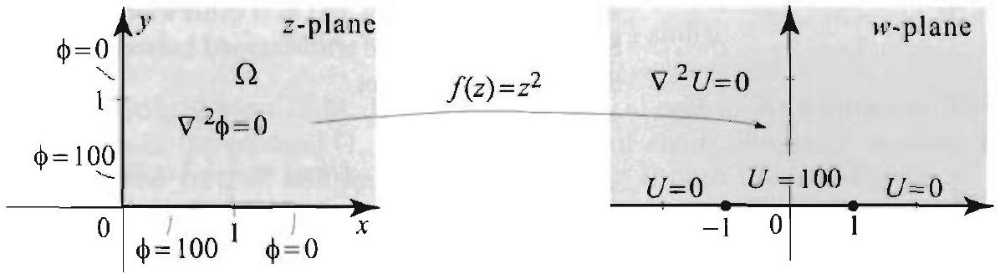
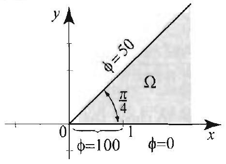
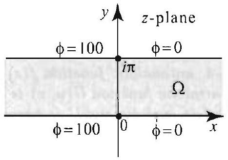
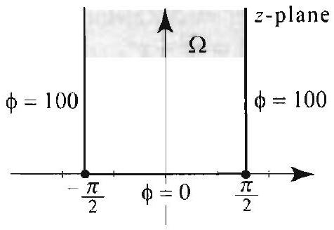
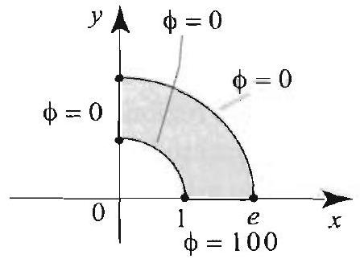

### 16.6 Solving Dirichlet Problems with Conformal Mappings

In solving a Dirichlet problem, it is sometimes advantageous to map the region under consideration to a simpler region or one on which the transformed problem is easier to solve. This is the idea behind the method of conformal mappings, which we now explain. Let a Dirichlet problem be given on a region $\Omega$ with boundary $\Gamma$. Suppose that we want to solve this problem by somehow transforming it first to the $w$-plane by means of a mapping $w=f(z)$, where $f$ is analytic on $\Omega$. If $f^{\prime}(z) \neq 0$ for all $z$ on $\Omega$, we call $f$ a conformal mapping of $\Omega$. These mappings are known to preserve the angles between curves and their orientation, and thus the term conformal. One of the important properties of a conformal mapping $f$ is that it takes regions into regions; that is, if $\Omega$ is a region (open, connected set), then $\Omega^{\prime}=f[\Omega]$ is also a region. More important, if $f$ is one-to-one, then $f$ will map $\Gamma$, the boundary of $\Omega$, into $\Gamma^{\prime}$, the boundary of $\Omega^{\prime}$. Although we will not prove these results. they can be checked on a case-by-case basis in the examples of this section. (See [1] for the proofs.)

When we apply the conformal mapping method to a Dirichlet problem. we need to know what happens to the equation and the boundary conditions. Because $f$ maps boundary to boundary, the boundary conditions on $\Gamma$ will be transformed into boundary conditions on $\Gamma^{\prime}$ as we will explain shortly. However, the most important feature of the method is stated in the next theorem. It tells us that Laplace's equation is invariant under a conformal mapping.

## THEOREM 1 INVARIANCE OF LAPLACE'S EQUATION

To understand the meaning of $U \circ f(:)$, where $f$ is complexvalued and ${ } i$ is a function of two variables, write $U \circ f(z)=U(\operatorname{Re} f(z), \operatorname{Im} f(z))$. For example, if $f(z)= e^{z}=e^{x} \cos y+i e^{x} \sin y$ and $U(s, t)=s t$. then $U \circ f(z)= e^{2 x} \cos y \sin y$.

Figure 1 If $f(z)$ is analytic and one-to-one on $\Omega$ and its boundary $I$ ', then $\Omega^{\prime}=f[\Omega]$ is a region with boundary $\Gamma^{\prime}= f[\Gamma]$. The boundary function $b(z)$ ( $z$ on $\Gamma$ ) is used to define a boundary function $b \circ f^{-1}(w)$ for all $w$ on $\Gamma^{\prime}$. where $f^{-1}$ is the inverse of $f$.

Suppose that $f$ is an analytic function mapping a region $\Omega$ into a region $\Omega^{\prime}$, and $U$ is a harmonic function on $\Omega^{\prime}$. Then the function $\phi=U \circ f$ is harmonic on $\Omega$. Thus, if $U$ satisfies $\nabla^{2} U=0$ on $\Omega^{\prime}$. then $\phi=U \circ f$ satisfies $\nabla^{2} \phi=0$ on $\Omega$.

Proof Let $z_{0}$ be a point in $\Omega$ and $w_{0}=f\left(z_{0}\right)$. By Theorem 4. Section 16.5, $U$ has a harmonic conjugate $V$ on a disk around $w_{0}$. Then $U+i V$ is analytic on this disk, and by the composition of analytic functions, $(U+i V) \circ f$ is analytic at $z_{0}$. Hence by Theorem 3, Section 16.5. $\operatorname{Re}[(U+i V) \circ f]=\operatorname{Re}[U \circ f+i(V \circ f)]=U \circ f$ is harmonic at $z_{0}$. Since $z_{0}$ is arbitrary, it follows that $U \circ f$ is harmonic on $\Omega$.

Now suppose that you want to use a conformal mapping $w=f(z)$ to solve the Dirichlet problem $\nabla^{2} \phi=0$ in $\Omega$ and $\phi(z)=b(z)$ on the boundary $\Gamma$ of $\Omega$. Suppose also that $f$ is one-to-one on $\Omega$ and its boundary $\Gamma$. Here is how the method works (see Figure 1 as you read through the steps).

Step 1: Describe clearly the region $\Omega^{\prime}=f[\Omega]$ and its boundary $\Gamma^{\prime}=f[\Gamma]$ in the $w$-plane.
Step 2: Since $f$ is one-to-one, we have an inverse function $f^{-1}$ defined on $\Omega^{\prime}$ and $\Gamma^{\prime}$. For $w$ on $\Gamma^{\prime}, f^{-1}(w)$ is on $\Gamma$ and so we can define the function $b \circ f^{-1}(w)$ for all $w$ on $\Gamma^{\prime}$. This determines the boundary values on $\Gamma^{\prime}$.
Step 3: Set up and solve the Dirichlef problem on $\Omega^{\prime}$ consisting of Laplace's equation $\nabla^{2} U(w)=0$ for all $w$ in $\Omega^{\prime}$ and $V^{\prime}(w)=b \circ f^{-1}(w)$ for all $w$ on $\Gamma^{\prime}$. (This is our transformed Dirichlet problem.)
Step 4: Let $\phi(z)=l^{c} \circ f(z)$ for all $z$ in $\Omega$. Then $\phi(z)$ is a solution of our original Dirichlet problem on $\Omega$. Indeed, by Theorem $1, \phi$ is harmonic on $\Omega$. For $z$ on $\Gamma, f(z)$ belongs to $\Gamma^{\prime}$, and $\phi(z)=U \circ f(z)=b \circ f^{-1}(f(z))=b(z)$. Hence " satisfies the desired boundary condition.

In what follows, we illustrate the conformal mappings method with several examples. We will give the conformal mapping and focus on the remaining details of the solution. The actual construction of the conformal mapping could be by itself a very challenging problem. Also, in Examples 1-3, Steps 2 and 3 can be performed without actually computing $f^{-1}$.

In the first example, we use the analytic mapping $f(z)=z^{2}$. Since

Figure 2 The Dirichlet problem in Example 1.

Figure 3 Transsorming a Dirichlet problem from the first quadrant onto the upper half-plane. Notice the boundary correspondence.
squaring a complex number doubles its argument, it is not hard to see that $f(z)$ maps the first quadrant $\Omega$ onto the upper half-plane $\Omega^{\prime}$. It is also one-to-one in the first quadrant.

## EXAMPLE 1 Conformal mapping method

Solve the Dirichlet problem in the first quadrant $\Omega$ shown in Figure 2.
Solution We use the method of conformal mappings to transform the given problem into a problem on the upper half-plane. As we will see momentarily, the transformed problem is easy to solve.
Step 1: As wo just discussed, $f(z)=z^{2}$ takes $\Omega$ in the $z$-plane onto the upper half of the $w$-plane (Figure 3). Moreover, the boundary of $\Omega$ is mapped to the boundary of the upper half-plane as follows. The nonnegative real line ( $x \geq 0$ ) is mapped to the nonnegative real line ( $u \geq 0$ ), and the imaginary semi-axis iy with $y \geq 0$ is mapped to the nonpositive real line ( $u \geq 0$ ).
Step 2: Describe the boundary function in the Dirichlet problem in the $w$-plane. The boundary function in the $w$-plane is $b \circ f^{-1}(w)$, where $b(z)$ is the boundary function in the $z$-plane. With the help of Figure 3, we see that $b \circ f^{-1}((u, 0))=0$ if $|u|>1$ and $b \circ f^{-1}((u, 0))=100$ if $|u|<1$.
Step 3: The transformed Dirichlet problem in the upper half-plane is described by Figure 3 and given by

$$
\begin{aligned}
& \nabla^{2} U(u)=0, w \text { in the upper half-plane; } \\
& U(u, 0)=0,|u|>1, \quad U(u, 0)=100,|u|<1 .
\end{aligned}
$$

To solve the boundary value problem in the $w$-plane, we appeal to Example 5, Section 16.5, and get $U(w)=\frac{100}{\pi}(\operatorname{Arg}(w-1)-\operatorname{Arg}(w+1))$.
Step 4: The solution of the original Dirichlet problem in the $z$-plane is $\phi(z)= U(f(z))=\frac{100}{\pi}\left[\operatorname{Arg}\left(z^{2}-1\right)-\operatorname{Arg}\left(z^{2}+1\right)\right]$. In terms of $x$ and $y$, we have $z^{2}-1= x^{2}-y^{2}-1+2 i x y$ and $z^{2}+1=x^{2}-y^{2}+1+2 i x y$. Since the imaginary parts of $z^{2}-1$ and $z^{2}+1$ are positive, we use the inverse cotangent, as in the previous section, and get

$$
\begin{aligned}
\phi(x, y) & =\frac{100}{\pi}\left[\operatorname{Arg}\left(x^{2}-y^{2}-1+2 i x y\right)-\operatorname{Arg}\left(x^{2}-y^{2}+1+2 i x y\right)\right] \\
& =\frac{100}{\pi}\left[\cot ^{-1}\left(\frac{x^{2}-y^{2}-1}{2 x y}\right)-\cot ^{-1}\left(\frac{x^{2}-y^{2}+1}{2 x y}\right)\right] .
\end{aligned}
$$

$$
\begin{aligned}
& f(-1)=1 / e, f(1)=e \\
& f(i \pi)=-1 \\
& f(x)>0, f(x+i \pi)<0
\end{aligned}
$$

Let us quickly verify some of the boundary conditions. If $0<x<1$ and $y \rightarrow 0^{+}$, then $\frac{x^{2}-y^{2}-1}{2 x y} \rightarrow-\infty$ and $\frac{x^{2}-y^{2}+1}{2 x y} \rightarrow+\infty$. Hence

$$
\lim _{y \rightarrow 0^{+}}\left[\cot ^{-1}\left(\frac{x^{2}-y^{2}-1}{2 x y}\right)-\cot ^{-1}\left(\frac{x^{2}-y^{2}+1}{2 x y}\right)\right]=\pi-0=\pi
$$

and so $\lim _{y \rightarrow 0^{+}} \phi(x, y)=100$, if $0<x<1$, which is in agreement with the boundary condition. The other boundary values can be verified similarly.

The next example uses the analytic function $f(z)=e^{z}=e^{x}(\cos y+ i \sin y$ ), where $z=x+i y$ belongs to the horizontal strip $\Omega$ in Figure 4. If $z=x$ is real, then $f(z)=e^{x}$; hence $f$ maps the real line onto the positive real axis $u>0$ in the $w$-plane. If $z=x+i \pi$, then $f(z)=e^{x+i \pi}=e^{x} e^{i \pi}=-e^{x}$. Hence $f$ maps the horizontal line $y=\pi$ onto the negative real axis $u<0$ in the $w$-plane. You can check that for $z$ in $\Omega, f(z)$ is in the upper half-plane and that $f[\Omega]$ is equal to the upper half-plane.

## EXAMPLE 2 The exponential function as a conformal mapping

Solve the Dirichlet problem on the horizontal strip $\Omega$ shown in Figure 4.
Solution We follow the four steps of the conformal mapping method.
Step 1: We already verified that $f(z)=\epsilon^{2}$ takes $\Omega$ in the $z$-plane onto the upper half of the $w$-plane, and takes the boundary of $\Omega$ to the boundary of the upper half-plane.
Step 2: Reviewing carefully the effect of $f$ on the boundary, we find that $f$ maps the interval $[-1,1]$ on the $x$-axis onto the interval $\left[\frac{1}{e}, e\right]$ on the $u$-axis in the $w$-plane. Thus the boundary values for the problem on the region $\Omega^{\prime}$ are $U((u, 0))=T$ if $u$ is in $\left[\frac{1}{e}, c\right]$ and $U((u, 0))=0$ otherwise.
Step 3: To solve the transformed boundary value problem, we appeal to Example 5, Section 16.5, and get

$$
U(w)=\frac{T}{\pi}\left[\operatorname{Arg}(w-e)-\operatorname{Arg}\left(w-\frac{1}{e}\right)\right]
$$

Figure 4 Mapping the horizontal strip by $f(z)=e^{z}$ onto the upper half-plane. Some special values:

Step 4: The solution of the original Dirichlet problem in the $z$-plane is $\%(x, y)= U(f(z))=\frac{T}{\pi}\left[\operatorname{Arg}\left(e^{z}-e\right)-\operatorname{Arg}\left(e^{z}-\frac{1}{e}\right)\right]$. Using the inverse cotangent and the
explicit formula for '' we get

$$
\begin{aligned}
\phi(x, y) & =\frac{T}{\pi}\left[\operatorname{Arg}\left(e^{x} \cos y-e+i e^{x} \sin y\right)-\operatorname{Arg}\left(e^{x} \cos y-\frac{1}{e}+i e^{x} \sin y\right)\right] \\
& =\frac{T}{\pi}\left[\cot ^{-1}\left(\frac{e^{x} \cos y-e}{e^{x} \sin y}\right)-\cot ^{-1}\left(\frac{e^{x} \cos y-\frac{1}{e}}{e^{x} \sin y}\right)\right] \\
& =\frac{T}{\pi}\left[\cot ^{-1}\left(\frac{\cos y-e^{1} x}{\sin y}\right)-\cot ^{-1}\left(\frac{\cos y-e^{-(x+1)}}{\sin y}\right)\right] .
\end{aligned}
$$

It is instructive to verify the boundary condition for this solution.
Our next example uses the function $f(z)=\sin z$.

## EXAMPLE 3 The sine function as a conformal mapping

Solve the Dirichlet problem in the semi-infinite strip $\Omega$ shown in Figure 5.
Solution We use the analytic function $f(z)=\sin z$.
Step 1: To determine the image of $\Omega$, we use the fact that $\sin z$ is a one-to-one conformal mapping on $\Omega$ (you should check these properties). We will show that $f$ maps the boundary of $\Omega$ onto the real axis in the $w$-plane. This will imply that the image of $\Omega$ is either the upper or lower half-plane. Wo then determine which half-plane it is by checking the image of just one point in $\Omega$.

Let us determine the image of the boundary of $\Omega$. The line segment $\left[-\frac{\pi}{2}, \frac{\pi}{2}\right]$ on the $x$-axis is mapped onto the line segment $[-1,1]$ in the $w$-plane, because the image of the interval $\left[-\frac{\pi}{2}, \frac{\pi}{2}\right]$ by the function $\sin x$ is the interval $[-1,1]$. We claim that the vertical half-line $x=\frac{\pi}{2}$ and $y \geq 0$ is mapped onto the half-line $[1, \infty)$ in the $w$-plane. To see this, use

$$
\sin z=\sin x \cosh y+i \cos x \sinh y
$$

(Example 1 (d), Section 16.5). If $x=\frac{\pi}{2}$, then $\sin z=\cosh y$. As $y$ varies in $(0, \infty)$, $\cosh y$ varies in the interval $(1, \infty)$, establishing our claim. Similarly, we show that $\sin z$ maps the vertical half-line $x=-\frac{\pi}{2}$ and $y \geq 0$ onto the half-line $(-\infty,-1]$ in the $w$-plane. In conclusion, $\sin z$ maps the boundary of $\Omega$ onto the real line in the $u$-plane. Now pick one point in $\Omega$, say $z=i$. We have $f(i)=\sin i=i \sinh 1$, which is a point in the upper half of the $w$-plane. Thus $f$ maps $\Omega$ onto the upper half-plane.
Step 2: From the boundary correspondence that we just described, we derive the following boundary values for the Dirichlet problem in the upper half of the $w$-plane:

$$
C^{r}(u, 0)= \begin{cases}0 & \text { if } u>0 \\ 100 & \text { if } u<0\end{cases}
$$

Step 3: The transformed Dirichlet problem in the upper half-plane is described by Figure 5. Its solution is derived immediately with the help of the argument function. We have $U(w)=\frac{100}{\pi} \operatorname{Arg} w$, because $\operatorname{Arg} w=0$ if $w$ is real and positive, and $\operatorname{Arg} w=\pi$ if $w$ is real and negative.

Figure 6 Isotherms and curves of heat flow.

Figure 5 Mapping the semiinfinite vertical strip onto the upper half-plane. Note the boundary correspondence.

Step 4: The solution of the original Dirichlet problem in the $z$-plane is $\phi(z)= U(f(z))=\frac{100}{\pi} \operatorname{Arg}(\sin z)$. To express our answer in terms of $x$ and $y$, we use the real and imaginary parts of $\sin z$ and the inverse cotangent. We have

$$
\operatorname{Arg}(\sin z)=\cot ^{-1}\left(\frac{\sin x \cosh y}{\cos x \sinh y}\right)=\cot ^{-1}(\tan x \operatorname{coth} y) .
$$

Hence

$$
\phi(z)=\phi(x, y)=\frac{100}{\pi} \cot ^{-1}(\tan x \operatorname{coth} y) .
$$

In Figure 6 we show the isotherms and the curves of heat flow. (For the equation of the curves of heat flow, see Exercise 38.) A few gcometric observations can be made. Note that at the top of Figure 6, the isotherms look like vertical lines. This is to be expected, since the lower boundary, being remote, can be ignored, and we may think of the problem as one on a doubly infinite vertical strip, in which the isotherms are vertical lines. Near the origin, the isotherms look like rays, and the curves of heat flow like circles. These are the isotherms and curves of leat flow in a Dirichlet problem with boundary data constant on rays. This too is to be expected since near the origin the vertical boundary data have less effect as compared with the boundary data on the $x$-axis. So near the origin, we can ignore the vertical boundary data and consider only the horizontal boundary data, which is constant on rays in this case and so the isotherms and curves of heat flow are circular arcs (see Example 7, Section 16.5). $\square$

The following example deals with a circular region, bounded by the rays at angle $0 \leq \alpha_{1}$ and $\alpha_{2} \leq \pi$, and the circular arcs with radii $a$ and $b$, as shown in Figure 7. Such a region is mapped to a rectangle in the $w$-plane using the function $f(z)=\log z$. To see this, consider a line segment $L$ on the ray at angle $\alpha$, where $\alpha_{1} \leq \alpha \leq \alpha_{2}$. For : on this ray, we have $\operatorname{Arg} z=\alpha$ and so $\log z=\ln |z|+i \operatorname{Arg} z=\ln |z|+i \alpha$. As $|z|$ varies from $a$ to $b, \ln |z|$ varies from $\ln a$ to $\ln b$, and thus $\log z$ describes the horizontal line segment $u+i \alpha$, where $\ln a \leq u \leq \ln b$. By letting $\alpha$ vary from $\alpha_{1}$ to $\alpha_{2}$, the image of the line segment $L$ sweeps the rectangular area with vertices $\left(\ln a, \alpha_{1}\right)$. $\left(\ln b, \alpha_{1}\right),\left(\ln b, \alpha_{2}\right)$ and $\left(\ln a, \alpha_{2}\right)$, as shown in Figure 7.

Figure $7 \log z$ is a one-toone conformal mapping of the circular region onto a rectangle. The boundary of the circular region is mapped onto the boundary of the rectangle in the following manner: Side \# $j$ in the domain is mapped to side $\# j$ in the range.

The mapping $\log z$ allows us to transform problems on circular regions to problems on rectangles on which we can use the method of separation of variables (Section 3.8).

EXAMPLE $4 \quad \log z$ as a conformal mapping, separation of variables Solve the Dirichlet problem in the circular region $\Omega$ shown in Figure 8. (Notice that on the circular boundary, the boundary function is not constant: It is equal to $\operatorname{Arg} z$.)

Solution Step 1: As we just explained, the mapping $f(z)=\log z$ takes $\Omega$ in the $z$-plane onto the rectangle in the $w$-plane, as shown in Figure 8, and the boundary sides correspond as described in Figure 8.

Step 2: As in previous examples, the boundary values on sides $\# 1$ and $\# 3$ are constant. They are equal to 0 and $\pi$, respectively. To determine the boundary values on sides \#2 and \#4, we use the fact that the boundary function in the $w^{1}$ plane is $b \circ f^{-1}(w)$, where $b(z)$ is the boundary function in the $z$-plane. The inverse mapping is $f^{-1}(w)=e^{w}$. For $w$ on side $\# 2$, write $w=2+i v$, where $0 \leq v \leq \pi$. Then the boundary value at $w$ is given by $\operatorname{Arg}\left(e^{w}\right)=\operatorname{Arg}\left(e^{2+i v}\right)=\operatorname{Arg}\left(e^{2} e^{i v}\right)=v$. Hence the boundary function on side \#2 is $U(2, v)=v$. In a similar way. you can show that $U(1, v)=v$. Thus the boundary function in the transformed problem is as described in Figure 8.

Step 3: The transformed Dirichlet problem in the rectangle is described by Figure 8. We state it here using the variables $s$ and $t$ in place of $u$ and $v$ to simplify the
formulas:

$$
\begin{aligned}
& \nabla^{2} U(s, t)=0, \quad 1 \leq s \leq 2, \quad 0 \leq t \leq \pi \\
& U(s, 0)=0 . \quad U(s, \pi)=\pi, \quad 1<s<2 \\
& U(1, t)=t, \quad U(2, t)=t, \quad 0<t<\pi
\end{aligned}
$$

To solve the boundary value problem in the $w$-plane, we use the method of separation of variables (Section 3.8). The solution has three nonzero parts corresponding to the nonzero boundary values on sides $\# 2,3$, and 4 . Furthermore, to use the results of Section 3.8, we must position the lower left vertex of the rectangle at the origin. We do this by translating the rectangle one unit to the left. With this in mind, we apply (9), Section 3.8 (with $a=1$, and $b=\pi$ ), and let $s=x+1$ or $x=s-1$. Then

$$
\begin{aligned}
U(s, t)= & \sum_{n=1} B_{n} \sin [n \pi(s-1)] \sinh n \pi t \\
& +\sum_{n=1} C_{n} \sinh [n(2-s)] \sin n t+\sum_{n=1} D_{n} \sinh [n(s-1)] \sin n t
\end{aligned}
$$

where

$$
\begin{aligned}
B_{n} & =\frac{2}{\sinh \left(n \pi^{2}\right)} \int_{0}^{1} \pi \sin n \pi s d s \\
C_{n}=D_{n} & =\frac{2}{\pi \sinh n} \int_{0}^{\pi} t \sin n t d t
\end{aligned}
$$

Evaluating the integrals, we find

$$
\begin{aligned}
B_{n} & =\frac{2}{n \sinh \left(n \pi^{2}\right)}(1-\cos n \pi) \\
C_{n}=D_{n} & =\frac{-2}{n \sinh n} \cos n \pi=\frac{2}{n \sinh n}(-1)^{n+1}
\end{aligned}
$$

Thus

$$
\begin{aligned}
U(s, t)= & \sum_{n=1} \frac{2}{n \sinh \left(n \pi^{2}\right)}(1-\cos n \pi) \sin [n \pi(s-1)] \sinh n \pi t \\
& +\sum_{n=1} \frac{2}{n \sinh n}(-1)^{n+1} \sinh [n(2-s)] \sin n t \\
& +\sum_{n=1} \frac{2}{n \sinh n}(-1)^{n+1} \sinh [n(s-1)] \sin n t
\end{aligned}
$$

Step 4: The solution of the original Dirichlet problem in the $z$-plane is

$$
\phi(x, y)=\phi(z)=U(f(z))=U(\ln |z|+i \operatorname{Arg} z)=U\left(\ln \left(\sqrt{x^{2}+y^{2}}\right), \cot ^{-1}\left(\frac{x}{y}\right)\right)
$$

So

$$
\begin{aligned}
\phi(x, y)= & \sum_{n=1} \frac{2(1-\cos n \pi)}{n \sinh \left(n \pi^{2}\right)} \sin \left[n \pi\left(\ln \left(\sqrt{x^{2}+y^{2}}\right)-1\right)\right] \sinh \left[n \pi \cot ^{-1}\left(\frac{x}{y}\right)\right] \\
& +\sum_{n=1} \frac{2}{n \sinh n}(-1)^{n+1} \sinh \left[n\left(2-\ln \left(\sqrt{x^{2}+y^{2}}\right)\right]\right) \sin \left[n \cot ^{-1}\left(\frac{x}{y}\right)\right] \\
& +\sum_{n=1} \frac{2}{n \sinh n}(-1)^{n+1} \sinh \left[n\left(\ln \left(\sqrt{x^{2}+y^{2}}\right)-1\right)\right] \sin \left[n \cot ^{-1}\left(\frac{x}{y}\right)\right]
\end{aligned}
$$

It is a good exercise to check the boundary conditions for this solution.
As we mentioned earlier, and as clearly illustrated by the examples of this section, the construction of a conformal mapping could be a very challenging problem. Additional interesting examples will be presented in the exercises and in the next section.

## Exercises 12.6

In Exercises 1-4, an analytic function $f(z)$ is given from the $x y$-plane into the $u v$ plane, and a harmonic function $U(u, v)$ is defined on the range of $f$.
(a) Verify that $f$ is analytic and $U$ is harmonic.
(b) Find the real and imaginary parts of $f(z)$ and write $f(z)=u(x, y)+i v(x, y)$.
(c) Let $\phi(x, y)=U \circ f(z)$. Compute $\phi$ explicitly in terms of $x$ and $y$ and erplain why $\phi$ is harmonic.

1. $f(z)=\frac{1}{z} ; U(u, v)=u v$.
2. $f(z)=\frac{1}{z} ; U(u, v)=e^{u} \cos v$.
3. $f(z)=e^{z} ; U(u, v)=u^{2}-v^{2}$.
4. $f(z)=z^{2} ; U(u, v)=\ln \left(u^{2}+v^{2}\right)$.
5. Refer to the mapping $f(z)=e^{z}$ in Example 2. Let $S=\{x+i y: x=a, b \leq y \leq c\}$ be a vertical line segment in the $x y$-plane.
(a) Show that $f[S]$ is a circular arc in the $u v$-plane with radius $e^{a}$.
(b) Plot $S$ and $f[S]$ in the two cases when $a=1, b=0$, and $c=\frac{\pi}{2}$ and $\pi$.
6. Refer to the mapping $f(z)=\sin z$ in Example 3. Let

$$
S=\left\{x+i y:-\frac{\pi}{2} \leq x \leq \frac{\pi}{2}, y=y_{0}>0\right\}
$$

be a horizontal line segment in the region $\Omega$ in the $x y$-plane (Figure 5).
(a) Show that $f[S]$ is the upper half of an ellipse in the $u v$-plane, with $u$-intercepts at $\pm \cosh y_{0}$ and $v$-intercept at $\sinh y_{0}$.
(b) Plot $S$ and $f[S]$ in the two cases: $y_{0}=1$ and $y_{0}=.1$.
(c) Which region in the $w$-plane is swept by $f[S]$ as $y_{0}$ varies from 0 to $\infty$ ?
7. Verify the boundary conditions for the solution in Example 3.
8. Verify the boundary conditions for the solution in Example 4.

9.

Figure 9
12.

Figure 12

15. 

Figure 15

18. 

Figure 18

10. 

Figure 10

13. 

Figure 13

16. 

Figure 16

19. 

Figure 19

In Exercises 9-20 (Figures 9-20), Follow the four-step method of this section to solve
11.

Figure 11

14. 

Figure 14

17. 

Figure 17

20. 

Figure 20

In Exercises 21-24 (Figures 21-24), solve the Dirichlet problem using the method of Example 4.

Figure 21

22. 

Figure 22

23. 

Figure 23

24. 

Figure 24

25. Translation. Let $z_{0}=a_{0}+i b_{0}$ be a given complex number. Explain why the mapping $f(z)=z+z_{0}$ is a translation by the vector $\left(a_{0}, b_{0}\right)$.
26. Rotation and dilation. Let $z_{0}=r e^{i \theta_{0}}$ be a given complex number with $r=\left|z_{0}\right| \neq 0$. Explain why the mapping $f(z)=z_{0} \cdot z$ is a dilation by a factor $\left|z_{0}\right|$, followed by a rotation by an angle $\theta_{0}$. (The order of the dilation and the rotation does not matter: You can apply the rotation first. and then the rotation.) [Hint: What does multiplication do to the moduli and arguments of two complex numbers?]
27. If $f(z)$ is a rotation by an angle $\alpha$, what is a formula for $f(z)$ ?
28. Describe the mapping $f(z)=\alpha z+\beta$, where $\alpha$ and $\beta$ are complex numbers.

In Exercises 29-36, let $S$ be the square with vertices at $1-i, 1+i,-1+i$, and $-1-i$, and let $C$ be the unit circle, centered at the origin.
29. Describe the image of $S$ by the mapping $f(z)=z+1-i$.
30. Describe the image of $S$ by the mapping $f(z)=z-2-3 i$.
31. Describe the image of $S$ by the mapping $f(z)=i z$.
32. Describe the image of $S$ by the mapping $f(z)=i z+1+i$.
33. Describe the image of $S$ by the mapping $f(z)=e^{i \frac{\pi}{4}} z+1$.
34. Describe the image of $S$ by the mapping $f(z)=e^{-i \frac{\pi}{4}} z-1-i$.
35. Describe the image of $C$ by the mapping $f(z)=3 e^{i \alpha} z+1$, where $\alpha$ is a real number.
36. Describe the image of $C$ by the mapping $f(z)=3 e^{i \frac{\pi}{4}} z-1-i$.
37. Suppose that $f: \Omega \longrightarrow \Omega^{\prime}$ is analytic, $U$ is harmonic on $\Omega^{\prime}$, and let $\phi=U \circ f$. Let $V$ be a harmonic conjugate of $U$. Show that $\psi^{\prime}=V \circ f$ is a harmonic conjugate of $\phi$.
38. Using the result of Exercise 37, find a harmonic conjugate of the solution in Example 3, then determine the equation of the curves of heat flow.
