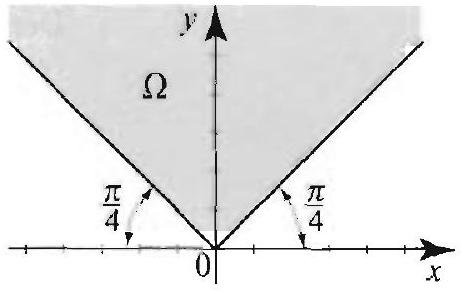
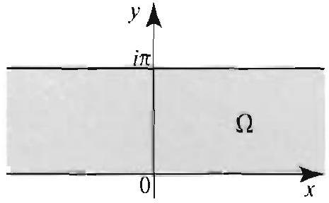

### 16.8 Neumann Functions and the Solution of Neumann Problems

We use the methods of the previous sections to solve the Neumann problem on a simply connected region $\Omega$, other than the entire plane:

$$
\begin{aligned}
\nabla^{2} u(x, y) & =0 \text { for all }(x, y) \text { in } \Omega \\
\frac{\partial u}{\partial n}(x, y) & =f(x, y) \text { for all }(x, y) \text { on the boundary } \Gamma .
\end{aligned}
$$

We know from Example 5, Section 16.1. that the boundary function $f$ cannot be arbitrary; it has to satisfy the compatibility condition

$$
\int_{\Gamma} f(x, y) d s=0
$$

Let us recall the meaning of the symbol $d s$, which stands for the element of arc length. If we parametrize the boundary $\Gamma$ by $(x(t), y(t))(a \leq t \leq b)$, then

$$
\int_{\Gamma} f(x, y) d s=\int_{a}^{b} f(x(t), y(t)) \sqrt{\left[x^{\prime}(t)\right]^{2}+\left[y^{\prime}(t)\right]^{2}} d t
$$

Just as we expressed the solution of the Dirichlet problem as a line integral involving the boundary function and Green's function, our goal here is to express the solution of the Neumann problem as a line integral involving the boundary function and a fixed function, known as a Neumann function, that depends only on the region. Motivated by properties of Green's function (see Theorem 3, Section 16.3), we make the following definition.

## DEFINITION 1 NEUMANN FUNCTIONS

Suppose that $\Omega$ is a simply connected region with boundary $\Gamma$. A Neumann function $N\left(x, y, x_{0}, y_{0}\right)\left((x, y),\left(x_{0}, y_{0}\right)\right.$ in $\left.\Omega\right)$ for the region $\Omega$ is a function with the following properties:
(i) for each $(x, y)$ in $\Omega, N\left(x, y, x_{0}, y_{0}\right)$ is harmonic for all $(x, y) \neq\left(x_{0}, y_{0}\right)$ in Ω:
(ii) $\frac{\partial N}{\partial n}\left(x, y, x_{0}, y_{0}\right)=C$ for all $\left(x_{0}, y_{0}\right)$ in $\Omega$ and $(x, y)$ on $\Gamma$ :
(iii) for each $\left(x_{0}, y_{0}\right)$ in $\Omega$, there is a function $u_{1}$ such that $u_{1}\left(x, y, x_{0}, y_{0}\right)$ is harmonic for all $(x, y)$ in $\Omega$, and $N\left(x, y, x_{0}, y_{0}\right)=v\left(x, y, x_{0}, y_{0}\right)+ u_{1}\left(x, y, x_{0}, y_{0}\right)=\frac{1}{2} \ln \left(\left(x-x_{0}\right)^{2}+\left(y-y_{0}\right)^{2}\right)+u_{1}\left(x, y, x_{0}, y_{0}\right)$ for all $(x, y)$ in $\Omega$.

To simplify the notation, we will write $z=x+i y, z_{0}=x_{0}+i y_{0}$, and denote a function of $\left(x, y, x_{0}, y_{0}\right)$ by a function of $z$ and $z_{0}$; for example, $v\left(z, z_{0}\right)= \frac{1}{2} \ln \left(\left(x-x_{0}\right)^{2}+\left(y-y_{0}\right)^{2}\right)=\ln \left|z-z_{0}\right|$, and $N\left(x, y, x_{0}, y_{0}\right)=N\left(z, z_{0}\right)$. With this notation, parts (i) and (iii) state that a Neumann function, like a Green's function, is harmonic on $\Omega$, except at $z_{0}$, due to the term $\ln \left|z-z_{0}\right|$. Part (ii) tells us that the boundary values of the normal derivative of the Neumann function are constant. This is the counterpart of the boundary condition for a Green's function, which states that a Green's function must

## PROPOSITION 1

## THEOREM 1 SOLUTION OF NEUMANN PROBLEMS

vanish identically on the boundary. As we now show, the constant ( ${ }^{\gamma}$ depends on the length of $\Gamma$ and is not 0 in general.

The constant $C$ in Definition 1(ii), which is cqual to the boundary value of the mormal derivative of the Nemmann function, is given by

$$
C=\frac{2 \pi}{L} .
$$

where $L=\int_{\Gamma} d s$ is the length of $\Gamma$. If $L$ is infinite, we take $C=0$.
Proof For fixed $z_{0}$ in $\Omega$, since $\partial N / \partial n$ is constant on $\Gamma$, we have, on the one hand.

$$
\int_{\Gamma^{\prime}} \frac{\partial}{\partial n} N\left(z, z_{0}\right) d s=\int_{\Gamma} C d s=C L
$$

where $L$ is the length of $\Gamma$. On the other hand, using $N=u_{1}\left(z, z_{0}\right)+\ln \left|z-z_{0}\right|$,

$$
\int_{\Gamma} \frac{\partial}{\partial n} N\left(z, z_{0}\right) d s=\int_{\Gamma} \frac{\partial}{\partial n} u_{1}\left(z, z_{0}\right) d s+\int_{\Gamma} \frac{\partial}{\partial n} \ln \left|z-z_{0}\right| d s=2 \pi
$$

because $\int_{\Gamma} \partial u_{1} / \partial n d s=0$ by the compatibility condition for harmonic functions (Example 5, Section 16.1). and $\int_{\Gamma} \frac{\partial}{\partial n} \ln \left|z-z_{0}\right| d s=2 \pi$, by Exercise 15, Section 16.3. Hence $C L=2 \pi$ and (3) follows.

We are now ready to express the solution of the Neumann problem in terms of the Neumann function. Let us note that from Theorem 5. Section 16.1, if a solution of a Neumann problem exists, then it is unique up to an additive constant, and thus the solution can be determined only up to an additive constant.

Suppose that $\Omega$ is a simply connected region with boundary $\Gamma$, and let $N\left(z, z_{0}\right)$ denote a Neumann function, where $z=x+i y$ and $z_{0}=x_{0}+i y_{0}$ are in $\Omega$. Then, up to an additive constant. the solution $u$ of the Nemmann problem (1) (2) is given by

$$
\left.u\left(x_{0}\right) \cdot y_{0}\right)=-\frac{1}{2 \pi} \int_{1} N\left(z, z_{0}\right) f(z) d s
$$

Proof Suppose that $u$ is a solution and let $A=\frac{C}{2 \pi} \int_{\Gamma} u d s$. We will show that ( $d$ ) determines $u$ up to the constant $A$. We go back to the representation formula for harmonic functions (Theorem 1. Section 16.3):

$$
u\left(x_{0}, y_{0}\right)=\frac{1}{2 \pi} \int_{\Gamma}\left(u \frac{\partial v}{\partial n}-v \frac{\partial u}{\partial n}\right) d s
$$

Unlike the case of a Dirichlet problem, here we must modify the formula in order to get rid of $u$ from the integrand. (Recall $v=\ln \left|z-z_{0}\right|$.) From Definition 1 (ii) and (iii), we see that $\partial v / \partial n=C-\partial u_{1} / \partial n$ on $\Gamma$. Also, since $u$ and $u_{1}$ are harmonic, by

Green's second identity we have $\int_{\Gamma} u_{1} \frac{\partial u}{\partial n} d s=\int_{\Gamma} u \frac{\partial u_{1}}{\partial n} d s$. Thus,

$$
\begin{aligned}
u\left(x_{0}, y_{0}\right) & =\frac{1}{2 \pi} \int_{\Gamma}\left(u\left(C-\frac{\partial u_{1}}{\partial n}\right)-v \frac{\partial u}{\partial n}\right) d s \\
& =\frac{C}{2 \pi} \int_{\Gamma} u d s-\frac{1}{2 \pi} \int_{\Gamma}\left(u_{1} \frac{\partial u}{\partial n}+v \frac{\partial u}{\partial n}\right) d s \\
& =A-\frac{1}{2 \pi} \int_{\Gamma} N\left(z, z_{0}\right) f(z) d s
\end{aligned}
$$

where on the last line, we used $N=u_{1}+v$ and $f=\partial u / \partial n$ on $\Gamma$.

## EXAMPLE 1 Neumann function for the upper half-plane

Verify that a Neumann function for the upper half-plane is

$$
\begin{aligned}
N\left(x, z_{0}\right) & =\ln \left|z-z_{0}\right|+\ln \left|z-\overline{z_{0}}\right| \\
& =\frac{1}{2} \ln \left(\left(x-x_{0}\right)^{2}+\left(y-y_{0}\right)^{2}\right)+\frac{1}{2} \ln \left(\left(x-x_{0}\right)^{2}+\left(y+y_{0}\right)^{2}\right)
\end{aligned}
$$

for $z=x+i y$ and $z_{0}=x_{0}+i y_{0}, y, y_{0}>0$.
Solution We will simply verify that the given function is a Neumann function for the upper half-plane by showing that it has properties (i)-(iii) of Definition 1. Given $z_{0}$ in the upper half-plane, the function $u_{1}\left(z, z_{0}\right)=\ln \left|z-\overline{z_{0}}\right|$ is harmonic for all $z$ except $z=\overline{z_{0}}$. Since $z_{0}$ is in the upper half-plane, $\overline{z_{0}}$ is in the lower half-plane and it follows that $u_{1}\left(z, z_{0}\right)$ is harmonic on the upper half-plane. This establishes (i) and (iii). We now prove (ii). The normal derivative in this case is $-\frac{\partial}{\partial y}$. We have

$$
\begin{aligned}
-\left.\frac{\partial}{\partial y} \ln \left|z-z_{0}\right|\right|_{y=0} & =-\left.\frac{1}{2} \frac{\partial}{\partial y} \ln \left(\left(x-x_{0}\right)^{2}+\left(y-y_{0}\right)^{2}\right)\right|_{y=0} \\
& =\left.\frac{y_{0}-y}{\left(x-x_{0}\right)^{2}+\left(y-y_{0}\right)^{2}}\right|_{y=0}=\frac{y_{0}}{\left(x-x_{0}\right)^{2}+y_{0}^{2}}
\end{aligned}
$$

Since $\operatorname{Im}\left(\overline{z_{0}}\right)=-\operatorname{Im}\left(z_{0}\right)$, we see from the preceding computation (with $z_{0}$ replaced by $\overline{z_{0}}$ ) that

$$
-\left.\frac{\partial}{\partial y} \ln \left|z-\overline{z_{0}}\right|\right|_{y=0}=\frac{-y_{0}}{\left(x-x_{0}\right)^{2}+\left(-y_{0}\right)^{2}}==\frac{-y_{0}}{\left(x-x_{0}\right)^{2}+y_{0}^{2}} .
$$

Adding the two normal derivatives, we find that the normal derivative of $\ln \mid z- z_{0}|+\ln | z-\overline{z_{0}} \mid$ is zero on the real axis. This shows that (ii) of Definition 1 holds with $C=0$.

Let us now solve the Neumann problem in the upper half-plane.

## EXAMPLE 2 Solution of the Neumann problem in the upper half-plane

Applying Theorem 1 and using the Noumann function that we computed in Example 1, we find that a solution of the Noumann problem in the upper half-plane,

$$
\begin{aligned}
& \nabla^{2} u(x, y)=0,-\infty<x<\infty, y>0, \\
& -\frac{\partial u}{\partial y}(x, 0)=f(x),
\end{aligned}
$$

is

$$
u\left(x_{0}, y_{0}\right)=\frac{-1}{2 \pi} \int_{-\infty}^{\infty} f(x) \ln \left(\left(x-x_{0}\right)^{2}+y_{0}^{2}\right) d x
$$

This solution was derived by a different method in Exercise 17, Section 16.4.

## Neumann Functions and Conformal Mappings

We now investigate the action of a conformal mapping on a Neumann function. Our approach is motivated by the results of the previous section. We use the following notation: $\Omega$ and $\Omega^{\prime}$ are two simply connected regions with nonempty boundaries $\Gamma$ and $\Gamma^{\prime}$, and $\phi$ is a one-to-one conformal mapping of $\Omega$ onto $\Omega^{\prime}$, such that $\phi[\Gamma]$ is contained in $\Gamma^{\prime}$. Suppose that $N\left(w, w_{0}\right)$ is a Neumann function for $\Omega^{\prime}$ and form the composition of $N$ with $\phi: N_{\phi}\left(z, z_{0}\right)=N\left(\phi(z), \phi\left(z_{0}\right)\right)$, where $z$ and $z_{0}$ are in $\Omega$. We now ask the question: Is $N_{\phi}\left(z, z_{0}\right)$ a Neumann function for $\Omega$ ?

By following a proof similar to that of Theorem 1, Section 16.5, we can show that $N_{0}\left(z, z_{0}\right)$ is harmonic on $\Omega$, except at $z_{0}$, and that $N_{\phi}\left(z, z_{1}\right)$ :In $\left|z-z_{0}\right|$ plus a harmonic function on $\Omega$. Thus $N_{\phi}\left(z, z_{0}\right)$ has two of the defining properties of a Neumann function for $\Omega$. It remains to verify whether the normal derivative of $N_{\phi}\left(z, z_{0}\right)$ is constant on the boundary, as required by Proposition 1. As it turns out, this property is not satisfied in general. However, it is satisfied when both $\Omega$ and $\Omega^{\prime}$ are not bounded.

To explain this peculiar difference between bounded and unbounded region, we recall the following formula for a change of variables by a conformal mapping:

$$
\frac{\partial\left(N_{\phi}\right)}{\partial n_{\Gamma}}\left(z, z_{0}\right)=\left|\phi^{\prime}(z)\right| \frac{\partial N}{\partial n_{\Gamma^{\prime}}}\left(\phi(z), \phi\left(z_{0}\right)\right)
$$

where on the left side we are computing the normal derivative along the curve $\Gamma$ at the point $z$ on $\Gamma$, and on the right side we are computing the normal derivative along the curve $\Gamma^{\prime}$ at the point $\varphi(z)$ on $\Gamma^{\prime}$. (For a proof, see $[1]$, Section 6.5.) Thus the conformal mapping preserves the normal derivative but scales it by a factor $\left|\phi^{\prime}(z)\right|$. Hence after composing a Neumann function with a conformal mapping, the resulting function may not have a constant normal derivative as expressed by Proposition 1, unless $\left|\phi^{\prime}(z)\right|=1$ or the constant values of the normal derivatives on the boundary are 0 . We know

THEOREM 2 NEUMANN FUNCTION FOR UNBOUNDED REGIONS
by Proposition 1 that the latter condition is satisfied when both $\Gamma$ and $\Gamma^{\prime}$ have infinite length. We thus have the following useful result.

Suppose that $\Omega$ is an unbounded region with boundary $\Gamma$, and $\phi$ is a one-toone analytic mapping of $\Omega$ onto the upper half-plane, taking $\Gamma$ onto the real axis. Then a Nemmann function for $\Omega$ is
(7) $\quad N\left(z, z_{0}\right)=\ln \left|\phi(z)-\phi\left(z_{0}\right)\right|+\ln \left|\phi(z)-\overline{\phi\left(z_{0}\right)}\right| \quad\left(z, z_{0}\right.$ in $\left.\Omega\right)$.

As an application, we derive a Neumann function for the first quadrant.

## EXAMPLE 3 Neumann function for the first quadrant

Applying Theorem 2 with $\phi(z)=z^{2}$, we obtain a. Neumann function for the first quadrant:

$$
\begin{aligned}
N\left(\therefore a_{0}\right)= & \ln \left|z^{2}-z_{0}^{2}\right|+\ln \left|z^{2}-\overline{z_{0}^{2}}\right| \\
= & \ln \left|z-z_{0}\right|+\ln \left|z+z_{0}\right|+\ln \left|z-\overline{z_{0}}\right|+\ln \left|z+\overline{z_{0}}\right| \\
= & \frac{1}{2} \ln \left(\left(x-x_{0}\right)^{2}+\left(y-y_{0}\right)^{2}\right)+\frac{1}{2} \ln \left(\left(x+x_{0}\right)^{2}+\left(y+y_{0}\right)^{2}\right) \\
& +\frac{1}{2} \ln \left(\left(x-x_{0}\right)^{2}+\left(y+y_{0}\right)^{2}\right)+\frac{1}{2} \ln \left(\left(x+x_{0}\right)^{2}+\left(y-y_{0}\right)^{2}\right) .
\end{aligned}
$$

Using this function, you can find the general solution of the Neumann problem in the first quadrant (Exercise 7).

## Poisson Problems with Neumann Conditions

We mention one more application that is directly within our reach. Consider the Poisson problem

$$
\begin{array}{ll}
\nabla^{2} u(x, y)=h(x, y) & \text { for all }(x, y) \text { in } \Omega \\
\frac{\partial u}{\partial n}(x, y)=f(x, y) & \text { for all }(x, y) \text { on } \Gamma .
\end{array}
$$

Bocause of the Neumann type condition on the boundary, the functions $h$ and $f$ are related by Green's first identity, as follows:

$$
\iint_{\Omega} \nabla^{2} u d x d y=\int_{\Gamma} \frac{\partial u}{\partial n} d s
$$

hence by (8) and (9),

$$
\iint_{\Omega} \nabla^{2} h(x, y) d x d y=\int_{\Gamma} f d s
$$

Thus the double integral of $h$ over $\Omega$ must equal the line integral of $f$ over $\Gamma$. Suppose that $h$ and $f$ satisfy this compatibility condition. Then we have the following solution of the Poisson problem with a Neumann condition.

THEOREM 3 SOLUTION OF POISSON-NEUMANN PROBLEM

Suppose that $\Omega$ is a region with boundary $\Gamma$ and let $N\left(z, z_{0}\right)$ denote a Neumann function for $\Omega$, where $z=x+i y$ and $z_{0}=x_{0}+i y_{0}$ are in $\Omega$. If $u(x, y)$ is a solution to Poisson's equation (8) subject to a Neumann boundary con-
2.

Figure 2

5. 

Figure 5

$$
u(x, y)=\frac{1}{2 \pi} \iint_{\Omega} h(x, y) N\left(z, z_{0}\right) d x d y-\frac{1}{2 \pi} \int_{\Gamma} N\left(z, z_{0}\right) f(z) d s
$$

The proof mirrors the proof of Theorem 4, Section 16.3. It will be omitted.

## Exercises 12.8

In Erercises 1-6. derive the Neumann function for the region depicted in the ac-
3.

Figure 3

6. 

Figure 6

7. Solution of the Neumann problem in the first quadrant. Show that the solution of the Nemmann problem

$$
\begin{aligned}
& \nabla^{2} u(x, y)=0, x, y>0 \\
& \frac{\partial u}{\partial y}(x, 0)=f(x), \quad \frac{\partial u}{\partial x}(0, y)=g(y)
\end{aligned}
$$

is

$$
\begin{aligned}
u\left(x_{0} . y_{0}\right)= & \frac{1}{2 \pi} \int_{0}^{\infty} f(x)\left[\ln \left(\left(x-x_{0}\right)^{2}+y_{0}^{2}\right)+\ln \left(\left(x+x_{0}\right)^{2}+y_{0}^{2}\right)\right] d x \\
& +\frac{1}{2 \pi} \int_{0}^{\infty} g(y)\left[\ln \left(x_{0}^{2}+\left(y-y_{0}\right)^{2}\right)+\ln \left(x_{0}^{2}+\left(y+y_{0}\right)^{2}\right)\right] d y
\end{aligned}
$$

8. Verify the following integral formula, which arises from solutions of Neumann
problems such as the one in the previous exercise: For $a, b \neq 0$,

$$
\begin{aligned}
& \int \ln \left[(x-a)^{2}+b^{2}\right] d x \\
& \quad=2(x-a)+2 b \tan ^{-1}\left(\frac{x-a}{b}\right)+(x-a) \ln \left[(x-a)^{2}+b^{2}\right]+C
\end{aligned}
$$

9. (a) Solve the problem in Exercise 7, given that $g(y)=0$ for all $y>0$, and $f(x)=1$ if $0<x<1$ and 0 otherwise.
(b) Verify your answer by direct computation.
10. A Neumann function for the unit disk. This function is defined for : and $z_{0}$ in the unit disk by

$$
N\left(z, z_{0}\right)= \begin{cases}\ln \left|z-z_{0}\right|+\ln \left|\frac{1}{\bar{z}_{0}}-z\right|+\ln \left|z_{0}\right| & \text { if } z_{0} \neq 0 \\ \ln |z| & \text { if } z_{0}=0\end{cases}
$$

Derive this formula by following the outlined steps.
(a) Write $z_{0}=r e^{i \theta}$ and $z=\rho e^{i \eta}$. Fix $z_{0} \neq 0$ and show that

$$
\begin{aligned}
\left.\frac{\partial}{\partial n} \ln \left|z-z_{0}\right|\right|_{\rho=1} & =\left.\frac{\partial}{\partial \rho} \frac{1}{2} \ln \left|z-z_{0}\right|^{2}\right|_{\rho=1} \\
& =\left.\frac{1}{2} \frac{\partial}{\partial \rho} \ln \left(r^{2}+\rho^{2}+2 r \rho \cos (\theta-\eta)\right)\right|_{\rho=1} \\
& =\frac{1+r \cos (\theta \cdots \eta)}{1+r^{2}+2 r \cos (\theta-\eta)}
\end{aligned}
$$

(b) Write $\frac{1}{\bar{z}_{0}}=\frac{1}{r} e^{i \theta}$, use (a), and conclude that

$$
\left.\frac{\partial}{\partial n} \ln \left|\frac{1}{\overline{z_{0}}}-z\right|\right|_{\rho=1}=\frac{1+\frac{1}{r} \cos (\theta-\eta)}{\left(\frac{1}{r}\right)^{2}+1+\frac{2}{r} \cos (\theta-\eta)}=\frac{r^{2}+r \cos (\theta-\eta)}{1+r^{2}+2 r \cos (\theta-\eta)}
$$

(c) Use (a) and (b) to show that for $z_{0} \neq 0,\left.\frac{\partial}{\partial n} N\left(z, z_{0}\right)\right|_{|z|=1}=1$.
(d) Verify the remaining properties of the Neumann function for the given $N\left(z, z_{0}\right)$.
11. Solution of the Neumann problem on the disk. Use the result of the previous exercise to show that the solution of $\nabla^{2} u(r, \theta)=0$ for $0 \leq r<1$ and all $\theta$, given the Neumann condition $\frac{\partial u}{\partial r}(1, \theta)=f(\theta)$, for all $\theta$, is

$$
u(r, \theta)=-\frac{1}{2 \pi} \int_{0}^{2 \pi} f(\eta) \ln \left[1+r^{2}+2 r \cos (\theta-\eta)\right] d \eta
$$

Here $f$ satisfies the compatibility condition $\int_{0}^{2 \pi} f(\theta) d \theta=0$.
