<!-- Page 1 -->

Left margin note (page 1)

Topics to Review
Green's theorem from calculus is required for this chapter. It is recalled and proved in Section 12.1. The chapter is intended to introduce methods for solving Laplace and Poisson equations. So Sections 3.8, 3.9, 4.4, and 7.5 are essential to appreciate this chapter. Sections 12.5 to 12.8 require familiarity with complex numbers and complex functions. The requisite material is included as a brief review in Section 12.5. Sections 12.5 and 12.6 can be covered independently of the rest of the chapter. Sections 12.7 and 12.8 are based on the preceding sections of the chapter.

Looking Ahead...
In this chapter we introduce new tools for solving Dirichlet problems and Poisson equations: Green's functions, Neumann functions, and conformal mappings. Roughly speaking, Green's function for a given region $\Omega$ is a function that depends only on $\Omega$ and that can be used to solve any Dirichlet problem or Poisson problem on $\Omega$, in the same way that the Poisson kernel on the real line can be used to solve Dirichlet problems in the upper half-plane. A conformal mapping is like a change of variables that we can use to transform a Dirichlet problem from a given region onto another region on which the problem is simpler to solve, in the same way that a change of variables can be used to trasnform a difficult integral.

Right margin note (page 1)

have they e get RTZ the ts of Here lalll Like bout from two pply ace's the uncisson rties us to ions. qua2.6), (Sec-napons. o died in tiva-

++++

12

GREEN'S FUNCTIONS AND CONFORMAL MAPPINGS

One cannot escape the feeling that these mathematical formulas an independent existence and an intelligener of their own, that are wiser that we are, wiser even than their discoverers, that $w$ more out of them than was originally put into them.
- HEINRICH HE

The methods of this chapter are new, but the goal is still same: to solve boundary value problems. To motivate the resul this chapter, review the Poisson integral formula in Section 7.5. we will derive similar formulas that solve the Dirichlet and Neum problems on arbitrary (simply connected) regions in the plane. the Poisson integral, these formulas are packed with information a the solution.

In Sections 12.1 and 12.2, we start with Green's theorem calculus and use simple tricks like integration by parts to derive identities, known as Green's first and second identities. We then a these formulas to obtain important properties of solutions of Lapl equation. In Section 12.3 we modify our formulas and introduce amazing Green's functions. Simple manipulations with Green's tions yield formulas for the solutions of Dirichlet problems (Po) integral-like formulas) and Poisson equations.

These remarkable formulas add to our understanding of prope of solutions of Dirichlet problems and, more important, they lead explore an important connection with the theory of analytic funct Two major results are explored: the invariance of Laplace's e tion by a change of variables using analytic functions (Section 1 and the composition of Green's functions with analytic functions tion 12.7). The former yields the powerful method of conformal pings, and the latter yields a nice way to compute Green's functi

To simplify the presentation, we only discuss a sample of tw mensional problems. Many more types of problems can be treate higher dimensions. We hope that this chapter will serve as a mo tion to delve into the more advanced theories.

---

<!-- Page 2 -->

Left margin note (page 2)

612
Chapter 12
12.1 Green

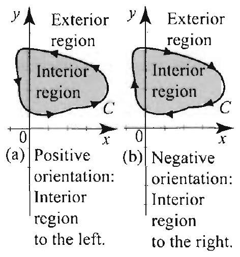

Figure 1 The interval $\quad\left[-\frac{\pi}{2}, \pi\right]$ to a circular arc. point ( $0,-1$ ), term $(-1,0)$. To close we could use the $\left[-\frac{\pi}{2}, \frac{3 \pi}{2}\right]$.

Figure 2 Simple e
(a) positively orien
(b) negatively orier

Right margin note (page 2)

known cations ion by
ccowise ( $t$ ) and es over curve. e curve $C$ and d if its $, y(b))$. rations
tersect i $[a, b]$, curve, proved ne into xterior
a simif the gative that is r every tained interior undary subset

++++

Green's Functions and Conformal Mappings
's Theorem and Identities
In this section, we prove Green's theorem and derive two identities, as Green's first and second identities. We then derive several appli that give a flavor of the results of this chapter. We begin our discus: reviewing basic definitions leading to the line integral.
Parametric Curves. Let $x=x(t)$ and $y=y(t)$ be continuous and pic smooth functions of $t$ on a closed interval $[a, b]$. The equations $x=x y=y(t)$ are called parametric equations with parameter $t$. As $t$ vari $[a, b]$, the point $(r(t), y(t))$ traces a parametric curve or simply a It is sometimes convenient to set $C(t)=(x:(t), y(t))$ and refer to the as the curve $C$. The point $(x(a), y(a))$ is called the initial point of the point $(x(b), y(b))$ its terminal point. The curve is called close terminal point is equal to its initial point; that is, $(x(a), y(a))=(x(b)$ In Figure 1 we show an arc of the unit circle, parametrized by the eq $x(t)=\cos t$ and $y(t)=\sin t$, for $t$ in the interval $\left[-\frac{\pi}{2}, \pi\right]$.
$$
\begin{array}{l}
\text { Negative } \\
\text { orientation: } \\
\text { Interior } \\
\text { region } \\
\text { to the right. }
\end{array}
$$

Simple Curves. A closed curve is called simple if it does not in itself. That is, if $C$ is simple and $C\left(t_{1}\right)=C\left(t_{2}\right)$ for some $t_{1}<t_{2}$ in then $t_{1}=a$ and $t_{2}=b$. A simple curve is also known as a Jordan after the French mathematician Camille Jordan (1838-1922). Jordan a famous theorem that states that a simple curve $C$ divides the pla two regions: one bounded and interior to $C$, and one unbounded and to $C$ (see Figure 2).
Orientation. Jordan's theorem allows us to define the orientation of ple curve $C$. You are moving in the positive direction along $C$ interior region is to your left; otherwise. you are moving in the ne direction of $C$. We denote by $-C$ the reverse of $C$. It is the curve traversed in the opposite direction as $C$.
Open Sets and Regions. A subset $U$ of the plane is open if fo $\left(x_{0}, y_{0}\right)$ in $U$ there is an open disk $D$ centered at $\left(x_{0}, y_{0}\right)$ and cor entircly in $U$. In other words, $U$ is open if every point in $U$ is an point. Consequently, if $U$ is open, then it cannot contain any of its bo points, since boundary points are not interior points (Figure 3). A

---

<!-- Page 3 -->

Left margin note (page 3)

Figure 3
(a) Not open.
(b) Open, not connect
(c) A region: Open nected.

Figure 4
(a) Simply connected.
(b) Multiply connecte
(c) Multiply connecte

In (b) and (c) we curve whose interior contained in the regio

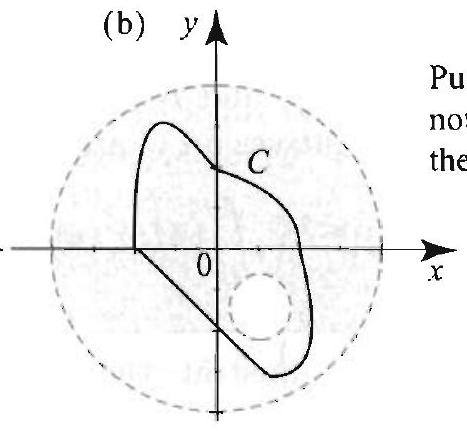
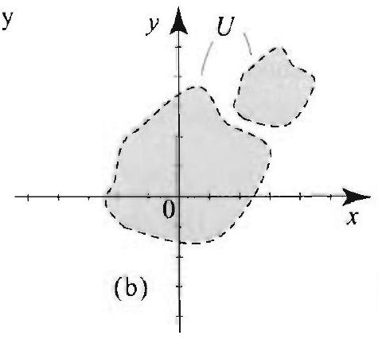

Right margin note (page 3)

613
and
irely
itely
then
$\xrightarrow[x]{ }$
nply
ained
e 4).
$\vec{x}$
and
over

++++

Section 12.1 Green's Theorem and Identities

$S$ of the complex plane is called connected if any two points $\left(x_{0}, y_{0}\right) \left(x_{1}, y_{1}\right)$ in $S$ can be joined by a polygonal line segment that is ent contained in $S$. (By a polygonal line we mean a curve formed by fir many line segments joined end to end.) If a set is open and connected, it is called a region.

ed.
nd con-

Simply Connected Region. A region $D$ in the plane is called sir connected if the interior region of every simple curve in $D$ is also cont in $D$. Pictorially, $D$ is simply connected if it has no holes in it (Figu A region that is not simply connected is called multiply connected.

d.
d.
show a
is not
n.

(c) $y$

Line Integral. If $C$ is a curve parametrized by $(x(t), y(t)), a \leq t \leq b f(x, y)$ is a continuous function on $C$, we define the line integral of $f C$ to be
$$
\int_{C} f(x, y) d s=\int_{a}^{b} f(x(t), y(t)) \sqrt{\left[x^{\prime}(t)\right]^{2}+\left[y^{\prime}(t)\right]^{2}} d t
$$

Two other integrals will be of interest:
$$
\int_{C} f(x, y) d x=\int_{a}^{b} f(x(t), y(t)) x^{\prime}(t) d t
$$
and
$$
\int_{C} f(x, y) d y=\int_{a}^{b} f(x(t), y(t)) y^{\prime}(t) d t
$$

---

<!-- Page 4 -->

Left margin note (page 4)

614
Chapter 12 Green's Fun

THEOREM 1 GREEN'S THEOREM

Figure 5 Area as a line integral in Example 1.

Right margin note (page 4)

al. We entities
nd $C_{2}$,
riables
al over
$D$. Let partial
he end
gure 5).
$(x, y)=$ deriva-
we find
(5) and
D.

++++

ctions and Conformal Mappings

The line integral has many properties similar to the Riennann integr state some of these properties for the integral with $d x$. Similar id hold for the integrals with $d y$ or $d s$. The integral is linear:
$$
\int_{C}(a f(x, y)+b g(x, y)) d x=a \int_{C} f(x, y) d x+b \int_{C} g(x, y) d x
$$

It is additive over curves: If $C$ is a curve made up of two curves $C_{1}$ joined together end to end, then
$$
\int_{C} f(x . y) d x=\int_{C_{1}} f(x, y) d x+\int_{C_{2}} f(x, y) d x
$$

If $-C$ is the reverse of $C$, then
$$
\int_{-C} f(x, y) d x=-\int_{C} f(x, y) d x
$$

Green's Theorem
Green's theorem is a striking result from the calculus of several va that relates a line integral around a closed curve to a double integr the region bounded by that curve.

Let $C$ be a positively oriented simple curve with interior region $M(x, y)$ and $N(x, y)$ be continuous functions with continuous first derivatives on $C$ and $D$. Then
$$
\int_{C}(M(x, y) d x+N(x, y) d y)=\iint_{D}\left(\frac{\partial N}{\partial x}-\frac{\partial M}{\partial y}\right) d x d y
$$

Let us illustrate the theorem with examples and relegate its proof to t of this section.

EXAMPLE 1 Area as a line integral
Let $C$ be a positively oriented simple curve and $D$ the region interior to $C$ (Fi Then the area of $D$ is given by any one of the following three integrals:
$$
\int_{C}-y d x, \quad \int_{C} r d y, \quad \frac{1}{2} \int_{C}(-y d x+x d y)
$$

Solution For the first integral, apply Green's theorem with $M(x, y)=-y, \Lambda 0, M_{y}=-1$, and $N_{x}=0$, where we are using subscripts to denote partial tives. Then
$$
\int_{C}-y d x=\iint_{D} d x d y=\text { area of } D
$$
as claimed. Similarly, applying Green's theorem with $M=0$ and $N=x$. that $\int_{C} x d y=\iint_{D} d x d y=$ area of $D$. Adding the first two integrals in dividing by two, we find that the third integral is also equal to the area of

---

<!-- Page 5 -->

Left margin note (page 5)

Figure 6 A typical multiply connected region: positively oriented outer curve, negatively oriented imner curve.

Right margin note (page 5)

615
en's
ntity
oner

tion. ,
use of $\sin \theta$,
tiply osed the c no $C_{j} \mathrm{~s} C_{1}$, $C_{1}$, y by

++++

Section 12.1 Green's Theorem and Identities

EXAMPLE 2 Verifying Green's theorem
Let $C$ be the positively oriented unit circle, centered at the origin. Verify Gr theorem with $M(x, y)=y^{2}$ and $N^{\prime}(x, y)=-x$.
Solution To do this problem, we compute the integrals on both sides of the ide (4) and show that they are equal. We have $M_{y}=2 y$, and $N_{x}=-1$, and (1) bee
$$
\int_{C}\left(y^{2} d x-x d y\right)=\iint_{D}(-1-2 y) d x d y
$$

To compute the line integral, we parametrize the circle by
$$
x(t)=\cos t, \quad y(t)=\sin t, \quad 0 \leq t \leq 2 \pi .
$$

Then $d x=-\sin t d t, d y=\cos t d t$, and the integral becomes
$$
\int_{C}\left(y^{2} d x-x d y\right)=-\int_{0}^{2 \pi}\left(\sin ^{3} t+\cos ^{2} t\right) d t=-\int_{-\pi}^{\pi}\left(\sin ^{3} t+\cos ^{2} t\right) d t
$$
where we have used Theorem 1, Section 2.1, to shift the interval of integra Since $\sin ^{3} t$ is an odd function, its integral over a symmetric interval is 0 . Alse
$$
-\int_{-\pi}^{\pi} \cos ^{2} t d t=-\frac{1}{2} \int_{-\pi}^{\pi}(1+\cos 2 t) d t=-\pi
$$

Thus the value of the line integral is $-\pi$. To compute the double integral, becau the shape of the region, it is easier to use polar coordinates: $x=r \cos \theta, y=r$, $0 \leq \theta \leq 2 \pi, 0 \leq r \leq 1$, and $d x d y=r d r d \theta$. Then
$$
\begin{aligned}
\iint_{D}(-1-2 y) d x d y & =\int_{0}^{2 \pi} \int_{0}^{1}(-1-2 r \sin \theta) r d r d \theta \\
& =\int_{0}^{2 \pi}\left(-\frac{1}{2}-\frac{2}{3} \sin \theta\right) d \theta=-\pi
\end{aligned}
$$

Thus Green's theorem is verified.
Multiply Connected Regions
For later applications, we will need a version of Green's theorem on mul connected regions that are described as follows. Let $C$ be a simple cl curve and let $C_{1}, C_{2}, \ldots, C_{n}$ be simple closed curves. contained in interior of $C$ and such that the interior regions of any two $C_{j}$ s hav common points. We also require that $C$ be positively oriented and all be negatively oriented. Let $\Omega$ be the region interior to $C$ and exterior to $C_{2} \ldots, C_{n}$ (Figure 6). It will be convenient to refer to all the curves $C C_{2}, \ldots, C_{n}^{\prime}$ collectively as the boundary of $\Omega$, and denote this boundar Γ. Thus
$$
\int_{\Gamma} f(x, y) d x=\int_{C} f(x, y) d x+\sum_{j=1}^{n} \int_{C_{j}} f(x, y) d x
$$

---

<!-- Page 6 -->

Left margin note (page 6)

616
Chapter 12 Green's Fun

THEOREM 2
GREEN'S THEOREM FOR MULTIPLY CONNECTED REGIONS

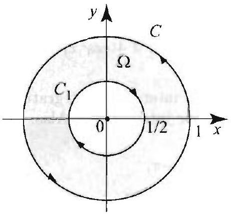

Figure 7 for Example 3.

Right margin note (page 6)

tegrals
scribed. partial
bee the
$C_{1}$ be gure 7).
$\frac{y}{x^{2}+y^{2}}$,
dinates:
rmonic derivaclouble metion ur goal d show rals on known

++++

ctions and Conformal Mappings

where $C_{j}$ are negatively oriented. A similar meaning is given to the in with $d y$ or $d s$.

Let $\Omega$ be a multiply connected region with boundary $\Gamma$, as just de Suppose that $M(x, y)$ and $N(x, y)$ are continuous with continuous derivatives on $\Omega$ and $\Gamma$. Then
$$
\int_{\Gamma} M(x, y) d x+N(x, y) d y=\iint_{\Omega}\left(\frac{\partial N}{\partial x}-\frac{\partial M}{\partial y}\right) d x d y
$$

The proof is based on an interesting reduction to Theorem 1. appendix of this section.)

EXAMPLE 3 Green's theorem for multiply connected regions
Let $C$ be the positively oriented unit circle, centered at the origin, and le the negatively oriented circle with center at the origin and radius $\frac{1}{2}$ (Fig Evaluate
$$
I=\int_{C} \frac{y}{x^{2}+y^{2}} d x+\int_{C_{1}} \frac{y}{x^{2}+y^{2}} d x
$$

Solution Let $\Omega$ be the region bounded by $C$ and $C_{1}$. Applying (6) with $M= M_{y}=\frac{x^{2}-y^{2}}{\left(x^{2}+y^{2}\right)^{2}}, N=0$. and $N_{x}=0$. we find
$$
I=\iint_{\Omega} \frac{y^{2}-x^{2}}{\left(x^{2}+y^{2}\right)^{2}} d x d y
$$
where $\Omega$ is the annular region bounded by $C$ and $C_{1}$. Using polar coor $x=r \cos \theta, y=r \sin \theta, 0 \leq \theta \leq 2 \pi, \frac{1}{2} \leq r \leq 1$, and $d x d y=r d r d \theta$, we get
$$
\begin{aligned}
I=\iint_{\Omega} \frac{y^{2}-x^{2}}{\left(x^{2}+y^{2}\right)^{2}} d x d y & =\int_{0}^{2 \pi} \int_{\frac{1}{2}}^{1} \frac{r^{2}\left(\sin ^{2} \theta-\cos ^{2} \theta\right)}{r^{4}} r d r d \theta \\
& =\int_{0}^{2 \pi} \overbrace{\left(\sin ^{2} \theta-\cos ^{2} \theta\right)}^{-\cos 2 \theta} d \theta \int_{\frac{1}{2}}^{1} \frac{1}{r} d r \\
& =-\ln 2 \int_{0}^{2 \pi} \cos 2 \theta d \theta=0
\end{aligned}
$$

Green's Identities
In solving Dirichlet and Neumann problems, we are asked to find a ha function inside a region $\Omega$, given its values or the values of its normal tive on the boundary of $\Omega$. Green's theorem relates a line integral to a integral, and so in a way it gives information about the values of a f inside a region from its values on the boundary of that region. O in this chapter is to use Green's theorem in a very ingenious way an how we can solve Dirichlet and Neumann problems using line integ the boundary. For this purpose, we derive two important formulas, as Green's first and second identities.

---

<!-- Page 7 -->

Left margin note (page 7)

THEOREM 3 GREEN'S IDENTITIES

Figure 8 Example of the region in Theorem 3.

Right margin note (page 7)

617
unc-
mal
tion
as
the
the
in
ented
have
n we
$$
l_{y}=
$$

egral
(9)

++++

Section 12.1 Green's Theorem and Identities

Let us recall the meaning of a normal derivative. If $u(x, y)$ is a f tion defined on a curve $C$, parametrized by $x(t)$ and $y(t)$, then the no derivative of $u$, denoted $\frac{\partial u}{\partial n}$, is the directional derivative of $u$ in the direc of the unit normal vector:
$$
\frac{\partial u}{\partial n}=\nabla u \cdot n=\left(u_{x}, u_{y}\right) \cdot \frac{\left(y^{\prime}(t),-x^{\prime}(t)\right)}{\sqrt{\left[x^{\prime}(t)\right]^{2}+\left[y^{\prime}(t)\right]^{2}}},
$$
where in this expression we recognize the normal vector to the curve the vector $\left(y^{\prime}(t),-x^{\prime}(t)\right)$ and its norm $\sqrt{\left[x^{\prime}(t)\right]^{2}+\left[y^{\prime}(t)\right]^{2}}$. Recalling notation of (1), $d s=\sqrt{\left[x^{\prime}(t)\right]^{2}+\left[y^{\prime}(t)\right]^{2}} d t$, we have, for the points on curve $C$,
$$
\begin{aligned}
\frac{\partial u}{\partial n} d s & =\left(u_{x}, u_{y}\right) \cdot\left(y^{\prime}(t),-x^{\prime}(t)\right) d t=u_{x} y^{\prime}(t) d t-u_{y} r^{\prime}(t) d t \\
& =-u_{y} d x+u_{x} d y
\end{aligned}
$$

We are now ready to state and prove two important identities.

Let $\Omega$ be a multiply connected region with boundary $\Gamma$, as describe Theorem 2 (Figure 8). (In particular, the outer curve is positively ori and the inner curves are negatively oriented.) Let $u(x, y)$ and $v(x, y)$ continuous second order partial derivatives on $\Omega$ and its boundary. The have Green's first identity
$$
\iint_{\Omega}\left(u \nabla^{2} v+\nabla u \cdot \nabla v\right) d x d y=\int_{\Gamma} u \frac{\partial v}{\partial n} d s
$$
and Green's second identity
$$
\iint_{\Omega}\left(u \nabla^{2} v-v \nabla^{2} u\right) d x d y=\int_{\Gamma}\left(u \frac{\partial v}{\partial n}-v \frac{\partial u}{\partial n}\right) d s .
$$

Proof Apply Green's theorem with $M(x, y)=-u v_{y}, N(x, y)=u v_{x}, N -u_{y} v_{y}-u v_{y y} . N_{x}=u_{x} v_{x}+u v_{x x}$, and get
$$
\iint_{\Omega}\left(u\left(v_{x x}+v_{y y}\right)+\left(u_{x} v_{x}+u_{y} v_{y}\right)\right) d x d y=\int_{\Gamma} u\left(-v_{y} d x+v_{x} d y\right)
$$

The integral on the left is the same as the integral on the left of (9), and the int on the right is the same as the integral on the right of (9), because of (8). S holds. To prove (10), we reverse the roles of $u$ and $v$ in (9) and get
$$
\iint_{\Omega}\left(v \nabla^{2} u+\nabla u \cdot \nabla v\right) d x d y=\int_{\Gamma} v \frac{\partial u}{\partial n} d s .
$$

Subtracting this from (9), we get (10).

---

<!-- Page 8 -->

Right margin note (page 8)

In adrial of
vatives I', then
dary $\Gamma$. d-order ative of of the satisfy
whose 2.1).
$$
x, y)=
$$
$\Omega$.

roblem

, as in on the
st show et that

++++

ctions and Conformal Mappings

Applications to Boundary Value Problems
We now derive several interesting applications of Green's identities. dition to their importance these applications give a flavor of the mat the remaining sections of this chapter.

EXAMPLE 4 Green's formula for the integral of the Laplacian This formula states that if $v$ has continuous first and second-order partial der in a simply or multiply connected region $\Omega$, as in Theorem 2, with boundary
$$
\iint_{\Omega} \nabla^{2} v(x, y) d x d y=\int_{\Gamma} \frac{\partial v}{\partial n} d s
$$

To prove this formula, simply take $u=1$ in Green's first identity.

EXAMPLE 5 Compatibility condition in Neumann problems
Let $\Omega$ be a simply or multiply connected region as in Theorem 2, with boun Suppose that $u$ is harmonic on $\Omega$; that is, $u$ has continuous first- and secon partial derivatives in $\Omega$ and $u_{x x}+u_{y y}=0$ on $\Omega$. Then the normal derive $u$ must integrate to 0 along the boundary. That is, the boundary values normal derivative of a harmonic function $u$ cannot be arbitrary; they must the compatibility condition
$$
\int_{\Gamma} \frac{\partial u}{\partial n} d s=0
$$

To prove this fact, just take $v=1$ in Green's second identity.
For the remaining applications, we will need the following result, proof can be found in any book on vector calculus (or see [1], Sectior

Suppose that $u(x, y)$ is a function defined on a region $\Omega$ such that $u_{x}($ 0 and $u_{y}(x, y)=0$ for all $(x, y)$ in $\Omega$. Then $u$ must be constant on
We can now prove the uniqueness of the solution of the Dirichlet p on a simply or nultiply connected region $\Omega$.

Let $\Omega$ be a simply or multiply connected region with boundary I Theorem 3. If $u_{1}$ and $u_{2}$ are harmonic functions on $\Omega$ and $u_{1}=u_{2}$ boundary $\Gamma$, then $u_{1}=u_{2}$ on $\Omega$.

Proof Let $u=u_{1}-u_{2}$. Then $u$ is harmonic on $\Omega$ and $u=0$ on $\Gamma$. We mu that $u$ is 0 on $\Omega$. Apply Green's first identity with $u=v$ and use the fa $\nabla^{2} u=0$. We get
$$
\iint_{\Omega} \nabla u \cdot \nabla u d x d y=\int_{\Gamma} u \frac{\partial u}{\partial n} d s .
$$

But $u=0$ on $\Gamma$ and $\nabla u \cdot \nabla u=u_{x}^{2}+u_{y}^{2}$, so
$$
\iint_{\Omega}\left(u_{x}^{2}+u_{y}^{2}\right) d x d y=0 .
$$

---

<!-- Page 9 -->

Left margin note (page 9)

THEOREM 5
UNIQUENESS OF SOLUTION IN A NEUMANN PROBLEM

Figure 9 A standard curve $C$.

Right margin note (page 9)

619
for
that
But
in e up
with $\frac{u_{2}}{n}$ on robdard can alt to $[a, b]$ osed $C_{2}$, se of d by
$d x$.

$x$.

++++

Section 12.1 Green's Theorem and Identities

The only way for the integral of a nonnegative continuous function to be 0 this function to be identically 0 . Thus $u_{x}^{2}+u_{y}^{2}=0$, which in turn implies $u_{f}=0$ and $u_{y}=0$ on $\Omega$. By Proposition 1, we conclude that $u$ is constant. this constant has to be 0 on the boundary, so $u=0$ on $\Omega$.

In the preceding proof, we showed that if $u$ is harmonic on $\Omega$, then
$$
\iint_{\Omega}\left(u_{x}^{2}+u_{y}^{2}\right) d x d y=\int_{\Gamma} u \frac{\partial u}{\partial n} d s
$$

From this identity it follows that if $\frac{\partial u}{\partial n}=0$ on the boundary $\Gamma$, then
$$
\iint_{\Omega}\left(u_{x}^{2}+u_{y}^{2}\right) d x d y=0
$$
and as we argued previously, we conclude that $u=C$ on $\Omega$. Thus, Theorem 4, it follows that the solution of a Neumann problem is uniqu to an additive constant.

Let $\Omega$ be a simply or multiply connected region as in Theorem 3, boundary $\Gamma$. If $u_{1}$ and $u_{2}$ are harmonic functions on $\Omega$ and $\frac{\partial u_{1}}{\partial n}=\frac{\partial}{\partial}$ the boundary $\Gamma$, then $u_{1}=u_{2}+C$ on $\Omega$.

Further applications of Green's identities to Dirichlet and Neumann lems will be represented in the next sections.
Appendix: Proofs of Theorems 1 and 2
We will prove Theorem 1 in the case where the simple curve $C$ is a smooth stan curve, where by standard curve we mean that no vertical or horizontal line intersect $C$ in morc than two points. We then indicate how to extend this rest more general situations.

As illustrated by Figure 9, given a standard curve $C$, we can find an interval and two differentiable functions $f(x)$ and $g(x)$ on $[a, b]$, such that $C$ is comp of a top portion $C_{1}$, which consists of the graph of $f(x)$, and a bottom portio which consists of the graph of $g(x)$. Since $C$ is positively oriented, the rever $C_{1}$ is parametrized by ( $x . f(x)$ ), as $x$ runs from $a$ to $b$; while $C_{2}$ is parametrize $(x, g(x))$, as $x$ runs from $a$ to $b$. So, for example,
$$
-\int_{C_{1}} M(x, y) d x=\int_{a}^{b} M(x, f(x)) d x ; \text { and } \int_{C_{2}} M(x, y) d x=\int_{a}^{b} M(x, g(x)
$$

Also, if $D$ is the interior of $C$, then
$$
\begin{aligned}
\iint_{D} \frac{\partial M}{\partial y} d x d y & =\iint_{D} \frac{\partial M}{\partial y} d y d x=\int_{a}^{b}\left[\int_{g(x)}^{f(x)} \frac{\partial M}{\partial y} d y\right] d x \\
& =\int_{a}^{b}(M(x, f(x))-M(x, g(x))) d x \\
& =-\int_{C_{1}} M(x, y) d x-\int_{C_{y}} M(x, y) d x=-\int_{C} M(x, y) d
\end{aligned}
$$

---

<!-- Page 10 -->

Left margin note (page 10)

620
Chapter 12 Green's Fun

Figure 10

Figure 11 Each polygonal path $L_{j}$ is traversed in both directions, so the integral over $L_{y}$ is 0 .

Right margin note (page 10)

equainto reLet $C_{j}$, region h curve n $C$ are aversed add up cel out. ling the
and the over $D$.
2) folthose in nsisting e onter ns. Join ing the pposite in two d $\Gamma_{2}$, as Apply
ese porup to

++++

ctions and Conformal Mappings

In a similar way, we can show that
$$
\iint_{D} \frac{\partial N}{\partial x} d x d y=\int_{C} N(x, y) d y
$$
and Green's theorem follows in this case upon subtracting the last tw tions. For an arbitrary simple curve C'. we divide the region inside $C$ gions with boundaries consisting of positively oriented standard curves. $j=1,2, \ldots, n$, denote the resulting boundary curves, and let $D_{j}$ denote th inside $C_{j}$. This construction is illustrated in Figure 10 with $n=4$. Eac consists of portions of the curve $C$ and portions not on ('. The portions o traversed once in the positive direction, while the portions not on $C$ are tr twice in opposite direction. As a result, the sum of the integrals over all $C_{j}$ to the integral over $C$, since the integrals over the portions not on $C$ can Applying the version of Green's theorem for standard curves and then ade integrals, we get
$$
\sum_{j=1}^{n} \int_{C_{j}}(M(x . y) d x+N(x . y) d y)=\sum_{j=1}^{n} \iint_{D_{j}}\left(\frac{\partial N}{\partial x}-\frac{\partial M}{\partial y}\right) d x d y
$$

But, as we just argued, the left side equals $\int_{C}(M(x, y) d x+N(x, y) d y)$. right side equals $\iint_{D}\left(\frac{\partial N}{\partial x}-\frac{\partial M}{\partial y}\right) d x d y$, because the $D_{j}$ 's are disjoint and c Thus Green's theorem holds in this case.

The proof of Green's theorem for multiply connected regions (Theoren lows from the version for simply connected regions, using ideas similar to the proof of Theorem 1. Recall that we have a region $\Omega$ with boundary $\Gamma$ co of an exterior curve $C$ and interior curves $C_{j}(j=1.2 \ldots, n)$. Join th curve $C$ to $C_{1}$ using a polygonal curve $L_{1}$ traversed in two opposite direction $C_{1}$ to $C_{2}$ by a similar polygonal curve $L_{2}$. Continue in this fashion, join curve $C_{j}$ to the curve $C_{j+1}$ by a polygonal curve $L_{j+1}$ traversed in two directions, and finally join $C_{n}$ to $C^{\prime}$ by a polygonal curve $L_{n+1}$ traversed opposite directions. This construction yields two simple closed curves $\Gamma_{1}$ an illustrated in Figure 11. Let $\Omega_{j}$ denote the region interior to $\Gamma_{j}(j=1,2)$. Theorem 1 on the curves $\Gamma_{1}$ and $1_{2}$ and add the results:
$$
\begin{aligned}
\sum_{j=1}^{2} \int_{\Gamma_{j}}(M(x, y) d x+N(x, y) d y) & =\sum_{j=1}^{2} \iint_{\Omega_{j}}\left(\frac{\partial N}{\partial x}-\frac{\partial M}{\partial y}\right) d x d y \\
& =\iint_{D}\left(\frac{\partial N}{\partial x}-\frac{\partial M}{\partial y}\right) d x d y
\end{aligned}
$$

But the integrals over the polygonal portions $L_{j}$ cancel out because the tions are traversed in opposite direction. As a result, the left side add $\int_{\Gamma}(M(x, y) d x+N(x, y) d y)$, and Theorem 2 follows.

---

<!-- Page 11 -->

Left margin note (page 11)

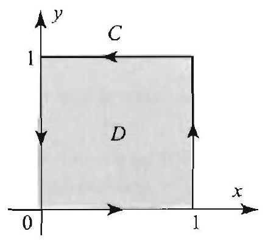

Figure 12

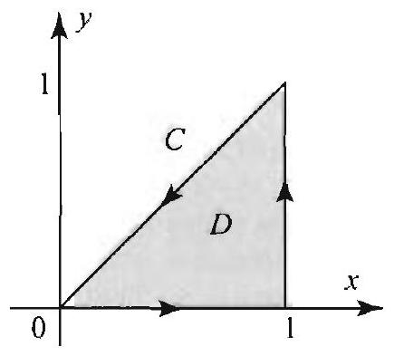

Figure 14

Figure 15

Right margin note (page 11)

621
curve

ns M
and

em 2.
pute
in $C$.
on $\Gamma$.
rat.

++++

Section 12.1 Green's Theorem and Identities

Exercises 12.1
In Exercises 1-4, verify Green's theorem for the given functions $M$ and $N$ and $C$. That is, compute both sides of (4) and show that they are equal.
1. $M=x y, N=y, C$ as in Figure 12.
2. $M=x^{2} y, N=x+y, C$ as in Figure 12.
3. $M=x-y, N=y^{2}, C$ as in Figure 13.
4. $M=x^{2}-y^{2}, N=2 x y . C$ as in Figure 14.

In Exercises 5-8, verify Green's theorem (Theorem 2) for the given functio and $N$, where the curve $\Gamma$, shown in Figure 15, consists of the two circles $C C_{2}$.
5. $M=0, N=x$.
6. $M=-y, N=x$.
7. $M=\frac{-y}{x^{2}+y^{2}}, N=\frac{x}{x^{2}+y^{2}}$.
8. $M=\frac{1}{x^{2}+y^{2}}, N=0$.

In Exercises 9-12, use Green's identities to evaluate the given integral.
9. $\int_{C} y \frac{\partial x}{\partial n} d s$, where $C$ is as in Figure 12.
10. $\int_{C} \frac{\partial f}{\partial n} d s$, where $f(x, y)=x^{2}-2 x+y^{2}$ and $C$ is as in Figure 12.
11. $\int_{C}(x+y) \frac{\partial f}{\partial n} d s$, where $f(x, y)=\epsilon^{r} \cos y$ and $C$ is as in Figure 12.
12. $\int_{C} x \frac{\partial f}{\partial n} d s$, where $f(x, y)=\ln \left(x^{2}+y^{2}\right)$ and $C$ is as in Figure 15.
13. Area of multiply connected regions. Let $\Omega$ and $\Gamma$ be as in Theor Show that the area of $\Omega$ is given by any one of the integrals
$$
\int_{\Gamma}-y d x, \quad \int_{\Gamma} x d y, \quad \frac{1}{2} \int_{\Gamma}(-y d x+x d y)
$$
14. Let $C$ be any positively oriented simple curve enclosing the origin. Comy
$$
\int_{C} \frac{-y d x+x d y}{x^{2}+y^{2}}
$$
[Hint: Let $C_{r}$ be a negatively oriented circle around the origin, contained Apply Theorem 2.]
15. In the notation of Theorem 3, suppose that $u$ is harmonic and $v=0$ Show that
$$
\iint_{\Omega} \nabla u \cdot \nabla v d x d y=0
$$
16. In the notation of Theorem 2. suppose that $u$ is harmonic on $\Omega$. Show th
$$
\int_{\Gamma}\left(\frac{\partial u}{\partial y} d x-\frac{\partial u}{\partial x} d y\right)=0
$$

---

<!-- Page 12 -->

Left margin note (page 12)

622
Chapter 12

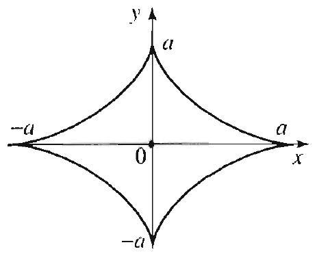

Figure 16 The hy in Exercise 18: $x(t)=a \cos ^{3} t, y(t) 0 \leq t \leq 2 \pi$.
12.2 Harmo

PROPOSI' NC
DERIVATI
THE LOGAI

Right margin note (page 12)

nd the d then it disk have a
ultiply ned for roblem is the
of all on $\Gamma$, at is, if iple.
$\left.\nabla v\right|^{2}=$
$v) \geq 0$,
ctions, imum rward : functies of
$; r>0$

T; then normal

++++

Green's Functions and Conformal Mappings
17. Express the area of the ellipse $\frac{x^{2}}{a^{2}}+\frac{y^{2}}{b^{2}}=1$ as a line integral and then $f$ area. [Hint: Use one of the integrals in Example 1.]
18. Express the area of the hypocycloid $x^{\frac{2}{3}}+y^{\frac{2}{3}}=a^{\frac{2}{3}}$ as a line integral an find the area (Figure 16). [Hint: Use the 3rd integral in (5).]
pocycloid
$$
=a \sin ^{3} t,
$$
19. Consider the Neumann problem in polar coordinates: $\nabla^{2} u=0$ on the ur and $\frac{\partial u}{\partial r}(1, \theta)=\sin \theta$ if $0 \leq \theta \leq \pi$ and 0 if $\pi \leq \theta \leq 2 \pi$. Does the problem solution? Explain your answer.
20. Project Problem: Dirichlet's Principle. Let $\Omega$ be a simply or m connected region with boundary $\Gamma$, as in Theorem 3. Let $h(. r . y)$ be defin ( $x, y$ ) on $\Gamma$, and let $u(x, y)$ denote the (unique) solution of the Dirichlet p $\nabla^{2} u=0$ on $\Omega$ and $u=h$ on $\Gamma$. The energy of a function $\phi$ detined on $\Omega$ nonnegative number
$$
E(\phi)=\frac{1}{2} \iint_{\Omega}|\nabla \phi|^{2} d x d y
$$
where $\nabla \phi=\left(\phi_{x}, \phi_{y}\right)$ is the gradient of o. Dirichlet's principle states that functions $v(x, y)$ on $\Omega$ that satisfy the Dirichlet boundary condition $v=h$ the one that minimizes the energy integral is the harmonic function $u$. The $v=h$ on $\Gamma$, then $E(v) \geq E(u)$. Follow the outlined steps to prove the prince (a) Write $v=u+(v-u)=u+w$, where $w=0$ on l'. Show that $\mid |\nabla u|^{2}+2 \nabla u \cdot \nabla w+|\nabla w|^{2}$.
(b) With the help of Exercise 15, show that $E(v)=E(u)+E(u)$. Since $E(u$ conclude that $E(v) \geq E(u)$.
nic Functions and Green's Identities
In this section, we derive several classical properties of harmonic fun including Gauss's mean value property, and the maximum and min modulus principles. These important results follow from straightfe applications of Green's identities (Section 12.1) using the logarithmic tion. For this reason, we start with two simple but very useful proper the logarithm.

TION 1
RMAL
VE OF
RITHM

For $(x, y) \neq\left(x_{0} . y_{0}\right)$ let
$$
v(x, y)=\frac{1}{2} \ln \left(\left(x-x_{0}\right)^{2}+\left(y-y_{0}\right)^{2}\right) .
$$

Let $C_{r}$ be a positively oriented circle with center $\left(x_{0}, y_{0}\right)$ and radius (Figure 1). Then
$$
\frac{\partial v}{\partial n}(x, y)=\frac{1}{r} \text { for all }(x, y) \text { on } C_{r} .
$$

Proof Parametrize $C_{r}$ by $x(t)=x_{0}+r \cos t, y(t)=y_{0}+r \sin t, 0 \leq t \leq 2 x^{\prime}(t)=-r \sin t$ and $y^{\prime}(t)=r \cos t, \sqrt{\left[x^{\prime}(t)\right]^{2}+\left[y^{\prime}(t)\right]^{2}}=r$. So the unit

---

<!-- Page 13 -->

Left margin note (page 13)

Figure 1 The circle $C_{r}$,

PROPOSITION 2 HARMONICITY OF THE LOGARITHM

THEOREM 1 GAUSS'S MEAN VALUE PROPERTY

Figure 2 The circle $C_{r}$ and its interior region are contained in $\Omega$, for all $0 \leq r<a$.

Right margin note (page 13)

623
points
$$
\left.y^{2}\right)=
$$
$f_{00}$, it
$$
(x . y)
$$

This
$0, y_{0}$ )
$\left.y_{0}\right)$.
$$
\text { t in } \Omega
$$
$$
r>0
$$
with lue of

++++

Section 12.2 Harmonic Functions and Green's Identities

vector on $C_{r}$ is $\frac{1}{r}(r \cos t, r \sin t)=(\cos t$. $\sin t)$. We have
$$
v_{c}=\frac{x-x_{0}}{\left(x-x_{0}\right)^{2}+\left(y-y_{0}\right)^{2}} \quad \text { and } \quad v_{y}=\frac{y-y_{0}}{\left(x-x_{0}\right)^{2}+\left(y-y_{0}\right)^{2}} .
$$

For $(x, y)$ on $C_{r}$, we have
$$
\begin{aligned}
\frac{\partial v}{\partial n}(x, y) & =\left.\left(v_{x}, v_{y}\right) \cdot(\cos t, \sin t)\right|_{x=x_{0}+r \cos t, y=y_{0}+r \sin t} \\
& =\left(\frac{r \cos t}{r^{2}\left(\cos ^{2} t+\sin ^{2} t\right)}, \frac{r \sin t}{r^{2}\left(\cos ^{2} t+\sin ^{2} t\right)}\right) \cdot(\cos t, \sin t)=\frac{1}{r}
\end{aligned}
$$
as claimed.
The following property was used several times previously.
The function $v(x, y)=\frac{1}{2} \ln \left(\left(x-x_{0}\right)^{2}+\left(y-y_{0}\right)^{2}\right)$ is harmonic at all $(x, y) \neq\left(x_{0}, y_{0}\right)$.

Proof A quick way to see this is to realize that $v$ is the translate of $\frac{1}{2} \ln \left(x^{2}+\right. \ln r$. Using the polar form of the Laplacian, $\nabla^{2} f=f_{r r}+(1 / r) f_{r}+\left(1 / r^{2}\right)$. follows that $\ln r$ satisfies Laplaces equation for $r \neq 0$. Hence its translate $v$ satisfies Laplace's equation for $(x, y) \neq\left(x_{0}, y_{0}\right)$.
We can now prove Gauss's mean value property of harmonic functions. property savs that the value of a harmonic function $u$ at any point ( $x$ is equal to the average value of $u$ over any circle centered around $\left(x_{0}\right.$,

Suppose that $u$ is harmonic on a region $\Omega$. Let $\left(x_{0}, y_{0}\right)$ be any poin and $r>0$ be any real number such that the closed disk of radius centered at ( $x_{0}, y_{0}$ ) is contained in $\Omega$ (Figure 2). Then
$$
u\left(x_{0}, y_{0}\right)=\frac{1}{2 \pi} \int_{0}^{2 \pi} u\left(x_{0}+r \cos t, y_{0}+r \sin t\right) d t
$$

A function satisfying (1) at all points in $\Omega$ is said to have the mean property in $\Omega$.

Proof Consider the following function of $r \geq 0$,
$$
\phi(r)=\frac{1}{2 \pi} \int_{0}^{2 \pi} u\left(x_{0}+r \cos t . y_{0}+r \sin t\right) d t
$$
where $r$ is in a small interval, say $[0, a]$, such that the disk of radius $r=0$ center at ( $x_{0} \cdot y_{0}$ ) is contained in $\Omega$. For $r>0, \phi(r)$ is equal to the average vr $u$ on $C_{r}$, the circle of radius $r$ and center $\left(x_{0}, y_{0}\right)$. And. for $r=0$,
$$
\phi(0)=\frac{1}{2 \pi} \int_{0}^{2 \pi} u\left(x_{0}, y_{0}\right) d t=u\left(x_{0}, y_{0}\right)
$$

---

<!-- Page 14 -->

Left margin note (page 14)

624
Chapter 12 Green's Fun

Figure 3 The boundary $\Gamma_{r_{1}, r_{2}}$ consists of $C_{r_{1}}$ and $C_{r_{2}}$.

Right margin note (page 14)

nuous
this it
hen, by
e proof
metrize
e right
ow that
ctively.
e inner
gure 3).
dentity
ct that
5, Sec-

++++

ctions and Conformal Mappings

Because $\phi$ is the integral of the continuous function $u$, it is itself a con function of $r$ on $[0, a]$. Our goal is to show that $\phi$ is in fact constant. From will follow that $\phi(r)=\phi(0)=u\left(x_{0}, y_{0}\right)$, which is what the theorem asserts.

It is enough to show that $\phi\left(r_{1}\right)=\phi\left(r_{2}\right)$ for all $0<r_{1}<r_{2} \leq a$. Tl continuity of $\phi$, the equality $\phi\left(r_{1}\right)=\phi\left(r_{2}\right)$ will hold if $0 \leq r_{1}<r_{2} \leq a$. Th uses Green's identities and properties of the logarithm in a nice way. Para ( ${ }^{\prime}{ }_{r}$ by $x(t)=x_{0}+r \cos t, y(t)=y_{0}+r \sin t, 0 \leq t \leq 2 \pi, d s=r d t$. Then th side of (1) becomes
$$
\phi(r)=\frac{1}{2 \pi} \int_{0}^{2 \pi} u\left(x_{0}+r \cos t, y_{0}+r \sin t\right) d t=\frac{1}{2 \pi r} \int_{C_{r}} u d s
$$

Thus, to show that $\phi\left(r_{1}\right)=c\left(r_{2}\right)$ for any $0<r_{1}<r_{2} \leq a$, it is enough to sho
$$
\frac{1}{r_{2}} \int_{C_{r_{2}}} u d s-\frac{1}{r_{1}} \int_{C_{r_{1}}} u d s=0
$$
where $C_{r_{1}}$ and $C_{r_{2}}$ are circles centered at ( $x_{0}, y_{0}$ ) with radii $r_{1}$ and $r_{2}$, respe Using the result of Proposition 1, we find that on $C_{r_{1}}$
$$
\frac{1}{r_{1}} \int_{C_{r_{1}}} u d s=\int_{C_{r_{1}}} u \frac{\partial v}{\partial n} d s
$$
where $v=\frac{1}{2} \ln \left(\left(x-x_{0}\right)^{2}+\left(y-y_{0}\right)^{2}\right)$. Similarly, on $C_{r_{2}}$,
$$
\frac{1}{r_{2}} \int_{C_{r_{2}}} u d s=\int_{C_{r_{2}}} u \frac{\partial v}{\partial n} d s
$$

Hence
$$
\phi\left(r_{2}\right)-\phi\left(r_{1}\right)=\int_{C_{r_{2}}} u \frac{\partial v}{\partial n} d s-\int_{C_{r_{1}}} u \frac{\partial v}{\partial n} d s=\int_{\Gamma_{r_{1} \cdot r_{2}}} u \frac{\partial v}{\partial n} d s
$$
where $\Gamma_{r_{1}, r_{2}}$ is the boundary of the annular region $\Omega_{r_{1}, r_{2}}$ that consists of th negatively oriented circle $C_{r_{1}}$ and the outer positively oriented circle $C_{r_{2}}$ (Fi Since both $u$ and $v$ are harmonic in $\Omega_{r_{1}, r_{2}}$, it follows from Green's second that
$$
\int_{\Gamma_{r_{1}, r_{2}}} u \frac{\partial v}{\partial n} d s=\int_{\Gamma_{r_{1}, r_{2}}} v \frac{\partial u}{\partial n} d s,
$$
because the left side of Green's identity is 0 in this case. Now using the fa $v=\ln r_{1}$ on $C_{r_{1}}$ and $v=\ln r_{2}$ on $C_{r_{2}}$, we get
$$
\begin{aligned}
\int_{\Gamma_{r_{1}, r_{2}}} v \frac{\partial u}{\partial n} d s & =\int_{C_{r_{2}}} v \frac{\partial u}{\partial n} d s-\int_{C_{r_{1}}} v \frac{\partial u}{\partial n} d s \\
& =\ln \left(r_{2}\right) \overbrace{\int_{C_{r_{2}}} \frac{\partial u}{\partial n} d s}^{=0}-\ln \left(r_{1}\right) \overbrace{\int_{C_{r_{1}}} \frac{\partial u}{\partial n} d s}^{=0}=0
\end{aligned}
$$
because of the compatibility condition for harmonic functions (Example tion 12.1). Thus $\phi\left(r_{2}\right)-\phi\left(r_{1}\right)=0$, as desired.

---

<!-- Page 15 -->

Left margin note (page 15)

THEOREM 2
MAXIMUMMINIMUM
PRINCIPLE

Right margin note (page 15)

625

ty is first value
niaxtion. defwe perty
imum
m or $=x y$ arily have

++++

Section 12.2 Harmonic Functions and Green's Identities

It can be shown that the converse of Gauss's mean value proper also true, in the following sense. Suppose that $u(x, y)$ has continuous and second partial derivatives in a region $\Omega$ and $u$ satisfies the mean property at all points in $\Omega$, then $u$ is harmonic on $\Omega$.

The mean value property has important consequences, such as the imum and minimum modulus principles that we prove later in this seo Let us now show an interesting application to the evaluation of certain inite integrals.

EXAMPLE 1 Applying the mean value property
(a) Verify that $u(x, y)=e^{y} \cos x$ is harmonic for all $(x, y)$.
(b) Show that
$$
\frac{1}{2 \pi} \int_{0}^{2 \pi}, \sin t \cos (\cos t) d t=1
$$
(c) More generally, show that for any real numbers $a$ and $b$
$$
\frac{1}{2 \pi} \int_{0}^{2 \pi} e^{b+\sin t} \cos (a+\cos t) d t=e^{b} \cos a
$$

Solution (a) This part is straightforward:
$$
u_{x x}=-e^{y} \cos x, \quad u_{y y}=e^{y} \cos x .
$$

Hence $u_{x, r}+u_{y y}=0$ and the function is harmonic for all ( $x, y$ ). To do part (b use the mean value property of $u$ at the origin:
$$
u(0,0)=\frac{1}{2 \pi} \int_{0}^{2 \pi} u(\cos t . \sin t) d t-\frac{1}{2 \pi} \int_{0}^{2 \pi} e^{\sin t} \cos (\cos t) d t
$$

But $u(0,0)=1$ and so (b) holds. To prove (c), we apply the mean value pro at the point $(a, b)$. Then
$$
\begin{aligned}
e^{b} \cos a & =u(a . b)=\frac{1}{2 \pi} \int_{0}^{2 \pi} u(a+\cos t, b+\sin t) d t \\
& =\frac{1}{2 \pi} \int_{0}^{2 \pi} e^{b+\sin t} \cos (a+\cos t) d t
\end{aligned}
$$
as claimed.
We next prove an important property of harmonic functions.
Let $\Omega$ be a region and $u$ a harmonic function on $\Omega$. If $u$ attains a max or a minimum inside $\Omega$, then $u$ is constant on $\Omega$.

If the region $\Omega$ is not bounded, the function $u$ need not attain a maxim a minimum anywhere inside $\Omega$ or on its boundary. For example. $u(x . y)$ is harmonic in the upper half-plane $\Omega$. It is clear that $u$ takes on arbit, large and arbitrarily small values as $(x, y)$ ranges in $\Omega$. So $u$ does not

---

<!-- Page 16 -->

Left margin note (page 16)

626
Chapter 12 Green's Fun

COROLLARY 1

Figure 4 The rectangle in Example 2.

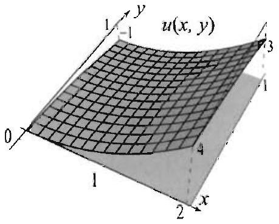

Figure 5 Maximum and minimum values of a harmonic function.

Right margin note (page 16)

rmonic m and closed nless $u$
hat $u$ is $M$ and onstant
ness of 4, Secl prove
ple in the

Corolhe sides unn, re-
$\leq 2$, it
$y \leq 1$,
-1 and
$M_{4}=0$. $=m_{3}=$ c point $=4$, and alues of ave
ple in the
us look es as in ximum.

++++

ctions and Conformal Mappings
a maximum or minimum value. However, if $\Omega$ is bounded and $u$ is ha on $\Omega$ and continuous on its boundary, then it must attain its maximu minimum values, by a well-known property of continuous functions on and bounded sets. Since these values cannot be attained inside $\Omega$ u is constant, we obtain the following useful fact.

Let $\Omega$ be a bounded region and $u$ a harmonic function on $\Omega$, such t, continuous on the boundary of $\Omega$. Then $u$ attains its maximum value its minimum value $m$ on the boundary of $\Omega$. Moreover, either $u$ is c on $\Omega$ or $m<u(x, y)<M$ for all $(x, y)$ in $\Omega$.
Using Corollary 1, you can give an alternative proof of the unique the solution of a Dirichlet problem on a bounded region (Theorem tion 12.1). We next illustrate the applications of Corollary 1 and then Theorem 2.

EXAMPLE 2 Applying the maximum-minimum modulus princi Find the maximum and minimum values of $u(x, y)=x^{2}-y^{2}$ for $(x . y)$ rectangular region $R$ in Figure 1, where $0 \leq x \leq 2$ and $0 \leq y \leq 1$.

Solution It is straightforward to check that $u$ is harmonic for all (.r. y). By lary 1 , its maximum and minimum values occur on the boundary. Label th. of $R$ as shown in Figure 4, and let $m_{j}$, respectively $M_{j}$, denote the minim spectively maximum, value of $u$ on side $\# j$.
On side $\# 1$, we have $y=0$ and $0 \leq x \leq 2$. So $u(x, y)=x^{2}$, and since $0 \leq x$ follows that $m_{1}=0$ and $M_{1}=4$.
On side $\# 2$, we have $x=2$ and $0 \leq y \leq 1$. So $u(x, y)=4-y^{2}$. and since $0 \leq$ it follows that $m_{2}=3$ and $M_{2}=4$.
On side \#3, we have $y=1$ and $0 \leq x \leq 2$. So $u(x, y)=x^{2}-1, m_{3}= M_{1}=3$.
On side \#4, we have $x=0$ and $0 \leq y \leq 1$. So $u(x, y)=-y^{2}, m_{4}=-1$ and
By comparison, we find the smallest value of $u$ on the boundary to be $m$ : $m_{4}=-1$. Note that $m_{3}$ and $m_{4}$ correspond to the value of $u$ at the sam $(0,1)$. Similarly, the largest value of $u$ on the boundary is $M=M_{1}=M_{2}=$ it occurs at the point (2, 1)). In conclusion, the maximum and minimum v $u$ are attained at two points on the boundary. At all points inside $R$, we ha
$$
-1<u(x, y)<4,
$$
as guaranteed by Corollary 1 (Figure 5).

EXAMPLE 3 Applying the maximum-minimum modulus princi Find the maximum and minimum values of $u(x, y)=e^{y} \cos x$ for $(x, y)$ rectangular region $R$, where $-\frac{\pi}{2} \leq x \leq \frac{\pi}{2}$ and $-1 \leq y \leq 1$.
Solution From Example 1, we know that $u$ is harmonic for all $(x, y)$. We tl for the maximum and minimum values of $u$ on the boundary. Label the sid Figure 4, and let $m_{j}$, respectively $M_{j}$, denote the minimum, respectively ma value of $u$ on side $\# j$.

---

<!-- Page 17 -->

Left margin note (page 17)

Figure 6 Maximum and minimum values of a harmonic function.

Figure 7 Covering the polygonal line with finitely many disks in $\Omega$ (here $n=8$ ).

Right margin note (page 17)

627

nd it
s \#2
ad so allest
itely value
connonic that hat $u$ rgest n the
$y_{0}$ ). value
$2 \pi]$. of $f$ is for $\sin t) { }_{1} C_{r}$. circle roof.
line. with $S_{j-1}$ 1 line cause quals $=M$. ou fit shion $=M$,

++++

Section 12.2 Harmonic Functions and Green's Identities

On side \#1, we have $y=-1$ and $-\frac{\pi}{2} \leq x \leq \frac{\pi}{2}$. So $u(x, y)=e^{-1} \cos x$, a follows that $m_{1}=0$ and $M_{1}=e^{-1}$, because $0 \leq \cos x \leq 1$ for $-\frac{\pi}{2} \leq x \leq \frac{\pi}{2}$. On sides \#2 and 4, we have $x= \pm \frac{\pi}{2}, \cos x=0$; consequently, $u=0$ on side and 4 , and so $m_{2}=M_{2}=m_{1}=M_{4}=0$.
On side $\# 3$, we have $y=1$, hence $u(x, y)=e \cos x$, where $-\frac{\pi}{2} \leq x \leq \frac{\pi}{2}$; an $m_{3}=0$ and $M_{3}=e$. Comparing the values on the boundary, we find the sm: value of $u$ to be 0 and the largest one to be $e$. At all points inside $R$, we have
$$
0 \backsim u(x, y)<e .
$$

Unlike the situation in Example 2, here the minimum value is attained at infir many points on the boundary, namely on the sides \#2 and 4. The maximum $e$ is attained at one point on the boundary $(0,1)$ (Figure 6).

Proof of Theorem 2. It is enough to prove the statement of the theorem cerning the maximum of $u$. Then, if we let $v=-u$, we have that $v$ is harn and a minimum value of $u$ corresponds to a maximum value of $v$. So suppose $u$ attains a maximum value at ( $x_{0}, y_{0}$ ) in $\Omega$, and let us prove in two steps th must be constant on $\Omega$. In a first step, we show that $u$ is constant in the la disk that you can place around ( $x_{0}, y_{0}$ ) in $\Omega$. Then, using this fact, we show i second step that $u$ must be constant on $\Omega$.
Step 1: Let $C_{r}$ be any positively oriented circle in $\Omega$, with center at ( $x_{0}$ By assumption $M=u\left(x_{0}, y_{0}\right) \geq u(x, y)$ for all $(x, y)$ in $\Omega$. By the mean theorem, we have
$$
M=u\left(x_{0}, y_{0}\right)=\frac{1}{2 \pi} \int_{0}^{2 \pi} u\left(x_{0}+r \cos t, y_{0}+r \sin t\right) d t
$$

Consider the continuous function $f(t)=u\left(x_{0}+r \cos t, y_{0}+r \sin t\right)$ for $t$ in $[0$ Since $M \geq u(x, y)$, we have $f(t) \leq M$ for all $t$ in $[0,2 \pi]$. Also, the average on the interval $[0,2 \pi]$ is equal to $M$. The only way that this can happen $f(t)=M$ for all $t$ in $[0,2 \pi]$ (sce Exercise 12). Thus $M \cdots u\left(x_{0}+r \cos t, y_{0}+r\right.$ for all $t$ in $[0,2 \pi]$, which shows that $u$ is constant and equal to $u\left(x_{0}, y_{0}\right)$ or Since $r$ is arbitrary, it follows that $u$ is constant and equal to $u\left(x_{0}, y_{0}\right)$ on any that you can fit around ( $x_{0}, y_{0}$ ) in $\Omega$, which establishes the first part of the p

Step 2: Let $(x, y)$ be any point in $\Omega$. Join $\left(x_{0}, y_{0}\right)$ to $(x, y)$ using a polygonal Cover the polygonal line by finitely many overlapping disks, $S_{0}, S_{1}, \ldots, S_{n}$, $S_{0}$ centered at $\left(x_{0}, y_{0}\right)$, and $S_{j}$ centered at $\left(x_{j}, y_{j}\right)$, the point of intersection of and the polygonal line (Figure 7). (The fact that you can cover the polygona with finitely many disks as described is not obvious in general, but it is true be the polygonal line is closed and bounded.) The function $u$ is constant and e the maximum value $M$ on $S_{0}$. By continuity of $u$, it follows that $u\left(x_{1}, y_{1}\right)=$ By the previous step, it follows that $u$ is constant in the largest disk that y around $\left(x_{1}, y_{1}\right)$. Hence $u$ is constant and equals $M$ in $S_{1}$. Continue in this fa to conclude that $u$ is constant and equals $M$ in $S_{2}, \ldots, S_{n}$. Thus $u(x, y)=$ and since $(x, y)$ is arbitrary it follows that $u$ is constant in $\Omega$.

---

<!-- Page 18 -->

Left margin note (page 18)

628

Chapter 12 Green's Fun

Right margin note (page 18)

unction
$l t$.
aximum
$y^{2} \leq 4$.
1.
ic on $\Omega$
armonic ution of
's equaes sense
n $[a, b]$. to $M$ ), is clear.
creasing
$[a, b]$.
$a, b]$.
Suppose $v$ that if

++++

ctions and Conformal Mappings
Exercises 12.2
In Exercises 1-4, identify each integral as the mean value of a harmonic $f$ at a point and then evaluate the integral using Theorem 1.
1. $\frac{1}{2 \pi} \int_{0}^{2 \pi} e^{\cos t} \cos (\sin t) d t$.
2. $\frac{1}{2 \pi} \int_{0}^{2 \pi}(3+\cos t)(1+\sin t)$
3. $\frac{1}{2 \pi} \int_{0}^{2 \pi} \cos (1+\cos t) \cosh (2+\sin t) d t$.
4. $\frac{1}{2 \pi} \int_{0}^{2 \pi} \sin (1+\cos t) \sinh (2+\sin t) d t$.

In Evercists $5-8$, show that $u$ is harmonic on the given region; find its $m$ and minimum values; and determine where they occur in that region.
5. $u(x, y)=l^{2}-y^{2}+x y$, for $0 \leq x \leq 1,0 \leq y \leq 1$.
6. $u(x . y)=c^{x} \cos y$, for $0 \leq x \leq 1,-\pi \leq y \leq \pi$.
7. $u(x, y)=\frac{x}{x^{2}+y^{2}}$, where $(x, y)$ belongs to the annular region $1 \leq x^{2}+$
8. $u(x, y)=x y$, where $(x, y)$ belongs to the annular region $1 \leq x^{2}+y^{2} \leq$
9. Let $\Omega$ be a bounded region with boundary $\Gamma$. Show that if $u$ is harmon and $u=0$ on $\Gamma$, then $u=0$ on $\Omega$.
10. Let $\Omega$ be a bounded region with boundary $\Gamma$. Show that if $u$ and $v$ are h: on $\Omega$ and $u=v$ on $\Gamma$, then $u=v$ on $\Omega$. Derive the uniqueness of the sol the Dirichlet problem on $\Omega$.
11. Review the numerical technique based on the discretization of Laplace tion (Section 9.3). Explain why the averaging formula ((6), Section 9.3) mak in view of the mean value property of harmonic functions.
12. Suppose that $f(t)$ is continuous on $[a, b]$ and that $f(t) \leq M$ for all $t$ Show that if $\frac{1}{b-a} \int_{a}^{b} f(t) d t=M$ (that is, the average of $f$ on $[a, b]$ is equal then $f(t)$ is constant and equal to $M$ for all $t$ in $[a, b]$. Intuitively the result To prove it, proceed as follows.
(a) For $x$ in $[a, b]$, let
$$
F(x)=\frac{1}{b-a} \int_{a}^{x}(M-f(t)) d t
$$

Compute $F^{\prime}(x)$ and show that $F^{\prime}(x) \geq 0$ for all $x$ in $[a, b]$. Hence $F$ is in on $[a, b]$.
(b) Show that $F(a)=0$ and $F(b)=0$. Conclude that $F$ is identically 0 on
(c) Show that $F^{\prime}(x)=0$ on $[a, b]$ and conclude that $f(t)=M$ for all $t$ in [
13. Modify the outlined proof in Exercise 12 to show the following result. that $f(t)$ is continuous on $[a, b]$ and that $f(t) \geq M$ for all $t$ in $[a . b]$. Shov $\frac{1}{b-a} \int_{a}^{b} f(t) d t=M$. then $f(t)$ is constant and equal to $M$ for all $t$ in $[a, b]$.

---

<!-- Page 19 -->

Left margin note (page 19)

12.3 Green's

Figure 1 Typical regi the results of this see

THEOF
REPRESENTA FOR

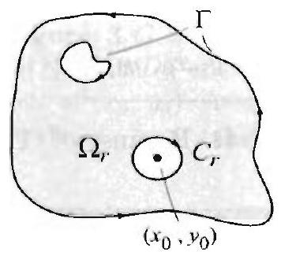

Figure 2 The ci encloses the proble $\left(x_{0}, y_{0}\right)$ for the logarit b, and so $n$ is harn $\Omega_{r}$.

Right margin note (page 19)

629

nonic point the ove a nside mine the This ction chlet n Oll ed in
sists .,$C_{n} =3$ ). disk, riate
uside ve on
${ }^{1}$. Let
enot. re 2). nber. reen's e left hen

++++

Section 12.3 Green's Functions

Functions
In the previous section we proved the mean value property of a harn function $u$ on a region $\Omega$. which says that the value of $u$ at a given ( $x_{0}, y_{0}$ ) in $\Omega$ is obtained by averaging (or integrating and dividing by $2 \pi$ values of $u$ on any circle in $\Omega$ centered at ( $x_{0}, y_{0}$ ). In this section we pr far-reaching generalization of this fact. We show that if $u$ is harmonic i a region $\Omega$ and continuous on the boundary of $\Omega$, then we can deter all the values of $u$ inside of $\Omega$ by integrating on the boundary of $\Omega$ product of $u$ times a fixed function that depends only on $\Omega$ and not $u$. magical function is the normal derivative of the so-called Green's fun for the region $\Omega$, and the integral formula thus obtained solves the Diri problem inside $\Omega$. Variations on this formula solve Poisson's equatio $\Omega$. Concrete formulas of Green's functions for specific regions are deriv this section and Sections 12.4 and 12.7.

=3)

Throughout this section, $\Omega$ is a region with boundary $\Gamma$, where $\Gamma$ col of simple curves $C$ (exterior boundary, positively oriented) and $C_{1}, \ldots$ (interior boundary, negatively oriented) (see Figure 1 for a case where $n$ For clarity's sake, as you read through this section, take $\Omega$ to be the unit $\Gamma$ the positively oriented unit circle, and $C_{1}, \ldots, C_{n}$ circles of approp radii when present.

We start with an intermediate formula, in which the values of $u$ i $\Omega$ are determined from its values and the values of its normal derivati the boundary $\Gamma$.

Suppose that $u$ is harmonic inside $\Omega$ and continuous on its boundary I $\left(x_{0}, y_{0}\right)$ be a point inside $\Omega$. Then
$$
u\left(x_{0}, y_{0}\right)=\frac{1}{2 \pi} \int_{\Gamma}\left(u \frac{\partial v}{\partial n}-v \frac{\partial u}{\partial n}\right) d s
$$
where $v(x, y)=\frac{1}{2} \ln \left(\left(x-x_{0}\right)^{2}+\left(y-y_{0}\right)^{2}\right)$.

Proof Draw a negatively oriented circle $C_{r}$ around ( $r_{0}, y_{0}$ ) in $\Omega$ and let $\Omega_{r} \mathrm{~d}$ the region that consists of $\Omega$ minus the disk of radius $r$ around $\left(x_{0}, y_{0}\right)$ (Fign The boundary of $\Omega_{r}$ is $\Gamma$ plus $C_{r}$. Both $u$ and $v$ are harmonic in $\Omega_{r}$ (reme the only problem point for $v$ is $\left(x_{0}, y_{0}\right)$ and this point is not in $\left.\Omega_{r}\right)$. Apply G second identity over $\Omega_{r}$ (Theorem 3, Section 12.1) and use the fact that th side of this identity is 0 in this case, becanse $\nabla^{2} u-0$ and $\nabla^{2} v=0$ on $\Omega_{r}$. T
$$
\int_{\Gamma}\left(u \frac{\partial v}{\partial n}-v \frac{\partial u}{\partial n}\right) d s+\int_{C_{r}}\left(u \frac{\partial v}{\partial n}-v \frac{\partial u}{\partial n}\right) d s=0
$$

Thus
$$
\int_{\Gamma}\left(u \frac{\partial v}{\partial n}-v \frac{\partial u}{\partial n}\right) d s=-\int_{C_{r}}\left(u \frac{\partial v}{\partial n}-v \frac{\partial u}{\partial n}\right) d s
$$

---

<!-- Page 20 -->

Left margin note (page 20)

630
Chapter 12 Green's Fuu

THEOREM 2 SOLUTION OF DIRICHLET PROBLEM

Right margin note (page 20)

equality $-C_{r}$ is $-r \sin t$,

0
$\frac{\partial u}{n} d s$
orem 1.
a way e of $u$. ch that dentity
obtain

Let $\left.x_{0}, y_{0}\right)$,
e of (1)
∵ Then

++++

ctions and Conformal Mappings

and so the theorem will follow if we can show that the right side of the last is $2 \pi u\left(x_{0}, y_{0}\right)$. Since $C_{r}$ is negatively oriented, we have $-\int_{C_{r}}=\int_{-C_{r}}$, where now positively oriented. Parametrize $-C_{r}$ by $x(t)=x_{0}+r \cos t, y(t)=y_{0}- 0 \leq t \leq 2 \pi, d s=r d t, v=\ln r, \frac{\partial v}{\partial n}=\frac{1}{r}$ (Proposition 2, Section 12.2). Then
$$
\begin{aligned}
\int_{-C_{r}}\left(u \frac{\partial v}{\partial n}-c \frac{\partial u}{\partial n}\right) d s & =\overbrace{\int_{0}^{2 \pi} u\left(x_{0}+r \cos t, y_{0}+r \sin t\right) d t}^{=2 \pi u\left(x_{0}, y_{0}\right)}-\ln r \overbrace{\int_{C}}^{=} \\
& =2 \pi u\left(x_{0}, y_{0}\right)
\end{aligned}
$$
where we have used the mean value property of harmonic functions (The Section 12.2), and the compatibility property (Example 5, Section 12.1).

Next, we modify the representation formula in Theorem 1 in such that the resulting line integral does not involve the normal derivativ For this purpose, suppose that there is a harmonic function $h$ on $\Omega$ su $h=-v$ on $\Gamma$, where $v$ is as in Theorem 1. Applying Green's second i with $u$ and $h$ (both are harmonic on $\Omega$ ), we get
$$
0=\int_{\Gamma}\left(u \frac{\partial h}{\partial n}-h \frac{\partial u}{\partial n}\right) d s
$$

Dividing by $2 \pi$ and using $h=-v$ on $\Gamma$, we get
$$
0=\frac{1}{2 \pi} \int_{\Gamma}\left(u \frac{\partial h}{\partial n}+v \frac{\partial u}{\partial n}\right) d s
$$

Adding this identity to the representation formula in Theorem 1, we
$$
u\left(x_{0}, y_{0}\right)=\frac{1}{2 \pi} \int_{\Gamma} u \frac{\partial}{\partial n}(h+v) d s
$$

So far $\left(x_{0}, y_{0}\right)$ is fixed in $\Omega$, and $v$ and $h$. clearly depend on $\left(x_{0}, y_{0}\right. \left(x_{0}, y_{0}\right)$ vary in $\Omega$ and suppose that for each $\left(x_{0}, y_{0}\right)$ we can find $h(x, y$ so that (1) holds. Write
$$
G\left(x, y, x_{0}, y_{0}\right)=\overbrace{\frac{1}{2} \ln \left(\left(x-x_{0}\right)^{2}+\left(y-y_{0}\right)^{2}\right)}^{v\left(x, y_{1}, x_{0}, y_{0}\right)}+h\left(x, y, x_{0}, y_{0}\right) .
$$

The function $G$ is called Green's function for the region $\Omega$. Becaus we have the following important result.

Suppose that $u$ is harmonic on $\Omega$ and continuous on its boundary I for ( $x_{0}, y_{0}$ ) in $\Omega$, we have
$$
u\left(x_{0}, y_{0}\right)=\frac{1}{2 \pi} \int_{\Gamma} u(x, y) \frac{\partial G}{\partial n}\left(x, y, x_{0}, y_{0}\right) d s
$$
where $G$ is Green's function for $\Omega$.

---

<!-- Page 21 -->

Left margin note (page 21)

THEOREM 3
PROPERTIES OF GREEN'S FUNCTION

Figure $3 G=v+h$, where $|h| \leq M$ in $D_{R}$ and $v$ tends to $-\infty$ at $\left(x_{0}, y_{0}\right)$. As a result $G$ tends to $-\infty$ at $\left(x_{0}, y_{0}\right)$.

Right margin note (page 21)

631

een's they forpute tors. solve rol)-
efer-
as in

Har-
ed by
, $y_{0}$ )
tion. used d on brove other But $\imath=q$
ed at rence s. $y) 2 M C_{r}$. note dary oved ions, D, we
sing

++++

Section 12.3 Green's Functions

Formula (3) solves the Dirichlet problem on $\Omega$. The trouble is that Gre functions are not easy to compute for arbitrary regions, and even when are known, the integral (3) is still difficult to evaluate. Nevertheless, mula (3) offers many advantages. In the following sections, we will com it explicitely for important regions such as disks, half-planes, and sec Furthermore, the same ideas that we used to derive (3) can be used to other important equations, such as Poisson's equation and Neumann lems.

We now list fundamental properties of Green's function for future r ence.

Let $\Omega$ be a region with boundary $\Gamma$, and let $G$ be its Green's function (2). Then
(i) $G\left(x, y, x_{0}, y_{0}\right)$ is a harmonic function of ( $x, y$ ) in $\Omega$ minus ( $x_{0}, y_{0}$ ). monicity fails at ( $x_{0}, y_{0}$ ) due to the logarithmic part $v$.
(ii) $G\left(x, y, x_{0}, y_{0}\right)=0$ for all $(x, y)$ on the boundary $\Gamma$.
(iii) $G\left(x, y, x_{0}, y_{0}\right) \leq 0$ for all $(x, y)$ in $\Omega$ minus $\left(x_{0}, y_{0}\right)$.
(iv) (uniqueness property) Green's function is uniquely determine the region $\Omega$.
(v) (symmetry property) $G\left(x, y, x_{0}, y_{0}\right)=G\left(x_{0}, y_{0}, x, y\right)$ for all ( $x$ and ( $x, y$ ) in $\Omega$.

Proof Properties (i) and (ii) are immediate from the definition of Green's func Property (v) is not obvious but its proof is based on ideas that we have throughout this section. We outline it in the exercises. (Another proof, base conformal mappings, is given in Section 12.7, following Theorem 3.) Let us (iii) and (iv), starting with (iv). Write $G=v+h$ as in (2). If $Q=v+q$ is an Green's function for $\Omega$, then because $Q=0$ on $\Gamma$, it follows that $q=-v$ on $\Gamma$. $h=-v$ on $\Gamma$, so $h=q$ on $\Gamma$. Since both $h$ and $q$ are harmonic, it follows that $/$ on $\Omega$, by Theorem 4, Section 12.1. Hence $G=Q$ on $\Omega$.

To prove (iii), again write $G=v+h$ as in (2). Fix a closed disk $D_{R}$ center ( $x_{0}, y_{0}$ ) and contained in $\Omega$. Since $h$ is harmonic on $\Omega$, it is continuous and bounded in $D_{R}$, say $\left|h\left(x, y, x_{0}, y_{0}\right)\right| \leq M$ on $D_{R}$. Now, $v$ tends to $-\infty$ as ( approaches $\left(x_{0}, y_{0}\right)$. So we can find $0<r_{0}<R$ such that $v\left(x, y, x_{0}, y_{0}\right)<$ on $C_{r}$ for all $0<r \leq r_{0}<R$ (see Figure 3). Hence $G\left(x, y, x_{0}, y_{0}\right) \leq-M$ or because $G=h+v, v\left(x, y, x_{0}, y_{0}\right)<-2 M$ and $\left|h\left(x, y, x_{0}, y_{0}\right)\right| \leq M$ on $C_{r}$. D the region $\Omega$ minus the disk of radius $r$ centered at ( $x_{0}, y_{0}$ ) by $\Omega_{r}$. The boum of $\Omega_{r}$ consists of $\Gamma$ and $C_{r}$. The function $G$ is harmonic in $\Omega_{r}$ and we just pt that it is $\leq 0$ on its boundary. By the maximum principle for harmonic funct it follows that $G \leq 0$ on $\Omega_{r}$. Since this is true for all $0<r \leq r_{0}$, letting $r \rightarrow$ see that $G \leq 0$ on $\Omega$ minus $\left(x_{0}, y_{0}\right)$. Hence (iii) holds.

Solution of Poisson's Equation
We consider Poisson's equation on $\Omega$ and solve this important equation 1 ideas similar to those of the proof of Theorem 2.

---

<!-- Page 22 -->

Left margin note (page 22)

VLVG ΛΗναΝΩΟΙ ΟΗᲭΖ HLIM NOILV ΩΌ S،NOSSIOC HO NOILATOS

Right margin note (page 22)

y) be a on $\Omega$.
nus $D_{r}$. y of $\Omega_{r}$ identity
bllowing
copious , where onstant tinuous

$\left.\frac{\partial u}{\partial n} \right\rvert\, \leq A$ hence

0 ,

++++

ctions and Conformal Mappings

Let $\Omega$ be a region with boundary $\Gamma$ as in Theorem 1. Let $f(x$, function on $\Omega$ and suppose that $u$ is a solution of Poisson's equation
$$
\nabla^{2} u(x, y)=f(x, y), \quad(x, y) \text { in } \Omega,
$$
such that $u=0$ on the boundary $\Gamma$. Then, for all $\left(x_{0}, y_{0}\right)$ in $\Omega$,
$$
u\left(x_{0}, y_{0}\right)=\frac{1}{2 \pi} \iint_{\Omega} f(x, y) G\left(x, y, x_{0}, y_{0}\right) d x d y
$$
where $G$ is Green's function for $\Omega$.
Proof If $u$ is a solution, then $\nabla^{2} u(x, y)=f(x, y)$ on $\Omega$, and so
$$
\iint_{\Omega} f(x, y) G\left(x, y, x_{0}, y_{0}\right) d x d y=\iint_{\Omega} \nabla^{2} u(x, y) G\left(x, y, x_{0}, y_{0}\right) d x d
$$

Let $C_{r}$ be a negatively oriented circle around $\left(x_{0}, y_{0}\right)$ and let $\Omega_{r}$ be $\Omega \mathrm{mi}$ the closed disk of radius $r$ centered at $\left(x_{0}, y_{0}\right)$ (Figure 2). The boundar consists of $\Gamma$ plus the negatively oriented circle $C_{r}$. Apply Green's second in $\Omega_{r}$, use that $u=0$ on $\Gamma, G$ is harmonic in $\Omega_{r}$ and $G=0$ on $\Gamma$, and get
$$
\begin{array}{l}
-\iint_{\Omega_{r}} G\left(s, y, x_{0}, y_{0}\right) \nabla^{2} u(x, y) d . r d y \\
\quad=\int_{C_{r}} u(x, y) \frac{\partial G}{\partial n}\left(x, y, x_{0}, y_{0}\right) d s-\int_{C_{r}} G\left(x, y, x_{0}, y_{0}\right) \frac{\partial u}{\partial n}(x, y) d
\end{array}
$$

To complete the proof of the theorem, we let $r-0$ in (6) and establish the fo three limits:
$$
\begin{array}{c}
\lim _{r \rightarrow 0}-\iint_{\Omega} G\left(x, y, x_{0}, y_{0}\right) \nabla^{2} u(x, y) d x d y \\
=-\iint_{\Omega} G\left(x, y, x_{0}, y_{0}\right) \nabla^{2} u(x, y) d x d y \\
\lim _{r \rightarrow 0} \int_{C_{r}} u(x, y) \frac{\partial G}{\partial n}\left(x, y, x_{0}, y_{0}\right) d s=-2 \pi u\left(x_{0}, y_{0}\right) \\
\lim _{r \rightarrow 0}-\int_{C_{r}} G\left(x, y, x_{0}, y_{0}\right) \frac{\partial u}{\partial n}(x, y) d s=0
\end{array}
$$

We shall prove (9) and leave the proofs of (7) and (8) to the exercises (with hints). Write $G\left(x, y, x_{0}, y_{0}\right)=h\left(x, y, x_{0}, y_{0}\right)+\frac{1}{2} \ln \left(\left(x-x_{0}\right)^{2}+\left(y-y_{0}\right)^{2}\right) h\left(x, y, x_{0}, y_{0}\right)$ is harmonic, hence continuous, and hence bounded by a $M$ on $D_{r}$ (in particular, $h$ is bounded by $M I$ on $C_{r}$ ). Also, since $u$ has con partial derivatives in $\Omega . \frac{\partial u}{\partial m}$ is continuous on $D_{r}$ and bounded on $D_{r}$ (say, on $\left.D_{r}\right)$. Furthermore, for $(x, y)$ on $C_{r}$, we have $\left|v\left(x, y, x_{0}, y_{0}\right)\right|=\mid \ln r \left|G\left(x, y, x_{0}, y_{0}\right) \frac{i n}{\partial n}\right| \leq(M+|\ln r|) A$. and so
$$
\begin{aligned}
\left|\int_{C_{r}} G\left(x, y, x_{0}, y_{0}\right) \frac{\partial u}{\partial n}(. x . y) d s\right| & \leq(M+|\ln r|) A \int_{C_{r}} d s \\
& =2 \pi r(M+|\ln r|) A \rightarrow 0, \text { as } r \rightarrow
\end{aligned}
$$

---

<!-- Page 23 -->

Left margin note (page 23)

THEOF
GEN
SOLUTIC
POIS:
EQUA

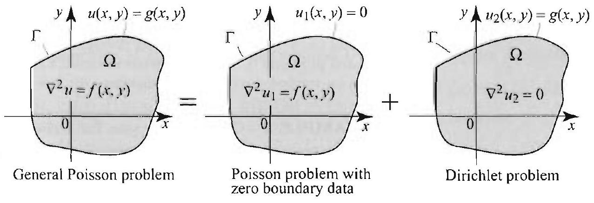

Figure 4 Decomposi general Poisson probl two simpler subproble

Figure 5 Poisson pre a rectangle, with zere ary values.

Right margin note (page 23)

633
lues, ation esult ve in
sson's on $\Gamma$.
y)
$x$
angle on in ow is (5). serios trate truct
vith 0 r any

++++

Section 12.3 Green's Functions

which completes the proof of (9).
To solve the general Poisson equation with arbitrary boundary va we combine the solutions of the Dirichlet problem and Poisson's equ with zero boundary values, as illustrated by Figure 4. We state the r in a theorem and omit the proof which is similar to a proof that we ga Section 3.9 for the Poisson problem on a rectangle.

With the notation of Theorem 4, suppose that $u$ is a solution of Poi

LEM 5
ERAL
N OF
SON'S
TION equation (4) with boundary condition $u(x, y)=g(x, y)$ for all $(x, y)$ Then, for all ( $x_{0}, y_{0}$ ) in $\Omega$,
$$
\begin{aligned}
u\left(x_{0}, y_{0}\right)= & \frac{1}{2 \pi} \iint_{\Omega} f(x, y) G\left(x, y, x_{0}, y_{0}\right) d x d y \\
& +\frac{1}{2 \pi} \int_{\Gamma} g(x, y) \frac{\partial G}{\partial n}\left(x, y, x_{0}, y_{0}\right) d s
\end{aligned}
$$
where $G$ is Green's function for $\Omega$.

General Poisson problem

Poisson problem with zero boundary data

Dirichlet problem

Green's Function, Method of Eigenfunction Expansions
Recall that we have solved Poisson's equation on regions such as a rect or a disk, by using the eigenfunction expansion method. The soluti each case is given by an infinite or doubly infinite series. The plan $n$
bblem on bound- to identify Green's function in these formulas by comparing them witl This will yield Green's functions on a rectangle and a disk in a double form. Even though this form does not match (2), it does serve to illus some properties of Green's functions. (In the next section we will cons Green's function on a disk and obtain a formula that matches (2).)

EXAMPLE 1 Green's function for a rectangle
Consider Poisson's equation $\nabla^{2} u(x, y)=f(x . y)$ on an $a \times b$ rectangle $R v$ boundary values, as illustrated in Figure 5. From Section 3.9, we have, fo

---

<!-- Page 24 -->

Left margin note (page 24)

634
Chapter 12 Green's Fun

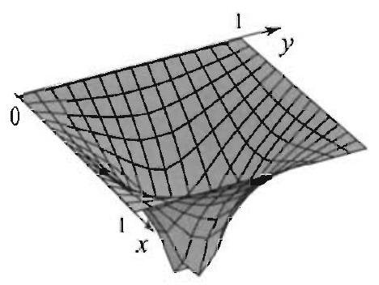

Figure 6 Green's function for a $1 \times 1$-rectangle at $\left(x_{0}, y_{0}\right)= \left(\frac{1}{2}, \frac{1}{2}\right)$, drawn using a partial sum of (10) with $m=n=$ 40.

Figure 7 Poisson's equation in a disk of radius $a$ and zero boundary values.

Right margin note (page 24)

value in et
$l x d y$.
rectan-
tionally is illuscorem 3
$(r, \theta)=$ ated in we find
$-\theta_{0}$ ),
on $J_{m}$.
es. An

++++

ctions and Conformal Mappings
$\left(x_{0}, y_{0}\right)$ in $R$,
$$
u\left(x_{0}, y_{0}\right)=\sum_{n=1}^{\infty} \sum_{m=1}^{\infty} E_{m n} \sin \frac{m \pi x_{0}}{a} \sin \frac{n \pi y_{0}}{b},
$$
where
$$
E_{m n}=\frac{-4}{a b \lambda_{m n}} \int_{0}^{b} \int_{0}^{a} f(x, y) \sin \frac{m \pi x}{a} \sin \frac{n \pi y}{b} d x d y,
$$
and $\lambda_{m n}=\pi^{2}\left[\left(\frac{m}{a}\right)^{2}+\left(\frac{n}{b}\right)^{2}\right](m . n-1,2, \ldots)$. Substituting $E_{m n}$ by its the formula for $u$, and then interchanging the sum and integral signs, we ge
$$
\begin{array}{l}
u\left(x_{0}, y_{0}\right)= \\
\quad \int_{0}^{b} \int_{0}^{a} f(x, y)\left(\sum_{n=1}^{\infty} \sum_{m=1}^{\infty} \frac{-4}{a b \lambda_{m n}} \sin \frac{m \pi x}{a} \sin \frac{n \pi y}{b} \sin \frac{m \pi x_{0}}{a} \sin \frac{n \pi y_{0}}{b}\right)
\end{array}
$$

Comparing this formula with (5), we conclude that Green's function for the gle is
$$
G\left(x, y, x_{0}, y_{0}\right)=\frac{-8}{a b \pi} \sum_{n=1}^{\infty} \sum_{m=1}^{\infty} \frac{\sin \frac{m \pi x}{a} \sin \frac{n \pi y}{b} \sin \frac{m \pi x_{0}}{a} \sin \frac{n \pi y_{0}}{b}}{\left(\frac{m}{a}\right)^{2}+\left(\frac{n}{b}\right)^{2}} .
$$

For any given $\left(x_{0}, y_{0}\right)$ in $R$. it can be shown that the series converges condi for all $(x, y) \neq\left(x_{0}, y_{0}\right)$ in $R$ and diverges for $(x, y)=\left(x_{0}, y_{0}\right)$. This fact trated in Figure 6. Some properties of Green's function that are listed in The can be verified directly by considering (10) (see the exerciscs).

EXAMPLE 2 Green's function for a disk
We use polar coordinates for convenience. Consider Poisson's equation $\nabla^{2} u f(r, \theta)$ on a disk $D$ of radius $a>0$, with 0 boundary values, as illustr Figure 7. Using the results of Section 4.6, and then comparing with (5), that for ( $r_{0}, \theta_{0}$ ) in $D$ :
$$
u\left(r_{0}, \theta_{0}\right)=\frac{1}{2 \pi} \int_{0}^{a} \int_{0}^{2 \pi} G\left(r, \theta, r_{0}, \theta_{0}\right) f(r, \theta) r d r d \theta
$$
where
$$
\begin{array}{l}
G\left(r, \theta, r_{0}, \theta_{0}\right)=-2 \sum_{n=1}^{\infty} \frac{J_{0}\left(\lambda_{0 n} r\right) J_{0}\left(\lambda_{0 n} r_{0}\right)}{\alpha_{0 n}^{2} J_{1}^{2}\left(\alpha_{0 n}\right)} \\
\quad-4 \sum_{m=1}^{\infty} \sum_{n=1}^{\infty} \frac{J_{m}\left(\lambda_{m n} r\right) J_{m}\left(\lambda_{m n} r_{0}\right)}{\alpha_{m n}^{2} J_{m+1}^{2}\left(\alpha_{m n}\right)}\left(\cos m \theta \cos m \theta_{0}+\sin m \theta \sin m \theta_{0}\right) \\
\quad=-2 \sum_{n=1}^{\infty} \frac{J_{0}\left(\lambda_{0 n} r\right) J_{0}\left(\lambda_{0 n} r_{0}\right)}{\alpha_{0 n}^{2} J_{1}^{2}\left(\alpha_{0 n}\right)}-4 \sum_{m=1}^{\infty} \sum_{n=1}^{\infty} \frac{J_{m}\left(\lambda_{m n} r\right) J_{m}\left(\lambda_{m n} r_{0}\right)}{\alpha_{m n}^{2} J_{m+1}^{2}\left(\alpha_{m n}\right)} \cos m(\theta
\end{array}
$$
where $\lambda_{m n}=\frac{\alpha_{m n}}{a}$ and $\alpha_{m n}$ is the $n$th positive zero of the Bessel functi The details of the derivation are straightforward and are left to the exercis

---

<!-- Page 25 -->

Right margin note (page 25)

635

next
he ce at sely,
isson
nen-nen-
len
on of y) to tion,
n).
now any

But with rand.
$x d y)$.

++++

Section 12.3 Green's Functions

alternative simpler formula for Green's function for the disk is derived in the section.

Green's Function and the Dirac Delta Function
There is a concrete description of Green's function, $G\left(x . y, x_{0}, y_{0}\right)$, as steady-state solution of a heat problem on a plate $\Omega$ with a heat sour ( $x_{0}, y_{0}$ ), where the boundary of $\Omega$ is kept at 0 temperature. More preci we have the following result.

For fixed ( $x_{0}, y_{0}$ ) in $\Omega, \frac{1}{2 \pi} G\left(x, y, x_{0}, y_{0}\right)$ is a solution of the following Pc equation, with zero boundary condition:
$$
\begin{aligned}
\nabla^{2} u & =\delta_{\left(x_{0}, y_{0}\right)}(x, y), \quad(x, y) \text { in } \Omega ; \\
u(x, y) & =0 \text { for all }(x, y) \text { on the boundary of } \Omega,
\end{aligned}
$$
where $\delta_{\left(x_{0}, y_{0}\right)}(x, y)$ is the two dimensional delta Dirac function.
Before we prove the theorem, we explain a few facts about the two dir sional Dirac function. This function is defined in terms of the one dir sional Dirac function by
$$
\delta_{\left(x_{0}, y_{0}\right)}(x, y)=\delta_{x_{0}}(x) \delta_{y_{0}}(y) .
$$

Consequently, if $f(x, y)$ is a function and $D$ is a subset of the plane, tl
$$
\iint_{D} f(x, y) \delta_{\left(x_{0}, y_{0}\right)}(x, y) d x d y=\left\{\begin{array}{ll}
f\left(x_{0}, y_{0}\right) & \text { if }\left(x_{0}, y_{0}\right) \text { is in } D \\
0 & \text { otherwise. }
\end{array}\right.
$$

To explain what we mean by a solution of (11), we recall the definitic equality between two generalized functions from Section 7.8. For $u(x$, be a solution of (11), we must show that if $\phi(x, y)$ is any (test) func then
$$
\iint_{\Omega} \phi(x, y) \nabla^{2} u d x d y=\iint_{\Omega} \phi(x, y) \delta_{\left(x_{0}, y_{0}\right)}(x, y) d x d y=\phi\left(x_{0}, y\right.
$$

Proof of Theorem 6. That $G$ satisfies (12) follows from Theorem 3(ii). We show that (14) holds when $u(x, y)=\frac{1}{2 \pi} G\left(x, y, x_{0}, y_{0}\right)$. Letting $\phi(x, y)$ be (test) function, we must show that
$$
\frac{1}{2 \pi} \iint_{\Omega} \phi(x, y) \nabla^{2} G\left(x, y, x_{0}, y_{0}\right) d x d y=\phi\left(x_{0}, y_{0}\right)
$$
where in the double integral, the Laplacian is computed with respect to $(x, y)$. since $G$ is symmetric, we can write the Laplacian inside the double integral respect to ( $x_{0}, y_{0}$ ), instead of ( $x, y$ ), without changing the values of the integ But then we can pull the Laplacian symbol outside the integral and write
$$
\frac{1}{2 \pi} \iint_{\Omega} \phi(x, y) \nabla^{2} G\left(x, y, x_{0}, y_{0}\right) d x d y=\nabla^{2}\left(\frac{1}{2 \pi} \iint_{\Omega} \phi(x, y) G\left(x . y, x_{0} . y_{0}\right) d\right.
$$

---

<!-- Page 26 -->

Left margin note (page 26)

636
Chapter 12 Green's Fun

Right margin note (page 26)

e solves equal to
xt sec-
to varcases, if orem 1,
$\left.y_{0}\right) d s$.
riented
ly).
e repre-

Assume
D).

Assume:
mple 2.

++++

ctions and Conformal Mappings

By Theorem 4, the function defined by the clouble integral on the right sid Poisson's equation $\nabla^{2} u=\hbar$. So its Laplacian (with respect to $\left(x_{0}, y_{0}\right)$ ) is $\phi\left(x_{0}, y_{0}\right)$, and (15) follows.

Many examples of Green's functions will be derived in the the ne tion and Section 12.7.

Exercises 12.3
In Exercises 1-8, evaluate the given expression without computing. Appeal ious results from this section and explain how you are using them. In all not otherwise specified, take $\Omega$ to be a region with boundary $\Gamma$, as in The ( $x_{0}, y_{0}$ ) a point in $\Omega$, and $G$ Green's function for $\Omega$.
1. $\int_{\Gamma} G\left(x, y, x_{\cup}, y_{0}\right) d s$.
2. $\int_{\Gamma} f(x, y) G\left(x, y, x_{0}, y_{0}\right) d s, f(. x . y)$ an arbitrary function defined on I
3. $\int_{\Gamma} \frac{\partial}{\partial n} G\left(x, y, x_{0}, y_{0}\right) d s$.
4. $\int_{\Gamma} x y \frac{\partial}{\partial n} G\left(x, y, x_{0}\right.$
5. $\int_{\Gamma} x \cdot \frac{\partial}{\partial n} G\left(x, y, \frac{1}{2}, \frac{1}{3}\right) d s$, where $\Omega$ is the unit disk and $\Gamma$ its positively boundary.
6. $\int_{\Gamma^{\Gamma}}\left(x^{2}-y^{2}\right) \frac{\partial}{\partial n} G\left(x, y, \frac{1}{2}, \frac{1}{3}\right) d s$.
7. $\nabla^{2}\left(\iint_{\Omega} G\left(x, y, x_{0}, y_{0}\right) d x\right.$
8. $\nabla^{2}\left(\iint_{\Omega}\left(2 x+3 y^{3}\right) G\left(x, y, x_{0}, y_{0}\right) d y\right)$.
9. $\nabla^{2}\left(\iint_{\Omega} x^{2} y^{3} G\left(x, y . x_{0}, y_{0}\right) d x d y\right)$.
10. $\nabla^{2}\left(\iint_{\Omega} f(x, y) G\left(x, y, x_{0}, y_{0}\right) d x d y\right)$.
11. Derive Gauss's mean value property (Theorem 1, Section 12.2) from th sentation formula in Theorem 1.
12. (a) Verify (i) of Theorem 3 for Green's function for a rectangle (10). that you can interchange the derivatives and the sums.)
(b) Verify (ii) and (v) of Theorem 3 for Green's function for a rectangle
13. Verify (i) of Theorem 3 for Green's function for a disk in Example 2. that you can interchange the derivatives and the sums.)
14. Verify (ii) and (v) of Theorem 3 for Green's function for a disk in Exa
15. In the notation of Theorem 2, show that
$$
\frac{1}{4 \pi} \int_{\Gamma} \frac{\partial}{\partial n} \ln \left(\left(x-x_{0}\right)^{2}+\left(y-y_{0}\right)^{2}\right) d s=1
$$
[Hint: Take $u=1$ and use (2).]

---

<!-- Page 27 -->

Right margin note (page 27)

637
3.8,
rmal
n the
solve
een's
func-

ified, ed in ed by lh is disk
$$
y_{0}+
$$
ound
s the
c) on
sarily
rence

++++

Section 12.3 Green's Functions
16. Derive the solution of the Dirichlet problem on a rectangle in Section starting with Green's function (10) and using Theorem 2. In computing the no derivative of Green's function, you have to distinguish four cases, depending o side of the rectangle.
17. Reverse the steps in the proof in Example 1 and show how you would Poisson's equation with zero boundary values on a rectangle starting with Gr function (10) and using Theorem 4.
18. Supply more details in Example 2 showing clearly how to obtain Green's tion from the results of Section 4.6.
19. Solve the Poisson problem in the plane $\nabla^{2} u=\delta_{(0,0)}(x, y)$.

In what follows, we use the notation of Theorem 1. Unless otherwise sped ( $x_{0}, y_{0}$ ) denotes a point in $\Omega$, and $C_{r}$ is a positively oriented circle, contain $\Omega$, with center $\left(x_{0}, y_{0}\right)$ and radius $r>0$. The Green's function for $\Omega$ is denot $G$. Hence $G=h+v$, where, by (2), $v(x, y)=\frac{1}{2} \ln \left(\left(x-x_{0}\right)^{2}+\left(y-y_{0}\right)^{2}\right)$ and harmonic on $\Omega$ and equals $v$ on $\Gamma$.
20. Suppose that $u$ is continuous (not necessarily harmonic) on an open around $\left(x_{0}, y_{0}\right)$ in $\Omega$. Show that
$$
\lim _{r \rightarrow 0} \int_{C_{r}} u \frac{\partial v}{\partial n} d s=2 \pi u\left(x_{0}, y_{0}\right)
$$
[Hint: From Proposition 1, Section 12.2, $\int_{C_{r}} u \frac{\partial v}{\partial n} d s=\int_{0}^{2 \pi} u\left(x_{0}+r \cos \theta\right.$, $r \sin \theta) d \theta=\phi(r)$, where $\phi(r)$ is continuous. What is $\phi(0)$ ?]
21. Suppose that $u$ is continuous and $h$ is harmonic on an open disk ar ( $x_{0}, y_{0}$ ) in $\Omega$. Show that
$$
\lim _{r \rightarrow 0} \int_{C_{r}} u \frac{\partial h}{\partial n} d s=0
$$
[Hint: Both $|u|$ and $\left|\frac{\partial h}{\partial n}\right|$ are bounded near $\left(x_{0}, y_{0}\right)$, say by $M$. If $I_{r}$ denote integral in question, then $\left|I_{r}\right| \leq 2 \pi M r \rightarrow 0$ as $r \rightarrow 0$.]
22. A useful limit. Suppose that $u$ is continuous (not necessarily harmoni an open disk around $\left(x_{0}, y_{0}\right)$ in $\Omega$. Show that
$$
\lim _{r \rightarrow 0} \int_{C_{r}} u \frac{\partial G}{\partial n}\left(x, y, x_{0}, y_{0}\right) d s=2 \pi u\left(x_{0}, y_{0}\right)
$$
[Hint: Combine the previous two exercises.]
23. Another useful limit. Suppose that $u$ is continuous (not neces harmonic) on an open disk around ( $x_{0}, y_{0}$ ) in $\Omega$. Show that
$$
\lim _{r \rightarrow 0} \int_{C_{r}} u(x, y) G\left(x, y, x_{0}, y_{0}\right) d s=0
$$
[Hint: Repeat the end of the proof of Theorem 4 with minor modifications.]
24. Proof of (8). Prove (8) by appealing to Exercise 22. (Just note the diffe in the orientation of the curves in the integrals.)

---

<!-- Page 28 -->

Left margin note (page 28)

638
Chapter 12

Figure 8 for Exerc

12.4 Green

Right margin note (page 28)

ght side o points and $b$, $s D_{r}(\boldsymbol{a})$

0 .
section he form In this ic facts ation of

++++

Green's l'unctions and Conformal Mappings
25. Proof of (7). Justify the following steps:
$$
\begin{array}{c}
\mid \iint_{\Omega_{r}} G\left(x, y, x_{0}, y_{0}\right) f(x, y) d x d y-\iint_{\Omega} G\left(x, y, x_{0}, y_{0}\right) f(x . y) d x d y \\
=\left|\iint_{D_{r}} G\left(x, y, x_{0}, y_{0}\right) f(x, y) d x d y\right| \\
\leq \iint_{D_{r}}\left|h\left(x, y, x_{0}, y_{0}\right) f(x, y)\right| d x d y \\
+\iint_{D_{r}}\left|\frac{1}{2} \ln \left(\left(x-x_{0}\right)^{2}+\left(y-y_{0}\right)^{2}\right) f(x . y)\right| d x d y \\
\leq A \iint_{D_{r}} d x d y+B \iint_{D_{r}} \frac{1}{2}\left|\ln \left(\left(x-x_{0}\right)^{2}+\left(y \quad y_{0}\right)^{2}\right)\right| d x d y \\
=A r^{2} \pi+B \int_{0}^{2 \pi} \int_{0}^{r} \rho|\ln \rho| d \rho d \theta .
\end{array}
$$

Evaluate the last integral and show that the resulting expression on the ri tends to 0 as $r \rightarrow 0$.
26. Proof of Theorem 3(v). Let $\boldsymbol{a}=\left(x_{1}, y_{1}\right)$ and $\boldsymbol{b}=\left(x_{2}, y_{2}\right)$ be any tw in $\Omega$. Follow the outlined steps to show that $G(\boldsymbol{a}, \boldsymbol{b})=G(\boldsymbol{b}, \boldsymbol{a})$.
(a) In $\Omega$, draw small negatively oriented circles $C_{r}(a)$ and $C_{r}(b)$ around $a$ respectively, with radii $r$. Let $\Omega_{r}$, denote the region $\Omega$ minus the closed disk and $D_{r}(\boldsymbol{b})$, and let $\Gamma_{r}$ denote the boundary of $\Omega_{r}$ (Figure 8). Show that
$$
\int_{\Gamma_{r}}\left(G(x, y, \boldsymbol{a}) \frac{\partial}{\partial n} G(x, y, \boldsymbol{b})-G(x, y, \boldsymbol{b}) \frac{\partial}{\partial n} G(x, y, \boldsymbol{a})\right) d s \approx 0
$$
(b) Using Theorem 3(ii), conclude that
$$
\begin{aligned}
\int_{C_{r}(\boldsymbol{a})} & \left(G(x, y, \boldsymbol{a}) \frac{\partial}{\partial n} G(x, y, \boldsymbol{b})-G(x, y, \boldsymbol{b}) \frac{\partial}{\partial n} G(x, y, \boldsymbol{a})\right) d s \\
& +\int_{C_{r}(\boldsymbol{b})}\left(G(x, y, \boldsymbol{a}) \frac{\partial}{\partial n} G(x, y, \boldsymbol{b})-G(x, y, \boldsymbol{b}) \frac{\partial}{\partial n} G(x, y, \boldsymbol{a})\right) d s=
\end{aligned}
$$
(c) Using Exercises 22 and 23, show that
$$
\begin{array}{c}
\lim _{r \rightarrow 0} \int_{C_{r}(\boldsymbol{a})} G(x, y, \boldsymbol{a}) \frac{\partial}{\partial n} G(x, y, \boldsymbol{b}) d s=0 \\
\lim _{r \rightarrow 0}-\int_{C_{r}(\boldsymbol{a})} G(x, y, \boldsymbol{b}) \frac{\partial}{\partial n} G(x, y, \boldsymbol{a}) d s=2 \pi G(\boldsymbol{a}, \boldsymbol{b}) \\
\lim _{r \rightarrow 0} \int_{C_{r}(\boldsymbol{b})} G(x, y, \boldsymbol{a}) \frac{\partial}{\partial n} G(x, y, \boldsymbol{b}) d s=-2 \pi G(\boldsymbol{b}, \boldsymbol{a}) \\
\lim _{r \rightarrow 0}-\int_{C_{r}(\boldsymbol{b})} G(x, y, \boldsymbol{b}) \frac{\partial}{\partial n} G(x, y, \boldsymbol{a}) d s=0
\end{array}
$$
(d) Conclude from (b) and (c) that $G(\boldsymbol{a}, \boldsymbol{b})=G(\boldsymbol{b}, \boldsymbol{a})$.
's Functions for the Disk and the Upper Half-Plane
Green's function for the unit disk was computed in the previous using the method of eigenfunction expansions and was obtained in th of a double series that involves cosine, sine and Bessel functions. section we apply the so-called method of images, which uses bas from plane geometry about the circle and gives a much simpler derive

---

<!-- Page 29 -->

Left margin note (page 29)

Figure 1 The point $A^{*}$ is such that for all points $P$ on $C_{R}$, we have $A P=k \cdot A^{*} P$ for some $k>0$.

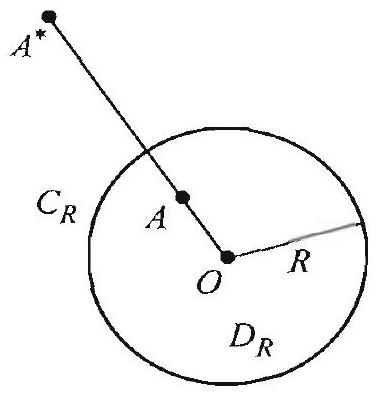

Figure 2 The point $A^{*}$ is the image of $A$ by the Steiner inversion. $A^{*}$ is on the ray () $A$, such that $O A \cdot O A^{*}=R^{2}$.

Right margin note (page 29)

639 and with 2) of r all mine s $-v$ with is a ) to ;) to $>0$ onic $\left.y_{0}\right)$, onse$\ln k$. disk aside (1) CONnot

++++

Section 12.4 Green's Functions for the Disk and the Upper Half-Plane

Green's function. These geometric ideas apply as well on other regions yield concrete formulas for Green's functions.

Throughout this section, let $D_{R}$ denote a disk centered at the origin radius $R>0$, and $C_{R}$ its positively oriented boundary. Recall from ( the previous section that Green's function is of the form
$$
G\left(x, y, x_{0}, y_{0}\right)=\overbrace{\frac{1}{2} \ln \left(\left(x-x_{0}\right)^{2}+\left(y-y_{0}\right)^{2}\right)}^{v\left(x, y, x_{0}, y_{0}\right)}+h\left(x, y, x_{0}, y_{0}\right),
$$
where $h$ is harmonic on $D_{R}$ and $h\left(x, y, x_{0}, y_{0}\right)=-v\left(x, y, x_{0}, y_{0}\right)$ fo ( $x . y$ ) on $C_{R}$. So the first half of the formula for $G$ is known, and to deter the second half, we must find a harmonic function $h$ on $D_{R}$ that equal on $C_{R}$. Thus $h$ is the solution of a particular Dirichlet problem on $D_{R}$, boundary condition $h=-v$ on $C_{R}$. Suppose for a moment that there point $A^{*}=\left(x_{0}^{*}, y_{0}^{*}\right)$ outside $D_{R}$ such that the distance from $A=\left(x_{0}, y\right.$ any point $P=(x, y)$ on $C_{R}$ is proportional to the distance from ( $x_{0}^{*}, y_{0} (x, y)$ (Figure 1). That is, $\left(x_{0}^{*}, y_{0}^{*}\right)$ is such that there is a constant $k$ with
$$
\sqrt{\left(x-x_{0}\right)^{2}+\left(y-y_{0}\right)^{2}}=k \sqrt{\left(x-x_{0}^{*}\right)^{2}+\left(y-y_{0}^{*}\right)^{2}}
$$
for all $(x, y)$ on $C_{R}$. Given such a point $\left(x_{0}^{*}, y_{0}^{*}\right)$, define
$$
\begin{aligned}
h\left(x, y, x_{0}, y_{0}\right) & =-\ln \left(k \sqrt{\left(x-x_{0}^{*}\right)^{2}+\left(y-y_{0}^{*}\right)^{2}}\right) \\
& =-\frac{1}{2} \ln \left(\left(x-x_{0}^{*}\right)^{2}+\left(y-y_{0}^{*}\right)^{2}\right)-\ln k
\end{aligned}
$$

Then $h$ is harmonic for all $(x, y) \neq\left(x_{0}^{*}, y_{0}^{*}\right)$, in particular, $h$ is harn on $D_{R}$; and for all $(x, y)$ on $C_{R}$, we have $h\left(x, y, x_{0}, y_{0}\right)=-v\left(x, y, x_{U}\right.$, by (1). Thus $h$ is precisely the function that we are looking for, and cc quently, Green's function for $D_{R}$ is
$$
G\left(x, y, x_{0}, y_{0}\right)=\frac{1}{2} \ln \left(\left(x-x_{0}\right)^{2}+\left(y-y_{0}\right)^{2}\right)-\frac{1}{2} \ln \left(\left(x-x_{0}^{*}\right)^{2}+\left(y-y_{0}^{*}\right)^{2}\right)
$$

Simplifying, we find that, for all $(x, y) \neq\left(x_{0}, y_{0}\right)$ in $D_{R}$,
$$
G\left(x, y, x_{0}, y_{0}\right)=\frac{1}{2} \ln \left[\frac{\left(x-x_{0}\right)^{2}+\left(y-y_{0}\right)^{2}}{\left(x-x_{0}^{*}\right)^{2}+\left(y-y_{0}^{*}\right)^{2}}\right]-\ln k .
$$

With this we have reduced the construction of Green's function on the $D_{R}$ to the following geometric problem. Given a point $A=\left(x_{0}, y_{0}\right)$ in $D_{R}$, find a point $A^{*}=\left(x_{0}^{*}, y_{0}^{*}\right)$ outside $D_{R}$ and a constant $k>0$ so tha holds for all points $(x, y)$ on the circle $C_{R}$.

The solution of this problem is given by a well-known geometric struction or transformation called the Steiner inversion: When $A$ is

---

<!-- Page 30 -->

Left margin note (page 30)

640
Chapter 12 Green's Fun

PROPOSITION 1 STEINER INVERSION

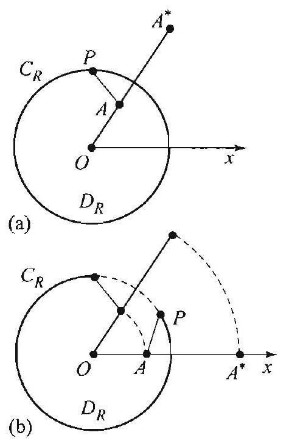

Figure 3 Rotate the picture in Figure 3(a) to bring $A$ and $A^{*}$ to the positive $x$-axis (Figure 3(b)). A rotation does not change distances.

Right margin note (page 30)

cle $C_{R}$. om the
where on $A$ is is key $-B \mid= \left(x_{1}, y_{1}\right)$ origin.
et $A^{*}= x, y)$ on and $A^{*}$ y , where $R \sin \theta$ ).
, $y_{0}$ ) in olar cob). For $4 P$ and $-\left.P\right|^{2}=$

++++

ctions and Conformal Mappings
the origin, the point $A^{*}$ is the inverse of the point $A$ through the cir By definition of the Steiner inversion, $A^{*}$ is the point on the ray fr origin $O$ through $A$ at a distance such that
$$
O A \cdot O A^{*}=R^{2}
$$
(Figure 2). (Even though we exclude from our discussion the case $A$ is the center of $C_{R}$, the formulas that we derive apply even whe the center of $C_{R}$.) We next state the property of the inversion that to the construction of Green's function. We use the notation $\mid A \sqrt{\left(x_{1}-x_{2}\right)^{2}+\left(y_{1}-y_{2}\right)^{2}}$ for the distance between the points $A=$ and $B=\left(x_{2}, y_{2}\right)$, and $|A|=\sqrt{x_{1}^{2}+y_{1}^{2}}$ for the distance from $A$ to the

Let $A=\left(x_{0}, y_{0}\right)$ be a a fixed point in $D_{R}$ minus its center and 1 $\left(x_{0}^{*}, y_{0}^{*}\right)$ be its image by the Steiner inversion. For any point $P=( C_{R}$, we have
(5)
$$
|A-P|=\frac{|A|}{R}\left|A^{*}-P\right|=k \cdot\left|A^{*}-P\right|,
$$
where $k=\frac{|A|}{R}=\frac{\sqrt{x_{0}^{2}+y_{0}^{2}}}{R}$.
Proof By rotating the picture, if necessary, we may assume that the points are on the positive $x$-axis, located at the distances $|A|$ and $\left|A^{*}\right|$, respectivel $\left|A^{*}\right|=\frac{R^{2}}{|A|}$, by (4) (Figure 3). Using polar coordinates, write $P=(R \cos \theta$, Then
$$
\begin{aligned}
\frac{|A-P|^{2}}{\left|A^{*}-P\right|^{2}} & =\frac{(|A|-R \cos \theta)^{2}+R^{2} \sin ^{2} \theta}{\left(\left|A^{*}\right|-R \cos \theta\right)^{2}+R^{2} \sin ^{2} \theta} \\
& =\frac{|A|^{2}+R^{2}-2 R|A| \cos \theta}{\frac{R^{4}}{|A|^{2}}+R^{2}-2 \frac{R^{3}}{|A|} \cos \theta}=\frac{|A|^{2}}{R^{2}},
\end{aligned}
$$
where the last equality follows by simplifying. Thus (5) holds.
Combining the proposition with (3), we find that for $(x, y) \neq\left(x_{0}\right. D_{R}$, Green's function for $D_{R}$ is
$$
G\left(x, y, x_{0}, y_{0}\right)=\frac{1}{2} \ln \left[\frac{\left(x-x_{0}\right)^{2}+\left(y-y_{0}\right)^{2}}{\left(x-x_{0}^{*}\right)^{2}+\left(y-y_{0}^{*}\right)^{2}}\right]-\ln \frac{\sqrt{x_{0}^{2}+y_{0}^{2}}}{R}
$$

It will be useful to have and expression for Green's function in pers ordinates. If $A=\left(r_{0} \cos \phi, r_{0} \sin \phi\right)$, then $A^{*}=\left(\frac{R^{2}}{r_{0}} \cos \phi, \frac{R^{2}}{r_{0}} \sin \phi\right. P=(r \cos \theta, r \sin \theta)$, using the law of cosines in the triangles $O$. $O A^{*} P$ (Figure 4), we find $|A-P|^{2}=r^{2}+r_{0}^{2}-2 r r_{0} \cos (\theta-\phi)$ and $\mid A^{*}$.

---

<!-- Page 31 -->

Left margin note (page 31)

Figure 4 Law of cosines in a triangle.

THEOREM 1 SOLUTION OF POISSON'S EQUATION ON THE DISK

Right margin note (page 31)

641

d de-richious
drdθ,
the ed to the
$=R$
and ward

++++

Section 12.4 Green's Functions for the Disk and the Upper Half-Plane
$r^{2}+\frac{R^{4}}{r_{0}^{2}}-2 r \frac{R^{2}}{r_{0}} \cos (\theta-\phi)$, and so
$$
\begin{aligned}
G\left(r, \theta, r_{0}, \phi\right) & =\frac{1}{2} \ln \left[\frac{|A-P|^{2}}{\left|A-P^{*}\right|^{2}}\right]-\ln \frac{|A|}{R} \\
& =\frac{1}{2} \ln \left[\frac{r^{2}+r_{0}^{2}-2 r r_{0} \cos (\theta-\phi)}{r^{2}+\frac{R^{4}}{r_{0}^{2}}-2 r \frac{R^{2}}{r_{0}} \cos (\theta-\phi)}\right]-\frac{1}{2} \ln \frac{r_{0}^{2}}{R^{2}} \\
& =\frac{1}{2} \ln \left[R^{2} \frac{r^{2}+r_{0}^{2}-2 r r_{0} \cos (\theta-\phi)}{r^{2} r_{0}^{2}+R^{4}-2 r r_{0} R^{2} \cos (\theta-\phi)}\right]
\end{aligned}
$$

With this formula in hand, we can now return to the previous section an rive concrete formulas for the solutions of Poisson's equation and the Di let problem on the disk. For example, appealing to Theorem 4 of the prev section, we obtain the following interesting formula.
Let $f(r, \theta)$ be a function on the disk $D_{R}$. The solution of
$$
\nabla^{2} u(r, \theta)=f(r, \theta), \quad 0 \leq r<R, 0 \leq \theta \leq 2 \pi,
$$
with boundary values $u=0$ on $C_{R}$, is
$$
u\left(r_{0}, \phi\right)=\frac{1}{4 \pi} \int_{0}^{2 \pi} \int_{0}^{R} f(r, \theta) \ln \left[R^{2} \frac{r^{2}+r_{0}^{2}-2 r r_{0} \cos (\theta-\phi)}{r^{2} r_{0}^{2}+R^{4}-2 r r_{0} R^{2} \cos (\theta-\phi)}\right] r
$$
where $0 \leq r_{0}<R$ and $0 \leq \phi \leq 2 \pi$.
Our next goal is to derive a concrete formula for the solution o Dirichlet problem (Theorem 2, Section 12.3). For this purpose, we nee find the normal derivative $\partial / \partial r_{0}$ of Green's function at the points or circle $C_{R}$. Computing directly from (7), we get
$$
\begin{aligned}
\frac{\partial}{\partial r_{0}} G\left(r, \theta, r_{0},\left.(7)\right|_{r_{0}=R}\right. & =\frac{1}{2} \frac{\partial}{\partial r_{0}} \ln \left[R^{2} \frac{r^{2}+r_{0}^{2}-2 r r_{0} \cos (\theta-\phi)}{r^{2} r_{0}^{2}+R^{4}-2 r r_{0} R^{2} \cos (\theta-\theta)}\right] \\
& =\frac{1}{2} \frac{1}{N} \times\left.\frac{N^{\prime} \cdot D-N \cdot D^{\prime}}{D}\right|_{r_{0} \cdot R},
\end{aligned}
$$
where $N=r^{2}+r_{0}^{2}-2 r r_{0} \cos (\theta-\phi)$ and $D=r^{2} r_{0}^{2}+R^{4}-2 r r_{0} R^{2} \cos (\theta-\phi)$ the prime denotes taking the derivative with respect to $r_{0}$. Straightfor computations yield:
$$
\begin{aligned}
\left.N\right|_{r_{0}=R} & =r^{2}+R^{2}-2 r R \cos (\theta-\phi) ; \\
\left.D\right|_{r_{0}=R} & =r^{2} R^{2}+R^{4}-2 r R^{3} \cos (\theta-\phi)=\left.R^{2} N\right|_{r_{0}=R} ; \\
\left.N^{\prime}\right|_{r_{0}=R} & =2 R-2 r \cos (\theta-\phi) ; \\
\left.D^{\prime}\right|_{r_{0}=R} & =2 r^{2} R-2 r R^{2} \cos (\theta-\phi) .
\end{aligned}
$$

---

<!-- Page 32 -->

Left margin note (page 32)

642
Chapter 12 Green's Fun

THEOREM 2 SOLUTION OF DIRICHLET'S PROBLEM ON THE DISK

Figure 5 Image of a source point in the upper half-plane.

Right margin note (page 32)

and the ad only
ary $C_{R}$.
he disk
$2 \pi$,
hd (11)
n $\Omega$ is revious ill valid ions on 2.3. To teps of tations
,$\left.y_{0}\right)=$ ge, $A^{*}$, hink of is the r effect

++++

ctions and Conformal Mappings

Using this in the normal derivative and simplifying, we obtain
$$
\left.\frac{\partial}{\partial r_{0}} G\left(r, \theta, r_{0}, \phi\right)\right|_{r_{0}=R}=\frac{R^{2}-r^{2}}{R\left(R^{2}+r^{2}-2 r R \cos (\theta-\phi)\right)} .
$$

We now restate Theorem 2, Section 12.3, using (9), with $d s=R d \theta$, following minor modification: Since the points on the boundary deper on $\theta$, we set $u(x, y)=f(\theta)$ for all $(x, y)$ on $C_{R}$.
Suppose that $u$ is harmonic in $D_{R}$ and $u(R, \theta)=f(\theta)$ on the bound Then
$$
u(r, \phi)=\frac{R^{2}-r^{2}}{2 \pi} \int_{0}^{2 \pi} \frac{f(\theta)}{R^{2}+r^{2}-2 r R \cos (\theta-\phi)} d \theta
$$
where $0 \leq r<R$ and $0 \leq \phi \leq 2 \pi$.
Formula (10) is know as the Poisson integral formula on t $D_{R}$. The function
$$
P(r, \theta)=\frac{R^{2}-r^{2}}{R^{2}+r^{2}-2 r R \cos (\theta-\phi)}, \quad 0 \leq r<R, 0 \leq \phi \leq
$$
is called the Poisson kernel on the disk $D_{R}$. Both formulas (10) a were derived in the exercises of Section 4.4 using Fourier serics.

Green's Function for the Upper Half-Plane
We now turn our attention to the upper half-plane $\Omega$. The regic obviously not bounded; so, strictly speaking, the results of the p section do not apply. However, it can be shown that the results are st under added assumptions, such as boundedness of the harmonic funct $\Omega$. For this reason, we will not hesitate to use the results of Section 1 construct Green's function for the upper half-plane, we repeat the s the method of images as in the case of the disk; only here the compu turn out to be much easier, as you will see shortly.

Start by setting
$$
G\left(x, y, x_{0}, y_{0}\right)=\overbrace{\frac{1}{2} \ln \left(\left(x-x_{0}\right)^{2}+\left(y-y_{0}\right)^{2}\right)}^{v\left(x, y, x_{0}, y_{0}\right)}+h\left(x, y, x_{0}, y_{0}\right)
$$
and let us look for a harmonic function $h$ on $\Omega$ such that $h\left(. x . y, x_{0}\right. -v\left(x, y, x_{0}, y_{0}\right)$ on the boundary of $\Omega$; that is, when $y=0$. The ima of the point $A$ is clear in this case: Take $A^{*}=\left(x_{0},-y_{0}\right)$. If you t $A$ as the location of a heat source in the upper half-plane, then $A^{*}$ location of the heat source in the lower half-plane that yields a simila

---

<!-- Page 33 -->

Left margin note (page 33)

THEOREM 3
SOLUTION OF POISSON'S
EQUATION ON THE UPPER
HALF-PLANE

THEOREM 4
SOLUTION OF
DIRICHLET'S
PROBLEM ON THE
UPPER
HALF-PLANE

Right margin note (page 33)

643
$$
\begin{array}{l}
(y+ \\
10)=
\end{array}
$$
e, we ws.

n of
we
The
we
$$
0=0
$$
x) on
halfform.
rmal and

++++

Section 12.4 Green's Functions for the Disk and the Upper Half Plane
on the boundary (Figure 5). Set $h\left(\right.$ s. $\left.y, x_{0} . y_{0}\right)=-\frac{1}{2} \ln \left(\left(x-x_{0}\right)^{2}+\right. \left.\left.y_{0}\right)^{2}\right)$. On the boundary, $y=0$, we see immediately that $h\left(x, 0, x_{0}, y\right. -v\left(. x, 0, x_{0}, y_{0}\right)$. Thus Green's function for the upper half-plane is
$$
G\left(x, y . r_{0}, y_{0}\right)=\frac{1}{2} \ln \frac{\left(x-x_{0}\right)^{2}+\left(y-y_{0}\right)^{2}}{\left(x-x_{0}\right)^{2}+\left(y+y_{0}\right)^{2}}
$$
where $x_{0}$ and $x$ are arbitrary and $y_{0}$ and $y$ are $>0$. For future referenc write the solution of Poisson's problem in the upper half-plane as follo

Let $f(x, y)$ be a function defined on the upper half-plane. The solutio
$$
\nabla^{2} u(r, \theta)=f(x, y), \quad-\infty<x<\infty, 0<y .
$$
with boundary values $u=0$ on the $x$-axis $(y=0)$, is
$$
u\left(x_{0}, y_{0}\right)=\frac{1}{4 \pi} \int_{0}^{\infty} \int_{-\infty}^{\infty} f(x, y) \ln \frac{\left(x-x_{0}\right)^{2}+\left(y-y_{0}\right)^{2}}{\left(x-x_{0}\right)^{2}+\left(y+y_{0}\right)^{2}} d x d y
$$

To derive the solution of the Dirichlet problem in the upper half-plan first compute the normal derivative of $G$ at the points on the $x$-axis. normal derivative in this case is $-\partial / \partial y_{0}$. Computing directly from ( 12 get
$$
\begin{aligned}
- & \left.\frac{1}{2} \frac{\partial}{\partial y_{0}}\left[\ln \left[\left(x-x_{0}\right)^{2}+\left(y-y_{0}\right)^{2}\right]-\ln \left[\left(x-x_{0}\right)^{2}+\left(y+y_{0}\right)^{2}\right]\right]\right|_{y} \\
& =-\left.\frac{1}{2}\left[\frac{-2\left(y-y_{0}\right)}{\left(x-x_{0}\right)^{2}+\left(y-y_{0}\right)^{2}}-\frac{2\left(y+y_{0}\right)}{\left(x-x_{0}\right)^{2}+\left(y+y_{0}\right)^{2}}\right]\right|_{y_{0}=0} \\
& =\frac{2 y}{\left(x-x_{0}\right)^{2}+y^{2}}
\end{aligned}
$$

With this, Theorem 2, Section 12.3, takes the following form.
Suppose that $u$ is harmonic in the upper half-plane and $u(x, 0)=f($ the boundary. Then
$$
u\left(x_{0}, y\right)=\frac{y}{\pi} \int_{-\infty}^{\infty} \frac{f(x)}{\left(x-x_{0}\right)^{2}+y^{2}} d x
$$
where $-\infty<x_{0}<\infty$ and $0<y$.
We recognize (14) as the Poisson integral formula for the upper plane, which we have derived in Section 7.5 using the Fouricr trans

In the next sections, we introduce the powerful method of confo mappings and derive formulas for Green's functions on various regions

---

<!-- Page 34 -->

Left margin note (page 34)

644 Chapter 12 Green's Fun

Right margin note (page 34)

sson's
o vari-
nel on
$1 \theta$,
metion
undary
$r<R$
atistion
atisfies
$f(r, \theta)$
$f(x, y)$
kis.
nd not

++++

ctions and Conformal Mappings
corresponding formulas for the solutions of Dirichlet's problem and Poi equation.
Exercises 12.4
In Exercises 1-8, evaluate the given expression without computing. Appeal $t$ ous results from this section and explain how you are using them.
1. $\frac{1}{2 \pi} \int_{0}^{2 \pi} \frac{1-r^{2}}{1+r^{2}-2 r \cos (\theta-\phi)} d \theta$. (This is the integral of the Poisson ke the unit disk.)
2. $\frac{1}{2 \pi} \int_{0}^{2 \pi} \frac{R^{2}-r^{2}}{R^{2}+r^{2}-2 r R \cos (\theta-\phi)} d \theta$.
3. $\quad \frac{1-r^{2}}{2 \pi} \int_{0}^{2 \pi} \frac{\cos n \theta}{\left.1+r^{2}-2 r \cos (\theta-1)\right)} d \theta$, where $n=1,2, \ldots$.
4. $\quad \frac{1-r^{2}}{2 \pi} \int_{0}^{2 \pi} \frac{\sin n \theta}{1+r^{2}-2 r \cos (\theta-\phi)} d \theta$, where $n=1,2, \ldots$.
5. $\frac{R^{n}\left(R^{2}-r^{2}\right)}{2 \pi} \int_{0}^{2 \pi} \frac{\cos n \theta}{R^{2}+r^{2}-2 r R \cos (\theta-\phi)} d \theta$, where $n=1,2, \ldots$.
6. $\frac{R^{n}\left(R^{2}-r^{2}\right)}{2 \pi R^{n}} \int_{0}^{2 \pi} \frac{r^{n} \sin n \theta}{R^{2}+r^{2}-2 r R \cos (\theta-\phi)} d \theta$, where $n=1,2, \ldots$.
7. $\frac{-\alpha_{n}^{2}}{4 \pi} \int_{0}^{2 \pi} \int_{0}^{1} J_{0}\left(\alpha_{n} r\right) \ln \left[\frac{r^{2}+r_{0}^{2}-2 r r_{0} \cos (\theta-\phi)}{r^{2} r_{0}^{2}+1-2 r r_{0} \cos (\theta-\phi)}\right] r d r d \theta$, where $\alpha_{n}$ is the $n$th positive zero of Bessel's function $J_{0}$.
8. $\frac{-\alpha_{m, n}^{2}}{4 \pi} \int_{0}^{2 \pi} \int_{0}^{1} J_{m}\left(\alpha_{m, n} r\right) \cos (m \theta) \ln \left[\frac{r^{2}+r_{0}^{2}-2 r r_{0} \cos (\theta-\phi)}{r^{2} r_{0}^{2}+1-2 r r_{0} \cos (\theta-\phi)}\right] r d r$ where $m$ is a positive integer and $\alpha_{m, n}$ is the $n$th positive zero of Bessel's f $J_{m}$.
9. Verify directly from (7) that Green's function for the disk is 0 on the bo $(r=R)$.
10. Verify directly from (7) that Green's function for the disk is $\leq 0$ for $0 \leq$ and all $\theta$.
11. Verify directly from (7) that Green's function for the disk is symmetric.
12. Verify directly from (12) that Green's function in the upper half-planes properties (ii), (iii), and (v) of Theorem 3, Section 12.3.
13. Verify directly from (12) that Green's function in the upper half-plane s Theorem 3(i), Section 12.3.
14. Combine Theorems 1 and 2 to solve the general Poisson problem: $\nabla^{2} u=$ on $D_{R}$, with boundary condition $u(R, \theta)=g(\theta)$ on $C_{R}$.
15. Combine Theorems 3 and 4 to solve the general Poisson problem: $\nabla^{2} u=$ in the upper half-plane, with boundary condition $u(x, 0)=g(x)$ on the $x$-a
16. Suppose in Theorem 1 that $f(r, \theta)=f(r)$ (thus $f$ depends only on $r$ a

---

<!-- Page 35 -->

Left margin note (page 35)

12.5 Analyti

Figure 1 Identifying plex number $z$ with a the Cartesian plane; plex conjugate $\mathbb{z}$; the of $z$.

Right margin note (page 35)

645
$r$ the
e. In
tant.
es the
ween
ions.
ma-
ions.
plex
part
We mber $s$ the n the ween lane: is
plex e 1).
$-i y$.

++++

Section 12.5 Analytic Functions

on $\theta$ ). Show that the solution depends only on $r$. [Hint: Differentiate undc double integral sign with respect to $\phi$ and show that the derivative is 0 .]
17. Project Problem: A Neumann problem in the upper half-plan this exercise. you are asked to show that the solution of
$$
\phi_{x x}+\phi_{y y}=0 \quad(-\infty<x<\infty, y>0)
$$
subject to the Neumann boundary condition, $\phi_{y}(x, 0)=f(x)$, is
$$
\phi(x, y)=\frac{1}{2 \pi} \int_{-\infty}^{\infty} \ln \left((x-t)^{2}+y^{2}\right) f(t) d t
$$

Note that the solution can be determined only up to an arbitrary additive cons For an alternative derivation, see Section 12.8.
(a) Show that if 1 satisfies the stated Neumann problem, then $v=\frac{\partial \phi}{\partial y}$ satisfie Dirichlet problem: For $-\infty<x<\infty$ and $y>0$,
$$
v_{x x}+v_{y y}=0, \text { and } v(x, 0)=f(x)
$$
(b) Apply Poisson's formula to obtain
$$
v(x, y)=\frac{y}{\pi} \int_{-\infty}^{\infty} \frac{f(t)}{(x-t)^{2}+y^{2}} d t
$$
(c) Derive the solution of the Neumann problem.
c Functions
In the remaining sections of this chapter we explore a connection bet complex-valued functions and the solution of partial differential equat More specifically, we introduce analytic functions and use them to derive jor tools for solving Dirichlet problems and constructing Green's funct We start our presentation by reviewing basic notions regarding con numbers and functions.

If $z=x+i y$, where $x$ and $y$ are real numbers, we call $x$ the real of $z$ and $y$ its imaginary part, and set $x=\operatorname{Re} z$ and $y=\operatorname{Im} z$. denote the set of all complex numbers by $\mathbb{C}$. We identify a complex nu $z=x+i y$ with a point $(x, y)$ in the Cartesian plane (referred to a complex plane), much like a real number is identified with a point o real number line (Figure 1). We introduce the notion of distance bet two complex numbers, using the distance formula from the Cartesian p If $z_{1}=x_{1}+i y_{1}$ and $z_{2}=x_{2}+i y_{2}$, then the distance between $z_{1}$ and $z$
$$
\left|z_{1}-z_{2}\right|=\sqrt{\left(x_{1}-x_{2}\right)^{2}+\left(y_{1}-y_{2}\right)^{2}}
$$
(Figure 2). In particular, the modulus or absolute value of a con number $z=x+i y$ is its distance to the origin: $|z|=\sqrt{x^{2}+y^{2}}$ (Figu The complex conjugate of $z=x+i y$ is the complex number $\bar{z}=x$ We have
$$
z \cdot \bar{z}=x^{2}+y^{2}
$$

---

<!-- Page 36 -->

Left margin note (page 36)

646
Chapter 12 Green's Fun

Figure 2 Distance between two complex numbers $z_{1}$ and $z_{2}$.

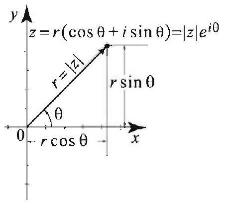

Figure 3 Polar representation $z=|z| e^{i \theta}, \theta$ is the argument of $z$.

Figure 4 To visualize a mapping by a complex-valued function $w=f(z)$, we use two planes: the $z$ - or $x y$-plane for the domain of definition and the $w$-or $u v$-plane for the image.

Right margin note (page 36)

0. In
polar
polar
$\mathrm{n} \theta$, we and is alue of eger, is $\tau, \pi]$ is
effect $r_{2} e^{i \theta_{2}}$,
ıd add
func--plane imagbset of ations, $(f(z))$

$u$
t
$$
\begin{array}{l}
f(z)= \\
y)=0 .
\end{array}
$$

++++

ctions and Conformal Mappings

Thus $z \cdot \bar{z}$ is always a nonnegative real number and $z \cdot \bar{z}=0 \Leftrightarrow z=$ terms of the complex conjugate, we have $|z|=\sqrt{z \bar{z}}$.

Using polar coordinates, we write a nonzero complex number in form, $z=r(\cos \theta+i \sin \theta)$, where $r=|z|=\sqrt{x^{2}+y^{2}}$ and $\theta$ is the angle in Figure 3. With the help of Euler's identity, $e^{i \theta}=\cos \theta+i$ si can also write $z=r e^{i \theta}$. The angle $\theta$ is called the argument of $z$ denoted $\arg z$. It is clear that $\arg z$ is not single-valued: If $\alpha$ is one v the argument, then any value of the form $\alpha+2 k \pi$, where $k$ is an int also the argument of $z$. The unique value of $\arg z$ in the interval (called the principal value of the argument and is denoted by $\operatorname{Arg} z$

The polar representation can be used to clescribe geometrically the of multiplication. Given two complex numbers $z_{1}=r_{1} e^{i \theta_{1}}$ and $z_{2}=$ we have
$$
z_{1} \cdot z_{2}=r_{1} e^{i \theta_{1}} r_{2} e^{i \theta_{2}}=r_{1} r_{2} e^{i\left(\theta_{1}+\theta_{2}\right)}
$$

Thus to multiply two complex numbers we multiply their moduli ar their arguments.

Complex Functions
A complex-valued function of a complex variable, or simply a comple tion, is a mapping $w=f(z)$ whose domain is a subset of the complex and whose range is a subset of the complex $w$-plane. By taking real and inary parts. we can visualize such a function as a mapping from a su the Cartesian $x y$-plane into the Cartesian $u v$-plane. We have the rel $f(z)=u(z)+i v(z)$ or $f(z)=u(x, y)+i v(x, y)$, where $u(x, y)=\operatorname{Re}$ and $v(x, y)=\operatorname{Im}(f(z))$ (Figure 4).

The following examples illustrate these concepts.

EXAMPLE 1 Functions of a complex variable
In each of the following examples, we express the function in the form $u(x, y)+i v(x, y)$, where $z=x+i y$.
(a) The function $f(z)=\operatorname{Im} z$ is real-valued. We have $u(x, y)=y$ and $v(x$,

---

<!-- Page 37 -->

Right margin note (page 37)

647
nplex
ows:

cause $i$, we of 0 by
inary $y)=$ terval r any
$|z|=$ ve see tween hold

++++

Section 12.5 Analytic Functions
(b) A linear function is of the form $f(z)=\alpha z+\beta$, where $\alpha$ and $\beta$ are cor numbers. Write $\alpha=a+i b$ and $\beta=c+i d$ where $a, b, c$, and $d$ are real. Then
$$
f(z)=(a+i b)(x+i y)+c+i d=a x-b y+c+i(b x+a y+d) .
$$

Thus $u(x, y)=a x-b y+c$ and $v(x, y)=b x+a y+d$.
(c) For the exponential function, $f(z)=e^{z}$, we have
$$
e^{z}=e^{x+i y}=e^{x} e^{i y}=e^{x}(\cos y+i \sin y) .
$$

Thus $u(x, y)=e^{x} \cos y$ and $v(x, y)=e^{x} \sin y$.
(d) The sine function is defined in terms of the exponential function as foll
$$
\sin z=\frac{e^{i z}-e^{-i z}}{2 i} .
$$

Notice that if $z=x$ is real, then $\sin z$ reduces to the usual sine function be $\frac{e^{i x}-e^{-i x}}{2 i}=\sin x$, by Euler's identity. Using $e^{i x}=\cos x+i \sin x$ and $\frac{1}{i}=-$ have
$$
\begin{aligned}
\sin z & =\frac{e^{i(x+i y)}-e^{-i(x+i y)}}{2 i}=\frac{e^{i x} e^{-y}-e^{-i x} e^{y}}{2 i} \\
& =\sin x \frac{e^{y}+e^{-y}}{2}+i \cos x \frac{e^{y}+e^{-y}}{2} \\
& =\sin x \cosh y+i \cos x \sinh y
\end{aligned}
$$
(e) We define the cosine function by
$$
\cos z=\frac{e^{i z}+e^{-i z}}{2} .
$$

Computing as in (d), we find
$$
\cos z=\cos x \cosh y-i \sin x \sinh y .
$$
(f) The complex logarithm is trickier to define. There are many "branch the logarithm. The principal branch of the logarithm is defined for all $z \neq$
$$
\log z=\ln |z|+i \operatorname{Arg} z,
$$
where $\operatorname{Arg} z$ is the principal value of the argument. Taking real and imag parts of the function $\log z$, we find $u(x, y)=\ln |z|=\frac{1}{2} \ln \left(x^{2}+y^{2}\right)$ and $v(x$, $\tan ^{-1}\left(\frac{y}{x}\right)$, where the value of the inverse tangent must be chosen in the in ( $-\pi, \pi]$ (see (8)-(10) for explicit formulas for $\operatorname{Arg} z$ in terms of $x$ and $y$ ). Fo complex number $z \neq 0$, we have
$$
e^{\log z}=e^{\ln |z|+i \operatorname{Arg} z}=e^{\ln |z|} e^{i \operatorname{Arg} z}=|z| e^{i \operatorname{Arg} z}=z,
$$
where we have used the fact that $\ln x$ and $\epsilon^{x}$ are inverse functions (hence $e^{\ln } |z|)$, and we have used the polar representation $z=|z| e^{i \operatorname{Arg} z}$. As a result, $v$ that $e^{\log z}=z$, which is analogous to the inverse function relationship be $e^{x}$ and $\ln x$. Notice however that the identity $\log \left(e^{z}\right)=z$ does not always (Exercise 22).

---

<!-- Page 38 -->

Left margin note (page 38)

648
Chapter 12 Green's Fun

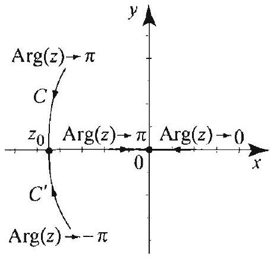

Figure $5 \mathrm{Arg} z$ is not continuous when $z_{0}=x_{0} \leq 0$. Limit of Arg $z$ along the curve $C$ is $\pi$, but the limit along the curve $C^{\prime}$ is $-\pi$

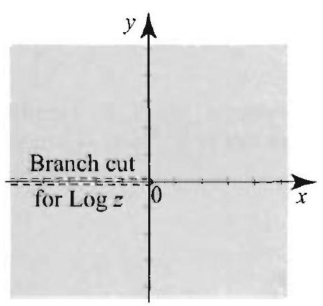

Figure 6 Branch cut of Log 3, where the function fails to be continuous.

Right margin note (page 38)

d only in Exnetion negaof the ofrom $\operatorname{Arg} z_{0}$. oint $z_{0}$ points ve just ut. At
$\frac{d}{1 z} f(z)$,
tic on at one on (1) a real s from al or a
ch can oach $z$ exists ronger e case. are not triking

++++

ctions and Conformal Mappings

A complex function $f(z)=u(x, y)+i v(x, y)$ is continuous if an if both $u$ and $v$ are continuous. You can verify that the functions ample 1(a)-(e) are continuous for all $z=x+i y$. The logarithmic fu Log $z$ is not defined at $z=0$ and is not continuous at all $z$ on the tive real axis. To see this, let $z_{0}=x_{0}$ with $x_{0}<0$. By definition principal value, we have $\operatorname{Arg} z_{0}=\pi$. If $z$ approaches the point the lower half-plane, then $\operatorname{Arg} z$ tends to $-\pi$ which is not equal to Thus $\lim _{z \rightarrow z_{0}} \operatorname{Arg} z \neq \operatorname{Arg}{ }_{0}$ and so $\operatorname{Arg} z$ is not continuous at the p (Figure 5). It follows that $\log z$ is not continuous at $\varepsilon_{0}$. The set of $z=x$, where $x \leq 0$ is called a branch cut for $\log z$ (Figure 6). proved that $\log z$ is not continuous at all the points on its branch all other points in the plane, $\log z$ is continuous.

Analytic Functions, the Cauchy-Riemann Equations
We say that $f(z)$ is differentiable at $z$ if its derivative $f^{\prime}(z)$, or exists and is finite at $z$, where
$$
f^{\prime}(z)=\lim _{\zeta \rightarrow z} \frac{f(\zeta)-f(z)}{\zeta-z} .
$$

If $S$ is an open set in the complex plane. we say that $f$ is analy $S$ if $f$ is differentiable at all points $:$ in $S$. A function is analytic point $z_{0}$ if it is analytic on an open set that contains $z_{0}$. Definit resembles the familiar definition of the derivative of a function of variable from calculus. So you should not hesitate to try technique calculus in computing the limit in (1), especially if $f$ is a polynomi rational function. For example, if $f(z)=z$, then
$$
f^{\prime}(z)=\lim _{\zeta \rightarrow z} \frac{f(\zeta)-f(z)}{\zeta-z}=\lim _{\zeta \rightarrow z} \frac{\zeta-z}{\zeta-z}=1
$$
as expected. However, keep in mind that unlike a real variable whi vary in only two directions, the complex variable $\zeta$ in (1) can appr in infinitely many ways, and to say that (1) exists we mean that it and is the same no matter how we approach $z$. This is clearly a st requirement than the existence of the derivative in the real variabl For this reason analytic functions have distinctive properties that a shared by differentiable functions of a real variable. One of these s propertics is expressed by the following result.

---

<!-- Page 39 -->

Left margin note (page 39)

THEOREM 1
CAUCHY-RIEMANN EQUATIONS

Figure 7 Evaluating the limit (1), as $\zeta$ approaches $z$ in two different (special) ways.

Right margin note (page 39)

649
and
the
r of
rary
d by
proof
t (1)
pute
king
If
(1)
, y)
$$
f^{\prime}(z)
$$
blish

++++

Section 12.5 Analytic Functions

The function $f(z)=u(x, y)+i v(x, y)$ is analytic in an open set $S$ i only if the partial derivatives of $u$ and $v$ are continuous and satisf. Cauchy-Riemann equations
$$
u_{x}=v_{y} \quad \text { and } \quad u_{y}=-v_{x}
$$

Furthermore, if $f$ is analytic, then the derivative $f^{\prime}(z)$ is given as eith
$$
f^{\prime}(z)=u_{x}(x, y)+i v_{x}(x, y) \text { or } f^{\prime}(z)=v_{y}(x, y)-i u_{y}(x, y) .
$$

Thus the real and imaginary parts of an analytic function cannot be arbit of each other: They depend on each other in a precise manner describe the Cauchy-Riemann equations.
Proof Here we shall prove only one direction in the theorem. (For the full I see [1], Chapter 2.) Suppose that $f$ is analytic at $z=x+i y$ so that the limi exists. To prove that the Cauchy-Riemann equations and (3) hold, we com the limit (1) in two different ways: once by taking $\zeta=z+\Delta x$ and once by ta $\zeta=z+i \Delta y$, where $\Delta x$ and $\Delta y$ are small increments in $x$ and $y$ (Figure 7 $\zeta=z+\Delta x=x+\Delta x+i y, \zeta-z=\Delta x$, and (1) becomes
$$
\begin{aligned}
f^{\prime}(z) & =\lim _{\Delta x \rightarrow 0} \frac{u(x+\Delta x, y)+i v(x+\Delta x, y)-(u(x, y)+i v(x, y))}{\Delta x} \\
& =\lim _{\Delta x \rightarrow 0} \frac{u(x+\Delta x, y)-u(x, y)}{\Delta x}+i \lim _{\Delta x \rightarrow 0} \frac{v(x+\Delta x, y)-v(x, y)}{\Delta x} \\
& =\frac{\partial u}{\partial x}+i \frac{\partial v}{\partial x} .
\end{aligned}
$$

In a similar way, if $\zeta=z+i \Delta y=x+i(y+\Delta y), \zeta-z=i \Delta y$, and becomes
$$
\begin{aligned}
f^{\prime}(z) & =\lim _{\Delta y \rightarrow 0} \frac{u(x, y+\Delta y)+i v(x, y+\Delta y)-(u(x, y)+i v(x, y))}{i \Delta y} \\
& =\lim _{\Delta y \rightarrow 0}(-i) \frac{u(x, y+\Delta y)-u(x, y)}{\Delta y}+\lim _{\Delta y \rightarrow 0} \frac{v(x, y+\Delta y)-v(x)}{\Delta y} \\
& =\frac{\partial v}{\partial y}-i \frac{\partial u}{\partial y},
\end{aligned}
$$
where on the second line we have used $1 / i=-i$ and $(-i) \cdot i=1$. Since does not depend on how we approach $z$, equating the previous two liv we see that (2) and (3) hold.

The following examples illustrate how Theorem 1 can be used to esta analyticity and compute derivatives.

---

<!-- Page 40 -->

Left margin note (page 40)

650
Chapter 12
Green's Fun

Right margin note (page 40)

ry part $v_{y}=0$. uations at any
of the orem 1. $a y+d$. for all ves are reover,
$x^{x} \sin y$, satisfy uently, $z$. $z$ and
. contintinuous f) that
$1^{-1} \frac{y}{x}+$ the dise chain
iemann not on
$\beta, e^{z}$,

vative,
vari-

++++

ctions and Conformal Mappings

EXAMPLE 2 Applying the Cauchy-Riemann equations
Refer to the functions in Example 1.
(a) The function $f(z)=\operatorname{Im} z=y$ has real part $u(x, y)=y$ and imagina $v(x, y)=0$. Computing partial derivatives, we find $u_{x}=0, u_{y}=1, v_{x}=$ Thus the equality $u_{y}=-v_{x}$ holds nowhere, and so the Cauchy-Riemann eq do not hold for any $z=x+i y$. Consequently, the function is not analytic point in the complex plane.
(b) Using the definition (1), it is straightforward to show that the derivativ linear function $f(z)=\alpha z+\beta$ is $f^{\prime}(z)=\alpha$. Let us derive this result using The Write $\alpha=a+i b$ and $\beta=c+i d, u(x, y)=a x-b y+c$ and $v(x, y)=b x+$ Then $u_{x}=a, u_{y}=-b, v_{x}=b$, and $v_{y}=a$. Thus $u_{x}=v_{y}$ and $u_{y}=-v_{x} (x, y)$. Hence the Cauchy--Riemann equations hold and the partial derivati continuous at all points. It follows that the function is analytic for all $z$. Mc $f^{\prime}(z)=u_{x}+i v_{x}=a+i b=\alpha$.
(c) If $f(z)=e^{z}$, then $u=e^{x} \cos y, v=r^{x} \sin y, u_{x}=e^{x} \cos y, u_{y}=-0 v_{x}=e^{x} \sin y$, and $v_{y}=e^{x} \cos y$. The partial derivatives are continuous and the Cauchy-Riemann equations: $u_{x}=v_{y}$ and $u_{y}=-v_{x}$ for all $(x, y)$. Consec $f(z)=e^{z}$ is analytic for all $z$ and $f^{\prime}(z)=u_{x}+i v_{x}=e^{x} \cos y+i e^{x} \sin y:=e$ (d) It is a straightforward exercise to show that $\sin z$ is analytic for all $\frac{d}{d z} \sin z=\cos z$ (Exercise 27(a)).
(e) Similarly, $\cos z$ is analytic for all $z$ and $\frac{d}{d z} \cos z=-\sin z$ (Exercise 27(b) (f) As in the real case, if $f(z)$ is analytic at a point $z$ then it is necessarily uous at $z$. Thus $\log z$ is not analytic at the branch cut since it is not con there. For all other points in the complex plane, recall from Example 1( $u(x, y)=\frac{1}{2} \ln \left(x^{2}+y^{2}\right)$. So
$$
u_{x}=\frac{x}{x^{2}+y^{2}} \quad \text { and } \quad u_{y}=\frac{y}{x^{2}+y^{2}}
$$

In terms of the inverse tangent, the imaginary part of $\log z$ is $v(x, y)=\operatorname{tar} k \pi$, where $k=0, \pm 1$, depending on the location of the point ( $x, y$ ) (see cussion following Example 3, below). Using that $\frac{d}{d x} \tan ^{-1} x=\frac{1}{1+x^{2}}$ and th rule, it is straightforward to show that
$$
v_{x}=\frac{-y}{x^{2}+y^{2}} \quad \text { and } \quad v_{y}=\frac{x}{x^{2}+y^{2}}
$$
(Exercise 53). Thus, the partial derivatives are continuous and the Cauchy-R equations, $u_{x}=v_{y}$ and $u_{y}=-v_{x}$, hold. It follows that, for all $z=x+i y$ the branch cut of $\log z$,
$$
\frac{d}{d z} \log z=u_{x}+i v_{x}=\frac{x-i y}{x^{2}+y^{2}}=\frac{1}{z} .
$$

You should justify the last equality (Exercise 53).
Functions that are analytic for all $z$ are called entire. Thus $\alpha z+ \cos z$, and $\sin z$ are all entire functions, but $\log z$ is not entire.

For ease of reference, we now state some properties of the deri which are similar to properties of the derivative of a function of a re able.

---

<!-- Page 41 -->

Left margin note (page 41)

THEOREM 2
PROPERTIES OF ANALYTIC FUNCTIONS

THEOREM 3 ANALYTIC FUNCTIONS AND LAPLACE'S EQUATION

Right margin note (page 41)

651
nplex
$$
g)(z)
$$
we $a_{0}$ is ional all $z$
ifferfail. (See

1 difn be $e$ the

1 and and $v$
t has and $v$ over,

++++

Section 12.5 Analytic Functions

Suppose that $f$ and $g$ are analytic on an open set $S$ and $c_{1}, c_{2}$ are cor constants. Then $c_{1} f+c_{2} g$ and $f g$ are analytic on $S$ with
$$
\left(c_{1} f+c_{2} g\right)^{\prime}(z)=c_{1} f^{\prime}(z)+c_{2} g^{\prime}(z) \text { and }
$$
$$
(f g)^{\prime}(z)=f^{\prime}(z) g(z)+f(z) g^{\prime}(z) .
$$

Also, $\frac{f}{g}$ is analytic on $S$ minus the points where $g=0$, and
$$
\left(\frac{f}{g}\right)^{\prime}(z)=\frac{f^{\prime}(z) g(z)-f(z) g^{\prime}(z)}{(g(z))^{2}} \quad(g(z) \neq 0) .
$$

If $g$ is analytic at $z_{0}$ and $f$ is analytic at $g\left(z_{0}\right)$, then the composition ( $f c$ is analytic at $z_{0}$ and we have the chain rule
$$
(f \circ g)^{\prime}\left(z_{0}\right)=f^{\prime}\left(g\left(z_{0}\right)\right) g^{\prime}\left(z_{0}\right) .
$$

Using linear combinations of powers of $z$ and appealing to Theorem conclude that a polynomial $p(z)=a_{n} z^{n}+a_{n-1} z^{n-1}+\cdots+a_{1} z+$ an entire function. Appealing to the quotient rule, we see that a rat function $q(z)=\frac{f(z)}{g(z)}$, where $f$ and $g$ are polynomials, is analytic at where $g(z) \neq 0$.

Typically, any function that algebraically manipulates $z$ will be d entiable; however, as we saw in Example 2(a), analyticity can easily Functions such as $\operatorname{Re} z, \operatorname{Im} z$, and $\bar{z}$ are not analytic at any point. Exercise 30.)

The Role of Analytic Functions
Soon we will show powerful applications of analytic functions to partia ferential equations. Indeed, the connection between these two fields ca established at this point using the Cauchy-Riemann equations. We hav following important result.

Suppose that $f=u+i v$ is analytic on an open set $S$. Then its rea imaginary parts, $u(x, y)$ and $v(x, y)$, are harmonic on $S$; that is, $u$ satisfy Laplace's equation $\nabla^{2} \phi=0$ on $S$.

Proof By a well-know property of analytic functions, if $f$ is analytic then derivatives of all orders. This implies that if $f=u+i v$ is analytic then $u$ have partial derivatives of all orders and these derivatives are continuous. More since $f$ is analytic, by the Cauchy-Riemann equations, we have
$$
u_{x}=v_{y} \quad \text { and } \quad u_{y}=-v_{x} .
$$

---

<!-- Page 42 -->

Left margin note (page 42)

652
Chapter 12 Green's Fun

Figure 8 The inverse tangent takes its values in $\left(\frac{-\pi}{2}, \frac{\pi}{2}\right)$.

Figure 9 Computing $\operatorname{Arg} z$.

Right margin note (page 42)

astified $y_{x}=0$.
f hartalytic
$y^{2}$ and $e^{x} \sin y -\infty, 0]$. on the 2, that
$x \leq 0$. ll that $\left.-\frac{\pi}{2}, \frac{\pi}{2}\right) z$ is in fy the $x+i y$

Using $-3 i$, ad you

++++

ctions and Conformal Mappings

Taking derivatives of second order, we find
$$
\begin{aligned}
u_{x}=v_{y} & \Rightarrow u_{x x}=v_{y x} \\
u_{y}=-v_{x} & \Rightarrow u_{y y}=-v_{y x},
\end{aligned}
$$
where we have interchanged the order of the derivatives-a step that is ji because the partial derivatives are continuous. Hence $u_{x x}+u_{y y}=v_{y x}-v_{y}$ and so $u$ satisfies Laplace's equation. A similar proof works for $v$.

We can use Theorem 3 to generate many interesting examples monic functions; simply take the real or imaginary part of any ar function.

EXAMPLE 3 Harmonic functions
(a) The function $f(z)=z^{2}=x^{2}-y^{2}+2 i x y$ is entire. Thus $u(x, y)=x^{2}- v(x, y)=x y$ are harmonic for all $(x, y)$, because $u=\operatorname{Re} f$ and $v=\frac{1}{2} \operatorname{Im} f$.
(b) The function $f(z)=e^{z}=e^{x}(\cos y+i \sin y)$ is entire. Thus $u(x, y)=$ and $v(x, y)=e^{x} \cos y$ are harmonic for all $(x, y)$.
(c) The function $f(z)=\log z=\ln |z|+i \operatorname{Arg} z$ is analytic on $\mathbb{C}$ minus ( Thus $u(x, y)=\ln |z|=\frac{1}{2} \ln \left(x^{2}+y^{2}\right)$ and $v(x, y)=\operatorname{Arg}:$ are harmonic region $\Omega=\mathbb{C} \backslash(-\infty, 0]$. (In fact, we know from Proposition 2. Section 12. $\frac{1}{2} \ln \left(x^{2}+y^{2}\right)$ is harmonic for all $(x, y) \neq(0,0)$.)

The function $\operatorname{Arg} z$ is harmonic for all $z$ except for $z=x$ with : It is useful to have an expression of $\operatorname{Arg} z$ in terms of $x$ and $y$. Reca the inverse tangent is a function that takes values in the interval ((Figure 8), thus the equality $\operatorname{Arg} z=\tan ^{-1}\left(\frac{y}{x}\right)$ holds only when $\operatorname{Arg}$ the interval $\left(-\frac{\pi}{2}, \frac{\pi}{2}\right)$. If $\operatorname{Arg} z$ is not in this interval, we need to modi value of the inverse tangent by adding $\pm \pi$. You can check that for $z=$ with $x \neq 0$,
$$
\operatorname{Arg} z=\left\{\begin{array}{ll}
\tan ^{-1}\left(\frac{y}{x}\right) & \text { if } x>0 ; \\
\tan ^{-1}\left(\frac{y}{x}\right)+\pi & \text { if } x<0 \text { and } y \geq 0 ; \\
\tan ^{-1}\left(\frac{y}{x}\right)-\pi & \text { if } x<0 \text { and } y<0 .
\end{array}\right.
$$

For example, in Figure 9, the point $\tilde{\tau}_{1}=2+3 i$ is in the first quadrant. a calculator, we find $\operatorname{Arg} z_{1}=\tan ^{-1} \frac{3}{2} \approx 0.983$. The point $z_{2}=-2$ is in the third quadrant, $\operatorname{Arg} z_{2}=\tan ^{-1} \frac{3}{2}-\pi \approx-2.159$. (We remir that all angles are measured in radians.)

When $x$ is zero, we have
$$
\operatorname{Arg} z=\operatorname{Arg}(i y)=\left\{\begin{array}{ll}
\frac{\pi}{2} & \text { if } y>0 ; \\
-\frac{\pi}{2} & \text { if } y<0 .
\end{array}\right.
$$

---

<!-- Page 43 -->

Left margin note (page 43)

Figure 10 The inverse cotangent takes its values in $(0, \pi)$.

Right margin note (page 43)

653

for es in
$$
>0 .
$$
rally, stant ment
D. ndary
$\leq 0$, it plane. $z+b$, nic in 0 and $=100$
tisfies
sorne lidate which values s our solve s are

++++

Section 12.5 Analytic Functions

It is sometimes more convenient to use the inverse cotangent, especial points in the upper half-plane. The inverse cotangent takes its valu $(0, \pi)$ (Figure 10) and hence coincides with the values of $\operatorname{Arg} z$ if $\operatorname{Im} z$ We have
$$
\operatorname{Arg} z=\cot ^{-1}\left(\frac{x}{y}\right) \quad \text { if } y>0 .
$$

Notice that $\operatorname{Arg} z$ is constant on rays through the origin; more gene the function $u(z)=a \operatorname{Arg} z+b$, where $a$ and $b$ are real numbers, is con on rays through the origin. This characteristic property of the argu function helps us solve certain Dirichlet problems, as we now illustrate

EXAMPLE 4 Using the argument function
Solve the Dirichlet problem $\nabla^{2} u=0$ in the half-plane $y>0$, given the bou values
$$
u(x, 0)=\left\{\begin{array}{ll}
100 & \text { if } x>0, \\
50 & \text { if } x<0 .
\end{array}\right.
$$

Solution Since the boundary condition is constant on the rays $x \geq 0$ and $x \leq$ is reasonable to expect that the solution be constant on rays in the upper halfBased on this expectation, we try for a solution the function $u(x, y)=a \mathrm{Arg}$ where $a$ and $b$ are real numbers and $t=x+i y$. The function is harmo the upper half-plane. Its values on the boundary are $u(x, 0)=b$ if $x> u(x, 0)=a \pi+b$ if $x<0$. Thus, to satisfy the boundary conditions, take $b$ and $a \pi+100=50$, so $a=-\frac{50}{\pi}$. Hence
$$
u(x, y)=-\frac{50}{\pi} \operatorname{Arg} z+100 .
$$

In terms of $x$ and $y$, we can use (10), since $y>0$, and get
$$
u(x, y)=-\frac{50}{\pi} \cot ^{-1}\left(\frac{x}{y}\right)+100 .
$$

As $y \rightarrow 0^{+}, \cot ^{-1}\left(\frac{x}{y}\right)$ tends to 0 if $x>0$ and $\pi$ if $x<0$, which shows that $u$ sa the boundary condition.

If we translate the boundary condition in Example 4 and center it at point $x_{0}$ other than the origin, then it is necessary to translate the cand function and consider instead the function $u(z)=a \operatorname{Arg}\left(z-x_{0}\right)+b$, is also a harmonic function in the upper half-plane. The boundary in this case are constant on the half-lines $x>x_{0}$ and $x<x_{0}$. A next example illustrates, we can generalize this process further and an important type of Dirichlet problems, in which the boundary value constant on intervals. Similar problems were considered in Section 7.5

---

<!-- Page 44 -->

Left margin note (page 44)

654
Chapter 12 Green's Fun

Figure 11. A Dirichlet problem in the upper half-plane.

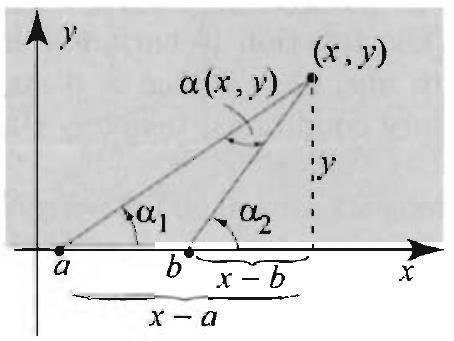

Figure 12 The angle $\alpha(x, y)$ tends to 0 if $(x, y)$ approaches a point on the $x$-axis outside the interval ( $a, b$ ) and it tends to $\pi$ if $(x, y)$ approaches a point on the $x$-axis inside the interval ( $a, b$ ).

Right margin note (page 44)

ith the
nslates , $y)=$ pers to -der to ber $w$,
rations $3=0$, write ginary
he sum ) $=\pi$, $(a, b)$. y). In which 0 if we ct that led the
nction of an

++++

ctions and Conformal Mappings

EXAMPLE 5 Using translates of the argument function
Given $a \cdots b$, solve the Dirichlet problem $\nabla^{2} u=0$ in the upper half-plane, w boundary values (Figure 11)
$$
u(x, 0)=\left\{\begin{array}{ll}
0 & \text { if } x<a, \\
T & \text { if } a<x<b, \\
0 & \text { if } b<x .
\end{array}\right.
$$

Solution Due to the nature of the boundary values, we must involve the tra of $\operatorname{Arg} z$ by $a$ and $b$. We thus try for a solution the harmonic function $u(a \frac{a_{1}}{\pi} \operatorname{Arg}(z-a)+\frac{a_{2}}{\pi} \operatorname{Arg}(z-b)+a_{3}$, where $a_{j}(j=1,2,3)$ are real numb be determined. The function is harmonic in the upper half-plane. In or determine its coefficients, we compute its boundary values. For any real nun $\frac{a}{\pi} \operatorname{Arg} w=0$ if $w>0$ and $\frac{a}{\pi} \operatorname{Arg} w=a$ if $w<0$. So you can verify that
$$
u(x, 0)=\left\{\begin{aligned}
a_{1}+a_{2}+a_{3} & \text { if } x<a, \\
a_{2}+a_{3} & \text { if } a<x<b, \\
a_{3} & \text { if } b \cdot x .
\end{aligned}\right.
$$

Comparing with the given boundary values, we obtain a system of three equ in the unknowns $a_{1}, a_{2}$, and $a_{3}$ :
$$
\left\{\begin{aligned}
a_{1}+a_{2}+a_{3} & =0, \\
a_{2}+a_{3} & =T, \\
a_{3} & =0 .
\end{aligned}\right.
$$

Starting from the third equation and working our way up, we see that $a a_{2}=T$, and $a_{1}=-T$. Thus $u(x, y)=\frac{T}{\pi}(\operatorname{Arg}(z-b)-\operatorname{Arg}(z-a))$. T the solution in terms of $x$ and $y$, we use the inverse cotangent, since the ima parts of $z-a=(x-a)+i y$ and $z-b=(x-b)+i y$ are positive. We get
$$
u(x, y)=\frac{T}{\pi}\left[\cot ^{-1}\left(\frac{x-b}{y}\right)-\cot ^{-1}\left(\frac{x-a}{y}\right)\right] .
$$

In Figure 12, we have $\cot ^{-1}\left(\frac{x-b}{y}\right)=\alpha_{2}$ and $\cot ^{-1}\left(\frac{x-a}{y}\right)=\alpha_{1}$. Since th of the interior angles in a triangle is $\pi$, we obtain $\alpha_{1}+\left(\pi-\alpha_{2}\right)+\alpha(x, y$ where $\alpha(x, y)$ is the angle at the point ( $x, y$ ) subtended by the interval Hence $\alpha(x, y)=\alpha_{2}-\alpha_{1}$, and so $u(x, y)$ is equal to a constant times $\alpha(x$, particular, $\alpha(x, y)$ is a harmonic function of $(x, y)$ in the upper half-plane. tends to $\pi$ if we approach a boundary point in the interval $(a, b)$ and to approach a boundary point outside the interval $(a, b)$. This is a useful fa was observed in the exercises of Section 7.5. The function $\alpha(x, y)$ is cal harmonic measure of the interval $(a, b)$.

The Harmonic Conjugate
Theorem 3 tells us that the real and imaginary parts of an analytic fu are harmonic. Is every harmonic function the real or imaginary part

---

<!-- Page 45 -->

Left margin note (page 45)

THEOREM 4 HARMONIC CONJUGATE

Right margin note (page 45)

655

egion $i v$ is igate
monic simply
or the ot on $\left.+y^{2}\right)$, that since $\infty, 0]$, This of the any ne, a For ound that alytic e the of the monic o $u$ is ations mann
wever, r may

++++

Section 12.5 Analytic Functions

analytic function? More specifically, given a harmonic function $u$ on a $\mathbf{r} \Omega$, can we find another harmonic function $v$ on $\Omega$ such that $f=u+$ analytic on $\Omega$ ? If such a function $v$ exists, it is called a harmonic conju of $u$. The following result answers our question.

Suppose that $\Omega$ is a region (open and connected). Then every har function $u$ on $\Omega$ has a harmonic conjugate $v$ on $\Omega$ if and only if $\Omega$ is s connected (see Section 12.1 for the definition).

The statement of the theorem may appear unusual since the condition fo existence of the harmonic conjugate of $u$ is placed on the region and n $u$ itself. To understand this peculiarity, consider the function $\frac{1}{2} \ln \left(x^{2}-\right.$ which is harmonic on the region $\Omega_{1}=\mathbb{C}$ minus $(0,0)$. It can be shown $\frac{1}{2} \ln \left(x^{2}+y^{2}\right)$ does not have a harmonic conjugate on $\Omega_{1}$. However, $\log z=\frac{1}{2} \ln \left|\ln \left(x^{2}+y^{2}\right)\right|+i \operatorname{Arg} z$ is analytic in $\Omega_{2}=\mathbb{C}$ minus $(-$ it follows that a harmonic conjugate of $\frac{1}{2} \ln \left(x^{2}+y^{2}\right)$ in $\Omega_{2}$ is $\operatorname{Arg} z$. example shows that the underlying region is crucial for the existence harmonic conjugate.

Theorem 4 guarantees the existence of a harmonic conjugate or simply connected region such as the entire plane, a disk, a half-pla sector, or any other open and connected region with no holes in it. an arbitrary region, we can always take a disk inside the region as any given point and then apply Theorem 4. As a result, we can say any harmonic function is locally the real (or imaginary) part of an an function, where by "locally" we mean on any disk in the region wher function is harmonic.

Finding the harmonic conjugate can be achieved with the help Cauchy-Riemann equations, as we now illustrate.

EXAMPLE 6 Finding harmonic conjugates
Show that $u(x, y)=x^{2}-y^{2}+x$ is harmonic in the entire plane and find a har conjugate.
Solution We have $u_{x x}=2$ and $u_{y y}=-2$; hence $u_{x x}+u_{y y}=0$, and s harmonic. To find a harmonic conjugate $v$, we use the Cauchy-Riemann equ as follows. We want $u+i v$ to be analytic. Hence $v$ must satisfy the Cauchy-Ric equations
$$
\frac{\partial u}{\partial x}=\frac{\partial v}{\partial y}, \quad \text { and } \quad \frac{\partial u}{\partial y}=-\frac{\partial v}{\partial x} .
$$

Since $\frac{\partial u}{\partial x}=2 x+1$, the first equation implies that
$$
2 x+1=\frac{\partial v}{\partial y}
$$

To get $v$ we will integrate both sides of this equation with respect to $y$. Ho because $v$ is a function of $x$ and $y$, the constant of integration in your answe

---

<!-- Page 46 -->

Left margin note (page 46)

656 Chapter 12 Green's Fun

Right margin note (page 46)

n (11), y such $c, y)=$ ations $y+C)$
istant. gate of $\mathrm{n} u$ as t is $u$. jectoncrete
lefined $u$. To ve, we $x$ both
family t each

++++

ctions and Conformal Mappings
be a function of $x$. Thus integrating with respect to $y$ yields
$$
v(x, y)=(2 x+1) y+c(x),
$$
where $c(x)$ is a function of $x$ alone. Plugging this into the second equation i we get
$$
-2 y=-\left(2 y+\frac{d}{d x} c(x)\right) .
$$

Hence $c(x)$ has zero derivative and so must be a constant. Let us pick an constant and write $c(x)=C$. Substituting into the expression for $v$, we get $v(2 (2 x+1) y+c(x)=2 x y+y+C$. You should verify the Cauchy-Riemann equ for the pair of functions $u$ and $v$ and conclude that $\left(x^{2}-y^{2}+x\right)+i(2 x y+$ is entire.

If $v$ is a harmonic conjugate of $u$, two questions come to mind:
- Is $v$ unique?
- What is a harmonic conjugate of $v$ ?

On any given simply connected region, $v$ is unique up to an additive cor Also, if $v$ is a harmonic conjugate of $u$, then $-u$ is a harmonic conjug $v$ (Exercise 54).
Orthogonal Trajectories and Harmonic Conjugates
So far we have defined the harmonic conjugate of a harmonic functio the imaginary part of an analytic function, $f=u+i v$, whose real par We now interpret the harmonic conjugate in terms of orthogonal tra ries. This geometric interpretation gives the harmonic conjugate a co meaning.

Given a function of two variables, $u(x, y)$, the level curves of $u$ are $c$ by the equation $u(x . y)=(\therefore$. where $C$ is a constant in the range of compute the slope of the tangent line, $\frac{d y}{d x}$, at a point on a level cur use the chain rule in two dimensions and differentiate with respect to: sides of $u(x . y)=C$ and get
$$
u_{x} \frac{d x}{d x}+u_{y} \frac{d y}{d x}=0 .
$$

Since $\frac{d \cdot r}{d x^{\prime}}=1$, we solve for $\frac{d y}{d x}\left(=m_{1}\right)$ and get
$$
m_{1}=\frac{d y}{d x}=-\frac{u_{x}}{u_{y}} .
$$

The orthogonal trajectories to the level curves $u(x, y)=C$ is the of curves that intersects the level curves $u(x, y)=C$ at right angle a point. Clearly, the two families of curves are mutually orthogonal.

---

<!-- Page 47 -->

Right margin note (page 47)

657
form
ngent
Since
is

, and -iv is . By ies of curves
e can Then stant urves ng to ction erms temo the ne dicular heat
ween s the t the ate $v$ s the

++++

Section 12.5 Analytic Functions

Suppose that we have expressed the orthogonal trajectories in the $\psi(x, y)=C^{\prime}$ for some function $\psi$. As we just showed, the slope of the ta line at any point, of the orthogonal curves is given by $m_{2}=\frac{d y}{d x}=-\frac{\psi_{x}}{\psi_{y}}$. the slopes of orthogonal curves are negative reciprocals, we have
$$
m_{1} \cdot m_{12}=-1 \Leftrightarrow \frac{u_{x}}{u_{y}} \cdot \frac{\psi_{x}}{\psi_{y}}=-1 ;
$$
equivalently, the condition for two families to be mutually orthogonal
$$
\frac{u_{x}}{u_{y}}=-\frac{\psi_{y}}{\psi_{x}} .
$$

Now suppose that $u$ is a harmonic function with harmonic conjugate $v$ let us consider the level curves $u(x, y)=C$ and $v(x, y)=C^{\prime}$. Since $u+$ analytic, the Cauchy-Riemann equations hold: $u_{x}=v_{y}$ and $u_{y}=-v_{y}$, (12), it follows that $u(x, y)=C$ and $v(x, y)=C^{\prime}$ are orthogonal famil curves. We thus have the following useful result.

If $u$ is harmonic and $v$ is a harmonic conjugate of $u$, then the level $u(x, y)=C$ and $v(x, y)=C^{\prime}$ are mutually orthogonal.

We give two interpretations of a harmonic conjugate. In heat flow, w think of $u(x, y)$ as the solution of a Dirichlet problem on a region $\Omega$. the level curves $u(. x . y)=C$ represent the isotherms or curves of con temperature inside $\Omega$. The curves of heat flow inside $\Omega$ are the c that give the direction along which heat is flowing inside $\Omega$. Accordi Fourier's law of heat conduction, heat flows from hot to cold in the dire in which the temperature difference is the greatest. If along the isotl the temperature difference is 0 (the temperature is constant), then the perature difference is largest along the curves that are orthogonal t isotherms. (Recall that the gradient of $u, \nabla u=\left(u_{x}, u_{y}\right)$, points in th rection of greatest change in a function, and the gradient is perpendi to the level curves of $u$.) Consequently, by Theorem 5, the curves of flow are given by the level curves of the harmonic conjugate $v$ of $u$.

In electricity and magnetism, the force of attraction or repulsion bet charged particles is the gradient of a harmonic function $u$, known a electrostatic potential. The level curves, $u(x . y)=C$, represen equipotential lines. In this case, the level curves of a harmonic conjug of $u$ give the direction of the electric force in the field and are known a lines of force.

---

<!-- Page 48 -->

Left margin note (page 48)

658
Chapter 12 Green's Fun

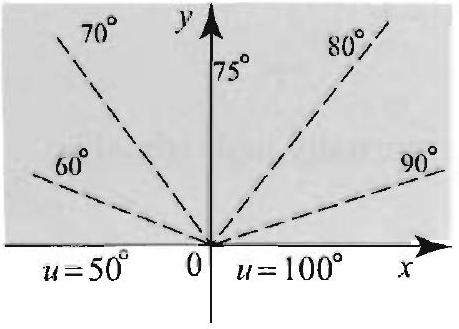

Figure 13 The isotherms are rays at angle $\frac{\pi}{50}(100-T)$.

Figure 14 The isotherms and curves of heat flow are orthogonal.

Right margin note (page 48)

region
iven by

he slope 0 to $\pi$, therms

From nalytic quently, of $u$ is hen $\alpha v$ 1 terms at flow ad then of heat therms curves. 1 in the
nalytic formal
d funcherwise

c a and

++++

ctions and Conformal Mappings

EXAMPLE 7 Isotherms and curves of heat flow
Determine the isotherms and curves of heat flow in Example 4.
Solution The boundary values are 50 and 100 , so the temperature inside the will vary between these two values. For $50<T<100$, the isotherms are g the level curves $u(x, y)=T$, or
$$
\begin{aligned}
-\frac{50}{\pi} \cot ^{-1}\left(\frac{x}{y}\right)+100=T & \Rightarrow \cot ^{-1}\left(\frac{x}{y}\right)=\frac{\pi}{50}(100-T) \\
& \Rightarrow \frac{x}{y}=\cot \left[\frac{\pi}{50}(100-T)\right] \\
& \Rightarrow y=\tan \left[\frac{\pi}{50}(100-T)\right] x
\end{aligned}
$$

Thus the isotherms are rays through the origin at angle $\frac{\pi}{50}(100-T)$, since th is $\tan \left[\frac{\pi}{50}(100-T)\right]$. As $T$ varies from 100 to 50 , this angle varies from which agrees with our expectation, given the boundary conditions. Some isc are shown in Figure 13.

The curves of heat flow are the level curves of a harmonic conjugate of $u$ Example $4, u=-\frac{50}{\pi} \operatorname{Arg} z+100$. Now, recall that $\log z=\ln |z|+i \operatorname{Arg} z$ is $z$ in the upper half-plane. So Arg $z$ is a harmonic conjugate of $\ln |z|$; consec $-\ln |z|$ is a harmonic conjugate of $\operatorname{Arg} z$. Hence a harmonic conjugate $v=\frac{50}{\pi} \ln |z|$. (Here we have used that if $v$ is a harmonic conjugate of $u$, t is a harmonic conjugate of $\alpha u+\beta$, where $\alpha$ and $\beta$ are real constants.) I of $x$ and $y$, we have $v(x, y)=(25 / \pi) \ln \left(x^{2}+y^{2}\right)$, and so the curves of he are given by the level curves $(25 / \pi) \ln \left(x^{2}+y^{2}\right)=C$. Multiplying by $\frac{\pi}{25}$ at taking the exponential, we get $x^{2}+y^{2}=R$, where $R>0$. Thus the curves flow are semi-circles centered at the origin. In Figure 14 we show some isc and curves of heat flow. Notice the orthogonality of these two families of Figure 14 also illustrates Fourier's law that heat is flowing from hot to cold direction in which the temperature difference is the greatest .

In the following section we explore another connection between a functions and harmonic functions, and develop the method of con mappings for solving Laplace's equation.

Exercises 12.5
Exercises 1-20 are intended as review of basic topics in complex numbers an tions. In these exercises, take $n=0 \pm 1, \pm 2, \ldots$, and $z=x+i y$, unless ot specified.
In Exercises 1-4, write the given complex number in the form $a+i b$, wher $b$ are real numbers.
1. (a) $(3+2 i)(2-i)$.
(b) $\quad(3-i) \overline{(2-i)}$.
(c) $\frac{1+i}{1-i}$.
2. (a) $\quad i(2-i)^{2}$.
(b) $\overline{(3+i) \overline{(1-i)}}$.
(c) $\frac{2-i}{i}$.
3. (a) $\frac{1}{7}$.
(b) $(i)^{n}$.
(c) $(\bar{i})^{n}$.

---

<!-- Page 49 -->

Right margin note (page 49)

659
of the

in $\alpha$.
$$
+i b,
$$
$$
2
$$
$$
\log i .
$$
$$
\left.z_{1}\right)+
$$
ssary
given tities
ind a

++++

Section 12.5 Analytic Functions
4.
(a) $\overline{\left(\frac{3+i}{1-i}\right)}$.
(b) $\quad i^{2}+i^{20}+i^{200}+i^{202}$.
(c) $\sum_{n=0}^{1001} i^{n}$.

For the given complex number in Exercises 5-16, (a) find the principal value argument. (b) Compute the modulus. (c) Write the number in the form $r^{i \theta}$.
5. $\quad i$.
6. $-i$.
7. $\pi$.
8. $-\pi$.
9. $1+i$.
10. $1-i$.
11. $-1+i$.
12. $-1-i$.
13. $(1+i)^{2}$.
14. $\frac{1}{1+i}$.
15. $\cos \alpha+i \sin \alpha$. 16. $\cos \alpha-i$ s

In Exercises 17-20, evaluate the function and write your answer in the form a where $a$ and $b$ are real numbers.
17. (a) $e^{2 i}$.
(b) $\sin i$.
(c) $\cos i$.
(d) $\log i$.
18.
(a) $e^{1-\pi i}$.
(b) $\sin (2+\pi i)$.
(c) $\log (-7)$.
(d) $\log 1$.
19.
(a) $e^{-\frac{\pi}{2} i}$.
(b) $e^{2-\frac{\pi}{2} i}$.
(c) $\log (1-i)$.
(d) $\log (1-i)$
20.
(a) $e^{\log (1+5 \pi i)}$.
(b) $\log \left(e^{1+5 \pi i}\right)$.
(c) $\log [(-1) \cdot i]$.
(d) $\log (-1)+1$
21. Give an example to show that $\log \left(z_{1} \cdot z_{2}\right)$ is not always equal to $\log ( \log \left(z_{2}\right)$.
22. Give an example to show that $\log \left(e^{z}\right)$ is not always equal to $z$. Find a nece and sufficient condition on $z$ for the equality $\log \left(e^{z}\right)=z$ to hold.

In Exercises 23-26, derive the given identity. Take $z=x+i y$.
23.
(a) $\left|e^{z}\right|=e^{x}$.
(b) $\left|e^{i z}\right|=e^{-y}$.
24. (a) $|\sin z|=\sqrt{\sin ^{2} x+\sinh ^{2} y}$.
(b) $|\cos z|=\sqrt{\cos ^{2} x+\sinh ^{2} y}$.
25. (a) $\quad \cos (i x)=\cosh x$.
(b) $\quad \sin (i x)=i \sinh x$.
26. (a) $\overline{e^{z}}=e^{\bar{z}}$.
(b) $\overline{\sin z}=\sin \bar{z}$.

In Exercises 27-30, use the Cauchy-Riemann equations to verify whether the function is analytic. If it is, compute its derivative using either one of the ider in (3).
27.
(a) $\quad \sin z$.
(b) $\quad \cos z$.
28.
(a) $e^{z}+z$.
(b) $z^{2}$.
29.
(a) $\frac{x+i y}{x^{2}+y^{2}}$.
(b) $\frac{x-i y}{x^{2}+y^{2}}$.
30.
(a) $\bar{z}$.
(b) $\operatorname{Re} z$.

In Exercises 31-34, verify that the given function is harmonic, and then $f$ harmonic conjugate using the technique of Example 6.
31. $x^{2}-y^{2}+x y$.
32. $x^{2}-y^{2}-2 x+1$.
33. $e^{x} \cos y$.
34. $\cos x \sinh y$.

---

<!-- Page 50 -->

Left margin note (page 50)

660
Chapter 12 Green's Fun

Figure 15 Dirichlet problem in Exercise 42.

Figure 16 Dirichlet problem in Excrcise 43.

Right margin note (page 50)

he given here the
).
${ }^{2} \sin (n \theta)$
in polar
is har-
a haraplace's
cal strip
42.
problem

++++

ctions and Conformal Mappings

In Exercises 35-36, by guessing find an analytic function $f$ such that $t$ function is the real or imaginary part of $f$. Using Theorem 3, determine $u$ given function is harmonic.
35. $\frac{y}{x^{2}+y^{2}}$.
36. $e^{2 x} \cos (2 y)$.
37. (a) Plot the level curves of the harmonic function $u(x, y)=\frac{y}{x^{2}+y^{2}}$. (b) Find and plot the orthogonal trajectories.
38. (a) Plot the level curves of the harmonic function $u(x, y)=\ln \left(x^{2}+y^{2}\right.$ (b) Find and plot the orthogonal trajectories.
39. (a) For any integer $n$, show that $u(r, \theta)=r^{n} \cos (n \theta)$ and $n(r, \theta)=r^{\prime}$ are harmonic on $\mathbb{C}$ if $n \geq 0$ and on $\mathbb{C} \backslash\{0\}$ if $n<0$.
(b) Find the harmonic conjugates of $u$ and $v$. [Hint: Consider $f(z)=z^{n}$ coordinates.]
40. Translating and dilating a harmonic function. Suppose that monic. Show that the following functions are also harmonic:
(a) $\quad u(x-\alpha, y-\beta)$, where $\alpha$ and $\beta$ are real numbers;
(b) $\quad u(\alpha x, \alpha y)$, where $\alpha \neq 0$ is a real number.
41. Harmonic functions independent of $y$. Suppose that $u(x, y)$ monic function whose values depend only on $x$ and not on $y$. Using equation, show that $u(x, y)=a x+b$, where $a$ and $b$ are real constants.

42 (a) Use Exercise 41 to solve the Dirichlet problem in the infinite verti in Figure 15.
(b) Determine and plot the isotherms and curves of heat flow.
43. Solve the Dirichlet problem in Figure 16.
44. Solve the Dirichlet problem in Figure 17.
45. Solve the Dirichlet problem in Figure 18.
46. Determine and plot the isotherms and curves of heat flow in Exercise

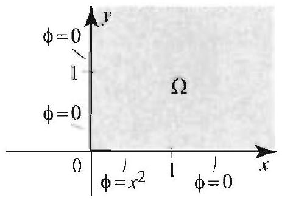
Figure 17 Dirichlet problem in Exercise 44.

Figure 18 Dirichlet in Exercise 45.

---

<!-- Page 51 -->

Left margin note (page 51)

Figure 19 Dirichlet for Exercise 48.

Figure 20 Dirichlet for Exercise 49.

Right margin note (page 51)

661
ta on
In
oblem

plane
ndary
ndary
espectively.
rvals.
$n$ are nsider
nsider $=f(x)$

++++

Section 12.5 Analytic Functions
47. Solve the Dirichlet problem in the upper half-plane with boundary da the $r$-axis given by
$$
u(x, 0)=\left\{\begin{array}{ll}
T_{1} & \text { if } a<x<b, \\
T_{2} & \text { otherwise },
\end{array}\right.
$$
where $a<b$ are fixed real numbers.
48. Project Problem: Harmonic measures of two disjoint interval: this exercise, we generalize the result of Example 5 by solving the Dirichlet pr in the upper half-plane with boundary data
$$
u(x, 0)=\left\{\begin{array}{ll}
T_{1} & \text { if } a<x<b, \\
T_{2} & \text { if } c<x<d, \\
0 & \text { otherwise } .
\end{array}\right.
$$
where $a<b \leq c<d$ (Figure 19).
(a) Show that if $\varkappa_{1}$ is a solution of the Dirichlet problem in the upper halfwith boundary conditions

problem
$$
u_{1}(x, 0)=\left\{\begin{array}{ll}
T_{1} & \text { if } a<x<b \\
0 & \text { otherwise }
\end{array}\right.
$$
and $u_{2}$ is a solution of the Dirichlet problem in the upper half-plane with bou conditions
$$
u_{2}(x, 0)=\left\{\begin{array}{ll}
T_{2} & \text { if } c<x<d \\
0 & \text { otherwise }
\end{array}\right.
$$
then the solution of the Dirichlet problem in the upper half-plane with bou data $u(x, 0)$ is $u(x, y)=u_{1}(x, y)+u_{2}(x, y)$.
(b) Show that $n(x, y)=\left(T_{1} / \pi\right) \alpha_{1}(x . y)+\left(T_{2} / \pi\right) \alpha_{2}(x . y)$ where $\alpha_{1}(x, y)$, r tively, $\alpha_{2}(x, y)$, is the angle at $(x, y)$ subtended by the interval $(a, b)$, respec $(c, d)$.
49. (a) Solve the Dirichlet problem in Figure 20.
(b) Plot the isotherms.
50. Project Problem: Harmonic measures of several disjoint inte Generalize the result of Exercise 48 as follows. Suppose that $I_{1}, I_{2}, \ldots$, disjoint open intervals on the $r$-axis, and $T_{1}, T_{2}, \ldots, T_{n}$ are real numbers. Co the Dirichlet problem in the upper half-plane with boundary condition
$$
u(x, 0)=\left\{\begin{array}{ll}
T_{j} & \text { if } x \text { in } I_{j} \\
0 & \text { otherwise }
\end{array}\right.
$$

Show that the solution is
$$
u(. x, y)=\frac{1}{\pi} \sum_{j=1}^{n} T_{j} \alpha_{j}(x, y)
$$
problem
where $\omega_{j}(x, y)$ is the angle at ( $x, y$ ) subtended by the interval $I_{j}$.
51. Project Problem: Approximation of steady-state solutions.

Co

the Dirichlet problem in the upper half-plane with boundary values $u(x, 0)=$

---

<!-- Page 52 -->

Left margin note (page 52)

662
Chapter 12 Green's Fun

Right margin note (page 52)

perature 1e result ach that alues for stify the olution, s of the
an apakes on e it into imate $f$ oundary
various on (13). ntegral oundary integral
heme of the ape at the

++++

ctions and Conformal Mappings
$(-\infty<x<\infty)$, where $f(x)$ is an arbitrary function that represents the temb of the points on the $x$-axis. In this exercise, we will show how we can use th of Exercise 50 to approximate the solution for a given $f(x)$. The approwe take has merit, since it can be used to obtain approximate numerical v: the steady-state temperature. Moreover, we will use it in Exercise 52 to ju: Poisson integral formula in the upper half-plane.

To be able to compare our numerical approximation with the exact s let us take $f(x)=\left(1+x^{2}\right)^{-1},-\infty<x<\infty$. In this case, using propertic Poisson integral, we have the solution
$$
u(x, y)=\frac{1+y}{x^{2}+(1+y)^{2}}
$$
(see Exercise 6, Section 7.5).
(a) Pretend that we do not know the exact solution and proceed to finc proximate solution. The idea is to approximate $f(x)$ by a function that constant values on disjoint intervals. Take the interval $(-5,5)$ and subdivid 40 smaller intervals of equal length, $\left(x_{j}, x_{j+1}\right), j=1,2, \ldots, 40$. Approx on $\left(x_{j}, x_{j+1}\right)$ by $f\left(x_{j}\right)$, and by 0 outside the interval $(-5,5)$. Thus the b values are now replaced by
$$
u(x, 0)=\left\{\begin{array}{ll}
\frac{1}{1+x_{j}^{2}} & \text { if } x_{j}<x<x_{j+1}, \\
0 & \text { otherwise } .
\end{array}\right.
$$

Show that the solution is
$$
u(x, y)=\frac{1}{\pi} \sum_{j=1}^{40} \frac{1}{1+x_{j}^{2}} \alpha_{j}(x, y),
$$
where $\alpha_{j}(x, y)$ is the angle at $(x, y)$ subtended by the interval $\left(x_{j}, x_{j+1}\right)$. (b) With the help of a computer, evaluate your approximate solution at points, $\left(x_{0}, y_{0}\right)$, in the upper half-plane and compare with the exact soluti
52. Project Problem: From the harmonic measure to the Poisson i formula. Consider the Dirichlet problem in the upper half-plane with b values $u(x, 0)=f(x),-\infty<x<\infty$, whose solution is given by the Poisson formula
$$
u(s, y)=\frac{y}{\pi} \int_{-\infty}^{\infty} \frac{f(x)}{(s-x)^{2}+y^{2}} d x, \quad-\infty<s<\infty, y>0
$$

Our goal in this exercise is to obtain this formula by using the numerical sc Exercise 51.
(a) Based on the approach in Exercise 51, explain how you would derive proximate solution
$$
u_{\text {app }}(s, y)=\frac{1}{\pi} \sum_{j=1}^{n} f\left(x_{j}\right) \alpha_{j}(s, y),
$$
where $x_{j}$ are equally spaced points on the $x$-axis and $\alpha_{j}(s, y)$ is the angl point $(s, y)$ subtended by the interval $\left(x_{j}, x_{j+1}\right)$.

---

<!-- Page 53 -->

Left margin note (page 53)

12.6 Solving

Right margin note (page 53)

663

erval
$$
\Delta x=
$$
egral isson ff its igate
the cansd of n be this napcall e the mal. takes then will will the
dem. ions. will ortly. next rmal

++++

Section 12.6 Solving Dirichlet Problems with Conformal Mappings
(b) Show that
$$
u_{\mathrm{app}}(s, y)=\frac{1}{\pi} \sum_{j=1}^{n} f\left(x_{j}\right)\left(\operatorname{Arg}\left(z-x_{j+1}\right)-\operatorname{Arg}\left(z-x_{j}\right)\right),
$$
where $z=s+i y$.
(c) Use the mean value theorem to show that there exists a $\xi_{j}$ in the int $\left(x_{j} . x_{j+1}\right)$ such that $\operatorname{Arg}\left(z-x_{j+1}\right)-\operatorname{Arg}\left(z-x_{j}\right)=\frac{y}{\left(s-\xi_{j}\right)^{2}+y^{2}} \Delta x$, where $x_{j+1}-x_{j}$.
(d) Thus the approximate solution
$$
u_{\mathrm{app}}(s, y)=\frac{y}{\pi} \sum_{j=1}^{n} \frac{f\left(x_{j}\right)}{\left(s-\xi_{j}\right)^{2}+y^{2}} \Delta x
$$

Let $\Delta x \rightarrow 0$ and explain why $u_{\text {app }}(s, y)$ should approach the Poisson int (14). Hint: Interpret $u_{\text {app }}(s, y)$ as a Riemann sum that approximates the Po integral (14).]
53. Complete the details of Example 2(f) to show that $\log z$ is analytic o branch cut and then show that its derivative is $\frac{1}{z}$.
54. Show that if $v$ is the harmonic conjugate of $u$, then $-u$ is the harmonic conjr of $v$. [Hint: If $f=u+i v$ is analytic, what can you say about $i f$ ?]

Dirichlet Problems with Conformal Mappings
In solving a Dirichlet problem, it is sometimes advantageous to map region under consideration to a simpler region or one on which the tr formed problem is easier to solve. This is the idea behind the metho conformal mappings, which we now explain. Let a Dirichlet proble given on a region $\Omega$ with boundary $\Gamma$. Suppose that we want to solve problem by somehow transforming it first to the $w$-plane by means of a ping $w=f(z)$, where $f$ is analytic on $\Omega$. If $f^{\prime}(z) \neq 0$ for all $z$ on $\Omega$, w $f$ a conformal mapping of $\Omega$. These mappings are known to preserv angles between curves and their orientation, and thus the term confor One of the important properties of a conformal mapping $f$ is that it regions into regions; that is, if $\Omega$ is a region (open, connected set), $\Omega^{\prime}=f[\Omega]$ is also a region. More important, if $f$ is one-to-one, then $f$ map $\Gamma$, the boundary of $\Omega$, into $\Gamma^{\prime}$, the boundary of $\Omega^{\prime}$. Although we not prove these results. they can be checked on a case-by-case basis in examples of this section. (See [1] for the proofs.)

When we apply the conformal mapping method to a Dirichlet prob we need to know what happens to the equation and the boundary condit Because $f$ maps boundary to boundary, the boundary conditions on $I$ be transformed into boundary conditions on $\Gamma^{\prime}$ as we will explain sho However, the most important feature of the method is stated in the theorem. It tells us that Laplace equation is invariant under a confo mapping.

---

<!-- Page 54 -->

Left margin note (page 54)

664
Chapter 12 Green's Fin

THEOREM 1
INVARIANCE OF LAPLACE'S EQUATION

To understand the meaning of $U \circ f(:)$, where $f$ is complexvalued and $l i$ is a function of two variables, write $U \circ f(z)=U(\operatorname{Re} f(z), \operatorname{Im} f(z))$. For example, if $f(z)= e^{z}=\epsilon^{x} \cos y+i e^{x} \sin y$ and $U(s, t)=s t$. then $U \circ f(z)= e^{2 x} \cos y \sin y$.

Figure 1 If $f(z)$ is analytic and one-to-one on $\Omega$ and its boundary $\mathrm{I}^{\prime}$, then $\Omega^{\prime}=f[\Omega]$ is a region with boundary $\Gamma^{\prime}= f[\Gamma]$. The boundary function $b(z)$ ( $z$ on $\Gamma$ ) is used to define a boundary function $b \circ f^{1}(w)$ for all $w$ on $\Gamma^{\prime}$. where $f^{-1}$ is the inverse of $f$.

Right margin note (page 54)

region $\circ f$ is satisfies
$U$ has is disk, Hence $U \circ f$ is
f(z) to undary Here is
$=f[\Gamma]$
ned on metion $\Gamma^{\prime}$.
place's on $\Gamma^{\prime}$.
of our c on $\Omega$. $=b(z)$.
th sev-emainapping Steps

Since

++++

ctions and Conformal Mappings

Suppose that $f$ is an analytic function mapping a region $\Omega$ into $\Omega^{\prime}$, and $U$ is a harmonic function on $\Omega^{\prime}$. Then the function $\phi=l$ harmonic on $\Omega$. Thus, if $U$ satisfies $\nabla^{2} U=0$ on $\Omega^{\prime}$, then $\phi=U \circ f \nabla^{2} \phi=0$ on $\Omega$.

Proof Let $z_{0}$ be a point in $\Omega$ and $w_{0}=f\left(z_{0}\right)$. By Theorem 4. Section 12.5 a harmonic conjugate $V$ on a disk around $w_{0}$. Then $U+i V$ is analytic on th and by the composition of analytic functions, $(U+i V) \circ f$ is analytic at $z_{0}$. by Theorem 3, Section 12.5. $\operatorname{Re}[(U+i V) \circ f]=\operatorname{Re}[U \circ f+i(V \circ f)]=$ harmonic at $z_{0}$. Since $z_{0}$ is arbitrary, it follows that $U \circ f$ is harmonic on $S$

Now suppose that you want to use a conformal mapping $u=$ solve the Dirichlet problem $\nabla^{2} \phi=0$ in $\Omega$ and $\phi(z)=b(z)$ on the bo $\Gamma$ of $\Omega$. Suppose also that $f$ is one-to-one on $\Omega$ and its boundary $\Gamma$. how the method works (see Figure 1 as you read through the steps).

Step 1: Describe clearly the region $\Omega^{\prime}=f[\Omega]$ and its boundary $\Gamma^{\prime}$ in the $w$-plane.
Step 2: Since $f$ is one-to-one, we have an inverse function $f^{-1}$ defi $\Omega^{\prime}$ and $\Gamma^{\prime}$. For $w$ on $\Gamma^{\prime}, f^{-1}(w)$ is on $\Gamma$ and so we can define the fi $b \circ f^{-1}(w)$ for all $w$ on $\Gamma^{\prime}$. This determines the boundary values on
Step 3: Set up and solve the Dirichlef problem on $\Omega^{\prime}$ consisting of La equation $\nabla^{2} U(w)=0$ for all $w$ in $\Omega^{\prime}$ and $U^{\prime}(w)=b \circ f^{-1}(w)$ for all $u$ (This is our transformed Dirichlet problem.)
Step 4: Let $\phi(z)=l^{\prime} \circ f(z)$ for all $z$ in $\Omega$. Then $\phi(z)$ is a solution original Dirichlet problem on $\Omega$. Indeed, by Theorem $1, \phi$ is harmoni For $z$ on $\Gamma, f(z)$ belongs to $\Gamma^{\prime}$, and $\phi(z)=U \circ f(z)=b \circ f^{-1}(f(z))$ Hence 1 satisfies the desired boundary condition.

In what follows, we illustrate the conformal mappings method wi eral examples. We will give the conformal mapping and focus on the 1 ing details of the solution. The actual construction of the conformal m could be by itself a very challenging problem. Also, in Examples 1-3 2 and 3 can be performed without actually computing $f^{-1}$.

In the first example, we use the analytic mapping $f(z)=z^{2}$.

---

<!-- Page 55 -->

Left margin note (page 55)

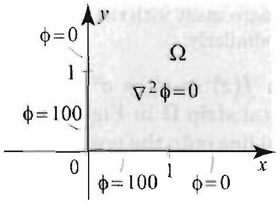

Figure 2 The Dirichlet problem in Example 1.

Figure 3 Transforming a Dirichlet problem from the first quadrant onto the upper half-plane. Notice the boundary correspondence.

Right margin note (page 55)

665

that also
prob-trans$r$ half ndary apped $\geq 0$ is blane. ndary ) $=0$ ed by ple 5, $(z)= -1=$ parts evious

++++

Section 12.6 Solving Dirichlet Problems with Conformal Mappings-

squaring a complex number doubles its argument, it is not hard to see $f(z)$ maps the first quadrant $\Omega$ onto the upper half-plane $\Omega^{\prime}$. It is one-to-one in the first quadrant.

EXAMPLE 1 Conformal mapping method
Solve the Dirichlet problem in the first quadrant $\Omega$ shown in Figure 2.
Solution We use the method of conformal mappings to transform the given lem into a problem on the upper half-plane. As we will see momentarily, the formed problem is easy to solve.
Step 1: As we just discussed, $f(z)=z^{2}$ takes $\Omega$ in the $z$-plane onto the uppo of the $w$-plane (Figure 3). Morcover, the boundary of $\Omega$ is mapped to the bou of the upper half-plane as follows. The nonnegative real line $(x \geq 0)$ is ma to the nonnegative real line ( $u \geq 0$ ), and the imaginary semi-axis iy with $y$ mapped to the nonpositive real line ( $u \geq 0$ ).
Step 2: Describe the boundary function in the Dirichlet problem in the $w$ The boundary function in the $w$-plane is $b \circ f^{-1}(w)$, where $b(z)$ is the bou function in the $z$-plane. With the help of Figure 3, we see that $b \circ f^{-1}((u, 0)$ if $|u|>1$ and $b \circ f^{-1}((u, 0))=100$ if $|u|<1$.
Step 3: The transformed Dirichlet problem in the upper half-plane is describ Figure 3 and given by
$$
\begin{array}{l}
\nabla^{2} U(w)=0, w \text { in the upper half-plane; } \\
U(u, 0)=0,|u|>1, \quad U(u, 0)=100 .|u|<1 .
\end{array}
$$

To solve the boundary value problem in the $w$-plane, we appeal to Exam Section 12.5, and get $U(w)=\frac{100}{\pi}(\operatorname{Arg}(w-1)-\operatorname{Arg}(w+1))$.
Step 4: The solution of the original Dirichlet problem in the $z$-plane is $\phi U(f(z))=\frac{100}{\pi}\left[\operatorname{Arg}\left(z^{2}-1\right)-\operatorname{Arg}\left(z^{2}+1\right)\right]$. In terms of $x$ and $y$, we have $z^{2} x^{2}-y^{2}-1+2 i x y$ and $z^{2}+1=x^{2}-y^{2}+1+2 i x y$. Since the imaginary of $z^{2}-1$ and $z^{2}+1$ are positive, we use the inverse cotangent, as in the pre section, and get.
$$
\begin{aligned}
\phi(x, y) & =\frac{100}{\pi}\left[\operatorname{Arg}\left(x^{2}-y^{2}-1+2 i x y\right)-\operatorname{Arg}\left(x^{2}-y^{2}+1+2 i x y\right)\right] \\
& =\frac{100}{\pi}\left[\cot ^{-1}\left(\frac{x^{2}-y^{2}-1}{2 x y}\right)-\cot ^{-1}\left(\frac{x^{2}-y^{2}+1}{2 x y}\right)\right] .
\end{aligned}
$$

---

<!-- Page 56 -->

Left margin note (page 56)

666
Chapter 12 Green's Fun

Figure 4 Mapping the horizontal strip by $f(z)=e^{z}$ onto the upper half-plane. Some special values:
$$
\begin{array}{l}
f(-1)=1 / e, f(1)=c \\
f(i \pi)=-1 \\
f(x)>0, f(x+i \pi)<0
\end{array}
$$

Right margin note (page 56)

$\rightarrow 0^{+}$,
undary
$\cos y+$ e 4. If ive real $=-e^{x}$. $<0 \mathrm{in}$ f-plane
upper upper
$f$ maps v-plane. $=T$ if $u$
mple 5 ,
ne
$=0$
$x, y)=$ and the

++++

ctions and Conformal Mappings

Let us quickly verify some of the boundary conditions. If $0<x<1$ and $y$ then $\frac{x^{2}-y^{2}-1}{2 x y} \rightarrow-\infty$ and $\frac{x^{2}-y^{2}+1}{2 x y} \rightarrow+\infty$. Hence
$$
\lim _{y \rightarrow 0^{+}}\left[\cot ^{-1}\left(\frac{x^{2}-y^{2}-1}{2 x y}\right)-\cot ^{-1}\left(\frac{x^{2}-y^{2}+1}{2 x y}\right)\right]=\pi-0=\pi,
$$
and so $\lim _{y \rightarrow 0^{+}} \phi(x, y)=100$, if $0<x<1$, which is in agreement with the bo condition. The other boundary values can be verified similarly.

The next example uses the analytic function $f(z)=e^{z}=e^{x}$ (c $i \sin y$ ), where $z=x+i y$ belongs to the horizontal strip $\Omega$ in Figur $z=x$ is real, then $f(z)=e^{x}$; hence $f$ maps the real line onto the posit, axis $u>0$ in the $w$-plane. If $z=x+i \pi$, then $f(z)=e^{x+i \pi}=e^{x} e^{i \pi}$; Hence $f$ maps the horizontal line $y=\pi$ onto the negative real axis $u$ the $w$-plane. You can check that for $z$ in $\Omega, f(z)$ is in the upper hal and that $f[\Omega]$ is equal to the upper half-plane.

EXAMPLE 2 The exponential function as a conformal mapping Solve the Dirichlet problem on the horizontal strip $\Omega$ shown in Figure 4.
Solution We follow the four steps of the conformal mapping method.
Step 1: We already verified that $f(z)=\epsilon^{z}$ takes $\Omega$ in the $z$-plane onto th half of the $w$-plane, and takes the boundary of $\Omega$ to the boundary of the half-plane.
Step 2: Reviewing carefully the effect of $f$ on the boundary, we find that the interval $[-1,1]$ on the $x$-axis onto the interval $\left[\frac{1}{e}, e\right]$ on the $u$-axis in the $u$ Thus the boundary values for the problem on the region $\Omega^{\prime}$ are $U((u, 0))=$ is in $\left[\frac{1}{e}, c\right]$ and $U((u, 0))=0$ otherwise.
Step 3: To solve the transformed boundary value problem, we appeal to Exa Section 12.5, and get
$$
U(w)=\frac{T}{\pi}\left[\operatorname{Arg}(w-e)-\operatorname{Arg}\left(w-\frac{1}{e}\right)\right] .
$$

Step 4: The solution of the original Dirichlet problem in the $z$-plane is $\phi( U(f(z))=\frac{T}{\pi}\left[\operatorname{Arg}\left(e^{z}-e\right)-\operatorname{Arg}\left(e^{z}-\frac{1}{e}\right)\right]$. Using the inverse cotangent

---

<!-- Page 57 -->

Right margin note (page 57)

667
o-one that that rhich $\left.\frac{\pi}{2}, \frac{\pi}{2}\right]$ the laim c) in
$\infty)$, that , -1 ] ne in nh 1, pper e the lane:
ribed ment tive,

++++

Section 12.6 Solving Dirichlet Problems with Conformal Mappings
explicit formula for ' . we get
$$
\begin{aligned}
\phi(x, y) & =\frac{T}{\pi}\left[\operatorname{Arg}\left(e^{x} \cos y-e+i e^{x} \sin y\right)-\operatorname{Arg}\left(e^{x} \cos y-\frac{1}{e}+i e^{x} \sin y\right.\right. \\
& =\frac{T}{\pi}\left[\cot ^{-1}\left(\frac{e^{x} \cos y-e}{e^{x} \sin y}\right)-\cot ^{-1}\left(\frac{e^{x} \cos y-\frac{1}{e}}{e^{x} \sin y}\right)\right] \\
& =\frac{T}{\pi}\left[\cot ^{-1}\left(\frac{\cos y-e^{1}}{\sin y}\right)-\cot ^{-1}\left(\frac{\cos y-e^{-(x+1)}}{\sin y}\right)\right] .
\end{aligned}
$$

It is instructive to verify the boundary condition for this solution.
Our next example uses the function $f(z)=\sin z$.

EXAMPLE 3 The sine function as a conformal mapping
Solve the Dirichlet problem in the semi-infinite strip $\Omega$ shown in Figure 5.
Solution We use the analytic function $f(z)=\sin z$.
Step 1: To determine the image of $\Omega$, we use the fact that $\sin z$ is a one-to conformal mapping on $\Omega$ (you should check these properties). We will show $f$ maps the boundary of $\Omega$ onto the real axis in the $w$-plane. This will imply the image of $\Omega$ is either the upper or lower half-plane. We then determine half-plane it is by checking the image of just one point in $\Omega$.

Let us determine the image of the boundary of $\Omega$. The line segment [ $-\frac{2}{3}$ on the $x$-axis is mapped onto the line segment $[-1,1]$ in the $w$-plane, becaus image of the interval $\left[-\frac{\pi}{2}, \frac{\pi}{2}\right]$ by the function $\sin x$ is the interval $[-1,1]$. We that the vertical half-line $x=\frac{\pi}{2}$ and $y \geq 0$ is mapped onto the half-line $[1$, the $w$-plane. To see this, use
$$
\sin z=\sin x \cosh y+i \cos x \sinh y
$$
(Example 1 (d), Section 12.5). If $x=\frac{\pi}{2}$, then $\sin z=\cosh y$. As $y$ varies in $(0$, cosh $y$ varies in the interval $(1, \infty)$, establishing our claim. Similarly, we show $\sin z$ maps the vertical half-line $x=-\frac{\pi}{2}$ and $y \geq 0$ onto the half-line $(-\infty$ in the $w$-plane. In conclusion, $\sin z$ maps the boundary of $\Omega$ onto the real li the $u$-plane. Now pick one point in $\Omega$, say $z=i$. We have $f(i)=\sin i=i \operatorname{si}$ which is a point in the upper half of the $w$-plane. Thus $f$ maps $\Omega$ onto the $u$ half-plane.
Step 2: From the boundary correspondence that we just described, we deriv following boundary values for the Dirichlet problem in the upper half of the $w$-p
$$
I^{r}(u, 0)=\left\{\begin{array}{ll}
0 & \text { if } u>0 \\
100 & \text { if } u<0
\end{array}\right.
$$

Step 3: The transformed Dirichlet problem in the upper half-plane is desci by Figure 5. Its solution is derived immediately with the help of the argu function. We have $U(w)=\frac{100}{\pi} \operatorname{Arg} w$, because $\operatorname{Arg} w=0$ if $w$ is real and pos and $\operatorname{Arg} w=\pi$ if $w$ is real and negative.

---

<!-- Page 58 -->

Left margin note (page 58)

668
Chapter 12 Green's Fun

Figure 5 Mapping the semiinfinite vertical strip onto the upper half-plane. Note the boundary correspondence.

Figure 6 Isotherms and curves of heat flow.

Right margin note (page 58)

$\phi(z)=$ use the
quation can be s. This and we ich the and the ow in a pected ed with vertical onstant, lar arcs
he rays d $b$, as -plane t $L$ on $z=\alpha b, \ln |z|$ egment image $\left.a, \alpha_{1}\right)$.

++++

ctions and Conformal Mappings

Step 4: The solution of the original Dirichlet problem in the $z$-plane is $U(f(z))=\frac{100}{\pi} \operatorname{Arg}(\sin z)$. To express our answer in terms of $x$ and $y$, we real and imaginary parts of $\sin z$ and the inverse cotangent. We have
$$
\operatorname{Arg}(\sin z)=\cot ^{-1}\left(\frac{\sin x \cosh y}{\cos x \sinh y}\right)=\cot ^{-1}(\tan x \operatorname{coth} y) .
$$

Hence
$$
\phi(z)=\phi(x, y)=\frac{100}{\pi} \cot ^{-1}(\tan x \operatorname{coth} y) .
$$

In Figure 6 we show the isotherms and the curves of heat flow. (For the e of the curves of heat flow, see Exercise 38.) A few geometric observations made. Note that at the top of Figure 6, the isotherms look like vertical line is to be expected, since the lower boundary, being remote, can be ignored, may think of the problem as one on a doubly infinite vertical strip, in wl isotherms are vertical lines. Near the origin, the isotherms look like rays, curves of heat flow like circles. These are the isotherms and curves of heat Dirichlet problem with boundary data constant on rays. This too is to be e since near the origin the vertical boundary data have less effect as compar the boundary data on the $x$-axis. So near the origin, we can ignore the boundary data and consider only the horizontal boundary data, which is c on rays in this case. and so the isotherms and curves of heat flow are circu (see Example 7, Section 12.5).

The following example deals with a circular region, bounded by $t$. at angle $0 \leq \alpha_{1}$ and $\alpha_{2} \leq \pi$, and the circular arcs with radii $a$ an shown in Figure 7. Such a region is mapped to a rectangle in the $u$ using the function $f(z)=\log z$. To see this, consider a line segmen the ray at angle $\alpha$, where $\alpha_{1} \leq \alpha \leq \alpha_{2}$. For : on this ray, we have $\operatorname{Ar}$ and so $\log z=\ln |z|+i \operatorname{Arg} z=\ln |z|+i \alpha$. As $|z|$ varies from $a$ to varies from $\ln a$ to $\ln b$, and thus $\log z$ describes the horizontal line s $u+i \alpha$, where $\ln a \leq u \leq \ln b$. By letting $\alpha$ vary from $\alpha_{1}$ to $\alpha_{2}$, tho of the line segment $L$ sweeps the rectangular area with vertices (ln $\left(\ln b, \alpha_{1}\right),\left(\ln b, \alpha_{2}\right)$ and $\left(\ln a, \alpha_{2}\right)$, as shown in Figure 7.

---

<!-- Page 59 -->

Left margin note (page 59)

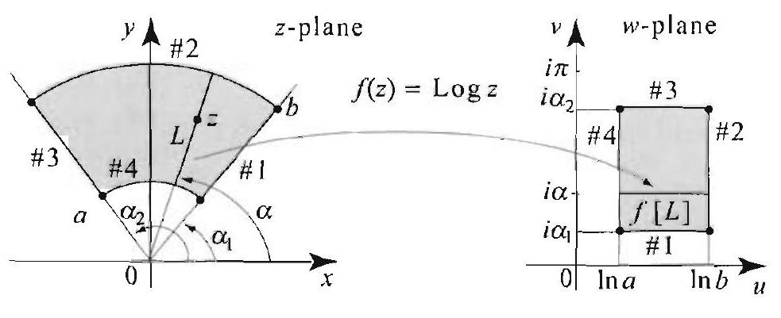

Figure $7 \log z$ is a one-toone conformal mapping of the circular region onto a rectangle. The boundary of the circular region is mapped onto the boundary of the rectangle in the following manner: Side \# $j$ in the domain is mapped to side $\# j$ in the range.

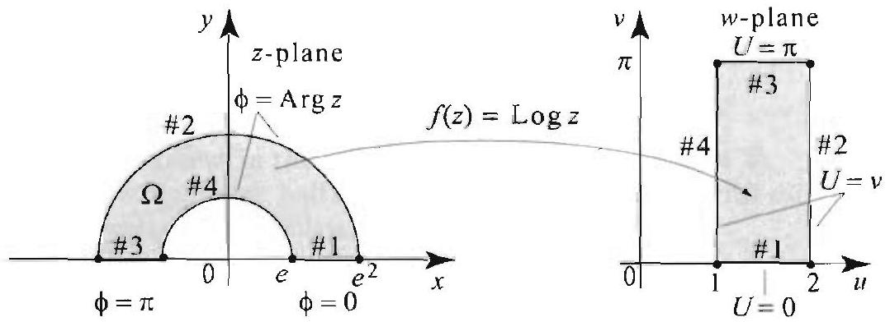

Figure 8 The circular region is a special case of the circular region in Figure 7, with $a=e$, $b=e^{2}, \alpha_{1}=0$, and $\alpha_{2}=\pi$.

Right margin note (page 59)

669

gions on of
es otice ral to n the idary

3 are idary he $u^{-}$ verse Then $=v$. 1 can cm is
$=v$
$\bar{u}$
ure 8.
$y$ the

++++

Section 12.6 Solving Dirichlet Problems with Conformal Mappings

The mapping $\log z$ allows us to transform problems on circular re to problems on rectangles on which we can use the method of separati variables (Section 3.8).

EXAMPLE 4 Log $z$ as a conformal mapping, separation of variabl Solve the Dirichlet problem in the circular region $\Omega$ shown in Figure 8. (N that on the circular boundary, the boundary function is not constant: It is equ $\operatorname{Arg} z$.)

Solution Step 1: As we just explained, the mapping $f(z)=\log z$ takes $\Omega \mathrm{i} z$-plane onto the rectangle in the $w$-plane, as shown in Figure 8, and the bom sides correspond as described in Figure 8.

Step 2: As in previous examples, the boundary values on sides \#1 and \# constant. They are equal to 0 and $\pi$, respectively. To determine the bour values on sides \#2 and \#4, we use the fact that the boundary function in t plane is $b \circ f^{-1}(w)$, where $b(z)$ is the boundary function in the $z$-plane. The in mapping is $f^{-1}(w)=e^{w}$. For $w$ on side $\# 2$, write $w=2+i v$, where $0 \leq v \leq \pi$. the boundary value at $w$ is given by $\operatorname{Arg}\left(e^{w}\right)=\operatorname{Arg}\left(e^{2+i v}\right)=\operatorname{Arg}\left(e^{2} e^{i v}\right)$ Hence the boundary function on side \#2 is $U(2, v)=v$. In a similar way, yo show that $U(1, v)=v$. Thus the boundary function in the transformed probl as described in Figure 8.

Step 3: The transformed Dirichlet problem in the rectangle is described by Fig We state it here using the variables $s$ and $t$ in place of $u$ and $v$ to simplif

---

<!-- Page 60 -->

Left margin note (page 60)

670
Chapter 12 Green's Fun

Right margin note (page 60)

separaonding use the at the this in +1 or
$$
\left.\left(\frac{x}{y}\right)\right) .
$$

++++

ctions and Conformal Mappings

formulas:
$$
\begin{array}{l}
\nabla^{2} U(s, t)=0, \quad 1 \leq s \leq 2,0 \leq t \leq \pi \\
U(s, 0)=0 . \quad U(s, \pi)=\pi, 1<s<2 \\
U(1, t)=t, \quad U(2, t)=t, 0<t<\pi
\end{array}
$$

To solve the boundary value problem in the $w$-plane, we use the method of tion of variables (Section 3.8). The solution has three nonzero parts corresp to the nonzero boundary values on sides $\# 2,3$, and 4 . Furthermore, to results of Section 3.8, we must position the lower left vertex of the rectangle origin. We do this by translating the rectangle one unit to the left. With mind, we apply (9), Section 3.8 (with $a=1$, and $b=\pi$ ), and let $s=x x=s-1$. Then
$$
\begin{aligned}
U(s, t)= & \sum_{n=1} B_{n} \sin [n \pi(s-1)] \sinh n \pi t \\
& +\sum_{n=1} C_{n} \sinh [n(2-s)] \sin n t+\sum_{n=1} D_{n} \sinh [n(s-1)] \sin n
\end{aligned}
$$
where
$$
\begin{aligned}
B_{n} & =\frac{2}{\sinh \left(n \pi^{2}\right)} \int_{0}^{1} \pi \sin n \pi s d s \\
C_{n}=D_{n} & =\frac{2}{\pi \sinh n} \int_{0}^{\pi} t \sin n t d t
\end{aligned}
$$

Evaluating the integrals, we find
$$
\begin{aligned}
B_{n} & =\frac{2}{n \sinh \left(n \pi^{2}\right)}(1-\cos n \pi) \\
C_{n}=D_{n} & =\frac{-2}{n \sinh n} \cos n \pi=\frac{2}{n \sinh n}(-1)^{n+1}
\end{aligned}
$$

Thus
$$
\begin{aligned}
U(s, t)= & \sum_{n=1} \frac{2}{n \sinh \left(n \pi^{2}\right)}(1-\cos n \pi) \sin [n \pi(s-1)] \sinh n \pi t \\
& +\sum_{n=1} \frac{2}{n \sinh n}(-1)^{n+1} \sinh [n(2-s)] \sin n t \\
& +\sum_{n=1} \frac{2}{n \sinh n}(-1)^{n+1} \sinh [n(s-1)] \sin n t
\end{aligned}
$$

Step 4: The solution of the original Dirichlet problem in the $z$-plane is
$$
\phi(x, y)=\phi(z)=U(f(z))=U(\ln |z|+i \operatorname{Arg} z)=U\left(\ln \left(\sqrt{x^{2}+y^{2}}\right), \cot ^{-1}\right.
$$

---

<!-- Page 61 -->

Right margin note (page 61)

671
f)]
$\left.\left.\frac{x}{y}\right)\right]$.
this ging cises
e uv-
$y)$.
plain
$$
y \leq c\}
$$
cepts

++++

Section 12.6 Solving Dirichlet Problems with Conformal Mappings

So
$$
\begin{aligned}
\phi(x, y)= & \sum_{n=1} \frac{2(1-\cos n \pi)}{n \sinh \left(n \pi^{2}\right)} \sin \left[n \pi\left(\ln \left(\sqrt{x^{2}+y^{2}}\right)-1\right)\right] \sinh \left[n \pi \cot ^{-1}\left(\frac{x}{y}\right)\right] \\
& +\sum_{n=1} \frac{2}{n \sinh n}(-1)^{n+1} \sinh \left[n\left(2-\ln \left(\sqrt{x^{2}+y^{2}}\right)\right]\right) \sin \left[n \cot ^{-1}\left(\frac{x}{y}\right)\right. \\
& +\sum_{n=1} \frac{2}{n \sinh n}(-1)^{n+1} \sinh \left[n\left(\ln \left(\sqrt{x^{2}+y^{2}}\right)-1\right)\right] \sin \left[n \cot ^{-1}( \right.
\end{aligned}
$$

It is a good exercise to check the boundary conditions for this solution.
As we mentioned earlier, and as clearly illustrated by the examples of section, the construction of a conformal mapping could be a very challen problem. Additional interesting examples will be presented in the exer and in the next section.

Exercises 12.6
In Exercises 1-4, an analytic function $f(z)$ is given from the $x y$-plane into th plane, and a harmonic function $U(u, v)$ is defined on the range of $f$.
(a) Verify that $f$ is analytic and $U$ is harmonic.
(b) Find the real and imaginary parts of $f(z)$ and write $f(z)=u(x, y)+i v(x$
(c) Let $\phi(x, y)=U \circ f(z)$. Compute $\phi$ explicitly in terms of $x$ and $y$ and ex why $\phi$ is harmonic.
1. $f(z)=\frac{1}{z} ; U(u, v)=u v$.
2. $f(z)=\frac{1}{z} ; U(u, v)=e^{u} \cos v$.
3. $f(z)=e^{z} ; U(u, v)=u^{2}-v^{2}$.
4. $f(z)=z^{2} ; U(u, v)=\ln \left(u^{2}+v^{2}\right)$.
5. Refer to the mapping $f(z)=e^{z}$ in Example 2. Let $S=\{x+i y: x=a, b \leq$ be a vertical line segment in the $x y$-plane.
(a) Show that $f[S]$ is a circular arc in the $u v$-plane with radius $e^{a}$.
(b) Plot $S$ and $f[S]$ in the two cases when $a=1, b=0$, and $c=\frac{\pi}{2}$ and $\pi$.
6. Refer to the mapping $f(z)=\sin z$ in Example 3. Let
$$
S=\left\{x+i y:-\frac{\pi}{2} \leq x \leq \frac{\pi}{2}, y=y_{0}>0\right\}
$$
be a horizontal line segment, in the region $\Omega$ in the $x y$-plane (Figure 5).
(a) Show that $f[S]$ is the upper half of an ellipse in the $u v$-plane, with $u$-inter at $\pm \cosh y_{0}$ and $v$-intercept at $\sinh y_{0}$.
(b) Plot $S$ and $f[S]$ in the two cases: $y_{0}=1$ and $y_{0}=.1$.
(c) Which region in the $w$-plane is swept by $f[S]$ as $y_{0}$ varies from 0 to $\infty$ ?
7. Verify the boundary conditions for the solution in Example 3.
8. Verify the boundary conditions for the solution in Example 4.

---

<!-- Page 62 -->

Left margin note (page 62)

672
Chapter 12
9.

Figure 9
12.

Figure 12
15.

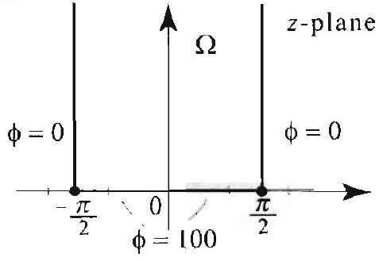

Figure 15
18.

Figure 18

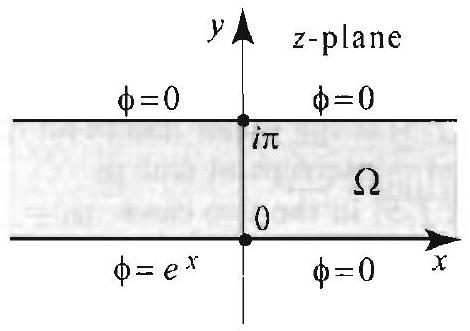

++++

Green's Functions and Conformal Mappings

In Exercises 9-20 (Figures 9-20), Follow the four-step method of this section the Dirichlet problem on the region $\Omega$ with the prescribed boundary values. D clearly the boundary function in the $w$-plane. In Exercises 17 20, use the integral formula on the real line to solve the Dirichlet problem in the $w$-plar
10.

Figure 10
13.

Figure 13
16.

Figure 16
19.
11.

Figure 11
14.

Figure 14
17.

Figure 17
20.

Figure 20

Figure 19

---

<!-- Page 63 -->

Left margin note (page 63)

21.

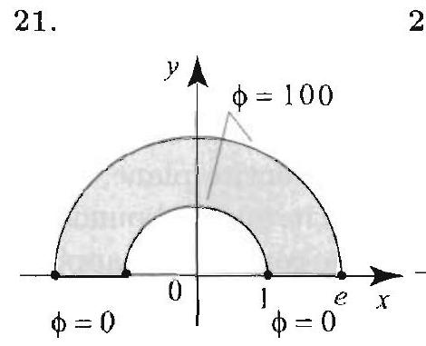

Figure 21

Right margin note (page 63)

673
ethod
2
$x$
$x$
$y$ the
with
actor
d the
tion.)
nplex

T's. and real
$U \circ f$. ugate:
on in

++++

Section 12.6 Solving Dirichlet Problems with Conformal Mappings

In Exercises 21-24 (Figures 21-24), solve the Dirichlet problem using the $m$ of Example 4.
22.

Figure 22
23.

Figure 23
24.

Figure 24
25. Translation. Let $z_{0}=a_{0}+i b_{0}$ be a given complex number. Explain wh mapping $f(z)=z+z_{0}$ is a translation by the vector $\left(a_{0}, b_{0}\right)$.
26. Rotation and dilation. Let $z_{0}=r e^{i \theta_{0}}$ be a given complex number $r=\left|z_{0}\right| \neq 0$. Explain why the mapping $f(z)=z_{0} \cdot z$ is a dilation by a $\left|z_{0}\right|$, followed by a rotation by an angle $\theta_{0}$. (The order of the dilation an rotation does not matter: You can apply the rotation first. and then the rota [Hint: What does multiplication do to the moduli and arguments of two con numbers?]
27. If $f(z)$ is a rotation by an angle $\alpha$, what is a formula for $f(z)$ ?
28. Describe the mapping $f(z)=\alpha z+\beta$, where $\alpha$ and $\beta$ are complex numbe

In Exercises 29-36, let $S$ be the square with vertices at $1-i, 1+i .-1+i -1-i$, and let $C$ be the unit circle, centered at the origin.
29. Describe the image of $S$ by the mapping $f(z)=z+1-i$.
30. Describe the image of $S$ by the mapping $f(z)=z-2-3 i$.
31. Describe the image of $S$ by the mapping $f(z)=i z$.
32. Describe the image of $S$ by the mapping $f(z)=i z+1+i$.
33. Describe the image of $S$ by the mapping $f(z)=e^{i \frac{\pi}{4}} z+1$.
34. Describe the image of $S$ by the mapping $f(z)=e^{-i \frac{\pi}{4}} z-1-i$.
35. Describe the image of $C$ by the mapping $f(z)=3 e^{i \alpha} z+1$, where $\alpha$ is number.
36. Describe the image of $C$ by the mapping $f(z)=3 e^{i \frac{\pi}{4}} z-1-i$.
37. Suppose that $f: \Omega \longrightarrow \Omega^{\prime}$ is analytic, $U$ is harmonic on $\Omega^{\prime}$, and let $\phi=$ Let $V$ be a harmonic conjugate of $U$. Show that $\psi^{\prime}=V \circ f$ is a harmonic conj of $\phi$.
38. Using the result of Exercise 37, find a harmonic conjugate of the soluti Example 3, then determine the equation of the curves of heat flow.

---

<!-- Page 64 -->

Left margin note (page 64)

674
Chapter 12
12.7 Green

Figure 1 Because belongs to the unit is on $\Gamma$, we have $\mid \phi($ for $z$ on $\Gamma$. More $\phi$ is one-to-one, $z_{0}$ complex number i that $\phi\left(z, z_{0}\right)=0$.

THEC
CONF
MA
FORMUI
GREEN'S FUN

Right margin note (page 64)

simply disk or regions e). Wi ne unit , with undary apping 0) $=0$
n of $x$, ion.
dary $\Gamma$. nformal
rties of perties m until
|. The se only rmonic $\left(z, z_{0}\right) \mid$ rem 3,

++++

Green's Functions and Conformal Mappings

's Functions and Conformal Mappings
In this section we present useful formulas for Green's function on a connected region $\Omega$ in terms of conformal mappings of $\Omega$ onto the unit the upper half-plane. We then calculate these formulas explicitely for such as disks, half-planes, sectors, and strips (semi-infinite and infinit begin by setting the notation: $D$ denotes the open unit disk, $C$ tl circle, and $\Omega$ a simply connected region other than the entire plan boundary $\Gamma$. Thus $\Omega$ is open, connected, with no holes in it, and its bo is nonempty. For $z_{0}$ in $\Omega$, let $\phi\left(z, z_{0}\right)$ denote a one-to-one conformal m of $\Omega$ onto $D$, such that $\phi$ maps the boundary $\Gamma$ into $C$ and $\phi\left(z_{0}, z\right.$ (Figure 1). Thus
$$
\left|\phi\left(z, z_{0}\right)\right|=1 \text { for all } z \text { on } \Gamma \text {. }
$$

Write $z=x+i y$ and $z_{0}=x_{0}+i y_{0}$, and think of $\phi\left(z, z_{0}\right)$ as a functio $y, x_{0}$, and $y_{0}$, in the obvious way. Here is the main result of the sect

REM 1 ORMAL PPING A FOR CTION

Suppose that $\Omega$ is a simply connected region with (nonempty) boun Let $z=x+i y$ and $z_{0}=x_{0}+i y_{0}$ be in $\Omega$, and let $\phi\left(z, z_{0}\right)$ be the co mapping as described above. Then the Green's function on $\Omega$ is
$$
G\left(x, y, x_{0}, y_{0}\right)=\ln \left|\phi\left(z, z_{0}\right)\right| .
$$

It is instructive at this point to verify some of the characteristic prope Green's function that we stated in Theorem 3, Section 12.3, using pro of the conformal mapping $\phi$. We postpone the full proof of the theore the end of this section.
- The function $\ln \left|\phi\left(z, z_{0}\right)\right|$ is the composition of $\phi\left(z, z_{0}\right)$ and $\ln \mid$ function $\phi$ is analytic on $\Omega$ and is nonzero for all $z \neq z_{0}$, becau $z_{0}$ is mapped to 0 in $D$. The function $\ln |z|=\frac{1}{2} \ln \left(x^{2}+y^{2}\right)$ is ha for all $z \neq 0$. Consequently, by Theorem 1, Section 12.6, $\ln \mid \phi$ is harmonic for all $z \neq z_{0}$ in $\Omega$. Thus property (i) of Theo Section 12.3, is verified.

---

<!-- Page 65 -->

Right margin note (page 65)

675

e, for perty
and em 3,
soon
f this
pping ly see
D.
ed by that plane alytic nique
con-Comexists e take
itself. poses mplify
tion. tional The

++++

Section 12.7 Green's Functions and Conformal Mappings
- Recall that $\phi\left(z, z_{0}\right)$ belongs to the unit circle $C$ if $z$ is on $\Gamma$; hend $z$ on $\Gamma,\left|\phi\left(z, z_{0}\right)\right|=1$, and so $\ln \left|\phi\left(z, z_{0}\right)\right|=\ln 1=0$. Thus pro (ii) of Theorem 3, Section 12.3, is verified.
- Recall that $\phi\left(z, z_{0}\right)$ belongs to $D$, for all $z$ in $\Omega$. So $\left|\phi\left(z, z_{0}\right)\right| \leq$ so $\ln \left|\phi\left(z, z_{0}\right)\right| \leq 0$, for all $z$ in $\Omega$. Thus property (iii) of Theor Section 12.3, is verified.
- The symmetry property of $\phi\left(z, z_{0}\right)$ will become more evident as as we investigate the conformal mapping $\phi$ (see Theorem 3 o section).

We make a few additional points regarding Theorem 1.
- According to Theorem 1, we have to construct a conformal ma of $\Omega$ onto $D$ for each $z_{0}$ in $\Omega$. While this is true, you will short that in fact all we need is just one conformal mapping of $\Omega$ ontc
- The existence of a conformal mapping of $\Omega$ onto $D$ is guarante a famous theorem, called the Riemann mapping theorem, states that if $\Omega$ is any simply connected region in the complex other than the complex plane itself, then there is a one-to-one an function $f$ that maps $\Omega$ onto the unit disk $D$. The mapping $f$ is u if we specify that $f\left(z_{0}\right)=0$ and $f^{\prime}\left(z_{0}\right)>0$, for some $z_{0}$ in $\Omega$.
- While the Riemann mapping theorem does not tells us how to struct the conformal mapping, it does guarantee its existence. bining this with Theorem 1, we conclude that Green's function on any simply connected region. (When $\Omega$ is the entire plane, w $G\left(z, z_{0}\right)=\ln \left|z-z_{0}\right|$.)

Next, we describe all the conformal mappings of the unit disk onto In addition to being interesting in its own right, this result has two pur for us: We will use it to rederive Green's function on the disk and to sin the construction of the conformal mapping in Theorem 1.
Linear Fractional Transformations
Let $a, b, c$, and $d$ be complex numbers with $a d-b c \neq 0$. The function
$$
f(z)=\frac{a z+b}{c z+d}
$$
is called a linear fractional transformation or Möbius transforma If $c=0, f$ is a linear function and hence it is entire. If $c \neq 0, f(z)$ is a ra function. It is analytic for all $z \neq-\frac{d}{c}$, where the denominator vanishes following properties are straightforward to check.

---

<!-- Page 66 -->

Left margin note (page 66)

676
Chapter 12 Green's Fur

PROPOSITION 1 LINEAR
FRACTIONAL TRANSFORMATIONS

THEOREM 2
CONFORMAL MAPPINGS OF THE DISK ONTO ITSELF

Right margin note (page 66)

nother
ar frac-
i). We
has an
trans-
linear
e. It is
which mplex es with

++++

ections and Conformal Mappings
(i) A linear fractional transformation is one-to-one.
(ii) The composition of any two linear fractional transformations is a linear fractional transformation.
(iii) The inverse of the linear fractional transformation (3) is the line: tional transformation
$$
f^{-1}(z)=\frac{d z-b}{-c z+a}
$$

Proof We prove (i) and (iii) and leave (ii) as an exercise. We start with (ii have to check that $f \circ f^{-1}(z)=f^{-1} \circ f(z)=z$. We have
$$
\begin{aligned}
f^{-1} \circ f(z) & =\frac{d f(z)-b}{-c f(z)+a}=\frac{\frac{a d z+b d}{c z+d}-b}{\frac{-a c z-b c}{c z+d}+a} \\
& =\frac{a d z+b d-b(c z+d)}{-a c z-b c+a(c z+d)}=z .
\end{aligned}
$$

Similarly, we have $f \circ f^{-1}(z)=z$. To prove (i), we use the fact that $f$ inverse. Indeed $f\left(z_{1}\right)=f\left(z_{2}\right) \Rightarrow f^{-1} \circ f\left(z_{1}\right)=f^{-1} \circ f\left(z_{2}\right) \Rightarrow z_{1}=z_{2}$.

The next theorem deals with a particular family of linear fractional formations.

Let $z_{0}$ be a complex number in $D$ (thus $\left.z_{0} \mid<1\right)$. Consider the fractional transformation
$$
f_{z_{0}}(z)=\frac{z-z_{0}}{1-\overline{z_{0}} z} .
$$

Then (i) $f_{z_{0}}$ is analytic on $D$;
(ii) $f_{z_{0}}$ maps $D$ one-to-one onto $D$;
(iii) $f_{z_{0}}$ maps the unit circle onto the unit circle;
(iv) $f_{z_{0}}\left(z_{0}\right)=0$.

Proof Part (iv) is clear. From Proposition 1, we know that $f_{z_{0}}$ is one-to-on also analytic for all $z \neq \frac{1}{z_{0}}$. But
$$
\left|\frac{1}{\overline{z_{0}}}\right|=\frac{1}{\left|\overline{z_{0}}\right|}=\frac{1}{\left|z_{0}\right|}>1,
$$
because $\left|z_{0}\right|<1$. So the point where $f_{z_{0}}$ is not analytic, $\left(\overline{z_{0}}\right)^{-1}$, is not in $D$, proves (i). Parts (ii) and (iii) are more interesting. For (iii), let $\varepsilon^{i f}$ denote a ca number with modulus 1 . We want to show that $\left|f_{z_{0}}\left(e^{i \theta}\right)\right|=1$. We use trich the absolute value and complex conjugation:
$$
\begin{aligned}
\left|f_{z_{0}}\left(e^{i \theta}\right)\right| & =\frac{\left|e^{i \theta}-z_{0}\right|}{\left|1-\overline{z_{0}} e^{i \theta}\right|}=\frac{\left|e^{i \theta}-z_{0}\right|}{\left|e^{i \theta}\left(e^{-i \theta}-\overline{z_{0}}\right)\right|}=\frac{\left|e^{i \theta}-z_{0}\right|}{\left|e^{i \theta}\right| \cdot\left|e^{-i \theta}-\overline{z_{0}}\right|} \\
& =\frac{\left|e^{i \theta}-z_{0}\right|}{\left|e^{-i \theta}-\overline{z_{0}}\right|}=\frac{\left|e^{i \theta}-z_{0}\right|}{\left|\overline{e^{i \theta}-z_{0}}\right|}=\frac{\left|e^{i \theta}-z_{0}\right|}{\left|e^{i \theta}-z_{0}\right|}=1
\end{aligned}
$$

---

<!-- Page 67 -->

Left margin note (page 67)

ΥΟᲰ VTAWYOA ONIddVW TVWYOANOO ξ ΝυξΟΥΉ

Right margin note (page 67)

677

le, by
stant onto erizes nbine
ormal reen's
$x+i y$
of the nula.
ndary
к. Let

Thco-
where ed by a one-to-one pping and so
mple, pping for $\Omega$. or the a rewith

++++

Section 12.7 Green's Functions and Conformal Mappings

To prove (ii), we note that $f_{z_{0}}[D]$ is a region whose boundary is the unit circ (iii). Since $f_{z_{0}}\left(z_{0}\right)=0$, we conclude that this region is $D$.

Using properties of analytic functions, it can be shown that, up to a con factor of modulus 1 , any one-to-one conformal mapping of the unit disk itself is of the form (5) (see [1], Section 6.2). Thus Theorem 2 charact all the conformal mappings of the unit disk onto itself. We now cor Theorems 1 and 2 to obtain the Green's function for the unit disk.

EXAMPLE 1 Green's function for the unit disk
Let $z$ and $z_{0}$ be in $D$. By Theorem 2, $f_{z_{0}}(z)=\frac{z-z_{0}}{1-\overline{z_{0}} z}$ is a one-to-one conf mapping of the unit disk onto itself that maps $z_{0}$ to 0 . By Theorem 1 G function for the unit disk is
$$
G\left(z, z_{0}\right)=\ln \left|\frac{z-z_{0}}{1-\overline{z_{0}} z}\right| .
$$

To compare with the formula that we found in Section 12.4, substitute $z=$. and $z_{0}=x_{0}+i y_{0}$ (Exercise 13).

Our second application of Theorem 2 is to simplify the construction mappings in Theorem 1. We have the following version of Green's for

Suppose that $\Omega$ is a simply connected region with (nonempty) bou $\Gamma$. Let $\phi$ be a one-to-one conformal mapping of $\Omega$ onto the unit disl $z=x+i y$ and $z_{0}=x_{0}+i y_{0}$ be in $\Omega$. Then Green's function for $\Omega$ is
$$
G\left(x, y, x_{0}, y_{0}\right)=\ln \left|\frac{\phi(z)-\phi\left(z_{0}\right)}{1-\overline{\phi\left(z_{0}\right)} \phi(z)}\right|
$$

It is immediate from (7) that Green's function is symmetric ( rem $3(\mathrm{v})$. Section 12.3 ); that is, $G\left(z, z_{0}\right)=G\left(z_{0}, z\right)$.
Proof Note that the function inside the absolute value in (7) is $f_{\phi\left(z_{0}\right)} \circ \phi(z)$, $f_{\phi\left(z_{0}\right)}$ is a linear fractional transformation of the form (5), with $z_{0}$ replac $\phi\left(z_{0}\right)$. Since $\phi$ is a one-to-one conformal mapping of $\Omega$ onto $D$ and $f_{\phi\left(z_{0}\right)}$ is to-one conformal mapping of $D$ onto $D$. it follows that $f_{\phi\left(z_{0}\right)} \circ \phi(z)$ is a oneconformal mapping of $\Omega$ onto $D$. Clearly, $f_{\phi\left(z_{0}\right)} \circ \phi\left(z_{0}\right)=0$; hence the ma $f_{\phi\left(z_{0}\right)} \circ \phi(z)$ has all the properties of the mapping $\phi\left(z, z_{0}\right)$ in Theorem 1 , Theorem 3 follows now from Theorem 1.

From this point, the scope of the applications is unlimited. For exa given a simply connected region $\Omega$, (a) find a one-to-one conformal ma of $\Omega$ onto the unit $D$. (b) Use Theorem 3 to get the Green's function (c) Use results, such as the ones of Section 12.3, to derive formulas fo solutions of Dirichlet problems and Poisson equations on $\Omega$.

Our examples in Section 12.6 involved conformal mappings from gion $\Omega$ onto the upper half-plane. To be able to use these examples

---

<!-- Page 68 -->

Left margin note (page 68)

678

Chapter 12 Green's Fun

Right margin note (page 68)

-plane ormal
tional
ne im-
nother
cients cients
e way mapuse an maptional
it disk
axis. points ints on
and so lary $C$ disk is oint in to the

++++

ctions and Conformal Mappings

Theorem 3, we now describe a conformal mapping of the upper half onto the unit disk. Then by composing mappings, we obtain a conf mapping of the region $\Omega$ onto the unit disk.

To construct the desired conformal mapping, we use a linear frac transformation and the following properties:
- A linear fractional transformation is uniquely determined by tl ages of three points.
- The image of a circle by a linear fractional transformation is an circle or a line, and the image of a line is also a circle or a line.

The first property follows because we may assume that one of the coeff in the linear fractional transformation is 1 . Then the other three coeff are uniquely determined by three equations with three unknowns. On to prove the second property is to verify it first in the case of a linear ping. Next, verify it for the inversion mapping, $f(z)=\frac{1}{z}$. Then beca arbitrary linear fractional transformation is the composition of linear pings and inversions, it follows that the property holds for lincar frac transformations.

EXAMPLE 2 Mappings between the upper half-plane and the un
(a) Show that the linear fractional transformation
$$
\phi(z)=i \frac{1-z}{1+z}
$$
maps the unit disk onto the upper half-plane.
(b) Show that the linear fractional transformation
$$
\psi(z)=\frac{i-z}{i+z}
$$
maps the upper half-plane onto the unit disk.
Solution (a) Our goal is to show that the unit circle $C$ is mapped to the re Because the image of a circle is either a line or a circle and because three determine either a line or a circle, it suffices to check the images of three po the unit circle. We have
$$
\phi(1)=0 ; \quad \phi(i)=i \frac{1-i}{1+i}=1 ; \quad \phi(-i)=i \frac{1+i}{1-i}=-1 .
$$

Thus $\phi(1), \phi(i)$, and $\phi(-i)$ lie on the $u$-axis (the real axis in the $u$-planc), the image of $C$ is the $u$-axis. Because $\phi$ is one-to-one, it maps the boun onto the boundary of the image of the unit disk. 'Thus the image of the unit either the upper half-plane or the lower half-plane. Checking $\phi(0)=i$ (a p the upper half-plane), we conclude that $\phi$ maps the unit disk one-to-one on upper half-plane (see Figure 2).

---

<!-- Page 69 -->

Left margin note (page 69)

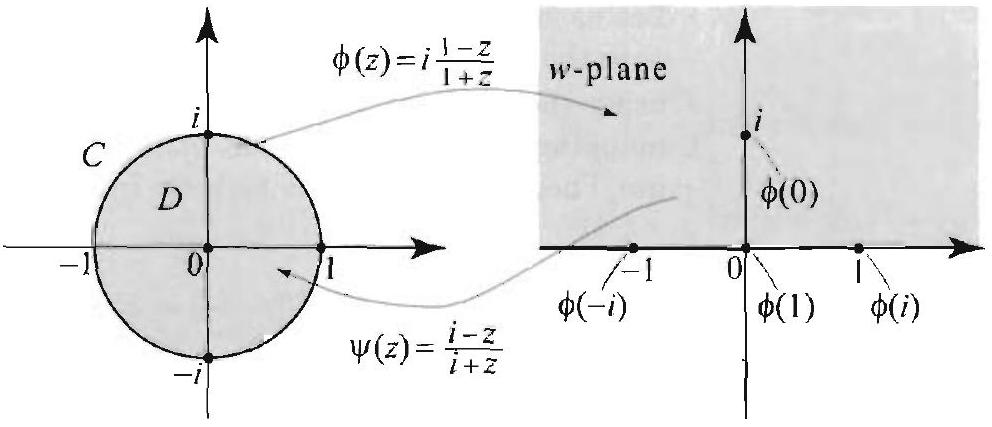

Figure 2 Onc-to one conformal mappings between the unit disk and the upper halfplane.

Right margin note (page 69)

679
1(iii)
of the
$=1$,
1. We
oints
that
plane
the od of

pper
$$
\mid)
$$

++++

Section 12.7 Green's Functions and Confornal Mappings
(b) We can do this part in at least two ways. One way is to use Proposition and notice that $\psi$ is the inverse of $\phi$. Another way is to check the image by $\psi c$ boundary and one interior point. We leave it as an exercise to verify that $\psi(0) \psi(1)=i$, and $\psi(-1)=-i$. Since the images of the three points are not collinea conclude that the real axis is mapped onto the circle that goes through the p $1, i$, and $-i$, which is clearly the unit circle. (Here again, we are using the fact three points determine a circle.) Also, $n(i)=0$; hence $i$ maps the upper halfonto the unit disk.

Example 2(b) and Theorem 3 combine to give us Green's function fo upper half-plane. The formula was derived in Section 12.4 by the methe images.

EXAMPLE 3 Green's function for the upper half-plane
Let $z_{2}$ and $z_{0}$ be in the upper half-plane. Then Green's function for the 1 half-plane is
$$
G\left(\therefore z_{0}\right)=\ln \left|\frac{z-z_{0}}{z-\overline{z_{0}}}\right|=\frac{1}{2} \ln \frac{\left(x-x_{0}\right)^{2}+\left(y-y_{0}\right)^{2}}{\left(x-x_{0}\right)^{2}+\left(y+y_{0}\right)^{2}} .
$$

To derive the formula, we use (7) and the conformal mapping in Example 2(b)
$$
\begin{aligned}
G\left(\hat{c}, z_{0}\right) & =\ln \left|\frac{\frac{i-z}{i+z}-\frac{i-z_{0}}{i+z_{0}}}{1-\overline{\left(\frac{i-z_{0}}{i+z_{0}}\right)} \frac{i-z}{i+z}}\right|=\ln \left|\frac{\frac{(i-z)\left(i+z_{0}\right)-\left(i-z_{0}\right)(i+z)}{(i+z)\left(i+z_{0}\right)}}{1-\frac{-i-\overline{z_{0}}}{-i+\overline{z_{0}}} \frac{i-z}{i+z}}\right| \\
& =\ln \left|\frac{\frac{2 i\left(z_{0}-z\right)}{(i+z)\left(i+z_{0}\right)}}{\frac{2 i\left(\overline{z_{0}}-z\right)}{(i+z)\left(-i+\overline{z_{0}}\right)}}\right|=\ln \left|\frac{z-z_{0}}{z-\overline{z_{0}}} \frac{-i+\overline{z_{0}}}{i+\overline{z_{0}}}\right|=\ln \left(\left.\left|\frac{z-z_{0}}{z-\overline{z_{0}}}\right| \right\rvert\, \frac{-i+\overline{z_{0}}}{i+z_{0}}\right.
\end{aligned}
$$

But $-i+\overline{\epsilon_{0}}$ is the complex conjugate of $i+z_{0}$, so $\left|\frac{-i+\overline{z_{0}}}{i+z_{0}}\right|=1$, and the for follows.

We now add a new Green's function to our list.

---

<!-- Page 70 -->

Left margin note (page 70)

680
Chapter 12 Green's Fun

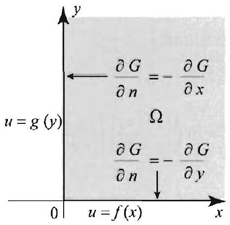

Figure 3 A general Dirichlet problem in the first quadrant.

Right margin note (page 70)

adrant id then formal adrant, 1
ot that revious
J) ${ }^{2}$ )
$\left.\left.y_{0}\right)^{2}\right)$
ral for-
$u(x, y)=$ Show
of the $\left.\frac{\partial G}{\partial y}\right|_{y=0}$.

++++

ctions and Conformal Mappings

EXAMPLE 4 Green's function for the first quadrant
Let us start by constructing a one-to-one conformal mapping of the first qu onto the unit disk by mapping the first quadrant onto the upper half-plane an using the mapping in Example 2(b). Thus $\phi(z)=\frac{i-z^{2}}{i+z^{2}}$ is a one-to-one cor mapping of the first quadrant onto the unit disk. For $z$ and $z_{0}$ in the first qu use Theorem 3 to get the Green's function for the first quadrant in the forn
$$
G\left(z, z_{0}\right)=\ln \left|\frac{\frac{i-\phi(z)}{i+\phi(z)}-\frac{i-\phi\left(z_{0}\right)}{i+\phi\left(z_{0}\right)}}{1-\overline{\left(\frac{i-\phi\left(z_{0}\right)}{i+\phi\left(z_{0}\right)}\right)} \frac{i-\phi(z)}{i+\phi(z)}}\right| .
$$

This is the same expression as what we had in the previous example, exce $z$ and $z_{0}$ are now replaced by $\phi(:)$ and $o\left(z_{0}\right)$. Using the result of the $p$ example, we find:
$$
G\left(z, z_{0}\right)=\ln \left|\frac{\phi(z)-\phi\left(z_{0}\right)}{\phi(z)-\overline{\phi\left(z_{0}\right)}}\right|=\ln \left|\frac{z^{2}-z_{0}^{2}}{z^{2}-\bar{z}_{0}^{2}}\right| .
$$

To express $G$ in terms of $x, y, x_{0}$, and $y_{0}$, we proceed as follows:
$$
\begin{aligned}
G\left(x, y, x_{0}, y_{0}\right)= & \ln \left|\left(z-z_{0}\right)\left(z+z_{0}\right)\right|-\ln \left|\left(z-\overline{z_{0}}\right)\left(z+\overline{z_{0}}\right)\right| \\
= & \ln \left|z-z_{0}\right|+\ln \left|z+z_{0}\right|-\ln \left|z-\overline{z_{0}}\right|-\ln \left|z+\overline{z_{0}}\right| \\
= & \frac{1}{2} \ln \left(\left(x-x_{0}\right)^{2}+\left(y-y_{0}\right)^{2}\right)+\frac{1}{2} \ln \left(\left(x+x_{0}\right)^{2}+\left(y+y_{0}\right.\right. \\
& -\frac{1}{2} \ln \left(\left(x-x_{0}\right)^{2}+\left(y+y_{0}\right)^{2}\right)-\frac{1}{2} \ln \left(\left(x+x_{0}\right)^{2}+(y-\right. \\
= & \frac{1}{2} \ln \frac{\left(\left(x-x_{0}\right)^{2}+\left(y-y_{0}\right)^{2}\right)\left(\left(x+x_{0}\right)^{2}+\left(y+y_{0}\right)^{2}\right)}{\left(\left(x-x_{0}\right)^{2}+\left(y+y_{0}\right)^{2}\right)\left(\left(x+x_{0}\right)^{2}+\left(y-y_{0}\right)^{2}\right)} .
\end{aligned}
$$

In the following example, we use Green's function to derive a Poisson integ mula for the first quadrant.

EXAMPLE 5 Poisson integral formula for the first quadrant
Consider the Dirichlet problem in the first quadrant $\Omega$, shown in Figure 3: $\nabla^{2}$ 0 for all $(x, y)$ in $\Omega ; u(x, 0)=f(x)$ for all $x>0, u(0, y)=g(y)$ for all $y>0$ that the solution is given by the Poisson integral formula:
$$
\begin{aligned}
u(x, y)= & \frac{y}{\pi} \int_{0}^{\infty} f(s)\left(\frac{1}{(x-s)^{2}+y^{2}}-\frac{1}{(x+s)^{2}+y^{2}}\right) d s \\
& +\frac{x}{\pi} \int_{0}^{\infty} g(t)\left(\frac{1}{x^{2}+(y-t)^{2}}-\frac{1}{x^{2}+(y+t)^{2}}\right) d t
\end{aligned}
$$

Solution According to Theorem 2, Section 12.3,
$$
u\left(x_{0}, y_{0}\right)=\frac{1}{2 \pi} \int_{\Gamma} u(x, y) \frac{\partial G}{\partial \pi}\left(x, y, x_{0}, y_{0}\right) d s
$$
where $G$ is the Green's function for the first quadrant, and $\Gamma$ is the boundar first quadrant. On the nonnegative $x$-axis, we have $d s=d x$ and $\frac{\partial G}{\partial n}=-s$

---

<!-- Page 71 -->

Left margin note (page 71)

THEOREM 4 CONFORMAL MAPPING FORMULA FOR GREEN'S FUNCTION

Right margin note (page 71)

681

plicit
$$
y_{0}^{2}
$$
to a
n be on on ary $\Gamma$. plane.
$$
\geq 0\} .
$$
upper action

++++

Section 12.7 Green's Functions and Conformal Mappings

On the nonnegative $y$-axis, we have $d s=d y$ and $\frac{\partial G}{\partial n}=-\left.\frac{\partial G}{\partial x}\right|_{x=0}$. Using the ex formula for $G$ from Example 4, we compute:
$$
\begin{aligned}
-\frac{\partial G}{\partial y}= & \frac{\partial}{\partial y}\left[-\frac{1}{2} \ln \left(\left(x-x_{0}\right)^{2}+\left(y-y_{0}\right)^{2}\right)-\frac{1}{2} \ln \left(\left(x+x_{0}\right)^{2}+\left(y+y_{0}\right)^{2}\right)\right. \\
& +\frac{\partial}{\partial y}\left[\frac{1}{2} \ln \left(\left(x-x_{0}\right)^{2}+\left(y+y_{0}\right)^{2}\right)+\frac{1}{2} \ln \left(\left(x+x_{0}\right)^{2}+\left(y-y_{0}\right)^{2}\right)\right. \\
= & -\frac{y-y_{0}}{\left(x-x_{0}\right)^{2}+\left(y-y_{0}\right)^{2}}-\frac{y+y_{0}}{\left(x+x_{0}\right)^{2}+\left(y+y_{0}\right)^{2}} \\
& +\frac{y+y_{0}}{\left(x-x_{0}\right)^{2}+\left(y+y_{0}\right)^{2}}+\frac{y-y_{0}}{\left(x+x_{0}\right)^{2}+\left(y-y_{0}\right)^{2}} .
\end{aligned}
$$

Setting $y=0$, we find that on the $x$-axis
$$
\begin{aligned}
\frac{\partial G}{\partial n} & =\frac{y_{0}}{\left(x-x_{0}\right)^{2}+y^{2}}-\frac{y_{0}}{\left(x+x_{0}\right)^{2}+y_{0}^{2}}+\frac{y_{0}}{\left(x-x_{0}\right)^{2}+y_{0}^{2}}-\frac{y_{0}}{\left(x+x_{0}\right)^{2}+} \\
& =\frac{2 y_{0}}{\left(x-x_{0}\right)^{2}+y^{2}}-\frac{2 y_{0}}{\left(x+x_{0}\right)^{2}+y_{0}^{2}} .
\end{aligned}
$$

In a similar way, we find that on the $y$-axis
$$
\frac{\partial G}{\partial n}=\frac{2 x_{0}}{x_{0}^{2}+\left(y-y_{0}\right)^{2}}-\frac{2 x_{0}}{x_{0}^{2}+\left(y+y_{0}\right)^{2}} .
$$

Substituting into (11), we obtain the desired Poisson integral formula (up relabeling of the variables).

The steps that we took to go from (9) to (10) in Example 4 ca applied with any conformal mapping. This yields the following variatic Theorem 3, which may be more useful in computations.

Suppose that $\Omega$ is a simply connected region with (nonempty) bounda Let $\phi$ be a one-to-one conformal mapping of $\Omega$ onto the upper halftaking $\Gamma$ into the real line. Then Green's function for $\Omega$ is
$$
G\left(x, y, x_{0}, y_{0}\right)=\ln \left|\frac{\phi(z)-\phi\left(z_{0}\right)}{\phi(z)-\overline{\phi\left(z_{0}\right)}}\right|
$$
where $z=x+i y$ and $z_{0}=x_{0}+i y_{0}$ are in $\Omega$.
Here is an interesting application.

EXAMPLE 6 Green's function for a semi-infinite vertical strip
Let $\Omega$ be the semi-infinite vertical strip $\left\{z=x+i y:-\frac{\pi}{2} \leq x \leq \frac{\pi}{2}, y\right.$ The function $\phi(z)=\sin z$ is a one-to-one conformal mapping of $\Omega$ onto the half-plane. (See Example 3, Section 12.6.) Thus by Theorem 4, Green's fur for $\Omega$ is
$$
G\left(z, z_{0}\right)=\ln \left|\frac{\sin z-\sin z_{0}}{\sin z-\overline{\sin z_{0}}}\right|=\ln \left|\sin z-\sin z_{0}\right|-\ln \left|\sin z-\overline{\sin z_{0}}\right| .
$$

---

<!-- Page 72 -->

Left margin note (page 72)

682
Chapter 12 Green's Fun

THEOREM 5
COMPOSITION OF
GREEN'S
FUNCTIONS AND CONFORMAL MAPPINGS

Right margin note (page 72)

n terms
yreen's formal orem 1
iempty) ne con${ }^{\prime}$. Let for $\Omega^{\prime}$.
in the denote -plane,
e proof needed. nempty) e-to-one unction hat the $s$ on the on 12.3,
$\left.z, z_{0}\right)$, analytic t at $z_{0}$. isolated ularity. on 4.6). i in $\Omega$ ), ear that o,

$z_{0}$

++++

ctions and Conformal Mappings

To express $G$ in terms of $x, y, x_{0}$, and $y_{0}$, you can use the formula for $\sin z \mathrm{i}$ of these variables. We leave the details to the exercises.

The following theorem describes yet another way to construct new ( functions by composing known Green's functions with one-to-one cor mappings. The proof of the theorem is very much like the proof of The and will be left to the exercises.

Suppose that $\Omega$ and $\Omega^{\prime}$ are simply connected regions with (non boundaries $\Gamma$ and $\Gamma^{\prime}$, respectively. Suppose that $\phi$ is a one-to-o formal mapping of $\Omega$ onto $\Omega^{\prime}$, such that $\phi[\Gamma]$ is contained in $\Gamma g\left(x, y, x_{0}, y_{0}\right)=g\left(x+i y, x_{0}+i y_{0}\right)$ denote the Green's function Then Green's function for $\Omega$ is
$$
G\left(x, y, x_{0}, y_{0}\right)=g\left(\phi(x+i y), \phi\left(x_{0}+i y_{0}\right)\right) .
$$

As an illustration, write Green's function for the upper half-plane form $g\left(x, y, x_{0}, y_{0}\right)=\ln \left|z-z_{0}\right|-\ln \left|z-\bar{z}_{0}\right|$ (Example 3). Let $\phi(z)$ a one-to-one conformal mapping of a region $\Omega$ onto the upper half taking $\Gamma$ into the real line. Then Green's function for $\Omega$ is
$$
G\left(x, y, x_{0}, y_{0}\right)=\ln \left|\phi(z)-\phi\left(z_{0}\right)\right|-\ln \left|\phi(z)-\overline{\phi\left(z_{0}\right)}\right|
$$
which is the formula in Theorem 4.
We close this section by completing the proof of Theorem 1. The requires some properties of analytic functions that are recalled where r
Proof of Theorem 1. Suppose that $\Omega$ is a simply connected region with (no boundary $\Gamma . z=x+i y$ and $z_{0}=x_{0}+i y_{0}$ are in $\Omega$, and $\phi\left(z, z_{0}\right)$ is a one conformal mapping of $\Omega$ onto the unit disk. We want to show that Green's $f$ for $\Omega$ is given by (2): $G\left(z, z_{0}\right)=\ln \left|\phi\left(z, z_{0}\right)\right|$. We have already proved t function $\ln \left|\omega\left(z, z_{0}\right)\right|$ is harmonic on $\Omega$, except at $z=z_{0}$, and that it vanishe boundary of $\Omega$. To prove that it is the Green's function for $\Omega$, by (2), Secti we must show that, for $z \neq z_{0}$,
$$
\ln \left|\phi\left(z, z_{0}\right)\right|=\frac{1}{2} \ln \left(\left(x-x_{0}\right)^{2}+\left(y-y_{0}\right)^{2}\right)+h\left(z, z_{0}\right)=\ln \left|z-z_{0}\right|+h(
$$
where $h$ is harmonic for all $z$ in $\Omega$. We need the following fact about functions. Suppose that $f(z)$ is analytic in a disk containing $z_{0}$, but no Then $z_{0}$ is called an isolated singularity. It is a fact that if $z_{0}$ is an singularity and $\lim _{z \rightarrow z_{0}} f(z)=A$ exists, then $z_{0}$ is a removable sing That is, if we define $f\left(z_{0}\right)=A$, then $f$ becomes analytic at $z_{0}$ (see [1], Secti With this property in mind. consider the function $f(z)=\frac{\phi\left(z, z_{0}\right)}{z-z_{0}}\left(z \neq z_{0}\right.$ where, as in Theorem 1. $\phi\left(z, z_{0}\right)$ is analytic on $\Omega$ and $\phi\left(z_{0}, z_{0}\right)=0$. It is cle $f$ is analytic on $\Omega$ except at $z_{0}$. Thus $z_{0}$ is an isolated singularity of $f$. Als
$$
\lim _{z \cdot z_{0}} f(z)=\lim _{z \rightarrow z_{0}} \frac{\phi\left(z, z_{0}\right)}{z-z_{0}}=\lim _{z \rightarrow z_{0}} \frac{\phi\left(z, z_{0}\right)-\overbrace{\phi\left(z_{0}, z_{0}\right)}^{=0}}{z-z_{0}}=\left.\frac{d}{d z} \phi\left(z, z_{0}\right)\right|_{z=}
$$

---

<!-- Page 73 -->

Left margin note (page 73)

Figure 4 A general Dirichlet problem on a horizontal strip (Exercises 9 and 10).

Right margin note (page 73)

683
Define
for
at $\phi$ is
$\neq 0$.
12.6,
nction
20)|.

0 and 0 and on the trary. m on y 1 that ple 6. action

++++

Section 12.7 Green's Functions and Conformal Mappings

by definition of the derivative. Hence $z_{0}$ is a removable singularity of $f(z)$.
$$
f(z)=\left\{\begin{array}{ll}
\frac{\phi\left(z, z_{0}\right)}{z-z_{0}} & \text { if } z \neq z_{0} \\
\left.\phi^{\prime}\left(z, z_{0}\right)\right|_{z=z_{0}} & \text { if } z=z_{0}
\end{array}\right.
$$

Then $f$ is analytic on $\Omega$. Also, $f(z) \neq 0$ for all $z$ in $\Omega$. This last assertion is cle $z \neq z_{0}$, since $\phi$ is one-to-one and $\phi\left(z_{0}, z_{0}\right)=0$. For $z=z_{0}$, we use the fact th one-to-one to infer that $\phi^{\prime}\left(z, z_{0}\right) \neq 0$ for all $z$ in $\Omega$; in particular, $\left.\phi^{\prime}\left(z, z_{0}\right)\right|_{z=z}$ Now, set $h\left(z, z_{0}\right)=\ln |f(z)|$. Then $h$ is harmonic on $\Omega$, by Theorem 1, Section because it is the composition of the analytic function $f$ and the harmonic fu $\ln |z|(z \neq 0)$. For $z \neq z_{0}$, using the definition of $f(z)$, we see that
$$
\begin{aligned}
\ln \left|z-z_{0}\right|+h\left(z, z_{0}\right) & =\ln \left|z-z_{0}\right|+\ln |f(z)| \\
& \left.=\ln \left|z-z_{0}\right|+\ln \left|\phi\left(z, z_{0}\right)\right|-\ln \mid z-z_{0}\right)|=\ln | \phi(z,
\end{aligned}
$$

Thus (15) holds.
Exercises 12.7
In Erercises $1-\gamma$, find Green's function for the region $\Omega$.
1. $\Omega$ is the open disk of radius 1 and center at $(1,0)$.
2. $\Omega$ is the open disk of radius 2 and center at $(4,4)$.
3. $\Omega$ is the half-plane above the line $y=x$.
4. $\Omega$ is the half-plane to the right of the line $x=1$.
5. $\Omega$ is the infinite horizontal strip bounded by the lines $y=0$ and $y=\pi$.
6. $\Omega$ is the infinite horizontal strip bounded by the lines $y=0$ and $y=\frac{\pi}{2}$.
7. $\Omega$ is the infinite sector bounded by the rays through the origin at angles $\frac{\pi}{4}$.
8. $\Omega$ is the infinite sector bounded by the rays through the origin at angles $\frac{3 \pi}{4}$.
9. Derive a Poisson integral formula that solves the Dirichlet problem c horizontal strip in Figure 4 for the case when $f(x)=0$ and $g(x)$ is arbi
10. Derive a Poisson integral formula that solves the Dirichlet proble the horizontal strip in Figure 4 when both $f(x)$ and $g(x)$ are arbitrar,
11. Solve the Dirichlet problem in the first quadrant in Figure 3, giver $f(x)=x$ if $0<x<1$ and 0 otherwise, and $g(y)=0$ for all $y>0$.
12. Derive a Poisson integral formula for the semi-infinite strip in Exam
13. Show that the formula that we found in Example 1 for Green's fur for a disk is identical with the formula that we have in Section 12.4.
14. Study the proof of Theorem 1 and then prove Theorem 5.

---

<!-- Page 74 -->

Left margin note (page 74)

684
Chapter 12
12.8 Neuma

DEFINI?
NEUl
FUNC

Right margin note (page 74)

oblem
annot

ent of $\leq b)$,
tegral is to ig the , that n (see

Neu$\Omega$ is a $\left.x_{0}, y_{0}\right)$
$\left.x_{0}, y_{0}\right) \left.y_{0}\right)+$ ( $x, y$ )
lenote $\left.z_{0}\right)= z, z_{0}$ ). like a $-z_{0} \mid$. of the ndary must

++++

Green's Functions and Conformal Mappings

nn Functions and the Solution of Neumann Problems
We use the methods of the previous sections to solve the Neumann pro on a simply connected region $\Omega$, other than the entire plane:
$$
\begin{aligned}
\nabla^{2} u(x, y) & =0 \text { for all }(x, y) \text { in } \Omega \\
\frac{\partial u}{\partial n}(x, y) & =f(x, y) \text { for all }(x, y) \text { on the boundary } \Gamma .
\end{aligned}
$$

We know from Example 5, Section 12.1. that the boundary function $f$ c be arbitrary; it has to satisfy the compatibility condition
$$
\int_{\Gamma} f(x, y) d s=0
$$

Let us recall the meaning of the symbol $d s$, which stands for the elem arc length. If we parametrize the boundary $\Gamma$ by $(x(t), y(t))(a \leq t$ then
$$
\int_{\Gamma} f(x, y) d s=\int_{a}^{b} f(x(t), y(t)) \sqrt{\left[x^{\prime}(t)\right]^{2}+\left[y^{\prime}(t)\right]^{2}} d t
$$

Just as we expressed the solution of the Dirichlet problem as a line in involving the boundary function and Green's function, our goal here express the solution of the Neumann problem as a line integral involvin boundary function and a fixed function, known as a Neumann function depends only on the region. Motivated by properties of Green's functio Theorem 3, Section 12.3), we make the following definition.

TION 1
MANN TIONS

Suppose that $\Omega$ is a simply connected region with boundary $\Gamma$. A mann function $N\left(x, y, x_{0}, y_{0}\right)\left((x, y),\left(x_{0}, y_{0}\right)\right.$ in $\left.\Omega\right)$ for the region function with the following properties:
(i) for each $(x, y)$ in $\Omega, N\left(x, y, x_{0}, y_{0}\right)$ is harmonic for all $(x, y) \neq($ in $\Omega$;
(ii) $\frac{\partial N}{\partial n}\left(x, y, x_{0}, y_{0}\right)=C$ for all $\left(x_{0}, y_{0}\right)$ in $\Omega$ and $(x, y)$ on $\Gamma$;
(iii) for each $\left(x_{0}, y_{0}\right)$ in $\Omega$, there is a function $u_{1}$ such that $u_{1}(x, y$, is harmonic for all $(x, y)$ in $\Omega$, and $N\left(x, y, x_{0}, y_{0}\right)=v\left(x, y, x_{0}\right.$. $u_{1}\left(x, y, x_{0}, y_{0}\right)=\frac{1}{2} \ln \left(\left(x-x_{0}\right)^{2}+\left(y-y_{0}\right)^{2}\right)+u_{1}\left(x, y, x_{0}, y_{0}\right)$ for all in $\Omega$.
To simplify the notation, we will write $z=x+i y, z_{0}=x_{0}+i y_{0}$, and a function of $\left(x, y, x_{0}, y_{0}\right)$ by a function of $z$ and $z_{0}$; for example, $v(z$, $\frac{1}{2} \ln \left(\left(x-x_{0}\right)^{2}+\left(y-y_{0}\right)^{2}\right)=\ln \left|z-z_{0}\right|$, and $N\left(x, y, x_{0}, y_{0}\right)=N($ With this notation, parts (i) and (iii) state that a Neumann function, Green's function, is harmonic on $\Omega$, except at $z_{0}$, due to the term $\ln \mid z$ Part (ii) tells us that the boundary values of the normal derivative Neumann function are constant. This is the counterpart of the bou condition for a Green's function, which states that a Green's function

---

<!-- Page 75 -->

Right margin note (page 75)

685
pends
lue of
hand.
$z_{0} \mid$,
ctions
12.3.
m in Secup to to an nd let $+i y_{0}$ mann

(1) da for
der to i) and ic, by

++++

Section 12.8 Neumann Functions and the Solution of Nemmam Problems

vanish identically on the boundary. As we now show, the constant ( ${ }^{\gamma}$ def on the length of $\Gamma$ and is not 0 in general.

The constant $C$ in Definition 1(ii), which is equal to the boundary va the normal derivative of the Neumann function, is given by
$$
C=\frac{2 \pi}{L},
$$
where $L=\int_{\Gamma} d s$ is the length of $\Gamma$. If $L$ is infinite, we take $C=0$.
Proof For fixed $z_{0}$ in $\Omega$, since $\partial N / \partial n$ is constant on $\Gamma$, we have. on the one
$$
\int_{\Gamma} \frac{\partial}{\partial n} N\left(z, z_{0}\right) d s=\int_{\Gamma} C d s=C L
$$
where $L$ is the length of $\Gamma$. On the other hand. using $N=u_{1}\left(z, z_{0}\right)+\ln \mid z-$
$$
\int_{\Gamma} \frac{\partial}{\partial n} N\left(z, z_{0}\right) d s=\int_{\Gamma} \frac{\partial}{\partial n} u_{1}\left(z, z_{0}\right) d s+\int_{\Gamma} \frac{\partial}{\partial n} \ln \left|z-z_{0}\right| d s=2 \pi
$$
because $\int_{\Gamma} \partial u_{1} / \partial n d s=0$ by the compatibility condition for harmonic fum (Example 5, Section 12.1). and $\int_{\Gamma} \frac{\partial}{\partial n} \ln \left|z-z_{0}\right| d s=2 \pi$, by Exercise 15, Section Hence $C L=2 \pi$ and (3) follows.

We are now ready to express the solution of the Neumann proble terms of the Neumann function. Let us note that from Theorem 5, tion 12.1, if a solution of a Neumann problem exists, then it is mique an additive constant, and thus the solution can be determined only up additive constant.

Suppose that $\Omega$ is a simply connected region with boundary $\Gamma$, a $N\left(z, z_{0}\right)$ denote a Neumann function, where $z=x+i y$ and $z_{0}=x_{0}$ are in $\Omega$. Then, up to an additive constant, the solution $u$ of the Nen problem (1) (2) is given by
(4)
$$
u\left(x_{0}, y_{0}\right)=-\frac{1}{2 \pi} \int_{\Gamma} N\left(z, z_{0}\right) f(z) d s
$$

Proof Suppose that $u$ is a solution and let $A=\frac{C}{2 \pi} \int_{\Gamma} u$ d.s. We will show th determines $u$ up to the constant $A$. We go back to the representation form harmonic functions (Theorem 1, Section 12.3):
$$
u\left(x_{0}, y_{0}\right)=\frac{1}{2 \pi} \int_{\Gamma}\left(u \frac{\partial v}{\partial n}-v \frac{\partial u}{\partial n}\right) d s .
$$

Unlike the case of a Dirichlet problem, here we must modify the formula in or get rid of $u$ from the integrand. (Recall $v=\ln \left|z-z_{0}\right|$.) From Definition 1(i (iii), we see that $\partial v / \partial n=C-\partial u_{1} / \partial n$ on $\Gamma$. Also, since $u$ and $u_{1}$ are harmon

---

<!-- Page 76 -->

Left margin note (page 76)

686
Chapter 12 Green's Fun

Right margin note (page 76)

netion tion 1. nic for -plane blishes e have

placed
$$
\ln \mid z-
$$
holds

++++

ctions and Conformal Mappings

Green's second identity we have $\int_{\Gamma} u_{1} \frac{\partial u}{\partial n} d s=\int_{\Gamma} u \frac{\partial u_{1}}{\partial n} d s$. Thus,
$$
\begin{aligned}
u\left(x_{0}, y_{0}\right) & =\frac{1}{2 \pi} \int_{\Gamma}\left(u\left(C-\frac{\partial u_{1}}{\partial n}\right)-v \frac{\partial u}{\partial n}\right) d s \\
& =\frac{C}{2 \pi} \int_{\Gamma} u d s-\frac{1}{2 \pi} \int_{\Gamma}\left(u_{1} \frac{\partial u}{\partial n}+v \frac{\partial u}{\partial n}\right) d s \\
& =A-\frac{1}{2 \pi} \int_{\Gamma} N\left(z, z_{0}\right) f(z) d s
\end{aligned}
$$
where on the last line, we used $N=u_{1}+v$ and $f=\partial u / \partial n$ on $\Gamma$.

EXAMPLE 1 Neumann function for the upper half-plane
Verify that a Neumann function for the upper half-plane is
$$
\begin{aligned}
N\left(z, z_{0}\right) & =\ln \left|z-z_{0}\right|+\ln \left|z-\overline{z_{0}}\right| \\
& =\frac{1}{2} \ln \left(\left(x-x_{0}\right)^{2}+\left(y-y_{0}\right)^{2}\right)+\frac{1}{2} \ln \left(\left(x-x_{0}\right)^{2}+\left(y+y_{0}\right)^{2}\right.
\end{aligned}
$$
for $z=x+i y$ and $z_{0}=x_{0}+i y_{0}, y, y_{0}>0$.
Solution We will simply verify that the given function is a Neumann fu for the upper half-plane by showing that it has properties (i)-(iii) of Defini Given $z_{0}$ in the upper half-plane, the function $u_{1}\left(z, z_{0}\right)=\ln \left|z-\overline{z_{0}}\right|$ is harmo all $z$ except $c=\overline{z_{0}}$. Since $z_{0}$ is in the upper half-plane, $\overline{z_{0}}$ is in the lower half and it follows that $u_{1}\left(z, z_{0}\right)$ is harmonic on the upper half-plane. This esta (i) and (iii). We now prove (ii). The normal derivative in this case is $-\frac{\partial}{\partial y}$. W
$$
\begin{aligned}
-\left.\frac{\partial}{\partial y} \ln \left|z-z_{0}\right|\right|_{y=0} & =-\left.\frac{1}{2} \frac{\partial}{\partial y} \ln \left(\left(x-x_{0}\right)^{2}+\left(y-y_{0}\right)^{2}\right)\right|_{y=0} \\
& =\left.\frac{y_{0}-y}{\left(x-x_{0}\right)^{2}+\left(y-y_{0}\right)^{2}}\right|_{y=0}=\frac{y_{0}}{\left(x-x_{0}\right)^{2}+y_{0}^{2}}
\end{aligned}
$$

Since $\operatorname{Im}\left(\overline{z_{0}}\right)=-\operatorname{Im}\left(z_{0}\right)$, we see from the preceding computation (with $z_{0}$ re by $\overline{z_{0}}$ ) that
$$
-\left.\frac{\partial}{\partial y} \ln \left|z-\overline{z_{0}}\right|\right|_{y=0}=\frac{-y_{0}}{\left(x-x_{0}\right)^{2}+\left(-y_{0}\right)^{2}}==\frac{-y_{0}}{\left(x-x_{0}\right)^{2}+y_{0}^{2}} .
$$

Adding the two normal derivatives, we find that the normal derivative of $z_{0}|+\ln | z-\overline{z_{0}} \mid$ is zero on the real axis. This shows that (ii) of Definition 1 with $C=0$.

Let us now solve the Neumann problem in the upper half-plane.

---

<!-- Page 77 -->

Right margin note (page 77)

687

plane
Examne,
funcction. ed re-onforthat with k the
e can c1) :of the nether quired neral.
ed reormal
curve ormal ee [1], vative action istant or the know

++++

Section 12.8 Neumann Functions and the Solution of Neumann Problems

EXAMPLE 2 Solution of the Neumann problem in the upper half-
Applying Theorem 1 and using the Noumann function that we computed in ple 1, we find that a solution of the Noumann problem in the upper half-pla
$$
\begin{array}{l}
\nabla^{2} u(x, y)=0,-\infty<x<\infty . y>0, \\
-\frac{\partial u}{\partial y}(x, 0)=f(x),
\end{array}
$$
is
$$
u\left(x_{0}, y_{0}\right)=\frac{-1}{2 \pi} \int_{-\infty}^{\infty} f(x) \ln \left(\left(x-x_{0}\right)^{2}+y_{0}^{2}\right) d x
$$

This solution was derived by a different method in Exercise 17, Section 12.4.
Neumann Functions and Conformal Mappings
We now investigate the action of a conformal mapping on a Neumann tion. Our approach is motivated by the results of the previous se We use the following notation: $\Omega$ and $\Omega^{\prime}$ are two simply connect gions with nonempty boundaries $\Gamma$ and $\Gamma^{\prime}$, and $\phi$ is a one-to-one mal mapping of $\Omega$ onto $\Omega^{\prime}$, such that $\phi[\Gamma]$ is contained in $\Gamma^{\prime}$. Suppose $N\left(w, w_{0}\right)$ is a Neumann function for $\Omega^{\prime}$ and form the composition of $N \phi: N_{\phi}\left(2, z_{0}\right)=N\left(\phi(z), \phi\left(z_{0}\right)\right)$, where $z$ and $z_{0}$ are in $\Omega$. We now as question: Is $N_{\phi}\left(z, z_{0}\right)$ a Neumann function for $\Omega$ ?

By following a proof similar to that of Theorem 1, Section 12.5. w show that $N_{\varphi}\left(z, z_{0}\right)$ is harmonic on $\Omega$, except at $z_{0}$, and that $N_{\phi}(z$, $\ln \left|z-z_{0}\right|$ plus a harmonic function on $\Omega$. Thus $N_{\phi}\left(z, z_{0}\right)$ has two defining properties of a Neumann function for $\Omega$. It remains to verify wl the normal derivative of $N_{\phi}\left(z, z_{0}\right)$ is constant on the boundary: as rec by Proposition 1. As it turns out, this property is not satisfied in gc However, it is satisfied when both $\Omega$ and $\Omega^{\prime}$ are not bounded.

To explain this peculiar difference between bounded and unbound gion, we recall the following formula for a change of variables by a conf mapping:
$$
\frac{\partial\left(N_{\phi}\right)}{\partial n_{\Gamma}}\left(z, z_{0}\right)=\left|\phi^{\prime}(z)\right| \frac{\partial N}{\partial n_{\Gamma^{\prime}}}\left(\phi(z), \phi\left(z_{0}\right)\right),
$$
where on the left side we are computing the normal derivative along the $\Gamma$ at the point $z$ on $\Gamma$, and on the right side we are computing the $n$ derivative along the curve $\Gamma^{\prime}$ at the point $\varphi(z)$ on $\Gamma^{\prime}$. (For a proof, s Section 6.5.) Thus the conformal mapping preserves the normal deri but scales it by a factor $\left|\phi^{\prime}(z)\right|$. Hence. after composing a Neumann fur with a conformal mapping, the resulting function may not have a cor normal derivative as expressed by Proposition 1, unless $\left|\phi^{\prime}(z)\right|=1$ constant values of the normal derivatives on the boundary are 0 . We

---

<!-- Page 78 -->

Left margin note (page 78)

688
('hapter 1'2 (ireen's Fun

THEOREM 2 NEUMANN FUNCTION FOR UNBOUNDED REGIONS

Right margin note (page 78)

and $\Gamma^{\prime}$
one-tohe real
drant.
ne first
${ }^{2}$ ).
olem in
nsider
ions $h$
$f$ over e have ion.

++++

ctions and Confornal Mappings

by Proposition 1 that the latter condition is satisfied when both $\Gamma$ : have intinite length. We thus have the following useful result.

Suppose that $\Omega$ is an unbounded region with boundary $\Gamma$, and $\phi$ is a one analytic mapping of $\Omega$ onto the upper half-plane, taking $\Gamma$ onto $t$ axis. Then a Neumann function for $\Omega$ is
$$
N\left(z, z_{0}\right)=\ln \left|\phi(z)-\phi\left(z_{0}\right)\right|+\ln \left|\phi(z)-\overline{\phi\left(z_{0}\right)}\right| \quad\left(z, z_{0} \text { in } \Omega\right) .
$$

As an application, we derive a Neumann function for the first qua

EXAMPLE 3 Neumann function for the first quadrant Applying Theorem 2 with $\phi(z)=z^{2}$, we obtain a Neumann function for $t$ ) quadrant :
$$
\begin{aligned}
N\left(:, z_{0}\right)= & \ln \left|z^{2}-z_{0}^{2}\right|+\ln \left|z^{2}-\overline{z_{0}^{2}}\right| \\
= & \ln \left|z-z_{0}\right|+\ln \left|z+z_{0}\right|+\ln \left|z-\overline{z_{0}}\right|+\ln \left|z+\overline{z_{0}}\right| \\
= & \frac{1}{2} \ln \left(\left(x-x_{0}\right)^{2}+\left(y-y_{0}\right)^{2}\right)+\frac{1}{2} \ln \left(\left(x+x_{0}\right)^{2}+\left(y+y_{0}\right)^{2}\right) \\
& +\frac{1}{2} \ln \left(\left(x-x_{0}\right)^{2}+\left(y+y_{0}\right)^{2}\right)+\frac{1}{2} \ln \left(\left(x+x_{0}\right)^{2}+\left(y-y_{0}\right)\right.
\end{aligned}
$$

Using this function, you can find the general solution of the Neumann prob the first quadrant (Exercise 7).
Poisson Problems with Neumann Conditions
We mention one more application that is directly within our reach. Co the Poisson problem
$$
\begin{array}{ll}
\nabla^{2} u(x, y)=h(x, y) & \text { for all }(x, y) \text { in } \Omega \\
\frac{\partial u}{\partial n}(x, y)=f(x, y) & \text { for all }(x, y) \text { on } \Gamma .
\end{array}
$$

Because of the Neumann type condition on the boundary, the funct and $f$ are related by Green's first identity, as follows:
$$
\iint_{\Omega} \nabla^{2} u d x d y=\int_{\Gamma} \frac{\partial u}{\partial n} d s ;
$$
hence by (8) and (9),
$$
\iint_{\Omega} \nabla^{2} h(x, y) d x d y=\int_{\Gamma} f d s .
$$

Thus the double integral of $h$ over $\Omega$ must equal the line integral of $\Gamma$. Suppose that $h$ and $f$ satisfy this compatibility condition. Then w the following solution of the Poisson problem with a Neumann condit

---

<!-- Page 79 -->

Left margin note (page 79)

THEOREM 3
SOLUTION OF
POISSON-NEUMANN PROBLEM
1.

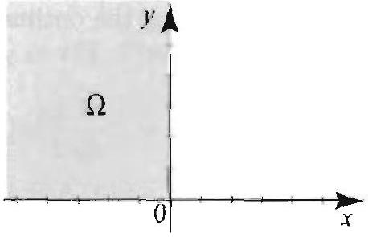

Figure 1
4.

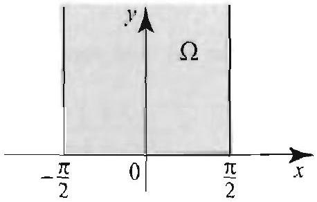

Figure 4

Right margin note (page 79)

689
Neu-
$(x, y)$
y con-
ds.
itted.
he ac:-
at the
$y$.
mann

++++

Section 12.8 Neumann Functions and the Solution of Neumann Problems

Suppose that $\Omega$ is a region with boundary $\Gamma$ and let $N\left(z, z_{0}\right)$ denote ; mann function for $\Omega$, where $z=x+i y$ and $z_{0}=x_{0}+i y_{0}$ are in $\Omega$. If $c$ is a solution to Poisson's equation (8) subject to a Neumann boundar dition (9), then up to an additive constant
$$
u(x, y)=\frac{1}{2 \pi} \iint_{\Omega} h(x, y) N\left(z, z_{0}\right) d x d y-\frac{1}{2 \pi} \int_{\Gamma} N\left(z, z_{0}\right) f(z)
$$

The proof mirrors the proof of Theorem 4, Section 12.3. It will be om
Exercises 12.8
In Forercises 1-6, derive the Neumann function for the region depicted in $t$. companying figure (Figures 1-6).
2.

Figure 2
3.

Figure 3
5.

Figure 5
6.

Figure 6
7. Solution of the Neumann problem in the first quadrant. Show th solution of the Neumann problem
$$
\begin{array}{l}
\nabla^{2} u(x, y)=0, x, y>0 \\
\frac{\partial u}{\partial y}(x, 0)=f(x), \quad \frac{\partial u}{\partial x}(0, y)=g(y)
\end{array}
$$
is
$$
\begin{aligned}
u\left(x_{0} . y_{0}\right)= & \frac{1}{2 \pi} \int_{0}^{\infty} f(x)\left[\ln \left(\left(x-x_{0}\right)^{2}+y_{0}^{2}\right)+\ln \left(\left(x+x_{0}\right)^{2}+y_{0}^{2}\right)\right] d x \\
& +\frac{1}{2 \pi} \int_{0}^{\infty} g(y)\left[\ln \left(x_{0}^{2}+\left(y-y_{0}\right)^{2}\right)+\ln \left(x_{0}^{2}+\left(y+y_{0}\right)^{2}\right)\right]
\end{aligned}
$$
8. Verify the following integral formula, which arises from solutions of Neu

---

<!-- Page 80 -->

Left margin note (page 80)

690
Chapter 12
Green's Fun

Right margin note (page 80)

and and $\left.z, z_{0}\right)$. of the and all

++++

ctions and Conformal Mappings
problems such as the one in the previous exercise: For $a, b \neq 0$,
$$
\begin{array}{l}
\int \ln \left[(x-a)^{2}+b^{2}\right] d x \\
\quad=2(x-a)+2 b \tan ^{-1}\left(\frac{x-a}{b}\right)+(x-a) \ln \left[(x-a)^{2}+b^{2}\right]+C
\end{array}
$$
9. (a) Solve the problem in Exercise 7, given that $g(y)=0$ for all $y> f(x)=1$ if $0<x<1$ and 0 otherwise.
(b) Verify your answer by direct computation.
10. A Neumann function for the unit disk. This function is defined for $z_{0}$ in the unit disk by
$$
N\left(z, z_{0}\right)=\left\{\begin{array}{ll}
\ln \left|z-z_{0}\right|+\ln \left|\frac{1}{\bar{z}_{0}}-z\right|+\ln \left|z_{0}\right| & \text { if } z_{0} \neq 0, \\
\ln |z| & \text { if } z_{0}=0 .
\end{array}\right.
$$

Derive this formula by following the outlined steps.
(a) Write $z_{0}=r e^{i \theta}$ and $z=\rho e^{i \eta}$. Fix $z_{0} \neq 0$ and show that
$$
\begin{aligned}
\left.\frac{\partial}{\partial n} \ln \left|z-z_{0}\right|\right|_{\rho=1} & =\left.\frac{\partial}{\partial \rho} \frac{1}{2} \ln \left|z-z_{0}\right|^{2}\right|_{\rho=1} \\
& =\left.\frac{1}{2} \frac{\partial}{\partial \rho} \ln \left(r^{2}+\rho^{2}+2 r \rho \cos (\theta-\eta)\right)\right|_{\rho=1} \\
& =\frac{1+r \cos (\theta-\eta)}{1+r^{2}+2 r \cos (\theta-\eta)} .
\end{aligned}
$$
(b) Write $\frac{1}{\bar{z}_{0}}=\frac{1}{r} e^{i \theta}$, use (a), and conclude that
$$
\left.\frac{\partial}{\partial n} \ln \left|\frac{1}{\overline{z_{0}}}-z\right|\right|_{\rho=1}=\frac{1+\frac{1}{r} \cos (\theta-\eta)}{\left(\frac{1}{r}\right)^{2}+1+\frac{2}{r} \cos (\theta-\eta)}=\frac{r^{2}+r \cos (\theta-\eta)}{1+r^{2}+2 r \cos (\theta-\eta)}
$$
(c) Use (a) and (b) to show that for $z_{0} \neq 0,\left.\frac{\partial}{\partial n} N\left(z, z_{0}\right)\right|_{|z|=1}=1$.
(d) Verify the remaining properties of the Neumann function for the given $N$
11. Solution of the Neumann problem on the disk. Use the result previous exercise to show that the solution of $\nabla^{2} u(r, \theta)=0$ for $0 \leq r<1 \theta$, given the Neumann condition $\frac{\partial u}{\partial r}(1, \theta)=f(\theta)$, for all $\theta$, is
$$
u(r, \theta)=-\frac{1}{2 \pi} \int_{0}^{2 \pi} f(\eta) \ln \left[1+r^{2}+2 r \cos (\theta-\eta)\right] d \eta
$$

Here $f$ satisfies the compatibility condition $\int_{0}^{2 \pi} f(\theta) d \theta=0$.
