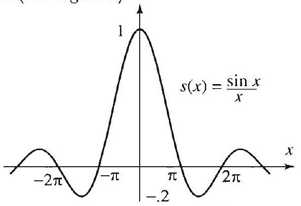
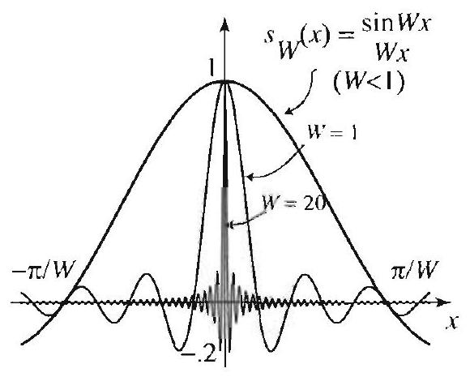
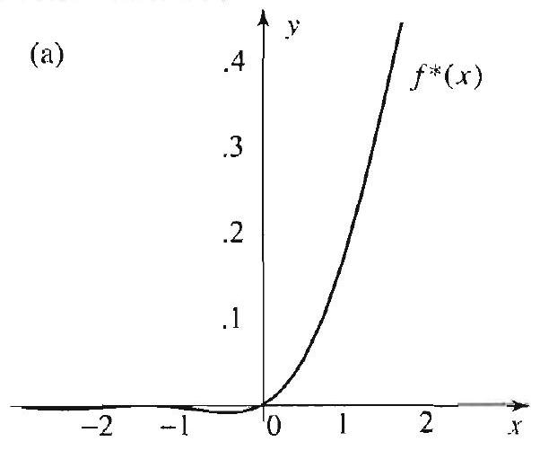
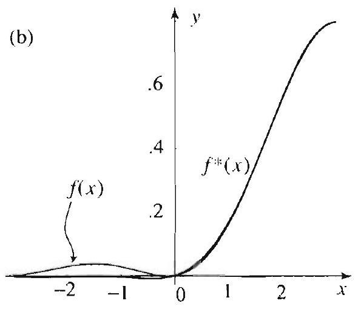
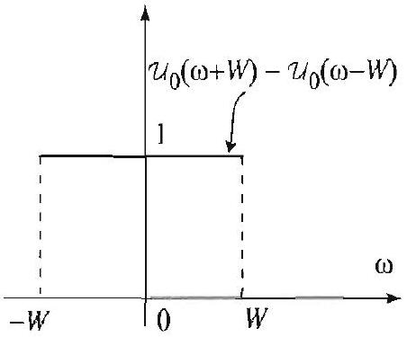
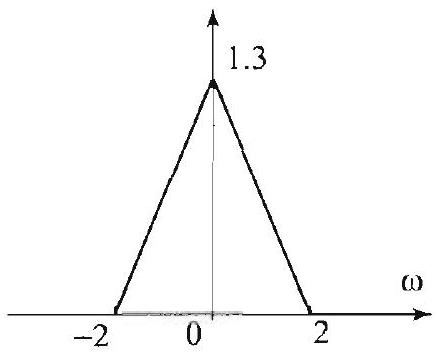

## Topics to Review

This chapter contains numerical techniques for computing the Fourier transform and Fourier series, and for solving boundary value problems. Sections 17.1 and 17.2 deal with the sampling theorem and some of its applications. They are not required for the rest of the chapter. In Section 17.3 we present the discrete and fast Fourier transforms. In stadying this section, it will help to keep in mind the basic properties of the Fourier transform as presented in Section 7.2. Similar properties will be established for the discrete Fourier transform. In Section 17.4 we show a connection between the Fourier transform and the discrete Fourier transform. To appreciate this connection, you need to do the exercises of Section 17.4 which deal with the topies of Sections 7.4 and 7.5.

## Looking Ahead...

This chapter introduces basic ideas that are used in the numerical computation of Fourier transforms. With the availability of the fast Fourier transform algorithm as a standard command in many computer algebra systems, we hope that you will be able to experiment with and appreciate the effectiveness of this important algorithm. We also hope that the sample of applications that you will encounter in this chapter will entice you to explore others from the vast and diverse fields where Fourier transforms are applied.

## 17

> SAMPLING AND DISCRETE FOURIER ANALYSIS WITH APPLICATIONS TO PARTIAL DIFFERENTIAL EQUATIONS

Fundamental progress has to do with the reinterpretation of basic ideas.
-ALFRED N. WHITEHEAD

By now it is clear that the Fourier transform and Fourier series are essential tools in applications. To analyze a function with these tools requires knowledge of the function over a whole interval. In real-world applications, functions are measured over discrete sets of values, and hence they are usually given as sequences of values. To analyze these discrete functions, we will introduce and use the discrete Fourier transform. Among other important applications of the discrete Fourier transform, we will show how we can use it to approximate Fourier transforms and solve boundary value problems.

The discrete Fourier transform became widely used in the 1960s after the discovery of a numerical algorithm that gives a fast and efficient method for computing it. This algorithm is known as the fast Fourier transform. The ideas behind it date back to Gauss. But it was Cooley and Tukey who emphasized its significance to computerbased Fourier analysis.

Another topic covered in this chapter is the sampling theorem. This important result was discovered by the American engineer Claude Shannon in the 1940s. It has numerous applications to transmission and information theory.

### 17.1 The Sampling Theorem

The sampling theorem is a striking result that states that certain functions can be reconstructed completely from a discrete set of measurements or samples taken at equal intervals. This very important result has many interesting applications, some of which will be discussed in the following section. Let us recall the definition of the Fourier transform

$$
\widehat{f}(\omega)=\frac{1}{\sqrt{2 \pi}} \int_{-\infty}^{x} f(x) e^{-i \omega x} d x, \quad-\infty<\omega<\infty
$$

We now define a class of functions by a property of the Fourier transform.

BAND LIMITED FUNCTIONS

It is important to note that only $\widehat{f}$ is required to vanish outside a finite interval and not $f$. Indeed, it can be shown that $f$ and $\widehat{f}$ cannot both vanish off a finite interval.

A function $f(x)$ is called band limited if its Fourier transform $\widehat{f}$ vanishes outside a finite interval. In this case, there is a positive number $W$ such that $\widehat{f}(\omega)=0$ for all $|\omega|>W$. Any such number $W$ is called a band width of $f$.

Although "most" functions are not band limited, we can show that at least all the functions that we have dealt with in this text can be approximated as closely as we want by band limited functions (see Exercises 7 and 8). This makes the class of band limited functions very useful in applications.

We have encountered many band limited functions before. Here is a simple example that will play an important role in our development.

## EXAMPLE 1 A band limited function

(a) The function $s(x)=\frac{\sin x}{x}$ is shown in Figure 1. From the table of Fourier transforms, we find that

$$
\widehat{s}(\omega)= \begin{cases}\sqrt{\frac{\pi}{2}} & \text { if }|\omega|<1 \\ \frac{1}{2} \sqrt{\frac{\pi}{2}} & \text { if } \omega= \pm 1 \\ 0 & \text { if }|\omega|>1\end{cases}
$$

Since $\widehat{s}$ vanishes for all $|\omega|>1$, we conclude that $s$ is band limited with band width 1 (see Figure 2).

Figure 1 The function $\frac{\sin x}{x}$ is band limited with band width 1.

Figure 2 The Fourier transform of $\frac{\sin x}{x}$ vanishes for all $|\omega|>1$.

As $W$ increases, the frequency of $\sin W x$ increases, and this causes the graph of $\frac{\sin W x}{W x}$ to be more wavy and more squished toward the origin (Figure 3). On the Fourier transform side, increasing $W$ has the opposite effect of spreading or stretching the graph.

THEOREM 1
PROPERTIES OF BAND LIMITED FUNCTIONS

Figure 3

Figure 4

(b) Let $W>0$ and consider the function $s_{W}(x)=\frac{\sin W x}{W x}$, which is shown in Figure 3 for various values of $W$. Wo have $s_{W}(x)=s(W x)$, hence $s_{W}$ is a dilate of the function $s$. Again, from the table of Fourier transforms, we find that

$$
\widehat{S_{W}}\left(\omega^{\prime}\right)= \begin{cases}\sqrt{\frac{\pi}{2}} \frac{1}{W} & \text { if }|\omega|<W \\ \frac{1}{2 W} \sqrt{\frac{\pi}{2}} & \text { if } \omega= \pm W \\ 0 & \text { if }|\omega|>W\end{cases}
$$

Since $\widehat{s_{W}}$ vanishes for all $|\omega|>W$, we conclude that $s_{W}$ is band limited with band width W (see Figure 1).

We now list some basic properties of band limited functions that will be useful in building more interesting examples.

Suppose that $a, b$ are constants and $f, g$ are functions.
(a) If $f$ and $g$ are band limited with band widths $W_{1}$ and $W_{2}$, respectively, then $a f+b y$ is band limited with band width $W$ smaller than or equal to the larger of $W_{1}$ and $W_{2}$.
(b) If $f$ is band limited with band width $W$, then the translate of $f$ by $a$, $f(x-a)$, is also band limited with band width $W$.
(c) If either $f$ or $g$ is band limited with band width W , then the convolution $f * g$ is also band limited with band width $W$.
Proof Part (a) is straightforward and is left as an exercise. To prove (b), we simply recall that

$$
\mathcal{F}(f(x-a))(\omega)=e^{-i a \omega} \widehat{f}(\omega)
$$

So, if $\hat{f}$ vanishes for $|\omega|>W$, then clearly the Fourier transform of $f(x-a)$ vanishes for $|\omega|>W$. Finally, (c) is an immediate consequence of the fact that $\widehat{f * g}=\widehat{f g}$.

Recall that the function $s_{W}$ of Example 1 (b) is band limited with band
width $W$. Shifting this function by $n \pi / W$ yields

$$
s_{W}\left(x-\frac{n \pi}{W}\right)=\frac{\sin (W x-n \pi)}{(W x-n \pi)} .
$$

which is also band limited with band width $W$, by Theorem 1(b). Also, by Theorem 1(a), any linear combination of functions of the form (2) is also band limited with band width $W$. The powerful result that we are about to state tells us that a converse of sorts is also true. That is, every band limited function with band width $W$ can be written as an infinite sum of functions of the form (2). Moreover, the coefficients in this sum are precisely the values of the function at an evenly spaced discrete set of sample points.

THEOREM 2 SAMPLING THEOREM FOR BAND LIMITED FUNCTIONS

Suppose that $f$ is band limited with band width $W$. Then for all $x$ we have

Thus $f$ can be constructed completely from its sample values $f\left(\frac{n \pi}{W}\right), n= 0 . \pm 1 . \pm 2, \ldots$.

If $W$ and $W^{\prime}$ are two band widths of $f$ with $W^{\prime}>W$, then the series corresponding to $W^{\prime}$ requires more sample points per unit length than the one for $W$, since $\frac{\pi}{W^{\prime}}>\frac{\pi}{W^{\prime}}$. The least number of sample points per unit length that is required for (3) to hold is called the Nyquist sampling rate and corresponds to the least band width of $f$.

The proof of Theorem 2 is presented in the appendix at the end of this section. By reversing the roles of the function and its Fourier transform in the sampling theorem, we obtain a sampling theorem for time-limited functions. These are functions vanishing outside a finite interval. The precise statement follows. The proof can be reconstructed from that of the sampling theorem by interchanging $f$ and $\widehat{f}$.

Suppose that $f(t)=0$ for all $|t|>T$. Then for all $\omega$ we have

$$
\hat{f}(\omega)=\sum_{n=-\infty}^{\infty} \hat{f}\left(\frac{n \pi}{T}\right) \frac{\sin (T \omega-n \pi)}{(T \omega-n \pi)} .
$$

Thus $\widehat{f}$ is completely determined by sampling at the points $\frac{n \pi}{T} . n= 0, \pm 1, \pm 2, \ldots$.

In the following example we show how to approximate a band limited function using the sampling theorem.

## EXAMPLE 2 Sampling of a band limited function

The initial temperature distribution of a bar, $f(x)(-\infty<x<\infty)$, has band width $W=2$. Some of its values are shown in Table 1.

| $x$ | 0 | $\pi / 2$ | $\pi$ | $3 \pi / 2$ | $2 \pi$ | $5 \pi / 2$ |
| :---: | :---: | :---: | :---: | :---: | :---: | :---: |
| $f(x)$ | .001765 | .382839 | .792567 | .266685 | .0014741 | .03319 |

Table 1

Using the sampling theorem, approximate the initial heat distribution at the points .1, .2, . 8 .

Solution Since $f(x)$ is band limited with band width 2 , we can reconstruct it using (3), by sampling at the points $x=\frac{n \pi}{2}$. Using the values in Table 1, we obtain

$$
\begin{aligned}
f(x) \approx & \sum_{n=0}^{5} f\left(\frac{n \pi}{2}\right) \frac{\sin (2 x-n \pi)}{(2 x-n \pi)} \\
= & .001765 \frac{\sin (2 x)}{2 x}+.382839 \frac{\sin (2 x-\pi)}{2 x-\pi}+.792567 \frac{\sin (2 x-2 \pi)}{2 x-2 \pi} \\
& +.266685 \frac{\sin (2 x-3 \pi)}{2 x-3 \pi}+.0014741 \frac{\sin (2 x-4 \pi)}{2 x-4 \pi}+.03319 \frac{\sin (2 x-5 \pi)}{2 x-5 \pi} .
\end{aligned}
$$

We can now compute the desired values (with the help of a calculator):

$$
f(.1) \approx .0079, \quad f(.2) \approx .0159, \quad f(.8) \approx .1165
$$

The graph of $f^{*}$, the partial sum approximation of $f$, is shown in Figure 5. For comparison's sake, we have also plotted the function $f$ which was used to generate the values in Table 1. (Of course, in real-life applications $f$ is unknown, except for its sampled values.)

Figure 5 Approximation of a band limited function using sample points. We have a better approximation over the interval where the sample points were chosen.

Figure 5(b) shows that the approximation of $f$ by its partial sum is much better on the interval $x>0$ compared to the interval $x<0$. This is to be expected, since all the sample points were chosen from the interval $x \geq 0$.

In the remainder of this section we apply the sampling theorem to compute Fourier transforms of band limited functions, by using only sampled

Figure 6

# THEOREM 4 FOURIER TRANSFORM USING SAMPLING 

values. Before we state the theorem, we recall the Heaviside step function

$$
\mathcal{U}_{0}(\omega)= \begin{cases}1 & \text { if } \omega>0, \\ 0 & \text { otherwise } .\end{cases}
$$

Using translates of this function, we have

$$
\mathcal{U}_{0}(\omega-W)= \begin{cases}1 & \text { if } \omega>W, \\ 0 & \text { otherwise },\end{cases}
$$

and the step function in Figure 6, which is given by

$$
\mathcal{U}_{0}(\omega+W)-\mathcal{U}_{0}(\omega-W)= \begin{cases}1 & \text { if }-W<\omega<W, \\ 0 & \text { otherwise } .\end{cases}
$$

□
Suppose that $f$ is band limited with band width $W$. Then
(5) $\quad \hat{f}(\omega)=\frac{1}{W} \sqrt{\frac{\pi}{2}}\left(\mathcal{U}_{0}(\omega+W)-\mathcal{U}_{0}(\omega-W)\right) \sum_{n=-\infty}^{\infty} f\left(\frac{n \pi}{W}\right) e^{-i n \frac{\pi}{W} \omega}$.

Thus to compute the Fourier transform of a band limited function with band width $W$, we only need to sample the function on a discrete set of points, at a sampling rate of $\pi / W$. In the expression on the right side of (5) the factor $\mathcal{U}_{0}(\omega+W)-\mathcal{U}_{0}(\omega-W)$ vanishes for all $|\omega|>W$, which has the effect of truncating the whole expression on the right side for all $|\omega|>W$.

Proof The idea is to use the sampling theorem to write $f$ as specified by (3), then use (1) to compute the Fourier transform. We have

$$
\begin{aligned}
\hat{f}(\omega) & =\frac{1}{\sqrt{2 \pi}} \int_{-\infty}^{\infty} f(x) e^{-i \omega x} d x \\
& =\sum_{n=-\infty}^{\infty} f\left(\frac{n \pi}{W}\right) \overbrace{\frac{1}{\sqrt{2 \pi}} \int_{-\infty}^{\infty} \frac{\sin (W x-n \pi)}{(W x-n \pi)} e^{-i \omega x} d x}^{\text {Fourier transform of } \sin (W x-n \pi) /(W x-n \pi)} \\
& =\frac{1}{W} \sqrt{\frac{\pi}{2}}\left(\mathcal{U}_{0}(\omega+W)-\mathcal{U}_{0}(\omega-W)\right) \sum_{n=-\infty}^{\infty} f\left(\frac{n \pi}{W}\right) e^{-i n \frac{\pi}{W} \omega} .
\end{aligned}
$$

To justify the last step, you are asked to show that the Fourier transform of $\frac{\sin (W x-n \pi)}{(W x-n \pi)}$ is

$$
\frac{1}{W} \sqrt{\frac{\pi}{2}}\left(\mathcal{U}_{0}(\omega+W)-\mathcal{U}_{0}(\omega-W)\right) e^{-i n \frac{\pi}{W} \omega}= \begin{cases}\frac{1}{W} \sqrt{\frac{\pi}{2}} e^{-i n \frac{\pi}{W} \omega} & \text { if }|\omega|<W, \\ 0 & \text { otherwise }\end{cases}
$$

(see Exercise 5). $\square$

THEOREM 5 FOURIER TRANSFORMS OF EVEN FUNCTIONS USING SAMPLING

Interesting applications of Theorem 4 to boundary value problems are presented in the following section.

The following special case of Theorem 4 is worth noting.
Suppose that $f$ is even and band limited with band width $I I$. Then
(6) $\hat{f}(\omega)=\frac{1}{W} \sqrt{\frac{\pi}{2}}\left(\mathcal{U}_{0}(\omega+W)-\mathcal{U}_{0}(\omega-W)\right)\left[f(0)+2 \sum_{n=1}^{n} f\left(\frac{n \pi}{W}\right) \cos \left(\frac{n \pi}{W}{ }^{\prime}\right)\right]$.

Proof Consider the symmetric partial sums in (5), and add together the terms corresponding to $n$ and $-n$. Simplify, using $f\left(-\frac{n \pi}{W}\right)=f\left(\frac{n \pi}{W}\right)$ and

$$
e^{i n \frac{\pi}{W} \omega}+e^{-i \frac{n \pi}{W} \omega}=2 \cos \left(n \frac{\pi}{W} \omega\right) .
$$

We illustrate the last two theorems with a numerical example.

Figure 7

Figure 8 Approximation of $\widehat{k}$ using three nonzero terms of the sampled series.

## EXAMPLE 3 Computing a Fourier transform using sampling

Let

$$
k(x)=\frac{\sin ^{2} x}{x^{2}}
$$

From the table of Fourier transforms, we have

$$
\widehat{k}(\omega)= \begin{cases}\sqrt{\frac{\pi}{2}}\left(1-\frac{|\omega|}{2}\right) & \text { if }|\omega| \leq 2 \\ 0 & \text { otherwise }\end{cases}
$$

As illustrated in Figure 7, $\widehat{k}$ vanishes outsicle $[-2,2]$, and so $k$ is band limited with band width $W=2$. We will verify the assertion of Theorem 5 by reconstructing the Fourier transform from sample values of $f$. Applying (6),

$$
\widehat{h}(\omega)=\frac{1}{2} \sqrt{\frac{\pi}{2}}\left(\mathcal{U}_{0}(\omega+2)-\mathcal{U}_{0}(\omega-2)\right)\left[1+2 \sum_{n=1}^{\infty} \frac{\sin ^{2}\left(\frac{n \pi}{2}\right)}{\left(\frac{n \pi}{2}\right)^{2}} \cos \left(\frac{n \pi}{2} \omega\right)\right] .
$$

Note that all the terms for even $n$ are zero, except for $n=0$. A pretty good approximation of $\widehat{f}$ is obtained by taking only three nonzero terms from the sum. This partial sum approximation of $\widehat{f}$ is shown in Figure 8. Thus, if we did not know the Fourier transform, we would obtain a pretty good approximation of $\widehat{f}$ by sampling the function at six points: $x=\frac{n \pi}{2}, n=1,2, \ldots, 6$.

## Appendix: Proof of the Sampling Theorem

Since $\hat{f}$ vanishes outside $[-W, W]$, we have by Fourier inversion (Section 7.2, (2))

$$
f(x)=\frac{1}{\sqrt{2 \pi}} \int_{-W}^{W} f(\omega) e^{i \cdots r} d \omega
$$

Also, since $\widehat{f}$ vanishes outside $[-W, W]$, we can extend $\widehat{f}$ periodically (with period $2 W$ ) on the $\omega$-axis and then use a Fourier series (Section 2.6, (3)) to represent it as

$$
\widehat{f}(\omega)=\sum_{n=-\infty}^{\infty} c_{n} e^{i \frac{n \pi}{W} \omega}=\sum_{n=-\infty}^{\infty} c_{-n} e^{-i \frac{n \pi}{W} \omega} \quad(|\omega|<W) .
$$

Using the definition of the Fourier coefficients (Section 2.6, (4)) and (7), we get

$$
c_{-n}=\frac{1}{2 W} \int_{-W}^{W} \widehat{f}(\omega) e^{i \frac{n \pi}{W} \omega} d \omega=\frac{\sqrt{2 \pi}}{2 W} f\left(\frac{n \pi}{W}\right)
$$

Before we finish off the proof, we evaluate one more integral. Keeping in mind Euler's identity ( $e^{i \theta}=\cos \theta+i \sin \theta$ ) and the fact that the integral of an odd function over a symmetric interval about zero is zero, we have

$$
\begin{aligned}
\frac{1}{2 W} \int_{-W}^{W} e^{-i \frac{n \pi}{W} \omega} e^{i \omega x} d \omega & =\frac{1}{2 W} \int_{-W}^{W} e^{i(W x-n \pi) \omega / W} d \omega \\
& =\frac{1}{2 W} \int_{-W}^{W} \cos \left(\frac{W x-n \pi}{W} \omega\right) d \omega \\
& =\frac{\sin (W x-n \pi)}{W x-n \pi}
\end{aligned}
$$

We can now establish (3) as follows:

$$
\begin{aligned}
f(x) & =\frac{1}{\sqrt{2 \pi}} \int_{-W}^{W} \overbrace{\sum_{n=-\infty}^{\infty} c_{-n} e^{-i \frac{n \pi}{W} \omega}}^{\hat{f}(\omega)} e^{i \omega x} d \omega \quad \text { (by (7) and (8)) } \\
& =\frac{1}{\sqrt{2 \pi}} \int_{-W}^{W} \overbrace{n=-\infty}^{\infty} \overbrace{\frac{\sqrt{2 \pi}}{2 W} f\left(\frac{n \pi}{W}\right)}^{c_{-n}}) e^{-i \frac{n \pi}{W} \omega} e^{i \omega x} d \omega \quad \text { (by (9)) } \\
& =\sum_{n=-\infty}^{\infty} f\left(\frac{n \pi}{W}\right) \frac{1}{2 W} \int_{-W}^{W} e^{-i \frac{n \pi}{W} \omega} e^{i \omega x} d \omega \\
& =\sum_{n=-\infty}^{\infty} f\left(\frac{n \pi}{W}\right) \frac{\sin (W x-n \pi)}{W x-n \pi} \quad \text { (by (10)). }
\end{aligned}
$$

## Exercises 10.1

1. Prove Theorem 1, (a) and (c).
2. Use the table of Fourier transforms to decide which of the following functions are band limited. For such functions, determine a band width.
(a) $f(x)=\frac{\sin 2 x}{x}$.
(b) $f(x)=\frac{1-\cos x}{x^{2}}$.
(c) $f(x)=\mathcal{U}_{0}(1-|x|)$.
(d) $f(x)=\frac{\sin ^{4} x}{x^{4}}$.

In Exercises 3-4, you are given the sampled values of a band limited function $f(x)$ and its band width $W$. (a) Use the sampling theorem to construct an approximation of $f(x)$ (see Example 2).
(b) To verify the sumpling theorem, in this part you are also given the function $f(x)$. Plot and compare $f(x)$ and your approximating function that you obtained in (a).
3. (a) $W=4$,

| $x$ | 0 | $\pm \pi / 4$ | $\pm \pi / 2$ | $\pm 3 \pi / 4$ | $\pm \pi$ |
| :---: | :---: | :---: | :---: | :---: | :---: |
| $f(x)$ | -0.05068 | -0.24400 | 1.73064 | 1.92217 | -0.15555 |

(b) $f(x)=\sqrt{\frac{2}{\pi}} \frac{\sin ^{2}(2(x-2))-\sin ^{2}(x-2)}{(x-2)^{2}}$.
4. (a) $W=6$,

| $x$ | 0 | $\pi / 6$ | $\pi / 3$ | $\pi / 2$ | $2 \pi / 3$ | $5 \pi / 6$ | $\pi$ | $7 \pi / 6$ | $4 \pi / 3$ | $3 \pi / 2$ | $5 \pi / 3$ |
| :---: | :---: | :---: | :---: | :---: | :---: | :---: | :---: | :---: | :---: | :---: | :---: |
| $f(x)$ | 3.59 | 0.97 | -0.18 | 0.11 | 0 | 0.04 | -0.05 | 0.02 | 0 | 0.01 | -0.02 |

(b) $f(x)=\frac{4}{3 \sqrt{2 \pi}} \frac{\sin ^{2}(3 x)-\sin ^{2}\left(\frac{3}{2} x\right)}{x^{2}}$.
5. Compute the Fourier transform of $\frac{\sin (W x-n \pi)}{W x-n \pi}$.
6. The table below contains a set of samples of a function $f$ with band width 1 .

| $x$ | $-4 \pi$ | $-3 \pi$ | $-2 \pi$ | $-\pi$ | 0 | $\pi$ | $2 \pi$ | $3 \pi$ | $4 \pi$ |
| :---: | :---: | :---: | :---: | :---: | :---: | :---: | :---: | :---: | :---: |
| $f(x)$ | 0 | 1 | 0 | -1 | 0 | -1 | 0 | 1 | 0 |

Approximate $\widehat{f}$ at the points $\omega=0 . \pm .5, \pm .75, \pm 2$.
Project Problem: Approximation by band limited functions. We mentioned in this section that band limited functions can be used to approximate arbitrary functions as closely as we want. Do Exercises 7 and 8 to justify this result. Exercises 9 and 10 describe alternative proofs.
7. Fejér's kernel. For $n=1,2,3, \ldots$ define

$$
k_{n}(x)=\frac{1}{\sqrt{2 \pi}} n\left(\frac{\sin \left(\frac{1}{2} n x\right)}{\frac{1}{2} n x}\right)^{2}=\frac{4}{\sqrt{2 \pi}} \frac{\sin ^{2}\left(\frac{1}{2} n x\right)}{n x^{2}} .
$$

The function $k_{n}(x)$ is known as a Fejér kernel.
(a) Use the table of Fourier transforms to show that

$$
\hat{k}_{n}(\omega)=\left(1-\frac{|\omega|}{n}\right) \mathcal{U}_{0}(n-|\omega|) .
$$

(b) Plot the graphs of $k_{n}$ for various values of $n$, and describe the behavior of these graphs near 0 , as $n$ increases.
(c) Show that $\lim _{n} . \hat{k}_{n}(\omega)=1$ for all $\omega$.
(d) Plot several graphs to illustrate the result in (c).
8. In this exercise, we suppose that all functions that we are dealing with are defined on the real line and have Fourier transforms.
(a) Let $k_{n}$ be as in Exercise 7. Show that $f * k_{n}$ is band limited.
(b) Use Exercise 7(c) to justify the fact that $\lim _{n \rightarrow \infty} f * k_{n}(x)=f(x)$. Thus $f$ may be approximated by the band limited functions $f * k_{n}$.
9. Abel's kernel For $n=1,2, \ldots$ define

$$
h_{n}(t)=\sqrt{\frac{2}{\pi}} \frac{n}{1+n^{2} t^{2}}
$$

The function $h_{n}$ is known as Abel kernel.
(a) Show that $\hat{h}_{n}(\omega)=e^{-\frac{|\omega|}{n}}$.
(b) Illustrate graphically the fact that as $n \rightarrow \infty$, the graphs of $h_{n}(t)$ are more and more concentrated around the origin, while the graphs of $\widehat{h}_{n}(\omega)$ spread out.
(c) Show that $\lim _{n \rightarrow \infty} \widehat{h}_{n}(\omega)=1$. Based on this result, explain why $\lim _{n \rightarrow \infty} h_{n} * f(x)=f(x)$.
10. De la Vallée Poussin kernel. For $n=1,2, \ldots$ define the de la Vallée Poussin kernel by $v_{n}(t)=2 k_{2 n}(t)-k_{n}(t)$, where $k_{n}$ is Fejér's kernel (Exercise 7). Show the following.
(a) $v_{n}(t)$ is band limited with band width $2 n$.
(b)

$$
\hat{v}_{n}(\omega)= \begin{cases}1 & \text { if }|\omega|<n \\ 0 & \text { if }|\omega|>2 n \\ (-\omega+2 n) / n & \text { if } n \leq \omega \leq 2 n \\ (\omega+2 n) / n & \text { if }-2 n \leq \omega \leq-n\end{cases}
$$

Plot $\widehat{v}_{n}(\omega)$ for $n=1.2, \ldots, 5$. Can you justify calling $\widehat{v}_{n}(\omega)$ a tent function? (c) Obtain the explicit formulas for the de la Vallée Poussin kernel and its Fourier transform

$$
\begin{gathered}
v_{n}(t)=\frac{4}{\sqrt{2 \pi}} \frac{\sin ^{2}(n t)-\sin ^{2}\left(\frac{1}{2} n t\right)}{n t^{2}}, \\
\widehat{v}_{n}(\omega)=(|2 n+\omega|+|2 n-\omega|-|n+\omega|-|n-\omega|) / 2 n
\end{gathered}
$$

(d) Plot the tents $\widehat{v}_{1}(\omega), \widehat{v}_{2}(\omega), \widehat{v}_{4}(\omega)$.
(1) How can you approximate a function by band limited functions using the de la Vallée Poussin kernel? Justify your answer.
