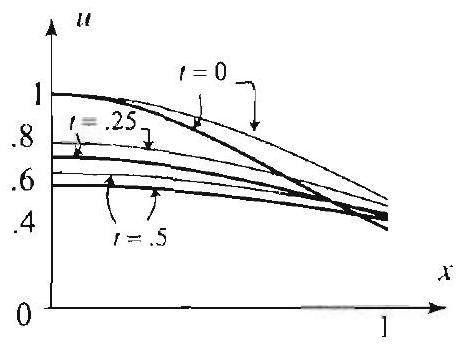

### 17.2 Partial Differential Equations and the Sampling Theorem

In this section, we show how the sampling theorem can be used to solve certain boundary value problems in terms of sample values of initial or boundary data. We illustrate the method by considering the heat equation

$$
\frac{\partial u}{\partial t}=c^{2} \frac{\partial^{2} u}{\partial x^{2}}, \quad-\infty<x<\infty, t>0
$$

with initial temperature distribution

$$
u(x, 0)=f(x)
$$

From (10), Section 7.3, we have the solution

$$
u(x, t)=-\frac{1}{\sqrt{2 \pi}} \int_{-\infty}^{\infty} \widehat{f}(\omega) e^{-c^{2} \omega^{2} t} e^{i \omega x} d \omega
$$

Suppose for now that $f(x)$ is band limited with band width $W$. That is, suppose that $\widehat{f}(\omega)=0$ for $|\omega|>W$. By Theorem 4 of the previous section, we have

$$
\widehat{f}(\omega)=\frac{1}{W} \sqrt{\frac{\pi}{2}}\left(\mathcal{U}_{0}(\omega+W)-\mathcal{U}_{0}(\omega-W)\right) \sum_{n=-\infty}^{\infty} f\left(\frac{n \pi}{W}\right) e^{-i \frac{\pi}{W} n \omega} .
$$

Substituting this in (3), and using the fact that

$$
\mathcal{U}_{0}(\omega+W)-\mathcal{U}_{0}(\omega-W)= \begin{cases}1 & \text { if }|\omega|<W \\ 0 & \text { otherwise }\end{cases}
$$

we obtain

$$
\begin{aligned}
u(x, t) & =\frac{1}{2 W} \int_{-W}^{W}\left(\sum_{n=-\infty}^{\infty} f\left(\frac{n \pi}{W}\right) e^{-i \frac{\pi}{W} n \omega}\right) e^{-c^{2} \omega^{2} t} e^{i \omega x} d \omega \\
& =\frac{1}{2 W} \sum_{n=-\infty}^{\infty} f\left(\frac{n \pi}{W}\right) \int_{-W}^{W} e^{-c^{2} \omega^{2} t} e^{i \omega\left(x-n \frac{\pi}{W}\right)} d \omega
\end{aligned}
$$

Since the innaginary part of $e^{-e^{2}} \omega^{2} e^{i \omega\left(x-n \frac{\pi}{W}\right)}$ is an odd function of $\omega$, its integral over a symmetric interval is 0 . Thus, we obtain the formula

$$
u(x, t)=\frac{1}{W} \sum_{n=-\infty}^{\infty} f\left(\frac{n \pi}{W}\right) \int_{0}^{W} e^{-c^{2} \omega^{2} t} \cos \left(\omega\left(x-n \frac{\pi}{W}\right)\right) d \omega
$$

This useful formula expresses the solution of the heat problem in terms of sample values of the initial temperature distribution $f(x)$. So far we have assumed that $f$ is band limited. In general, even if $f$ is not band limited, its Fourier transform may tond to zero at infinity so fast that we can approximate $f$ very well by a band limited function with an appropriately large value of $W$. In that case, we can still appeal to (5) to obtain an approximation of the solution in terms of sample values of the initial temperature distribution. It should be noted that in this kind of situations (where we are sampling at a few discrete places) there is always a measurement uncertainty. Therefore, the approximation of the solution being band limited is of small importance compared to the uncertainty in the values of $f$ (for large enough $W$ ).

We illustrate these ideas with two numerical examples.

Figure 1 Approximation of $u(x, t)$.

Figure 2

EXAMPLE 1 A heat problem using sampling
(a) Use (5) to solve the initial value problem (1)-(2), where $c=1$, and $f(x)=\frac{\sin ^{2} x}{x^{2}}$.
(b) Approximate your solution by using only a few terms of the series solution in (a), then plot the approximate solution at time $t=0,1,2,3,4$.

Solution (a) We know from Example 3 of the previous section that $f$ is band limited with band width $W=2$. Thus, from (5), we get

$$
u(x, t)=2 \sum_{n=-\infty}^{\infty} \frac{\sin ^{2}\left(\frac{n \pi}{2}\right)}{n^{2} \pi^{2}} \int_{0}^{2} e^{-\omega^{2} t} \cos \left(\omega\left(x-n \frac{\pi}{2}\right)\right) d \omega
$$

Because $\sin ^{2}\left(\frac{n \pi}{2}\right)=0$ for even $n \neq 0$, only the terms with $n=0$ or $n$ odd are nonzero.
(b) By taking a symmetric partial sum with $n$ ranging from -3 to 3 , we obtain

$$
u(x, t) \approx 2 \sum_{n=-3}^{3} \frac{\sin ^{2}\left(\frac{n \pi}{2}\right)}{n^{2} \pi^{2}} \int_{0}^{2} e^{-\omega^{2} t} \cos \left(\omega\left(. x-n \frac{\pi}{2}\right)\right) d \omega
$$

For each value of $t$, the approximate solution is a function of $x$ in terms of intergrals that can be evaluated using a computer system. The graphs of the approximate solution at the desired values of $t$ are shown in Figure 1. As expected, the heat is spreading out and is tending to zero. In Figure 2 we present the graph of the approximate solution as a function of (r.t) over the rectangular region $-k<k< 4,0<t<4$.

In the following example we consider a heat problem with an initial heat distribution that is not band limited. We will show that (5) can still be used to obtain a fairly good approximation of the solution.

## EXAMPLE 2 A heat problem with a Gaussian heat distribution

Consider the initial value problem (1)-(2), where $c=1$ and $f(x)=e^{-x^{2}}$. It can be shown that in this case the exact solution of (1)-(2) is

$$
u(x, t)=\frac{1}{\sqrt{4 t+1}} e^{-\frac{x^{2}}{4 t+i}}, \quad-\infty<x<\infty, t>0 .
$$

(See Exercise 24, Section 7.4.) Since the Fourier transform of $f(x)=e^{-x^{2}}$ is

$$
\hat{f}(\omega)=\frac{1}{\sqrt{2}} e^{-\omega^{2} / 4},
$$

we see that $f$ is not band limited. However, because $\widehat{f}$ tends to zero very fast, we can assume that $f$ is band limited and try a band width $W=2$. (The choice of this value yields satisfactory numerical results. as we show below. If you want more accurate results, you can take a larger value of W.) Now, (5) does not yield the exact solution, but it will give an approximate solution. We have, from (5).

$$
u(x, t) \approx \frac{1}{2} \sum_{n=-\infty}^{\infty} e^{-\left(\frac{n \pi}{2}\right)^{2}} \int_{0}^{2} e^{-\omega^{2} t} \cos \left(\omega\left(x-n \frac{\pi}{2}\right)\right) d \omega
$$

Figure 3 Comparison of the exact solution (thick graphs) to the approximate solution (thin graphs).

By taking a partial sum, we get

$$
u(x, t) \approx \frac{1}{2} \sum_{n=-5}^{5} e^{-\left(\frac{n \pi}{2}\right)^{2}} \int_{0}^{2} e^{-\omega^{2} t} \cos \left(\omega\left(x-n \frac{\pi}{2}\right)\right) d \omega
$$

(Here again, the choice of the partial sum yields a satisfactory numerical approximation of the solution. For better results, you can add more terms from the series.) For each value of $t$, the approximate solution is a function of $x$ in terms of integrals that were evaluated in Example 1, with the help of a computer system. The graphs of the approximate solution at various values of $t$ are shown in Figure 3. For comparison, we have also plotted the exact solution at the same values of $t$. The graphs show that we have obtained a pretty good approximation of the solution. If we want a better approximation, we can repeat the above with a larger value of the band width $W$. $\square$

## Exercises 10.2

1. Repeat Example 1 with $f(x)=\frac{\sin x}{x}$.
2. Repeat Example 2 with $f(x)=\frac{1}{1+x^{2}}$.
3. Project Problem: Poisson integral formula with sampling. In this exercise, we derive an alternative form of the Poisson integral formula ((5), Section 7.5) for band limited functions. The new formula is in terms of sample values of the boundary function.

Suppose that $f$ is band limited with band width $W$. Show that the solution of the Dirichlet problem given by (1) (2). Section 7.5, is

$$
u(x, y)=\frac{1}{W} \sum_{n=-\infty}^{\infty} f\left(\frac{n \pi}{W}\right) \int_{0}^{W} e^{-y \omega} \cos \left(\omega\left(x-n \frac{\pi}{W}\right)\right) d \omega
$$

[Hint: Use the solution of the Dirichlet problem in Section 7.5 to show that

$$
u(x, y)=\frac{1}{\sqrt{2 \pi}} \int_{-\infty}^{\infty} \hat{f}(\omega) e^{-y|\omega|} e^{i \omega x} d \omega
$$

Then use Theorem 4 of the previous section.]
4. (a) Show that $f(x)=\frac{1}{1+x^{2}}$ is not band limited.
(b) Suppose that you want to solve the Dirichlet problem with boundary function $f(x)$ given by (a), by using sampled values of $f$. Since $f$ is not band limited, you cannot use the formula in Exercise 3. However, because the Fourier transform of $f$ tends to 0 very fast, you may assume that $f$ is band limited with band width $W$, where $W$ is to be determined according to the accuracy that you wish to obtain. Follow the same steps as in Example 2, and derive various approximate solutions corresponding to different values of $W$. Plot and compare these solutions with the exact solution

$$
u(x, y)=\frac{1+y}{x^{2}+(1+y)^{2}} .
$$

(Note: This exact solution can be derived using Exercise 6, Section 7.5.)
