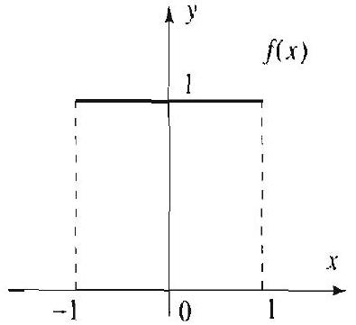
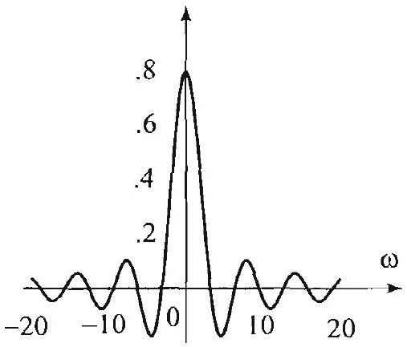
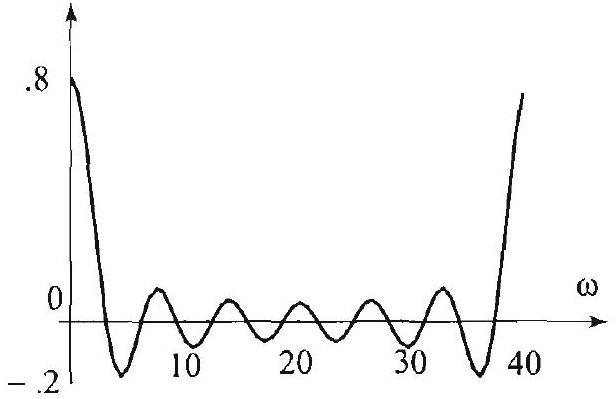
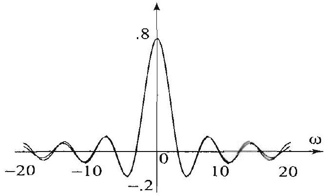

### 17.4 The Fourier and Discrete Fourier Transforms

In this section we show how the Fourier transform can be approximated by the discrete Fourier transform. This will enable us to use the fast Fourier transform to approximate Fourier transforms numerically. The connection that we explore is based on a Riemann sum approximation of the integral defining the Fourier transform

$$
\widehat{f}(\omega)=\frac{1}{\sqrt{2 \pi}} \int_{-\infty}^{\infty} f(x) e^{-i \omega x} d x, \quad-\infty<\omega<\infty
$$

To simplify the presentation, we start with a special case.
CASE I: $f(x)=0$ for all $x<0$. Then (1) becomes

$$
\hat{f}(\omega)=\frac{1}{\sqrt{2 \pi}} \int_{0}^{\infty} f(x) e^{-i \omega x} d x, \quad-\infty<\omega<\infty
$$

Now suppose that the improper integral can be approximated by a definite integral over a finite range as follows:

$$
\hat{f}(\omega) \approx \frac{1}{\sqrt{2 \pi}} \int_{0}^{M} f(x) r^{-i \omega x} d x, \quad-\infty \cdot \omega<\infty
$$

where $M$ is a fixed large number. The larger the value of $M$, the better the approximation of $\widehat{f}$. We now approximate the definite integral by a leftendpoint Riemann sum, with increments $\Delta x=\frac{M}{N}$, where $N$ is the number of subdivisions of the interval $[0, M]$, and get

$$
\begin{aligned}
\widehat{f}(\omega) & \approx \frac{1}{\sqrt{2 \pi}} \frac{M}{N} \sum_{j=0}^{N-1} f\left(j \frac{M}{N}\right) e^{-i \omega j \frac{M}{N}} \\
& =\frac{M}{\sqrt{2 N \pi}} \frac{1}{\sqrt{N}} \sum_{j=0}^{N-1} f\left(j \frac{M}{N}\right) e^{-i \omega j \frac{M}{N}} .
\end{aligned}
$$

Evaluating $\widehat{f}$ at $\omega=\frac{2 \pi k}{M}$, for $k=0,1, \ldots, N-1$, we get

$$
\widehat{f}\left(\frac{2 \pi k}{M}\right) \approx \frac{M}{\sqrt{2 N} \pi} \overbrace{\frac{1}{\sqrt{N}} \sum_{j=1}^{N-1} f\left(j \frac{M}{N}\right) e^{-i \frac{2 \pi k}{N} j}}^{\text {IDFT of }\left(f\left(j \frac{M}{N}\right)\right)_{j=0}^{N-1}}
$$

Comparing this with the definition of the IDFT ((2), Section 17.3), we find that the values of $\widehat{f}\left(\frac{2 \pi k}{M}\right)$ are given by a scalar multiple of the inverse discrete Fourier transform of the sequence $\left(f\left(j \frac{M}{N}\right)\right)_{j-0}^{N-1}$. In symbols, we have
(4) $\quad \hat{f}\left(\frac{2 \pi k}{M}\right) \approx \frac{M}{\sqrt{2 N \pi}} \mathcal{F}_{N}^{-1}\left(f\left(j \frac{M}{N}\right)\right)(k), \quad k=0,1, \ldots, N-1$.

Evaluating $\widehat{f}$ at negative values and using a similar argument, we get

$$
\widehat{f}\left(-\frac{2 \pi k}{M}\right) \approx \frac{M}{\sqrt{2 N \pi}} \mathcal{F}_{N}\left(f\left(j \frac{M}{N}\right)\right)(k), \quad k=0,1, \ldots, N-1
$$

Case II: $f$ is an arbitrary function defined for all $x$. We go back to (1) and choose a very large value of $M$ so that

$$
\hat{f}(\omega) \approx \frac{1}{\sqrt{2 \pi}} \int_{-M / 2}^{M / 2} f(x) e^{-i \omega x} d x, \quad-\infty<\omega<\infty
$$

Splitting the integral and changing variables, we get

$$
\widehat{f}(\omega) \approx \frac{1}{\sqrt{2 \pi}} \int_{M / 2}^{M} f(x-M) e^{-i \omega(x-M)} d x+\frac{1}{\sqrt{2 \pi}} \int_{0}^{M / 2} f(x) e^{-i \omega x} d x
$$

Evaluating at $\omega=\frac{2 \pi k}{M}$, for $k=0,1, \ldots, N-1$, and using the fact that

$$
e^{-i \frac{2 \pi k}{M}(x-M)}=e^{-i \frac{2 \pi k}{M} x} e^{i 2 \pi k}=e^{-i \frac{2 \pi k}{M} x}
$$

we get

$$
\begin{aligned}
\widehat{f}\left(\frac{2 \pi k}{M}\right) \approx & \frac{1}{\sqrt{2 \pi}} \int_{M / 2}^{M} f(x-M) e^{-i \frac{2 \pi k}{M} x} d x \\
& +\frac{1}{\sqrt{2 \pi}} \int_{0}^{M / 2} f(x) e^{-i \frac{2 \pi k}{M} x} d x
\end{aligned}
$$

Caution: This approximation is good only for $k= 0.1, \ldots, N / 2$. See the discussion following Example 1 below, and particularly (12).

Now define a function $g$ by

$$
g(x)= \begin{cases}0 & \text { if } x<0, \\ f(x) & \text { if } 0 \leq x \leq \frac{M}{2}, \\ f(x-M) & \text { if } \frac{M}{2} \leq x \leq M, \\ 0 & \text { if } x>M .\end{cases}
$$

Note that $g$ fits Case I. It is constructed by cutting off $f$ outside $[-M / 2, M / 2]$ and translating the portion over $[-M / 2,0]$ to $[M / 2, M]$. Using (7), we can rewrite the right side of (6) in terms of $g$, as follows:

$$
\begin{aligned}
\widehat{f}\left(\frac{2 \pi k}{M}\right) & \approx \frac{1}{\sqrt{2 \pi}} \int_{0}^{M} g(x) e^{-i \frac{2 \pi k}{M} x} d x \\
& =\frac{1}{\sqrt{2 \pi}} \int_{-\infty}^{\infty} g(x) e^{-i \frac{2 \pi k}{M} x} d x=\tilde{g}\left(\frac{2 \pi k}{M}\right)
\end{aligned}
$$

Since $g$ fits Case I, we can apply (4) to approximate $\widehat{g}$. Thus

$$
\hat{f}\left(\frac{2 \pi k}{M}\right) \approx \frac{M}{\sqrt{2 N \pi}} \mathcal{F}_{N}^{-1}\left(g\left(j \frac{M}{N}\right)\right)(k), \quad k=0,1, \ldots, N-1
$$

This is the formula that we are aiming for. It expresses the Fourier transform of $f$ in terms of an inverse discrete Fourier transform. Notice that the IDFT is really a discrete Fourier transform evaluated at $-k$ for $k=0,1,2, \ldots, N$ 1. There are several important comments to be made about the relative sizes of $M, N$, and $k$. These remarks will be more meaningful as we look at some numerical examples.

In the following example, we use a well-known Fourier transform to test the validity and accuracy of the formulas that we have derived thus far.

## EXAMPLE 1 Approximation of the Fourier transform

Consider the function $f(x)=1$ if $-1<x<1$ and 0 otherwise (Figure 1). We have, from the table of Fourier transforms,

$$
\widehat{f}(\omega)=\sqrt{\frac{2}{\pi}} \frac{\sin \omega}{\omega}, \quad-\infty<\omega<\infty .
$$

Figure 1 Graph of $f(x)$.

Figure 2 Graph of $\hat{f}(\omega)$.

Figure 3 Graph of $g(x)$.

The graph of this transform is shown in Figure 2. Our goal is to use a discrete Fourier transform to approximate $\widehat{f}$. For this purpose, we apply (8) with $N=2^{6}$; $M=10$, and compute the IDFT of the sequence

$$
x=\left(g\left(j \frac{10}{2^{\mathrm{G}}}\right)\right)_{j=0}^{2^{\mathrm{G}}-1},
$$

where $g(x)$ is given by (7). (The graph of $g$ is shown in Figure 3.) This will generate approximate values of the Fourier transform at the points

$$
\omega=\frac{2 \pi k}{10} \quad k=0,1,2, \ldots, 2^{6}-1 .
$$

The resulting values are plotted in Figure 4 and connected by line segments to form a continuous graph. As $k$ ranges from 0 to $2^{6}-1$, the values of $\omega$ vary from 0 to $\frac{2 \pi(63)}{10} \approx 40$. In Figure 5, we superposed the graphs of the Fourier transform and the one in Figure 4, for comparison's sake. Notice that the two graphs are pretty close near 0 , but as we get beyond 20 the approximation gets worse. There is an important reason for this phenomenon. Recall that the IDFT is periodic with period $N$, but the Fourier transform is not. So, in general, it is impossible to get a good approximation past the points $k= \pm N / 2$. Indeed, because of periodicity, we have

$$
\operatorname{IDFT}(x)(-k)=\operatorname{IDFT}(x)(N-k) .
$$

Figure 4 Graph of the IDFT.

Figure 5 Comparison of the IDFT and the Fourier transform.

Thus, we expect the points corresponding to $k=N / 2, N / 2+1, \ldots, N-1$ to yield a good approximation of the Fourier transform at $\omega=\frac{-2 \pi(N-k)}{10}$. This is illustrated in Figure 6, where the portion of the graph in Figure 4, corresponding to the second half of the $\omega$-interval (those values of $\omega$ between 20 and 40), is translated over to the negative $\omega$-axis. In Figure 7 we combined the graphs in Figure 6 and the first half in Figure 5 to form our approximation of the Fourier transform on the interval ( 20,20 ). Finally, in Figure 8 we compared the Fourier transform to our approximation in Figure 7. As you can see, the approximation is quite good over the entire interval. You can obtain better results by increasing $N$ (try $N=2^{10}$ ).

Figure 6

Figure 7

Figure 8

Let us now outline a method for approximating the Fourier transform by the IDFT, following the steps in Example 1.

## DFT Approximation of the Fourier Transform

Step 1: Choose and fix $M I$ and $N$ to prepare for the application of (8). It is customary to choose $V$ to be a power of 2 .
Step 2: Form the function $g$ as described by (7). On the $\omega$-axis, mark the points

$$
\omega=\frac{2 \pi k}{M}, \quad k=0, \pm 1, \ldots, \pm N / 2 .
$$

Step 3: To approximate the Fourier transform at the points $\omega$ corresponding to $k=0,1, \ldots, N / 2$, use ( 8 ).
Step 4: To approximate the Fourier transform at the points $\omega$ corresponding to $k=-1, \ldots,-\frac{N}{2}+1$, use (11). This amounts to using (8) in the following form: For $k=1,2, \ldots, N / 2$,

$$
\widehat{f}\left(-\frac{2 \pi k}{M}\right) \approx \frac{M}{\sqrt{2 N \pi}} \mathcal{F}_{N}^{1}\left(g\left(j \frac{M}{N}\right)\right)(N-k) .
$$

Step 5: For better results, repeat Steps $1-4$ with larger values of $M$ and $N$. The methods of this section can be applied to develop numerical techniques for approximating Fourier series and convolution of functions by using the IDFT. These important techniques are described in the exercises.

## Exercises 10.4

In Exercises 1-4, find $\hat{f}$ in the table of Fourier transforms and then compute its approximation as we did in Example 1. Plot and compare the graphs of $\hat{f}$ and its approximation.

1. $f(x)=e^{-x^{2}}$.
2. $f(x)=e^{-|x|}$.
3. $f(x)=\frac{\sin ^{2} x}{x^{2}}$.
4. $f(x)=\frac{1}{1+x^{2}}$.
5. Approximation of the convolution by the DFT. Let $f$ and $g$ be two functions defined on the real line, and recall from Section 7.2, (3), the formula for the convolution: $f * g(x)=\frac{1}{\sqrt{2 \pi}} \int_{-\infty}^{\infty} f(x-t) g(t) d t$.
(a) Pick a large number $M$ so that $f * g(x) \approx \frac{1}{\sqrt{2 \pi}} \int_{-M}^{M} f(x-t) g(t) d t$. Using a left-endpoint Riemann sum approximation, argue that

$$
f * g(x) \approx \frac{2 M}{N \sqrt{2 \pi}} \sum_{j=0}^{N-1} f\left(x-t_{j}\right) g\left(t_{j}\right),
$$

where $t_{j}=-M+j \frac{2 M}{N}$.
(b) Let $\boldsymbol{f}=\left(f\left(t_{j}\right)\right)_{j=0}^{N-1}, \boldsymbol{g}=\left(g\left(t_{j}\right)\right)_{j=0}^{N-1}$. Extend both sequences periodically, with period $N$. For $m=0, \pm 1, \pm 2, \ldots$, let $x_{m}=m \frac{2 M}{N}$. Show that $f\left(x_{m}-t_{j}\right)= \boldsymbol{f}\left(t_{m-1}\right)$. (Here we are using the notation $\boldsymbol{f}\left(x_{m}\right)$ instead of $\boldsymbol{f}(m)$, since the former is more suggestive.) Conclude that

$$
f * g\left(x_{m}\right) \approx \frac{2 M}{\sqrt{2 \pi N}} f * g\left(x_{m}\right)
$$

This formula provides a way to approximate the convolution of two functions using the DFT, since we know that convolutions of two sequences can be evaluated using the DFT.
In Exercises 6-7, compute $f * g$ directly and then approximate $f * g$ using the results of Exercise 5. Plot and compare the graphs of the function $f * g$ and its approximation.
6. $f(x)=g(x)=\mathcal{U}_{0}(x+1)-\mathcal{U}_{0}(x-1)$ (see Section 7.2, Example 3).
7. $f(x)=x e^{-x^{2}}, g(x)=e^{-x^{2}}$ (see Section 7.2. Exercise 45).
8. Relationship between Fourier series and the DFT. Throughout this exercisc. we will be dealing with the complex form of Fourier series (Section 2.6). Suppose that $f$ is a $T$-periodic function, and let $c_{k}$ denote the Fourier coefficient of $f$ (see (4), Section 2.6).
(a) Show that $c_{-k} \approx \frac{1}{N} \sum_{j=0}^{N-1} f\left(j \frac{T}{N}\right) e^{2 \pi i j k / N}$.
(b) Let $f=\left(f\left(j \frac{T}{N}\right)\right)_{j=0}^{N-1}$. Show that $c_{-k} \approx \frac{1}{\sqrt{N}} \mathcal{F}_{N}(f)(k)$, and likewise $c_{k} \approx \frac{1}{\sqrt{N}} \mathcal{F}_{N}^{-1}(f)(k)$. (As a rule of thumb, this formula is good for $|k| \leq N / 8$.)
(c) Conclude that $f(x) \approx \frac{1}{\sqrt{N}} \sum_{|k| \leq N / 8} \mathcal{F}_{N}^{-1}(\boldsymbol{f})(k) e^{2 \pi i k x / T}$.

In Exercises 9-10, test the validity of the rrsults of Exercise 8 by plotting $f$ and its approximation given by Exercise 8(c).
9. $f(x)=\frac{1}{2}(\pi-x)$ for $0<x<2 \pi, T=2 \pi$.
10. $f(x)=\sin x$ for $-\pi<x<\pi, T=2 \pi$.
